+++
author = "Andrés Del Cerro"
title = "CVE-2024-57725"
date = "2025-02-14"
description = ""
tags = [
    "Cybersecurity",
    "Penetration Testing",
    "Web Hacking",
    "CVE",
    "Informative",
    "CVE-2024-57725",
    "Arcadyan",
    "Livebox Fibra"
]

+++

# CVE-2024-57725

## Introducción
¡Hola, comunidad! 👋

Hoy traigo un nuevo artículo que seguro les interesará, especialmente a los apasionados por la ciberseguridad y el hacking ético. Recientemente, he estado investigando una vulnerabilidad en los routers **Arcadyan Livebox Fibra PRV3399B_B_LT**, utilizados por muchos usuarios en España a través de **Jazztel y Orange**.

Este fallo permite modificar el **enlace GPON sin autenticación**, lo que podría dejar sin conexión a los usuarios afectados. Además, el router expone la contraseña GPON a través de un endpoint sin protección.

Lo más preocupante de todo esto no es solo la existencia de la vulnerabilidad, sino la falta de respuesta por parte de los fabricantes y proveedores de servicios, a pesar de los intentos de divulgación responsable.

En el artículo explico con detalle la falla, el proceso de reporte y los obstáculos que he encontrado en el camino. ¡Espero que lo disfruten y, como siempre, estaré atento a sus comentarios y opiniones! 🚀

## Falta de Respuesta y Riesgo para los Usuarios
En el mundo de la ciberseguridad, la responsabilidad de fabricantes y proveedores de servicios es clave para proteger a los usuarios de posibles ataques. Sin embargo, cuando una vulnerabilidad es ignorada, el riesgo se traslada directamente a quienes dependen de estos dispositivos para su conexión a Internet.

En este artículo, expongo una **vulnerabilidad** detectada en los routers **Arcadyan Livebox Fibra PRV3399B_B_LT** (no está testeada en otros modelos), utilizados por miles de clientes de **Jazztel** y **Orange** en España. La falla permite a un atacante, con acceso local o mediante ciertas condiciones remotas, **modificar el enlace GPON sin autenticación**, lo que puede interrumpir el servicio de Internet de la víctima. Además, la configuración del router expone el **GPON link value** en un endpoint sin protección, facilitando su extracción.

A pesar de haber seguido un proceso de **divulgación responsable**, notificando tanto a Arcadyan como a Jazztel y pidiendo asesoramiento a **INCIBE** (Instituto Nacional de Ciberseguridad de España), la vulnerabilidad sigue sin resolverse y las entidades responsables han ignorado las advertencias.

Este artículo no solo documenta la vulnerabilidad con detalles técnicos y pruebas de concepto, sino que también denuncia la **falta de acción** de las empresas implicadas y resalta la importancia de exigir mayor compromiso en la seguridad de los dispositivos conectados.

Antes de continuar, quiero exponer mi queja por partes a estas entidades, ya que de verdad que me parece inaceptable lo ocurrido.

### **Arcadyan: Fabricante que Ignora las Advertencias de Seguridad**

Arcadyan, como fabricante del dispositivo, tiene la responsabilidad de garantizar la seguridad de su hardware y software. A pesar de haber intentado contactar con su equipo de seguridad, no he recibido respuesta ni he observado ninguna iniciativa para corregir el problema. Ignorar una vulnerabilidad que permite **modificar el enlace GPON sin autenticación y causar una interrupción del servicio de Internet** es inaceptable, ya que deja a miles de usuarios expuestos a posibles ataques.

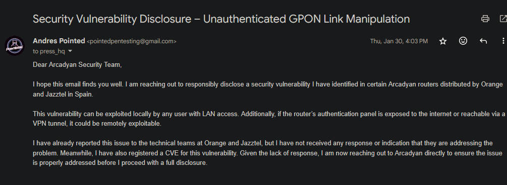
Correo sin respuesta por parte de Arcadyan.
### **Jazztel: Falta de Respuesta y Acción ante un Problema que afecta a sus clientes**

Desde el **5 de enero de 2025**, he intentado comunicarme con el equipo de soporte técnico de **Jazztel** para informar sobre una vulnerabilidad crítica en los routers **Arcadyan Livebox Fibra PRV3399B_B_LT**, que permite modificar el **enlace GPON sin autenticación** y, en consecuencia, interrumpir el servicio de Internet de los usuarios afectados.
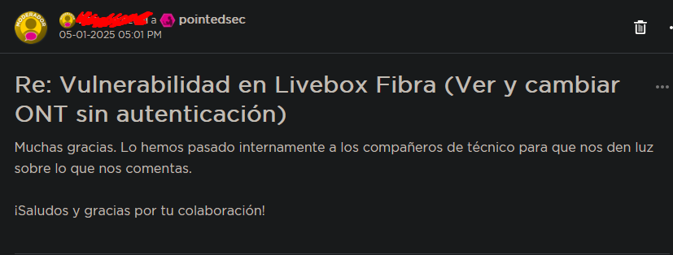

Inicialmente, el equipo de soporte mostró interés y me aseguraron que el problema sería escalado internamente. Sin embargo, con el paso de los días, las respuestas se volvieron vagas y evasivas. Tras múltiples intentos de seguimiento, la única información recibida fue que **"el equipo técnico aún no ha dado una respuesta"** o que **"estos temas suelen ser derivados para investigación y, si encuentran algo, lo solucionan en una actualización de seguridad"**.
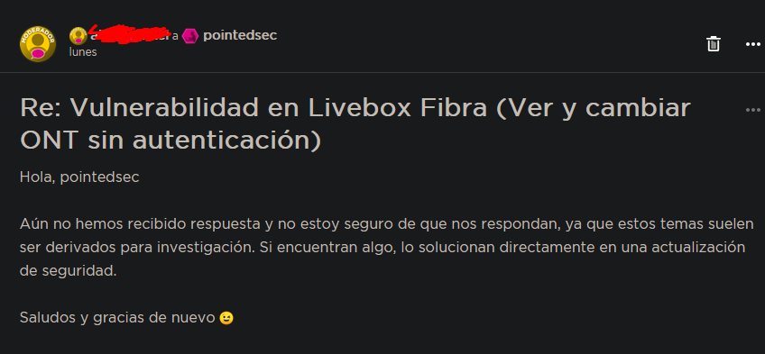

Esta falta de transparencia y comunicación no solo demuestra una actitud poco profesional, sino que también **pone en riesgo el servicio de miles de usuarios** que siguen expuestos a esta vulnerabilidad. Como investigador de seguridad, he intentado realizar una divulgación responsable, dando tiempo suficiente para que el problema se solucione antes de hacerlo público, pero el **silencio por parte de Jazztel es inaceptable**.

La vulnerabilidad que he reportado no solo representa un **riesgo para el servicio de los usuarios**, sino también para **Jazztel/Orange como empresa**. Si un atacante modifica el enlace GPON de un router afectado, **la conexión a Internet del cliente se perderá por completo**, y lo más grave es que **esta incidencia no puede resolverse de forma remota**.

Al no contar con un mecanismo de autenticación para proteger la configuración del GPON, una vez que se altera, la única solución es que un **técnico se desplace físicamente al domicilio del cliente** para reconfigurar manualmente el dispositivo o, en algunos casos, reemplazarlo por completo.

Este problema implica **un coste operativo enorme** para la compañía, ya que:

- **Cada incidencia requiere asistencia técnica presencial**, lo que incrementa significativamente los gastos en personal y logística.
- **Aumenta la carga sobre el servicio de atención al cliente**, ya que los usuarios afectados reportarán la pérdida de conexión sin una solución inmediata.
- **Genera una mala experiencia de usuario**, lo que puede llevar a que los clientes desconfíen del servicio y consideren cambiar de proveedor.
### **INCIBE: Una Respuesta Insatisfactoria**

Como última instancia, recurrí al Instituto Nacional de Ciberseguridad de España (**INCIBE**), con la esperanza de que intervinieran para facilitar la corrección de esta vulnerabilidad. Lamentablemente, la respuesta de INCIBE fue insuficiente y no se tomaron medidas efectivas para asegurar que Arcadyan o Jazztel abordaran el problema. Si una entidad gubernamental encargada de la ciberseguridad no actúa ante una vulnerabilidad con implicaciones directas en la infraestructura de Internet en España, ¿qué garantías existen para la protección de los usuarios?

### **Conclusión: Una Vulnerabilidad Ignorada que Afecta a Miles de Usuarios**

A pesar de seguir un proceso de divulgación responsable, Arcadyan, Jazztel e INCIBE han decidido ignorar este problema. Publicar esta información se convierte en una **necesidad ética y técnica**, no con el propósito de explotar la vulnerabilidad, sino para exponer la falta de respuesta de las entidades responsables y generar presión para que finalmente tomen medidas. La seguridad de los usuarios no debería depender del azar ni de la voluntad de empresas que parecen priorizar el silencio sobre la responsabilidad.

# Explicación de la vulnerabilidad
## Contraseña ONT filtrada sin necesidad de autenticación
Empecemos por el principio, aquí tenemos el panel de autenticación del router en cuestión, router que llevo teniendo desde hace años en mi domicilio. Simple, para acceder al router debes de poner el nombre de usuario (por defecto `admin`) y la credencial que por defecto es la misma que la clave del WIFI, esta credencial por supuesto la podemos cambiar que sería lo suyo.
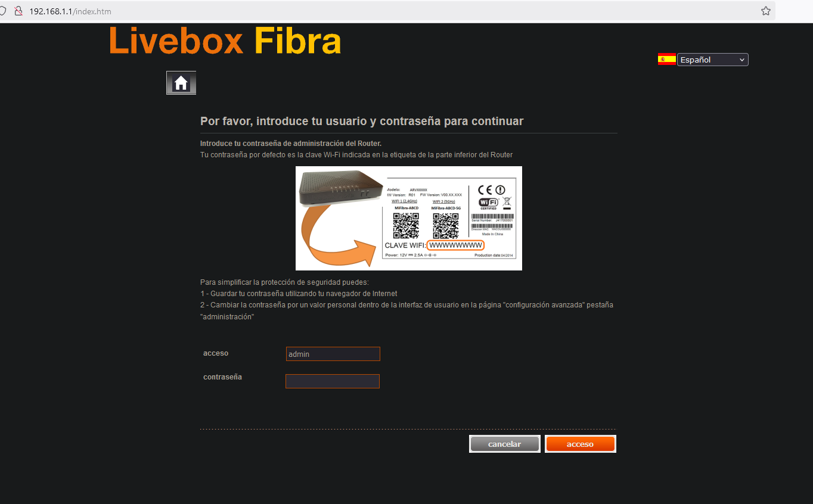

Podemos comprobar el modelo de mi router una vez accediendo al panel de autenticación.
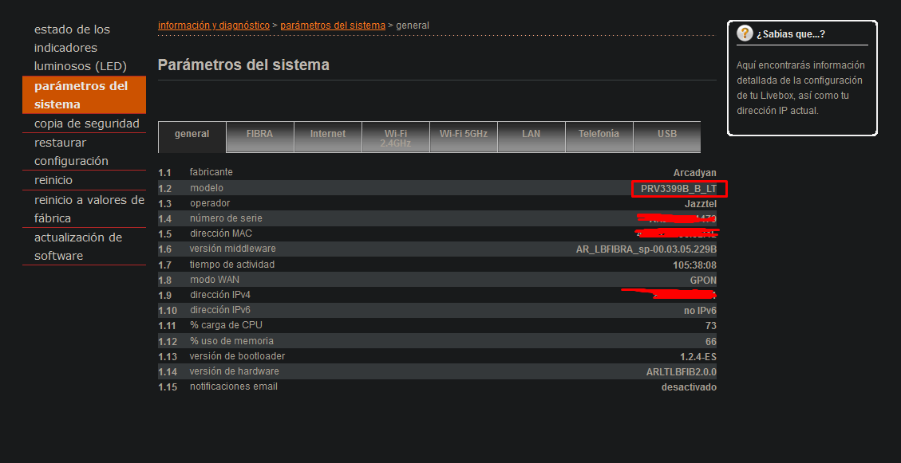

Y otras compañías no, pero Jazztel si que hace publico la contraseña de ONT que sería el GPON, esto se hace para que el cliente pueda prescindir del router de la compañía si es deseado y pueda utilizar su propio router. Esta contraseña de ONT es visible desde el panel de gestión del router obviamente necesitando credenciales para ello.
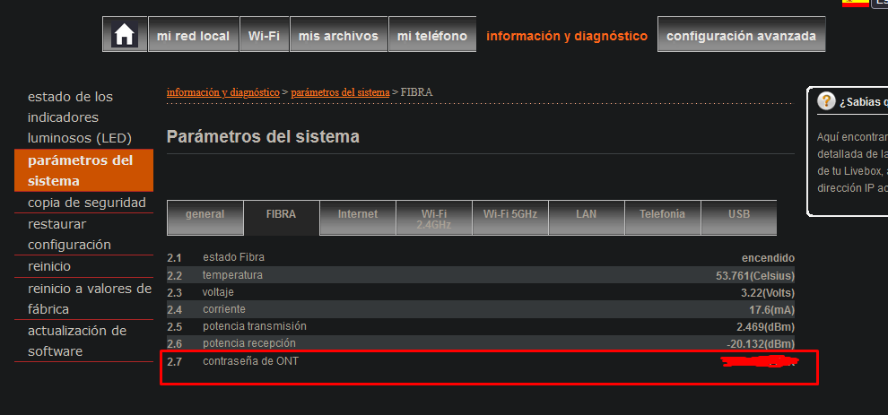

Sin embargo, interceptando las peticiones con `burpsuite` un día, me di cuenta de que existe un recurso `/cgi/cgi_authpage.js` el cual revela un valor llamado `slid_value`. Este endpoint está disponible sin autenticación.
También existen otros parámetros disponibles como `last_local_login` que revela cuando ha sido la última vez que un usuario se ha autenticado en el panel, o el valor de `last_helpdesk_login` que revela cuando ha sido la última vez que un trabajador de la compañía ha accedido a tu router.
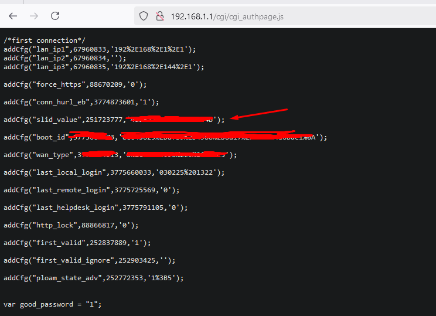

Volviendo al `slid_value`, este valor es simplemente una cadena en hexadecimal que si la convertimos a ASCII podemos ver una cadena que me resulta similar. Es la contraseña de la ONT, es la misma contraseña de ONT que hemos podido observar en el panel de gestión del router.
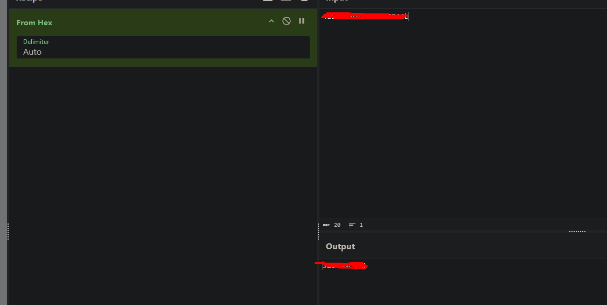

Ahora bien, este valor ¿para que nos vale?
El valor de la contraseña GPON (Gigabit Passive Optical Network) es un dato **crítico** en la configuración del router, ya que es **el identificador único** que permite a un dispositivo autenticarse en la red de fibra óptica de un proveedor de Internet. Básicamente, es el equivalente a las credenciales de acceso que permiten que un router se conecte al servicio del ISP.

Con este valor podríamos clonar la conexión en otro dispositivo, ya que un atacante podría configurar otro dispositivo ONT con esa misma clave y autenticarse en la red del proveedor como si fuera el usuario legítimo, aunque se deben de dar una serie de condiciones que no es muy fácil que se den, por lo cual por ahora esto tiene un muy bajo impacto y es un riesgo asumible para la compañía.

## Cambiando el valor de la contraseña ONT sin necesidad de autenticación
Ahora bien, imaginemos que podemos cambiar el valor de la contraseña ONT también sin autenticación, ¿Cuál sería el impacto? Básicamente un atacante podría acontecer una denegación de servicio al internet del cliente.
- Cambiando el GPON a un valor incorrecto, el router perderá la autenticación con la red del proveedor y **quedará sin acceso a Internet hasta que se reconfigure manualmente**.
- Como esta configuración no puede restablecerse de forma remota, **el usuario afectado necesitaría asistencia técnica presencial**, lo que representa un coste adicional para la operadora.

Y ahí es cuando entra en juego este recurso. `/firstconnection.htm`
Por casualidad me tope con el siguiente recurso, donde carga un sitio web donde se revela también la contraseña de la ONT sin necesidad de autenticación. Acto seguido y muy rápidamente carga un pop-up donde muestra que `La contraseña ONT introducida es correcta`  y se redirecciona al usuario al panel de autenticación.

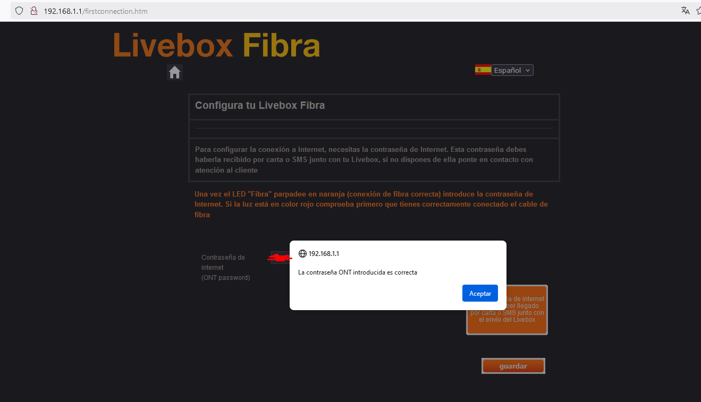

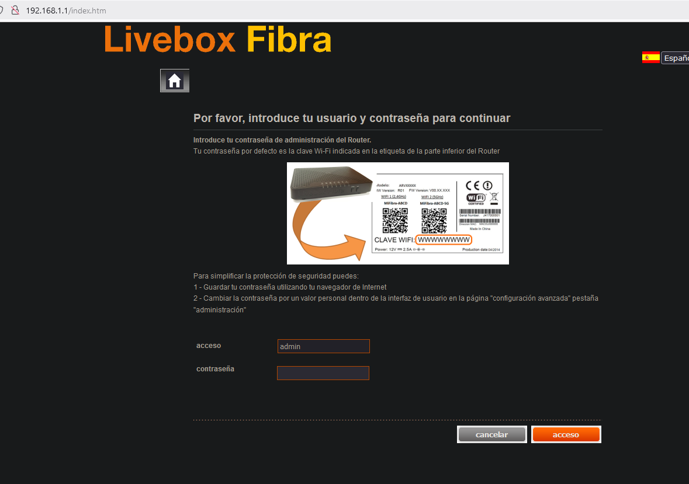

Ahora bien, utilizando `burpsuite` paré la redirección hacia el panel de autenticación, y decidí darle al botón de `guardar`, esto generó la siguiente petición.
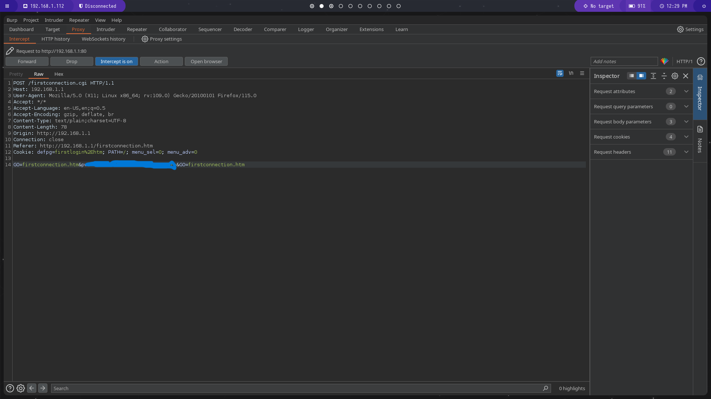

Se realiza una petición de tipo `POST` a `/firstconnection.cgi` donde se le pasa una serie de parámetros, uno de ellos es el parámetro `pwd` donde se establece la contraseña ONT a guardar primero en hexadecimal y luego codificada en Base64.
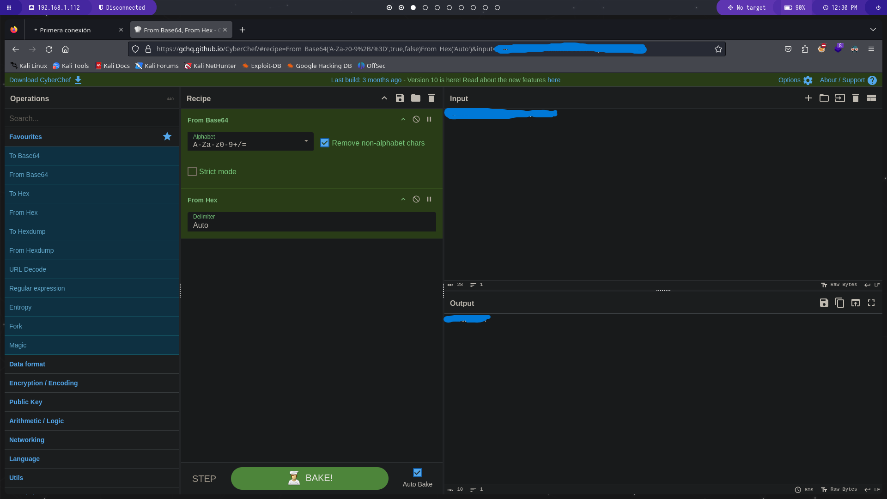

Para terminar, esta petición concluye redireccionando al usuario al panel de autenticación de nuevo para que inicie de sesión.
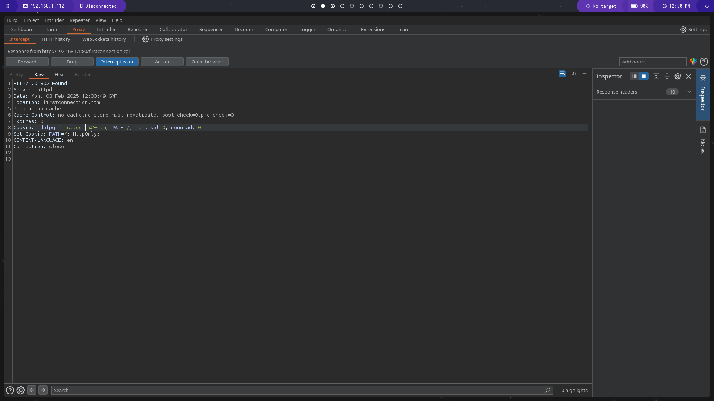

Una vez terminada la petición, podemos comprobar que nos hemos quedado sin servicio de Internet momentáneamente ya que el router está volviendo a hacer el proceso de enlace para el servicio del Internet con la nueva contraseña ONT.
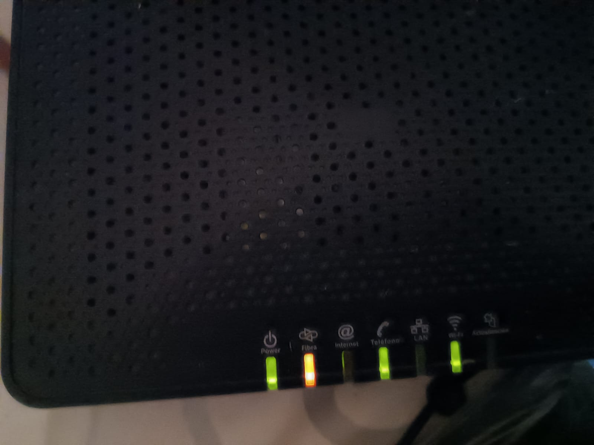

Al cabo de un rato, volvemos a ganar el servicio de Internet y aquí nada ha pasado.

![[unos_segundos.jpeg]]

Ahora bien, me llamo la atención varias cosas de esto, primero que como podéis ver en ningún momento se está pasando una cookie de sesión o algún token que sirva para autenticar al usuario, simplemente la petición está siendo procesada y aceptada por el router.

Al investigar un poco me encontré varios artículos y preguntas de la comunidad que revelan información relevante. Entre ellos [este de aquí](https://comunidad.orange.es/t5/Mi-Fibra-ADSL/TUTORIAL-Como-activar-el-livebox-6-si-no-tienes-la-clave-ONT-GPON/td-p/672839) donde se muestra que para conseguir la ONT originalmente debes iniciar sesión en el panel de autenticación, algo que nos hemos saltado.

Y que además para poder configurar la contraseña de la ONT primero deberíamos reestablecer el dispositivo a valores de fábrica (algo que como se puede ver no es necesario). Después supuestamente deberíamos conectarnos a un puerto LAN del router (algo que tampoco es necesario ya que la petición de cambio de contraseña ONT la he realizado desde mi portátil conectado mediante WIFI a la red). Para terminar deberíamos de autenticarnos como usuario `admin` y como contraseña la clave WIFI (algo que tampoco ha hecho falta).

> Si el router es de segunda mano lo primero será reestablecerlo a valores de fábrica introduciendo un objeto punzante por el orificio _Reset_ que verás en la parte posterior del LiveBox entre el USB y el cable de alimentación y mantenerlo pulsado durante al menos 10 segundos.
> 
> 1. Entramos a [http://192.168.1.1/firstconnection.htm](http://192.168.1.1/firstconnection.htm) desde un ordenador conectado a uno de los puertos LAN del router
> 2. Introducimos como usuario admin y como contraseña la clave que aparece en la etiqueta del router como _Clave wifi_.
> 3. En el campo _Contraseña de internet_ escribiremos la clave GPON y le daremos a _Guardar_

Entonces, ¿Qué está pasando?

Pasa que por alguna razón han decidido que como medida de protección, bastaba con redireccionar al usuario utilizando JavaScript al panel de autenticación sin realizar ninguna validación de seguridad en el "backend" del router si algún usuario intenta cambiar la contraseña del GPON una vez establecida, muy buena idea 👏

### Estableciendo una contraseña ONT que no es válida

Ahora bien, ¿y si creamos una contraseña ONT que no sea válida en el formato que se nos está pidiendo e intentamos cambiar la contraseña ONT del router?

Por probar, podemos utilizar la siguiente cadena:
```
MDAwMDAwMDAwMDAwMDAwMDAwNjE=
```

Esta cadena es un carácter `a` pero dejando otros 9 caracteres de espaciado, ya que la contraseña de la ONT debe de ser de 10 caracteres en ASCII.
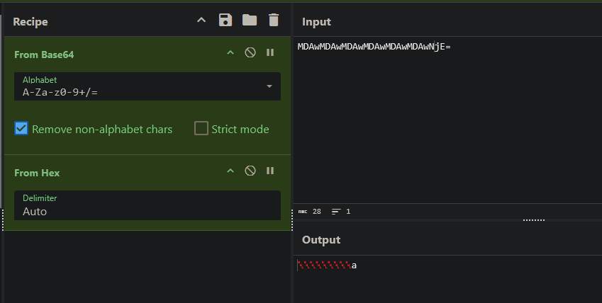

Podemos probar a hacer la solicitud utilizando el endpoint que hemos encontrado antes.
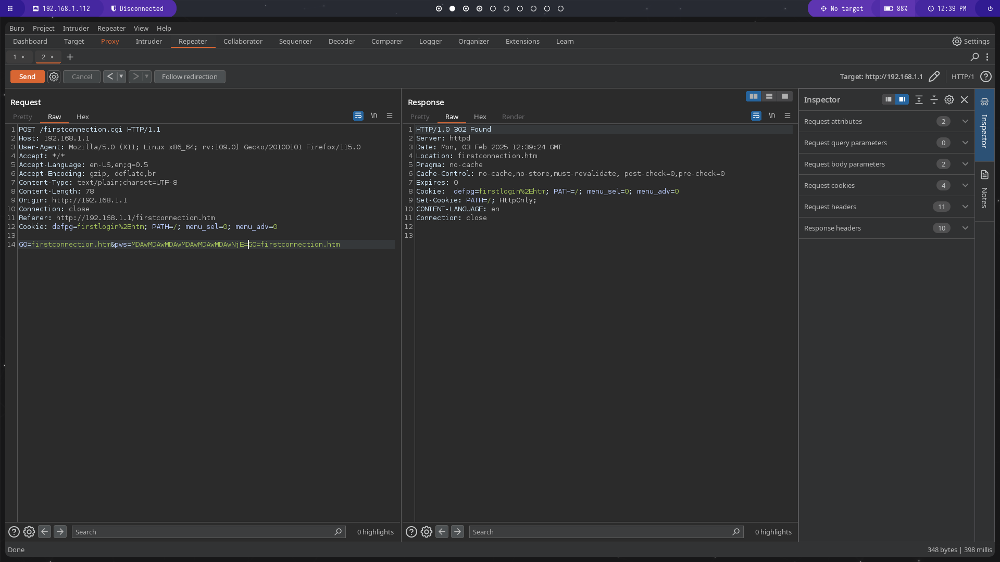

Y al comprobar ahora el campo de `contraseña de ONT` desde el panel de gestión del router, vemos lo siguiente. Hemos cambiado el GPON a uno que obviamente no es válido y hemos dejado al cliente sin servicio de Internet.
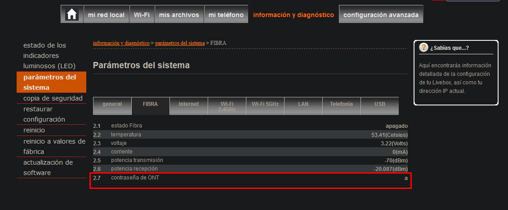

Obviamente, podemos intentar buscar cualquier sitio web que no tenemos servicio de Internet. Además esta denegación de servicio persiste reiniciando el router y si reestablecemos el router de valores de fábrica tendríamos que introducir otra vez la contraseña ONT correspondiente y no creo que un cliente haya hecho una copia de seguridad de su contraseña ONT, quizás si pero no es lo común.
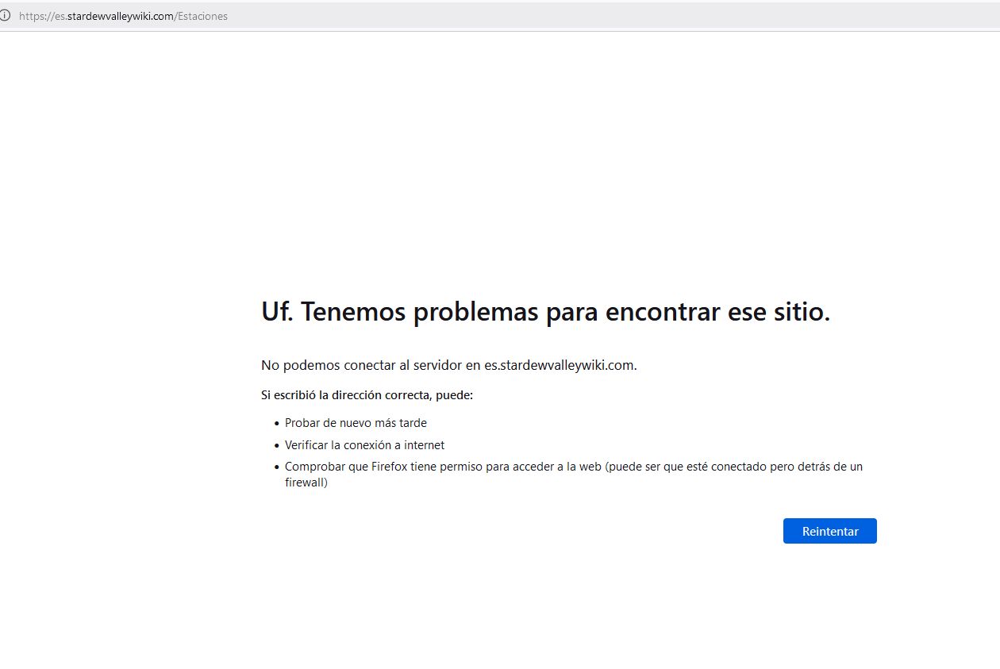

## Demostrando el impacto
En un principio pensé que esta vulnerabilidad tendría un muy bajo impacto ya que el atacante debe de estar en la red WIFI del cliente, por lo cual solo podría explotarse en caso de redes públicas que utilizase el router de la compañía o que de alguna forma se pueda llegar a el (muy poco común), WIFI de invitados, que un "amigo" te quiera dejar sin servicio de Internet... Entonces quise comprobar mediante una pequeña prueba, si exponiendo el panel de autenticación mediante `ngrok` a Internet podemos seguir realizando el cambio del GPON.

Simplemente voy a hacer accesible el panel de autenticación de mi router a Internet mediante un punto de acceso que va a generar `ngrok`, esta es una pequeña prueba sin mucho sentido, ya que el tráfico que vería llegar el router debe de ser como si fuera proveniente de mi portátil, pero por probar...


Entonces ahora, la URL en `Forwarding` corresponde al panel de autenticación de mi router y podemos acceder a ella mediante una red externa que no sea mi red local. Este forwarding lo estoy haciendo desde mi máquina virtual de kali que está conectada a mi red local.
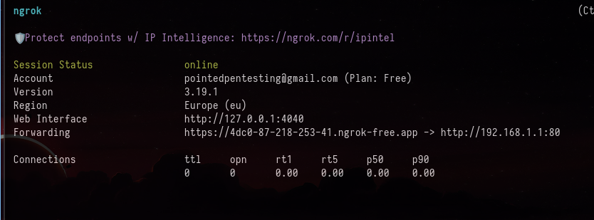

Ahora, podemos por ejemplo crear un punto de acceso desde el móvil para poder acceder al panel de autenticación del router sin necesidad de estar en la red local.
![[red_compartida.jpeg]]

Y efectivamente, podemos acceder al punto donde se expone la contraseña ONT sin autenticación igualmente.
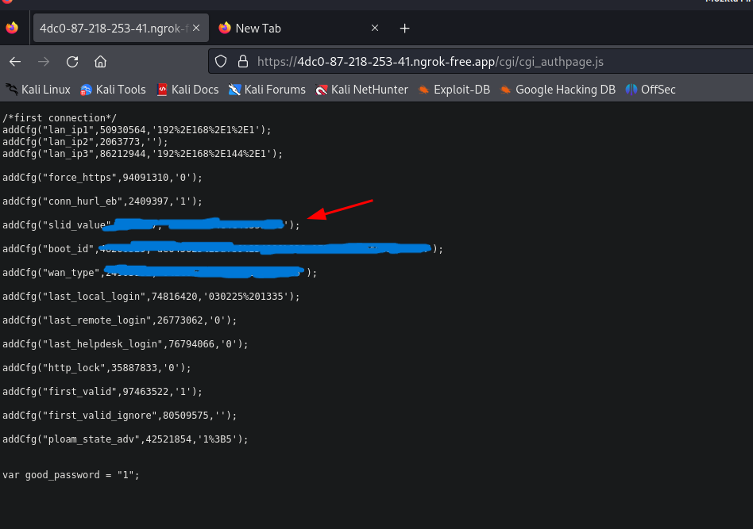

Y también podemos cambiar nuestra contraseña ONT de forma remota y sin autenticación.
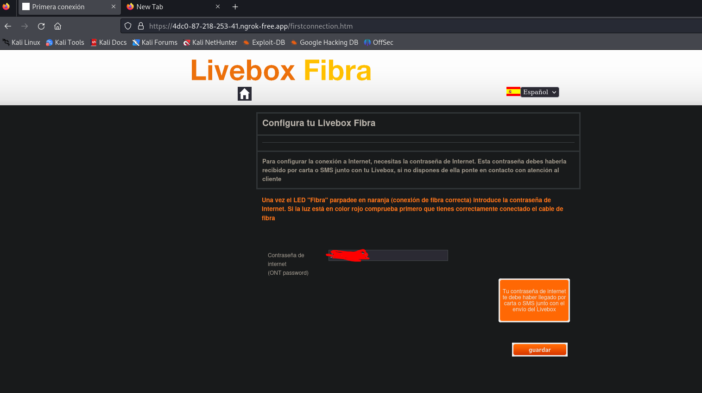

He creado una pequeña PoC en Python para poder cambiar el valor de la contraseña ONT de forma mas rápida y sencilla. [Podéis echarle un ojo aquí](https://github.com/pointedsec/CVE-2024-57725/blob/main/change_ont_value.py).
Simplemente cambiamos el valor de `ROUTER_IP` y ponemos nuestra URL de `ngrok`
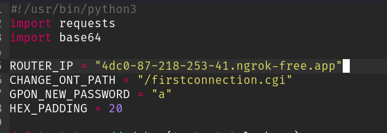

Y podemos ejecutar el script, unos segundos mas tarde podemos ver...
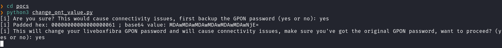

Que efectivamente, hemos cambiado la contraseña ONT "desde fuera" de nuestra red local.
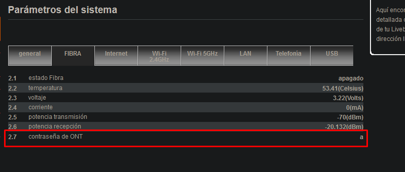

Y obviamente nos hemos vuelto a quedar sin servicio de Internet.
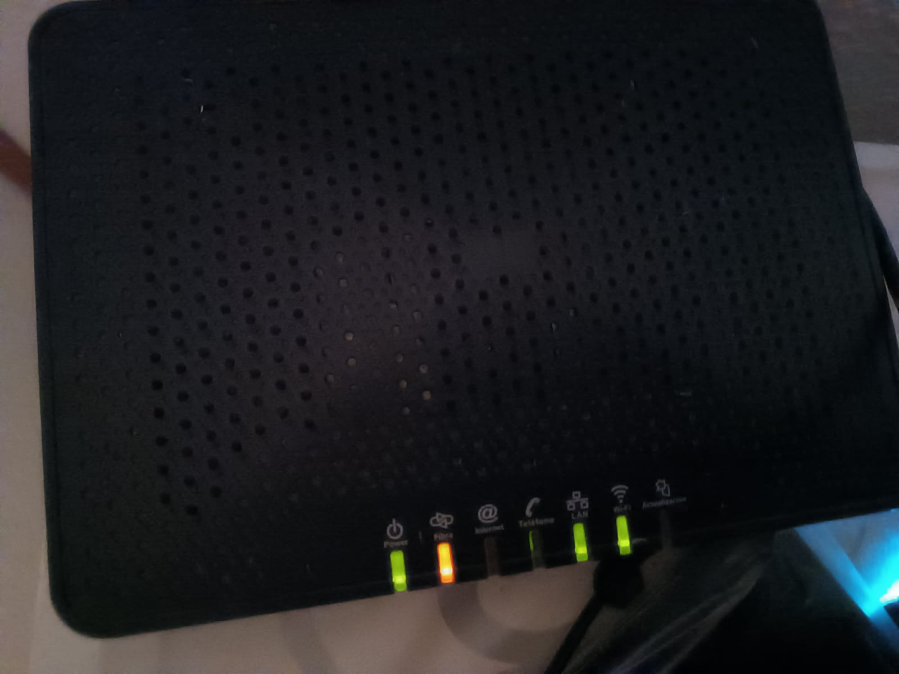

También he creado otro script para extraer la información del recurso `/cgi/cgi_authpage.js` de forma mas cómoda.
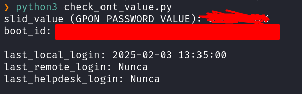

### ¿Y el impacto remoto?
Remotamente también tiene un impacto, pero obviamente reducido ya que depende de que un dispositivo de este tipo esté expuesto en Internet. Pero también hay que tener algo en cuenta...

Este modelo de router tiene una función llamada `acceso remoto al router`, que simplemente lo que hace es poder acceder de manera remota al panel de gestión del Router. Quise hacer una prueba pero tuve un pequeño inconveniente.
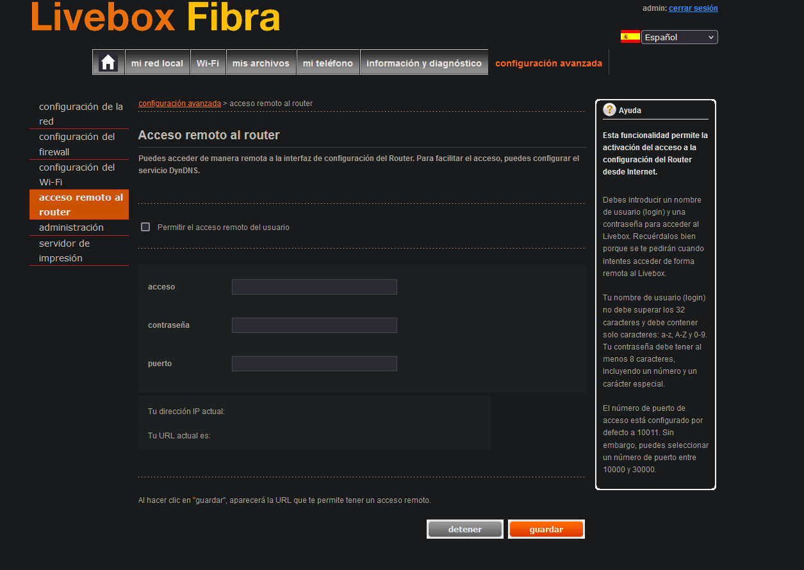

Al configurar todo, no pude acceder a mi router mediante Internet ya que tiene pinta de que estoy detrás de `CG-NAT` y necesitaría una IP pública exclusiva para mi para poder hacer esta prueba.
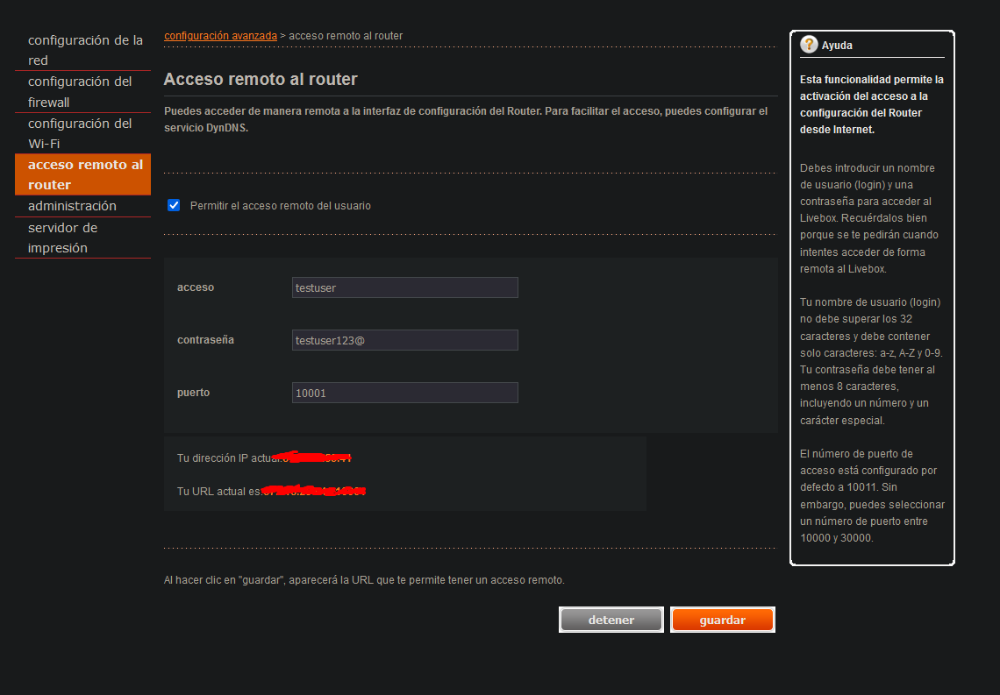

Por si alguno no sabe lo que es el `CG-NAT`, el **Carrier-Grade NAT (CG-NAT)** es una técnica utilizada por los proveedores de servicios de Internet (ISP) para **gestionar la escasez de direcciones IPv4**. En lugar de asignar una dirección IP pública única a cada cliente, el ISP usa una sola IP pública para múltiples usuarios, traduciendo sus direcciones privadas mediante NAT (Network Address Translation) a nivel de red del operador.

Me quedé un poco triste sin poder realizar esta prueba, pero quería seguir indagando y comprobar cuantos posibles dispositivos vulnerables están expuestos en Internet.

Para ello utilicé [ZoomEye](https://www.zoomeye.ai), es un **motor de búsqueda de dispositivos y servicios en Internet**, similar a Shodan o Censys.

Podemos hacer una pequeña búsqueda con unos filtros específicos y vemos varios dispositivos, no todos estos son vulnerables ya que algunos de estos dispositivos son de diferente modelo por lo cual tienen la ONT externa y no estoy seguro que pasaría si cambiamos la contraseña ONT en estos casos. Pero sorprendentemente vemos muchos dispositivos, mas de los que me esperaba.
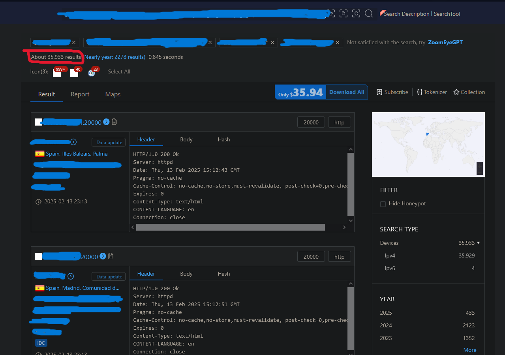

He censurado la consulta realizada pero cualquier persona puede hacerse la idea de como buscar y encontrar dispositivos de este tipo.

¿Ahora bien, estos dispositivos tienen el mismo error de seguridad?

Vamos a elegir una persona cualquiera que tenga este router expuesto en internet, **cabe recalcar que en ningún momento he parado el servicio de este cliente, solamente he demostrado que este cliente es vulnerable y un atacante podría dejarle sin servicio de Internet remotamente**
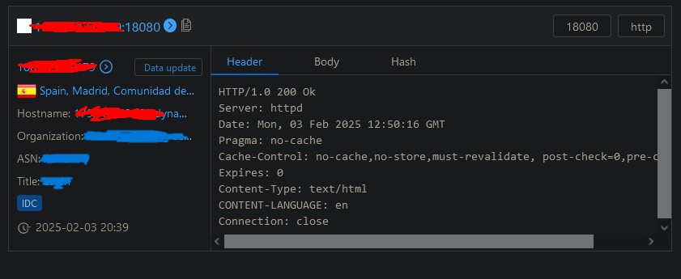

Podemos ver que este es el panel de autenticación del router remoto, ya que vemos que no es el recurso `/index.htm` si no `/indexRemoto.htm`, ahora necesitaríamos usuario y contraseña para obtener la contraseña ONT y obviamente deberíamos de necesitarlo para poder cambiarlo.
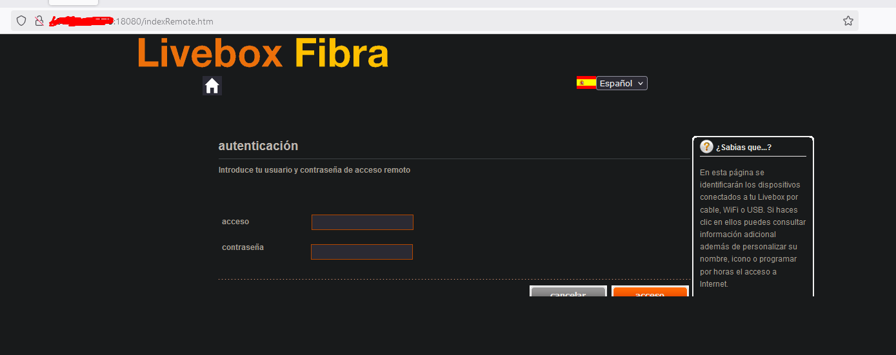

Pero podemos comprobar que el dispositivo es vulnerable y obtener su contraseña ONT sin autenticación.
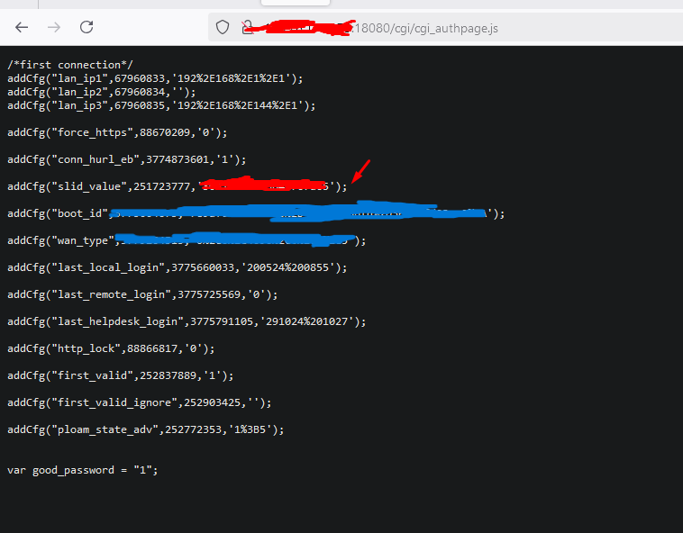

Además, lo preocupante es que también podemos llegar al recurso `/firstconnection.htm` en el router de este cliente por lo cual podríamos de forma remota dejarle sin servicio de Internet y su ISP se vería forzado a mandar a un técnico a no ser que el cliente sepa solucionar la incidencia por su cuenta.
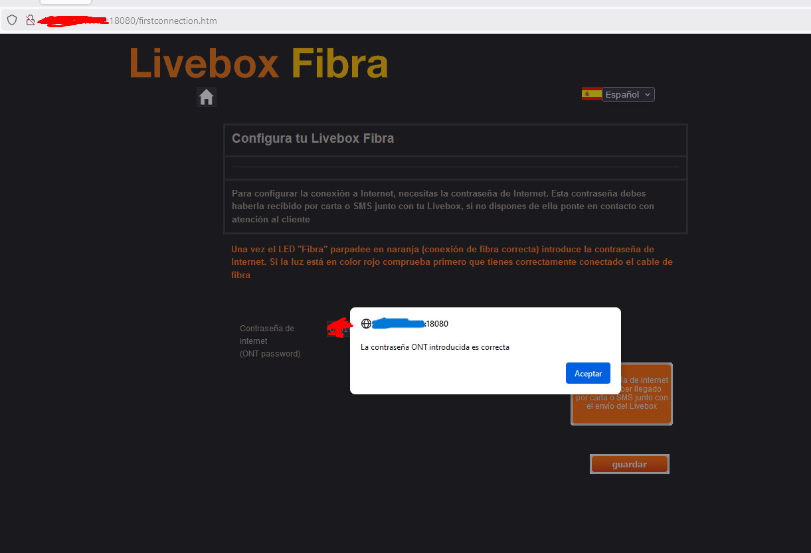

Podemos comprobar que las contraseñas ONT encontradas coindicen, revelando que es la contraseña ONT original del cliente.
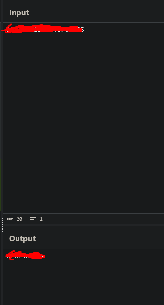

# Conclusiones finales
En resumen, la vulnerabilidad descubierta en el router relacionado con el acceso no autenticado al valor del enlace GPON tiene implicaciones serias para la seguridad de los usuarios. Permitir que un atacante obtenga y cambie este valor de forma remota puede interrumpir el servicio de Internet de los usuarios afectados, lo que podría generar una pérdida de conectividad y potencialmente afectar a la infraestructura de red. La exposición de los endpoints `/cgi/cgi_authpage.js` y `/firstconnection.cgi` demuestra que hay una falta de validación de autenticación adecuada en estos puntos de acceso, lo que facilita la explotación de la vulnerabilidad.

Además de las implicaciones técnicas y los riesgos asociados con la vulnerabilidad en sí, la conclusión más preocupante es la falta de compromiso por parte de las entidades responsables de los dispositivos afectados. A pesar de los esfuerzos por descubrir y documentar estas vulnerabilidades, el hecho de que no se haya priorizado una seguridad robusta en dispositivos de red tan fundamentales como routers, revela una negligencia alarmante en la implementación de prácticas de ciberseguridad adecuadas.

El CVE reportado es una llamada de atención para mejorar las medidas de seguridad en dispositivos de red y garantizar que los mecanismos de autenticación sean robustos para evitar accesos no deseados y el compromiso de los servicios.

Este artículo ha sido publicado sin maldad ninguna y con fines totalmente educativos, ser responsables.

# Referencias
[PoC en Github](https://github.com/pointedsec/CVE-2024-57725)
[NVD](https://nvd.nist.gov/vuln/detail/CVE-2024-57725)
[Vulnmon](https://www.cve.org/CVERecord?id=CVE-2024-57725)

Happy Hacking! 🚀